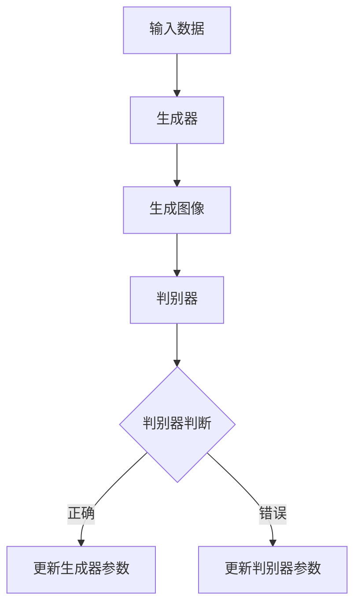
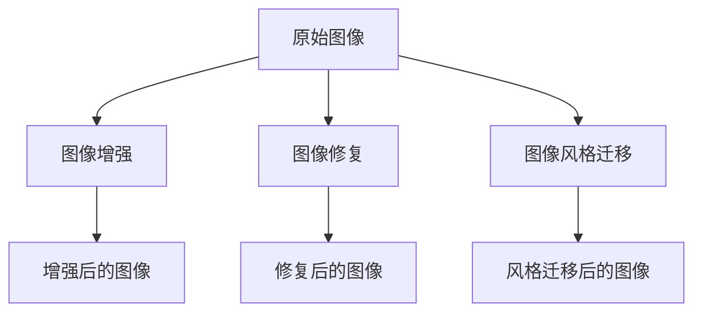
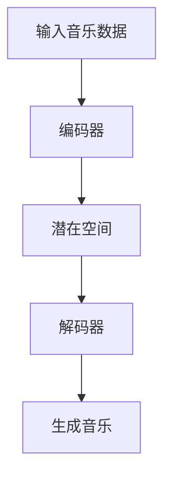
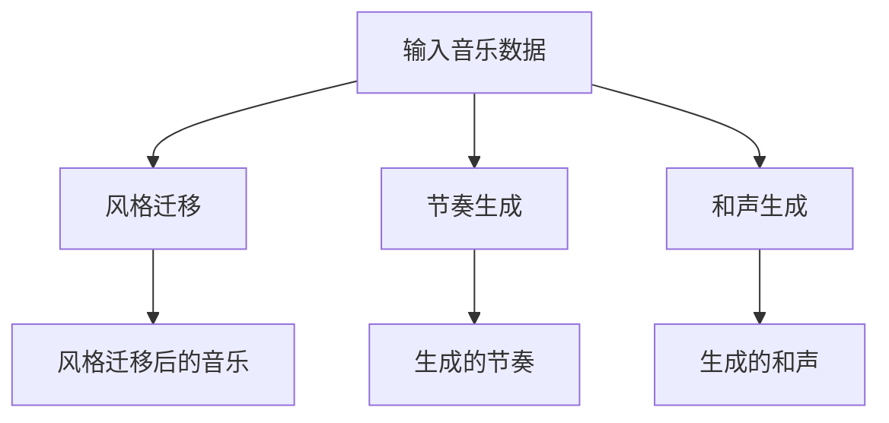
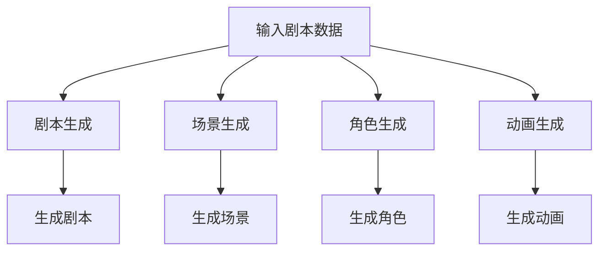
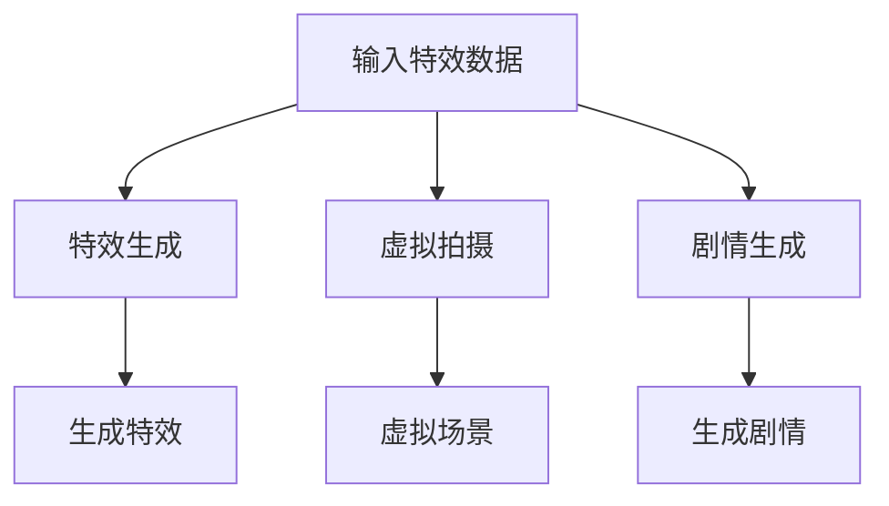
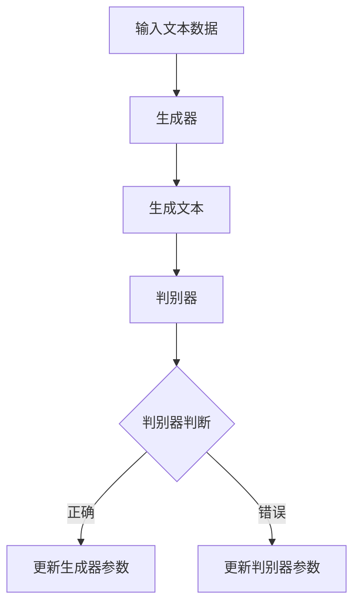
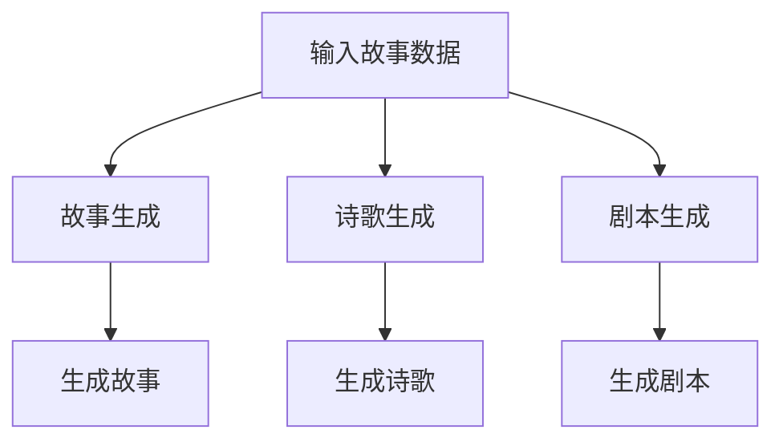

                 

## AIGC创意产业革新：思维链在艺术创作中的应用

> 关键词：AIGC、创意产业、思维链、艺术创作、技术革新

> 摘要：本文从AIGC技术的发展背景出发，探讨了其在创意产业中的应用，特别是在艺术创作领域的革新作用。通过介绍思维链原理，分析了其在艺术创作中的具体应用，对比了传统艺术创作方法，展示了AIGC技术的多领域实例。同时，本文还探讨了AIGC技术在实际案例中的应用效果，探讨了艺术创作中的伦理问题与法规，并对未来AIGC技术在艺术创作中的发展前景进行了展望。

### 第1章：AIGC与创意产业革新概述

#### 1.1 AIGC背景介绍

AIGC（Auto Generated Content）即自动生成内容，是人工智能技术的最新成果之一。它通过深度学习、自然语言处理、计算机视觉等技术，实现了文本、图像、音频等多媒体内容的自动生成。AIGC技术不仅提高了内容生成的效率，还开创了内容创作的新模式。

AIGC技术的发展历程可以追溯到20世纪末，随着计算机性能的提升和算法的进步，AIGC逐渐从实验室走向实际应用。特别是在近年来，随着深度学习技术的突破，AIGC在文本生成、图像生成、音频生成等领域取得了显著的进展。

#### 1.1.1 人工智能的发展历程

人工智能（AI）是一门研究、开发用于模拟、延伸和扩展人的智能的理论、方法、技术及应用系统的学科。人工智能的发展可以追溯到20世纪50年代，经过几十年的发展，人工智能已经从早期的符号逻辑推理，发展到今天的深度学习、自然语言处理、计算机视觉等领域。

#### 1.1.2 自动生成内容的兴起

自动生成内容（Auto Generated Content，简称AIGC）是人工智能技术的一个新兴领域。它通过机器学习、深度学习等技术，使得计算机能够自动生成高质量的内容。AIGC的应用场景非常广泛，包括但不限于文本生成、图像生成、音频生成、视频生成等。

#### 1.1.3 AIGC的概念与特点

AIGC，即自动生成内容，是指通过人工智能技术，如深度学习、自然语言处理、计算机视觉等，自动生成文本、图像、音频、视频等内容的系统或技术。AIGC的特点包括：

1. **高效性**：AIGC能够快速生成大量内容，大大提高了内容创作的效率。
2. **多样性**：AIGC能够生成各种类型的内容，如文本、图像、音频、视频等。
3. **个性化**：AIGC可以根据用户的需求和喜好，自动生成个性化内容。
4. **创新性**：AIGC能够创造出全新的内容形式，突破了传统内容创作的限制。

#### 1.2 创意产业革新的背景和意义

创意产业是指依靠创意人的创意思维、技能和天赋，借助高科技对文化资源、文化用品进行创造和提升，通过知识产权的开发和运用，生产出高附加值产品，具有创造财富和就业潜力的产业。创意产业涵盖了广告、建筑艺术、艺术和古董市场、手工艺、时尚设计、电影与录像、交互式互动软件、音乐、表演艺术、出版业、软件及计算机服务等多个领域。

#### 1.2.1 创意产业的重要性

创意产业在经济、文化、社会等多个方面具有重要意义。首先，创意产业是经济增长的重要动力。根据联合国贸发会议的数据，创意产业在全球GDP中的比重逐年增加，成为推动经济增长的重要力量。其次，创意产业是文化传承和创新的重要载体。通过创意产业的发展，可以推动传统文化的保护和创新，增强民族自信心和文化软实力。最后，创意产业是就业机会的重要来源。创意产业涉及多个领域，提供了大量就业机会，特别是为年轻人提供了广阔的发展空间。

#### 1.2.2 传统艺术创作的局限性

传统艺术创作方法在历史长河中发挥了重要作用，但其在现代社会的局限性也逐渐显现。首先，传统艺术创作依赖于艺术家的个人经验和技能，创作过程耗时耗力。其次，传统艺术创作形式相对单一，难以满足现代社会多样化、个性化的需求。最后，传统艺术创作在技术手段上存在一定的限制，难以应对快速变化的数字化时代。

#### 1.2.3 AIGC在创意产业革新中的角色

AIGC技术在创意产业中的角色主要体现在以下几个方面：

1. **提高创作效率**：通过自动化技术，AIGC可以大幅提高内容创作的效率，使得创作者能够更加专注于创意和构思。
2. **丰富创作形式**：AIGC能够生成多种类型的内容，如文本、图像、音频、视频等，丰富了艺术创作的形式。
3. **实现个性化定制**：AIGC可以根据用户的需求和喜好，自动生成个性化内容，满足个性化需求。
4. **促进跨界融合**：AIGC技术可以与其他领域的技术相结合，如虚拟现实、增强现实、区块链等，推动创意产业的跨界融合。

#### 1.3 AIGC与创意产业革新的关系

AIGC与创意产业革新之间的关系可以从以下几个方面进行探讨：

1. **技术推动**：AIGC技术的发展为创意产业带来了新的可能性，推动了创意产业的革新。
2. **需求驱动**：创意产业的需求为AIGC技术的发展提供了动力，推动了AIGC技术的创新和进步。
3. **互动发展**：AIGC技术与创意产业的互动发展，使得两者相互促进，共同推动了创意产业的革新。

#### 1.4 AIGC应用领域的展望

AIGC技术的应用领域非常广泛，以下是对其应用领域的一些展望：

1. **艺术创作**：AIGC技术在艺术创作中的应用前景广阔，可以生成个性化的艺术品，满足用户多样化的需求。
2. **设计**：AIGC技术可以应用于建筑设计、时尚设计等领域，提高设计的效率和创意性。
3. **娱乐产业**：AIGC技术在娱乐产业中的应用，如电影、音乐、游戏等，可以带来全新的体验。
4. **教育**：AIGC技术可以应用于教育领域，如智能教材、个性化教学等，提高教育的效果。

### 第2章：思维链原理与艺术创作中的应用

#### 2.1 思维链概念介绍

思维链是一种基于人工智能技术的思维模型，它通过模拟人类思维的运作方式，实现复杂问题的求解。思维链由多个思维单元组成，每个思维单元都承担特定的思维功能，如信息处理、逻辑推理、决策制定等。思维链的核心思想是“链式思维”，即通过一系列的思维活动，逐步深入地解决问题。

#### 2.1.1 思维链的定义

思维链是一种基于人工智能技术的思维模型，它通过模拟人类思维的运作方式，实现复杂问题的求解。思维链由多个思维单元组成，每个思维单元都承担特定的思维功能，如信息处理、逻辑推理、决策制定等。

#### 2.1.2 思维链的核心要素

思维链的核心要素包括思维单元、思维路径、思维规则和思维结果。思维单元是思维链的基本组成部分，负责执行特定的思维任务；思维路径是思维链的运行轨迹，决定了思维链的处理顺序；思维规则是思维链的运行规则，确保思维链的正确性和效率；思维结果是思维链的最终输出，反映了思维链的求解结果。

#### 2.1.3 思维链与传统思维方式的区别

思维链与传统思维方式存在显著的区别：

1. **自动化**：思维链是一种自动化思维模型，能够自动执行复杂的思维任务，而传统思维方式往往依赖于人工操作。
2. **智能化**：思维链基于人工智能技术，能够模拟人类思维，实现智能化的思维活动，而传统思维方式往往局限于固定的思维模式。
3. **高效性**：思维链能够高效地处理复杂问题，而传统思维方式在处理复杂问题时，往往需要大量的时间和人力。

#### 2.2 思维链在艺术创作中的具体应用

思维链在艺术创作中的具体应用主要体现在以下几个方面：

1. **创意生成**：思维链可以自动生成艺术创意，通过大量的数据分析和模式匹配，生成新颖的艺术作品。
2. **艺术构思**：思维链可以辅助艺术家进行艺术构思，提供多种可能的创作方向和方案。
3. **作品优化**：思维链可以对艺术作品进行优化，通过算法调整，提高艺术作品的质量和表现力。

#### 2.2.1 艺术创作的流程重构

思维链通过重构艺术创作的流程，使得艺术创作过程更加高效和智能化。传统的艺术创作流程往往包括构思、草图、修改、定稿等多个环节，而思维链可以将这些环节整合在一起，通过自动化和智能化的手段，实现快速迭代和优化。

#### 2.2.2 艺术创意的自动生成

艺术创意的自动生成是思维链在艺术创作中的一项重要应用。通过大量的数据分析和模式匹配，思维链可以生成新颖的艺术创意，为艺术家提供更多的创作灵感。艺术家可以根据这些创意进行进一步创作，或者对这些创意进行修改和优化，形成独特的艺术作品。

#### 2.2.3 艺术作品的个性化定制

个性化定制是现代社会的一个重要趋势，思维链在艺术创作中的应用，使得艺术作品的个性化定制成为可能。通过分析用户的需求和喜好，思维链可以生成个性化的艺术作品，满足用户的个性化需求。这种个性化定制不仅提高了艺术作品的价值，也为用户带来了独特的体验。

#### 2.3 思维链与传统艺术创作方法的对比

思维链与传统艺术创作方法在多个方面存在显著的区别：

1. **创作效率**：思维链能够大幅提高创作效率，通过自动化和智能化的手段，快速生成和优化艺术作品，而传统艺术创作方法往往需要大量的时间和人力。
2. **创作形式**：思维链能够生成多样化的艺术作品，满足个性化需求，而传统艺术创作方法形式相对单一，难以满足现代社会的多样化需求。
3. **创作过程**：思维链通过重构创作流程，实现快速迭代和优化，而传统艺术创作方法往往需要经过多个环节，耗时较长。

### 第3章：AIGC技术在艺术创作中的应用实例

#### 3.1 图像生成与编辑

图像生成与编辑是AIGC技术在艺术创作中的重要应用之一。通过深度学习技术，AIGC可以生成高质量、多样化的图像，满足艺术家和用户的需求。

#### 3.1.1 图像生成的技术原理

图像生成的基本原理是利用深度学习模型，如生成对抗网络（GAN）等，从大量的图像数据中学习图像的生成规律，然后根据这些规律生成新的图像。GAN由两个神经网络组成：生成器（Generator）和判别器（Discriminator）。生成器尝试生成逼真的图像，而判别器则尝试区分生成器生成的图像和真实的图像。通过不断地训练和优化，生成器可以生成越来越逼真的图像。

#### 3.1.2 图像编辑的自动化实现

图像编辑的自动化实现是AIGC技术在艺术创作中的另一个重要应用。通过深度学习技术，AIGC可以自动进行图像编辑，如图像增强、图像修复、图像风格迁移等。

图像增强是通过对图像进行滤波、锐化等处理，提高图像的清晰度和对比度，使得图像更易于观察和理解。图像修复是通过填充图像中的缺失部分，使得图像更加完整。图像风格迁移是通过将一种图像风格应用到另一种图像上，创造出全新的视觉效果。

#### 3.1.3 图像生成的实际应用案例

图像生成的实际应用案例包括数字艺术、游戏设计、电影制作等多个领域。例如，在数字艺术领域，AIGC可以生成独特的艺术作品，为艺术家提供创作灵感；在游戏设计领域，AIGC可以生成丰富的游戏场景和角色形象，提高游戏的可玩性和视觉效果；在电影制作领域，AIGC可以生成逼真的特效画面，提升电影的视觉质量。

#### 3.2 音乐创作

音乐创作是AIGC技术在艺术创作中的另一个重要应用。通过深度学习技术，AIGC可以自动生成音乐，满足音乐创作者和用户的需求。

#### 3.2.1 音乐生成的技术原理

音乐生成的基本原理是利用深度学习模型，如变分自编码器（VAE）和递归神经网络（RNN）等，从大量的音乐数据中学习音乐的生成规律，然后根据这些规律生成新的音乐。VAE通过编码和解码过程，将音乐数据转换为潜在空间，再从潜在空间中生成新的音乐。RNN通过记忆过去的信息，生成序列数据，如音乐。

#### 3.2.2 音乐创作的自动化实现

音乐创作的自动化实现包括音乐风格迁移、音乐节奏生成、音乐和声生成等。音乐风格迁移是通过将一种音乐风格应用到另一种音乐上，创造出新的音乐风格。音乐节奏生成是通过生成音乐的节奏模式，为音乐创作者提供创作灵感。音乐和声生成是通过生成音乐的和声部分，为音乐创作者提供和声方案。

#### 3.2.3 音乐创作的实际应用案例

音乐创作的实际应用案例包括音乐制作、虚拟乐队、音乐教育等多个领域。例如，在音乐制作领域，AIGC可以自动生成音乐，为音乐制作人提供创作灵感；在虚拟乐队领域，AIGC可以生成虚拟乐队，为用户带来全新的音乐体验；在音乐教育领域，AIGC可以生成个性化的音乐教学方案，提高音乐教育的效果。

#### 3.3 影视制作

影视制作是AIGC技术在艺术创作中的又一重要应用。通过深度学习技术，AIGC可以自动生成影视内容，提高影视制作的效率和质量。

#### 3.3.1 影视制作的自动化流程

影视制作的自动化流程包括剧本生成、场景生成、角色生成、动画生成等。剧本生成是通过自然语言处理技术，自动生成剧本内容。场景生成是通过图像生成技术，自动生成电影场景。角色生成是通过图像生成技术，自动生成电影角色。动画生成是通过动画技术，自动生成电影动画。

#### 3.3.2 影视制作的创新实践

影视制作的创新实践包括电影特效自动生成、虚拟拍摄、电影剧情自动生成等。电影特效自动生成是通过深度学习技术，自动生成电影特效画面。虚拟拍摄是通过虚拟现实技术，实现电影场景的虚拟拍摄。电影剧情自动生成是通过自然语言处理技术，自动生成电影剧情。

#### 3.3.3 影视制作的实际应用案例

影视制作的实际应用案例包括电影制作、电视剧制作、广告制作等多个领域。例如，在电影制作领域，AIGC可以自动生成电影特效，提高电影的视觉效果；在电视剧制作领域，AIGC可以自动生成电视剧剧情，提高电视剧的剧本质量；在广告制作领域，AIGC可以自动生成广告画面，提高广告的宣传效果。

#### 3.4 文学创作

文学创作是AIGC技术在艺术创作中的又一重要应用。通过深度学习技术，AIGC可以自动生成文学作品，满足文学创作者和用户的需求。

#### 3.4.1 文学生成的技术原理

文学生成的基本原理是利用深度学习模型，如循环神经网络（RNN）和生成对抗网络（GAN）等，从大量的文学作品数据中学习文学的生成规律，然后根据这些规律生成新的文学作品。RNN通过记忆过去的信息，生成序列数据，如文本。GAN通过生成器和判别器的对抗训练，生成高质量的文字。

#### 3.4.2 文学创作的自动化实现

文学创作的自动化实现包括故事生成、诗歌生成、剧本生成等。故事生成是通过自然语言处理技术，自动生成故事内容。诗歌生成是通过自然语言处理技术，自动生成诗歌。剧本生成是通过自然语言处理技术，自动生成剧本内容。

#### 3.4.3 文学创作的实际应用案例

文学创作的实际应用案例包括小说创作、诗歌创作、剧本创作等多个领域。例如，在小说创作领域，AIGC可以自动生成小说内容，为小说创作者提供创作灵感；在诗歌创作领域，AIGC可以自动生成诗歌，为诗人提供创作灵感；在剧本创作领域，AIGC可以自动生成剧本，提高剧本的创作质量。

### 第4章：AIGC技术在实际案例中的应用剖析

#### 4.1 案例一：数字艺术展览

数字艺术展览是AIGC技术在艺术领域的一个实际应用案例。通过AIGC技术，数字艺术展览能够为观众提供沉浸式的艺术体验。

#### 4.1.1 案例背景

随着数字技术的发展，数字艺术展览逐渐成为艺术展览的一种新形式。数字艺术展览通过虚拟现实（VR）和增强现实（AR）技术，将艺术作品以数字形式呈现，为观众带来全新的视觉体验。

#### 4.1.2 AIGC技术在展览中的应用

AIGC技术在数字艺术展览中的应用主要体现在以下几个方面：

1. **艺术作品生成**：通过AIGC技术，可以自动生成各种艺术作品，如抽象画、写实画、动画等，为展览提供丰富的艺术内容。
2. **交互体验设计**：通过AIGC技术，可以设计出丰富的交互体验，如观众可以通过触摸屏幕或移动设备与艺术作品进行互动，改变艺术作品的表现形式。
3. **展览内容优化**：通过AIGC技术，可以对展览内容进行实时优化，根据观众的行为和反馈，动态调整展览内容，提高观众的参观体验。

#### 4.1.3 案例效果分析

数字艺术展览通过AIGC技术的应用，取得了显著的效果。首先，AIGC技术为展览提供了丰富的艺术内容，使得展览更加丰富多彩。其次，AIGC技术设计的交互体验，增强了观众的参与感和互动性，提高了观众的参观兴趣。最后，AIGC技术能够实时优化展览内容，使得展览更加符合观众的需求，提高了展览的质量和效果。

#### 4.2 案例二：虚拟歌手

虚拟歌手是AIGC技术在音乐领域的一个实际应用案例。通过AIGC技术，虚拟歌手能够实现音乐表演，为观众带来全新的音乐体验。

#### 4.2.1 案例背景

虚拟歌手是指通过计算机技术和人工智能技术，创建的具有虚拟形象和声音的歌手。虚拟歌手在音乐表演、广告宣传、虚拟演唱会等领域有着广泛的应用。

#### 4.2.2 AIGC技术在虚拟歌手中的应用

AIGC技术在虚拟歌手中的应用主要体现在以下几个方面：

1. **形象生成**：通过AIGC技术，可以自动生成虚拟歌手的形象，包括外观、动作、表情等，使得虚拟歌手具有独特的个性和魅力。
2. **声音生成**：通过AIGC技术，可以自动生成虚拟歌手的声音，包括语音、歌声等，使得虚拟歌手能够实现音乐表演。
3. **交互体验**：通过AIGC技术，虚拟歌手可以与观众进行互动，如回答观众的问题、与观众进行对话等，提高观众的参与感和互动性。

#### 4.2.3 案例效果分析

虚拟歌手通过AIGC技术的应用，取得了显著的效果。首先，AIGC技术为虚拟歌手提供了丰富的形象和声音，使得虚拟歌手具有独特的个性和魅力，吸引了大量粉丝。其次，虚拟歌手与观众的互动，增强了观众的参与感和互动性，提高了观众的观看体验。最后，虚拟歌手在音乐表演方面，通过AIGC技术的应用，实现了音乐表演的多样化和个性化，为观众带来了全新的音乐体验。

#### 4.3 案例三：人工智能助手

人工智能助手是AIGC技术在日常生活领域的一个实际应用案例。通过AIGC技术，人工智能助手能够为用户提供个性化的服务，提高用户的生活质量。

#### 4.3.1 案例背景

随着人工智能技术的发展，人工智能助手在日常生活、工作、学习等领域有着广泛的应用。人工智能助手可以通过语音、文字等方式与用户进行交互，为用户提供各种服务，如语音助手、智能家居、在线客服等。

#### 4.3.2 AIGC技术在人工智能助手中的应用

AIGC技术在人工智能助手中的应用主要体现在以下几个方面：

1. **自然语言处理**：通过AIGC技术，可以实现自然语言处理，使得人工智能助手能够理解用户的语音或文字指令，并提供相应的服务。
2. **个性化推荐**：通过AIGC技术，可以分析用户的行为和偏好，为用户提供个性化的推荐服务，如音乐推荐、电影推荐、购物推荐等。
3. **智能对话**：通过AIGC技术，可以实现智能对话，使得人工智能助手能够与用户进行自然、流畅的对话，提高用户的交互体验。

#### 4.3.3 案例效果分析

人工智能助手通过AIGC技术的应用，取得了显著的效果。首先，AIGC技术使得人工智能助手能够理解用户的语音或文字指令，提高了助手的服务能力。其次，AIGC技术使得人工智能助手能够分析用户的行为和偏好，提供个性化的推荐服务，提高了用户的使用体验。最后，AIGC技术实现了智能对话，使得人工智能助手能够与用户进行自然、流畅的对话，提高了用户的交互体验。

### 第5章：艺术创作中的伦理问题与法规探讨

#### 5.1 AIGC技术带来的伦理挑战

AIGC技术在艺术创作中的应用，虽然带来了诸多便利和创新，但同时也带来了一系列伦理问题。首先，AIGC技术使得艺术作品的创作变得更加容易，这可能导致艺术创作门槛的降低，从而影响艺术创作的质量。其次，AIGC技术可能使得艺术创作过程中的人为干预减少，导致艺术作品的原创性和独特性受到质疑。此外，AIGC技术在艺术创作中的应用，也可能导致艺术创作者的工作岗位被自动化技术取代，影响艺术创作者的生计。

#### 5.2 艺术创作的版权问题

艺术创作的版权问题是AIGC技术在艺术创作中面临的一个重要伦理问题。AIGC技术可以自动生成大量的艺术作品，这些作品是否属于原创作品，如何保护这些作品的版权，成为了一个亟待解决的问题。首先，对于AIGC自动生成的艺术作品，是否属于原创作品，需要从法律角度进行明确。其次，对于AIGC自动生成的艺术作品，如何进行版权登记和保护，也需要进行深入研究。

#### 5.3 相关法规与政策分析

为了应对AIGC技术在艺术创作中带来的伦理问题和版权问题，各国政府和国际组织纷纷出台了一系列法规和政策。例如，欧盟在2019年通过了《版权指令》，要求在线平台对自动生成的艺术作品进行版权保护。中国政府也在近年来加大了对知识产权保护的力度，出台了一系列法规和政策，以保护艺术创作者的合法权益。

#### 5.4 艺术创作中的伦理问题与法规探讨

在艺术创作中，AIGC技术的应用带来了许多新的伦理问题和法规挑战。首先，关于AIGC自动生成的艺术作品的原创性和版权问题，需要从法律和伦理角度进行深入探讨。其次，关于AIGC技术在艺术创作中的应用，如何保护艺术创作者的合法权益，也需要进行政策层面的研究和制定。此外，关于AIGC技术在艺术创作中的应用，如何确保艺术创作的质量和艺术价值，也需要进行深入研究和探讨。

### 第6章：AIGC技术在未来艺术创作中的发展前景

#### 6.1 技术趋势分析

随着人工智能技术的不断发展，AIGC技术在未来艺术创作中的应用前景非常广阔。首先，随着计算能力的提升和算法的优化，AIGC技术的生成速度和生成质量将不断提高。其次，随着数据量的不断增加，AIGC技术将能够更好地理解和模拟人类的艺术创作过程。此外，随着物联网、虚拟现实、增强现实等技术的不断发展，AIGC技术将在艺术创作中发挥更大的作用。

#### 6.2 艺术创作的新形式

AIGC技术的应用将带来艺术创作的新形式。首先，通过AIGC技术，艺术家可以更加自由地表达自己的创意和想法，创造出前所未有的艺术作品。其次，AIGC技术将使得艺术创作更加个性化，满足用户多样化的需求。此外，AIGC技术还将使得艺术创作与科学、技术、文化等领域的融合更加紧密，创造出新的艺术形式和艺术风格。

#### 6.3 跨界合作的可能性

AIGC技术的应用，不仅推动了艺术创作的革新，也为艺术创作与其他领域的跨界合作提供了可能性。例如，艺术创作与科技、设计、娱乐等领域的跨界合作，将创造出新的艺术形式和艺术作品。此外，AIGC技术还将推动艺术创作与教育、医疗、环保等领域的融合，为这些领域带来新的解决方案。

### 第7章：总结与展望

#### 7.1 AIGC技术对艺术创作的影响

AIGC技术对艺术创作的影响主要体现在以下几个方面：

1. **提高创作效率**：AIGC技术可以大幅提高艺术创作的效率，使得艺术家能够更加专注于创意和构思。
2. **丰富创作形式**：AIGC技术可以生成多种类型的艺术作品，满足艺术家和用户多样化的需求。
3. **实现个性化定制**：AIGC技术可以根据用户的需求和喜好，自动生成个性化艺术作品，提高用户的满意度。

#### 7.2 未来研究方向

在未来，AIGC技术在艺术创作中的应用将不断深入和发展。首先，需要进一步研究如何提高AIGC技术的生成速度和生成质量，以满足艺术创作的高效性需求。其次，需要研究如何确保AIGC自动生成的艺术作品的原创性和独特性，保护艺术创作者的合法权益。此外，还需要研究AIGC技术在不同艺术领域的应用，推动艺术创作与科学、技术、文化等领域的融合。

#### 7.3 读者建议与反馈

对于读者来说，本文提供了AIGC技术在艺术创作中的应用全景，从技术原理到实际案例，再到伦理问题和未来展望，希望读者能够对AIGC技术在艺术创作中的应用有更深入的理解。同时，欢迎读者对本文的内容和观点提出意见和建议，共同探讨AIGC技术在艺术创作中的未来发展方向。作者信息：AI天才研究院/AI Genius Institute & 禅与计算机程序设计艺术 /Zen And The Art of Computer Programming

