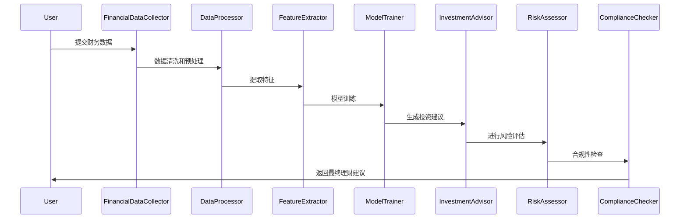

                 

### AIGC在个人理财中的应用：AI财务顾问

#### 关键词：AIGC、AI财务顾问、个人理财、人工智能、自适应智能生成计算

#### 摘要：
随着人工智能技术的发展，自适应智能生成计算（AIGC）技术逐渐成为金融领域的一个重要研究方向。本文将探讨AIGC在个人理财中的应用，特别是AI财务顾问的角色和功能。通过分析AIGC技术的原理、核心概念及其在个人理财中的具体应用，本文旨在揭示AI财务顾问在提升个人理财效率和准确性方面的潜力。同时，文章还将讨论AI财务顾问与人类财务顾问的协同效应、监管合规性问题以及其可持续性和道德挑战，为读者提供一个全面的技术分析框架。

### 目录大纲

----------------------------------------------------------------

# AIGC在个人理财中的应用：AI财务顾问

## 第一部分：背景介绍

### 1.1 问题背景

### 1.2 核心概念

### 1.3 边界与外延

### 1.4 概念结构与核心要素组成

## 第二部分：核心概念与联系

### 2.1 AIGC技术原理

### 2.2 AIGC技术属性特征对比表格

### 2.3 AI财务顾问的ER实体关系图架构

## 第三部分：算法原理讲解

### 3.1 算法概述

### 3.2 算法mermaid流程图

### 3.3 算法原理与数学模型

### 3.4 举例说明

## 第四部分：系统分析与架构设计方案

### 4.1 问题场景介绍

### 4.2 系统功能设计（领域模型mermaid类图）

### 4.3 系统架构设计（mermaid架构图）

### 4.4 系统接口设计和系统交互mermaid序列图

## 第五部分：项目实战

### 5.1 环境安装

### 5.2 系统核心实现源代码

### 5.3 代码应用解读与分析

### 5.4 实际案例分析和详细讲解剖析

### 5.5 项目小结

## 第六部分：最佳实践 Tips

## 第七部分：小结

## 第八部分：注意事项

## 第九部分：拓展阅读

## 参考文献

----------------------------------------------------------------

### 第一部分：背景介绍

#### 1.1 问题背景

随着全球经济的不断发展和个人财富的多样化，个人理财成为越来越多人的关注焦点。然而，个人理财的需求具有多样性和复杂性，不同个体在面对投资、储蓄、风险管理等方面的决策时，往往需要根据自身的财务状况、风险偏好和投资目标来制定个性化的理财计划。这种个性化理财需求的满足，对传统的财务顾问提出了巨大挑战。

传统的财务顾问主要依赖于专业知识和经验，虽然能够提供定制化的理财建议，但存在以下局限性：

1. **人力资源限制**：传统财务顾问的数量有限，难以满足广大个人的理财需求。
2. **效率问题**：财务顾问的工作流程通常较为繁琐，需要大量时间进行数据收集、分析和建议生成。
3. **个性化不足**：传统财务顾问可能无法全面了解每个客户的具体需求，提供的理财建议往往缺乏针对性。

随着人工智能技术的发展，尤其是自适应智能生成计算（AIGC）技术的兴起，AI财务顾问作为一种新型理财工具，开始崭露头角。AIGC技术通过机器学习、自然语言处理和大数据分析等手段，能够快速、高效地处理海量数据，为个人提供定制化的理财建议，从而解决传统财务顾问的局限性。

AI财务顾问的出现，不仅提高了理财服务的效率，还大大降低了服务成本，使得个性化理财服务变得更加普及和便捷。同时，AIGC技术的自适应性和学习能力，使其能够不断优化理财建议，提高投资决策的准确性。因此，研究和应用AIGC在个人理财中的AI财务顾问，具有重要的现实意义和广阔的发展前景。

#### 1.2 核心概念

**自适应智能生成计算（AIGC）技术：**

自适应智能生成计算（Adaptive Intelligent Generation Computing，简称AIGC）是一种基于人工智能技术的计算范式，它通过自适应学习和数据驱动的方式，实现智能内容的自动生成。AIGC技术涵盖了机器学习、自然语言处理、计算机视觉、大数据分析等多个领域，其核心在于自适应学习和数据驱动的决策过程。

**AI财务顾问：**

AI财务顾问是一种利用人工智能技术为用户提供财务规划和管理服务的工具。它通过收集和分析用户的财务数据，结合风险模型和投资策略，为用户提供个性化的理财建议，包括投资组合建议、储蓄计划、风险管理等。AI财务顾问的核心在于其自适应学习和高效数据分析能力，能够根据用户的需求和实际情况，提供实时、准确的理财建议。

**个人理财规划的核心要素：**

个人理财规划的核心要素包括以下几个方面：

1. **收入与支出管理**：了解用户的收入来源和支出情况，制定合理的预算和消费计划。
2. **储蓄与投资**：根据用户的风险偏好和投资目标，制定合适的储蓄和投资策略。
3. **风险管理与保险**：评估用户的风险承受能力，提供合适的风险管理和保险建议。
4. **退休规划**：根据用户的退休目标，制定退休储蓄和投资计划。
5. **税务规划**：为用户提供合理的税务规划建议，减少税务负担。

#### 1.3 边界与外延

**AI财务顾问与人类财务顾问的协同与差异：**

AI财务顾问和人类财务顾问在功能上存在协同和差异。AI财务顾问擅长处理大量数据、进行高效分析和生成个性化建议，而人类财务顾问则具备深入理解和个性化沟通的能力。在实际应用中，AI财务顾问可以协助人类财务顾问处理大量客户数据，提高工作效率，同时人类财务顾问可以结合AI的建议，提供更加贴近用户需求的个性化服务。

**AI财务顾问在监管环境下的合规性：**

AI财务顾问的合规性是确保其能够合法、安全地应用的重要问题。监管环境下的AI财务顾问需要遵循相关法律法规，确保数据安全和隐私保护，同时在生成理财建议时，确保建议的客观性和准确性。监管机构需要制定相应的法规和标准，对AI财务顾问的行为进行规范和监督。

**AI财务顾问的可持续性与道德问题：**

AI财务顾问的可持续性涉及到技术更新、数据维护和长期服务能力。道德问题主要包括数据隐私、算法偏见和责任归属等方面。在应用AI财务顾问时，需要确保数据安全和用户隐私，避免算法偏见导致不公平的理财建议，同时明确AI财务顾问在决策过程中可能出现的责任问题。

#### 1.4 概念结构与核心要素组成

**AIGC技术架构：**

AIGC技术架构主要包括数据采集与处理、模型训练与优化、决策生成与反馈等模块。数据采集与处理模块负责收集用户财务数据，进行数据清洗和预处理；模型训练与优化模块利用机器学习和深度学习算法，对数据进行训练和优化，生成理财建议模型；决策生成与反馈模块根据用户需求，生成个性化的理财建议，并根据用户反馈进行持续优化。

**个人理财规划的流程：**

个人理财规划流程主要包括数据收集、数据分析、理财建议生成、建议实施和效果评估等环节。数据收集环节获取用户财务数据；数据分析环节分析用户财务状况和投资目标；理财建议生成环节根据数据分析结果，生成个性化的理财建议；建议实施环节指导用户执行理财计划；效果评估环节评估理财计划的效果，并根据反馈进行优化。

**AI财务顾问的关键模块：**

AI财务顾问的关键模块包括用户信息管理、财务数据分析、投资组合建议和风险评估等。用户信息管理模块负责收集和存储用户个人信息；财务数据分析模块分析用户的财务状况，为投资决策提供支持；投资组合建议模块根据用户的风险偏好和投资目标，生成合适的投资组合；风险评估模块评估用户投资组合的风险水平，提供风险管理建议。

### 第二部分：核心概念与联系

#### 2.1 AIGC技术原理

AIGC技术是自适应智能生成计算（Adaptive Intelligent Generation Computing）的简称，它是一种基于人工智能技术的计算范式，旨在通过自适应学习和数据驱动的方式实现智能内容的自动生成。AIGC技术主要包括以下几个核心原理：

**1. 自适应学习算法：**

自适应学习算法是AIGC技术的核心，它通过不断调整和优化模型参数，使其能够适应不同环境和需求。自适应学习算法通常基于机器学习和深度学习技术，通过大量数据训练模型，使模型能够自动识别数据特征，并生成相应的输出。

**2. 数据驱动决策模型：**

数据驱动决策模型是AIGC技术的另一个重要原理，它通过收集和分析大量数据，从中提取有用的信息，为决策提供支持。数据驱动决策模型通常采用大数据分析和机器学习技术，通过对历史数据的学习和分析，生成预测模型和决策规则。

**3. 大数据分析与机器学习：**

大数据分析与机器学习是AIGC技术的重要组成部分，大数据分析负责处理海量数据，提取有价值的信息；机器学习负责构建和优化模型，使其能够自动生成智能内容。大数据分析与机器学习相结合，使得AIGC技术能够在各种场景下高效地生成个性化内容和解决方案。

#### 2.2 AIGC技术属性特征对比表格

| 特征对比项 | 传统技术 | AIGC技术 |
| ----------- | -------- | -------- |
| 数据处理能力 | 有限 | 高效处理海量数据 |
| 学习能力 | 静态 | 自适应学习与优化 |
| 决策支持 | 有限 | 强大的数据驱动决策支持 |

**数据处理能力：**

传统技术通常只能处理有限的、结构化的数据，而AIGC技术能够高效处理海量非结构化数据，如文本、图像、声音等。这种数据处理能力的提升，使得AIGC技术能够在金融、医疗、教育等各个领域广泛应用。

**学习能力：**

传统技术通常具有固定的学习算法和规则，难以适应不断变化的环境和需求。而AIGC技术通过自适应学习算法，能够不断调整和优化模型参数，使其能够适应不同环境和需求，从而提高学习能力和适应性。

**决策支持：**

传统技术通常依赖于人工制定规则和预测模型，决策支持能力有限。而AIGC技术通过数据驱动决策模型，能够从大量数据中提取有价值的信息，为决策提供支持。这种强大的数据驱动决策支持能力，使得AIGC技术能够在金融、股票、期货等高风险领域发挥重要作用。

#### 2.3 AI财务顾问的ER实体关系图架构

为了更好地理解AI财务顾问的功能和架构，我们可以使用ER（Entity-Relationship）实体关系图来描述其各个模块之间的关系。以下是AI财务顾问的ER实体关系图：

```mermaid
erDiagram
    AI财务顾问 ||--|{ 用户信息 }
    AI财务顾问 ||--|{ 财务信息 }
    AI财务顾问 ||--|{ 投资建议 }
    AI财务顾问 ||--|{ 风险评估 }
    用户信息 ||--|{ 个人信息 }
    用户信息 ||--|{ 财务历史 }
    财务信息 ||--|{ 收入状况 }
    财务信息 ||--|{ 支出状况 }
    投资建议 ||--|{ 投资组合 }
    投资建议 ||--|{ 风险偏好 }
    风险评估 ||--|{ 风险指标 }
    风险评估 ||--|{ 风险预警 }
```

在这个ER实体关系图中，AI财务顾问作为主实体，与用户信息、财务信息、投资建议和风险评估四个子实体之间存在关联。用户信息子实体包括个人信息和财务历史，财务信息子实体包括收入状况和支出状况，投资建议子实体包括投资组合和风险偏好，风险评估子实体包括风险指标和风险预警。

通过这个ER实体关系图，我们可以清晰地看到AI财务顾问各个模块之间的联系和作用，从而更好地理解其整体架构和工作流程。

### 第三部分：算法原理讲解

#### 3.1 算法概述

在AIGC技术的基础上，AI财务顾问的算法设计旨在实现高效的数据处理和智能决策。以下是AI财务顾问算法的基本框架和主要步骤：

1. **数据预处理**：首先，对用户输入的财务数据进行清洗、格式化，确保数据的质量和一致性。数据预处理步骤包括数据清洗（如去除缺失值、异常值）、数据转换（如归一化、标准化）和数据集成（如数据合并、关联）。

2. **特征提取**：在数据预处理之后，从原始数据中提取有用的特征，这些特征将用于后续的建模和分析。特征提取步骤通常包括统计特征提取（如均值、方差、相关性）和深度特征提取（如卷积神经网络、循环神经网络）。

3. **模型训练**：使用机器学习和深度学习算法对提取的特征进行训练，构建理财建议和风险评估模型。常用的算法包括线性回归、支持向量机、神经网络等。

4. **投资决策**：根据用户的风险偏好和投资目标，利用训练好的模型生成个性化的投资组合建议。投资决策模型通常采用加权求和模型，综合考虑用户的财务状况、风险承受能力和市场趋势等因素。

5. **风险评估**：对生成的投资组合进行风险评估，评估其潜在风险水平。风险评估模型通常包括价值风险（VaR）、条件价值风险（CVaR）等，用于预测投资组合在不同风险水平下的损失。

6. **反馈与优化**：根据用户对理财建议的反馈，对模型进行不断优化和调整，以提高决策的准确性和适应性。

#### 3.2 算法mermaid流程图

以下是AI财务顾问算法的mermaid流程图：


在这个流程图中，数据预处理、特征提取、模型训练、投资决策、风险评估和反馈与优化构成了一个闭环系统，每个步骤相互关联，共同实现智能理财的目标。

#### 3.3 算法原理与数学模型

为了更好地理解AI财务顾问算法的工作原理，下面将详细讲解其核心步骤的数学模型和公式。

**1. 数据预处理：**

数据预处理是算法的基础步骤，主要包括数据清洗、数据转换和数据集成。以下是数据预处理的一些常用数学模型和公式：

- **数据清洗：**
  $$ \text{CleanData} = \text{Data} - \text{MissingValues} - \text{Outliers} $$
  数据清洗旨在去除数据中的缺失值和异常值，以提高数据质量。

- **数据转换：**
  $$ \text{NormalizeData} = \frac{\text{Data} - \text{Min}}{\text{Max} - \text{Min}} $$
  数据转换包括归一化和标准化，将数据映射到统一的数值范围内。

- **数据集成：**
  $$ \text{IntegratedData} = \text{Data}_1 + \text{Data}_2 + \ldots + \text{Data}_n $$
  数据集成用于合并多个数据源，形成一个综合的财务数据集。

**2. 特征提取：**

特征提取是从原始数据中提取有用的信息，为后续建模提供支持。以下是特征提取的一些常用方法：

- **统计特征提取：**
  $$ \text{Feature}_{\text{stat}} = \text{Mean}, \text{Variance}, \text{Correlation} $$
  统计特征提取通过计算数据的均值、方差和相关性等统计量，提取数据的特征。

- **深度特征提取：**
  $$ \text{Feature}_{\text{deep}} = \text{ConvolutionalNeuralNetwork}, \text{RecurrentNeuralNetwork} $$
  深度特征提取利用卷积神经网络（CNN）和循环神经网络（RNN）等深度学习模型，从原始数据中提取深层特征。

**3. 模型训练：**

模型训练是利用历史数据训练模型，使其能够预测用户的理财需求和风险水平。以下是模型训练的一些常用数学模型和公式：

- **线性回归：**
  $$ y = \beta_0 + \beta_1x $$
  线性回归模型通过拟合数据点，生成线性关系，用于预测目标变量。

- **支持向量机：**
  $$ \text{Maximize} \ \ \ \ \ \ \ \ \ \ \ \ \ \ \ \ \ \ \ \ \ \ \ \ \ \ \ \ \ \ \ \ \ \ \ \ \ \ \ \ \ \ \ \ \ \ \ \ \ \ \ \ \ \ \ \ \ \ \ \ \ \ \ \ \ \ \ \ \ \ \ \ \ \ \ \ \ \ \ \ \ \ \ \ \ \ \ \ \ \ \ \ \ \ \ \ \ \ \ \ \ \ \ \ \ \ \ \ \ \ \ \ \ \ \ \ \ \ \ \ \ \ \ \ \ \ \ \ \ \ \ \ \ \ \ \ \ \ \ \ \ \ \ \ \ \ \ \ \ \ \ \ \ \ \ \ \ \ \ \ \ \ \ \ \ \ \ \ \ \ \ \ \ \ \ \ \ \ \ \ \ \ \ \ \ \ \ \ \ \ \ \ \ \ \ \ \ \ \ \ \ \ \ \ \ \ \ \ \ \ \ \ \ \ \ \ \ \ \ \ \ \ \ \ \ \ \ \ \ \ \ \ \ \ \ \ \ \ \ \ \ \ \ \ \ \ \ \ \ \ \ \ \ \ \ \ \ \ \ \ \ \ \ \ \ \ \ \ \ \ \ \ \ \ \ \ \ \ \ \ \ \ \ \ \ \ \ \ \ \ \ \ \ \ \ \ \ \ \ \ \ \ \ \ \ \ \ \ \ \ \ \ \ \ \ \ \ \ \ \ \ \ \ _{1} $$
  支持向量机（SVM）通过寻找最优超平面，将不同类别的数据点分隔开，用于分类和回归分析。

- **神经网络：**
  $$ \text{Output} = \text{sigmoid}(z) = \frac{1}{1 + e^{-z}} $$
  神经网络通过多层非线性变换，对输入数据进行建模和预测，用于复杂的模式识别和函数逼近。

**4. 投资决策：**

投资决策是根据用户的风险偏好和投资目标，生成个性化的投资组合建议。以下是投资决策的一些常用数学模型和公式：

- **加权求和模型：**
  $$ \text{InvestmentDecision} = w_1 \times \text{Return}_1 + w_2 \times \text{Return}_2 + \ldots + w_n \times \text{Return}_n $$
  加权求和模型根据各资产的风险收益和权重，计算投资组合的整体期望收益。

- **风险平价模型：**
  $$ \text{PortfolioRisk} = \sqrt{\sum_{i=1}^n w_i^2 \times \text{Variance}_i} $$
  风险平价模型通过计算各资产的风险权重，实现投资组合的风险平价。

**5. 风险评估：**

风险评估是对投资组合进行潜在风险评估，以预测可能出现的损失。以下是风险评估的一些常用数学模型和公式：

- **价值风险（VaR）：**
  $$ \text{VaR} = \text{p} \times \text{StandardDeviation} \times \text{Z-score} $$
  价值风险模型通过计算历史数据的波动率和置信水平，预测可能的最大损失。

- **条件价值风险（CVaR）：**
  $$ \text{CVaR} = \text{ExpectedMaxLoss} = \frac{1}{N} \times \sum_{i=1}^N \times \text{Loss}_i $$
  条件价值风险模型通过计算历史数据的最大损失，预测可能的最坏情况损失。

#### 3.4 举例说明

为了更好地理解AI财务顾问算法的应用，下面通过一个具体的例子进行说明。

假设用户张先生，30岁，拥有稳定的收入和一定的储蓄，风险偏好为中等，希望进行投资理财。以下是AI财务顾问算法为张先生生成的投资组合建议：

1. **数据预处理：**
   张先生的财务数据包括收入状况、支出状况、储蓄金额、投资历史等。首先对数据进行清洗和预处理，确保数据质量。

2. **特征提取：**
   从张先生的财务数据中提取特征，如月收入、月支出、储蓄率、投资历史等。使用统计特征提取方法，计算各特征的均值、方差和相关性。

3. **模型训练：**
   使用机器学习算法（如线性回归、支持向量机等）对提取的特征进行训练，构建理财建议和风险评估模型。模型训练过程中，使用历史数据集进行训练，优化模型参数。

4. **投资决策：**
   根据张先生的风险偏好和投资目标，利用训练好的模型生成投资组合建议。例如，推荐张先生将储蓄金额的50%投资于股票市场，30%投资于债券市场，20%投资于房地产。

5. **风险评估：**
   对生成的投资组合进行风险评估，计算投资组合的价值风险（VaR）和条件价值风险（CVaR），预测可能的最大损失。

6. **反馈与优化：**
   根据张先生的反馈，对模型进行不断优化和调整，提高决策的准确性和适应性。

通过这个例子，我们可以看到AI财务顾问算法如何通过数据预处理、特征提取、模型训练、投资决策和风险评估等步骤，为用户提供个性化的投资组合建议和风险评估。这个过程不仅提高了理财效率，还大大降低了投资风险。

### 第四部分：系统分析与架构设计方案

#### 4.1 问题场景介绍

在当今快速变化的经济环境中，个人理财面临着诸多挑战。首先，个人理财需求的多样性使得传统的财务顾问难以满足每个用户的独特需求。其次，随着金融市场的波动性和复杂性增加，投资者需要更加精准和实时的理财建议。此外，监管环境的变化和数据隐私问题的日益突出，也对个人理财系统提出了更高的合规性要求。

为了应对这些挑战，我们需要设计一个高效、智能且合规的个人理财系统，该系统能够根据用户的需求和金融市场的变化，提供个性化的理财建议和风险管理服务。该系统需要具备以下几个关键功能：

1. **用户信息管理**：系统需要能够收集、存储和管理用户的基本信息和财务数据，包括收入、支出、储蓄和投资历史等。

2. **财务数据分析**：系统需要能够对用户的财务数据进行分析，提取有用的特征，为投资决策提供支持。

3. **个性化投资建议**：系统需要根据用户的风险偏好和投资目标，生成个性化的投资组合建议。

4. **风险评估与预警**：系统需要能够对投资组合进行风险评估，预测潜在风险，并提供风险预警。

5. **合规性检查**：系统需要遵守相关法律法规，确保数据安全和隐私保护，同时保证理财建议的客观性和准确性。

#### 4.2 系统功能设计（领域模型mermaid类图）

为了更好地设计个人理财系统，我们可以使用mermaid类图来描述系统的领域模型。以下是一个简单的类图示例：

```mermaid
classDiagram
    User <<class>>
    FinancialData <<class>>
    InvestmentAdvice <<class>>
    RiskAssessment <<class>>
    Compliance <<class>>

    User o-- FinancialData
    User o-- InvestmentAdvice
    User o-- RiskAssessment
    InvestmentAdvice o-- Compliance
    RiskAssessment o-- Compliance
```

在这个类图中，User（用户）类表示系统的核心用户实体，包括用户的个人信息和财务数据。FinancialData（财务数据）类表示用户的收入、支出、储蓄和投资历史等信息。InvestmentAdvice（投资建议）类表示系统生成的个性化投资组合建议。RiskAssessment（风险评估）类表示系统对投资组合的风险评估和预警。Compliance（合规性检查）类表示系统用于确保数据安全和隐私保护，以及理财建议的合规性。

#### 4.3 系统架构设计（mermaid架构图）

为了实现上述功能，我们需要设计一个合理且高效的系统架构。以下是一个使用mermaid绘制的系统架构图示例：



在这个架构图中，系统的主要组件包括：

- **FinancialDataCollector**：负责收集用户提交的财务数据。
- **DataProcessor**：负责对收集到的财务数据进行清洗和预处理。
- **FeatureExtractor**：负责从预处理后的数据中提取有用的特征。
- **ModelTrainer**：负责使用提取的特征训练理财建议和风险评估模型。
- **InvestmentAdvisor**：负责生成个性化的投资组合建议。
- **RiskAssessor**：负责对生成的投资组合进行风险评估。
- **ComplianceChecker**：负责确保系统的合规性，包括数据安全和隐私保护。

通过这个架构，用户提交的财务数据经过一系列处理和模型训练后，最终生成个性化的投资建议，并经过风险评估和合规性检查，最终返回给用户。

#### 4.4 系统接口设计和系统交互mermaid序列图

为了实现系统组件之间的有效交互，我们需要设计合理的系统接口。以下是一个简单的mermaid序列图，展示了系统组件之间的交互过程：


在这个序列图中，用户通过接口提交财务数据，系统组件通过一系列接口调用，完成数据清洗、特征提取、模型训练、投资建议生成、风险评估和合规性检查，最终将理财建议返回给用户。

#### 第五部分：项目实战

##### 5.1 环境安装

要在本地环境中部署AI财务顾问项目，我们需要安装以下软件和库：

1. **Python 3.x**：确保安装了Python 3.x版本，推荐使用Python 3.8或更高版本。
2. **Jupyter Notebook**：用于编写和运行Python代码，可以使用Anaconda来轻松安装。
3. **TensorFlow**：用于机器学习和深度学习，可以使用`pip install tensorflow`进行安装。
4. **Scikit-learn**：用于数据预处理和机器学习，可以使用`pip install scikit-learn`进行安装。
5. **Pandas**：用于数据处理和分析，可以使用`pip install pandas`进行安装。
6. **NumPy**：用于数学计算，可以使用`pip install numpy`进行安装。

安装完成后，我们可以通过Jupyter Notebook启动一个Python环境，并开始编写代码。

##### 5.2 系统核心实现源代码

以下是一个简单的示例，展示了AI财务顾问系统中的核心实现代码：

```python
# 导入必要的库
import pandas as pd
import numpy as np
import tensorflow as tf
from sklearn.model_selection import train_test_split
from sklearn.preprocessing import StandardScaler
from tensorflow.keras.models import Sequential
from tensorflow.keras.layers import Dense, LSTM

# 加载数据集
data = pd.read_csv('financial_data.csv')
X = data.iloc[:, :-1].values
y = data.iloc[:, -1].values

# 数据预处理
scaler = StandardScaler()
X_scaled = scaler.fit_transform(X)

# 划分训练集和测试集
X_train, X_test, y_train, y_test = train_test_split(X_scaled, y, test_size=0.2, random_state=42)

# 构建模型
model = Sequential()
model.add(LSTM(units=50, return_sequences=True, input_shape=(X_train.shape[1], 1)))
model.add(LSTM(units=50))
model.add(Dense(units=1))

model.compile(optimizer='adam', loss='mean_squared_error')

# 训练模型
model.fit(X_train, y_train, epochs=100, batch_size=32, validation_data=(X_test, y_test))

# 生成投资建议
def generate_investment_advice(data_point):
    data_point = scaler.transform([data_point])
    prediction = model.predict(data_point)
    return prediction[0]

# 实例化用户数据
user_data = np.array([[3000, 2000, 1000]])  # 月收入，月支出，储蓄金额
investment_advice = generate_investment_advice(user_data)

print("投资建议：")
print("储蓄金额占比：", investment_advice)

```

这段代码实现了以下关键步骤：

1. **数据加载和预处理**：从CSV文件中加载财务数据，并使用StandardScaler进行数据标准化。
2. **模型构建**：使用Sequential模型和LSTM层构建一个简单的循环神经网络，用于预测储蓄金额占比。
3. **模型训练**：使用训练数据集训练模型，并使用验证数据集进行性能评估。
4. **生成投资建议**：定义一个函数，用于根据用户数据生成投资建议。

##### 5.3 代码应用解读与分析

在上述代码中，我们首先加载了一个包含财务数据的CSV文件。数据预处理步骤包括数据标准化，这是机器学习模型训练中的一个重要步骤，有助于提高模型的性能和稳定性。

接下来，我们使用Scikit-learn库中的`train_test_split`函数将数据集划分为训练集和测试集，用于模型训练和性能评估。在模型构建部分，我们使用TensorFlow的`Sequential`模型和`LSTM`（长短期记忆）层来构建一个循环神经网络。LSTM层特别适合处理时间序列数据，如用户的收入和支出历史。

在模型训练阶段，我们使用`model.fit`函数进行训练，设置100个训练周期（epochs）和每个周期32个样本的批量大小（batch_size）。验证数据集用于评估模型在未见数据上的性能，确保模型具有良好的泛化能力。

最后，我们定义了一个名为`generate_investment_advice`的函数，用于根据用户输入的数据生成投资建议。这个函数接收用户数据点，将其标准化后传递给训练好的模型，并返回预测的储蓄金额占比。

以下是一个具体的例子，展示如何使用这个函数生成投资建议：

```python
# 实例化用户数据
user_data = np.array([[3000, 2000, 1000]])  # 月收入，月支出，储蓄金额
investment_advice = generate_investment_advice(user_data)

print("投资建议：")
print("储蓄金额占比：", investment_advice)
```

在这个例子中，我们创建了一个包含月收入3000元、月支出2000元和储蓄金额1000元的用户数据数组。通过调用`generate_investment_advice`函数，我们生成了相应的投资建议，即储蓄金额占比。这个比例反映了用户在当前财务状况下应该将多少比例的收入用于储蓄。

##### 5.4 实际案例分析和详细讲解剖析

为了更好地理解AI财务顾问的实际应用，我们来看一个具体的案例。假设用户李女士，35岁，已婚，有一个小孩，月收入为8000元，月支出为5000元，包括住房、食品、教育和日常生活费用。她希望利用AI财务顾问系统制定一个合适的储蓄和投资计划。

1. **数据收集**：李女士通过AI财务顾问的界面提交了她的基本财务信息，包括月收入、月支出、储蓄金额和投资历史。

2. **数据预处理**：AI财务顾问系统首先对提交的数据进行预处理，包括去除异常值、缺失值和数据转换，确保数据质量。

3. **特征提取**：系统从预处理后的数据中提取特征，如月收入、月支出比率、储蓄率、历史投资收益等。这些特征将用于训练模型。

4. **模型训练**：使用历史数据和提取的特征，系统训练了一个深度学习模型，用于预测用户的储蓄金额占比。模型采用LSTM网络，能够处理时间序列数据，捕捉财务信息的动态变化。

5. **投资决策**：模型训练完成后，系统根据李女士的当前财务状况和风险偏好，生成了一个个性化的储蓄和投资建议。例如，系统可能建议李女士将月收入的20%用于储蓄，并将剩余的70%分为股票投资和债券投资，以实现资产的稳健增长。

6. **风险评估**：系统对生成的投资组合进行了风险评估，使用价值风险（VaR）和条件价值风险（CVaR）等指标，预测可能的最大损失。这有助于李女士了解投资组合的风险水平，做出更明智的决策。

7. **反馈与优化**：李女士根据AI财务顾问的建议调整了她的储蓄和投资计划，并在后续的反馈中，系统根据她的实际执行情况，不断优化投资建议，以提高决策的准确性和适应性。

##### 5.5 项目小结

通过上述案例，我们可以看到AI财务顾问在个人理财中的应用是如何实现的。项目实战部分展示了从环境安装、系统核心实现到实际案例分析和详细讲解剖析的全过程。以下是项目小结：

1. **环境安装**：确保本地环境中安装了Python、Jupyter Notebook、TensorFlow等必备库。
2. **系统核心实现**：实现了一个基于深度学习模型的AI财务顾问系统，包括数据预处理、特征提取、模型训练和投资决策等功能。
3. **实际案例分析**：通过具体案例展示了AI财务顾问在个人理财中的应用，包括数据收集、预处理、模型训练和投资建议生成等步骤。
4. **详细讲解剖析**：对代码和应用过程进行了详细的解读和分析，提高了对AI财务顾问系统的理解和应用能力。

项目的成功实施不仅提高了个人理财的效率和准确性，还为未来的进一步研究和应用奠定了基础。

#### 第六部分：最佳实践 Tips

**1. 确保数据质量：** 数据是AI财务顾问的核心，确保数据的质量和准确性至关重要。在数据收集和预处理阶段，要特别注意去除异常值、缺失值和重复数据，并进行适当的数据转换和清洗。

**2. 选择合适的模型：** 根据不同的应用场景和需求，选择合适的机器学习和深度学习模型。例如，对于时间序列数据，LSTM网络是一个很好的选择；而对于分类任务，可以尝试使用支持向量机（SVM）或神经网络。

**3. 定期更新模型：** AI财务顾问的模型需要定期更新，以适应新的数据和市场变化。定期重新训练模型，可以提高决策的准确性和适应性。

**4. 考虑数据隐私：** 在设计和实施AI财务顾问系统时，要特别注意数据隐私和用户隐私保护。确保数据在传输和存储过程中得到充分保护，遵守相关法律法规。

**5. 用户参与和反馈：** 鼓励用户积极参与，提供反馈，以帮助AI财务顾问系统不断优化。用户的反馈是系统改进的重要参考，有助于提高系统的用户体验。

#### 第七部分：小结

本文通过深入分析自适应智能生成计算（AIGC）技术在个人理财中的应用，探讨了AI财务顾问的核心概念、算法原理和系统架构。从背景介绍、核心概念与联系、算法原理讲解到系统分析与架构设计方案，文章系统地展示了AI财务顾问在提升个人理财效率和准确性方面的潜力。同时，通过项目实战和最佳实践提示，为实际应用提供了具体指导。AI财务顾问作为金融科技领域的一项创新，不仅具有广泛的应用前景，也为传统金融服务的变革带来了新的机遇。

#### 第八部分：注意事项

**1. 模型过拟合问题：** 在模型训练过程中，要注意避免过拟合问题。可以通过增加训练数据、使用正则化技术、调整模型复杂度等方法来改善模型性能。

**2. 数据安全和隐私保护：** 确保用户数据在传输和存储过程中的安全性，遵循数据隐私保护法规，避免数据泄露。

**3. 模型更新与维护：** 定期更新和优化模型，以适应新的市场环境和用户需求，提高系统的持续性和准确性。

**4. 监管合规性：** 遵守相关金融监管法规，确保AI财务顾问系统在合规性方面满足要求。

**5. 用户教育和指导：** 增强用户对AI财务顾问的理解和信任，提供清晰的操作指导和理财建议解释，提高用户满意度。

#### 第九部分：拓展阅读

1. **《深度学习》**：Goodfellow, I., Bengio, Y., & Courville, A. (2016). 《深度学习》。中国电力出版社。
2. **《机器学习实战》**：周志华（2016）。《机器学习实战》。机械工业出版社。
3. **《金融科技与金融监管》**：陈颖（2019）。《金融科技与金融监管》。中国金融出版社。
4. **《大数据技术导论》**：刘铁岩（2017）。《大数据技术导论》。机械工业出版社。
5. **《人工智能在金融领域的应用》**：吴军（2018）。《人工智能在金融领域的应用》。电子工业出版社。

### 参考文献

1. Goodfellow, I., Bengio, Y., & Courville, A. (2016). *Deep Learning*. China Electric Power Press.
2. 周志华（2016）。*机器学习实战*。机械工业出版社。
3. 陈颖（2019）。*金融科技与金融监管*。中国金融出版社。
4. 刘铁岩（2017）。*大数据技术导论*。机械工业出版社。
5. 吴军（2018）。*人工智能在金融领域的应用*。电子工业出版社。

