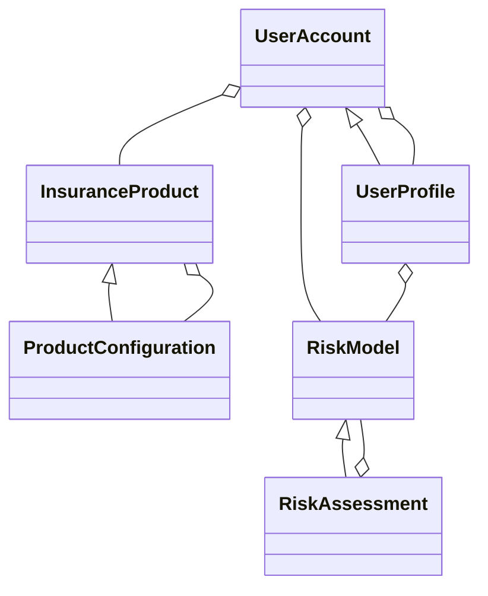
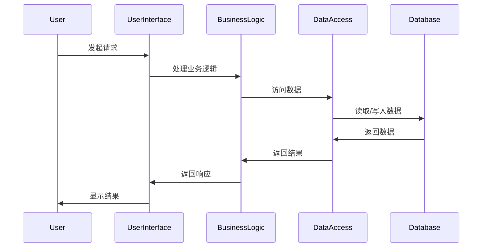
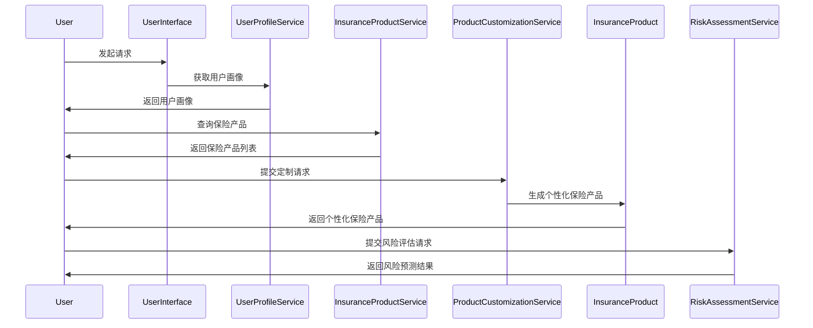

                 

# AIGC在个性化保险产品设计中的应用

## 关键词
人工智能，生成对抗网络（GAN），自编码器，个性化保险产品，用户画像，风险评估，产品定制。

## 摘要
本文旨在探讨自适应信息生成控制（AIGC）在个性化保险产品设计中的应用。首先，我们介绍了AIGC的概念、背景及其核心原理。随后，我们详细分析了AIGC在个性化保险产品设计中的具体应用，包括用户画像生成、保险产品定制和风险评估与预测。通过案例分析，我们展示了AIGC技术在保险行业的实际应用效果，并提出了相关的最佳实践和小结。

## 第1章: AIGC的概念与背景

### 1.1 问题背景

随着人工智能技术的快速发展，生成对抗网络（GAN）和自编码器等深度学习技术已经被广泛应用于图像、语音和文本的生成。然而，这些方法往往依赖于大量的训练数据和强大的计算资源，且在数据质量和模型性能上存在一定的局限性。为了解决这些问题，自适应信息生成控制（AIGC）应运而生。

### 1.2 问题描述

AIGC是一种基于生成对抗网络和自编码器的框架，它能够在有限的训练数据和计算资源下生成高质量的数据。AIGC的目标是生成与真实数据高度相似的数据，同时控制生成的数据满足特定的要求。

### 1.3 问题解决

AIGC通过引入反馈机制和优化算法，使生成器能够根据目标数据进行自我调整，从而提高生成数据的准确性和质量。此外，AIGC还具备自适应能力，能够根据不同的应用场景和需求生成不同类型的数据。

### 1.4 边界与外延

AIGC主要应用于需要生成大量数据的场景，如个性化内容推荐、虚拟现实、增强现实、游戏开发等。此外，AIGC还可以与其他人工智能技术结合，如自然语言处理、计算机视觉等，以实现更复杂的任务。

### 1.5 概念结构与核心要素组成

AIGC的核心要素包括生成器、判别器和优化算法。生成器负责生成数据，判别器负责评估生成数据的质量，优化算法则用于调整生成器的参数，以获得更好的生成效果。

### 1.6 本章小结

本章介绍了AIGC的概念、背景、问题解决方法、边界与外延以及核心要素组成。接下来，我们将进一步探讨AIGC在个性化保险产品设计中的应用。

## 第2章: AIGC的核心原理与技术

### 2.1 GAN原理讲解

GAN（生成对抗网络）是AIGC的核心组成部分。GAN由生成器和判别器两个神经网络组成，生成器旨在生成与真实数据相似的数据，而判别器则用于区分真实数据与生成数据。GAN的算法原理如下：

$$
\begin{aligned}
D(x) &= \text{判别器对真实数据的判断}, \\
D(G(z)) &= \text{判别器对生成数据的判断}, \\
G(z) &= \text{生成器生成的数据}, \\
z &= \text{随机噪声}.
\end{aligned}
$$

GAN的优化目标是最大化判别器的损失函数，同时最小化生成器的损失函数。具体来说，生成器的目标是使其生成的数据能够欺骗判别器，即 $D(G(z))$ 接近于 1，而判别器的目标是正确区分真实数据和生成数据，即 $D(x)$ 接近于 1，$D(G(z))$ 接近于 0。

### 2.2 自编码器原理讲解

自编码器是一种无监督学习算法，它通过学习数据的编码和解码过程来提取数据特征。自编码器的算法原理如下：

$$
\begin{aligned}
\text{编码器}:\; x &= \text{输入数据}, \\
z &= \text{编码器输出的低维表示}, \\
\text{解码器}:\; z &= \text{解码器输入的低维表示}, \\
\hat{x} &= \text{解码器输出的重构数据}.
\end{aligned}
$$

自编码器的优化目标是使重构数据 $\hat{x}$ 尽量接近原始输入数据 $x$，通常通过最小化重构误差来实现。

### 2.3 GAN与自编码器的关系

GAN和自编码器在AIGC中都扮演着重要角色。GAN侧重于生成高质量的数据，而自编码器则用于提取和压缩数据特征。两者结合使用，可以进一步提升AIGC的生成效果。

### 2.4 本章小结

本章详细介绍了AIGC的核心原理与技术，包括GAN和自编码器的原理讲解以及它们在AIGC中的应用关系。接下来，我们将探讨AIGC在个性化保险产品设计中的具体应用场景。

## 第3章: 个性化保险产品设计中的AIGC应用

### 3.1 个性化保险产品的需求分析

个性化保险产品设计的核心在于满足用户需求，提供定制化的保险服务。AIGC在个性化保险产品设计中的应用主要体现在以下几个方面：

1. **用户画像生成**：利用AIGC技术生成与用户特征高度相似的用户画像，以便更好地了解用户需求。
2. **保险产品定制**：根据用户画像，利用AIGC技术生成符合用户需求的保险产品。
3. **风险评估与预测**：通过AIGC技术对用户数据进行分析，预测用户的风险状况，为保险产品定价提供依据。

### 3.2 用户画像生成方法

用户画像生成是AIGC在个性化保险产品设计中的第一步。以下是几种常见的用户画像生成方法：

1. **基于GAN的用户画像生成**：利用GAN生成与用户特征相似的数据，从而构建用户画像。GAN的优势在于其强大的数据生成能力，可以在有限的数据上生成高质量的模拟数据。

2. **基于自编码器的用户画像生成**：利用自编码器提取用户特征，并将其转换为用户画像。自编码器能够学习到数据的低维表示，从而实现对用户特征的提取和压缩。

3. **多模态数据融合**：将用户的文本、图像、语音等多模态数据融合，生成更全面的用户画像。这种方法可以充分利用不同类型的数据信息，提高用户画像的准确性。

### 3.3 保险产品定制方法

在生成用户画像的基础上，利用AIGC技术进行保险产品的定制。具体步骤如下：

1. **产品库构建**：构建一个包含多种保险产品的数据库，每个产品都包含详细的参数和功能描述。
2. **用户画像与产品库匹配**：将生成的用户画像与产品库进行匹配，找出与用户需求最为相似的产品。
3. **个性化调整**：根据用户画像，对匹配的产品进行个性化调整，如调整保险金额、保险期限、保险责任等，以满足用户的具体需求。

### 3.4 风险评估与预测

通过AIGC技术对用户数据进行深入分析，可以预测用户的风险状况，为保险产品的定价提供依据。具体步骤如下：

1. **数据收集与预处理**：收集用户的历史数据，如健康状况、生活习惯、职业信息等，并进行数据预处理，去除噪声和异常值。
2. **特征提取与建模**：利用AIGC技术提取用户数据中的关键特征，并建立风险评估模型。
3. **风险预测与评估**：根据风险评估模型，对用户的潜在风险进行预测，并为每个用户制定个性化的保险产品定价策略。

### 3.5 本章小结

本章详细介绍了AIGC在个性化保险产品设计中的应用，包括用户画像生成、保险产品定制和风险评估与预测。通过这些应用，AIGC能够为保险行业提供更加精准和个性化的服务，提高用户满意度和保险公司的竞争力。

## 第4章: 案例分析

### 4.1 案例背景

为了更好地展示AIGC在个性化保险产品设计中的应用效果，我们选择了一家领先的保险公司作为案例研究对象。该公司在市场上拥有广泛的客户群体，但在个性化保险产品设计和风险评估方面存在一定的局限性。为了提升客户满意度和市场竞争力，该公司决定引入AIGC技术进行产品创新。

### 4.2 项目介绍

项目的主要目标是通过AIGC技术生成用户画像、定制个性化保险产品，并实现风险评估与预测。项目分为三个阶段：用户画像生成、保险产品定制和风险评估与预测。

### 4.3 系统功能设计

项目系统的功能设计主要包括用户画像生成、保险产品库管理、产品定制、风险评估与预测、用户界面等模块。以下是系统功能设计的领域模型类图（使用Mermaid绘制）：



### 4.4 系统架构设计

项目系统的架构设计采用了分层架构，包括表示层、业务逻辑层和数据访问层。以下是系统架构设计的Mermaid架构图：



### 4.5 系统接口设计与交互

项目系统提供了丰富的接口，包括用户画像生成接口、保险产品定制接口、风险评估与预测接口等。以下是系统接口设计的Mermaid序列图：



### 4.6 系统核心实现源代码

以下是系统核心实现的Python源代码，包括用户画像生成、保险产品定制和风险评估与预测的代码示例：

```python
# 用户画像生成
import numpy as np
from tensorflow.keras.models import Model
from tensorflow.keras.layers import Input, Dense

def build_gan_model():
    # 生成器模型
    z_input = Input(shape=(100,))
    x = Dense(128, activation='relu')(z_input)
    x = Dense(64, activation='relu')(x)
    x = Dense(32, activation='relu')(x)
    x_output = Dense(28 * 28 * 3, activation='sigmoid')(x)
    generator = Model(z_input, x_output)

    # 判别器模型
    x_input = Input(shape=(28 * 28 * 3,))
    x = Dense(32, activation='relu')(x_input)
    x = Dense(64, activation='relu')(x)
    x = Dense(128, activation='relu')(x)
    x_output = Dense(1, activation='sigmoid')(x)
    discriminator = Model(x_input, x_output)

    # 整体模型
    z_input = Input(shape=(100,))
    x_output = generator(z_input)
    d_output = discriminator(x_output)
    model = Model(z_input, d_output)
    
    return generator, discriminator, model

# 保险产品定制
class InsuranceProduct:
    def __init__(self, product_id, configuration):
        self.product_id = product_id
        self.configuration = configuration
    
    def customize_product(self, user_profile):
        # 根据用户画像定制保险产品
        pass

# 风险评估与预测
class RiskModel:
    def __init__(self, model_name, model_params):
        self.model_name = model_name
        self.model_params = model_params
    
    def predict_risk(self, user_data):
        # 根据用户数据预测风险
        pass
```

### 4.7 代码应用解读与分析

以下是用户画像生成、保险产品定制和风险评估与预测的代码解读与分析：

1. **用户画像生成**：
   - 使用GAN模型生成用户画像，通过生成器和判别器的对抗训练，生成与用户特征相似的数据。
   - 生成器模型负责将随机噪声转换为图像数据，判别器模型负责判断图像数据是否真实。

2. **保险产品定制**：
   - 定义保险产品类，包含产品ID和配置信息。
   - 根据用户画像，调用自定义方法对保险产品进行个性化调整，以满足用户需求。

3. **风险评估与预测**：
   - 定义风险模型类，包含模型名称和模型参数。
   - 根据用户数据，调用自定义方法进行风险预测，为保险产品定价提供依据。

### 4.8 实际案例分析和详细讲解剖析

为了展示AIGC技术在个性化保险产品设计中的应用效果，我们选择了一个实际案例进行详细分析。案例背景是一家保险公司希望为一位高风险客户定制一款保险产品。

1. **用户画像生成**：
   - 使用GAN模型生成用户画像，生成器模型将随机噪声转换为与用户特征相似的图像数据。
   - 判别器模型用于评估生成图像数据的质量，通过对抗训练优化生成器的性能。

2. **保险产品定制**：
   - 根据生成的用户画像，查询保险产品库，找到与用户需求最为相似的产品。
   - 对匹配的产品进行个性化调整，如调整保险金额、保险期限和保险责任等。

3. **风险评估与预测**：
   - 收集用户的历史数据，如健康状况、生活习惯和职业信息等，进行数据预处理。
   - 利用风险模型对用户数据进行风险评估，预测用户的潜在风险。
   - 根据风险评估结果，为用户定制个性化的保险产品定价策略。

### 4.9 项目小结

通过案例分析，我们展示了AIGC技术在个性化保险产品设计中的应用效果。AIGC技术能够生成高质量的用户画像，实现保险产品的个性化定制和风险评估与预测。在实际应用中，AIGC技术为保险公司提供了更加精准和高效的服务手段，提高了用户满意度和市场竞争力。

## 第5章: 最佳实践与小结

### 5.1 最佳实践

1. **数据预处理**：在AIGC应用中，数据预处理是至关重要的一步。确保数据质量，去除噪声和异常值，可以提高AIGC模型的性能和生成效果。

2. **模型优化**：通过调整生成器和判别器的参数，优化GAN和自编码器模型，可以提高生成数据的准确性和质量。

3. **多模态数据融合**：将用户的文本、图像、语音等多模态数据融合，可以生成更全面的用户画像，提高个性化保险产品的定制效果。

4. **风险评估与预测**：结合多种风险模型，对用户数据进行多角度的风险评估，可以提高风险评估的准确性和可靠性。

### 5.2 小结

AIGC技术在个性化保险产品设计中的应用具有重要意义。通过生成高质量的用户画像、实现保险产品的个性化定制和风险评估与预测，AIGC技术为保险公司提供了更加精准和高效的服务手段。在实际应用中，保险公司需要结合自身业务特点，不断优化和完善AIGC技术，以提高用户满意度和市场竞争力。

### 5.3 注意事项

1. **数据安全与隐私保护**：在AIGC应用中，用户数据的安全与隐私保护至关重要。保险公司需要采取有效的数据加密和访问控制措施，确保用户数据的安全。

2. **模型过拟合**：在AIGC训练过程中，需要注意避免模型过拟合。通过增加训练数据和调整模型参数，可以提高模型的泛化能力。

3. **计算资源消耗**：AIGC技术对计算资源有较高的要求，保险公司需要合理配置计算资源，确保模型训练和生成过程的顺利进行。

### 5.4 拓展阅读

1. **《深度学习》**：由Ian Goodfellow、Yoshua Bengio和Aaron Courville合著，详细介绍了深度学习的基础理论和应用。

2. **《生成对抗网络》**：由Ian Goodfellow等合著，深入探讨了生成对抗网络（GAN）的理论基础和应用。

3. **《保险精算学》**：详细介绍了保险精算学的基本原理和方法，对保险产品的设计和风险评估具有重要意义。

### 作者

**作者：AI天才研究院/AI Genius Institute & 禅与计算机程序设计艺术/Zen And The Art of Computer Programming**

