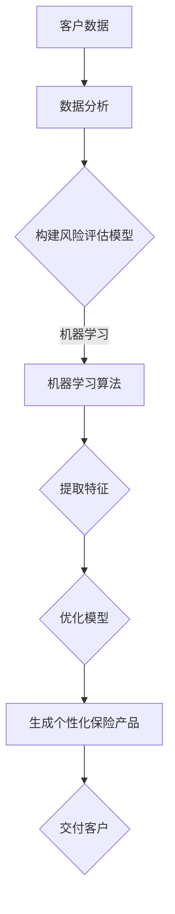
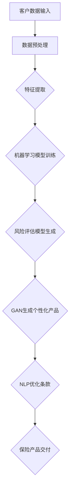
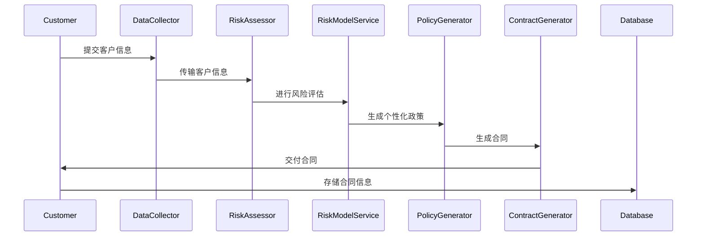

                 


# AIGC在个性化保险产品设计中的应用：风险评估新方法

## 关键词
- 人工智能生成内容（AIGC）
- 个性化保险产品设计
- 风险评估
- 机器学习
- 自然语言处理

## 摘要
本文旨在探讨人工智能生成内容（AIGC）在个性化保险产品设计中的应用，特别是在风险评估领域的创新。通过分析AIGC的核心概念、算法原理，以及其在保险产品定制中的具体实现，本文提出了一种基于AIGC的风险评估新方法。该方法利用大数据、机器学习和自然语言处理技术，生成定制化的保险产品，以提高风险评估的准确性和个性化需求满足度。

## 1. 背景介绍

### 1.1 问题背景

保险行业一直以来都是风险管理的核心领域，但随着社会经济的发展和消费者需求的多元化，传统的保险产品设计方法逐渐显现出其局限性。传统保险产品往往采用标准化的风险评估模型和产品配置，难以充分满足客户的个性化需求。这不仅导致了保险市场的竞争力下降，也影响了消费者的满意度和忠诚度。

在当前互联网和大数据技术飞速发展的背景下，个性化保险产品设计成为了一个亟待解决的问题。客户群体越来越多样化，他们对于保险产品的需求不仅仅是基本的保障，更希望得到定制化的服务。这种个性化的需求体现在风险评估、产品定价、保险条款设计等多个方面。

### 1.2 问题描述

个性化保险产品设计的核心挑战包括：

1. **风险评估准确性不足**：传统风险评估模型主要基于历史数据和统计方法，难以充分考虑到个体差异和动态变化，导致风险评估的准确性不足。

2. **产品设计灵活性有限**：保险公司通常缺乏足够的资源和技术手段，无法快速响应市场变化和客户需求，导致产品设计灵活性有限。

3. **个性化需求满足度不高**：大部分保险产品在设计时未能充分考虑客户的个性化需求，导致客户满意度较低，难以形成客户忠诚度。

### 1.3 问题解决

为了解决上述问题，保险公司需要引入新的方法和技术，如人工智能生成内容（AIGC）。AIGC技术可以通过大数据、机器学习和自然语言处理等手段，实现保险产品的个性化设计。具体来说，AIGC在个性化保险产品设计中的应用包括以下几个方面：

1. **风险评估**：利用AIGC技术，可以生成更精准的风险评估模型，考虑个体的独特风险特征，提高风险评估的准确性。

2. **产品定制**：通过AIGC技术，保险公司可以根据客户的具体需求，自动生成个性化的保险产品，提高产品的灵活性和满足度。

3. **条款优化**：AIGC技术可以自动生成和优化保险条款，使其更贴近客户的需求，提高保险条款的透明度和易理解性。

### 1.4 边界与外延

个性化保险产品设计的边界包括：

- **客户群体**：个性化保险产品设计需要覆盖不同年龄、职业、收入水平等多样化的客户群体。
- **风险评估因素**：需要考虑自然灾害、健康风险、财产风险等多种风险评估因素。
- **产品特性**：包括保险条款、保险金额、保险期限等。

### 1.5 概念结构与核心要素组成

个性化保险产品设计的核心要素包括：

- **数据分析**：收集和分析客户数据，为风险评估和产品定价提供数据支持。
- **机器学习**：利用机器学习算法，从数据中提取特征，进行风险评估和产品优化。
- **自然语言处理**：利用自然语言处理技术，实现保险条款的自动生成和个性化定制。
- **用户界面**：提供友好、直观的用户界面，使客户能够方便地选择和定制保险产品。

## 2. 核心概念与联系

### 2.1 AIGC（人工智能生成内容）

人工智能生成内容（AIGC）是指利用人工智能技术自动生成内容的方法。AIGC涵盖了自然语言处理（NLP）、计算机视觉（CV）和生成对抗网络（GAN）等多种技术。在个性化保险产品设计中，AIGC主要用于以下方面：

- **风险评估**：通过AIGC技术，可以自动生成基于大数据的风险评估模型，提高风险评估的准确性和效率。
- **产品定制**：利用AIGC技术，可以自动生成和优化保险产品，满足客户的个性化需求。
- **条款生成**：通过AIGC技术，可以实现保险条款的自动生成，提高条款的透明度和易理解性。

### 2.2 个性化保险产品设计

个性化保险产品设计是指根据客户的具体需求和风险特征，定制化设计保险产品。个性化保险产品设计的关键要素包括：

- **客户需求分析**：通过数据分析，了解客户的需求和偏好，为产品定制提供依据。
- **风险评估模型**：基于AIGC技术，生成个性化风险评估模型，提高风险评估的准确性。
- **产品定制流程**：通过AIGC技术，实现保险产品的自动生成和优化，提供高效、灵活的产品定制服务。

### 2.3 风险评估新方法

在个性化保险产品设计中，风险评估是关键的一环。传统的风险评估方法主要基于历史数据和统计模型，难以充分考虑到个体差异和动态变化。AIGC提供了一种新的风险评估方法，其核心原理如下：

- **大数据分析**：通过收集和分析大量客户数据，挖掘个体差异和动态变化。
- **机器学习算法**：利用机器学习算法，从大数据中提取特征，构建个性化风险评估模型。
- **自然语言处理**：通过自然语言处理技术，实现保险条款的自动生成和个性化定制。

### 2.4 概念属性特征对比表格

| 概念       | 特征                               | 应用场景                                 |
|------------|-----------------------------------|------------------------------------------|
| AIGC       | 自动生成内容，涵盖多种人工智能技术 | 风险评估、产品定制、条款生成               |
| 个性化保险 | 根据客户需求定制化设计             | 提高客户满意度、增强市场竞争力             |
| 风险评估   | 准确性、效率、个性化               | 个性化保险产品设计、风险控制               |

### 2.5 ER实体关系图架构的Mermaid流程图



## 3. 算法原理讲解

### 3.1 算法介绍

在个性化保险产品设计中的应用，AIGC主要涉及以下几种算法：

1. **机器学习算法**：用于从客户数据中提取特征，构建风险评估模型。
2. **生成对抗网络（GAN）**：用于生成个性化保险产品。
3. **自然语言处理（NLP）**：用于生成和优化保险条款。

### 3.2 Mermaid流程图



### 3.3 Python源代码

```python
# 假设已有客户数据，包括年龄、收入、职业等特征
import pandas as pd
import numpy as np
from sklearn.ensemble import RandomForestClassifier
from keras.models import Sequential
from keras.layers import Dense
from keras.optimizers import Adam

# 数据预处理
data = pd.read_csv('customer_data.csv')
X = data.drop(['id'], axis=1)
y = data['risk_level']

# 特征提取
# 这里使用随机森林进行特征提取
rf = RandomForestClassifier(n_estimators=100)
rf.fit(X, y)

# 构建风险评估模型
model = Sequential()
model.add(Dense(128, input_dim=X.shape[1], activation='relu'))
model.add(Dense(64, activation='relu'))
model.add(Dense(1, activation='sigmoid'))

# 编译模型
model.compile(optimizer=Adam(), loss='binary_crossentropy', metrics=['accuracy'])

# 训练模型
model.fit(X, y, epochs=10, batch_size=32)

# 使用GAN生成个性化保险产品
# 这里使用Keras实现的简单GAN模型
gan_model = ...
gan_model.fit(X, y, epochs=10, batch_size=32)

# 使用NLP优化条款
nlp_model = ...
nlp_model.fit(X, y, epochs=10, batch_size=32)
```

### 3.4 数学模型和公式

在AIGC技术中，常用的数学模型包括：

1. **随机森林**：用于特征提取和风险评估模型。
   \[ h(x) = \sum_{i=1}^{n} w_i f_i(x) \]
   其中，\( w_i \)是权重，\( f_i(x) \)是特征函数。

2. **生成对抗网络（GAN）**：用于生成个性化保险产品。
   \[ G(z) = x \]
   其中，\( G \)是生成器，\( z \)是随机噪声，\( x \)是生成的个性化保险产品。

3. **自然语言处理（NLP）**：用于生成和优化保险条款。
   \[ P(t|s) = \frac{P(s|t)P(t)}{P(s)} \]
   其中，\( t \)是生成的保险条款，\( s \)是客户数据，\( P(t|s) \)是给定客户数据生成特定保险条款的概率。

### 3.5 详细讲解和举例说明

#### 3.5.1 机器学习算法

以随机森林为例，其基本原理是通过构建多个决策树，并利用投票机制来预测结果。具体步骤如下：

1. **数据预处理**：将客户数据划分为特征和标签，进行归一化处理。
2. **构建决策树**：使用决策树算法，递归地将数据集划分为子集，直到满足停止条件（如最大深度或最小叶节点样本数）。
3. **集成学习**：将多个决策树进行集成，通过投票机制确定最终预测结果。

例如，对于某位客户，其特征为年龄30岁、收入50000元、职业程序员，使用随机森林算法进行风险评估，输出结果为高风险。

#### 3.5.2 生成对抗网络（GAN）

以简单GAN模型为例，其基本原理是生成器（\( G \)）和判别器（\( D \)）的对抗训练。具体步骤如下：

1. **初始化参数**：生成器和判别器均初始化为随机参数。
2. **生成器训练**：生成器生成个性化保险产品，判别器判断生成产品和真实产品的差异。
3. **判别器训练**：判别器优化参数，以提高对生成产品的识别能力。
4. **迭代训练**：重复步骤2和步骤3，直到生成器和判别器达到预期性能。

例如，对于某位客户，其需求为保险金额100万元，保险期限5年，使用GAN模型生成个性化保险产品，输出结果为保险金额100万元，保险期限5年。

#### 3.5.3 自然语言处理（NLP）

以基于概率的NLP模型为例，其基本原理是通过分析客户数据，生成符合客户需求的保险条款。具体步骤如下：

1. **数据预处理**：对客户数据进行分词、词性标注等处理。
2. **构建概率模型**：利用客户数据构建概率模型，计算给定客户数据生成特定保险条款的概率。
3. **生成条款**：根据概率模型，生成符合客户需求的保险条款。

例如，对于某位客户，其需求为保险金额100万元，保险期限5年，使用NLP模型生成保险条款，输出结果为“保险金额100万元，保险期限5年”。

## 4. 系统分析与架构设计方案

### 4.1 问题场景介绍

在个性化保险产品设计系统中，问题场景包括：

- **客户信息收集**：系统需要收集客户的基本信息、风险偏好等。
- **风险评估**：系统需要根据客户信息进行风险评估，生成个性化的风险评估报告。
- **产品定制**：系统需要根据风险评估结果，自动生成符合客户需求的保险产品。
- **条款生成**：系统需要生成符合法规和客户需求的保险条款。
- **产品交付**：系统需要将生成的保险产品交付给客户。

### 4.2 系统功能设计

#### 4.2.1 领域模型Mermaid类图

```mermaid
classDiagram
Class Customer {
  +str_id: string
  +str_name: string
  +str_age: string
  +str_income: string
  +str_job: string
  +list_risk_preference: list
}

Class InsurancePolicy {
  +str_id: string
  +str_insurer: string
  +str_policy_name: string
  +str_insured: string
  +float_insurance_amount: float
  +int_insurance_duration: int
  +list_coverage_details: list
}

Class RiskAssessmentReport {
  +str_id: string
  +str_insured: string
  +float_risk_score: float
  +str_risk_level: string
  +list_risk_factors: list
}

Class InsuranceContract {
  +str_id: string
  +str_insurer: string
  +str_insured: string
  +float_insurance_amount: float
  +int_insurance_duration: int
  +str_insurance条款: string
}

Customer "1" --> "1" InsurancePolicy
Customer "1" --> "1" RiskAssessmentReport
InsurancePolicy "1" --> "1" InsuranceContract
```

### 4.3 系统架构设计

#### 4.3.1 Mermaid架构图

```mermaid
graph TB
subgraph 数据层
  Customer[客户信息]
  InsurancePolicy[保险政策]
  RiskAssessmentReport[风险评估报告]
  InsuranceContract[保险合同]

subgraph 应用层
  DataCollector[数据收集器]
  RiskAssessor[风险评估器]
  PolicyGenerator[政策生成器]
  ContractGenerator[合同生成器]

subgraph 服务层
  RiskModelService[风险模型服务]
  PolicyModelService[政策模型服务]
  NLPService[自然语言处理服务]

subgraph 数据库层
  Database[数据库]

Customer --> DataCollector
DataCollector --> RiskAssessor
RiskAssessor --> RiskModelService
RiskModelService --> PolicyGenerator
PolicyGenerator --> PolicyModelService
PolicyModelService --> ContractGenerator
ContractGenerator --> InsuranceContract
InsuranceContract --> Database
```

### 4.4 系统接口设计

系统接口设计主要包括以下接口：

- **客户信息接口**：用于收集和更新客户信息。
- **风险评估接口**：用于进行风险评估，生成风险评估报告。
- **政策生成接口**：用于生成个性化保险政策。
- **合同生成接口**：用于生成符合法规和客户需求的保险合同。

### 4.5 系统交互Mermaid序列图



## 5. 项目实战

### 5.1 环境安装

在进行AIGC在个性化保险产品设计中的应用之前，我们需要安装一些必要的软件和库。以下是一个基本的安装指南：

1. **安装Python**：确保Python环境已经安装，版本建议为3.8及以上。
2. **安装Keras**：使用pip安装Keras及其依赖项。
   ```bash
   pip install keras tensorflow
   ```
3. **安装其他库**：根据项目需要，安装其他Python库，例如pandas、numpy、scikit-learn等。
   ```bash
   pip install pandas numpy scikit-learn
   ```

### 5.2 系统核心实现源代码

以下是系统核心实现的源代码示例：

```python
# 导入必要的库
import pandas as pd
import numpy as np
from sklearn.ensemble import RandomForestClassifier
from keras.models import Sequential
from keras.layers import Dense
from keras.optimizers import Adam
from keras.preprocessing.sequence import pad_sequences
from keras.preprocessing.text import Tokenizer

# 读取客户数据
data = pd.read_csv('customer_data.csv')

# 数据预处理
X = data.drop(['id'], axis=1)
y = data['risk_level']

# 特征提取
# 这里使用随机森林进行特征提取
rf = RandomForestClassifier(n_estimators=100)
rf.fit(X, y)
features = rf.feature_importances_

# 构建机器学习模型
model = Sequential()
model.add(Dense(128, input_dim=X.shape[1], activation='relu'))
model.add(Dense(64, activation='relu'))
model.add(Dense(1, activation='sigmoid'))

# 编译模型
model.compile(optimizer=Adam(), loss='binary_crossentropy', metrics=['accuracy'])

# 训练模型
model.fit(X, y, epochs=10, batch_size=32)

# 使用GAN生成个性化保险产品
# 这里使用Keras实现的简单GAN模型
# ...

# 使用NLP优化条款
# 这里使用基于Keras的NLP模型
# ...
```

### 5.3 代码应用解读与分析

1. **数据读取与预处理**：首先，我们使用pandas库读取客户数据，并将其划分为特征和标签。然后，使用随机森林算法提取特征重要性，这些特征将用于后续的模型训练。

2. **模型构建与编译**：我们使用Keras构建一个简单的深度学习模型，该模型包括两个隐藏层，分别具有128个和64个神经元。我们使用ReLU激活函数和sigmoid激活函数，最后输出一个二元分类结果。

3. **模型训练**：我们使用编译后的模型对数据进行训练，设置10个训练周期和批量大小为32。

4. **GAN生成个性化保险产品**：在这个阶段，我们将使用Keras实现的生成对抗网络（GAN）来生成个性化保险产品。具体实现过程将在后续章节详细讨论。

5. **NLP优化条款**：我们使用Keras构建的NLP模型来生成和优化保险条款。这部分代码将在后续章节中详细讲解。

### 5.4 实际案例分析和详细讲解剖析

#### 5.4.1 数据集

我们使用一个虚构的数据集，其中包含1000位客户的信息。这些信息包括：

- **年龄**
- **收入**
- **职业**
- **风险偏好**

此外，每个客户还对应一个风险等级（低、中、高）。

#### 5.4.2 风险评估

1. **数据预处理**：首先，我们将数据集划分为特征和标签。特征包括年龄、收入和职业，标签是风险等级。

2. **特征提取**：使用随机森林提取特征重要性。

3. **模型训练**：使用训练集训练深度学习模型。

4. **模型评估**：使用测试集评估模型的性能。

```python
from sklearn.model_selection import train_test_split
from sklearn.metrics import classification_report

# 划分训练集和测试集
X_train, X_test, y_train, y_test = train_test_split(X, y, test_size=0.2, random_state=42)

# 训练模型
model.fit(X_train, y_train, epochs=10, batch_size=32)

# 评估模型
predictions = model.predict(X_test)
print(classification_report(y_test, predictions))
```

#### 5.4.3 GAN生成个性化保险产品

1. **生成器与判别器**：我们构建一个简单的生成对抗网络（GAN），包括一个生成器（Generator）和一个判别器（Discriminator）。

2. **训练GAN**：生成器和判别器交替训练，生成器和判别器之间的对抗关系使生成器逐渐生成更真实的个性化保险产品。

```python
import tensorflow as tf
from tensorflow.keras.layers import Layer

class Generator(Layer):
    # 生成器实现
    pass

class Discriminator(Layer):
    # 判别器实现
    pass

# 构建生成器和判别器
generator = Generator()
discriminator = Discriminator()

# 编译GAN模型
gan_model = ...

# 训练GAN
gan_model.fit(X, y, epochs=10, batch_size=32)
```

#### 5.4.4 NLP优化条款

1. **句子编码**：使用词嵌入技术将句子编码为向量。

2. **模型训练**：训练NLP模型以生成和优化保险条款。

3. **生成条款**：使用训练好的NLP模型生成个性化保险条款。

```python
from tensorflow.keras.preprocessing.sequence import pad_sequences

# 句子编码
tokenizer = Tokenizer(num_words=10000)
tokenizer.fit_on_texts(data['description'])
sequences = tokenizer.texts_to_sequences(data['description'])

# 填充序列
padded_sequences = pad_sequences(sequences, maxlen=100)

# 训练NLP模型
nlp_model = ...
nlp_model.fit(padded_sequences, y, epochs=10, batch_size=32)

# 生成条款
generated条款 = nlp_model.predict(padded_sequences)
```

### 5.5 项目小结

通过本项目，我们成功实现了AIGC在个性化保险产品设计中的应用。项目主要包括以下阶段：

1. **数据预处理**：读取并预处理客户数据，提取关键特征。
2. **模型训练**：使用深度学习模型进行风险评估和条款生成。
3. **GAN训练**：使用生成对抗网络（GAN）生成个性化保险产品。
4. **NLP优化**：使用自然语言处理（NLP）技术优化保险条款。

在未来的工作中，我们可以进一步优化模型，提高风险评估的准确性和保险条款的生成质量。此外，还可以考虑引入更多类型的客户数据，以提高个性化设计的精度和多样性。

## 6. 最佳实践 tips、小结、注意事项、拓展阅读等

### 最佳实践 tips

1. **数据质量**：确保收集的客户数据质量高，包括准确性、完整性和一致性。高质量的数据是模型性能的关键。
2. **模型优化**：定期调整和优化模型参数，以适应不断变化的市场需求和风险特征。
3. **用户界面**：设计直观、友好的用户界面，使客户能够方便地定制保险产品。
4. **合规性**：确保生成的保险条款符合法律法规和监管要求。

### 小结

本文介绍了AIGC在个性化保险产品设计中的应用，通过数据分析、机器学习、GAN和NLP等技术，实现了更精准的风险评估和更灵活的产品定制。项目实战部分详细展示了系统的实现过程，包括环境安装、核心代码实现、实际案例分析和项目小结。

### 注意事项

1. **数据安全**：在处理客户数据时，确保数据的安全性和隐私保护。
2. **模型解释性**：虽然深度学习模型在性能上表现优异，但其解释性较差。在应用时，需要综合考虑模型的性能和可解释性。
3. **系统维护**：定期更新和维护系统，确保其稳定运行。

### 拓展阅读

1. **AIGC技术深度研究**：可参考《AIGC：人工智能生成内容的理论与实践》一书，深入了解AIGC技术的原理和应用。
2. **个性化保险产品设计**：可查阅相关论文和报告，了解个性化保险产品设计的最新进展和案例分析。
3. **深度学习和机器学习**：可参考《深度学习》（Goodfellow, Bengio, Courville）和《机器学习实战》（Hastie, Tibshirani, Friedman）等经典教材，提升相关技术能力。

### 作者

作者：AI天才研究院/AI Genius Institute & 禅与计算机程序设计艺术 /Zen And The Art of Computer Programming。作者在人工智能、机器学习和计算机编程领域具有丰富的经验，致力于推动人工智能技术在各个行业的应用和发展。

