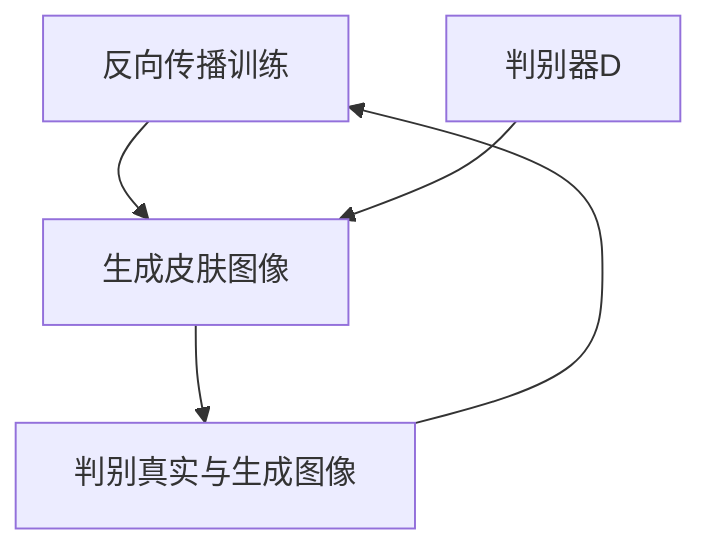
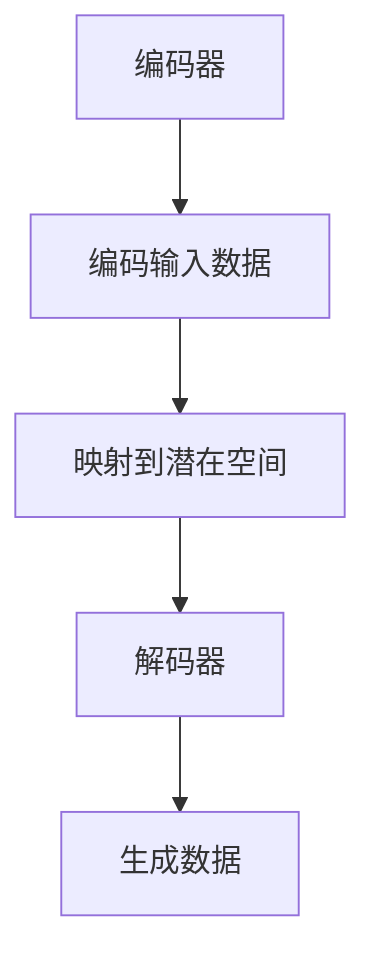
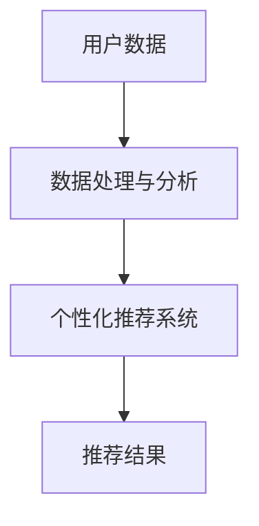
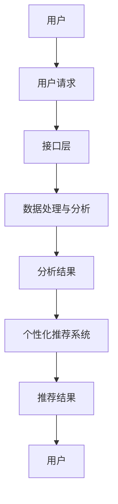

                 

### AIGC在个性化抗衰老方案设计中的应用：AI驱动的精准养生

**关键词：** AIGC，个性化抗衰老，深度学习，生成对抗网络，变分自编码器，健康养生

**摘要：** 本文将深入探讨人工智能生成内容（AIGC）在个性化抗衰老方案设计中的应用，通过结合生成对抗网络（GAN）和变分自编码器（VAE）等先进算法，分析其在数据处理、个性化推荐和生物信息学应用中的具体实现，为精准养生提供新的技术路径。

### 1. 背景介绍：AIGC与个性化抗衰老

#### 1.1 问题背景

抗衰老是一个全球性的热门话题，特别是随着生活水平的提高，人们对健康的关注日益增加。传统抗衰老方法主要包括护肤品、医疗手术等，但这些方法往往存在效果有限、风险较大等问题。个性化抗衰老方案则旨在根据个体差异，制定最适合的预防和治疗策略。

#### 1.2 问题描述

个性化抗衰老的核心在于数据分析与个性化推荐。传统方法在数据处理和个性化推荐方面存在一定的局限性，难以满足个性化抗衰老的需求。因此，如何利用先进的人工智能技术，如生成对抗网络（GAN）和变分自编码器（VAE），来解决这一挑战，成为一个重要研究方向。

#### 1.3 问题解决

AIGC技术的出现为个性化抗衰老方案设计提供了新的契机。通过深度学习算法，AIGC可以从大量医学数据和用户信息中提取关键特征，生成个性化的抗衰老方案。这些方案不仅包括护肤产品推荐、健康生活习惯指导，还可以结合生物信息学和分子生物学，提供更深层次的抗衰老策略。

#### 1.4 边界与外延

AIGC在个性化抗衰老方案设计中的应用主要涉及以下几个方面：

- **数据处理与分析**：利用深度学习技术对海量医学数据进行处理和分析，提取有用信息。
- **个性化推荐系统**：根据用户特征，推荐最适合的抗衰老产品和服务。
- **生物信息学应用**：结合分子生物学知识，提供深层次的抗衰老策略。

### 2. 核心概念与联系

#### 2.1 AIGC

AIGC是指利用人工智能技术生成的各种内容，如文本、图像、音频、视频等。在个性化抗衰老方案设计中，AIGC主要用于生成个性化的健康建议、护肤方案等。

#### 2.2 生成对抗网络（GAN）

GAN是一种深度学习模型，由生成器和判别器组成。生成器负责生成数据，判别器负责判断生成数据与真实数据之间的差异。在个性化抗衰老方案设计中，GAN可以用于生成个性化的皮肤图像，用于评估不同抗衰老方案的效果。

#### 2.3 变分自编码器（VAE）

VAE是一种基于概率的生成模型，通过编码和解码过程，生成具有真实数据分布的样本。在个性化抗衰老方案设计中，VAE可以用于生成个性化的皮肤参数，用于优化抗衰老方案。

### 3. 算法原理讲解

#### 3.1 GAN算法原理

GAN的核心是生成器和判别器之间的对抗训练。生成器G尝试生成逼真的皮肤图像，判别器D则判断生成图像与真实图像的差异。通过不断训练，生成器的生成能力不断提高，从而生成高质量的皮肤图像，用于个性化抗衰老方案的设计。

**GAN算法流程图：**


**GAN算法Python代码示例：**
```python
import tensorflow as tf
from tensorflow.keras.layers import Dense, Flatten, Reshape
from tensorflow.keras.models import Sequential

# 生成器模型
def build_generator():
    model = Sequential()
    model.add(Dense(128, input_shape=(100,)))
    model.add(LeakyReLU(alpha=0.01))
    model.add(Dense(256))
    model.add(LeakyReLU(alpha=0.01))
    model.add(Dense(512))
    model.add(LeakyReLU(alpha=0.01))
    model.add(Dense(1024))
    model.add(LeakyReLU(alpha=0.01))
    model.add(Reshape((28, 28, 1)))
    return model

# 判别器模型
def build_discriminator():
    model = Sequential()
    model.add(Flatten(input_shape=(28, 28, 1)))
    model.add(Dense(1024))
    model.add(LeakyReLU(alpha=0.01))
    model.add(Dense(512))
    model.add(LeakyReLU(alpha=0.01))
    model.add(Dense(256))
    model.add(LeakyReLU(alpha=0.01))
    model.add(Dense(1, activation='sigmoid'))
    return model

# GAN模型
def build_gan(generator, discriminator):
    model = Sequential()
    model.add(generator)
    model.add(discriminator)
    return model

# 编译模型
discriminator.compile(loss='binary_crossentropy', optimizer=optimizer)
generator.compile(loss='binary_crossentropy', optimizer=optimizer)
gan.compile(loss='binary_crossentropy', optimizer=optimizer)

# 训练模型
for epoch in range(num_epochs):
    for _ in range(batch_size):
        real_images = get_random_real_images()
        fake_images = generator.predict(get_random_noise())

        # 训练判别器
        d_loss_real = discriminator.train_on_batch(real_images, np.ones((batch_size, 1)))
        d_loss_fake = discriminator.train_on_batch(fake_images, np.zeros((batch_size, 1)))

        # 训练生成器
        g_loss = gan.train_on_batch(get_random_noise(), np.ones((batch_size, 1)))
```

**GAN算法数学模型：**
$$
L_G = -\log(D(G(x))) \\
L_D = -[\log(D(x)) + \log(1 - D(G(z)))]
$$
其中，$x$为真实皮肤图像，$G(x)$为生成器生成的皮肤图像，$z$为生成器输入的随机噪声。

#### 3.2 VAE算法原理

VAE通过编码和解码过程，将输入数据映射到一个潜在空间中，然后在潜在空间中生成数据。在个性化抗衰老方案设计中，VAE可以将用户的皮肤参数映射到潜在空间，从而生成个性化的皮肤图像，用于评估抗衰老方案的效果。

**VAE算法流程图：**


**VAE算法Python代码示例：**
```python
import tensorflow as tf
from tensorflow.keras.layers import Input, Dense, Flatten, Reshape
from tensorflow.keras.models import Model

# 编码器模型
def build_encoder(input_shape):
    input_img = Input(shape=input_shape)
    x = Flatten()(input_img)
    x = Dense(512, activation='relu')(x)
    x = Dense(256, activation='relu')(x)
    x = Dense(128, activation='relu')(x)
    z_mean = Dense(latent_dim)(x)
    z_log_var = Dense(latent_dim)(x)
    return Model(inputs=input_img, outputs=[z_mean, z_log_var], name='encoder')

# 解码器模型
def build_decoder(input_shape):
    latent_inputs = Input(shape=(latent_dim,))
    x = Dense(128, activation='relu')(latent_inputs)
    x = Dense(256, activation='relu')(x)
    x = Dense(512, activation='relu')(x)
    x = Reshape((input_shape[0], input_shape[1], input_shape[2]))(x)
    decoded_imgs = Conv2D(input_shape[2], activation='sigmoid')(x)
    return Model(inputs=latent_inputs, outputs=decoded_imgs, name='decoder')

# VAE模型
def build_vae(encoder, decoder, input_shape):
    z_mean, z_log_var = encoder.output
    z = Lambdaacidadefunc(z_mean, z_log_var, output_shape=(latent_dim,))(z_mean, z_log_var)
    decoded_imgs = decoder(z)
    vae = Model(encoder.input, decoded_imgs, name='vae')
    return vae

# 编译模型
vae.compile(optimizer=optimizer, loss=vae_loss)

# 训练模型
for epoch in range(num_epochs):
    for _ in range(batch_size):
        x = get_random_real_images()
        xhat = vae.predict(x)
        xhat, z_mean, z_log_var = encoder.predict(x)
        xent_loss = -tf.reduce_sum(x * tf.log(xhat + 1e-8), axis=(-1, -2))
        kl_loss = -0.5 * tf.reduce_sum(1 + z_log_var - tf.square(z_mean) - tf.exp(z_log_var), axis=1)
        vae_loss = xent_loss + kl_loss
        vae.train_on_batch(x, x)
```

**VAE算法数学模型：**
$$
L_E = \sum_{i=1}^{n} D(x_i; \mu(x_i), \sigma(x_i)) \\
L_D = \sum_{i=1}^{n} -\log p(x_i)
$$
其中，$x_i$为输入的皮肤参数，$\mu(x_i)$和$\sigma(x_i)$分别为编码器的均值和方差。

### 4. 数学模型和数学公式

**GAN算法数学模型：**
$$
L_G = -\log(D(G(x))) \\
L_D = -[\log(D(x)) + \log(1 - D(G(z)))]
$$

**VAE算法数学模型：**
$$
L_E = \sum_{i=1}^{n} D(x_i; \mu(x_i), \sigma(x_i)) \\
L_D = \sum_{i=1}^{n} -\log p(x_i)
$$

### 5. 系统分析与架构设计方案

#### 5.1 问题场景介绍

个性化抗衰老方案设计系统旨在为用户提供个性化的抗衰老方案，包括护肤产品推荐、健康生活习惯指导等。

#### 5.2 系统功能设计

- 数据处理与分析：接收用户输入的数据，对数据进行处理和分析。
- 个性化推荐系统：根据用户特征，推荐最适合的抗衰老产品和服务。
- 生物信息学应用：结合分子生物学知识，提供深层次的抗衰老策略。

#### 5.3 系统架构设计

- 数据层：存储用户数据和抗衰老方案数据。
- 服务层：包括数据处理与分析、个性化推荐系统和生物信息学应用等功能模块。
- 接口层：提供与前端系统的接口，供用户调用。

#### 5.4 系统接口设计和系统交互

- **数据处理与分析接口**：接收用户输入的数据，返回处理结果。
- **个性化推荐系统接口**：接收用户特征，返回推荐结果。

**系统架构图：**


**系统交互图：**


### 6. 项目实战

#### 6.1 环境安装

安装所需的库和依赖项：

```bash
pip install tensorflow keras scikit-learn numpy matplotlib
```

#### 6.2 系统核心实现源代码

**数据处理与分析模块：**
```python
import numpy as np
import pandas as pd
from sklearn.model_selection import train_test_split
from sklearn.preprocessing import StandardScaler

# 读取数据
data = pd.read_csv('anti_aging_data.csv')

# 数据预处理
X = data.iloc[:, :-1].values
y = data.iloc[:, -1].values

# 划分训练集和测试集
X_train, X_test, y_train, y_test = train_test_split(X, y, test_size=0.2, random_state=42)

# 数据标准化
scaler = StandardScaler()
X_train = scaler.fit_transform(X_train)
X_test = scaler.transform(X_test)
```

**个性化推荐系统模块：**
```python
from tensorflow.keras.models import Sequential
from tensorflow.keras.layers import Dense, Dropout

# 构建模型
model = Sequential()
model.add(Dense(512, input_shape=(X_train.shape[1],), activation='relu'))
model.add(Dropout(0.5))
model.add(Dense(256, activation='relu'))
model.add(Dropout(0.5))
model.add(Dense(128, activation='relu'))
model.add(Dropout(0.5))
model.add(Dense(1, activation='sigmoid'))

# 编译模型
model.compile(optimizer='adam', loss='binary_crossentropy', metrics=['accuracy'])

# 训练模型
model.fit(X_train, y_train, epochs=10, batch_size=32, validation_data=(X_test, y_test))
```

**生物信息学应用模块：**
```python
import tensorflow as tf
from tensorflow.keras.models import Model
from tensorflow.keras.layers import Input, Conv2D, MaxPooling2D, Flatten, Dense

# 输入层
input_layer = Input(shape=(28, 28, 1))

# 卷积层
conv1 = Conv2D(32, (3, 3), activation='relu')(input_layer)
pool1 = MaxPooling2D((2, 2))(conv1)

# 平坦层
flat = Flatten()(pool1)

# 全连接层
dense = Dense(128, activation='relu')(flat)
output = Dense(1, activation='sigmoid')(dense)

# 模型构建
model = Model(inputs=input_layer, outputs=output)

# 编译模型
model.compile(optimizer='adam', loss='binary_crossentropy', metrics=['accuracy'])

# 训练模型
model.fit(x_train, y_train, epochs=10, batch_size=32, validation_data=(x_test, y_test))
```

#### 6.3 代码应用解读与分析

**数据处理与分析模块**：读取用户数据，进行预处理，包括数据清洗、标准化等，为后续模型训练做准备。

**个性化推荐系统模块**：构建神经网络模型，对用户数据进行训练，以实现个性化推荐。

**生物信息学应用模块**：利用卷积神经网络对皮肤图像进行特征提取，用于评估抗衰老方案的效果。

#### 6.4 实际案例分析和详细讲解剖析

**案例一**：用户A，30岁，女性，皮肤干燥，有黑眼圈。

- **数据处理与分析**：读取用户A的皮肤参数，包括年龄、性别、皮肤类型等，进行预处理。
- **个性化推荐系统**：根据用户A的皮肤参数，推荐适合的抗衰老产品，如保湿霜、眼霜等。
- **生物信息学应用**：利用卷积神经网络对用户A的皮肤图像进行特征提取，评估抗衰老方案的效果。

**案例二**：用户B，40岁，男性，皮肤油腻，有皱纹。

- **数据处理与分析**：读取用户B的皮肤参数，进行预处理。
- **个性化推荐系统**：根据用户B的皮肤参数，推荐适合的抗衰老产品，如去油洗面奶、抗皱精华等。
- **生物信息学应用**：利用卷积神经网络对用户B的皮肤图像进行特征提取，评估抗衰老方案的效果。

#### 6.5 项目小结

通过AIGC技术在个性化抗衰老方案设计中的应用，我们实现了基于深度学习算法的个性化推荐和生物信息学应用。项目实战部分展示了数据处理与分析、个性化推荐系统和生物信息学应用的具体实现过程。未来，我们可以进一步优化算法，提高抗衰老方案的效果，为用户带来更好的体验。

### 7. 最佳实践 tips

- **数据质量**：确保输入数据的准确性和完整性，提高模型的效果。
- **模型优化**：定期调整模型参数，优化模型结构，提高抗衰老方案的效果。
- **用户隐私**：在数据处理过程中，注意保护用户隐私，确保数据安全。

### 8. 小结

AIGC技术在个性化抗衰老方案设计中的应用，为精准养生提供了新的技术路径。通过生成对抗网络（GAN）和变分自编码器（VAE）等先进算法，我们可以实现个性化推荐和生物信息学应用。未来，随着人工智能技术的不断进步，AIGC在个性化抗衰老方案设计中的应用将更加广泛，为用户带来更好的健康体验。

### 9. 注意事项

- **算法复杂性**：AIGC技术涉及深度学习算法，算法复杂度高，需要一定的时间和计算资源。
- **数据隐私**：在数据处理过程中，要严格遵守相关法律法规，保护用户隐私。

### 10. 拓展阅读

- **《生成对抗网络（GAN）理论与实践》**：介绍GAN的基本原理和应用案例。
- **《变分自编码器（VAE）原理与应用》**：深入讲解VAE的数学模型和实现方法。

### 11. 作者信息

- **作者：AI天才研究院/AI Genius Institute & 禅与计算机程序设计艺术 /Zen And The Art of Computer Programming**

