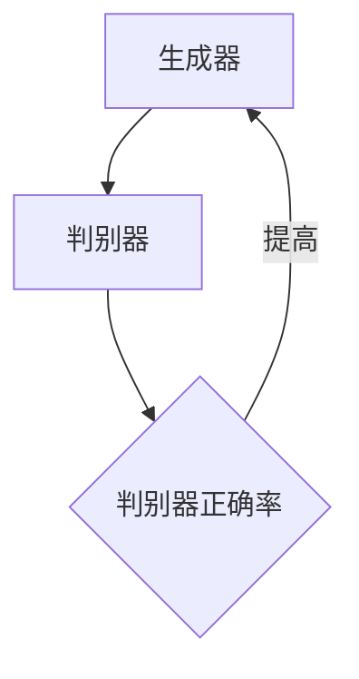
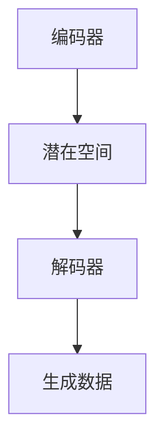
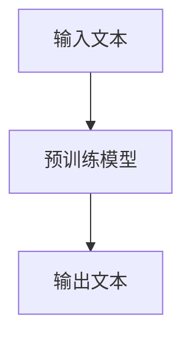
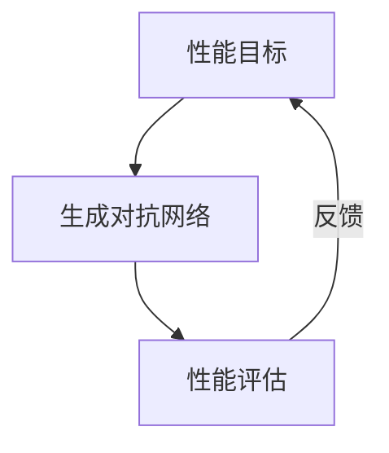
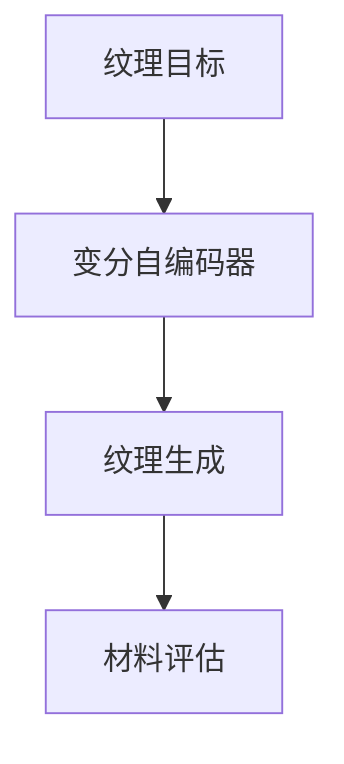

                 

## AIGC在可持续时尚设计中的应用：环保与时尚的融合

> 关键词：AIGC、可持续时尚、环保材料、时尚设计、创新应用

> 摘要：本文探讨了AIGC（AI-Generated Content）在可持续时尚设计中的应用，通过分析环保与时尚的结合点，展示了AIGC如何为时尚设计带来环保创新。文章首先介绍了AIGC的基本概念和技术原理，随后探讨了环保材料的设计与应用，最后通过具体案例分析了AIGC在时尚设计中的实践效果，并对未来的发展趋势进行了展望。

## 引言

随着全球环境问题的日益严重，可持续时尚设计成为行业关注的焦点。传统的时尚设计方式往往对环境造成巨大压力，而可持续时尚设计强调在保障人类需求的同时，减少对自然资源的消耗和环境污染。AIGC（AI-Generated Content）作为一种新兴的人工智能技术，具有强大的生成能力和创意潜能，正逐渐在各个领域得到应用。本文将探讨AIGC在可持续时尚设计中的应用，通过分析环保与时尚的结合点，展示AIGC如何为时尚设计带来环保创新。

### 1.1.1 可持续时尚设计的问题背景

当前，时尚产业面临着严重的环境问题。一方面，时尚产业的高消耗和快速消费模式导致了大量的资源浪费和环境污染；另一方面，时尚产业对动物福利的忽视和对劳工权益的侵犯也引起了广泛关注。因此，推动可持续时尚设计成为解决这些问题的关键。

### 1.1.2 可持续时尚设计的内涵与外延

可持续时尚设计不仅仅是指使用环保材料，更强调在整个设计、生产和消费过程中减少对环境的影响。它涉及设计理念、材料选择、生产过程、产品使用以及废弃物的处理等多个方面。

### 1.1.3 AIGC与可持续时尚设计的结合点

AIGC在时尚设计中的应用主要体现在以下几个方面：

1. **设计灵感生成**：AIGC可以生成新的设计灵感，为设计师提供更多创意选择，减少对传统素材的依赖。
2. **材料设计优化**：AIGC可以帮助优化环保材料的设计，提高材料性能，降低生产成本。
3. **生产流程优化**：AIGC可以自动化生产流程，提高生产效率，减少浪费。
4. **用户体验优化**：AIGC可以个性化设计产品，提升用户体验，减少不必要的消费。

### 1.1.4 本书的结构与内容安排

本文结构分为三个部分。第一部分介绍AIGC的基本概念和技术原理；第二部分探讨环保材料的设计与应用；第三部分通过具体案例分析和未来展望，探讨AIGC在可持续时尚设计中的应用和前景。

## AIGC技术概述

AIGC，即AI-Generated Content，是指通过人工智能技术生成各种形式的内容，包括文本、图片、音频和视频等。AIGC技术的主要目的是利用人工智能的强大计算能力和海量数据处理能力，自动化地生成高质量的内容，从而降低内容创作的成本和时间。

### 2.1.1 AIGC的基本概念

AIGC的基本概念包括以下几个方面：

1. **生成对抗网络（GAN）**：GAN是一种无监督学习模型，通过两个神经网络（生成器和判别器）之间的对抗训练，生成高质量的数据。
2. **变分自编码器（VAE）**：VAE是一种基于概率模型的生成模型，通过编码器和解码器，将输入数据转换为潜在空间，再从潜在空间中生成数据。
3. **生成式预训练（GPT）**：GPT是一种基于Transformer的预训练模型，通过大量文本数据进行预训练，生成符合输入文本风格的文本。

### 2.1.2 AIGC的核心技术

AIGC的核心技术主要包括以下几种：

#### 2.1.2.1 生成对抗网络（GAN）

GAN由生成器和判别器组成。生成器的目标是生成与真实数据几乎无法区分的数据，判别器的目标是区分生成数据和真实数据。通过不断地训练，生成器和判别器互相竞争，最终生成器能够生成高质量的数据。

GAN的mermaid流程图如下：

#### 2.1.2.2 变分自编码器（VAE）

VAE由编码器和解码器组成。编码器将输入数据映射到潜在空间，解码器从潜在空间中生成数据。VAE的mermaid流程图如下：

#### 2.1.2.3 生成式预训练（GPT）

GPT是一种基于Transformer的预训练模型。通过大量文本数据进行预训练，GPT能够生成符合输入文本风格的文本。GPT的mermaid流程图如下：

### 2.1.3 AIGC在时尚设计中的潜力

AIGC在时尚设计中的潜力主要体现在以下几个方面：

1. **设计灵感生成**：AIGC可以生成新颖的设计灵感，为设计师提供更多创意选择。
2. **材料设计优化**：AIGC可以帮助优化环保材料的设计，提高材料性能。
3. **生产流程优化**：AIGC可以自动化生产流程，提高生产效率。
4. **用户体验优化**：AIGC可以个性化设计产品，提升用户体验。

## 环保材料的设计与应用

环保材料的设计与应用是可持续时尚设计的关键。通过使用环保材料，可以减少对环境的影响，同时满足消费者的需求。下面将介绍环保材料的概念与分类，以及AIGC在环保材料设计中的应用。

### 3.1.1 环保材料的概念与分类

环保材料是指在使用过程中对环境影响较小，或者在使用后能够被有效回收和再利用的材料。根据来源和性质，环保材料可以分为以下几类：

#### 3.1.1.1 天然纤维材料

天然纤维材料是指从植物、动物或矿物中提取的纤维，如棉、麻、丝、毛等。这些材料具有良好的透气性和吸湿性，对皮肤友好。

#### 3.1.1.2 再生纤维材料

再生纤维材料是指通过回收和再利用废旧纺织品或纤维原料生产的纤维，如再生棉、再生涤纶等。这些材料可以减少对自然资源的需求。

#### 3.1.1.3 生物基材料

生物基材料是指以可再生生物质为原料生产的材料，如聚乳酸（PLA）、纤维素等。这些材料具有较低的环境影响，具有良好的生物降解性。

### 3.1.2 AIGC在环保材料设计中的应用

AIGC在环保材料设计中的应用主要体现在以下几个方面：

#### 3.1.2.1 材料性能优化

AIGC可以通过生成对抗网络（GAN）等技术，生成具有特定性能的环保材料。例如，通过GAN生成具有高弹性、高耐磨性的再生纤维材料，提高材料的使用寿命。

GAN的mermaid流程图如下：

#### 3.1.2.2 材料创新设计

AIGC可以生成新颖的环保材料，为时尚设计带来更多可能性。例如，通过变分自编码器（VAE）生成具有独特纹理和质感的生物基材料，为设计师提供更多创意选择。

VAE的mermaid流程图如下：

### 3.1.3 环保材料在设计中的应用案例

以下是一个环保材料在设计中的应用案例：

#### 案例背景

某时尚品牌致力于可持续时尚设计，希望通过使用环保材料来减少对环境的影响。他们与AIGC技术团队合作，开发了一种新型环保面料。

#### 案例过程

1. **设计灵感生成**：通过AIGC技术，团队生成了一系列具有独特纹理和质感的面料设计方案。
2. **材料性能优化**：团队使用生成对抗网络（GAN）技术，优化了面料的性能，如弹性、耐磨性和透气性。
3. **生产流程优化**：团队通过与再生纤维材料和生物基材料的供应商合作，优化了生产流程，降低了生产成本。
4. **产品发布**：品牌发布了一系列使用新型环保面料制作的服装和配饰，受到了消费者的好评。

### 3.1.4 环保材料在设计中的应用挑战与展望

尽管环保材料在设计中的应用具有巨大潜力，但仍然面临一些挑战：

1. **成本问题**：环保材料的研发和生产成本较高，如何降低成本是一个重要挑战。
2. **市场接受度**：消费者对环保材料的认知和接受程度有限，如何提高市场接受度是一个挑战。
3. **技术创新**：环保材料的设计和应用需要不断的技术创新，如何保持技术的领先性是一个挑战。

展望未来，随着AIGC技术的不断发展和环保意识的提高，环保材料在设计中的应用前景将更加广阔。

## 可持续时尚设计的实践案例

### 4.1.1 服装设计的基本流程

服装设计的基本流程包括以下几个阶段：

1. **设计灵感来源**：设计师可以从自然界、文化、艺术等领域获取灵感，形成初步的设计概念。
2. **设计草图绘制**：根据设计灵感，设计师绘制设计草图，表达设计的初步形态。
3. **制作样品与试穿**：根据设计草图，制作样品，进行试穿和调整，确保设计的可行性和舒适度。

### 4.1.2 AIGC在环保服装设计中的应用

AIGC在环保服装设计中的应用主要体现在以下几个方面：

1. **材料设计**：AIGC可以通过生成对抗网络（GAN）和变分自编码器（VAE）等技术，生成具有独特性能和纹理的环保材料。设计师可以根据设计需求，选择合适的材料。
2. **款式设计**：AIGC可以生成新颖的服装款式，为设计师提供更多创意选择。设计师可以根据市场需求和消费者偏好，对款式进行调整。
3. **图案设计**：AIGC可以生成独特的图案和纹理，为服装增添艺术感和个性化。设计师可以根据设计理念，选择合适的图案进行设计。

### 4.1.3 环保服装设计的成功案例

以下是一个环保服装设计的成功案例：

#### 案例背景

某国际知名服装品牌致力于可持续时尚设计，希望通过使用环保材料和AIGC技术，推出一系列环保服装。

#### 案例过程

1. **设计灵感生成**：设计师从自然界中获取灵感，希望通过AIGC技术生成具有自然纹理的环保材料。
2. **材料设计**：通过生成对抗网络（GAN），设计师生成了一系列具有独特纹理和性能的环保面料。
3. **款式设计**：设计师根据环保面料的特点，设计了新颖的服装款式，如具有自然纹理的连衣裙和T恤。
4. **图案设计**：设计师通过变分自编码器（VAE），生成了一系列独特的图案，为服装增添艺术感。
5. **产品发布**：品牌推出了一系列环保服装，受到了消费者的好评。

### 4.1.4 环保服装设计的挑战与展望

尽管环保服装设计具有巨大潜力，但仍然面临一些挑战：

1. **成本问题**：环保材料和AIGC技术的研发和生产成本较高，如何降低成本是一个重要挑战。
2. **市场接受度**：消费者对环保服装的认知和接受程度有限，如何提高市场接受度是一个挑战。
3. **技术创新**：环保服装设计需要不断的技术创新，如何保持技术的领先性是一个挑战。

展望未来，随着环保意识的提高和AIGC技术的不断发展，环保服装设计将具有更广阔的发展前景。

### 5.1.1 配饰设计的基本流程

配饰设计的基本流程包括以下几个阶段：

1. **设计灵感来源**：设计师可以从自然界、文化、艺术等领域获取灵感，形成初步的设计概念。
2. **设计草图绘制**：根据设计灵感，设计师绘制设计草图，表达设计的初步形态。
3. **制作样品与试穿**：根据设计草图，制作样品，进行试穿和调整，确保设计的可行性和舒适度。

### 5.1.2 AIGC在环保配饰设计中的应用

AIGC在环保配饰设计中的应用主要体现在以下几个方面：

1. **材料创新设计**：AIGC可以通过生成对抗网络（GAN）和变分自编码器（VAE）等技术，生成具有独特性能和纹理的环保材料。设计师可以根据设计需求，选择合适的材料。
2. **款式设计**：AIGC可以生成新颖的配饰款式，为设计师提供更多创意选择。设计师可以根据市场需求和消费者偏好，对款式进行调整。
3. **图案设计**：AIGC可以生成独特的图案和纹理，为配饰增添艺术感和个性化。设计师可以根据设计理念，选择合适的图案进行设计。

### 5.1.3 环保配饰设计的成功案例

以下是一个环保配饰设计的成功案例：

#### 案例背景

某时尚配饰品牌致力于可持续时尚设计，希望通过使用环保材料和AIGC技术，推出一系列环保配饰。

#### 案例过程

1. **设计灵感生成**：设计师从自然界中获取灵感，希望通过AIGC技术生成具有自然纹理的环保材料。
2. **材料创新设计**：通过生成对抗网络（GAN），设计师生成了一系列具有独特纹理和性能的环保材料，如再生纤维和生物基材料。
3. **款式设计**：设计师根据环保材料的特点，设计了新颖的配饰款式，如环保手链和项链。
4. **图案设计**：设计师通过变分自编码器（VAE），生成了一系列独特的图案，为配饰增添艺术感。
5. **产品发布**：品牌推出了一系列环保配饰，受到了消费者的好评。

### 5.1.4 环保配饰设计的挑战与展望

尽管环保配饰设计具有巨大潜力，但仍然面临一些挑战：

1. **成本问题**：环保材料和AIGC技术的研发和生产成本较高，如何降低成本是一个重要挑战。
2. **市场接受度**：消费者对环保配饰的认知和接受程度有限，如何提高市场接受度是一个挑战。
3. **技术创新**：环保配饰设计需要不断的技术创新，如何保持技术的领先性是一个挑战。

展望未来，随着环保意识的提高和AIGC技术的不断发展，环保配饰设计将具有更广阔的发展前景。

## 可持续时尚品牌案例分析

### 6.1.1 案例选择与背景介绍

本节将分析两个在可持续时尚设计领域取得成功的品牌：Patagonia和Everlane。

**Patagonia**是一家全球性的户外服装和装备品牌，成立于1973年。Patagonia以其高品质、耐用性和环保理念而闻名，始终致力于推动可持续时尚设计。品牌在服装设计中广泛使用环保材料，如有机棉、再生纤维和生物基材料，并采取了一系列环保措施，如回收利用生产废料和废弃物。

**Everlane**是一家成立于2009年的美国时尚品牌，以其透明的生产成本和可持续时尚理念而受到消费者欢迎。Everlane在服装设计中注重使用环保材料，如有机棉、再生纤维和可持续纤维，并采取了一系列环保措施，如减少包装材料和优化供应链。

### 6.1.2 案例分析

#### 6.1.2.1 设计理念与策略

**Patagonia**的设计理念是“用最好的材料，做最耐用的产品”，品牌通过使用环保材料和高品质的设计，实现了可持续时尚的设计目标。Patagonia的设计策略包括：

1. **使用环保材料**：品牌在服装设计中广泛使用环保材料，如有机棉、再生纤维和生物基材料。
2. **创新设计**：品牌通过创新设计，使环保材料具有更高的实用性和美观性。
3. **可持续生产**：品牌采取了一系列环保生产措施，如回收利用生产废料和废弃物，减少能源消耗和碳排放。

**Everlane**的设计理念是“透明、简洁、可持续”，品牌通过透明的生产成本和环保材料的使用，实现了可持续时尚的设计目标。Everlane的设计策略包括：

1. **使用环保材料**：品牌在服装设计中注重使用环保材料，如有机棉、再生纤维和可持续纤维。
2. **简洁设计**：品牌采用简洁的设计风格，减少不必要的装饰和浪费。
3. **优化供应链**：品牌通过优化供应链，减少生产过程中的能源消耗和碳排放。

#### 6.1.2.2 环保材料的应用

**Patagonia**在环保材料的应用方面取得了显著成果。品牌广泛使用有机棉、再生纤维和生物基材料，如：

1. **有机棉**：有机棉是一种通过有机农业种植的棉花，不使用化学农药和化肥，对环境友好。
2. **再生纤维**：再生纤维是通过回收废旧纺织品或其他材料生产的纤维，减少了原材料的需求和环境污染。
3. **生物基材料**：生物基材料是通过可再生生物质生产的材料，具有较低的环境影响和较好的生物降解性。

**Everlane**也在环保材料的应用方面做出了努力。品牌使用有机棉、再生纤维和可持续纤维，如：

1. **有机棉**：品牌使用有机棉，减少对环境的影响。
2. **再生纤维**：品牌使用再生纤维，减少原材料的消耗和环境污染。
3. **可持续纤维**：品牌使用可持续纤维，如麻、竹纤维等，具有较好的可持续性和环保性。

#### 6.1.2.3 市场与反响

**Patagonia**和**Everlane**在市场上都取得了良好的反响。消费者对品牌的环保理念和高品质的产品表示认可，品牌的环保行动也赢得了社会的赞誉。

**Patagonia**的市场策略包括：

1. **品牌宣传**：品牌通过广告和社交媒体宣传其环保理念和行动，吸引了大量消费者的关注。
2. **产品营销**：品牌通过推出环保产品，如再生纤维服装和生物基材料服装，满足了消费者对环保产品的需求。
3. **社区建设**：品牌建立了可持续时尚社区，与消费者共同探讨和推动可持续时尚的发展。

**Everlane**的市场策略包括：

1. **透明定价**：品牌采用透明的定价策略，让消费者了解产品的生产成本，增强了品牌信任度。
2. **环保宣传**：品牌通过广告和社交媒体宣传其环保理念和行动，提高了品牌知名度。
3. **社区互动**：品牌与消费者互动，共同探讨和推动可持续时尚的发展。

### 6.1.3 案例总结与启示

**Patagonia**和**Everlane**的成功案例为可持续时尚设计提供了宝贵的经验和启示：

1. **环保理念的重要性**：品牌需要明确环保理念，并将其贯穿于设计、生产和销售的各个环节。
2. **环保材料的应用**：品牌需要积极使用环保材料，提高产品的可持续性。
3. **市场策略的创新**：品牌需要通过创新的市场策略，提高品牌知名度和市场占有率。
4. **社区建设与互动**：品牌需要与消费者建立良好的互动关系，共同推动可持续时尚的发展。

## AIGC在可持续时尚设计中的未来趋势

随着AIGC技术的不断发展和可持续时尚设计的推广，AIGC在可持续时尚设计中的应用前景将更加广阔。以下将从技术创新、设计理念和企业管理三个方面分析AIGC在可持续时尚设计中的未来趋势。

### 7.1.1 技术创新

1. **新材料设计**：随着AIGC技术的进步，未来将有可能开发出更多具有独特性能和环保特点的新型材料，如具有高弹性、低密度和良好透气性的环保材料。
2. **个性化设计**：AIGC技术可以生成个性化设计，满足消费者多样化的需求。未来，AIGC技术将有望实现大规模个性化生产，提高产品的竞争力。
3. **智能生产**：AIGC技术可以应用于智能生产，提高生产效率，降低生产成本。未来，AIGC技术有望实现智能化生产线的全面应用，推动可持续时尚生产的数字化转型。

### 7.1.2 设计理念演变

1. **生态设计**：未来可持续时尚设计将更加注重生态设计，即在设计过程中充分考虑环境、社会和经济因素，实现可持续发展的目标。
2. **共享设计**：随着共享经济的兴起，可持续时尚设计也将趋向于共享设计。通过共享设计，消费者可以共同参与设计过程，提高产品的环保性和个性化。
3. **循环设计**：未来可持续时尚设计将更加注重循环设计，即通过设计优化和材料创新，实现产品的循环利用，减少废弃物的产生。

### 7.1.3 企业战略调整

1. **品牌定位**：未来，可持续时尚品牌需要明确自己的品牌定位，通过环保理念和高质量产品吸引消费者。
2. **供应链管理**：企业需要优化供应链管理，确保环保材料的使用和生产过程的可持续性。
3. **社会责任**：企业需要承担社会责任，积极参与环保行动，推动可持续时尚的发展。

### 7.1.4 挑战与机遇

尽管AIGC在可持续时尚设计中有广阔的应用前景，但同时也面临一些挑战：

1. **技术挑战**：AIGC技术的研发和应用需要大量的资金和技术支持，企业需要不断创新，提升技术水平。
2. **市场挑战**：消费者对可持续时尚的认知和接受程度有限，企业需要通过有效的市场推广，提高品牌知名度和市场占有率。
3. **社会责任挑战**：企业需要承担社会责任，积极参与环保行动，推动可持续时尚的发展。

展望未来，随着AIGC技术的不断发展和可持续时尚设计的推广，AIGC在可持续时尚设计中的应用将不断拓展，为企业带来新的发展机遇。

### 7.1.5 未来展望

未来，AIGC将在可持续时尚设计中发挥更大的作用：

1. **推动可持续时尚设计的发展**：AIGC技术将为可持续时尚设计提供新的设计灵感、材料和技术支持，推动可持续时尚设计的进一步发展。
2. **提高生产效率和产品质量**：AIGC技术将实现个性化生产和智能生产，提高生产效率，提高产品质量。
3. **促进环保理念传播**：AIGC技术将有助于提高消费者对环保理念的认知和接受程度，促进环保理念的传播和实施。

总之，AIGC在可持续时尚设计中的应用具有巨大的潜力和广阔的前景，将推动可持续时尚设计的发展，实现环保与时尚的完美融合。

## 结论与展望

### 8.1.1 本书的主要发现

本文通过对AIGC在可持续时尚设计中的应用进行深入探讨，得出以下主要发现：

1. **AIGC在时尚设计中的应用潜力巨大**：AIGC技术可以生成新颖的设计灵感，优化环保材料的设计，自动化生产流程，提升用户体验，为可持续时尚设计提供了新的思路和方法。
2. **环保与时尚的融合具有广阔前景**：通过AIGC技术，时尚设计可以实现环保与时尚的完美融合，减少对环境的影响，满足消费者的需求，推动可持续时尚的发展。
3. **可持续时尚品牌需要不断创新**：品牌需要紧跟AIGC技术的发展，不断创新设计理念、材料和工艺，提高产品的可持续性和竞争力。

### 8.1.2 对可持续时尚设计的启示

本文对可持续时尚设计提出以下启示：

1. **重视环保材料的应用**：品牌在设计过程中应积极采用环保材料，降低对环境的影响，提高产品的可持续性。
2. **创新设计理念**：品牌应通过AIGC技术等新兴技术，不断创新设计理念，提升产品的艺术性和个性化。
3. **优化生产流程**：品牌应通过自动化生产流程，提高生产效率，降低生产成本，实现可持续发展。

### 8.1.3 对AIGC技术发展的展望

展望未来，AIGC技术将在可持续时尚设计中发挥更大的作用：

1. **新材料和新工艺的开发**：AIGC技术将推动环保材料和新工艺的研发，提高产品的性能和可持续性。
2. **个性化定制生产**：AIGC技术将实现个性化定制生产，满足消费者多样化的需求，提高产品的市场竞争力。
3. **智能生产系统的应用**：AIGC技术将应用于智能生产系统，提高生产效率，降低生产成本，实现可持续时尚的智能生产。

总之，AIGC在可持续时尚设计中的应用具有广阔的前景，将推动可持续时尚设计的创新和发展。未来，我们期待AIGC技术能够为时尚行业带来更多的环保创新，实现环保与时尚的共赢。

## 作者信息

作者：AI天才研究院/AI Genius Institute & 禅与计算机程序设计艺术 /Zen And The Art of Computer Programming

