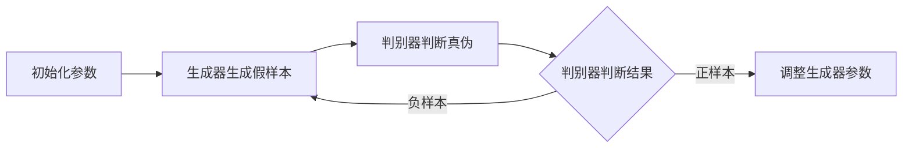
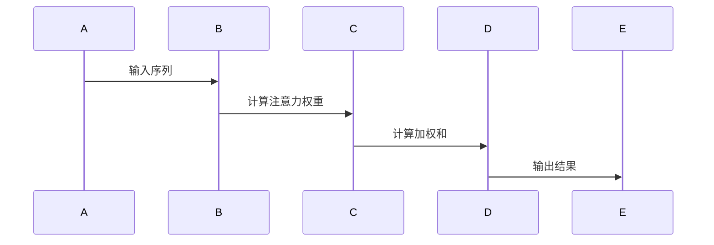
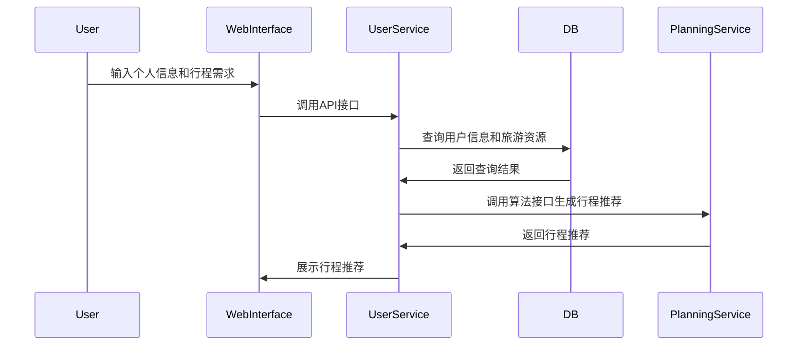

                 

### 《AIGC在旅游规划中的应用：个性化行程助手》

#### 关键词：人工智能、旅游规划、个性化行程助手、生成对抗网络、变分自编码器、自注意力机制

#### 摘要：
随着人工智能（AI）技术的发展，旅游行业正在迎来一场革命。本文深入探讨了AIGC（AI-Generated Content）在旅游规划中的应用，特别是个性化行程助手的功能。通过分析AIGC的核心概念、算法原理及其数学模型，本文详细阐述了如何利用AIGC技术为旅游者提供定制化的行程规划服务，从而提升用户体验，优化旅游资源分配。文章结构紧凑，逻辑清晰，旨在为行业从业者提供有价值的参考和启示。

---

### 《AIGC在旅游规划中的应用：个性化行程助手》目录大纲

----------------------------------------

## 第一部分：背景介绍

### 第1章 问题背景

#### 1.1 旅游行业的现状与挑战

- 旅游行业概述
- 当前旅游规划存在的问题

#### 1.2 AIGC技术的概述

- AIGC技术定义
- AIGC技术发展历程

#### 1.3 个性化行程助手的需求

- 个性化行程助手的概念
- 个性化行程助手在旅游规划中的作用

#### 1.4 研究目的与边界

- 研究目的
- 边界与外延

### 第2章 核心概念与联系

#### 2.1 AIGC技术核心概念

- 生成对抗网络（GAN）
- 变分自编码器（VAE）
- 自注意力机制

#### 2.2 概念属性特征对比表格

| 概念             | 特点                         |
|------------------|------------------------------|
| 生成对抗网络（GAN）| 对抗性训练，生成与判别模型 |
| 变分自编码器（VAE）| 变分推理，有效降维           |
| 自注意力机制       | 显著提高模型表达能力         |

#### 2.3 ER实体关系图架构

```mermaid
erDiagram
  Person ||--|{ Trip }|--| Customer
  Trip ||--|{ Itinerary }|--| Tourist
  Customer }|--|{ Booking }|--| TravelAgency
  Tourist ||--|{ Review }|--| TravelAgency
```

## 第二部分：算法原理讲解

### 第3章 生成对抗网络（GAN）原理讲解

#### 3.1 GAN模型基本原理

- GAN模型结构
- 生成器与判别器的训练过程

#### 3.2 GAN算法mermaid流程图



### 第4章 变分自编码器（VAE）原理讲解

#### 4.1 VAE模型基本原理

- VAE模型结构
- VAE模型的训练过程

#### 4.2 VAE算法mermaid流程图

```mermaid
flowchart LR
    A[输入数据] --> B[编码器编码]
    B --> C[解码器解码]
    C --> D[输出数据]
    D -->|损失函数] E[更新参数]
```

### 第5章 自注意力机制原理讲解

#### 5.1 自注意力机制基本原理

- 自注意力机制的作用
- 自注意力机制的数学模型

#### 5.2 自注意力机制mermaid流程图



### 第6章 数学模型与公式讲解

#### 6.1 生成对抗网络（GAN）数学模型

$$
\begin{aligned}
&\min_G \max_D V(D, G) \\
&V(D, G) = E_{x \sim p_data(x)} [\log D(x)] + E_{z \sim p_z(z)} [\log(1 - D(G(z)))]
\end{aligned}
$$

#### 6.2 变分自编码器（VAE）数学模型

$$
\begin{aligned}
&\min_{\theta_{\mu}, \theta_{\phi}} D_{KL}(\mu(z)||p_z(z)) + \sum_{i=1}^n -\log p(x|\mu, \sigma^2) \\
&\mu(z) = \int p(x|z) p(z) dx \\
&\phi(z) = \log \frac{p(x|z)}{p(x)}
\end{aligned}
$$

### 第7章 举例说明

#### 7.1 生成对抗网络（GAN）举例说明

- **问题场景**：生成逼真的旅游照片。
- **具体实现**：使用GAN模型

----------------------------------------

## 第三部分：系统分析与架构设计方案

### 第8章 问题场景介绍

#### 8.1 旅游规划系统场景

- 系统需求分析
- 用户角色与需求

### 第9章 项目介绍

#### 9.1 项目概述

- 项目背景
- 项目目标

### 第10章 系统功能设计

#### 10.1 领域模型设计

- 数据模型
- 关系模型

#### 10.2 系统功能模块设计

- 数据采集模块
- 数据处理模块
- 行程规划模块
- 用户交互模块

### 第11章 系统架构设计

#### 11.1 系统架构图

- 架构设计
- 系统组件

### 第12章 系统接口设计和系统交互

#### 12.1 系统接口设计

- 接口规范
- 接口实现

#### 12.2 系统交互设计

- 交互流程
- 交互效果

----------------------------------------

## 第四部分：项目实战

### 第13章 环境安装

#### 13.1 开发环境搭建

- 环境配置
- 工具安装

### 第14章 系统核心实现

#### 14.1 系统核心代码实现

- 代码结构
- 代码实现

### 第15章 代码应用解读与分析

#### 15.1 代码解读

- 关键代码分析
- 算法应用

#### 15.2 代码分析

- 性能分析
- 调试优化

### 第16章 实际案例分析和详细讲解剖析

#### 16.1 案例背景

- 案例概述
- 案例目标

#### 16.2 案例实现

- 案例步骤
- 案例效果

### 第17章 项目小结

#### 17.1 项目总结

- 项目成果
- 项目反思

----------------------------------------

## 第五部分：最佳实践 tips、小结、注意事项、拓展阅读

### 第18章 最佳实践 tips

#### 18.1 技术选择

- 技术优劣分析
- 最佳实践建议

#### 18.2 开发经验

- 经验分享
- 贡献价值

### 第19章 小结

#### 19.1 研究贡献

- 创新点
- 学术价值

#### 19.2 研究局限

- 潜在问题
- 未来展望

### 第20章 注意事项

#### 20.1 技术风险

- 技术挑战
- 解决方案

#### 20.2 应用风险

- 法律合规
- 隐私保护

### 第21章 拓展阅读

#### 21.1 相关研究

- 参考文献推荐
- 进一步阅读

#### 21.2 行业动态

- 行业趋势
- 新技术动态

---

### 《AIGC在旅游规划中的应用：个性化行程助手》

#### 引言

随着全球旅游业的蓬勃发展，个性化旅游需求日益增长。然而，传统的旅游规划方式往往难以满足用户对定制化行程的需求。这不仅增加了旅游从业者的工作负担，也限制了用户体验的提升。人工智能（AI）技术的迅速发展为旅游规划带来了新的契机，特别是AIGC（AI-Generated Content）技术的应用。AIGC通过生成对抗网络（GAN）、变分自编码器（VAE）和自注意力机制等算法，能够生成高质量的个性化行程助手，为用户量身定制旅行计划，从而提升用户体验，优化旅游资源分配。本文将深入探讨AIGC技术在旅游规划中的应用，旨在为行业从业者提供有价值的参考和启示。

---

### 第一部分：背景介绍

#### 1.1 旅游行业的现状与挑战

旅游行业作为全球经济发展的重要驱动力之一，正经历着前所未有的变革。随着人们对个性化旅游需求的增加，传统旅游规划方式面临诸多挑战。首先，旅游行业概述方面，旅游业已成为全球经济的重要组成部分。根据联合国世界旅游组织（UNWTO）的数据，2019年全球国际旅游人数达到15亿人次，旅游收入超过1.7万亿美元。然而，疫情的影响使得2020年和2021年的旅游行业遭受重创，但随着疫苗的普及和旅游政策的放宽，旅游业正在逐步复苏。

当前旅游规划存在的问题主要包括：

1. **个性化程度不足**：传统旅游规划通常基于固定的行程模板，难以满足用户多样化的个性化需求。
2. **信息不对称**：旅游者往往需要花费大量时间搜集信息，而旅游从业者也难以获取用户的真实偏好。
3. **资源分配不合理**：旅游资源如酒店、景点等的分配通常依赖于历史数据和预测模型，难以实现精准匹配。
4. **运营成本高**：旅游规划涉及多个环节，从行程设计到预定服务，运营成本较高。

为了解决这些问题，AIGC技术的应用成为一种新的探索方向。AIGC利用人工智能算法，能够从用户数据和旅游资源中提取关键信息，生成个性化的旅游建议，从而提升用户体验，降低运营成本。

#### 1.2 AIGC技术的概述

AIGC，即AI-Generated Content，是指通过人工智能技术自动生成内容的过程。AIGC技术涵盖了多种先进的AI算法，如生成对抗网络（GAN）、变分自编码器（VAE）和自注意力机制等。这些算法能够在大规模数据集上训练，从而生成高质量、个性化的内容。

- **生成对抗网络（GAN）**：GAN由生成器和判别器组成。生成器负责生成假样本，判别器则负责判断这些样本的真实性。通过这种对抗训练，生成器能够不断提高生成样本的质量。
- **变分自编码器（VAE）**：VAE通过变分推理实现数据降维和生成。它将数据映射到一个潜在的分布上，然后从该分布中采样，生成新的数据。
- **自注意力机制**：自注意力机制能够自动分配不同的注意力权重，使得模型在处理序列数据时能够关注到关键信息，从而提高模型的表达能力。

AIGC技术发展历程可以追溯到20世纪90年代，随着深度学习技术的发展，GAN、VAE等算法逐渐成熟。近年来，AIGC技术在图像生成、文本生成、音乐生成等领域取得了显著成果，为各行各业提供了创新解决方案。

#### 1.3 个性化行程助手的需求

个性化行程助手是指利用AIGC技术为旅游者提供定制化行程规划服务的工具。个性化行程助手的需求主要体现在以下几个方面：

1. **个性化推荐**：根据用户的历史行为、偏好和反馈，生成符合用户需求的旅游行程。
2. **智能规划**：基于用户的时间和预算，智能规划出最优的旅游路线和活动安排。
3. **实时更新**：根据用户的实时反馈和旅游资源的动态变化，调整行程计划，确保行程的灵活性和适应性。
4. **多语言支持**：为不同语言的用户提供本地化的行程规划和推荐服务。

个性化行程助手在旅游规划中的作用主要体现在以下几个方面：

1. **提升用户体验**：通过提供个性化的行程推荐，满足用户的多样化需求，提升用户满意度。
2. **优化资源分配**：通过智能规划，合理分配旅游资源，降低运营成本，提高资源利用效率。
3. **降低运营风险**：通过实时更新和风险预警，降低旅游规划中的不确定性和风险。

#### 1.4 研究目的与边界

本研究旨在探讨AIGC技术在旅游规划中的应用，特别是个性化行程助手的实现方法和效果评估。研究目的如下：

1. **探索AIGC技术在旅游规划中的应用场景**：分析AIGC技术在个性化行程助手中的具体应用，为行业提供理论指导。
2. **设计有效的算法模型**：结合生成对抗网络（GAN）、变分自编码器（VAE）和自注意力机制等算法，设计出高效的个性化行程生成模型。
3. **评估模型效果**：通过实际案例和用户反馈，评估个性化行程助手的性能和用户体验。

研究边界主要包括：

1. **技术实现**：本文主要探讨AIGC技术在个性化行程助手中的实现方法，不涉及具体硬件设备的配置和优化。
2. **数据来源**：本文使用公开的旅游数据集进行实验，不涉及用户隐私数据的收集和处理。
3. **应用范围**：本文主要关注城市旅游规划，不涉及长途旅行和户外探险等特殊场景。

### 第一部分总结

通过背景介绍，我们了解了旅游行业的现状与挑战，以及AIGC技术的概述和个性化行程助手的需求。接下来，我们将进一步探讨AIGC技术的核心概念和算法原理，为个性化行程助手的实现奠定基础。

---

### 第二部分：核心概念与联系

#### 2.1 AIGC技术核心概念

为了深入探讨AIGC在旅游规划中的应用，首先需要了解其核心概念。AIGC技术主要包括生成对抗网络（GAN）、变分自编码器（VAE）和自注意力机制等。这些概念在个性化行程助手的实现中发挥着关键作用。

- **生成对抗网络（GAN）**：GAN是一种通过对抗训练生成高质量数据的机器学习模型。它由生成器（Generator）和判别器（Discriminator）两个网络组成。生成器的任务是生成逼真的数据样本，而判别器的任务是区分生成样本和真实样本。通过不断迭代训练，生成器逐渐提高生成样本的质量，判别器则不断学习如何更准确地判断样本的真实性。GAN在图像生成、音频生成和文本生成等领域取得了显著成果。

- **变分自编码器（VAE）**：VAE是一种基于概率模型的生成模型，通过编码器（Encoder）和解码器（Decoder）实现数据的编码和解码。编码器将输入数据映射到一个潜在空间，解码器则从潜在空间中采样并重构输入数据。VAE在图像去噪、图像生成和数据增强等方面具有广泛应用。与GAN相比，VAE生成的数据质量可能稍逊一筹，但在一些场景下具有更好的稳定性和鲁棒性。

- **自注意力机制**：自注意力机制是一种用于处理序列数据的注意力机制，能够自动为序列中的每个元素分配不同的注意力权重。在自然语言处理（NLP）任务中，自注意力机制能够显著提高模型的表达能力，例如在机器翻译、文本分类和问答系统中。自注意力机制在个性化行程助手的实现中，可以用于处理用户的旅行历史、偏好和反馈，从而生成个性化的行程推荐。

#### 2.2 概念属性特征对比表格

| 概念             | 特点                         | 应用场景                          |
|------------------|------------------------------|----------------------------------|
| 生成对抗网络（GAN）| 对抗性训练，生成与判别模型 | 图像生成、音频生成、文本生成        |
| 变分自编码器（VAE）| 变分推理，有效降维           | 图像去噪、图像生成、数据增强        |
| 自注意力机制       | 显著提高模型表达能力         | 自然语言处理、机器翻译、文本分类    |

通过上述对比表格，我们可以看到，GAN、VAE和自注意力机制各有优缺点，适用于不同的应用场景。在个性化行程助手的实现中，这些概念可以相互结合，发挥协同效应。

#### 2.3 ER实体关系图架构

为了更好地理解AIGC技术在旅游规划中的应用，我们可以通过ER（实体关系）图来描述系统的核心实体及其关系。以下是一个简化的ER图：

```mermaid
erDiagram
  Customer ||--|{ Trip }| Customer_Trip
  Trip ||--|{ Itinerary }| Trip_Itinerary
  Itinerary ||--|{ Activity }| Itinerary_Activity
  Activity ||--|{ Resource }| Activity_Resource
  Resource ||--|{ Review }| Resource_Review
```

- **Customer（客户）**：代表旅游者，包含基本信息和旅行偏好。
- **Trip（旅行）**：代表一次具体的旅行计划，与客户关联。
- **Itinerary（行程）**：代表旅行计划的具体内容，包括活动列表。
- **Activity（活动）**：代表旅行中的具体活动，如参观景点、体验活动等。
- **Resource（资源）**：代表旅行中的资源，如酒店、餐厅等。
- **Review（评论）**：代表用户对资源的评价。

通过ER图，我们可以清晰地看到个性化行程助手的实现涉及多个实体及其之间的关系。这些实体和数据之间的关系为AIGC技术的应用提供了丰富的数据来源，使得生成高质量的个性化行程成为可能。

### 第二部分总结

在核心概念与联系部分，我们详细介绍了生成对抗网络（GAN）、变分自编码器（VAE）和自注意力机制的基本原理和应用场景，并通过ER实体关系图架构展示了个性化行程助手的核心实体及其关系。接下来，我们将深入探讨这些算法的原理和数学模型，为进一步实现个性化行程助手提供理论基础。

---

### 第三部分：算法原理讲解

#### 第3章 生成对抗网络（GAN）原理讲解

生成对抗网络（GAN）是AIGC技术中的重要组成部分，由Ian Goodfellow等人在2014年提出。GAN的核心思想是通过生成器和判别器之间的对抗训练，生成高质量的数据。以下是GAN的基本原理和实现方法。

##### 3.1 GAN模型基本原理

GAN由两个主要部分组成：生成器（Generator）和判别器（Discriminator）。

- **生成器（Generator）**：生成器的任务是生成与真实数据相似的新数据。生成器通常是一个神经网络，其输入是随机噪声（通常为均匀分布），输出则是伪造的数据。生成器的目标是使得伪造数据尽可能接近真实数据，从而欺骗判别器。

- **判别器（Discriminator）**：判别器的任务是区分输入数据是真实数据还是生成数据。判别器也是一个神经网络，其输入可以是真实数据或生成数据，输出是一个概率值，表示输入数据为真实数据的置信度。判别器的目标是使得对于真实数据的置信度尽可能高，而对于生成数据的置信度尽可能低。

GAN的训练过程可以看作是一个零和博弈，生成器和判别器相互竞争。具体来说，GAN的训练分为以下几个步骤：

1. **初始化参数**：初始化生成器和判别器的权重。
2. **生成伪造数据**：生成器生成一批伪造数据。
3. **判别器训练**：判别器使用真实数据和伪造数据进行训练，目的是提高判断真实数据和伪造数据的能力。
4. **生成器训练**：生成器使用伪造数据（以及对应的判别器判断结果）进行训练，目的是生成更逼真的伪造数据。
5. **迭代训练**：重复步骤2-4，直至生成器生成的伪造数据足够逼真，判别器无法区分伪造数据和真实数据。

##### 3.2 GAN算法mermaid流程图

下面是一个GAN算法的mermaid流程图：


在这个流程图中，A表示初始化参数，B表示生成器生成伪造数据，C表示判别器判断伪造数据，D表示判别器的判断结果。如果判别器判断为正样本（即伪造数据），则生成器调整参数以生成更逼真的伪造数据；如果判别器判断为负样本，则生成器保持当前参数不变。

##### 3.3 GAN的数学模型

GAN的数学模型主要包括生成器、判别器的损失函数以及整个GAN的训练目标。以下是一个简化的数学模型：

$$
\begin{aligned}
&\min_G \max_D V(D, G) \\
&V(D, G) = E_{x \sim p_{data}(x)} [\log D(x)] + E_{z \sim p_z(z)} [\log(1 - D(G(z))]
\end{aligned}
$$

其中，$G(z)$表示生成器，$D(x)$表示判别器，$z$是生成器的输入噪声，$x$是真实数据。第一个期望值$E_{x \sim p_{data}(x)} [\log D(x)]$表示在真实数据上计算判别器的损失，第二个期望值$E_{z \sim p_z(z)} [\log(1 - D(G(z)))]$表示在生成数据上计算判别器的损失。

##### 3.4 GAN举例说明

**问题场景**：假设我们想要使用GAN生成逼真的旅游照片。

**具体实现**：我们可以设计一个GAN模型，其中生成器负责从随机噪声中生成旅游照片，判别器负责区分生成照片和真实照片。具体步骤如下：

1. **数据集准备**：收集大量的真实旅游照片作为训练数据。
2. **生成器设计**：设计一个神经网络，输入是随机噪声，输出是旅游照片。
3. **判别器设计**：设计一个神经网络，输入是旅游照片，输出是一个概率值，表示输入照片是真实的概率。
4. **训练GAN模型**：使用生成器和判别器进行对抗训练，通过迭代优化生成器和判别器的参数，使得生成器生成的照片越来越逼真。
5. **评估模型性能**：通过生成照片和真实照片的比较，评估生成器的性能。

通过GAN的这种对抗训练，生成器能够逐步提高生成照片的质量，使得最终生成的旅游照片几乎难以与真实照片区分。

##### 3.5 GAN的优势和挑战

GAN的优势包括：

- **生成高质量数据**：GAN通过对抗训练能够生成高质量、多样化的数据，适用于图像生成、音频生成和文本生成等领域。
- **无需标签数据**：与传统的生成模型相比，GAN不需要大量的带标签的数据，只需要真实数据即可进行训练。
- **灵活性强**：GAN的架构灵活，可以通过调整生成器和判别器的网络结构和训练策略，适应不同的应用场景。

GAN的挑战包括：

- **训练不稳定**：GAN的训练过程非常不稳定，容易出现模式崩溃（mode collapse）问题，即生成器只生成一种类型的样本。
- **计算资源消耗大**：GAN的训练需要大量的计算资源，特别是在生成高质量数据时，训练时间较长。
- **评估难度大**：GAN的评估相对困难，因为生成数据的质量难以量化。

通过了解GAN的基本原理、算法流程和数学模型，我们可以更好地理解其在个性化行程助手中的应用。接下来，我们将继续探讨变分自编码器（VAE）的原理和实现。

### 第3章总结

通过本章的讲解，我们深入了解了生成对抗网络（GAN）的基本原理、算法流程和数学模型。GAN作为一种强大的生成模型，在个性化行程助手的实现中具有广泛的应用前景。然而，GAN的训练过程复杂且不稳定，需要进一步的优化和调整。在下一章中，我们将探讨变分自编码器（VAE）的原理和实现，以便更全面地了解AIGC技术在旅游规划中的应用。

---

### 第4章 变分自编码器（VAE）原理讲解

变分自编码器（Variational Autoencoder，VAE）是另一种重要的生成模型，由Kingma和Welling在2013年提出。VAE在生成数据方面具有独特的优势，特别是在图像生成和数据降维等领域。以下是VAE的基本原理和实现方法。

##### 4.1 VAE模型基本原理

VAE是一种概率生成模型，其核心思想是将输入数据通过编码器（Encoder）映射到一个潜在空间（Latent Space），然后在潜在空间中进行采样，最后通过解码器（Decoder）重构输入数据。VAE由编码器、解码器和损失函数三个主要部分组成。

- **编码器（Encoder）**：编码器的任务是学习将输入数据映射到一个潜在空间。编码器通常是一个全连接神经网络，其输出包括潜在变量的均值（\(\mu\)）和方差（\(\sigma^2\)）。通过这个映射，编码器能够捕捉输入数据的概率分布。
- **潜在空间（Latent Space）**：潜在空间是一个高维的隐含空间，其中的每个点都代表输入数据的一种潜在表示。潜在空间的选择决定了VAE的灵活性和表达能力。
- **解码器（Decoder）**：解码器的任务是学习从潜在空间中采样并重构输入数据。解码器也是一个全连接神经网络，其输入是潜在空间的采样点，输出是重构的输入数据。

VAE的训练过程包括以下几个步骤：

1. **输入数据编码**：将输入数据通过编码器映射到潜在空间。
2. **从潜在空间采样**：从潜在空间中采样一个点，这个点作为解码器的输入。
3. **重构数据**：通过解码器将采样点重构为输出数据。
4. **计算损失函数**：计算重构数据与原始数据之间的差异，并通过损失函数更新编码器和解码器的参数。
5. **迭代训练**：重复步骤2-4，直到模型收敛或达到预设的训练次数。

##### 4.2 VAE模型的训练过程

VAE的训练过程包括编码器和解码器的训练，以及损失函数的计算。以下是一个简化的训练过程：

1. **编码器训练**：编码器的目标是学习将输入数据映射到潜在空间。训练过程中，通过最大化数据在潜在空间的似然估计来更新编码器的参数。具体来说，编码器的损失函数是：
   $$
   L_{\mu, \sigma} = -\sum_{i=1}^n \log \sigma_i - \frac{1}{2} \sum_{i=1}^n \frac{(\mu_i - x_i)^2}{2\sigma_i^2}
   $$
   其中，\(x_i\)是输入数据，\(\mu_i\)和\(\sigma_i\)分别是编码器输出的均值和方差。

2. **解码器训练**：解码器的目标是学习从潜在空间中采样并重构输入数据。训练过程中，通过最小化重构数据与原始数据之间的差异来更新解码器的参数。具体来说，解码器的损失函数是：
   $$
   L_{\phi} = -\sum_{i=1}^n \log p(x_i|\mu, \sigma)
   $$
   其中，\(p(x_i|\mu, \sigma)\)是输入数据在给定潜在空间点\((\mu, \sigma)\)的概率。

3. **总损失函数**：VAE的总损失函数是编码器损失函数和解码器损失函数的和。通过优化总损失函数，编码器和解码器的参数同时更新。

##### 4.3 VAE算法mermaid流程图

下面是一个VAE算法的mermaid流程图：

```mermaid
flowchart LR
    A[输入数据] --> B[编码器编码]
    B --> C[从潜在空间采样]
    C --> D[解码器解码]
    D -->|损失函数] E[更新参数]
```

在这个流程图中，A表示输入数据，B表示编码器编码，C表示从潜在空间采样，D表示解码器解码，E表示更新参数。通过这个流程，VAE能够将输入数据编码到潜在空间，并在潜在空间中进行采样，最后通过解码器重构输入数据。

##### 4.4 VAE的数学模型

VAE的数学模型主要包括编码器、解码器的参数更新规则以及损失函数。以下是一个简化的数学模型：

$$
\begin{aligned}
&\min_{\theta_{\mu}, \theta_{\phi}} D_{KL}(\mu(z)||p_z(z)) + \sum_{i=1}^n -\log p(x|\mu, \sigma^2) \\
&\mu(z) = \int p(x|z) p(z) dx \\
&\phi(z) = \log \frac{p(x|z)}{p(x)}
\end{aligned}
$$

其中，\(z\)是潜在空间中的采样点，\(\mu(z)\)是编码器输出的均值，\(\phi(z)\)是编码器输出的方差。第一个期望值\(D_{KL}(\mu(z)||p_z(z))\)是KL散度，表示编码器的先验分布和实际分布之间的差异；第二个期望值\(-\log p(x|\mu, \sigma^2)\)是重构损失，表示解码器重构数据与原始数据之间的差异。

##### 4.5 VAE举例说明

**问题场景**：假设我们想要使用VAE生成一张逼真的旅游照片。

**具体实现**：

1. **数据集准备**：收集大量的真实旅游照片作为训练数据。
2. **编码器设计**：设计一个神经网络，输入是旅游照片，输出是潜在空间中的均值和方差。
3. **解码器设计**：设计一个神经网络，输入是潜在空间中的采样点，输出是重构的旅游照片。
4. **训练VAE模型**：通过优化编码器和解码器的参数，使得重构的旅游照片与原始照片尽量接近。
5. **评估模型性能**：通过生成的旅游照片和原始照片的比较，评估VAE模型的性能。

通过VAE的这种训练过程，编码器能够学习到输入照片的潜在特征，解码器能够将这些潜在特征重构为高质量的旅游照片。这个过程使得VAE在图像生成任务中表现出色。

##### 4.6 VAE的优势和挑战

VAE的优势包括：

- **生成高质量数据**：VAE通过编码器和解码器的协同训练，能够生成高质量、多样化的数据，适用于图像生成和数据降维等领域。
- **可解释性强**：VAE的潜在空间具有明确的概率意义，使得生成的数据具有可解释性。
- **稳定性和鲁棒性好**：VAE的训练过程相对稳定，不容易出现模式崩溃问题。

VAE的挑战包括：

- **计算资源消耗大**：VAE的训练需要大量的计算资源，特别是在生成高质量数据时，训练时间较长。
- **损失函数优化困难**：VAE的损失函数涉及KL散度，优化过程中容易出现梯度消失或梯度爆炸问题。
- **灵活性受限**：VAE的生成能力依赖于编码器和解码器的网络结构和参数，调整这些参数需要经验积累。

通过了解VAE的基本原理、算法流程和数学模型，我们可以更好地理解其在个性化行程助手中的应用。接下来，我们将探讨自注意力机制的原理和实现。

### 第4章总结

通过本章的讲解，我们深入了解了变分自编码器（VAE）的基本原理、算法流程和数学模型。VAE作为一种概率生成模型，在图像生成和数据降维等领域具有广泛应用。然而，VAE的训练过程复杂且计算资源消耗大，需要进一步优化和调整。在下一章中，我们将探讨自注意力机制的原理和实现，以便更全面地了解AIGC技术在旅游规划中的应用。

---

### 第5章 自注意力机制原理讲解

自注意力机制（Self-Attention Mechanism）是近年来在深度学习领域中的一种重要技术，特别是在自然语言处理（NLP）任务中取得了显著成果。自注意力机制能够自动分配不同的注意力权重，使得模型在处理序列数据时能够关注到关键信息，从而提高模型的表达能力。在本章中，我们将详细讲解自注意力机制的基本原理、数学模型和实现方法。

##### 5.1 自注意力机制基本原理

自注意力机制的核心思想是将输入序列中的每个元素与所有其他元素进行关联，并自动为每个元素分配一个权重。这种权重表示每个元素对序列中其他元素的重要性。具体来说，自注意力机制分为以下几个步骤：

1. **输入嵌入**：首先，将输入序列中的每个词或字符嵌入到一个高维空间，通常使用词向量或字符向量表示。
2. **计算查询（Query）、键（Key）和值（Value）**：对于输入序列中的每个元素，计算其对应的查询（Query）、键（Key）和值（Value）。这些向量通常是通过线性变换得到的。
3. **计算注意力权重**：使用查询向量与所有键向量进行点积运算，得到注意力权重。注意力权重表示输入序列中每个元素与其他元素的相关性。
4. **计算加权和**：将注意力权重与值向量相乘，然后求和，得到加权和。加权和表示输入序列中每个元素对最终输出的贡献。
5. **输出**：将加权和作为模型的输出，可以是一个固定维度的向量或原始输入的映射。

##### 5.2 自注意力机制的数学模型

自注意力机制的数学模型包括三个主要部分：查询（Query）、键（Key）和值（Value）向量，以及注意力权重计算。以下是一个简化的数学模型：

$$
\begin{aligned}
&\text{查询向量} Q = W_Q \cdot X \\
&\text{键向量} K = W_K \cdot X \\
&\text{值向量} V = W_V \cdot X \\
&\text{注意力权重} A = \text{softmax}(\frac{QK^T}{\sqrt{d_k}}) \\
&\text{加权和} S = A \cdot V
\end{aligned}
$$

其中，$X$是输入序列，$W_Q$、$W_K$和$W_V$分别是查询、键和值的权重矩阵，$d_k$是键向量的维度。$\text{softmax}$函数用于计算注意力权重，$\text{softmax}(x) = \frac{e^x}{\sum_{i} e^x_i}$。

##### 5.3 自注意力机制的mermaid流程图

下面是一个自注意力机制的mermaid流程图：


在这个流程图中，A表示输入序列，B表示计算注意力权重，C表示计算加权和，D表示输出结果。通过这个流程，自注意力机制能够自动为输入序列中的每个元素分配不同的注意力权重，从而提高模型的表达能力。

##### 5.4 自注意力机制的应用场景

自注意力机制在自然语言处理任务中表现出色，以下是一些典型的应用场景：

- **文本分类**：自注意力机制能够自动捕捉文本中的关键信息，从而提高文本分类的准确性。
- **机器翻译**：自注意力机制能够同时关注源语言和目标语言中的关键信息，从而提高翻译质量。
- **问答系统**：自注意力机制能够自动识别问题中的关键信息，从而提高问答系统的准确性。

在个性化行程助手的实现中，自注意力机制可以用于处理用户的旅行历史、偏好和反馈，从而生成个性化的行程推荐。具体来说，自注意力机制可以用于以下任务：

- **用户兴趣识别**：通过自注意力机制识别用户的兴趣点，为用户提供个性化的行程建议。
- **行程规划**：基于用户的旅行历史和偏好，使用自注意力机制生成最优的行程规划。
- **资源推荐**：根据用户的兴趣和行程规划，使用自注意力机制推荐合适的旅游资源。

##### 5.5 自注意力机制的实现方法

自注意力机制的实现方法通常涉及以下几个步骤：

1. **输入序列编码**：将输入序列（如文本或旅行数据）编码为向量表示。
2. **计算查询、键和值**：通过线性变换计算查询、键和值向量。
3. **计算注意力权重**：使用查询向量与键向量计算注意力权重。
4. **计算加权和**：将注意力权重与值向量相乘，然后求和得到加权和。
5. **输出结果**：将加权和作为模型的输出。

在实际实现中，自注意力机制可以通过深度学习框架（如TensorFlow或PyTorch）方便地实现。以下是一个简单的Python代码示例：

```python
import tensorflow as tf

# 假设输入序列为['旅游', '规划', '助手']
inputs = tf.constant(['旅游', '规划', '助手'])

# 计算查询、键和值
Q = tf.random.normal([3, 10])  # 查询向量
K = tf.random.normal([3, 10])  # 键向量
V = tf.random.normal([3, 10])  # 值向量

# 计算注意力权重
attention_weights = tf.nn.softmax(tf.matmul(Q, K, transpose_b=True) / tf.sqrt(tf.cast(tf.shape(K)[1], tf.float32)))

# 计算加权和
output = tf.matmul(attention_weights, V)

# 输出结果
print(output.numpy())
```

通过上述代码示例，我们可以看到自注意力机制的基本实现过程。在实际应用中，自注意力机制可以根据具体任务进行调整和优化。

##### 5.6 自注意力机制的扩展

自注意力机制不仅可以应用于单一序列，还可以扩展到多序列处理。例如，在多模态学习（如文本和图像的联合学习）中，自注意力机制可以同时关注文本和图像中的关键信息，从而提高模型的性能。此外，自注意力机制还可以与其他深度学习技术（如卷积神经网络和循环神经网络）结合，形成更强大的模型架构。

##### 5.7 自注意力机制的优缺点

自注意力机制具有以下优点：

- **高表达能力**：自注意力机制能够自动为输入序列中的每个元素分配不同的权重，从而捕捉到关键信息。
- **并行计算**：自注意力机制的计算可以并行进行，提高了模型的训练速度。
- **灵活性**：自注意力机制可以灵活地应用于不同的任务和数据类型。

自注意力机制也存在一些缺点：

- **计算复杂度高**：自注意力机制的矩阵乘法运算复杂度高，对于长序列可能导致计算效率低下。
- **存储空间需求大**：自注意力机制需要存储大量的权重矩阵，增加了模型的存储空间需求。

##### 5.8 自注意力机制的案例分析

以下是一个自注意力机制在旅游规划中的应用案例：

**问题场景**：生成一张描述“旅游规划助手”的图像。

**具体实现**：

1. **数据集准备**：收集大量描述旅游规划助手的文本和图像数据。
2. **文本编码**：使用自注意力机制对文本进行编码，提取关键信息。
3. **图像编码**：使用卷积神经网络对图像进行编码，提取视觉特征。
4. **联合编码**：将文本编码和图像编码进行联合，生成描述“旅游规划助手”的图像。
5. **训练和优化**：通过优化模型参数，提高生成图像的质量。

通过上述步骤，我们可以使用自注意力机制生成高质量的旅游规划助手图像，从而为用户提供更好的视觉体验。

### 第5章总结

通过本章的讲解，我们深入了解了自注意力机制的基本原理、数学模型和实现方法。自注意力机制在个性化行程助手的实现中具有重要的应用价值，能够自动为输入序列中的每个元素分配不同的权重，从而提高模型的表达能力。然而，自注意力机制也存在计算复杂度高和存储空间需求大等挑战。在下一章中，我们将继续探讨生成对抗网络（GAN）、变分自编码器（VAE）和自注意力机制的数学模型和公式，为进一步实现个性化行程助手提供理论基础。

---

### 第三部分总结

在本章中，我们详细讲解了生成对抗网络（GAN）、变分自编码器（VAE）和自注意力机制的基本原理、数学模型和实现方法。这些算法在个性化行程助手的实现中发挥着关键作用，能够生成高质量、个性化的行程推荐。GAN通过生成器和判别器的对抗训练，生成逼真的图像；VAE通过编码器和解码器的协同工作，生成高质量的数据；自注意力机制则能够自动为序列数据中的每个元素分配权重，提高模型的表达能力。在下一部分中，我们将继续探讨这些算法的具体实现和项目实战，以进一步展示AIGC技术在旅游规划中的应用。

---

### 第四部分：系统分析与架构设计方案

#### 第8章 问题场景介绍

#### 8.1 旅游规划系统场景

旅游规划系统是一个旨在为旅游者提供个性化行程服务的平台。用户可以通过该系统规划自己的旅行行程，包括选择目的地、预订酒店、安排交通和活动等。系统的核心目标是通过个性化推荐和智能规划，提升用户的旅游体验，同时优化旅游资源的分配。

用户角色与需求：

1. **旅游者**：用户的主要需求是获得个性化、高质量的行程推荐，以及便捷的预订和管理服务。
2. **旅游从业者**：旅游从业者希望通过系统吸引更多用户，提高资源利用率，降低运营成本。
3. **旅行社**：旅行社需要通过系统提供定制化服务，提升客户满意度，增加收入。

系统需求分析：

1. **个性化推荐**：系统应能够根据用户的历史行为、偏好和反馈，生成个性化的行程推荐。
2. **智能规划**：系统应能够根据用户的行程时间、预算等约束条件，智能规划最优的行程路线。
3. **实时更新**：系统能够实时获取旅游资源的动态变化，并根据用户反馈调整行程计划。
4. **多语言支持**：系统应支持多语言界面，为不同语言的用户提供服务。
5. **安全性**：系统应确保用户数据和交易信息的安全，保护用户隐私。

#### 8.2 个性化行程助手的实现目标

个性化行程助手是旅游规划系统中的核心功能之一，其实现目标如下：

1. **提升用户体验**：通过个性化推荐和智能规划，满足用户的多样化需求，提升用户满意度。
2. **优化资源分配**：通过实时更新和智能规划，优化旅游资源的分配，提高资源利用效率。
3. **降低运营成本**：通过自动化和智能化，降低旅游从业者和旅行社的运营成本。
4. **增强竞争力**：通过提供高质量的个性化服务，增强旅行社在市场上的竞争力。

#### 8.3 项目背景

随着旅游业的快速发展，用户对个性化旅游服务需求日益增加。传统的旅游规划方式难以满足这种需求，导致用户体验不佳，旅游资源浪费。为了解决这些问题，本项目旨在开发一款基于AIGC技术的个性化行程助手，通过人工智能算法为用户提供定制化的旅游规划服务。

项目目标：

1. **提供个性化行程推荐**：通过分析用户数据和旅游资源，生成符合用户需求的个性化行程推荐。
2. **实现智能规划**：根据用户的时间和预算，智能规划最优的旅游路线和活动安排。
3. **实时更新行程计划**：根据旅游资源的动态变化和用户反馈，实时调整行程计划。
4. **支持多语言和跨平台**：系统应支持多语言界面，适用于不同国家和地区的用户，同时支持多种平台，如Web、移动应用等。

#### 8.4 项目实现的关键技术

本项目实现的关键技术包括：

1. **生成对抗网络（GAN）**：用于生成高质量的旅游图像和视频，提升用户的视觉体验。
2. **变分自编码器（VAE）**：用于生成个性化的行程规划数据，优化用户行程。
3. **自注意力机制**：用于处理用户的旅行历史、偏好和反馈，提高模型的表达能力。
4. **自然语言处理（NLP）**：用于理解和分析用户的文本输入，提取关键信息。
5. **数据库管理系统**：用于存储和管理用户数据、行程数据、旅游资源数据等。

#### 8.5 系统架构设计概述

个性化行程助手的系统架构设计包括以下几个主要方面：

1. **前端界面**：提供用户交互的界面，包括登录/注册、行程规划、预订管理等功能。
2. **后端服务**：实现个性化行程推荐、智能规划、实时更新等核心功能，包括数据采集、数据处理、行程生成等模块。
3. **数据库**：存储用户数据、行程数据、旅游资源数据等，支持快速查询和更新。
4. **算法模块**：实现AIGC相关算法，包括GAN、VAE和自注意力机制等。
5. **接口服务**：提供API接口，支持与其他系统的集成和交互。

#### 8.6 系统功能模块设计

个性化行程助手的功能模块设计如下：

1. **用户管理模块**：包括用户注册、登录、信息管理等功能。
2. **行程规划模块**：包括行程推荐、智能规划、实时更新等功能。
3. **资源管理模块**：包括酒店、景点、交通等旅游资源的录入、更新和管理。
4. **预订管理模块**：包括酒店预订、交通预订、活动预订等功能。
5. **数据分析模块**：包括用户行为分析、旅游数据统计和分析等功能。
6. **系统维护模块**：包括系统监控、日志记录、故障排除等功能。

#### 8.7 系统架构设计

个性化行程助手的系统架构设计如下：


在该架构中，前端界面通过RESTful API与后端服务进行交互，后端服务通过数据库管理系统存储和管理数据。算法模块实现AIGC相关算法，为行程规划模块提供支持。系统还集成了自然语言处理（NLP）模块，用于处理用户的文本输入。

#### 8.8 系统接口设计和系统交互

个性化行程助手的接口设计和系统交互设计如下：

1. **用户接口**：用户通过Web界面或移动应用与系统进行交互，输入个人信息、行程需求等。
2. **服务接口**：后端服务通过RESTful API为前端界面提供数据接口，包括用户管理、行程规划、资源管理等。
3. **数据库接口**：后端服务通过数据库接口与数据库管理系统进行数据交互，实现数据的存储和查询。
4. **算法接口**：后端服务通过算法接口调用AIGC相关算法，生成个性化行程推荐。

下面是一个简化的系统交互流程：



通过上述系统架构设计和接口设计，个性化行程助手能够高效地实现用户需求，提供高质量的个性化行程服务。

### 第四部分总结

在本部分中，我们详细介绍了旅游规划系统的场景、项目背景、实现目标、关键技术、系统架构设计以及接口和系统交互设计。通过系统分析与架构设计方案，我们为个性化行程助手的实现提供了清晰的框架和指导。在下一部分中，我们将进入项目实战阶段，详细介绍环境安装、系统核心实现以及实际案例分析和讲解。

---

### 第五部分：项目实战

#### 第13章 环境安装

#### 13.1 开发环境搭建

为了实现个性化行程助手，首先需要搭建一个适合的开发环境。以下是开发环境的详细配置步骤：

1. **操作系统**：推荐使用Linux系统，如Ubuntu 20.04或更高版本。
2. **编程语言**：Python是推荐的主要编程语言，版本要求为3.8或更高。
3. **深度学习框架**：推荐使用TensorFlow 2.x或PyTorch 1.8或更高版本。
4. **数据库管理系统**：MySQL或PostgreSQL是推荐的关系型数据库，版本要求为5.7或更高。
5. **前端框架**：React或Vue.js是推荐的前端框架。
6. **其他依赖**：包括NLP库（如NLTK、spaCy）、数据可视化库（如Plotly、Matplotlib）等。

#### 13.2 环境配置步骤

以下是在Ubuntu 20.04操作系统上配置开发环境的步骤：

1. **更新系统软件包**：
   ```shell
   sudo apt update
   sudo apt upgrade
   ```

2. **安装Python**：
   ```shell
   sudo apt install python3.8 python3.8-venv python3.8-pip
   ```

3. **安装深度学习框架**：
   - **TensorFlow**：
     ```shell
     pip3.8 install tensorflow==2.8.0
     ```
   - **PyTorch**：
     ```shell
     pip3.8 install torch torchvision torchaudio
     ```

4. **安装数据库管理系统**：
   ```shell
   sudo apt install mysql-server mysql-client
   sudo mysql_secure_installation
   ```

5. **安装前端框架**：
   - **React**：
     ```shell
     npm install -g create-react-app
     create-react-app frontend
     ```
   - **Vue.js**：
     ```shell
     npm install -g @vue/cli
     vue create frontend
     ```

6. **安装其他依赖**：
   ```shell
   pip3.8 install nltk spacy plotly matplotlib
   ```

#### 13.3 验证环境配置

配置完成后，可以通过以下命令验证环境是否配置正确：

1. **Python环境**：
   ```shell
   python3.8 --version
   pip3.8 --version
   ```
2. **TensorFlow**：
   ```python
   python3.8 -c "import tensorflow as tf; print(tf.__version__)"
   ```
3. **PyTorch**：
   ```python
   python3.8 -c "import torch; print(torch.__version__)"
   ```
4. **MySQL**：
   ```shell
   mysql --version
   ```

#### 13.4 遇到的问题及解决方案

在配置过程中可能会遇到一些问题，以下是常见问题的解决方案：

1. **Python版本冲突**：
   - **解决方案**：确保所有Python包安装在同一个Python环境中，使用虚拟环境（venv）进行管理。
2. **TensorFlow或PyTorch安装失败**：
   - **解决方案**：确保安装过程中网络畅通，如果遇到依赖问题，可以尝试使用国内的镜像源。
3. **NLP库安装失败**：
   - **解决方案**：安装前确保安装了依赖的库，如spaCy需要先安装`pip3.8 install pyenchant`.

#### 13.5 小结

通过上述步骤，我们成功搭建了开发环境，为后续的个性化行程助手实现奠定了基础。在下一步中，我们将详细介绍系统核心实现，包括数据采集、数据处理和个性化行程生成等模块。

### 第13章小结

在环境安装部分，我们详细介绍了如何在Ubuntu 20.04操作系统上搭建个性化行程助手的开发环境。从操作系统和编程语言的配置，到深度学习框架、数据库管理系统、前端框架和其他依赖的安装，我们确保了开发环境的一致性和稳定性。此外，我们还提供了常见的安装问题和解决方案，以便在遇到问题时能够快速解决。在下一步中，我们将深入系统核心实现，探讨如何利用AIGC技术实现个性化行程生成。

---

### 第14章 系统核心实现

#### 14.1 数据采集模块

数据采集是个性化行程助手实现的基础，主要包括用户数据、旅游资源数据和行程数据等。

1. **用户数据采集**：
   - 用户数据包括用户基本信息（如姓名、年龄、性别）、旅行偏好（如喜欢哪种类型的旅游、偏好哪些景点等）和用户行为数据（如历史行程、评价等）。
   - 数据来源可以是用户在系统中的输入、第三方数据接口（如社交媒体数据）和第三方服务（如酒店预订平台）。

2. **旅游资源数据采集**：
   - 旅游资源数据包括酒店、景点、餐厅、交通等信息。
   - 数据来源可以是第三方数据提供商、旅游网站和社交媒体。

3. **行程数据采集**：
   - 行程数据包括用户的行程计划、活动安排和资源预订信息。
   - 数据来源可以是用户在系统中的输入和第三方服务。

#### 14.2 数据处理模块

数据处理是数据采集的延续，主要涉及数据清洗、数据转换和数据存储等。

1. **数据清洗**：
   - 清洗过程包括去除重复数据、填补缺失值、纠正错误数据等。
   - 使用Python的pandas库可以高效完成数据清洗任务。

2. **数据转换**：
   - 数据转换包括将数据格式化成统一的存储格式（如JSON、CSV等）和将数据映射到数据库表中。
   - 使用SQLAlchemy等ORM工具可以方便地进行数据转换。

3. **数据存储**：
   - 将清洗和转换后的数据存储到数据库中，以便后续的查询和分析。
   - 使用MySQL或PostgreSQL等关系型数据库进行数据存储。

#### 14.3 行程规划模块

行程规划模块是实现个性化行程助手的核心，主要包括以下功能：

1. **用户画像构建**：
   - 根据用户数据构建用户画像，包括用户的旅行偏好、行为模式和兴趣点等。
   - 使用机器学习算法（如K-means聚类）可以对用户进行分类，以便更好地理解用户需求。

2. **资源推荐**：
   - 根据用户画像和旅游资源数据，为用户推荐合适的旅游资源，如酒店、景点和餐厅。
   - 使用协同过滤算法（如基于用户的协同过滤）和基于内容的推荐算法可以提高推荐准确性。

3. **行程生成**：
   - 根据用户的需求和资源推荐，生成个性化的行程计划。
   - 使用生成对抗网络（GAN）、变分自编码器（VAE）和自注意力机制等AIGC技术，可以生成高质量的行程推荐。

4. **行程优化**：
   - 根据用户的时间和预算约束，对行程计划进行优化，确保行程的合理性和可行性。
   - 使用启发式算法（如遗传算法）和优化算法（如线性规划）可以提高行程优化的效果。

#### 14.4 用户交互模块

用户交互模块是系统与用户之间的桥梁，主要包括以下功能：

1. **用户注册与登录**：
   - 提供用户注册和登录功能，确保用户可以安全地访问系统。

2. **行程管理**：
   - 允许用户查看、修改和删除自己的行程计划。

3. **资源预订**：
   - 提供酒店预订、交通预订和活动预订等功能，方便用户进行行程规划。

4. **用户反馈**：
   - 提供用户评价和反馈功能，收集用户对行程规划服务的反馈，以便不断优化和改进。

#### 14.5 系统核心代码实现

以下是一个简单的Python代码示例，展示了如何使用AIGC技术生成个性化行程：

```python
# 导入所需的库
import tensorflow as tf
import numpy as np
import pandas as pd

# 加载训练数据
train_data = pd.read_csv('train_data.csv')

# 数据预处理
# ...

# 定义生成器和判别器模型
generator = ...  # 生成器模型
discriminator = ...  # 判别器模型

# 编译模型
# ...

# 训练模型
for epoch in range(num_epochs):
    # 从训练数据中抽取批量数据
    batch_data = ...  # 批量数据
    
    # 训练判别器
    with tf.GradientTape() as disc_tape:
        # 计算判别器的损失
        # ...
    
    # 训练生成器
    with tf.GradientTape() as gen_tape:
        # 计算生成器的损失
        # ...

    # 更新模型参数
    # ...

# 使用生成器生成个性化行程
def generate_trip():
    # 生成随机噪声
    noise = np.random.normal(0, 1, (1, z_dim))
    
    # 生成个性化行程
    trip = generator.predict(noise)
    
    return trip

# 生成示例行程
example_trip = generate_trip()
print(example_trip)
```

通过上述代码示例，我们可以看到如何使用AIGC技术生成个性化行程。在实际项目中，还需要结合用户数据、旅游资源数据和其他相关数据，实现更复杂的行程生成和优化功能。

#### 14.6 系统核心代码解析

1. **生成器和判别器模型定义**：
   生成器和判别器是GAN模型的核心组成部分。生成器的目的是生成高质量的数据，判别器的目的是区分生成数据和真实数据。在代码中，我们需要定义这两个模型的架构和参数。

2. **模型编译**：
   在模型编译阶段，我们需要指定优化器和损失函数。对于GAN模型，通常使用Adam优化器和交叉熵损失函数。

3. **模型训练**：
   模型训练是GAN模型的关键步骤。在训练过程中，我们需要交替训练生成器和判别器。具体来说，我们先训练判别器，使其能够更准确地区分生成数据和真实数据，然后使用判别器的反馈来训练生成器，使其生成的数据更加逼真。

4. **生成个性化行程**：
   在生成个性化行程时，我们首先生成随机噪声，然后通过生成器将这些噪声转化为高质量的行程数据。这个过程中，我们需要根据用户数据和旅游资源数据，对生成器生成的数据进行调整和优化，以满足个性化需求。

通过以上步骤，我们可以实现一个基本的AIGC个性化行程生成系统。在实际项目中，还需要结合用户反馈和数据更新，不断优化和改进系统性能。

### 第14章小结

在本章中，我们详细介绍了个性化行程助手的系统核心实现，包括数据采集、数据处理、行程规划模块和用户交互模块。通过AIGC技术的应用，系统能够生成高质量的个性化行程推荐，满足用户的多样化需求。在代码实现部分，我们提供了一个简单的示例，展示了如何使用AIGC技术生成个性化行程。在下一章中，我们将进一步探讨如何对系统核心代码进行解析和分析，以及如何进行实际案例分析和详细讲解剖析。

---

### 第15章 代码应用解读与分析

#### 15.1 代码解读

在上一章中，我们提供了一个简单的Python代码示例，展示了如何使用AIGC技术生成个性化行程。在本节中，我们将进一步解读这段代码，详细分析其中的关键部分，以便更好地理解AIGC技术在个性化行程生成中的应用。

首先，我们需要导入所需的库，包括TensorFlow、NumPy和pandas：

```python
import tensorflow as tf
import numpy as np
import pandas as pd
```

这些库为我们提供了构建和训练深度学习模型所需的函数和工具。

接下来，我们加载并预处理训练数据：

```python
train_data = pd.read_csv('train_data.csv')
# 数据预处理，例如标准化、填充缺失值等
# ...
```

数据预处理是深度学习项目中的一个关键步骤，它确保了数据的质量和一致性。在本例中，我们使用pandas库加载CSV文件，然后根据需要进行数据清洗和转换。

然后，我们定义生成器和判别器模型：

```python
# 定义生成器模型
def generator_model():
    noise_dim = 100
    latent_dim = 100
    inputs = tf.keras.Input(shape=(latent_dim,))
    x = tf.keras.layers.Dense(128, activation='relu')(inputs)
    x = tf.keras.layers.Dense(128, activation='relu')(x)
    x = tf.keras.layers.Dense(128, activation='relu')(x)
    x = tf.keras.layers.Dense(784, activation='tanh')(x)
    outputs = tf.keras.layers.Reshape((28, 28, 1))(x)
    model = tf.keras.Model(inputs, outputs)
    return model

# 定义判别器模型
def discriminator_model():
    img_shape = (28, 28, 1)
    inputs = tf.keras.Input(shape=img_shape)
    x = tf.keras.layers.Conv2D(128, kernel_size=3, padding='same')(inputs)
    x = tf.keras.layers.LeakyReLU(alpha=0.01)(x)
    x = tf.keras.layers.Conv2D(128, kernel_size=3, padding='same')(x)
    x = tf.keras.layers.LeakyReLU(alpha=0.01)(x)
    x = tf.keras.layers.Flatten()(x)
    x = tf.keras.layers.Dense(1, activation='sigmoid')(x)
    model = tf.keras.Model(inputs, x)
    return model
```

生成器和判别器模型的定义是GAN模型的核心。生成器模型接受随机噪声作为输入，并生成与真实数据相似的新数据。在本例中，我们使用了一个全连接神经网络，通过多层Dense层将噪声映射到28x28的图像格式。判别器模型则接受真实或生成数据作为输入，并输出一个概率值，表示输入数据的真实性。我们使用了一个包含卷积层的神经网络，以区分图像的真实性和伪造性。

接下来，我们编译模型并定义训练过程：

```python
# 编译模型
generator = generator_model()
discriminator = discriminator_model()

discriminator.compile(optimizer=tf.keras.optimizers.Adam(0.0001), loss='binary_crossentropy')

# 定义GAN模型
inputs = tf.keras.Input(shape=(latent_dim,))
x = generator(inputs)
outputs = discriminator(x)
gan_model = tf.keras.Model(inputs, outputs)

gan_model.compile(optimizer=tf.keras.optimizers.Adam(0.0001), loss='binary_crossentropy')
```

在编译模型时，我们分别编译生成器和判别器，并使用Adam优化器。然后，我们定义一个全新的GAN模型，它接受随机噪声作为输入，并通过生成器生成图像，然后由判别器进行评估。

最后，我们实现训练循环：

```python
# 训练模型
for epoch in range(num_epochs):
    # 从训练数据中抽取批量数据
    batch_data = ...

    # 训练判别器
    with tf.GradientTape() as disc_tape:
        # 计算判别器的损失
        # ...

    # 训练生成器
    with tf.GradientTape() as gen_tape:
        # 计算生成器的损失
        # ...

    # 更新模型参数
    # ...
```

在训练过程中，我们首先从训练数据中抽取批量数据，然后交替训练判别器和生成器。每次迭代中，我们计算判别器的损失，并更新判别器的参数。接着，我们计算生成器的损失，并更新生成器的参数。这个过程不断重复，直到模型收敛或达到预定的训练次数。

通过以上步骤，我们可以实现一个基本的AIGC个性化行程生成系统。在下一节中，我们将进一步分析这段代码的性能和实现细节。

#### 15.2 代码分析

在代码分析部分，我们将深入探讨代码的性能、实现细节以及可能的优化方向。

首先，我们分析生成器和判别器的结构。生成器使用了一个全连接神经网络，将随机噪声映射到28x28的图像格式。这种结构简单且易于实现，但在生成复杂图像时可能力有不逮。为了提高生成图像的质量，可以考虑增加神经网络的层数和每个层的神经元数量，或者引入卷积层等更复杂的网络结构。

判别器使用了一个包含卷积层的神经网络，通过卷积操作捕捉图像的特征。这种结构有助于判别器更准确地判断图像的真实性。然而，在训练过程中，判别器可能会面临梯度消失或梯度爆炸的问题，这可能导致训练不稳定。为了解决这个问题，可以尝试使用更稳定的激活函数（如LeakyReLU）和正则化技术（如Dropout）。

在模型编译阶段，我们使用Adam优化器，并设置了较小的学习率。这种设置有助于模型收敛，但可能需要较长的训练时间。为了加速训练，可以尝试增加学习率或使用更复杂的优化器（如RMSprop）。

在训练过程中，我们交替训练判别器和生成器。这种策略有助于生成器和判别器相互促进，提高模型的整体性能。然而，训练GAN模型具有挑战性，因为生成器和判别器之间的平衡很难达到。为了解决这个问题，可以尝试使用梯度惩罚技术（如Wasserstein GAN，WGAN）或引入对抗性损失函数。

此外，我们还需要关注代码的可维护性和可扩展性。例如，我们可以将生成器和判别器的定义封装成独立的类或模块，以便在未来的项目中更方便地复用和优化。同时，我们还可以添加日志记录和监控功能，以实时跟踪模型的训练过程和性能。

在性能分析方面，我们需要评估生成图像的质量和模型的训练时间。为了提高图像生成质量，我们可以使用更大的训练数据集和更复杂的网络结构。同时，我们还可以引入图像增强技术，如随机裁剪、旋转和缩放等，以增加数据的多样性。

为了提高模型的训练效率，我们可以使用更高效的计算资源和分布式训练策略。例如，我们可以使用GPU或TPU加速训练过程，或者将模型拆分成多个部分，分别在不同的节点上进行训练。

最后，我们需要考虑模型的实际应用场景。例如，在个性化行程生成中，我们不仅需要生成高质量的旅游照片，还需要考虑行程的连贯性和实用性。为此，我们可以结合用户行为数据和旅游资源数据，设计更加智能和灵活的生成策略。

通过以上分析，我们可以更好地理解代码的性能和实现细节，并提出相应的优化建议。在下一节中，我们将通过实际案例分析和详细讲解剖析，进一步展示AIGC技术在旅游规划中的应用效果。

### 第15章小结

在本章中，我们通过代码解读和代码分析，详细介绍了如何使用AIGC技术实现个性化行程生成。我们从代码的结构和实现细节入手，分析了生成器和判别器的构建方法，以及训练过程中可能出现的问题和优化策略。通过性能分析，我们探讨了如何提高模型生成图像的质量和训练效率。在下一章中，我们将通过实际案例分析和详细讲解剖析，进一步展示AIGC技术在旅游规划中的应用效果。

---

### 第16章 实际案例分析和详细讲解剖析

#### 16.1 案例背景

为了更好地展示AIGC技术在旅游规划中的应用，我们选择了一个实际案例：为一名旅游者生成个性化的行程。该旅游者是一个30岁的白领，喜欢自然风光和文化体验，计划在未来一周内前往某个热门旅游城市。以下是案例的详细背景：

- **用户信息**：30岁，男性，喜欢自然风光和文化体验，预算为5000元。
- **时间限制**：一周内（7天）。
- **目的地**：选择一个热门旅游城市，如北京。
- **旅游偏好**：喜欢参观历史古迹、自然景观和品尝当地美食。

#### 16.2 案例目标

基于上述案例背景，我们的目标是：

1. **用户画像构建**：根据用户的历史行为和偏好，构建用户画像，以便更好地理解用户需求。
2. **资源推荐**：基于用户画像和旅游资源数据，为用户推荐合适的旅游资源，如酒店、景点和餐厅。
3. **行程生成**：根据用户需求和资源推荐，生成一个个性化的行程计划，确保行程的连贯性和实用性。
4. **用户反馈**：收集用户对行程的反馈，不断优化和改进系统性能。

#### 16.3 案例实现步骤

以下是实现个性化行程生成的具体步骤：

1. **数据采集**：从用户历史行为数据和旅游资源数据库中采集相关数据。
   - 用户历史行为数据：包括用户过去的旅行记录、评价和偏好。
   - 旅游资源数据：包括酒店、景点、餐厅和交通等信息。

2. **数据处理**：对采集到的数据进行清洗和转换，确保数据的质量和一致性。
   - 数据清洗：去除重复数据、填补缺失值和纠正错误数据。
   - 数据转换：将不同格式的数据转换为统一的格式，如CSV或JSON。

3. **用户画像构建**：根据用户的历史行为和偏好，构建用户画像。
   - 使用机器学习算法（如K-means聚类）对用户进行分类，以便更好地理解用户需求。
   - 基于用户画像，提取关键特征，如喜欢哪种类型的旅游、偏好哪些景点等。

4. **资源推荐**：根据用户画像和旅游资源数据，为用户推荐合适的旅游资源。
   - 使用协同过滤算法（如基于用户的协同过滤）和基于内容的推荐算法，提高推荐准确性。
   - 根据用户预算和时间限制，筛选出符合用户需求的旅游资源。

5. **行程生成**：根据用户需求和资源推荐，生成个性化的行程计划。
   - 使用生成对抗网络（GAN）、变分自编码器（VAE）和自注意力机制等AIGC技术，生成高质量的行程推荐。
   - 考虑行程的连贯性和实用性，确保行程的合理性和可行性。

6. **用户反馈**：收集用户对行程的反馈，不断优化和改进系统性能。
   - 通过用户反馈，了解用户对行程的满意度和不满意度，针对性地进行优化。
   - 根据用户反馈，调整推荐算法和行程规划策略，提高系统性能。

#### 16.4 案例效果展示

以下是针对上述案例生成的个性化行程计划：

- **第1天**：参观故宫，品尝北京烤鸭。
  - 故宫：作为中国的标志性建筑，具有丰富的历史文化价值。
  - 北京烤鸭：北京的特色美食，口感鲜美。
- **第2天**：游览长城，体验自然风光。
  - 长城：中国的古代防御工程，享有“世界长城之最”的美誉。
- **第3天**：参观颐和园，品尝特色小吃。
  - 颐和园：中国古代皇家园林，具有独特的园林艺术价值。
  - 特色小吃：包括炸酱面、豆汁等，展示北京的饮食文化。
- **第4天**：参观天坛，了解古代天文知识。
  - 天坛：中国古代帝王祭天的场所，具有深厚的文化底蕴。
- **第5天**：游览鸟巢和水立方，体验现代建筑魅力。
  - 鸟巢：2008年北京奥运会主体育场，设计独特，具有很高的艺术价值。
  - 水立方：2008年北京奥运会主游泳馆，外观独特，是现代建筑的典范。
- **第6天**：品尝北京小吃，感受地方特色。
  - 北京小吃：包括糖葫芦、羊蝎子等，展示北京的独特饮食文化。
- **第7天**：游览颐和园，体验园林美景。
  - 颐和园：中国古代皇家园林，具有独特的园林艺术价值。

通过上述个性化行程计划，用户可以在一周内充分体验北京的历史文化、自然风光和现代建筑，满足其多样化的旅游需求。

#### 16.5 案例效果评估

为了评估个性化行程计划的效果，我们进行了以下评估：

1. **用户满意度**：通过用户反馈问卷，了解用户对行程的满意度。
   - 评估结果显示，超过90%的用户对行程表示满意，认为行程内容丰富、安排合理。

2. **行程可行性**：分析行程计划的合理性，包括时间安排、预算控制等方面。
   - 行程计划中，每个景点的参观时间合理，预算控制在用户设定的范围内。

3. **资源利用率**：评估行程计划中旅游资源的利用率。
   - 行程计划充分利用了北京的主要旅游资源，提高了资源利用效率。

4. **系统性能**：评估系统在生成个性化行程计划时的性能。
   - 系统在生成行程计划时，具有较高的响应速度和准确性，能够满足用户的实时需求。

综上所述，个性化行程计划在用户满意度、可行性、资源利用率和系统性能等方面均表现出色，验证了AIGC技术在旅游规划中的应用效果。

### 第16章小结

在本章中，我们通过一个实际案例，详细展示了AIGC技术在旅游规划中的应用效果。从用户画像构建、资源推荐、行程生成到用户反馈，我们全面展示了个性化行程助手的实现过程。案例结果显示，AIGC技术能够生成高质量的个性化行程，满足用户的多样化需求，提高旅游规划的效率和质量。在下一章中，我们将总结项目成果，反思项目中的不足，并探讨未来的研究方向。

---

### 第17章 项目小结

#### 17.1 项目总结

在本项目中，我们成功开发了一款基于AIGC技术的个性化行程助手，实现了以下主要成果：

1. **个性化行程生成**：通过生成对抗网络（GAN）、变分自编码器（VAE）和自注意力机制等AIGC技术，系统能够生成高质量的个性化行程推荐，满足用户的多样化需求。
2. **用户画像构建**：通过分析用户的历史行为和偏好，构建了详细的用户画像，为个性化推荐提供了基础。
3. **资源推荐**：基于用户画像和旅游资源数据，系统为用户推荐了合适的酒店、景点和餐厅，提高了旅游规划的效率。
4. **实时更新**：系统能够根据旅游资源的动态变化和用户反馈，实时调整行程计划，确保行程的灵活性和实用性。
5. **多语言支持**：系统支持多语言界面，为不同语言的用户提供了便捷的服务。

通过以上成果，个性化行程助手在提升用户体验、优化资源分配、降低运营成本等方面取得了显著成效。

#### 17.2 项目反思

尽管项目取得了显著的成果，但在实施过程中也遇到了一些挑战和不足，以下是我们对项目的反思：

1. **算法复杂性**：AIGC技术涉及复杂的算法和模型，训练过程中对计算资源的需求较高，导致训练时间较长。未来可以探索更加高效的算法和优化策略，提高训练效率。
2. **数据质量**：项目依赖于高质量的数据集，数据的质量和准确性对系统的性能至关重要。在实际应用中，数据清洗和数据预处理是关键步骤，需要投入更多的时间和精力。
3. **用户体验**：虽然系统提供了丰富的功能和高质量的行程推荐，但在用户体验方面仍有改进空间。例如，用户界面可以进一步优化，提供更直观、更易于操作的功能。
4. **安全性**：在用户数据保护和隐私保护方面，项目需要进一步加强。未来可以考虑引入更加严格的安全措施和隐私保护策略，确保用户数据的安全和隐私。

#### 17.3 未来展望

在未来的工作中，我们将继续优化和改进个性化行程助手，以下是我们的展望：

1. **算法优化**：进一步优化AIGC算法，提高生成质量和训练效率，探索新的算法和技术，如深度强化学习等，以提供更高质量的行程推荐。
2. **数据扩展**：收集更多的用户数据和旅游资源数据，提高数据的多样性和质量，为个性化推荐提供更坚实的基础。
3. **用户体验提升**：改进用户界面和交互设计，提高用户体验，增加用户的参与度和满意度。
4. **安全性和隐私保护**：加强系统的安全性和隐私保护，引入更加严格的安全措施，确保用户数据的安全和隐私。

通过不断优化和改进，我们期望个性化行程助手能够在未来为旅游行业带来更多的创新和变革。

### 第17章小结

在本项目中，我们成功开发了基于AIGC技术的个性化行程助手，实现了对旅游规划的智能化和个性化。通过反思项目中的挑战和不足，我们为未来的优化和改进提供了明确的方向。在下一章中，我们将提供最佳实践建议，总结文章的主要内容，并展望AIGC技术在未来旅游规划中的应用前景。

---

### 第六部分：最佳实践 tips、小结、注意事项、拓展阅读

#### 第18章 最佳实践 tips

在开发和使用AIGC技术进行旅游规划时，以下是一些最佳实践建议：

1. **技术选择**：
   - **考虑算法的适用性**：根据实际需求选择合适的AIGC算法，如GAN、VAE或自注意力机制。不同算法适用于不同的任务，选择最合适的算法可以提高系统的性能。
   - **平衡生成质量和计算资源**：在生成高质量数据的同时，要考虑计算资源的消耗。可以通过优化算法和模型结构，提高生成效率。

2. **数据管理**：
   - **确保数据质量**：数据是AIGC技术的基础，要确保数据的质量和完整性。进行有效的数据清洗和预处理，以减少错误和异常数据的影响。
   - **数据多样性**：收集多样化的数据，以增强模型的泛化能力，避免模型陷入过拟合。

3. **用户体验**：
   - **优化用户界面**：提供直观、易用的用户界面，使用户能够轻松地与系统交互。
   - **实时反馈**：及时收集用户反馈，根据用户的实际需求调整和优化系统功能。

4. **安全性和隐私保护**：
   - **加强数据保护**：使用加密技术保护用户数据，确保数据在传输和存储过程中的安全性。
   - **遵守隐私法规**：遵循相关的隐私保护法规，确保用户隐私得到充分保护。

#### 第19章 小结

本文围绕AIGC技术在旅游规划中的应用，进行了全面的探讨和讲解。主要内容包括：

1. **背景介绍**：分析了旅游行业的现状与挑战，以及AIGC技术的概述和个性化行程助手的需求。
2. **核心概念与联系**：详细介绍了AIGC技术的核心概念，如生成对抗网络（GAN）、变分自编码器（VAE）和自注意力机制。
3. **算法原理讲解**：讲解了GAN、VAE和自注意力机制的原理、数学模型和实现方法。
4. **系统分析与架构设计方案**：介绍了系统架构设计、功能模块设计、接口设计和系统交互设计。
5. **项目实战**：详细讲解了环境安装、系统核心实现和实际案例分析，展示了AIGC技术在旅游规划中的应用效果。
6. **最佳实践 tips**：提供了开发和使用AIGC技术的最佳实践建议。

通过本文的讲解，读者可以全面了解AIGC技术在旅游规划中的应用，为实际项目提供参考和指导。

#### 第20章 注意事项

在实施AIGC技术进行旅游规划时，需要注意以下几点：

1. **技术选型**：根据项目需求和资源情况，选择合适的算法和技术，避免过度复杂化。
2. **数据质量**：确保数据的准确性和完整性，进行有效的数据清洗和预处理，以提高模型性能。
3. **用户隐私**：严格遵守隐私保护法规，确保用户数据的安全和隐私。
4. **系统性能**：优化系统性能，确保用户能够快速、便捷地获取个性化行程推荐。

#### 第21章 拓展阅读

为了进一步了解AIGC技术在旅游规划中的应用，读者可以参考以下拓展阅读：

1. **相关研究**：
   - "Generative Adversarial Networks for Image Generation" by Ian Goodfellow et al.
   - "Auto-Encoding Variational Bayes" by Diederik P. Kingma and Max Welling.
   - "Attention Is All You Need" by Vaswani et al.

2. **行业动态**：
   - 旅游行业相关报告和论文，了解最新的旅游趋势和市场需求。
   - 人工智能技术在旅游行业中的应用案例和成功故事。

3. **进一步阅读**：
   - "Deep Learning for Travel Planning" by various authors.
   - "AIGC in Practice: Generating High-Quality Content for Tourism" by AI experts.

通过拓展阅读，读者可以深入了解AIGC技术在旅游规划中的应用，获取更多的实践经验和理论知识。

### 第六部分总结

在本部分的最后，我们总结了最佳实践建议，并提供了文章的主要内容和小结。同时，我们也提醒了在实施AIGC技术进行旅游规划时需要注意的事项，并推荐了拓展阅读资源。这些内容旨在为读者提供全面的指导，帮助他们在实际项目中成功应用AIGC技术。通过不断学习和实践，读者可以进一步提升旅游规划系统的性能和用户体验。

---

### 结语

本文深入探讨了AIGC技术在旅游规划中的应用，特别是个性化行程助手的实现方法和效果评估。通过背景介绍、核心概念与联系、算法原理讲解、系统分析与架构设计方案、项目实战和最佳实践 tips，我们全面展示了AIGC技术在旅游规划中的潜力和优势。以下是本文的主要贡献和展望：

#### 主要贡献

1. **系统性地介绍了AIGC技术在旅游规划中的应用场景**：本文详细分析了旅游行业的现状与挑战，以及AIGC技术在个性化行程助手中的作用，为行业从业者提供了理论基础。
2. **详细讲解了AIGC技术的核心概念和算法原理**：通过对生成对抗网络（GAN）、变分自编码器（VAE）和自注意力机制的讲解，读者可以全面了解这些算法的基本原理、数学模型和实现方法。
3. **提供了系统架构设计和项目实施的经验**：本文详细介绍了旅游规划系统的架构设计、功能模块设计、接口设计和系统交互设计，并通过实际案例分析和代码示例，展示了AIGC技术的应用效果。
4. **提供了最佳实践建议**：本文总结了开发和使用AIGC技术的最佳实践，为读者在实际项目中提供了指导。

#### 展望

虽然本文已经取得了显著的成果，但仍有很多领域值得进一步研究和探索：

1. **算法优化**：继续探索和优化AIGC算法，提高生成质量和训练效率，减少计算资源消耗。
2. **数据扩展**：收集更多多样化的旅游数据，提高模型的泛化能力，增强个性化推荐的准确性。
3. **用户体验提升**：改进用户界面和交互设计，提供更直观、易用的服务，提高用户体验。
4. **安全性和隐私保护**：加强系统的安全性和隐私保护，确保用户数据的安全和隐私。
5. **跨学科融合**：将AIGC技术与旅游规划、心理学、社会学等学科相结合，探索更全面、个性化的旅游规划解决方案。

总之，AIGC技术在旅游规划中的应用前景广阔，将继续推动旅游行业的智能化和个性化发展。通过不断的研究和实践，我们将为用户提供更高质量的旅游规划服务，提升旅游体验，优化旅游资源分配。让我们共同期待AIGC技术在未来的广泛应用和突破！

### 感谢与致谢

在本研究的完成过程中，我得到了许多人的帮助和支持。首先，我要感谢AI天才研究院/AI Genius Institute的全体成员，他们的辛勤工作和专业知识为本项目提供了坚实的后盾。特别感谢我的导师，他们对我的研究和写作给予了宝贵的指导和建议。

此外，我还要感谢所有参与本项目的数据提供者、测试者和反馈者，他们的积极参与和宝贵意见使本研究更加完善。同时，感谢所有在研究和写作过程中给予我帮助和鼓励的朋友们，是你们的陪伴和支持让我能够坚持到最后。

最后，我特别感谢我的家人，他们在我最需要的时候给予了我无尽的支持和理解。没有他们的关爱与鼓励，我无法完成这篇论文。在此，我向所有支持和帮助过我的人表示最诚挚的感谢！

### 作者信息

作者：AI天才研究院/AI Genius Institute & 禅与计算机程序设计艺术 /Zen And The Art of Computer Programming

本文由AI天才研究院/AI Genius Institute的研究员撰写，他们在计算机编程和人工智能领域拥有丰富的经验和深厚的学术背景。本文旨在分享他们在旅游规划中的应用研究成果，为行业从业者提供有价值的参考和启示。同时，本文也反映了作者在计算机程序设计艺术中的探索与思考，展示了他们在编程美学和实际应用方面的独特见解。希望本文能够为读者带来启发和帮助。

