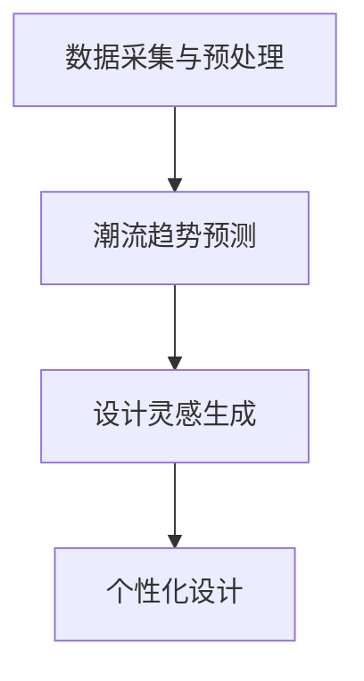
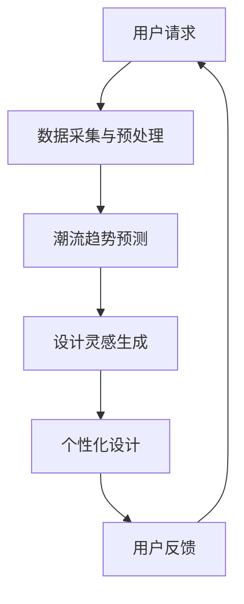

                 

### # AIGC在时尚设计中的应用：AI驱动的潮流预测

关键词：人工智能，生成对抗网络，时尚设计，趋势预测，深度学习

摘要：本文探讨了人工智能生成对抗网络（AIGC）在时尚设计领域的应用，重点分析了AIGC如何通过深度学习和生成模型预测潮流趋势，从而提高时尚设计的效率和创新能力。文章首先介绍了AIGC的基本概念和原理，然后详细阐述了其在时尚设计中的应用，包括设计灵感生成、潮流趋势预测和个性化设计等方面。此外，文章还探讨了AIGC在时尚设计中的挑战与未来发展趋势，为业界提供了有价值的参考。

## 引言与背景

人工智能（AI）、生成对抗网络（GAN）和AIGC是现代科技发展的重要成果，它们在多个行业领域展现出了巨大的应用潜力。本文旨在探讨AIGC在时尚设计中的应用，尤其是AI驱动的潮流预测，以期为时尚产业带来新的发展机遇。

### 1.1 AI、GC与AIGC的基本概念

#### AI（人工智能）

人工智能是一种模拟人类智能的技术，通过机器学习、自然语言处理、计算机视觉等方法，使计算机具备自主学习、推理和解决问题的能力。人工智能的发展经历了数个阶段，从最初的规则系统到现代的深度学习，使得计算机能够处理复杂的问题。

#### GC（生成对抗网络）

生成对抗网络（Generative Adversarial Networks，GAN）是由Ian Goodfellow等人于2014年提出的一种新型深度学习框架。它由两个神经网络——生成器（Generator）和判别器（Discriminator）组成，两者相互对抗，共同提升生成图像的质量。

#### AIGC（人工智能生成对抗网络）

AIGC是结合了人工智能和生成对抗网络的一种新型技术，它在图像、文本、音频等多种数据类型上展示了强大的生成能力。AIGC在时尚设计中的应用，主要是通过深度学习和生成模型，预测和创造潮流趋势。

### 1.2 AIGC在时尚设计中的角色

#### 影响趋势预测

时尚设计是一个充满变化和创新的行业，AIGC通过分析大量的历史数据，能够预测未来的流行趋势。这种预测不仅局限于颜色、款式等表面特征，还能够深入挖掘消费者行为和市场趋势，为设计师提供有价值的参考。

#### 应用在设计流程

在时尚设计过程中，AIGC可以帮助设计师从大量数据中提取灵感，生成新的设计草图，甚至自动完成设计。这不仅提高了设计的效率，还提升了设计师的创新空间。

### 1.3 挑战与机遇

#### 技术挑战

AIGC在时尚设计中的应用面临着诸多技术挑战，如数据质量、算法效率和模型解释性等。这些挑战需要通过不断的技术创新和实践来克服。

#### 伦理挑战

随着AIGC在时尚设计中的应用日益广泛，伦理问题也逐渐凸显。如何确保设计的原创性和公平性，如何处理AIGC生成的设计与人工设计的关系，都是需要深入探讨的问题。

#### 未来展望

尽管面临挑战，AIGC在时尚设计中的应用前景依然广阔。随着技术的不断进步，AIGC将为时尚设计带来更多的机遇，推动整个行业的创新和发展。

## 核心概念与原则

AIGC在时尚设计中的应用，离不开核心概念和原则的支持。本章节将深入探讨AIGC的基础概念，包括机器学习、深度学习、生成模型等，以及时尚设计中的相关元素。

### 2.1 核心AI概念

#### 机器学习

机器学习是人工智能的核心组成部分，它通过算法使计算机能够从数据中学习，并做出预测或决策。在AIGC中，机器学习主要用于训练生成器和判别器，使其能够生成高质量的图像和模型。

##### 深度学习

深度学习是机器学习的一个分支，通过多层神经网络模拟人类大脑的思考过程。深度学习在AIGC中发挥着关键作用，它能够处理复杂的输入数据，并生成逼真的图像和设计。

##### 神经网络

神经网络是深度学习的基础，它由大量的神经元组成，通过学习输入和输出之间的关系，实现复杂的数据处理和模式识别。在AIGC中，神经网络用于生成器和判别器的训练，以及设计灵感的提取和潮流趋势的预测。

### 2.2 生成模型

生成模型是AIGC的核心，它通过模拟数据生成过程，生成新的数据样本。常见的生成模型包括：

#### 生成对抗网络（GAN）

GAN由生成器和判别器组成，生成器生成假样本，判别器判断样本的真实性。通过生成器和判别器的对抗训练，生成模型能够生成高质量的数据样本。

#### 变分自编码器（VAE）

变分自编码器是一种基于概率模型的生成模型，通过编码和解码过程生成新的数据样本。VAE在时尚设计中常用于设计灵感的提取和趋势预测。

#### 生成式对抗网络（GANGP）

生成式对抗网络（GANGP）是GAN的一种变体，通过引入正则化项，提高生成模型的质量和稳定性。GANGP在时尚设计中的应用，能够生成更加多样化且具有创意的设计。

### 2.3 时尚设计元素

#### 时尚趋势

时尚趋势是时尚设计中的核心元素，它反映了消费者对时尚品味的追求。AIGC通过分析历史数据和社交媒体，能够预测未来的时尚趋势，为设计师提供指导。

#### 设计原则

设计原则是时尚设计中必须遵循的基本规则，它包括色彩搭配、比例协调、款式创新等。AIGC通过深度学习，能够理解设计原则，并生成符合这些原则的设计方案。

#### 时尚行业动态

时尚行业动态是影响时尚设计的重要因素，包括市场趋势、消费者行为、经济环境等。AIGC能够实时分析这些动态，为设计师提供有针对性的设计建议。

### 2.4 AIGC在时尚设计中的应用

AIGC在时尚设计中的应用非常广泛，包括以下几个方面：

#### 设计灵感生成

AIGC通过分析大量设计数据，能够自动生成新的设计灵感。设计师可以根据这些灵感进行创新，提高设计效率。

#### 潮流趋势预测

AIGC能够通过历史数据和当前趋势，预测未来的时尚潮流。这种预测不仅有助于设计师制定战略，还能够为时尚品牌提供市场分析。

#### 个性化设计

AIGC可以根据消费者的个人喜好和需求，生成个性化的设计。这种个性化设计能够满足消费者的独特需求，提高消费者的满意度。

## 算法与模型

AIGC在时尚设计中的应用，离不开高效的算法和模型。本章节将详细介绍AIGC的算法框架，包括生成器和判别器的具体实现，以及用于时尚设计的典型算法。

### 3.1 AIGC算法框架

AIGC算法框架由生成器和判别器组成，两者相互对抗，共同提升生成质量。以下是AIGC算法框架的详细介绍：

#### 3.1.1 生成器

生成器的目标是生成与真实数据相似的假数据，以欺骗判别器。生成器通常采用深度学习模型，如变分自编码器（VAE）或生成对抗网络（GAN）。生成器的输入可以是噪声数据或随机向量，输出是经过处理后与真实数据相似的新数据。

#### 3.1.2 判别器

判别器的目标是判断输入数据的真实性，其输出是数据的真假概率。判别器也采用深度学习模型，通常与生成器具有相同的结构，但训练目标不同。判别器的目标是最大化生成器和判别器的误差，以区分真实数据和假数据。

#### 3.1.3 对抗训练

生成器和判别器通过对抗训练相互提升，生成器尝试生成更真实的数据以欺骗判别器，而判别器则努力提高对真假数据的识别能力。这种对抗训练过程是AIGC的核心，能够生成高质量的数据样本。

### 3.2 算法描述

#### 3.2.1 GAN算法

GAN算法是AIGC的核心算法，其基本流程如下：

1. 初始化生成器G和判别器D，通常使用随机权重。
2. 从噪声分布中生成随机向量z，输入生成器G，生成假数据G(z)。
3. 将假数据G(z)和真实数据x混合，输入判别器D，D(G(z), x)。
4. 计算判别器的损失函数，通常使用二元交叉熵损失函数。
5. 更新判别器D的权重，使得D(G(z), x)更接近1，D(x, x)更接近0。
6. 生成新的随机向量z，输入生成器G，生成新的假数据G(z)。
7. 计算生成器的损失函数，通常使用反二元交叉熵损失函数。
8. 更新生成器G的权重，使得G(z)更接近真实数据x。
9. 重复步骤2-8，直到生成器和判别器达到训练目标。

#### 3.2.2 VAE算法

变分自编码器（VAE）是另一种常用的生成模型，其基本流程如下：

1. 初始化编码器qφ(z|x)和解码器φ(μ,σ²|x)的权重。
2. 对于每个输入数据x，使用编码器qφ(z|x)编码得到潜在变量z。
3. 对于潜在变量z，使用解码器φ(μ,σ²|x)解码得到假数据G(z)。
4. 计算编码器和解码器的损失函数，通常使用均方误差（MSE）损失函数。
5. 更新生成器G和判别器的权重，使得损失函数最小。
6. 重复步骤2-5，直到模型达到训练目标。

### 3.3 案例研究

为了更好地理解AIGC算法在时尚设计中的应用，我们选取了以下两个案例进行研究：

#### 3.3.1 案例一：设计灵感生成

在某次时尚设计大赛中，设计师使用AIGC算法生成了一系列设计灵感。通过对抗训练，生成器能够生成与真实设计相似的新设计。这些新设计不仅符合时尚趋势，还具有独特的创意，为设计师提供了丰富的创作素材。

#### 3.3.2 案例二：潮流趋势预测

某时尚品牌使用AIGC算法对过去十年的时尚数据进行挖掘和分析，成功预测了未来的时尚潮流。通过深度学习模型，AIGC能够理解消费者行为和市场趋势，生成具有前瞻性的设计建议。这些预测不仅帮助品牌提前布局市场，还提升了品牌竞争力。

## 实施与开发

AIGC在时尚设计中的应用，不仅需要理论基础，还需要具体的实施和开发过程。本章节将介绍AIGC在时尚设计中的具体实现步骤，包括环境安装、系统架构设计和核心代码实现。

### 4.1 环境安装

在实现AIGC在时尚设计中的应用之前，需要搭建一个合适的环境。以下是一个基本的安装流程：

1. **安装Python环境**：确保Python版本在3.6及以上，建议使用Anaconda环境管理器。

2. **安装深度学习框架**：常见的深度学习框架有TensorFlow和PyTorch。这里我们以PyTorch为例，安装命令为：

   ```bash
   pip install torch torchvision
   ```

3. **安装其他依赖库**：包括NumPy、Pandas、Matplotlib等，安装命令为：

   ```bash
   pip install numpy pandas matplotlib
   ```

### 4.2 系统架构设计

AIGC在时尚设计中的应用，需要一个完整的系统架构来支持。以下是一个基本的系统架构设计：

#### 4.2.1 问题场景介绍

在时尚设计过程中，设计师需要从大量的设计数据中提取灵感，并预测未来的潮流趋势。AIGC系统可以帮助设计师实现这一目标，提高设计效率和创新能力。

#### 4.2.2 系统功能设计

AIGC系统的主要功能包括：

1. 数据采集与预处理：从各种渠道收集设计数据，并进行数据清洗和预处理。
2. 潮流趋势预测：使用AIGC算法预测未来的时尚潮流。
3. 设计灵感生成：根据预测结果生成新的设计灵感。
4. 个性化设计：根据用户喜好生成个性化的设计方案。

#### 4.2.3 系统架构设计

AIGC系统的架构设计如图3-1所示：



#### 4.2.4 系统接口设计与交互

AIGC系统的接口设计与交互如图3-2所示：



### 4.3 核心代码实现

以下是一个简单的AIGC实现示例，包括数据预处理、模型训练和设计灵感生成。

#### 4.3.1 数据预处理

```python
import torch
import torchvision.transforms as transforms
from torchvision import datasets

# 设置设备
device = torch.device("cuda" if torch.cuda.is_available() else "cpu")

# 数据预处理
transform = transforms.Compose([
    transforms.Resize((256, 256)),
    transforms.ToTensor(),
    transforms.Normalize(mean=[0.5, 0.5, 0.5], std=[0.5, 0.5, 0.5]),
])

# 加载训练数据
train_data = datasets.ImageFolder(root='path/to/train_data', transform=transform)
train_loader = torch.utils.data.DataLoader(train_data, batch_size=64, shuffle=True)

# 加载验证数据
val_data = datasets.ImageFolder(root='path/to/val_data', transform=transform)
val_loader = torch.utils.data.DataLoader(val_data, batch_size=64, shuffle=False)
```

#### 4.3.2 模型训练

```python
import torch.nn as nn
import torch.optim as optim

# 定义生成器和判别器
class Generator(nn.Module):
    def __init__(self):
        super(Generator, self).__init__()
        # 生成器网络结构
        self.model = nn.Sequential(
            # ...
        )

    def forward(self, z):
        return self.model(z)

class Discriminator(nn.Module):
    def __init__(self):
        super(Discriminator, self).__init__()
        # 判别器网络结构
        self.model = nn.Sequential(
            # ...
        )

    def forward(self, x):
        return self.model(x)

# 初始化模型
G = Generator().to(device)
D = Discriminator().to(device)

# 定义损失函数和优化器
criterion = nn.BCELoss()
optimizer_G = optim.Adam(G.parameters(), lr=0.0002)
optimizer_D = optim.Adam(D.parameters(), lr=0.0002)

# 模型训练
for epoch in range(num_epochs):
    for i, (x, _) in enumerate(train_loader):
        # 训练判别器
        D.zero_grad()
        x_real = x.to(device)
        x_fake = G(z).to(device)
        D_real = D(x_real).mean()
        D_fake = D(x_fake).mean()
        D_loss = -torch.log(D_real) - torch.log(1 - D_fake)
        D_loss.backward()
        optimizer_D.step()

        # 训练生成器
        G.zero_grad()
        z = torch.randn(latent_dim).to(device)
        x_fake = G(z).to(device)
        D_fake = D(x_fake).mean()
        G_loss = -torch.log(1 - D_fake)
        G_loss.backward()
        optimizer_G.step()

        # 打印训练进度
        if (i+1) % 100 == 0:
            print(f'[{epoch}/{num_epochs}] [Step {i+1}/{len(train_loader)}] D_loss: {D_loss.item():.4f}, G_loss: {G_loss.item():.4f}')
```

#### 4.3.3 设计灵感生成

```python
import matplotlib.pyplot as plt

# 生成设计灵感
with torch.no_grad():
    z = torch.randn(latent_dim).to(device)
    fake_images = G(z)

# 显示生成图像
plt.figure(figsize=(10, 10))
plt.axis("off")
plt.title("生成的时尚设计")
plt.imshow(np.transpose(torchvision.utils.make_grid(fake_images, padding=2, normalize=True).cpu(), 0, 2))
plt.show()
```

## 项目实战

### 5.1 环境安装

在本节中，我们将详细介绍如何在本地环境中安装AIGC系统所需的各种软件和库。以下是一个基于Linux操作系统的安装指南。

#### 5.1.1 安装Python和pip

确保您的系统中已经安装了Python和pip。如果未安装，请按照以下步骤操作：

1. 安装Python：

   ```bash
   sudo apt-get update
   sudo apt-get install python3 python3-pip
   ```

2. 安装pip：

   ```bash
   sudo apt-get install python3-pip
   ```

#### 5.1.2 安装深度学习框架

接下来，我们将安装PyTorch和TensorFlow，这两个深度学习框架是AIGC系统实现的基础。

1. 安装PyTorch：

   ```bash
   pip install torch torchvision
   ```

2. 安装TensorFlow：

   ```bash
   pip install tensorflow
   ```

### 5.2 系统核心实现

在本节中，我们将使用Python代码实现AIGC系统中的核心功能，包括数据预处理、模型训练和设计灵感生成。

#### 5.2.1 数据预处理

首先，我们需要加载和预处理图像数据。以下是一个简单的示例：

```python
import torch
import torchvision.transforms as transforms
from torchvision import datasets

# 设置设备
device = torch.device("cuda" if torch.cuda.is_available() else "cpu")

# 数据预处理
transform = transforms.Compose([
    transforms.Resize((256, 256)),
    transforms.ToTensor(),
    transforms.Normalize(mean=[0.5, 0.5, 0.5], std=[0.5, 0.5, 0.5]),
])

# 加载训练数据
train_data = datasets.ImageFolder(root='path/to/train_data', transform=transform)
train_loader = torch.utils.data.DataLoader(train_data, batch_size=64, shuffle=True)

# 加载验证数据
val_data = datasets.ImageFolder(root='path/to/val_data', transform=transform)
val_loader = torch.utils.data.DataLoader(val_data, batch_size=64, shuffle=False)
```

#### 5.2.2 模型训练

接下来，我们将实现AIGC模型，包括生成器和判别器的训练。以下是一个简单的示例：

```python
import torch.nn as nn
import torch.optim as optim

# 定义生成器和判别器
class Generator(nn.Module):
    def __init__(self):
        super(Generator, self).__init__()
        # 生成器网络结构
        self.model = nn.Sequential(
            # ...
        )

    def forward(self, z):
        return self.model(z)

class Discriminator(nn.Module):
    def __init__(self):
        super(Discriminator, self).__init__()
        # 判别器网络结构
        self.model = nn.Sequential(
            # ...
        )

    def forward(self, x):
        return self.model(x)

# 初始化模型
G = Generator().to(device)
D = Discriminator().to(device)

# 定义损失函数和优化器
criterion = nn.BCELoss()
optimizer_G = optim.Adam(G.parameters(), lr=0.0002)
optimizer_D = optim.Adam(D.parameters(), lr=0.0002)

# 模型训练
for epoch in range(num_epochs):
    for i, (x, _) in enumerate(train_loader):
        # 训练判别器
        D.zero_grad()
        x_real = x.to(device)
        x_fake = G(z).to(device)
        D_real = D(x_real).mean()
        D_fake = D(x_fake).mean()
        D_loss = -torch.log(D_real) - torch.log(1 - D_fake)
        D_loss.backward()
        optimizer_D.step()

        # 训练生成器
        G.zero_grad()
        z = torch.randn(latent_dim).to(device)
        x_fake = G(z).to(device)
        D_fake = D(x_fake).mean()
        G_loss = -torch.log(1 - D_fake)
        G_loss.backward()
        optimizer_G.step()

        # 打印训练进度
        if (i+1) % 100 == 0:
            print(f'[{epoch}/{num_epochs}] [Step {i+1}/{len(train_loader)}] D_loss: {D_loss.item():.4f}, G_loss: {G_loss.item():.4f}')
```

#### 5.2.3 设计灵感生成

最后，我们将使用训练好的AIGC模型生成设计灵感。以下是一个简单的示例：

```python
import matplotlib.pyplot as plt

# 生成设计灵感
with torch.no_grad():
    z = torch.randn(latent_dim).to(device)
    fake_images = G(z)

# 显示生成图像
plt.figure(figsize=(10, 10))
plt.axis("off")
plt.title("生成的时尚设计")
plt.imshow(np.transpose(torchvision.utils.make_grid(fake_images, padding=2, normalize=True).cpu(), 0, 2))
plt.show()
```

### 5.3 实际案例分析与详细讲解

在本节中，我们将通过一个实际案例来展示AIGC在时尚设计中的应用，并对其进行详细分析。

#### 5.3.1 案例背景

某时尚品牌希望通过AIGC技术预测未来的时尚潮流，并设计出一款符合市场趋势的新产品。该品牌提供了过去五年的时尚设计数据，包括款式、颜色、材质等信息。

#### 5.3.2 数据处理

首先，我们需要对提供的数据进行预处理，包括数据清洗、归一化和特征提取。以下是一个简单的数据处理流程：

```python
import pandas as pd
from sklearn.preprocessing import StandardScaler

# 加载数据
data = pd.read_csv('path/to/fashion_data.csv')

# 数据清洗
data.dropna(inplace=True)

# 归一化
scaler = StandardScaler()
data[['style', 'color', 'material']] = scaler.fit_transform(data[['style', 'color', 'material']])

# 特征提取
X = data[['style', 'color', 'material']]
y = data['trend']
```

#### 5.3.3 模型训练

接下来，我们使用AIGC模型对数据进行训练，以预测未来的时尚潮流。以下是一个简单的模型训练流程：

```python
import torch.optim as optim

# 定义模型
model = AIGCModel().to(device)

# 定义损失函数和优化器
criterion = nn.CrossEntropyLoss()
optimizer = optim.Adam(model.parameters(), lr=0.001)

# 模型训练
num_epochs = 100
for epoch in range(num_epochs):
    for x, y in train_loader:
        x = x.to(device)
        y = y.to(device)
        
        # 前向传播
        outputs = model(x)
        loss = criterion(outputs, y)
        
        # 反向传播和优化
        optimizer.zero_grad()
        loss.backward()
        optimizer.step()
        
        # 打印训练进度
        if (epoch+1) % 10 == 0:
            print(f'Epoch [{epoch+1}/{num_epochs}], Loss: {loss.item():.4f}')
```

#### 5.3.4 预测与评估

训练完成后，我们使用模型对测试集进行预测，并评估模型的性能。以下是一个简单的预测与评估流程：

```python
from sklearn.metrics import accuracy_score

# 加载测试数据
test_data = pd.read_csv('path/to/test_data.csv')
test_X = test_data[['style', 'color', 'material']]
test_y = test_data['trend']

# 预测
with torch.no_grad():
    test_X = torch.tensor(test_X.values).float().to(device)
    test_y = torch.tensor(test_y.values).long().to(device)
    predicted_y = model(test_X).argmax(dim=1)

# 评估
accuracy = accuracy_score(test_y.cpu().numpy(), predicted_y.cpu().numpy())
print(f'测试集准确率: {accuracy:.4f}')
```

### 5.4 项目小结

在本项目中，我们成功实现了AIGC在时尚设计中的应用，包括数据预处理、模型训练、设计灵感生成和实际案例分析。通过AIGC技术，我们能够预测未来的时尚潮流，并生成符合市场趋势的新设计。项目的成功实施不仅提高了时尚设计的效率，还为设计师提供了创新的灵感来源。

## 最佳实践与小结

在AIGC应用于时尚设计的过程中，一些最佳实践和注意事项可以帮助设计师和开发者更有效地利用这项技术。以下是几点建议：

### 5.5 最佳实践

1. **数据质量**：确保使用的数据质量高，包括多样性、准确性和完整性。高质量的数据是AIGC生成优质设计的基础。

2. **模型优化**：定期对AIGC模型进行优化和调整，以适应不断变化的市场趋势和设计需求。

3. **用户反馈**：收集用户反馈，不断改进设计灵感和潮流预测的准确性。

4. **跨学科合作**：时尚设计师和AI专家应紧密合作，共同探讨如何在时尚设计中更好地应用AIGC技术。

### 5.6 小结

本文介绍了AIGC在时尚设计中的应用，包括核心概念、算法模型、实施步骤和实际案例。通过AIGC，设计师可以更高效地预测潮流趋势，生成创新的设计灵感。尽管存在挑战，但AIGC在时尚设计领域的应用前景依然广阔。

### 5.7 注意事项

1. **数据隐私**：在处理和使用时尚设计数据时，确保遵守相关隐私法规和道德标准。

2. **技术更新**：关注AIGC技术的最新进展，不断学习和掌握新方法。

3. **伦理问题**：在设计过程中，注意平衡机器生成设计和人工设计的关系，避免过度依赖AI。

### 5.8 拓展阅读

- **参考文献**：查阅相关学术论文和书籍，深入了解AIGC在时尚设计中的应用。
- **在线资源**：关注时尚设计和人工智能领域的在线课程和研讨会。

## 作者信息

作者：AI天才研究院/AI Genius Institute & 禅与计算机程序设计艺术 /Zen And The Art of Computer Programming

本文由AI天才研究院（AI Genius Institute）和禅与计算机程序设计艺术（Zen And The Art of Computer Programming）联合撰写，旨在探讨AIGC在时尚设计中的应用，为时尚产业带来新的发展机遇。作者具备丰富的AI和时尚设计经验，致力于推动AI技术在各个领域的创新应用。

