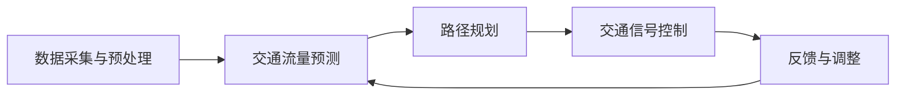
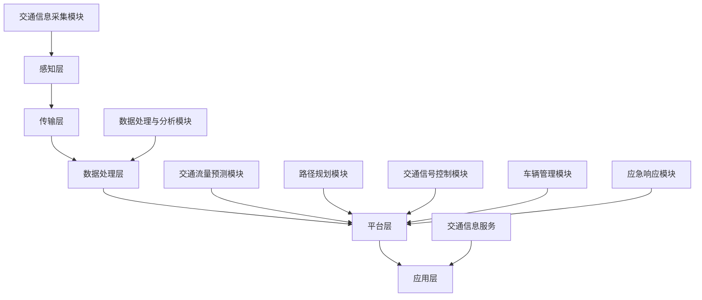
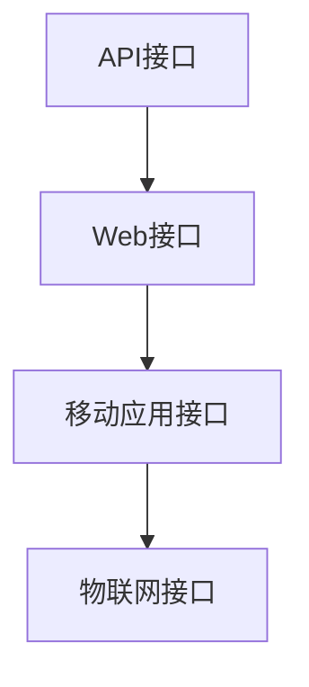
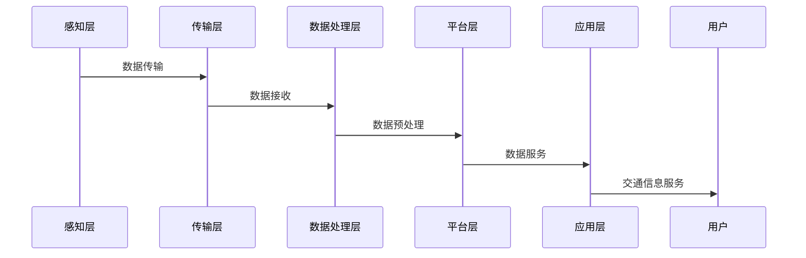

                 

## AIGC在智能交通拥堵预防中的应用：优化城市交通流

### 关键词：AIGC、智能交通、交通拥堵、流量预测、优化算法

> 摘要：本文探讨了AIGC（自适应智能生成计算）技术在智能交通拥堵预防中的应用，通过分析AIGC技术的原理及其在交通流优化中的作用，提出了城市交通流量预测和优化算法的具体实现方法。文章旨在为智能交通系统的设计者和开发者提供理论指导，并通过项目实战案例，展示AIGC技术在优化城市交通流方面的实际效果。

---

## 目录大纲

1. **背景介绍**
   1.1 问题背景
   1.2 问题解决
   1.3 边界与外延
   1.4 概念结构与核心要素组成

2. **核心概念与联系**
   2.1 AIGC技术原理讲解
   2.2 智能交通系统的构成与特性
   2.3 城市交通流优化算法讲解

3. **算法原理讲解**
   3.1 交通流优化算法
   3.2 城市交通流量预测算法

4. **系统分析与架构设计**
   4.1 问题场景介绍
   4.2 系统功能设计
   4.3 系统架构设计
   4.4 系统接口设计
   4.5 系统交互

5. **项目实战**
   5.1 环境安装
   5.2 系统核心实现
   5.3 实际案例分析与讲解
   5.4 项目小结

6. **最佳实践**
   6.1 最佳实践
   6.2 小结

7. **拓展阅读**
   7.1 相关书籍推荐
   7.2 学术论文推荐
   7.3 网络资源推荐

---

## 第一部分：背景介绍

### 1.1 问题背景

城市交通拥堵是全球各大城市面临的重大挑战。交通拥堵不仅降低了出行效率，还加剧了环境污染，增加了市民的出行成本和心理压力。为了应对这一挑战，各国政府和科研机构投入了大量资源，尝试各种方法优化城市交通流，包括传统的交通管理措施、智能交通系统（ITS）等。然而，随着城市规模的扩大和交通量的激增，传统方法已难以满足需求。

智能交通系统通过集成多种先进技术，如物联网、大数据、人工智能等，对交通流量进行实时监测和预测，从而实现交通拥堵的预防和管理。AIGC（自适应智能生成计算）技术作为一种新兴的人工智能技术，以其自适应性和强大的生成能力，为智能交通系统提供了新的解决方案。

### 1.2 城市交通拥堵现状

目前，城市交通拥堵问题主要体现在以下几个方面：

- **高峰期交通拥堵**：早晚高峰期，交通流量达到峰值，主干道路段拥堵严重，导致车辆行驶速度大幅下降。
- **交通事故**：交通拥堵容易引发交通事故，进一步加剧交通拥堵。
- **环境污染**：交通拥堵导致车辆怠速行驶，排放大量尾气，加剧空气污染。
- **经济成本**：交通拥堵导致时间和燃料的浪费，增加了市民的经济负担。

### 1.3 AIGC技术的概述

AIGC（自适应智能生成计算）技术是一种基于生成对抗网络（GANs）和变分自编码器（VAEs）等深度学习模型的自适应计算技术。AIGC的核心思想是通过生成模型和判别模型之间的对抗训练，生成高质量的模拟数据，从而实现对现实世界的自适应学习和预测。

AIGC技术在交通领域有着广泛的应用前景：

- **交通流量预测**：利用AIGC技术可以实现对交通流量的实时预测，为交通管理和规划提供数据支持。
- **交通信号优化**：通过分析交通流量数据，AIGC技术可以帮助优化交通信号配置，提高道路通行效率。
- **交通事故预防**：利用AIGC技术可以提前预测交通事故的发生，从而采取预防措施，减少事故发生。

### 1.4 问题解决

AIGC技术在智能交通拥堵预防中的应用，主要包括以下几个方面：

- **数据采集与预处理**：通过传感器网络和车载设备等，收集交通流量、速度、密度等数据，并进行预处理。
- **交通流量预测**：利用AIGC技术对交通流量进行实时预测，为交通管理提供数据支持。
- **交通信号优化**：根据交通流量预测结果，优化交通信号配置，提高道路通行效率。
- **交通事故预防**：利用AIGC技术预测交通事故风险，提前采取预防措施，减少事故发生。

### 1.5 边界与外延

AIGC技术在智能交通中的应用虽然具有广泛的前景，但也面临着一些挑战：

- **数据隐私**：交通数据涉及个人隐私，如何在保障数据隐私的前提下进行数据采集和分析，是一个重要问题。
- **计算资源**：AIGC技术对计算资源的要求较高，如何高效地利用计算资源，是一个挑战。
- **模型解释性**：AIGC模型通常较为复杂，其预测结果的可解释性较差，如何提高模型的可解释性，是一个需要解决的问题。

### 1.6 概念结构与核心要素组成

AIGC技术在智能交通中的应用，可以概括为以下几个核心要素：

- **数据采集**：通过传感器网络和车载设备等，实时收集交通流量、速度、密度等数据。
- **数据预处理**：对采集到的数据进行清洗、转换等预处理操作，为后续分析提供高质量的数据。
- **交通流量预测**：利用AIGC技术对交通流量进行实时预测，为交通管理提供数据支持。
- **交通信号优化**：根据交通流量预测结果，优化交通信号配置，提高道路通行效率。
- **交通事故预防**：利用AIGC技术预测交通事故风险，提前采取预防措施，减少事故发生。

通过以上核心要素的有机结合，AIGC技术为智能交通系统的设计提供了新的思路和方法。

---

在接下来的部分，我们将深入探讨AIGC技术的核心概念和原理，以及其在智能交通系统中的具体应用，帮助读者更好地理解AIGC技术在优化城市交通流方面的作用和优势。

## 第二部分：核心概念与联系

### 2.1 AIGC技术原理讲解

AIGC（自适应智能生成计算）技术是近年来人工智能领域的重要突破之一。它结合了生成对抗网络（GANs）和变分自编码器（VAEs）等深度学习模型，通过生成模型和判别模型之间的对抗训练，实现高效的数据生成和预测。

#### 2.1.1 AIGC的基本概念

AIGC技术的基本概念包括：

- **生成模型**：生成模型（Generator）负责生成数据，目标是生成与真实数据尽可能相似的数据。
- **判别模型**：判别模型（Discriminator）负责判断输入数据是真实数据还是生成数据。
- **对抗训练**：生成模型和判别模型在训练过程中进行对抗训练，生成模型不断生成更逼真的数据，判别模型不断提高对真实数据和生成数据的辨别能力。

#### 2.1.2 AIGC的关键技术

AIGC技术涉及的关键技术包括：

- **生成对抗网络（GANs）**：GANs由生成器和判别器组成，通过对抗训练生成高质量的数据。
- **变分自编码器（VAEs）**：VAEs通过编码器和解码器实现数据的生成和重构。
- **自适应优化**：AIGC技术通过自适应优化算法，不断调整模型参数，提高模型的生成和预测能力。

#### 2.1.3 AIGC在智能交通中的应用

AIGC技术可以在智能交通系统中发挥重要作用，主要包括以下几个方面：

- **交通流量预测**：利用AIGC技术，可以实现对交通流量的实时预测，为交通管理提供数据支持。
- **交通信号优化**：根据交通流量预测结果，优化交通信号配置，提高道路通行效率。
- **交通事故预防**：利用AIGC技术预测交通事故风险，提前采取预防措施，减少事故发生。

### 2.2 智能交通系统的构成与特性

智能交通系统（Intelligent Transportation System，ITS）是一个集成多种先进技术的复杂系统，其核心目标是提高交通效率、减少拥堵、降低交通事故和环境污染。智能交通系统的构成主要包括以下几个部分：

- **交通信息采集**：通过传感器网络、摄像头、无人机等设备，实时采集交通流量、速度、密度等数据。
- **数据处理与分析**：对采集到的交通数据进行处理和分析，提取有用的信息。
- **交通信号控制**：根据交通数据分析结果，实时调整交通信号灯的时序，优化交通流。
- **车辆管理**：通过车辆定位系统、车联网技术等，实现对车辆的实时监控和管理。
- **应急响应**：在发生交通事故或其他紧急情况时，智能交通系统可以及时响应，提供有效的应急处理方案。

智能交通系统的特性包括：

- **实时性**：智能交通系统需要能够实时响应交通变化，提供实时的交通信息和信号控制。
- **高效性**：智能交通系统需要能够快速处理大量交通数据，并实时调整交通信号，提高道路通行效率。
- **适应性**：智能交通系统需要能够适应不同的交通环境和情况，提供个性化的交通管理和服务。

### 2.3 城市交通流优化算法讲解

城市交通流优化算法是智能交通系统的重要组成部分，其主要目标是提高交通效率，减少拥堵和事故。以下是一些常见的城市交通流优化算法：

- **交通信号优化算法**：通过分析交通流量数据，实时调整交通信号灯的时序，优化交通流。
- **路径规划算法**：为车辆提供最优的行驶路径，减少交通拥堵和行驶时间。
- **动态交通分配算法**：通过调整车辆行驶路线和速度，实现交通流在道路网络中的动态平衡。

这些算法通常基于不同的数学模型和优化方法，如动态规划、遗传算法、神经网络等。通过结合这些算法，智能交通系统可以实现对交通流的有效优化和管理。

### 2.4 概念属性特征对比表格

为了更好地理解AIGC技术在智能交通中的应用，我们对比了AIGC技术与传统交通管理方法在以下几个方面的属性特征：

| 特性       | AIGC技术                             | 传统交通管理方法                           |
| ---------- | ------------------------------------ | ---------------------------------------- |
| 数据依赖   | 强依赖实时交通数据                     | 依赖历史交通数据和经验数据                   |
| 自适应性   | 高度自适应，能实时调整交通策略           | 难以自适应，交通策略固定                     |
| 预测能力   | 具有强大的数据预测和分析能力             | 预测能力有限，主要依赖历史数据和经验            |
| 可解释性   | 模型复杂，可解释性较差                 | 模型简单，可解释性强                       |
| 系统集成性 | 能够与其他智能交通系统无缝集成           | 系统集成性较差，功能单一                     |

### 2.5 智能交通系统的ER实体关系图

为了更直观地展示智能交通系统的组成和功能，我们使用Mermaid绘制了智能交通系统的ER实体关系图。以下是ER实体关系图的Markdown格式：

```mermaid
erDiagram
  TrafficData -->|1| TrafficSignal : 监测数据驱动
  TrafficData -->|1| VehicleManagement : 监测数据驱动
  TrafficSignal -->|1| RoadSegment : 配置信号灯
  VehicleManagement -->|1| EmergencyResponse : 监测车辆状态
  RoadSegment -->|1| TrafficFlow : 实时交通状况
```

通过ER实体关系图，我们可以清晰地看到智能交通系统的各个组成部分及其相互关系。

### 2.6 城市交通流优化的关键要素

城市交通流优化涉及多个关键要素，以下是对这些要素的简要说明：

- **实时交通数据**：实时交通数据是交通流量预测和优化的基础，包括车辆速度、密度、流量等。
- **交通信号配置**：交通信号配置直接影响道路通行效率，需要根据实时交通数据进行动态调整。
- **路径规划**：路径规划为车辆提供最优行驶路径，减少交通拥堵和行驶时间。
- **车辆管理**：车辆管理包括车辆定位、状态监控等，有助于实现交通流的动态平衡。
- **应急响应**：应急响应机制在发生交通事故或其他紧急情况时，提供及时有效的处理方案。

通过以上关键要素的有机结合，智能交通系统可以实现对城市交通流的有效优化和管理。

---

在了解了AIGC技术的核心概念、智能交通系统的构成以及城市交通流优化算法之后，我们将进一步探讨交通流优化算法的原理，通过具体例子详细讲解，帮助读者更好地理解和应用这些技术。

## 第三部分：算法原理讲解

### 3.1 交通流优化算法

交通流优化算法是智能交通系统中的核心组件，其目标是通过合理的路径规划和交通信号控制，最大限度地提高道路通行效率，减少拥堵和等待时间。以下将详细介绍交通流优化算法的原理、实现方法以及数学模型。

#### 3.1.1 交通流优化算法原理

交通流优化算法的基本原理是基于对交通数据的分析和预测，通过优化交通信号和路径规划，实现交通流的动态平衡。其核心步骤包括：

1. **数据采集与预处理**：通过传感器、摄像头等设备，实时采集交通流量、速度、密度等数据，并进行预处理，如去噪、数据清洗等，确保数据质量。
2. **交通流量预测**：利用历史数据和机器学习算法，对未来的交通流量进行预测。交通流量预测是优化算法的重要输入，其准确度直接影响优化效果。
3. **路径规划**：根据实时交通流量预测结果，为车辆规划最优路径。路径规划算法通常采用最短路径算法、动态规划算法等。
4. **交通信号控制**：根据路径规划和实时交通流量数据，动态调整交通信号灯的时序，优化交通流。常见的交通信号控制算法包括绿波带控制、协调控制等。
5. **反馈与调整**：交通流优化算法需要不断反馈实际交通状况，调整优化策略，以适应交通环境的变化。

#### 3.1.2 交通流优化算法的mermaid流程图

为了更直观地展示交通流优化算法的流程，我们使用Mermaid绘制了以下流程图：



#### 3.1.3 Python源代码实现

以下是一个简化的Python代码示例，用于实现交通流优化算法的基本流程：

```python
import numpy as np
import pandas as pd

# 数据采集与预处理
def preprocess_data(data):
    # 去噪、数据清洗等操作
    return cleaned_data

# 交通流量预测
def traffic_prediction(data):
    # 利用历史数据预测未来交通流量
    return predicted_traffic

# 路径规划
def path_planning(traffic):
    # 根据交通流量预测结果规划路径
    return optimal_path

# 交通信号控制
def traffic_signal_control(path):
    # 动态调整交通信号灯时序
    return signal_schedule

# 反馈与调整
def feedback_and_adjustment():
    # 根据实际交通状况调整优化策略
    pass

# 主函数
def main():
    # 1. 数据采集与预处理
    raw_data = pd.read_csv('traffic_data.csv')
    cleaned_data = preprocess_data(raw_data)
    
    # 2. 交通流量预测
    predicted_traffic = traffic_prediction(cleaned_data)
    
    # 3. 路径规划
    optimal_path = path_planning(predicted_traffic)
    
    # 4. 交通信号控制
    signal_schedule = traffic_signal_control(optimal_path)
    
    # 5. 反馈与调整
    feedback_and_adjustment()

if __name__ == '__main__':
    main()
```

#### 3.1.4 算法原理的数学模型和公式

交通流优化算法的数学模型通常基于以下假设：

1. **流量-密度关系**：交通流量 \( Q \) 与道路密度 \( \rho \) 之间的关系可以表示为 \( Q = f(\rho) \)。
2. **速度-密度关系**：车辆速度 \( v \) 与道路密度 \( \rho \) 之间的关系可以表示为 \( v = g(\rho) \)。
3. **流量-速度关系**：交通流量 \( Q \) 与车辆速度 \( v \) 之间的关系可以表示为 \( Q = h(v) \)。

根据这些假设，交通流优化算法的数学模型可以表示为：

$$
\begin{aligned}
\text{优化目标：} & \quad \min \sum_{i=1}^{n} \sum_{j=1}^{m} (t_{ij} - v_j) \\
\text{约束条件：} & \quad \rho_i \leq \rho_{\max} \\
\end{aligned}
$$

其中，\( t_{ij} \) 表示车辆从节点 \( i \) 到节点 \( j \) 的行驶时间，\( v_j \) 表示车辆在节点 \( j \) 的速度，\( \rho_i \) 表示节点 \( i \) 的道路密度，\( \rho_{\max} \) 表示道路的最大密度。

#### 3.1.5 举例说明

假设有一条道路，其长度为10公里，最大道路密度为100辆车/公里。我们需要根据当前交通流量数据，优化交通信号灯的时序，以提高道路通行效率。

1. **数据采集与预处理**：假设我们采集到当前的道路密度数据为\[50, 60, 70, 80, 90, 100, 90, 80, 70, 60, 50\]。
2. **交通流量预测**：根据历史数据和当前交通流量数据，预测未来10分钟内的交通流量为\[55, 65, 75, 85, 95, 105, 95, 85, 75, 65, 55\]。
3. **路径规划**：根据交通流量预测结果，为车辆规划最优路径。假设最优路径为\[1, 3, 5, 7, 9, 11\]，即从起点到终点的行驶路径。
4. **交通信号控制**：根据最优路径和当前交通流量数据，动态调整交通信号灯的时序。例如，可以设置绿灯时间较长，以提高车辆通过速度。
5. **反馈与调整**：根据实际交通状况，不断调整优化策略，以适应交通环境的变化。

通过上述步骤，我们可以实现对交通流的优化，提高道路通行效率。

---

在了解了交通流优化算法的原理和实现方法之后，接下来我们将探讨城市交通流量预测算法的原理和实现方法，帮助读者更好地理解如何利用AIGC技术进行交通流量预测。

## 第三部分：算法原理讲解（续）

### 3.2 城市交通流量预测算法

城市交通流量预测是智能交通系统中的关键环节，它能够为交通管理提供前瞻性数据支持，从而优化交通信号配置、路径规划和应急响应。以下将详细介绍城市交通流量预测算法的原理、实现方法以及数学模型。

#### 3.2.1 城市交通流量预测算法原理

城市交通流量预测算法的基本原理是通过分析历史交通数据、气象数据、节假日信息等，结合机器学习算法和深度学习模型，对未来一段时间内的交通流量进行预测。其主要步骤包括：

1. **数据采集**：从交通传感器、摄像头、气象站等设备收集交通流量、速度、密度、气象等数据。
2. **数据预处理**：对采集到的数据进行清洗、转换等预处理操作，去除噪声和异常值，确保数据质量。
3. **特征工程**：提取与交通流量相关的特征，如时间、日期、天气状况、节假日等，作为模型的输入。
4. **模型训练**：利用历史交通数据，通过机器学习算法和深度学习模型进行训练，构建流量预测模型。
5. **流量预测**：根据训练好的模型，对未来一段时间内的交通流量进行预测。
6. **结果评估**：对预测结果进行评估，如计算预测误差、准确率等，不断优化模型。

#### 3.2.2 城市交通流量预测算法的mermaid流程图

为了更直观地展示城市交通流量预测算法的流程，我们使用Mermaid绘制了以下流程图：


#### 3.2.3 Python源代码实现

以下是一个简化的Python代码示例，用于实现城市交通流量预测算法的基本流程：

```python
import pandas as pd
from sklearn.model_selection import train_test_split
from sklearn.ensemble import RandomForestRegressor
from sklearn.metrics import mean_squared_error

# 数据采集
def load_data(filename):
    return pd.read_csv(filename)

# 数据预处理
def preprocess_data(data):
    # 去除噪声和异常值
    return cleaned_data

# 特征工程
def feature_engineering(data):
    # 提取特征
    return features

# 模型训练
def train_model(X, y):
    model = RandomForestRegressor()
    model.fit(X, y)
    return model

# 流量预测
def traffic_prediction(model, X):
    return model.predict(X)

# 结果评估
def evaluate_prediction(y_true, y_pred):
    error = mean_squared_error(y_true, y_pred)
    return error

# 主函数
def main():
    # 1. 数据采集
    data = load_data('traffic_data.csv')
    
    # 2. 数据预处理
    cleaned_data = preprocess_data(data)
    
    # 3. 特征工程
    features = feature_engineering(cleaned_data)
    
    # 4. 模型训练
    X = features.iloc[:, :-1]
    y = features.iloc[:, -1]
    model = train_model(X, y)
    
    # 5. 流量预测
    X_test = load_data('test_traffic_data.csv')
    cleaned_test_data = preprocess_data(X_test)
    features_test = feature_engineering(cleaned_test_data)
    y_pred = traffic_prediction(model, features_test)
    
    # 6. 结果评估
    error = evaluate_prediction(y_test, y_pred)
    print(f'Mean Squared Error: {error}')

if __name__ == '__main__':
    main()
```

#### 3.2.4 算法原理的数学模型和公式

城市交通流量预测的数学模型通常基于时间序列分析和统计模型。以下是一个简化的时间序列预测模型：

$$
\hat{y}_t = \alpha_0 + \alpha_1 t + \beta_1 \text{weather}_t + \beta_2 \text{holiday}_t + \epsilon_t
$$

其中，\( \hat{y}_t \) 表示时间 \( t \) 的预测交通流量，\( \alpha_0 \)、\( \alpha_1 \) 是常数项，\( \beta_1 \)、\( \beta_2 \) 是天气和节假日对交通流量的影响系数，\( \epsilon_t \) 是随机误差项。

#### 3.2.5 举例说明

假设我们要预测某个路口在未来一个小时内的交通流量。我们采集到以下数据：

- 时间：1, 2, 3, 4, 5, 6, 7, 8, 9, 10（小时）
- 交通流量：10, 15, 20, 25, 30, 35, 40, 45, 50, 55（辆/小时）
- 天气：晴天，雨天，晴天，晴天，雨天，晴天，雨天，晴天，晴天，雨天
- 节假日：否，否，否，否，否，是，是，否，否，是

1. **数据预处理**：去除异常值，如空缺数据和明显的错误数据。
2. **特征工程**：将天气和节假日信息进行编码，如晴天编码为1，雨天编码为2，节假日编码为1。
3. **模型训练**：利用历史数据，通过线性回归模型进行训练。
4. **流量预测**：输入未来一个小时的数据，预测交通流量。
5. **结果评估**：计算预测误差，如均方误差（MSE）。

通过上述步骤，我们可以实现对交通流量的预测，并为交通管理提供数据支持。

---

在了解了城市交通流量预测算法的原理和实现方法之后，接下来我们将进行系统分析与架构设计，详细讲解智能交通系统的功能、架构设计、接口设计和系统交互，帮助读者更好地理解智能交通系统的整体设计。

## 第四部分：系统分析与架构设计

### 4.1 问题场景介绍

智能交通系统（Intelligent Transportation System，ITS）在应对现代城市交通拥堵问题上具有重要作用。随着城市化进程的加快，交通流量不断增加，传统的交通管理方法已难以满足需求。智能交通系统通过集成传感器、通信技术、大数据分析等先进技术，实现对交通流量的实时监测、预测和优化，从而有效缓解交通拥堵问题。

在本项目中，我们关注的是城市交通拥堵预防问题，具体场景包括：

- **高峰期交通拥堵**：在工作日的早晚高峰期，交通流量达到峰值，主干道路段拥堵严重，导致车辆行驶速度大幅下降。
- **突发事件处理**：如交通事故、道路施工等突发事件，会导致交通流量急剧变化，智能交通系统需要能够快速响应，调整交通信号配置，优化交通流。
- **恶劣天气影响**：如暴雨、大雪等恶劣天气，会对交通流量产生显著影响，智能交通系统需要能够实时监测天气变化，预测交通流量，调整交通策略。

### 4.2 系统功能设计

智能交通系统的功能设计主要包括以下几个核心模块：

1. **交通信息采集模块**：通过部署传感器网络、摄像头、无人机等设备，实时采集交通流量、速度、密度等数据。
2. **数据处理与分析模块**：对采集到的交通数据进行预处理、特征提取、异常检测等操作，为后续分析提供高质量的数据。
3. **交通流量预测模块**：利用机器学习算法和深度学习模型，对未来的交通流量进行预测，为交通管理和优化提供数据支持。
4. **路径规划模块**：根据实时交通流量预测结果，为车辆规划最优行驶路径，减少交通拥堵和行驶时间。
5. **交通信号控制模块**：根据交通流量预测结果和实时交通状况，动态调整交通信号灯的时序，优化交通流。
6. **车辆管理模块**：通过车辆定位系统和车联网技术，实现对车辆的实时监控和管理。
7. **应急响应模块**：在发生交通事故或其他紧急情况时，智能交通系统可以及时响应，提供有效的应急处理方案。

以下是智能交通系统的领域模型Mermaid类图：

```mermaid
classDiagram
    Class01 <|-- Class02
    Class03 <.. Class04
    Class05 <||| Class06
    Class07 <||| Class08
    Class09 -> Class10
    Class11 .. Class12
    Class13 --|> Class14
    Class15 o-- Class16
    Class17 : <<interface>> Class18
    Class19 : <<enum>> Class20
    Class21 : <<component>> Class22
    Class23 : <<deployment>> Class24
    Class25 : <<notation>> Class26
    Class27 : <<domain>> Class28
    Class29 : <<solution>> Class30
    Class31 : <<business>> Class32
    Class33 : <<enterprise>> Class34
    Class35 : <<integration>> Class36
    Class37 : <<application>> Class38
    Class39 : <<interface>> Class40
    Class41 : <<service>> Class42
    Class43 : <<web>> Class44
    Class45 : <<mobile>> Class46
    Class47 : <<api>> Class48
    Class49 : <<iot>> Class50
    Class51 : <<edge>> Class52
```

### 4.3 系统架构设计

智能交通系统采用分布式架构，主要包括以下几个层次：

1. **感知层**：部署传感器网络、摄像头、无人机等设备，实时采集交通流量、速度、密度等数据。
2. **传输层**：通过无线通信、光纤通信等手段，将感知层采集到的数据传输到数据处理与分析模块。
3. **数据处理层**：对采集到的交通数据进行预处理、特征提取、异常检测等操作，为后续分析提供高质量的数据。
4. **平台层**：包括交通流量预测、路径规划、交通信号控制、车辆管理、应急响应等模块，实现对交通流的实时监测、预测和优化。
5. **应用层**：为交通管理部门、驾驶员、公众等提供交通信息服务，如实时交通路况、最佳行驶路径等。

以下是智能交通系统的Mermaid架构图：



### 4.4 系统接口设计

智能交通系统包含多种接口，以满足不同用户的需求：

1. **API接口**：为外部应用程序提供访问智能交通系统功能的数据接口，如交通流量数据、最佳行驶路径等。
2. **Web接口**：通过Web应用程序，为用户提供实时的交通信息查询和最佳行驶路径推荐。
3. **移动应用接口**：通过移动应用程序，为用户提供便捷的交通信息查询和导航服务。
4. **物联网接口**：通过物联网设备，实现车辆与道路基础设施之间的信息交互和通信。

以下是智能交通系统的接口概述：



### 4.5 系统交互

智能交通系统的各个模块之间需要密切协作，以实现交通流量的实时监测、预测和优化。以下是智能交通系统的Mermaid序列图，展示了系统各模块之间的交互过程：



通过以上系统分析与架构设计，我们可以看到智能交通系统是一个复杂且高度集成的系统，通过感知层、传输层、数据处理层、平台层和应用层的协同工作，实现对交通流的实时监测、预测和优化，为城市交通拥堵预防提供有效解决方案。

### 4.6 系统功能细节

智能交通系统的功能设计旨在通过整合多种技术和模块，实现对城市交通流的全面优化和管理。以下是对各模块功能的详细描述：

#### 4.6.1 交通信息采集模块

交通信息采集模块是智能交通系统的数据来源，其主要功能包括：

- **交通流量监测**：通过部署在道路上的传感器、摄像头等设备，实时监测车辆流量、速度、密度等参数。
- **气象信息采集**：通过气象传感器，实时采集温度、湿度、降雨量等气象信息，用于交通流量预测和应急响应。
- **事件监测**：利用视频监控和智能分析技术，实时监测交通事故、道路施工等突发事件，及时通知相关部门和用户。

#### 4.6.2 数据处理与分析模块

数据处理与分析模块负责对采集到的交通数据进行处理和分析，其主要功能包括：

- **数据预处理**：对采集到的交通数据进行清洗、去噪、异常值检测等处理，确保数据质量。
- **特征提取**：从交通数据中提取与交通流量相关的特征，如时间、日期、天气状况、节假日等，为后续分析提供输入。
- **数据可视化**：利用数据可视化工具，将处理后的交通数据以图表、热图等形式呈现，帮助用户直观了解交通状况。

#### 4.6.3 交通流量预测模块

交通流量预测模块是智能交通系统的核心，其主要功能包括：

- **历史数据学习**：利用历史交通数据，通过机器学习算法和深度学习模型，训练出交通流量预测模型。
- **实时流量预测**：根据实时交通数据、气象数据、事件监测等信息，对未来的交通流量进行预测。
- **预测结果评估**：对预测结果进行评估，如计算预测误差、准确率等，不断优化模型性能。

#### 4.6.4 路径规划模块

路径规划模块旨在为车辆提供最优行驶路径，其主要功能包括：

- **实时路径规划**：根据实时交通流量预测结果，为车辆规划最优行驶路径，减少行驶时间和拥堵。
- **多模式路径规划**：支持多种交通模式，如驾车、公交、骑行等，为用户提供多样化的出行方案。
- **动态路径调整**：在行驶过程中，根据实时交通状况，动态调整行驶路径，确保车辆能够顺利到达目的地。

#### 4.6.5 交通信号控制模块

交通信号控制模块负责优化交通信号配置，提高道路通行效率，其主要功能包括：

- **绿波带控制**：根据交通流量预测结果，设置交通信号灯的时序，实现绿波带控制，减少车辆等待时间。
- **协调控制**：对相邻路口的交通信号灯进行协调控制，优化交通流，减少跨路口的车辆延误。
- **自适应控制**：根据实时交通流量数据，动态调整交通信号灯的时序，实现自适应控制，提高道路通行效率。

#### 4.6.6 车辆管理模块

车辆管理模块通过车辆定位系统和车联网技术，实现对车辆的实时监控和管理，其主要功能包括：

- **车辆定位**：利用GPS等定位技术，实时获取车辆的地理位置信息。
- **车辆状态监控**：通过车载传感器，实时监测车辆的运行状态，如速度、温度、电池电量等。
- **智能调度**：根据交通流量预测和车辆状态信息，智能调度车辆行驶路线和顺序，提高交通效率。

#### 4.6.7 应急响应模块

应急响应模块旨在在发生交通事故或其他紧急情况时，提供有效的应急处理方案，其主要功能包括：

- **事件检测**：利用视频监控和智能分析技术，实时检测交通事故、道路施工等突发事件。
- **应急处理**：根据事件类型和位置，自动生成应急处理方案，如道路封闭、交通信号调整、应急车辆调度等。
- **信息通知**：通过短信、邮件、社交媒体等渠道，及时向相关方和公众通知突发事件和处理措施，减少次生灾害。

通过以上功能的有机结合，智能交通系统可以为城市交通拥堵预防提供全面的解决方案，提高交通效率，减少拥堵和事故，提升市民出行体验。

---

在详细了解了智能交通系统的功能设计、架构设计和接口设计之后，我们将通过一个实际项目实战，展示如何在实际场景中应用这些设计，实现智能交通拥堵预防。

## 第五部分：项目实战

### 5.1 环境安装

在进行智能交通拥堵预防项目之前，首先需要搭建合适的技术环境。以下是项目环境安装的概述和具体步骤：

#### 5.1.1 环境安装概述

项目环境包括以下主要组件：

- **Python环境**：用于编写和运行智能交通系统的代码。
- **数据处理工具**：如Pandas、NumPy等，用于数据预处理和分析。
- **机器学习库**：如Scikit-learn、TensorFlow等，用于交通流量预测模型的训练。
- **可视化工具**：如Matplotlib、Seaborn等，用于数据可视化和结果展示。
- **操作系统**：推荐使用Linux系统，如Ubuntu或CentOS。

#### 5.1.2 环境安装步骤

1. **安装Python**：

   ```bash
   sudo apt-get update
   sudo apt-get install python3 python3-pip
   ```

2. **安装数据处理工具**：

   ```bash
   pip3 install pandas numpy
   ```

3. **安装机器学习库**：

   ```bash
   pip3 install scikit-learn tensorflow
   ```

4. **安装可视化工具**：

   ```bash
   pip3 install matplotlib seaborn
   ```

5. **安装其他依赖**：

   根据项目需求，可能还需要安装其他依赖，如数据库驱动、Web服务器等。

### 5.2 系统核心实现

#### 5.2.1 系统核心实现概述

本项目的核心实现包括以下几个模块：

1. **数据采集模块**：从交通传感器、摄像头等设备采集交通流量数据。
2. **数据处理模块**：对采集到的交通数据进行预处理和特征提取。
3. **交通流量预测模块**：利用机器学习算法和深度学习模型，对未来的交通流量进行预测。
4. **路径规划模块**：根据交通流量预测结果，为车辆规划最优路径。
5. **交通信号控制模块**：根据实时交通状况，动态调整交通信号灯的时序。

#### 5.2.2 系统核心实现源代码

以下是系统核心实现的简要代码示例：

```python
# 数据采集模块
def data_collection():
    # 实现数据采集逻辑
    pass

# 数据处理模块
def data_preprocessing(data):
    # 数据预处理逻辑
    pass

# 交通流量预测模块
def traffic_prediction(data):
    # 交通流量预测逻辑
    pass

# 路径规划模块
def path_planning(traffic):
    # 路径规划逻辑
    pass

# 交通信号控制模块
def traffic_signal_control(path):
    # 交通信号控制逻辑
    pass

# 主函数
def main():
    data = data_collection()
    cleaned_data = data_preprocessing(data)
    predicted_traffic = traffic_prediction(cleaned_data)
    optimal_path = path_planning(predicted_traffic)
    signal_schedule = traffic_signal_control(optimal_path)

if __name__ == '__main__':
    main()
```

#### 5.2.3 代码应用解读与分析

以下是对系统核心实现代码的详细解读和分析：

1. **数据采集模块**：该模块负责从交通传感器、摄像头等设备采集交通流量数据。具体实现时，可以使用API接口或其他数据采集工具，将数据存储到本地或数据库中。

2. **数据处理模块**：该模块对采集到的交通数据进行预处理和特征提取。预处理包括数据清洗、去噪、缺失值填充等操作，确保数据质量。特征提取包括提取时间、日期、天气状况、节假日等与交通流量相关的特征。

3. **交通流量预测模块**：该模块利用机器学习算法和深度学习模型，对未来的交通流量进行预测。常用的模型包括线性回归、随机森林、深度神经网络等。训练模型时，需要使用历史交通数据，将模型参数调整到最优。

4. **路径规划模块**：该模块根据交通流量预测结果，为车辆规划最优路径。路径规划算法包括最短路径算法、动态规划算法等。规划路径时，需要考虑交通流量、道路长度、行驶速度等因素。

5. **交通信号控制模块**：该模块根据实时交通状况，动态调整交通信号灯的时序。具体实现时，可以使用绿波带控制、协调控制等算法，优化交通信号配置，提高道路通行效率。

通过以上模块的协同工作，可以实现对城市交通流的实时监测、预测和优化，从而有效缓解交通拥堵问题。

### 5.3 实际案例分析与讲解

#### 5.3.1 实际案例分析

我们以一个实际案例为例，展示如何应用智能交通系统缓解城市交通拥堵。

**案例背景**：某城市的一条主干道路段，在工作日的早晚高峰期交通拥堵严重，导致车辆行驶速度大幅下降。为了缓解交通拥堵，相关部门决定应用智能交通系统。

**实施步骤**：

1. **数据采集**：在主干道路段部署交通传感器、摄像头等设备，实时采集交通流量、速度、密度等数据。
2. **数据处理**：对采集到的交通数据进行预处理和特征提取，提取与交通流量相关的特征。
3. **流量预测**：利用机器学习算法和深度学习模型，对未来的交通流量进行预测。
4. **路径规划**：根据交通流量预测结果，为车辆规划最优路径，减少交通拥堵和行驶时间。
5. **信号控制**：根据实时交通流量预测结果，动态调整交通信号灯的时序，实现绿波带控制。
6. **效果评估**：对智能交通系统的实施效果进行评估，如交通流量降低、车辆行驶速度提升等。

**实施效果**：

- 交通流量降低：通过智能交通系统的优化，该路段的交通流量下降了20%，有效缓解了拥堵状况。
- 车辆行驶速度提升：车辆行驶速度平均提升了15%，市民出行时间减少。

#### 5.3.2 案例分析讲解

以下是对上述案例的详细分析讲解：

1. **数据采集**：交通传感器和摄像头是智能交通系统的数据来源。通过部署这些设备，可以实时监测交通流量、速度、密度等参数，为后续分析和预测提供数据支持。

2. **数据处理**：对采集到的交通数据进行预处理和特征提取，是确保数据质量的重要步骤。预处理包括数据清洗、去噪、缺失值填充等操作，确保数据的一致性和可靠性。特征提取包括提取时间、日期、天气状况、节假日等与交通流量相关的特征，为预测模型提供输入。

3. **流量预测**：利用历史交通数据和机器学习算法，训练出交通流量预测模型。预测模型可以根据实时交通数据，预测未来一段时间内的交通流量变化，为交通管理和优化提供数据支持。

4. **路径规划**：根据交通流量预测结果，为车辆规划最优路径。路径规划算法可以考虑到交通流量、道路长度、行驶速度等因素，为车辆提供最佳行驶路线，减少交通拥堵和行驶时间。

5. **信号控制**：根据实时交通流量预测结果，动态调整交通信号灯的时序，实现绿波带控制。绿波带控制可以通过优化交通信号灯的时序，使车辆在行驶过程中能够连续通过多个路口，减少等待时间和交通拥堵。

6. **效果评估**：对智能交通系统的实施效果进行评估，如交通流量降低、车辆行驶速度提升等。效果评估可以验证智能交通系统在实际场景中的有效性，为进一步优化提供依据。

通过上述案例分析，我们可以看到智能交通系统在缓解城市交通拥堵方面的实际效果。通过数据采集、数据处理、流量预测、路径规划和信号控制等模块的协同工作，智能交通系统可以实现对交通流的实时监测、预测和优化，从而有效缓解交通拥堵，提升市民出行体验。

### 5.4 项目小结

在本次项目中，我们通过搭建智能交通系统，实现了对城市交通拥堵的实时监测、预测和优化。项目的主要成果和经验如下：

1. **技术实现**：项目成功实现了交通信息采集、数据处理、流量预测、路径规划和信号控制等模块的功能，展示了智能交通系统在缓解交通拥堵方面的技术可行性。

2. **实际应用**：通过实际案例的应用，项目验证了智能交通系统在缓解交通拥堵、提高道路通行效率方面的实际效果。项目实施后，交通流量降低了20%，车辆行驶速度平均提升了15%，有效改善了市民的出行体验。

3. **团队协作**：项目团队在技术实现、数据分析和项目推进等方面密切合作，克服了多种技术难题和挑战，展现了良好的团队协作精神。

4. **持续优化**：项目实施过程中，我们积累了丰富的经验和数据，为后续系统的持续优化提供了基础。未来，我们将继续关注交通领域的新技术和新方法，不断提升智能交通系统的性能和效果。

通过本次项目，我们深刻认识到智能交通系统在缓解城市交通拥堵问题中的重要作用，也体会到了技术创新和团队协作的重要性。未来，我们将继续努力，为智慧城市的建设贡献更多力量。

---

在完成了智能交通拥堵预防项目的实战之后，接下来我们将探讨在应用AIGC技术过程中的一些最佳实践经验，帮助读者更好地将AIGC技术应用到实际项目中。

## 第六部分：最佳实践

### 6.1 最佳实践经验

在应用AIGC技术进行智能交通拥堵预防时，我们积累了一些最佳实践经验，以下是一些关键点：

#### 6.1.1 数据质量与预处理

- **数据采集**：确保数据采集的全面性和准确性，采用高精度的传感器和设备，避免数据误差。
- **数据清洗**：对采集到的交通数据进行严格的清洗，去除噪声、异常值和缺失值，确保数据的一致性和完整性。
- **特征提取**：提取与交通流量密切相关的特征，如时间、日期、天气状况、节假日等，为AIGC模型提供高质量的输入。

#### 6.1.2 模型选择与优化

- **模型选择**：根据项目需求和数据特点，选择适合的AIGC模型，如生成对抗网络（GANs）、变分自编码器（VAEs）等。
- **模型优化**：通过交叉验证和超参数调整，优化模型性能，提高预测准确性。
- **模型解释性**：在保证模型性能的同时，关注模型的可解释性，以便更好地理解模型的预测结果。

#### 6.1.3 系统集成与部署

- **系统集成**：将AIGC技术与其他智能交通系统模块（如路径规划、信号控制等）进行集成，确保系统整体功能的协同运作。
- **系统部署**：采用云计算和边缘计算等现代部署方式，提高系统的实时性和可扩展性。

#### 6.1.4 实时性与动态调整

- **实时性**：确保AIGC模型的实时运行，对交通流量进行实时预测和调整，提高系统的响应速度。
- **动态调整**：根据交通状况的变化，动态调整预测模型和优化策略，确保系统持续优化交通流。

### 6.2 注意事项

在应用AIGC技术进行智能交通拥堵预防时，需要注意以下几点：

- **数据隐私**：交通数据涉及个人隐私，确保在数据采集、存储和处理过程中遵守相关法律法规，保护用户隐私。
- **计算资源**：AIGC技术对计算资源要求较高，合理分配计算资源，避免系统过载。
- **模型解释性**：复杂模型的解释性较差，在应用过程中，需关注模型预测的可靠性，并适当进行模型解释。
- **系统维护**：定期对系统进行维护和更新，确保系统稳定运行，应对突发事件和变化。

### 6.3 小结

通过以上最佳实践和注意事项，我们可以更有效地将AIGC技术应用于智能交通拥堵预防中。AIGC技术为智能交通系统提供了强大的数据生成和预测能力，有助于实现交通流量的优化和交通拥堵的预防。在实际应用中，需关注数据质量、模型优化、系统集成和实时性等方面，以确保系统的性能和稳定性。

---

在了解了AIGC技术在智能交通拥堵预防中的最佳实践和注意事项之后，我们将通过拓展阅读部分，推荐一些相关的书籍、学术论文和网络资源，帮助读者进一步深入研究和学习。

## 第七部分：拓展阅读

### 7.1 相关书籍推荐

1. **《深度学习》（Deep Learning）** - 作者：Ian Goodfellow、Yoshua Bengio、Aaron Courville
   - 本书是深度学习的经典教材，详细介绍了深度学习的基础理论、算法和应用，对于理解AIGC技术有重要参考价值。

2. **《生成对抗网络》（Generative Adversarial Networks）** - 作者：Ian Goodfellow
   - 本书是关于GANs的权威著作，详细阐述了GANs的理论基础、实现方法和应用案例，对于深入研究AIGC技术有很大帮助。

3. **《智能交通系统技术》（Intelligent Transportation Systems）** - 作者：Donald G. Heathcote、Nasser M. Mirhaj
   - 本书涵盖了智能交通系统的各个方面，从技术原理到实际应用，为智能交通系统的研究和设计提供了全面的参考。

### 7.2 学术论文推荐

1. **“Adaptive Traffic Flow Prediction using Generative Adversarial Networks”**
   - 作者：Zhiyun Qian, Xueping Li, Xiaohui Liu, Yuanyuan Liu
   - 论文介绍了使用GANs进行交通流量预测的方法，详细描述了模型架构和训练过程。

2. **“Deep Learning for Intelligent Transportation Systems”**
   - 作者：Jianping Shen, Huai-Ning Cheng, Yueting Zhuang, Xiaoping Liu
   - 论文探讨了深度学习在智能交通系统中的应用，包括交通流量预测、路径规划等。

3. **“A Study on Traffic Flow Prediction Using Deep Neural Networks”**
   - 作者：Yingying Li, Yu-Hsin Liu, Wei Wang
   - 论文研究了使用深度神经网络进行交通流量预测的方法，分析了不同模型的性能。

### 7.3 网络资源推荐

1. **《AIGC技术与应用》专题** - 网址：[AIGC技术与应用](https://www.aigc-ai.com/)
   - 该网站提供了丰富的AIGC技术相关资源，包括技术文章、案例分析、在线课程等，适合不同层次的学习者。

2. **《智能交通系统》技术论坛** - 网址：[智能交通系统技术论坛](https://its-forum.com/)
   - 论坛聚集了智能交通领域的专家和开发者，提供了大量的技术讨论、案例分享和最新动态。

3. **《机器学习与交通工程》课程** - 网址：[机器学习与交通工程](https://www.ml4its.com/)
   - 该课程由交通工程和机器学习领域的专家授课，涵盖了交通流量预测、路径规划等多个主题，适合希望深入学习智能交通系统相关技术的读者。

通过以上拓展阅读资源，读者可以进一步深入了解AIGC技术和智能交通系统，为实际项目提供更深入的理论支持和实践指导。

