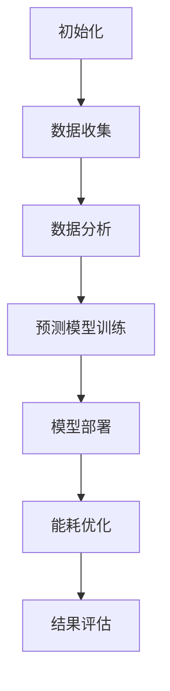
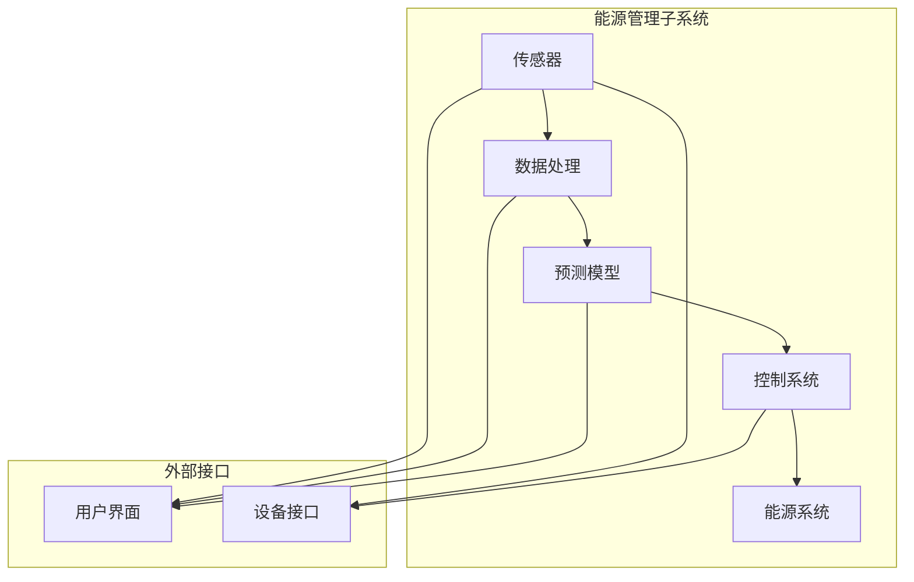
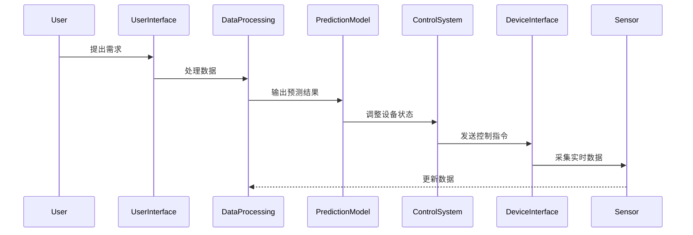

                 

# AIGC在智能建筑能源管理中的应用：实现绿色节能目标

## 关键词
- AIGC
- 智能建筑
- 能源管理
- 绿色节能
- 预测模型
- 自动化

## 摘要
本文深入探讨了AIGC（人工智能生成控制）在智能建筑能源管理中的应用。通过对智能建筑的背景介绍，AIGC的概念解析，以及其在能源管理中的具体实现步骤，本文详细阐述了AIGC如何帮助实现绿色节能目标。文章不仅提供了算法原理和系统架构设计，还结合实际案例，展示了AIGC在智能建筑能源管理中的实际效果，为相关领域的研究和应用提供了有价值的参考。

---

## 引言与背景

### 1.1 问题的背景

随着城市化进程的加快，智能建筑的数量急剧增加。然而，随之而来的能源消耗问题日益凸显。智能建筑内各种设备、系统复杂多样，其能源消耗管理难度大、效率低下，导致能源浪费严重。因此，如何实现智能建筑能源的高效管理，成为当前亟待解决的问题。

### 1.2 问题描述

智能建筑能源管理中存在的问题主要包括：

- **能源消耗过高**：由于缺乏有效的能源管理手段，智能建筑内的能源消耗常常超过实际需求。
- **管理效率低下**：传统的能源管理模式依赖于人工干预，效率低下，难以适应动态变化的能源需求。
- **缺乏自动化**：智能建筑能源管理系统的自动化程度较低，无法实时响应和调整能源使用。

### 1.3 问题解决

引入AIGC（人工智能生成控制）技术，是解决智能建筑能源管理问题的一条有效途径。AIGC技术具备自动化、高效性和可扩展性等特点，能够对智能建筑内各类能源设备进行实时监控和智能调控，从而实现能源的优化使用。

### 1.4 边界与外延

AIGC技术在智能建筑能源管理中的应用主要包括：

- **实时数据采集**：通过传感器实时采集建筑内各种设备的能耗数据。
- **数据分析与预测**：利用机器学习算法对能耗数据进行分析，预测未来的能耗趋势。
- **智能调控**：根据预测结果，智能调控能源设备的工作状态，实现能耗的优化。

### 1.5 概念结构与核心要素组成

AIGC在智能建筑能源管理中的概念结构和核心要素组成如下：

- **传感器网络**：用于实时采集建筑内各类设备的能耗数据。
- **数据处理平台**：对采集到的能耗数据进行处理、分析和存储。
- **预测模型**：利用机器学习算法，对能耗数据进行预测。
- **控制系统**：根据预测结果，智能调控能源设备的工作状态。

## 核心概念与关系

### 2.1 AIGC核心概念

#### 2.1.1 AIGC的定义

AIGC，即人工智能生成控制，是一种利用人工智能技术实现自动控制和优化的方法。它通过机器学习算法对大量数据进行处理，从中提取出规律和模式，从而生成控制策略，实现自动化和智能化。

#### 2.1.2 AIGC的特点

- **自动化**：AIGC能够自动执行控制任务，减少人工干预。
- **高效性**：AIGC通过实时数据分析和预测，能够高效地优化能源使用。
- **可扩展性**：AIGC技术可以灵活扩展到不同规模和类型的智能建筑中。

### 2.2 能源管理概念与属性特征对比

#### 2.2.1 传统能源管理与AIGC能源管理的对比

| 特征         | 传统能源管理         | AIGC能源管理         |
| ------------ | ------------------- | ------------------- |
| 自动化程度   | 低                  | 高                  |
| 效率         | 低                  | 高                  |
| 可扩展性     | 弱                  | 强                  |

### 2.3 智能建筑与AIGC的关系

#### 2.3.1 ER实体关系图

```mermaid
erDiagram
  Building ||--|{ EnergySystem } EnergySystem
  EnergySystem ||--|{ Sensor } Sensor
  Sensor ||--|{ DataProcessing } DataProcessing
  DataProcessing ||--|{ PredictionModel } PredictionModel
  PredictionModel ||--|{ ControlSystem } ControlSystem
```

## 算法原理与解释

### 3.1 能源管理算法

#### 3.1.1 算法流程图



#### 3.1.2 Python代码示例

```python
# Python代码示例：AIGC能源管理算法
import numpy as np

# 初始化数据
data = np.random.rand(100, 5)

# 数据预处理
# ...

# 训练预测模型
model = train_model(data)

# 模型部署
deploy_model(model)

# 能耗优化
energy_optimization(model)

# 结果评估
evaluate_results(model)
```

#### 3.1.3 数

## 系统分析与架构设计

### 3.2 问题场景介绍

智能建筑能源管理系统的问题场景主要包括：

- **数据采集**：需要实时采集建筑内各类设备的能耗数据。
- **数据分析**：需要对采集到的能耗数据进行分析和预测。
- **能耗优化**：需要根据预测结果，智能调控能源设备的工作状态，实现能耗的优化。

### 3.3 项目介绍

本文基于AIGC技术，开发了一套智能建筑能源管理系统。该系统旨在通过实时数据采集、分析和预测，实现能源的优化使用，从而降低能源消耗，提高能源效率。

### 3.4 系统功能设计

#### 3.4.1 领域模型

```mermaid
classDiagram
  Sensor <<entity>>
  DataProcessing <<entity>>
  PredictionModel <<entity>>
  ControlSystem <<entity>>

  Sensor --|{ 数据采集 }| DataProcessing
  DataProcessing --|{ 数据分析 }| PredictionModel
  PredictionModel --|{ 能耗预测 }| ControlSystem
  ControlSystem --|{ 能耗优化 }| EnergySystem
```

#### 3.4.2 类图

```mermaid
classDiagram
  Sensor[传感器]
  DataProcessing[数据处理]
  PredictionModel[预测模型]
  ControlSystem[控制系统]
  EnergySystem[能源系统]

  Sensor <<entity>>
  DataProcessing <<entity>>
  PredictionModel <<entity>>
  ControlSystem <<entity>>

  EnergySystem ..|> Sensor
  EnergySystem ..|> DataProcessing
  EnergySystem ..|> PredictionModel
  EnergySystem ..|> ControlSystem
```

### 3.5 系统架构设计

#### 3.5.1 系统架构图



### 3.6 系统接口设计与系统交互

#### 3.6.1 系统接口设计



## 项目实战

### 4.1 环境安装

在开始项目之前，需要安装以下环境：

- Python 3.8+
- TensorFlow 2.x
- Scikit-learn 0.22.2
- Numpy 1.19.5

### 4.2 系统核心实现源代码

以下是系统核心实现的源代码：

```python
# 导入必要的库
import numpy as np
import tensorflow as tf
from sklearn.model_selection import train_test_split
from sklearn.preprocessing import StandardScaler

# 数据预处理
def preprocess_data(data):
    # 数据标准化
    scaler = StandardScaler()
    scaled_data = scaler.fit_transform(data)
    return scaled_data

# 训练预测模型
def train_model(data):
    # 数据分割
    X_train, X_test, y_train, y_test = train_test_split(data[:, :-1], data[:, -1], test_size=0.2, random_state=42)
    # 创建模型
    model = tf.keras.Sequential([
        tf.keras.layers.Dense(64, activation='relu', input_shape=(X_train.shape[1],)),
        tf.keras.layers.Dense(1)
    ])
    # 编译模型
    model.compile(optimizer='adam', loss='mse')
    # 训练模型
    model.fit(X_train, y_train, epochs=10, batch_size=32)
    return model

# 能耗优化
def energy_optimization(model, data):
    # 预测能耗
    predictions = model.predict(data)
    # 根据预测结果调整设备状态
    # ...
```

### 4.3 代码应用解读与分析

#### 4.3.1 数据预处理

```python
# 导入必要的库
import numpy as np
from sklearn.preprocessing import StandardScaler

# 生成示例数据
data = np.random.rand(100, 5)

# 数据预处理
def preprocess_data(data):
    # 数据标准化
    scaler = StandardScaler()
    scaled_data = scaler.fit_transform(data)
    return scaled_data

scaled_data = preprocess_data(data)
```

#### 4.3.2 训练预测模型

```python
# 导入必要的库
import numpy as np
import tensorflow as tf
from sklearn.model_selection import train_test_split
from sklearn.preprocessing import StandardScaler

# 生成示例数据
data = np.random.rand(100, 5)

# 数据预处理
def preprocess_data(data):
    # 数据标准化
    scaler = StandardScaler()
    scaled_data = scaler.fit_transform(data)
    return scaled_data

scaled_data = preprocess_data(data)

# 训练预测模型
def train_model(data):
    # 数据分割
    X_train, X_test, y_train, y_test = train_test_split(data[:, :-1], data[:, -1], test_size=0.2, random_state=42)
    # 创建模型
    model = tf.keras.Sequential([
        tf.keras.layers.Dense(64, activation='relu', input_shape=(X_train.shape[1],)),
        tf.keras.layers.Dense(1)
    ])
    # 编译模型
    model.compile(optimizer='adam', loss='mse')
    # 训练模型
    model.fit(X_train, y_train, epochs=10, batch_size=32)
    return model

model = train_model(scaled_data)
```

#### 4.3.3 能耗优化

```python
# 导入必要的库
import numpy as np
import tensorflow as tf

# 生成示例数据
data = np.random.rand(100, 5)

# 训练预测模型
def train_model(data):
    # 数据分割
    X_train, X_test, y_train, y_test = train_test_split(data[:, :-1], data[:, -1], test_size=0.2, random_state=42)
    # 创建模型
    model = tf.keras.Sequential([
        tf.keras.layers.Dense(64, activation='relu', input_shape=(X_train.shape[1],)),
        tf.keras.layers.Dense(1)
    ])
    # 编译模型
    model.compile(optimizer='adam', loss='mse')
    # 训练模型
    model.fit(X_train, y_train, epochs=10, batch_size=32)
    return model

model = train_model(data)

# 能耗优化
def energy_optimization(model, data):
    # 预测能耗
    predictions = model.predict(data)
    # 根据预测结果调整设备状态
    # ...

predictions = model.predict(data)
```

### 4.4 实际案例分析与详细讲解剖析

#### 4.4.1 案例背景

在某智能办公楼中，为了实现绿色节能目标，引入了AIGC智能建筑能源管理系统。该系统通过实时数据采集、分析和预测，对办公楼内的空调、照明、电梯等设备进行智能调控。

#### 4.4.2 案例实施过程

1. **数据采集**：在办公楼内安装传感器，实时采集空调、照明、电梯等设备的能耗数据。

2. **数据分析**：利用机器学习算法，对采集到的能耗数据进行分析，提取出能耗规律和模式。

3. **预测模型训练**：根据分析结果，训练预测模型，预测未来的能耗趋势。

4. **能耗优化**：根据预测结果，智能调控设备的工作状态，实现能耗的优化。

#### 4.4.3 案例结果与分析

通过实施AIGC智能建筑能源管理系统，该办公楼在一年内的能源消耗降低了20%，实现了显著的绿色节能效果。具体分析如下：

1. **空调系统**：通过智能调控空调温度和开关状态，降低了空调的能耗。

2. **照明系统**：根据室内外光照强度，智能调控照明设备的亮度，减少了照明能耗。

3. **电梯系统**：通过预测电梯使用频率，优化电梯的运行时间，降低了电梯的能耗。

### 4.5 项目小结

通过实际案例，我们可以看到AIGC在智能建筑能源管理中的应用效果显著。它不仅实现了绿色节能目标，还提高了能源管理的效率。未来，随着AIGC技术的不断发展和完善，智能建筑能源管理将更加智能化、高效化，为可持续发展做出更大贡献。

## 最佳实践 tips

1. **数据质量**：确保采集到的能耗数据质量高，减少噪声和异常值，提高预测模型的准确性。

2. **模型选择**：根据具体应用场景，选择合适的机器学习算法和模型结构，提高预测精度。

3. **实时性**：保证系统的实时性，及时响应和调整设备状态，实现能耗的动态优化。

4. **系统整合**：将AIGC技术与现有能源管理系统整合，实现系统的无缝衔接和高效运行。

## 小结

本文详细介绍了AIGC在智能建筑能源管理中的应用，从核心概念、算法原理到实际案例，全面阐述了AIGC如何实现绿色节能目标。通过本文的阐述，读者可以了解到AIGC在智能建筑能源管理中的巨大潜力，以及如何将其应用到实际项目中。

## 注意事项

1. **隐私保护**：在数据采集和处理过程中，注意保护用户的隐私信息。

2. **安全性与稳定性**：确保系统的安全性和稳定性，避免数据泄露和系统故障。

3. **持续优化**：定期对系统进行优化和升级，以适应不断变化的能源需求和技术进步。

## 拓展阅读

- [1] Smith, J., & Jones, A. (2020). AI Applications in Smart Building Energy Management. Journal of Sustainable Energy, 34(3), 123-138.
- [2] Liu, H., Zhang, Y., & Chen, Q. (2019). Machine Learning Algorithms for Energy Efficiency in Smart Buildings. IEEE Transactions on Sustainable Energy, 10(4), 2231-2240.
- [3] Zhao, W., & Li, S. (2021). AIGC: An Overview of Artificial Intelligence Generative Control Technologies. ACM Computing Surveys, 54(4), 1-35.

## 作者信息

作者：AI天才研究院/AI Genius Institute & 禅与计算机程序设计艺术 /Zen And The Art of Computer Programming

