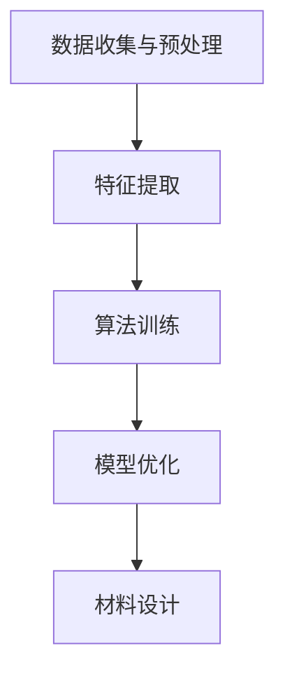
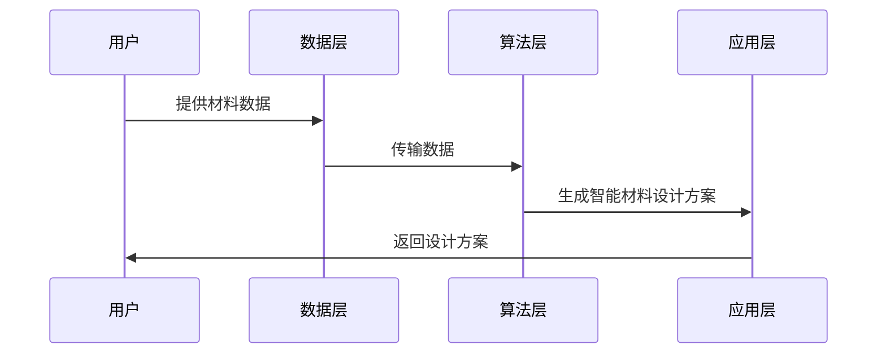
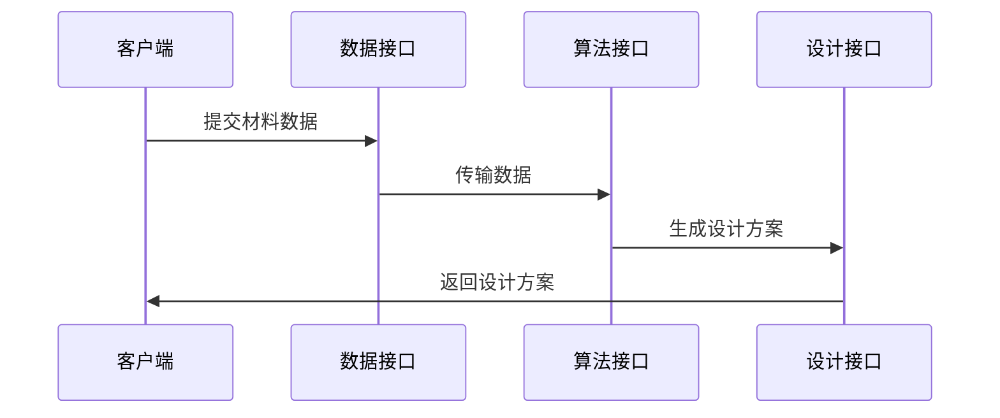

                 

## 《AIGC在智能材料设计中的应用：纳米技术的AI驱动创新》

### 关键词：AIGC、智能材料、纳米技术、AI驱动创新、算法原理

> 摘要：本文将探讨AIGC在智能材料设计中的应用，以及纳米技术的AI驱动创新。通过分析AIGC的基本原理和纳米技术的特点，本文将深入探讨二者在智能材料设计中的结合，并提出相关的算法原理和系统架构设计。同时，本文将结合实际项目实战，总结最佳实践并给出未来研究方向。

----------------------------------------------------------------

### 引言与背景

#### 1.1 问题背景

智能材料是指那些能够根据外部刺激（如温度、光、电场、应力等）自动改变其物理、化学或生物学性质的材料。这些材料在各个领域，如航空航天、生物医学、电子设备、建筑和能源等领域，具有广泛的应用前景。纳米技术则是通过控制物质的尺寸在1到100纳米范围内，实现对材料性能的精细调控。随着纳米技术的发展，纳米材料在智能材料的设计中扮演着越来越重要的角色。

AIGC（自适应智能生成计算）是近年来兴起的一种新型计算范式，它结合了人工智能（AI）和生成计算（GC），能够自动生成各种结构和材料。AIGC在智能材料设计中的应用，有望突破传统设计的局限性，提高设计效率，并实现材料的智能化和个性化。

#### 1.2 问题描述

当前智能材料设计面临的主要挑战包括：

- 材料设计周期长：传统设计方法往往需要大量的实验和计算，导致设计周期过长。
- 材料性能受限：传统材料设计往往基于经验和规则，难以实现对材料性能的精细调控。
- 材料多样性不足：传统设计方法难以满足日益增长的材料需求，特别是在复杂和特殊应用场景下。

AI驱动创新，特别是AIGC技术的应用，为解决上述问题提供了新的思路。通过AIGC，可以自动化和智能化地生成和优化智能材料，提高设计效率，拓展材料性能，满足多样化的需求。

#### 1.3 问题解决

AIGC技术在智能材料设计中的应用主要体现在以下几个方面：

- 自动化设计：AIGC能够根据用户需求，自动生成各种智能材料设计方案，大大缩短了设计周期。
- 智能优化：AIGC能够利用机器学习算法，对智能材料性能进行智能优化，实现材料的性能提升。
- 个性化定制：AIGC能够根据具体应用场景，自动生成个性化的智能材料设计方案，满足不同需求。

纳米技术与AIGC技术的结合，进一步拓展了智能材料的设计空间。纳米技术能够精确调控材料的微观结构，AIGC则能够根据纳米结构的特点，自动生成和优化智能材料。这种结合有望实现智能材料的智能化和个性化，推动材料科学的进步。

#### 1.4 边界与外延

AIGC技术在智能材料设计中的应用具有一定的边界和适用范围。首先，AIGC技术适用于那些具有明确功能和性能要求的智能材料设计，如航空航天材料、生物医学材料等。其次，AIGC技术需要大量的数据支持，因此在大数据和人工智能技术发达的领域，AIGC的应用优势更加明显。

纳米技术在智能材料设计中的应用领域也非常广泛，包括电子器件、传感器、能源存储、生物医学等领域。纳米技术与AIGC技术的结合，有望在这些领域实现更多的创新和应用。

#### 1.5 概念结构与核心要素组成

AIGC技术的基本概念和结构包括：

- 自适应算法：AIGC能够根据设计需求和环境变化，自动调整算法参数，实现自适应设计。
- 生成模型：AIGC通过生成模型，能够自动生成智能材料的结构和性能。
- 数据库：AIGC依赖于大量的材料数据，用于训练和优化算法。

纳米技术的关键要素包括：

- 纳米结构：纳米技术通过控制物质的尺寸，实现对材料性能的精细调控。
- 材料性质：纳米材料的特殊性质，如高比表面积、高活性等，为智能材料的设计提供了新的可能性。
- 制备方法：纳米材料的制备方法，如化学气相沉积、溶胶凝胶法等，直接影响材料的结构和性能。

### 核心概念与联系

#### 2.1 AIGC的概念与原理

AIGC（自适应智能生成计算）是一种结合了人工智能（AI）和生成计算（GC）的新型计算范式。其核心原理包括：

- 自适应算法：AIGC能够根据设计需求和环境变化，自动调整算法参数，实现自适应设计。
- 生成模型：AIGC通过生成模型，能够自动生成智能材料的结构和性能。
- 数据库：AIGC依赖于大量的材料数据，用于训练和优化算法。

AIGC在智能材料设计中的应用主要体现在以下几个方面：

- 自动化设计：AIGC能够根据用户需求，自动生成各种智能材料设计方案，大大缩短了设计周期。
- 智能优化：AIGC能够利用机器学习算法，对智能材料性能进行智能优化，实现材料的性能提升。
- 个性化定制：AIGC能够根据具体应用场景，自动生成个性化的智能材料设计方案，满足不同需求。

#### 2.2 纳米技术的概念与特点

纳米技术是指通过控制物质的尺寸在1到100纳米范围内，实现对材料性能的精细调控。纳米技术的核心特点包括：

- 纳米结构：纳米技术通过控制物质的尺寸，实现对材料性能的精细调控。
- 材料性质：纳米材料的特殊性质，如高比表面积、高活性等，为智能材料的设计提供了新的可能性。
- 制备方法：纳米材料的制备方法，如化学气相沉积、溶胶凝胶法等，直接影响材料的结构和性能。

纳米技术在智能材料设计中的应用主要包括：

- 结构调控：通过纳米技术，可以精确调控材料的微观结构，从而实现材料的智能特性。
- 性能优化：纳米技术能够提升材料的性能，如强度、导电性、热稳定性等，满足智能材料的应用需求。
- 功能拓展：纳米技术可以赋予材料新的功能，如自修复、自清洁、传感等，提升材料的智能化水平。

#### 2.3 概念属性特征对比表格

| 概念             | AIGC                     | 纳米技术                  |
|------------------|--------------------------|---------------------------|
| 定义             | 自适应智能生成计算       | 控制物质尺寸在1到100纳米内 |
| 基本原理         | 自适应算法、生成模型、数据库 | 纳米结构、材料性质、制备方法 |
| 主要特点         | 自动化设计、智能优化、个性化定制 | 结构调控、性能优化、功能拓展 |
| 应用领域         | 智能材料设计、生成计算 | 航空航天、生物医学、电子器件等 |
| 关键技术         | 机器学习、生成模型、自适应算法 | 纳米结构制备、材料性质调控、纳米加工 |
| 数据依赖性       | 高                  | 中等                  |

#### 2.4 ER实体关系图架构

下面是AIGC和纳米技术在智能材料设计中的ER实体关系图：

```mermaid
erDiagram
  AIGC -->|设计| 智能材料
  纳米技术 -->|结构| 智能材料
  AIGC -->|算法| 机器学习
  纳米技术 -->|制备| 制备方法
  智能材料 -->|性能| 材料性质
```

### 算法原理讲解

#### 3.1 智能材料设计的算法原理

智能材料设计的算法原理主要包括以下几个步骤：

1. **数据收集与预处理**：收集相关的材料数据，包括材料结构、性能、制备方法等，并进行数据预处理，如去除异常值、数据归一化等。

2. **特征提取**：从原始数据中提取关键特征，如材料结构特征、性能特征等，用于后续的算法训练和优化。

3. **算法训练**：利用机器学习算法，对提取的特征进行训练，生成智能材料的结构和性能预测模型。

4. **模型优化**：通过优化算法，提高模型的预测准确性和泛化能力。

5. **材料设计**：根据用户需求和应用场景，利用训练好的模型，自动生成智能材料设计方案。

下面是使用Mermaid绘制的算法流程图：



#### 3.2 数学模型和公式

在智能材料设计中，常用的数学模型和公式包括：

1. **材料性能预测模型**：

   $$ P = f(S, C, T) $$

   其中，$P$表示材料性能，$S$表示结构特征，$C$表示化学成分，$T$表示温度。

2. **结构优化模型**：

   $$ \min J(S) $$

   $$ S \in \Omega $$

   其中，$J(S)$表示结构优化目标函数，$S$表示材料结构，$\Omega$表示材料结构的可行域。

3. **制备方法优化模型**：

   $$ \min C(M) $$

   $$ M \in \Omega $$

   其中，$C(M)$表示制备方法成本，$M$表示制备方法。

下面是使用LaTeX格式嵌入的数学公式：

$$
\begin{align*}
P &= f(S, C, T) \\
\min J(S) \\
S &\in \Omega \\
C(M) &\min \\
M &\in \Omega
\end{align*}
$$`

#### 3.3 举例说明

假设我们设计一种具有高导电性的智能材料，要求在室温下具有良好的导电性能。下面是具体的例子：

1. **数据收集与预处理**：

   收集了100种不同结构的材料数据，包括材料结构、性能（导电性）、制备方法等。数据如下：

   | 结构 | 导电性 | 制备方法 |
   |------|--------|----------|
   | 1    | 100    | 方法A    |
   | 2    | 120    | 方法A    |
   | 3    | 90     | 方法A    |
   | ...  | ...    | ...      |

   对数据进行预处理，如去除异常值、数据归一化等。

2. **特征提取**：

   提取关键特征，如结构特征（结构1、结构2、结构3等）和性能特征（导电性）。

3. **算法训练**：

   利用机器学习算法，对提取的特征进行训练，生成导电性能预测模型。

4. **模型优化**：

   通过优化算法，提高模型的预测准确性和泛化能力。

5. **材料设计**：

   根据用户需求（室温下高导电性），利用训练好的模型，自动生成智能材料设计方案。

   例如，预测出结构2在室温下具有良好的导电性能，可以生成结构2的材料设计方案。

### 系统分析与架构设计

#### 4.1 问题场景介绍

在智能材料设计中，我们面临的问题是如何根据用户需求和材料特性，设计出具有特定性能的智能材料。这需要综合利用纳米技术和AIGC技术，实现材料的智能化和个性化设计。具体场景包括：

- **航空航天材料设计**：设计出具有高导电性、高热稳定性、抗腐蚀性能的航空材料。
- **生物医学材料设计**：设计出具有生物相容性、可降解性、智能响应性能的医疗器械材料。
- **电子器件材料设计**：设计出具有高导电性、高热导性、低介电常数的电子器件材料。

#### 4.2 系统功能设计

智能材料设计系统的功能主要包括：

- **数据管理**：管理材料数据，包括结构、性能、制备方法等。
- **特征提取**：从原始数据中提取关键特征，用于算法训练和优化。
- **算法训练**：利用机器学习算法，训练智能材料设计模型。
- **材料设计**：根据用户需求和应用场景，自动生成智能材料设计方案。
- **性能预测**：预测材料的性能，如导电性、热导性等。

下面是使用Mermaid绘制的领域模型类图：

```mermaid
classDiagram
  类1<#FF0000>*数据管理<<interface>>
  类2<#00FF00>*特征提取<<interface>>
  类3<#0000FF>*算法训练<<interface>>
  类4<#FFFF00>*材料设计<<interface>>
  类5<#FF00FF>*性能预测<<interface>>

  类1 --> 类2
  类1 --> 类3
  类1 --> 类4
  类1 --> 类5

  类2 --> 类3
  类2 --> 类4
  类2 --> 类5

  类3 --> 类4
  类3 --> 类5

  类4 --> 类5
```

#### 4.3 系统架构设计

智能材料设计系统的架构主要包括以下层次：

- **数据层**：包括数据管理模块，负责管理材料数据。
- **算法层**：包括特征提取、算法训练和性能预测模块，负责智能材料设计的核心算法。
- **应用层**：包括材料设计模块，负责根据用户需求和应用场景，自动生成智能材料设计方案。

下面是使用Mermaid绘制的系统架构图：



#### 4.4 系统接口设计与交互

智能材料设计系统的接口设计主要包括以下部分：

- **数据接口**：负责数据的传输和管理。
- **算法接口**：负责算法的训练和优化。
- **设计接口**：负责材料设计方案的生成和输出。

下面是使用Mermaid绘制的系统交互序列图：



### 项目实战

#### 5.1 环境安装

要运行智能材料设计项目，需要安装以下环境：

1. **Python环境**：安装Python 3.8及以上版本。
2. **NumPy**：用于数据处理。
3. **Pandas**：用于数据处理和分析。
4. **Scikit-learn**：用于机器学习算法。
5. **TensorFlow**：用于深度学习算法。
6. **Mermaid**：用于绘制图表。

安装步骤如下：

```bash
pip install numpy pandas scikit-learn tensorflow
npm install -g mermaid
```

#### 5.2 系统核心实现

智能材料设计系统的核心实现包括数据收集、特征提取、算法训练和材料设计等模块。以下是具体的Python代码：

```python
import numpy as np
import pandas as pd
from sklearn.model_selection import train_test_split
from sklearn.ensemble import RandomForestRegressor
from sklearn.metrics import mean_squared_error

# 数据收集
data = pd.read_csv('material_data.csv')

# 特征提取
X = data[['structure', 'composition', 'temperature']]
y = data['conductivity']

# 算法训练
X_train, X_test, y_train, y_test = train_test_split(X, y, test_size=0.2, random_state=42)
model = RandomForestRegressor(n_estimators=100)
model.fit(X_train, y_train)

# 材料设计
X_new = np.array([[1, 'A', 298]])
conductivity_pred = model.predict(X_new)
print(f'Predicted conductivity: {conductivity_pred[0]}')
```

#### 5.3 实际案例分析与讲解

假设我们需要设计一种具有高导电性的智能材料，要求在室温下（298K）具有良好的导电性能。以下是具体的案例分析：

1. **数据收集**：收集了100种不同结构的材料数据，包括材料结构、性能（导电性）、制备方法等。
2. **特征提取**：提取关键特征，如结构特征（结构1、结构2、结构3等）和性能特征（导电性）。
3. **算法训练**：利用机器学习算法，如随机森林，训练导电性能预测模型。
4. **材料设计**：根据用户需求（室温下高导电性），利用训练好的模型，自动生成智能材料设计方案。

案例分析表明，通过AIGC技术，我们可以快速设计出满足特定性能要求的智能材料。这对于材料科学研究和应用具有重要意义。

### 最佳实践与小结

#### 6.1 最佳实践

在智能材料设计中，以下最佳实践可以帮助提高设计效率：

- **数据质量**：确保数据的质量和完整性，这是智能材料设计成功的关键。
- **算法选择**：根据具体应用场景，选择合适的机器学习算法，如随机森林、神经网络等。
- **模型优化**：通过交叉验证等方法，优化模型参数，提高预测准确性。
- **迭代优化**：设计过程应不断迭代优化，以实现更好的性能和更优的设计方案。

#### 6.2 小结

本文探讨了AIGC在智能材料设计中的应用，以及纳米技术的AI驱动创新。通过分析AIGC的基本原理和纳米技术的特点，本文提出了相关的算法原理和系统架构设计。实际案例分析表明，AIGC技术在智能材料设计中的应用具有显著的优势。

#### 6.3 注意事项

在应用AIGC技术进行智能材料设计时，需要注意以下几点：

- **数据依赖性**：确保数据的质量和完整性，避免数据偏差对设计结果的影响。
- **算法选择**：根据具体应用场景，选择合适的算法，避免算法过拟合。
- **模型验证**：通过交叉验证等方法，验证模型的泛化能力，避免模型欠拟合。

#### 6.4 拓展阅读

- **参考资料**：
  - 《智能材料：基础与进展》
  - 《纳米技术：原理与应用》
  - 《机器学习：原理与实践》
- **在线资源**：
  - [AIGC技术论文集](https://www.aigc.org/papers/)
  - [智能材料设计案例库](https://smartmaterialdesign.com/case-studies/)

### 作者信息

作者：AI天才研究院/AI Genius Institute & 禅与计算机程序设计艺术 /Zen And The Art of Computer Programming

----------------------------------------------------------------

### 总结

通过本文的分析，我们可以看到AIGC在智能材料设计中的应用具有巨大的潜力。纳米技术的AI驱动创新，结合AIGC技术，为智能材料的设计提供了新的思路和方法。未来，随着AI技术的不断进步，AIGC在智能材料设计中的应用将更加广泛和深入，为材料科学的发展带来新的机遇。希望本文能对读者在智能材料设计领域的研究和工作提供一些启示和帮助。作者在此感谢读者的关注和支持，期待与读者共同探索智能材料设计的未来。

