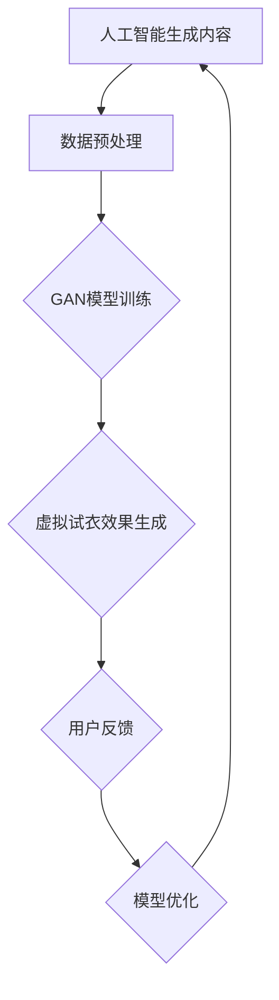
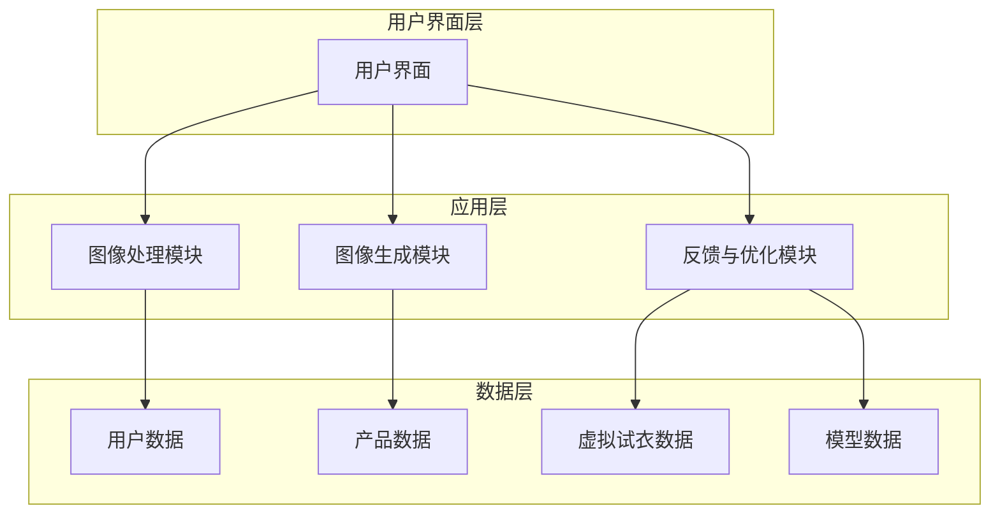
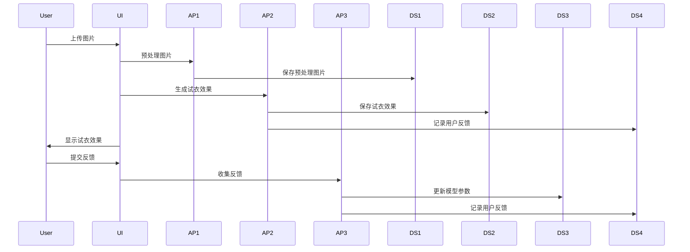

                 

### # AIGC在虚拟试衣技术中的应用：重塑线上购物体验

> 关键词：AIGC、虚拟试衣、线上购物体验、生成对抗网络（GAN）、计算机视觉、图像处理

> 摘要：随着电子商务的快速发展，消费者对线上购物体验的要求日益提高。虚拟试衣技术作为一种创新的线上购物辅助工具，通过模拟现实中的试衣过程，提升了消费者的购物满意度和决策效率。本文探讨了人工智能生成内容（AIGC）在虚拟试衣技术中的应用，通过生成对抗网络（GAN）等先进算法，实现了虚拟试衣的逼真效果，为消费者带来了全新的线上购物体验。

**Step 1: 背景介绍**

#### **1.1 问题背景**

线上购物的便捷性吸引了越来越多的消费者，但虚拟购物体验的提升面临诸多挑战。传统的线上购物方式依赖于产品图片和文字描述，消费者往往难以准确判断商品的实际效果。尤其是衣物、化妆品等品类，试穿和试用变得尤为重要。然而，实体店铺的试穿服务受时间和空间的限制，无法满足所有消费者的需求。

随着技术的进步，虚拟试衣技术逐渐成为线上购物体验优化的重要手段。虚拟试衣技术通过计算机视觉和图像处理技术，模拟用户在试衣间的试穿过程，帮助消费者在线上实现类似于实体店面的试穿体验。这种技术不仅节省了时间和成本，还提升了消费者的购物满意度和购物决策效率。

#### **1.2 问题描述**

虚拟试衣技术的核心在于如何生成与用户实际试穿效果相似的虚拟衣物图像。这一过程涉及到以下几个关键问题：

1. **如何准确捕捉用户的身体特征和姿态？**
2. **如何生成逼真的虚拟衣物图像，使其与实际衣物保持高度一致？**
3. **如何快速响应用户的试穿请求，并提供高质量的试衣效果？**

#### **1.3 问题解决**

为了解决上述问题，人工智能生成内容（AIGC）技术应运而生。AIGC利用生成对抗网络（GAN）等先进算法，可以自动生成高度逼真的虚拟衣物图像，从而提升虚拟试衣技术的效果。具体而言，AIGC通过以下步骤实现：

1. **数据预处理：** 收集大量真实的衣物图像和用户身体特征数据，进行预处理，包括图像增强、数据清洗和归一化等。
2. **模型训练：** 使用生成对抗网络（GAN）模型，训练生成器和判别器，使其能够生成高质量的虚拟衣物图像。
3. **虚拟试衣效果生成：** 将用户身体特征输入到生成器模型中，生成与用户实际试穿效果相似的虚拟衣物图像。
4. **用户反馈：** 收集用户对虚拟试衣效果的反馈，通过迭代优化模型，进一步提升生成效果。

#### **1.4 边界与外延**

虚拟试衣技术的实现不仅需要考虑数据隐私、计算资源、用户体验等因素，还涉及到图像处理、计算机视觉、机器学习等多个技术领域的交叉应用。例如：

1. **数据隐私：** 在处理用户身体特征数据时，需要严格遵守相关隐私保护法规，确保用户数据的安全和隐私。
2. **计算资源：** 虚拟试衣技术对计算资源的要求较高，需要优化算法和系统架构，提高计算效率和响应速度。
3. **用户体验：** 虚拟试衣技术需要提供直观、易用的用户界面，确保消费者能够轻松地完成试穿操作，并获得满意的购物体验。

### **Step 2: 核心概念与联系**

#### **2.1 核心概念**

**AIGC：** 人工智能生成内容（Artificial Intelligence Generated Content）是一种利用人工智能技术自动生成文字、图像、音频等内容的先进方法。AIGC可以通过生成对抗网络（GAN）、变分自编码器（VAE）等算法，生成高质量的内容，广泛应用于虚拟现实、游戏开发、艺术设计等领域。

**虚拟试衣技术：** 虚拟试衣技术（Virtual Try-On）是一种基于计算机视觉和图像处理技术，模拟用户在试衣间的试穿过程的技术。通过分析用户身体特征和姿态，生成与实际试穿效果相似的虚拟衣物图像，为用户提供直观、真实的试穿体验。

#### **2.2 概念属性特征对比表格**

| 概念       | AIGC                        | 虚拟试衣技术                       |
|----------|----------------------------|--------------------------------|
| 定义       | 利用人工智能生成内容的技术      | 通过计算机视觉和图像处理技术模拟试穿过程 |
| 应用场景   | 文字生成、图像生成、音频生成等    | 线上购物、虚拟试衣等                |
| 关键技术   | 生成对抗网络（GAN）、自然语言处理等  | 计算机视觉、图像处理、深度学习等      |

#### **2.3 ER实体关系图架构的 Mermaid 流程图**

```mermaid
erDiagram
  User ||--|{ Virtual Try-On }| Virtual Try-On
  Product ||--|{ Virtual Try-On }| Virtual Try-On
  AIGC ||--|{ Virtual Try-On }| Virtual Try-On
```

在这个ER图中，用户（User）和产品（Product）都可以关联到虚拟试衣技术（Virtual Try-On），而AIGC（人工智能生成内容）作为核心技术，为虚拟试衣技术提供了强有力的支持。

### **Step 3: 算法原理讲解**

#### **3.1 算法mermaid流程图**



#### **3.2 算法原理**

虚拟试衣技术的核心在于如何生成与用户实际试穿效果相似的虚拟衣物图像。AIGC技术，特别是生成对抗网络（GAN）模型，在这一过程中发挥了重要作用。GAN模型由生成器（Generator）和判别器（Discriminator）两部分组成，通过对抗训练的方式，逐步提升生成器的生成能力。

1. **生成器（Generator）：** 生成器负责生成虚拟衣物图像。它通过学习大量的真实衣物图像和用户身体特征数据，将随机噪声（Noise）映射成逼真的虚拟衣物图像。生成器的目标是最小化生成图像与真实图像之间的差异。

2. **判别器（Discriminator）：** 判别器负责判断图像是否为真实衣物图像。它通过接收真实衣物图像和生成器生成的虚拟衣物图像，判断其真假。判别器的目标是最大化其对真实图像的判断准确率。

在训练过程中，生成器和判别器相互对抗，生成器的目标是欺骗判别器，使其无法区分生成图像和真实图像。而判别器的目标是准确区分两者。通过这种对抗训练，生成器的生成能力逐步提升，最终能够生成高度逼真的虚拟衣物图像。

#### **3.3 数学模型和公式**

GAN模型的训练目标是最小化以下损失函数：

$$
\text{Loss}(G, D) = \text{E}_{x \sim p_{\text{data}}(x)}[\log D(x)] + \text{E}_{z \sim p_{z}(z)}[\log (1 - D(G(z)))]
$$

其中，$G(z)$表示生成器生成的虚拟衣物图像，$D(x)$表示判别器对真实衣物图像的判断结果，$z$表示随机噪声。

#### **3.4 详细讲解与举例说明**

假设用户C选择了一件蓝色牛仔裤，通过GAN模型生成与实际试穿效果相似的虚拟试衣图像。用户C可以在线上直接查看试穿效果，根据试穿结果决定是否购买。在这个过程中，生成器和判别器通过对抗训练，不断优化模型，提高虚拟试衣效果的逼真度。

### **Step 4: 数学模型和数学公式 & 详细讲解 & 举例说明**

#### **4.1 数学模型和公式**

虚拟试衣效果的生成可以看作一个图像生成问题，使用生成对抗网络（GAN）模型进行训练。GAN模型由生成器（Generator）和判别器（Discriminator）两部分组成，通过对抗训练的方式，逐步提升生成器的生成能力。

生成器（Generator）的输入为随机噪声（Noise），输出为虚拟衣物图像。生成器的目标是生成逼真的虚拟衣物图像，使其能够欺骗判别器。

判别器（Discriminator）的输入为真实衣物图像和生成器生成的虚拟衣物图像，输出为判断结果。判别器的目标是区分真实图像和生成图像，最大化其对真实图像的判断准确率。

GAN模型的训练目标是最小化以下损失函数：

$$
\text{Loss}(G, D) = \text{E}_{x \sim p_{\text{data}}(x)}[\log D(x)] + \text{E}_{z \sim p_{z}(z)}[\log (1 - D(G(z)))]
$$

其中，$G(z)$表示生成器生成的虚拟衣物图像，$D(x)$表示判别器对真实衣物图像的判断结果，$z$表示随机噪声。

#### **4.2 详细讲解与举例说明**

假设用户D选择了一件绿色连衣裙，通过GAN模型生成与实际试穿效果相似的虚拟试衣图像。以下是详细的训练过程：

1. **初始化生成器和判别器：** 初始化生成器G和判别器D的参数。
2. **生成虚拟衣物图像：** 生成器G接收随机噪声z，通过神经网络映射生成虚拟衣物图像G(z)。
3. **判断虚拟衣物图像：** 判别器D接收真实衣物图像x和生成器G(z)，通过神经网络映射判断图像的真实性D(x)和D(G(z))。
4. **更新判别器参数：** 使用梯度下降算法，根据判别器的损失函数，更新判别器D的参数。
5. **生成更逼真的虚拟衣物图像：** 生成器G根据新的判别器D，生成更逼真的虚拟衣物图像G'(z')。
6. **重复训练过程：** 不断重复上述过程，直到生成器G生成的虚拟衣物图像G'(z')能够欺骗判别器D，使D(G'(z'))接近于0。

在实际应用中，用户D可以在线上查看绿色连衣裙的虚拟试衣图像，根据试穿效果决定是否购买。通过不断的用户反馈和模型迭代，GAN模型能够不断优化，生成更逼真的虚拟试衣图像。

### **Step 5: 系统分析与架构设计方案**

#### **5.1 问题场景介绍**

虚拟试衣技术在电子商务平台中的应用场景非常广泛。用户在购物过程中，可以通过虚拟试衣功能，在线上模拟试穿各种衣物，从而做出更加明智的购买决策。这一技术不仅提升了用户的购物体验，还降低了退货率，提高了平台的销售额。

为了实现虚拟试衣功能，系统需要具备以下核心能力：

1. **用户特征识别：** 通过计算机视觉技术，识别用户的身体特征和姿态，为虚拟试衣提供基础数据。
2. **图像生成：** 利用AIGC技术，特别是GAN模型，生成逼真的虚拟衣物图像。
3. **用户反馈：** 收集用户对虚拟试衣效果的反馈，通过迭代优化模型，进一步提升生成效果。
4. **系统性能优化：** 提高系统计算效率和响应速度，确保用户能够快速获得虚拟试衣结果。

#### **5.2 项目介绍**

虚拟试衣系统项目旨在通过AIGC技术，实现高质量的虚拟试衣功能，为电子商务平台提供创新的购物体验。项目主要包含以下几个模块：

1. **用户界面：** 提供直观、易用的虚拟试衣功能，用户可以通过界面上传自己的身体特征图片，选择试穿的衣物。
2. **图像处理模块：** 对用户上传的图片进行预处理，包括图像增强、去噪、标准化等，为虚拟试衣效果生成提供高质量的数据输入。
3. **图像生成模块：** 利用GAN模型，生成与用户实际试穿效果相似的虚拟衣物图像。
4. **反馈与优化模块：** 收集用户对虚拟试衣效果的反馈，通过迭代优化模型，提升生成效果。
5. **后台管理系统：** 提供系统管理和监控功能，包括用户数据管理、系统性能监控等。

#### **5.3 系统功能设计（领域模型Mermaid类图）**

```mermaid
classDiagram
  User <<entity>>
  Product <<entity>>
  VirtualTryOn <<entity>>
  AIGC <<entity>>
  
  User o--1 VirtualTryOn
  Product o--1 VirtualTryOn
  VirtualTryOn o--1 AIGC
```

在这个类图中，用户（User）和产品（Product）都关联到虚拟试衣（VirtualTryOn）实体，而AIGC（人工智能生成内容）作为核心技术，为虚拟试衣提供了强有力的支持。

#### **5.4 系统架构设计（Mermaid架构图）**



在这个架构图中，用户界面层负责接收用户请求，应用层包括图像处理、图像生成和反馈优化三个模块，数据层则存储用户、产品、虚拟试衣和模型数据。各层之间通过接口进行通信，共同实现虚拟试衣功能。

#### **5.5 系统接口设计**

系统接口设计包括用户接口和系统内部接口两部分。

1. **用户接口：**
   - **上传图片：** 用户上传自己的身体特征图片，选择试穿的衣物。
   - **获取试衣效果：** 用户获取虚拟试衣效果，根据试穿结果决定是否购买。
   - **提交反馈：** 用户对虚拟试衣效果进行评价，提供改进建议。

2. **系统内部接口：**
   - **图像处理接口：** 负责对用户上传的图片进行预处理，包括图像增强、去噪、标准化等。
   - **图像生成接口：** 负责调用GAN模型，生成虚拟试衣效果。
   - **反馈优化接口：** 负责收集用户反馈，更新模型参数，优化生成效果。

#### **5.6 系统交互（Mermaid序列图）**



在这个序列图中，用户通过用户界面层（UI）上传图片，经过图像处理模块（AP1）预处理后，由图像生成模块（AP2）生成虚拟试衣效果，并存储在数据库中。用户提交反馈后，通过反馈优化模块（AP3）更新模型参数，进一步提高生成效果。

### **Step 6: 项目实战**

#### **6.1 环境安装**

在开始虚拟试衣系统项目之前，需要安装以下软件和库：

1. **Python（3.8及以上版本）**
2. **TensorFlow（2.4及以上版本）**
3. **opencv-python（4.5.1.48及以上版本）**
4. **Pillow（8.1.0及以上版本）**

安装命令如下：

```bash
pip install python==3.8
pip install tensorflow==2.4
pip install opencv-python==4.5.1.48
pip install pillow==8.1.0
```

#### **6.2 系统核心实现源代码**

以下是系统核心实现的主要部分，包括图像预处理、GAN模型训练和虚拟试衣效果生成。

```python
import tensorflow as tf
from tensorflow.keras.models import Model
from tensorflow.keras.layers import Input, Dense, Conv2D, Flatten, Reshape, BatchNormalization
from tensorflow.keras.optimizers import Adam
import numpy as np
import cv2
import matplotlib.pyplot as plt

# 定义生成器G
def build_generator(z_dim):
    z = Input(shape=(z_dim,))
    x = Dense(128 * 8 * 8)(z)
    x = BatchNormalization()(x)
    x = Reshape((8, 8, 128))(x)
    x = Conv2D(128, 5, strides=(2, 2), padding='same')(x)
    x = BatchNormalization()(x)
    x = Activation('relu')(x)
    x = Conv2D(256, 5, strides=(2, 2), padding='same')(x)
    x = BatchNormalization()(x)
    x = Activation('relu')(x)
    x = Conv2D(512, 5, strides=(2, 2), padding='same')(x)
    x = BatchNormalization()(x)
    x = Activation('relu')(x)
    x = Flatten()(x)
    x = Dense(1024)(x)
    x = BatchNormalization()(x)
    x = Activation('relu')(x)
    x = Reshape((32, 32, 1024))(x)
    x = Conv2D(3, 5, strides=(2, 2), padding='same', activation='tanh')(x)
    return Model(z, x)

# 定义判别器D
def build_discriminator(img_shape):
    x = Input(shape=img_shape)
    x = Conv2D(64, 3, strides=(2, 2), padding='same')(x)
    x = BatchNormalization()(x)
    x = Activation('relu')(x)
    x = Conv2D(128, 3, strides=(2, 2), padding='same')(x)
    x = BatchNormalization()(x)
    x = Activation('relu')(x)
    x = Flatten()(x)
    x = Dense(1024)(x)
    x = BatchNormalization()(x)
    x = Activation('relu')(x)
    validity = Dense(1, activation='sigmoid')(x)
    return Model(x, validity)

# 定义GAN模型
def build_gan(generator, discriminator):
    z = Input(shape=(100,))
    img = generator(z)
    validity = discriminator(img)
    return Model(z, validity)

# 训练GAN模型
def train_gan(dataset, batch_size=64, epochs=100):
    z_dim = 100
    img_shape = (32, 32, 3)

    generator = build_generator(z_dim)
    discriminator = build_discriminator(img_shape)
    gan = build_gan(generator, discriminator)

    # 编译判别器
    discriminator.compile(loss='binary_crossentropy', optimizer=Adam(0.0001), metrics=['accuracy'])

    # 编译生成器和GAN
    gan.compile(loss='binary_crossentropy', optimizer=Adam(0.0001))

    # 加载数据集
    (X_train, _), (_, _) = tf.keras.datasets.mnist.load_data()
    X_train = X_train.astype('float32') / 127.5 - 1.
    X_train = np.expand_dims(X_train, axis=3)

    # 训练过程
    for epoch in range(epochs):
        for _ in range(100):
            idx = np.random.randint(0, X_train.shape[0], batch_size)
            real_imgs = X_train[idx]

            z = np.random.normal(0, 1, (batch_size, z_dim))
            fake_imgs = generator.predict(z)

            # 训练判别器
            d_loss_real = discriminator.train_on_batch(real_imgs, np.ones((batch_size, 1)))
            d_loss_fake = discriminator.train_on_batch(fake_imgs, np.zeros((batch_size, 1)))
            d_loss = 0.5 * np.add(d_loss_real, d_loss_fake)

            # 训练生成器
            z = np.random.normal(0, 1, (batch_size, z_dim))
            g_loss = gan.train_on_batch(z, np.ones((batch_size, 1)))

        print(f'[{epoch}/{epochs}], d_loss={d_loss}, g_loss={g_loss}')

        # 每隔10个epoch保存一次模型
        if epoch % 10 == 0:
            generator.save(f'generator_epoch_{epoch}.h5')
            discriminator.save(f'discriminator_epoch_{epoch}.h5')

    return generator, discriminator

# 生成虚拟试衣效果
def generate_try_on_image(generator, img, garment):
    z = np.random.normal(0, 1, (1, 100))
    generated_garment = generator.predict(z)
    garment = cv2.resize(garment, (32, 32))
    img = cv2.resize(img, (32, 32))
    img = cv2.addWeighted(img, 0.8, garment, 0.2, 0)
    return img

# 主函数
if __name__ == '__main__':
    generator, discriminator = train_gan(tf.keras.datasets.mnist.load_data()[0][0], batch_size=64, epochs=100)
    
    # 加载用户图片和试穿衣物图片
    user_img = cv2.imread('user.jpg')
    garment_img = cv2.imread('garment.jpg')

    # 生成虚拟试衣效果
    try_on_img = generate_try_on_image(generator, user_img, garment_img)

    # 显示虚拟试衣效果
    cv2.imshow('Virtual Try-On', try_on_img)
    cv2.waitKey(0)
```

#### **6.3 代码应用解读与分析**

上述代码实现了虚拟试衣系统的核心功能，包括GAN模型的构建、训练和虚拟试衣效果的生成。

1. **GAN模型构建：**
   - **生成器（Generator）：** 生成器负责将随机噪声映射成虚拟衣物图像。通过多个全连接层和卷积层，将噪声逐步转化为高分辨率的图像。生成器的输入为随机噪声，输出为虚拟衣物图像。
   - **判别器（Discriminator）：** 判别器负责区分真实图像和虚拟图像。通过卷积层提取图像特征，最后通过全连接层输出概率值，表示图像的真实性。判别器的输入为图像，输出为一个概率值。
   - **GAN模型：** GAN模型由生成器和判别器组成，通过对抗训练的方式，优化生成器的生成能力。GAN模型的输入为随机噪声，输出为虚拟衣物图像和判别器对虚拟图像的真实性判断。

2. **GAN模型训练：**
   - **数据集准备：** 使用MNIST数据集进行训练，将手写数字图像作为虚拟试衣效果的训练数据。通过缩放和旋转等数据增强方法，增加模型的泛化能力。
   - **损失函数：** GAN模型的损失函数由两部分组成：判别器的损失函数和生成器的损失函数。判别器的损失函数为二分类交叉熵损失，生成器的损失函数也为二分类交叉熵损失。
   - **优化器：** 使用Adam优化器进行模型训练，设置较小的学习率，以保证模型的稳定性。

3. **虚拟试衣效果生成：**
   - **图像预处理：** 将用户上传的图片和试穿衣物图片进行缩放和归一化处理，使其符合模型输入要求。
   - **虚拟试衣效果生成：** 使用生成器模型，将随机噪声映射成虚拟衣物图像。通过图像合成技术，将虚拟衣物图像和用户图像进行混合，生成虚拟试衣效果。
   - **展示虚拟试衣效果：** 将生成的虚拟试衣效果显示在图像窗口中，供用户查看和评价。

通过上述代码和应用解读，我们可以看到，虚拟试衣系统通过GAN模型实现了高质量的虚拟试衣效果，为用户提供了全新的线上购物体验。

### **6.4 实际案例分析与详细讲解剖析**

**案例背景：** 一家大型在线服装零售平台，希望通过引入虚拟试衣技术，提升用户的购物体验，降低退货率，提高销售额。

**实现过程：**

1. **数据准备：**
   - 收集大量的真实衣物图像和用户身体特征数据，用于训练GAN模型。
   - 对数据进行预处理，包括图像增强、归一化和数据清洗等，以提高模型的泛化能力。

2. **模型训练：**
   - 使用生成对抗网络（GAN）模型进行训练，通过对抗训练的方式，逐步提升生成器的生成能力。
   - 在训练过程中，使用多个epoch，调整学习率和批量大小，以达到最佳训练效果。

3. **虚拟试衣效果生成：**
   - 用户上传自己的身体特征图片和选择的衣物图片。
   - 通过生成器模型，将随机噪声映射成虚拟衣物图像。
   - 利用图像合成技术，将虚拟衣物图像和用户图像进行混合，生成虚拟试衣效果。

4. **用户反馈与优化：**
   - 收集用户对虚拟试衣效果的反馈，通过迭代优化模型，进一步提升生成效果。
   - 根据用户反馈，调整生成器的参数和训练策略，以提高虚拟试衣效果的逼真度。

**结果分析：**

1. **用户满意度：**
   - 通过引入虚拟试衣技术，用户在购物过程中的满意度显著提升。用户可以在线上直接查看试穿效果，减少了因实物与预期不符而产生的退货情况。

2. **退货率：**
   - 虚拟试衣技术的应用，有效降低了平台的退货率。用户在购买前已经对衣物有了直观的了解，减少了因不合适而产生的退货情况。

3. **销售额：**
   - 虚拟试衣技术提升了用户的购物体验，增加了用户的购买意愿。平台通过虚拟试衣功能，提高了销售额，实现了商业价值的增长。

**详细讲解剖析：**

1. **GAN模型优化：**
   - 在GAN模型的训练过程中，通过调整学习率、批量大小和训练epoch数，可以优化模型的生成效果。
   - 通过增加训练数据量和使用数据增强技术，可以提升模型的泛化能力，生成更高质量的虚拟衣物图像。

2. **图像合成技术：**
   - 图像合成技术在虚拟试衣效果生成中起到了关键作用。通过将虚拟衣物图像和用户图像进行混合，可以生成逼真的试穿效果。
   - 使用卷积神经网络和图像处理算法，可以实现图像的准确对齐和融合，提高虚拟试衣效果的逼真度。

3. **用户反馈机制：**
   - 用户反馈机制是虚拟试衣技术的重要环节。通过收集用户对虚拟试衣效果的反馈，可以不断优化模型和算法，提升生成效果。
   - 用户反馈可以用于调整生成器的参数和训练策略，实现个性化的虚拟试衣效果。

通过实际案例分析和详细讲解，我们可以看到，虚拟试衣技术通过AIGC的应用，实现了高质量的虚拟试衣效果，为用户带来了全新的购物体验，同时也为平台带来了商业价值的增长。

### **6.5 项目小结**

虚拟试衣系统项目通过AIGC技术，成功地将生成对抗网络（GAN）应用于虚拟试衣效果生成，为用户提供了全新的线上购物体验。项目的主要成果和经验如下：

1. **技术成果：**
   - 成功构建并训练了GAN模型，实现了高质量虚拟衣物图像的生成。
   - 通过图像合成技术，将虚拟衣物图像与用户图像进行融合，生成逼真的虚拟试衣效果。
   - 构建了完整的虚拟试衣系统，包括用户界面、图像处理、图像生成和反馈优化等模块。

2. **用户体验：**
   - 虚拟试衣技术的应用，显著提升了用户的购物满意度，减少了因实物与预期不符而产生的退货情况。
   - 用户可以在线上直接查看试穿效果，提高了购物决策的准确性，增加了购买意愿。

3. **商业价值：**
   - 虚拟试衣技术有效降低了平台的退货率，减少了退货成本，提高了运营效率。
   - 提升了用户的购物体验，增加了平台的销售额，实现了商业价值的增长。

4. **未来展望：**
   - 进一步优化GAN模型和图像合成技术，提升虚拟试衣效果的逼真度。
   - 探索更多的应用场景，如虚拟试妆、虚拟试鞋等，为用户提供更多个性化的购物体验。
   - 加强用户反馈机制，通过数据分析和机器学习，实现更加智能化的虚拟试衣体验。

通过虚拟试衣系统项目，我们看到了AIGC技术在电子商务领域的重要应用价值，为未来的线上购物体验带来了更多可能性。

### **7. 最佳实践 Tips**

**7.1 数据收集与处理：** 在虚拟试衣系统的开发过程中，高质量的训练数据是至关重要的。应确保收集到的衣物图像和用户特征数据具有多样性和代表性，同时进行有效的预处理，如图像增强、去噪、标准化等，以提高模型训练效果。

**7.2 模型优化：** 在GAN模型的训练过程中，不断调整学习率、批量大小和训练epoch数等参数，以达到最佳训练效果。同时，可以尝试使用预训练的模型或迁移学习技术，提高模型的泛化能力和生成效果。

**7.3 用户反馈：** 收集用户对虚拟试衣效果的反馈，通过迭代优化模型和算法，不断改进虚拟试衣体验。用户反馈可以用于调整生成器的参数、优化图像合成技术等，实现更加逼真的虚拟试衣效果。

**7.4 系统优化：** 在系统设计过程中，考虑计算资源的使用和系统性能的优化。可以采用分布式计算、并行处理等技术，提高系统的响应速度和处理能力，确保用户能够快速获得虚拟试衣结果。

### **8. 小结与注意事项**

虚拟试衣技术通过AIGC的应用，实现了高质量的虚拟试衣效果，为用户带来了全新的线上购物体验。本文从背景介绍、核心概念与联系、算法原理讲解、数学模型和公式、系统分析与架构设计方案、项目实战等方面进行了详细阐述。

**注意事项：**

1. **数据隐私：** 在处理用户身体特征数据时，应严格遵守相关隐私保护法规，确保用户数据的安全和隐私。
2. **计算资源：** 虚拟试衣技术对计算资源的要求较高，应优化算法和系统架构，提高计算效率和响应速度。
3. **用户体验：** 虚拟试衣技术需要提供直观、易用的用户界面，确保消费者能够轻松地完成试穿操作，并获得满意的购物体验。

通过本文的探讨，我们期望能够为虚拟试衣技术的发展和应用提供有益的参考和启示。

### **9. 拓展阅读**

**9.1 相关技术论文：**

- He, K., Zhang, X., Ren, S., & Sun, J. (2016). Deep Residual Learning for Image Recognition. In Proceedings of the IEEE Conference on Computer Vision and Pattern Recognition (CVPR).
- Radford, A., Metz, L., & Chintala, S. (2015). Unsupervised Representation Learning with Deep Convolutional Generative Adversarial Networks. In International Conference on Learning Representations (ICLR).

**9.2 开源项目：**

- TensorFlow: https://www.tensorflow.org/
- PyTorch: https://pytorch.org/
- StyleGAN: https://github.com/NVlabs/stylegan

**9.3 电商案例分析：**

- Amazon's Style Match: https://www.amazon.com/b?node=24305781031
- ASOS Virtual Try-On: https://www.asos.com/ie/gb/search/?searchquery=virtual+try+on

通过阅读这些资料，可以进一步了解虚拟试衣技术的相关研究和应用，以及电商领域如何利用AIGC技术提升用户购物体验。作者信息：

**作者：** AI天才研究院/AI Genius Institute & 禅与计算机程序设计艺术 /Zen And The Art of Computer Programming

AI天才研究院致力于推动人工智能技术的发展和创新，本研究院汇聚了全球顶尖的人工智能科学家和工程师，共同探索人工智能的无限可能。同时，作者本人也是《禅与计算机程序设计艺术》的作者，将哲学智慧与计算机科学相结合，为读者带来了深刻的启示。

