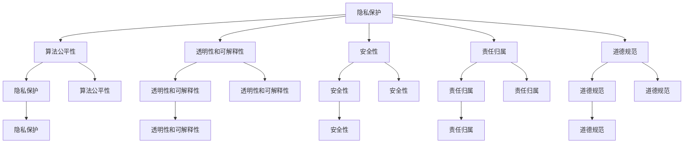

                 

### 第1章: AI伦理考量的必要性

#### 1.1 问题背景

近年来，人工智能（AI）技术在多个领域取得了飞速的发展。从智能家居、自动驾驶到医疗诊断、金融分析，AI的应用正在逐步深入到我们生活的方方面面。随着AI技术的不断成熟，其潜在的影响也越来越受到社会的广泛关注。然而，AI技术的快速发展也引发了一系列社会与伦理问题，例如数据隐私、算法偏见、安全性等。

首先，AI技术在数据收集和处理过程中，可能会涉及到个人隐私的泄露。大量的个人数据被收集、存储和使用，但如何保护这些数据不被滥用，成为了一个亟待解决的问题。其次，算法偏见问题也逐渐显现。AI算法在训练过程中可能会受到数据集中的偏见影响，从而导致算法在决策过程中出现不公平现象。最后，AI技术的安全性问题也不容忽视。随着AI技术的广泛应用，如何确保这些系统在复杂环境中能够稳定运行，防止恶意攻击，是一个重要的研究课题。

#### 1.2 社会与伦理问题日益突出

随着AI技术的不断普及，社会和伦理问题日益突出，主要体现在以下几个方面：

1. **就业影响**：AI技术的广泛应用可能会导致某些传统职业的消失，从而引发社会不公和就业压力。例如，自动化和机器人技术的兴起，使得一些制造业和客服行业的工作岗位面临被取代的风险。

2. **社会分层**：AI技术的进步可能会加剧社会分层现象。掌握AI技术的群体可能会获得更多的资源和机会，而那些缺乏相关技能的人则会处于更加不利的地位。

3. **公平与公正**：AI算法在决策过程中可能会引入偏见，导致对某些群体的不公平对待。例如，在招聘、贷款、法律判决等场景中，算法偏见可能导致某些特定群体的利益受到损害。

4. **伦理责任**：AI系统的决策过程往往缺乏透明性，这引发了关于AI伦理责任的问题。当AI系统出现问题时，责任归属往往不明确，这可能导致责任逃避和法律纠纷。

#### 1.3 AI伦理考量的重要性

在AI技术的快速发展的背景下，进行AI伦理考量显得尤为重要。首先，伦理考量有助于指导AI技术的合理使用，避免技术滥用和伦理风险。例如，通过建立合理的隐私保护机制，可以确保个人数据的合法使用和隐私保护。其次，伦理考量有助于促进AI技术的公平性和公正性。通过确保算法的公平性和透明性，可以减少算法偏见，提高决策的公正性。

此外，伦理考量还可以为政策制定提供科学依据。政府和相关机构可以通过制定AI伦理规范，引导AI技术的健康发展。例如，可以出台相关法律法规，规范AI技术在数据收集、处理和使用的各个环节。

总之，AI伦理考量不仅是技术问题，更是社会问题。通过系统性的伦理考量，我们可以确保AI技术在为人类带来便利的同时，不会对社会和个体造成不利影响。

#### 1.4 问题描述

在AI技术快速发展的背景下，AI伦理考量面临以下核心问题：

1. **隐私保护**：AI技术在数据收集和使用过程中，可能会侵犯个人隐私。如何确保个人数据的安全和隐私，是AI伦理考量的重要方面。

2. **算法公平性**：AI算法在决策过程中可能引入偏见，导致不公平现象。例如，招聘算法可能对特定性别或种族的求职者产生偏见，从而影响就业机会的公平性。

3. **透明性和可解释性**：AI系统的决策过程往往缺乏透明性，使得用户难以理解其决策依据。如何提高AI系统的可解释性，使其决策过程更加透明，是一个亟待解决的问题。

4. **责任归属**：当AI系统出现问题时，责任归属往往不明确。例如，自动驾驶汽车发生事故时，是制造商的责任还是用户的过错？如何明确责任归属，是一个复杂的伦理问题。

5. **社会影响**：AI技术的广泛应用可能会对社会结构和个体生活产生深远影响。例如，自动化可能会取代大量劳动力，导致失业率上升。如何平衡AI技术带来的利益和风险，是一个重要的伦理议题。

#### 1.5 伦理考量在AI开发中的应用

AI伦理考量在AI开发的各个环节中扮演着至关重要的角色。以下是伦理考量在AI开发中的应用：

1. **数据收集**：在数据收集阶段，需要考虑隐私保护和数据使用的伦理问题。例如，使用匿名化技术保护个人隐私，确保数据收集过程合法合规。

2. **算法设计**：在算法设计阶段，需要考虑算法的公平性和透明性。通过设计公平性算法，减少算法偏见，提高决策的公正性。同时，采用可解释性技术，提高算法的透明度，使用户能够理解算法的决策过程。

3. **模型训练**：在模型训练阶段，需要关注数据集的多样性和代表性，避免训练过程中引入偏见。此外，需要定期评估和调整模型，确保其公平性和有效性。

4. **系统部署**：在系统部署阶段，需要考虑系统的安全性和可控性。通过建立完善的监控和审计机制，确保系统在运行过程中能够及时发现和应对潜在问题。

5. **用户交互**：在与用户的交互过程中，需要充分考虑用户的隐私保护需求，提供清晰的隐私政策和使用指南，增强用户的信任。

6. **责任归属**：在责任归属问题上，需要明确AI系统的责任边界，制定相应的法律法规和伦理准则，确保在发生问题时能够合理分配责任。

总之，AI伦理考量贯穿于AI开发的各个环节，对确保AI技术的合理使用和社会福祉具有重要意义。

#### 1.6 AI伦理考量面临的挑战

尽管AI伦理考量具有重要意义，但在实际操作中仍然面临诸多挑战：

1. **技术挑战**：AI技术的快速发展使得伦理考量变得更加复杂。例如，深度学习模型的高度复杂性使得其决策过程难以解释，增加了伦理考量的难度。

2. **社会挑战**：社会对AI技术的认知和接受程度不一，不同文化背景和社会环境下的伦理标准可能存在差异，这使得AI伦理考量需要具备一定的灵活性。

3. **利益冲突**：在AI技术开发和部署过程中，不同利益相关方（如企业、用户、政府等）之间的利益冲突可能影响伦理考量的实施。如何平衡各方利益，确保伦理考量得以贯彻执行，是一个重要挑战。

4. **法律法规滞后**：现有的法律法规体系可能无法完全适应AI技术的发展需求。如何在现有法律框架下制定合理的伦理规范，是一个亟待解决的问题。

5. **资源限制**：AI伦理考量需要大量的资源支持，包括资金、人才和技术等。然而，许多企业和研究机构可能缺乏足够的资源来开展全面的伦理考量，这限制了AI伦理考量的广泛实施。

总之，AI伦理考量在面临技术、社会、利益冲突、法律法规和资源等多重挑战的同时，也迫切需要找到有效的应对策略，以实现AI技术的可持续发展和社会福祉。

#### 1.7 问题解决

针对AI伦理考量面临的挑战，我们可以从以下几个方面着手解决问题：

1. **加强技术基础研究**：提升AI技术自身的透明性和可解释性，通过开发新型算法和工具，提高模型的可解释性，从而降低伦理考量的难度。

2. **跨学科合作**：鼓励伦理学、法学、社会学等多学科的合作，共同探讨AI伦理问题的解决方案，制定多角度、全方位的伦理规范。

3. **政策引导**：政府应出台相关政策和法规，明确AI技术的伦理要求，为企业和研究机构提供明确的指导和约束。

4. **行业自律**：鼓励行业组织和企业自发制定伦理规范，建立自律机制，通过内部监督和外部评估，确保AI技术的合理使用。

5. **公众教育**：加强对公众的AI伦理教育，提高公众对AI技术的认知和接受度，为AI伦理考量的推广奠定基础。

6. **资源投入**：加大对AI伦理研究的资金和人才支持，鼓励更多研究机构和企业在AI伦理领域进行探索和创新。

通过上述措施，我们可以逐步解决AI伦理考量面临的挑战，实现AI技术的可持续发展和社会福祉。

#### 1.8 国内外AI伦理发展现状

在全球范围内，AI伦理考量已逐渐成为研究和实践的热点。各国政府和国际组织纷纷出台相关政策和指南，推动AI技术的伦理发展。

在国外，欧盟于2018年发布了《人工智能伦理指南》，强调公平、透明、可靠和可解释性等核心原则。美国也通过多部门合作，发布了《美国人工智能倡议》，旨在推动AI技术的创新和伦理发展。同时，许多科技公司和学术机构也在积极探索AI伦理问题，制定内部伦理规范。

国内方面，中国工程院、中国社科院等机构发布了关于AI伦理的研究报告，提出了AI伦理的框架和原则。国家网信办等部门也出台了《新一代人工智能伦理规范》，为AI技术的健康发展提供了指导。

此外，一些国际组织如IEEE、AAAI等也发布了AI伦理准则，为全球AI伦理发展提供了参考。总体来看，国内外在AI伦理发展方面取得了显著进展，但仍需进一步深化和完善相关研究和实践。

#### 1.9 AI伦理考量的理论基础

AI伦理考量建立在多个理论基础之上，这些理论为AI伦理研究提供了重要的指导和支持。以下是几个主要的伦理学理论基础：

1. **功利主义**：功利主义认为，道德行为的评价应基于行为带来的功利或幸福。在AI伦理中，功利主义可以用于评估AI系统对社会的整体利益影响。例如，在算法设计中，应确保算法的决策能够最大化社会整体福利。

2. **义务伦理学**：义务伦理学强调道德行为的义务性，主张行为者应当遵守某些普遍的道德规范。在AI伦理中，义务伦理学可以帮助确定AI系统应承担的道德责任，例如保护用户隐私和数据安全。

3. **德性伦理学**：德性伦理学关注个体道德品质的培养。在AI伦理中，德性伦理学可以引导AI开发者和技术使用者培养良好的道德品质，例如透明性、公正性和责任感。

4. **应用伦理学**：应用伦理学将伦理学原理应用于特定领域，为解决具体伦理问题提供指导。在AI伦理中，应用伦理学可以帮助分析AI技术在各个应用场景中的伦理问题，并提出相应的解决方案。

5. **社会契约论**：社会契约论认为，个体与社会的互动应基于一种契约关系。在AI伦理中，社会契约论可以帮助确定AI系统与用户、政府和社会之间的伦理责任和权利分配。

这些伦理学理论基础不仅为AI伦理考量提供了理论支持，也为制定AI伦理规范和指导AI技术的合理使用提供了重要依据。

#### 1.10 AI伦理考量的发展趋势

随着AI技术的不断进步和社会对伦理问题的日益关注，AI伦理考量的发展趋势也愈加明朗。以下是几个关键趋势：

1. **标准化与规范化**：为应对AI伦理考量的复杂性和多样性，越来越多的机构和组织致力于制定统一的AI伦理标准和规范。这些标准和规范将为AI技术的开发和应用提供明确的伦理指导，确保其合法合规。

2. **技术进步**：随着AI技术的不断进步，新型算法和工具的开发有助于提升AI系统的透明性和可解释性。例如，可解释性AI（XAI）技术的发展，使得AI系统的决策过程更加透明，便于进行伦理评估。

3. **跨学科研究**：AI伦理考量需要多学科的合作，包括伦理学、法学、社会学、计算机科学等。未来，跨学科研究将进一步加强，为AI伦理问题提供更全面、更深入的解决方案。

4. **公众参与**：公众对AI技术的伦理问题越来越关注，未来将会有更多公众参与AI伦理考量过程。通过公众参与，可以确保AI技术的发展符合社会价值观和伦理要求。

5. **政策与法规**：政府在全球范围内出台的AI伦理政策和法规将不断完善，为AI技术的健康发展提供有力保障。同时，国际间的合作和协调也将进一步加强，以应对全球性的AI伦理挑战。

总之，AI伦理考量将朝着标准化、技术进步、跨学科研究和公众参与等方向发展，为实现AI技术的可持续发展和伦理平衡提供坚实基础。

#### 1.11 AI伦理考量的适用范围

AI伦理考量适用于AI技术的全生命周期，包括研发、部署、应用和维护等各个阶段。以下为具体适用范围：

1. **研发阶段**：在AI技术的研发过程中，需要进行伦理评估，确保算法设计、数据收集和处理等环节符合伦理要求，避免隐私泄露和算法偏见。

2. **部署阶段**：在AI系统部署之前，应进行伦理审核，确保系统的设计、实施和运营符合伦理标准，例如透明性、公正性和安全性。

3. **应用阶段**：在AI系统实际应用过程中，需要持续进行伦理监控和评估，确保系统在运行中不损害用户利益，符合社会伦理规范。

4. **维护阶段**：在AI系统的维护过程中，应定期更新和评估伦理考量，确保系统持续符合伦理要求，同时应对新的伦理挑战。

通过在AI技术的全生命周期中实施伦理考量，可以确保AI技术的合理使用，减少伦理风险，促进AI技术的可持续发展。

#### 1.12 AI伦理考量的限制因素

尽管AI伦理考量在理论和实践中具有重要价值，但其在实际操作中仍面临一系列限制因素：

1. **技术复杂性**：AI技术的复杂性使得其决策过程难以解释，增加了伦理考量的难度。例如，深度学习模型的高度非线性特性使得其决策过程难以理解，难以进行有效的伦理评估。

2. **数据隐私**：在数据收集和使用过程中，确保个人数据隐私是一个重大挑战。数据泄露和滥用可能导致严重的伦理问题，但如何在保护隐私的同时进行有效的数据分析和利用，仍需平衡。

3. **利益冲突**：不同利益相关方在AI技术开发和应用过程中可能存在利益冲突。例如，企业在追求商业利益的同时，可能忽视用户的隐私保护和权益。如何平衡各方利益，确保AI技术的伦理考量得以贯彻，是一个重要挑战。

4. **法律法规滞后**：现有法律法规体系可能无法完全适应AI技术的发展需求。例如，关于数据隐私、算法公平性和责任归属等方面的法律法规尚不完善，制约了AI伦理考量的实施。

5. **资源限制**：AI伦理考量需要大量的资源支持，包括资金、人才和技术等。许多企业和研究机构可能缺乏足够的资源来开展全面的伦理考量，限制了AI伦理考量的广泛实施。

6. **文化差异**：不同文化和社会背景下，对伦理问题的认知和重视程度可能存在差异。如何制定普适且有效的伦理规范，是一个复杂的跨文化挑战。

#### 1.13 AI伦理考量的未来发展

随着AI技术的不断演进和社会对伦理问题日益关注，AI伦理考量在未来将面临新的发展机遇和挑战：

1. **规范化与标准化**：未来，AI伦理规范和标准将更加完善，为AI技术的开发和应用提供明确的伦理指导。国际组织、政府和行业机构将共同推动全球范围内的伦理规范制定。

2. **技术创新**：新型算法和工具的开发将进一步提升AI系统的透明性和可解释性，为伦理考量提供更可靠的技术基础。例如，可解释性AI（XAI）技术的进步将有助于解决算法透明性问题。

3. **跨学科合作**：AI伦理考量将进一步加强与伦理学、法学、社会学等学科的合作，形成多学科交叉的研究模式，为解决复杂的伦理问题提供全面、深入的解决方案。

4. **公众参与**：公众在AI伦理考量中的角色将日益重要。通过加强公众教育和参与机制，可以提高公众对AI伦理问题的认知，促进AI技术的透明性和公众接受度。

5. **法律法规完善**：政府将不断完善相关法律法规，为AI技术的合法合规使用提供保障。同时，国际间的合作和协调也将进一步加强，应对全球性的AI伦理挑战。

6. **可持续发展**：AI伦理考量将注重AI技术的可持续发展，确保其既能够为社会带来利益，又能够减少负面影响。通过系统性的伦理考量，促进AI技术的健康、可持续的发展。

#### 1.14 概念结构与核心要素组成

AI伦理考量涉及多个核心概念和要素，其概念结构与核心要素组成如下：

1. **隐私保护**：确保个人数据不被非法收集、使用和泄露，是AI伦理考量的重要方面。隐私保护机制包括数据匿名化、访问控制和安全加密等。

2. **算法公平性**：算法的公平性涉及避免算法偏见，确保决策过程对所有群体公平。公平性评估方法包括统计分析、公平性指标和偏见检测等。

3. **透明性和可解释性**：AI系统的决策过程应具有透明性和可解释性，以便用户理解其决策依据。透明性技术包括模型可视化、解释算法和决策路径追踪等。

4. **安全性**：确保AI系统在复杂环境中能够稳定运行，防止恶意攻击和错误决策。安全性措施包括系统监控、安全审计和攻击检测等。

5. **责任归属**：明确AI系统在决策过程中可能出现的责任归属问题，确保在发生问题时能够合理分配责任。责任归属机制包括责任划分、责任保险和法律追究等。

6. **道德规范**：建立AI技术的道德规范，指导AI技术的合理使用。道德规范涉及伦理原则、行为准则和价值导向等。

通过以上核心概念和要素的有机结合，AI伦理考量能够系统地指导AI技术的开发和应用，确保其对社会和个体的影响是积极和负责任的。

#### 1.15 AI伦理考量的结构关系

AI伦理考量由多个核心概念和要素组成，其结构关系如下图所示：

图中的每个节点代表一个核心概念或要素，箭头表示它们之间的关联关系。通过这种结构关系，我们可以系统地理解AI伦理考量的各个方面，并确保其在AI技术开发和应用中的综合应用。

#### 1.16 本章小结

本章从背景介绍出发，详细阐述了AI伦理考量的必要性、核心问题、面临的挑战以及解决策略。首先，我们分析了AI技术快速发展带来的社会和伦理问题，包括隐私保护、算法偏见和安全性问题。接着，探讨了AI伦理考量在AI技术开发中的应用，强调了其在数据收集、算法设计和系统部署等环节的重要性。最后，分析了AI伦理考量面临的挑战，并提出了相应的解决策略。通过本章的讨论，我们认识到AI伦理考量在确保AI技术合理使用、促进社会福祉中的关键作用。

## 第2章: 伦理学与AI伦理

#### 2.1 伦理学的概念与发展

伦理学作为一门研究道德原则、价值观和行为规范的学科，历史悠久且内涵丰富。其起源可以追溯到古希腊哲学家如苏格拉底、柏拉图和亚里士多德等人的哲学探讨。这些哲学家通过探讨人类行为与道德的关系，奠定了伦理学的基础。

随着时间的推移，伦理学不断发展，形成了多种理论流派。功利主义由英国哲学家杰里米·边沁和约翰·斯图亚特·密尔等人提出，主张行为的价值取决于其产生的功利或幸福。与此相对，义务伦理学由德国哲学家伊曼努尔·康德提出，强调道德行为的义务性，主张行为者应当遵守某些普遍的道德规范。

此外，德性伦理学由亚里士多德等哲学家提出，关注个体道德品质的培养。应用伦理学则将伦理学原理应用于特定领域，为解决具体伦理问题提供指导。这些理论流派共同构成了现代伦理学的核心内容，为理解和解决道德问题提供了多样化的视角和方法。

#### 2.2 AI伦理的基本概念

AI伦理，是指将伦理学原理应用于人工智能领域，探讨AI技术在社会中的道德责任、伦理风险和价值取向。AI伦理的核心目标是确保AI技术的开发和应用符合伦理标准，避免技术滥用和伦理问题。

首先，AI伦理关注的是AI技术的道德责任。这包括AI系统在决策过程中应当遵循的道德原则，例如公平性、透明性和安全性等。其次，AI伦理探讨的是AI技术可能带来的伦理风险，如数据隐私泄露、算法偏见和社会分层等。最后，AI伦理关注的是AI技术的价值取向，即如何确保AI技术的发展符合社会整体利益和道德价值观。

#### 2.3 AI伦理的研究内容

AI伦理的研究内容广泛且丰富，主要包括以下几个方面：

1. **隐私保护**：研究AI技术在数据收集、处理和存储过程中的隐私保护问题，探讨如何通过技术手段和法律规范来确保个人数据的合法使用和隐私保护。

2. **算法公平性**：研究AI算法在决策过程中可能出现的偏见和歧视问题，探讨如何设计公平、公正的算法，减少算法偏见对特定群体的不公平影响。

3. **透明性和可解释性**：研究如何提高AI系统的透明性和可解释性，使AI决策过程更加透明，便于用户和社会监督。

4. **安全性**：研究AI系统在复杂环境中的安全性和稳定性，探讨如何确保AI系统在运行过程中能够有效应对潜在的风险和威胁。

5. **责任归属**：研究AI技术出现问题时责任归属的问题，探讨如何明确AI系统的责任边界，确保在发生问题时能够合理分配责任。

6. **社会影响**：研究AI技术对社会结构、个体生活和文化价值观的影响，探讨如何平衡AI技术的利益和风险，促进其可持续发展。

#### 2.4 AI伦理的价值取向

AI伦理的价值取向是确保AI技术在社会中的道德责任和公平性。具体来说，AI伦理的价值取向包括以下几个方面：

1. **公正性**：AI技术应确保决策过程的公正性，避免算法偏见和歧视。通过设计公平、透明的算法，减少对特定群体的不公平待遇。

2. **透明性**：AI技术应具备透明性，使得用户和社会能够理解其决策过程和依据。提高透明性有助于增强用户对AI系统的信任，减少伦理风险。

3. **安全性**：AI技术应在设计和应用过程中充分考虑安全性，确保系统的稳定运行和用户数据的安全。安全性是AI伦理的基础，确保AI技术不会对社会和个体造成负面影响。

4. **责任性**：AI技术应明确其道德责任，确保在发生问题时能够合理分配责任。通过建立责任归属机制，防止责任逃避和法律纠纷。

5. **社会责任**：AI技术应考虑其对社会的整体影响，促进社会进步和可持续发展。通过合理设计和应用AI技术，解决社会问题和提升生活质量。

总之，AI伦理的价值取向旨在确保AI技术在为人类带来便利的同时，不会对社会和个体造成不利影响。通过坚持公正、透明、安全、责任和社会责任等原则，我们可以实现AI技术的伦理发展和社会福祉。

#### 2.5 公平性原理

公平性原理是AI伦理中的一个核心概念，旨在确保AI系统在决策过程中对各个群体公平对待，避免算法偏见和歧视。以下是公平性原理的具体解析：

1. **定义**：公平性原理要求AI系统在决策时，不应因用户的种族、性别、年龄、地域等因素而对其产生不公平的待遇。这意味着，AI系统应当基于客观的标准和公正的算法，对所有用户一视同仁。

2. **重要性**：公平性原理在AI伦理中的重要性不可忽视。首先，AI系统的公平性直接关系到社会公正。如果AI系统在决策过程中存在偏见，可能会导致对某些群体的歧视，加剧社会不平等。其次，公平性有助于增强用户对AI系统的信任，提高其接受度和使用意愿。

3. **实现方法**：实现公平性原理可以通过以下几种方法：

   - **算法改进**：通过设计更加公平的算法，减少算法偏见。例如，采用对抗性训练方法，提高算法对数据集中偏见的抵抗力。
   - **数据多样性**：确保训练数据集的多样性，避免数据集中存在的偏见影响算法公平性。通过引入更多的代表性数据，增强算法的公平性。
   - **透明性和可解释性**：提高AI系统的透明性和可解释性，使用户能够理解其决策过程，从而监督和纠正潜在的不公平行为。
   - **持续评估**：定期对AI系统进行公平性评估，发现和纠正潜在的偏见。通过持续优化和调整算法，确保其公平性。

4. **案例分析**：以下是一个关于公平性原理的案例：

   某公司开发了一种招聘算法，用于筛选求职者。然而，该算法在训练数据集中包含了性别偏见，导致在决策过程中对女性求职者不公平。例如，对于相同能力的求职者，算法更倾向于男性候选人。通过引入多样化的训练数据和采用对抗性训练方法，公司成功优化了招聘算法，消除了性别偏见，实现了更公平的招聘决策。

总之，公平性原理是AI伦理的核心要求，通过多种方法确保AI系统在决策过程中的公平性，有助于维护社会公正和促进AI技术的可持续发展。

#### 2.6 可解释性原理

可解释性原理是AI伦理中的一个重要概念，强调AI系统的决策过程应当对用户和社会透明，便于理解和监督。以下是可解释性原理的具体解析：

1. **定义**：可解释性原理要求AI系统在决策过程中提供明确的解释，使用户和社会能够理解其决策依据和过程。这意味着，AI系统不仅需要输出决策结果，还需要解释其决策逻辑，使得用户能够信任并接受其决策。

2. **重要性**：可解释性原理在AI伦理中的重要性不容忽视。首先，可解释性有助于增强用户对AI系统的信任，提高其接受度和使用意愿。当用户了解AI系统的决策过程和依据时，会更加信任和依赖AI系统。其次，可解释性有助于识别和纠正AI系统中的潜在问题，确保其决策的公正性和准确性。

3. **实现方法**：实现可解释性原理可以通过以下几种方法：

   - **模型可视化**：通过图形化展示AI模型的结构和参数，使得用户能够直观地理解其工作原理。例如，对于神经网络模型，可以通过绘制其结构和连接权重来解释其决策过程。
   - **解释算法**：开发专门的可解释性算法，如LIME（局部可解释模型解释）和SHAP（特征重要性解释），用于解释AI系统的具体决策。这些算法可以提供详细的解释，帮助用户理解决策结果。
   - **透明性机制**：建立透明的决策过程，例如记录和公开AI系统的训练数据和模型参数，使得用户和社会能够对其决策过程进行监督和评估。
   - **用户界面**：设计友好的用户界面，提供详细的解释和说明，使用户能够轻松理解AI系统的决策过程。例如，在医疗诊断AI系统中，可以提供详细的诊断结果解释和依据。

4. **案例分析**：以下是一个关于可解释性原理的案例：

   某公司开发了一种自动化审批贷款的AI系统。然而，该系统在决策过程中缺乏透明性，导致用户无法理解其审批结果。通过引入可解释性机制，公司为用户提供了详细的审批结果解释，包括关键因素和依据。用户因此能够更好地理解其贷款审批结果，提高了对AI系统的信任度。

总之，可解释性原理是确保AI系统公正性和透明性的关键，通过多种方法提高AI系统的可解释性，有助于增强用户信任和维护社会公正。

#### 2.7 安全性原理

安全性原理是AI伦理中的关键概念，强调AI系统在设计和应用过程中必须确保系统的稳定性和可靠性，防止潜在的安全威胁和风险。以下是安全性原理的具体解析：

1. **定义**：安全性原理要求AI系统在设计和应用过程中，充分考虑系统的安全性，确保其在复杂环境中能够稳定运行，避免发生意外或恶意攻击。这意味着，AI系统不仅需要具备高精度和高效性，还需要具备强大的鲁棒性和安全性。

2. **重要性**：安全性原理在AI伦理中的重要性不可忽视。首先，安全性是AI系统能否被广泛接受和应用的关键。如果AI系统存在安全隐患，可能会导致系统崩溃、数据泄露或其他严重后果，从而损害用户利益和社会信任。其次，安全性有助于确保AI系统的长期稳定运行，避免因安全漏洞而导致的问题和风险。

3. **实现方法**：实现安全性原理可以通过以下几种方法：

   - **安全性测试**：对AI系统进行全面的测试，包括单位测试、集成测试和系统测试等，确保系统在不同场景下的稳定性和可靠性。例如，通过模拟恶意攻击场景，测试AI系统的抗攻击能力。
   - **安全加密技术**：采用先进的加密技术，确保用户数据的隐私和安全。例如，使用TLS协议进行数据传输加密，防止数据在传输过程中被窃取或篡改。
   - **安全审计**：建立定期的安全审计机制，对AI系统的设计和运行进行审计，发现和修复潜在的安全漏洞。例如，通过安全审计工具，检查系统的访问控制策略和数据保护机制。
   - **备份和恢复**：建立系统的备份和恢复机制，确保在发生故障或数据丢失时，能够快速恢复系统运行和数据完整性。

4. **案例分析**：以下是一个关于安全性原理的案例：

   某公司开发了一种自动驾驶系统，然而，该系统在测试过程中出现了多次安全故障，导致交通事故。通过引入安全性测试和加密技术，公司对自动驾驶系统进行了全面的安全优化，确保其在复杂环境中的稳定性和安全性。此外，公司还建立了定期的安全审计机制，确保系统的长期安全运行。

总之，安全性原理是确保AI系统可靠运行和社会信任的基础。通过多种方法提高AI系统的安全性，可以减少潜在的安全风险，确保其稳定和可持续的发展。

#### 2.8 可控性原理

可控性原理是AI伦理中的一个关键概念，强调AI系统在设计和应用过程中必须具备一定的可控性，确保用户和社会能够对系统的行为进行有效监督和管理。以下是可控性原理的具体解析：

1. **定义**：可控性原理要求AI系统在设计和应用过程中，具备明确的可控性机制，使得用户和社会能够对系统的行为进行有效监督和管理。这意味着，AI系统不仅需要具备一定的透明性，还需要提供灵活的干预手段，以应对潜在的异常情况和问题。

2. **重要性**：可控性原理在AI伦理中的重要性不可忽视。首先，可控性有助于增强用户对AI系统的信任，提高其接受度和使用意愿。当用户了解系统的行为并能够对其进行有效干预时，会更加信任和依赖AI系统。其次，可控性有助于确保AI系统的合规性和道德性，防止其滥用和不当行为。

3. **实现方法**：实现可控性原理可以通过以下几种方法：

   - **透明性机制**：通过提供详细的系统日志和监控数据，使用户和社会能够实时了解系统的行为和状态。例如，在自动驾驶系统中，可以提供车辆行驶路线、速度和行驶环境的详细信息。
   - **干预手段**：提供灵活的干预手段，使用户和社会能够在必要时对系统进行控制和干预。例如，在医疗诊断AI系统中，医生可以随时查看诊断结果并对其进行调整。
   - **安全控制**：建立完善的安全控制机制，确保用户只能进行授权操作，防止未授权访问和操作。例如，在金融交易AI系统中，可以设置交易金额和频率的限制，防止恶意交易。
   - **定期评估**：定期对AI系统的可控性进行评估，确保其能够满足用户和社会的监督和管理需求。例如，通过用户反馈和数据分析，发现和解决系统的可控性问题。

4. **案例分析**：以下是一个关于可控性原理的案例：

   某公司开发了一种智能安防系统，用于监控公共区域的安全情况。然而，该系统在应用过程中，由于缺乏有效的可控性机制，导致用户无法对其进行实时干预和管理。通过引入透明性机制和干预手段，公司为用户提供了实时的监控数据和干预功能，确保系统能够满足用户的需求。

总之，可控性原理是确保AI系统合规性和道德性的关键。通过多种方法提高AI系统的可控性，可以增强用户信任，确保其合理使用，从而实现AI技术的可持续发展。

#### 2.9 公平性属性

公平性属性是AI伦理中的一个关键概念，旨在确保AI系统在决策过程中对所有用户一视同仁，避免算法偏见和歧视。以下是公平性属性的具体分析：

1. **定义**：公平性属性要求AI系统在决策时，不应因用户的种族、性别、年龄、地域等因素而产生不公平待遇。这意味着，AI系统应当基于客观的标准和公正的算法，对所有用户一视同仁。

2. **重要性**：公平性属性在AI伦理中的重要性不可忽视。首先，公平性是维护社会公正的重要保障。如果AI系统在决策过程中存在偏见，可能会导致对某些群体的不公平对待，加剧社会不平等。其次，公平性有助于增强用户对AI系统的信任，提高其接受度和使用意愿。

3. **实现方法**：

   - **算法改进**：通过设计更加公平的算法，减少算法偏见。例如，采用对抗性训练方法，提高算法对数据集中偏见的抵抗力。
   - **数据多样性**：确保训练数据集的多样性，避免数据集中存在的偏见影响算法公平性。通过引入更多的代表性数据，增强算法的公平性。
   - **公平性指标**：建立公平性指标，定期评估AI系统的公平性，发现和纠正潜在的偏见。常用的公平性指标包括公平性差距（Fairness Gap）和平衡率（Balance Rate）等。
   - **透明性和可解释性**：提高AI系统的透明性和可解释性，使用户能够理解其决策过程，从而监督和纠正潜在的不公平行为。

4. **案例分析**：以下是一个关于公平性属性的案例：

   某公司开发了一种招聘算法，用于筛选求职者。然而，该算法在训练数据集中包含了性别偏见，导致在决策过程中对女性求职者不公平。通过引入多样化的训练数据和采用对抗性训练方法，公司成功优化了招聘算法，消除了性别偏见，实现了更公平的招聘决策。

总之，公平性属性是AI伦理中的核心要求，通过多种方法确保AI系统在决策过程中的公平性，有助于维护社会公正和促进AI技术的可持续发展。

#### 2.10 可解释性属性

可解释性属性是AI伦理中的一个关键概念，强调AI系统在决策过程中应具备一定的透明性，使得用户和社会能够理解其决策依据和过程。以下是可解释性属性的具体分析：

1. **定义**：可解释性属性要求AI系统在决策时，能够提供明确的解释，使用户和社会能够理解其决策依据和过程。这意味着，AI系统不仅需要输出决策结果，还需要提供详细的决策解释，以便用户和社会监督和评估。

2. **重要性**：可解释性属性在AI伦理中的重要性不可忽视。首先，可解释性有助于增强用户对AI系统的信任，提高其接受度和使用意愿。当用户了解AI系统的决策过程和依据时，会更加信任和依赖AI系统。其次，可解释性有助于识别和纠正AI系统中的潜在问题，确保其决策的公正性和准确性。

3. **实现方法**：

   - **模型可视化**：通过图形化展示AI模型的结构和参数，使得用户能够直观地理解其工作原理。例如，对于神经网络模型，可以通过绘制其结构和连接权重来解释其决策过程。
   - **解释算法**：开发专门的可解释性算法，如LIME（局部可解释模型解释）和SHAP（特征重要性解释），用于解释AI系统的具体决策。这些算法可以提供详细的解释，帮助用户理解决策结果。
   - **透明性机制**：建立透明的决策过程，例如记录和公开AI系统的训练数据和模型参数，使得用户和社会能够对其决策过程进行监督和评估。
   - **用户界面**：设计友好的用户界面，提供详细的解释和说明，使用户能够轻松理解AI系统的决策过程。例如，在医疗诊断AI系统中，可以提供详细的诊断结果解释和依据。

4. **案例分析**：以下是一个关于可解释性属性的案例：

   某公司开发了一种自动化审批贷款的AI系统。然而，该系统在决策过程中缺乏透明性，导致用户无法理解其审批结果。通过引入可解释性机制，公司为用户提供了详细的审批结果解释，包括关键因素和依据。用户因此能够更好地理解其贷款审批结果，提高了对AI系统的信任度。

总之，可解释性属性是确保AI系统公正性和透明性的关键，通过多种方法提高AI系统的可解释性，有助于增强用户信任和维护社会公正。

#### 2.11 安全性属性

安全性属性是AI伦理中的一个关键概念，强调AI系统在设计和应用过程中必须具备一定的安全性，确保其在复杂环境中能够稳定运行，防止潜在的安全威胁和风险。以下是安全性属性的具体分析：

1. **定义**：安全性属性要求AI系统在设计和应用过程中，充分考虑系统的安全性，确保其在各种环境下能够稳定运行，防止数据泄露、系统崩溃等安全事件。这意味着，AI系统不仅需要具备高精度和高效性，还需要具备强大的鲁棒性和安全性。

2. **重要性**：安全性属性在AI伦理中的重要性不可忽视。首先，安全性是AI系统能否被广泛接受和应用的关键。如果AI系统存在安全隐患，可能会导致系统崩溃、数据泄露或其他严重后果，从而损害用户利益和社会信任。其次，安全性有助于确保AI系统的长期稳定运行，避免因安全漏洞而导致的问题和风险。

3. **实现方法**：

   - **安全性测试**：对AI系统进行全面的测试，包括单位测试、集成测试和系统测试等，确保系统在不同场景下的稳定性和可靠性。例如，通过模拟恶意攻击场景，测试AI系统的抗攻击能力。
   - **安全加密技术**：采用先进的加密技术，确保用户数据的隐私和安全。例如，使用TLS协议进行数据传输加密，防止数据在传输过程中被窃取或篡改。
   - **安全审计**：建立定期的安全审计机制，对AI系统的设计和运行进行审计，发现和修复潜在的安全漏洞。例如，通过安全审计工具，检查系统的访问控制策略和数据保护机制。
   - **备份和恢复**：建立系统的备份和恢复机制，确保在发生故障或数据丢失时，能够快速恢复系统运行和数据完整性。

4. **案例分析**：以下是一个关于安全性属性的案例：

   某公司开发了一种自动驾驶系统，然而，该系统在测试过程中出现了多次安全故障，导致交通事故。通过引入安全性测试和加密技术，公司对自动驾驶系统进行了全面的安全优化，确保其在复杂环境中的稳定性和安全性。此外，公司还建立了定期的安全审计机制，确保系统的长期安全运行。

总之，安全性属性是确保AI系统可靠运行和社会信任的基础。通过多种方法提高AI系统的安全性，可以减少潜在的安全风险，确保其稳定和可持续的发展。

#### 2.12 可控性属性

可控性属性是AI伦理中的一个关键概念，强调AI系统在设计和应用过程中必须具备一定的可控性，确保用户和社会能够对系统的行为进行有效监督和管理。以下是可控性属性的具体分析：

1. **定义**：可控性属性要求AI系统在设计和应用过程中，具备明确的可控性机制，使得用户和社会能够对系统的行为进行有效监督和管理。这意味着，AI系统不仅需要具备一定的透明性，还需要提供灵活的干预手段，以应对潜在的异常情况和问题。

2. **重要性**：可控性属性在AI伦理中的重要性不可忽视。首先，可控性有助于增强用户对AI系统的信任，提高其接受度和使用意愿。当用户了解系统的行为并能够对其进行有效干预时，会更加信任和依赖AI系统。其次，可控性有助于确保AI系统的合规性和道德性，防止其滥用和不当行为。

3. **实现方法**：

   - **透明性机制**：通过提供详细的系统日志和监控数据，使用户和社会能够实时了解系统的行为和状态。例如，在自动驾驶系统中，可以提供车辆行驶路线、速度和行驶环境的详细信息。
   - **干预手段**：提供灵活的干预手段，使用户和社会能够在必要时对系统进行控制和干预。例如，在医疗诊断AI系统中，医生可以随时查看诊断结果并对其进行调整。
   - **安全控制**：建立完善的安全控制机制，确保用户只能进行授权操作，防止未授权访问和操作。例如，在金融交易AI系统中，可以设置交易金额和频率的限制，防止恶意交易。
   - **定期评估**：定期对AI系统的可控性进行评估，确保其能够满足用户和社会的监督和管理需求。例如，通过用户反馈和数据分析，发现和解决系统的可控性问题。

4. **案例分析**：以下是一个关于可控性属性的案例：

   某公司开发了一种智能安防系统，用于监控公共区域的安全情况。然而，该系统在应用过程中，由于缺乏有效的可控性机制，导致用户无法对其进行实时干预和管理。通过引入透明性机制和干预手段，公司为用户提供了实时的监控数据和干预功能，确保系统能够满足用户的需求。

总之，可控性属性是确保AI系统合规性和道德性的关键。通过多种方法提高AI系统的可控性，可以增强用户信任，确保其合理使用，从而实现AI技术的可持续发展。

#### 2.13 法学和AI伦理

法学和AI伦理之间的联系密不可分，因为法律不仅为AI伦理提供了框架，同时也受到AI伦理的深刻影响。以下从几个方面探讨法学与AI伦理的关系：

1. **法律框架**：法律为AI伦理提供了基本的框架和指导。通过立法，政府可以明确AI技术的应用边界，规范AI系统的开发、部署和使用。例如，数据保护法、隐私法和个人信息保护法等法律法规，为AI技术在数据收集、处理和存储过程中的伦理问题提供了明确的规范。

2. **伦理规范**：AI伦理为法学提供了伦理基础，指导法律制定和执行。在AI伦理框架下，法律需要考虑如何平衡技术创新和社会利益，确保AI技术的合理使用。例如，在处理算法偏见和歧视问题时，法律应借鉴AI伦理的公平性原则，确保法律的执行不会加剧社会不平等。

3. **法律责任**：AI伦理与法律责任密切相关。当AI系统发生问题时，如数据泄露、算法偏见或系统错误，法律需要明确责任归属和责任承担。AI伦理为确定责任提供了伦理依据，帮助法律制定合理的责任分配机制。例如，在自动驾驶事故中，如何界定制造商、开发者和使用者的责任，需要结合AI伦理原则进行分析。

4. **法律实施**：AI伦理有助于提高法律实施的效率和公正性。通过引入透明性和可解释性技术，AI系统能够提供更加透明和可理解的决策过程，有助于公众监督和法律执行。例如，在司法领域中，AI伦理的应用可以提高审判的公正性和透明度，减少司法不公。

总之，法学和AI伦理相互影响，共同构建了AI技术的法律和伦理环境。通过结合法学和AI伦理的研究，可以制定更加合理和有效的法律规范，确保AI技术的健康发展。

#### 2.14 社会学和AI伦理

社会学与AI伦理之间的联系日益紧密，因为AI技术的发展不仅改变了社会结构，还对社会行为和文化产生了深远影响。以下从几个方面探讨社会学与AI伦理的关系：

1. **社会影响**：AI技术对社会的影响是多层次和广泛的。例如，自动化和智能化技术正在改变劳动力市场，导致某些职业的消失和新兴职业的兴起。这些变化对社会阶层和就业机会产生重大影响，引发了关于社会公正和伦理的关注。社会学通过研究这些变化，为AI伦理提供了社会影响的视角。

2. **文化价值观**：AI伦理涉及如何平衡技术利益和社会价值观。不同文化背景下的价值观对AI伦理的解读和实施产生影响。例如，在尊重个人隐私和促进科技创新之间，不同社会可能有不同的取舍。社会学通过研究不同文化背景下的价值观差异，为AI伦理提供了文化视角。

3. **社会监督**：社会学强调公众参与和社会监督的重要性。AI伦理的实施需要公众的参与和监督，以确保AI技术的发展符合社会期望和伦理要求。社会学通过研究和促进公众参与，为AI伦理的实施提供了社会监督的机制。

4. **伦理规范**：社会学与AI伦理的结合有助于制定更具包容性和多样性的伦理规范。社会学关注社会多样性和平等，这为AI伦理提供了制定公平和公正规范的依据。例如，在算法偏见和歧视问题上，社会学的研究有助于识别和解决不同群体面临的不公平问题。

总之，社会学与AI伦理之间的互动不仅丰富了AI伦理的理论基础，也为制定符合社会需求和价值观的伦理规范提供了支持。通过结合社会学与AI伦理的研究，可以更好地理解AI技术的社会影响，促进其健康发展。

#### 2.15 人工智能与伦理学的交叉领域

人工智能（AI）与伦理学的交叉领域，即AI伦理学，是一个新兴且迅速发展的研究分支。它旨在探讨AI技术在伦理层面的影响，并寻求在技术开发和应用过程中解决伦理问题的方法。以下是AI伦理学与相关领域的联系和交叉：

1. **技术与伦理**：AI伦理学将伦理学原理应用于AI技术，探讨AI系统在决策过程中如何符合道德规范。技术方面，AI伦理学关注透明性、可解释性和公平性，确保AI技术能够为社会带来积极影响。例如，在医疗诊断AI系统中，AI伦理学探讨如何确保算法的公平性和透明性，避免对某些群体的偏见。

2. **法学与伦理**：AI伦理学与法学密切相关，因为法律为AI技术的应用提供了框架和指导。通过法律手段，政府可以规范AI技术的开发和使用，确保其符合社会伦理标准。例如，在数据隐私和保护方面，AI伦理学借鉴了数据保护法和隐私法的原则，推动制定更加完善的伦理法规。

3. **社会学与伦理**：AI伦理学也与社会学紧密相关，因为社会学关注社会结构和价值观的变化。在社会学视角下，AI伦理学探讨AI技术对社会公平、社会分层和文化价值观的影响。例如，自动化和机器人技术可能导致某些职业的消失，从而引发社会不平等问题。AI伦理学通过研究和制定伦理规范，试图缓解这些社会影响。

4. **交叉领域研究**：AI伦理学不仅与单一领域相关，还涉及到多学科的交叉研究。例如，在研究AI伦理时，计算机科学家、伦理学家、社会学家和法学家需要共同合作，探讨如何从不同角度解决AI伦理问题。这种多学科交叉的研究模式，有助于形成全面的伦理考量框架，为AI技术的发展提供综合解决方案。

总之，AI伦理学作为一个交叉领域，通过与技术和伦理、法学和社会学的互动，为AI技术的合理使用和可持续发展提供了理论支持和实践指导。

#### 2.16 本章小结

本章深入探讨了AI伦理学与伦理学的基本概念、研究内容和价值取向。首先，我们回顾了伦理学的概念和发展历程，介绍了功利主义、义务伦理学、德性伦理学和应用伦理学等主要理论流派。接着，我们详细阐述了AI伦理的基本概念，包括其道德责任、伦理风险和价值取向。随后，本章探讨了AI伦理的研究内容，包括隐私保护、算法公平性、透明性和可解释性、安全性、责任归属以及社会影响。最后，我们分析了AI伦理的价值取向，强调公正性、透明性、安全性、责任性和社会责任在AI伦理中的重要性。通过本章的探讨，我们认识到AI伦理在确保AI技术合理使用、促进社会福祉中的关键作用。

## 第3章: AI伦理考量在AI技术开发中的应用

#### 3.1 AI技术开发中的伦理考量

AI技术开发中的伦理考量至关重要，因为AI技术不仅改变了我们的生活方式，也对社会结构和伦理规范产生了深远影响。以下从几个方面探讨AI技术开发中的伦理考量：

1. **数据隐私保护**：在AI技术开发过程中，数据隐私保护是一个核心伦理问题。AI系统通常需要大量个人数据来进行训练和优化，但这些数据可能包含敏感信息。为了保护用户隐私，开发者应遵循以下原则：

   - **最小化数据收集**：仅收集为实现AI目标所需的最小数据量，避免不必要的个人信息收集。
   - **数据匿名化**：对收集到的数据进行匿名化处理，确保无法追踪到个人身份。
   - **数据加密**：使用加密技术保护数据在传输和存储过程中的安全。

2. **算法公平性和透明性**：算法的公平性和透明性是AI伦理考量中的关键要素。为了确保算法的公平性，开发者应采取以下措施：

   - **消除偏见**：在算法设计和训练过程中，避免引入社会偏见和歧视。通过多样化数据集和对抗性训练方法，减少算法偏见。
   - **公平性评估**：定期对算法进行公平性评估，使用公平性指标（如公平性差距、平衡率等）检测和纠正潜在的偏见。

   透明性方面，开发者应确保算法决策过程对用户和社会是可解释的。通过提供详细的决策逻辑和解释，使用户能够理解算法的决策依据。

3. **安全性**：AI系统的安全性是确保其在复杂环境中稳定运行的关键。开发者应关注以下方面：

   - **安全测试**：在开发过程中进行全面的安全测试，包括单位测试、集成测试和系统测试，确保系统的鲁棒性和抗攻击能力。
   - **安全机制**：采用先进的安全机制，如访问控制、加密传输和数据备份等，确保系统的数据安全和完整性。
   - **应急响应**：建立完善的应急响应机制，确保在系统发生故障或安全事件时，能够快速恢复和数据恢复。

4. **责任归属**：明确AI系统的责任归属是AI伦理考量中的重要一环。在AI系统出现问题时，责任归属往往不明确。为了解决这一问题，开发者应：

   - **制定责任规范**：制定明确的责任规范，界定开发者、用户和第三方在AI系统运行中的责任。
   - **责任保险**：为AI系统提供责任保险，确保在发生问题时能够合理分配责任和赔偿损失。
   - **法律追究**：建立法律追究机制，确保在发生伦理问题时，能够依法进行处理。

通过全面、系统地进行伦理考量，AI技术开发可以更加合理、公正和可持续发展，从而为人类社会带来积极的影响。

#### 3.2 AI技术开发的目标

AI技术开发的目标不仅在于提升技术性能和实用性，更在于确保其符合伦理标准，促进社会福祉。以下是AI技术开发的主要目标：

1. **提升技术性能**：AI技术开发的首要目标是提升系统的智能化水平，提高算法的准确性和鲁棒性。这包括：

   - **算法优化**：通过改进现有算法，提高其效率和效果，例如优化深度学习模型的结构和参数。
   - **模型训练**：采用更大规模的数据集和更先进的训练方法，提高模型的泛化能力和适应性。
   - **系统集成**：将多个AI模块集成到一个系统中，实现更复杂的任务和功能，提高系统的整体性能。

2. **确保伦理合规**：AI技术开发同样需要关注其伦理合规性，确保技术不会对社会和个体造成负面影响。具体包括：

   - **隐私保护**：确保AI系统在数据收集、处理和存储过程中遵守隐私保护原则，避免用户隐私泄露。
   - **公平性**：确保算法设计和决策过程公平，避免算法偏见和歧视，保护所有用户群体的利益。
   - **透明性**：提高AI系统的透明度和可解释性，使用户和社会能够理解和监督其决策过程。

3. **促进社会福祉**：AI技术开发应致力于为社会带来实际福祉，提升人类生活质量。这包括：

   - **社会问题解决**：利用AI技术解决社会问题，如医疗诊断、教育辅助、环境保护等，提升社会服务水平。
   - **就业机会**：通过AI技术的应用，创造新的就业机会，缓解自动化和智能化带来的就业压力。
   - **公平发展**：推动AI技术在各个领域的均衡发展，减少技术差距，促进社会公平和可持续发展。

4. **技术创新与责任**：AI技术开发不仅要追求技术创新，还要承担相应的社会责任。这包括：

   - **技术研发**：不断推动AI技术的创新，保持技术领先地位，为未来技术发展奠定基础。
   - **伦理责任**：明确开发者、企业和社会在AI技术发展中的伦理责任，确保AI技术的合理使用。

通过以上目标，AI技术开发不仅能够提升技术性能，还能确保其符合伦理规范，为社会福祉做出积极贡献。

#### 3.3 AI技术开发中的伦理问题

在AI技术开发过程中，伦理问题日益凸显，对技术、社会和个体均产生了深远影响。以下是AI技术开发中常见的伦理问题及其具体分析：

1. **隐私保护**：AI技术开发往往依赖于大规模的数据收集和分析，这引发了隐私保护问题。具体包括：

   - **数据泄露风险**：在数据存储和传输过程中，数据泄露可能导致个人隐私暴露，给用户带来安全风险。
   - **数据滥用**：未经用户同意，使用其个人数据进行商业目的或其他不正当用途，侵犯用户隐私权。

   为了解决隐私保护问题，开发者应采取以下措施：

   - **数据匿名化**：对收集到的个人数据进行匿名化处理，确保无法追踪到个人身份。
   - **数据加密**：使用先进的加密技术，保护数据在传输和存储过程中的安全。
   - **隐私政策**：制定明确的隐私政策，告知用户其数据的使用方式和范围，获得用户同意。

2. **算法偏见**：AI算法在训练过程中可能受到数据集中的偏见影响，导致在决策过程中对某些群体产生不公平待遇。具体包括：

   - **性别、种族和地域偏见**：招聘、贷款审批等场景中，算法可能对特定性别、种族或地域的群体产生偏见，导致不公平现象。
   - **历史数据偏见**：基于历史数据训练的算法，可能继承和放大社会中的不平等现象。

   为了减少算法偏见，开发者应采取以下措施：

   - **多样化数据集**：引入多样化的训练数据，避免数据集中存在的偏见。
   - **公平性评估**：定期对算法进行公平性评估，使用公平性指标（如公平性差距、平衡率等）检测和纠正潜在的偏见。
   - **对抗性训练**：采用对抗性训练方法，提高算法对数据集中偏见的抵抗力。

3. **透明性和可解释性**：AI系统的决策过程往往缺乏透明性，使得用户难以理解其决策依据，增加了伦理风险。具体包括：

   - **决策透明性**：用户无法了解AI系统在决策过程中的具体依据和逻辑，增加了不信任感。
   - **模型可解释性**：深度学习等复杂模型的可解释性较低，使得其决策过程难以解释。

   为了提高透明性和可解释性，开发者应采取以下措施：

   - **模型可视化**：通过图形化展示模型的结构和参数，使得用户能够直观地理解其工作原理。
   - **解释算法**：开发专门的可解释性算法，如LIME（局部可解释模型解释）和SHAP（特征重要性解释），提供详细的决策解释。
   - **透明性机制**：建立透明的决策过程，例如记录和公开系统的训练数据和模型参数，便于用户和社会监督。

4. **安全性**：AI系统在复杂环境中可能面临安全威胁，如恶意攻击和数据泄露。具体包括：

   - **系统漏洞**：AI系统可能存在安全漏洞，导致被恶意攻击者利用。
   - **数据泄露**：未经授权的访问和数据泄露可能导致个人隐私暴露。

   为了提高安全性，开发者应采取以下措施：

   - **安全测试**：对系统进行全面的安全测试，包括单位测试、集成测试和系统测试，确保其稳定性和可靠性。
   - **安全机制**：采用先进的安全机制，如访问控制、加密传输和数据备份，确保系统的数据安全和完整性。
   - **应急响应**：建立完善的应急响应机制，确保在系统发生故障或安全事件时，能够快速恢复和数据恢复。

通过解决上述伦理问题，AI技术开发可以更加合理、公正和可持续，从而为人类社会带来更大的福祉。

#### 3.4 伦理考量在技术开发中的实施步骤

在AI技术开发过程中，进行伦理考量是一项系统性的工作，需要遵循一系列实施步骤，以确保技术符合伦理要求。以下是伦理考量在技术开发中的具体实施步骤：

1. **需求分析**：首先，明确项目需求和目标，分析可能涉及到的伦理问题。这包括确定数据收集、算法设计、系统部署等环节中的伦理风险。

2. **伦理评估**：在需求分析的基础上，进行详细的伦理评估，识别和分类可能出现的伦理问题。例如，评估数据隐私、算法偏见、透明性和可解释性、安全性和责任归属等方面的风险。

3. **制定伦理规范**：根据伦理评估结果，制定具体的伦理规范和指南。这些规范应涵盖数据收集、数据处理、算法设计、系统部署和用户交互等各个环节。

4. **设计伦理框架**：在技术设计阶段，将伦理规范融入技术框架中。例如，在设计数据收集和处理模块时，确保遵循隐私保护原则；在算法设计中，考虑公平性和可解释性。

5. **实施伦理措施**：在技术开发过程中，实施具体的伦理措施，确保技术符合伦理要求。例如，采用数据匿名化技术保护用户隐私；在算法训练过程中，引入多样化数据集减少偏见；在系统部署中，建立透明的决策过程和监控机制。

6. **持续监控和评估**：在技术开发完成后，进行持续监控和评估，确保技术在使用过程中符合伦理要求。例如，定期对算法进行公平性评估，确保其公平性；监控系统的安全性能，防止数据泄露和恶意攻击。

7. **用户反馈和改进**：鼓励用户参与反馈，收集用户对技术的使用体验和伦理评价，根据反馈进行改进。例如，针对用户提出的隐私保护问题，优化隐私保护措施；针对算法偏见，调整训练数据集和算法参数。

通过上述步骤，可以在AI技术开发过程中系统地实施伦理考量，确保技术既具备先进性和实用性，又符合伦理规范，为人类社会带来积极影响。

#### 3.5 伦理考量在AI算法设计中的应用

在AI算法设计中，伦理考量起着至关重要的作用，确保算法的公平性、透明性和安全性。以下从算法设计中的伦理问题、实施方法和具体案例分析三个方面进行探讨。

1. **伦理问题**：

   - **公平性**：AI算法在决策过程中可能引入偏见，导致对某些群体的不公平对待。例如，在招聘和贷款审批中，算法可能对特定性别、种族或地域的群体产生偏见。
   - **透明性**：深度学习等复杂算法的决策过程通常缺乏透明性，使得用户难以理解其决策依据，增加了伦理风险。
   - **安全性**：AI算法在处理敏感数据时可能存在安全漏洞，导致数据泄露或系统被恶意攻击。

2. **实施方法**：

   - **公平性**：为了确保算法的公平性，设计者应采取以下措施：

     - **多样化数据集**：使用多样化、代表性的数据集进行训练，减少算法偏见。例如，在招聘算法中，确保简历数据集包含不同性别、种族和地域的求职者。
     - **对抗性训练**：采用对抗性训练方法，提高算法对数据集中偏见的抵抗力。例如，通过生成对抗网络（GANs），生成与训练数据集具有相似分布的样本，增强算法的公平性。
     - **公平性评估**：定期对算法进行公平性评估，使用公平性指标（如公平性差距、平衡率等）检测和纠正潜在的偏见。

   - **透明性**：提高算法的透明性，设计者可以采取以下方法：

     - **模型可视化**：通过图形化展示模型的结构和参数，使得用户能够直观地理解其工作原理。例如，对于神经网络模型，可以通过绘制其结构和连接权重来解释其决策过程。
     - **解释算法**：开发专门的可解释性算法，如LIME（局部可解释模型解释）和SHAP（特征重要性解释），提供详细的决策解释。这些算法可以帮助用户理解算法的决策依据。
     - **透明性机制**：建立透明的决策过程，例如记录和公开系统的训练数据和模型参数，使得用户和社会能够对其决策过程进行监督和评估。

   - **安全性**：为了确保算法的安全性，设计者应采取以下措施：

     - **安全测试**：对算法进行全面的安全测试，包括单位测试、集成测试和系统测试，确保其鲁棒性和抗攻击能力。例如，通过模拟恶意攻击场景，测试算法的抗攻击能力。
     - **安全加密**：采用先进的加密技术，保护数据在传输和存储过程中的安全。例如，使用TLS协议进行数据传输加密，防止数据在传输过程中被窃取或篡改。
     - **应急响应**：建立应急响应机制，确保在系统发生故障或安全事件时，能够快速恢复和数据恢复。

3. **具体案例分析**：

   - **招聘算法**：某公司开发了一种招聘算法，用于筛选求职者。然而，在测试过程中，发现该算法对女性求职者存在歧视。通过引入多样化的简历数据集和对抗性训练方法，公司成功优化了招聘算法，消除了性别偏见。此外，公司还提供了详细的招聘结果解释，增强了用户对算法的信任。

   - **自动驾驶算法**：某公司开发了一种自动驾驶算法，用于自动驾驶车辆。然而，在测试过程中，发现该算法在特定环境下存在安全漏洞。通过进行全面的安全测试和加密技术，公司提高了自动驾驶算法的安全性，确保了车辆在复杂环境中的稳定运行。

总之，在AI算法设计中，伦理考量是确保算法公平性、透明性和安全性的关键。通过多样化数据集、对抗性训练、模型可视化、解释算法和安全测试等方法，可以有效地解决算法设计中的伦理问题，实现AI技术的合理使用和可持续发展。

### 3.6 伦理考量在AI产品开发中的应用

在AI产品开发过程中，伦理考量是确保产品符合社会伦理规范、提升用户信任和保障长期发展的关键。以下从产品开发的目标、伦理问题以及实施方法三个方面进行详细探讨。

1. **目标**：

   - **用户价值**：AI产品开发的首要目标是提供具有实际价值的解决方案，满足用户需求，提升用户体验。
   - **伦理合规**：确保产品在开发、测试和部署过程中符合伦理规范，避免对用户和社会产生负面影响。
   - **可持续性**：通过合理的伦理考量，促进AI技术的可持续发展，实现技术、经济和社会效益的平衡。

2. **伦理问题**：

   - **隐私保护**：在AI产品开发中，数据隐私保护是一个重要伦理问题。产品可能收集和处理大量用户数据，如何确保这些数据不被滥用或泄露，是一个关键挑战。
   - **算法偏见**：AI产品的算法可能引入偏见，导致对某些群体的不公平对待。例如，在招聘、贷款审批等应用场景中，算法偏见可能导致歧视现象。
   - **安全性**：AI产品的安全性问题不容忽视。在复杂的应用环境中，产品可能面临恶意攻击和数据泄露的风险，如何保障系统的稳定和安全，是一个重要伦理问题。
   - **责任归属**：当AI产品出现问题时，责任归属不明确，可能导致责任逃避和法律纠纷。如何明确产品责任，确保在发生问题时能够合理分配责任，是一个复杂的伦理问题。

3. **实施方法**：

   - **隐私保护**：

     - **数据最小化**：在数据收集过程中，遵循“数据最小化”原则，仅收集实现产品功能所需的最小数据量。
     - **数据匿名化**：对收集到的数据进行匿名化处理，确保无法追踪到用户身份。
     - **隐私政策**：制定明确的隐私政策，告知用户其数据的收集、使用和存储方式，获得用户同意。
     - **透明性机制**：在产品使用过程中，提供透明的隐私保护机制，例如数据使用的透明报告和用户隐私设置。

   - **算法偏见**：

     - **多样化数据集**：在算法训练过程中，使用多样化、代表性的数据集，避免算法偏见。例如，确保训练数据集中包含不同性别、种族和地域的样本。
     - **公平性评估**：定期对算法进行公平性评估，使用公平性指标（如公平性差距、平衡率等）检测和纠正潜在的偏见。
     - **对抗性训练**：采用对抗性训练方法，提高算法对数据集中偏见的抵抗力，增强算法的公平性。

   - **安全性**：

     - **安全测试**：在产品开发过程中，进行全面的安全测试，包括单位测试、集成测试和系统测试，确保产品的稳定性和安全性。
     - **安全机制**：采用先进的安全机制，如访问控制、数据加密和防火墙等，保障系统的数据安全和完整性。
     - **应急响应**：建立完善的应急响应机制，确保在系统发生故障或安全事件时，能够快速恢复和数据恢复。

   - **责任归属**：

     - **责任规范**：制定明确的责任规范，界定产品开发者、用户和第三方在产品使用中的责任。
     - **责任保险**：为AI产品提供责任保险，确保在发生问题时能够合理分配责任和赔偿损失。
     - **法律追究**：建立法律追究机制，确保在发生伦理问题时，能够依法进行处理。

通过上述实施方法，AI产品开发可以在确保产品价值的同时，符合伦理规范，提升用户信任，实现可持续发展。

#### 3.7 案例分析：伦理考量在自动驾驶产品开发中的应用

自动驾驶技术的快速发展引起了广泛关注，但其伦理考量在产品开发过程中至关重要。以下通过一个具体案例分析，探讨伦理考量在自动驾驶产品开发中的应用。

**案例背景**：

某科技公司开发了一种自动驾驶汽车，旨在提供安全、高效的出行解决方案。然而，在产品开发过程中，自动驾驶系统面临诸多伦理挑战，例如责任归属、隐私保护、安全性等。

**伦理考量**：

1. **隐私保护**：

   - **数据收集与使用**：自动驾驶汽车需要收集大量驾驶行为数据，包括位置信息、速度、刹车情况等。为了保护用户隐私，开发者制定了严格的隐私政策，确保数据收集和使用符合用户同意。

   - **数据匿名化**：对收集到的数据进行了匿名化处理，确保无法追踪到具体用户身份。

   - **透明性机制**：提供详细的隐私保护说明，告知用户其数据的收集、使用和存储方式，增强用户信任。

2. **责任归属**：

   - **责任规范**：制定了明确的责任规范，界定制造商、开发者、车主和第三方在自动驾驶汽车事故中的责任。

   - **责任保险**：为自动驾驶汽车提供责任保险，确保在发生交通事故时，能够合理分配责任和赔偿损失。

3. **安全性**：

   - **安全测试**：在产品开发过程中，进行了全面的安全测试，包括单位测试、集成测试和系统测试，确保系统的稳定性和可靠性。

   - **安全机制**：采用先进的安全机制，如车辆防火墙、数据加密和多重认证等，保障系统的数据安全和完整性。

   - **应急响应**：建立了完善的应急响应机制，确保在系统发生故障或安全事件时，能够快速恢复和数据恢复。

**具体实施方法**：

1. **算法公平性**：

   - **多样化数据集**：在算法训练过程中，使用了包含不同性别、年龄、地域等信息的多样化数据集，避免算法偏见。

   - **公平性评估**：定期对自动驾驶系统进行公平性评估，使用公平性指标（如公平性差距、平衡率等）检测和纠正潜在的偏见。

   - **对抗性训练**：采用对抗性训练方法，提高算法对数据集中偏见的抵抗力，增强算法的公平性。

2. **透明性和可解释性**：

   - **模型可视化**：通过图形化展示自动驾驶系统的结构和参数，使得用户能够直观地理解其工作原理。

   - **解释算法**：开发专门的可解释性算法，如LIME（局部可解释模型解释）和SHAP（特征重要性解释），提供详细的决策解释。

   - **透明性机制**：建立透明的决策过程，记录和公开系统的训练数据和模型参数，便于用户和社会监督和评估。

通过上述伦理考量，该自动驾驶产品在开发过程中有效解决了隐私保护、责任归属和安全性等问题，确保了产品的伦理合规性和用户信任，为自动驾驶技术的广泛应用奠定了基础。

#### 3.8 伦理考量在AI应用场景中的实施

在AI技术的广泛应用中，不同应用场景对伦理考量提出了不同的要求。以下从多个应用场景出发，探讨伦理考量在具体实施中的方法。

1. **医疗领域**：

   - **伦理问题**：在医疗领域，AI技术应用于诊断、治疗和健康管理，涉及患者隐私、数据安全和决策透明性等问题。
   - **实施方法**：

     - **隐私保护**：确保患者数据在收集、存储和使用过程中符合隐私保护原则，采取数据匿名化和加密技术。

     - **决策透明性**：提高AI诊断和治疗的决策透明性，通过可解释性算法和透明性机制，使医生和患者能够理解决策过程。

     - **患者参与**：鼓励患者参与AI系统的设计和应用，通过反馈机制，确保系统符合患者的需求和期望。

2. **金融领域**：

   - **伦理问题**：在金融领域，AI技术应用于风险评估、信用评级和自动化交易等，涉及公平性、安全性和数据保护等问题。
   - **实施方法**：

     - **公平性**：通过多样化的训练数据集和公平性评估，确保AI算法在风险评估和信用评级中公平对待所有用户。

     - **安全性**：采用先进的安全技术，如加密和多重认证，保障金融交易和数据安全。

     - **合规性**：确保AI系统符合金融监管要求，遵循相关法律法规，避免违法行为。

3. **教育领域**：

   - **伦理问题**：在教育领域，AI技术应用于学习分析、课程推荐和智能辅导等，涉及隐私保护、数据安全和教学透明性等问题。
   - **实施方法**：

     - **隐私保护**：对学生的学习数据进行匿名化处理，确保隐私不被泄露。

     - **数据安全**：采用加密技术保护学生数据，防止数据泄露和滥用。

     - **透明性**：提高AI系统的决策透明性，使教师和学生能够理解学习分析结果和课程推荐依据。

4. **司法领域**：

   - **伦理问题**：在司法领域，AI技术应用于案件分析、判决预测和法律文书生成，涉及公正性、透明性和责任归属等问题。
   - **实施方法**：

     - **公正性**：确保AI系统在案件分析中不引入偏见，采用公平性评估和多样化数据集。

     - **透明性**：提高AI系统的决策透明性，通过可解释性算法和透明性机制，使法官和律师能够理解决策过程。

     - **责任归属**：明确AI系统在司法应用中的责任边界，建立责任追究机制，确保在发生问题时能够合理分配责任。

通过在不同应用场景中实施伦理考量，可以确保AI技术的合理使用，减少伦理风险，为人类社会带来更大的福祉。

### 3.9 案例分析：伦理考量在医疗AI应用中的应用

医疗AI技术的发展为精准医疗、疾病预测和诊断提供了强有力的支持，然而，其应用过程中也面临着诸多伦理挑战。以下通过一个具体案例分析，探讨伦理考量在医疗AI应用中的实施。

**案例背景**：

某公司开发了一种基于深度学习的医学影像分析系统，用于辅助医生进行疾病诊断。该系统旨在提高诊断的准确性和效率，但在应用过程中涉及隐私保护、算法偏见、数据安全和决策透明性等多重伦理问题。

**伦理问题**：

1. **隐私保护**：

   - **数据收集**：该系统需要大量医疗影像数据进行分析，这些数据可能包含敏感的个人信息，如患者的姓名、年龄、性别等。
   - **数据使用**：在数据收集和使用过程中，如何确保患者隐私不被泄露，是一个重要伦理问题。

2. **算法偏见**：

   - **训练数据**：在训练深度学习模型时，若训练数据集不具代表性，可能导致算法对某些疾病或患者群体的诊断准确性不足，甚至出现偏见。
   - **决策透明性**：由于深度学习模型的高度复杂性，其决策过程往往缺乏透明性，医生和患者难以理解诊断结果的依据。

3. **数据安全**：

   - **数据存储**：医疗数据存储过程中，如何确保数据的安全性和完整性，防止数据泄露或被恶意攻击。
   - **数据共享**：在医疗数据共享过程中，如何确保数据的隐私保护，避免信息泄露。

**伦理考量实施**：

1. **隐私保护**：

   - **数据匿名化**：在数据收集和存储过程中，对医疗数据进行匿名化处理，确保无法追踪到具体患者身份。
   - **隐私政策**：制定详细的隐私政策，告知患者其数据的收集、使用和存储方式，获得患者同意。
   - **透明性机制**：建立透明的隐私保护机制，例如提供数据访问权限管理，使患者能够控制其数据的访问和使用。

2. **算法偏见**：

   - **多样化数据集**：在模型训练过程中，使用多样化的医疗数据集，确保数据集的代表性，减少算法偏见。
   - **公平性评估**：定期对算法进行公平性评估，使用公平性指标（如公平性差距、平衡率等）检测和纠正潜在的偏见。
   - **对抗性训练**：采用对抗性训练方法，提高算法对数据集中偏见的抵抗力。

3. **数据安全**：

   - **加密技术**：采用先进的加密技术，保护医疗数据在传输和存储过程中的安全。
   - **安全审计**：建立定期的安全审计机制，确保系统的数据安全和完整性。
   - **应急响应**：建立完善的应急响应机制，确保在系统发生故障或安全事件时，能够快速恢复和数据恢复。

**案例分析**：

通过上述伦理考量，该医疗AI系统在应用过程中有效解决了隐私保护、算法偏见和数据安全等问题，确保了系统的伦理合规性和用户信任。具体表现为：

- 在数据收集和存储过程中，系统采用了匿名化处理和透明性机制，有效保护了患者隐私。
- 在模型训练和决策过程中，系统使用了多样化数据集和公平性评估，确保了算法的公平性和透明性。
- 在数据安全和应急响应方面，系统采用了先进的加密技术和安全审计机制，确保了数据的安全性和系统的稳定性。

总之，通过系统性的伦理考量，医疗AI系统不仅提高了诊断的准确性和效率，还确保了其合理使用和用户信任，为医疗领域的AI应用提供了良好的示范。

#### 3.10 本章小结

本章围绕AI伦理考量在AI技术开发中的应用进行了深入探讨。首先，我们分析了AI技术开发中的伦理问题，包括隐私保护、算法偏见、透明性和可解释性、安全性以及责任归属。接着，详细介绍了伦理考量在AI技术开发中的具体实施步骤，包括需求分析、伦理评估、制定伦理规范、设计伦理框架、实施伦理措施和持续监控评估。然后，我们探讨了伦理考量在AI算法设计中的应用，通过公平性、透明性和安全性等方面，提出了具体的实施方法。最后，本章通过多个案例分析了伦理考量在自动驾驶、医疗等领域中的应用，展示了伦理考量在确保AI技术合理使用和可持续发展中的重要性。通过本章的探讨，我们认识到AI伦理考量在AI技术开发中的关键作用，为AI技术的健康、可持续发展提供了理论和实践指导。

## 第4章: AI伦理考量在政府与公共政策中的应用

#### 4.1 政府与公共政策中的AI伦理考量

在政府与公共政策中，AI伦理考量具有至关重要的意义。随着AI技术的快速发展和广泛应用，政府需要在政策层面制定相应的伦理规范和法律法规，以确保AI技术的合理使用和可持续发展。以下是AI伦理考量在政府与公共政策中的具体分析。

1. **政策制定**：

   - **伦理框架**：政府应制定AI伦理框架，明确AI技术的道德原则和伦理要求。这包括公平性、透明性、隐私保护、责任归属等核心伦理问题。
   - **法律规范**：政府需要通过立法手段，明确AI技术的应用边界和法律责任。例如，制定数据隐私保护法、算法公平性法等，为AI技术的合法合规使用提供法律保障。
   - **政策引导**：政府应出台相关政策，引导企业和研究机构在AI技术开发和应用过程中遵循伦理规范。通过政策激励和约束，推动AI技术的可持续发展。

2. **伦理审查**：

   - **项目审查**：政府应对AI项目进行伦理审查，确保项目在开发和实施过程中符合伦理要求。例如，在AI项目申请资助或审批过程中，进行伦理评估，确保其符合社会和伦理标准。
   - **监管机制**：建立完善的监管机制，确保AI技术在应用过程中不损害公共利益和社会福祉。例如，建立独立监管机构，负责监督AI技术的开发和应用，确保其符合伦理要求。

3. **国际合作**：

   - **伦理规范协调**：在全球范围内，不同国家和地区的AI伦理规范可能存在差异。政府应积极参与国际合作，推动全球AI伦理规范的协调和统一。通过国际合作，制定统一的AI伦理标准和法规，促进全球AI技术的健康发展。
   - **数据共享**：政府应推动跨国数据共享，促进AI技术的跨国合作。在保障数据安全和隐私保护的前提下，通过数据共享和合作，提升AI技术的全球影响力。

4. **公众参与**：

   - **公众咨询**：政府应加强与公众的沟通和咨询，确保AI技术的发展符合公众需求和价值观。通过公众参与，增强公众对AI技术的理解和接受度，促进AI技术的社会融合。
   - **公众教育**：政府应加强对公众的AI伦理教育，提高公众对AI技术的认知和伦理意识。通过公众教育，培养公众对AI技术的理性态度和科学素养，为AI技术的普及和应用奠定基础。

总之，AI伦理考量在政府与公共政策中的应用，旨在确保AI技术的合理使用和可持续发展。通过政策制定、伦理审查、国际合作和公众参与等多方面的努力，政府可以为AI技术的发展提供有力的支持和保障，促进其为社会和人类带来更大的福祉。

#### 4.2 政府在AI伦理方面的职责

政府在AI伦理方面扮演着至关重要的角色，其职责不仅涉及制定政策和法规，还涵盖推动AI技术的合理使用和可持续发展。以下是政府在AI伦理方面的具体职责：

1. **立法和法规制定**：

   - **数据隐私保护**：政府需要制定和实施严格的数据隐私保护法律法规，确保个人数据在AI技术开发和应用过程中的合法使用和保护。例如，制定《数据隐私保护法》，明确数据收集、处理和存储的伦理标准。
   - **算法公平性**：政府应出台相关法律法规，规范AI算法的设计和应用，确保算法在决策过程中公平对待所有用户。例如，制定《算法公平性法》，规定算法公平性的评估标准和纠正措施。
   - **责任归属**：政府需要明确AI系统的责任归属，建立责任追究机制，确保在AI系统出现问题时，能够合理分配责任和赔偿损失。例如，制定《人工智能责任法》，明确AI开发者、运营者和用户在AI系统中的责任。

2. **政策引导和监管**：

   - **伦理审查机制**：政府应建立AI项目伦理审查机制，对AI技术的研发和应用项目进行伦理评估，确保其符合社会和伦理标准。例如，设立AI项目伦理审查委员会，负责对AI项目的伦理风险进行评估和监督。
   - **行业自律**：政府应鼓励AI行业组织和企业建立自律机制，制定行业伦理规范和标准，促进AI技术的健康发展。例如，支持AI行业协会制定《行业伦理准则》，规范AI技术的开发和应用行为。
   - **监管执法**：政府应加强对AI技术的监管执法力度，确保AI技术合法合规使用。例如，设立专门的AI监管机构，负责监督AI技术的开发和应用，确保其符合伦理要求。

3. **国际合作**：

   - **伦理规范协调**：政府应积极参与国际组织和多边合作，推动全球AI伦理规范的协调和统一。例如，参与联合国教科文组织（UNESCO）等国际组织的AI伦理讨论，共同制定全球AI伦理标准和法规。
   - **数据共享**：政府应推动跨国数据共享，促进AI技术的跨国合作。通过建立数据共享平台和国际合作机制，促进全球AI技术的发展和创新。

4. **公众教育和参与**：

   - **公众咨询**：政府应加强与公众的沟通和咨询，确保AI技术的发展符合公众需求和价值观。例如，在制定AI政策时，通过公众咨询和听证会，收集公众意见，确保政策的科学性和合理性。
   - **公众教育**：政府应加强对公众的AI伦理教育，提高公众对AI技术的认知和伦理意识。例如，通过学校教育、社会宣传和公共讲座，普及AI伦理知识，培养公众对AI技术的理性态度和科学素养。

总之，政府在AI伦理方面的职责涉及立法、政策引导、监管和国际合作等多个方面。通过全面履行这些职责，政府可以为AI技术的合理使用和可持续发展提供有力支持，促进其为社会和人类带来更大的福祉。

#### 4.3 公共政策中的AI伦理规范

在公共政策中，AI伦理规范的制定和实施至关重要。以下从AI伦理规范的制定原则、内容框架和实施机制三个方面进行详细探讨。

1. **制定原则**：

   - **合法性**：AI伦理规范应遵循国家法律法规和国际伦理标准，确保其合法性。例如，在数据隐私保护方面，应遵守《数据隐私保护法》等相关法律法规。
   - **科学性**：AI伦理规范应基于科学研究和实际案例，确保其科学性和有效性。通过收集和分析AI技术在不同领域的应用案例，形成科学的伦理规范。
   - **公正性**：AI伦理规范应确保公平性，避免对特定群体或行业的歧视。例如，在算法公平性方面，应制定公平性评估标准和纠正措施，确保算法在决策过程中公平对待所有用户。
   - **透明性**：AI伦理规范应具备透明性，使其内容便于公众理解和监督。通过公开伦理规范的制定过程和最终文本，增强公众对AI技术的信任。

2. **内容框架**：

   - **数据隐私保护**：规范AI技术在数据收集、处理和存储过程中的隐私保护要求，确保个人数据不被非法收集、使用和泄露。例如，明确数据收集的合法性、数据处理的透明性和数据存储的安全措施。
   - **算法公平性**：规定算法设计、训练和部署过程中应遵循的公平性原则，确保算法在决策过程中公平对待所有用户。例如，建立公平性评估标准和纠正机制，防止算法偏见和歧视。
   - **透明性和可解释性**：要求AI系统的决策过程具备透明性和可解释性，使用户和社会能够理解和监督其决策过程。例如，规定AI系统应提供详细的决策解释和依据，确保其透明性。
   - **安全性**：规范AI系统的安全性要求，确保其在复杂环境中能够稳定运行，防止数据泄露和系统故障。例如，建立安全测试标准和安全审计机制，确保系统的数据安全和稳定性。
   - **责任归属**：明确AI系统的责任归属，确保在发生问题时能够合理分配责任。例如，规定AI系统的开发者、运营者和用户在系统运行中的责任边界，建立责任追究机制。

3. **实施机制**：

   - **立法和监管**：政府应通过立法手段，将AI伦理规范纳入法律法规体系，确保其具有法律效力。同时，建立监管机构，负责监督AI技术的开发和应用，确保其符合伦理规范。
   - **行业自律**：鼓励AI行业组织和企业建立自律机制，制定行业伦理规范和标准，推动AI技术的健康发展。例如，支持AI行业协会制定《行业伦理准则》，规范企业的AI技术开发和应用行为。
   - **公众参与**：加强公众对AI伦理规范的关注和参与，提高公众对AI技术的认知和伦理意识。例如，通过公众咨询、听证会和宣传，收集公众意见，确保伦理规范符合社会需求和价值观。
   - **持续评估和改进**：建立定期的AI伦理规范评估机制，对现有规范进行定期评估和更新，确保其适应技术发展和社会变化。同时，通过反馈机制，及时纠正伦理问题，提升规范的有效性。

总之，通过制定科学、公正和透明的AI伦理规范，并在政策层面实施有效的监管和执行机制，可以确保AI技术在合理使用和可持续发展中，为社会和人类带来更大的福祉。

#### 4.4 AI伦理规范的具体内容

在制定AI伦理规范时，需要考虑多个关键方面，以确保AI技术的合理使用和可持续发展。以下是AI伦理规范的具体内容：

1. **隐私保护**：

   - **数据收集和使用**：明确数据收集的合法性和目的，仅收集实现AI功能所需的最小数据量，避免过度收集个人信息。规定数据收集和使用过程中的隐私保护措施，确保个人数据不被非法泄露或滥用。
   - **数据匿名化和加密**：要求对收集到的个人数据进行匿名化处理，防止个人身份信息被泄露。同时，采用加密技术保护数据在传输和存储过程中的安全性。
   - **用户知情同意**：确保用户在数据收集和使用过程中明确了解其数据的使用方式和范围，获得用户同意。通过隐私政策告知用户其数据的处理方式和隐私保护措施。

2. **算法公平性**：

   - **偏见检测和纠正**：要求在算法设计和训练过程中，采用多样化的数据集和对抗性训练方法，减少算法偏见。定期进行偏见检测和纠正，确保算法在决策过程中公平对待所有用户。
   - **公平性评估指标**：建立公平性评估指标，如公平性差距、平衡率等，定期对算法进行公平性评估，发现和纠正潜在的偏见。要求算法开发者公开公平性评估结果，接受社会监督。

3. **透明性和可解释性**：

   - **决策过程透明**：要求AI系统的决策过程具备透明性，提供详细的决策解释和依据。通过可视化技术和解释算法，使用户能够理解其决策过程和结果。
   - **可解释性机制**：建立可解释性机制，例如记录和公开AI系统的训练数据和模型参数，使第三方能够对其进行监督和评估。确保AI系统在开发和部署过程中具备足够的透明性和可解释性。

4. **安全性**：

   - **安全测试和审计**：要求在AI系统开发和部署过程中，进行全面的安全测试和审计，确保系统的稳定性和安全性。采用加密、访问控制和防火墙等安全机制，防止数据泄露和系统攻击。
   - **应急响应机制**：建立完善的应急响应机制，确保在系统发生故障或安全事件时，能够快速恢复和数据恢复。制定详细的应急响应计划和操作流程，确保系统的安全稳定运行。

5. **责任归属**：

   - **责任界定**：明确AI系统开发者、运营者和用户在系统运行中的责任边界，确保在发生问题时能够合理分配责任。制定责任追究机制，确保在发生伦理问题时，能够依法进行处理。
   - **责任保险**：要求AI系统提供责任保险，确保在发生事故时，能够合理分配责任和赔偿损失。通过责任保险，降低AI系统运行中的伦理风险。

通过上述AI伦理规范的具体内容，可以确保AI技术在开发、应用和运行过程中符合伦理要求，保障其合理使用和可持续发展。

#### 4.5 公共政策中的AI伦理问题与挑战

在公共政策中，AI伦理问题与挑战日益突出，需要政府和社会各界共同努力解决。以下是几个主要的AI伦理问题与挑战：

1. **数据隐私保护**：

   - **挑战**：随着AI技术的应用，大量个人数据被收集、存储和使用，但如何确保这些数据不被滥用或泄露，是一个重大挑战。数据泄露和滥用可能导致个人隐私严重受损。
   - **解决方案**：政府应加强数据隐私保护立法，建立严格的数据收集和使用规范。采用数据匿名化和加密技术，确保个人数据在传输和存储过程中的安全性。同时，提高公众的数据隐私保护意识，通过隐私教育和培训，增强公众对数据隐私的保护能力。

2. **算法偏见和歧视**：

   - **挑战**：AI算法在决策过程中可能引入偏见和歧视，导致对某些群体的不公平待遇。例如，招聘算法可能对特定性别、种族或地域的群体产生偏见，影响就业机会。
   - **解决方案**：政府应制定算法公平性法规，要求算法开发者在使用多样化数据集和对抗性训练方法，减少算法偏见。定期对算法进行公平性评估，确保其公平性。同时，鼓励公众和社会监督，通过公开算法评估结果，提高透明度。

3. **透明性和可解释性**：

   - **挑战**：AI系统的决策过程通常缺乏透明性和可解释性，使得用户和社会难以理解其决策依据。这增加了对AI系统的信任风险。
   - **解决方案**：政府应推动AI系统透明性和可解释性的提升，通过开发可解释性算法和可视化技术，提高AI系统的透明度。建立透明的决策过程，例如记录和公开系统的训练数据和模型参数，使公众能够监督和评估。

4. **责任归属**：

   - **挑战**：当AI系统出现问题时，责任归属不明确，可能导致责任逃避和法律纠纷。例如，自动驾驶汽车发生事故时，责任归属可能涉及制造商、开发者、用户等多个方面。
   - **解决方案**：政府应明确AI系统的责任归属，制定责任追究机制，确保在发生问题时能够合理分配责任。建立责任保险制度，降低AI系统运行中的伦理风险。

5. **伦理监管**：

   - **挑战**：随着AI技术的快速发展，现有的伦理监管体系可能无法完全适应新的伦理挑战。例如，如何确保AI技术在伦理和法律框架内运行，仍需进一步探讨。
   - **解决方案**：政府应加强AI伦理监管体系的建设，通过立法和制度建设，确保AI技术在伦理和法律框架内运行。推动国际间合作，建立统一的AI伦理规范和标准。

通过解决上述伦理问题与挑战，政府可以确保AI技术的合理使用和可持续发展，为社会和人类带来更大的福祉。

#### 4.6 AI伦理规范在国际合作与协调中的重要性

在全球化背景下，AI伦理规范在国际合作与协调中的重要性日益凸显。不同国家和地区在AI伦理规范方面可能存在差异，这既为国际合作带来了挑战，也提供了机遇。以下是AI伦理规范在国际合作与协调中的重要性分析：

1. **协调统一**：全球范围内的AI技术发展迅速，不同国家和地区在伦理规范和标准制定方面存在差异。通过国际合作与协调，可以促进全球AI伦理规范的统一，减少因标准不统一导致的冲突和障碍。

2. **共同责任**：AI技术的全球应用需要各国共同承担责任，确保技术发展的伦理合规性。国际合作与协调有助于各国在AI伦理规范制定中达成共识，共同应对全球性AI伦理挑战，如数据隐私保护、算法偏见、责任归属等。

3. **技术共享**：AI技术的发展离不开全球范围内的技术共享与合作。通过国际合作，各国可以共同分享AI技术的研究成果和实践经验，促进技术进步和创新。伦理规范在国际合作中的协调与统一，有助于确保技术共享过程中的公平性和透明性。

4. **政策协同**：各国政府在制定AI政策时，需要考虑国内和国际环境的复杂性。国际合作与协调有助于各国政策制定者共同探讨AI技术的伦理问题，制定科学、合理和可行的政策，确保AI技术的健康、可持续发展。

5. **国际治理**：在全球化背景下，AI技术的发展不仅涉及技术问题，还涉及国际治理问题。通过国际合作与协调，可以建立有效的全球AI治理体系，确保AI技术的合理使用和伦理合规，为全球社会和人类福祉做出贡献。

总之，AI伦理规范在国际合作与协调中的重要性不可忽视。通过国际合作与协调，可以促进全球AI伦理规范的统一，共同应对全球性AI伦理挑战，确保AI技术的健康、可持续发展。

#### 4.7 国际合作中的AI伦理规范与标准

在国际合作中，AI伦理规范和标准的制定与实施至关重要，有助于确保AI技术的合理使用和全球治理。以下从国际组织的角色、国际合作模式和国际合作案例三个方面进行分析：

1. **国际组织的角色**：

   - **联合国教科文组织（UNESCO）**：UNESCO在AI伦理规范制定方面发挥着重要作用。2019年，UNESCO通过了《人工智能伦理建议》，提出了全球人工智能伦理框架，强调公平、透明、包容和可持续发展等核心原则。UNESCO通过国际对话和合作，推动各国制定符合伦理要求的AI政策和规范。

   - **经济合作与发展组织（OECD）**：OECD发布了《人工智能原则》，提出了人工智能的伦理框架和原则，包括透明性、公平性、隐私保护和安全性等。OECD通过政策建议和指导，推动成员国在AI伦理规范制定和实施方面协同合作。

   - **欧盟委员会**：欧盟在AI伦理规范和标准制定方面处于领先地位。欧盟委员会发布了《人工智能白皮书》和《人工智能伦理准则》，提出了全面的人工智能伦理框架，强调伦理合规性和透明性。欧盟通过立法和监管，确保AI技术的合法合规使用。

2. **国际合作模式**：

   - **多边合作**：国际组织通过多边合作，促进成员国在AI伦理规范制定和实施方面的协同合作。例如，UNESCO和OECD通过举办国际会议、研讨会和工作坊，促进各国政策制定者、学者和行业专家之间的交流和合作。

   - **区域合作**：在区域层面，如亚太经合组织（APEC）和欧洲联盟（EU），成员国通过区域合作，制定和实施共同的AI伦理规范和标准。区域合作有助于加强成员国之间的政策协调和资源共享，提升全球AI伦理治理水平。

   - **非政府组织（NGO）合作**：非政府组织在全球AI伦理治理中发挥着重要作用。例如，非政府组织“人工智能与生活”（AI and Life）通过倡导、研究和公众教育，推动全球AI伦理规范的制定和实施。

3. **国际合作案例**：

   - **AI for Good倡议**：由联合国发起的AI for Good倡议，旨在促进AI技术在可持续发展中的应用。该倡议通过国际合作，推动各国在AI伦理规范和标准制定方面的合作，支持AI技术的合理使用和可持续发展。

   - **欧洲人工智能联盟**：欧洲人工智能联盟（European Alliance for AI）由欧盟成员国组成，致力于推动欧洲AI技术的创新和伦理发展。联盟通过制定共同的人工智能战略和伦理准则，促进成员国在AI伦理规范和标准方面的协同合作。

   - **人工智能全球伙伴关系**：人工智能全球伙伴关系（Global Partnership on Artificial Intelligence）由联合国、世界银行、欧盟等国际组织共同发起，旨在制定全球AI伦理规范和标准。伙伴关系通过国际合作，推动全球范围内的AI伦理治理。

总之，国际合作中的AI伦理规范与标准制定，有助于确保AI技术的全球治理和合理使用。通过国际组织、区域合作和非政府组织等多方合作，可以形成全面的AI伦理规范和标准体系，为全球AI技术的发展提供有力的支持。

#### 4.8 政府与企业在AI伦理规范制定与执行中的合作

在AI伦理规范制定与执行过程中，政府与企业之间的合作至关重要。政府作为政策制定者和监管机构，负责制定AI伦理规范和法律法规，而企业则作为AI技术的开发者和应用者，需要遵循这些规范和法规，确保其产品和服务的伦理合规性。以下是政府与企业之间在AI伦理规范制定与执行中的合作分析：

1. **政策制定与协调**：

   - **政府主导**：政府应发挥主导作用，制定AI伦理规范和法律法规，明确AI技术的伦理要求和标准。政府通过立法手段，确保AI技术的开发和应用符合伦理要求，保障公共利益。
   - **企业参与**：企业应积极参与政府制定的AI伦理规范制定过程，提供技术经验和行业实践，确保规范的合理性和可操作性。企业可以通过行业协会或专业组织，与政府进行政策协调和沟通，共同制定符合行业需求和实际操作的伦理规范。

2. **合规性监督与执行**：

   - **政府监管**：政府应建立完善的监管机制，对企业的AI技术应用进行合规性监督和执法。通过定期审计、检查和评估，确保企业遵循AI伦理规范，防止技术滥用和伦理风险。
   - **企业自律**：企业应建立自律机制，制定内部AI伦理规范和标准，确保其开发和应用过程符合伦理要求。企业可以通过设立AI伦理委员会或伦理顾问团队，对企业AI技术应用进行评估和监督。

3. **合作模式与机制**：

   - **合作研究**：政府和企业可以合作开展AI伦理研究，共同探讨AI技术的伦理挑战和解决方案。通过合作研究，推动AI伦理理论和实践的创新发展。
   - **信息共享**：政府和企业应建立信息共享机制，及时分享AI伦理规范和标准的制定进展、实施情况和实践经验。通过信息共享，提高AI技术的伦理意识和合规水平。
   - **培训与教育**：政府和企业可以合作开展AI伦理培训和教育，提高公众和员工的AI伦理意识，培养具备AI伦理素养的专业人才。

4. **案例分析**：

   - **欧盟AI伦理框架**：欧盟在AI伦理规范制定与执行方面，政府与企业之间的合作模式具有一定的示范意义。欧盟通过立法，制定《人工智能伦理准则》，明确AI技术的伦理要求和标准。同时，政府与企业合作，建立AI伦理审查机制，对AI技术应用进行合规性监督和评估。企业积极参与伦理准则的制定，通过内部培训和自律，确保其AI产品和服务符合伦理要求。
   - **美国AI政策**：美国政府通过立法和行政手段，推动AI技术的发展和伦理规范。政府与企业和学术界合作，制定《美国人工智能倡议》，推动AI技术的创新和伦理发展。企业通过参与政策制定和标准制定，确保其AI技术应用符合伦理要求，同时通过内部培训和自律，提升AI伦理意识。

总之，政府与企业在AI伦理规范制定与执行中的合作，是确保AI技术合理使用和可持续发展的重要保障。通过政策制定、合规性监督、合作研究和信息共享等多方面的合作，政府与企业可以共同推动AI技术的伦理发展，为人类社会带来更大的福祉。

#### 4.9 公众参与在AI伦理规范制定中的作用

公众参与在AI伦理规范制定中发挥着至关重要的作用。AI技术的快速发展对社会和个体产生了深远影响，因此，公众的意见和需求应在伦理规范制定过程中得到充分考虑。以下是公众参与在AI伦理规范制定中的具体作用和实施方法：

1. **提高透明度和公信力**：

   - **公众知情权**：公众参与可以确保AI伦理规范的制定过程公开透明，使公众了解伦理规范的制定背景、目的和内容。通过公开会议、听证会和公众咨询，政府和企业可以收集公众的意见和建议，提高规范制定的透明度和公信力。
   - **多渠道反馈**：政府和企业应建立多渠道的公众反馈机制，例如在线平台、社交媒体和线下活动，方便公众随时提出意见和建议。通过多渠道反馈，政府和企业可以全面了解公众的需求和关切，确保AI伦理规范更加科学和合理。

2. **确保规范符合社会需求**：

   - **公众参与**：在AI伦理规范的制定过程中，政府和企业应鼓励公众积极参与，通过公众咨询、问卷调查和焦点小组讨论等形式，收集公众的意见和建议。公众参与可以帮助政府和企业更好地理解公众的需求和价值观，确保AI伦理规范符合社会期望和伦理要求。
   - **多方利益平衡**：公众参与可以促进多方利益的平衡，使政府、企业和公众之间的利益冲突得到妥善解决。通过公众参与，政府和企业可以充分考虑各方的意见和需求，制定兼顾各方利益的AI伦理规范。

3. **增强公众对AI技术的信任**：

   - **公众教育**：政府和企业应加强对公众的AI伦理教育，提高公众对AI技术的认知和伦理意识。通过公开讲座、宣传活动和教育培训，政府和企业可以普及AI伦理知识，增强公众对AI技术的信任和理解。
   - **示范效应**：政府和企业可以通过示范项目和成功案例，展示AI技术在伦理规范指导下的合理使用，增强公众对AI技术的信任。通过示范效应，公众可以更好地理解AI技术的积极影响，提高对AI伦理规范的接受度。

4. **实施方法**：

   - **公众咨询机制**：政府和企业应建立常态化的公众咨询机制，定期开展公众咨询活动，收集公众的意见和建议。通过公众咨询，政府和企业可以及时发现和解决伦理规范制定过程中的问题和挑战。
   - **公众参与平台**：政府和企业应建立在线公众参与平台，提供便捷的参与渠道和工具，使公众能够方便地参与AI伦理规范的制定。通过在线平台，公众可以提交意见和建议，参与讨论和投票，提高参与度和互动性。

总之，公众参与在AI伦理规范制定中具有重要作用，通过提高透明度和公信力、确保规范符合社会需求、增强公众对AI技术的信任和实施有效的方法，可以确保AI伦理规范的合理性和科学性，为AI技术的可持续发展提供有力保障。

#### 4.10 公众教育和意识的提升

在AI伦理规范制定和执行过程中，公众教育和意识的提升至关重要。以下从公众教育的重要性、具体措施和效果评估三个方面，探讨如何提升公众对AI伦理的认知和意识。

1. **重要性**：

   - **增强伦理意识**：公众教育和意识提升有助于增强公众对AI伦理问题的认知，提高其伦理意识和责任感。这有助于推动AI技术的合理使用，减少伦理风险和负面影响。
   - **促进社会共识**：通过教育和意识提升，公众可以更好地理解AI技术的社会影响，促进社会对AI伦理规范的共识和支持。这有助于推动AI伦理规范的有效实施和普及。
   - **培养专业人才**：公众教育和意识提升还可以培养具备AI伦理素养的专业人才，为AI技术的发展提供强有力的支持。专业人才在AI技术开发和应用过程中，能够主动遵循伦理规范，确保技术的合理使用。

2. **具体措施**：

   - **学校教育**：将AI伦理教育纳入中小学和高等教育课程，通过课堂教学、实验和实践，提高学生的AI伦理意识和素养。例如，在中小学开设科技伦理课程，让学生了解AI技术的基本原理和社会影响。
   - **社会宣传**：利用媒体、网络和社交媒体，开展广泛的AI伦理宣传活动，提高公众对AI伦理问题的关注和认识。例如，通过新闻报道、专题节目和公益广告，普及AI伦理知识，引导公众理性看待AI技术。
   - **专业培训**：针对企业员工、科研人员和公众，开展定期的AI伦理培训，提高其专业素养和伦理意识。例如，在科研机构和大学举办AI伦理研讨会和讲座，邀请专家讲解AI伦理问题，提供实践案例分析。
   - **公众参与**：鼓励公众参与AI伦理讨论和决策过程，通过公众咨询、问卷调查和在线讨论，收集公众的意见和建议。这不仅可以提高公众的参与度，还可以增强其伦理意识。

3. **效果评估**：

   - **知识水平评估**：通过问卷调查和测试，评估公众对AI伦理知识的掌握程度，了解教育活动的效果。
   - **行为评估**：观察公众在实际生活和工作中对AI伦理规范的遵循情况，评估其伦理意识和行为变化。
   - **社会影响评估**：通过分析公众对AI伦理问题的态度和观点，评估公众教育和意识提升对社会共识和AI技术发展的推动作用。

通过上述措施和效果评估，可以有效提升公众对AI伦理的认知和意识，为AI技术的合理使用和可持续发展奠定坚实基础。

#### 4.11 本章小结

本章探讨了AI伦理考量在政府与公共政策中的应用，分析了政府在AI伦理方面的职责、公共政策中的AI伦理规范、AI伦理问题与挑战、国际合作中的AI伦理规范与标准、政府与企业在AI伦理规范制定与执行中的合作、公众参与在AI伦理规范制定中的作用以及公众教育和意识的提升。通过这些探讨，我们认识到政府在AI伦理考量中的关键作用，以及如何通过政策制定、国际合作和公众参与等多方面措施，确保AI技术的合理使用和可持续发展。通过系统性的AI伦理考量，我们可以更好地应对AI技术带来的伦理挑战，为人类社会带来更大的福祉。

## 全文总结与展望

在本文中，我们从多个角度深入探讨了AI伦理考量的重要性和具体应用。首先，我们介绍了AI伦理考量的背景和必要性，分析了隐私保护、算法偏见、透明性和可解释性、安全性和责任归属等核心问题。接着，我们详细阐述了AI伦理学的基本概念、原理和属性特征，并探讨了伦理学与AI伦理的交叉领域。随后，我们探讨了AI伦理考量在AI技术开发中的应用，包括数据隐私保护、算法公平性、透明性和安全性等方面的具体实施方法。此外，我们还分析了AI伦理考量在自动驾驶、医疗等具体应用场景中的实施方法。最后，我们讨论了AI伦理考量在政府与公共政策中的应用，包括政策制定、伦理规范、国际合作、政府与企业的合作、公众参与和公众教育等方面的具体措施。

通过本文的探讨，我们认识到AI伦理考量在确保AI技术合理使用、减少伦理风险、促进社会福祉中的关键作用。在未来，随着AI技术的不断发展和应用，AI伦理考量将面临更多的挑战和机遇。以下是几个可能的未来研究方向：

1. **跨学科研究**：鼓励计算机科学、伦理学、法学、社会学等多学科的合作，共同探讨AI伦理问题的解决方案。通过多学科交叉研究，可以形成更加全面和深入的AI伦理理论体系。

2. **技术进步**：随着AI技术的不断进步，新型算法和工具的开发将有助于提升AI系统的透明性和可解释性，从而降低伦理考量的难度。未来研究可以关注可解释性AI（XAI）技术、隐私保护技术和安全加密技术的发展。

3. **政策与法规完善**：政府应不断完善AI伦理政策和法规，确保其在实际操作中的可执行性和有效性。未来研究可以探讨如何制定更具操作性的AI伦理规范和标准，并推动全球范围内的协调和统一。

4. **公众参与**：加强公众对AI伦理问题的参与和意识提升，是确保AI技术合理使用和社会接受的关键。未来研究可以探索如何通过教育和宣传，提高公众对AI伦理问题的认知和参与度。

5. **案例研究与实证分析**：通过案例研究和实证分析，可以更好地理解AI伦理考量在具体应用场景中的实际效果和挑战。未来研究可以收集和整理更多的AI伦理应用案例，进行深入分析和评估。

总之，AI伦理考量是一个复杂且重要的研究领域，需要持续的关注和研究。通过不断探索和创新，我们可以确保AI技术在为人类带来便利的同时，不会对社会和个体造成不利影响，实现AI技术的可持续发展和社会福祉。

### 作者信息

**作者：AI天才研究院/AI Genius Institute & 禅与计算机程序设计艺术 /Zen And The Art of Computer Programming**

AI天才研究院（AI Genius Institute）致力于推动人工智能领域的研究和创新，涵盖深度学习、自然语言处理、计算机视觉等多个前沿领域。研究院通过跨学科合作、技术创新和人才培养，为全球人工智能的发展贡献力量。

**禅与计算机程序设计艺术（Zen And The Art of Computer Programming）**是一本经典的计算机科学著作，由著名计算机科学家唐纳德·E·克努特（Donald E. Knuth）撰写。该书以哲学和禅宗的思想为指导，探讨计算机程序设计的艺术和科学，对计算机科学领域产生了深远影响。

