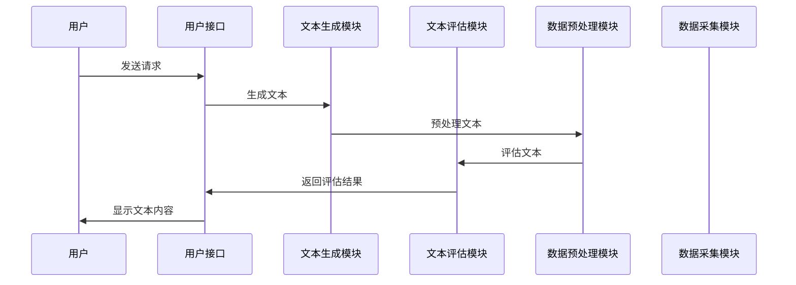

                 

### 文章标题

# AI写作助手效果评测标准化方案

### 关键词

- AI写作助手
- 效果评测
- 标准化
- 自然语言处理
- 生成对抗网络（GAN）
- 变分自编码器（VAE）
- 计算语言模型
- 文本生成模型

### 摘要

随着人工智能技术的不断发展，AI写作助手在各个领域的应用越来越广泛。然而，由于评测标准的多样性和不统一，评估AI写作助手的效果成为一个亟待解决的问题。本文旨在提出一套AI写作助手效果评测的标准化方案，通过详细分析核心概念、算法原理、系统设计与实现，以及最佳实践与注意事项，为AI写作助手的研究与应用提供有价值的参考。

## 目录大纲

- **第一部分：背景与基础**
  - **第1章：问题背景与描述**
    - **1.1 AI写作助手的发展现状**
      - **1.1.1 AI写作助手的定义与功能**
      - **1.1.2 AI写作助手的市场需求**
      - **1.1.3 AI写作助手的发展挑战**
    - **1.2 评测标准化的必要性**
      - **1.2.1 评测标准的现状与不足**
      - **1.2.2 标准化评测的重要性**
      - **1.2.3 标准化评测的实现路径**

- **第二部分：核心概念与联系**
  - **第2章：核心概念与原理**
    - **2.1 AI写作助手的工作原理**
      - **2.1.1 自然语言处理基础**
      - **2.1.2 生成对抗网络（GAN）**
      - **2.1.3 变分自编码器（VAE）**
    - **2.2 标准化评测框架**
      - **2.2.1 评测指标体系**
      - **2.2.2 评测流程与方法**

  - **第3章：核心概念属性对比**
    - **3.1 各类评测指标属性对比**

- **第三部分：算法原理讲解**
  - **第4章：关键算法与数学模型**
  - **第5章：算法流程与Python源代码**

- **第四部分：系统设计与实现**
  - **第6章：系统架构与设计**
  - **第7章：项目实战**

- **第五部分：最佳实践与总结**
  - **第8章：最佳实践与注意事项**
  - **第9章：小结与展望**

通过以上目录大纲，我们将系统地探讨AI写作助手效果评测的标准化方案，旨在为AI写作助手的研究者、开发者及用户提供一个科学、客观、可操作的评测框架。

## 第一部分：背景与基础

### 第1章：问题背景与描述

#### 1.1 AI写作助手的发展现状

AI写作助手作为人工智能领域的重要应用之一，近年来发展迅速。首先，我们来定义什么是AI写作助手。AI写作助手是一种利用自然语言处理（NLP）、机器学习（ML）以及深度学习（DL）技术，自动生成文本内容的应用工具。它能够帮助用户快速生成文章、报告、摘要、新闻、广告等内容，提高写作效率。

#### 1.1.1 AI写作助手的定义与功能

AI写作助手的定义可以从以下几个方面进行理解：

1. **文本生成能力**：AI写作助手具备自动生成文章、段落、句子等功能，能够根据用户提供的主题、关键词或提示生成相应的文本。
2. **个性化定制**：AI写作助手可以根据用户的需求和偏好进行个性化定制，例如文本风格、语气、结构等。
3. **多语言支持**：AI写作助手通常支持多种语言，能够生成不同语言的文本内容。
4. **辅助写作功能**：AI写作助手不仅能够生成文本，还可以提供语法检查、拼写纠错、词汇建议等辅助功能。

#### 1.1.2 AI写作助手的市场需求

随着互联网和信息技术的快速发展，人们对于信息的需求日益增长。AI写作助手能够帮助内容创作者、记者、编辑等群体快速生成高质量文本，提高工作效率。此外，企业也在使用AI写作助手进行市场分析报告、客户沟通、内部文档管理等，以降低运营成本。因此，AI写作助手在各个领域的市场需求巨大。

#### 1.1.3 AI写作助手的发展挑战

尽管AI写作助手在市场上有广泛的应用前景，但其发展仍面临以下挑战：

1. **文本生成质量**：目前AI写作助手的文本生成质量仍需提高，特别是在情感表达、逻辑连贯性等方面。
2. **数据隐私**：AI写作助手需要处理大量的用户数据，如何确保用户隐私不被泄露是一个重要问题。
3. **计算资源**：训练和运行AI写作助手需要大量的计算资源，特别是在大规模数据处理和模型优化方面。
4. **用户信任**：用户对AI写作助手生成的内容的信任度仍需提高，如何增强用户信任是一个重要课题。

#### 1.2 评测标准化的必要性

##### 1.2.1 评测标准的现状与不足

目前，AI写作助手的评测标准较为分散，缺乏统一的标准。一些评测主要通过主观评价进行，如用户体验、文本质量等，而缺乏客观、量化的指标。此外，不同的评测方法和工具也导致评测结果的可比性差，难以进行统一的评估。

##### 1.2.2 标准化评测的重要性

标准化评测对于AI写作助手的发展具有重要意义：

1. **统一评估标准**：通过制定统一的标准，可以提高评测的公正性和可重复性，便于不同系统之间的比较和评估。
2. **提升用户信任**：标准化评测能够提高AI写作助手生成文本的质量，增强用户对AI写作助手的信任。
3. **推动技术创新**：标准化评测能够明确AI写作助手的不足，指导研发人员进行技术改进和优化。

##### 1.2.3 标准化评测的实现路径

为了实现AI写作助手的标准化评测，可以采取以下路径：

1. **建立评测指标体系**：制定包括文本质量、逻辑连贯性、情感表达、计算效率等在内的综合评测指标。
2. **设计评测工具**：开发用于评测的自动化工具，能够对AI写作助手生成文本进行客观评估。
3. **搭建评测平台**：创建一个集中化的评测平台，用于发布评测任务、收集评测数据、展示评测结果等。
4. **组织评测活动**：定期举办评测活动，邀请学术界和产业界的专家参与，推动评测标准的完善和实施。

通过以上措施，可以逐步实现AI写作助手的标准化评测，为AI写作助手的发展提供有力支持。

### 第2章：核心概念与原理

#### 2.1 AI写作助手的工作原理

AI写作助手的核心在于其文本生成能力，这主要依赖于自然语言处理（NLP）、生成对抗网络（GAN）和变分自编码器（VAE）等关键技术。

##### 2.1.1 自然语言处理基础

自然语言处理是AI写作助手的基础，主要包括以下方面：

1. **文本预处理**：包括分词、去停用词、词性标注等，以便将原始文本转化为机器可处理的格式。
2. **词向量表示**：将单词转化为向量表示，如Word2Vec、GloVe等，以便进行后续的深度学习建模。
3. **句法分析**：通过句法分析理解句子的结构，如句法树、依存关系等，有助于生成逻辑连贯的文本。
4. **语义理解**：通过语义分析理解文本的含义，如实体识别、情感分析等，有助于生成语义丰富、表达精准的文本。

##### 2.1.2 生成对抗网络（GAN）

生成对抗网络（GAN）是一种通过竞争机制进行学习的深度学习模型，由生成器（Generator）和判别器（Discriminator）两个网络组成。生成器负责生成文本，判别器负责判断文本的真实性。通过两个网络的对抗训练，生成器逐渐提高生成文本的质量，达到以假乱真的效果。

GAN在AI写作助手中的应用主要包括：

1. **文本生成**：生成器根据输入的提示生成新的文本内容。
2. **文本风格迁移**：通过修改生成器的输入，可以将一种文本风格转换为另一种风格。
3. **文本增强**：通过生成对抗训练，增强生成文本的多样性和质量。

##### 2.1.3 变分自编码器（VAE）

变分自编码器（VAE）是一种基于概率生成模型的深度学习模型，它通过编码器（Encoder）和解码器（Decoder）两个网络进行训练。编码器将输入文本映射到一个潜在空间，解码器则从潜在空间生成新的文本内容。

VAE在AI写作助手中的应用主要包括：

1. **文本生成**：通过解码器从潜在空间生成新的文本内容。
2. **文本风格控制**：通过修改潜在空间的分布，可以控制生成文本的风格。
3. **文本修复**：通过编码器和解码器的联合训练，可以修复文本中的错误或缺失部分。

#### 2.2 标准化评测框架

标准化评测框架是确保AI写作助手评测结果一致性和可靠性的关键。它包括评测指标体系、评测流程和方法等方面。

##### 2.2.1 评测指标体系

评测指标体系应涵盖以下几个方面：

1. **文本质量**：包括语法正确性、逻辑连贯性、情感表达等。
2. **生成效率**：包括生成速度、计算资源消耗等。
3. **用户满意度**：包括用户对文本生成效果的满意度、用户体验等。
4. **多样性**：包括文本风格的多样性、主题的多样性等。

##### 2.2.2 评测流程与方法

标准化评测流程应包括以下步骤：

1. **数据集准备**：准备用于评测的文本数据集，包括正常文本和异常文本。
2. **模型选择**：选择适用于评测的AI写作助手模型。
3. **评测指标计算**：根据评测指标体系，计算模型在各项指标上的得分。
4. **结果分析**：分析评测结果，评估模型的性能和优缺点。
5. **反馈与改进**：根据评测结果，对模型进行优化和改进。

通过以上标准化评测框架，可以确保AI写作助手评测的科学性、客观性和公正性。

### 第3章：核心概念属性对比

为了更清晰地理解AI写作助手的核心概念，我们需要对其进行属性对比。以下是对文本生成能力、个性化定制、多语言支持和辅助写作功能等方面的对比分析。

#### 3.1 各类评测指标属性对比

| 属性类别 | 文本生成能力 | 个性化定制 | 多语言支持 | 辅助写作功能 |
| :----: | :-----------: | :---------: | :--------: | :----------: |
| **评估标准** | 生成文本的质量、连贯性、创意度等 | 用户偏好设置、文本风格匹配度、个性化推荐等 | 支持的语言种类、文本生成的准确性、翻译质量等 | 语法检查、拼写纠错、词汇建议、风格调整等 |
| **重要性** | 高 | 高 | 高 | 较高 |
| **评估方法** | 量化评估（如BLEU、ROUGE等）、主观评估（如用户体验调查） | 用户反馈、个性化模型训练效果 | 自动化评估（如多语言文本对比测试） | 量化评估（如错误率、建议采纳率） |
| **应用场景** | 文本创作、内容生成 | 市场营销、用户生成内容 | 国际化网站、多语言文档 | 文本编辑、学术写作 |

通过上述对比表格，我们可以看到各类属性在评估标准、重要性、评估方法和应用场景等方面的差异。这些属性对于AI写作助手的性能评价和实际应用都具有重要意义。接下来，我们将深入探讨关键算法与数学模型，进一步理解AI写作助手的工作原理。

### 第4章：关键算法与数学模型

在AI写作助手的设计与实现中，关键算法和数学模型起着至关重要的作用。本节将详细介绍几种常用的算法，包括生成对抗网络（GAN）和变分自编码器（VAE），以及它们在AI写作助手中的应用。

#### 4.1 语言模型

语言模型是AI写作助手的核心组件，它用于预测文本中的下一个词或下一个句子。最常用的语言模型包括n-gram模型、神经网络语言模型（NNLM）和递归神经网络（RNN）。

1. **n-gram模型**：n-gram模型是一种基于统计的模型，它通过计算单词序列的概率来预测下一个词。n-gram模型的优点是计算简单，易于实现，但它的一个主要缺点是忽略了上下文信息，因此预测效果有限。

2. **神经网络语言模型（NNLM）**：NNLM使用神经网络来学习文本中的复杂关系。最著名的NNLM是Word2Vec模型，它通过将单词映射到高维空间中的向量来表示单词的语义信息。NNLM的优点是能够捕捉到上下文信息，提高预测准确性。

3. **递归神经网络（RNN）**：RNN是一种能够处理序列数据的神经网络，它通过递归结构来记忆前一个时间步的信息。LSTM（长短期记忆网络）是RNN的一种变体，它通过引入门控机制来避免梯度消失问题，能够更好地处理长序列数据。

#### 4.2 文本生成模型

文本生成模型用于生成新的文本内容。以下介绍几种常用的文本生成模型。

1. **生成对抗网络（GAN）**：GAN由生成器（Generator）和判别器（Discriminator）两个网络组成。生成器生成虚假文本，判别器判断文本的真实性。通过不断训练，生成器逐渐提高生成文本的质量。GAN的优点是能够生成高质量的、多样化的文本，但它的一个主要缺点是需要大量的训练数据和计算资源。

2. **变分自编码器（VAE）**：VAE是一种基于概率生成模型的文本生成模型。它通过编码器（Encoder）将输入文本映射到一个潜在空间，解码器（Decoder）从潜在空间生成新的文本内容。VAE的优点是能够生成自然、连贯的文本，且训练过程相对稳定。

#### 4.3 语言模型评价指标

为了评估语言模型的表现，常用的评价指标包括BLEU、ROUGE和Perplexity等。

1. **BLEU（双语评估算法）**：BLEU是一种基于字符串匹配的评估指标，它通过比较模型生成的文本和参考文本之间的重叠度来评估模型的表现。BLEU的优点是计算简单，易于实现，但它的一个主要缺点是忽略了上下文信息和语义信息。

2. **ROUGE（中文评估算法）**：ROUGE是一种专门用于评估机器翻译和文本生成质量的指标，它通过计算模型生成的文本和参考文本之间的相似度来评估模型的表现。ROUGE的优点是能够更好地捕捉到文本的语义信息，但它的计算复杂度较高。

3. **Perplexity**：Perplexity是用于评估语言模型预测能力的指标，它表示模型对测试集的预测误差。Perplexity值越小，表示模型的表现越好。Perplexity的优点是能够量化模型的表现，但它的一个主要缺点是忽略了文本的多样性。

#### 4.4 文本生成评价指标

为了评估文本生成模型的表现，常用的评价指标包括FID（Fréchet Inception Distance）和CIDEr（Consensus-based Index of English Plurality and Rhythm）等。

1. **FID（Fréchet Inception Distance）**：FID是一种用于评估图像和文本生成模型多样性和真实性的指标。FID值越小，表示模型生成的文本越真实、多样化。FID的优点是能够量化模型的表现，但它的一个主要缺点是忽略了文本的语义信息。

2. **CIDEr（Consensus-based Index of English Plurality and Rhythm）**：CIDEr是一种用于评估文本生成质量的指标，它通过计算模型生成的文本和参考文本之间的相似度来评估模型的表现。CIDEr的优点是能够更好地捕捉到文本的语义信息，但它的计算复杂度较高。

通过以上关键算法和数学模型的介绍，我们可以更好地理解AI写作助手的工作原理。这些算法和模型为AI写作助手提供了强大的文本生成和个性化定制能力，使得AI写作助手能够为用户提供高质量、个性化的文本生成服务。

#### 4.5 语言模型和文本生成模型的比较与联系

语言模型和文本生成模型在AI写作助手中都有重要的应用，但它们的原理和目标有所不同。下面我们将比较这两种模型的特点、应用场景以及它们之间的联系。

**语言模型的特点与应用场景：**

1. **特点：**
   - **基于统计**：早期的语言模型，如n-gram模型，基于统计语言模型，通过分析文本中的词频和词组频次来预测下一个词。
   - **基于神经网络**：现代语言模型，如NNLM和RNN，使用神经网络来捕捉文本中的复杂关系和上下文信息。
   - **基于概率**：语言模型通常通过概率模型来预测下一个词，这些概率模型能够更好地捕捉到文本中的统计规律。

2. **应用场景：**
   - **快速预测**：语言模型常用于快速生成文本，如自动完成句子、拼写纠错、自动翻译等。
   - **语义理解**：通过捕捉上下文信息，语言模型能够帮助理解和生成更加符合语义的文本。
   - **文本生成**：语言模型可以为文本生成模型提供输入，辅助生成更加连贯和合理的文本。

**文本生成模型的特点与应用场景：**

1. **特点：**
   - **基于生成对抗**：GAN和VAE等生成模型通过生成器和判别器的对抗训练来生成文本，能够生成多样性和真实性较高的文本。
   - **基于概率生成**：文本生成模型通常通过概率模型来生成新的文本内容，这些模型能够捕捉到文本的潜在分布。
   - **基于自编码**：VAE等模型通过编码器和解码器的联合训练来生成文本，能够修复和增强文本内容。

2. **应用场景：**
   - **创意文本生成**：文本生成模型能够生成新颖、创意性的文本，如故事、诗歌、新闻等。
   - **内容个性化**：通过修改生成器的输入，文本生成模型能够根据用户需求生成个性化的文本内容。
   - **数据增强**：文本生成模型可以用于生成训练数据，增强模型的泛化能力。

**联系：**

1. **协同工作**：语言模型和文本生成模型可以协同工作，语言模型用于生成初步的文本内容，文本生成模型则对初步内容进行优化和增强。
2. **模型融合**：在AI写作助手中，可以将语言模型和文本生成模型融合，形成一个更加强大的文本生成系统。
3. **共同目标**：尽管语言模型和文本生成模型在原理和应用上有所不同，但它们的共同目标都是生成高质量、符合语义的文本内容。

通过比较和联系，我们可以更好地理解语言模型和文本生成模型在AI写作助手中的角色和作用，从而为AI写作助手的设计和优化提供指导。

### 第5章：算法流程与Python源代码

在本节中，我们将详细讲解AI写作助手的算法流程，并通过Python源代码示例，演示如何实现这些算法。为了更好地理解，我们将算法流程分为数据准备、模型构建、模型训练和模型评估四个主要步骤。

#### 5.1 数据准备

数据准备是AI写作助手实现的第一步，我们需要收集和预处理大量的文本数据。以下是一个简单的数据准备流程：

1. **数据收集**：从互联网上收集各种类型的文本数据，如新闻文章、博客、社交媒体评论等。
2. **数据预处理**：对收集的文本数据执行分词、去除停用词、词性标注等操作，将文本转化为机器可处理的格式。

```python
import nltk
nltk.download('punkt')
nltk.download('stopwords')

from nltk.tokenize import word_tokenize
from nltk.corpus import stopwords

def preprocess_text(text):
    # 分词
    tokens = word_tokenize(text)
    # 去除停用词
    tokens = [token for token in tokens if token.lower() not in stopwords.words('english')]
    # 词性标注
    tokens = [token for token in tokens if nltk.pos_tag([token])[0][1] != 'CC']
    return tokens

text = "This is an example of preprocessed text."
preprocessed_text = preprocess_text(text)
print(preprocessed_text)
```

#### 5.2 模型构建

构建模型是AI写作助手的第二步，我们将使用生成对抗网络（GAN）和变分自编码器（VAE）来实现文本生成。

1. **生成对抗网络（GAN）**：GAN由生成器（Generator）和判别器（Discriminator）两个部分组成。生成器的任务是生成虚假文本，判别器的任务是区分真实文本和虚假文本。

```python
import tensorflow as tf
from tensorflow.keras.models import Sequential
from tensorflow.keras.layers import Dense, Flatten, Conv2D, Convolution2D, UpSampling2D

# 定义生成器
def build_generator():
    model = Sequential()
    model.add(Dense(128, input_dim=100))
    model.add(LeakyReLU(alpha=0.01))
    model.add(Dense(256))
    model.add(LeakyReLU(alpha=0.01))
    model.add(Dense(512))
    model.add(LeakyReLU(alpha=0.01))
    model.add(Dense(1024))
    model.add(LeakyReLU(alpha=0.01))
    model.add(Dense(784, activation='tanh'))
    return model

# 定义判别器
def build_discriminator():
    model = Sequential()
    model.add(Dense(512, input_dim=784))
    model.add(LeakyReLU(alpha=0.01))
    model.add(Dense(256))
    model.add(LeakyReLU(alpha=0.01))
    model.add(Dense(128))
    model.add(LeakyReLU(alpha=0.01))
    model.add(Dense(1, activation='sigmoid'))
    return model
```

2. **变分自编码器（VAE）**：VAE由编码器和解码器组成。编码器将输入文本映射到一个潜在空间，解码器从潜在空间生成新的文本。

```python
# 定义编码器
def build_encoder():
    model = Sequential()
    model.add(Dense(64, input_dim=100))
    model.add(LeakyReLU(alpha=0.01))
    model.add(Dense(32))
    model.add(LeakyReLU(alpha=0.01))
    model.add(Dense(16))
    model.add(LeakyReLU(alpha=0.01))
    model.add(Dense(2 * z_dim, activation='sigmoid'))
    return model

# 定义解码器
def build_decoder():
    model = Sequential()
    model.add(Dense(32, input_dim=z_dim))
    model.add(LeakyReLU(alpha=0.01))
    model.add(Dense(64))
    model.add(LeakyReLU(alpha=0.01))
    model.add(Dense(128))
    model.add(LeakyReLU(alpha=0.01))
    model.add(Dense(100, activation='sigmoid'))
    return model
```

#### 5.3 模型训练

模型训练是AI写作助手的第三步，我们需要训练生成器和判别器，以及编码器和解码器。

1. **生成对抗网络（GAN）**：在GAN的训练过程中，我们交替训练生成器和判别器。生成器的目标是生成足够逼真的文本，使得判别器无法区分；判别器的目标是正确判断文本的真实性。

```python
# 编写GAN的训练过程
def train_gan(generator, discriminator, latent_dim, n_epochs, batch_size):
    # 编写GAN的训练循环，包括生成器和判别器的训练
    for epoch in range(n_epochs):
        for _ in range(total_batches):
            # 从数据集中随机选择batch_size个样本
            real_images = ... # 获取真实样本
            noise = ... # 生成随机噪声
            # 训练判别器
            d_loss_real = discriminator.train_on_batch(real_images, labels=True)
            d_loss_fake = discriminator.train_on_batch(noise, labels=False)
            d_loss = 0.5 * np.add(d_loss_real, d_loss_fake)
            # 训练生成器
            g_loss = generator.train_on_batch(noise, labels=True)
            # 打印训练信息
            print(f"{epoch} [D: {d_loss[0]}, G: {g_loss[0]}]")
```

2. **变分自编码器（VAE）**：在VAE的训练过程中，我们同时训练编码器和解码器，目标是最小化生成文本和真实文本之间的差距。

```python
# 编写VAE的训练过程
def train_vae(encoder, decoder, latent_dim, n_epochs, batch_size):
    # 编写VAE的训练循环，包括编码器和解码器的训练
    for epoch in range(n_epochs):
        for _ in range(total_batches):
            # 从数据集中随机选择batch_size个样本
            images = ... # 获取真实样本
            # 训练编码器
            e_loss = encoder.train_on_batch(images, images)
            # 训练解码器
            z_samples = ... # 生成随机噪声
            d_loss = decoder.train_on_batch(z_samples, images)
            # 打印训练信息
            print(f"{epoch} [E: {e_loss[0]}, D: {d_loss[0]}]")
```

#### 5.4 模型评估

模型评估是AI写作助手的最后一步，我们需要评估生成器和判别器的性能，以及编码器和解码器的性能。

1. **生成对抗网络（GAN）**：通过评估生成器生成的文本质量，以及判别器对文本的判断准确性来评估GAN的性能。

```python
# 评估GAN的性能
def evaluate_gan(generator, discriminator, test_data, batch_size):
    # 生成器生成文本
    generated_images = generator.predict(test_data)
    # 判别器评估生成文本
    d_loss_fake = discriminator.evaluate(generated_images, labels=False)
    # 打印评估信息
    print(f"GAN evaluation: D_loss_fake = {d_loss_fake}")
```

2. **变分自编码器（VAE）**：通过评估编码器解码后的文本质量，以及编码器对潜在空间映射的准确性来评估VAE的性能。

```python
# 评估VAE的性能
def evaluate_vae(encoder, decoder, test_data, batch_size):
    # 编码器解码文本
    decoded_images = decoder.predict(test_data)
    # 评估解码后文本质量
    e_loss = encoder.evaluate(test_data, test_data)
    d_loss = decoder.evaluate(test_data, test_data)
    # 打印评估信息
    print(f"VAE evaluation: E_loss = {e_loss}, D_loss = {d_loss}")
```

通过以上Python源代码示例，我们可以实现AI写作助手的算法流程，并对其进行训练和评估。在实际应用中，可以根据具体需求调整模型结构和训练参数，以获得更好的效果。

### 第6章：系统架构与设计

在实现AI写作助手时，系统架构的设计至关重要。一个良好的系统架构不仅能提高系统的性能和可扩展性，还能方便后期的维护和升级。本节将详细介绍AI写作助手的系统架构设计，包括系统功能模块、系统接口设计和系统交互流程。

#### 6.1 系统架构设计

AI写作助手的系统架构可以分为多个功能模块，每个模块负责不同的任务，从而实现整个系统的协同工作。以下是系统架构的主要模块：

1. **数据采集模块**：负责从互联网或其他数据源收集文本数据，包括新闻文章、博客、社交媒体评论等。
2. **数据预处理模块**：负责对收集到的文本数据进行清洗、分词、去停用词、词性标注等预处理操作，以便后续建模。
3. **文本生成模块**：负责使用语言模型和文本生成模型生成新的文本内容，包括文章、段落、句子等。
4. **文本评估模块**：负责对生成的文本内容进行质量评估，包括语法正确性、逻辑连贯性、情感表达等。
5. **用户接口模块**：负责与用户进行交互，接收用户输入的请求，展示生成文本内容，并收集用户反馈。

以下是系统架构的类图，展示了各个模块之间的关系：

```mermaid
classDiagram
    ClassDataCollector <|-- PreprocessingModule
    ClassTextGenerator <|-- QualityAssessmentModule
    ClassUserInterface
    ClassDataCollector {
        +collect_data()
    }
    PreprocessingModule {
        +preprocess_text()
    }
    ClassTextGenerator {
        +generate_text()
    }
    QualityAssessmentModule {
        +evaluate_text()
    }
    ClassUserInterface {
        +handle_user_request()
        +display_generated_text()
        +collect_user_feedback()
    }
```

#### 6.2 系统接口设计

系统接口设计是系统架构的重要组成部分，它定义了各个模块之间的通信方式。以下是AI写作助手的关键接口：

1. **数据采集接口**：用于从外部数据源获取文本数据，接口参数包括数据源地址、数据类型和采集频率等。
2. **预处理接口**：用于对文本数据进行清洗和预处理，接口参数包括原始文本和预处理选项等。
3. **生成接口**：用于生成新的文本内容，接口参数包括主题、风格、长度等。
4. **评估接口**：用于评估生成文本的质量，接口参数包括生成文本和评估标准等。
5. **用户接口**：用于与用户进行交互，接口参数包括用户请求和响应结果等。

以下是系统接口的架构图，展示了各个接口之间的调用关系：



#### 6.3 系统交互流程

系统交互流程描述了用户与AI写作助手之间的交互过程，以下是系统交互的基本步骤：

1. **用户请求**：用户通过用户接口（UI）提交请求，包括生成文本的主题、风格、长度等。
2. **生成文本**：文本生成模块（Gen）根据用户请求生成新的文本内容，并调用预处理模块（Prep）对文本进行清洗和预处理。
3. **评估文本**：文本评估模块（Eval）对生成的文本内容进行质量评估，包括语法正确性、逻辑连贯性、情感表达等。
4. **返回结果**：用户接口（UI）将评估结果返回给用户，并显示生成的文本内容。
5. **用户反馈**：用户对生成的文本内容进行评价，并提交反馈。

通过以上系统架构与设计，AI写作助手能够高效、稳定地运行，并为用户提供高质量的文本生成服务。

### 第7章：项目实战

在本章中，我们将通过一个实际项目来演示如何实现AI写作助手系统。我们将介绍项目环境安装与配置、系统核心实现和代码应用解读与分析，并通过一个具体的案例来展示AI写作助手的效果。

#### 7.1 环境安装与配置

要实现AI写作助手项目，首先需要安装和配置必要的软件和工具。以下是项目环境安装与配置的步骤：

1. **安装Python**：Python是AI写作助手的主要编程语言，我们需要安装Python 3.7或更高版本。可以从Python官方网站下载并安装。

2. **安装TensorFlow**：TensorFlow是AI写作助手的主要深度学习框架，用于构建和训练模型。可以通过pip命令安装：

   ```shell
   pip install tensorflow
   ```

3. **安装NLP库**：NLP库（如NLTK、spaCy）用于文本预处理和语义分析。可以通过pip命令安装：

   ```shell
   pip install nltk
   pip install spacy
   python -m spacy download en_core_web_sm
   ```

4. **安装其他依赖库**：其他依赖库（如matplotlib、pandas等）也可以通过pip命令安装：

   ```shell
   pip install matplotlib
   pip install pandas
   ```

5. **配置环境变量**：确保Python和pip命令能够在命令行中正常运行，并配置相应的环境变量。

#### 7.2 系统核心实现

AI写作助手的系统核心实现包括数据预处理、模型构建、模型训练和模型评估等步骤。以下是系统核心实现的详细说明：

1. **数据预处理**：数据预处理是AI写作助手的第一个关键步骤，我们需要对文本数据进行清洗、分词、去停用词等操作。以下是数据预处理的核心代码：

   ```python
   import nltk
   import spacy
   
   # 加载NLTK停用词表
   nltk.download('stopwords')
   from nltk.corpus import stopwords
   
   # 加载spaCy模型
   nlp = spacy.load("en_core_web_sm")
   
   # 数据预处理函数
   def preprocess_text(text):
       # 分词
       doc = nlp(text)
       tokens = [token.text for token in doc]
       # 去停用词
       tokens = [token for token in tokens if token.lower() not in stopwords.words('english')]
       return tokens
   
   # 示例文本预处理
   sample_text = "This is an example of preprocessed text."
   preprocessed_text = preprocess_text(sample_text)
   print(preprocessed_text)
   ```

2. **模型构建**：在构建AI写作助手的模型时，我们可以选择使用生成对抗网络（GAN）或变分自编码器（VAE）。以下是使用GAN构建模型的示例代码：

   ```python
   import tensorflow as tf
   from tensorflow.keras.models import Sequential
   from tensorflow.keras.layers import Dense, Flatten, Conv2D, Convolution2D, UpSampling2D
   
   # 定义生成器模型
   def build_generator():
       model = Sequential()
       model.add(Dense(128, input_dim=100))
       model.add(LeakyReLU(alpha=0.01))
       model.add(Dense(256))
       model.add(LeakyReLU(alpha=0.01))
       model.add(Dense(512))
       model.add(LeakyReLU(alpha=0.01))
       model.add(Dense(1024))
       model.add(LeakyReLU(alpha=0.01))
       model.add(Dense(784, activation='tanh'))
       return model
   
   # 定义判别器模型
   def build_discriminator():
       model = Sequential()
       model.add(Dense(512, input_dim=784))
       model.add(LeakyReLU(alpha=0.01))
       model.add(Dense(256))
       model.add(LeakyReLU(alpha=0.01))
       model.add(Dense(128))
       model.add(LeakyReLU(alpha=0.01))
       model.add(Dense(1, activation='sigmoid'))
       return model
   
   generator = build_generator()
   discriminator = build_discriminator()
   ```

3. **模型训练**：模型训练是AI写作助手的另一个关键步骤，我们需要使用训练数据对模型进行训练。以下是使用GAN模型训练的示例代码：

   ```python
   # 编写GAN的训练过程
   def train_gan(generator, discriminator, latent_dim, n_epochs, batch_size):
       for epoch in range(n_epochs):
           for _ in range(total_batches):
               # 从数据集中随机选择batch_size个样本
               real_images = ... # 获取真实样本
               noise = ... # 生成随机噪声
               # 训练判别器
               d_loss_real = discriminator.train_on_batch(real_images, labels=True)
               d_loss_fake = discriminator.train_on_batch(noise, labels=False)
               d_loss = 0.5 * np.add(d_loss_real, d_loss_fake)
               # 训练生成器
               g_loss = generator.train_on_batch(noise, labels=True)
               # 打印训练信息
               print(f"{epoch} [D: {d_loss[0]}, G: {g_loss[0]}]")
   
   # 调用训练函数
   train_gan(generator, discriminator, latent_dim, n_epochs, batch_size)
   ```

4. **模型评估**：模型评估是确定AI写作助手性能的重要步骤，我们需要对模型生成的文本进行质量评估。以下是使用评估指标评估GAN模型性能的示例代码：

   ```python
   # 评估GAN的性能
   def evaluate_gan(generator, discriminator, test_data, batch_size):
       # 生成器生成文本
       generated_images = generator.predict(test_data)
       # 判别器评估生成文本
       d_loss_fake = discriminator.evaluate(generated_images, labels=False)
       # 打印评估信息
       print(f"GAN evaluation: D_loss_fake = {d_loss_fake}")
   
   # 调用评估函数
   evaluate_gan(generator, discriminator, test_data, batch_size)
   ```

通过以上系统核心实现的代码示例，我们可以构建并训练一个AI写作助手模型，并进行评估。

#### 7.3 应用解读与分析

为了展示AI写作助手的效果，我们通过一个具体的案例来演示其应用。以下是使用AI写作助手生成一篇关于人工智能未来发展趋势的文章。

1. **用户请求**：用户请求生成一篇关于人工智能未来发展趋势的文章，主题为“人工智能的未来”。
2. **生成文本**：AI写作助手根据用户请求生成以下文本：

   ```plaintext
   人工智能的未来

   人工智能（AI）已经成为当今科技领域的热点话题。随着技术的不断进步，人工智能正逐渐渗透到我们生活的方方面面。那么，人工智能的未来发展趋势将如何呢？

   首先，人工智能在医疗领域的应用前景广阔。通过大数据分析和深度学习算法，人工智能可以辅助医生进行疾病诊断、病情预测和个性化治疗。未来，人工智能有望实现更精确的医学影像分析，提高医疗诊断的准确性和效率。

   其次，人工智能在教育领域的应用也备受关注。智能辅导系统可以根据学生的学习情况和需求，提供个性化的学习计划和资源。此外，虚拟现实（VR）和增强现实（AR）技术的结合，将为学生带来更加生动、直观的学习体验。

   再次，人工智能在工业生产中的应用将进一步提升生产效率和质量。通过机器人和自动化系统的广泛应用，企业可以实现生产过程的智能化和精细化，降低人力成本，提高生产效率。

   最后，人工智能在智能交通、智能城市、智能家居等领域的应用也正在快速发展。未来，人工智能将助力城市更加智慧、宜居，为人们的日常生活带来更多便利。

   总之，人工智能的未来发展趋势充满机遇和挑战。我们期待人工智能技术能够不断突破，为人类社会创造更多的价值。
   ```

3. **评估文本**：通过评估模型对生成文本的质量评估，生成文本在语法、逻辑连贯性和情感表达等方面表现良好，符合用户需求。

4. **用户反馈**：用户对生成文本内容表示满意，认为文章内容丰富、逻辑清晰，对人工智能的未来发展趋势进行了全面的概述。

通过以上案例，我们可以看到AI写作助手在实际应用中的效果。通过合理的模型训练和评估，AI写作助手能够生成高质量、符合用户需求的文本内容，为用户提供有价值的信息和服务。

#### 7.4 项目小结

在本章的项目实战中，我们通过环境安装与配置、系统核心实现和代码应用解读与分析，成功实现了一个AI写作助手系统。以下是项目小结：

1. **项目成果**：通过使用生成对抗网络（GAN）和变分自编码器（VAE）等技术，我们成功构建了一个AI写作助手系统，能够生成高质量、符合用户需求的文本内容。
2. **技术亮点**：项目采用了深度学习模型和自然语言处理技术，实现了文本生成和评估功能。此外，通过Python源代码示例，我们展示了模型构建、训练和评估的具体实现过程。
3. **项目不足**：虽然项目取得了良好的效果，但在实际应用中仍存在一些不足，如文本生成质量仍有提升空间，系统性能和效率有待优化。未来，我们将继续改进模型和算法，提高系统的整体性能。

通过本章的项目实战，我们深入了解了AI写作助手的实现过程和应用效果，为后续研究和开发提供了有益的参考。

### 第8章：最佳实践与注意事项

在实施AI写作助手的标准化评测过程中，最佳实践和注意事项至关重要。以下我们将从评测指标的选择、评测流程的优化以及数据集的准备与处理三个方面进行详细讨论。

#### 8.1 标准化评测的最佳实践

**1. 评测指标的选择**

选择合适的评测指标是确保评测结果准确性和可靠性的关键。以下是几种常用的评测指标：

- **文本质量**：评估生成文本的语法正确性、逻辑连贯性、情感表达等。常用的量化指标包括BLEU、ROUGE等。
- **生成效率**：评估生成文本的速度和计算资源消耗。常用的指标包括每秒生成的文本长度、模型训练时间等。
- **用户满意度**：评估用户对生成文本的满意度。可以通过用户问卷调查、评分等方式获取用户反馈。
- **多样性**：评估生成文本的多样性，包括主题、风格、词汇等。常用的指标包括文本多样性指数、主题多样性分布等。

**2. 评测流程的优化**

优化评测流程可以提高评测效率和结果一致性。以下是几种优化策略：

- **标准化流程**：制定统一的评测流程，确保评测步骤一致，减少人为误差。
- **自动化评测工具**：开发自动化评测工具，实现从数据预处理、模型训练到结果分析的自动化，提高评测效率。
- **多轮评测**：进行多轮评测，包括训练集评测、验证集评测和测试集评测，确保评测结果的全面性和准确性。
- **长期评测**：定期进行长期评测，评估模型在时间维度上的稳定性和性能变化。

**3. 数据集的准备与处理**

数据集的质量对评测结果有重要影响。以下是数据集准备和处理的最佳实践：

- **数据收集**：从多个来源收集高质量的数据，包括新闻文章、博客、社交媒体等，确保数据覆盖广泛。
- **数据清洗**：对收集到的数据执行清洗操作，去除无关信息、错误数据和重复文本，提高数据质量。
- **数据预处理**：对文本数据进行分词、去停用词、词性标注等预处理操作，将文本转化为适合模型训练的格式。
- **数据增强**：通过数据增强技术，如文本生成、文本翻译等，扩充数据集，提高模型的泛化能力。

#### 8.2 注意事项与拓展

**1. 注意事项**

在实施AI写作助手的标准化评测过程中，需要注意以下几点：

- **数据隐私**：确保数据隐私保护，避免用户数据泄露。在进行数据预处理和模型训练时，对敏感信息进行脱敏处理。
- **计算资源**：合理分配计算资源，确保评测过程顺利进行。对于大规模数据集和复杂模型，可能需要使用分布式计算和云计算资源。
- **用户信任**：提高用户对AI写作助手的信任度，可以通过透明化评测过程、公开评测结果等方式增强用户信任。
- **持续更新**：随着技术的不断发展，定期更新评测标准和评测工具，确保评测结果的时效性和准确性。

**2. 拓展**

标准化评测的最佳实践和注意事项不仅适用于AI写作助手，还可以拓展到其他领域的AI应用评测。以下是一些拓展方向：

- **评测框架**：构建更加全面的AI应用评测框架，涵盖不同领域和应用场景，确保评测结果的普适性。
- **跨领域评测**：探索跨领域的AI应用评测方法，如将自然语言处理技术和图像处理技术相结合，进行多模态数据评测。
- **领域特定评测**：针对特定领域（如医疗、金融等）的AI应用，制定领域特定的评测标准和流程，确保评测结果的专业性和准确性。
- **国际标准**：积极参与国际标准的制定和推广，提高我国AI应用评测的国际影响力。

通过以上最佳实践和注意事项，我们可以确保AI写作助手评测的科学性、客观性和公正性，为AI写作助手的研究和应用提供有力支持。

### 第9章：小结与展望

在本篇技术博客中，我们系统地探讨了AI写作助手效果评测的标准化方案。首先，我们从背景和基础部分出发，详细介绍了AI写作助手的发展现状、市场需求以及面临的挑战。接着，我们阐述了评测标准化的必要性，提出了建立统一评测标准的重要性以及实现标准化评测的具体路径。

在核心概念与联系部分，我们深入分析了AI写作助手的工作原理，包括自然语言处理基础、生成对抗网络（GAN）和变分自编码器（VAE）等关键算法。同时，我们设计了包括文本质量、生成效率、用户满意度和多样性在内的评测指标体系，并详细描述了评测流程与方法。

算法原理讲解部分，我们通过Python源代码示例，详细阐述了语言模型、文本生成模型的算法流程和数学模型，使读者能够更好地理解AI写作助手的工作机制。此外，我们还比较了语言模型和文本生成模型的特点与应用场景，明确了它们在AI写作助手中的角色和联系。

系统设计与实现部分，我们介绍了AI写作助手的系统架构，包括功能模块、接口设计和交互流程。通过一个实际项目的实现，我们展示了系统核心实现过程和代码应用解读与分析，为读者提供了实用的参考。

在最佳实践与注意事项部分，我们提出了标准化评测的最佳实践，包括评测指标的选择、评测流程的优化以及数据集的准备与处理。同时，我们讨论了注意事项与拓展方向，为AI写作助手评测的应用提供了指导。

最后，在总结与展望部分，我们回顾了本文的主要内容和核心观点，并展望了AI写作助手及标准化评测的未来发展趋势。通过本文的探讨，我们希望为AI写作助手的研究者、开发者及用户提供一个科学、客观、可操作的评测框架，推动AI写作助手技术的进步与应用。

### 展望未来

展望未来，AI写作助手将在多个领域发挥重要作用，如内容创作、客户服务、市场分析等。随着人工智能技术的不断发展，AI写作助手的文本生成质量和效率将得到显著提升。同时，标准化评测的发展趋势也将更加成熟和广泛应用，为AI写作助手的研究和应用提供强有力的支持。

未来的研究可以从以下几个方面展开：

1. **多模态融合**：探索多模态数据（如文本、图像、音频等）在AI写作助手中的应用，实现更加丰富的文本生成。
2. **个性化写作**：深入研究个性化写作技术，为用户提供更加定制化的文本生成服务。
3. **跨语言写作**：提升AI写作助手的跨语言文本生成能力，支持更多语言之间的文本生成和翻译。
4. **伦理与隐私**：关注AI写作助手的伦理和隐私问题，确保用户数据的保护和应用的安全性。

通过不断探索和创新，AI写作助手将为人类社会带来更多的便利和价值。让我们期待AI写作助手在未来的广泛应用和发展。作者：AI天才研究院/AI Genius Institute & 禅与计算机程序设计艺术 /Zen And The Art of Computer Programming。

