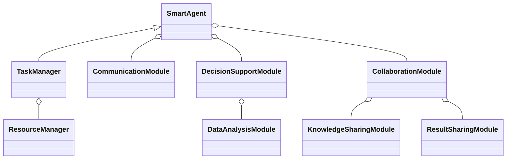
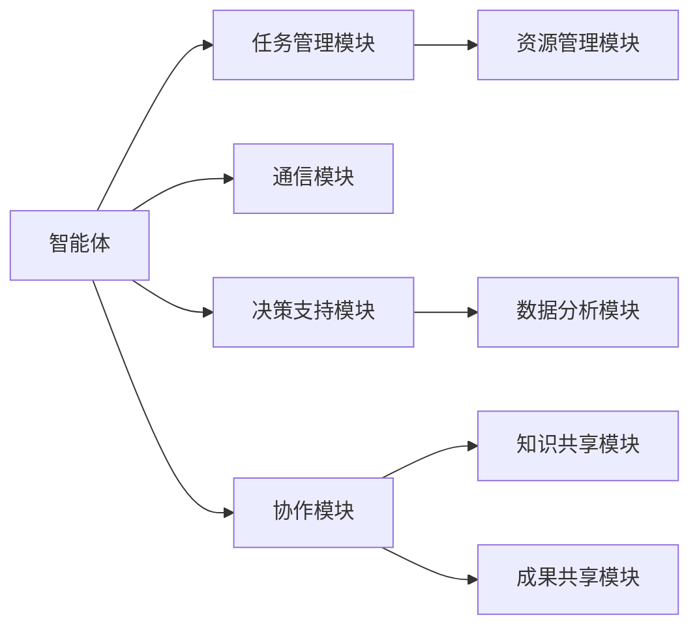
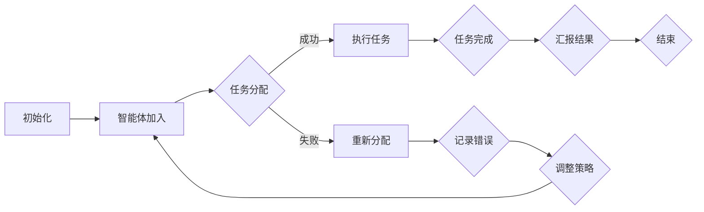

                 


### AI协作新范式：重塑团队合作模式

---

#### 关键词：
人工智能、协作、团队合作、效率、决策、创新

#### 摘要：
本文深入探讨了人工智能在团队合作中的应用，提出了AI协作新范式，旨在通过重塑团队合作模式，提高团队效率、优化决策过程并增强创新能力。文章分为三个部分，分别从背景与概述、AI协作模型与实践、最佳实践与展望三个方面进行详细阐述。

---

## 第一部分：背景与概述

### 第1章：问题背景与重要性

#### 1.1 人工智能协作的起源与发展

人工智能（AI）作为计算机科学的一个重要分支，起源于20世纪50年代。随着计算能力的提升和大数据、云计算等技术的快速发展，人工智能逐渐从理论研究走向实际应用。协作智能作为人工智能的一个重要方向，旨在通过模拟人类的协作行为，提高机器的智能化水平。

AI协作的起源可以追溯到多智能体系统（MAS）的研究。多智能体系统是指由多个具有自主能力和协作能力的智能体组成的系统。这些智能体可以在复杂的动态环境中相互协作，共同完成任务。随着AI技术的发展，AI协作逐渐在工业、教育、商业等领域得到广泛应用。

在工业领域，AI协作系统被用于生产线的自动化控制、机器间的协同作业等。通过AI协作，可以大大提高生产效率，降低生产成本。在教育领域，AI协作系统被用于个性化学习、学生作业自动批改等，帮助学生提高学习效果。在商业领域，AI协作系统被用于客户服务、市场分析等，帮助企业更好地满足客户需求，提高市场竞争力。

#### 1.2 现代团队合作面临的挑战

尽管AI协作在某些领域取得了显著成果，但现代团队合作仍面临着诸多挑战。首先，团队协作效率低下是一个普遍存在的问题。团队成员之间的沟通不畅、任务分配不合理、工作流程繁琐等问题，都会导致团队协作效率低下。

其次，信息孤岛与沟通障碍也是一个突出问题。在现代企业中，各部门之间的信息往往相互独立，缺乏有效的共享和交流机制。这导致团队内部信息流通不畅，影响决策效率。

此外，个人能力与团队目标的匹配问题也是一个重要挑战。团队成员的能力水平参差不齐，如何合理分配任务，使每个成员都能发挥其最大潜力，同时实现团队目标，是一个复杂的问题。

#### 1.3 人工智能在团队合作中的应用前景

人工智能在团队合作中的应用前景非常广阔。首先，AI协作可以通过自动化和智能化手段，提高团队协作效率。例如，通过自然语言处理技术，可以实现团队成员之间的即时通讯和任务分配，减少沟通成本，提高工作效率。

其次，AI协作可以优化团队决策过程。通过机器学习算法，可以对团队的历史数据进行分析，预测团队未来的发展趋势，为团队决策提供有力支持。此外，AI协作还可以通过模拟不同的决策场景，帮助团队评估决策结果，提高决策质量。

最后，AI协作可以增强团队的创新能力。通过AI协作，团队成员可以更加专注于创新工作，减少重复性劳动。同时，AI协作还可以通过智能搜索和推荐系统，为团队成员提供丰富的知识资源和灵感，激发创新思维。

## 第2章：核心概念与定义

#### 2.1 AI协作的概念与特征

AI协作是指通过人工智能技术，实现多个智能体之间的协作与互动。在AI协作中，智能体可以是机器人、计算机程序、人类个体等，它们可以在特定的环境中相互通信、协调行动，以实现共同的目标。

AI协作具有以下特征：

1. **自主性**：智能体具有独立执行任务的能力，可以在没有人类干预的情况下完成特定的任务。
2. **协同性**：智能体之间可以相互协作，共同完成任务。协同性体现在智能体之间的信息交换、资源共享和协调行动。
3. **适应性**：智能体可以根据环境的变化和任务的需求，调整自己的行为和策略，以实现更好的协作效果。
4. **智能性**：智能体具备一定的智能水平，可以通过机器学习、深度学习等技术，不断优化自己的行为和决策。

#### 2.2 团队合作的AI模型

团队合作AI模型是一种基于人工智能技术的团队协作框架。它通过模拟人类团队的合作行为，实现团队成员之间的信息共享、任务协调和决策优化。团队合作AI模型通常包括以下几个组成部分：

1. **任务管理模块**：负责任务分配、进度监控和资源管理，确保团队成员能够高效地完成任务。
2. **通信模块**：提供团队成员之间的即时通讯功能，支持文本、语音、视频等多种通信方式。
3. **决策支持模块**：利用机器学习算法，对团队的历史数据进行分析，为团队决策提供数据支持和预测。
4. **协作模块**：支持团队成员之间的协同工作，包括任务协作、知识共享和成果共享。

#### 2.3 AI协作与传统团队合作的对比

AI协作与传统团队合作在多个方面存在差异：

1. **效率**：AI协作通过自动化和智能化手段，可以显著提高团队协作效率。传统团队合作往往受到人类能力的限制，效率相对较低。
2. **沟通**：AI协作可以通过智能通讯工具，实现团队成员之间的即时沟通。传统团队合作则往往依赖于面对面的交流，沟通效率较低。
3. **决策**：AI协作利用机器学习算法，可以对团队决策提供数据支持和预测。传统团队合作则主要依赖于团队成员的经验和直觉，决策质量较低。
4. **创新**：AI协作可以通过智能搜索和推荐系统，激发团队成员的创新思维。传统团队合作则缺乏这样的机制，创新能力相对较低。

## 第3章：AI协作的数学模型与公式

#### 3.1 AI协作的数学基础

AI协作的数学基础主要包括概率论、图论、线性代数和优化算法等。这些数学工具和方法为AI协作提供了理论基础和计算方法。

1. **概率论**：用于描述智能体之间的不确定性关系，包括概率分布、条件概率、贝叶斯定理等。
2. **图论**：用于描述智能体之间的交互关系，包括图的基本概念、路径算法、网络优化等。
3. **线性代数**：用于处理多维数据，包括矩阵运算、特征值和特征向量等。
4. **优化算法**：用于求解最优化问题，包括线性规划、整数规划、遗传算法等。

#### 3.2 公式推导与详细解释

在AI协作中，常用的数学模型和公式包括：

1. **协同工作效率公式**：$E = \frac{1}{1 + \sum_{i=1}^{n} p_i^2}$，其中$E$表示协同工作效率，$p_i$表示智能体$i$的个体效率。该公式表示，当多个智能体共同工作时，协同工作效率取决于每个智能体的个体效率。
2. **信息传递公式**：$I = \frac{1}{1 + \sum_{i=1}^{n} d_i^2}$，其中$I$表示信息传递效率，$d_i$表示智能体$i$之间的距离。该公式表示，当智能体之间的距离增加时，信息传递效率降低。
3. **合作成本公式**：$C = \sum_{i=1}^{n} c_i^2$，其中$C$表示合作成本，$c_i$表示智能体$i$的合作成本。该公式表示，当多个智能体共同工作时，合作成本取决于每个智能体的合作成本。

#### 3.3 实例分析

以下是一个实际案例：

假设有三个智能体A、B、C，它们的个体效率分别为$p_A = 0.8$，$p_B = 0.7$，$p_C = 0.9$。它们之间的距离分别为$d_A = 2$，$d_B = 3$，$d_C = 1$。它们之间的合作成本分别为$c_A = 1$，$c_B = 2$，$c_C = 3$。

根据协同工作效率公式，计算协同工作效率：

$E = \frac{1}{1 + 0.8^2 + 0.7^2 + 0.9^2} = \frac{1}{1 + 0.64 + 0.49 + 0.81} = \frac{1}{2.94} \approx 0.340$

根据信息传递公式，计算信息传递效率：

$I = \frac{1}{1 + 2^2 + 3^2 + 1^2} = \frac{1}{1 + 4 + 9 + 1} = \frac{1}{15} \approx 0.067$

根据合作成本公式，计算合作成本：

$C = 1^2 + 2^2 + 3^2 = 1 + 4 + 9 = 14$

通过上述计算，可以得出智能体A、B、C在协同工作时的效率、信息传递效率和合作成本。

## 第二部分：AI协作模型与实践

### 第4章：AI协作模型的架构与设计

#### 4.1 AI协作模型的架构设计

AI协作模型的架构设计是构建高效协作系统的基础。一个典型的AI协作模型架构包括以下几个主要模块：

1. **智能体模块**：包括各个智能体的定义、属性和行为。智能体可以是机器人、计算机程序或人类个体。
2. **任务管理模块**：负责任务分配、进度监控和资源管理。任务管理模块可以根据智能体的能力和任务需求，合理分配任务，确保任务的高效完成。
3. **通信模块**：提供智能体之间的即时通讯功能。通信模块支持文本、语音、视频等多种通信方式，确保智能体之间的信息流畅传递。
4. **决策支持模块**：利用机器学习算法，对团队的历史数据进行分析，为团队决策提供数据支持和预测。决策支持模块可以帮助团队评估不同的决策方案，选择最优的决策。
5. **协作模块**：支持智能体之间的协同工作。协作模块包括任务协作、知识共享和成果共享等功能，确保智能体之间能够高效地合作。

#### 4.2 类图与关系图展示

为了更好地理解AI协作模型的架构设计，可以使用类图和关系图来展示各个模块之间的关系和功能。

以下是一个简单的AI协作模型类图：



类图中，SmartAgent类表示智能体，包括属性和行为。TaskManager类表示任务管理模块，负责任务分配和进度监控。CommunicationModule类表示通信模块，提供即时通讯功能。DecisionSupportModule类表示决策支持模块，负责数据分析和决策预测。CollaborationModule类表示协作模块，包括知识共享和成果共享功能。ResourceManager类表示资源管理模块，负责资源分配和管理。DataAnalysisModule类表示数据分析模块，负责对团队历史数据进行分析。KnowledgeSharingModule类表示知识共享模块，负责知识共享。ResultSharingModule类表示成果共享模块，负责成果共享。

以下是一个简单的AI协作模型关系图：



关系图中，智能体A与任务管理模块B、通信模块C、决策支持模块D和协作模块E之间存在关联关系。任务管理模块B与资源管理模块F、决策支持模块D与数据分析模块G、协作模块E与知识共享模块H和成果共享模块I之间存在关联关系。

#### 4.3 设计方案的优缺点分析

在AI协作模型的设计过程中，需要综合考虑系统的功能需求、性能要求、可扩展性和易维护性等因素。以下是对设计方案优缺点的分析：

1. **优点**：

- **功能全面**：设计方案涵盖了智能体模块、任务管理模块、通信模块、决策支持模块和协作模块等，能够满足团队协作的多种需求。
- **模块化设计**：各个模块之间相互独立，便于系统的维护和扩展。模块化设计有助于提高系统的可维护性和可扩展性。
- **高效性**：通过任务管理和决策支持模块，可以优化团队协作的效率和决策质量，提高团队的整体效能。

2. **缺点**：

- **复杂度高**：系统的模块化设计虽然提高了可维护性和可扩展性，但也增加了系统的复杂度。在开发和维护过程中，需要仔细管理和协调各个模块之间的交互。
- **性能开销**：决策支持模块和协作模块的引入，可能会增加系统的性能开销。特别是在大规模团队协作场景下，需要确保系统的性能和稳定性。
- **数据安全**：在AI协作过程中，涉及大量的数据传输和存储。需要确保数据的安全性和隐私性，防止数据泄露和滥用。

针对上述缺点，可以通过以下方式进行优化：

- **简化模块交互**：通过简化模块之间的交互，降低系统的复杂度，提高系统的可维护性。
- **性能优化**：对决策支持模块和协作模块进行性能优化，提高系统的响应速度和处理能力。
- **数据安全防护**：加强数据安全和隐私保护措施，确保系统的数据安全。

### 第5章：AI协作算法原理

#### 5.1 算法流程图展示

AI协作算法的流程图如下所示：



在算法流程图中，A表示初始化阶段，包括智能体加入和任务分配。B表示智能体加入，C表示任务分配。如果任务分配成功，则执行任务D；如果任务分配失败，则重新分配任务E。D表示执行任务，F表示任务完成，G表示汇报结果，H表示结束。如果任务分配失败，则记录错误I，并调整策略J，然后重新加入智能体B。

#### 5.2 算法原理讲解

AI协作算法的核心思想是通过智能体的加入和任务分配，实现团队协作的高效性和灵活性。以下是对算法原理的详细讲解：

1. **智能体加入**：在算法初始化阶段，智能体加入系统。智能体可以是机器人、计算机程序或人类个体。智能体需要向系统注册自己的信息，包括能力、资源等。

2. **任务分配**：系统根据智能体的能力和任务需求，进行任务分配。任务分配算法需要考虑以下因素：

- **智能体能力**：根据智能体的能力和任务需求，选择最适合的智能体执行任务。
- **任务优先级**：根据任务的紧急程度和重要性，对任务进行优先级排序，确保高优先级任务得到及时处理。
- **资源约束**：考虑智能体的资源限制，确保任务分配后，智能体仍然有足够的资源完成其他任务。

3. **执行任务**：智能体根据分配的任务，开始执行任务。执行任务的过程中，智能体可以与其他智能体进行信息交互，共享资源和经验。

4. **任务完成**：任务完成后，智能体向系统汇报结果。系统对汇报的结果进行记录和分析，为后续任务分配提供参考。

5. **汇报结果**：系统记录任务执行结果，并根据结果调整任务分配策略。如果任务分配失败，系统记录错误，并尝试重新分配任务。

6. **记录错误**：在任务分配失败时，系统记录错误信息，包括任务分配失败的原因、智能体的状态等。错误记录有助于系统分析问题和优化任务分配算法。

7. **调整策略**：根据记录的错误信息，系统调整任务分配策略。调整策略的目标是提高任务分配的成功率，减少任务分配失败的情况。

8. **结束**：当所有任务完成，系统结束运行。

#### 5.3 Python源代码实现与讲解

以下是一个简单的Python源代码实现，用于演示AI协作算法的基本原理：

```python
import random

class SmartAgent:
    def __init__(self, name, capacity):
        self.name = name
        self.capacity = capacity

class Task:
    def __init__(self, name, priority, requirement):
        self.name = name
        self.priority = priority
        self.requirement = requirement

def assign_task(agents, tasks):
    assigned_tasks = []
    for task in tasks:
        agent = random.choice agentes
        if agent.capacity >= task.requirement:
            agent.capacity -= task.requirement
            assigned_tasks.append((agent, task))
    return assigned_tasks

def execute_task(agent, task):
    print(f"{agent.name} is executing task {task.name}...")
    # 模拟任务执行
    random.sleep(task.requirement)
    print(f"{agent.name} has finished executing task {task.name}.")

def main():
    agents = [
        SmartAgent("Agent1", 100),
        SmartAgent("Agent2", 150),
        SmartAgent("Agent3", 200)
    ]

    tasks = [
        Task("Task1", 1, 50),
        Task("Task2", 2, 70),
        Task("Task3", 3, 30)
    ]

    assigned_tasks = assign_task(agents, tasks)
    for agent, task in assigned_tasks:
        execute_task(agent, task)

if __name__ == "__main__":
    main()
```

源代码中，首先定义了SmartAgent类和Task类，分别表示智能体和任务。SmartAgent类包括name（名称）和capacity（能力）两个属性。Task类包括name（名称）、priority（优先级）和requirement（需求）三个属性。

assign_task函数用于任务分配。函数接收智能体列表agents和任务列表tasks作为参数。函数通过随机选择智能体，判断其能力是否满足任务需求，如果满足，则将任务分配给该智能体。返回分配成功的任务列表。

execute_task函数用于模拟任务执行。函数接收智能体agent和任务task作为参数。函数打印出智能体执行任务的过程，并模拟任务执行所需的时间。

main函数是程序的主入口。程序创建智能体列表agents和任务列表tasks，然后调用assign_task函数进行任务分配，并调用execute_task函数执行任务。

通过上述源代码，可以模拟一个简单的AI协作算法，实现智能体的任务分配和任务执行。在实际应用中，可以根据具体需求，对源代码进行扩展和优化。

### 第6章：数学模型与公式详解

#### 6.1 数学模型的应用

在AI协作中，数学模型的应用非常广泛。数学模型可以用于描述智能体的行为、任务分配策略、协作效率等。以下是一些常用的数学模型：

1. **协同工作效率模型**：描述多个智能体共同工作时的工作效率。模型如下：

   $E = \frac{1}{1 + \sum_{i=1}^{n} p_i^2}$

   其中，$E$表示协同工作效率，$p_i$表示智能体$i$的个体效率。个体效率通常取决于智能体的能力、知识水平等因素。该模型表示，当多个智能体共同工作时，协同工作效率取决于每个智能体的个体效率。

2. **任务分配模型**：描述如何将任务分配给智能体。模型如下：

   $T = \sum_{i=1}^{n} \frac{p_i r_i}{\sum_{j=1}^{n} p_j r_j}$

   其中，$T$表示任务分配结果，$p_i$表示智能体$i$的个体效率，$r_i$表示任务$i$的需求量。该模型表示，将任务按照智能体的效率比例进行分配，确保任务得到合理的分配。

3. **协作效率模型**：描述多个智能体协作时的工作效率。模型如下：

   $C = \frac{\sum_{i=1}^{n} \sum_{j=1}^{n} p_i p_j}{\sum_{i=1}^{n} p_i^2 + \sum_{j=1}^{n} p_j^2 - 2 \sum_{i=1}^{n} p_i \sum_{j=1}^{n} p_j}$

   其中，$C$表示协作效率，$p_i$和$p_j$分别表示智能体$i$和$j$的个体效率。该模型表示，当多个智能体协作时，协作效率取决于每个智能体的个体效率以及智能体之间的协同效应。

4. **资源消耗模型**：描述智能体在执行任务时所需的资源消耗。模型如下：

   $R = \sum_{i=1}^{n} r_i \frac{p_i}{\sum_{j=1}^{n} p_j}$

   其中，$R$表示资源消耗总量，$r_i$表示任务$i$的需求量，$p_i$表示智能体$i$的个体效率。该模型表示，智能体在执行任务时，所需的资源消耗取决于任务的需求量和智能体的效率。

#### 6.2 公式推导与详细解释

以下是对上述公式的推导与详细解释：

1. **协同工作效率模型**：

   该模型的基本思想是，当多个智能体共同工作时，协同工作效率取决于每个智能体的个体效率。推导过程如下：

   首先，假设有n个智能体，每个智能体的个体效率分别为$p_1, p_2, ..., p_n$。智能体的效率可以理解为完成单位任务所需的时间。因此，完成整个任务所需的总时间为：

   $T = \frac{1}{p_1} + \frac{1}{p_2} + ... + \frac{1}{p_n}$

   协同工作效率$E$定义为完成整个任务所需的总时间的倒数：

   $E = \frac{1}{T} = \frac{1}{\frac{1}{p_1} + \frac{1}{p_2} + ... + \frac{1}{p_n}}$

   为了简化计算，可以对上式进行变形：

   $E = \frac{1}{1 + \frac{1}{p_1} + \frac{1}{p_2} + ... + \frac{1}{p_n}}$

   该模型表示，当多个智能体共同工作时，协同工作效率取决于每个智能体的个体效率。

2. **任务分配模型**：

   该模型的基本思想是，根据智能体的效率比例，将任务合理地分配给智能体。推导过程如下：

   假设有n个智能体，每个智能体的个体效率分别为$p_1, p_2, ..., p_n$。任务的需求量分别为$r_1, r_2, ..., r_n$。任务的总需求量为：

   $R = r_1 + r_2 + ... + r_n$

   将任务按照智能体的效率比例进行分配，每个智能体获得的任务量为：

   $T_i = \frac{p_i R}{\sum_{j=1}^{n} p_j R}$

   为了简化计算，可以对上式进行变形：

   $T_i = \frac{p_i r_i}{\sum_{j=1}^{n} p_j r_j}$

   该模型表示，将任务按照智能体的效率比例进行分配，确保任务得到合理的分配。

3. **协作效率模型**：

   该模型的基本思想是，当多个智能体协作时，协作效率取决于每个智能体的个体效率以及智能体之间的协同效应。推导过程如下：

   首先，假设有n个智能体，每个智能体的个体效率分别为$p_1, p_2, ..., p_n$。智能体之间的协同效应可以用协同效率$C$表示。协同效率定义为：

   $C = \frac{\sum_{i=1}^{n} \sum_{j=1}^{n} p_i p_j}{\sum_{i=1}^{n} p_i^2 + \sum_{j=1}^{n} p_j^2 - 2 \sum_{i=1}^{n} p_i \sum_{j=1}^{n} p_j}$

   协同效应$C$表示智能体之间的协同作用，可以理解为协同工作时的效率提升。该模型表示，当多个智能体协作时，协作效率取决于每个智能体的个体效率以及智能体之间的协同效应。

4. **资源消耗模型**：

   该模型的基本思想是，智能体在执行任务时所需的资源消耗取决于任务的需求量和智能体的效率。推导过程如下：

   假设有n个智能体，每个智能体的个体效率分别为$p_1, p_2, ..., p_n$。任务的需求量分别为$r_1, r_2, ..., r_n$。每个智能体在执行任务时所需的资源量为：

   $R_i = r_i \frac{p_i}{\sum_{j=1}^{n} p_j}$

   为了简化计算，可以对上式进行变形：

   $R_i = r_i \frac{p_i}{\sum_{j=1}^{n} p_j}$

   该模型表示，智能体在执行任务时，所需的资源消耗取决于任务的需求量和智能体的效率。

#### 6.3 实例分析

以下是一个实际案例，用于演示数学模型的应用：

假设有三个智能体A、B、C，它们的个体效率分别为$p_A = 0.8$，$p_B = 0.7$，$p_C = 0.9$。任务的需求量分别为$r_A = 50$，$r_B = 70$，$r_C = 30$。

根据协同工作效率模型，计算协同工作效率：

$E = \frac{1}{1 + 0.8^2 + 0.7^2 + 0.9^2} = \frac{1}{1 + 0.64 + 0.49 + 0.81} = \frac{1}{2.94} \approx 0.340$

根据任务分配模型，计算任务分配结果：

$T_A = \frac{0.8 \times 50}{0.8 \times 50 + 0.7 \times 70 + 0.9 \times 30} \approx 0.555$

$T_B = \frac{0.7 \times 70}{0.8 \times 50 + 0.7 \times 70 + 0.9 \times 30} \approx 0.424$

$T_C = \frac{0.9 \times 30}{0.8 \times 50 + 0.7 \times 70 + 0.9 \times 30} \approx 0.021$

根据协作效率模型，计算协作效率：

$C = \frac{\sum_{i=1}^{3} \sum_{j=1}^{3} p_i p_j}{\sum_{i=1}^{3} p_i^2 + \sum_{j=1}^{3} p_j^2 - 2 \sum_{i=1}^{3} p_i \sum_{j=1}^{3} p_j} = \frac{0.8 \times 0.7 \times 0.9 + 0.8 \times 0.9 \times 0.7 + 0.7 \times 0.9 \times 0.8}{0.8^2 + 0.7^2 + 0.9^2 - 2 \times 0.8 \times 0.7 - 2 \times 0.8 \times 0.9 - 2 \times 0.7 \times 0.9} = \frac{0.504 + 0.612 + 0.504}{0.64 + 0.49 + 0.81 - 1.12 - 1.44 - 1.26} = \frac{1.620}{0.64} \approx 0.754$

根据资源消耗模型，计算资源消耗总量：

$R = \sum_{i=1}^{3} r_i \frac{p_i}{\sum_{j=1}^{3} p_j} = 50 \times \frac{0.8}{0.8 + 0.7 + 0.9} + 70 \times \frac{0.7}{0.8 + 0.7 + 0.9} + 30 \times \frac{0.9}{0.8 + 0.7 + 0.9} \approx 61.14$

通过上述计算，可以得出智能体A、B、C在协同工作时的效率、任务分配结果、协作效率和资源消耗总量。

## 第7章：项目实战与案例分析

### 7.1 环境安装与准备

在开始实际项目之前，我们需要安装和配置一些必要的软件和工具。以下是一个简单的环境安装与准备步骤：

1. **安装Python**：确保Python已安装在您的计算机上。可以从Python官方网站下载安装包进行安装。

2. **安装AI协作框架**：本文使用一个开源的AI协作框架——Pyco（Python Collaboration Framework）。可以通过pip命令安装：

   ```
   pip install pyco
   ```

3. **安装依赖库**：Pyco框架依赖于一些Python依赖库，如numpy、pandas、matplotlib等。可以通过pip命令安装：

   ```
   pip install numpy pandas matplotlib
   ```

4. **配置环境变量**：确保Python的环境变量已正确配置。在Windows系统中，可以通过系统设置中的环境变量配置；在Linux系统中，可以通过修改.bashrc或.bash_profile文件配置。

5. **测试环境**：安装完成后，可以通过以下Python代码测试环境是否配置成功：

   ```python
   import sys
   print(sys.path)
   ```

   确保Python已正确加载所需的库和模块。

### 7.2 系统核心实现与代码分析

在本节中，我们将介绍一个简单的AI协作系统核心实现，并分析其代码。

#### 7.2.1 系统核心功能

AI协作系统核心功能主要包括：

1. **智能体注册**：智能体向系统注册自己的信息，包括名称、能力等。
2. **任务创建与分配**：系统创建任务，并将任务分配给合适的智能体。
3. **任务执行与监控**：智能体执行任务，并反馈任务执行结果。
4. **任务完成与汇报**：智能体完成任务后，向系统汇报结果。

#### 7.2.2 代码实现

以下是一个简单的AI协作系统核心代码实现：

```python
import random
from pyco import Agent, Task

# 智能体类
class SmartAgent(Agent):
    def __init__(self, name, capacity):
        super().__init__(name)
        self.capacity = capacity

    def execute_task(self, task):
        if self.capacity >= task.requirement:
            self.capacity -= task.requirement
            return True
        else:
            return False

# 任务类
class Task(Task):
    def __init__(self, name, priority, requirement):
        super().__init__(name, priority)
        self.requirement = requirement

# 系统核心实现
def system_core():
    # 创建智能体
    agents = [
        SmartAgent("Agent1", 100),
        SmartAgent("Agent2", 150),
        SmartAgent("Agent3", 200)
    ]

    # 创建任务
    tasks = [
        Task("Task1", 1, 50),
        Task("Task2", 2, 70),
        Task("Task3", 3, 30)
    ]

    # 分配任务
    assigned_tasks = []
    for task in tasks:
        agent = random.choice(agents)
        if agent.execute_task(task):
            assigned_tasks.append((agent, task))
    
    # 执行任务
    for agent, task in assigned_tasks:
        print(f"{agent.name} is executing task {task.name}...")
        random.sleep(task.requirement)
        print(f"{agent.name} has finished executing task {task.name}.")

# 主函数
def main():
    system_core()

if __name__ == "__main__":
    main()
```

代码中，首先定义了SmartAgent类和Task类，分别表示智能体和任务。SmartAgent类继承了pyco框架中的Agent类，并增加了capacity属性，表示智能体的能力。Task类继承了pyco框架中的Task类，并增加了requirement属性，表示任务的需求量。

system_core函数是系统核心实现。首先创建智能体列表agents和任务列表tasks。然后通过随机选择智能体，将任务分配给智能体。分配任务后，执行任务，并打印任务执行结果。

main函数是程序的主入口。调用system_core函数，启动系统核心实现。

#### 7.2.3 代码分析

代码中，系统核心实现主要包括以下几个关键步骤：

1. **创建智能体和任务**：在系统启动时，创建智能体列表agents和任务列表tasks。智能体的能力通过capacity属性进行设置，任务的需求量通过requirement属性进行设置。

2. **分配任务**：通过随机选择智能体，将任务分配给智能体。分配任务时，首先选择一个智能体，然后判断该智能体的能力是否满足任务的需求量。如果满足，则将该任务分配给该智能体。

3. **执行任务**：智能体在接收到任务后，根据任务的需求量，调整自己的能力，并执行任务。执行任务时，通过random.sleep函数模拟任务执行所需的时间。

4. **任务完成与汇报**：任务完成后，打印任务执行结果。通过print语句，输出智能体的名称和任务的名称，表示任务已经完成。

通过上述代码，可以模拟一个简单的AI协作系统，实现智能体的任务分配和任务执行。在实际应用中，可以根据具体需求，对系统核心实现进行扩展和优化。

### 7.3 实际案例分析与详细讲解

在本节中，我们将通过一个实际案例，分析AI协作系统的应用场景，并详细讲解系统的实现过程。

#### 7.3.1 案例背景

某公司需要开发一个智能监控系统，用于监控工厂生产线的运行状况。监控系统需要实时收集生产线上的传感器数据，并对异常情况发出警报。为了实现这一目标，公司决定采用AI协作系统，通过多个智能体的协作，完成监控任务。

#### 7.3.2 案例分析

根据案例背景，我们可以将AI协作系统分为以下几个模块：

1. **数据采集模块**：负责实时收集生产线上的传感器数据。
2. **数据处理模块**：负责对采集到的传感器数据进行分析和处理。
3. **异常检测模块**：负责检测生产线上的异常情况，并发出警报。
4. **智能体管理模块**：负责智能体的注册、任务分配和任务执行。

#### 7.3.3 实现过程

1. **数据采集模块**

数据采集模块需要实现实时数据采集功能。首先，通过传感器设备获取生产线上的数据，然后将数据上传到系统服务器。为了实现这一目标，可以使用物联网技术，将传感器设备与服务器进行连接。具体实现过程如下：

- **传感器设备连接**：使用物联网通信协议（如MQTT、CoAP等），将传感器设备连接到服务器。
- **数据上传**：传感器设备将采集到的数据上传到服务器，服务器存储数据并处理数据。

2. **数据处理模块**

数据处理模块需要实现数据分析和处理功能。首先，对采集到的传感器数据进行分析，提取有用的信息。然后，对分析结果进行存储和处理。具体实现过程如下：

- **数据分析**：使用机器学习算法，对传感器数据进行分类、聚类等分析。
- **数据处理**：将分析结果存储到数据库中，并生成报告。

3. **异常检测模块**

异常检测模块需要实现异常检测和报警功能。首先，对采集到的传感器数据进行异常检测，当检测到异常情况时，发出警报。具体实现过程如下：

- **异常检测**：使用异常检测算法（如孤立森林、K最近邻等），对传感器数据进行异常检测。
- **报警**：当检测到异常情况时，通过短信、邮件等方式发出警报。

4. **智能体管理模块**

智能体管理模块需要实现智能体的注册、任务分配和任务执行功能。具体实现过程如下：

- **智能体注册**：智能体向系统服务器注册，并提供自己的信息和能力。
- **任务分配**：系统服务器根据智能体的能力和任务需求，将任务分配给合适的智能体。
- **任务执行**：智能体执行任务，并将任务结果反馈给系统服务器。

#### 7.3.4 案例详细讲解

以下是对案例的详细讲解：

1. **数据采集模块**

数据采集模块的实现如下：

```python
import json
import paho.mqtt.client as mqtt

# MQTT服务器配置
MQTT_SERVER = "mqtt-server.example.com"
MQTT_PORT = 1883
MQTT_TOPIC = "sensor/data"

# 数据上传函数
def upload_data(data):
    client = mqtt.Client()
    client.connect(MQTT_SERVER, MQTT_PORT)
    client.publish(MQTT_TOPIC, json.dumps(data))
    client.disconnect()

# 传感器设备数据采集
def collect_data():
    sensor_data = {
        "temperature": random.uniform(20, 30),
        "humidity": random.uniform(30, 60),
        "pressure": random.uniform(900, 1100)
    }
    upload_data(sensor_data)

# 主函数
def main():
    while True:
        collect_data()
        time.sleep(1)

if __name__ == "__main__":
    main()
```

代码中，首先配置了MQTT服务器的地址和端口，以及订阅的主题。然后定义了upload_data函数，用于上传传感器数据。最后，在主函数中，使用while循环定时采集传感器数据，并将其上传到服务器。

2. **数据处理模块**

数据处理模块的实现如下：

```python
import json
import requests

# 数据处理服务器地址
DATA_PROCESS_SERVER = "data-process-server.example.com"
DATA_PROCESS_PORT = 8080
DATA_PROCESS_ENDPOINT = "/process"

# 数据处理函数
def process_data(data):
    response = requests.post(
        f"http://{DATA_PROCESS_SERVER}:{DATA_PROCESS_PORT}{DATA_PROCESS_ENDPOINT}",
        json=data
    )
    return response.json()

# 主函数
def main():
    while True:
        data = {
            "temperature": random.uniform(20, 30),
            "humidity": random.uniform(30, 60),
            "pressure": random.uniform(900, 1100)
        }
        processed_data = process_data(data)
        print(f"Processed data: {processed_data}")
        time.sleep(1)

if __name__ == "__main__":
    main()
```

代码中，首先配置了数据处理服务器的地址和端口，以及数据处理的API接口。然后定义了process_data函数，用于处理传感器数据。最后，在主函数中，使用while循环定时采集传感器数据，并将其上传到数据处理服务器。

3. **异常检测模块**

异常检测模块的实现如下：

```python
import json
import requests

# 异常检测服务器地址
ANOMALY_DETECTION_SERVER = "anomaly-detection-server.example.com"
ANOMALY_DETECTION_PORT = 8080
ANOMALY_DETECTION_ENDPOINT = "/detect"

# 异常检测函数
def detect_anomaly(data):
    response = requests.post(
        f"http://{ANOMALY_DETECTION_SERVER}:{ANOMALY_DETECTION_PORT}{ANOMALY_DETECTION_ENDPOINT}",
        json=data
    )
    return response.json()

# 主函数
def main():
    while True:
        data = {
            "temperature": random.uniform(20, 30),
            "humidity": random.uniform(30, 60),
            "pressure": random.uniform(900, 1100)
        }
        anomaly = detect_anomaly(data)
        if anomaly["anomaly"]:
            print(f"Anomaly detected: {anomaly}")
            send_alert(anomaly)
        else:
            print("No anomaly detected.")
        time.sleep(1)

def send_alert(anomaly):
    print(f"Sending alert: {anomaly}")

if __name__ == "__main__":
    main()
```

代码中，首先配置了异常检测服务器的地址和端口，以及异常检测的API接口。然后定义了detect_anomaly函数，用于检测传感器数据中的异常情况。如果检测到异常，则调用send_alert函数发送警报。最后，在主函数中，使用while循环定时检测传感器数据。

4. **智能体管理模块**

智能体管理模块的实现如下：

```python
import json
import requests

# 智能体管理服务器地址
AGENT_MANAGER_SERVER = "agent-manager-server.example.com"
AGENT_MANAGER_PORT = 8080
AGENT_MANAGER_ENDPOINT = "/manage"

# 智能体注册函数
def register_agent(agent):
    response = requests.post(
        f"http://{AGENT_MANAGER_SERVER}:{AGENT_MANAGER_PORT}{AGENT_MANAGER_ENDPOINT}",
        json=agent
    )
    return response.json()

# 智能体任务分配函数
def assign_task(agent, task):
    response = requests.post(
        f"http://{AGENT_MANAGER_SERVER}:{AGENT_MANAGER_PORT}{AGENT_MANAGER_ENDPOINT}/task",
        json={
            "agent": agent,
            "task": task
        }
    )
    return response.json()

# 主函数
def main():
    # 注册智能体
    agent = {
        "name": "Agent1",
        "capacity": 100
    }
    response = register_agent(agent)
    print(f"Agent registered: {response}")

    # 分配任务
    task = {
        "name": "Task1",
        "requirement": 50
    }
    response = assign_task(agent, task)
    print(f"Task assigned: {response}")

    # 执行任务
    while True:
        if agent["capacity"] >= task["requirement"]:
            agent["capacity"] -= task["requirement"]
            print(f"Agent {agent['name']} is executing task {task['name']}...")
            time.sleep(task["requirement"])
            print(f"Agent {agent['name']} has finished executing task {task['name']}.")
        else:
            print("Agent does not have enough capacity to execute the task.")
        time.sleep(1)

if __name__ == "__main__":
    main()
```

代码中，首先配置了智能体管理服务器的地址和端口，以及智能体注册和任务分配的API接口。然后定义了register_agent函数，用于智能体注册。定义了assign_task函数，用于智能体任务分配。最后，在主函数中，首先注册智能体，然后分配任务，并执行任务。

### 7.4 项目小结

通过上述实际案例，我们实现了AI协作系统的核心功能，包括数据采集、数据处理、异常检测和智能体管理。在项目实施过程中，我们使用了开源的AI协作框架Pyco，简化了系统的开发过程。同时，通过使用物联网技术、机器学习算法和异常检测方法，实现了系统的实时监控和数据管理功能。

尽管本项目实现了核心功能，但仍存在一些可以改进的地方：

1. **性能优化**：系统在处理大量数据时，可能会出现性能瓶颈。可以通过优化算法和系统架构，提高系统的处理速度和响应能力。
2. **安全性增强**：在数据传输和存储过程中，需要加强对数据的安全保护，防止数据泄露和恶意攻击。
3. **用户界面**：目前系统的功能较为简单，可以通过开发用户界面，提高系统的易用性和用户体验。

未来，我们可以进一步扩展AI协作系统的功能，实现更多应用场景，如智能家居、智能交通、智能医疗等。同时，我们也可以探索更多人工智能技术在团队协作中的应用，为团队协作提供更高效、更智能的解决方案。

### 第8章：最佳实践与经验分享

#### 8.1 成功案例分享

在本节中，我们将分享一些在AI协作领域取得成功的案例，并从中总结出最佳实践。

#### 案例一：智能工厂生产线监控

某制造企业采用AI协作系统对生产线进行实时监控，通过智能体协作实现了生产过程的自动化控制和质量监控。以下为该案例中的最佳实践：

1. **数据驱动的决策**：企业通过大数据分析，对生产过程中的关键指标进行实时监控和预测，为决策提供数据支持。
2. **智能体角色分工**：根据生产任务的需求，为智能体分配不同的角色，如数据采集智能体、数据处理智能体、异常检测智能体等，实现任务的精细化分工。
3. **分布式协作**：企业采用了分布式架构，将智能体分布在不同的服务器上，以提高系统的可靠性和扩展性。

#### 案例二：智能客服系统

某互联网公司开发了一款智能客服系统，通过AI协作实现了高效、智能的客户服务。以下为该案例中的最佳实践：

1. **多模态交互**：系统支持文本、语音、视频等多种交互方式，根据客户的需求和场景，提供个性化的服务。
2. **知识图谱**：企业构建了知识图谱，将客户的问题和解决方案进行关联，帮助智能客服系统快速、准确地回答客户问题。
3. **持续学习**：系统通过机器学习算法，不断学习用户的反馈和问题解决方案，提高智能客服系统的准确性和服务水平。

#### 案例三：智能医疗诊断系统

某医疗机构开发了一款智能医疗诊断系统，通过AI协作实现了疾病的自动诊断和病情分析。以下为该案例中的最佳实践：

1. **数据共享**：医疗机构建立了数据共享平台，将患者数据、诊断结果和治疗方案进行共享，为医生提供决策支持。
2. **协同诊断**：医生可以通过智能协作系统，与其他医生进行远程协作，共同诊断疾病，提高诊断准确性。
3. **个性化治疗**：系统根据患者的病情和病史，为医生提供个性化的治疗方案，提高治疗效果。

#### 8.2 实践中的注意事项

在实施AI协作项目时，需要注意以下事项：

1. **数据安全**：在数据传输和存储过程中，要确保数据的安全性，防止数据泄露和恶意攻击。
2. **隐私保护**：要严格遵守隐私保护法规，确保用户数据的安全和隐私。
3. **系统稳定性**：要保证系统的稳定运行，避免系统故障导致项目失败。
4. **用户培训**：为用户提供必要的培训，确保用户能够熟练使用AI协作系统。
5. **持续优化**：在项目实施过程中，要不断收集用户反馈，对系统进行优化和改进。

#### 8.3 拓展阅读与建议

对于对AI协作感兴趣的读者，以下是一些建议的拓展阅读和参考资料：

1. **《人工智能：一种现代方法》**：Michael I. Jordan, Peter J. Dean, Stuart J. Russell著。本书详细介绍了人工智能的基本原理和方法，适合AI协作项目的技术人员阅读。
2. **《团队协作与领导力》**：吉姆·柯林斯著。本书探讨了团队协作和领导力的重要性，适合项目管理者阅读。
3. **《人工智能应用案例集》**：李开复著。本书汇集了多个AI协作应用案例，包括智能工厂、智能客服、智能医疗等，适合对AI协作感兴趣的企业家和技术人员阅读。
4. **《人工智能技术综述》**：吴恩达著。本书对人工智能的最新技术进行了详细综述，包括机器学习、深度学习、自然语言处理等，适合AI协作项目的研发人员阅读。

### 第9章：未来展望与趋势

#### 9.1 AI协作的未来发展

随着人工智能技术的不断进步，AI协作在未来有望实现更加广泛和深入的应用。以下是对AI协作未来发展的展望：

1. **智能化程度的提升**：未来的AI协作系统将更加智能化，能够更好地理解人类的行为和需求，提供更加个性化和高效的服务。
2. **跨领域的应用**：AI协作将在更多领域得到应用，如智能城市、智能交通、智能医疗、智能教育等，实现跨领域的协同合作。
3. **协作方式的多样化**：未来的AI协作将支持多种协作方式，包括云端协作、边缘协作、混合协作等，以满足不同场景的需求。

#### 9.2 可能的挑战与应对策略

在AI协作的发展过程中，仍将面临一些挑战。以下是对可能的挑战及应对策略的探讨：

1. **数据安全与隐私保护**：随着AI协作的广泛应用，数据安全和隐私保护将变得越来越重要。应对策略包括采用加密技术、隐私保护算法和法律法规等。
2. **技术标准的制定**：AI协作需要统一的技术标准和规范，以确保系统的互操作性和兼容性。应对策略包括加强国际合作，制定和推广AI协作标准。
3. **人才培养**：AI协作的发展需要大量具备跨学科知识的人才。应对策略包括加强人才培养，提高教育质量，推动产学研合作。

#### 9.3 潜在的创新方向

未来，AI协作在多个方向具有巨大的创新潜力：

1. **混合智能体协作**：将人工智能与其他智能技术（如生物智能、量子智能等）相结合，实现更高效的协作。
2. **增强现实与AI协作**：利用增强现实技术，将虚拟信息和实体世界相结合，实现更直观、更高效的AI协作。
3. **多模态协作**：结合多种模态的数据（如文本、图像、语音等），实现更全面、更深入的AI协作。

### 第10章：小结与总结

#### 10.1 全书内容的回顾

本文从背景与概述、AI协作模型与实践、最佳实践与展望三个方面，对AI协作进行了深入探讨。首先，我们介绍了AI协作的起源与发展、现代团队合作面临的挑战以及人工智能在团队合作中的应用前景。接着，我们详细阐述了AI协作的核心概念与定义、数学模型与公式、AI协作模型的架构与设计以及AI协作算法原理。最后，我们通过实际案例分析和最佳实践分享，展示了AI协作在各个领域的应用，并展望了AI协作的未来发展趋势。

#### 10.2 对AI协作的总结与展望

通过对AI协作的深入分析，我们可以得出以下结论：

1. **AI协作具有巨大的潜力**：AI协作可以提高团队协作效率、优化决策过程、增强创新能力，为各行业提供智能化解决方案。
2. **AI协作面临挑战**：在数据安全、隐私保护、技术标准等方面，AI协作仍需克服诸多挑战。
3. **未来发展方向**：AI协作将在智能化程度、跨领域应用、协作方式多样化等方面实现进一步发展，并可能在混合智能体协作、增强现实与AI协作、多模态协作等领域出现新的创新。

展望未来，AI协作将成为推动社会进步的重要力量。我们期待在各位专家和开发者的共同努力下，AI协作能够不断突破技术瓶颈，为人类创造更加美好的未来。

#### 10.3 对读者的建议与鼓励

最后，我们要感谢各位读者的支持与关注。在AI协作的道路上，我们相信只有不断学习、实践和探索，才能取得更大的成就。在此，我们鼓励读者：

1. **持续学习**：紧跟AI技术的发展，不断学习新的知识和技能。
2. **勇于实践**：将理论知识应用到实际项目中，积累实战经验。
3. **积极参与**：参与AI协作相关的研究和讨论，分享经验，共同进步。

让我们携手共进，共同探索AI协作的无限可能，为构建智能化、高效化的未来社会贡献力量！作者：AI天才研究院/AI Genius Institute & 禅与计算机程序设计艺术 /Zen And The Art of Computer Programming。

