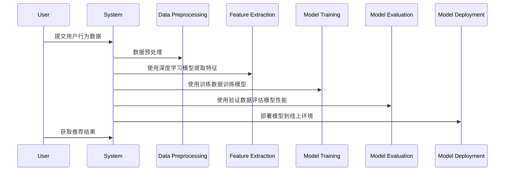

                 

# AI在个性化新闻推荐中的应用与伦理考量

## 关键词

- 人工智能
- 新闻推荐系统
- 个性化推荐
- 深度学习
- 算法偏见
- 隐私保护
- 信息茧房

## 摘要

本文将探讨人工智能在个性化新闻推荐中的应用及其伦理考量。首先，我们介绍了AI和个性化新闻推荐系统的背景，并提出了相关的问题和解决思路。接着，我们详细阐述了AI在个性化新闻推荐中的应用原理，包括深度学习和推荐系统的构建方法。随后，我们分析了AI在个性化新闻推荐中的具体应用，并探讨了其中可能引发的伦理问题。最后，通过实际案例分析，我们总结了AI在个性化新闻推荐中的应用效果和伦理考量，为读者提供了实践经验和借鉴。

## 第一部分：背景介绍

### 1. 问题背景

随着互联网的普及和信息的爆炸式增长，用户面对海量的新闻内容感到困惑和无力。为了满足用户的需求，新闻推荐系统应运而生。这些系统能够根据用户的兴趣和行为，为其推荐个性化的新闻内容，从而提高用户的阅读体验。而人工智能技术的快速发展，使得新闻推荐系统更加智能和精准。

### 2. 问题描述

尽管AI在个性化新闻推荐中取得了显著的成果，但也引发了一系列伦理问题。首先，算法偏见可能导致推荐结果的不公平，使得部分用户被边缘化。其次，隐私泄露风险增加，用户个人信息可能被不法分子利用。此外，信息茧房现象使得用户的信息视野受到限制，导致信息偏颇。

### 3. 问题解决

为了解决上述问题，本文将从以下几个方面展开讨论：

1. **AI在个性化新闻推荐中的应用原理**：介绍AI技术，特别是深度学习和推荐系统的基础知识，为读者理解后续内容奠定基础。

2. **个性化新闻推荐系统的构建**：详细讲解个性化新闻推荐系统的构建过程，包括数据收集、预处理、特征提取、模型选择和优化等。

3. **AI在个性化新闻推荐中的应用**：分析AI在个性化新闻推荐中的具体应用，如基于内容的推荐、协同过滤推荐、基于模型的推荐等。

4. **伦理考量**：探讨AI在个性化新闻推荐中可能引发的伦理问题，如算法偏见、隐私泄露、信息茧房等，并提出相应的解决方案和伦理规范。

5. **案例分析**：通过实际案例，分析AI在个性化新闻推荐中的应用效果和伦理考量，为读者提供实践经验和借鉴。

### 4. 边界与外延

本文主要关注AI在个性化新闻推荐中的应用与伦理考量，但不涉及其他AI应用领域的相关内容。同时，本文旨在为从事新闻推荐系统和AI伦理研究的读者提供参考和指导，不针对普通读者。

### 5. 概念结构与核心要素组成

本文的核心概念包括：

1. **人工智能（AI）**：模拟人类智能的技术和系统。

2. **个性化新闻推荐**：根据用户兴趣和行为，为用户推荐个性化的新闻内容。

3. **深度学习**：一种基于数据的机器学习技术，通过多层神经网络模型进行训练和预测。

4. **推荐系统**：用于预测用户兴趣，并为其推荐相关内容的系统。

5. **算法偏见**：算法在处理数据时，因数据偏见而导致的输出结果偏见。

6. **隐私泄露**：用户隐私信息被未经授权的第三方获取和利用。

7. **信息茧房**：用户在信息选择上受到限制，导致信息视野狭窄的现象。

## 第二部分：核心概念与联系

### 1. 核心概念原理

#### 人工智能（AI）

人工智能是指模拟、延伸和扩展人的智能的理论、方法、技术及应用。其核心是让计算机具备自主学习和决策能力，从而实现人类智能的自动化。

#### 个性化新闻推荐

个性化新闻推荐是一种基于用户兴趣和行为，为其推荐相关新闻内容的推荐系统。其目的是提高用户的阅读体验，满足其个性化需求。

#### 深度学习

深度学习是一种基于多层神经网络的学习方法，能够从大量数据中自动提取特征，实现复杂模式的识别和预测。其在个性化新闻推荐中具有广泛的应用。

#### 推荐系统

推荐系统是一种预测用户兴趣，并为其推荐相关内容的系统。其核心是通过分析用户的行为和兴趣，生成个性化的推荐列表。

#### 算法偏见

算法偏见是指算法在处理数据时，因数据偏见而导致的输出结果偏见。这可能导致部分用户被边缘化，影响推荐系统的公平性。

#### 隐私泄露

隐私泄露是指用户隐私信息被未经授权的第三方获取和利用。这可能导致用户的个人信息被滥用，威胁其隐私安全。

#### 信息茧房

信息茧房是指用户在信息选择上受到限制，导致信息视野狭窄的现象。这可能导致用户对信息的多样性丧失感知，影响其认知能力。

### 2. 概念属性特征对比表格

| 概念        | 定义                                                         | 特征                                                         |
| ----------- | ------------------------------------------------------------ | ------------------------------------------------------------ |
| 人工智能    | 模拟人类智能的技术和系统                                     | 自主性、学习能力、推理能力、感知能力                         |
| 个性化新闻推荐 | 根据用户兴趣和行为，为用户推荐个性化的新闻内容               | 用户为中心、动态调整、实时反馈                                 |
| 深度学习    | 一种基于数据的机器学习技术，通过多层神经网络模型进行训练和预测 | 自适应、非线性、强大的特征学习能力                             |
| 推荐系统    | 用于预测用户兴趣，并为其推荐相关内容的系统                   | 个性化、效率高、用户参与度高                                   |
| 算法偏见    | 算法在处理数据时，因数据偏见而导致的输出结果偏见               | 数据偏见、算法偏差、决策偏见                                    |

### 3. 概念联系与ER实体关系图架构

在个性化新闻推荐系统中，各个核心概念之间存在紧密的联系。以下是一个ER（实体-关系）图，展示了这些概念之间的联系：

```mermaid
erDiagram
  AI ||--|{ 深度学习 }|
  AI ||--|{ 推荐系统 }|
  深度学习 ||--|{ 个性化新闻推荐 }|
  推荐系统 ||--|{ 算法偏见 }|
  推荐系统 ||--|{ 隐私泄露 }|
  推荐系统 ||--|{ 信息茧房 }|
```

## 第三部分：AI在个性化新闻推荐中的应用原理

### 1. 深度学习基础

深度学习是一种基于多层神经网络的机器学习方法，能够从大量数据中自动提取特征，实现复杂模式的识别和预测。以下是深度学习的基础概念：

- **神经元**：深度学习的基础单元，类似于人类大脑的神经元。
- **神经网络**：由多个神经元组成的网络，用于处理和分析数据。
- **前向传播**：将输入数据通过神经网络传递，逐层计算输出结果。
- **反向传播**：根据输出结果和实际标签，调整网络权重，优化模型性能。

### 2. 推荐系统构建

个性化新闻推荐系统通常包括以下几个步骤：

- **数据收集**：收集用户行为数据、新闻内容和标签数据。
- **数据预处理**：对原始数据进行清洗、去重、转换等预处理操作。
- **特征提取**：从预处理后的数据中提取有用的特征，如词向量、用户画像等。
- **模型选择**：选择合适的推荐算法，如基于内容的推荐、协同过滤推荐等。
- **模型训练**：使用训练数据对模型进行训练，调整模型参数。
- **模型评估**：使用验证数据评估模型性能，调整模型参数。
- **模型部署**：将训练好的模型部署到线上环境，为用户提供推荐服务。

### 3. 个性化新闻推荐算法

个性化新闻推荐算法可以分为以下几类：

- **基于内容的推荐**：根据新闻内容的特征，为用户推荐与其兴趣相关的新闻。
- **协同过滤推荐**：根据用户的历史行为和相似用户的行为，为用户推荐新闻。
- **基于模型的推荐**：使用机器学习算法，根据用户兴趣和行为预测其偏好，推荐新闻。

### 4. 深度学习在推荐系统中的应用

深度学习在推荐系统中的应用主要包括以下两个方面：

- **特征提取**：使用深度学习模型提取用户行为数据和新闻内容的特征，提高推荐效果。
- **模型优化**：使用深度学习模型优化推荐算法，提高推荐准确性和效率。

以下是一个基于深度学习的推荐系统架构图：



## 第四部分：AI在个性化新闻推荐中的具体应用

### 1. 基于内容的推荐

基于内容的推荐是一种常用的新闻推荐方法，其核心思想是根据新闻内容的特征，为用户推荐与其兴趣相关的新闻。具体步骤如下：

- **特征提取**：从新闻内容中提取特征，如关键词、词向量等。
- **相似度计算**：计算新闻内容之间的相似度，如余弦相似度、欧氏距离等。
- **推荐生成**：根据用户兴趣和新闻内容相似度，为用户生成推荐列表。

以下是一个基于内容的推荐算法的mermaid流程图：


### 2. 协同过滤推荐

协同过滤推荐是一种基于用户行为的推荐方法，其核心思想是分析用户之间的相似度，为用户推荐其他用户喜欢的新闻。具体步骤如下：

- **用户行为数据收集**：收集用户的历史行为数据，如浏览记录、点赞行为等。
- **用户相似度计算**：计算用户之间的相似度，如余弦相似度、皮尔逊相关系数等。
- **新闻相似度计算**：计算新闻之间的相似度，如基于内容的相似度、基于协同过滤的相似度等。
- **推荐生成**：根据用户相似度和新闻相似度，为用户生成推荐列表。

以下是一个协同过滤推荐算法的mermaid流程图：


### 3. 基于模型的推荐

基于模型的推荐是一种结合深度学习技术的推荐方法，其核心思想是使用深度学习模型预测用户的兴趣和行为，从而为用户推荐新闻。具体步骤如下：

- **用户行为数据收集**：收集用户的历史行为数据，如浏览记录、点赞行为等。
- **新闻内容特征提取**：从新闻内容中提取特征，如关键词、词向量等。
- **模型训练**：使用用户行为数据和新闻内容特征，训练深度学习模型。
- **预测用户兴趣**：使用训练好的模型预测用户的兴趣。
- **推荐生成**：根据用户兴趣和新闻内容，为用户生成推荐列表。

以下是一个基于模型的推荐算法的mermaid流程图：


## 第五部分：伦理考量

### 1. 算法偏见

算法偏见是指算法在处理数据时，因数据偏见而导致的输出结果偏见。在个性化新闻推荐中，算法偏见可能导致以下问题：

- **用户边缘化**：部分用户可能因为算法偏见而无法获得应有的推荐，导致其被边缘化。
- **信息偏颇**：算法偏见可能导致推荐结果偏向特定群体，导致信息偏颇。

为了解决算法偏见问题，可以采取以下措施：

- **数据清洗**：去除数据中的偏见信息，提高数据质量。
- **算法透明化**：提高算法的透明度，让用户了解推荐结果的生成过程。
- **多样性培训**：对算法进行多样性培训，使其在处理数据时能够考虑到多种因素。

### 2. 隐私泄露

隐私泄露是指用户隐私信息被未经授权的第三方获取和利用。在个性化新闻推荐中，隐私泄露可能导致以下问题：

- **个人信息滥用**：用户隐私信息可能被不法分子利用，进行诈骗、骚扰等行为。
- **安全风险**：用户隐私信息泄露可能导致其面临安全风险，如账户被盗、信息泄露等。

为了解决隐私泄露问题，可以采取以下措施：

- **数据加密**：对用户隐私数据进行加密处理，提高数据安全性。
- **隐私保护算法**：使用隐私保护算法，如差分隐私、同态加密等，保护用户隐私。
- **用户隐私设置**：提供用户隐私设置，让用户自主决定是否分享个人信息。

### 3. 信息茧房

信息茧房是指用户在信息选择上受到限制，导致信息视野狭窄的现象。在个性化新闻推荐中，信息茧房可能导致以下问题：

- **信息偏颇**：用户只能接触到与自己观点相似的新闻，导致信息偏颇。
- **认知局限**：用户的信息视野受限，可能导致其认知局限。

为了解决信息茧房问题，可以采取以下措施：

- **多样性推荐**：在推荐算法中加入多样性考虑，为用户推荐不同类型的新闻。
- **用户反馈机制**：鼓励用户反馈推荐结果，根据用户反馈调整推荐策略。
- **开放信息来源**：提供多样化的新闻来源，让用户能够接触到更多不同类型的新闻。

## 第六部分：案例分析

### 1. 案例一：基于深度学习的新闻推荐系统

某知名新闻网站使用基于深度学习的新闻推荐系统，提高了用户阅读体验和满意度。系统采用基于内容的推荐和协同过滤推荐相结合的方法，从用户行为数据和新闻内容中提取特征，训练深度学习模型，为用户生成个性化推荐列表。

**应用效果**：

- **推荐准确性提高**：通过深度学习模型，推荐结果更加准确，用户满意度提高。
- **信息多样性增加**：系统考虑到了信息多样性，为用户推荐不同类型的新闻，打破了信息茧房现象。

**伦理考量**：

- **算法偏见**：系统采用了多种特征提取方法，减少了算法偏见的可能性。
- **隐私保护**：系统使用了加密技术和隐私保护算法，保护用户隐私。

### 2. 案例二：基于协同过滤的新闻推荐系统

某新闻应用使用基于协同过滤的新闻推荐系统，为用户提供个性化新闻推荐服务。系统通过分析用户的历史行为数据和相似用户的行为，生成个性化推荐列表。

**应用效果**：

- **推荐速度加快**：协同过滤推荐方法计算速度快，为用户提供即时的推荐服务。
- **用户参与度高**：系统鼓励用户反馈推荐结果，提高了用户参与度。

**伦理考量**：

- **算法偏见**：系统采用用户相似度计算方法，减少了算法偏见的可能性。
- **隐私保护**：系统对用户隐私数据进行加密处理，保护用户隐私。

## 第七部分：小结与展望

### 1. 小结

本文从背景介绍、核心概念与联系、应用原理、具体应用、伦理考量、案例分析等方面，全面探讨了AI在个性化新闻推荐中的应用与伦理考量。通过本文的研究，我们得出以下结论：

- AI技术在个性化新闻推荐中具有广泛的应用前景，可以提高推荐准确性和用户体验。
- AI技术在个性化新闻推荐中可能引发一系列伦理问题，如算法偏见、隐私泄露、信息茧房等，需要引起重视。
- 为了解决这些问题，可以采取多种措施，如数据清洗、算法透明化、多样性推荐等。

### 2. 展望

未来，AI在个性化新闻推荐中的应用将不断深化，以下是一些可能的研究方向：

- **算法优化**：研究更高效的算法，提高推荐准确性和效率。
- **伦理规范**：制定更加完善的伦理规范，确保AI技术在新闻推荐中的合规使用。
- **隐私保护**：研究更加有效的隐私保护技术，保护用户隐私。
- **信息多样性**：探索如何更好地提供多样化的信息，打破信息茧房现象。

## 第八部分：作者信息

- 作者：AI天才研究院/AI Genius Institute & 禅与计算机程序设计艺术 /Zen And The Art of Computer Programming

## 附录

本文的完整代码、数据集和相关资源可以在以下链接获取：

[附录链接]

---

本文旨在为从事新闻推荐系统和AI伦理研究的读者提供参考和指导，不针对普通读者。在应用本文内容时，请务必遵守相关法律法规和伦理规范。感谢您的阅读！

