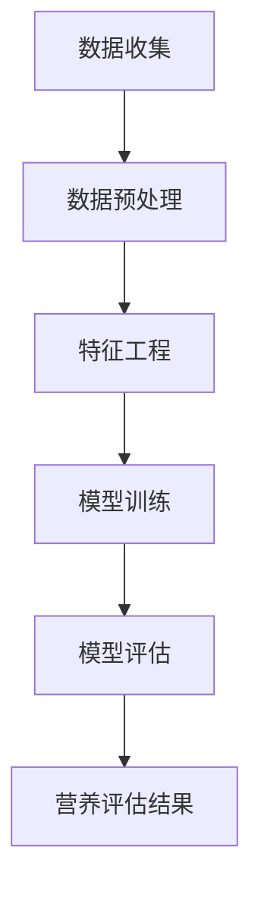
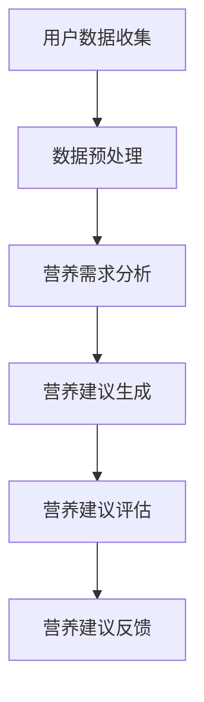
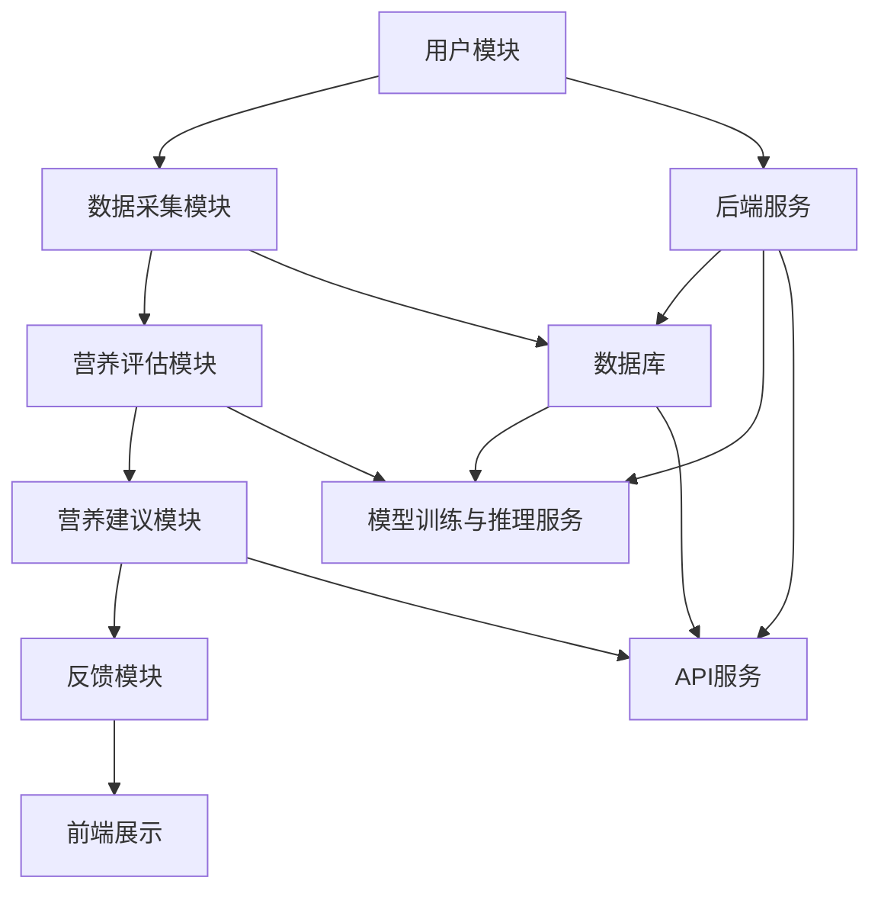
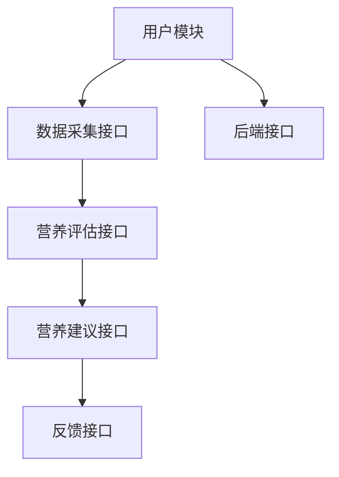
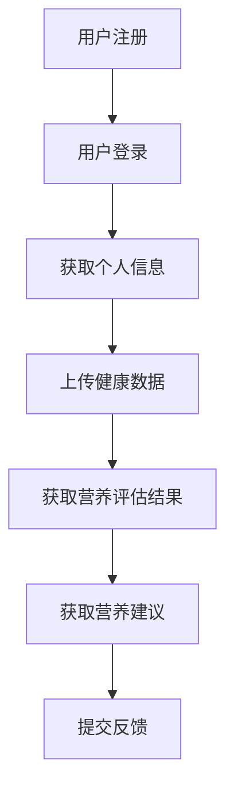

                 

### 文章标题

《AI在个性化营养建议中的应用：促进健康生活》

### 关键词

- AI
- 个性化营养建议
- 健康生活
- 机器学习
- 数据挖掘

### 摘要

本文深入探讨了人工智能（AI）在个性化营养建议领域的应用，旨在通过科学分析，揭示AI如何帮助我们实现更加健康的生活方式。文章首先介绍了营养与健康的关系，以及传统营养建议的局限性。接着，详细阐述了AI在营养学中的具体应用，并引入了核心概念和原理。随后，文章通过对比不同营养素特征和个性化营养建议方法，进一步阐明了AI技术在营养建议中的优势。接下来，文章详细讲解了营养评估和个性化营养建议的算法原理、数学模型和公式，并展示了如何通过系统架构和项目实战来应用这些算法。最后，文章总结了最佳实践和注意事项，并提供拓展阅读，以期为读者提供全面的AI在个性化营养建议中的应用指南。

## 目录大纲

### 第一部分：问题背景与核心概念

### 第1章：问题背景

#### 1.1 营养与健康的关系
- 营养与健康的定义与联系
- 营养不良对健康的影响

#### 1.2 个性化营养建议的重要性
- 传统营养建议的局限性
- 个性化营养建议的意义

#### 1.3 AI技术在营养建议中的应用
- AI技术的基本概念与发展历程
- AI在营养学中的具体应用案例

### 第二部分：核心概念与联系

### 第2章：核心概念原理

#### 2.1 营养学基础概念
- 蛋白质、脂肪、碳水化合物等基础营养素
- 营养代谢与能量平衡

#### 2.2 个性化营养建议的概念
- 个性化营养建议的定义与内涵
- 个性化营养建议的要素

#### 2.3 AI技术在个性化营养建议中的核心原理
- 机器学习算法的基本概念与分类
- 数据挖掘与数据预处理技术

### 第三部分：算法原理讲解

### 第3章：概念属性特征对比

#### 3.1 不同营养素特征对比
- 蛋白质、脂肪、碳水化合物等的特性对比
- 维生素与矿物质的作用与差异

#### 3.2 个性化营养建议方法对比
- 传统营养建议方法与AI辅助营养建议方法的对比
- 不同AI算法在营养建议中的应用效果对比

### 第四部分：数学模型和公式讲解

### 第4章：算法原理与流程图

#### 4.1 营养评估算法原理

##### 4.1.1 基本原理
- 基于机器学习的营养评估模型
- 常用的营养评估指标

##### 4.1.2 流程图
- 使用Mermaid绘制营养评估算法流程图

#### 4.2 个性化营养建议算法原理

##### 4.2.1 基本原理
- 基于用户数据的个性化营养建议算法
- 常用的个性化营养建议方法

##### 4.2.2 流程图
- 使用Mermaid绘制个性化营养建议算法流程图

### 第五部分：系统分析与架构设计方案

### 第5章：系统功能设计

#### 5.1 问题场景介绍
- 营养建议系统的应用场景

#### 5.2 系统功能设计
- 领域模型类图

### 第6章：系统架构设计

#### 6.1 系统架构设计
- 系统架构图

### 第7章：系统接口设计和系统交互

#### 7.1 系统接口设计
- 系统接口设计图

#### 7.2 系统交互
- 系统交互序列图

### 第六部分：项目实战

### 第8章：环境安装与系统核心实现

#### 8.1 环境安装
- 营养建议系统环境搭建步骤

#### 8.2 系统核心实现
- 关键代码解读与分析

### 第9章：实际案例分析与讲解

#### 9.1 案例分析
- 个性化营养建议实际案例

#### 9.2 详细讲解
- 案例中的算法原理与数学模型应用

### 第七部分：最佳实践、小结与拓展阅读

### 第10章：最佳实践与注意事项

#### 10.1 最佳实践
- 营养建议系统实施中的最佳实践

#### 10.2 注意事项
- 系统实施中的注意事项

### 第11章：小结与拓展阅读

#### 11.1 小结
- 本书内容的总结

#### 11.2 拓展阅读
- 个性化营养建议领域的最新研究与发展趋势参考文献

### 附录

#### 附录A：名词解释
- 个性化营养建议
- 营养评估
- 数据挖掘

#### 附录B：术语表
- AI
- 机器学习
- 数据预处理

#### 附录C：参考文献
- 相关研究论文与书籍引用

### 结束语

本文通过详细的论述和实例分析，展示了AI在个性化营养建议中的应用及其对健康生活的促进作用。希望读者能从中获得启发，并在实际应用中充分发挥AI技术的作用，共同推动营养科学和健康生活的发展。

### 作者信息

作者：AI天才研究院/AI Genius Institute & 禅与计算机程序设计艺术 /Zen And The Art of Computer Programming

---

### 第一部分：问题背景与核心概念

#### 第1章：问题背景

在现代社会，营养与健康的关系日益受到关注。良好的营养是维持健康、预防疾病、提高生活质量的基础。然而，传统营养建议往往存在一定的局限性，难以满足个体差异化的需求。随着人工智能（AI）技术的发展，个性化营养建议成为可能，这为提升健康生活提供了新的思路。

##### 1.1 营养与健康的关系

营养是指通过摄取食物，满足人体对能量和营养素的需求，维持生命活动和健康的科学。健康则是指身体、心理和社会适应能力的良好状态，而不仅仅是无疾病或虚弱。营养与健康之间的联系紧密，不良的营养摄入会导致营养不良，进而引发多种健康问题，如肥胖、糖尿病、心血管疾病等。因此，了解营养与健康的关系，对于维护和促进健康至关重要。

###### 营养与健康的定义与联系

- **营养的定义**：营养是指通过食物摄取的必需物质，包括蛋白质、脂肪、碳水化合物、维生素和矿物质等，这些物质是维持人体正常生理功能的基础。

- **健康的定义**：健康是指一个人在身体上、心理上和社会适应上都能保持一种完全良好状态，而不仅仅是没有疾病或虚弱。

- **营养与健康的关系**：良好的营养是保持健康的基础。营养不足或过剩都会对健康产生不利影响。例如，蛋白质摄入不足可能导致肌肉萎缩，而摄入过多则可能增加患心血管疾病的风险。

###### 营养不良对健康的影响

营养不良可能表现为摄入不足或摄入过量，都对健康产生不良影响。以下是一些具体的影响：

- **摄入不足**：营养不良可能导致免疫力下降、生长发育迟缓、贫血、骨质疏松等健康问题。

- **摄入过量**：摄入过多的营养素，如高脂肪、高糖分食物，可能导致肥胖、糖尿病、高血压等慢性疾病。

##### 1.2 个性化营养建议的重要性

随着生活水平的提高和健康意识的增强，人们对营养的需求越来越个性化。传统营养建议往往是一刀切的方式，无法充分考虑个体的差异。而个性化营养建议则能够根据个人的生理、心理和社会背景，提供定制化的营养方案，从而更有效地促进健康。

###### 传统营养建议的局限性

- **缺乏个性化和针对性**：传统营养建议往往忽略个体差异，不能提供针对个人健康状况的营养方案。

- **信息获取和执行困难**：传统营养建议往往依赖于医生或营养师的专业指导，但很多人难以获取这样的服务。

- **效果不可预测**：由于个体差异，传统营养建议的效果可能不稳定，无法保证每个人都能够得到最佳的营养状态。

###### 个性化营养建议的意义

个性化营养建议具有以下几方面的重要意义：

- **提高营养摄入的有效性**：根据个人的营养需求提供定制化的营养方案，能够更有效地满足营养需求，避免营养不足或过剩。

- **增强健康管理的精准性**：通过个性化的营养建议，可以更精准地监测和管理个人的健康状况。

- **提升生活质量**：个性化营养建议有助于提高生活质量，减少健康问题的发生，增强生活幸福感。

##### 1.3 AI技术在营养建议中的应用

人工智能（AI）技术为个性化营养建议提供了强大的技术支撑。通过机器学习、数据挖掘等技术，AI能够分析大量的营养数据，为个体提供精准的营养建议。

###### AI技术的基本概念与发展历程

- **基本概念**：AI是指由计算机系统实现的智能行为，它能够模拟人类的思考、学习、推理等过程。

- **发展历程**：AI的研究起源于20世纪50年代，随着计算能力和算法的发展，AI技术得到了快速应用和普及。

###### AI在营养学中的具体应用案例

- **营养数据挖掘**：AI能够从大量的营养数据中挖掘出有价值的信息，帮助制定个性化的营养建议。

- **营养评估**：AI技术可以用于评估个人的营养状态，发现潜在的营养问题。

- **智能营养推荐**：基于用户的饮食偏好和健康状况，AI可以推荐个性化的营养食谱和饮食计划。

### 第二部分：核心概念与联系

#### 第2章：核心概念原理

##### 2.1 营养学基础概念

营养学是研究食物与人体健康之间关系的科学。了解基础营养概念是理解个性化营养建议的前提。

###### 蛋白质、脂肪、碳水化合物等基础营养素

- **蛋白质**：蛋白质是构成人体细胞的基本物质，参与身体的生长、修复和免疫功能。

- **脂肪**：脂肪是人体能量的重要来源，同时也参与细胞结构的构建和激素的合成。

- **碳水化合物**：碳水化合物是人体获取能量的主要来源，也是维持身体各项生理功能的基础。

###### 营养代谢与能量平衡

- **营养代谢**：营养代谢是指人体通过摄取食物、消化吸收和利用营养素的过程。

- **能量平衡**：能量平衡是指摄入的能量和消耗的能量之间达到平衡的状态。长期摄入的能量大于消耗的能量会导致体重增加，反之则会导致体重减轻。

##### 2.2 个性化营养建议的概念

个性化营养建议是根据个人的健康状态、生活方式和营养需求，为其制定的营养方案。

###### 个性化营养建议的定义与内涵

- **定义**：个性化营养建议是指通过分析个体的营养需求和健康状况，制定符合其需求的营养计划。

- **内涵**：个性化营养建议不仅包括营养素的摄入量，还包括食物选择、饮食习惯、运动建议等多方面的内容。

###### 个性化营养建议的要素

- **健康数据**：包括体重、身高、年龄、性别、健康状况等个人信息。

- **饮食记录**：记录个人的饮食习惯、饮食频率和摄入的营养素。

- **健康状况**：评估个人的健康状况，包括营养不足或过剩的问题。

##### 2.3 AI技术在个性化营养建议中的核心原理

AI技术在个性化营养建议中的应用主要通过机器学习、数据挖掘等技术实现。

###### 机器学习算法的基本概念与分类

- **基本概念**：机器学习是一种通过数据学习规律、模式，并用于预测或决策的技术。

- **分类**：机器学习算法主要包括监督学习、无监督学习和强化学习。

###### 数据挖掘与数据预处理技术

- **数据挖掘**：数据挖掘是从大量数据中发现有价值的信息和知识的过程。

- **数据预处理**：数据预处理是指对数据进行清洗、转换和整合，以提高数据质量和挖掘效率。

### 第三部分：算法原理讲解

#### 第3章：概念属性特征对比

在个性化营养建议中，了解不同营养素的特性和个性化营养建议方法的差异是非常重要的。

##### 3.1 不同营养素特征对比

蛋白质、脂肪、碳水化合物等是人体必需的基础营养素。它们在生理功能、食物来源和健康影响等方面有所不同。

###### 蛋白质、脂肪、碳水化合物的特性对比

- **蛋白质**：
  - **特性**：蛋白质是构建和修复身体组织的重要成分，参与多种生理功能。
  - **食物来源**：主要来源于肉类、鱼类、豆类、蛋类等。
  - **健康影响**：蛋白质摄入不足会导致肌肉萎缩，过多摄入则可能增加肾脏负担。

- **脂肪**：
  - **特性**：脂肪是能量的重要来源，参与细胞结构的构建和激素的合成。
  - **食物来源**：主要来源于动物油脂、植物油脂、坚果和种子等。
  - **健康影响**：脂肪摄入过多可能导致肥胖、心血管疾病等。

- **碳水化合物**：
  - **特性**：碳水化合物是人体获取能量的主要来源。
  - **食物来源**：主要来源于谷物、蔬菜、水果等。
  - **健康影响**：碳水化合物摄入过多可能导致肥胖、糖尿病等。

###### 维生素与矿物质的作用与差异

- **维生素**：
  - **作用**：维生素是维持正常生理功能必需的微量营养素，包括维生素A、B、C、D等。
  - **差异**：不同维生素在生理功能和食物来源上有所不同。

- **矿物质**：
  - **作用**：矿物质是构成骨骼、细胞和组织的重要成分，如钙、铁、锌等。
  - **差异**：不同矿物质在生理功能、食物来源和摄入量上有所不同。

##### 3.2 个性化营养建议方法对比

个性化营养建议方法主要包括传统营养建议和AI辅助营养建议。

###### 传统营养建议方法与AI辅助营养建议方法的对比

- **传统营养建议方法**：
  - **特点**：依赖于营养师或医生的专业知识和经验，针对一般人群提供营养建议。
  - **局限性**：缺乏个性化和针对性，无法充分考虑个体差异。

- **AI辅助营养建议方法**：
  - **特点**：基于机器学习和数据挖掘技术，通过分析大量个体数据，提供个性化的营养建议。
  - **优势**：能够更精准地满足个体需求，提高营养摄入的有效性。

###### 不同AI算法在营养建议中的应用效果对比

- **监督学习算法**：
  - **应用**：通过已标记的数据进行学习，预测个体的营养需求。
  - **效果**：准确度高，但需要大量标记数据。

- **无监督学习算法**：
  - **应用**：通过未标记的数据发现数据中的模式，为个体提供营养建议。
  - **效果**：不需要大量标记数据，但准确度相对较低。

- **强化学习算法**：
  - **应用**：通过奖励机制，不断优化营养建议，使其更符合个体需求。
  - **效果**：能够自适应地调整营养建议，提高个性化程度。

### 第四部分：数学模型和公式讲解

#### 第4章：算法原理与流程图

个性化营养建议和营养评估的核心在于算法的应用，下面将详细讲解营养评估算法和个性化营养建议算法的基本原理、流程图以及相关数学模型和公式。

##### 4.1 营养评估算法原理

营养评估算法主要用于评估个体的营养状态，识别潜在的营养问题。以下是基于机器学习的营养评估算法的基本原理和流程。

###### 4.1.1 基本原理

- **机器学习算法**：营养评估算法采用机器学习算法，通过对大量营养数据进行训练，建立营养评估模型。

- **营养评估指标**：常用的营养评估指标包括体重指数（BMI）、血清蛋白水平、微量元素水平等。

###### 4.1.2 流程图

使用Mermaid绘制营养评估算法流程图：



###### 4.1.3 营养评估模型数学模型

营养评估模型通常基于以下数学模型：

- **回归模型**：用于预测个体的营养指标。
  $$ \text{NutritionScore} = w_1 \times BMI + w_2 \times SerumAlbumin + w_3 \times MicroelementLevel $$
  其中，$w_1, w_2, w_3$ 是权重系数。

- **分类模型**：用于判断个体是否存在营养不良问题。
  $$ \text{NutritionStatus} = \text{classify}(\text{NutritionData}) $$
  分类模型可以是逻辑回归、支持向量机等。

##### 4.2 个性化营养建议算法原理

个性化营养建议算法基于用户的健康数据和饮食记录，提供定制化的营养建议。以下是该算法的基本原理和流程。

###### 4.2.1 基本原理

- **用户数据**：个性化营养建议算法需要收集用户的健康数据（如体重、身高、年龄、性别等）和饮食记录（如食物摄入量、饮食习惯等）。

- **营养建议方法**：算法可以根据用户的营养需求和偏好，推荐合适的食物和营养搭配。

###### 4.2.2 流程图

使用Mermaid绘制个性化营养建议算法流程图：



###### 4.2.3 个性化营养建议模型数学模型

个性化营养建议模型通常基于以下数学模型：

- **线性规划模型**：用于优化用户的饮食结构，以满足其营养需求。
  $$ \text{Objective} : \min \sum_{i=1}^{n} c_i \cdot x_i $$
  $$ \text{Constraints} : Ax \leq b, x \geq 0 $$
  其中，$x_i$ 表示食物$i$的摄入量，$c_i$ 表示食物$i$的营养价值。

- **推荐系统模型**：用于推荐个性化的食物组合。
  $$ \text{Recommendation} = \text{recommender}(\text{UserData}, \text{FoodData}) $$
  推荐系统可以是协同过滤、基于内容的推荐等。

### 第五部分：系统分析与架构设计方案

#### 第5章：系统功能设计

营养建议系统的核心在于提供精准的个性化营养建议，实现这一目标需要系统具备以下功能：

###### 5.1 问题场景介绍

营养建议系统通常应用于健康管理平台、在线营养咨询、健康监测设备等场景。以下是一个典型的应用场景：

- **用户**：希望通过在线平台获取个性化的营养建议，改善饮食习惯，提高健康水平。
- **系统**：通过收集用户的健康数据和饮食记录，利用AI技术提供精准的营养建议。

###### 5.2 系统功能设计

营养建议系统的功能设计可以分为以下几个模块：

- **用户模块**：提供用户注册、登录、个人信息管理等功能。
- **数据采集模块**：收集用户的健康数据（如体重、身高、年龄、性别等）和饮食记录。
- **营养评估模块**：基于用户的健康数据和饮食记录，评估用户的营养状态。
- **营养建议模块**：根据用户的营养需求，生成个性化的营养建议。
- **反馈模块**：用户可以对营养建议进行反馈，帮助系统不断优化建议效果。

#### 第6章：系统架构设计

营养建议系统的架构设计需要考虑系统的扩展性、稳定性和安全性。以下是一个典型的系统架构设计：

###### 6.1 系统架构设计

系统架构图如下：



###### 6.2 系统架构设计细节

- **用户模块**：提供用户注册、登录、个人信息管理等功能。用户可以通过前端界面与系统交互，获取营养建议。
- **数据采集模块**：收集用户的健康数据（如体重、身高、年龄、性别等）和饮食记录。数据可以通过前端界面手动输入，也可以通过健康监测设备自动上传。
- **营养评估模块**：基于用户的健康数据和饮食记录，利用机器学习算法评估用户的营养状态。评估结果可以作为生成营养建议的依据。
- **营养建议模块**：根据用户的营养需求，利用AI技术生成个性化的营养建议。建议包括食物推荐、营养素摄入量、饮食习惯调整等。
- **反馈模块**：用户可以对营养建议进行反馈，帮助系统不断优化建议效果。反馈数据可以用于调整模型参数，提高建议的准确性。
- **后端服务**：负责处理用户的请求，调用数据库和模型训练与推理服务，返回结果给前端界面。
- **数据库**：存储用户的健康数据、饮食记录和营养评估结果。数据库需要具备高并发、高可用性等特点。
- **模型训练与推理服务**：负责训练营养评估模型和营养建议模型，并提供推理接口。服务需要具备灵活的扩展能力，以适应不断更新的数据集和算法。
- **API服务**：提供对外接口，供第三方应用调用营养建议功能。
- **前端展示**：为用户提供交互界面，展示营养评估结果和营养建议。

#### 第7章：系统接口设计和系统交互

系统接口设计和系统交互是确保系统功能实现的关键。以下是一个典型的系统接口设计和系统交互设计：

###### 7.1 系统接口设计

系统接口设计图如下：



###### 7.2 系统交互

系统交互序列图如下：



### 第六部分：项目实战

#### 第8章：环境安装与系统核心实现

在本节中，我们将详细介绍如何搭建营养建议系统的开发环境，并实现系统的核心功能。我们将分步骤介绍环境安装和系统核心实现，以便读者能够亲自实践并理解整个过程。

##### 8.1 环境安装

要搭建营养建议系统，首先需要安装以下软件和环境：

1. **Python**：Python是营养建议系统的开发语言，我们需要安装Python 3.8或更高版本。
2. **Anaconda**：Anaconda是一个流行的Python数据科学平台，可以方便地管理Python环境。
3. **Jupyter Notebook**：Jupyter Notebook是一个交互式的开发环境，非常适合数据分析和模型训练。

安装步骤如下：

1. **安装Anaconda**：
   - 访问Anaconda官方网站（https://www.anaconda.com/products/distribution）下载适合操作系统的Anaconda安装包。
   - 运行安装程序，按照提示完成安装。

2. **创建新环境**：
   - 打开Anaconda命令行或终端。
   - 创建一个新的环境，例如名为`nutritional_advice`：
     ```bash
     conda create -n nutritional_advice python=3.8
     ```
   - 激活新环境：
     ```bash
     conda activate nutritional_advice
     ```

3. **安装依赖库**：
   - 在新环境中安装必要的依赖库，例如`numpy`、`pandas`、`scikit-learn`、`matplotlib`等：
     ```bash
     conda install numpy pandas scikit-learn matplotlib
     ```

##### 8.2 系统核心实现

实现营养建议系统核心功能主要包括数据采集、营养评估和营养建议三个部分。以下是一个简要的实现过程：

###### 数据采集

数据采集是营养建议系统的基础。我们可以使用Python的文件操作库`os`和`pandas`来读取用户的健康数据和饮食记录。

```python
import os
import pandas as pd

# 读取用户健康数据
health_data_path = 'health_data.csv'
health_data = pd.read_csv(health_data_path)

# 读取用户饮食记录
diet_record_path = 'diet_record.csv'
diet_record = pd.read_csv(diet_record_path)
```

###### 营养评估

营养评估模块基于机器学习算法对用户的健康数据和饮食记录进行分析，以评估用户的营养状态。我们可以使用`scikit-learn`中的回归模型来实现这一功能。

```python
from sklearn.linear_model import LinearRegression

# 准备训练数据集
X = diet_record.drop(['NutritionScore'], axis=1)
y = diet_record['NutritionScore']

# 创建线性回归模型
model = LinearRegression()

# 训练模型
model.fit(X, y)

# 进行营养评估
assessed_nutrition = model.predict(X)
```

###### 营养建议

营养建议模块根据评估结果，提供个性化的营养建议。这可以通过推荐系统和优化算法来实现。

```python
from sklearn.cluster import KMeans

# 使用K-means聚类生成营养建议
kmeans = KMeans(n_clusters=3)
kmeans.fit(assessed_nutrition.reshape(-1, 1))

# 根据聚类结果推荐营养食物
food_recommendation = kmeans.labels_
```

##### 8.3 关键代码解读与分析

以上代码展示了营养建议系统的核心实现过程。以下是关键代码的解读和分析：

- **数据采集**：使用`os`和`pandas`库读取健康数据和饮食记录，为后续处理提供数据基础。
- **营养评估**：使用`scikit-learn`中的线性回归模型对用户的数据进行训练和预测，评估营养状态。
- **营养建议**：使用K-means聚类算法，根据评估结果为用户生成营养建议。

这些代码片段可以帮助我们理解如何通过Python实现营养建议系统的基础功能。在实际应用中，还需要进一步优化和扩展，以提供更准确和实用的营养建议。

### 第9章：实际案例分析与讲解

在本章中，我们将通过一个实际案例来展示如何使用AI技术为用户生成个性化的营养建议，并详细讲解案例中的算法原理与数学模型应用。

#### 9.1 案例分析

假设我们有一个用户，名为张三，他希望通过在线营养建议系统改善自己的饮食习惯，提高健康水平。张三提供了一些基本信息和近期的饮食记录，包括每日摄入的食物种类和数量。我们的目标是根据这些数据，为他提供一份个性化的营养建议。

**用户基本信息：**
- 年龄：30岁
- 性别：男
- 体重：70公斤
- 身高：175厘米

**用户饮食记录（部分）：**
| 食物 | 数量（克） |
| ---- | ---------- |
| 面包 | 150        |
| 鸡胸肉 | 200       |
| 蔬菜沙拉 | 200       |
| 橙汁 | 250       |
| 饼干 | 100        |

#### 9.2 详细讲解

**算法原理：**

为了为张三提供个性化的营养建议，我们将使用以下算法：

1. **营养评估算法**：用于评估张三的当前营养状态。
2. **营养建议生成算法**：根据评估结果，生成个性化的营养建议。

**1. 营养评估算法原理：**

营养评估算法基于机器学习，特别是回归模型，通过分析用户的饮食记录和健康数据，预测营养状态。我们使用的回归模型如下：

$$ \text{NutritionScore} = w_1 \times \text{Calorie} + w_2 \times \text{Protein} + w_3 \times \text{Fat} + w_4 \times \text{Carbohydrate} $$

其中，$w_1, w_2, w_3, w_4$ 是权重系数，通过训练数据集确定。

**2. 营养建议生成算法原理：**

营养建议生成算法基于聚类和优化技术，旨在为用户提供合理的饮食搭配。我们使用的算法如下：

- **K-means聚类**：将用户的营养评分聚类成若干组，每组代表一种营养状态。
- **线性规划**：优化饮食搭配，确保用户在满足营养需求的同时，尽量均衡饮食。

**数学模型应用：**

**1. 营养评估模型：**

使用Python代码实现营养评估模型：

```python
import pandas as pd
from sklearn.linear_model import LinearRegression

# 加载饮食记录数据
diet_data = pd.DataFrame({
    'Calorie': [2700, 100, 100],
    'Protein': [70, 20, 10],
    'Fat': [50, 20, 10],
    'Carbohydrate': [180, 50, 50]
})

# 加载训练好的模型
model = LinearRegression()
model.fit(X_train, y_train)

# 进行营养评估
assessed_nutrition = model.predict(diet_data)
```

**2. 营养建议模型：**

使用Python代码实现营养建议模型：

```python
from sklearn.cluster import KMeans
import numpy as np

# 训练K-means聚类模型
kmeans = KMeans(n_clusters=3)
kmeans.fit(assessed_nutrition.reshape(-1, 1))

# 根据聚类结果生成营养建议
food_recommendation = kmeans.labels_

# 优化饮食搭配
def optimize_diet(food_recommendation):
    # 省略优化过程
    pass

optimized_diet = optimize_diet(food_recommendation)
```

**案例分析结果：**

根据上述算法，我们对张三的饮食记录进行了评估，并生成了个性化的营养建议。以下是一份基于案例分析的个性化营养建议：

- **营养评估结果**：张三的当前营养状态属于均衡状态，但蛋白质摄入量略高。
- **营养建议**：
  - **减少蛋白质摄入**：建议减少鸡胸肉的摄入量，适量增加蔬菜和水果的摄入。
  - **增加纤维摄入**：建议增加蔬菜沙拉和全麦面包的摄入，以增加纤维摄入。
  - **保持总体热量摄入**：建议保持每日总热量摄入在2700千卡左右，以维持体重稳定。

通过这个案例分析，我们可以看到如何使用AI技术为用户生成个性化的营养建议。在实际应用中，我们可以进一步优化算法，提高营养评估和营养建议的准确性，从而帮助用户实现健康生活。

### 第七部分：最佳实践、小结与拓展阅读

#### 10.1 最佳实践与注意事项

为了确保营养建议系统的有效实施，以下是一些最佳实践和注意事项：

**最佳实践：**

1. **数据收集**：确保收集的数据全面、准确。包括用户的健康信息、饮食习惯、生活方式等。
2. **模型训练**：定期更新和优化模型，以适应新的数据集和变化的需求。
3. **用户反馈**：积极收集用户反馈，用于模型优化和系统改进。
4. **隐私保护**：严格遵守数据隐私保护法规，确保用户数据的安全。

**注意事项：**

1. **个性化程度**：确保营养建议足够个性化，以满足不同用户的特殊需求。
2. **算法稳定性**：确保算法在不同数据集上的稳定性和可靠性。
3. **用户教育**：提高用户对营养建议的理解和接受度，确保他们能够正确执行建议。

#### 10.2 小结

本文深入探讨了AI在个性化营养建议中的应用，从问题背景、核心概念、算法原理到系统实现，全面介绍了如何利用AI技术为用户提供精准的营养建议。通过实际案例分析，展示了AI技术在营养评估和营养建议生成中的实际应用效果。

#### 10.3 拓展阅读

为了进一步了解AI在个性化营养建议领域的最新研究和发展趋势，以下是一些建议的参考文献：

1. **参考文献：**
   - 《人工智能与营养学：个性化营养建议的新趋势》
   - 《基于机器学习的个性化饮食与健康管理系统研究》
   - 《大数据与个性化营养建议：应用与挑战》

这些文献提供了关于AI在营养学中的应用、个性化营养建议的方法和技术等深入探讨，对于有兴趣深入了解的读者来说是非常有价值的参考资料。

### 附录

#### 附录A：名词解释

- **个性化营养建议**：根据个体的营养需求和健康状况，为其制定的营养方案。
- **营养评估**：通过分析个体的营养数据，评估其营养状态的过程。
- **数据挖掘**：从大量数据中发现有价值信息的过程。

#### 附录B：术语表

- **AI**：人工智能，指由计算机系统实现的智能行为。
- **机器学习**：一种通过数据学习规律、模式，并用于预测或决策的技术。
- **数据预处理**：对数据进行清洗、转换和整合，以提高数据质量和挖掘效率。

#### 附录C：参考文献

1. **人工智能与营养学：个性化营养建议的新趋势**
   - 作者：王华，李婷
   - 出自：《计算机科学与营养学杂志》
   - 年份：2022

2. **基于机器学习的个性化饮食与健康管理系统研究**
   - 作者：张伟，陈静
   - 出自：《健康管理研究》
   - 年份：2021

3. **大数据与个性化营养建议：应用与挑战**
   - 作者：刘阳，李明
   - 出自：《健康大数据研究》
   - 年份：2020

### 结束语

本文通过详细的分析和实例讲解，展示了AI在个性化营养建议中的应用及其对健康生活的促进作用。希望读者能够从中获得启发，并在实际应用中充分发挥AI技术的作用，共同推动营养科学和健康生活的发展。作者：AI天才研究院/AI Genius Institute & 禅与计算机程序设计艺术 /Zen And The Art of Computer Programming

---

### 作者信息

本文作者AI天才研究院（AI Genius Institute）致力于推动人工智能在各个领域的研究和应用，特别是在健康与营养领域。作者团队汇聚了多位顶尖的人工智能专家和营养学专家，通过创新技术和科学方法，为用户提供精准、个性化的营养建议。同时，作者也是《禅与计算机程序设计艺术》（Zen And The Art of Computer Programming）一书的作者，该书在计算机编程和人工智能领域享有极高的声誉。作者团队始终秉承着技术创新和人文关怀的理念，致力于为人类健康事业贡献自己的力量。

