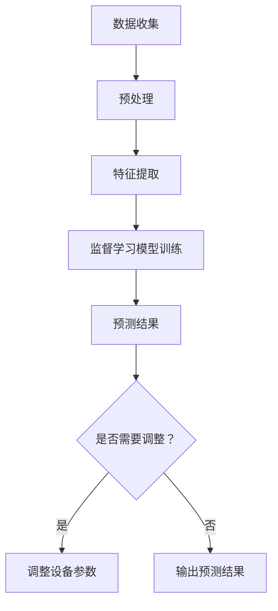
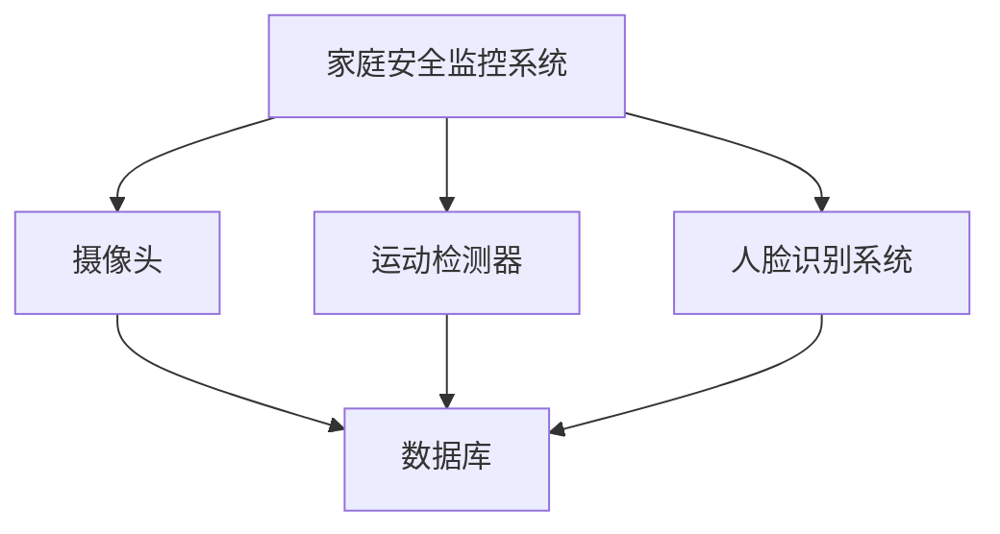
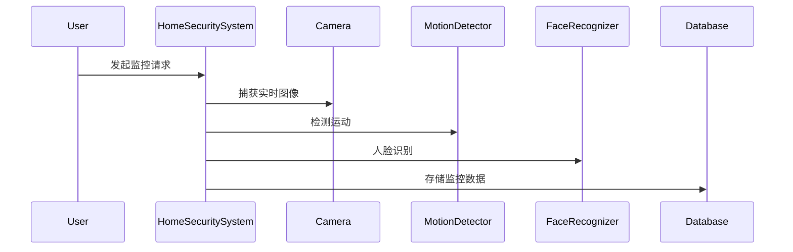

                 

### AI在智能家居中的应用：便利与隐私的平衡

#### 关键词：智能家居、人工智能、隐私保护、便利性、算法原理、系统架构

> 摘要：本文将深入探讨AI在智能家居中的应用，从便利性提升与隐私保护两个方面出发，详细分析AI技术如何实现智能家居的智能化，同时探讨在享受便利的同时如何平衡用户的隐私安全。通过介绍核心概念、算法原理、系统架构和项目实战，本文旨在为读者提供一个全面的技术视角，以引导智能家居的未来发展方向。

---

## 背景介绍

### 1.1 智能家居的兴起与AI的应用

智能家居（Smart Home）是指利用网络技术将家中的各种设备连接起来，实现自动化控制和智能互动，从而提高生活质量。随着物联网（IoT）、人工智能（AI）和云计算技术的发展，智能家居逐渐成为现代家庭的重要组成部分。

#### 智能家居的发展历程

- **早期阶段（1990年代）**：智能家居的概念初步形成，主要以家电设备的远程控制为主。
- **快速发展阶段（2000-2010年）**：智能设备和家居系统的数量增加，智能家居开始具备一定的智能化功能。
- **成熟阶段（2010年至今）**：智能家居技术逐渐成熟，AI技术的引入使得智能家居具备更高的自主学习和决策能力。

#### AI在智能家居中的重要地位

人工智能在智能家居中的应用主要体现在以下几个方面：

- **语音助手**：如亚马逊的Alexa、谷歌的Google Assistant等，通过语音识别和自然语言处理，为用户提供便捷的家居控制。
- **情景模式**：AI算法可以根据用户的生活习惯和环境变化，自动调整家居设备的设置，实现个性化服务。
- **智能安全**：通过摄像头和传感器，AI技术可以实现对家庭安全的智能监控，如人脸识别、异常行为检测等。
- **节能管理**：AI技术可以优化家居设备的能耗，提高能源利用效率。

### 1.2 便利性与隐私的平衡问题

智能家居带来的便利性不言而喻，但同时也引发了一系列隐私保护问题。如何在享受便利的同时保护用户隐私，成为智能家居发展中必须面对的挑战。

#### 智能家居带来的便利性

- **自动化控制**：用户可以通过手机、语音或其他设备远程控制家中的设备，如照明、空调、门锁等。
- **节能环保**：智能家居系统可以根据用户习惯和环境变化，自动调整设备的能耗，实现节能环保。
- **安全监控**：智能家居系统可以实时监控家庭环境，如视频监控、入侵报警等，提高家庭安全性。
- **智能互动**：智能家居设备可以与用户进行自然语言交互，提供个性化服务。

#### 隐私泄露的风险与挑战

- **数据收集**：智能家居设备需要收集大量用户数据，包括生活习性、位置信息、语音内容等。
- **数据泄露**：一旦数据被不法分子获取，用户隐私可能会受到严重威胁。
- **滥用风险**：智能家居系统可能会被黑客入侵，用于非法用途，如窃取财物、骚扰等。

### 1.3 便利性与隐私保护的平衡策略

#### 1.3.1 技术手段

- **加密技术**：使用先进的加密算法，确保数据在传输和存储过程中的安全性。
- **数据匿名化**：对用户数据进行匿名化处理，避免直接关联到具体用户。
- **访问控制**：设置严格的访问控制机制，确保只有授权用户可以访问敏感数据。

#### 1.3.2 法律法规

- **隐私保护法规**：制定严格的隐私保护法律法规，明确数据收集、使用和共享的规范。
- **用户知情权**：确保用户在购买和使用智能家居产品时，充分了解其隐私保护政策。
- **用户选择权**：用户有权选择是否分享个人信息，以及如何分享。

#### 1.3.3 社会监督

- **行业自律**：智能家居企业和行业协会应制定自律规范，共同维护行业健康发展。
- **公众教育**：加强公众对智能家居隐私风险的认知，提高用户自我保护意识。

## 核心概念与联系

### 2.1 AI的基本原理

人工智能（AI）是指使计算机具备类似人类智能的能力，包括感知、学习、推理、决策等。AI的核心技术包括：

- **机器学习**：通过数据训练模型，使其具备自主学习和优化能力。
- **深度学习**：一种特殊的机器学习技术，通过多层神经网络进行数据建模。
- **自然语言处理**：使计算机理解和生成自然语言，实现人与机器的智能交互。

### 2.2 智能家居的概念与分类

智能家居是指利用物联网技术将家中的各种设备连接起来，实现自动化控制和智能互动。智能家居可以分为以下几类：

- **家庭自动化**：实现家电设备的自动化控制，如照明、空调、门锁等。
- **安全防护**：利用传感器和摄像头进行家庭安全监控，如入侵报警、火灾监测等。
- **能源管理**：优化家居设备的能耗，实现节能环保。
- **健康医疗**：通过传感器和数据分析，提供健康监测和医疗服务。

### 2.3 便利性与隐私保护的关系

便利性是智能家居的核心价值，但隐私保护同样至关重要。二者之间的关系如下：

- **相互依赖**：智能家居的便利性依赖于对用户数据的收集和分析，而隐私保护则要求对用户数据的使用进行限制。
- **权衡平衡**：在确保用户隐私不被侵犯的前提下，最大化智能家居的便利性。
- **共同目标**：智能家居的最终目标是提高用户生活质量，既包括便利性，也包括隐私保护。

### 2.4 AI与智能家居的融合应用

AI与智能家居的融合应用主要体现在以下几个方面：

- **智能控制**：通过AI技术实现智能家居设备的智能控制，如语音控制、情景模式等。
- **个性化服务**：根据用户行为和偏好，提供个性化的智能家居服务。
- **智能安全**：利用AI技术进行家庭安全监控，如人脸识别、异常行为检测等。
- **智能节能**：通过AI技术优化家居设备的能耗管理，实现节能环保。

## 算法原理讲解

### 3.1 机器学习在智能家居中的应用

机器学习（Machine Learning）是一种让计算机通过数据学习模式并进行预测的技术。在智能家居中，机器学习可以用于以下方面：

- **设备预测控制**：通过分析用户行为数据，预测用户需求，自动调整设备状态，如空调温度、照明亮度等。
- **故障检测与预防**：通过对设备运行数据的监测，识别异常情况，提前预警设备故障。
- **用户行为分析**：分析用户的使用习惯，为用户提供个性化服务，如日程提醒、购物推荐等。

#### 3.1.1 监督学习算法

监督学习（Supervised Learning）是一种常见的机器学习算法，通过已有的标注数据进行训练，从而预测未知数据的标签。在智能家居中，监督学习可以用于：

- **设备故障诊断**：通过历史故障数据训练模型，预测设备未来的故障情况。
- **用户行为识别**：通过用户行为数据，识别用户当前的活动状态，如是否在家、是否休息等。

#### 3.1.2 无监督学习算法

无监督学习（Unsupervised Learning）是在没有标注数据的情况下，让计算机自动发现数据中的模式。在智能家居中，无监督学习可以用于：

- **用户行为聚类**：将具有相似行为的用户进行聚类，为用户提供针对性服务。
- **设备能耗分析**：通过分析设备运行数据，识别能耗高峰期，优化设备运行策略。

### 3.2 深度学习算法在智能家居中的应用

深度学习（Deep Learning）是一种基于多层神经网络的学习方法，可以自动提取数据中的复杂特征。在智能家居中，深度学习可以用于：

- **图像识别**：通过对摄像头数据的分析，识别家庭环境中的物体，如家庭成员、宠物等。
- **语音识别**：通过对语音数据的分析，实现语音控制智能家居设备。

#### 3.2.1 卷积神经网络（CNN）

卷积神经网络（Convolutional Neural Network，CNN）是一种专门用于图像识别和处理的深度学习模型。在智能家居中，CNN可以用于：

- **人脸识别**：通过对摄像头采集的人脸图像进行识别，实现门禁系统的自动开关。
- **物体识别**：通过对摄像头采集的图像进行识别，实现智能监控系统的自动报警。

#### 3.2.2 递归神经网络（RNN）

递归神经网络（Recurrent Neural Network，RNN）是一种专门用于处理序列数据的深度学习模型。在智能家居中，RNN可以用于：

- **日程预测**：通过对用户历史日程数据的分析，预测用户未来的日程安排，为用户提供提醒服务。
- **行为预测**：通过对用户历史行为数据的分析，预测用户未来的行为模式，为用户提供个性化服务。

### 3.3 算法原理的Mermaid流程图与Python代码讲解

#### 3.3.1 Mermaid流程图

以下是使用Mermaid绘制的智能家居系统算法流程图：



#### 3.3.2 Python代码讲解

以下是使用Python实现智能家居系统算法的核心代码：

```python
import numpy as np
from sklearn.model_selection import train_test_split
from sklearn.preprocessing import StandardScaler
from sklearn.svm import SVR

# 数据收集
X, y = ...  # 收集数据并划分特征和标签

# 预处理
scaler = StandardScaler()
X_scaled = scaler.fit_transform(X)

# 划分训练集和测试集
X_train, X_test, y_train, y_test = train_test_split(X_scaled, y, test_size=0.2, random_state=42)

# 特征提取
# ...

# 监督学习模型训练
model = SVR()
model.fit(X_train, y_train)

# 预测结果
y_pred = model.predict(X_test)

# 输出预测结果
print("预测结果：", y_pred)
```

## 数学模型和公式

在智能家居系统中，数学模型和公式是算法设计的基础。以下是几个常见的数学模型和公式：

#### 3.4.1 机器学习中的损失函数

- **均方误差（MSE）**：用于衡量预测值与真实值之间的差异。
  $$MSE = \frac{1}{n}\sum_{i=1}^{n}(y_i - \hat{y_i})^2$$
- **均方根误差（RMSE）**：MSE的平方根，用于衡量预测误差。
  $$RMSE = \sqrt{MSE}$$
- **交叉熵（Cross-Entropy）**：用于分类问题，衡量实际输出与预测输出之间的差异。
  $$H(y, \hat{y}) = -\sum_{i=1}^{n}y_i\log(\hat{y_i}) + (1 - y_i)\log(1 - \hat{y_i})$$

#### 3.4.2 深度学习中的激活函数

- ** sigmoid函数**：用于将输入映射到(0,1)区间，常用于二分类问题。
  $$\sigma(x) = \frac{1}{1 + e^{-x}}$$
- **ReLU函数**：用于神经网络中的非线性变换，提高模型训练速度。
  $$\text{ReLU}(x) = \max(0, x)$$
- **Tanh函数**：用于将输入映射到(-1,1)区间，提供对称的激活函数。
  $$\tanh(x) = \frac{e^x - e^{-x}}{e^x + e^{-x}}$$

## 系统分析与架构设计方案

### 5.1 问题场景介绍

#### 5.1.1 家庭安全监控

假设用户希望在家中实现智能安全监控，包括实时监控、异常行为检测和人脸识别等功能。

### 5.2 系统功能设计

#### 5.2.1 领域模型

使用Mermaid类图描述家庭安全监控系统的领域模型：

```mermaid
classDiagram
    Camera <<Interface>>
    MotionDetector <<Interface>>
    FaceRecognizer <<Interface>>

    HomeSecuritySystem {
        Camera
        MotionDetector
        FaceRecognizer
    }
```

#### 5.2.2 系统架构设计

使用Mermaid架构图描述家庭安全监控系统的架构：



#### 5.2.3 系统接口设计

使用Mermaid序列图描述家庭安全监控系统的接口设计：



#### 5.2.4 系统交互

家庭安全监控系统与各组件之间的交互流程：

1. 用户通过手机APP或控制面板发起监控请求。
2. 系统启动摄像头，开始捕获实时图像。
3. 运动检测器对实时图像进行分析，检测是否有运动。
4. 如果检测到运动，人脸识别系统开始识别运动目标。
5. 识别结果存储到数据库，同时通过手机APP或短信等方式通知用户。

### 6.1 环境安装与准备

为了实现家庭安全监控系统，我们需要以下环境安装和准备工作：

#### 6.1.1 硬件环境

- 摄像头：用于实时监控家庭环境。
- 运动检测器：用于检测运动目标。
- 人脸识别模块：用于人脸识别。

#### 6.1.2 软件环境

- Python：用于编写监控系统代码。
- OpenCV：用于图像处理。
- TensorFlow：用于人脸识别模型训练。

### 6.2 系统核心实现源代码

以下是家庭安全监控系统的核心实现源代码：

```python
import cv2
import numpy as np

# 初始化摄像头
cap = cv2.VideoCapture(0)

# 初始化人脸识别模型
model = cv2.face.EigenFaceRecognizer_create()

# 加载人脸识别模型
model.read('model.yml')

while True:
    # 捕获实时图像
    ret, frame = cap.read()

    # 将图像转换为灰度图像
    gray = cv2.cvtColor(frame, cv2.COLOR_BGR2GRAY)

    # 人脸识别
    faces = detector.detectMultiScale(gray)

    for (x, y, w, h) in faces:
        # 提取人脸区域
        face_region = gray[y:y+h, x:x+w]

        # 人脸识别
        label, confidence = model.predict(face_region)

        # 如果识别成功
        if confidence < 0.5:
            # 显示识别结果
            cv2.rectangle(frame, (x, y), (x+w, y+h), (0, 255, 0), 2)
            cv2.putText(frame, 'Face Recognized', (x, y-10), cv2.FONT_HERSHEY_SIMPLEX, 1, (255, 0, 0), 2)

    # 显示实时图像
    cv2.imshow('Frame', frame)

    # 按下'q'键退出
    if cv2.waitKey(1) & 0xFF == ord('q'):
        break

# 释放摄像头资源
cap.release()
cv2.destroyAllWindows()
```

### 6.3 代码应用解读与分析

以下是代码的详细解读和分析：

#### 6.3.1 摄像头初始化

```python
cap = cv2.VideoCapture(0)
```

此行代码用于初始化摄像头，`cap` 是 VideoCapture 类的实例，用于捕获摄像头实时图像。

#### 6.3.2 人脸识别模型初始化与加载

```python
model = cv2.face.EigenFaceRecognizer_create()
model.read('model.yml')
```

此行代码用于初始化人脸识别模型，并加载预训练的模型文件 `model.yml`。

#### 6.3.3 实时图像捕获与处理

```python
while True:
    ret, frame = cap.read()
    gray = cv2.cvtColor(frame, cv2.COLOR_BGR2GRAY)
```

在循环中，每次迭代都会捕获实时图像，并转换为灰度图像。`ret` 表示图像捕获是否成功，`frame` 是捕获的实时图像，`gray` 是灰度图像。

#### 6.3.4 人脸识别

```python
faces = detector.detectMultiScale(gray)
for (x, y, w, h) in faces:
    face_region = gray[y:y+h, x:x+w]
    label, confidence = model.predict(face_region)
```

此部分代码用于检测人脸区域，并提取人脸图像。`detector` 是人脸检测器，`detectMultiScale` 方法用于检测人脸。`face_region` 是提取的人脸图像，`model.predict` 方法用于人脸识别，返回识别结果和置信度。

#### 6.3.5 显示识别结果

```python
if confidence < 0.5:
    cv2.rectangle(frame, (x, y), (x+w, y+h), (0, 255, 0), 2)
    cv2.putText(frame, 'Face Recognized', (x, y-10), cv2.FONT_HERSHEY_SIMPLEX, 1, (255, 0, 0), 2)
```

如果识别置信度低于 0.5，则认为识别成功。此部分代码用于在实时图像上绘制矩形框和文字标签，表示识别结果。

### 6.4 实际案例分析与讲解

#### 6.4.1 案例背景

假设用户小明在家中安装了一套家庭安全监控系统，通过摄像头和运动检测器实现实时监控，并通过人脸识别技术识别家庭成员。以下是实际案例的分析与讲解。

#### 6.4.2 案例分析

1. **摄像头安装位置**：摄像头安装在客厅的天花板上，覆盖整个客厅区域，确保能够捕捉家庭成员的进出情况。

2. **运动检测器配置**：运动检测器安装在摄像头旁边，用于检测客厅区域内的运动目标。

3. **人脸识别模型训练**：事先使用家庭成员的人脸图像进行训练，构建人脸识别模型。模型训练完成后，保存在 `model.yml` 文件中。

4. **系统运行流程**：

   - 用户打开监控系统，摄像头开始捕获实时图像。
   - 运动检测器检测到运动目标，触发人脸识别。
   - 人脸识别模型识别出目标为家庭成员，系统发出通知。

5. **系统效果**：

   - 成功识别家庭成员，并在手机APP上显示实时图像和识别结果。
   - 系统可以及时通知用户家庭成员的进出情况，提高家庭安全性。

#### 6.4.3 案例小结

通过实际案例，我们可以看到家庭安全监控系统在提高家庭安全方面的作用。然而，系统也存在一定的局限性，如人脸识别的准确性受环境光、人脸姿态等因素的影响。因此，在实际应用中，需要综合考虑各种因素，优化系统性能。

### 7.1 安全与隐私保护措施

#### 7.1.1 加密技术

- 数据传输加密：确保数据在传输过程中的安全性。
- 数据存储加密：对存储在数据库中的用户数据进行加密，防止数据泄露。

#### 7.1.2 访问控制

- 设置严格的访问控制机制，确保只有授权用户可以访问敏感数据。
- 对不同用户角色设置不同的访问权限，防止未经授权的访问。

#### 7.1.3 数据匿名化

- 对用户数据进行匿名化处理，避免直接关联到具体用户。
- 在数据分析和挖掘过程中，避免使用可以识别用户身份的个人信息。

#### 7.1.4 法律法规

- 遵守相关法律法规，确保用户隐私得到有效保护。
- 定期对系统进行安全审计，确保系统的安全性。

### 7.2 性能优化技巧

#### 7.2.1 算法优化

- 选择合适的算法，提高模型的预测准确性和效率。
- 对模型进行持续优化，提高模型的性能。

#### 7.2.2 硬件加速

- 使用GPU加速深度学习模型的训练和预测。
- 使用专用硬件（如FPGA、ASIC）加速计算密集型任务。

#### 7.2.3 数据预处理

- 对数据进行预处理，减少数据噪声，提高模型的泛化能力。
- 使用数据增强技术，增加数据多样性，提高模型的鲁棒性。

### 7.3 注意事项

- 定期更新系统软件和硬件，确保系统的安全性。
- 避免过度依赖智能家居系统，仍需保持一定的安全意识。
- 在使用智能家居系统时，注意保护个人隐私，避免泄露敏感信息。

### 8.1 全书内容总结

本文从AI在智能家居中的应用背景、核心概念、算法原理、系统架构设计、项目实战和最佳实践等方面进行了全面探讨。通过分析便利性与隐私保护的平衡，我们了解到智能家居的发展不仅需要技术的创新，还需要对用户隐私的严格保护。

### 8.2 进一步阅读推荐

- 《人工智能：一种现代的方法》
- 《深度学习》
- 《智能家居系统设计》
- 《隐私保护与数据安全》

## 作者信息

作者：AI天才研究院/AI Genius Institute & 禅与计算机程序设计艺术 /Zen And The Art of Computer Programming

