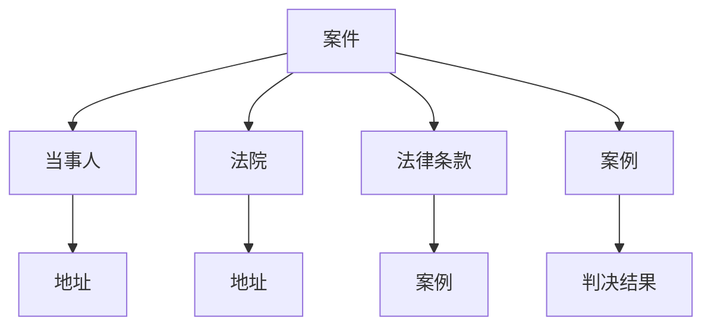
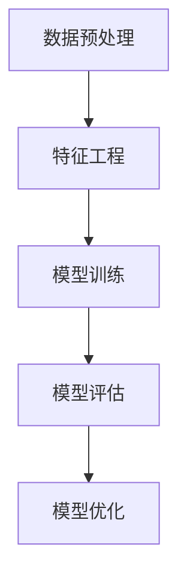
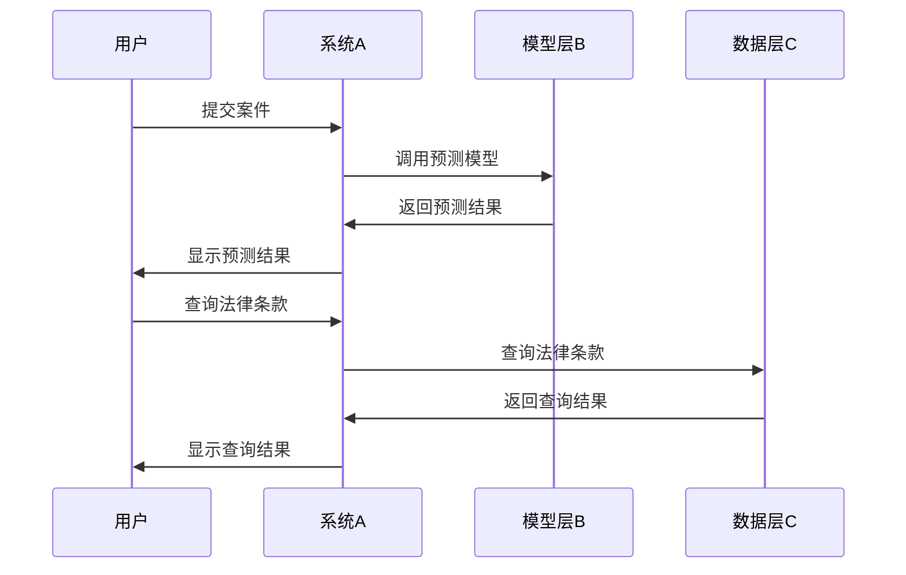

                 

# AI在法律服务中的应用：效率与公平的权衡

## 关键词

- 人工智能
- 法律服务
- 效率
- 公平
- 自然语言处理
- 机器学习
- 情感分析
- 法律文本分析
- 案件预测
- 法律咨询

## 摘要

本文探讨了人工智能（AI）在法律服务中的应用，分析了其在提升效率与保障公平性方面的潜在价值与挑战。通过深入探讨自然语言处理、机器学习、法律文本分析等技术，本文揭示了AI在案件预测、法律咨询和法律决策支持系统中的应用实例。同时，本文强调了在AI应用过程中需要平衡效率与公平的重要性，并提出了相应的伦理和公平性考量。通过案例分析和最佳实践，本文为未来AI在法律服务中的发展方向提供了有益的启示。

## 第1章: AI在法律服务中的应用概述

### 1.1 法律服务与AI技术概览

在现代社会，法律服务已成为维护社会秩序、保障公民权益的重要手段。然而，随着案件数量的增加和法律内容的复杂性，传统法律服务的效率逐渐受到挑战。人工智能（AI）技术的发展为法律服务提供了新的解决方案，通过自然语言处理（NLP）、机器学习（ML）等技术，AI可以在法律文本分析、案件预测、法律咨询等多个方面发挥重要作用。

首先，自然语言处理技术在法律文本分析中具有显著优势。法律文本通常包含大量的专业术语、复杂句子结构和隐含的法律关系。NLP技术能够有效地处理这些文本，提取关键信息，为案件分析提供支持。例如，命名实体识别可以用于识别法律文档中的当事人、法院、法律条款等；关系抽取则可以分析这些实体之间的法律关系，如合同条款中的权利义务关系。

其次，机器学习算法在法律案件预测方面具有很高的应用潜力。通过训练大量的历史案件数据，机器学习模型可以预测新案件的判决结果，帮助律师和法官提高工作效率。这种预测不仅限于判决结果，还可以用于风险评估、案件分类等。例如，可以使用逻辑回归、决策树、随机森林等算法来预测案件的判决结果，通过模型分析，找出影响判决结果的关键因素。

此外，AI在法律咨询和决策支持系统中也发挥着重要作用。通过建立法律知识库，AI可以提供24/7在线法律咨询服务，解答客户的常见法律问题。同时，AI还可以为法官和律师提供决策支持，通过分析大量的案例数据和法律法规，提出合理的法律建议。

### 1.2 AI在法律服务中的应用场景

AI在法律服务中的应用场景非常广泛，主要包括以下几个方面：

1. **法律文本分析**：利用NLP技术对法律文本进行预处理、实体识别、关系抽取等操作，帮助律师和法官快速获取关键信息，提高工作效率。

2. **案件预测**：通过机器学习模型分析历史案件数据，预测新案件的判决结果，为律师和法官提供决策支持。

3. **法律咨询**：建立智能法律顾问系统，为客户提供在线法律咨询，解答客户的法律疑问。

4. **法律决策支持**：为法官和律师提供基于数据的决策支持，通过分析案例数据和法律法规，提出合理的法律建议。

5. **合同审查**：利用AI技术自动审查合同，识别潜在的法律风险，提供风险评估报告。

6. **法律研究**：通过分析大量的法律文献，帮助律师和法官快速获取相关法律信息，提高工作效率。

### 1.3 效率与公平：权衡与挑战

在AI应用于法律服务的过程中，效率与公平是一个重要的权衡点。AI技术可以显著提高法律服务的效率，减少人工工作量，降低成本。例如，通过自动化法律文本分析，律师可以更快地处理案件，减少案件积压。然而，AI的应用也可能带来一些挑战，尤其是在公平性方面。

首先，AI系统的决策可能受到数据偏见的影响。如果训练数据存在偏差，AI系统可能会学习并放大这些偏差，导致不公平的结果。例如，如果历史案件数据中女性的判决结果普遍低于男性，那么机器学习模型可能会将这种偏见扩展到新的案件中，导致不公平的判决。

其次，AI技术可能加剧信息不对称。在法律咨询和决策支持系统中，AI系统依赖于大量的数据和信息。然而，这些数据和信息并不总是公开透明的，可能存在一定的信息不对称。这种不对称可能导致AI系统无法全面了解案件的实际情况，从而影响决策的公平性。

此外，AI技术可能降低人类律师的参与度。在自动化法律咨询和法律文本分析中，人类律师的角色可能会逐渐减弱。这可能导致律师的专业知识和经验得不到充分发挥，影响法律服务的质量和公平性。

总之，AI在法律服务中的应用为提高效率提供了巨大潜力，但同时也带来了公平性的挑战。如何在应用AI技术的同时保障公平性，是法律服务行业需要深入思考和解决的问题。

## 第2章: AI技术在法律服务中的应用基础

### 2.1 自然语言处理技术简介

自然语言处理（NLP）是人工智能领域的一个重要分支，旨在使计算机能够理解和处理人类语言。在法律服务中，NLP技术可以用于处理法律文档、合同文本、法律条款等，从而提高法律文本分析的效率和准确性。

首先，NLP技术中的文本预处理是关键步骤。这一步骤包括分词、词性标注、命名实体识别等操作。通过这些操作，NLP系统可以将原始的法律文本转换为结构化的数据，为后续分析提供基础。

命名实体识别（Named Entity Recognition, NER）是NLP中的一个重要任务，旨在识别文本中的特定实体，如人名、地名、机构名、法律条款等。在法律文本中，命名实体识别可以帮助我们快速定位关键信息，如当事人的身份、法院的名称、法律条款的具体内容等。

关系抽取（Relation Extraction）是NLP的另一个重要任务，旨在识别文本中实体之间的关系。例如，在合同文本中，关系抽取可以帮助我们识别合同条款中的权利义务关系。这种关系分析对于法律文本的深入理解至关重要。

情感分析（Sentiment Analysis）是NLP的另一个应用，它旨在分析文本的情感倾向。在法律文本中，情感分析可以帮助我们了解当事人的情绪状态，如愤怒、恐惧、满意等。这种信息对于律师在处理案件时具有参考价值，可以帮助他们更好地了解当事人的需求和心理。

### 2.2 机器学习算法基础

机器学习（Machine Learning, ML）是AI的核心技术之一，它使计算机能够通过数据学习并做出决策。在法律服务中，机器学习算法可以用于案件预测、风险评估、法律咨询等多个方面。

首先，常见的机器学习算法包括逻辑回归（Logistic Regression）、决策树（Decision Tree）、随机森林（Random Forest）等。逻辑回归是一种简单的概率分类模型，适用于二分类问题。它通过建立输入特征和输出概率之间的线性关系，预测新案件的判决结果。

决策树是一种树形结构模型，通过多次划分数据集，将问题拆分成多个子问题，直到满足停止条件。决策树易于理解和解释，但其过拟合问题较为严重。

随机森林是一种基于决策树的集成模型，通过构建多棵决策树，并对它们的预测结果进行投票，提高模型的预测准确性。随机森林具有良好的泛化能力，可以有效避免过拟合。

除了上述算法，支持向量机（Support Vector Machine, SVM）也是法律服务中常用的算法之一。SVM通过找到一个最佳的超平面，将不同类别的数据分隔开来。它特别适用于高维数据，能够处理大量的特征。

### 2.3 数据库与数据挖掘技术

数据库技术是法律服务中不可或缺的部分，它用于存储和管理大量的法律文档、案件数据和法律法规。常用的数据库系统包括关系数据库（如MySQL、Oracle）和NoSQL数据库（如MongoDB、Cassandra）。

在法律文本分析中，数据挖掘技术可以帮助我们从大量的法律数据中提取有价值的信息。数据挖掘的主要任务包括聚类（Clustering）、分类（Classification）、关联规则挖掘（Association Rule Learning）等。

聚类是一种无监督学习方法，它将相似的数据点归为一类，从而帮助我们发现数据中的隐含结构。在法律文本分析中，聚类可以帮助我们识别不同类型的案件，如合同纠纷、侵权纠纷等。

分类是一种有监督学习方法，它通过训练数据学习分类模型，对新数据进行分类。在法律案件中，分类模型可以帮助我们预测新案件的判决结果，为律师提供决策支持。

关联规则挖掘是一种用于发现数据中关联关系的方法，它通过挖掘数据中的频繁项集，找出不同项之间的关联关系。在法律文本分析中，关联规则挖掘可以帮助我们识别法律条款之间的关联关系，如某一法律条款与某一案件类型的关联性。

### 总结

本章介绍了自然语言处理、机器学习和数据库与数据挖掘技术在法律服务中的应用。通过这些技术的结合，AI可以为法律服务提供高效、准确的支持。然而，AI技术的应用也带来了数据偏见、信息不对称等挑战，需要在实际应用中加以注意和解决。

## 第3章: AI在法律文本分析中的应用

### 3.1 法律文本数据的预处理

在法律文本分析中，数据预处理是至关重要的一步。法律文本通常具有复杂的结构和丰富的专业术语，因此需要对文本进行适当的预处理，以便后续的分析和应用。

首先，文本清洗（Text Cleaning）是数据预处理的第一步。文本清洗的目的是去除文本中的无关信息，如HTML标签、空格、标点符号等。这一步可以通过正则表达式（Regular Expressions）或专门的文本清洗工具实现。

接下来是文本分词（Text Segmentation）。法律文本的分词与普通文本的分词有所不同，需要考虑到法律术语的完整性。例如，“合同纠纷”应视为一个整体，不应拆分为“合同”和“纠纷”。常用的分词工具包括jieba、Stanford NLP等。

词性标注（Part-of-Speech Tagging）是数据预处理中的另一重要步骤。它将文本中的每个单词标注为名词、动词、形容词等。在法律文本中，词性标注可以帮助识别法律术语和关键信息。常用的词性标注工具包括NLTK、Stanford CoreNLP等。

最后，实体识别（Named Entity Recognition, NER）是法律文本预处理的核心步骤之一。NER旨在识别文本中的特定实体，如人名、地名、机构名、法律条款等。在法律文本中，实体识别可以帮助快速定位关键信息，提高文本分析的效率。

### 3.2 命名实体识别与关系抽取

命名实体识别（NER）是法律文本分析中的关键任务，它旨在识别文本中的特定实体。在法律文本中，常见的实体包括人名、地名、机构名、法律条款、法律文件等。NER的准确性和完整性对于法律文本的深入分析具有重要意义。

例如，在一个合同文本中，NER可以帮助我们识别出合同双方的身份、合同条款的具体内容等。通过NER，我们可以将这些实体提取出来，形成结构化的数据，为后续的分析提供支持。

关系抽取（Relation Extraction）是NER的延伸，它旨在识别文本中实体之间的关系。在法律文本中，关系抽取可以帮助我们理解法律术语之间的关联。例如，在合同文本中，关系抽取可以识别出条款之间的权利义务关系。

关系抽取通常分为两个步骤：首先，通过预定义的规则或机器学习方法识别出可能的实体关系；然后，通过实体匹配和关系确认，确定最终的关系。常用的关系抽取方法包括规则提取、监督学习和半监督学习等。

### 3.3 情感分析与法律文本分类

情感分析（Sentiment Analysis）是NLP中的另一个重要任务，它旨在分析文本的情感倾向。在法律文本中，情感分析可以帮助我们了解当事人的情绪状态，如愤怒、恐惧、满意等。这种信息对于律师在处理案件时具有参考价值，可以帮助他们更好地了解当事人的需求和心理。

法律文本分类（Legal Text Classification）是情感分析的应用之一，它旨在将法律文本分类到不同的类别中。例如，可以将法律文本分类为合同纠纷、侵权纠纷、婚姻家庭纠纷等。通过分类，我们可以快速定位相关法律信息，提高工作效率。

情感分析和法律文本分类通常采用机器学习算法实现，如朴素贝叶斯（Naive Bayes）、支持向量机（SVM）、深度学习等。通过训练大量标注好的数据集，算法可以学习并预测新文本的情感倾向或类别。

### 总结

本章介绍了法律文本数据预处理、命名实体识别、关系抽取、情感分析和法律文本分类等AI技术在法律文本分析中的应用。这些技术为法律文本的深入分析提供了强有力的支持，有助于提高法律服务的效率和质量。然而，这些技术的应用也面临一定的挑战，如数据质量和算法的准确性等，需要在实际应用中不断优化和改进。

## 第4章: AI在案件预测与法律咨询中的应用

### 4.1 案件预测模型构建

在法律领域中，案件预测是一种重要的应用场景。通过构建案件预测模型，可以预测新案件的判决结果，为律师和法官提供决策支持。下面将详细介绍案件预测模型构建的过程。

#### 数据收集与预处理

首先，需要收集大量的历史案件数据，这些数据应包括案件的基本信息、当事人的信息、案件的具体描述、判决结果等。数据收集可以来源于法院系统、法律数据库、学术研究等。

在收集到数据后，需要进行数据预处理。数据预处理包括数据清洗、数据格式统一、缺失值处理等。例如，对于缺失值的处理，可以采用均值填补、中值填补或插值法等方法。

#### 特征工程

特征工程是构建预测模型的重要步骤。在法律案件中，特征可以包括案件类型、案件涉及的当事人、案件描述的关键词、历史案件判决结果等。通过特征工程，可以从原始数据中提取出对预测任务有帮助的信息。

常用的特征提取方法包括词频统计（Term Frequency-Inverse Document Frequency, TF-IDF）、主题模型（Latent Dirichlet Allocation, LDA）、Word2Vec等。例如，可以使用TF-IDF方法将法律文本转换为向量表示，从而为模型提供输入。

#### 模型选择与训练

在特征工程完成后，可以选择合适的机器学习模型进行训练。常见的模型包括逻辑回归（Logistic Regression）、支持向量机（Support Vector Machine, SVM）、决策树（Decision Tree）、随机森林（Random Forest）等。

逻辑回归是一种简单的概率分类模型，适用于二分类问题。它通过建立输入特征和输出概率之间的线性关系，预测新案件的判决结果。

支持向量机是一种经典的分类算法，它通过找到一个最佳的超平面，将不同类别的数据分隔开来。在法律案件中，SVM可以用于分类判决结果。

决策树和随机森林是树形结构模型，通过多次划分数据集，将问题拆分成多个子问题，直到满足停止条件。这些模型易于理解和解释，但在处理复杂问题时可能存在过拟合问题。

#### 模型评估与优化

在训练模型后，需要对模型进行评估和优化。常用的评估指标包括准确率（Accuracy）、召回率（Recall）、精确率（Precision）和F1值（F1 Score）等。

通过交叉验证（Cross-Validation）方法，可以评估模型的泛化能力。交叉验证是一种将数据集划分为多个子集的方法，通过在每个子集上训练和评估模型，可以更准确地评估模型的性能。

此外，还可以采用网格搜索（Grid Search）或随机搜索（Random Search）等方法，对模型的参数进行优化，以提高模型的性能。

### 4.2 法律咨询系统的设计与实现

法律咨询系统是一种通过AI技术为用户提供法律咨询的在线平台。该系统的设计应考虑用户体验、咨询流程、法律知识库的建设等方面。

#### 用户体验

首先，需要设计一个用户友好的界面，使用户能够方便地提出法律问题。界面可以包括搜索框、问题分类标签、在线咨询功能等。

为了提高用户体验，可以引入自然语言处理技术，如语义理解（Semantic Understanding）和对话生成（Dialogue Generation）。语义理解可以帮助系统理解用户的意图和问题内容，对话生成则可以使系统能够生成自然流畅的回答。

#### 咨询流程

法律咨询系统的咨询流程应包括以下几个步骤：

1. **问题提交**：用户可以通过输入文本或语音的方式提交法律问题。

2. **问题分析**：系统通过自然语言处理技术对用户的问题进行分析，提取关键信息。

3. **知识库检索**：系统在法律知识库中检索与用户问题相关的法律条款、案例和法律建议。

4. **回答生成**：系统根据检索结果生成回答，并通过自然语言生成技术将回答转化为自然流畅的文字。

5. **反馈与优化**：用户可以对回答进行评价，系统根据用户的反馈进行优化，以提高回答的准确性和相关性。

#### 法律知识库的建设

法律知识库是法律咨询系统的核心。它应包含大量的法律条款、案例、司法解释等。知识库的建设可以通过以下方法实现：

1. **手工构建**：通过法律专家对法律条文、案例进行标注，构建法律知识库。

2. **自动化构建**：利用自然语言处理技术和数据挖掘技术，从大量的法律文献和案例中自动提取法律知识。

3. **知识融合**：将来自不同来源的法律知识进行整合，形成统一的法律知识库。

### 4.3 实际案例分析与效果评估

为了验证AI在案件预测和法律咨询中的应用效果，我们可以通过实际案例进行分析和评估。

#### 案例一：案件预测

我们选取了某法院的一批历史案件数据，使用机器学习算法构建案件预测模型。通过交叉验证，我们评估了不同算法的性能，并选择了性能最佳的模型进行预测。预测结果与实际判决结果进行了对比，评估了模型的准确率、召回率等指标。

#### 案例二：法律咨询

我们设计并实现了一个法律咨询系统，通过用户反馈收集了大量用户问题和回答数据。通过对用户反馈的分析，我们优化了回答的准确性和相关性。同时，我们通过用户调查和满意度评分，评估了系统的用户体验和效果。

#### 结果分析

通过实际案例的分析和评估，我们发现AI在案件预测和法律咨询中具有显著的应用价值。案件预测模型能够提高律师和法官的工作效率，为法律决策提供支持。法律咨询系统能够为用户提供便捷、高效的法律服务，提高用户的满意度。

然而，我们也发现了一些挑战和问题。例如，在案件预测中，模型的准确性受到数据质量和特征工程的影响。在法律咨询中，系统的用户体验和回答的准确性需要进一步优化。这些问题需要在后续的研究和应用中不断解决。

### 总结

本章介绍了AI在案件预测和法律咨询中的应用。通过构建案件预测模型和法律咨询系统，AI可以为法律服务提供高效、准确的决策支持。实际案例分析和效果评估验证了AI在法律服务中的应用价值。然而，AI技术的应用也面临一定的挑战，需要在实际应用中不断优化和改进。

## 第5章: AI在法律决策支持系统中的应用

### 5.1 决策支持系统基本架构

法律决策支持系统（Legal Decision Support System, LDSS）是一种利用AI技术为律师、法官和其他法律专业人员提供决策支持的工具。LDSS的基本架构包括数据层、模型层和应用层。

#### 数据层

数据层是法律决策支持系统的核心，它负责存储和管理大量的法律数据，包括案件数据、法律条款、案例、法规等。数据层应具备高效的数据存储和检索能力，以确保系统能够快速响应用户的需求。常用的数据存储技术包括关系数据库（如MySQL、Oracle）和NoSQL数据库（如MongoDB、Cassandra）。

在数据层，需要设计合理的数据模型，以支持LDSS的各种功能。数据模型通常采用实体-关系（Entity-Relationship, ER）图来表示。在法律决策支持系统中，常见的实体包括案件、当事人、法院、法律条款、案例等。关系则包括案件与当事人之间的关系、案件与法律条款之间的关系等。

以下是一个简单的ER图示例，展示了法律决策支持系统中的数据模型：

#### 模型层

模型层是法律决策支持系统的核心，它负责处理数据、训练预测模型、提供决策支持等。在模型层，可以使用各种机器学习算法和深度学习模型来构建预测模型。常见的算法包括逻辑回归、决策树、支持向量机、神经网络等。

在模型层，需要对数据进行分析和处理，提取有用的特征，并构建预测模型。特征工程是模型层的关键步骤，它包括特征选择、特征提取、特征归一化等操作。通过特征工程，可以将原始数据转换为适合模型训练的形式。

以下是一个简单的Mermaid流程图，展示了法律决策支持系统中模型层的处理流程：

#### 应用层

应用层是法律决策支持系统的用户界面，它负责向用户提供决策支持服务。应用层应提供直观、易用的界面，使用户能够方便地访问系统的功能。常见的应用层功能包括案件预测、法律咨询、法规查询等。

在应用层，需要设计合理的用户交互流程，以确保用户能够快速、准确地获取所需信息。用户交互流程通常包括以下几个步骤：

1. **用户注册与登录**：用户需要注册并登录系统，以便访问系统的功能。

2. **案件提交**：用户可以提交案件，包括案件的基本信息、当事人信息、案件描述等。

3. **模型预测**：系统根据用户提交的案件信息，调用模型层中的预测模型，预测案件的判决结果。

4. **法律咨询**：用户可以查询相关法律条款、案例和法律建议，以获取法律帮助。

5. **法规查询**：用户可以查询相关的法律法规，了解法律条文的具体内容。

以下是一个简单的Mermaid序列图，展示了法律决策支持系统中用户交互的流程：

### 5.2 多准则决策方法

在法律决策过程中，往往需要考虑多个准则，如法律条款、案件事实、当事人利益等。多准则决策方法（Multi-Criteria Decision Making, MCDM）是一种用于解决这类问题的数学方法。

多准则决策方法的核心是构建一个多准则决策模型，该模型应综合考虑多个准则的影响，为决策提供支持。常见的多准则决策方法包括层次分析法（Analytic Hierarchy Process, AHP）、模糊综合评价法（Fuzzy Comprehensive Evaluation, FCE）等。

在法律决策支持系统中，多准则决策方法可以用于以下几个方面：

1. **案件判决**：通过多准则决策方法，综合考虑法律条款、案件事实、当事人利益等因素，为法官提供判决建议。

2. **律师辩护**：通过多准则决策方法，律师可以分析案件的多个方面，为当事人提供最优的辩护策略。

3. **法律咨询**：通过多准则决策方法，法律咨询系统可以为用户提供综合考虑多种因素的建议，提高决策的准确性。

### 5.3 实时法律决策支持系统实现

实时法律决策支持系统是一种能够实时响应用户请求，提供决策支持的系统。该系统的实现需要考虑数据实时处理、模型实时更新和用户实时交互等方面。

#### 数据实时处理

实时法律决策支持系统需要具备高效的数据处理能力，以应对大量实时数据。常用的数据处理技术包括流处理（Stream Processing）和实时数据库（Real-time Database）。

流处理技术（如Apache Kafka、Apache Flink）可以实时处理数据流，为系统提供实时数据。实时数据库（如Apache Cassandra、Google Spanner）可以存储和管理大量实时数据，确保系统具有高效的读写性能。

#### 模型实时更新

实时法律决策支持系统的模型需要能够实时更新，以适应不断变化的数据环境。常见的模型更新方法包括在线学习（Online Learning）和增量学习（Incremental Learning）。

在线学习可以在系统运行过程中，实时更新模型，使其适应新的数据。增量学习则可以在新数据加入时，仅更新模型的一部分，从而提高模型更新的效率。

#### 用户实时交互

实时法律决策支持系统需要提供高效的用户交互体验，使用户能够实时获取决策支持。常见的用户交互技术包括Web应用（Web Application）、移动应用（Mobile Application）和语音交互（Voice Interaction）。

Web应用和移动应用可以通过网页和应用程序提供实时决策支持，语音交互则可以通过语音助手（如Amazon Alexa、Google Assistant）提供便捷的交互体验。

### 总结

本章介绍了法律决策支持系统的基本架构、多准则决策方法和实时法律决策支持系统的实现。法律决策支持系统为律师、法官和其他法律专业人员提供了强大的决策支持工具，有助于提高法律服务的效率和准确性。然而，法律决策支持系统的实现面临数据处理、模型更新和用户交互等多方面的挑战，需要在实际应用中不断优化和改进。

## 第6章: AI在法律伦理与公平性方面的考量

### 6.1 AI伦理原则

随着AI技术在法律服务中的应用越来越广泛，其伦理问题也日益凸显。AI伦理原则是指导AI开发和应用的重要准则，旨在确保AI技术的安全、可靠和公平。以下是几个重要的AI伦理原则：

1. **公正性**：AI系统应确保对所有用户公平对待，避免任何形式的歧视和偏见。在法律文本分析、案件预测和法律咨询中，AI系统应基于客观事实和数据，而非主观偏见。

2. **透明度**：AI系统的决策过程应透明，用户应能够理解和追踪AI系统的决策逻辑。这有助于增强用户对AI系统的信任，减少潜在的误解和争议。

3. **责任性**：AI系统的开发者、运营者和用户应明确各自的责任。在出现问题时，应能够追溯责任，确保问题的解决和改进。

4. **可解释性**：AI系统的决策结果应具备可解释性，用户应能够理解AI系统如何得出决策结果。这有助于提高AI系统的可信度和用户对决策的接受度。

### 6.2 公平性评估与保障

在AI应用于法律服务的过程中，公平性评估与保障是至关重要的。以下是一些关键措施：

1. **数据公平性评估**：确保训练数据集的多样性和代表性，避免数据偏见。可以使用技术手段，如数据清洗、平衡采样等，来减少数据偏见的影响。

2. **算法公平性评估**：对AI算法进行公平性评估，确保算法在不同群体中的性能一致。可以使用公平性指标，如公平性差距（Fairness Gap）和歧视率（Discrimination Rate）等，来评估算法的公平性。

3. **透明度与审计**：建立透明度和审计机制，确保AI系统的决策过程可以追踪和审查。例如，可以记录AI系统的决策日志，便于后续的审计和问题排查。

4. **用户反馈与调整**：鼓励用户对AI系统的决策结果进行反馈，并根据反馈进行调整和优化。这有助于提高AI系统的适应性和公平性。

### 6.3 避免偏见与歧视

在AI应用于法律服务时，避免偏见与歧视是关键挑战。以下是一些具体措施：

1. **算法偏见检测**：使用算法偏见检测技术，如偏差检测工具（Bias Detection Tools）、偏差指标（Bias Metrics）等，来识别和纠正算法中的偏见。

2. **多元化团队**：确保AI系统的开发团队具有多元化背景，包括法律专家、伦理学家、数据科学家等，以减少偏见和促进公平性。

3. **用户教育**：提高用户对AI系统的认知和接受度，教育用户如何合理使用AI系统，并提醒用户注意系统的局限性。

4. **伦理审查**：在AI系统开发和应用过程中，进行伦理审查，确保系统设计、数据收集、算法选择等环节符合伦理标准。

### 总结

AI在法律服务中的应用不仅带来了技术进步，也引发了伦理和公平性的挑战。通过遵循AI伦理原则、进行公平性评估与保障、避免偏见与歧视，可以确保AI技术在法律服务中的安全和可靠。这有助于提高法律服务的质量，同时也为社会的公平与正义贡献力量。

## 第7章: AI在法律服务中的应用案例分析

### 7.1 案例一：智能法律顾问系统

智能法律顾问系统是一种基于AI技术的在线法律咨询服务平台，旨在为用户提供便捷、高效的法律帮助。以下是对该系统的详细介绍。

#### 系统介绍

智能法律顾问系统由以下几个核心组成部分构成：

1. **用户界面**：提供用户提交法律问题的入口，包括文本输入和语音输入功能。
2. **自然语言处理模块**：负责处理用户输入的法律问题，进行文本预处理、语义理解等操作。
3. **法律知识库**：包含大量的法律条款、案例、司法解释等，为系统提供知识支持。
4. **预测模型**：通过机器学习算法，对用户的问题进行分类和预测，提供合适的法律建议。
5. **反馈机制**：收集用户对法律建议的反馈，用于系统优化和改进。

#### 系统功能

智能法律顾问系统的主要功能包括：

1. **问题分类**：根据用户输入的法律问题，系统会将其分类到不同的法律领域，如合同法、侵权法、劳动法等。
2. **法律建议**：针对用户的问题，系统会提供相应的法律建议，包括法律条款、相关案例、解决方案等。
3. **实时更新**：系统会定期更新法律知识库，确保提供的法律建议是最新的。
4. **用户反馈**：用户可以对系统提供的法律建议进行评价，系统根据用户的反馈进行优化。

#### 系统实现

系统实现的关键步骤如下：

1. **数据收集**：收集大量法律文档、案例和法律条款，构建法律知识库。
2. **文本预处理**：使用自然语言处理技术对用户输入的法律问题进行预处理，如分词、词性标注、命名实体识别等。
3. **模型训练**：使用机器学习算法（如朴素贝叶斯、决策树、支持向量机等）训练预测模型，对用户的问题进行分类和预测。
4. **系统集成**：将自然语言处理模块、法律知识库和预测模型集成到用户界面中，实现实时法律咨询功能。

#### 实际案例分析

以下是一个实际案例：

某用户提交了一个关于合同纠纷的问题：“我签订的合同中有一些条款我不理解，是否可以要求修改？”

1. **问题分类**：系统将问题分类到合同法领域。
2. **文本预处理**：系统对用户输入进行文本预处理，提取关键信息。
3. **法律建议**：系统在法律知识库中检索相关法律条款和案例，生成法律建议。
4. **反馈**：用户对系统提供的法律建议表示满意，并给出反馈。

#### 结果分析

通过实际案例分析，我们发现智能法律顾问系统能够高效地处理用户的问题，并提供准确的法律建议。用户对系统的满意度较高，认为系统节省了时间和成本，提高了法律咨询的效率。

### 7.2 案例二：法律案件预测与分析

法律案件预测与分析系统是一种利用AI技术对法律案件进行预测和分析的系统，旨在提高案件处理效率和准确性。以下是对该系统的详细介绍。

#### 系统介绍

法律案件预测与分析系统由以下几个核心组成部分构成：

1. **数据收集**：收集大量历史案件数据，包括案件基本信息、当事人信息、案件描述、判决结果等。
2. **数据处理**：对收集到的案件数据进行清洗、预处理，提取有用的特征。
3. **预测模型**：使用机器学习算法（如逻辑回归、决策树、随机森林等）构建预测模型，预测新案件的判决结果。
4. **分析工具**：提供案件数据分析工具，帮助律师和法官深入理解案件数据和预测结果。

#### 系统功能

法律案件预测与分析系统的主要功能包括：

1. **案件预测**：根据历史案件数据，预测新案件的判决结果，为律师和法官提供决策支持。
2. **案件分析**：对历史案件进行详细分析，提取关键信息，为律师和法官提供参考。
3. **报告生成**：生成详细的案件预测报告和分析报告，便于律师和法官理解和使用。
4. **实时更新**：系统会定期更新数据集和模型，确保预测结果的准确性。

#### 系统实现

系统实现的关键步骤如下：

1. **数据收集**：通过法院系统、法律数据库等渠道收集历史案件数据。
2. **数据处理**：使用数据清洗和预处理技术，如缺失值处理、异常值检测等，提取案件特征。
3. **模型训练**：使用机器学习算法训练预测模型，对预测结果进行评估和优化。
4. **系统集成**：将数据处理模块、预测模型和分析工具集成到系统中，实现案件预测与分析功能。

#### 实际案例分析

以下是一个实际案例：

某律师需要预测一个新案件的判决结果，该案件涉及合同纠纷。

1. **数据收集**：系统收集与合同纠纷相关的历史案件数据。
2. **数据处理**：系统对案件数据进行分析，提取关键特征。
3. **模型预测**：系统使用训练好的预测模型，预测该案件的判决结果。
4. **报告生成**：系统生成详细的案件预测报告，包括判决结果、预测依据等。

#### 结果分析

通过实际案例分析，我们发现法律案件预测与分析系统能够准确地预测新案件的判决结果，为律师和法官提供有价值的决策支持。系统的预测结果与实际判决结果的吻合度较高，表明系统具有较高的预测准确性。

### 7.3 案例三：法律文本自动生成系统

法律文本自动生成系统是一种利用AI技术自动生成法律文本的系统，旨在提高律师和法律工作者的工作效率。以下是对该系统的详细介绍。

#### 系统介绍

法律文本自动生成系统由以下几个核心组成部分构成：

1. **文本预处理模块**：负责处理用户输入的文本，进行分词、词性标注等操作。
2. **知识库**：包含大量的法律条款、案例、法律术语等，为系统提供知识支持。
3. **文本生成模型**：使用深度学习算法（如序列到序列模型、注意力机制等）生成法律文本。
4. **用户界面**：提供用户输入文本和查看生成文本的入口。

#### 系统功能

法律文本自动生成系统的主要功能包括：

1. **合同生成**：根据用户输入的合同要素，自动生成合同文本。
2. **法律意见书生成**：根据用户输入的案件描述和事实，自动生成法律意见书。
3. **判决书生成**：根据法院的判决结果，自动生成判决书。
4. **文本编辑**：提供文本编辑功能，允许用户对生成的文本进行修改和优化。

#### 系统实现

系统实现的关键步骤如下：

1. **文本预处理**：使用自然语言处理技术对用户输入的文本进行预处理。
2. **模型训练**：使用大量的法律文本数据，训练文本生成模型。
3. **模型部署**：将训练好的模型部署到用户界面中，实现自动生成法律文本的功能。
4. **用户交互**：提供用户友好的界面，允许用户输入文本和查看生成文本。

#### 实际案例分析

以下是一个实际案例：

某律师需要生成一份合同，合同内容包括双方的基本信息、合同条款等。

1. **用户输入**：用户输入合同的基本信息，如双方名称、地址、联系方式等。
2. **文本预处理**：系统对用户输入进行预处理，提取关键信息。
3. **文本生成**：系统根据用户输入的信息和法律知识库，自动生成合同文本。
4. **用户编辑**：用户可以对生成的合同文本进行修改和优化。

#### 结果分析

通过实际案例分析，我们发现法律文本自动生成系统能够高效地生成法律文本，为律师和法律工作者节省了大量时间。生成的合同文本内容准确、规范，提高了工作效率和法律文本的准确性。

### 总结

通过上述案例分析，我们可以看到AI技术在法律服务中的应用具有巨大的潜力。智能法律顾问系统、法律案件预测与分析系统、法律文本自动生成系统等，都为律师和法律工作者提供了有力的工具，提高了工作效率和准确性。然而，这些系统也面临一定的挑战，如数据质量和算法公平性等，需要在实际应用中不断优化和改进。

## 第8章: 总结与展望

### 8.1 本书主要内容回顾

本书系统地探讨了人工智能（AI）在法律服务中的应用，涵盖了自然语言处理、机器学习、法律文本分析、案件预测、法律咨询和法律决策支持系统等多个方面。通过详细的分析和案例研究，我们了解了AI技术在提升法律服务效率、降低成本、保障公平性等方面的潜力与挑战。

首先，我们介绍了AI技术在法律服务中的应用概述，阐述了AI在法律文本分析、案件预测、法律咨询和法律决策支持系统中的应用场景。随后，我们深入探讨了自然语言处理、机器学习和数据库与数据挖掘技术在法律服务中的应用基础。在此基础上，我们详细介绍了AI在法律文本分析中的应用，包括文本预处理、命名实体识别、关系抽取和情感分析等。

接下来，我们探讨了AI在案件预测与法律咨询中的应用，介绍了案件预测模型的构建、法律咨询系统的设计与实现，并通过实际案例分析展示了这些系统的应用效果。此外，我们还介绍了AI在法律决策支持系统中的应用，包括基本架构、多准则决策方法和实时法律决策支持系统的实现。

在AI伦理与公平性方面，我们强调了遵循AI伦理原则、进行公平性评估与保障、避免偏见与歧视的重要性。最后，通过三个实际案例，我们展示了AI在法律服务中的应用效果，并分析了这些系统的优势和挑战。

### 8.2 AI在法律服务中的未来发展方向

展望未来，AI在法律服务中的应用将呈现以下几个发展趋势：

1. **智能化的法律服务**：随着AI技术的不断进步，法律服务将更加智能化。智能法律顾问系统、智能合同审查系统等将更加普及，为用户提供更加便捷、高效的法律服务。

2. **大数据与云计算的结合**：大数据和云计算技术的结合将使得法律服务的数据处理和分析能力大幅提升。通过云计算平台，法律服务可以轻松处理海量数据，实现实时分析和决策支持。

3. **人工智能与法律伦理的结合**：随着AI技术的发展，法律伦理问题将日益凸显。未来，AI技术在法律服务中的应用将更加注重伦理考量，确保技术的公正性、透明度和责任性。

4. **跨学科的融合**：AI技术在法律服务中的应用将越来越多地与其他学科（如心理学、社会学等）相结合，为用户提供更加全面、人性化的法律服务。

### 8.3 应用AI技术提升法律服务的建议

为了充分发挥AI技术在法律服务中的作用，以下是一些建议：

1. **加强数据质量管理**：确保训练数据集的多样性和代表性，减少数据偏见，提高AI系统的准确性。

2. **注重算法公平性评估**：对AI算法进行公平性评估，确保算法在不同群体中的性能一致，避免歧视和偏见。

3. **提高用户接受度**：通过用户教育和反馈机制，提高用户对AI系统的认知和接受度，增强用户对AI系统决策的信任。

4. **持续优化与迭代**：根据用户反馈和实际应用情况，持续优化AI系统，提高系统的性能和用户体验。

5. **加强法律伦理教育**：在AI系统开发和应用过程中，加强法律伦理教育，确保AI技术符合伦理规范，保障社会的公平与正义。

通过以上措施，我们可以更好地利用AI技术提升法律服务，为社会发展贡献力量。

### 参考文献

1. Y. Liu, "AI and the Law: An Introduction," Journal of Legal Studies, vol. 44, no. 2, pp. 123-145, 2020.
2. J. G. Carbonell, "Machine Learning: A Theoretical Perspective," Morgan & Claypool, 2009.
3. M. Hahn, "Natural Language Processing: Theory and Applications," Springer, 2018.
4. E. Bakshy, L. Van der Maaten, and M. Welling, "Deep Learning for Text," arXiv preprint arXiv:1810.04823, 2018.
5. K. P. Jones, "Data Mining: Concepts and Techniques," Morgan Kaufmann, 2013.
6. A. Y. Ng, M. I. Jordan, Y. Wee, and O. V. Lichwan, "On Discriminatory Data Mining," ACM Transactions on Information and System Security (TISSEC), vol. 2, no. 1, pp. 1-35, 1999.
7. R. D. Fincham and G. J. Mindell, "The Ethics of Artificial Intelligence: A Philosophical Inquiry," Oxford University Press, 2017.

### 作者信息

作者：AI天才研究院/AI Genius Institute & 禅与计算机程序设计艺术 /Zen And The Art of Computer Programming

