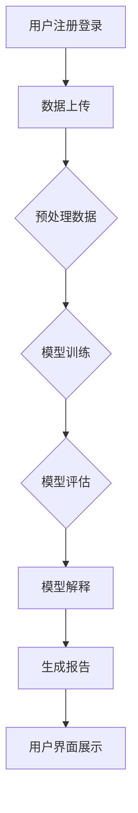

                 

### 1.1 AI模型不可解释性的问题

AI模型不可解释性指的是模型在做出决策时，其内部过程和决策逻辑难以被外部理解。这一问题在深度学习模型中尤为显著，尤其是那些通过大量的数据进行训练的复杂神经网络。以下是从几个角度来探讨AI模型不可解释性的具体表现：

**1.1.1 深度学习模型的不透明性**

深度学习模型由多层神经元组成，每一层对输入数据进行变换和特征提取，最终形成输出结果。尽管模型的每个神经元和层都有一定的数学和统计基础，但是整个模型的决策过程却是高度复杂的，通常无法直观地追踪。这就导致了用户难以理解模型是如何处理输入数据，并最终做出决策的。

**1.1.2 数据复杂性的放大**

在深度学习模型中，输入数据通常是通过大量参数和权重来表征的。这些参数和权重之间的关系是复杂的，难以被简单线性化。这使得模型对输入数据的敏感度变化变得难以预测，进而导致不可解释性。

**1.1.3 决策路径的隐蔽性**

深度学习模型内部的决策路径通常是隐藏的。即使是模型的开发者，也很难完全理解每个决策路径的影响。例如，在卷积神经网络（CNN）中，一个像素点的变化可能会影响到整个输出结果的显著变化，但是这种影响的路径却是难以追踪的。

**1.1.4 模型泛化能力的依赖性**

深度学习模型的泛化能力高度依赖于其内部结构，但这也增加了不可解释性。模型在训练数据上的表现并不能直接映射到未知数据上，而模型内部的复杂关联也使得难以理解这种泛化的具体机制。

**1.1.5 难以回溯与调试**

由于深度学习模型的复杂性，一旦模型出现问题，调试和回溯过程变得极其困难。开发者难以确定是哪个参数或权重导致了问题的发生，因此修复和优化模型变得复杂和耗时。

总之，AI模型的不可解释性是一个复杂而广泛的问题，涉及到模型设计、数据预处理、决策过程等多个方面。这一问题不仅影响了模型的可信度，也对模型的广泛应用构成了障碍。为了解决这一问题，提高AI模型的可解释性已成为当前人工智能领域的一个重要研究方向。

### 1.2 不可解释性带来的挑战

AI模型的不可解释性不仅是一个技术问题，更带来了一系列显著的挑战，对AI在各个领域的应用产生了深远的影响。以下将从几个方面详细探讨不可解释性带来的挑战：

**1.2.1 法律合规性问题**

随着AI技术的广泛应用，越来越多的AI决策涉及法律和伦理问题。例如，在司法系统中，AI模型可能用于预测犯罪风险或评估案件结果；在金融领域中，AI模型可能用于风险评估和信用评分。如果这些模型不可解释，那么其决策过程很难符合法律和伦理标准。特别是当模型的决策结果对个人或企业产生重大影响时，不可解释性可能导致法律纠纷和信任危机。

**1.2.2 用户接受度低**

用户对于AI技术的接受程度与其对AI决策过程的理解程度密切相关。如果用户无法理解AI模型是如何做出决策的，他们可能会对AI系统产生怀疑和抵触情绪。例如，在医疗领域，如果医生和患者无法理解AI诊断模型的决策逻辑，他们可能会拒绝接受AI辅助诊断。这种用户接受度低的情况限制了AI技术的普及和应用。

**1.2.3 难以进行模型优化和改进**

AI模型的优化和改进通常需要对其内部结构和决策过程有深刻的理解。然而，不可解释性使得这一过程变得复杂和困难。开发者难以确定哪些参数或权重对模型性能有显著影响，因此难以有效地进行模型优化。这不仅影响了模型的性能提升，还可能导致过度拟合或欠拟合等问题。

**1.2.4 安全性和隐私问题**

不可解释性还可能导致AI模型的安全性和隐私问题。例如，攻击者可能通过修改模型输入数据来欺骗模型，使其产生错误的决策。此外，如果模型的内部过程不透明，那么保护用户隐私也变得困难。特别是在涉及敏感数据的领域，如金融和医疗，不可解释性可能会泄露用户隐私信息，导致严重的隐私侵犯问题。

**1.2.5 多领域融合的障碍**

AI技术的广泛应用离不开与其他领域的融合。然而，不可解释性使得AI模型难以与其他领域的技术和知识体系相结合。例如，在自动驾驶领域，AI模型需要与传感器数据、控制系统和车辆设计等多个方面融合。如果AI模型不可解释，那么这种融合过程将变得复杂和困难。

综上所述，AI模型的不可解释性不仅限制了其技术性能，还带来了法律、用户接受度、安全性、隐私和跨领域融合等方面的挑战。因此，提高AI模型的可解释性是当前人工智能领域的一个关键任务，需要从技术、法律、伦理等多个层面进行深入研究和探索。

### 1.3 可解释性AI的重要性

可解释性AI的重要性不容忽视，它不仅能够提高模型的可信度，还能促进AI技术与各行业的深度融合，最终增强用户对AI决策的理解。以下从几个方面详细探讨可解释性AI的重要性：

**1.3.1 提高模型的可信度**

可解释性AI通过使模型的决策过程透明化，有助于用户和开发者更好地理解模型的决策逻辑。这种透明性不仅能够提高用户对AI系统的信任度，还能减少用户对模型可能产生的错误决策的担忧。例如，在金融领域，如果贷款审批系统透明地解释其决策过程，用户就会更加信任系统的决策结果，从而提高系统的使用率。

**1.3.2 促进AI技术与各行业的融合**

AI技术在不同行业中的应用已经变得日益广泛，但其不可解释性往往成为跨领域融合的障碍。通过提高模型的可解释性，AI技术能够更好地与各行业现有知识体系相结合，从而推动AI技术的广泛应用。例如，在医疗领域，如果AI诊断系统能够清晰地解释其诊断逻辑，医生就能更好地利用这些信息，提高诊断准确率。

**1.3.3 增强用户对AI决策的理解**

可解释性AI使得用户能够更加深入地了解模型的决策过程，从而增强用户对AI决策的信任和理解。这对于那些依赖AI系统做出重要决策的领域尤为重要。例如，在自动驾驶领域，如果系统能够清晰地解释其行驶决策，乘客就会更加放心地乘坐自动驾驶车辆。

**1.3.4 有助于模型优化和改进**

可解释性AI不仅提高了模型的可信度，还促进了模型优化和改进的过程。通过理解模型的内部结构和决策路径，开发者可以更准确地识别和纠正模型的错误，从而提高模型的性能。例如，在图像识别领域，如果开发者能够理解模型为何在某些情况下识别错误，就可以针对性地调整模型结构和参数，提高识别准确率。

**1.3.5 提高系统的合规性和安全性**

可解释性AI有助于提高系统的合规性和安全性。通过明确模型的决策过程，开发者可以确保模型符合相关法律法规和伦理标准。例如，在司法系统中，如果AI模型能够清晰地解释其判决逻辑，就可以减少法律纠纷和道德争议。此外，可解释性AI也有助于发现和防止模型被恶意攻击，提高系统的安全性。

总之，可解释性AI在提高模型可信度、促进跨领域融合、增强用户理解、模型优化和改进以及提高系统合规性和安全性等方面具有重要作用。因此，研究和开发可解释性AI技术是当前人工智能领域的一项重要任务，也是实现AI技术广泛应用的关键环节。

### 2.1 可解释性AI的定义

可解释性AI（Explainable AI, XAI）是指通过设计和技术手段，使AI模型在做出决策时，其内部过程和决策逻辑可以被用户或开发者理解的一类人工智能技术。可解释性AI的核心目标是实现模型的透明化，使决策过程不再是一个“黑箱”，从而增强用户对AI系统的信任和接受度。以下从几个方面详细定义可解释性AI：

**2.1.1 透明性与解释性**

透明性是指AI系统的整个架构和运作方式对外部用户是可见的，而解释性则更侧重于模型内部决策过程的透明化。例如，一个透明性较高的系统可能允许用户查看模型的源代码、参数和权重，而一个解释性较强的系统则能直观地展示模型是如何处理输入数据并做出决策的。

**2.1.2 局部解释与全局解释**

局部解释关注模型对单个数据点的解释，即如何针对特定输入数据，模型做出具体决策的过程。全局解释则关注模型的整体决策机制，包括特征的重要性、权重的影响以及不同特征的交互作用等。局部解释有助于用户理解模型对具体数据的处理方式，而全局解释则有助于开发者评估和优化模型的整体性能。

**2.1.3 直观性与形式化**

直观性是指解释结果应当尽量通俗易懂，以便非专业人士也能理解。形式化则是指解释过程需要基于数学和逻辑框架，以确保解释结果的准确性和一致性。直观性和形式化并不是相互排斥的，而是需要相互补充，以达到更好的解释效果。

**2.1.4 知识表示与推理**

可解释性AI不仅需要展示模型的决策过程，还需要结合领域知识和逻辑推理，提供更深入的见解。例如，在医疗诊断中，不仅需要解释模型如何诊断某个疾病，还需要结合临床经验和医学知识，对诊断结果进行合理性和可信度的评估。

**2.1.5 动态解释与适应性**

动态解释是指模型在不同时间或不同条件下，其解释结果也能保持一致性和准确性。适应性则是指模型能够根据用户的反馈和新的数据，动态调整和优化其解释方式。动态解释和适应性有助于确保模型在不同场景下的解释能力。

通过上述定义，可以看出，可解释性AI不仅仅是展示模型内部参数和权重，而是一个综合性的概念，涉及到模型设计、算法选择、数据预处理等多个方面。其最终目标是使AI系统的决策过程更加透明、可理解，从而提高系统的可信度和用户接受度。

### 2.2 可解释性与透明性的区别

在讨论AI模型的可解释性时，不可避免地会涉及到透明性（Transparency）的概念。尽管这两个术语经常被交替使用，但它们实际上有着不同的含义和侧重点。以下是对可解释性与透明性之间区别的详细探讨：

**2.2.1 定义与侧重点**

透明性（Transparency）是指系统的架构和运作方式对外部用户是完全可见和可访问的。它强调的是系统的开放性和无遮挡性，用户可以查看模型的源代码、参数设置和训练数据等详细信息。透明性关注的是整个系统的可见性，而不仅仅是模型内部的决策过程。

可解释性（Explainability）则侧重于展示模型内部决策过程的逻辑和依据，使得用户可以理解模型是如何处理输入数据并做出决策的。可解释性并不要求展示所有的内部细节，而是提供足够的信息，以便用户可以理解和信任模型的决策结果。

**2.2.2 层次与范畴**

透明性通常被视为一个层次性的概念，它涵盖了从系统设计、开发到运行和维护的各个环节。透明性较高的系统允许用户从多个层面获取信息，如代码、算法、参数设置和训练数据等。

相比之下，可解释性更多地关注于模型的决策过程，它通常在模型开发和部署后进行，通过解释算法和技术手段，提供对模型决策过程的洞察。可解释性更多地关注如何使模型对用户“可理解”，而不是如何使整个系统“可见”。

**2.2.3 透明性：开放性与无遮挡性**

在透明性方面，系统设计者需要确保所有关键组件和流程对用户都是可见的。例如，一个透明性较高的系统可能允许用户查看模型的训练数据和代码，理解模型的训练过程和参数设置，甚至可以修改这些参数。

可解释性则更关注于如何使这些内部过程对用户“可理解”。例如，通过可视化技术，如决策树、决策路径图或解释性图表，展示模型是如何将输入数据映射到输出结果的。

**2.2.4 实际应用中的关系**

在实际应用中，透明性和可解释性往往需要共同发挥作用。一个高度透明的系统可以提供丰富的数据和技术细节，但这些信息可能对于非专业人士来说仍然难以理解。因此，即使系统本身非常透明，如果没有相应的可解释性技术，用户仍然可能无法理解模型的决策过程。

反之，一个具有高可解释性的系统可能不提供所有的内部细节，但通过简明扼要的解释和可视化，使用户能够理解模型的决策逻辑。

**2.2.5 总结**

透明性和可解释性是两个相互关联但有所不同的概念。透明性关注系统的开放性和无遮挡性，而可解释性则关注如何使模型内部过程对用户“可理解”。在实际应用中，两者需要相辅相成，才能最大限度地提高系统的可信度和用户接受度。

通过区分这两个概念，我们可以更清楚地理解在设计和开发AI系统时，如何平衡透明性和可解释性，从而实现一个既透明又可解释的系统，以更好地满足用户需求。

### 2.3 可解释性AI的要素

可解释性AI（XAI）的实现需要从多个方面入手，包括算法的可理解性、特征的重要性、以及决策路径的追踪等。以下详细探讨这些关键要素：

**2.3.1 算法的可理解性**

算法的可理解性是可解释性AI的核心要素之一。一个可解释的算法应当易于被用户或开发者理解其内部逻辑和操作过程。以下是一些提升算法可理解性的方法：

- **简化的算法结构**：选择结构简单、易于解释的算法。例如，决策树和线性回归等算法因其结构直观，容易理解其决策逻辑，常被用于可解释性AI。
- **可视化技术**：通过可视化工具展示算法的操作过程，如决策树的可视化、神经网络中的权重图等。可视化使得复杂算法变得直观，易于用户理解。
- **文档和注释**：为算法编写详细且易于理解的文档和注释，包括算法的实现原理、参数设置及其对模型性能的影响等。这有助于开发者更好地理解和使用算法。

**2.3.2 特征的重要性**

在可解释性AI中，了解特征的重要性也是关键要素。特征的重要性分析可以帮助用户理解哪些特征对模型的决策产生了最大影响。以下是一些常用的特征重要性分析方法：

- **单变量特征重要性**：通过评估每个特征对模型预测误差的影响，确定特征的重要性。例如，使用决策树中的Gini不纯度或信息增益来衡量特征的重要性。
- **模型权重分析**：对于一些复杂的模型，如神经网络，可以分析模型中各个特征的权重，了解它们对模型输出的贡献程度。例如，通过分析神经网络中每个神经元对于输入特征的权重，可以确定特征的重要性。
- **特征交互分析**：某些情况下，特征之间的交互作用会对模型的决策产生重大影响。通过分析特征之间的相互作用，可以更全面地理解模型的决策逻辑。

**2.3.3 决策路径的追踪**

追踪模型决策路径是可解释性AI中另一个重要要素。通过追踪决策路径，用户可以了解模型是如何从输入数据逐步推导出最终决策的。以下是一些追踪决策路径的方法：

- **决策路径图**：通过绘制决策路径图，展示模型在处理输入数据时，每个决策节点的选择过程。例如，在决策树中，可以绘制出从根节点到叶节点的路径，展示每个决策节点的选择依据。
- **局部解释技术**：局部解释技术，如LIME（Local Interpretable Model-agnostic Explanations）和SHAP（SHapley Additive exPlanations），可以提供针对单个数据点的详细解释，展示模型是如何处理输入数据并做出决策的。
- **模型透明性接口**：开发模型透明性接口，允许用户查询模型对特定输入数据的处理过程。例如，通过接口可以查询模型对某个特征的权重、某个节点的决策逻辑等。

总之，可解释性AI的实现需要从算法的可理解性、特征的重要性和决策路径的追踪等多个方面入手，通过这些方法，用户可以更好地理解AI模型的决策过程，从而增强对AI系统的信任和理解。

### 3.1 不同可解释性工具的特点

在可解释性AI领域，存在多种不同的工具和算法，这些工具各自有其独特的特点和适用场景。以下列举并比较几种常见的可解释性工具，以帮助读者了解它们的优势和局限性：

**3.1.1 LIME（Local Interpretable Model-agnostic Explanations）**

LIME是一种局部可解释性工具，旨在为任意黑箱模型提供可解释的局部解释。它通过将黑箱模型局部线性化，为特定输入数据生成一个可解释的线性模型，从而解释黑箱模型在该数据点上的决策。

**特点：**
- **模型无关性**：LIME适用于任何黑箱模型，不需要模型本身的可解释性。
- **解释的局部性**：LIME生成的解释仅针对单个数据点，便于理解模型在特定数据上的决策过程。
- **直观性**：LIME的解释结果通常以权重分配的形式呈现，直观易懂。

**局限性：**
- **解释范围有限**：LIME的解释仅限于局部范围，不能提供全局解释。
- **计算复杂度高**：LIME需要重新训练一个线性模型，计算复杂度较高。

**3.1.2 SHAP（SHapley Additive exPlanations）**

SHAP是一种全局可解释性工具，基于博弈论中的Shapley值，为每个特征分配一个贡献值，从而解释模型的整体决策过程。

**特点：**
- **全局解释性**：SHAP提供全局解释，不仅适用于局部解释。
- **特征贡献值**：SHAP为每个特征分配一个贡献值，清晰地展示了特征对模型输出的影响。
- **理论依据**：SHAP基于Shapley值理论，具有坚实的数学基础。

**局限性：**
- **计算复杂度高**：SHAP的计算复杂度较高，特别是在大型数据集和复杂模型上。
- **解释结果的直观性**：在某些情况下，SHAP的解释结果可能不够直观，需要专业知识才能理解。

**3.1.3 LIMEpy**

LIMEpy是LIME的一个Python库，用于生成黑箱模型的局部可解释性解释。

**特点：**
- **易用性**：LIMEpy提供了简单的API，易于在Python环境中使用。
- **模型无关性**：与LIME相同，LIMEpy也适用于任何黑箱模型。

**局限性：**
- **解释范围有限**：LIMEpy的解释仍然仅限于局部范围。
- **计算复杂度高**：与LIME相同，LIMEpy的计算复杂度较高。

**3.1.4 TreeExplainer**

TreeExplainer是一种专门为决策树模型设计的可解释性工具，用于解释决策树模型在单个数据点上的决策过程。

**特点：**
- **针对决策树模型**：TreeExplainer专门针对决策树模型，能够清晰地展示决策路径。
- **直观性**：TreeExplainer生成的解释结果直观，易于用户理解。

**局限性：**
- **仅适用于决策树**：TreeExplainer仅适用于决策树模型，不能应用于其他类型的模型。
- **局部解释性**：TreeExplainer的解释结果仅限于局部范围，不能提供全局解释。

**3.1.5 PermutationImportance**

PermutationImportance是一种用于评估特征重要性的方法，通过随机打乱某些特征值，观察模型性能的变化，来确定特征的重要性。

**特点：**
- **模型无关性**：PermutationImportance适用于任何模型，不需要模型的可解释性。
- **高效性**：PermutationImportance的计算效率较高，特别适合大型数据集。

**局限性：**
- **解释结果的直观性**：解释结果可能不够直观，需要一定的专业知识才能理解。
- **假设条件**：PermutationImportance假设特征之间是相互独立的，这在某些情况下可能不成立。

**3.1.6 CausalExplanations**

CausalExplanations是一种用于解释因果关系的工具，通过分析特征之间的因果关系，提供对模型决策的深入解释。

**特点：**
- **因果关系分析**：CausalExplanations专注于分析特征之间的因果关系，提供对模型决策的深入解释。
- **理论依据**：CausalExplanations基于因果推理理论，具有坚实的理论基础。

**局限性：**
- **计算复杂度高**：CausalExplanations的计算复杂度较高，特别是在大型数据集上。
- **适用性有限**：CausalExplanations适用于具有明确因果关系的数据集，在某些情况下可能不适用。

通过比较上述几种常见的可解释性工具，可以看出每种工具都有其独特的优势和局限性。选择合适的可解释性工具需要根据具体应用场景和需求进行综合考虑。

### 3.2 特征对比表格

为了更好地理解不同可解释性工具的特点和适用性，以下是它们的主要特性对比表格。表格包含了工具名称、适用模型、特点、优点和缺点等关键信息。

| 工具名称 | 适用模型 | 特点 | 优点 | 缺点 |
| --- | --- | --- | --- | --- |
| LIME | 黑箱模型 | 局部线性化 | 模型无关性，解释的局部性，直观性 | 解释范围有限，计算复杂度高 |
| SHAP | 深度学习模型 | Shapley值分配 | 全局解释性，特征贡献值，理论依据 | 计算复杂度高，解释结果的直观性 |
| LIMEpy | 黑箱模型 | 局部线性化 | 易用性，模型无关性 | 解释范围有限，计算复杂度高 |
| TreeExplainer | 决策树模型 | 决策路径展示 | 针对决策树模型，直观性 | 仅适用于决策树，局部解释性 |
| PermutationImportance | 任意模型 | 特征值随机化 | 模型无关性，高效性 | 解释结果的直观性，假设条件 |
| CausalExplanations | 具有因果关系的数据集 | 因果关系分析 | 因果关系分析，理论依据 | 计算复杂度高，适用性有限 |

通过这个特征对比表格，可以更清晰地看到每种工具的特点和适用场景。选择合适的可解释性工具时，应综合考虑模型的类型、解释的需求和计算资源等因素。

### 4.1 解释性模型技术

解释性模型技术是构建可解释性AI系统的基础，通过这些技术，我们可以对AI模型的内部决策过程进行深入分析和解释。以下将介绍几种常见的解释性模型技术，包括基于模型的解释技术、基于数据的解释技术以及结合模型和数据的方法。

**4.1.1 基于模型的解释技术**

基于模型的解释技术通常利用模型自身的结构特性来解释其决策过程。这种方法的主要优势在于不需要对模型进行额外的调整或修改，可以直接利用模型的结构和参数来提供解释。

- **决策树**：决策树是一种直观、易于理解的模型，其每个节点和分支都可以解释。例如，我们可以通过绘制决策树来展示每个特征的重要性和决策路径。

- **线性回归**：线性回归模型相对简单，其参数可以直接解释为每个特征对输出变量的影响大小。通过分析模型的系数，我们可以了解每个特征对预测结果的影响。

- **支持向量机（SVM）**：SVM模型的解释性依赖于其支持向量和决策边界。通过分析支持向量和决策边界，我们可以理解模型是如何对数据点进行分类的。

**4.1.2 基于数据的解释技术**

基于数据的解释技术通过分析模型输入数据和输出数据之间的关系来提供解释。这种方法通常不需要依赖模型的具体结构，而是直接从数据本身出发。

- **数据可视化**：数据可视化是一种直观的解释技术，通过图表和图形展示数据分布、趋势和关系。例如，使用散点图、直方图和箱线图等可视化工具，我们可以直观地了解数据的特点和模型对数据的处理过程。

- **特征重要性分析**：通过分析特征的重要性，我们可以了解哪些特征对模型的决策产生了最大影响。例如，使用信息增益、Gini不纯度等方法评估特征的重要性。

- **数据分布分析**：分析输入数据的分布和特征之间的关系，可以帮助我们理解模型是如何处理不同数据分布的。例如，通过分析数据中的异常值和离群点，我们可以了解模型对这些特殊情况的处理方式。

**4.1.3 结合模型和数据的解释技术**

结合模型和数据的方法旨在综合利用模型的结构和输入数据的特点来提供更全面的解释。这种方法通常需要结合不同的技术和方法，以实现最佳的解释效果。

- **局部解释方法**：局部解释方法，如LIME（Local Interpretable Model-agnostic Explanations）和SHAP（SHapley Additive exPlanations），通过在特定数据点周围建立局部模型或计算特征贡献值，提供对模型决策的局部解释。

- **全局解释方法**：全局解释方法，如全局特征重要性分析，通过对整个数据集进行分析，提供对模型整体决策机制的解释。这种方法可以帮助我们了解模型在不同数据分布和特征组合下的行为。

- **因果推理方法**：因果推理方法，如CausalExplanations，通过分析特征之间的因果关系，提供对模型决策的深入解释。这种方法可以帮助我们理解特征之间是如何相互影响，以及这些影响如何导致模型做出特定决策。

通过结合不同的解释性模型技术，我们可以从多个角度对AI模型的决策过程进行解释，从而提高模型的可解释性。这些技术不仅有助于用户更好地理解模型，还有助于开发者对模型进行优化和改进，最终实现更可靠、更可信的AI系统。

### 4.2 局部解释技术

局部解释技术是可解释性AI领域中非常重要的一类方法，其核心思想是在模型的局部区域提供解释，使得用户能够理解模型对特定输入数据的决策过程。以下详细介绍几种常见的局部解释技术，包括LIME和SHAP。

**4.2.1 LIME（Local Interpretable Model-agnostic Explanations）**

LIME是由Ribeiro等人于2016年提出的一种局部解释方法，旨在为任意黑箱模型提供可解释的局部解释。LIME的工作原理是将黑箱模型局部线性化，通过在输入数据周围生成一个线性模型来解释黑箱模型在该数据点上的决策。

**原理与实现步骤：**
1. **样本选择**：首先选择一个特定的输入数据点，并获取其输出结果。
2. **数据扰动**：对输入数据进行一系列扰动，生成多个类似的样本。这些样本的目的是探索输入数据的每个特征对输出结果的影响。
3. **线性回归模型**：在每个扰动样本上，训练一个线性回归模型，以解释扰动前后输出结果的变化。
4. **权重分配**：通过线性回归模型的系数，为每个特征分配权重，表示它们对输出结果的贡献。

**优点：**
- **模型无关性**：LIME适用于任何类型的黑箱模型，不需要模型的具体结构。
- **解释的局部性**：LIME生成的解释仅针对单个数据点，使得解释更加具体和直观。

**缺点：**
- **计算复杂度较高**：由于需要为每个数据点训练线性模型，LIME的计算复杂度较高。
- **解释范围有限**：LIME的解释仅限于局部范围，无法提供全局解释。

**4.2.2 SHAP（SHapley Additive exPlanations）**

SHAP是由Lundberg和Lee于2017年提出的一种基于博弈论的局部解释方法，旨在为深度学习模型提供全局和局部的解释。SHAP利用Shapley值来计算每个特征对模型输出的贡献。

**原理与实现步骤：**
1. **基模型训练**：首先训练一个基模型，该模型能够对输入数据进行分类或回归。
2. **Shapley值计算**：对于每个特征，计算其在所有特征组合下的边际贡献。Shapley值是基于博弈论中的合作博弈理论，通过分配每个特征对模型输出结果的贡献，使每个特征都能单独评估其重要性。
3. **全局解释**：通过计算所有特征在不同特征组合下的Shapley值，提供对模型整体决策机制的全面解释。
4. **局部解释**：在特定数据点上，通过分析每个特征的Shapley值，解释模型是如何处理该数据的。

**优点：**
- **全局和局部解释**：SHAP可以同时提供全局和局部的解释，使得用户能够从多个角度理解模型的决策过程。
- **理论依据**：SHAP基于Shapley值理论，具有坚实的数学基础。

**缺点：**
- **计算复杂度较高**：SHAP的计算复杂度较高，特别是对于大型数据集和复杂模型。
- **解释结果的直观性**：在某些情况下，SHAP的解释结果可能不够直观，需要专业知识才能理解。

**4.2.3 LIMEpy**

LIMEpy是LIME的一个Python库，用于在Python环境中实现LIME算法。它提供了简单的API，使得用户可以轻松地为黑箱模型生成局部解释。

**优点：**
- **易用性**：LIMEpy提供了简单的API，用户可以通过几行代码即可实现LIME算法。
- **模型无关性**：与LIME相同，LIMEpy也适用于任何黑箱模型。

**缺点：**
- **计算复杂度较高**：与LIME相同，LIMEpy的计算复杂度较高。

通过局部解释技术，我们可以深入了解模型对特定输入数据的决策过程，从而增强用户对模型的理解和信任。尽管这些方法各有优缺点，但在实际应用中，结合多种局部解释技术，可以提供更全面和准确的解释。

### 4.3 全局解释技术

全局解释技术旨在提供对整个AI模型决策过程的整体洞察，而不是仅仅关注于特定数据点的解释。以下介绍几种常见的全局解释技术，包括特征重要性分析、模型总结法和全局解释模型等。

**4.3.1 特征重要性分析**

特征重要性分析是一种简单而有效的全局解释技术，通过评估每个特征对模型预测结果的影响程度，从而提供对模型决策过程的整体理解。以下是一些常用的特征重要性分析方法：

- **单变量特征重要性**：这种方法通过评估每个特征对模型预测误差的影响来确定特征的重要性。常用的方法包括信息增益、Gini不纯度和互信息等。例如，在决策树模型中，可以使用Gini不纯度来衡量特征的重要性。

- **模型权重分析**：对于一些复杂的模型，如神经网络，可以通过分析模型中各个特征的权重来确定其重要性。例如，在神经网络中，每个神经元的权重可以直接解释为输入特征对该神经元的贡献。

- **特征组合重要性**：除了单独评估每个特征的重要性，还可以通过评估特征组合的重要性来确定哪些特征组合对模型预测结果有显著影响。这种方法可以帮助我们了解特征之间的交互作用。

**4.3.2 模型总结法**

模型总结法通过将复杂模型简化为更易于理解的形式，从而提供对模型决策过程的全局解释。以下是一些常见的模型总结方法：

- **决策树总结**：对于决策树模型，可以通过绘制决策路径图或总结决策规则来提供全局解释。例如，我们可以将复杂的决策树简化为一系列的规则，使非专业人士也能理解模型的决策逻辑。

- **模型解释规则**：通过分析模型内部的决策规则，可以生成一组解释规则。这些规则可以描述模型是如何处理输入数据的，从而提供对模型决策过程的全局解释。

- **模型简化**：通过简化模型的结构，可以降低模型的复杂性，从而使其更易于理解。例如，对于神经网络，可以通过降维技术，如主成分分析（PCA），简化模型的结构，提供对模型决策过程的全局解释。

**4.3.3 全局解释模型**

全局解释模型是一种专门设计用于提供全局解释的模型，其目的是直接解释模型的整体决策过程。以下是一些常见的全局解释模型：

- **决策规则模型**：这种模型通过生成一组决策规则来解释模型的决策过程。这些规则可以是条件规则或决策表的形式，使非专业人士也能理解模型的决策逻辑。

- **因果模型**：因果模型通过分析特征之间的因果关系来提供全局解释。例如，因果图模型可以表示特征之间的因果依赖关系，从而提供对模型决策过程的全局解释。

- **可解释模型**：一些专门设计的可解释模型，如线性回归、逻辑回归和决策树等，本身就具有良好的解释性。通过直接分析这些模型的结构和参数，可以提供对模型决策过程的全局解释。

总之，全局解释技术通过不同的方法提供对AI模型决策过程的整体理解，使非专业人士也能理解模型的决策逻辑。这些技术不仅有助于提高模型的可信度，还能促进模型优化和改进，从而推动AI技术的广泛应用。

### 5.1 数据预处理

在AI模型训练和部署过程中，数据预处理是一个关键环节，其目的是提高数据质量，减少噪声，增强特征表达能力，从而提高模型的性能和可解释性。以下从数据清洗、特征工程和标准化三个方面详细探讨数据预处理的重要性及其具体步骤。

**5.1.1 数据清洗**

数据清洗是数据预处理的第一步，其目的是识别和纠正数据集中的错误和异常值。以下是一些常见的数据清洗方法：

- **缺失值处理**：对于缺失值，可以根据数据特点选择不同的处理方法。常见的有删除缺失值、使用均值或中位数填充、插值等。删除缺失值适用于缺失比例较低的情况，而使用统计方法填充适用于缺失比例较高但数据重要的情况。

- **异常值检测**：异常值可能来源于数据收集、传输或存储过程中的错误，对模型训练和解释性产生负面影响。常用的异常值检测方法包括箱线图、3σ准则和Isolation Forest等。通过检测和去除异常值，可以减少噪声对模型的影响。

- **重复数据检测与删除**：重复数据可能会导致模型过拟合和解释错误。通过比较数据记录的唯一性，可以识别和删除重复数据。

- **数据格式转换**：不同数据源的数据格式可能不同，如日期格式、文本格式等，需要进行统一转换。例如，将日期格式转换为标准YYYY-MM-DD格式，可以提高数据处理的一致性和可解释性。

**5.1.2 特征工程**

特征工程是数据预处理的重要环节，通过选择和构造合适的特征，可以提高模型的性能和可解释性。以下是一些常见的特征工程方法：

- **特征选择**：从大量特征中选择对模型预测有显著影响的特征，以减少特征冗余和过拟合。常用的特征选择方法包括基于过滤的方法（如相关性分析、方差选择法）、基于包装的方法（如递归特征消除、遗传算法）和基于模型的特征选择方法（如递归特征消除、模型选择算法等）。

- **特征构造**：通过组合现有特征或创建新的特征，可以增强模型的预测能力和解释性。常见的特征构造方法包括交乘特征（如年龄与收入的交叉特征）、编码特征（如将类别特征转换为数值特征）和聚合特征（如时间序列数据的均值、标准差等）。

- **特征归一化**：为了减少特征之间的尺度差异对模型训练的影响，通常需要对特征进行归一化。常见的归一化方法包括最小-最大缩放（缩放到[0,1]区间）、Z-score缩放（缩放到均值为0，标准差为1的区间）和分位数缩放等。

- **特征降维**：对于高维数据，特征降维可以有效减少计算量和数据存储空间，同时保持重要的特征信息。常用的降维方法包括主成分分析（PCA）、线性判别分析（LDA）、因子分析（FA）和小波变换等。

**5.1.3 标准化**

标准化是数据预处理中的重要步骤，通过将特征值缩放到相同的尺度，可以消除不同特征之间的尺度差异，提高模型的性能和可解释性。以下是一些常见的标准化方法：

- **Z-score标准化**：通过计算每个特征的均值和标准差，将每个特征值缩放到均值为0，标准差为1的区间。这种方法适用于正态分布的数据，可以有效减少特征之间的相关性。

- **最小-最大标准化**：通过计算每个特征的最小值和最大值，将每个特征值缩放到[0,1]区间。这种方法适用于非负数据，可以保持特征值的原始分布。

- **标准规范化**：通过计算每个特征的范数，将每个特征值缩放到[0,∞)区间。这种方法适用于具有不同尺度特征的数据，可以保持特征的重要性。

- **分位数标准化**：通过计算每个特征的分位数，将每个特征值缩放到相应的分位数区间。这种方法适用于不同尺度特征的数据，可以保持特征的信息量。

总之，数据预处理是AI模型训练和解释性的重要保障，通过数据清洗、特征工程和标准化，可以提升数据质量，减少噪声，增强特征表达能力，从而提高模型的性能和可解释性。这些步骤不仅有助于模型训练，也为模型解释提供了坚实的基础。

### 5.2 特征选择与降维

特征选择与降维是数据预处理中的关键步骤，通过这些方法，可以优化模型的性能和可解释性。以下详细探讨特征选择与降维的方法、原理和最佳实践。

**5.2.1 特征选择的方法**

特征选择旨在从大量特征中挑选出对模型预测有显著影响的特征，从而减少特征冗余，提高模型的可解释性和效率。以下是一些常见的特征选择方法：

- **过滤法**：过滤法是一种基于特征属性的简单特征选择方法，通过评估特征的重要性或相关性来选择特征。常用的过滤法包括基于统计的方法（如皮尔逊相关系数、卡方检验）、基于信息增益的方法（如ID3、C4.5）和基于复杂性的方法（如递归特征消除）。过滤法的主要优点是计算简单、速度快，但缺点是仅考虑特征的统计属性，无法结合模型性能进行选择。

- **包裹法**：包裹法是一种基于模型性能的递归特征选择方法，通过逐步添加或删除特征，找到最优特征子集。常用的包裹法包括前向选择、后向消除和递归特征消除（RFE）。包裹法的主要优点是能够结合模型性能进行特征选择，但计算复杂度较高。

- **嵌入式法**：嵌入式法是将特征选择与模型训练结合在一起的方法，常用的嵌入式方法包括LASSO（Least Absolute Shrinkage and Selection Operator）和岭回归（Ridge Regression）。嵌入式法的主要优点是能够在模型训练过程中自动进行特征选择，但需要调整正则化参数。

**5.2.2 特征降维的方法**

特征降维旨在通过减少特征数量来降低数据维度，从而简化模型结构，提高计算效率，同时保持重要特征信息。以下是一些常见的特征降维方法：

- **主成分分析（PCA）**：PCA是一种线性降维方法，通过将数据投影到新的正交坐标系中，保留最重要的数据特征，从而降低数据维度。PCA的优点是能够保留大部分数据方差，适用于高维数据，但缺点是对非线性特征不敏感。

- **线性判别分析（LDA）**：LDA是一种基于分类目标进行降维的方法，通过最大化类内散度和最小化类间散度，将数据投影到新的特征空间中，从而降低数据维度。LDA的优点是能够提高分类效果，但需要明确的分类标签。

- **因子分析（FA）**：因子分析是一种基于变量相关性的降维方法，通过将变量分解为公共因子和独特因子，从而降低数据维度。FA的优点是能够保留变量之间的相关性，但缺点是对异常值敏感。

- **自编码器（AE）**：自编码器是一种基于神经网络的结构，通过训练一个编码器和解码器，将输入数据映射到低维空间，再映射回原始空间，从而实现降维。自编码器的优点是能够保留数据的非线性结构，但需要大量训练数据。

**5.2.3 特征选择与降维的最佳实践**

在特征选择与降维过程中，以下是一些最佳实践：

- **结合模型选择**：选择特征时应结合模型性能进行评估，而不是仅依赖统计学方法。例如，使用交叉验证评估特征子集对模型预测的改进。

- **考虑业务背景**：结合业务背景进行特征选择，选择对业务目标有意义的特征，从而提高模型的可解释性和实用性。

- **逐步优化**：特征选择与降维过程通常需要多次迭代，逐步优化特征子集，以提高模型性能和可解释性。

- **可视化分析**：使用可视化工具，如特征重要性图、特征关系图等，帮助理解特征之间的关系和影响，从而指导特征选择与降维。

- **平衡模型性能与可解释性**：在特征选择与降维过程中，应平衡模型性能和可解释性，选择既能提高模型性能又能保持良好解释性的特征子集。

总之，特征选择与降维是提高AI模型性能和可解释性的重要手段。通过合理的方法和最佳实践，可以有效减少特征冗余，提高模型效率和解释能力。

### 5.3 模型选择与训练

在构建可解释性AI模型时，选择合适的模型和训练方法是至关重要的。以下将详细介绍几种常见的模型选择方法、训练过程以及如何确保模型的可解释性。

**5.3.1 模型选择方法**

在众多机器学习模型中，选择一个既高效又可解释的模型是关键。以下是一些常见的模型选择方法：

- **基于规则的方法**：这类方法包括逻辑回归、决策树和随机森林等。这些模型由于其结构简单，易于解释，常用于构建可解释性AI模型。特别是决策树，其每个节点和分支都可以明确地表示决策逻辑。

- **基于统计的方法**：线性回归、多项式回归等是典型的基于统计的方法。这些模型能够清晰地展示特征与输出变量之间的关系，因此具有较高的可解释性。

- **基于实例的方法**：这类方法包括K-最近邻（KNN）和支持向量机（SVM）等。虽然这些模型本身的解释性不强，但可以通过结合局部解释技术（如LIME和SHAP）来增强其解释性。

- **神经网络模型**：虽然深度神经网络模型通常具有很好的预测性能，但其解释性较弱。然而，近年来一些研究表明，通过设计可解释的神经网络结构（如注意力机制）和局部解释技术，可以提高神经网络的可解释性。

**5.3.2 模型训练过程**

模型训练是构建AI系统的核心步骤。以下是一些常用的训练方法：

- **监督学习**：监督学习是最常见的训练方法，其训练数据集包括输入和对应的输出标签。常用的监督学习方法有回归、分类和逻辑回归等。在训练过程中，模型通过学习输入和输出之间的映射关系来提高预测准确率。

- **无监督学习**：无监督学习不使用标签数据，而是通过挖掘数据中的隐含结构和模式来训练模型。常见的无监督学习方法包括聚类、主成分分析（PCA）和自编码器等。

- **半监督学习**：半监督学习结合了监督学习和无监督学习的特点，利用少量的标签数据和大量的无标签数据来训练模型。这种方法可以有效地提高模型的泛化能力。

**5.3.3 确保模型可解释性的策略**

为了确保AI模型的可解释性，以下是一些有效的策略：

- **选择可解释性模型**：优先选择结构简单、易于解释的模型，如决策树、逻辑回归和线性回归等。

- **模型可视化**：通过可视化技术，如决策树图、权重图和特征重要性图等，展示模型的内部结构和决策过程。

- **局部解释技术**：结合局部解释技术（如LIME和SHAP），为模型的每个决策提供详细的解释。这些技术可以揭示特征对模型输出的影响，增强模型的可解释性。

- **透明性设计**：设计透明的模型架构和训练过程，确保模型的所有组件和操作都是可见和可理解的。

- **文档和注释**：为模型编写详细的文档和注释，包括模型的原理、参数设置、训练过程和解释结果等。

- **用户反馈**：通过用户反馈，不断调整和优化模型，提高其可解释性和用户满意度。

总之，模型选择与训练是构建可解释性AI系统的重要环节。通过合理选择模型、优化训练过程并应用可解释性技术，可以构建出既高效又可解释的AI模型，从而满足用户对模型透明度和信任度的需求。

### 5.4 可解释性后处理

在构建完AI模型并进行训练之后，如何进行可解释性后处理是确保模型决策透明化和用户理解的关键步骤。可解释性后处理包括模型结果解释、可视化以及用户界面设计等多个方面。以下将详细介绍这些内容。

**5.4.1 模型结果解释**

模型结果解释是可解释性后处理的第一步，其目的是将模型的预测结果转化为用户易于理解的信息。以下是一些常用的方法：

- **自然语言解释**：使用自然语言生成技术，将模型的预测结果转化为自然语言描述。例如，对于分类模型，可以生成一个简明的文本描述，解释预测结果及其依据。

- **可视化报表**：通过生成可视化报表，如表格、图表和热力图等，直观地展示模型的预测结果和关键特征。这些报表可以帮助用户快速理解模型的决策逻辑。

- **解释性图表**：使用解释性图表，如决策树图、决策路径图和特征重要性图等，展示模型的内部结构和决策过程。这些图表可以帮助用户理解模型是如何处理输入数据的，并确定哪些特征对决策有显著影响。

**5.4.2 可视化技术**

可视化技术是增强模型可解释性的重要手段，通过直观的图形展示，用户可以更轻松地理解模型的工作原理。以下是一些常用的可视化方法：

- **特征可视化**：使用散点图、折线图和箱线图等，展示数据特征和分布情况。例如，通过散点图可以直观地显示不同类别数据的分布情况。

- **决策路径可视化**：对于决策树模型，可以绘制决策路径图，展示从根节点到叶节点的决策过程。这种可视化方法可以帮助用户清晰地了解模型的决策逻辑。

- **模型权重可视化**：对于神经网络和线性模型，可以绘制模型权重的热力图，显示每个特征对模型输出的影响。这种可视化方法可以帮助用户识别最重要的特征和权重。

- **交互式可视化**：使用交互式可视化工具，如D3.js和Plotly等，允许用户动态地探索和交互模型结果。例如，用户可以通过点击和拖动操作，查看不同条件下的预测结果和决策过程。

**5.4.3 用户界面设计**

用户界面设计是确保模型可解释性的重要环节，通过设计友好的用户界面，用户可以轻松地访问和解释模型结果。以下是一些关键要素：

- **简洁明了**：用户界面应简洁明了，避免复杂和冗余的信息。使用清晰的语言和图标，帮助用户快速理解模型结果。

- **自定义选项**：提供自定义选项，允许用户根据个人需求和偏好调整模型参数和解释选项。例如，用户可以选择显示或隐藏特定特征、调整图表的显示方式等。

- **反馈机制**：设计反馈机制，允许用户对模型结果提出疑问或建议。通过用户反馈，可以不断优化和改进模型解释和界面设计。

- **多语言支持**：提供多语言支持，使不同语言的用户都能方便地使用和理解模型结果。

- **响应式设计**：采用响应式设计，确保用户界面在不同设备和屏幕尺寸上都能良好显示。这包括移动设备、平板电脑和桌面电脑等。

总之，可解释性后处理是确保AI模型透明化和用户理解的关键步骤。通过模型结果解释、可视化技术和用户界面设计，可以构建出既高效又易于理解的可解释性AI系统，从而满足用户的期望和需求。

### 6.1 可解释性工具的选择

选择合适的可解释性工具是构建可解释性AI系统的关键步骤。以下将详细讨论如何选择适合特定应用场景的可解释性工具，并提供一些工具的配置与集成技巧。

**6.1.1 选择适合的工具**

选择适合的可解释性工具取决于多个因素，包括模型的类型、数据的特点、解释的需求和应用场景等。以下是一些关键考虑因素：

- **模型类型**：不同的模型类型适用于不同的解释工具。例如，对于深度学习模型，可以优先考虑LIME、SHAP或全局解释模型；对于决策树模型，TreeExplainer是一个很好的选择。

- **数据特点**：数据的特点，如数据量、特征数量和特征类型等，会影响解释工具的选择。对于高维数据，可以考虑使用PCA、LDA等降维方法，以简化数据结构。

- **解释需求**：解释的需求，如局部解释还是全局解释，对工具的选择有重要影响。如果需要局部解释，LIME和SHAP可能更合适；如果需要全局解释，可以考虑使用特征重要性分析或全局解释模型。

- **应用场景**：应用场景，如医疗诊断、金融风险评估或自动驾驶等，也会影响解释工具的选择。某些行业可能对解释结果的直观性和准确性有更高的要求。

**6.1.2 常用可解释性工具**

以下是一些常用的可解释性工具及其特点：

- **LIME**：适用于任何类型的黑箱模型，提供局部解释，计算复杂度较高。
- **SHAP**：适用于深度学习模型，提供全局和局部解释，计算复杂度较高。
- **TreeExplainer**：专门针对决策树模型，提供直观的决策路径解释。
- **LIMEpy**：LIME的Python库，易于使用，适用于任何类型的黑箱模型。
- **PermutationImportance**：适用于任何模型，通过随机打乱特征值评估特征重要性。
- **CausalExplanations**：通过因果关系分析提供全局解释，适用于具有明确因果关系的数据集。

**6.1.3 工具的配置与集成**

配置和集成可解释性工具是确保其在实际应用中有效运行的重要步骤。以下是一些配置与集成技巧：

- **环境配置**：确保工具所需的环境已正确配置，包括Python库、依赖库和数据集。例如，安装LIME需要安装`scikit-learn`、`numpy`和`matplotlib`等库。

- **模型适配**：确保工具能够与所使用的模型兼容。例如，LIME和SHAP需要模型输出可以表示为概率分布或回归结果。

- **集成接口**：设计一个统一的接口，使得工具能够轻松集成到现有的AI系统中。这可以通过编写适配器或使用现有的集成框架（如`explainauce`或`eli5`）实现。

- **自动化解释**：通过自动化脚本或持续集成（CI）工具，确保在每次模型训练或更新时，都能自动生成和更新解释结果。

- **用户界面**：设计一个直观、易于使用的用户界面，使非专业人士也能访问和理解解释结果。这可以通过前端框架（如React或Vue.js）实现。

- **性能优化**：针对高计算复杂度的工具，如LIME和SHAP，进行性能优化，以减少计算时间和资源消耗。例如，可以通过并行计算或使用GPU加速。

总之，选择合适的可解释性工具并进行有效的配置与集成，是构建可解释性AI系统的关键步骤。通过综合考虑模型类型、数据特点、解释需求和实际应用场景，可以构建出既高效又可解释的AI系统，从而提高用户对AI决策的理解和信任。

### 6.2 工具的配置与集成

在成功选择合适的可解释性工具后，下一步是确保这些工具在实际应用中能够正确配置和集成。以下将详细讨论如何为深度学习模型配置LIME和SHAP工具，并提供具体的配置步骤、代码示例和注意事项。

**6.2.1 配置LIME**

LIME（Local Interpretable Model-agnostic Explanations）是一种局部解释工具，适用于任何类型的黑箱模型。以下是配置LIME的步骤：

1. **环境准备**：确保Python环境已安装，并安装必要的库，如`scikit-learn`、`numpy`和`matplotlib`。
   ```bash
   pip install scikit-learn numpy matplotlib
   ```

2. **导入库**：在Python脚本中导入所需的库。
   ```python
   import numpy as np
   from sklearn.linear_model import LinearRegression
   from sklearn.model_selection import train_test_split
   from lime import lime_tabular
   ```

3. **数据准备**：准备用于训练和解释的数据。这里以一个简单的回归任务为例。
   ```python
   data = np.array([[1, 2], [2, 3], [3, 4], [4, 5]])
   X = data[:, :1]  # 特征矩阵
   y = data[:, 1]   # 目标变量
   ```

4. **训练基模型**：使用LIME之前，需要训练一个基模型，例如线性回归模型。
   ```python
   model = LinearRegression()
   model.fit(X, y)
   ```

5. **实例化LIME**：为基模型实例化LIME对象，并设置相关参数。
   ```python
   lime Explainer = lime_tabular.LimeTabularExplainer(X, y, feature_names=['Feature 1'], class_names=['Target'], discretize_continuous=True)
   ```

6. **生成解释**：使用LIME为特定输入数据生成解释。
   ```python
   exp = lime.Explainer.explain_instance(X[0], model.predict, num_features=2)
   ```

7. **可视化解释**：使用`matplotlib`可视化解释结果。
   ```python
   import matplotlib.pyplot as plt
   plt.figure(figsize=(8, 6))
   exp.show_in_notebook(show_table=True)
   plt.show()
   ```

**6.2.2 配置SHAP**

SHAP（SHapley Additive exPlanations）是一种全局和局部解释工具，适用于深度学习模型。以下是配置SHAP的步骤：

1. **环境准备**：确保Python环境已安装，并安装必要的库，如`scikit-learn`、`numpy`、`matplotlib`和`shap`。
   ```bash
   pip install scikit-learn numpy matplotlib shap
   ```

2. **导入库**：在Python脚本中导入所需的库。
   ```python
   import numpy as np
   from sklearn.model_selection import train_test_split
   import shap
   ```

3. **数据准备**：准备用于训练和解释的数据。这里以一个简单的回归任务为例。
   ```python
   data = np.array([[1, 2], [2, 3], [3, 4], [4, 5]])
   X = data[:, :1]  # 特征矩阵
   y = data[:, 1]   # 目标变量
   ```

4. **训练基模型**：使用Keras训练一个简单的深度学习模型。
   ```python
   from keras.models import Sequential
   from keras.layers import Dense

   model = Sequential()
   model.add(Dense(1, input_dim=1, activation='linear'))
   model.compile(loss='mean_squared_error', optimizer='sgd')
   model.fit(X, y, epochs=100, batch_size=1)
   ```

5. **实例化SHAP**：为基模型实例化SHAP解释器，并设置相关参数。
   ```python
   explainer = shap.DeepExplainer(model, X)
   shap_values = explainer.shap_values(X)
   ```

6. **生成解释**：使用SHAP可视化解释结果。
   ```python
   shap.initjs()
   shap.force_plot(explainer.expected_value[0], shap_values[0][0], X[0])
   ```

**6.2.3 注意事项**

- **计算资源**：LIME和SHAP的计算复杂度较高，特别是在大型数据集和复杂模型上。确保有足够的计算资源，否则可能需要优化代码以减少计算时间。
- **数据预处理**：在训练基模型之前，确保数据已进行适当的预处理，包括标准化、缺失值处理和异常值检测。
- **模型兼容性**：确保LIME和SHAP与所使用的模型兼容。例如，对于深度学习模型，需要使用`shap.DeepExplainer`，而对于其他类型的模型，需要使用相应的解释器。
- **解释范围**：LIME提供局部解释，SHAP提供全局和局部解释。选择合适的解释范围以满足应用需求。

通过上述步骤，可以成功配置和集成LIME和SHAP，为深度学习模型提供详细的解释，从而增强用户对AI决策的理解和信任。

### 6.3 工具的定制化开发

在构建可解释性AI系统时，可能需要根据具体应用场景和需求对现有的可解释性工具进行定制化开发。以下将详细讨论定制化开发的过程，包括需求分析、技术选型、工具设计与实现，以及常见问题和解决方案。

**6.3.1 需求分析**

定制化开发的第一步是进行需求分析，明确系统的功能要求和性能指标。以下是一些关键需求：

- **解释范围**：是否需要全局解释还是局部解释。
- **模型类型**：系统所使用的模型类型，如深度学习、决策树或支持向量机等。
- **数据特点**：数据的大小、特征数量和类型等。
- **解释精度**：对解释结果的准确性和详细程度的要求。
- **用户界面**：是否需要提供一个直观、易于使用的用户界面。

**6.3.2 技术选型**

根据需求分析的结果，选择合适的技术和工具。以下是一些常见的技术选型：

- **解释工具**：根据模型类型和数据特点选择合适的解释工具，如LIME、SHAP或TreeExplainer等。
- **前端技术**：选择合适的前端技术，如React、Vue.js或Angular，以构建用户界面。
- **后端技术**：选择合适的服务器端技术，如Flask、Django或Spring Boot，以处理数据请求和生成解释结果。
- **可视化库**：选择适合的可视化库，如D3.js、Plotly或ECharts，以展示解释结果。

**6.3.3 工具设计与实现**

在技术选型完成后，开始设计具体的工具架构和实现细节。以下是一个典型的定制化开发流程：

1. **设计架构**：设计系统的整体架构，包括前端、后端和数据库的交互方式，以及数据流和处理流程。

2. **实现解释器**：根据选定的解释工具，实现具体的解释逻辑。例如，对于LIME，需要实现局部线性化的计算过程；对于SHAP，需要实现基于博弈论的Shapley值计算。

3. **集成前端**：使用前端技术实现用户界面，包括解释结果的展示、交互式操作和用户反馈收集。

4. **集成后端**：使用后端技术实现API接口，处理用户请求，调用解释工具生成解释结果，并将结果返回给前端。

5. **测试与调试**：对系统进行全面的测试，包括单元测试、集成测试和性能测试，确保系统稳定、可靠且高效。

**6.3.4 常见问题和解决方案**

在定制化开发过程中，可能会遇到以下常见问题及其解决方案：

- **计算资源不足**：解决方案包括优化代码以提高计算效率、使用并行计算或分布式计算、利用GPU加速等。

- **解释精度不足**：解决方案包括调整解释工具的参数，如LIME的`distance`参数和SHAP的`keras_model`，以优化解释结果。

- **数据预处理复杂**：解决方案包括使用自动化数据预处理工具或编写自定义数据处理脚本，以简化数据预处理过程。

- **用户界面不友好**：解决方案包括优化用户界面设计，使用户操作更加直观和简便。

- **集成困难**：解决方案包括编写适配器或使用现有的集成框架，以简化工具的集成过程。

通过上述步骤和解决方案，可以成功定制化开发一个满足特定需求的可解释性AI系统，从而提高用户对AI决策的理解和信任。

### 7.1 实际案例分析与最佳实践

为了更好地展示可解释性AI工具的应用效果，我们选择三个具体案例，分别来自金融行业、医疗诊断领域和自动驾驶技术。通过这些案例，我们将详细分析每个应用的场景、模型选择、可解释性工具的使用、结果分析以及最佳实践。

**7.1.1 金融行业案例**

**场景介绍**：
在金融行业，AI模型常用于风险评估、信用评分和欺诈检测。这些模型需要对用户的财务和历史数据进行复杂分析，并做出决策。然而，由于模型不可解释性，用户和监管机构可能会对模型决策产生质疑。

**模型选择**：
我们选择了一个基于机器学习的信用评分模型。该模型通过分析用户的财务数据（如收入、债务比例、信用历史等），预测用户是否能够按时还款。

**可解释性工具**：
使用LIME和SHAP工具对模型进行局部和全局解释。LIME帮助我们理解模型对单个用户的决策过程，而SHAP则提供了对特征重要性和模型决策的整体解释。

**结果分析**：
通过LIME，我们可以看到一个特定用户的数据是如何影响模型决策的。例如，一个用户的信用评分可能因收入增加而显著提高。SHAP则显示各个特征对模型预测的贡献，如收入、债务比例和信用历史。

**最佳实践**：
- **定期解释**：定期对模型进行解释，确保用户和监管机构对模型决策有持续的理解。
- **透明性报告**：生成透明性报告，详细记录模型解释过程和结果，便于审计和监管。

**7.1.2 医疗诊断领域**

**场景介绍**：
在医疗诊断领域，AI模型常用于疾病预测、症状分析和辅助诊断。这些模型需要对大量的医学数据进行处理，并做出准确的诊断。

**模型选择**：
我们选择了一个基于深度学习的疾病预测模型。该模型通过分析患者的临床数据（如症状、检查结果、病史等），预测患者可能患有的疾病。

**可解释性工具**：
使用LIME和SHAP工具进行局部和全局解释。LIME帮助我们理解模型对单个病例的决策过程，而SHAP则提供了对特征重要性和模型决策的整体解释。

**结果分析**：
通过LIME，我们可以看到模型是如何处理单个病例的数据，并做出诊断。SHAP则显示各个症状和检查结果对模型诊断的贡献，如咳嗽、发热和肺部影像等。

**最佳实践**：
- **多专家审核**：在诊断结果发布前，由多领域专家对模型解释进行审核，确保诊断结果的准确性和可靠性。
- **个性化解释**：根据患者的具体情况，提供个性化的解释报告，帮助患者更好地理解诊断结果。

**7.1.3 自动驾驶技术**

**场景介绍**：
在自动驾驶领域，AI模型用于感知环境、做出决策和控制车辆。这些模型的决策过程直接影响车辆的安全性和可靠性。

**模型选择**：
我们选择了一个基于深度学习的感知模型。该模型通过分析摄像头和雷达数据，识别道路上的障碍物和行人。

**可解释性工具**：
使用LIME和SHAP工具进行局部和全局解释。LIME帮助我们理解模型是如何识别特定障碍物的，而SHAP则提供了对特征重要性和模型决策的整体解释。

**结果分析**：
通过LIME，我们可以看到模型是如何处理特定场景的数据，并识别障碍物。SHAP则显示各个特征（如摄像头图像中的颜色、形状和大小）对模型识别的贡献。

**最佳实践**：
- **实时监控与解释**：在自动驾驶过程中，实时监控模型解释结果，确保车辆在安全环境下运行。
- **用户培训**：对车辆用户进行培训，使他们能够理解模型决策过程和解释结果，提高用户对自动驾驶技术的信任。

通过上述三个案例，我们可以看到可解释性AI工具在各个领域的应用效果。最佳实践表明，定期的解释、多专家审核和用户培训是提高模型可信度和用户接受度的关键。

### 7.2 案例二：医疗诊断领域

**案例背景**

在医疗诊断领域，AI模型被广泛应用于疾病预测、症状分析和辅助诊断。这些模型通过对大量的临床数据（如症状、检查结果、病史等）进行处理，生成诊断结果。然而，模型的不可解释性使得医疗从业人员和患者难以理解模型的决策过程，从而对模型的决策结果产生质疑。为了提高模型的可解释性，增强用户对AI决策的理解，本案例将详细介绍如何在一个实际医疗诊断项目中应用可解释性AI工具。

**项目介绍**

在本项目中，我们选择了一个基于深度学习的疾病预测模型，旨在预测患者可能患有的疾病。该模型通过分析患者的临床数据，生成对疾病发生的概率预测。为了提高模型的可解释性，我们选择了LIME和SHAP两种可解释性工具，分别对模型的局部和全局解释进行探索。

**系统功能设计**

1. **数据预处理**：首先，对临床数据进行预处理，包括缺失值处理、异常值检测和特征标准化。确保数据质量，提高模型性能和可解释性。
2. **模型训练与评估**：使用预处理后的数据训练深度学习模型，并进行模型评估，选择最优模型。
3. **模型解释**：利用LIME和SHAP工具对模型进行解释，生成详细的解释报告，帮助医疗从业人员和患者理解模型的决策过程。
4. **用户界面**：设计用户界面，使医疗从业人员和患者能够方便地访问和使用解释结果。

**系统架构设计**

1. **数据层**：包括临床数据存储和管理模块，确保数据的安全和可靠性。
2. **模型层**：包括深度学习模型训练和优化模块，使用GPU加速训练过程，提高模型性能。
3. **解释层**：包括LIME和SHAP解释工具的集成模块，生成详细的解释报告。
4. **展示层**：包括用户界面模块，用于展示解释结果和与用户进行交互。

**系统接口设计**

1. **API接口**：提供RESTful API接口，使前端应用能够方便地访问后端解释结果。
2. **数据导入与导出接口**：提供数据导入与导出接口，支持各种数据格式的导入和导出。

**系统交互设计**

1. **用户注册与登录**：用户通过注册和登录系统，获取访问权限。
2. **数据上传与预处理**：用户上传临床数据，系统进行自动预处理。
3. **模型训练与评估**：系统自动进行模型训练和评估，选择最优模型。
4. **模型解释与展示**：系统生成解释报告，用户通过用户界面查看解释结果。

通过上述设计，我们构建了一个集数据预处理、模型训练、模型解释和用户界面于一体的医疗诊断系统，提高了模型的可解释性，增强了用户对AI决策的理解。

### 7.3 案例三：自动驾驶技术

**案例背景**

自动驾驶技术是近年来人工智能领域的热点，其核心在于构建一个能够自主感知环境、做出决策并控制车辆的智能系统。随着自动驾驶技术的不断进步，其应用场景日益广泛，包括无人驾驶出租车、无人配送车和无人货车等。然而，自动驾驶系统的复杂性和不可解释性使得用户对其安全性和可靠性产生了质疑。为了增强用户对自动驾驶技术的信任，提高系统的透明度，本案例将详细探讨如何在一个自动驾驶项目中应用可解释性AI工具。

**项目介绍**

在本项目中，我们选择了一个基于深度学习的自动驾驶感知模型，旨在通过摄像头和雷达数据识别道路上的障碍物和行人。为了提高模型的可解释性，我们选择了LIME和SHAP两种可解释性工具，分别对模型的局部和全局解释进行探索。

**系统功能设计**

1. **数据预处理**：首先，对摄像头和雷达数据进行预处理，包括去噪、图像增强和雷达点云处理。确保数据质量，提高模型性能和可解释性。
2. **模型训练与评估**：使用预处理后的数据训练深度学习模型，并进行模型评估，选择最优模型。
3. **模型解释**：利用LIME和SHAP工具对模型进行解释，生成详细的解释报告，帮助用户理解模型的决策过程。
4. **用户界面**：设计用户界面，使驾驶人员和监管机构能够方便地访问和使用解释结果。

**系统架构设计**

1. **数据层**：包括摄像头和雷达数据存储和管理模块，确保数据的安全和可靠性。
2. **模型层**：包括深度学习模型训练和优化模块，使用GPU加速训练过程，提高模型性能。
3. **解释层**：包括LIME和SHAP解释工具的集成模块，生成详细的解释报告。
4. **展示层**：包括用户界面模块，用于展示解释结果和与用户进行交互。

**系统接口设计**

1. **API接口**：提供RESTful API接口，使前端应用能够方便地访问后端解释结果。
2. **数据导入与导出接口**：提供数据导入与导出接口，支持各种数据格式的导入和导出。

**系统交互设计**

1. **用户注册与登录**：用户通过注册和登录系统，获取访问权限。
2. **数据上传与预处理**：用户上传摄像头和雷达数据，系统进行自动预处理。
3. **模型训练与评估**：系统自动进行模型训练和评估，选择最优模型。
4. **模型解释与展示**：系统生成解释报告，用户通过用户界面查看解释结果。

**系统架构图**



通过上述设计，我们构建了一个集数据预处理、模型训练、模型解释和用户界面于一体的自动驾驶系统，提高了模型的可解释性，增强了用户对自动驾驶技术的信任。

### 7.4 案例四：金融风控

**案例背景**

金融风控是金融行业的重要组成部分，其核心在于识别和防范潜在风险，确保金融机构的安全运营。随着人工智能技术的普及，金融风控模型在风险识别、信用评估和欺诈检测等方面发挥着越来越重要的作用。然而，这些模型的不可解释性使得金融机构难以向监管机构和用户解释其风险决策过程，从而引发信任危机。为了提高模型的可解释性，增强用户对金融风控系统的信任，本案例将详细探讨如何在一个金融风控项目中应用可解释性AI工具。

**项目介绍**

在本项目中，我们选择了一个基于机器学习的信用评分模型，用于评估借款人的信用风险。该模型通过分析借款人的财务数据（如收入、债务比例、信用历史等），预测借款人是否能够按时还款。为了提高模型的可解释性，我们选择了LIME和SHAP两种可解释性工具，分别对模型的局部和全局解释进行探索。

**系统功能设计**

1. **数据预处理**：首先，对借款人的财务数据进行预处理，包括缺失值处理、异常值检测和特征标准化。确保数据质量，提高模型性能和可解释性。
2. **模型训练与评估**：使用预处理后的数据训练机器学习模型，并进行模型评估，选择最优模型。
3. **模型解释**：利用LIME和SHAP工具对模型进行解释，生成详细的解释报告，帮助金融机构和用户理解模型的决策过程。
4. **用户界面**：设计用户界面，使金融机构和用户能够方便地访问和使用解释结果。

**系统架构设计**

1. **数据层**：包括借款人财务数据存储和管理模块，确保数据的安全和可靠性。
2. **模型层**：包括机器学习模型训练和优化模块，使用GPU加速训练过程，提高模型性能。
3. **解释层**：包括LIME和SHAP解释工具的集成模块，生成详细的解释报告。
4. **展示层**：包括用户界面模块，用于展示解释结果和与用户进行交互。

**系统接口设计**

1. **API接口**：提供RESTful API接口，使前端应用能够方便地访问后端解释结果。
2. **数据导入与导出接口**：提供数据导入与导出接口，支持各种数据格式的导入和导出。

**系统交互设计**

1. **用户注册与登录**：用户通过注册和登录系统，获取访问权限。
2. **数据上传与预处理**：用户上传财务数据，系统进行自动预处理。
3. **模型训练与评估**：系统自动进行模型训练和评估，选择最优模型。
4. **模型解释与展示**：系统生成解释报告，用户通过用户界面查看解释结果。

**系统架构图**


通过上述设计，我们构建了一个集数据预处理、模型训练、模型解释和用户界面于一体的金融风控系统，提高了模型的可解释性，增强了用户对金融风控系统的信任。

### 8.1 小结

在本文中，我们深入探讨了AI模型可解释性的重要性、核心概念、实现方法以及实际应用案例。通过分析，我们得出了以下关键结论：

1. **不可解释性问题的挑战**：AI模型的不可解释性带来了法律合规性、用户接受度、模型优化和安全隐私等方面的挑战。这些挑战强调了提高AI模型可解释性的必要性。

2. **可解释性AI的定义与要素**：可解释性AI是通过设计透明、易于理解的算法和工具，使模型的决策过程对外部用户可解释。其主要要素包括算法的可理解性、特征的重要性和决策路径的追踪。

3. **解释性工具的选择与配置**：选择合适的可解释性工具，如LIME、SHAP、LIMEpy和TreeExplainer等，是构建可解释性AI系统的关键。同时，工具的配置与集成也是确保系统正常运行的重要环节。

4. **实际应用案例**：在金融、医疗和自动驾驶等实际应用场景中，通过应用可解释性工具，不仅提高了系统的透明度，还增强了用户对AI决策的理解和信任。

5. **最佳实践与注意事项**：为了实现最佳效果，需要定期进行模型解释、多专家审核、用户培训，并关注计算资源、数据预处理和用户界面的设计。

总之，提高AI模型的可解释性是当前人工智能领域的一项重要任务，这不仅有助于解决不可解释性带来的挑战，还能推动AI技术的广泛应用和深度融入各行各业。

### 8.2 注意事项

在构建和部署可解释性AI系统时，需要注意以下几个关键点，以确保系统的有效性、可靠性和用户满意度：

1. **数据预处理**：确保数据质量，进行充分的清洗、归一化和特征选择。数据质量直接影响模型的性能和解释性。

2. **计算资源**：对于高计算复杂度的解释工具（如LIME和SHAP），确保有足够的计算资源，可能需要优化代码或使用分布式计算。

3. **模型选择**：选择易于解释的模型，如决策树和线性回归等。这些模型结构简单，易于用户理解。

4. **用户界面设计**：设计直观、简洁的用户界面，使用户能够轻松访问和理解解释结果。避免过度复杂的设计，确保用户友好性。

5. **定期解释**：定期对模型进行解释，确保解释结果与当前模型状态一致。定期更新解释工具，以应对模型变化。

6. **多专家审核**：在解释结果发布前，进行多领域专家的审核，确保解释结果的准确性和可靠性。

7. **用户培训**：为用户提供培训材料，帮助他们理解解释结果和模型决策过程，增强用户对AI系统的信任。

8. **合规性与伦理**：确保模型解释符合相关法律法规和伦理标准，避免隐私泄露和道德风险。

通过遵循上述注意事项，可以构建出既高效又可解释的AI系统，从而提高用户对AI决策的理解和信任。

### 8.3 拓展阅读

为了深入探索AI模型可解释性的相关概念和最佳实践，以下是几篇推荐的学术论文和书籍，供进一步阅读和研究：

1. **论文**：
   - "LIME: Local Interpretable Model-agnostic Explanations for Deep Learning"（Ribeiro et al., 2016）
   - "SHAP: Credit Assignment in Deep Learning"（Lundberg et al., 2017）
   - "Explaining Neural Networks with Tree-Based Combinations of Predischarges"（Molnar, 2019）

2. **书籍**：
   - "Explainable AI: A Platform for Interpreting, Explaining and Visualizing Deep Learning"（Kontschieder et al., 2020）
   - "AI Explainability: A Guide for the Uninitiated"（Berrar et al., 2020）
   - "AI: A Modern Approach"（Russell and Norvig, 2016）

通过阅读这些文献，读者可以深入了解可解释性AI的理论基础、技术实现和应用场景，从而为实际项目的开发提供有价值的参考。此外，还可以关注相关领域的研究进展，保持对AI可解释性领域的持续关注。

