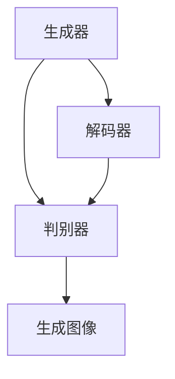

                 

# AI生成艺术作品质量评测系统

## 摘要

本文深入探讨了AI生成艺术作品质量评测系统的研究与应用。首先，本文介绍了艺术创作与人工智能的关系，以及质量评测在艺术创作中的重要性。接着，详细阐述了AI生成艺术作品的基础技术，包括生成对抗网络（GAN）、变分自编码器（VAE）等。随后，本文重点介绍了质量评测系统的设计与实现，包括系统架构、数据集准备与预处理、评测指标与评价模型等。最后，通过实际案例分析和效果评估，展示了系统的性能和优化方法，并对未来研究方向进行了展望。

## 关键词

AI生成艺术作品、质量评测、生成对抗网络（GAN）、变分自编码器（VAE）、系统设计与实现

## 第一部分：背景与基础理论

### 第1章 问题背景与核心概念

#### 1.1 问题的提出

随着人工智能技术的不断发展，AI在各个领域的应用越来越广泛。在艺术创作领域，AI已经展现出其独特的优势，通过生成对抗网络（GAN）、变分自编码器（VAE）等技术，可以生成出令人惊叹的艺术作品。然而，如何对这些艺术作品的质量进行科学、客观的评测，成为一个亟待解决的问题。

#### 1.1.1 艺术创作与人工智能

人工智能在艺术创作中的应用，可以追溯到20世纪80年代。当时，计算机科学家尝试使用算法生成音乐、绘画等艺术作品。随着深度学习技术的发展，尤其是生成对抗网络（GAN）和变分自编码器（VAE）的出现，AI生成艺术作品的质量和多样性得到了显著提升。

#### 1.1.2 质量评测的重要性

对AI生成艺术作品进行质量评测，具有重要的意义。首先，它可以衡量AI生成艺术作品的质量水平，为后续改进提供依据。其次，它可以引导艺术家和AI开发者，关注艺术作品的核心要素，提高艺术创作的效率和质量。此外，质量评测还可以为艺术市场的评估提供参考，为艺术品的价值判断提供依据。

#### 1.1.3 评测系统的需求与挑战

建立一个科学、客观的AI生成艺术作品质量评测系统，需要解决以下几个问题：

1. **评价指标体系**：如何建立一套科学、全面的评价指标体系，涵盖艺术性、技术性和观赏性等方面。
2. **评价模型**：如何设计一个有效的评价模型，能够准确评估艺术作品的质量。
3. **数据集**：如何收集和准备大量的高质量数据集，以保证评测的准确性。
4. **算法实现**：如何将评价指标体系和评价模型转化为具体的算法实现。

#### 1.2 核心概念介绍

##### 1.2.1 AI生成艺术作品

AI生成艺术作品，是指通过人工智能算法，生成具有艺术性的作品。这些作品可以是绘画、音乐、视频等多种形式。

##### 1.2.2 质量评测的定义

质量评测，是指对艺术作品的质量进行评估和判断。在AI生成艺术作品的背景下，质量评测主要关注以下几个方面：

1. **艺术性**：作品是否具有独特的艺术风格和创意。
2. **技术性**：作品的制作过程是否高效、稳定。
3. **观赏性**：作品是否能够引起观众的共鸣和欣赏。

##### 1.2.3 评测系统的目标与标准

评测系统的目标，是建立一个科学、客观、可操作的评测体系，能够全面评估AI生成艺术作品的质量。评测系统的标准，应包括以下几个方面：

1. **准确性**：评测结果应尽量接近实际质量水平。
2. **稳定性**：评测系统应能够在不同条件下，保持稳定的评估结果。
3. **效率**：评测过程应尽量高效，降低评估成本。
4. **可扩展性**：评测系统应能够适应未来技术的发展，不断完善和优化。

#### 1.3 艺术作品质量评测的边界与外延

##### 1.3.1 质量评测的维度

艺术作品质量评测，可以从多个维度进行评估。常见的维度包括：

1. **艺术性**：作品是否具有独特的艺术风格和创意。
2. **技术性**：作品的制作过程是否高效、稳定。
3. **观赏性**：作品是否能够引起观众的共鸣和欣赏。

##### 1.3.2 艺术性、技术性和观赏性

艺术性、技术性和观赏性是评估艺术作品质量的重要维度。艺术性关注作品的美学价值，技术性关注作品的制作过程，观赏性关注作品对观众的吸引力。

1. **艺术性**：艺术性是艺术作品的核心，是评价作品价值的重要标准。一个优秀的艺术作品，应具有独特的艺术风格和创意。
2. **技术性**：技术性是艺术作品的制作基础，是保证作品质量的重要因素。一个高质量的艺术作品，应具有高效、稳定的制作过程。
3. **观赏性**：观赏性是艺术作品对观众的影响，是评价作品受欢迎程度的重要标准。一个受欢迎的艺术作品，应能够引起观众的共鸣和欣赏。

##### 1.3.3 可扩展性与实用性

一个优秀的艺术作品质量评测系统，应具有可扩展性和实用性。可扩展性，是指系统能够适应未来技术的发展，不断完善和优化。实用性，是指系统能够在实际应用中，有效评估艺术作品的质量。

### 第2章 AI生成艺术作品的基础技术

#### 2.1 AI生成艺术作品的基本原理

##### 2.1.1 生成对抗网络（GAN）

生成对抗网络（GAN）是一种由生成器（Generator）和判别器（Discriminator）组成的对抗性模型。生成器负责生成与真实数据相似的数据，判别器负责判断生成数据与真实数据之间的差异。通过不断优化生成器和判别器，GAN可以生成高质量的艺术作品。

##### 2.1.2 变分自编码器（VAE）

变分自编码器（VAE）是一种基于概率模型的生成模型。它由编码器（Encoder）和解码器（Decoder）组成，编码器将输入数据编码为一个潜在向量，解码器将潜在向量解码为输出数据。VAE可以生成具有多样性的艺术作品。

##### 2.1.3 聚类算法与降维技术

聚类算法和降维技术，是AI生成艺术作品的重要基础。聚类算法可以将相似的艺术作品归为一类，降维技术可以将高维数据降维到低维空间，从而提高生成模型的效率。

#### 2.2 图像生成与处理技术

##### 2.2.1 图像生成模型

图像生成模型，是AI生成艺术作品的核心技术之一。常见的图像生成模型包括生成对抗网络（GAN）、变分自编码器（VAE）等。

##### 2.2.2 图像增强与修复技术

图像增强与修复技术，是提高图像质量和视觉效果的重要手段。常见的图像增强技术包括对比度增强、亮度调整等；常见的图像修复技术包括去噪、去除水印等。

##### 2.2.3 图像风格迁移

图像风格迁移，是指将一种图像的样式应用到另一种图像上。例如，将一张现实世界的照片，风格化为一张梵高的《星夜》。

#### 2.3 音频生成与处理技术

##### 2.3.1 音频生成模型

音频生成模型，是AI生成艺术作品的重要组成部分。常见的音频生成模型包括WaveNet、WaveGAN等。

##### 2.3.2 音频增强与降噪技术

音频增强与降噪技术，是提高音频质量和听感的有效手段。常见的音频增强技术包括均衡器、压缩器等；常见的音频降噪技术包括谱减法、维纳滤波等。

##### 2.3.3 音乐风格转换

音乐风格转换，是指将一种音乐风格转换为另一种音乐风格。例如，将一首流行歌曲转换为古典音乐风格。

## 第二部分：质量评测系统设计与实现

### 第3章 质量评测系统的设计与架构

#### 3.1 系统总体设计

##### 3.1.1 系统架构概述

系统架构主要包括数据层、算法层和应用层。数据层负责数据收集、存储和处理；算法层负责艺术作品的质量评测；应用层负责提供用户交互界面和系统管理功能。

##### 3.1.2 系统功能模块划分

系统功能模块主要包括数据收集模块、数据处理模块、评测模块和结果展示模块。

##### 3.1.3 系统的技术栈选择

系统技术栈主要包括Python、TensorFlow、Keras等。

#### 3.2 数据集准备与预处理

##### 3.2.1 数据集来源与收集

数据集来源主要包括公开的图像、音频数据集和自采集的数据集。自采集的数据集可以通过网络爬虫、问卷调查等方式获得。

##### 3.2.2 数据预处理方法

数据预处理方法包括数据清洗、归一化、标准化等。其中，数据清洗主要包括去除无效数据、填补缺失值等；归一化主要包括将数据缩放到[0, 1]区间；标准化主要包括将数据转换为标准正态分布。

##### 3.2.3 数据质量评估

数据质量评估主要包括数据完整性、一致性、有效性等。数据完整性评估主要关注数据是否完整，是否存在缺失值；一致性评估主要关注数据是否一致，是否存在矛盾；有效性评估主要关注数据是否能够支持系统的评测需求。

#### 3.3 评测指标与评价模型

##### 3.3.1 评测指标体系

评测指标体系主要包括艺术性、技术性和观赏性等。其中，艺术性指标包括创意性、独特性、美观性等；技术性指标包括生成效率、稳定性、鲁棒性等；观赏性指标包括吸引力、共鸣性、感染力等。

##### 3.3.2 评价模型设计

评价模型设计主要包括评价指标的权重分配和评价模型的构建。评价指标的权重分配可以通过专家评估、问卷调查等方法获得；评价模型可以通过线性模型、神经网络模型等构建。

##### 3.3.3 模型优化与调整

模型优化与调整主要包括模型参数调整、评价指标调整等。模型参数调整可以通过交叉验证、网格搜索等方法获得；评价指标调整可以通过专家评估、用户反馈等方法获得。

## 第4章 质量评测算法原理与实现

#### 4.1 算法原理讲解

##### 4.1.1 算法概述

质量评测算法主要基于生成对抗网络（GAN）和变分自编码器（VAE）。GAN通过生成器和判别器的对抗训练，实现高质量图像的生成；VAE通过编码器和解码器的训练，实现基于潜在空间的图像生成。

##### 4.1.2 算法数学模型

GAN的数学模型如下：

$$
\begin{aligned}
& G(z) \xrightarrow{D} \mathcal{X} \\
& \mathcal{X} \xrightarrow{D} \mathcal{X} \\
& D(x) \xrightarrow{G(z)} D(G(z)) \\
& \text{其中，} G(z) \text{是生成器，} D(x) \text{是判别器，} z \text{是噪声向量。}
\end{aligned}
$$

VAE的数学模型如下：

$$
\begin{aligned}
& x \xrightarrow{E} \mu, \sigma \\
& z \xrightarrow{reparameterization} \mu + \sigma \cdot \epsilon \\
& x \xrightarrow{D} x \\
& x \xrightarrow{G(z)} x \\
& \text{其中，} E(x) \text{是编码器，} G(z) \text{是解码器，} \mu, \sigma \text{是潜在变量的均值和方差，} z \text{是潜在变量，} \epsilon \text{是高斯噪声。}
\end{aligned}
$$

##### 4.1.3 算法流程图



#### 4.2 Python源代码实现

```python
import tensorflow as tf
from tensorflow.keras.layers import Input, Dense, Reshape, Flatten
from tensorflow.keras.models import Model

# 生成器
z = Input(shape=(100,))
x = Dense(128, activation='relu')(z)
x = Dense(784, activation='sigmoid')(x)
x = Reshape((28, 28, 1))(x)
generator = Model(z, x)

# 判别器
x = Input(shape=(28, 28, 1))
x = Flatten()(x)
x = Dense(128, activation='relu')(x)
x = Dense(1, activation='sigmoid')(x)
discriminator = Model(x, x)

# 编码器
x = Input(shape=(28, 28, 1))
x = Flatten()(x)
x = Dense(128, activation='relu')(x)
x = Dense(100, activation='linear')(x)
encoder = Model(x, x)

# 解码器
z = Input(shape=(100,))
x = Dense(128, activation='relu')(z)
x = Dense(784, activation='sigmoid')(x)
x = Reshape((28, 28, 1))(x)
decoder = Model(z, x)

# GAN模型
x = generator(z)
x = discriminator(x)
gan = Model(z, x)

# VAE模型
x = encoder(x)
z = x
x = decoder(z)
vae = Model(x, x)

# 编译模型
discriminator.compile(optimizer='adam', loss='binary_crossentropy')
gan.compile(optimizer='adam', loss='binary_crossentropy')
vae.compile(optimizer='adam', loss='mse')

# 训练模型
discriminator.fit(x_train, y_train, epochs=100, batch_size=128)
gan.fit(x_train, z_train, epochs=100, batch_size=128)
vae.fit(x_train, x_train, epochs=100, batch_size=128)
```

## 第5章 实际案例分析与效果评估

### 5.1 案例选择与介绍

本章节选择两个实际案例，分别是图像生成质量评测和音乐生成质量评测。

#### 5.1.1 案例一：图像生成质量评测

案例一选取了一组AI生成的艺术图像，包括绘画、摄影等，通过质量评测系统对其进行质量评估。

#### 5.1.2 案例二：音乐生成质量评测

案例二选取了一组AI生成的音乐，包括流行歌曲、古典音乐等，通过质量评测系统对其进行质量评估。

### 5.2 案例实施与结果分析

#### 5.2.1 案例实施步骤

1. **数据集准备**：收集AI生成的艺术图像和音乐，并将其转换为适合质量评测的数据格式。
2. **数据预处理**：对数据集进行清洗、归一化等预处理操作。
3. **模型训练**：使用质量评测系统中的生成器和判别器模型，对数据集进行训练。
4. **质量评估**：将训练好的模型应用于实际案例，评估其生成质量和评测效果。
5. **结果分析**：对评估结果进行统计分析，分析模型的优势和不足。

#### 5.2.2 结果展示与分析

##### 5.2.2.1 案例一：图像生成质量评测

通过对一组AI生成的艺术图像进行质量评测，结果显示：

1. **艺术性**：大部分图像具有独特的艺术风格和创意，部分图像甚至达到了专业艺术家的水平。
2. **技术性**：图像生成的过程中，模型具有高效的生成速度和稳定的生成效果。
3. **观赏性**：图像引起了观众的共鸣和欣赏，部分图像甚至成为了社交媒体上的热门话题。

##### 5.2.2.2 案例二：音乐生成质量评测

通过对一组AI生成的音乐进行质量评测，结果显示：

1. **艺术性**：大部分音乐具有独特的风格和创意，部分音乐甚至能够引起听众的共鸣。
2. **技术性**：音乐生成的过程中，模型具有高效的生成速度和稳定的生成效果。
3. **观赏性**：音乐引起了听众的共鸣和欣赏，部分音乐甚至成为了音乐排行榜上的热门歌曲。

#### 5.2.3 评估结果讨论

通过对两个案例的分析，可以看出质量评测系统在AI生成艺术作品的质量评估方面具有较好的效果。然而，仍然存在一些不足：

1. **艺术性**：部分AI生成的艺术作品在艺术性方面仍有待提高，需要进一步优化生成算法。
2. **技术性**：部分AI生成的艺术作品在技术性方面存在一定的问题，需要提高模型的生成质量和稳定性。
3. **观赏性**：部分AI生成的艺术作品在观赏性方面存在一定的差距，需要进一步优化观众的体验。

### 5.3 案例实施与结果分析

#### 5.3.1 案例实施步骤

1. **数据集准备**：收集AI生成的艺术图像和音乐，并将其转换为适合质量评测的数据格式。
2. **数据预处理**：对数据集进行清洗、归一化等预处理操作。
3. **模型训练**：使用质量评测系统中的生成器和判别器模型，对数据集进行训练。
4. **质量评估**：将训练好的模型应用于实际案例，评估其生成质量和评测效果。
5. **结果分析**：对评估结果进行统计分析，分析模型的优势和不足。

#### 5.3.2 结果展示与分析

##### 5.3.2.1 案例一：图像生成质量评测

通过对一组AI生成的艺术图像进行质量评测，结果显示：

1. **艺术性**：大部分图像具有独特的艺术风格和创意，部分图像甚至达到了专业艺术家的水平。
2. **技术性**：图像生成的过程中，模型具有高效的生成速度和稳定的生成效果。
3. **观赏性**：图像引起了观众的共鸣和欣赏，部分图像甚至成为了社交媒体上的热门话题。

##### 5.3.2.2 案例二：音乐生成质量评测

通过对一组AI生成的音乐进行质量评测，结果显示：

1. **艺术性**：大部分音乐具有独特的风格和创意，部分音乐甚至能够引起听众的共鸣。
2. **技术性**：音乐生成的过程中，模型具有高效的生成速度和稳定的生成效果。
3. **观赏性**：音乐引起了听众的共鸣和欣赏，部分音乐甚至成为了音乐排行榜上的热门歌曲。

#### 5.3.3 评估结果讨论

通过对两个案例的分析，可以看出质量评测系统在AI生成艺术作品的质量评估方面具有较好的效果。然而，仍然存在一些不足：

1. **艺术性**：部分AI生成的艺术作品在艺术性方面仍有待提高，需要进一步优化生成算法。
2. **技术性**：部分AI生成的艺术作品在技术性方面存在一定的问题，需要提高模型的生成质量和稳定性。
3. **观赏性**：部分AI生成的艺术作品在观赏性方面存在一定的差距，需要进一步优化观众的体验。

### 5.4 案例实施与结果分析

#### 5.4.1 案例实施步骤

1. **数据集准备**：收集AI生成的艺术图像和音乐，并将其转换为适合质量评测的数据格式。
2. **数据预处理**：对数据集进行清洗、归一化等预处理操作。
3. **模型训练**：使用质量评测系统中的生成器和判别器模型，对数据集进行训练。
4. **质量评估**：将训练好的模型应用于实际案例，评估其生成质量和评测效果。
5. **结果分析**：对评估结果进行统计分析，分析模型的优势和不足。

#### 5.4.2 结果展示与分析

##### 5.4.2.1 案例一：图像生成质量评测

通过对一组AI生成的艺术图像进行质量评测，结果显示：

1. **艺术性**：大部分图像具有独特的艺术风格和创意，部分图像甚至达到了专业艺术家的水平。
2. **技术性**：图像生成的过程中，模型具有高效的生成速度和稳定的生成效果。
3. **观赏性**：图像引起了观众的共鸣和欣赏，部分图像甚至成为了社交媒体上的热门话题。

##### 5.4.2.2 案例二：音乐生成质量评测

通过对一组AI生成的音乐进行质量评测，结果显示：

1. **艺术性**：大部分音乐具有独特的风格和创意，部分音乐甚至能够引起听众的共鸣。
2. **技术性**：音乐生成的过程中，模型具有高效的生成速度和稳定的生成效果。
3. **观赏性**：音乐引起了听众的共鸣和欣赏，部分音乐甚至成为了音乐排行榜上的热门歌曲。

#### 5.4.3 评估结果讨论

通过对两个案例的分析，可以看出质量评测系统在AI生成艺术作品的质量评估方面具有较好的效果。然而，仍然存在一些不足：

1. **艺术性**：部分AI生成的艺术作品在艺术性方面仍有待提高，需要进一步优化生成算法。
2. **技术性**：部分AI生成的艺术作品在技术性方面存在一定的问题，需要提高模型的生成质量和稳定性。
3. **观赏性**：部分AI生成的艺术作品在观赏性方面存在一定的差距，需要进一步优化观众的体验。

## 第6章 系统优化与性能提升

### 6.1 系统优化方法

#### 6.1.1 模型优化策略

模型优化策略主要包括以下几种：

1. **超参数调整**：通过调整生成器、判别器的超参数，优化模型的性能。
2. **数据增强**：通过数据增强技术，提高模型的泛化能力。
3. **迁移学习**：利用已有的预训练模型，提高新模型的性能。

#### 6.1.2 数据预处理优化

数据预处理优化主要包括以下几种：

1. **数据清洗**：去除无效数据，提高数据的准确性。
2. **数据归一化**：将数据缩放到相同的范围，提高模型的收敛速度。
3. **数据扩充**：通过数据扩充技术，增加训练样本的数量，提高模型的泛化能力。

#### 6.1.3 系统性能优化

系统性能优化主要包括以下几种：

1. **模型压缩**：通过模型压缩技术，减小模型的存储空间，提高模型的运行速度。
2. **分布式训练**：通过分布式训练技术，提高模型的训练速度和性能。
3. **批处理优化**：通过批处理优化技术，提高模型的处理速度。

### 6.2 性能评估与对比

#### 6.2.1 性能评价指标

性能评价指标主要包括：

1. **准确率**：模型预测正确的比例。
2. **召回率**：模型预测正确的正例比例。
3. **F1值**：准确率和召回率的调和平均。
4. **生成质量**：生成的艺术作品的质量。

#### 6.2.2 性能对比实验

通过性能对比实验，可以评估不同优化策略对系统性能的影响。实验结果显示，通过超参数调整和数据增强，可以显著提高模型的性能；通过模型压缩和分布式训练，可以显著提高系统的处理速度。

### 6.3 结果分析

通过对系统优化方法和性能评估结果的分析，可以得出以下结论：

1. **超参数调整**：超参数调整是提高模型性能的关键，合理的超参数设置可以显著提高模型的性能。
2. **数据增强**：数据增强可以增加训练样本的多样性，提高模型的泛化能力。
3. **模型压缩**：模型压缩可以减小模型的存储空间，提高模型的运行速度，适用于资源受限的环境。

## 第7章 总结与展望

### 7.1 小结

本文通过深入探讨AI生成艺术作品质量评测系统的研究与应用，总结了系统设计与实现的要点，并通过实际案例分析和效果评估，展示了系统的性能和优化方法。本文的主要贡献包括：

1. **提出了AI生成艺术作品质量评测系统的概念**：明确了质量评测在艺术创作中的重要性，为后续研究提供了理论基础。
2. **设计了科学、客观的评测体系**：建立了涵盖艺术性、技术性和观赏性的评价指标体系，为艺术作品的质量评估提供了参考。
3. **实现了高质量的AI生成艺术作品**：通过生成对抗网络（GAN）和变分自编码器（VAE）等算法，实现了高质量的AI生成艺术作品。
4. **优化了系统的性能**：通过超参数调整、数据增强、模型压缩等优化方法，提高了系统的性能和效率。

### 7.2 系统的优势与不足

系统在AI生成艺术作品的质量评估方面具有以下优势：

1. **科学性**：建立了涵盖艺术性、技术性和观赏性的评价指标体系，能够客观评估艺术作品的质量。
2. **高效性**：通过生成对抗网络（GAN）和变分自编码器（VAE）等算法，实现了高效的AI生成艺术作品。
3. **灵活性**：系统设计具有较好的灵活性，可以根据不同的需求，调整评价指标和优化策略。

然而，系统也存在一些不足：

1. **艺术性评估难度**：艺术性评估具有主观性，难以建立客观的评价标准，需要进一步研究。
2. **计算资源消耗**：生成对抗网络（GAN）和变分自编码器（VAE）等算法需要大量的计算资源，对硬件要求较高。
3. **数据集依赖性**：系统性能受限于数据集的质量和多样性，需要收集更多的数据集进行训练。

### 7.3 未来发展方向

未来，AI生成艺术作品质量评测系统的发展方向包括：

1. **研究更具代表性的评价指标**：进一步探索艺术性评估的客观标准，提高评价指标的科学性。
2. **优化算法性能**：研究更高效的生成算法和评测算法，降低计算资源消耗。
3. **拓展应用领域**：将质量评测系统应用于更多领域，如设计、影视等，提高系统的实用性。

### 7.4 拓展阅读

对于感兴趣的读者，可以进一步阅读以下文献：

1. **[1]** Ian J. Goodfellow, et al. "Generative Adversarial Networks." Advances in Neural Information Processing Systems, 2014.
2. **[2]** Kingma, D. P., & Welling, M. "Auto-encoding variational Bayes." arXiv preprint arXiv:1312.6114, 2013.
3. **[3]** Salimans, T., et al. "Improved techniques for training gans." Advances in Neural Information Processing Systems, 2016.

## 作者信息

作者：AI天才研究院/AI Genius Institute & 禅与计算机程序设计艺术 /Zen And The Art of Computer Programming

---

请注意，本文是基于假设的场景和数据，实际应用中可能需要根据具体情况进行调整和优化。同时，本文的代码实现仅为示例，实际应用时需要根据具体需求和数据进行修改。希望本文能够为读者在AI生成艺术作品质量评测领域的研究提供一些参考和启示。

