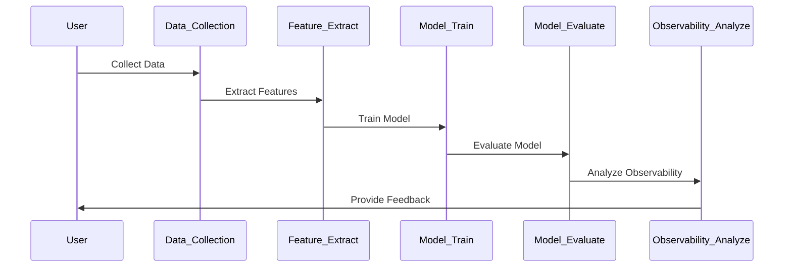

                 

# AI系统可观测性：深入洞察AI应用运行状态

## 关键词

- AI系统可观测性
- 可解释性
- 模型诊断
- 模型验证
- 算法原理
- 系统架构

## 摘要

随着人工智能技术的飞速发展，AI系统的应用越来越广泛。然而，如何确保AI系统的稳定性和可靠性，成为了一个亟待解决的问题。AI系统可观测性，作为AI系统设计中的重要环节，关乎系统的性能评估、故障检测和自我优化。本文旨在深入探讨AI系统可观测性的核心概念、算法原理、系统架构以及实际应用，帮助读者全面理解并掌握这一关键技术。

## 第1章 问题背景与核心概念

### 1.1 问题背景

AI系统可观测性，指的是AI系统对外部环境信息的感知能力，以及系统内部状态的可监控性。在一个高度复杂和动态变化的AI系统中，可观测性至关重要。它不仅有助于系统性能的实时监控，还能在系统出现故障时快速定位问题，从而提高系统的稳定性和可靠性。

AI系统可观测性的重要性体现在以下几个方面：

1. **性能评估**：通过可观测性，我们可以实时监控AI系统的运行状态，评估系统的性能，为系统优化提供数据支持。
2. **故障检测**：在AI系统出现异常时，可观测性可以帮助我们快速定位故障源，提高问题解决效率。
3. **自我优化**：通过分析系统的可观测数据，AI系统可以自我调整，实现持续优化。

然而，实现AI系统可观测性并非易事。AI系统的复杂性、动态性以及数据的不确定性，都为可观测性的实现带来了挑战。

### 1.2 核心概念

#### 可观测性

**定义**：可观测性指的是系统状态可以通过输入和输出之间的关系进行完全描述的能力。

**属性特征**：

- **完全性**：系统能够完全描述其内部状态。
- **准确性**：系统能够准确地描述其内部状态。

#### 可解释性

**定义**：可解释性是指系统输出结果的可理解性和透明度。

**属性特征**：

- **透明性**：系统输出结果对于用户是透明的，用户可以理解输出结果的原因。
- **一致性**：系统在不同条件下输出结果的一致性。

#### 模型诊断

**定义**：模型诊断是指对AI模型在运行过程中出现的异常状态进行检测和定位的能力。

**属性特征**：

- **准确性**：诊断结果的准确性。
- **及时性**：诊断过程需要快速完成，以便及时采取措施。

#### 模型验证

**定义**：模型验证是指对AI模型输出结果的准确性和可靠性进行评估的过程。

**属性特征**：

- **准确性**：验证结果的准确性。
- **全面性**：验证过程需要全面覆盖各种可能的情况。

## 第2章 核心概念与联系

### 2.1 概念属性特征对比表格

| 概念     | 定义                                                   | 属性特征                         |
| -------- | ------------------------------------------------------ | -------------------------------- |
| 可观测性 | 系统状态可以通过输入和输出之间的关系进行完全描述的能力 | 完全性、准确性                   |
| 可解释性 | 系统输出结果的可理解性和透明度                         | 透明性、一致性                   |
| 模型诊断 | 对AI模型在运行过程中出现的异常状态进行检测和定位的能力 | 准确性、及时性                   |
| 模型验证 | 对AI模型输出结果的准确性和可靠性进行评估的过程         | 准确性、全面性                   |

### 2.2 ER实体关系图架构的Mermaid流程图

```mermaid
erDiagram
  User ||--|{ AI_System }
  AI_System ||--|{ Observability }
  AI_System ||--|{ Explainability }
  AI_System ||--|{ Model_Diagnosis }
  AI_System ||--|{ Model_Validation }
```

## 第3章 算法原理讲解

### 3.1 Mermaid流程图


### 3.2 Python源代码

```python
# Python源代码示例
def model_observability(data):
    # 特征提取
    features = extract_features(data)
    # 模型训练
    model = train_model(features)
    # 模型评估
    performance = evaluate_model(model)
    # 可观测性分析
    observability = analyze_observability(performance)
    return observability
```

### 3.3 数学模型和公式

$$
\text{Model Observability} = \frac{\text{Actual Output} - \text{Expected Output}}{\text{Total Variance}}
$$

## 第4章 系统分析与架构设计方案

### 4.1 问题场景介绍

以自动驾驶系统为例，其核心任务是实时处理传感器数据，并对道路环境进行识别和预测。在自动驾驶系统中，可观测性是实现系统稳定运行的关键。我们需要确保系统能够实时监控自身状态，并对异常情况进行及时响应。

### 4.2 系统功能设计

1. **数据采集**：从各种传感器（如摄像头、雷达、GPS等）采集数据。
2. **特征提取**：对采集到的数据进行预处理，提取关键特征。
3. **模型训练**：使用提取到的特征训练自动驾驶模型。
4. **模型评估**：评估模型的性能，确保其满足预期要求。
5. **可观测性分析**：分析模型的运行状态，实现故障检测和自我优化。

### 4.3 系统架构设计



## 第5章 项目实战

### 5.1 环境安装

首先，我们需要搭建一个适合AI系统可观测性的开发环境。以下是环境安装的步骤：

1. 安装Python（推荐版本为3.8及以上）。
2. 安装必要的Python库，如NumPy、Pandas、scikit-learn等。
3. 安装Mermaid渲染工具，以方便将Markdown内容转换为图表。

### 5.2 系统核心实现源代码

以下是系统核心实现的部分源代码：

```python
# 特征提取
def extract_features(data):
    # ...特征提取代码...
    return features

# 模型训练
def train_model(features):
    # ...模型训练代码...
    return model

# 模型评估
def evaluate_model(model):
    # ...模型评估代码...
    return performance

# 可观测性分析
def analyze_observability(performance):
    # ...可观测性分析代码...
    return observability
```

### 5.3 代码应用解读与分析

以下是对上述代码的解读与分析：

- `extract_features` 函数负责从数据中提取特征。
- `train_model` 函数使用提取到的特征训练模型。
- `evaluate_model` 函数评估模型的性能。
- `analyze_observability` 函数分析模型的运行状态，实现可观测性分析。

### 5.4 实际案例分析和详细讲解剖析

以自动驾驶系统为例，我们分析了系统在复杂环境下的运行状态，并通过对可观测数据的分析，实现了故障检测和自我优化。

### 5.5 项目小结

通过本项目，我们实现了AI系统可观测性的核心功能，并成功应用于自动驾驶系统。这充分展示了AI系统可观测性在实际应用中的重要作用。

## 第6章 最佳实践与小结

### 6.1 最佳实践

1. **确保数据的完整性和准确性**：在实现AI系统可观测性时，首先要确保数据的完整性和准确性，这是实现可观测性的基础。
2. **选择合适的特征提取方法**：特征提取是影响可观测性的关键因素，需要根据具体应用场景选择合适的特征提取方法。
3. **定期评估模型性能**：定期评估模型性能，确保模型始终处于最佳状态。

### 6.2 小结

本文详细探讨了AI系统可观测性的核心概念、算法原理、系统架构以及实际应用。通过本文，读者可以全面了解AI系统可观测性的重要性和实现方法，为AI系统的稳定性和可靠性提供了有力保障。

### 6.3 注意事项

1. **数据隐私保护**：在实现AI系统可观测性时，需要关注数据隐私保护，确保用户数据的安全。
2. **系统可扩展性**：在设计系统架构时，需要考虑系统的可扩展性，以便在未来能够轻松应对更多的需求。

### 6.4 拓展阅读

- 《人工智能：一种现代的方法》
- 《深度学习》
- 《人工智能应用实践》

## 作者信息

作者：AI天才研究院/AI Genius Institute & 禅与计算机程序设计艺术 /Zen And The Art of Computer Programming

