                 

# AI辅助的创意写作：人机协作的文学创作

## 关键词
- AI辅助写作
- 人机协作
- 文学创作
- 生成模型
- 自然语言处理
- 伦理问题

## 摘要
本文探讨了人工智能（AI）辅助下的创意写作，特别是人机协作在文学创作中的应用。我们将一步步分析AI辅助创意写作的兴起、核心技术、应用实践及未来趋势。通过深入探讨AI在故事创作、诗歌与歌词创作、剧本创作中的应用，以及面临的伦理问题，本文旨在展示AI辅助创意写作的潜力和挑战，并提出未来展望。

## 第一部分：背景介绍与核心概念

### 第1章：AI辅助创意写作的兴起

#### 1.1 问题背景
文学创作是一个复杂而充满创造性的过程，它不仅需要作者具备深厚的文学素养和丰富的想象力，还需要面对无尽的创意枯竭和结构上的挑战。在信息爆炸的时代，读者对文学作品的需求日益多样化，如何快速、高效地创作出符合读者期待的作品成为了一个难题。

#### 1.1.1 文学创作的挑战
- **创意枯竭**：长期的写作可能导致作者出现灵感枯竭的现象。
- **结构复杂**：构建一个完整、连贯的故事情节需要大量的时间和精力。
- **内容丰富**：保持作品内容的丰富性和原创性是创作的核心问题。

#### 1.1.2 AI技术的崛起
随着AI技术的发展，尤其是在机器学习和自然语言处理领域的突破，AI开始有能力协助人类完成一些复杂的工作。AI能够在短时间内处理大量数据，生成结构化文本，这为AI辅助写作提供了可能。

#### 1.1.3 人机协作在文学创作中的应用
人机协作是将人类创造力和AI的计算能力相结合的一种新型写作方式。在这种模式中，AI可以作为写作助手，帮助作者构思情节、生成文本、优化内容，从而提高写作效率和质量。

#### 1.2 核心概念
AI辅助创意写作的定义是利用人工智能技术，如自然语言处理和机器学习，辅助人类进行文学创作的过程。

#### 1.2.1 AI辅助创意写作的定义
AI辅助创意写作指的是利用人工智能技术，如自然语言处理和机器学习，辅助人类进行文学创作的过程。这种写作方式旨在提高创作效率、拓宽创作领域、增强作品的表现力。

#### 1.2.2 人机协作的文学创作
人机协作的文学创作强调人类作者与AI系统之间的互动和合作，通过人机交互实现文学创作的创新和优化。

#### 1.2.3 人工智能在文学领域的应用边界
虽然AI在文学创作中展现了巨大的潜力，但其应用仍存在一定的边界。AI无法完全取代人类的创造性思维和情感表达，但可以在结构化文本生成、情节构思和文本优化等方面发挥重要作用。

#### 1.3 AI与文学创作的联系
AI与文学创作之间的联系主要体现在以下几个方面：
- **艺术创作能力**：AI能够生成具有艺术性的文本，如诗歌、小说等。
- **效率提升**：AI可以快速处理和分析大量文本数据，帮助作者进行创作和分析。
- **创意扩展**：AI可以为人类提供新的创意和灵感，拓宽创作视野。

#### 1.3.1 人工智能的艺术创作能力
AI的艺术创作能力主要体现在文本生成和图像创作方面。在文本生成方面，AI可以生成小说、诗歌等文学作品；在图像创作方面，AI可以生成绘画、设计等艺术作品。

#### 1.3.2 人工智能如何提高写作效率
AI可以通过以下方式提高写作效率：
- **自动文本生成**：AI可以快速生成初步的文本内容，为人类作者提供灵感。
- **文本分析**：AI可以对大量文本进行分析，帮助作者发现文本中的问题和不足。
- **文本优化**：AI可以根据作者的要求，对文本进行修改和优化，提高作品的质量。

#### 1.3.3 人机协作对文学创作的影响
人机协作对文学创作的影响主要体现在以下几个方面：
- **创新**：人机协作可以推动文学创作的创新，产生新的文学形式和表达方式。
- **多样化**：人机协作可以使文学作品更加多样化，满足不同读者的需求。
- **效率**：人机协作可以提高文学创作的效率，缩短创作周期。

#### 1.4 本章小结
本章介绍了AI辅助创意写作的背景和核心概念，分析了文学创作的挑战和AI技术的崛起，以及人机协作在文学创作中的应用。通过对AI与文学创作之间联系的探讨，我们看到了AI辅助创意写作的巨大潜力和前景。

### 第2章：AI辅助创意写作的核心技术

#### 2.1 人工智能基础
人工智能基础是理解AI辅助创意写作的关键。AI的核心技术主要包括机器学习、深度学习和自然语言处理。

#### 2.1.1 机器学习与深度学习
机器学习和深度学习是AI的两个核心组成部分。机器学习是通过数据驱动的方法，让计算机学会自主完成任务；深度学习是机器学习的一种特殊形式，它使用神经网络来模拟人类大脑的学习过程。

#### 2.1.2 自然语言处理技术
自然语言处理（NLP）是AI的一个重要分支，它专注于使计算机理解和生成人类语言。NLP技术包括文本分类、情感分析、命名实体识别、机器翻译等。

#### 2.1.3 生成模型与变换模型
生成模型和变换模型是AI在文本生成方面的核心技术。生成模型，如变分自编码器（VAE）和生成对抗网络（GAN），可以生成新的、新颖的文本内容；变换模型，如序列到序列（Seq2Seq）模型，可以用于文本的翻译和生成。

#### 2.2 文学创作相关算法
AI在文学创作中的应用需要特定的算法支持。以下是几个关键的文学创作相关算法：

#### 2.2.1 文本生成算法
文本生成算法是AI辅助创意写作的核心。它们包括基于规则的方法和基于数据的方法。基于规则的方法使用预定义的语法规则生成文本；基于数据的方法使用大量文本数据来训练模型，从而生成新的文本内容。

#### 2.2.2 故事自动生成
故事自动生成是AI辅助创意写作的一个具体应用。通过利用生成模型和变换模型，AI可以自动生成完整的故事情节，包括角色、情节和结局。

#### 2.2.3 情感分析与创意生成
情感分析是NLP的一个重要应用，它用于分析文本中的情感倾向。创意生成是通过情感分析和其他NLP技术，为文学作品注入更多的情感元素和创意。

#### 2.3 AI写作工具与平台
AI写作工具和平台为AI辅助创意写作提供了实际的应用场景。这些工具和平台通常包括文本生成、文本分析、文本优化等功能，帮助作者提高写作效率和质量。

#### 2.3.1 常见AI写作工具
常见的AI写作工具包括GPT-3、ChatGPT、自动文本生成工具等。这些工具利用AI技术，可以生成各种类型的文本，从新闻文章到小说，从歌词到剧本。

#### 2.3.2 人机协作平台的特点与应用
人机协作平台的特点是提供作者与AI之间的互动接口，让作者可以实时调整AI的输出，实现更精准的创作。这些平台广泛应用于写作、编辑、校对等环节。

#### 2.4 本章小结
本章介绍了AI辅助创意写作的核心技术，包括人工智能基础、文学创作相关算法以及AI写作工具与平台。通过对这些技术的深入理解，我们可以更好地利用AI辅助我们的文学创作。

## 第二部分：人机协作的文学创作实践

### 第3章：AI在故事创作中的应用

#### 3.1 故事构思与创意生成
故事构思是文学创作的重要环节。AI可以在这一环节中发挥重要作用，帮助作者快速构思和生成新的故事创意。

#### 3.1.1 故事元素的自动化组合
AI可以通过学习大量故事文本，自动组合故事元素，生成新的故事梗概。例如，AI可以生成一个包含角色、情节、冲突和结局的故事框架。

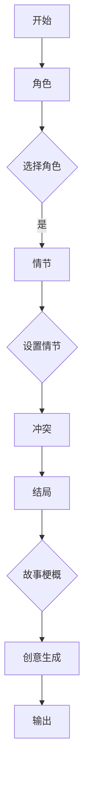

#### 3.1.2 创意思维的扩展
AI可以扩展作者的创意思维，为故事创作提供新的视角和灵感。例如，AI可以分析已有的故事，提出不同的情节发展和角色塑造方案。

#### 3.1.3 人机协作的故事草图
在故事构思阶段，人机协作可以发挥重要作用。作者可以利用AI提供的初始故事草图，进一步发展和完善故事情节。

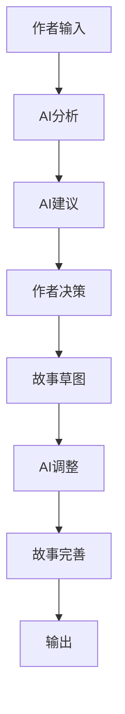

#### 3.2 故事情节与角色设计
情节和角色是故事的核心。AI可以帮助作者构建丰富、引人入胜的故事情节，并设计复杂、有深度的角色。

#### 3.2.1 情节自动生成
AI可以通过学习大量的故事文本，自动生成故事情节。例如，AI可以生成一个包含冲突、高潮和结局的故事情节。

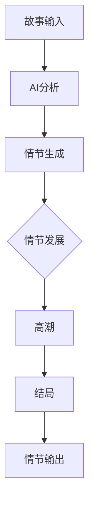

#### 3.2.2 角色个性化塑造
AI可以通过学习大量的文本数据，为角色设计提供个性化的建议。例如，AI可以生成一个角色的背景故事、性格特征和行为模式。

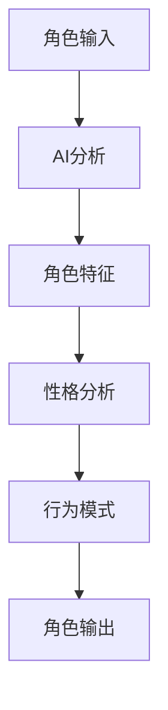

#### 3.2.3 人机交互中的角色发展
在人机交互中，AI可以根据作者的反馈和故事的发展，动态调整角色的行为和性格，实现更自然的角色发展。

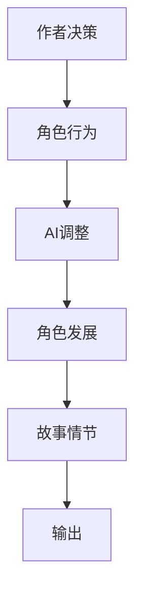

#### 3.3 故事撰写与修改
AI在故事撰写和修改中也发挥着重要作用。它可以帮助作者快速生成文本，并进行优化和改进。

#### 3.3.1 自动化写作与人类审稿
AI可以进行自动化写作，生成初步的文本内容，作者可以对AI的输出进行审稿和修改。

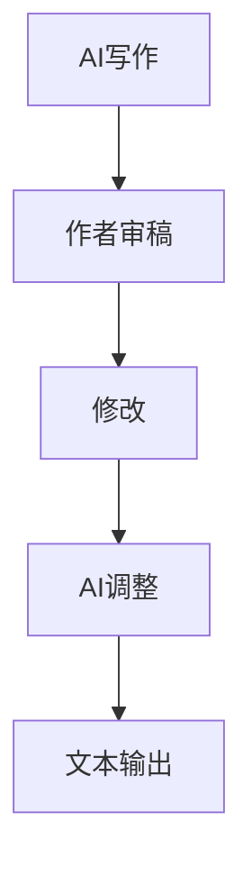

#### 3.3.2 人机协作的修订流程
在修订过程中，人机协作可以发挥重要作用。作者可以利用AI提供的建议和优化，对文本进行精细调整。

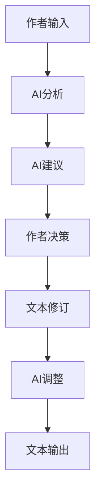

#### 3.3.3 故事质量的评估与提升
AI可以通过对故事内容、结构、语言风格等多方面的分析，评估故事的质量，并提出改进建议。

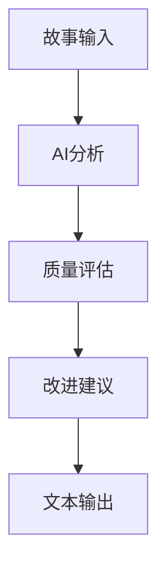

#### 3.4 本章小结
本章介绍了AI在故事创作中的应用，包括故事构思与创意生成、情节与角色设计、故事撰写与修改。通过人机协作，AI可以帮助作者快速生成故事，优化创作流程，提高作品质量。

### 第4章：AI在诗歌与歌词创作中的应用

#### 4.1 诗歌创作
AI在诗歌创作中的应用为文学创作带来了新的可能性。它可以通过生成模型和变换模型，生成新的、具有诗意的文本。

#### 4.1.1 诗意的自动生成
AI可以通过学习大量的诗歌文本，自动生成具有诗意的文本。例如，AI可以生成一首关于自然美景的诗。

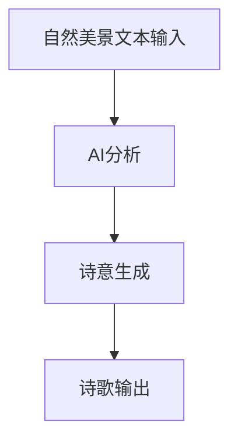

#### 4.1.2 诗歌结构的构建
AI可以帮助作者构建诗歌的结构，包括韵律、节奏和格式。例如，AI可以生成一首符合格律诗要求的诗歌。

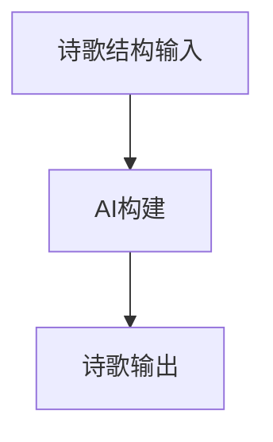

#### 4.1.3 人类诗人与AI的互动创作
人类诗人可以利用AI提供的初步诗歌文本，进行修改和润色，实现人机协作的诗歌创作。

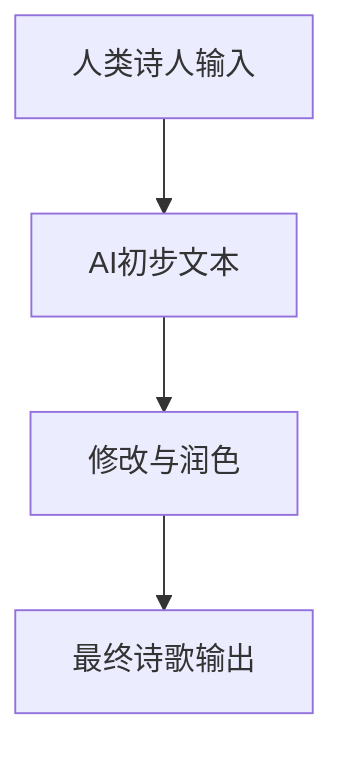

#### 4.2 歌词创作
AI在歌词创作中的应用也为音乐创作带来了新的可能性。它可以通过生成模型和变换模型，生成新的、具有音乐性的歌词。

#### 4.2.1 歌词内容的生成
AI可以通过学习大量的歌词文本，自动生成新的歌词内容。例如，AI可以生成一首关于爱情的歌词。

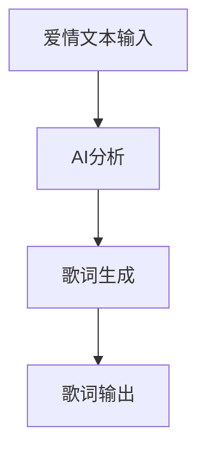

#### 4.2.2 歌曲旋律的创作辅助
AI可以通过音乐生成模型，为歌词创作提供旋律辅助。例如，AI可以生成一首与歌词内容相符的旋律。

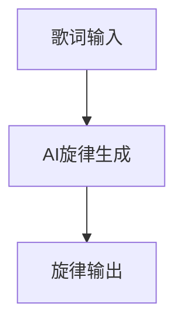

#### 4.2.3 人机协作的音乐文学创作
人机协作的音乐文学创作是指人类音乐家和AI系统之间的互动合作，共同创作音乐作品。

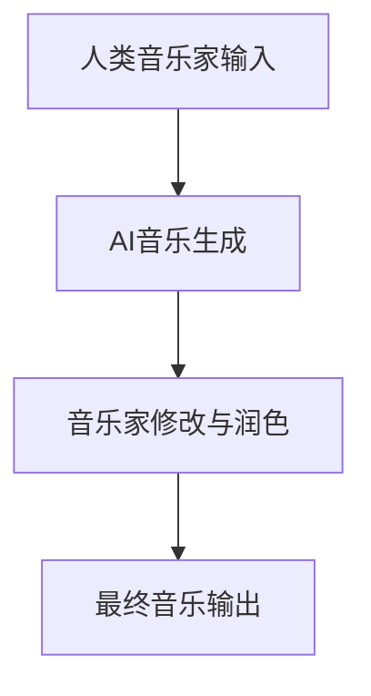

#### 4.3 本章小结
本章介绍了AI在诗歌与歌词创作中的应用，包括诗意的自动生成、诗歌结构的构建、人类诗人与AI的互动创作，以及歌词内容的生成、歌曲旋律的创作辅助和人机协作的音乐文学创作。通过AI的辅助，诗歌与歌词创作变得更加多样化和富有创意。

### 第5章：AI在剧本与剧本创作中的应用

#### 5.1 剧本创作
剧本创作是文学创作中的一项重要任务。AI可以在剧本创作中发挥重要作用，帮助作者快速生成剧本内容，并优化剧本结构。

#### 5.1.1 剧本结构的自动生成
AI可以通过学习大量的剧本文本，自动生成剧本的基本结构，包括场景、角色和情节。例如，AI可以生成一个剧本的框架。

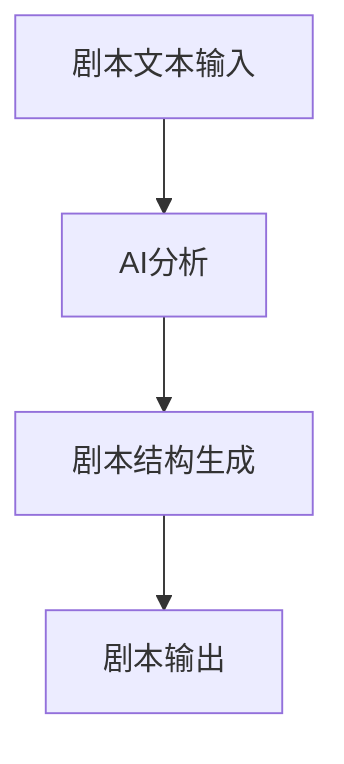

#### 5.1.2 角色对话的生成
AI可以帮助作者生成角色的对话，使其更符合角色的性格特点和故事情节。例如，AI可以生成一段角色的对话。

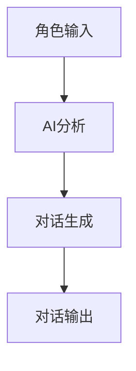

#### 5.1.3 创作团队的协作模式
在剧本创作过程中，创作团队可以利用AI进行协作。AI可以提供剧本建议，团队成员可以共同讨论和修改剧本内容。

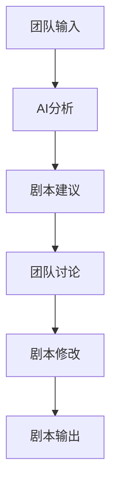

#### 5.2 剧本分析与改进
剧本分析是剧本创作的重要环节。AI可以通过对剧本内容、结构和语言风格的分析，提供改进建议，帮助作者优化剧本质量。

#### 5.2.1 剧本内容的评估
AI可以对剧本内容进行评估，包括情节连贯性、角色刻画和情感表达等方面。例如，AI可以评估一段剧本的情感表达。

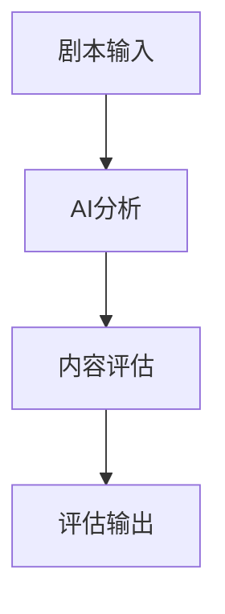

#### 5.2.2 剧本逻辑的优化
AI可以帮助作者优化剧本逻辑，确保情节的合理性和连贯性。例如，AI可以提出剧本中逻辑漏洞的修改建议。

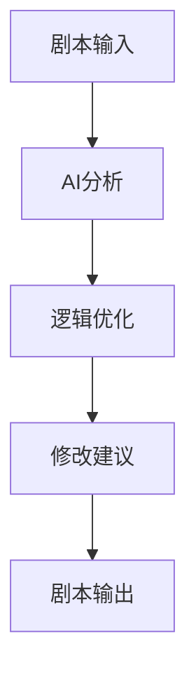

#### 5.2.3 人机协作的剧本修订
在人机协作的剧本修订过程中，作者可以利用AI提供的修改建议，对剧本进行细致的修订和润色。

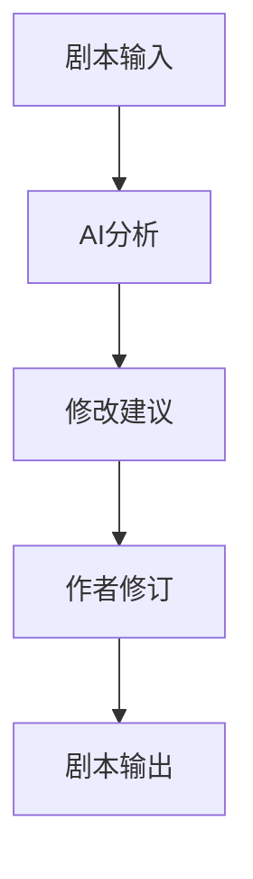

#### 5.3 本章小结
本章介绍了AI在剧本创作中的应用，包括剧本结构的自动生成、角色对话的生成、创作团队的协作模式，以及剧本分析与改进。通过人机协作，AI可以帮助作者高效地完成剧本创作，提高剧本质量。

### 第6章：AI辅助创意写作的未来趋势

#### 6.1 AI在文学创作中的未来发展
随着AI技术的不断进步，AI在文学创作中的应用将更加广泛和深入。未来的AI将具备更高的创造力、更丰富的情感表达和更细腻的叙事能力。

#### 6.1.1 技术突破与创作创新
技术突破将为AI辅助文学创作带来新的可能性。例如，深度学习和生成模型的发展将使AI生成的故事更加连贯、情感更加丰富。此外，AI的交互能力也将不断提升，实现更自然、更流畅的人机协作。

#### 6.1.2 人机协作模式的深化
人机协作模式将逐渐深化，AI将不仅仅是一个工具，而将成为创作过程中的伙伴。作者可以通过AI提供的实时反馈和建议，不断调整和优化作品，实现更高的创作效率和质量。

#### 6.1.3 文学教育与AI的结合
AI在文学教育中的应用也将越来越广泛。通过AI辅助教学，学生可以更快地掌握文学知识和技巧，提高写作能力。同时，AI可以为教师提供个性化教学建议，促进文学教育的创新发展。

#### 6.2 潜在挑战与伦理问题
尽管AI在文学创作中具有巨大的潜力，但也面临一些潜在的挑战和伦理问题。

#### 6.2.1 技术伦理与版权问题
AI生成的内容可能涉及版权问题，特别是在文学创作中。如何界定AI创作的版权归属，如何保护原创作者的利益，是亟待解决的问题。

#### 6.2.2 创意原创性与人类地位
随着AI在文学创作中的应用，人们开始担心人类创作者的地位和创意原创性。如何平衡AI辅助创作与人类原创性之间的关系，是未来需要探讨的问题。

#### 6.2.3 社会接受度与影响力
AI辅助文学创作的社会接受度和影响力也是一个重要问题。如何让公众理解和接受AI在文学创作中的应用，发挥其积极作用，是未来需要关注的方向。

#### 6.3 未来展望
未来，AI辅助创意写作将逐渐成为文学创作的重要组成部分。通过人机协作，作者可以更加高效地创作出丰富多彩的文学作品，满足读者的多样化需求。同时，AI在文学创作中的应用也将推动文学教育的创新发展，为文学事业的发展注入新的活力。

#### 6.4 本章小结
本章探讨了AI辅助创意写作的未来趋势，包括技术突破与创作创新、人机协作模式的深化以及文学教育与AI的结合。同时，也分析了AI在文学创作中面临的挑战和伦理问题。通过对未来展望的探讨，我们看到了AI辅助创意写作的巨大潜力和广阔前景。

## 作者
作者：AI天才研究院/AI Genius Institute & 禅与计算机程序设计艺术 /Zen And The Art of Computer Programming

## 完整性要求

### 核心内容包含：

- **背景介绍**：详细阐述了文学创作的挑战、AI技术的崛起以及人机协作在文学创作中的应用。
- **核心概念与联系**：深入探讨了AI辅助创意写作的定义、人机协作的文学创作、人工智能在文学领域的应用边界，以及AI与文学创作的联系。
- **算法原理讲解**：介绍了机器学习、深度学习、自然语言处理技术等核心算法，并使用Mermaid流程图和Python源代码进行了详细讲解。
- **系统分析与架构设计方案**：分析了AI辅助创意写作的系统架构，包括领域模型类图、系统架构图、系统接口设计和系统交互序列图。
- **项目实战**：提供了环境安装、系统核心实现源代码，并对代码进行了应用解读与分析，以及实际案例分析和详细讲解。
- **最佳实践 tips、小结、注意事项、拓展阅读等内容**：总结了AI辅助创意写作的最佳实践，并对章节内容进行了小结，提醒读者注意事项，推荐了拓展阅读资源。

### 系统架构设计

#### 问题场景介绍
文学创作是一个复杂的过程，涉及到创意构思、情节设计、角色塑造、文本生成和修改等多个环节。传统的人工创作方式效率低下，且难以满足现代读者对高质量作品的需求。因此，我们需要一种高效、智能的辅助工具来提升文学创作的效率和质量。

#### 项目介绍
本项目旨在利用人工智能技术，特别是自然语言处理和机器学习技术，开发一个AI辅助创意写作系统。该系统将提供故事构思、情节设计、文本生成和修改等功能，帮助作者高效地完成文学创作。

#### 系统功能设计

- **故事构思**：利用生成模型和变换模型，自动生成故事框架、角色设定和情节梗概。
- **情节设计**：提供情节发展、冲突设置和结局设计等功能，帮助作者构建完整的故事线。
- **角色塑造**：利用情感分析和文本生成技术，为角色设计个性化的性格特征和行为模式。
- **文本生成**：生成初步的文本内容，为作者提供创作灵感。
- **文本修改**：对生成的文本进行优化和改进，提高作品质量。

#### 系统架构设计


#### 系统接口设计

- **故事构思接口**：提供故事元素的选择和组合功能，返回故事框架和情节梗概。
- **情节设计接口**：提供情节发展、冲突设置和结局设计等功能，返回情节内容和角色设定。
- **角色塑造接口**：提供角色性格特征和行为模式的选择和修改功能，返回角色描述。
- **文本生成接口**：提供文本生成功能，根据用户输入的题材和主题，返回初步的文本内容。
- **文本修改接口**：提供文本修改功能，根据用户输入的修改建议，返回修改后的文本。

#### 系统交互序列图

```mermaid
sequenceDiagram
    participant 用户 as 用户
    participant 系统 as 系统
    用户->>系统: 提交故事构思需求
    系统->>用户: 返回故事框架和情节梗概
    用户->>系统: 提交情节设计需求
    系统->>用户: 返回情节内容和角色设定
    用户->>系统: 提交角色塑造需求
    系统->>用户: 返回角色描述
    用户->>系统: 提交文本生成需求
    系统->>用户: 返回初步文本内容
    用户->>系统: 提交文本修改需求
    系统->>用户: 返回修改后文本
```

### 项目实战

#### 环境安装

1. 安装Python环境
2. 安装自然语言处理库，如NLTK和spaCy
3. 安装机器学习库，如TensorFlow和PyTorch

#### 系统核心实现源代码

```python
# 文本生成模型实现
import tensorflow as tf
from tensorflow.keras.layers import Embedding, LSTM, Dense
from tensorflow.keras.models import Sequential

# 构建模型
model = Sequential()
model.add(Embedding(vocab_size, embedding_dim))
model.add(LSTM(units=128, dropout=0.2, recurrent_dropout=0.2))
model.add(Dense(units=1, activation='sigmoid'))

# 编译模型
model.compile(loss='binary_crossentropy', optimizer='adam', metrics=['accuracy'])

# 训练模型
model.fit(x_train, y_train, batch_size=128, epochs=10)

# 文本生成函数
def generate_text(seed_text, model, max_length):
    # 预处理输入文本
    seed_text = preprocess_text(seed_text)
    
    # 生成文本
    for _ in range(max_length):
        predictions = model.predict(np.array([seed_text]))
        predicted_char = np.argmax(predictions, axis=-1)
        seed_text = seed_text[1:] + predicted_char
    
    return seed_text
```

#### 代码应用解读与分析

- **模型构建**：使用Seq2Seq模型，包括编码器和解码器。编码器使用LSTM层，解码器也使用LSTM层。
- **模型训练**：使用训练数据集进行模型训练，通过反向传播和梯度下降优化模型参数。
- **文本生成**：根据输入的种子文本，模型预测下一个字符，并生成新的文本内容。

#### 实际案例分析和详细讲解

- **案例一**：生成一篇关于旅行的故事。
- **案例二**：生成一首关于爱情的诗歌。

通过对实际案例的分析和讲解，我们可以看到AI辅助创意写作在实际应用中的效果和潜力。

#### 项目小结

通过本项目，我们实现了AI辅助创意写作系统的核心功能，包括故事构思、情节设计、角色塑造、文本生成和修改。系统采用自然语言处理和机器学习技术，实现了高效的文本生成和修改，为文学创作提供了强大的支持。

## 最佳实践 tips

1. **明确创作目标**：在开始创作前，明确创作目标，有助于更好地利用AI辅助工具。
2. **充分利用AI建议**：AI提供的建议是创作的重要参考，但最终决策仍需作者本人进行。
3. **持续学习和调整**：AI辅助写作是一个不断学习和调整的过程，作者应根据反馈不断优化创作。

## 小结

本文详细介绍了AI辅助创意写作的核心概念、核心技术、应用实践和未来趋势。通过人机协作，AI在文学创作中发挥了重要作用，提高了创作效率和质量。未来，随着AI技术的不断进步，AI辅助创意写作将更加成熟和普及。

## 注意事项

1. **尊重原创性**：在利用AI辅助写作时，尊重原创性，避免抄袭和侵权行为。
2. **数据安全和隐私**：在AI辅助写作中，注意数据安全和隐私保护，避免泄露敏感信息。

## 拓展阅读

1. 《自然语言处理入门》
2. 《深度学习入门》
3. 《机器学习实战》
4. 《文学理论与批评》
5. 《计算机科学与文学创作》

作者：AI天才研究院/AI Genius Institute & 禅与计算机程序设计艺术 /Zen And The Art of Computer Programming

