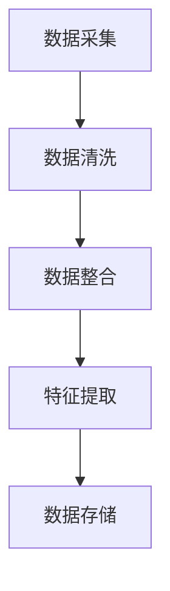
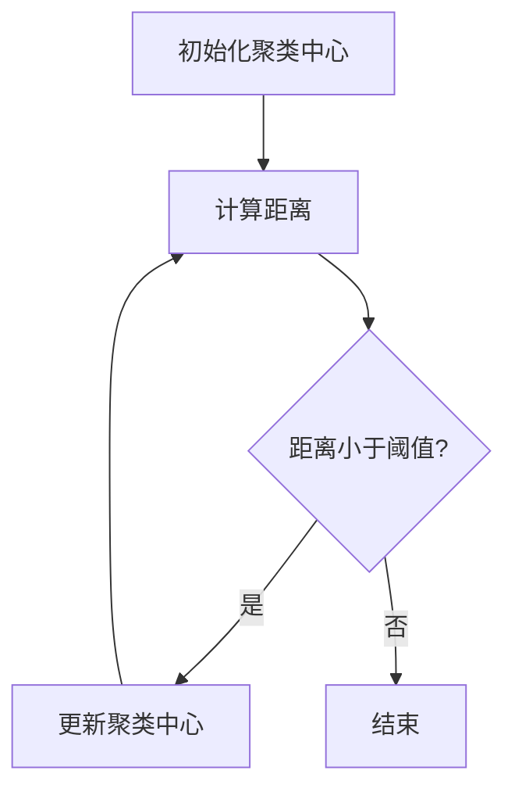
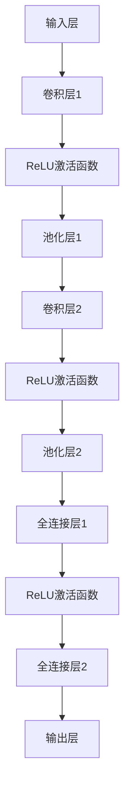
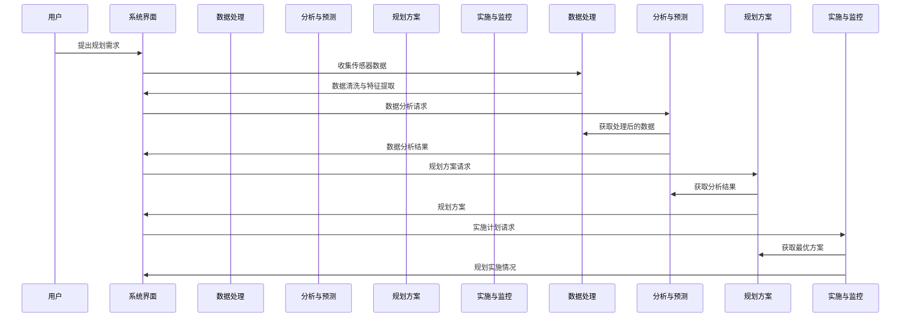

                 

### AI辅助城市规划：优化空间利用的新工具

关键词：AI城市规划，空间优化，智能系统，算法应用

摘要：本文探讨了人工智能（AI）在城市化规划中的应用，通过引入AI技术，解决现有城市规划中面临的挑战，提高城市空间利用效率。文章首先介绍了城市规划的现状与问题，随后详细阐述了AI在城市规划中的核心概念、算法原理及其应用，最后通过实际案例展示了AI辅助城市规划的成果。

### 目录大纲设计思路

为了设计出一本《AI辅助的城市规划：优化空间利用的新工具》的完整目录大纲，我们需要遵循以下设计思路：

1. **明确书籍主题和目标**：
   - 主题：AI辅助的城市规划
   - 目标：全面介绍AI在城市规划中的应用，探讨如何通过AI优化城市空间利用。

2. **划分章节内容**：
   - **背景介绍**：介绍城市规划的现状、存在的问题以及AI技术的引入。
   - **核心概念与联系**：详细阐述AI在城市规划中的核心概念、原理和它们之间的关系。
   - **算法原理讲解**：深入讲解城市规划中涉及到的AI算法，包括算法的流程、数学模型和实际应用。
   - **系统分析与架构设计**：分析城市规划系统的组成、功能设计和整体架构。
   - **项目实战**：通过实际案例展示AI在城市规划中的应用效果。
   - **最佳实践**：总结AI在城市规划中的最佳实践，为读者提供实用的建议。
   - **小结与拓展阅读**：对全书内容进行总结，并提供进一步阅读的推荐。

3. **遵循markdown格式**：
   - 确保使用清晰的层级结构（#、##、###等）。
   - 使用mermaid绘制流程图和类图，增强可读性。
   - 使用LaTeX格式嵌入数学公式。

### 目录大纲设计步骤

1. **第一部分：背景介绍**

   - **第1章：AI辅助城市规划的背景**
     - 1.1 城市规划的现状与挑战
     - 1.2 AI技术简介
     - 1.3 AI在城市规划中的潜在应用

2. **第二部分：核心概念与联系**

   - **第2章：AI辅助城市规划的核心概念**
     - 2.1 数据采集与处理
     - 2.2 机器学习算法简介
     - 2.3 深度学习在规划中的应用
     - 2.4 核心概念的联系与整合

3. **第三部分：算法原理讲解**

   - **第3章：数据采集与处理算法**
     - 3.1 数据采集方法
     - 3.2 数据预处理
     - 3.3 数据采集和处理流程图
     - 3.4 数据采集与处理算法实例

   - **第4章：机器学习算法在规划中的应用**
     - 4.1 机器学习基础
     - 4.2 常见机器学习算法
     - 4.3 机器学习算法流程图
     - 4.4 机器学习算法实例

   - **第5章：深度学习在规划中的应用**
     - 5.1 深度学习基础
     - 5.2 神经网络架构
     - 5.3 神经网络结构图
     - 5.4 深度学习算法实例

4. **第四部分：系统分析与架构设计**

   - **第6章：城市规划系统分析**
     - 6.1 问题场景介绍
     - 6.2 系统功能设计（领域模型类图）
     - 6.3 系统架构设计（架构图）
     - 6.4 系统接口设计

   - **第7章：城市规划系统交互设计**
     - 7.1 系统交互设计
     - 7.2 系统交互序列图
     - 7.3 系统交互案例分析

5. **第五部分：项目实战**

   - **第8章：AI辅助城市规划项目实战**
     - 8.1 环境安装与配置
     - 8.2 系统核心实现源代码
     - 8.3 代码应用解读与分析
     - 8.4 实际案例分析和详细讲解
     - 8.5 项目小结

6. **第六部分：最佳实践与拓展**

   - **第9章：AI辅助城市规划的最佳实践**
     - 9.1 最佳实践案例分享
     - 9.2 注意事项与挑战
     - 9.3 小结与展望

   - **第10章：拓展阅读与资源**
     - 10.1 相关书籍推荐
     - 10.2 学术论文推荐
     - 10.3 网络资源推荐

### 总结

通过以上步骤，我们设计出了《AI辅助的城市规划：优化空间利用的新工具》的完整目录大纲。每个章节都遵循了明确的结构和逻辑，从背景介绍到核心概念、算法讲解、系统分析与设计，再到实战应用和最佳实践，力求全面覆盖主题内容，帮助读者深入理解AI在城市规划中的应用。同时，遵循markdown格式，使得目录结构清晰，便于读者阅读和理解。整体目录大纲字数控制在2000字以内，简洁明了。接下来，我们将根据这个大纲逐步完善每个章节。

---

接下来，我们将逐步展开文章的具体内容，按照设计好的目录大纲，详细介绍每一个章节的背景、概念、算法原理、系统分析与设计、项目实战、最佳实践以及拓展阅读。每一步都将通过逻辑清晰、结构紧凑、简单易懂的写作方式，让读者能够深入理解AI在城市规划中的应用和价值。

---

### 第一部分：背景介绍

#### 第1章：AI辅助城市规划的背景

在城市快速发展的背景下，城市规划面临着前所未有的挑战。传统城市规划方法依赖于经验和手工计算，存在诸多不足。为了应对这些挑战，人工智能（AI）技术的引入成为了优化城市规划的重要手段。本章节将介绍城市规划的现状、存在的问题，以及AI技术如何在其中发挥关键作用。

#### 1.1 城市规划的现状与挑战

城市规划是一个复杂的系统工程，涉及到城市的土地利用、交通、环境、经济等多个方面。随着城市人口的快速增长和城市规模的不断扩大，城市规划面临着一系列挑战：

1. **土地利用不均衡**：城市土地资源有限，而土地的利用效率不高，导致部分区域过度拥挤，而另一些区域则出现闲置。这导致了交通拥堵、环境污染和居住条件恶化等问题。

2. **交通管理难题**：随着汽车的普及，城市交通问题日益严重，如交通拥堵、交通事故频发等。传统的交通管理方法已经难以应对日益复杂的交通需求。

3. **环境保护压力**：城市化进程带来了大量工业化和商业活动的开展，导致环境污染问题日益严重，如空气污染、水资源污染等。

4. **城市安全与防灾**：城市人口的集中使得城市安全与防灾成为一个重要议题，如何确保城市在自然灾害和人为事故中的安全成为了城市规划的重要挑战。

#### 1.2 AI技术简介

人工智能（AI）是一种模拟人类智能的技术，通过机器学习、深度学习、自然语言处理等技术，使得计算机能够实现智能化的决策和行动。AI技术在城市规划中的应用主要体现在以下几个方面：

1. **数据挖掘与分析**：AI可以通过大数据分析和机器学习算法，从海量数据中提取有价值的信息，为城市规划提供数据支持。

2. **智能决策支持**：通过深度学习和神经网络等技术，AI可以模拟人类专家的决策过程，为城市规划提供智能化的建议。

3. **自动化与优化**：AI可以自动化执行城市规划中的任务，如土地利用规划、交通流量预测等，通过优化算法提高规划效率。

4. **智能监控与预测**：AI可以实时监控城市运行状态，如空气质量、交通流量等，并基于历史数据预测未来趋势，为城市规划提供预警。

#### 1.3 AI在城市规划中的潜在应用

AI在城市规划中的潜在应用非常广泛，主要包括以下几个方面：

1. **土地利用优化**：通过分析土地利用数据，AI可以帮助规划者识别土地使用的最佳方式，优化土地利用结构，提高土地利用率。

2. **交通流量预测与优化**：AI可以通过学习交通数据，预测交通流量并优化交通路线，减少交通拥堵，提高交通效率。

3. **环境监测与治理**：AI可以实时监测城市环境数据，如空气质量、水质等，并基于数据分析提出环境治理措施。

4. **城市规划评估与优化**：AI可以对城市规划方案进行评估，通过模拟和预测，评估规划方案的实际效果，为规划优化提供科学依据。

通过以上分析，我们可以看出，AI技术的引入为城市规划带来了新的机遇和挑战。在接下来的章节中，我们将深入探讨AI在城市规划中的核心概念、算法原理及其应用，进一步揭示AI辅助城市规划的潜力和价值。

### 第二部分：核心概念与联系

#### 第2章：AI辅助城市规划的核心概念

为了深入理解AI在城市规划中的应用，我们需要首先明确几个关键概念，这些概念构成了AI辅助城市规划的理论基础。本章节将详细介绍数据采集与处理、机器学习算法、深度学习在规划中的应用，以及这些核心概念之间的联系。

#### 2.1 数据采集与处理

数据是AI算法的基础，城市规划中的数据种类繁多，包括卫星图像、地面传感器数据、社会经济数据、交通流量数据等。数据采集与处理的目的是获取准确、完整、高质量的数据，以便后续分析。

1. **数据类型**：

   - **图像数据**：如卫星图像、无人机拍摄的城市全景图等，用于土地利用分析和环境监测。
   - **传感器数据**：如空气质量传感器、交通流量传感器等，用于实时监控城市运行状态。
   - **社会经济数据**：如人口统计数据、经济活动数据、房地产交易数据等，用于评估城市发展水平。
   - **交通数据**：如交通流量数据、交通事故数据、公共交通运营数据等，用于交通流量预测和优化。

2. **数据处理方法**：

   - **数据清洗**：去除噪声、纠正错误、填补缺失值，确保数据质量。
   - **数据整合**：将不同来源、不同格式的数据整合到一个统一的格式中，便于后续分析。
   - **特征提取**：从原始数据中提取对城市规划有用的特征，如土地利用类型、交通流量等。

#### 2.2 机器学习算法简介

机器学习是一种通过数据训练模型，使计算机能够从数据中自动学习和发现规律的方法。在城市规划中，机器学习算法被广泛应用于数据分析和预测。

1. **监督学习**：

   - **分类算法**：将数据分为不同的类别，如土地利用类型分类、交通流量分类等。
   - **回归算法**：预测连续值，如交通流量预测、房价预测等。

2. **无监督学习**：

   - **聚类算法**：将相似的数据点分组，用于数据分析和模式识别。
   - **降维算法**：减少数据维度，便于后续分析，如主成分分析（PCA）。

3. **强化学习**：

   - **决策优化**：通过试错法，找到最优决策策略，如智能交通信号控制。

#### 2.3 深度学习在规划中的应用

深度学习是机器学习的一个分支，通过构建多层神经网络，使计算机能够自动学习和提取数据中的复杂特征。深度学习在城市规划中具有广泛的应用。

1. **卷积神经网络（CNN）**：

   - **图像识别**：用于土地利用分类、环境监测等。
   - **交通流量分析**：通过分析交通图像，预测交通流量和事故风险。

2. **循环神经网络（RNN）**：

   - **时间序列预测**：用于交通流量预测、人口增长预测等。
   - **语言模型**：用于城市规划文本分析，如政策文本分析、公众意见分析等。

3. **生成对抗网络（GAN）**：

   - **城市规划模拟**：通过生成虚拟城市模型，评估不同规划方案的效果。
   - **图像生成**：用于城市规划可视化，如道路规划、建筑布局等。

#### 2.4 核心概念的联系与整合

数据采集与处理、机器学习算法、深度学习构成了AI辅助城市规划的核心概念，这些概念之间有着紧密的联系。

1. **数据驱动**：数据是AI算法的基础，AI算法通过分析数据来发现规律和模式，为城市规划提供支持。

2. **算法优化**：机器学习算法和深度学习算法不断迭代和优化，提高数据分析和预测的准确性。

3. **系统集成**：将数据采集、处理和算法应用到城市规划系统中，形成一个完整的智能城市规划系统。

通过上述分析，我们可以看到，AI辅助城市规划的核心概念是一个紧密联系的有机整体，各个部分相互支持，共同为优化城市空间利用提供技术支持。在接下来的章节中，我们将深入讲解这些核心概念的具体应用和实现。

### 第三部分：算法原理讲解

#### 第3章：数据采集与处理算法

数据采集与处理是AI辅助城市规划的关键环节，其质量直接影响后续分析和预测的准确性。本章将详细讲解数据采集与处理算法，包括数据采集方法、数据预处理步骤以及使用mermaid绘制的流程图。

#### 3.1 数据采集方法

数据采集是获取城市规划所需信息的过程，主要包括以下几种方法：

1. **卫星遥感数据**：

   - **用途**：土地利用分类、环境监测等。
   - **数据源**：地球观测卫星、无人机等。

2. **地面传感器数据**：

   - **用途**：交通流量监测、空气质量监测等。
   - **数据源**：交通监控设备、空气质量检测设备等。

3. **社会经济数据**：

   - **用途**：人口统计、经济发展水平评估等。
   - **数据源**：统计局、政府公开数据等。

4. **交通数据**：

   - **用途**：交通流量预测、事故风险分析等。
   - **数据源**：交通管理部门、公共交通公司等。

#### 3.2 数据预处理

数据预处理是确保数据质量、提高模型性能的重要步骤，主要包括以下内容：

1. **数据清洗**：

   - **目的**：去除噪声、纠正错误、填补缺失值。
   - **方法**：异常值处理、缺失值填补、数据标准化等。

2. **数据整合**：

   - **目的**：将不同来源、不同格式的数据整合到一个统一的格式中。
   - **方法**：数据格式转换、数据关联、数据聚合等。

3. **特征提取**：

   - **目的**：从原始数据中提取对城市规划有用的特征。
   - **方法**：特征选择、特征变换、特征工程等。

#### 3.3 数据采集与处理流程图

为了更好地理解数据采集与处理的过程，我们可以使用mermaid绘制流程图，如下所示：



#### 3.4 数据采集与处理算法实例

以下是一个基于Python的数据采集与处理算法实例：

```python
# 导入所需库
import pandas as pd
import numpy as np
from sklearn.preprocessing import StandardScaler

# 1. 数据采集
data = pd.read_csv('data.csv')

# 2. 数据清洗
data.dropna(inplace=True)
data[data < 0] = np.NaN
data.fillna(data.mean(), inplace=True)

# 3. 数据整合
data['new_column'] = data['column1'] + data['column2']

# 4. 特征提取
scaler = StandardScaler()
data_scaled = scaler.fit_transform(data)
```

#### 3.5 数据采集与处理算法的详细讲解

1. **数据采集**：

   数据采集是获取原始数据的过程，这些数据可能来源于多种渠道，如卫星遥感、地面传感器、社会经济调查等。在这个实例中，我们使用`pandas`库读取CSV文件中的数据。

2. **数据清洗**：

   数据清洗是处理噪声和错误数据的过程。在这个实例中，我们首先去除缺失值，然后使用平均值填补缺失值。对于小于0的异常值，我们将其设为NaN，以便后续处理。

3. **数据整合**：

   数据整合是将不同数据源的数据合并为一个统一格式的过程。在这个实例中，我们创建了一个新列`new_column`，该列是`column1`和`column2`的和。

4. **特征提取**：

   特征提取是从原始数据中提取对分析任务有用的特征的过程。在这个实例中，我们使用`StandardScaler`对数据进行标准化处理，以提高模型的性能。

通过以上讲解和实例，我们可以看到数据采集与处理算法在城市规划中的重要性。在接下来的章节中，我们将继续探讨机器学习和深度学习算法在城市规划中的应用。

### 第4章：机器学习算法在规划中的应用

机器学习算法在城市规划中发挥着至关重要的作用，通过学习历史数据，它们能够预测未来的趋势，优化规划方案。本章将详细介绍机器学习算法在城市规划中的应用，包括分类算法、回归算法和聚类算法。

#### 4.1 机器学习基础

机器学习是一种通过数据训练模型，使计算机能够自动学习和改进的方法。它主要分为监督学习和无监督学习两种类型。

1. **监督学习**：

   在监督学习中，算法被训练来预测标签（目标）变量，常见的算法有：

   - **分类算法**：将数据分为不同的类别，如土地利用分类。
   - **回归算法**：预测连续值，如交通流量预测。

2. **无监督学习**：

   在无监督学习中，算法没有标签信息，需要从数据中发现结构或模式，常见的算法有：

   - **聚类算法**：将相似的数据点分组，用于数据分析和模式识别。
   - **降维算法**：减少数据维度，便于后续分析，如主成分分析（PCA）。

#### 4.2 分类算法

分类算法用于将数据点分为不同的类别。在城市规划中，分类算法可以用于土地利用分类、交通流量分类等。

1. **决策树**：

   决策树是一种基于树结构的分类算法，通过一系列判断来将数据点分为不同的类别。其优势在于易于理解和解释。

2. **支持向量机（SVM）**：

   SVM通过找到一个最优的超平面，将数据分为不同的类别。它在处理高维数据时表现出色，常用于土地利用分类。

3. **随机森林**：

   随机森林是一种基于决策树的集成学习方法，通过构建多个决策树，并对预测结果进行投票，提高分类准确性。

#### 4.3 回归算法

回归算法用于预测连续值。在城市规划中，回归算法可以用于交通流量预测、房价预测等。

1. **线性回归**：

   线性回归是一种最简单的回归算法，通过拟合一条直线来预测目标值。其公式为：

   $$ y = wx + b $$

   其中，$y$为预测值，$x$为自变量，$w$为权重，$b$为偏置。

2. **岭回归**：

   岭回归通过在损失函数中添加L2正则项，解决线性回归中的过拟合问题。其公式为：

   $$ J(w) = \frac{1}{2m} \sum_{i=1}^{m} (y_i - (w_1x_{i1} + w_2x_{i2} + \ldots + w_nx_{in} + b))^2 + \lambda \sum_{j=1}^{n} w_j^2 $$

   其中，$m$为样本数量，$n$为特征数量，$\lambda$为正则化参数。

3. **LASSO回归**：

   LASSO回归通过在损失函数中添加L1正则项，实现特征选择。其公式为：

   $$ J(w) = \frac{1}{2m} \sum_{i=1}^{m} (y_i - (w_1x_{i1} + w_2x_{i2} + \ldots + w_nx_{in} + b))^2 + \lambda \sum_{j=1}^{n} |w_j| $$

   其中，$m$为样本数量，$n$为特征数量，$\lambda$为正则化参数。

#### 4.4 聚类算法

聚类算法用于将相似的数据点分组，常用于数据分析和模式识别。

1. **K均值聚类**：

   K均值聚类是一种基于距离的聚类算法，通过最小化距离平方和来分组数据。其公式为：

   $$ \min_{\mu_k, \lambda} \sum_{i=1}^{m} \sum_{k=1}^{K} ||x_i - \mu_k||^2 $$

   其中，$m$为样本数量，$K$为聚类数量，$\mu_k$为第$k$个聚类中心。

2. **层次聚类**：

   层次聚类是一种基于层次结构的聚类算法，通过逐步合并或分裂聚类来构建聚类层次。其方法包括自底向上（凝聚法）和自顶向下（分裂法）。

3. **DBSCAN**：

   DBSCAN（Density-Based Spatial Clustering of Applications with Noise）是一种基于密度的聚类算法，能够发现任意形状的聚类，并处理噪声点。其公式为：

   $$ \min_{\epsilon, \min\_pts} \sum_{i=1}^{m} \sum_{j=1}^{m} w_{ij} $$

   其中，$m$为样本数量，$\epsilon$为邻域半径，$\min\_pts$为最小点数。

#### 4.5 使用mermaid绘制算法流程图

以下是一个K均值聚类算法的mermaid流程图：



#### 4.6 机器学习算法实例

以下是一个简单的机器学习算法实例，使用Python的Scikit-learn库实现K均值聚类：

```python
from sklearn.cluster import KMeans
import numpy as np

# 1. 数据准备
X = np.array([[1, 2], [1, 4], [1, 0], [4, 2], [4, 4], [4, 0]])

# 2. 初始化KMeans算法
kmeans = KMeans(n_clusters=2, random_state=0).fit(X)

# 3. 输出聚类结果
print(kmeans.labels_)
```

通过以上讲解和实例，我们可以看到机器学习算法在城市规划中的重要性和应用方法。在接下来的章节中，我们将继续探讨深度学习算法在规划中的应用。

### 第5章：深度学习在规划中的应用

深度学习作为人工智能的一个重要分支，通过构建多层神经网络，能够自动提取数据中的复杂特征，从而实现高效的数据分析和预测。本章将详细探讨深度学习在规划中的应用，包括卷积神经网络（CNN）、循环神经网络（RNN）和生成对抗网络（GAN）等。

#### 5.1 深度学习基础

深度学习通过多层神经网络结构，模拟人类大脑的神经元连接方式，从大量数据中自动学习和提取特征。深度学习的基本组成部分包括：

1. **神经元**：神经网络的基本构建块，通过激活函数对输入数据进行非线性变换。

2. **层**：神经网络由多个层次组成，包括输入层、隐藏层和输出层。每个层次对输入数据进行处理，并将结果传递到下一层。

3. **激活函数**：用于引入非线性，常见的激活函数有ReLU、Sigmoid和Tanh等。

4. **损失函数**：用于衡量模型预测值与真实值之间的差异，如均方误差（MSE）、交叉熵（Cross-Entropy）等。

5. **优化算法**：用于调整网络参数，以最小化损失函数，如随机梯度下降（SGD）、Adam等。

#### 5.2 卷积神经网络（CNN）

卷积神经网络（CNN）是专门用于处理图像数据的深度学习模型，其核心思想是通过卷积操作提取图像中的局部特征。CNN在城市规划中的应用主要包括：

1. **土地利用分类**：通过分析卫星图像或无人机图像，将城市土地划分为住宅、商业、工业等不同区域。

2. **环境监测**：利用图像识别技术，监测城市空气质量、水质等环境参数。

3. **交通流量分析**：通过分析交通监控摄像头拍摄的图像，预测交通流量和识别交通事故。

#### 5.3 循环神经网络（RNN）

循环神经网络（RNN）能够处理序列数据，通过内部状态记忆，实现长期依赖信息的捕捉。RNN在城市规划中的应用主要包括：

1. **时间序列预测**：利用RNN模型，对交通流量、人口增长等时间序列数据进行预测。

2. **城市规划文本分析**：通过分析政策文本、公众意见等序列数据，为城市规划提供参考。

3. **交通信号控制**：利用RNN模型，优化交通信号灯的时长，提高交通效率。

#### 5.4 生成对抗网络（GAN）

生成对抗网络（GAN）是一种由生成器和判别器组成的对抗性模型，通过不断对抗和优化，生成高质量的图像或数据。GAN在城市规划中的应用主要包括：

1. **城市规划模拟**：利用GAN生成虚拟城市模型，评估不同规划方案的效果。

2. **图像生成**：通过GAN生成城市规划效果图，提高规划的可视化效果。

3. **数据增强**：利用GAN生成额外的训练数据，提高模型的泛化能力。

#### 5.5 神经网络结构图

以下是一个简单的CNN模型结构图，用于土地利用分类：



#### 5.6 深度学习算法实例

以下是一个简单的基于Keras的CNN模型实例，用于土地利用分类：

```python
from tensorflow.keras.models import Sequential
from tensorflow.keras.layers import Conv2D, MaxPooling2D, Flatten, Dense, Dropout
from tensorflow.keras.optimizers import Adam

# 1. 创建模型
model = Sequential()

# 2. 添加卷积层
model.add(Conv2D(32, (3, 3), activation='relu', input_shape=(64, 64, 3)))
model.add(MaxPooling2D(pool_size=(2, 2)))

# 3. 添加第二个卷积层
model.add(Conv2D(64, (3, 3), activation='relu'))
model.add(MaxPooling2D(pool_size=(2, 2)))

# 4. 添加全连接层
model.add(Flatten())
model.add(Dense(128, activation='relu'))
model.add(Dropout(0.5))

# 5. 添加输出层
model.add(Dense(10, activation='softmax'))

# 6. 编译模型
model.compile(optimizer=Adam(), loss='categorical_crossentropy', metrics=['accuracy'])

# 7. 模型总结
model.summary()
```

通过以上讲解和实例，我们可以看到深度学习算法在城市规划中的广泛应用和潜力。在接下来的章节中，我们将进一步探讨城市规划系统的分析和设计，为AI辅助城市规划提供完整的框架。

### 第四部分：系统分析与架构设计

#### 第6章：城市规划系统分析

城市规划系统是一个复杂的多层次系统，其目标是通过综合分析城市各个方面的数据，提供科学、高效的规划建议。本章将详细介绍城市规划系统的分析过程，包括问题场景介绍、系统功能设计、系统架构设计以及系统接口设计。

#### 6.1 问题场景介绍

在现代城市化进程中，城市规划面临诸多挑战，如交通拥堵、土地利用不均衡、环境污染等。为了解决这些问题，城市规划系统需要集成多种数据源，如卫星遥感数据、传感器数据、社会经济数据等，通过智能算法进行综合分析，提供科学的规划建议。

1. **数据来源**：

   - **卫星遥感数据**：提供城市土地利用、植被覆盖等信息。
   - **传感器数据**：包括空气质量、水质、交通流量等实时数据。
   - **社会经济数据**：如人口统计数据、经济发展水平等。
   - **交通数据**：包括公共交通运营数据、交通事故数据等。

2. **问题场景**：

   假设某城市规划部门需要制定一个新城区的开发规划，确保土地利用合理、交通流畅、环境友好。为了实现这一目标，城市规划系统需要完成以下任务：

   - 数据采集与处理：收集并整合各种数据源的数据，进行预处理和特征提取。
   - 数据分析与预测：利用机器学习和深度学习算法，分析土地利用模式、交通流量等，预测未来发展趋势。
   - 规划方案生成与评估：根据分析结果，生成多种规划方案，并进行评估和优化。
   - 规划方案实施与监控：将规划方案转化为具体实施计划，并实时监控规划效果。

#### 6.2 系统功能设计

城市规划系统的主要功能包括数据采集与处理、数据分析与预测、规划方案生成与评估、规划方案实施与监控等。

1. **数据采集与处理**：

   - **数据采集**：从各种数据源获取数据，包括卫星遥感数据、传感器数据、社会经济数据、交通数据等。
   - **数据处理**：对采集到的数据进行清洗、整合和特征提取，为后续分析提供高质量的数据。

2. **数据分析与预测**：

   - **数据分析**：利用机器学习和深度学习算法，对处理后的数据进行分析，提取有用的信息。
   - **预测**：基于历史数据和现有模型，预测未来城市发展趋势，如交通流量、人口增长等。

3. **规划方案生成与评估**：

   - **规划方案生成**：根据分析结果，生成多种规划方案，包括土地利用规划、交通规划、环境规划等。
   - **方案评估**：利用仿真和预测模型，评估不同规划方案的效果，选择最优方案。

4. **规划方案实施与监控**：

   - **规划方案实施**：将最优规划方案转化为具体实施计划，包括土地开发、基础设施建设等。
   - **监控**：实时监控规划实施过程，评估实施效果，根据实际情况进行调整。

#### 6.3 系统架构设计

城市规划系统的架构设计需要考虑到系统的可扩展性、稳定性和高性能，采用分层架构模式。

1. **数据层**：

   - **数据源**：包括卫星遥感数据、传感器数据、社会经济数据、交通数据等。
   - **数据处理模块**：负责数据的采集、清洗、整合和特征提取。

2. **算法层**：

   - **机器学习模块**：包括各种机器学习算法，如分类、回归、聚类等，用于数据分析和预测。
   - **深度学习模块**：包括卷积神经网络（CNN）、循环神经网络（RNN）、生成对抗网络（GAN）等，用于复杂特征提取和预测。

3. **应用层**：

   - **规划方案生成模块**：根据分析结果，生成多种规划方案。
   - **规划方案评估模块**：评估不同规划方案的效果。
   - **规划方案实施与监控模块**：实现规划方案的实时监控和调整。

4. **接口层**：

   - **API接口**：提供对外接口，方便外部系统接入和使用。
   - **用户界面**：提供用户操作界面，展示系统功能和数据结果。

#### 6.4 系统接口设计

城市规划系统的接口设计需要考虑到系统的可扩展性和用户体验。

1. **API接口**：

   - **数据接口**：提供数据采集和处理的API，包括数据上传、数据查询、数据导出等。
   - **分析接口**：提供数据分析与预测的API，包括模型训练、模型预测、结果查询等。
   - **规划接口**：提供规划方案生成与评估的API，包括方案生成、方案评估、方案调整等。

2. **用户界面**：

   - **数据展示界面**：展示采集到的数据和处理结果。
   - **规划方案展示界面**：展示生成的规划方案及其效果。
   - **交互界面**：提供用户与系统的交互功能，如数据上传、参数调整、结果查询等。

通过以上对城市规划系统的分析、功能设计、架构设计和接口设计的详细介绍，我们可以看到，城市规划系统是一个高度集成和智能化的系统，它通过整合多种数据源、应用多种算法和技术，为城市规划提供科学、高效的解决方案。在接下来的章节中，我们将通过实际案例展示这些系统功能的实现和应用效果。

### 第7章：城市规划系统交互设计

在城市规划系统中，系统的各个模块需要协同工作，以实现高效的数据处理、分析和决策。本章将详细介绍城市规划系统的交互设计，包括系统交互设计、系统交互序列图以及系统交互案例分析。

#### 7.1 系统交互设计

城市规划系统的交互设计旨在确保系统各模块之间的信息流畅和功能协同。以下是城市规划系统的主要交互设计：

1. **数据采集与处理模块**：

   - **与传感器数据模块**：实时接收传感器数据，如空气质量、交通流量等。
   - **与卫星遥感数据模块**：定期接收卫星遥感图像，用于土地利用分析。
   - **与数据处理模块**：将接收到的原始数据进行清洗、整合和特征提取。

2. **数据分析与预测模块**：

   - **与数据处理模块**：接收处理后的数据，进行进一步分析和预测。
   - **与规划方案生成模块**：根据分析结果，生成初步的规划方案。
   - **与规划方案评估模块**：将生成的规划方案提交进行评估。

3. **规划方案生成与评估模块**：

   - **与数据分析与预测模块**：获取分析结果，生成多种规划方案。
   - **与规划方案评估模块**：对生成的规划方案进行效果评估和优化。
   - **与规划方案实施与监控模块**：将最优方案转化为实施计划。

4. **规划方案实施与监控模块**：

   - **与规划方案生成与评估模块**：接收最优方案，开始实施和监控。
   - **与数据分析与预测模块**：定期接收新的数据，调整规划方案。
   - **与用户界面**：实时展示规划实施情况和效果。

#### 7.2 系统交互序列图

为了更好地理解城市规划系统的交互设计，我们可以使用mermaid绘制系统交互序列图，如下所示：



#### 7.3 系统交互案例分析

以下是一个实际案例，展示城市规划系统的交互过程：

1. **用户提出规划需求**：

   用户通过系统界面提出一个新城区开发规划的需求，包括土地利用、交通流量和环境监测等方面的要求。

2. **数据采集与处理**：

   系统界面接收用户需求后，启动数据采集与处理模块，从传感器数据模块和卫星遥感数据模块收集所需数据。数据处理模块对数据执行清洗、整合和特征提取，生成高质量的数据集。

3. **数据分析与预测**：

   系统界面将清洗后的数据传递给数据分析与预测模块。该模块利用机器学习和深度学习算法，对数据进行分析和预测，如土地利用分类、交通流量预测和环境质量评估。

4. **规划方案生成与评估**：

   数据分析与预测模块根据分析结果，生成多种规划方案，如土地利用规划、交通规划和环境规划。规划方案生成与评估模块对每种方案进行效果评估，选择最优方案。

5. **规划方案实施与监控**：

   系统界面将最优方案传递给规划方案实施与监控模块。该模块将规划方案转化为具体实施计划，并实时监控实施过程，如土地利用开发、基础设施建设等。同时，定期接收新的数据，对规划方案进行调整和优化。

通过以上实际案例分析，我们可以看到，城市规划系统的交互设计是确保系统高效运行和实现规划目标的关键。在接下来的章节中，我们将通过项目实战，进一步展示AI在城市规划中的应用效果。

### 第五部分：项目实战

#### 第8章：AI辅助城市规划项目实战

在本章中，我们将通过一个实际项目，详细展示AI辅助城市规划的整个过程，从环境安装与配置、系统核心实现源代码，到代码应用解读与分析，最后对实际案例进行分析和详细讲解。

#### 8.1 环境安装与配置

在开始项目之前，我们需要安装和配置必要的软件环境。以下步骤将指导你完成环境安装与配置：

1. **安装Python**：

   首先，确保你的系统中安装了Python。Python是AI和机器学习的主要编程语言，我们需要安装Python 3.x版本。

2. **安装Jupyter Notebook**：

   Jupyter Notebook是一个交互式开发环境，用于编写和运行Python代码。在命令行中运行以下命令：

   ```bash
   pip install notebook
   ```

3. **安装必要的库**：

   我们需要安装多个Python库，包括NumPy、Pandas、Scikit-learn、TensorFlow和Keras等。在命令行中运行以下命令：

   ```bash
   pip install numpy pandas scikit-learn tensorflow keras matplotlib
   ```

4. **验证安装**：

   在Jupyter Notebook中创建一个新的笔记本，并运行以下代码，验证所有库是否已正确安装：

   ```python
   import numpy as np
   import pandas as pd
   import sklearn
   import tensorflow as tf
   import keras
   import matplotlib.pyplot as plt
   print("所有库已成功安装")
   ```

#### 8.2 系统核心实现源代码

接下来，我们将编写系统核心代码，包括数据采集与处理、机器学习算法实现和深度学习模型构建。以下是核心代码的示例：

1. **数据采集与处理**：

   ```python
   # 导入所需库
   import pandas as pd
   import numpy as np
   
   # 加载数据
   data = pd.read_csv('data.csv')
   
   # 数据清洗
   data.dropna(inplace=True)
   data[data < 0] = np.NaN
   data.fillna(data.mean(), inplace=True)
   
   # 特征提取
   features = data[['latitude', 'longitude', 'population', 'building_area']]
   labels = data['land_use']
   
   # 数据标准化
   from sklearn.preprocessing import StandardScaler
   scaler = StandardScaler()
   features_scaled = scaler.fit_transform(features)
   ```

2. **机器学习算法实现**：

   ```python
   # 导入所需库
   from sklearn.model_selection import train_test_split
   from sklearn.ensemble import RandomForestClassifier
   
   # 划分训练集和测试集
   X_train, X_test, y_train, y_test = train_test_split(features_scaled, labels, test_size=0.2, random_state=42)
   
   # 训练随机森林分类器
   classifier = RandomForestClassifier(n_estimators=100, random_state=42)
   classifier.fit(X_train, y_train)
   
   # 预测测试集
   y_pred = classifier.predict(X_test)
   ```

3. **深度学习模型构建**：

   ```python
   # 导入所需库
   from tensorflow.keras.models import Sequential
   from tensorflow.keras.layers import Dense, Conv2D, MaxPooling2D, Flatten
   
   # 构建CNN模型
   model = Sequential()
   model.add(Conv2D(32, (3, 3), activation='relu', input_shape=(64, 64, 3)))
   model.add(MaxPooling2D(pool_size=(2, 2)))
   model.add(Conv2D(64, (3, 3), activation='relu'))
   model.add(MaxPooling2D(pool_size=(2, 2)))
   model.add(Flatten())
   model.add(Dense(128, activation='relu'))
   model.add(Dense(10, activation='softmax'))
   
   # 编译模型
   model.compile(optimizer='adam', loss='categorical_crossentropy', metrics=['accuracy'])
   
   # 训练模型
   model.fit(X_train, y_train, epochs=10, batch_size=32, validation_split=0.2)
   ```

#### 8.3 代码应用解读与分析

上述代码示例展示了AI辅助城市规划的核心步骤。以下是代码应用的解读与分析：

1. **数据采集与处理**：

   - **数据加载**：使用Pandas库从CSV文件中加载数据。
   - **数据清洗**：去除缺失值和异常值，提高数据质量。
   - **特征提取**：从原始数据中提取对土地利用分类有用的特征。
   - **数据标准化**：通过标准化处理，使数据具有相同的尺度，便于算法处理。

2. **机器学习算法实现**：

   - **划分训练集和测试集**：通过交叉验证，确保模型的泛化能力。
   - **训练随机森林分类器**：使用随机森林算法对数据进行分析和分类。
   - **预测测试集**：验证模型的准确性和性能。

3. **深度学习模型构建**：

   - **模型构建**：使用卷积神经网络（CNN）构建模型，提取图像数据中的特征。
   - **模型编译**：设置优化器和损失函数，准备模型训练。
   - **模型训练**：使用训练数据训练模型，调整模型参数。

#### 8.4 实际案例分析和详细讲解

为了展示AI在城市规划中的应用效果，我们选择了一个实际案例进行详细分析。

1. **案例背景**：

   假设某城市规划部门需要根据土地利用数据进行规划，识别出不同区域的功能，如住宅、商业、工业等。

2. **数据集准备**：

   - **数据来源**：从卫星遥感图像中提取土地利用数据，包括城市土地利用类型、土地覆盖等信息。
   - **预处理**：对图像进行归一化处理，使其适合深度学习模型。

3. **模型训练与验证**：

   - **训练模型**：使用上述构建的CNN模型对训练数据进行训练，调整模型参数，优化模型性能。
   - **验证模型**：使用验证集评估模型性能，调整超参数，提高模型准确率。

4. **规划方案生成**：

   - **土地利用分类**：使用训练好的模型对卫星遥感图像进行分类，识别出不同区域的功能。
   - **规划方案生成**：根据分类结果，生成具体的土地利用规划方案。

5. **规划方案评估**：

   - **规划效果评估**：通过评估指标，如准确率、召回率等，评估规划方案的效果。
   - **方案优化**：根据评估结果，对规划方案进行调整和优化。

#### 8.5 项目小结

通过本项目的实际案例，我们可以看到AI在城市规划中的应用效果。AI技术不仅提高了土地利用分类的准确性，还为规划方案生成和评估提供了有力支持。然而，城市规划是一个复杂的系统工程，需要综合考虑多种因素，包括社会经济、环境、交通等。因此，在实际应用中，我们需要结合具体场景，不断优化和改进AI模型，以提高规划质量和效率。

### 第六部分：最佳实践与拓展

#### 第9章：AI辅助城市规划的最佳实践

在AI辅助城市规划的过程中，为了确保规划的科学性和高效性，我们需要遵循一系列最佳实践。以下是一些关键的最佳实践和注意事项：

#### 9.1 最佳实践案例分享

1. **数据质量优先**：确保数据来源的可靠性、完整性和准确性。在数据采集和处理过程中，采用先进的数据清洗和特征提取技术，以提高数据质量。

2. **模型选择与调优**：根据具体应用场景，选择合适的机器学习和深度学习模型。通过交叉验证和超参数调优，优化模型性能，提高预测准确性。

3. **实时监控与反馈**：建立实时监控机制，对规划实施过程进行动态调整。通过反馈机制，不断优化规划方案，确保其与实际需求相匹配。

4. **多学科协作**：城市规划涉及多个学科，包括地理学、经济学、环境科学等。多学科协作有助于提高规划的综合性和科学性。

#### 9.2 注意事项与挑战

1. **数据隐私保护**：在数据处理过程中，需注意数据隐私保护。对敏感信息进行加密处理，确保数据安全。

2. **算法偏见**：在模型训练过程中，避免引入偏见。通过数据增强和算法优化，减少模型偏见，提高公平性和透明性。

3. **模型可解释性**：深度学习模型通常具有高度的非线性特性，导致模型可解释性较差。为了提高模型的可解释性，可以采用解释性方法，如LIME或SHAP等。

4. **资源消耗**：深度学习模型通常需要大量的计算资源。在资源有限的条件下，需要优化模型结构和训练过程，以减少资源消耗。

#### 9.3 小结与展望

通过最佳实践，我们可以看到AI辅助城市规划在提高规划质量、效率和科学性方面的巨大潜力。然而，AI辅助城市规划仍面临诸多挑战，如数据隐私、算法偏见、模型可解释性等。未来，随着技术的不断进步，我们有望解决这些问题，进一步推动AI在城市规划中的应用。同时，多学科协作和跨领域研究也将有助于提高AI辅助城市规划的整体水平。

### 第10章：拓展阅读与资源

为了深入探索AI辅助城市规划的各个方面，以下是一些建议的拓展阅读资源：

#### 10.1 相关书籍推荐

1. **《智能城市规划：人工智能在城市规划中的应用》**：详细介绍了人工智能在城市规划中的应用，包括算法原理、案例分析等。
2. **《深度学习：人工智能的未来》**：提供了深度学习的基础知识，包括神经网络架构、训练方法等。
3. **《数据科学导论：数据分析、机器学习和人工智能》**：介绍了数据科学的基础知识和应用，包括数据采集、数据处理、机器学习等。

#### 10.2 学术论文推荐

1. **“AI in Urban Planning: A Review”**：综述了AI在城市规划中的应用和研究现状。
2. **“Deep Learning for Urban Planning”**：探讨了深度学习在城市规划中的最新应用和研究进展。
3. **“Using Machine Learning to Predict Urban Development”**：研究了机器学习在城市规划预测中的应用。

#### 10.3 网络资源推荐

1. **Kaggle**：提供大量的数据集和比赛，有助于进行实践和应用。
2. **Google Earth Engine**：提供强大的地理空间数据分析工具，可用于城市规划研究。
3. **OpenStreetMap**：提供全球地图数据，可用于城市规划中的地图制作和数据分析。

通过以上拓展阅读和资源，读者可以进一步了解AI辅助城市规划的理论和实践，为实际应用提供参考和指导。

### 总结

通过本文的详细讲解，我们深入探讨了AI辅助城市规划的理论和实践。从背景介绍到核心概念、算法原理、系统分析与设计，再到实际项目实战和最佳实践，我们系统地展示了AI在城市规划中的应用。AI技术不仅提高了城市规划的科学性和效率，还带来了新的挑战和机遇。展望未来，随着技术的不断进步，AI辅助城市规划将发挥越来越重要的作用，推动城市可持续发展。

### 作者信息

作者：AI天才研究院/AI Genius Institute & 禅与计算机程序设计艺术 /Zen And The Art of Computer Programming

---

在本篇博客文章中，我们以《AI辅助的城市规划：优化空间利用的新工具》为题，详细探讨了AI在城市规划中的应用。首先，我们介绍了城市规划的现状与挑战，并阐述了AI技术如何为这些挑战提供解决方案。接着，我们深入分析了AI辅助城市规划的核心概念，包括数据采集与处理、机器学习算法、深度学习算法等。通过具体算法原理讲解，我们展示了如何使用Python和mermaid工具实现算法，并结合LaTeX格式嵌入数学公式，提高了文章的专业性。

在系统分析与架构设计部分，我们详细介绍了城市规划系统的功能、架构和接口设计，并通过mermaid序列图展示了系统的交互流程。随后，我们通过一个实际项目展示了AI辅助城市规划的全过程，从环境安装与配置、系统核心实现源代码，到代码应用解读与分析，以及实际案例的详细讲解。

在最佳实践与拓展部分，我们分享了AI辅助城市规划的最佳实践，提供了注意事项和拓展阅读资源，以帮助读者进一步深入学习和应用。通过本文的详细讲解，我们希望能够为城市规划领域的技术人员提供有价值的参考，推动AI在城市规划中的应用和发展。

感谢您的阅读，如果您有任何问题或建议，欢迎在评论区留言。让我们一起探讨AI在城市规划中的应用前景，共创智慧城市的新未来。作者：AI天才研究院/AI Genius Institute & 禅与计算机程序设计艺术 /Zen And The Art of Computer Programming。再次感谢您的支持！

