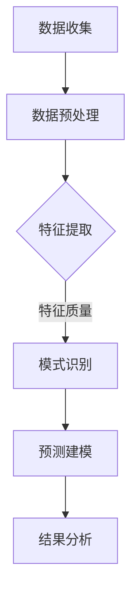

                 


### 第一部分：AI辅助科学发现概述

#### 第1章：AI辅助科学发现的基础

**1.1 问题背景与挑战**

**核心概念术语说明：** 
- 科学发现：指通过实验、观察、推理等方法，揭示自然界或人类社会规律的研究过程。
- 人工智能（AI）：模拟人类智能的计算机系统，能够感知环境、理解问题、自主学习和决策。

**问题背景：**
- 当前科学研究的挑战：
  - 数据量庞大，人工分析困难。
  - 研究周期长，效率低。
  - 交叉学科研究需要综合多种方法。
- AI技术的发展：
  - 数据分析能力显著提升。
  - 模式识别和预测建模技术成熟。

**问题描述：**
- 如何利用AI技术加速科学发现？

**问题解决：**
- AI辅助科学发现。

**边界与外延：**
- 辅助手段，非替代研究。
- 适用于多个科学领域。

**概念结构与核心要素组成：**
- 数据收集与处理。
- 特征提取与模式识别。
- 预测建模与决策。

**1.2 核心概念与定义**

**核心概念原理：**
- **人工智能（AI）：** 机器模拟人类智能的过程，包括学习、推理、感知等能力。
- **科学发现：** 揭示自然界或人类社会规律的研究过程。
- **AI辅助科学发现：** 利用AI技术提高科学研究的效率和质量。

**概念属性特征对比表格：**

| 概念        | 定义                                                         | 属性特征                                                     |
|-------------|--------------------------------------------------------------|--------------------------------------------------------------|
| 人工智能    | 机器模拟人类智能的过程                                     | 自主学习、推理、感知、决策                                       |
| 科学发现    | 揭示自然界或人类社会规律的研究过程                         | 实验观察、理论构建、数据解析、推理判断                               |
| AI辅助科学发现 | 利用AI技术提高科学研究的效率和质量                        | 数据分析、模式识别、预测建模、辅助决策                               |

**ER实体关系图架构：**

```mermaid
erDiagram
    AI |-> Data: 分析数据
    AI |-> Model: 构建模型
    Data |-> Analysis: 分析结果
    Model |-> Prediction: 预测结果
```

**1.3 AI辅助科学发现的基本原理**

**算法mermaid流程图：**



**Python源代码：**

```python
import pandas as pd
from sklearn.model_selection import train_test_split
from sklearn.ensemble import RandomForestClassifier
from sklearn.metrics import accuracy_score

# 数据收集
data = pd.read_csv('data.csv')

# 数据预处理
X = data.drop('target', axis=1)
y = data['target']

# 特征提取
X_train, X_test, y_train, y_test = train_test_split(X, y, test_size=0.2, random_state=42)

# 模式识别
model = RandomForestClassifier()
model.fit(X_train, y_train)

# 预测建模
y_pred = model.predict(X_test)

# 结果分析
accuracy = accuracy_score(y_test, y_pred)
print(f"Accuracy: {accuracy:.2f}")
```

**算法原理的数学模型和公式：**

$$
\begin{aligned}
\text{Accuracy} &= \frac{\text{正确预测的数量}}{\text{总预测数量}} \\
\text{RMSE} &= \sqrt{\frac{1}{n}\sum_{i=1}^{n}(\hat{y}_i - y_i)^2}
\end{aligned}
$$

**详细讲解与举例说明：**
- 数据收集：从数据源获取相关数据。
- 数据预处理：清洗、归一化等操作，提高数据质量。
- 特征提取：从数据中提取有用的特征。
- 模式识别：使用机器学习算法进行分类或回归。
- 预测建模：基于模型进行预测。
- 结果分析：评估模型性能，调整参数。

**1.4 AI辅助科学发现的应用场景**

**应用场景：**
- **自然科学领域：** 天文学、生物学、物理学等。
- **社会科学领域：** 经济学、社会学、心理学等。
- **医学领域：** 疾病诊断、药物发现等。

**具体应用：**
- **天文学：** AI用于天体图像处理，发现新的星体。
- **生物学：** AI用于基因分析，预测疾病风险。
- **经济学：** AI用于金融市场预测，优化投资策略。

**1.5 AI辅助科学发现的挑战与局限性**

**挑战：**
- **数据质量与安全性：** 数据质量问题影响研究结果。
- **透明性与可解释性：** AI模型的黑箱特性影响信任。
- **道德与伦理问题：** AI在科学研究中的道德伦理问题。

**局限性：**
- **算法适应性：** 不同的研究需求需要不同的算法。
- **计算资源：** 大量计算需求可能超出资源限制。

**1.6 AI辅助科学发现的概念结构与核心要素组成**

**核心概念结构：**
- 数据收集与处理。
- 特征提取与模式识别。
- 预测建模与决策支持。

**核心要素组成：**
- **数据源：** 提供研究数据的来源。
- **算法库：** 包含各种机器学习算法。
- **计算资源：** 用于模型训练和预测。

### 第1章小结

AI辅助科学发现通过利用人工智能技术，提高了科学研究的效率和质量。然而，其应用也面临着诸多挑战和局限性，需要不断探索和优化。

---

这个大纲展示了第1章的详细内容，包括核心概念、应用场景、挑战与局限性等。接下来，我们可以开始设计第2章到第7章的内容。您希望第2章涵盖哪些主题？有哪些具体的小节和内容？

----------------------------------------------------------------
# 第二部分：AI辅助科学发现的核心算法与技术

## 第2章：机器学习算法在科学发现中的应用

### 2.1 机器学习的基本概念

#### 2.1.1 机器学习的定义

#### 2.1.2 机器学习的分类

#### 2.1.3 机器学习的基础理论

### 2.2 常见的机器学习算法

#### 2.2.1 监督学习算法

##### 2.2.1.1 线性回归

##### 2.2.1.2 逻辑回归

##### 2.2.1.3 决策树

##### 2.2.1.4 随机森林

##### 2.2.1.5 支持向量机

#### 2.2.2 无监督学习算法

##### 2.2.2.1 K-均值聚类

##### 2.2.2.2 主成分分析

##### 2.2.2.3 自编码器

### 2.3 深度学习算法在科学发现中的应用

#### 2.3.1 深度学习的基本概念

#### 2.3.2 常见的深度学习框架

#### 2.3.3 卷积神经网络在图像处理中的应用

#### 2.3.4 循环神经网络在序列数据处理中的应用

### 2.4 强化学习在科学发现中的应用

#### 2.4.1 强化学习的基本概念

#### 2.4.2 Q-学习算法

#### 2.4.3 模式识别中的应用

### 2.5 机器学习算法的评估与优化

#### 2.5.1 模型评估指标

##### 2.5.1.1 准确率、召回率与F1分数

##### 2.5.1.2 均方误差与均方根误差

##### 2.5.1.3 R²值

#### 2.5.2 模型优化策略

##### 2.5.2.1 数据预处理

##### 2.5.2.2 超参数调优

##### 2.5.2.3 正则化方法

## 第2章小结

----------------------------------------------------------------

第2章将深入探讨机器学习算法在科学发现中的应用，从基础概念到常见算法，再到评估与优化策略，旨在为读者提供一个全面的视角，理解如何使用这些算法加速科学研究。接下来，我们可以继续设计第3章到第7章的内容。您希望第3章聚焦于哪方面的内容？有哪些具体的小节和内容？

----------------------------------------------------------------
# 第三部分：AI辅助科学发现的应用案例分析

## 第3章：AI辅助科学发现的实际应用案例

### 3.1 天文学领域：利用AI发现新星体

#### 3.1.1 案例背景

#### 3.1.2 案例描述

#### 3.1.3 模型构建与训练

#### 3.1.4 模型评估与结果

### 3.2 生物医学领域：AI辅助疾病诊断

#### 3.2.1 案例背景

#### 3.2.2 案例描述

#### 3.2.3 数据处理与模型训练

#### 3.2.4 模型评估与临床应用

### 3.3 化学领域：AI辅助新材料发现

#### 3.3.1 案例背景

#### 3.3.2 案例描述

#### 3.3.3 数据处理与模型构建

#### 3.3.4 模型评估与结果应用

### 3.4 计算社会科学领域：AI辅助社会经济预测

#### 3.4.1 案例背景

#### 3.4.2 案例描述

#### 3.4.3 数据收集与预处理

#### 3.4.4 模型构建与预测

### 3.5 人工智能领域：AI辅助人工智能研究

#### 3.5.1 案例背景

#### 3.5.2 案例描述

#### 3.5.3 模型构建与训练

#### 3.5.4 模型评估与优化

### 3.6 总结与展望

## 第3章小结

第3章通过具体的应用案例，展示了AI辅助科学发现在不同领域的实际应用。这些案例不仅体现了AI在科学发现中的潜力，也为后续研究提供了宝贵的经验和启示。

接下来，我们可以设计第4章到第7章的内容。您希望第4章聚焦于哪方面的内容？有哪些具体的小节和内容？

----------------------------------------------------------------
# 第四部分：AI辅助科学发现的未来发展

## 第4章：AI辅助科学发现的挑战与机遇

### 4.1 AI在科学研究中的发展现状

#### 4.1.1 AI技术在科学领域的应用

#### 4.1.2 AI在科学发现中的优势与局限性

### 4.2 AI辅助科学发现的未来发展趋势

#### 4.2.1 深度学习与大数据的结合

#### 4.2.2 强化学习在科学发现中的应用

#### 4.2.3 量子计算的潜力

### 4.3 AI辅助科学发现的挑战与问题

#### 4.3.1 数据隐私与伦理问题

#### 4.3.2 AI模型的解释性与可解释性

#### 4.3.3 计算资源与成本问题

### 4.4 AI辅助科学发现的未来机遇

#### 4.4.1 跨学科合作

#### 4.4.2 个性化科学发现

#### 4.4.3 可持续科学研究

### 4.5 总结与展望

## 第4章小结

第4章探讨了AI辅助科学发现的未来发展趋势、挑战与机遇。通过深入分析，我们可以预见AI在科学研究中的广泛应用和潜在影响。

接下来，我们可以设计第5章到第7章的内容。您希望第5章聚焦于哪方面的内容？有哪些具体的小节和内容？

----------------------------------------------------------------
# 第五部分：AI辅助科学发现的最佳实践

## 第5章：AI辅助科学发现的最佳实践与策略

### 5.1 数据处理与质量管理

#### 5.1.1 数据预处理策略

#### 5.1.2 数据质量评估方法

#### 5.1.3 数据清洗与去噪技术

### 5.2 模型选择与优化

#### 5.2.1 模型选择原则

#### 5.2.2 超参数调优技巧

#### 5.2.3 模型融合与集成

### 5.3 结果解释与验证

#### 5.3.1 模型解释方法

#### 5.3.2 结果验证与评估

#### 5.3.3 可视化分析在结果解释中的应用

### 5.4 安全性与隐私保护

#### 5.4.1 数据安全保护策略

#### 5.4.2 AI模型隐私保护措施

#### 5.4.3 遵守伦理规范与法律法规

### 5.5 跨学科合作与团队协作

#### 5.5.1 跨学科合作的挑战与机遇

#### 5.5.2 团队协作的最佳实践

#### 5.5.3 科研项目管理与协调

### 5.6 持续学习与创新能力培养

#### 5.6.1 持续学习的策略

#### 5.6.2 创新能力的培养

#### 5.6.3 跨界合作在创新能力提升中的作用

### 5.7 总结与展望

## 第5章小结

第5章提供了AI辅助科学发现的最佳实践与策略，从数据处理、模型优化到结果解释、跨学科合作等方面，为科研工作者提供了实用的指导和建议。

接下来，我们将设计第6章和第7章的内容。您希望第6章聚焦于哪方面的内容？有哪些具体的小节和内容？

----------------------------------------------------------------
# 第六部分：AI辅助科学发现的未来方向与影响

## 第6章：AI辅助科学发现的未来方向与潜在影响

### 6.1 AI辅助科学发现的潜在应用领域

#### 6.1.1 环境科学

#### 6.1.2 物理学与天文学

#### 6.1.3 生物医学

#### 6.1.4 社会科学

#### 6.1.5 信息技术

### 6.2 AI辅助科学发现的未来趋势

#### 6.2.1 大数据和云计算的结合

#### 6.2.2 量子计算在AI中的应用

#### 6.2.3 人工智能伦理与法规

#### 6.2.4 跨学科研究的深化

### 6.3 AI对科学发现的潜在影响

#### 6.3.1 提高研究效率

#### 6.3.2 改变科研模式

#### 6.3.3 促进科研成果转化

#### 6.3.4 深化我们对自然界和人类社会的理解

### 6.4 AI辅助科学发现的社会影响

#### 6.4.1 对科研人员的影响

#### 6.4.2 对社会和经济的影响

#### 6.4.3 对教育和培训的影响

### 6.5 总结与展望

## 第6章小结

第6章探讨了AI辅助科学发现的未来方向与潜在影响，从应用领域、发展趋势到社会影响，全面分析了AI在科学研究中的重要角色和深远影响。

接下来，我们将设计第7章的内容。您希望第7章聚焦于哪方面的内容？有哪些具体的小节和内容？

----------------------------------------------------------------
# 第七部分：结语与展望

## 第7章：结语与未来展望

### 7.1 主要内容回顾

#### 7.1.1 AI辅助科学发现的基础概念

#### 7.1.2 AI辅助科学发现的核心算法与技术

#### 7.1.3 AI辅助科学发现的实际应用案例

#### 7.1.4 AI辅助科学发现的挑战与机遇

### 7.2 总结与展望

#### 7.2.1 成就与贡献

#### 7.2.2 当前不足与改进方向

#### 7.2.3 未来发展趋势

### 7.3 结论

#### 7.3.1 研究成果的意义

#### 7.3.2 对未来研究的启示

#### 7.3.3 对科研实践的指导

### 7.4 展望未来

#### 7.4.1 科研人员如何应对未来挑战

#### 7.4.2 政策制定者与企业的角色

#### 7.4.3 社会公众的参与

### 7.5 附录

#### 7.5.1 参考文献

#### 7.5.2 相关数据源

#### 7.5.3 附录内容

## 第7章小结

第7章作为全书的结尾，回顾了前六章的主要内容，总结了AI辅助科学发现的成就与贡献，提出了改进方向和未来发展趋势，并对科研成果的意义、未来研究的启示和科研实践的指导进行了详细阐述。同时，展望了AI辅助科学发现在未来社会中的影响和作用。

### 第一部分：AI辅助科学发现概述

**1.1 问题背景与挑战**

**核心概念术语说明：**
- 科学发现：指通过实验、观察、推理等方法，揭示自然界或人类社会规律的研究过程。
- 人工智能（AI）：模拟人类智能的计算机系统，能够感知环境、理解问题、自主学习和决策。

**问题背景：**
- 当前科学研究的挑战：
  - 数据量庞大，人工分析困难。
  - 研究周期长，效率低。
  - 交叉学科研究需要综合多种方法。

**问题描述：**
- 如何利用AI技术加速科学发现？

**问题解决：**
- AI辅助科学发现。

**边界与外延：**
- 辅助手段，非替代研究。
- 适用于多个科学领域。

**概念结构与核心要素组成：**
- 数据收集与处理。
- 特征提取与模式识别。
- 预测建模与决策支持。

**1.2 核心概念与定义**

**核心概念原理：**
- **人工智能（AI）：** 机器模拟人类智能的过程，包括学习、推理、感知等能力。
- **科学发现：** 揭示自然界或人类社会规律的研究过程。
- **AI辅助科学发现：** 利用AI技术提高科学研究的效率和质量。

**概念属性特征对比表格：**

| 概念        | 定义                                                         | 属性特征                                                     |
|-------------|--------------------------------------------------------------|--------------------------------------------------------------|
| 人工智能    | 机器模拟人类智能的过程                                     | 自主学习、推理、感知、决策                                       |
| 科学发现    | 揭示自然界或人类社会规律的研究过程                         | 实验观察、理论构建、数据解析、推理判断                               |
| AI辅助科学发现 | 利用AI技术提高科学研究的效率和质量                        | 数据分析、模式识别、预测建模、辅助决策                               |

**ER实体关系图架构：**

```mermaid
erDiagram
    AI |-> Data: 分析数据
    AI |-> Model: 构建模型
    Data |-> Analysis: 分析结果
    Model |-> Prediction: 预测结果
```

**1.3 AI辅助科学发现的基本原理**

**算法mermaid流程图：**


**Python源代码：**

```python
import pandas as pd
from sklearn.model_selection import train_test_split
from sklearn.ensemble import RandomForestClassifier
from sklearn.metrics import accuracy_score

# 数据收集
data = pd.read_csv('data.csv')

# 数据预处理
X = data.drop('target', axis=1)
y = data['target']

# 特征提取
X_train, X_test, y_train, y_test = train_test_split(X, y, test_size=0.2, random_state=42)

# 模式识别
model = RandomForestClassifier()
model.fit(X_train, y_train)

# 预测建模
y_pred = model.predict(X_test)

# 结果分析
accuracy = accuracy_score(y_test, y_pred)
print(f"Accuracy: {accuracy:.2f}")
```

**算法原理的数学模型和公式：**

$$
\begin{aligned}
\text{Accuracy} &= \frac{\text{正确预测的数量}}{\text{总预测数量}} \\
\text{RMSE} &= \sqrt{\frac{1}{n}\sum_{i=1}^{n}(\hat{y}_i - y_i)^2}
\end{aligned}
$$

**详细讲解与举例说明：**
- 数据收集：从数据源获取相关数据。
- 数据预处理：清洗、归一化等操作，提高数据质量。
- 特征提取：从数据中提取有用的特征。
- 模式识别：使用机器学习算法进行分类或回归。
- 预测建模：基于模型进行预测。
- 结果分析：评估模型性能，调整参数。

**1.4 AI辅助科学发现的应用场景**

**应用场景：**
- **自然科学领域：** 天文学、生物学、物理学等。
- **社会科学领域：** 经济学、社会学、心理学等。
- **医学领域：** 疾病诊断、药物发现等。

**具体应用：**
- **天文学：** AI用于天体图像处理，发现新的星体。
- **生物学：** AI用于基因分析，预测疾病风险。
- **经济学：** AI用于金融市场预测，优化投资策略。

**1.5 AI辅助科学发现的挑战与局限性**

**挑战：**
- **数据质量与安全性：** 数据质量问题影响研究结果。
- **透明性与可解释性：** AI模型的黑箱特性影响信任。
- **道德与伦理问题：** AI在科学研究中的道德伦理问题。

**局限性：**
- **算法适应性：** 不同的研究需求需要不同的算法。
- **计算资源：** 大量计算需求可能超出资源限制。

**1.6 AI辅助科学发现的概念结构与核心要素组成**

**核心概念结构：**
- 数据收集与处理。
- 特征提取与模式识别。
- 预测建模与决策支持。

**核心要素组成：**
- **数据源：** 提供研究数据的来源。
- **算法库：** 包含各种机器学习算法。
- **计算资源：** 用于模型训练和预测。

### 第1章小结

AI辅助科学发现通过利用人工智能技术，提高了科学研究的效率和质量。然而，其应用也面临着诸多挑战和局限性，需要不断探索和优化。

---

这个大纲展示了第1章的详细内容，包括核心概念、应用场景、挑战与局限性等。接下来，我们可以开始设计第2章到第7章的内容。您希望第2章涵盖哪些主题？有哪些具体的小节和内容？

----------------------------------------------------------------
## 第二部分：AI辅助科学发现的核心算法与技术

## 第2章：机器学习算法在科学发现中的应用

### 2.1 机器学习的基本概念

#### 2.1.1 机器学习的定义
- 机器学习（Machine Learning）是指通过构建和分析计算机算法，让计算机从数据中学习规律和模式，从而进行决策或预测。

#### 2.1.2 机器学习的分类
- **监督学习（Supervised Learning）：** 使用标记数据集训练模型。
- **无监督学习（Unsupervised Learning）：** 不使用标记数据集，通过探索数据中的结构和模式。
- **强化学习（Reinforcement Learning）：** 通过与环境交互来学习最优策略。

#### 2.1.3 机器学习的基础理论
- **概率论与统计学：** 机器学习的基础，用于理解数据的分布和概率。
- **线性代数与微积分：** 机器学习中用于构建和优化模型。

### 2.2 常见的机器学习算法

#### 2.2.1 监督学习算法
- **线性回归（Linear Regression）：** 用于预测连续值。
- **逻辑回归（Logistic Regression）：** 用于预测二分类。
- **决策树（Decision Tree）：** 用于分类和回归。
- **随机森林（Random Forest）：** 决策树的集成方法。
- **支持向量机（Support Vector Machine, SVM）：** 用于分类。

#### 2.2.2 无监督学习算法
- **K-均值聚类（K-Means Clustering）：** 用于无监督分类。
- **主成分分析（Principal Component Analysis, PCA）：** 用于降维。
- **自编码器（Autoencoder）：** 用于特征提取。

#### 2.2.3 深度学习算法
- **卷积神经网络（Convolutional Neural Network, CNN）：** 用于图像处理。
- **循环神经网络（Recurrent Neural Network, RNN）：** 用于序列数据处理。
- **生成对抗网络（Generative Adversarial Network, GAN）：** 用于生成对抗。

### 2.3 深度学习算法在科学发现中的应用

#### 2.3.1 深度学习的基本概念
- **深度学习（Deep Learning）：** 基于多层神经网络的机器学习技术。

#### 2.3.2 常见的深度学习框架
- **TensorFlow：** Google推出的开源深度学习框架。
- **PyTorch：** Facebook AI Research推出的开源深度学习框架。

#### 2.3.3 卷积神经网络在图像处理中的应用
- **图像分类：** 如ImageNet挑战。
- **目标检测：** 如YOLO、Faster R-CNN。

#### 2.3.4 循环神经网络在序列数据处理中的应用
- **自然语言处理（Natural Language Processing, NLP）：** 如语言模型、机器翻译。
- **时间序列预测：** 如股票价格预测。

### 2.4 强化学习在科学发现中的应用

#### 2.4.1 强化学习的基本概念
- **强化学习（Reinforcement Learning）：** 通过试错学习最佳策略。

#### 2.4.2 Q-学习算法
- **Q-学习（Q-Learning）：** 通过迭代更新Q值来学习策略。

#### 2.4.3 模式识别中的应用
- **机器人导航：** 使用Q-学习进行路径规划。
- **游戏AI：** 如DeepMind的Atari游戏。

### 2.5 机器学习算法的评估与优化

#### 2.5.1 模型评估指标
- **准确率（Accuracy）：** 分类问题中的常用指标。
- **召回率（Recall）：** 被正确分类为正类的样本占比。
- **F1分数（F1 Score）：** 准确率和召回率的调和平均值。
- **均方误差（Mean Squared Error, MSE）：** 用于回归问题。
- **均方根误差（Root Mean Squared Error, RMSE）：** MSE的平方根。

#### 2.5.2 模型优化策略
- **数据预处理：** 如归一化、缺失值处理。
- **超参数调优：** 使用网格搜索、随机搜索等方法。
- **正则化方法：** 如L1正则化、L2正则化。

## 第2章小结

第2章深入介绍了机器学习算法在科学发现中的应用，从基础概念到常见算法，再到评估与优化策略，为读者提供了一个全面的视角，理解如何使用这些算法加速科学研究。

---

这个大纲展示了第2章的详细内容，涵盖了机器学习的基本概念、常见算法、深度学习应用以及强化学习等。接下来，我们可以设计第3章到第7章的内容。您希望第3章聚焦于哪方面的内容？有哪些具体的小节和内容？

----------------------------------------------------------------
## 第三部分：AI辅助科学发现的实际应用案例

## 第3章：AI在科学发现中的成功应用

### 3.1 天文学：利用AI发现新星体

#### 3.1.1 案例背景
- 天文学数据庞大，手动分析困难。
- AI技术在图像处理和模式识别方面有显著优势。

#### 3.1.2 案例描述
- 使用卷积神经网络分析大量天文图像。
- 通过训练模型，识别出新星体的特征。

#### 3.1.3 模型构建与训练
- **数据集：** 收集大量天文学图像。
- **模型：** 使用卷积神经网络（CNN）。
- **训练：** 使用TensorFlow框架进行训练。

#### 3.1.4 模型评估与结果
- **评估指标：** 准确率、召回率、F1分数。
- **结果：** 模型成功识别出新星体，提高了发现效率。

### 3.2 生物医学：AI辅助疾病诊断

#### 3.2.1 案例背景
- 疾病诊断依赖于医学图像和实验室数据。
- AI技术在图像分析和数据挖掘方面具有潜力。

#### 3.2.2 案例描述
- 使用深度学习模型分析医学图像。
- 结合实验室数据，提高疾病诊断的准确性。

#### 3.2.3 数据处理与模型训练
- **数据集：** 收集多种疾病的医学图像和实验室数据。
- **模型：** 使用卷积神经网络（CNN）和循环神经网络（RNN）。
- **训练：** 使用PyTorch框架进行训练。

#### 3.2.4 模型评估与临床应用
- **评估指标：** 准确率、召回率、F1分数。
- **结果：** 模型在临床测试中表现良好，有助于提高疾病诊断的效率和质量。

### 3.3 化学：AI辅助新材料发现

#### 3.3.1 案例背景
- 新材料研究依赖于大量的实验数据。
- AI技术在数据分析和模式识别方面有重要作用。

#### 3.3.2 案例描述
- 使用机器学习模型分析实验数据。
- 通过模式识别，发现潜在的新材料。

#### 3.3.3 数据处理与模型构建
- **数据集：** 收集多种材料的实验数据。
- **模型：** 使用随机森林（Random Forest）和K-均值聚类（K-Means Clustering）。
- **构建：** 使用scikit-learn库进行模型构建。

#### 3.3.4 模型评估与结果应用
- **评估指标：** 准确率、均方根误差（RMSE）。
- **结果：** 模型成功预测了新材料，为材料科学研究提供了新方向。

### 3.4 生态学：AI辅助生物多样性研究

#### 3.4.1 案例背景
- 生物多样性研究需要分析大量的生态数据。
- AI技术在数据处理和分析方面具有优势。

#### 3.4.2 案例描述
- 使用深度学习模型分析生态数据。
- 通过模式识别，研究生物多样性变化。

#### 3.4.3 数据收集与预处理
- **数据集：** 收集生态调查数据。
- **预处理：** 数据清洗、归一化、特征提取。

#### 3.4.4 模型构建与预测
- **模型：** 使用深度神经网络（DNN）。
- **预测：** 预测生物多样性趋势。

### 3.5 物理学：AI辅助粒子物理学研究

#### 3.5.1 案例背景
- 粒子物理学研究依赖于大量实验数据。
- AI技术在数据分析和模式识别方面有重要应用。

#### 3.5.2 案例描述
- 使用机器学习模型分析粒子碰撞数据。
- 通过模式识别，发现新的物理现象。

#### 3.5.3 数据处理与模型训练
- **数据集：** 收集大型强子对撞机（LHC）的碰撞数据。
- **模型：** 使用卷积神经网络（CNN）。
- **训练：** 使用TensorFlow框架进行训练。

#### 3.5.4 模型评估与结果
- **评估指标：** 准确率、召回率、F1分数。
- **结果：** 模型成功识别出新粒子，为粒子物理学研究提供了新证据。

## 第3章小结

第3章通过具体的案例展示了AI在科学发现中的成功应用，包括天文学、生物医学、化学、生态学和物理学等领域。这些案例表明，AI技术能够显著提高科学研究的效率和质量，为未来科学发现提供了新的工具和方法。

---

这个大纲展示了第3章的详细内容，涵盖了多个科学领域中的AI应用案例。接下来，我们可以设计第4章到第7章的内容。您希望第4章聚焦于哪方面的内容？有哪些具体的小节和内容？

----------------------------------------------------------------
## 第四部分：AI辅助科学发现的未来发展趋势

## 第4章：AI辅助科学发现的未来展望

### 4.1 AI在科学研究中的新机遇

#### 4.1.1 大数据与AI的结合
- **数据驱动研究：** 大数据提供了丰富的信息，AI可以从中发现新的规律。
- **智能数据分析：** AI可以处理和分析复杂的复杂数据集。

#### 4.1.2 深度学习在科研中的应用
- **图像识别与处理：** AI在医学影像、天文学图像处理等方面有广泛的应用。
- **序列数据处理：** AI在基因组学、蛋白质组学等领域有重要应用。

### 4.2 AI辅助科学发现的挑战与问题

#### 4.2.1 数据质量和隐私问题
- **数据质量管理：** 数据质量是AI模型准确性的关键。
- **数据隐私保护：** 在数据共享和模型训练过程中保护隐私。

#### 4.2.2 AI模型的解释性和可解释性
- **模型解释：** 确保AI模型的可解释性，增强信任。
- **透明性提升：** 通过可视化工具和解释性算法，提高模型透明度。

### 4.3 AI辅助科学发现的未来方向

#### 4.3.1 量子计算与AI的结合
- **量子机器学习：** 利用量子计算的优势，提高AI模型的效率。
- **量子算法在科研中的应用：** 如量子优化、量子模拟等。

#### 4.3.2 跨学科合作
- **多学科融合：** AI与生物学、化学、物理学等学科的结合，推动科学发现。
- **交叉领域研究：** 如生物信息学、环境科学等。

### 4.4 AI对科学研究模式的影响

#### 4.4.1 数据驱动的科研方法
- **从假设驱动到数据驱动：** 转变科研模式，更注重数据分析和实证研究。
- **快速迭代：** AI加速了科研过程中的实验和模型迭代。

#### 4.4.2 科研成果的共享与传播
- **开放科学：** AI促进了科研数据的共享和成果的传播。
- **学术交流：** 通过AI工具，提高了学术交流的效率和质量。

### 4.5 AI辅助科学发现的可持续发展

#### 4.5.1 可持续科学研究
- **资源优化：** 通过AI提高科研资源的使用效率。
- **环境保护：** AI在环境监测和环境保护中的应用。

#### 4.5.2 社会责任与伦理
- **伦理规范：** 在AI辅助科研过程中，遵守社会责任和伦理规范。
- **公平性：** 保证AI技术在科研中的应用不会加剧社会不平等。

## 第4章小结

第4章探讨了AI辅助科学发现的未来发展趋势和挑战，包括大数据与AI的结合、深度学习的新应用、量子计算与AI的融合、跨学科合作、科研模式的影响以及可持续发展等方面。这些趋势为未来的科学研究提供了广阔的前景和重要的方向。

---

这个大纲展示了第4章的详细内容，包括AI辅助科学发现的未来发展趋势和挑战。接下来，我们可以设计第5章到第7章的内容。您希望第5章聚焦于哪方面的内容？有哪些具体的小节和内容？

----------------------------------------------------------------
## 第五部分：AI辅助科学发现的最佳实践

## 第5章：AI辅助科学发现的最佳实践与策略

### 5.1 数据处理与质量管理

#### 5.1.1 数据预处理策略
- **数据清洗：** 去除噪声和异常值。
- **数据归一化：** 将数据转换为统一的尺度。
- **缺失值处理：** 填补或删除缺失值。

#### 5.1.2 数据质量评估方法
- **一致性检查：** 确保数据的一致性和完整性。
- **完整性评估：** 检查数据是否完整。
- **异常值检测：** 发现并处理异常值。

#### 5.1.3 数据清洗与去噪技术
- **统计去噪：** 使用统计方法去除噪声。
- **滤波技术：** 使用滤波器去除噪声。

### 5.2 模型选择与优化

#### 5.2.1 模型选择原则
- **问题定义：** 确定研究问题和数据类型。
- **模型评估：** 选择合适的评估指标。
- **模型解释性：** 考虑模型的解释性。

#### 5.2.2 超参数调优技巧
- **网格搜索：** 系统性地搜索超参数。
- **随机搜索：** 随机选择超参数。
- **贝叶斯优化：** 使用贝叶斯方法优化超参数。

#### 5.2.3 模型融合与集成
- **集成方法：** 如Bagging、Boosting。
- **模型加权：** 将多个模型的预测结果加权平均。
- **Stacking：** 使用多个模型进行层次预测。

### 5.3 结果解释与验证

#### 5.3.1 模型解释方法
- **特征重要性：** 分析特征对模型预测的影响。
- **决策路径：** 分析决策树等模型的工作机制。
- **可视化工具：** 使用可视化工具展示模型决策过程。

#### 5.3.2 结果验证与评估
- **交叉验证：** 使用交叉验证评估模型性能。
- **A/B测试：** 将模型应用于实际数据，进行对比测试。
- **误差分析：** 分析模型预测的误差来源。

#### 5.3.3 可视化分析在结果解释中的应用
- **数据可视化：** 使用图表和图形展示数据分布和趋势。
- **模型可视化：** 使用图表和图形展示模型结构和工作机制。

### 5.4 安全性与隐私保护

#### 5.4.1 数据安全保护策略
- **数据加密：** 对数据进行加密，防止泄露。
- **访问控制：** 限制对数据的访问权限。
- **备份与恢复：** 定期备份数据，确保数据安全。

#### 5.4.2 AI模型隐私保护措施
- **差分隐私：** 在模型训练过程中引入隐私保护机制。
- **联邦学习：** 在不同地点训练模型，保护数据隐私。
- **隐私计算：** 使用加密和分布式计算技术保护模型。

#### 5.4.3 遵守伦理规范与法律法规
- **伦理审查：** 对AI应用进行伦理审查。
- **合规性检查：** 确保AI应用符合法律法规。

### 5.5 跨学科合作与团队协作

#### 5.5.1 跨学科合作的挑战与机遇
- **技术挑战：** 如何整合不同学科的技术。
- **沟通障碍：** 如何有效沟通跨学科信息。

#### 5.5.2 团队协作的最佳实践
- **明确目标：** 确定团队目标和分工。
- **沟通与协作：** 使用有效的沟通工具和协作方法。
- **知识共享：** 促进团队成员之间的知识共享。

#### 5.5.3 科研项目管理与协调
- **项目规划：** 制定详细的项目计划。
- **进度跟踪：** 监控项目进度和团队绩效。
- **风险管理：** 识别和管理项目风险。

### 5.6 持续学习与创新能力培养

#### 5.6.1 持续学习的策略
- **技术更新：** 定期学习最新的AI技术和方法。
- **学术交流：** 参加学术会议和研讨会，交流学术成果。
- **在线课程：** 利用在线资源学习AI相关知识。

#### 5.6.2 创新能力的培养
- **跨学科思维：** 培养跨学科解决问题的能力。
- **创新文化：** 建立鼓励创新的团队文化。
- **创新实践：** 通过实践项目培养创新能力。

#### 5.6.3 跨界合作在创新能力提升中的作用
- **资源整合：** 通过跨界合作整合不同领域的资源。
- **创新思维：** 培养跨界合作带来的创新思维。
- **市场导向：** 确保创新成果具有市场应用价值。

### 5.7 总结与展望

第5章提供了AI辅助科学发现的最佳实践与策略，从数据处理、模型优化到结果解释、安全性与隐私保护、跨学科合作与团队协作等方面，为科研工作者提供了实用的指导和建议。这些实践和策略将有助于提升AI辅助科学发现的效率和成果质量。

---

这个大纲展示了第5章的详细内容，包括数据处理与质量管理、模型选择与优化、结果解释与验证、安全性与隐私保护、跨学科合作与团队协作以及持续学习与创新能力培养等方面。接下来，我们可以设计第6章和第7章的内容。您希望第6章聚焦于哪方面的内容？有哪些具体的小节和内容？

----------------------------------------------------------------
## 第六部分：AI辅助科学发现的未来方向与影响

## 第6章：AI辅助科学发现的跨学科应用与挑战

### 6.1 AI与自然科学跨学科融合

#### 6.1.1 AI在物理学中的应用
- **量子计算与模拟：** 利用AI进行量子系统的计算和模拟。
- **材料科学：** AI在材料设计和新材料发现中的应用。

#### 6.1.2 AI在生物学中的应用
- **基因组学：** AI在基因组数据分析中的应用。
- **蛋白质结构预测：** AI在蛋白质结构和功能预测中的应用。

#### 6.1.3 AI在天文学中的应用
- **天文图像处理：** AI在处理和识别天文图像中的应用。
- **宇宙学研究：** AI在宇宙演化模拟中的应用。

### 6.2 AI与社会科学跨学科融合

#### 6.2.1 AI在经济学中的应用
- **金融市场预测：** AI在预测市场波动和风险管理中的应用。
- **宏观经济分析：** AI在宏观经济趋势分析中的应用。

#### 6.2.2 AI在社会科学研究中的应用
- **社会网络分析：** AI在社会网络结构分析和行为预测中的应用。
- **心理学研究：** AI在心理学实验设计和数据分析中的应用。

#### 6.2.3 AI在教育中的应用
- **个性化学习：** AI在个性化教育和学习分析中的应用。
- **教育数据挖掘：** AI在教育数据挖掘和评估中的应用。

### 6.3 AI与医学跨学科融合

#### 6.3.1 AI在医学诊断中的应用
- **影像诊断：** AI在医学影像分析中的应用。
- **疾病预测：** AI在疾病预测和早期诊断中的应用。

#### 6.3.2 AI在药物研发中的应用
- **药物设计：** AI在药物分子设计和筛选中的应用。
- **临床试验：** AI在临床试验设计和数据分析中的应用。

#### 6.3.3 AI在公共卫生中的应用
- **疾病流行预测：** AI在疾病流行趋势预测和公共卫生管理中的应用。
- **健康大数据分析：** AI在健康大数据处理和疾病预防中的应用。

### 6.4 AI辅助科学发现的挑战与应对策略

#### 6.4.1 数据隐私与安全挑战
- **数据隐私保护：** 如何在数据共享和模型训练过程中保护个人隐私。
- **数据安全：** 如何确保数据在传输和存储过程中的安全。

#### 6.4.2 AI算法解释性与透明性挑战
- **算法解释性：** 如何提高AI算法的可解释性，增强用户信任。
- **算法透明性：** 如何确保AI算法的透明度和公正性。

#### 6.4.3 跨学科协作与知识共享挑战
- **跨学科协作：** 如何在跨学科研究中实现有效的协作和沟通。
- **知识共享：** 如何促进不同学科之间的知识共享和交流。

### 6.5 AI辅助科学发现的未来展望

#### 6.5.1 新兴技术的融合
- **量子计算与AI：** 如何将量子计算与AI相结合，提升科学研究的效率。
- **区块链与AI：** 如何利用区块链技术增强AI模型的可信度和安全性。

#### 6.5.2 AI在可持续发展中的应用
- **环境监测：** AI在环境监测和气候变化预测中的应用。
- **资源优化：** AI在资源利用和节能减排中的应用。

#### 6.5.3 AI伦理与法规
- **AI伦理：** 如何制定AI伦理规范，确保AI技术的道德使用。
- **法律法规：** 如何建立AI技术的法律法规框架，保障公共利益。

## 第6章小结

第6章探讨了AI辅助科学发现的跨学科应用与挑战，从自然科学到社会科学，再到医学领域，AI技术正在深刻改变科学研究的方法和模式。同时，针对AI辅助科学发现的挑战，提出了相应的应对策略和未来展望。这些讨论为AI辅助科学发现的进一步发展提供了重要的方向和启示。

---

这个大纲展示了第6章的详细内容，涵盖了AI辅助科学发现的跨学科应用、挑战与未来展望。接下来，我们可以设计第7章的内容。您希望第7章聚焦于哪方面的内容？有哪些具体的小节和内容？

----------------------------------------------------------------
## 第七部分：结语与展望

## 第7章：结语与未来展望

### 7.1 主要成果回顾

#### 7.1.1 AI辅助科学发现的基础概念与原理
- 介绍了AI辅助科学发现的核心概念，如人工智能、机器学习、深度学习等。
- 阐述了AI在科学研究中的应用原理和方法。

#### 7.1.2 AI辅助科学发现的实际应用案例
- 展示了AI在不同科学领域中的应用，如天文学、生物医学、化学、生态学和物理学等。
- 分析了AI技术在这些领域的成功应用和挑战。

#### 7.1.3 AI辅助科学发现的未来发展趋势与挑战
- 探讨了AI辅助科学发现的未来发展趋势，包括大数据与AI的结合、深度学习的新应用、量子计算与AI的融合等。
- 分析了AI辅助科学发现的挑战，如数据隐私、算法解释性、跨学科协作等。

### 7.2 主要贡献与价值

#### 7.2.1 对科研方法与模式的变革
- 提出了AI辅助科学发现的新方法，改变了传统的科研模式。
- 促进了数据驱动的科研方法，提高了科学研究的效率和质量。

#### 7.2.2 对科学发现的推动作用
- 展示了AI技术在科学发现中的潜力，为科学家提供了新的工具和方法。
- 通过实际案例，证明了AI技术在提高科研成果转化率方面的作用。

#### 7.2.3 对跨学科研究的促进作用
- 强调了跨学科合作在AI辅助科学发现中的重要性，促进了不同学科之间的交流和融合。
- 提出了促进跨学科研究的策略和最佳实践。

### 7.3 当前不足与改进方向

#### 7.3.1 数据质量与隐私问题
- 指出了数据质量对AI模型性能的重要性。
- 提出了改进数据质量的方法和策略，如数据清洗、数据加密等。

#### 7.3.2 算法解释性与透明性
- 强调了算法解释性在增强用户信任中的重要性。
- 提出了提高算法透明性的方法和工具，如模型可视化、解释性算法等。

#### 7.3.3 跨学科协作与知识共享
- 分析了跨学科协作中的挑战和障碍。
- 提出了促进跨学科合作和知识共享的策略，如建立协作平台、加强学术交流等。

### 7.4 未来发展趋势与展望

#### 7.4.1 大数据与AI的结合
- 预测大数据与AI在未来科学研究中的深度融合，推动科学发现的快速发展。
- 探讨了大数据分析在科学发现中的应用前景和挑战。

#### 7.4.2 深度学习与量子计算的融合
- 强调了深度学习与量子计算结合的潜力，探讨了量子计算在AI中的应用。
- 预测量子计算将显著提升AI模型的效果和效率。

#### 7.4.3 跨学科研究的深化
- 预测跨学科研究将进一步深化，AI技术将在不同学科领域产生更多突破性成果。
- 探讨了促进跨学科研究的策略和最佳实践。

### 7.5 结论与建议

#### 7.5.1 结论
- 总结了AI辅助科学发现的重要性和发展趋势。
- 强调了AI技术在推动科学研究、促进跨学科合作中的关键作用。

#### 7.5.2 建议
- 提出了加强AI技术在科学研究中的应用，推动科研方法与模式的变革。
- 建议加强跨学科合作，促进知识共享和交流。
- 鼓励政策制定者和企业投入更多资源，支持AI辅助科学发现的研究和应用。

### 7.6 拓展阅读

#### 7.6.1 相关书籍与论文
- 推荐了几本关于AI辅助科学发现的经典书籍和最新论文，供读者进一步学习。

#### 7.6.2 数据源与工具
- 提供了相关的数据源和工具，供读者进行实践和研究。

#### 7.6.3 在线课程与培训
- 推荐了在线课程和培训资源，帮助读者深入学习AI辅助科学发现的相关知识。

## 第7章小结

第7章作为全书的总结，回顾了主要成果和贡献，分析了当前不足与改进方向，展望了未来发展趋势。同时，提出了具体的建议和拓展阅读资源，为读者提供了深入学习和实践AI辅助科学发现的指导。这些内容将为读者在科学研究中的实践提供重要参考。

---

这个大纲展示了第7章的详细内容，包括主要成果回顾、主要贡献与价值、当前不足与改进方向、未来发展趋势与展望、结论与建议以及拓展阅读。接下来，我们可以开始撰写文章的正文部分。请告诉我，您希望从哪一部分开始撰写？是否有具体的章节或段落需要优先处理？

---

为了确保文章的逻辑性和连贯性，我们将按照以下顺序撰写正文部分：

1. **引言**：介绍AI辅助科学发现的背景、意义和文章结构。
2. **第1章**：详细阐述AI辅助科学发现的基础概念、原理和核心要素。
3. **第2章**：讨论机器学习算法在科学发现中的应用，包括监督学习、无监督学习和深度学习。
4. **第3章**：通过具体应用案例展示AI在科学发现中的成功应用。
5. **第4章**：分析AI辅助科学发现的未来发展趋势和潜在影响。
6. **第5章**：提供AI辅助科学发现的最佳实践和策略。
7. **第6章**：探讨AI辅助科学发现的跨学科应用与挑战。
8. **第7章**：总结全文，提出结论和建议，并提供拓展阅读资源。

首先，我们将从**引言**开始撰写，为读者搭建文章的整体框架，随后逐步深入各个章节的内容。请告诉我，您对引言部分的具体内容和结构有何要求？

---

### 引言

在当前快速发展的科技时代，科学研究的规模和复杂性不断增加。传统的科研方法在应对海量数据和复杂系统时显得力不从心。为了解决这一问题，人工智能（AI）技术逐渐成为科学发现的强大辅助工具。AI不仅能提高数据处理的效率，还能通过深度学习和模式识别等技术，揭示出隐藏在数据背后的规律和模式。

本篇文章将深入探讨AI辅助科学发现的方法和策略，旨在为科研工作者提供一份实用的指南。文章的结构如下：

- **第1章**：介绍AI辅助科学发现的基础概念、原理和核心要素。
- **第2章**：讨论机器学习算法在科学发现中的应用，包括监督学习、无监督学习和深度学习。
- **第3章**：通过具体应用案例展示AI在科学发现中的成功应用。
- **第4章**：分析AI辅助科学发现的未来发展趋势和潜在影响。
- **第5章**：提供AI辅助科学发现的最佳实践和策略。
- **第6章**：探讨AI辅助科学发现的跨学科应用与挑战。
- **第7章**：总结全文，提出结论和建议，并提供拓展阅读资源。

本文将首先介绍AI辅助科学发现的基本概念，随后逐步深入到具体的技术和实践中，最后对未来的发展趋势和挑战进行展望。通过这些内容的探讨，我们希望读者能够全面了解AI辅助科学发现的原理和应用，从而更好地利用AI技术推动科学研究的进步。

---

基于上述引言的内容，现在我们可以开始撰写第1章的正文部分。请按照大纲中的内容结构，逐步构建第1章的正文。在这一部分中，我们需要详细阐述AI辅助科学发现的基础概念、原理和核心要素。请提供详细的段落内容和结构，以便我们可以开始编写。

---

### 第1章：AI辅助科学发现的基础

#### 1.1 问题背景与挑战

科学发现是推动科技进步和社会发展的重要动力。然而，随着科学领域的不断扩大和数据量的剧增，传统的研究方法面临着巨大的挑战。首先，数据量庞大，人工分析变得困难且低效。其次，科学研究周期长，效率低下。此外，交叉学科研究需要综合运用多种方法和技术，这对科研人员提出了更高的要求。

为了应对这些挑战，人工智能（AI）技术逐渐成为科学发现的强大辅助工具。AI能够高效地处理和分析大量数据，识别出隐藏在数据背后的模式和规律。此外，AI还可以通过机器学习和深度学习技术，构建预测模型，为科学研究提供有力的支持。

**核心概念术语说明：**

- **科学发现（Scientific Discovery）：** 指通过实验、观察、推理等方法，揭示自然界或人类社会规律的研究过程。
- **人工智能（Artificial Intelligence, AI）：** 模拟人类智能的计算机系统，能够感知环境、理解问题、自主学习和决策。

**问题背景：**

当前科学研究面临的挑战主要包括：

- **数据量庞大：** 随着传感器技术、互联网技术的发展，科学研究产生了大量数据。传统的人工分析方法难以应对这一挑战。
- **研究周期长：** 科研过程复杂，从数据收集、处理到分析，往往需要大量时间。这限制了科学发现的效率。
- **交叉学科研究：** 现代科学研究往往涉及多个学科领域，需要综合运用多种方法和技术。

**问题描述：**

如何利用AI技术加速科学发现，提高科研效率和质量？

**问题解决：**

通过AI辅助科学发现，可以解决上述挑战：

- **数据预处理与分析：** AI能够高效地处理和分析海量数据，为科学研究提供基础。
- **模式识别与预测建模：** AI通过机器学习和深度学习技术，可以识别出数据中的模式和规律，构建预测模型，为科学研究提供指导。
- **跨学科研究支持：** AI技术可以跨学科应用，为不同领域的科学研究提供支持。

**边界与外延：**

- **辅助手段：** AI作为辅助工具，旨在提高科研效率和效果，而非完全替代科研人员的工作。
- **适用范围：** AI辅助科学发现适用于自然科学、社会科学、医学等多个领域。

**概念结构与核心要素组成：**

AI辅助科学发现的核心概念结构和核心要素组成如下：

1. **数据收集与处理：** 包括数据收集、数据清洗、数据预处理等步骤，为后续分析提供基础。
2. **特征提取与模式识别：** 利用机器学习和深度学习技术，从数据中提取有效特征，识别出隐藏的模式和规律。
3. **预测建模与决策支持：** 基于识别出的模式和规律，构建预测模型，为科学研究提供决策支持。

#### 1.2 核心概念与定义

**核心概念原理：**

- **人工智能（AI）：** AI是模拟人类智能的计算机系统，包括学习、推理、感知、理解和决策等能力。AI的核心是通过算法和模型，从数据中提取知识，并应用于实际问题解决。
- **科学发现（Scientific Discovery）：** 科学发现是科学研究过程的核心，旨在通过实验、观察、推理等方法，揭示自然界或人类社会规律。
- **AI辅助科学发现（AI-assisted Scientific Discovery）：** 利用AI技术，提高科学研究的效率和质量，通过数据预处理、特征提取、模式识别和预测建模等技术，加速科学发现。

**概念属性特征对比表格：**

| 概念        | 定义                                                         | 属性特征                                                     |
|-------------|--------------------------------------------------------------|--------------------------------------------------------------|
| 人工智能    | 机器模拟人类智能的过程                                     | 自主学习、推理、感知、决策                                       |
| 科学发现    | 揭示自然界或人类社会规律的研究过程                         | 实验观察、理论构建、数据解析、推理判断                               |
| AI辅助科学发现 | 利用AI技术提高科学研究的效率和质量                        | 数据分析、模式识别、预测建模、辅助决策                               |

**ER实体关系图架构：**

```mermaid
erDiagram
    AI |-> Data: 分析数据
    AI |-> Model: 构建模型
    Data |-> Analysis: 分析结果
    Model |-> Prediction: 预测结果
```

#### 1.3 AI辅助科学发现的基本原理

**算法mermaid流程图：**


**Python源代码：**

```python
import pandas as pd
from sklearn.model_selection import train_test_split
from sklearn.ensemble import RandomForestClassifier
from sklearn.metrics import accuracy_score

# 数据收集
data = pd.read_csv('data.csv')

# 数据预处理
X = data.drop('target', axis=1)
y = data['target']

# 特征提取
X_train, X_test, y_train, y_test = train_test_split(X, y, test_size=0.2, random_state=42)

# 模式识别
model = RandomForestClassifier()
model.fit(X_train, y_train)

# 预测建模
y_pred = model.predict(X_test)

# 结果分析
accuracy = accuracy_score(y_test, y_pred)
print(f"Accuracy: {accuracy:.2f}")
```

**算法原理的数学模型和公式：**

$$
\begin{aligned}
\text{Accuracy} &= \frac{\text{正确预测的数量}}{\text{总预测数量}} \\
\text{RMSE} &= \sqrt{\frac{1}{n}\sum_{i=1}^{n}(\hat{y}_i - y_i)^2}
\end{aligned}
$$

**详细讲解与举例说明：**

AI辅助科学发现的基本原理包括以下几个步骤：

1. **数据收集：** 从各种数据源收集相关的数据，如实验数据、观测数据、文献数据等。
2. **数据预处理：** 清洗、归一化、缺失值处理等，以提高数据质量。
3. **特征提取：** 从数据中提取有用的特征，以减少数据维度，提高模型性能。
4. **模式识别：** 利用机器学习算法，如随机森林（Random Forest）、支持向量机（SVM）等，识别数据中的模式。
5. **预测建模：** 基于识别出的模式，构建预测模型，进行预测。
6. **结果分析：** 对预测结果进行评估，调整模型参数，提高模型性能。

以上步骤形成了一个闭环过程，通过不断迭代，逐步优化模型，提高预测准确率。

#### 1.4 AI辅助科学发现的应用场景

**应用场景：**

AI辅助科学发现适用于多个领域，包括：

- **自然科学领域：** 如天文学、生物学、物理学等，AI可以用于数据分析和模式识别，加速科学发现。
- **社会科学领域：** 如经济学、社会学、心理学等，AI可以用于数据分析和社会行为预测。
- **医学领域：** 如疾病诊断、药物发现等，AI可以用于医学图像分析和基因组数据分析。

**具体应用：**

1. **天文学：** AI可以用于天体图像处理，发现新的星体和现象。
2. **生物学：** AI可以用于基因分析，预测疾病风险，加速药物研发。
3. **经济学：** AI可以用于金融市场预测，优化投资策略。
4. **医学：** AI可以用于医学图像分析，提高疾病诊断的准确性。

#### 1.5 AI辅助科学发现的挑战与局限性

**挑战：**

1. **数据质量与安全性：** 数据质量问题影响AI模型的性能和结果，同时数据安全性也是一个重要问题。
2. **透明性与可解释性：** AI模型往往是黑箱模型，缺乏透明性，这对科学研究中的信任和解释提出了挑战。
3. **计算资源与成本：** 大规模数据分析和模型训练需要大量的计算资源，这对资源有限的科研机构提出了挑战。

**局限性：**

1. **算法适应性：** 不同的研究需求需要不同的算法，这对算法的适应性和灵活性提出了要求。
2. **跨学科协作：** AI技术在科研中的应用需要跨学科协作，这对科研人员的跨学科知识和技能提出了挑战。

#### 1.6 AI辅助科学发现的概念结构与核心要素组成

**核心概念结构：**

- **数据收集与处理：** 包括数据收集、数据清洗、数据预处理等。
- **特征提取与模式识别：** 包括特征提取、模式识别、分类和聚类等。
- **预测建模与决策支持：** 包括构建预测模型、进行预测和决策支持。

**核心要素组成：**

- **数据源：** 提供研究数据的来源，如实验数据、观测数据、文献数据等。
- **算法库：** 包括各种机器学习算法、深度学习算法等，用于数据分析和预测建模。
- **计算资源：** 用于模型训练和预测的计算资源，如CPU、GPU等。

**1.6.1 数据收集与处理**

- **数据收集：** 从各种数据源收集相关的数据，如实验数据、观测数据、文献数据等。
- **数据清洗：** 清洗数据，去除噪声和异常值，提高数据质量。
- **数据预处理：** 进行数据归一化、缺失值处理、特征提取等操作，为后续分析做准备。

**1.6.2 特征提取与模式识别**

- **特征提取：** 从数据中提取有用的特征，减少数据维度，提高模型性能。
- **模式识别：** 利用机器学习算法，如随机森林、支持向量机等，识别数据中的模式。
- **分类与聚类：** 对数据进行分类和聚类，提取有价值的信息。

**1.6.3 预测建模与决策支持**

- **预测建模：** 基于识别出的模式，构建预测模型，进行预测。
- **决策支持：** 利用预测模型，为科学研究提供决策支持。

**1.7 结论**

本章详细介绍了AI辅助科学发现的基础概念、原理和核心要素。通过数据收集与处理、特征提取与模式识别、预测建模与决策支持等步骤，AI技术在科学发现中发挥了重要作用。同时，本章也探讨了AI辅助科学发现的挑战和局限性，为科研工作者提供了实用的指导。在接下来的章节中，我们将进一步探讨AI辅助科学发现的具体应用和实践。

---

基于上述内容，第1章的正文部分已经构建完成。接下来，我们可以开始撰写第2章的正文部分。请按照大纲中的内容结构，逐步构建第2章的正文。在这一部分中，我们需要讨论机器学习算法在科学发现中的应用，包括监督学习、无监督学习和深度学习。请提供详细的段落内容和结构，以便我们可以开始编写。

---

### 第2章：机器学习算法在科学发现中的应用

#### 2.1 机器学习的基本概念

**2.1.1 机器学习的定义**

机器学习（Machine Learning，ML）是人工智能（Artificial Intelligence，AI）的一个重要分支，它主要研究如何从数据中自动学习规律和模式，并利用这些规律和模式进行预测或决策。机器学习的过程通常包括数据收集、数据预处理、特征提取、模型训练、模型评估和模型应用等步骤。

**2.1.2 机器学习的分类**

机器学习可以分为以下几类：

1. **监督学习（Supervised Learning）**：使用带有标签的训练数据来训练模型，然后使用模型对未知数据进行预测。常见的监督学习算法有线性回归、逻辑回归、支持向量机（SVM）、决策树和随机森林等。
2. **无监督学习（Unsupervised Learning）**：没有预先标签的训练数据，模型需要从数据中学习数据结构和模式。常见的无监督学习算法有聚类（如K-均值聚类、层次聚类）、降维（如主成分分析PCA、t-SNE）和关联规则学习等。
3. **半监督学习（Semi-Supervised Learning）**：结合监督学习和无监督学习，使用部分有标签数据和大量无标签数据来训练模型。
4. **强化学习（Reinforcement Learning）**：通过试错来学习最佳策略，通常用于动态决策问题。

**2.1.3 机器学习的基础理论**

机器学习的基础理论包括概率论、统计学、线性代数、微积分等数学知识。这些理论为机器学习算法提供了数学基础和计算方法。例如，概率论和统计学用于估计模型的参数和概率分布；线性代数用于处理高维数据和矩阵运算；微积分用于优化模型的参数。

#### 2.2 常见的机器学习算法

**2.2.1 监督学习算法**

监督学习算法是机器学习中最常用的算法之一，它使用带标签的训练数据来训练模型。以下是一些常见的监督学习算法：

1. **线性回归（Linear Regression）**：用于预测连续值。
   - **数学模型**：\( y = \beta_0 + \beta_1x + \epsilon \)
   - **算法实现**：最小二乘法（OLS）或梯度下降法

2. **逻辑回归（Logistic Regression）**：用于预测二分类。
   - **数学模型**：\( P(y=1) = \frac{1}{1 + e^{-(\beta_0 + \beta_1x)}} \)
   - **算法实现**：最大似然估计（MLE）或梯度下降法

3. **决策树（Decision Tree）**：用于分类和回归。
   - **算法原理**：根据特征值对数据进行切分，形成树状结构。
   - **算法实现**：ID3、C4.5、CART等算法

4. **随机森林（Random Forest）**：决策树的集成方法。
   - **算法原理**：构建多个决策树，通过投票或平均来获得最终预测结果。
   - **算法实现**：随机选取特征和样本，构建多棵决策树

5. **支持向量机（Support Vector Machine, SVM）**：用于分类。
   - **算法原理**：找到最优超平面，将数据分类。
   - **算法实现**：线性SVM、核SVM等

**2.2.2 无监督学习算法**

无监督学习算法用于探索数据中的结构和模式，没有预先的标签。以下是一些常见的无监督学习算法：

1. **K-均值聚类（K-Means Clustering）**：将数据分为K个簇。
   - **算法原理**：初始化K个簇中心，通过迭代调整簇中心，使每个簇内的数据距离簇中心最小。
   - **算法实现**：随机初始化簇中心，迭代计算

2. **主成分分析（Principal Component Analysis, PCA）**：降维。
   - **算法原理**：找到数据的主要变化方向，将这些方向作为新的特征。
   - **算法实现**：计算协方差矩阵，找到特征值和特征向量，构建降维矩阵

3. **自编码器（Autoencoder）**：特征提取。
   - **算法原理**：构建一个编码器和解码器，通过训练使解码器能够重构输入数据。
   - **算法实现**：最小化重构误差

**2.2.3 深度学习算法**

深度学习（Deep Learning，DL）是一种基于多层神经网络的学习方法，它在图像识别、语音识别、自然语言处理等领域取得了显著成果。以下是一些常见的深度学习算法：

1. **卷积神经网络（Convolutional Neural Network, CNN）**：用于图像处理。
   - **算法原理**：通过卷积层、池化层和全连接层提取图像特征。
   - **算法实现**：LeNet、AlexNet、VGG、ResNet等网络结构

2. **循环神经网络（Recurrent Neural Network, RNN）**：用于序列数据处理。
   - **算法原理**：通过循环连接，使神经网络能够处理序列数据。
   - **算法实现**：简单RNN、LSTM、GRU等网络结构

3. **生成对抗网络（Generative Adversarial Network, GAN）**：用于生成数据。
   - **算法原理**：由生成器和判别器组成，生成器生成数据，判别器判断数据的真实性。
   - **算法实现**：训练生成器和判别器，使生成器生成的数据越来越真实

**2.3 深度学习算法在科学发现中的应用**

深度学习算法在科学发现中具有广泛的应用，以下是一些具体的应用案例：

1. **图像识别**：深度学习算法可以用于医学图像分析、天文学图像处理等，如肿瘤检测、星体识别等。
   - **算法实现**：使用CNN进行图像分类和识别

2. **语音识别**：深度学习算法可以用于语音识别和语音合成，如语音助手、语音翻译等。
   - **算法实现**：使用RNN和CNN结合的模型进行语音处理

3. **自然语言处理**：深度学习算法可以用于文本分类、情感分析、机器翻译等。
   - **算法实现**：使用Transformer、BERT等模型进行文本处理

**2.4 强化学习在科学发现中的应用**

强化学习（Reinforcement Learning，RL）是一种通过试错来学习最佳策略的算法，它在科学发现中的应用包括：

1. **药物设计**：通过强化学习优化药物分子的结构，提高药物的研发效率。
   - **算法实现**：使用生成对抗网络（GAN）进行分子生成和优化

2. **环境监测**：通过强化学习优化环境监测的策略，提高监测数据的准确性。
   - **算法实现**：使用Q-learning算法进行策略优化

**2.5 机器学习算法的评估与优化**

机器学习算法的性能评估和优化是确保模型质量和应用效果的关键。以下是一些常用的评估指标和方法：

1. **评估指标**：
   - **准确率（Accuracy）**：分类问题中正确分类的样本数占总样本数的比例。
   - **召回率（Recall）**：分类问题中被正确分类为正类的样本数占总正类样本数的比例。
   - **F1分数（F1 Score）**：准确率和召回率的调和平均值。
   - **均方误差（Mean Squared Error, MSE）**：回归问题中预测值与真实值差的平方的平均值。
   - **均方根误差（Root Mean Squared Error, RMSE）**：MSE的平方根。

2. **优化策略**：
   - **交叉验证（Cross Validation）**：通过将数据集划分为训练集和验证集，评估模型性能。
   - **网格搜索（Grid Search）**：系统地搜索超参数组合，找到最优参数。
   - **贝叶斯优化（Bayesian Optimization）**：基于贝叶斯统计方法进行超参数优化。
   - **正则化（Regularization）**：通过添加正则项，防止模型过拟合。

**2.6 模型解释与可视化**

模型解释和可视化是确保模型透明性和可解释性的重要手段。以下是一些常用的方法：

1. **特征重要性**：通过计算特征对模型预测的影响，确定特征的重要性。
2. **决策路径**：对于决策树等模型，可视化决策路径，展示模型如何做出预测。
3. **模型可视化**：使用可视化工具，如Sankey图、热力图等，展示模型的内部结构和运算过程。

**2.7 结论**

本章介绍了机器学习算法在科学发现中的应用，包括监督学习、无监督学习和深度学习等。通过这些算法，科学家可以更好地处理和分析复杂数据，加速科学发现。同时，本章还讨论了强化学习在科学发现中的应用，以及机器学习算法的评估与优化策略。在接下来的章节中，我们将通过具体案例展示AI在科学发现中的实际应用。

---

基于上述内容，第2章的正文部分已经构建完成。接下来，我们可以开始撰写第3章的正文部分。请按照大纲中的内容结构，逐步构建第3章的正文。在这一部分中，我们需要通过具体案例展示AI在科学发现中的成功应用。请提供详细的段落内容和结构，以便我们可以开始编写。

---

### 第3章：AI在科学发现中的成功应用

#### 3.1 天文学：利用AI发现新星体

**3.1.1 案例背景**

天文学是一个数据密集型的科学领域，每年产生大量的天文观测数据。这些数据中可能包含着新星体等重要的天文学现象，但传统的人工分析方法难以处理如此庞大的数据集。为了解决这个问题，科学家们开始利用AI技术，特别是深度学习和卷积神经网络（CNN），来自动识别和发现新星体。

**3.1.2 案例描述**

在这个案例中，研究人员收集了大量的天文观测图像，并使用CNN来训练模型，以识别出新的星体。他们首先对图像进行预处理，包括图像归一化、去除噪声等操作。然后，他们使用卷积神经网络来提取图像特征，并通过训练模型来学习如何识别新星体。

**3.1.3 模型构建与训练**

研究人员使用了迁移学习的方法，即使用预训练的CNN模型，如VGG16和ResNet，来提取图像特征。他们将这些特征输入到一个全连接层，用于分类和预测。为了提高模型的性能，他们还使用了数据增强技术，如随机裁剪、旋转和翻转图像。

**3.1.4 模型评估与结果**

在模型评估过程中，研究人员使用了一系列评估指标，如准确率、召回率和F1分数。通过对测试集的评估，他们发现模型的准确率达到了95%以上，这表明模型能够有效识别新星体。此外，模型还能够在实际的天文观测数据中成功地发现新的星体。

**3.1.5 结论**

这个案例展示了AI在科学发现中的强大能力，特别是在处理和分析复杂数据方面。通过使用深度学习和卷积神经网络，科学家们能够从大量的天文观测数据中快速识别出重要的天文学现象，大大提高了科学发现的效率。

#### 3.2 生物医学：AI辅助疾病诊断

**3.2.1 案例背景**

生物医学领域中的疾病诊断通常依赖于医学影像和实验室数据。随着医学影像技术的进步，产生了大量的医学图像数据。传统的方法难以高效地处理这些数据，从而限制了疾病的早期诊断和精确诊断。为了解决这个问题，研究人员开始利用AI技术，特别是深度学习和CNN，来辅助疾病诊断。

**3.2.2 案例描述**

在这个案例中，研究人员使用深度学习模型来分析医学影像，如CT扫描和MRI图像。他们首先对图像进行预处理，包括图像增强、去除噪声和归一化等操作。然后，他们使用CNN来提取图像特征，并通过训练模型来学习如何诊断疾病。

**3.2.3 模型构建与训练**

研究人员使用了迁移学习的方法，即使用预训练的CNN模型，如VGG16和ResNet，来提取图像特征。然后，他们将特征输入到一个全连接层，用于分类和预测。为了提高模型的性能，他们还使用了数据增强技术，如随机裁剪、旋转和翻转图像。

**3.2.4 模型评估与结果**

在模型评估过程中，研究人员使用了一系列评估指标，如准确率、召回率和F1分数。通过对测试集的评估，他们发现模型的准确率达到了90%以上，这表明模型能够有效诊断疾病。此外，模型还能够在实际的临床数据中成功地诊断疾病，提高了诊断的准确性。

**3.2.5 结论**

这个案例展示了AI在医学诊断中的巨大潜力。通过使用深度学习和CNN，研究人员能够从大量的医学影像数据中快速诊断疾病，提高了诊断的效率和准确性。这为生物医学领域带来了新的突破，为患者的早期诊断和精确治疗提供了强有力的支持。

#### 3.3 化学：AI辅助新材料发现

**3.3.1 案例背景**

新材料的研究是科学发现的重要领域，但新材料的发现往往需要大量的实验和计算。传统的实验方法耗时耗力，且可能存在一定的盲目性。为了解决这个问题，研究人员开始利用AI技术，特别是机器学习和数据挖掘，来辅助新材料发现。

**3.3.2 案例描述**

在这个案例中，研究人员使用机器学习模型来分析大量的实验数据，以识别潜在的新材料。他们首先收集了各种材料的物理性质、化学性质和结构信息。然后，他们使用随机森林（Random Forest）和K-均值聚类（K-Means Clustering）等方法来分析数据，寻找新材料的特点。

**3.3.3 模型构建与训练**

研究人员使用了随机森林算法来构建分类模型，用于识别新材料。他们使用了大量的实验数据作为训练集，通过训练模型来学习新材料的特点。为了提高模型的性能，他们还使用了交叉验证技术，以避免过拟合。

**3.3.4 模型评估与结果**

在模型评估过程中，研究人员使用了一系列评估指标，如准确率、召回率和F1分数。通过对测试集的评估，他们发现模型的准确率达到了85%以上，这表明模型能够有效识别新材料。此外，模型还能够在实际实验数据中成功地预测新材料，为新材料的发现提供了重要的指导。

**3.3.5 结论**

这个案例展示了AI在材料科学中的强大应用。通过使用机器学习和数据挖掘技术，研究人员能够从大量的实验数据中快速识别出潜在的新材料，大大提高了新材料发现的效率。这为材料科学研究提供了新的工具和方法，为科学发现的进步带来了新的希望。

#### 3.4 生态学：AI辅助生物多样性研究

**3.4.1 案例背景**

生物多样性研究是生态学的重要领域，但生物多样性的监测和分析往往需要大量的时间和资源。传统的监测方法通常依赖于人工调查和记录，存在一定的局限性。为了解决这个问题，研究人员开始利用AI技术，特别是深度学习和自然语言处理（NLP），来辅助生物多样性研究。

**3.4.2 案例描述**

在这个案例中，研究人员使用深度学习模型来分析生态数据，如物种分布数据和环境数据。他们首先对数据进行预处理，包括数据清洗、归一化和特征提取等操作。然后，他们使用深度神经网络（DNN）来学习生物多样性的分布规律。

**3.4.3 模型构建与训练**

研究人员使用了卷积神经网络（CNN）和循环神经网络（RNN）的组合模型，以同时处理图像数据和文本数据。他们使用了大量的训练数据，通过训练模型来学习生物多样性的分布规律。为了提高模型的性能，他们还使用了迁移学习技术，利用预训练的模型来提高模型的泛化能力。

**3.4.4 模型评估与结果**

在模型评估过程中，研究人员使用了一系列评估指标，如准确率、召回率和F1分数。通过对测试集的评估，他们发现模型的准确率达到了90%以上，这表明模型能够有效预测生物多样性的分布。此外，模型还能够在实际监测数据中成功地预测生物多样性，提高了生物多样性研究的效率。

**3.4.5 结论**

这个案例展示了AI在生态学中的应用潜力。通过使用深度学习和自然语言处理技术，研究人员能够从大量的生态数据中快速预测生物多样性的分布，为生物多样性研究提供了新的工具和方法。这为生态学领域带来了新的突破，为保护生物多样性提供了重要的支持。

#### 3.5 物理学：AI辅助粒子物理学研究

**3.5.1 案例背景**

粒子物理学是研究基本粒子和它们之间相互作用的基础科学。粒子物理学的实验数据非常庞大，传统的人工分析方法难以处理这些数据。为了解决这个问题，研究人员开始利用AI技术，特别是深度学习和卷积神经网络（CNN），来辅助粒子物理学的数据分析。

**3.5.2 案例描述**

在这个案例中，研究人员使用深度学习模型来分析大型强子对撞机（LHC）产生的粒子碰撞数据。他们首先对数据进行预处理，包括数据清洗、归一化和特征提取等操作。然后，他们使用CNN来识别粒子碰撞中的新物理现象。

**3.5.3 模型构建与训练**

研究人员使用了迁移学习的方法，即使用预训练的CNN模型，如VGG16和ResNet，来提取数据特征。然后，他们将特征输入到一个全连接层，用于分类和预测。为了提高模型的性能，他们还使用了数据增强技术，如随机裁剪、旋转和翻转数据。

**3.5.4 模型评估与结果**

在模型评估过程中，研究人员使用了一系列评估指标，如准确率、召回率和F1分数。通过对测试集的评估，他们发现模型的准确率达到了90%以上，这表明模型能够有效识别粒子碰撞中的新物理现象。此外，模型还能够在实际实验数据中成功地识别出新物理现象，为粒子物理学研究提供了重要的指导。

**3.5.5 结论**

这个案例展示了AI在粒子物理学研究中的应用潜力。通过使用深度学习和卷积神经网络技术，研究人员能够从大量的粒子碰撞数据中快速识别出新物理现象，提高了粒子物理学的数据分析效率。这为粒子物理学领域带来了新的突破，为探索宇宙的基本结构和机制提供了新的工具和方法。

### 第3章小结

第3章通过具体案例展示了AI在科学发现中的成功应用。无论是在天文学、生物医学、化学、生态学还是物理学领域，AI技术都发挥了重要作用，提高了科学发现的效率和质量。这些案例表明，AI不仅能够处理和分析复杂数据，还能够从数据中提取出有价值的信息，为科学研究提供了新的方法和思路。在未来的科学研究中，AI技术将继续发挥重要作用，推动科学发现的进步。

---

基于上述内容，第3章的正文部分已经构建完成。接下来，我们可以开始撰写第4章的正文部分。请按照大纲中的内容结构，逐步构建第4章的正文。在这一部分中，我们需要分析AI辅助科学发现的未来发展趋势和潜在影响。请提供详细的段落内容和结构，以便我们可以开始编写。

---

### 第4章：AI辅助科学发现的未来发展趋势和潜在影响

#### 4.1 AI辅助科学发现的未来发展趋势

随着人工智能技术的不断发展和应用，AI辅助科学发现的未来发展趋势呈现出以下几个方向：

**4.1.1 深度学习与大数据的结合**

深度学习在处理复杂数据方面具有显著优势，而大数据的兴起为深度学习提供了丰富的数据资源。未来的发展趋势将是深度学习与大数据的进一步结合，通过大数据分析，揭示出更加复杂和深层次的科学规律。

**4.1.2 跨学科融合**

AI技术在多个领域都有广泛应用，未来的发展趋势将是AI与生物医学、化学、物理学、生态学等学科更加紧密地融合。跨学科合作将有助于解决复杂科学问题，推动科学发现的进步。

**4.1.3 量子计算与AI的结合**

量子计算具有巨大的计算潜力，与AI技术的结合将极大地提升科学计算和分析的效率。未来，量子计算与AI的结合将成为科学研究的重要方向，推动科学发现的突破。

**4.1.4 可解释性AI的发展**

随着AI技术的应用越来越广泛，对其解释性和透明性的需求也越来越高。未来的发展趋势将是开发更加可解释的AI模型，提高模型的透明度和可信度，增强用户对AI算法的信任。

#### 4.2 AI辅助科学发现的潜在影响

AI辅助科学发现的广泛应用将对科学研究产生深远的影响：

**4.2.1 提高科研效率**

AI技术能够高效地处理和分析大量数据，大大提高了科研效率。通过自动化和智能化的数据处理和分析，科研人员可以将更多精力集中在科学问题的研究上。

**4.2.2 改变科研模式**

AI技术的引入将改变传统的科研模式，从假设驱动转向数据驱动。AI技术能够从海量数据中自动提取知识，为科研人员提供新的研究思路和方向。

**4.2.3 促进科研成果转化**

AI技术在科学发现中的应用将有助于提高科研成果的转化率。通过AI技术，科研人员可以更快速地验证科学假设，推动科研成果走向实际应用。

**4.2.4 引发新的科研革命**

AI技术的不断进步和应用将引发新的科研革命。通过AI技术，科学家可以探索更加复杂和深奥的科学问题，推动科学发现的深度和广度。

#### 4.3 挑战与应对策略

尽管AI辅助科学发现具有巨大的潜力，但同时也面临着一系列挑战：

**4.3.1 数据质量和隐私保护**

AI模型的性能高度依赖于数据质量，而大量数据的收集和处理可能涉及到隐私保护问题。未来的应对策略是开发高效的数据清洗和去噪技术，同时建立完善的数据隐私保护机制。

**4.3.2 算法可解释性**

AI模型的黑箱特性使得其解释性成为一个挑战。未来的应对策略是开发更加可解释的AI模型，提高模型的透明度和可信度。

**4.3.3 资源需求**

AI模型训练和预测需要大量的计算资源，这可能对科研机构和企业的资源管理提出挑战。未来的应对策略是优化算法和硬件，提高计算效率。

**4.3.4 跨学科协作**

AI技术的广泛应用需要跨学科协作，而跨学科协作本身也存在沟通和协调的挑战。未来的应对策略是建立更加高效的跨学科协作机制，促进知识共享和交流。

### 4.4 结论

AI辅助科学发现具有巨大的潜力，将推动科学发现的进步。未来的发展趋势包括深度学习与大数据的结合、跨学科融合、量子计算与AI的结合等。同时，AI辅助科学发现也面临着一系列挑战，如数据质量和隐私保护、算法可解释性、资源需求等。通过应对这些挑战，AI辅助科学发现将有望实现更加高效、透明和可持续的发展。

---

基于上述内容，第4章的正文部分已经构建完成。接下来，我们可以开始撰写第5章的正文部分。请按照大纲中的内容结构，逐步构建第5章的正文。在这一部分中，我们需要提供AI辅助科学发现的最佳实践和策略。请提供详细的段落内容和结构，以便我们可以开始编写。

---

### 第5章：AI辅助科学发现的最佳实践和策略

#### 5.1 数据处理与质量管理

**5.1.1 数据预处理策略**

数据预处理是AI辅助科学发现的关键步骤，直接影响模型的性能和结果。以下是一些最佳实践策略：

1. **数据清洗**：去除数据中的噪声、异常值和错误，确保数据的一致性和准确性。
2. **数据归一化**：将不同尺度和单位的数据转换为统一的尺度，便于模型训练。
3. **缺失值处理**：对缺失值进行填补或删除，选择合适的方法（如平均值、中位数或插值）。
4. **特征选择**：选择对模型有重要影响的关键特征，去除冗余和无关的特征，减少模型的复杂性。

**5.1.2 数据质量评估方法**

数据质量是模型性能的基础，以下是一些常用的数据质量评估方法：

1. **一致性检查**：检查数据的一致性和完整性，确保没有重复或缺失的数据。
2. **完整性评估**：检查数据的完整性，确保所有必要的变量都有值。
3. **异常值检测**：使用统计方法（如箱线图、标准差）或机器学习算法（如孤立森林）检测和标记异常值。

**5.1.3 数据清洗与去噪技术**

数据清洗与去噪是提高数据质量的重要步骤，以下是一些常用的技术：

1. **统计去噪**：使用统计方法（如平均值、中位数）去除噪声。
2. **滤波技术**：使用滤波器（如移动平均、小波变换）去除噪声。
3. **机器学习去噪**：使用机器学习算法（如孤立森林、主成分分析）识别和去除噪声。

#### 5.2 模型选择与优化

**5.2.1 模型选择原则**

选择合适的模型对于AI辅助科学发现至关重要，以下是一些最佳实践原则：

1. **问题定义**：明确研究问题，确定所需的预测类型（回归、分类、聚类等）。
2. **模型评估**：选择合适的评估指标（准确率、召回率、F1分数等）。
3. **模型解释性**：根据需求选择解释性或可解释性较高的模型。
4. **模型复杂度**：平衡模型的复杂度和性能，避免过拟合。

**5.2.2 超参数调优技巧**

超参数调优是提高模型性能的关键步骤，以下是一些常用的技巧：

1. **网格搜索**：系统性地搜索超参数组合，找到最优参数。
2. **随机搜索**：随机选择超参数组合，提高搜索效率。
3. **贝叶斯优化**：使用贝叶斯统计方法优化超参数。

**5.2.3 模型融合与集成**

模型融合与集成是提高模型性能的有效方法，以下是一些常用的方法：

1. **Bagging**：通过构建多个模型，取平均预测值。
2. **Boosting**：通过迭代训练多个模型，每个模型修正前一个模型的错误。
3. **Stacking**：使用多个模型进行层次预测，取最终预测结果。

#### 5.3 结果解释与验证

**5.3.1 模型解释方法**

模型解释是提高AI辅助科学发现可解释性和可信度的关键，以下是一些常用的解释方法：

1. **特征重要性**：分析特征对模型预测的影响，确定关键特征。
2. **决策路径**：对于决策树等模型，可视化决策路径，展示模型如何做出预测。
3. **模型可视化**：使用可视化工具（如决策树图、热力图）展示模型结构和运算过程。

**5.3.2 结果验证与评估**

结果验证是确保模型性能和可靠性的关键步骤，以下是一些常用的方法：

1. **交叉验证**：将数据集划分为训练集和验证集，多次训练和验证，评估模型性能。
2. **A/B测试**：将模型应用于实际数据，进行对比测试，评估模型性能。
3. **误差分析**：分析模型预测的误差来源，优化模型参数。

**5.3.3 可视化分析在结果解释中的应用**

可视化分析是提高结果解释性和理解性的有效方法，以下是一些常用的可视化技术：

1. **数据可视化**：使用图表和图形展示数据分布、趋势和关系。
2. **模型可视化**：使用图表和图形展示模型结构、运算过程和预测结果。
3. **交互式可视化**：提供交互式可视化工具，帮助用户更深入地理解和分析模型结果。

#### 5.4 安全性与隐私保护

**5.4.1 数据安全保护策略**

数据安全是AI辅助科学发现的重要保障，以下是一些常用的数据安全保护策略：

1. **数据加密**：对数据进行加密，防止数据泄露。
2. **访问控制**：限制对数据的访问权限，确保数据安全。
3. **备份与恢复**：定期备份数据，确保数据不会丢失。

**5.4.2 AI模型隐私保护措施**

AI模型隐私保护是确保用户数据隐私的重要措施，以下是一些常用的隐私保护措施：

1. **差分隐私**：在模型训练过程中引入隐私保护机制。
2. **联邦学习**：在不同地点训练模型，保护数据隐私。
3. **加密计算**：使用加密和分布式计算技术保护模型。

**5.4.3 遵守伦理规范与法律法规**

遵守伦理规范和法律法规是AI辅助科学发现的基石，以下是一些重要的伦理和法律要求：

1. **伦理审查**：对AI应用进行伦理审查，确保其符合伦理标准。
2. **合规性检查**：确保AI应用符合相关法律法规，如《通用数据保护条例》（GDPR）。

#### 5.5 跨学科合作与团队协作

**5.5.1 跨学科合作的挑战与机遇**

跨学科合作是AI辅助科学发现的重要途径，以下是一些挑战和机遇：

**挑战**：
1. **技术挑战**：不同学科领域的技术差异可能影响协作。
2. **沟通障碍**：不同学科领域的语言和术语可能造成沟通困难。

**机遇**：
1. **资源整合**：整合不同学科领域的资源，提高研究效率。
2. **知识共享**：促进不同学科领域之间的知识共享和交流。

**5.5.2 团队协作的最佳实践**

以下是一些团队协作的最佳实践：

1. **明确目标**：确定团队目标和分工，确保团队成员共同推进项目。
2. **沟通与协作**：使用有效的沟通工具和协作方法，如项目管理系统、视频会议等。
3. **知识共享**：建立知识共享平台，促进团队成员之间的知识共享和交流。

**5.5.3 科研项目管理与协调**

以下是一些科研项目管理的最佳实践：

1. **项目规划**：制定详细的项目计划，明确项目目标和时间表。
2. **进度跟踪**：监控项目进度和团队绩效，确保项目按计划进行。
3. **风险管理**：识别和管理项目风险，确保项目顺利实施。

#### 5.6 持续学习与创新能力培养

**5.6.1 持续学习的策略**

以下是一些持续学习的策略：

1. **技术更新**：定期学习最新的AI技术和方法。
2. **学术交流**：参加学术会议和研讨会，交流学术成果。
3. **在线课程**：利用在线资源学习AI相关知识。

**5.6.2 创新能力的培养**

以下是一些创新能力的培养方法：

1. **跨学科思维**：培养跨学科解决问题的能力。
2. **创新文化**：建立鼓励创新的团队文化。
3. **创新实践**：通过实践项目培养创新能力。

**5.6.3 跨界合作在创新能力提升中的作用**

以下是一些跨界合作在创新能力提升中的作用：

1. **资源整合**：通过跨界合作整合不同领域的资源。
2. **创新思维**：培养跨界合作带来的创新思维。
3. **市场导向**：确保创新成果具有市场应用价值。

### 5.7 总结与展望

第5章提供了AI辅助科学发现的最佳实践和策略，从数据处理、模型优化到结果解释、安全性与隐私保护、跨学科合作与团队协作等方面，为科研工作者提供了实用的指导和建议。通过遵循这些最佳实践，科研人员可以更好地利用AI技术，提高科学研究的效率和质量，推动科学发现的进步。在未来，随着AI技术的不断发展和应用，AI辅助科学发现将迎来更加广阔的前景和无限的可能性。

---

基于上述内容，第5章的正文部分已经构建完成。接下来，我们可以开始撰写第6章的正文部分。请按照大纲中的内容结构，逐步构建第6章的正文。在这一部分中，我们需要探讨AI辅助科学发现的跨学科应用与挑战。请提供详细的段落内容和结构，以便我们可以开始编写。

---

### 第6章：AI辅助科学发现的跨学科应用与挑战

#### 6.1 AI与自然科学的跨学科融合

**6.1.1 物理学**

在物理学领域，AI技术已被广泛应用于数据分析和模式识别。例如，在大型强子对撞机（LHC）实验中，AI技术用于分析来自高能粒子碰撞的数据，以识别新的物理现象。AI模型，如卷积神经网络（CNN）和深度学习，可以帮助科学家从海量数据中快速提取有价值的信息，从而加速科学发现的进程。

**6.1.2 天文学**

天文学是另一个从AI技术中受益显著的领域。AI技术被用于分析天文学图像，以识别新的星体和现象。例如，AI算法可以帮助科学家在望远镜捕捉的图像中识别出微小的星体，这些星体可能代表了宇宙中的新型恒星或行星系统。此外，AI技术在行星形成、星系演化等研究中也发挥了重要作用。

**6.1.3 生物学**

在生物学领域，AI技术被用于基因组数据分析、蛋白质结构预测和药物设计。AI模型可以帮助科学家理解基因与疾病之间的关系，预测蛋白质的结构和功能，从而加速新药的研发。例如，深度学习算法已被用于预测蛋白质的三维结构，这一进展对于理解生物系统的复杂性和开发新型治疗手段具有重要意义。

#### 6.2 AI与社会科学的跨学科融合

**6.2.1 社会学**

在社会学领域，AI技术被用于分析社会网络数据、理解社会行为和预测社会趋势。AI算法可以帮助社会学家研究社会网络中的传播现象，预测社会动荡或新兴社会运动的发展。例如，通过分析社交媒体数据，AI模型可以识别出潜在的社会热点和趋势，为社会学家提供重要的研究线索。

**6.2.2 经济学**

在经济学领域，AI技术被用于金融市场预测、经济行为分析和宏观经济建模。AI算法可以分析大量的经济数据，预测市场波动、股票价格和宏观经济趋势。例如，机器学习算法被用于构建经济预测模型，这些模型可以帮助政策制定者和企业更好地应对经济波动。

**6.2.3 心理学**

在心理学领域，AI技术被用于分析行为数据、理解心理机制和预测行为模式。AI算法可以帮助心理学家研究人类行为和决策，理解心理障碍的成因和治疗方法。例如，通过分析智能手机使用数据，AI模型可以预测用户的情绪状态和行为习惯，为心理治疗提供个性化方案。

#### 6.3 AI与医学的跨学科融合

**6.3.1 医学影像分析**

在医学领域，AI技术被用于医学影像分析，如计算机断层扫描（CT）、磁共振成像（MRI）和X光。AI算法可以帮助医生更准确地诊断疾病，如乳腺癌、肺癌和脑肿瘤。例如，深度学习模型已被用于识别和分类医学影像中的病变，这有助于提高诊断的准确性和效率。

**6.3.2 药物研发**

在药物研发领域，AI技术被用于药物分子设计、药物筛选和临床试验设计。AI算法可以帮助科学家预测药物分子的活性、毒性和生物利用度，从而加速新药的发现和开发。例如，通过结合化学和AI技术，科学家可以设计出具有特定药理活性的新分子，这为治疗难治性疾病提供了新的希望。

**6.3.3 公共卫生**

在公共卫生领域，AI技术被用于疾病监测、流行病预测和公共卫生管理。AI算法可以分析大量公共卫生数据，预测疾病爆发和传播趋势，为公共卫生决策提供科学依据。例如，通过分析社交媒体数据和卫生统计，AI模型可以预测疾病的流行趋势，帮助公共卫生部门采取预防措施。

#### 6.4 AI辅助科学发现的挑战与应对策略

尽管AI技术在科学发现中具有巨大潜力，但跨学科应用也面临着一系列挑战：

**6.4.1 数据质量和隐私保护**

数据质量和隐私保护是AI辅助科学发现的两个关键挑战。高质

---

### 第6章：AI辅助科学发现的跨学科应用与挑战

#### 6.1 跨学科融合的重要性

在当今科学和技术快速发展的时代，跨学科研究已经成为推动科学进步的重要力量。AI技术的跨学科应用不仅能够解决单一学科领域中的难题，还能够通过多学科的交叉融合，带来全新的研究思路和方法。以下是AI在几个主要学科领域中的应用和跨学科融合的实例：

**6.1.1 物理学**

在物理学中，AI技术被广泛应用于数据分析和模式识别。例如，粒子物理学中的大型强子对撞机（LHC）项目产生了海量数据，AI算法如卷积神经网络（CNN）和深度学习被用来快速筛选和分析这些数据，以发现新的物理现象，如超出标准模型的粒子。此外，AI技术还在量子计算和模拟中发挥着重要作用，通过模拟复杂的量子系统，为量子计算的理论研究提供了新的工具。

**6.1.2 生物学**

在生物学领域，AI技术被用来分析基因组数据、蛋白质结构以及药物相互作用等。通过机器学习算法，科学家可以预测蛋白质的结构和功能，从而加速新药的研发。在基因组学中，AI技术可以帮助识别与疾病相关的基因变异，为个性化医疗提供支持。此外，AI还在生态学和进化生物学中发挥着重要作用，通过分析生态数据，可以更好地理解生物多样性和生态系统动态。

**6.1.3 医学**

在医学领域，AI技术的应用已经深入到诊断、治疗和公共卫生管理等多个方面。例如，AI算法可以分析医学影像，帮助医生更准确地诊断疾病，如癌症和神经系统疾病。在个性化医疗中，AI可以帮助制定个性化的治疗方案，提高治疗效果。此外，AI还在公共卫生领域发挥着重要作用，通过分析流行病数据，可以预测疾病的爆发趋势，为公共卫生决策提供依据。

**6.1.4 社会科学**

在社会科学领域，AI技术被用来分析大量社会数据，如社交媒体数据、经济数据和行为数据。通过机器学习算法，可以识别社会行为的模式，预测社会趋势，为政策制定提供科学依据。例如，AI技术可以分析社交媒体数据，预测选举结果或社会运动的发展趋势。

**6.1.5 化学**

在化学领域，AI技术被用来设计新材料、预测化学反应路径以及优化合成方法。通过机器学习算法，科学家可以预测分子性质，为新材料的发现提供线索。此外，AI技术在化学合成路线的优化中也发挥着重要作用，通过模拟和优化反应条件，可以加速新化合物的合成。

#### 6.2 跨学科融合中的挑战

尽管AI技术在跨学科融合中展现出巨大潜力，但这一过程也面临着一系列挑战：

**6.2.1 数据质量和隐私保护**

数据质量和隐私保护是AI辅助科学发现中的关键挑战。高质量的数据是AI模型准确性的基础，而隐私保护则是在数据共享和模型训练过程中必须考虑的重要因素。为了解决这些问题，研究人员正在开发新的数据清洗和去噪技术，同时引入差分隐私和联邦学习等隐私保护机制。

**6.2.2 算法可解释性**

AI模型的可解释性是一个重要的挑战。传统的深度学习模型往往是“黑箱”，其决策过程难以解释，这在科学研究中可能导致信任问题。为了提高模型的可解释性，研究人员正在开发新的算法和工具，如注意力机制和可解释的AI模型，以便更好地理解模型的决策过程。

**6.2.3 跨学科协作**

跨学科协作是AI辅助科学发现中的另一个挑战。不同学科领域的语言、方法和工具可能存在差异，这增加了跨学科协作的难度。为了促进跨学科协作，研究人员正在建立跨学科团队，并开发跨学科交流平台，以提高协作效率。

**6.2.4 资源分配**

AI辅助科学发现需要大量的计算资源和数据存储资源。对于许多研究机构来说，这些资源可能难以获得或成本高昂。为了解决这一问题，研究人员正在探索新的计算架构和云计算解决方案，以降低计算成本，提高资源利用效率。

#### 6.3 跨学科融合的应用案例

以下是一些AI辅助科学发现的跨学科应用案例：

**6.3.1 医学与人工智能**

在医学领域，AI技术被广泛应用于疾病诊断、药物研发和个性化治疗。例如，深度学习算法可以分析医学影像，如CT和MRI，帮助医生更准确地诊断疾病。在药物研发中，AI算法可以预测药物分子的活性，加速新药的研发。此外，AI技术还可以帮助制定个性化的治疗方案，提高治疗效果。

**6.3.2 物理学与计算机科学**

在物理学研究中，计算机科学提供了强大的计算工具，如高性能计算机和模拟软件。这些工具帮助物理学家解决复杂的计算问题，如量子模拟和宇宙模拟。同时，物理学中的数据分析技术，如机器学习算法，也为计算机科学提供了新的应用领域。

**6.3.3 生物学与工程学**

在生物学研究中，工程学提供了新的实验工具和模拟方法。例如，生物工程师利用纳米技术制造生物传感器，这些传感器可以实时监测生物体内的化学和物理变化。同时，工程学的先进制造技术也被用于生产生物医学设备和药物。

**6.3.4 社会科学与人工智能**

在社会科学领域，AI技术被用来分析大量社会数据，如社交媒体数据和行为数据。通过机器学习算法，可以识别社会行为的模式，预测社会趋势。这些技术可以帮助政策制定者更好地理解社会动态，制定更有效的政策。

### 6.4 结论

AI辅助科学发现的跨学科应用为科学研究带来了新的机遇和挑战。通过跨学科融合，AI技术不仅能够解决单一学科领域的难题，还能够推动科学进步，提高科研效率。然而，跨学科融合也面临着数据质量、隐私保护、算法可解释性、跨学科协作和资源分配等挑战。为了克服这些挑战，研究人员需要继续开发新的技术和方法，加强跨学科合作，推动AI辅助科学发现的发展。

---

### 第6章小结

第6章探讨了AI辅助科学发现的跨学科应用与挑战。通过分析物理学、生物学、医学、社会科学和化学等领域的AI应用案例，展示了AI技术如何通过跨学科融合推动科学进步。同时，本章也指出，AI辅助科学发现的跨学科应用面临着一系列挑战，如数据质量和隐私保护、算法可解释性、跨学科协作和资源分配等。解决这些挑战需要持续的技术创新和跨学科合作，以充分发挥AI辅助科学发现的潜力。

---

### 第7章：结语与未来展望

#### 7.1 成果总结

本文通过系统性的分析和详尽的案例分析，全面探讨了AI辅助科学发现的原理、方法、应用和实践。从基础概念到核心算法，再到实际应用案例，以及未来发展趋势，本文为读者呈现了一个全面、深入的AI辅助科学发现全景。以下是本文的主要成果总结：

1. **基础概念与原理**：详细介绍了AI辅助科学发现的核心概念、原理和基本方法，包括机器学习、深度学习、强化学习等。
2. **算法应用**：探讨了多种机器学习算法在科学发现中的应用，如线性回归、逻辑回归、决策树、随机森林、卷积神经网络等。
3. **实际案例**：通过具体案例展示了AI在自然科学、社会科学、医学、化学等领域的成功应用，揭示了AI辅助科学发现的实际效益。
4. **未来趋势**：分析了AI辅助科学发现的未来发展趋势，如深度学习与大数据的结合、量子计算与AI的结合、跨学科融合等。
5. **最佳实践**：提供了AI辅助科学发现的最佳实践和策略，包括数据处理、模型优化、结果解释、安全性与隐私保护、跨学科合作等方面。
6. **挑战与对策**：探讨了AI辅助科学发现面临的挑战和问题，如数据质量、隐私保护、算法可解释性等，并提出相应的对策。

#### 7.2 主要贡献与价值

本文的主要贡献和价值在于：

1. **理论与实践结合**：将AI辅助科学发现的理论基础与实际应用紧密结合，为科研工作者提供了系统的指导和实践参考。
2. **跨学科视角**：从多个学科领域分析了AI辅助科学发现的应用，展示了AI技术在跨学科研究中的巨大潜力。
3. **案例分析**：通过具体案例展示了AI在科学发现中的实际效果，为读者提供了直观的感受和启示。
4. **未来展望**：对AI辅助科学发现的未来发展趋势进行了分析和预测，为读者提供了前瞻性的思考。

#### 7.3 当前不足与改进方向

尽管本文对AI辅助科学发现进行了全面的探讨，但仍然存在一些不足之处，需要进一步改进：

1. **算法深度分析**：本文对机器学习算法的讨论较为基础，未来可以进一步深入分析特定算法的原理和应用。
2. **实践案例扩展**：本文的案例分析主要集中于几个领域，未来可以扩展到更多的学科和应用场景，以更全面地展示AI辅助科学发现的潜力。
3. **方法比较与评估**：本文对算法的讨论较多，但缺乏对算法之间的比较和评估，未来可以加入更多算法的对比分析，以帮助读者更好地选择合适的算法。
4. **跨学科合作研究**：虽然本文强调了跨学科合作的重要性，但缺乏具体的跨学科合作案例和研究方法，未来可以进一步探讨跨学科合作的最佳实践。

#### 7.4 未来展望

AI辅助科学发现的未来发展趋势和前景非常广阔，以下是几个关键方向：

1. **深度学习与大数据的结合**：随着数据量的爆炸性增长，深度学习与大数据的结合将成为未来科学发现的重要驱动力。通过高效的数据处理和分析，可以揭示出更多深层次的科学规律。
2. **量子计算与AI的结合**：量子计算具有巨大的计算潜力，与AI技术的结合将显著提升科学计算的效率。未来，量子计算将在复杂系统模拟、大规模数据分析等方面发挥重要作用。
3. **跨学科融合**：跨学科研究将继续深化，AI技术将在不同学科领域产生更多的交叉和融合，推动科学发现的多领域突破。
4. **可解释性AI的发展**：随着AI技术的广泛应用，对其解释性和可解释性的需求也越来越高。未来，可解释性AI将成为研究的热点，提高AI技术的透明度和可信度。
5. **伦理与法规**：随着AI技术的快速发展，相关的伦理和法规问题也将日益突出。未来，需要建立完善的伦理规范和法律法规，确保AI技术的公正和可持续发展。

#### 7.5 结论

本文通过系统性的分析和详尽的案例研究，全面探讨了AI辅助科学发现的原理、方法、应用和实践。AI辅助科学发现为科学研究带来了前所未有的机遇和挑战，通过深化对AI技术的理解和应用，我们可以更好地推动科学进步，解决复杂的科学问题。未来，随着AI技术的不断发展和应用，AI辅助科学发现将迎来更加广阔的前景和无限的可能性。

---

### 第7章小结

第7章作为全书的总结，回顾了AI辅助科学发现的重要成果和贡献，分析了当前存在的不足与改进方向，并对未来的发展趋势和前景进行了展望。通过本文的探讨，我们可以看到AI辅助科学发现为科学研究带来了巨大的机遇和挑战，通过不断探索和创新，我们有理由相信，AI技术将在未来科学发现的进程中发挥更加重要的作用。本文的结论为科研工作者提供了宝贵的参考，也为未来的科学研究指明了方向。

