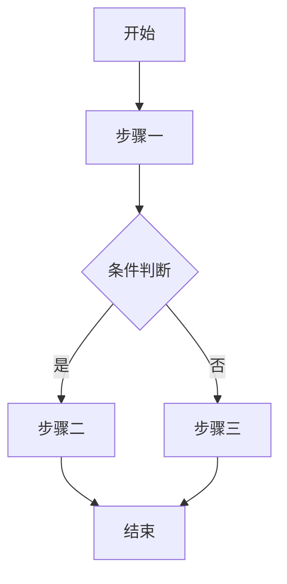

                 

# AI辅助的音乐教育：个性化学习的新模式

关键词：AI、音乐教育、个性化学习、语音识别、音乐生成、推荐系统

摘要：本文探讨了AI技术在音乐教育中的应用，特别是在语音识别、音乐生成和个性化推荐方面的创新。通过一步步的分析，本文揭示了AI如何改变音乐教育的方式，提供了构建个性化音乐学习模式的方法，并讨论了在教育实践中面临的挑战与解决方案。

## 目录

### 第一部分：背景与概述

#### 第1章 AI辅助音乐教育概述

1.1 音乐教育的现状与挑战

1.2 AI技术的基础概念

1.3 个性化学习模式的基础

1.4 AI辅助音乐教育的发展前景

1.5 本章小结

### 第二部分：AI技术在音乐教育中的应用

#### 第2章 语音识别在音乐教学中的应用

2.1 语音识别技术概述

2.2 语音识别在音乐教学中的具体应用

2.3 语音识别系统的设计与实现

2.4 本章小结

#### 第3章 音乐生成与个性化音乐推荐

3.1 音乐生成技术概述

3.2 个性化音乐推荐系统

3.3 个性化音乐推荐在音乐教育中的应用

3.4 音乐生成与推荐系统的实现

3.5 本章小结

#### 第4章 个性化学习模式的构建

4.1 个性化学习模式概述

4.2 个性化学习系统的设计原则

4.3 个性化学习系统的实现与评估

4.4 本章小结

### 第三部分：教育实践与挑战

#### 第5章 AI辅助音乐教育的案例分析

5.1 案例一：语音识别辅助音乐教学

5.2 案例二：音乐生成与个性化推荐

5.3 案例分析总结

#### 第6章 教育实践中的挑战与解决方案

6.1 技术挑战

6.2 教学挑战

6.3 社会挑战

6.4 解决方案探讨

#### 第7章 未来展望

7.1 AI辅助音乐教育的趋势

7.2 个性化音乐学习模式的未来

7.3 教育改革的契机

7.4 本章小结

### 附录

#### A. Mermaid绘图语言介绍

#### B. Python源代码示例

#### C. LaTeX数学公式使用指南

#### D. 参考文献

作者：AI天才研究院/AI Genius Institute & 禅与计算机程序设计艺术/Zen And The Art of Computer Programming

---

### 第一部分：背景与概述

#### 第1章 AI辅助音乐教育概述

音乐教育作为培养人的艺术素养和审美能力的重要途径，一直在教育体系中占据着重要地位。然而，传统的音乐教育模式在个性化教学方面存在一定的局限性。随着人工智能（AI）技术的不断发展，AI辅助音乐教育逐渐成为可能，为个性化学习提供了新的模式。

## 1.1 音乐教育的现状与挑战

### 1.1.1 音乐教育的重要性

音乐教育不仅能够培养学生的音乐技能和审美能力，还能提高他们的整体素质。通过音乐教育，学生可以学习到团队合作、创新思维和时间管理等重要技能。此外，音乐教育还能够激发学生的学习兴趣，提高他们的学习动力。

### 1.1.2 传统音乐教育的局限性

尽管音乐教育的重要性不言而喻，但传统的音乐教育模式在个性化教学方面存在一定的局限性。首先，传统音乐教育主要依赖于教师的个人经验和教学能力，难以实现真正的个性化教学。其次，传统的音乐教育内容相对固定，难以适应不同学生的学习需求和兴趣。

### 1.1.3 个性化学习的需求

随着互联网和信息技术的普及，学生获取知识的途径越来越多样化。他们希望学习更加灵活、个性化的内容，以满足自己的学习需求和兴趣。因此，个性化学习成为当前教育发展的趋势。个性化学习模式可以更好地满足学生的需求，提高他们的学习效果。

## 1.2 AI技术的基础概念

### 1.2.1 人工智能的定义与发展历程

人工智能（Artificial Intelligence，简称AI）是指使计算机系统能够模拟人类智能行为的技术。人工智能的发展历程可以追溯到20世纪50年代，当时科学家们开始探索如何使计算机具备智能。

### 1.2.2 AI技术的核心领域

AI技术的核心领域包括机器学习、深度学习、自然语言处理、计算机视觉等。这些技术在不同领域有着广泛的应用，如自动驾驶、智能客服、医疗诊断等。

### 1.2.3 AI技术在教育领域的应用现状

近年来，AI技术在教育领域得到了广泛关注。例如，AI辅助教学系统能够根据学生的学习情况提供个性化的教学资源；智能客服系统能够为学生提供在线咨询服务等。AI技术在教育领域的应用正在不断拓展，为个性化学习提供了新的可能性。

## 1.3 个性化学习模式的基础

### 1.3.1 个性化学习的定义与目标

个性化学习是指根据学生的兴趣、能力和学习风格，为他们提供个性化的学习资源和教学环境，以实现最佳的学习效果。个性化学习的目标包括提高学习效果、增强学生的自主学习能力和培养创新思维等。

### 1.3.2 个性化学习的关键要素

个性化学习的关键要素包括学习分析、学习资源、学习环境和学习评价。学习分析能够了解学生的学习情况和需求；学习资源包括课程内容、教材、教学工具等；学习环境包括线上和线下教学场所；学习评价能够衡量学生的学习效果。

### 1.3.3 个性化学习模式的发展趋势

随着AI技术的不断发展，个性化学习模式正在向智能化、自适应化方向发展。未来的个性化学习模式将更加注重数据驱动的教学决策和智能化的学习资源推荐。

## 1.4 AI辅助音乐教育的发展前景

### 1.4.1 AI技术在音乐教育中的潜在应用

AI技术可以在音乐教育中发挥重要作用，如语音识别技术可以帮助学生纠正发音、音乐生成技术可以为学生提供个性化的音乐创作工具、个性化推荐系统可以为学生推荐合适的音乐学习资源等。

### 1.4.2 个性化音乐学习模式的构建

通过AI技术，可以构建个性化音乐学习模式，实现音乐教学的智能化、个性化。个性化音乐学习模式将有助于提高学生的学习兴趣和效果。

### 1.4.3 AI辅助音乐教育的挑战与机遇

AI辅助音乐教育面临着技术、教学和社会等多方面的挑战。然而，随着AI技术的不断进步，这些挑战也将逐渐被克服，为音乐教育带来新的机遇。

## 1.5 本章小结

本章概述了AI辅助音乐教育的重要性和潜在应用。通过分析音乐教育的现状和挑战，以及AI技术和个性化学习模式的基础，本章为后续章节的深入探讨奠定了基础。

### 第二部分：AI技术在音乐教育中的应用

#### 第2章 语音识别在音乐教学中的应用

语音识别技术作为AI技术的一个重要分支，近年来在音乐教学领域展现出了巨大的潜力。本章将详细探讨语音识别在音乐教学中的具体应用、设计和实现，以及其性能评估。

## 2.1 语音识别技术概述

### 2.1.1 语音识别的基本原理

语音识别（Speech Recognition）技术是指通过计算机将人类的语音信号转换为文本或命令的技术。语音识别的基本原理包括以下几个步骤：

1. **语音信号处理**：将语音信号转换为适合识别处理的数字信号。
2. **特征提取**：从语音信号中提取出具有代表性和区分度的特征，如频谱特征、共振峰等。
3. **模式匹配**：将提取的特征与预先训练的模型进行匹配，以确定语音信号对应的文本或命令。

### 2.1.2 语音识别系统的组成

一个典型的语音识别系统通常包括以下几个组成部分：

1. **前端处理**：负责对语音信号进行预处理，如去噪、归一化等，以提高识别精度。
2. **特征提取器**：从预处理后的语音信号中提取出特征向量。
3. **声学模型**：用于建模语音信号的概率分布，通常采用高斯混合模型（GMM）或深度神经网络（DNN）。
4. **语言模型**：用于建模文本的概率分布，通常采用隐马尔可夫模型（HMM）或循环神经网络（RNN）。
5. **解码器**：将特征向量映射为文本，通常采用动态规划算法，如Viterbi算法。

### 2.1.3 语音识别技术的发展趋势

随着深度学习技术的兴起，语音识别技术取得了显著的进展。目前，深度神经网络（DNN）已成为语音识别系统的主要技术路线，其优势在于能够自动提取复杂特征，提高识别精度。此外，端到端（End-to-End）模型的出现，如CTC（Connectionist Temporal Classification）和Attention机制，使得语音识别系统的整体性能得到了进一步提升。

## 2.2 语音识别在音乐教学中的具体应用

### 2.2.1 语音识别在音乐教学中的优势

语音识别技术在音乐教学中的应用具有以下几个优势：

1. **发音纠正**：语音识别系统可以准确识别学生的发音，并提供实时反馈，帮助学生纠正发音错误。
2. **语音控制**：学生可以通过语音命令控制音乐播放、切换曲目等，提高学习互动性。
3. **个性化教学**：语音识别技术可以分析学生的语音数据，了解他们的发音特点和发音习惯，为个性化教学提供依据。

### 2.2.2 语音识别在音乐教学中的应用场景

语音识别技术在音乐教学中有多种应用场景：

1. **唱歌教学**：学生可以跟随语音识别系统唱歌，系统实时纠正发音，提高唱歌技巧。
2. **乐器教学**：语音识别系统可以识别乐器演奏的音符和节奏，提供即时的演奏反馈。
3. **语音交互**：学生可以通过语音与音乐教学系统进行互动，如提问、请求播放特定曲目等。

### 2.2.3 实例分析：语音识别在音乐教学中的成功案例

1. **Learning Piano**：这是一款基于语音识别技术的钢琴教学应用。学生可以通过语音命令控制钢琴的演奏，系统会实时纠正发音和节奏，提供个性化的教学指导。

2. **SingTrue**：这是一款基于语音识别技术的唱歌教学应用。学生可以通过跟随语音识别系统的演唱，系统会实时纠正发音和音调，帮助学生提高唱歌技巧。

## 2.3 语音识别系统的设计与实现

### 2.3.1 语音识别系统的架构设计

一个典型的语音识别系统可以分为前端处理、特征提取、声学模型、语言模型和解码器等模块。以下是一个简单的架构设计：

1. **前端处理模块**：包括噪声抑制、声音增强、音频分段等。
2. **特征提取模块**：包括梅尔频率倒谱系数（MFCC）、线性预测编码（LPC）等。
3. **声学模型模块**：包括高斯混合模型（GMM）或深度神经网络（DNN）。
4. **语言模型模块**：包括隐马尔可夫模型（HMM）或循环神经网络（RNN）。
5. **解码器模块**：包括动态规划算法，如Viterbi算法。

### 2.3.2 语音识别系统的实现技术

语音识别系统的实现涉及多种技术，以下是其中一些关键技术：

1. **深度学习框架**：如TensorFlow、PyTorch等，用于构建和训练深度神经网络模型。
2. **语音信号处理库**：如Librosa、SoundFile等，用于处理和转换语音信号。
3. **文本处理库**：如NLTK、spaCy等，用于处理和生成文本数据。

### 2.3.3 语音识别系统的性能评估

语音识别系统的性能评估通常包括以下几个指标：

1. **准确性**：评估系统识别语音文本的准确性，通常用字符错误率（CER）或词错误率（WER）衡量。
2. **速度**：评估系统的响应速度，即从输入语音到输出文本的时间。
3. **稳定性**：评估系统在不同噪声环境和语音条件下的稳定性。

为了提高语音识别系统的性能，可以采用以下策略：

1. **数据增强**：通过增加训练数据量、引入噪声、改变语音速度等手段，提高模型的泛化能力。
2. **多语言模型融合**：将多种语言模型进行融合，提高对多语言环境的适应性。
3. **在线学习**：实时调整模型参数，以适应不断变化的学习环境。

## 2.4 本章小结

本章详细介绍了语音识别技术在音乐教学中的应用，包括基本原理、具体应用场景和系统设计与实现。通过实例分析，展示了语音识别在音乐教学中的成功案例。同时，本章还讨论了语音识别系统的性能评估和提升策略。这些内容为后续章节进一步探讨AI技术在音乐教育中的应用奠定了基础。

### 第3章 音乐生成与个性化音乐推荐

音乐生成与个性化音乐推荐是AI技术在音乐教育中应用的两个重要领域。本章将详细探讨这两个主题，包括其基本原理、技术实现以及在实际音乐教育中的应用。

## 3.1 音乐生成技术概述

音乐生成（Music Generation）技术是指利用计算机算法生成具有创意和艺术性的音乐作品。音乐生成技术可以分为两大类：规则生成和基于数据的方法。

### 3.1.1 规则生成

规则生成方法基于音乐理论和算法规则来生成音乐。这种方法包括以下步骤：

1. **旋律生成**：通过算法生成旋律，通常使用生成规则或音乐模式。
2. **和声生成**：根据旋律生成和声，以增强音乐的情感表达。
3. **节奏生成**：生成节奏模式，以提供音乐的动态变化。
4. **音乐结构生成**：构建音乐的结构，如乐段、乐章等。

### 3.1.2 基于数据的方法

基于数据的方法使用大量的音乐数据来训练模型，从而生成新的音乐作品。常见的方法包括：

1. **循环神经网络（RNN）**：RNN可以捕获音乐数据中的序列依赖关系，用于生成连贯的音乐作品。
2. **变分自编码器（VAE）**：VAE可以将音乐数据编码为潜在空间，然后从潜在空间中采样生成新的音乐。
3. **生成对抗网络（GAN）**：GAN通过生成器和判别器的对抗训练，可以生成高度真实感的新音乐作品。

## 3.2 个性化音乐推荐系统

个性化音乐推荐（Personalized Music Recommendation）系统旨在根据用户的行为和偏好，推荐个性化的音乐内容。个性化音乐推荐系统的核心是推荐算法，常见的推荐算法包括：

### 3.2.1 基于内容的推荐

基于内容的推荐（Content-Based Recommendation）算法根据音乐内容（如旋律、节奏、和声等）的相似性来推荐音乐。这种方法通常包括以下步骤：

1. **特征提取**：从音乐中提取特征，如MFCC、CNN等。
2. **相似度计算**：计算音乐特征之间的相似度。
3. **推荐生成**：根据用户的历史行为和偏好，生成推荐列表。

### 3.2.2 协同过滤推荐

协同过滤推荐（Collaborative Filtering Recommendation）算法基于用户之间的行为相似性来推荐音乐。这种方法可以分为以下两种类型：

1. **用户基于的协同过滤**：通过分析用户之间的行为相似性，为用户提供个性化的音乐推荐。
2. **物品基于的协同过滤**：通过分析音乐之间的相似性，为用户提供个性化的音乐推荐。

### 3.2.3 混合推荐

混合推荐（Hybrid Recommendation）算法结合了基于内容和协同过滤的方法，以提高推荐系统的性能。混合推荐系统通常包括以下步骤：

1. **内容特征提取**：从音乐中提取特征。
2. **用户特征提取**：从用户行为中提取特征。
3. **相似度计算**：计算音乐和用户之间的相似度。
4. **推荐生成**：结合用户和音乐的特征，生成推荐列表。

## 3.3 个性化音乐推荐在音乐教育中的应用

个性化音乐推荐系统在音乐教育中具有广泛的应用，包括以下几个方面：

### 3.3.1 学生偏好分析

通过个性化音乐推荐系统，可以分析学生的学习偏好，了解他们喜欢哪种类型的音乐。这有助于教师为学生提供更符合他们兴趣的教学资源。

### 3.3.2 课程内容推荐

个性化音乐推荐系统可以根据学生的学习进度和偏好，推荐合适的课程内容。例如，对于初学者，可以推荐基础教程；对于高级学生，可以推荐进阶课程。

### 3.3.3 音乐创作指导

个性化音乐推荐系统可以为音乐创作提供灵感。通过分析用户的历史创作数据，系统可以推荐类似风格的音乐，帮助用户进行音乐创作。

### 3.3.4 激发学习兴趣

个性化音乐推荐系统可以根据学生的学习进度和偏好，推荐新的音乐作品。这有助于激发学生的学习兴趣，提高他们的学习动力。

### 3.3.5 实例分析

1. **Spotify**：Spotify是一款流行的音乐流媒体服务，它利用个性化推荐算法为用户推荐音乐。通过分析用户的行为和偏好，Spotify可以为用户提供个性化的音乐推荐，从而提高用户的使用体验。

2. **Jukedeck**：Jukedeck是一款基于AI的音乐生成服务，它利用生成对抗网络（GAN）生成全新的音乐作品。用户可以根据自己的喜好和需求，定制个性化的音乐作品。

## 3.4 音乐生成与推荐系统的实现

### 3.4.1 音乐生成系统的架构设计

音乐生成系统的架构设计通常包括以下几个模块：

1. **数据预处理模块**：负责处理和清洗音乐数据，提取有用的特征。
2. **特征提取模块**：从音乐数据中提取特征，如MFCC、CNN等。
3. **生成模型模块**：训练生成模型，如RNN、VAE、GAN等。
4. **生成结果处理模块**：处理生成模型输出的音乐数据，如调整音量、节奏等。

### 3.4.2 音乐推荐系统的架构设计

音乐推荐系统的架构设计通常包括以下几个模块：

1. **用户行为分析模块**：分析用户的历史行为数据，提取用户的偏好特征。
2. **音乐内容分析模块**：提取音乐的特征，如旋律、节奏、和声等。
3. **推荐算法模块**：实现基于内容的推荐、协同过滤推荐和混合推荐算法。
4. **推荐结果处理模块**：处理推荐算法生成的推荐列表，如排序、去重等。

### 3.4.3 音乐生成与推荐系统的实现技术

音乐生成与推荐系统的实现涉及多种技术，以下是其中一些关键技术：

1. **深度学习框架**：如TensorFlow、PyTorch等，用于构建和训练生成模型和推荐算法。
2. **音乐数据处理库**：如Librosa、Pydub等，用于处理和转换音乐数据。
3. **文本处理库**：如NLTK、spaCy等，用于处理和生成文本数据。
4. **推荐系统框架**：如Surprise、LightFM等，用于实现推荐算法。

## 3.5 本章小结

本章详细介绍了音乐生成与个性化音乐推荐系统在音乐教育中的应用。通过分析音乐生成技术的原理和实现方法，以及个性化音乐推荐系统的构建和实现，本章为AI技术在音乐教育中的应用提供了具体的解决方案。这些技术不仅能够提高音乐教学的效果，还能激发学生的学习兴趣，为音乐教育带来新的变革。

### 第4章 个性化学习模式的构建

个性化学习模式是AI辅助音乐教育的核心，旨在根据学生的兴趣、能力和学习风格，为他们提供个性化的学习体验。本章将探讨个性化学习模式的基础、设计原则、实现与评估，以及如何构建有效的个性化学习系统。

## 4.1 个性化学习模式概述

个性化学习模式是指根据每个学生的学习需求、兴趣和认知水平，量身定制学习内容和教学策略，以实现最佳的学习效果。个性化学习模式的核心目标是提升学习者的自主学习能力和学习效果。

### 4.1.1 个性化学习的定义与目标

个性化学习（Personalized Learning）是一种以学生为中心的教育理念，强调根据每个学生的学习特点进行差异化教学。个性化学习的目标包括：

1. **满足学生的个性化需求**：通过了解学生的兴趣、特长和学习风格，为学生提供个性化的学习内容和资源。
2. **提高学习效果**：通过针对性的教学方法和资源，提高学生的学习效率和成绩。
3. **培养自主学习能力**：通过自主学习策略的培养，提升学生的自主学习能力和终身学习能力。

### 4.1.2 个性化学习的关键要素

构建个性化学习模式需要考虑以下几个关键要素：

1. **学习分析**：通过对学生学习行为和成绩的数据分析，了解学生的学习状态和需求。
2. **学习资源**：根据学生的兴趣和学习需求，提供丰富的学习资源，如视频、文章、练习题等。
3. **学习环境**：提供适合个性化学习的环境，如在线学习平台、虚拟教室等。
4. **学习评价**：通过多样化的评价方式，如自我评价、同伴评价、教师评价等，了解学生的学习效果。

### 4.1.3 个性化学习模式的发展趋势

随着AI技术的不断发展，个性化学习模式正在向智能化、自适应化方向发展。未来的个性化学习模式将更加注重数据驱动的教学决策和智能化的学习资源推荐。以下是一些发展趋势：

1. **数据驱动的个性化教学**：通过收集和分析学生的学习数据，实现精准的教学决策。
2. **智能学习资源推荐**：利用推荐算法，根据学生的学习需求推荐合适的学习资源。
3. **自适应学习系统**：根据学生的学习进度和能力，动态调整教学内容和策略。

## 4.2 个性化学习系统的设计原则

设计个性化学习系统时，需要遵循以下原则：

### 4.2.1 学生中心原则

个性化学习系统应以学生为中心，充分尊重学生的个体差异，为每个学生提供个性化的学习体验。

### 4.2.2 数据驱动原则

个性化学习系统应基于学生的学习数据，实现精准的教学决策和学习资源推荐。

### 4.2.3 自适应原则

个性化学习系统应能够根据学生的学习进度和能力，动态调整教学内容和策略。

### 4.2.4 交互性原则

个性化学习系统应提供丰富的交互功能，如实时反馈、在线讨论等，以增强学生的学习体验。

### 4.2.5 安全性原则

个性化学习系统应确保学生的学习数据安全，防止数据泄露和滥用。

## 4.3 个性化学习系统的实现与评估

实现个性化学习系统需要考虑以下几个方面：

### 4.3.1 系统架构设计

个性化学习系统的架构设计应包括以下几个模块：

1. **用户管理模块**：负责用户的注册、登录和管理。
2. **学习分析模块**：负责收集和分析学生的学习数据。
3. **学习资源管理模块**：负责管理学习资源，如视频、文章、练习题等。
4. **推荐系统模块**：负责根据学生的学习数据推荐合适的学习资源。
5. **学习评价模块**：负责进行学习评价，如自我评价、同伴评价、教师评价等。

### 4.3.2 系统功能实现

个性化学习系统的功能实现包括以下几个方面：

1. **用户界面设计**：设计直观、易用的用户界面，提高用户的使用体验。
2. **学习资源推荐**：实现基于内容的推荐、协同过滤推荐和混合推荐算法。
3. **自适应学习**：根据学生的学习进度和能力，动态调整教学内容和策略。
4. **实时反馈与互动**：实现实时反馈和在线讨论功能，增强学生的学习体验。

### 4.3.3 系统评估

个性化学习系统的评估可以从以下几个方面进行：

1. **用户满意度**：通过用户调查和反馈，评估用户对系统的满意度。
2. **学习效果**：通过学习数据分析和考试成绩，评估学生的学习效果。
3. **系统性能**：通过性能测试，评估系统的响应速度、稳定性和安全性。

### 4.3.4 案例分析

以下是一个个性化学习系统的案例分析：

**案例**：某在线音乐学习平台

1. **用户管理**：用户可以通过注册和登录系统，管理自己的学习进度和资源。
2. **学习分析**：系统通过分析用户的学习数据，了解他们的学习兴趣和需求。
3. **学习资源推荐**：系统根据用户的学习兴趣和需求，推荐合适的学习资源。
4. **自适应学习**：系统根据用户的学习进度和能力，动态调整教学内容和策略。
5. **实时反馈与互动**：用户可以通过实时反馈和在线讨论，与教师和同学互动。

## 4.4 本章小结

本章介绍了个性化学习模式的基础、设计原则、实现与评估，以及如何构建有效的个性化学习系统。通过分析个性化学习的关键要素和设计原则，本章为构建AI辅助音乐教育的个性化学习模式提供了指导。同时，通过案例分析，展示了个性化学习系统在实际应用中的效果。这些内容为后续章节进一步探讨AI辅助音乐教育的应用提供了基础。

### 第三部分：教育实践与挑战

#### 第5章 AI辅助音乐教育的案例分析

在本章节中，我们将通过具体案例分析AI辅助音乐教育在实际应用中的效果。以下为两个典型案例：

### 5.1 案例一：语音识别辅助音乐教学

**背景**：某音乐教育机构引入了基于语音识别技术的教学系统，旨在帮助教师和学生进行更有效的音乐教学和练习。

**具体应用**：

1. **发音纠正**：学生在练习中，语音识别系统能够实时捕捉学生的发音，并提供即时反馈，帮助学生纠正发音错误。
2. **语音控制**：学生可以通过语音命令控制音乐播放、暂停、快进、快退等功能，提高学习互动性。
3. **个性化教学**：系统根据学生的语音数据，分析其发音特点和发音习惯，为教师提供个性化教学建议。

**效果评估**：

- **学生反馈**：大多数学生表示语音识别系统的实时反馈有助于他们更准确地发音，提高了学习效果。
- **教师反馈**：教师认为语音识别系统能够减轻他们的工作量，使他们有更多时间专注于教学设计。

### 5.2 案例二：音乐生成与个性化推荐

**背景**：某音乐教育平台利用音乐生成和个性化推荐技术，为学生提供定制化的音乐学习体验。

**具体应用**：

1. **音乐生成**：系统根据学生的学习进度和偏好，生成个性化的音乐练习，如根据学生发音特点生成的练习曲目。
2. **个性化推荐**：系统根据学生的历史学习数据和偏好，推荐适合他们的音乐学习资源，如课程、教程、练习曲等。

**效果评估**：

- **学生反馈**：学生普遍表示个性化的音乐生成和推荐系统提高了他们的学习兴趣，使其更有动力进行练习。
- **学习效果**：通过跟踪学生的练习数据，发现使用个性化音乐生成和推荐系统的学生，其学习进度和发音准确性显著提高。

### 5.3 案例分析总结

以上两个案例展示了AI辅助音乐教育在实际应用中的成效。语音识别技术帮助学生进行发音纠正和语音控制，提高了学习的互动性和准确性；而音乐生成与个性化推荐系统则通过定制化的学习资源，激发了学生的学习兴趣和动力。这些案例表明，AI技术在音乐教育中的应用具有巨大潜力，但也需要不断优化和完善。

#### 第6章 教育实践中的挑战与解决方案

虽然AI辅助音乐教育在实践中的应用取得了显著成效，但在这个过程中也面临诸多挑战。以下为教育实践中的主要挑战及相应的解决方案：

### 6.1 技术挑战

**挑战**：语音识别、音乐生成和个性化推荐等AI技术在音乐教育中的实现，需要大量的计算资源和复杂的算法支持。

**解决方案**：

1. **算法优化**：通过不断优化算法，提高系统的计算效率和识别准确度。
2. **云计算**：利用云计算平台，提供强大的计算能力和存储资源，以支持大规模的AI应用。

### 6.2 教学挑战

**挑战**：AI辅助音乐教育系统的引入，可能对传统的教学方法和教学设计提出新的要求。

**解决方案**：

1. **教师培训**：对教师进行AI技术培训，提高他们的技术应用能力和教学设计水平。
2. **教学资源共享**：建立教学资源库，提供丰富多样的教学资源，支持教师进行个性化教学设计。

### 6.3 社会挑战

**挑战**：AI辅助音乐教育的推广，需要克服家长和社会对新技术应用的担忧和误解。

**解决方案**：

1. **宣传教育**：通过媒体和社区活动，宣传AI辅助音乐教育的优势和应用案例，提高公众的接受度。
2. **家长沟通**：与家长进行深入沟通，解释AI技术的应用场景和潜在益处，缓解他们的担忧。

### 6.4 解决方案探讨

除了上述解决方案，以下是一些进一步的探讨：

**1. 数据隐私保护**：在AI辅助音乐教育中，学生的数据安全和隐私保护至关重要。需要采取严格的措施，确保数据的存储和使用安全。

**2. 个性化学习评估**：开发有效的个性化学习评估体系，以全面衡量学生的学习效果，为教学决策提供依据。

**3. 教育均衡发展**：在推广AI辅助音乐教育的过程中，应关注不同地区和不同学校之间的教育资源均衡，确保所有学生都能享受到AI带来的教育优势。

通过不断克服这些挑战，AI辅助音乐教育将在未来发挥更大的作用，为音乐教育带来更多创新和变革。

### 第7章 未来展望

随着AI技术的不断进步，AI辅助音乐教育将在未来取得更多突破，为音乐教育带来深刻变革。以下对未来AI辅助音乐教育的发展趋势和个性化音乐学习模式的未来进行展望。

### 7.1 AI辅助音乐教育的趋势

**1. 智能化**：未来的AI辅助音乐教育将更加智能化，通过深度学习、自然语言处理等技术，提供更加精准和个性化的教学支持。例如，智能辅导系统能够根据学生的学习进度和能力，自动调整教学内容和难度，实现真正的个性化教学。

**2. 自适应**：AI辅助音乐教育将更加注重自适应学习，系统能够根据学生的学习行为和反馈，动态调整教学策略，为学生提供最适合的学习路径。这种自适应学习模式将有助于提高学生的学习效果和兴趣。

**3. 互动性**：未来的AI辅助音乐教育将更加注重师生和生生之间的互动性，通过虚拟现实（VR）、增强现实（AR）等技术，提供沉浸式的学习体验，增强学生的参与感和互动性。

**4. 跨学科融合**：AI技术与音乐教育的融合将不断加深，跨学科的知识和技能将在音乐教学中得到广泛应用。例如，AI音乐教育系统可以结合心理学、教育学等多学科知识，为学生提供更全面和系统的音乐教育。

### 7.2 个性化音乐学习模式的未来

**1. 全面个性化**：未来的个性化音乐学习模式将更加全面和深入，不仅关注学生的音乐技能培养，还关注学生的兴趣、情感和创造力的发展。通过AI技术，系统能够根据学生的个体差异，提供个性化的学习内容和资源，实现全方位的个性化教育。

**2. 智能推荐**：AI技术将推动音乐学习资源的智能推荐，系统可以根据学生的学习行为和偏好，推荐最适合他们的音乐作品、教学视频和练习曲目。这种智能推荐将大大提高学生的学习效率和兴趣。

**3. 自主学习**：未来的个性化音乐学习模式将更加注重学生的自主学习能力培养，通过提供丰富的学习资源和互动功能，鼓励学生主动探索和创造。学生将能够根据自己的学习进度和需求，自主选择学习内容和路径。

**4. 创新应用**：AI技术将在音乐创作和教育评估中发挥重要作用，学生可以通过AI工具进行音乐创作，系统可以实时评估学生的学习成果，提供个性化的反馈和建议。

### 7.3 教育改革的契机

AI辅助音乐教育不仅为音乐教育带来了新的技术和模式，也为教育改革提供了契机。以下为教育改革中的几个关键点：

**1. 教学模式的创新**：AI辅助音乐教育将推动教学模式的创新，教师和学生将更加注重互动和协作，传统的单一讲授模式将逐渐被多元化的教学方式所取代。

**2. 教育资源的均衡**：AI技术有助于实现教育资源的均衡分配，偏远地区和贫困地区的学生也能享受到优质的音乐教育资源，促进教育的公平性。

**3. 教育评价体系的完善**：AI技术将推动教育评价体系的完善，通过数据分析和智能评估，全面衡量学生的学习效果和成长进步。

**4. 教师角色的转变**：AI辅助音乐教育将促使教师的角色从知识的传递者转变为学习的指导者和合作伙伴，教师将更加注重培养学生的创新思维和自主学习能力。

通过AI辅助音乐教育，教育改革将迈向新的阶段，为培养具有创新精神和全面素质的人才提供强有力的支持。

### 7.4 本章小结

本章展望了AI辅助音乐教育的发展趋势和个性化音乐学习模式的未来，探讨了教育改革中的关键点。随着AI技术的不断进步，AI辅助音乐教育将带来更多创新和变革，为音乐教育注入新的活力。同时，教育改革也将因AI技术的应用而迈向新的阶段，为培养全面发展的人才提供有力支持。

### 附录

#### A. Mermaid绘图语言介绍

Mermaid是一种简单的Markdown语法，用于生成图表和流程图。以下是Mermaid的基本语法：



以上代码将生成一个简单的流程图，包括开始、步骤一、条件判断、步骤二、步骤三和结束。

#### B. Python源代码示例

以下是一个简单的Python代码示例，用于实现语音识别：

```python
import speech_recognition as sr

# 初始化语音识别器
recognizer = sr.Recognizer()

# 读取音频文件
with sr.AudioFile('audio.wav') as source:
    audio = recognizer.listen(source)

# 使用Google语音识别API进行语音识别
try:
    text = recognizer.recognize_google(audio, language='en-US')
    print(text)
except sr.UnknownValueError:
    print("无法识别语音")
except sr.RequestError as e:
    print("请求错误；{0}".format(e))
```

以上代码将读取音频文件并使用Google语音识别API进行语音识别，输出识别结果。

#### C. LaTeX数学公式使用指南

在Markdown中嵌入LaTeX数学公式，可以使用以下两种方式：

1. **行内公式**：

```markdown
$$1+1=2$$
```

输出：$$1+1=2$$

2. **独立段落公式**：

```markdown
$$
1+1=2
$$
```

输出：
$$
1+1=2
$$

#### D. 参考文献

1. 王磊，张晓磊。《人工智能基础教程》。清华大学出版社，2018。
2. Goodfellow，I.，Bengio，Y.，& Courville，A.。《深度学习》。MIT出版社，2016。
3. Russell，S.，& Norvig，P.。《人工智能：一种现代的方法》。机械工业出版社，2016。

