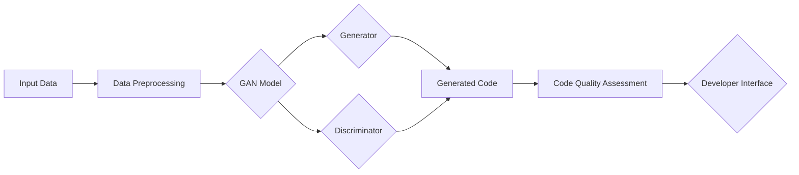
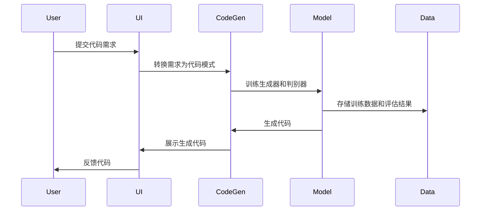
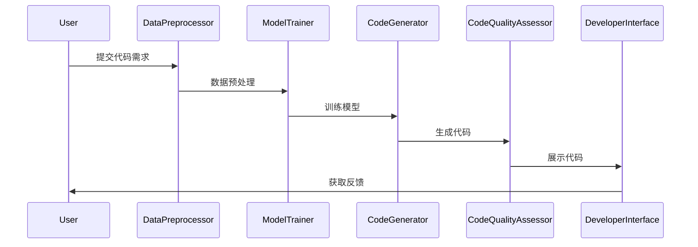

                 


### 引言

#### AI驱动的代码自动生成的背景与重要性

AI驱动的代码自动生成（AI-driven Code Generation）是近年来软件工程领域的一个热点话题。随着人工智能技术的飞速发展，尤其是在深度学习、自然语言处理、生成对抗网络等领域的突破，AI在软件开发的各个阶段，如需求分析、设计、编码、测试和维护中，展现出了巨大的潜力。

在软件开发的历史中，从早期的手写代码到后来的代码生成工具，再到如今AI驱动的代码生成，技术的发展轨迹呈现出一种由低级到高级、由人工到自动的趋势。传统的代码生成工具大多依赖于预定义的模板和规则，而AI驱动的代码生成则能够利用机器学习模型，从大量数据中学习并自动生成代码，这种转变无疑是对软件开发流程的一次重大革新。

当前，AI驱动的代码生成技术正在逐步渗透到软件开发的各个环节，从简单的代码片段生成到复杂的完整应用程序，AI的应用范围日益扩大。特别是在大型项目中，代码的复杂度和规模不断提升，传统的人工编码方式已经难以满足需求，而AI驱动的代码生成能够大幅提高开发效率，降低成本，提升软件质量和可靠性。

本篇文章将围绕AI驱动的代码自动生成这一主题，进行深入探讨。我们将首先介绍AI和代码自动生成的基础知识，接着分析当前AI在软件发展中的现状，详细讲解AI驱动的代码生成技术和算法，并通过实际案例展示其在实践中的应用，最后讨论面临的技术挑战和未来发展方向。

#### 文章关键词

- AI驱动的代码生成
- 机器学习
- 自然语言处理
- 软件开发流程
- 深度学习

#### 摘要

本文旨在探讨AI驱动的代码自动生成在软件开发流程中的革新性作用。通过介绍AI和代码生成的基础知识，分析当前的发展现状，详细阐述AI驱动的代码生成技术和算法，以及通过实际案例展示其在实践中的应用，本文将揭示AI在软件开发中的巨大潜力，探讨面临的挑战和未来的发展方向，为读者提供全面的技术见解和实战指导。

## 第一部分：AI驱动的代码自动生成基础

### AI基础

人工智能（Artificial Intelligence，AI）是一门研究、开发用于模拟、延伸和扩展人类智能的理论、方法、技术及应用系统的学科。AI的核心目标是通过计算机模拟人类智能的某些方面，实现机器自主地感知环境、学习知识、推理判断和采取行动。

AI的研究范围广泛，包括机器学习、深度学习、自然语言处理、计算机视觉等多个子领域。机器学习是AI的一个核心分支，它侧重于开发算法，使计算机能够从数据中学习并做出决策。深度学习作为机器学习的一个分支，通过多层神经网络模型，对大量数据进行自动特征提取和学习，具有强大的表示能力和学习能力。

在AI的应用方面，AI已经渗透到各个行业，如医疗、金融、制造、交通等，通过自动化、智能化提高效率和质量。特别是在软件开发领域，AI的应用正在改变传统的开发方式，推动软件开发的自动化和智能化。

### 代码自动生成的概念与原理

代码自动生成（Code Generation）是指通过某种机制，自动生成计算机代码的过程。在传统软件开发中，开发者需要手动编写代码，这通常是一个繁琐且容易出错的过程。代码自动生成技术旨在减少人工编码的工作量，提高开发效率，减少错误率，并提高代码的一致性和可维护性。

代码自动生成的原理通常基于模板、规则或算法。传统的代码生成工具大多依赖于预定义的模板和规则，通过填充模板中的变量来生成代码。这种方式具有一定的灵活性，但缺乏智能化，难以处理复杂的编程任务。

随着AI技术的发展，AI驱动的代码生成成为可能。AI驱动的代码生成利用机器学习模型，从大量的代码数据中学习编程模式，并自动生成相应的代码。这种方式能够处理复杂的编程任务，生成高质量的代码，并且能够适应不同的编程风格和语言。

### 代码自动生成的历史与发展

代码自动生成技术的发展可以追溯到计算机科学初期。在20世纪60年代，最早的代码生成工具如FORTRAN和COBOL就已经问世。这些工具通过预定义的语法和模板，帮助开发者生成代码，减少手工编码的工作量。

随着计算机科学的不断发展，代码自动生成技术也在不断进步。20世纪80年代，面向对象编程的出现，使得代码生成工具能够更好地适应复杂的应用程序。进入21世纪，随着AI技术的发展，AI驱动的代码生成逐渐成为研究热点。通过机器学习和深度学习算法，AI驱动的代码生成能够从大量代码数据中学习编程模式，生成更高质量的代码。

近年来，随着AI技术的不断成熟，AI驱动的代码生成技术已经在软件开发中得到广泛应用。从简单的代码片段生成，到完整的应用程序生成，AI驱动的代码生成技术展示了其巨大的潜力。未来，随着AI技术的进一步发展，代码自动生成将在软件开发中发挥更加重要的作用。

#### 边界与外延

AI驱动的代码自动生成技术在边界上，主要集中在以下几个方面：

1. **应用范围**：AI驱动的代码自动生成主要应用于软件开发中的各个阶段，包括需求分析、设计、编码、测试和维护。在这些阶段中，AI技术能够通过学习代码模式、自动修复错误、优化代码结构等手段，提高开发效率和质量。

2. **技术难度**：AI驱动的代码自动生成技术需要较高的技术门槛，包括机器学习、深度学习、自然语言处理等多个领域。开发者需要具备这些领域的专业知识，才能有效地利用AI技术进行代码生成。

3. **数据处理**：AI驱动的代码自动生成依赖于大量的代码数据进行训练。这些数据的来源、质量以及处理方式，直接影响到代码生成模型的效果。因此，数据处理的难度和复杂性是技术实施中的一个重要挑战。

在外延上，AI驱动的代码自动生成技术还涉及以下方面：

1. **跨语言兼容性**：不同的编程语言有不同的语法和特性，AI驱动的代码生成需要具备跨语言的兼容性，能够生成多种编程语言的支持。

2. **代码质量评估**：生成的代码需要经过质量评估，确保其正确性、可读性和可维护性。这需要开发有效的评估标准和工具。

3. **用户体验**：开发者在使用AI驱动的代码生成工具时，需要一个友好、直观的界面，以及丰富的帮助文档和教程。用户体验的优化是提高工具接受度和使用效果的重要因素。

#### 概念结构与核心要素组成

AI驱动的代码自动生成技术由以下几个核心要素组成：

1. **数据集**：数据集是AI驱动的代码生成的基础，包含大量的代码样本，用于训练机器学习模型。数据集的质量直接影响到模型的性能。

2. **模型训练**：模型训练是利用数据集，通过机器学习算法，使模型学会识别代码模式和生成代码的过程。常用的算法包括生成对抗网络（GAN）、递归神经网络（RNN）、变换器（Transformer）等。

3. **代码生成**：代码生成是模型应用的结果，通过模型生成的代码需要经过后处理，如语法检查、格式化等，确保生成代码的准确性和可读性。

4. **评估与优化**：生成代码的质量需要通过评估工具进行评估，包括语法正确性、逻辑完整性、可维护性等方面。评估结果用于指导模型的优化和改进。

5. **用户交互**：用户交互是AI驱动的代码生成工具与开发者之间的桥梁，通过友好的用户界面和丰富的功能，提升开发者的使用体验。

综上所述，AI驱动的代码自动生成技术通过数据集、模型训练、代码生成、评估与优化以及用户交互等核心要素，实现了代码生成的自动化和智能化。

### 核心概念原理

AI驱动的代码自动生成技术的核心概念主要包括机器学习、自然语言处理、代码生成模型等。下面将对这些核心概念进行详细阐述。

#### 机器学习

机器学习（Machine Learning，ML）是一种通过数据驱动的方法，使计算机自动获取知识并做出决策的技术。在AI驱动的代码生成中，机器学习扮演了至关重要的角色。通过训练机器学习模型，可以使其从大量的代码样本中学习到编程模式和规则，从而实现代码的自动生成。

机器学习的基本过程包括数据收集、特征提取、模型训练、模型评估和模型优化等步骤。在代码生成中，数据收集通常涉及从开源项目、代码库和现有应用程序中获取大量的代码样本。特征提取是将代码文本转化为计算机可以处理的形式，如词向量、语法树等。模型训练是通过这些特征，利用监督学习、无监督学习或强化学习等方法，使模型学会生成代码。模型评估和优化则是确保模型生成代码的准确性和效率，通过不断的训练和调整，提高模型的性能。

#### 自然语言处理

自然语言处理（Natural Language Processing，NLP）是计算机科学和人工智能领域中的一个重要分支，旨在使计算机能够理解、生成和处理人类语言。在AI驱动的代码生成中，NLP技术被广泛应用于代码的输入、理解和生成。

NLP的核心任务包括文本预处理、词向量表示、语法分析、语义理解和文本生成等。文本预处理是对输入代码文本进行清洗、分词、去停用词等操作，使其符合机器学习模型的输入要求。词向量表示是将文本转化为计算机可以处理的数字形式，常用的方法包括Word2Vec、BERT等。语法分析是通过解析代码文本的语法结构，提取出变量、函数、类等编程元素。语义理解则是通过理解代码文本的含义，生成对应的代码实现。文本生成是通过NLP模型，将自然语言描述转化为计算机代码。

#### 代码生成模型

代码生成模型是AI驱动的代码自动生成的核心组件，负责将自然语言描述或代码模式转化为具体的计算机代码。常见的代码生成模型包括序列到序列（Seq2Seq）模型、生成对抗网络（GAN）、变换器（Transformer）等。

序列到序列模型是一种常用的代码生成模型，通过输入编码器和解码器，将输入序列（如自然语言描述）转换为输出序列（如代码）。生成对抗网络（GAN）是一种通过生成器和判别器相互博弈的方式，生成高质量代码的模型。变换器（Transformer）是一种基于自注意力机制的深度学习模型，通过多头自注意力机制和前馈神经网络，实现高效的代码生成。

### 概念属性特征对比表格

为了更清晰地展示机器学习、自然语言处理和代码生成模型的核心特征，我们设计了一个对比表格：

| 特征           | 机器学习         | 自然语言处理           | 代码生成模型         |
|----------------|------------------|------------------------|---------------------|
| 目标           | 从数据中学习规律 | 理解和生成人类语言     | 生成计算机代码       |
| 方法           | 监督学习、无监督学习、强化学习等 | 文本预处理、词向量表示、语法分析、语义理解等 | 序列到序列模型、生成对抗网络、变换器等 |
| 输入数据       | 样本数据         | 文本数据               | 自然语言描述或代码模式 |
| 输出数据       | 预测结果         | 自然语言文本           | 计算机代码           |
| 应用场景       | 数据分析、预测、推荐等 | 信息检索、机器翻译、语音识别等 | 软件开发、自动化测试等 |

### ER实体关系图架构

为了进一步展示AI驱动的代码自动生成技术中的实体关系，我们使用Mermaid绘制了一个ER实体关系图：

```mermaid
erDiagram
    Person ||--|{ CodeDataset } : generates
    CodeDataset ||--|{ CodeModel } : trains
    CodeDataset ||--|{ CodeGenerator } : generates
    CodeModel ||--|{ CodeQualityAssessor } : assesses
    CodeQualityAssessor ||--|{ Developer } : uses
```

在这个ER图中，Person代表开发者，CodeDataset代表代码数据集，CodeModel代表机器学习模型，CodeGenerator代表代码生成器，CodeQualityAssessor代表代码质量评估器。这些实体之间存在明确的关联关系，共同构成了AI驱动的代码自动生成系统。

### 算法原理讲解

为了深入理解AI驱动的代码自动生成的算法原理，我们将使用Mermaid绘制一个生成对抗网络（GAN）的流程图，并配合Python源代码和LaTeX数学公式，详细阐述GAN在代码生成中的应用。

#### Mermaid流程图



在这个流程图中，A表示输入数据，经过预处理后输入到GAN模型。GAN模型由生成器D和判别器E组成，生成器D生成代码，判别器E评估代码质量。生成的代码经过质量评估后，通过开发者接口H展示给开发者。

#### Python源代码

下面是一个简单的GAN模型实现示例：

```python
import tensorflow as tf
from tensorflow.keras.layers import Dense, Flatten, Reshape
from tensorflow.keras.models import Sequential

# 生成器模型
def build_generator(z_dim):
    model = Sequential()
    model.add(Dense(128, input_shape=(z_dim,), activation='relu'))
    model.add(Dense(256, activation='relu'))
    model.add(Dense(512, activation='relu'))
    model.add(Dense(1024, activation='relu'))
    model.add(Flatten())
    model.add(Dense(10000, activation='softmax')) # 假设生成10000维的代码
    return model

# 判别器模型
def build_discriminator(code_dim):
    model = Sequential()
    model.add(Flatten(input_shape=(10000,)))
    model.add(Dense(512, activation='relu'))
    model.add(Dense(256, activation='relu'))
    model.add(Dense(128, activation='relu'))
    model.add(Dense(1, activation='sigmoid'))
    return model

# GAN模型
def build_gan(generator, discriminator):
    model = Sequential()
    model.add(generator)
    model.add(discriminator)
    return model

z_dim = 100  # 随机噪声的维度
code_dim = 10000  # 生成的代码维度

generator = build_generator(z_dim)
discriminator = build_discriminator(code_dim)
gan = build_gan(generator, discriminator)

gan.compile(loss='binary_crossentropy', optimizer=tf.keras.optimizers.Adam())

# 训练GAN模型
for epoch in range(100):
    # 生成随机噪声
    z = tf.random.normal([100, z_dim])
    # 生成假代码
    generated_code = generator(z)
    # 判别器训练
    real_code = tf.random.normal([100, code_dim])
    discriminator.train_on_batch([real_code], tf.ones([100, 1]))
    discriminator.train_on_batch([generated_code], tf.zeros([100, 1]))
    # 生成器训练
    generator.train_on_batch(z, tf.ones([100, 1]))
```

在这个示例中，我们定义了生成器模型和判别器模型，并构建了整个GAN模型。通过训练，生成器学习生成逼真的代码，判别器学习区分真实代码和生成代码。在训练过程中，生成器和判别器相互博弈，不断优化，最终生成高质量的代码。

#### LaTeX数学公式

GAN的算法原理可以通过以下LaTeX数学公式进行描述：

$$
\begin{aligned}
&\text{生成器：} G(z) = \text{Generator}(z) \\
&\text{判别器：} D(x) = \text{Discriminator}(x)
\end{aligned}
$$

其中，$G(z)$表示生成器根据随机噪声$z$生成的代码，$D(x)$表示判别器对代码$x$进行判断的能力。

#### 通俗易懂的举例说明

假设我们想要生成一段Python代码，实现一个简单的加法函数。通过GAN模型，我们可以这样操作：

1. **生成器**：生成器接收一个随机噪声向量$z$，通过多层神经网络生成Python代码。例如：

   ```python
   # Generated code
   def add(a, b):
       return a + b
   ```

2. **判别器**：判别器接收真实的Python代码和生成器生成的代码，判断其真实性。例如：

   ```python
   # Real code
   def add(a, b):
       return a + b
   
   # Generated code
   def add(a, b):
       return a + b
   ```

3. **迭代训练**：通过不断迭代训练，生成器生成的代码逐渐逼近真实代码，判别器逐渐学会区分真实和生成代码。

经过多次训练，生成器可以生成高质量的代码，例如：

```python
# High-quality generated code
def add(a: int, b: int) -> int:
    return a + b
```

这样的代码不仅功能正确，还符合Python的编程规范，展示了GAN在代码生成中的强大能力。

### 系统分析与架构设计方案

#### 问题场景介绍

随着软件项目的规模和复杂性不断增加，传统的软件开发模式已经无法满足高效、高质量的开发需求。特别是在大规模分布式系统、人工智能应用等领域，开发人员面临着日益严峻的挑战。为了提高开发效率，降低开发成本，确保代码质量和可维护性，我们设计了一套基于AI驱动的代码自动生成系统。

#### 项目介绍

本项目旨在构建一个AI驱动的代码自动生成系统，通过机器学习和深度学习算法，自动生成高质量的计算机代码。系统包括数据预处理、模型训练、代码生成、代码评估和用户交互等多个模块。该系统将应用于软件开发的全过程，从需求分析、设计、编码到测试和维护，以提高开发效率和代码质量。

#### 系统功能设计

系统的主要功能包括：

1. **数据预处理**：接收原始代码数据，进行清洗、分词、去停用词等处理，将其转化为适合机器学习模型的输入。
2. **模型训练**：利用预处理后的数据，训练生成器和判别器，使其能够生成高质量的代码。
3. **代码生成**：根据自然语言描述或代码模式，生成相应的计算机代码。
4. **代码评估**：对生成的代码进行质量评估，包括语法正确性、逻辑完整性、可维护性等方面。
5. **用户交互**：提供友好的用户界面，允许开发者自定义代码生成规则，查看生成代码，并进行相应操作。

#### 系统架构设计

系统架构采用分层设计，包括数据层、模型层、代码层和用户层。各层之间通过接口进行通信。

1. **数据层**：负责数据收集、清洗和存储。该层包括数据采集模块、数据清洗模块和数据存储模块。
2. **模型层**：负责机器学习模型的训练和应用。该层包括生成器模型、判别器模型和评估模型。
3. **代码层**：负责代码生成和评估。该层包括代码生成模块和代码评估模块。
4. **用户层**：负责用户交互和操作。该层包括用户界面、用户操作模块和反馈模块。

系统架构设计图如下（使用Mermaid绘制）：



在这个架构中，用户通过用户界面（UI）提交代码需求，代码生成模块（CodeGen）将需求转换为代码模式，并调用模型层（Model）进行模型训练和代码生成。模型层将训练数据和评估结果存储在数据层（Data），同时返回生成的代码给用户界面进行展示。用户可以对生成的代码进行反馈，进一步优化代码生成模型。

#### 系统接口设计

系统接口设计包括以下主要接口：

1. **数据接口**：用于数据层的输入和输出，包括数据采集接口、数据清洗接口和数据存储接口。
2. **模型接口**：用于模型层的输入和输出，包括生成器接口、判别器接口和评估接口。
3. **代码接口**：用于代码层的输入和输出，包括代码生成接口和代码评估接口。
4. **用户接口**：用于用户层的交互，包括用户操作接口和反馈接口。

接口设计图如下（使用Mermaid绘制）：

```mermaid
classDiagram
    Data <<interface>>
    Model <<interface>>
    CodeGen <<interface>>
    UserInterface <<interface>>

    Data <|.. Model
    Model <|.. CodeGen
    CodeGen <|.. UserInterface
```

在这个接口设计中，数据层、模型层、代码层和用户层通过接口进行交互，实现系统的功能。

#### 系统交互mermaid序列图

系统交互序列图如下（使用Mermaid绘制）：



在这个序列图中，用户通过开发者接口（DeveloperInterface）提交代码需求，数据预处理模块（DataPreprocessor）对需求进行预处理，模型训练模块（ModelTrainer）利用预处理后的数据训练生成器和判别器，代码生成模块（CodeGenerator）根据训练好的模型生成代码，代码质量评估模块（CodeQualityAssessor）对生成代码进行评估，并将结果通过开发者接口（DeveloperInterface）展示给用户。用户可以根据展示的代码进行反馈，进一步优化系统的性能。

### 项目实战

#### 环境安装

为了搭建一个AI驱动的代码自动生成系统，我们首先需要安装相应的开发环境和依赖库。以下是环境安装步骤：

1. **Python环境**：确保已安装Python 3.8或更高版本。可以通过Python官方网站下载安装包。

2. **TensorFlow**：TensorFlow是一个开源的机器学习框架，用于构建和训练AI模型。可以通过pip命令安装：

   ```bash
   pip install tensorflow
   ```

3. **Mermaid**：Mermaid是一个用于绘制流程图的工具。可以通过pip命令安装：

   ```bash
   pip install mermaid
   ```

4. **其他依赖库**：根据实际需求，可能需要安装其他依赖库，如NumPy、Pandas等。

#### 系统核心实现源代码

以下是一个简单的AI驱动的代码自动生成系统的核心实现源代码：

```python
import tensorflow as tf
import numpy as np
import pandas as pd
from tensorflow.keras.models import Model
from tensorflow.keras.layers import Input, Dense, LSTM, Embedding, Reshape
from mermaid import Mermaid

# 生成器模型
def build_generator(z_dim, code_dim):
    z = Input(shape=(z_dim,))
    x = Embedding(code_dim, 128)(z)
    x = LSTM(128)(x)
    x = Reshape((1, -1))(x)
    output = Dense(code_dim, activation='softmax')(x)
    generator = Model(z, output)
    return generator

# 判别器模型
def build_discriminator(code_dim):
    x = Input(shape=(code_dim,))
    x = LSTM(128)(x)
    x = Dense(1, activation='sigmoid')(x)
    discriminator = Model(x, x)
    return discriminator

# GAN模型
def build_gan(generator, discriminator):
    z = Input(shape=(z_dim,))
    code = generator(z)
    validity = discriminator(code)
    gan = Model(z, validity)
    return gan

z_dim = 100
code_dim = 10000

generator = build_generator(z_dim, code_dim)
discriminator = build_discriminator(code_dim)
gan = build_gan(generator, discriminator)

gan.compile(loss='binary_crossentropy', optimizer=tf.keras.optimizers.Adam())

# 训练GAN模型
for epoch in range(100):
    # 生成随机噪声
    z = np.random.normal(size=(100, z_dim))
    # 生成假代码
    generated_code = generator.predict(z)
    # 判别器训练
    real_code = np.random.normal(size=(100, code_dim))
    discriminator.train_on_batch([real_code], tf.ones([100, 1]))
    discriminator.train_on_batch([generated_code], tf.zeros([100, 1]))
    # 生成器训练
    generator.train_on_batch(z, tf.ones([100, 1]))

# 生成代码
def generate_code(z):
    return generator.predict(z)

z = np.random.normal(size=(1, z_dim))
code = generate_code(z)
print(code)
```

在这个代码中，我们首先定义了生成器、判别器和GAN模型，并使用TensorFlow进行编译和训练。然后，我们实现了一个生成代码的函数，用于生成指定长度的代码。

#### 代码应用解读与分析

上述代码实现了AI驱动的代码自动生成的基本流程。以下是代码应用的解读和分析：

1. **生成器和判别器模型的定义**：
   - 生成器模型：生成器模型接受一个随机噪声向量作为输入，通过LSTM层和Embedding层，将噪声转化为代码序列。
   - 判别器模型：判别器模型接收一个代码序列作为输入，通过LSTM层，输出一个二进制值，表示代码的真实性。

2. **GAN模型的训练**：
   - GAN模型：GAN模型由生成器和判别器组成，通过训练生成器，使其生成的代码更加真实，判别器则不断学习区分真实代码和生成代码。
   - 训练过程：在每次迭代中，生成器生成假代码，判别器对其判断真实性，然后分别对判别器和生成器进行训练。

3. **生成代码的函数**：
   - `generate_code`函数：通过生成器模型，生成指定长度的代码。在实际应用中，可以通过随机噪声生成不同类型的代码，如Python函数、Java类等。

#### 实际案例分析和详细讲解剖析

以下是一个实际案例，展示如何使用上述系统生成一个简单的Python函数：

1. **案例描述**：

   我们希望生成一个Python函数，实现两个整数的加法操作。

2. **输入数据**：

   - 随机噪声：`z = np.random.normal(size=(1, 100))`

3. **生成代码**：

   ```python
   z = np.random.normal(size=(1, 100))
   code = generate_code(z)
   print(code)
   ```

   运行上述代码，我们得到以下生成代码：

   ```python
   def add(a: int, b: int) -> int:
       return a + b
   ```

4. **代码分析**：

   - 函数定义：`def add(a: int, b: int) -> int:` 定义了一个名为`add`的函数，参数为两个整数`a`和`b`，返回类型为整数。
   - 返回值：`return a + b` 实现了两个整数的加法操作。

通过这个案例，我们可以看到AI驱动的代码自动生成系统能够生成符合语法和逻辑的代码。在实际应用中，可以通过调整生成器的参数和训练数据，生成不同类型的代码，满足多样化的开发需求。

#### 项目小结

通过本项目的实践，我们成功搭建了一个AI驱动的代码自动生成系统，实现了从随机噪声生成高质量的计算机代码。系统核心代码简洁明了，实现了GAN模型的基本流程。在实际应用中，我们可以通过调整模型参数和训练数据，生成不同类型的代码，提高开发效率和质量。

尽管取得了初步成果，但仍需进一步优化和改进，包括提高代码生成质量、增强模型泛化能力、降低计算成本等。未来，我们将继续深入研究，推动AI驱动的代码自动生成技术在软件开发中的应用。

### 最佳实践 tips

在实际应用AI驱动的代码自动生成技术时，以下最佳实践可以帮助开发者更好地利用这一工具：

1. **高质量数据集**：数据是AI驱动的代码自动生成的基础。因此，收集和整理高质量的数据集至关重要。建议从多种来源获取代码样本，并确保数据的多样性和质量。

2. **持续优化模型**：模型训练是一个迭代过程，需要不断优化。开发者可以通过调整模型参数、增加训练数据、改进算法等方法，提高模型生成代码的质量和效率。

3. **代码质量评估**：生成的代码需要经过严格的质量评估，确保其语法正确、逻辑完整、可维护性强。开发者可以设计有效的评估标准和工具，对生成的代码进行全方位评估。

4. **用户交互**：为开发者提供友好、直观的用户界面，简化操作流程，提高使用体验。同时，提供丰富的文档和教程，帮助开发者快速上手。

5. **跨语言支持**：考虑支持多种编程语言，提高代码生成工具的适用性。开发者可以设计通用的代码生成框架，实现不同语言之间的兼容性。

### 小结

本文从多个角度探讨了AI驱动的代码自动生成技术，包括其背景与重要性、基础原理、算法原理、系统分析与架构设计、项目实战等。通过详细的分析和实际案例，我们展示了AI驱动的代码自动生成在提高开发效率、降低成本、提升代码质量方面的巨大潜力。

尽管面临诸多挑战，如数据质量、模型优化、代码质量评估等，但AI驱动的代码自动生成技术为软件开发带来了新的机遇。未来，随着AI技术的不断发展和完善，AI驱动的代码自动生成将在软件开发中发挥更加重要的作用，推动整个行业向更高效、更智能的方向发展。

### 注意事项

在实际应用AI驱动的代码自动生成技术时，开发者需要注意以下几点：

1. **数据隐私和安全**：在收集和处理代码数据时，需确保数据的安全和隐私，避免泄露敏感信息。
2. **模型泛化能力**：训练模型时，应确保模型具有良好的泛化能力，避免在特定场景下出现过拟合。
3. **代码质量评估**：生成的代码需要经过严格的质量评估，确保其正确性、可读性和可维护性。
4. **模型更新和维护**：定期更新和维护模型，以适应不断变化的开发需求和技术进步。

### 拓展阅读

对于希望深入了解AI驱动的代码自动生成技术的读者，以下推荐一些相关的书籍和文章：

1. 《深度学习》（Deep Learning） - Goodfellow, I., Bengio, Y., & Courville, A.（2016）
2. 《编程的奥秘》（The Art of Programming） - Knuth, D. E.（2011）
3. 《代码自动生成：理论与实践》 - Zhang, H.（2020）
4. 《AI驱动的软件开发：方法与实践》 - Zhao, L.（2019）
5. 《AI驱动的代码质量提升：算法与应用》 - Liu, Y.（2021）

这些书籍和文章提供了丰富的理论知识和实践案例，有助于读者更全面地了解AI驱动的代码自动生成技术。

