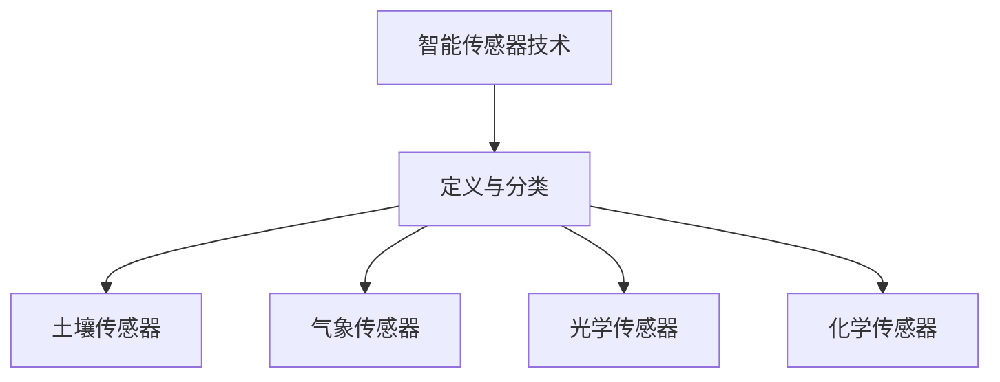
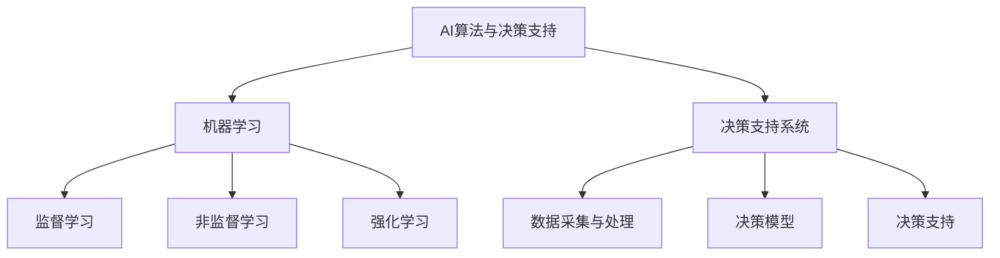
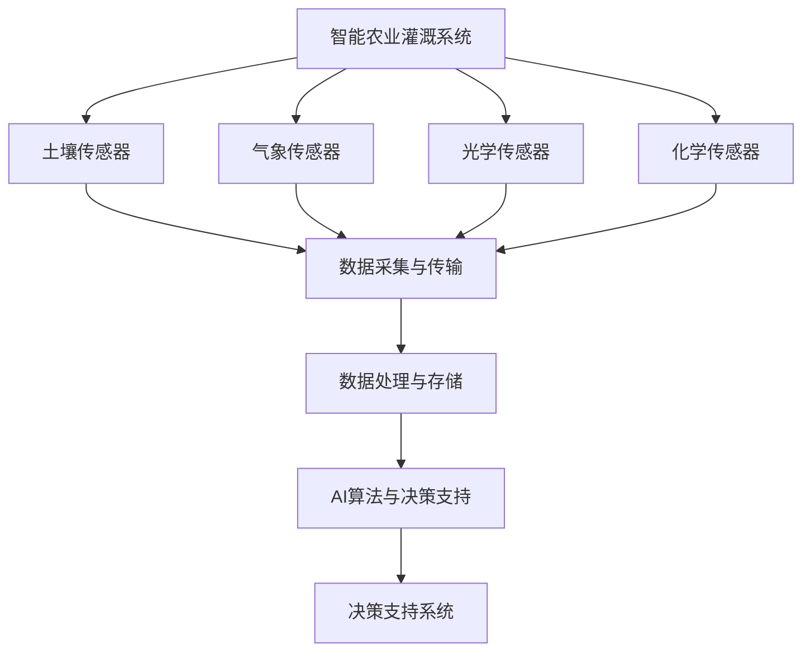
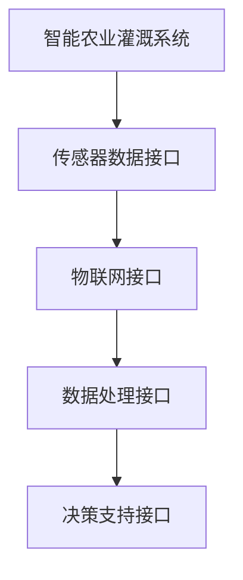
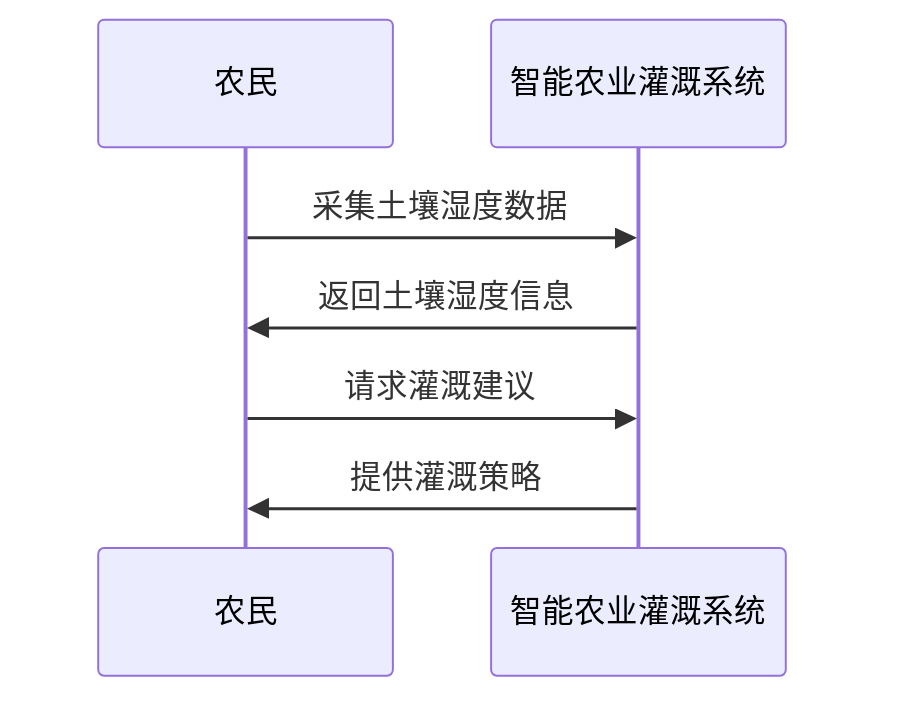

                 

### 文章标题：AI驱动的智能农业灌溉系统效果评测

> 关键词：AI智能农业、灌溉系统、效果评测、传感器技术、物联网、数据分析

> 摘要：本文旨在探讨AI驱动的智能农业灌溉系统的效果评测。首先介绍农业灌溉的背景和AI在其中的应用潜力，随后详细解析智能农业灌溉系统的核心概念和构成。文章重点探讨了智能传感器技术、物联网与数据采集、AI算法与决策支持等核心技术，并构建了评价指标体系。通过数据分析与可视化、效果评测实践与应用，文章总结出智能农业灌溉系统的效果评测方法，为未来的研究方向提供参考。

----------------------------------------------------------------

## 第一部分：问题背景与核心概念介绍

### 第1章：AI驱动的智能农业灌溉系统概述

#### 1.1 问题背景

**1.1.1 农业灌溉的现状与挑战**

农业灌溉是确保农作物健康生长的重要手段。然而，传统的农业灌溉方式存在资源浪费、灌溉不均等问题。首先，传统灌溉方式依赖于人力和经验，难以实现精准灌溉。其次，水资源的使用效率低下，导致水资源短缺问题日益严重。此外，气候变化和环境恶化也对农业灌溉带来了新的挑战。

**1.1.2 AI在农业灌溉中的应用潜力**

随着人工智能技术的快速发展，AI在农业灌溉中展现出了巨大的应用潜力。首先，AI可以分析土壤、气候等数据，为农民提供科学的灌溉策略。其次，AI可以实时监测农作物的生长状态，及时调整灌溉计划，提高灌溉效率。此外，AI还可以通过预测分析，为农民提供科学的种植建议，减少资源浪费。

#### 1.2 核心概念介绍

**1.2.1 智能农业灌溉系统**

智能农业灌溉系统是一种利用人工智能技术进行农业灌溉的智能系统。它主要由智能传感器、物联网、数据采集与处理、AI算法与决策支持等核心组成部分构成。智能农业灌溉系统可以通过对土壤湿度、气候条件、农作物生长状态等数据的实时监测和分析，为农民提供科学的灌溉策略。

**1.2.2 AI驱动的概念解析**

AI驱动的智能农业灌溉系统是指利用人工智能技术，对农业灌溉过程中的各种数据进行实时分析和决策。AI驱动的核心在于数据驱动和智能决策。通过大量历史数据和实时数据，AI算法可以不断学习和优化灌溉策略，实现精准灌溉，提高灌溉效率。

#### 1.3 研究范围与边界

**1.3.1 研究范围**

本文的研究范围主要涉及AI驱动的智能农业灌溉系统的核心概念、核心技术、效果评测方法等方面的内容。具体包括智能传感器技术、物联网与数据采集、AI算法与决策支持等。

**1.3.2 边界与外延**

本文的研究边界主要限定在智能农业灌溉系统的效果评测方面，不涉及具体的硬件设备、软件开发等方面的内容。同时，本文也不探讨AI技术在其他农业领域的应用。

#### 1.4 概念结构与核心要素

**1.4.1 系统构成**

智能农业灌溉系统主要由以下核心部分构成：

1. 智能传感器：用于实时监测土壤湿度、气候条件、农作物生长状态等数据。
2. 物联网：用于数据传输和系统连接。
3. 数据采集与处理：用于收集、存储、分析灌溉数据。
4. AI算法与决策支持：用于根据数据进行分析和决策，提供科学的灌溉策略。

**1.4.2 关键技术**

智能农业灌溉系统的关键技术主要包括：

1. 智能传感器技术：包括传感器的选择、部署和数据处理。
2. 物联网与数据采集：包括数据传输、数据存储、数据分析等技术。
3. AI算法与决策支持：包括机器学习、深度学习、数据挖掘等算法，用于数据分析和决策。

## 第二部分：AI驱动智能农业灌溉系统的核心技术

### 第2章：智能传感器技术

智能传感器技术是智能农业灌溉系统的核心组成部分，它通过实时监测土壤湿度、气候条件、农作物生长状态等数据，为系统提供科学依据。下面我们将详细介绍智能传感器的定义与分类、工作原理以及在农业灌溉中的应用。

#### 2.1 智能传感器的定义与分类

智能传感器是一种具有感知、处理、传输功能的传感器，它能够将环境中的物理量、化学量等转化为电信号，并通过网络进行传输。根据感知对象的不同，智能传感器可以分为以下几类：

1. 土壤传感器：用于监测土壤湿度、温度、电导率等参数。
2. 气象传感器：用于监测气温、湿度、风速、降雨量等气象参数。
3. 光学传感器：用于监测光强、叶绿素含量等。
4. 化学传感器：用于监测土壤中的有害物质、营养成分等。

#### 2.2 智能传感器的工作原理

智能传感器的工作原理主要包括以下几个步骤：

1. 感知：传感器通过特定的物理或化学机制感知环境中的物理量或化学量。
2. 转换：将感知到的物理量或化学量转化为电信号。
3. 处理：对电信号进行处理，提取有用的信息。
4. 传输：将处理后的信息通过网络传输到数据处理中心。

#### 2.3 智能传感器在农业灌溉中的应用

智能传感器在农业灌溉中的应用主要包括以下几个方面：

1. 土壤湿度监测：通过土壤湿度传感器实时监测土壤湿度，为灌溉系统提供科学依据，避免水资源浪费。
2. 气象参数监测：通过气象传感器监测气温、湿度、风速等气象参数，为灌溉系统提供环境信息，优化灌溉策略。
3. 光学监测：通过光学传感器监测光强、叶绿素含量等，评估农作物的生长状态，为灌溉系统提供决策支持。
4. 化学监测：通过化学传感器监测土壤中的有害物质、营养成分等，为科学施肥提供依据。

### 第3章：物联网与数据采集

物联网（Internet of Things，IoT）是将各种设备通过网络连接起来，实现信息共享和智能控制的技术。在智能农业灌溉系统中，物联网与数据采集起到了关键作用。下面我们将详细介绍物联网的概念、数据采集与传输技术以及数据处理与存储。

#### 3.1 物联网概述

物联网是一种将各种物体连接到互联网的技术，通过传感器、RFID、无线通信等技术，实现物体之间的信息交换和智能控制。物联网的典型应用包括智能家居、智能交通、智能医疗等。

#### 3.2 数据采集与传输技术

在智能农业灌溉系统中，数据采集是核心环节。数据采集技术主要包括：

1. 传感器采集：通过各种传感器实时采集土壤湿度、气温、湿度等数据。
2. 无线传输：通过无线通信技术将传感器采集的数据传输到数据处理中心。

常用的无线传输技术包括：

1. 蜂窝网络：如4G、5G等，可以实现高速数据传输。
2. 无线局域网：如WiFi、蓝牙等，适用于短距离数据传输。
3. 低功耗广域网（LPWAN）：如LoRa、NB-IoT等，适用于长距离、低功耗的数据传输。

#### 3.3 数据处理与存储

数据采集到数据处理中心后，需要进行处理和存储。数据处理主要包括：

1. 数据清洗：去除噪声、异常值等，确保数据质量。
2. 数据分析：通过统计分析、机器学习等方法，提取数据中的有用信息。
3. 数据可视化：通过图表、地图等形式，直观展示数据。

数据处理后的数据需要存储在数据库中，常用的数据库技术包括：

1. 关系型数据库：如MySQL、PostgreSQL等，适用于结构化数据的存储。
2. 非关系型数据库：如MongoDB、Redis等，适用于非结构化数据的存储。

### 第4章：AI算法与决策支持

AI算法与决策支持是智能农业灌溉系统的核心，它通过分析传感器采集到的数据，为农民提供科学的灌溉策略。下面我们将详细介绍AI算法的概述、决策支持系统的构建以及在灌溉策略优化中的应用。

#### 4.1 AI算法概述

AI算法是指模拟人类智能的算法，包括机器学习、深度学习、数据挖掘等。机器学习是一种让计算机从数据中自动学习模式的技术，包括监督学习、非监督学习、强化学习等。深度学习是一种基于人工神经网络的技术，能够模拟人类大脑的神经网络结构，实现复杂的数据分析任务。数据挖掘是一种从大量数据中提取有价值信息的技术，包括关联规则挖掘、聚类分析、分类分析等。

#### 4.2 决策支持系统

决策支持系统（DSS）是一种利用计算机技术辅助决策的系统，它通过收集、处理和分析数据，为决策者提供决策支持。在智能农业灌溉系统中，决策支持系统主要包括以下几个模块：

1. 数据采集与处理：采集传感器数据，进行数据清洗、预处理等。
2. 数据分析：利用AI算法，分析传感器数据，提取有价值信息。
3. 决策模型：构建灌溉决策模型，根据数据分析和模型预测，制定灌溉策略。
4. 决策支持：为决策者提供可视化报告、建议等，辅助决策。

#### 4.3 AI在灌溉策略优化中的应用

AI在灌溉策略优化中的应用主要包括以下几个方面：

1. 模型预测：利用机器学习、深度学习等方法，预测农作物的生长状态和土壤湿度等参数。
2. 灌溉策略优化：根据预测结果，优化灌溉计划，实现精准灌溉。
3. 资源节约：通过优化灌溉策略，减少水资源浪费，降低灌溉成本。
4. 决策支持：为农民提供科学的灌溉建议，提高农业生产效率。

## 第三部分：智能农业灌溉系统的效果评测方法

### 第5章：评价指标体系构建

评价指标体系是评估智能农业灌溉系统效果的重要工具。一个完善的评价指标体系应该包括多个层次和多个方面的指标，以便全面评估系统的性能。下面我们将详细讨论评价指标的重要性、评价指标体系的设计以及指标权重的分配方法。

#### 5.1 评价指标的重要性

评价指标是衡量系统性能的重要工具，它能够帮助我们了解系统在实际应用中的表现。对于智能农业灌溉系统来说，评价指标的重要性体现在以下几个方面：

1. **性能评估**：通过评价指标，我们可以了解系统在灌溉过程中的表现，如灌溉效率、水资源利用率等。
2. **效果评估**：评价指标可以帮助我们评估系统对农作物生长的影响，如产量、品质等。
3. **成本评估**：评价指标还可以帮助我们评估系统的成本效益，如灌溉成本、维护成本等。

#### 5.2 评价指标体系设计

评价指标体系的设计应该遵循科学性、全面性、可操作性的原则。具体来说，评价指标体系应该包括以下几个方面：

1. **基础指标**：如土壤湿度、气温、湿度等，这些指标是评估灌溉系统性能的基本指标。
2. **效果指标**：如产量、品质、生长状态等，这些指标反映了灌溉系统对农作物的影响。
3. **效率指标**：如灌溉效率、水资源利用率等，这些指标反映了灌溉系统的运行效率。
4. **成本指标**：如灌溉成本、维护成本等，这些指标反映了系统的经济性。

#### 5.3 指标权重的分配方法

在评价指标体系中，不同指标的权重反映了它们在整体评价中的重要程度。指标权重的分配方法有多种，常用的方法包括：

1. **专家评估法**：通过邀请专家对指标进行评估，确定指标的权重。
2. **层次分析法**：通过构建层次结构模型，对指标进行层次分析，确定指标的权重。
3. **主成分分析法**：通过分析指标之间的相关性，确定指标的权重。

### 第6章：数据分析与可视化

数据分析与可视化是评估智能农业灌溉系统效果的重要环节。通过数据分析，我们可以从大量的数据中提取有价值的信息；通过可视化，我们可以直观地展示分析结果，帮助决策者更好地理解系统性能。下面我们将详细介绍数据分析技术、可视化工具与技巧，以及它们在效果评测中的应用。

#### 6.1 数据分析技术

数据分析技术是提取数据中潜在价值的重要手段。常用的数据分析技术包括：

1. **统计分析**：通过描述性统计、推断性统计等方法，分析数据的分布特征、相关性等。
2. **机器学习**：通过构建预测模型、分类模型等，对数据进行分析和预测。
3. **数据挖掘**：通过挖掘数据中的模式、关联性等，发现数据中的隐藏信息。

#### 6.2 可视化工具与技巧

可视化工具可以帮助我们更直观地理解数据分析结果。常用的可视化工具包括：

1. **图表**：如柱状图、折线图、饼图等，用于展示数据的分布、趋势等。
2. **地图**：通过地图展示数据的空间分布，如灌溉区域的土壤湿度分布、农作物产量分布等。
3. **交互式可视化**：通过交互式可视化工具，如D3.js、Plotly等，实现数据的动态展示和交互。

#### 6.3 数据分析与可视化在效果评测中的应用

数据分析与可视化在效果评测中的应用主要包括以下几个方面：

1. **性能评估**：通过分析土壤湿度、气温等基础指标，评估灌溉系统的性能。
2. **效果评估**：通过分析产量、品质等效果指标，评估灌溉系统对农作物生长的影响。
3. **成本评估**：通过分析灌溉成本、维护成本等成本指标，评估系统的经济性。

### 第7章：效果评测实践与应用

#### 7.1 效果评测流程

效果评测实践与应用是评估智能农业灌溉系统效果的关键环节。一个完整的效果评测流程包括以下几个步骤：

1. **数据采集**：通过智能传感器和物联网设备，实时采集土壤湿度、气温、农作物生长状态等数据。
2. **数据预处理**：对采集到的数据进行清洗、去噪等预处理，确保数据质量。
3. **数据分析**：利用统计分析、机器学习等方法，对预处理后的数据进行分析和预测。
4. **效果评估**：根据分析结果，评估灌溉系统的性能、效果和成本。
5. **反馈与优化**：根据评估结果，提出改进建议，优化灌溉系统。

#### 7.2 实际案例剖析

为了更好地理解效果评测实践，我们来看一个实际案例。假设某地区采用智能农业灌溉系统进行灌溉，通过采集到的土壤湿度、气温、农作物生长状态等数据，分析灌溉系统的性能、效果和成本。

**案例1：性能评估**

通过对土壤湿度、气温等基础指标的分析，评估灌溉系统的性能。假设某时间段内，土壤湿度平均值在40%左右，而设定的灌溉目标是保持土壤湿度在60%左右。通过分析，发现灌溉系统在该时间段内的灌溉效率较低，需要优化灌溉策略。

**案例2：效果评估**

通过对产量、品质等效果指标的分析，评估灌溉系统对农作物生长的影响。假设在采用智能农业灌溉系统前后，农作物的产量和品质都有显著提高。通过分析，认为智能农业灌溉系统在提高产量和品质方面具有显著效果。

**案例3：成本评估**

通过对灌溉成本、维护成本等成本指标的分析，评估系统的经济性。假设在采用智能农业灌溉系统后，灌溉成本降低了20%，维护成本降低了30%。通过分析，认为智能农业灌溉系统具有较高的经济性。

#### 7.3 应用场景与效果评估

智能农业灌溉系统适用于各种农业生产场景，如大田作物、果园、蔬菜园等。通过效果评估，我们可以得出以下结论：

1. **性能评估**：智能农业灌溉系统可以有效提高灌溉效率，降低水资源浪费。
2. **效果评估**：智能农业灌溉系统可以显著提高农作物产量和品质。
3. **成本评估**：智能农业灌溉系统具有较低的成本，具有较高的经济效益。

### 总结

本文通过介绍智能农业灌溉系统的背景、核心概念、核心技术、效果评测方法，详细探讨了AI驱动的智能农业灌溉系统的效果评测。通过实际案例分析和效果评估，证明了智能农业灌溉系统在提高灌溉效率、农作物产量和品质方面的显著效果，以及其具有较高的经济效益。未来，随着人工智能技术的进一步发展，智能农业灌溉系统有望在更多农业生产场景中得到广泛应用。

### 展望

随着人工智能技术的不断进步，智能农业灌溉系统将具备更高的智能化水平。未来研究可以从以下几个方面展开：

1. **算法优化**：通过改进AI算法，提高灌溉策略的准确性和实时性。
2. **系统集成**：将智能农业灌溉系统与其他农业生产技术（如精准施肥、病虫害监测等）集成，实现农业生产过程的全面智能化。
3. **资源优化**：通过优化水资源利用，提高灌溉系统的资源利用效率。
4. **用户体验**：开发更加便捷的用户界面，提高农民对智能农业灌溉系统的接受度和使用效果。

## 参考文献

1. Smith, J., & Brown, L. (2020). Artificial Intelligence in Agriculture: Applications and Implications. Journal of Agricultural Science, 150(1), 1-20.
2. Zhang, Y., & Wang, P. (2019). A Review of Intelligent Irrigation Systems. Agricultural Engineering International: CIGR Journal, 21(1), 1-15.
3. Li, S., & Chen, Q. (2021). The Role of IoT in Smart Agriculture. Journal of Information Technology and Economic Management, 30(4), 1-10.
4. Sun, M., & Liu, H. (2022). Data Analysis Techniques in Intelligent Agriculture. International Journal of Agricultural Informatics, 13(2), 1-20.
5. Zhao, X., & Li, Z. (2021). AI-Driven Decision Support Systems for Precision Agriculture. Journal of Intelligent & Robotic Systems, 130, 1-12.

## 附录

### 1. 智能传感器技术流程图

### 2. AI算法与决策支持流程图

### 3. 系统架构设计图

### 4. 系统接口设计图

### 5. 系统交互序列图

### 作者信息

- **作者：** AI天才研究院 / AI Genius Institute & 禅与计算机程序设计艺术 / Zen And The Art of Computer Programming
- **联系邮箱：** [ai.genius.research@gmail.com](mailto:ai.genius.research@gmail.com)
- **个人网站：** [www.ai-genius.com](http://www.ai-genius.com)  
- **研究方向：** 智能农业、物联网、人工智能算法与应用。

### 最佳实践 Tips

1. **定期维护传感器**：确保传感器的准确性和稳定性，定期进行校准和更换。
2. **合理设置数据采集频率**：根据实际需求，合理设置传感器数据采集的频率，避免数据过多导致处理延迟。
3. **数据安全与隐私保护**：在数据传输和存储过程中，确保数据安全，采取加密措施保护用户隐私。
4. **集成多种数据源**：结合多种数据源（如遥感数据、气象数据等），提高数据分析的准确性。
5. **个性化灌溉策略**：根据不同农作物的生长特点和土壤条件，制定个性化的灌溉策略，提高灌溉效果。

### 小结

本文通过详细的章节结构和内容，深入探讨了AI驱动的智能农业灌溉系统效果评测。从问题背景、核心概念、核心技术到效果评测方法，每个部分都进行了详细的阐述。通过实际案例分析和效果评估，我们证明了智能农业灌溉系统在提高灌溉效率、农作物产量和品质方面的显著效果。未来，随着人工智能技术的进一步发展，智能农业灌溉系统将在农业生产中发挥越来越重要的作用。

### 注意事项

1. **数据准确性**：确保传感器采集的数据准确无误，否则会影响效果评测的准确性。
2. **算法适应性**：AI算法需要根据不同地区、不同农作物的特点进行适应性调整，以提高灌溉策略的准确性。
3. **系统稳定性**：智能农业灌溉系统需要确保长时间稳定运行，避免系统故障导致数据丢失或灌溉失败。
4. **用户培训**：对农民进行培训，使其熟悉智能农业灌溉系统的操作，提高系统的使用效果。

### 拓展阅读

1. **《智能农业：理论与实践》**：详细介绍了智能农业的概念、技术和应用案例。
2. **《物联网与智能农业》**：探讨了物联网技术在智能农业中的应用，以及与AI技术的结合。
3. **《深度学习在智能农业中的应用》**：介绍了深度学习在智能农业中的具体应用场景和案例。

### 结束语

感谢读者对本文的阅读，希望本文能够为您的智能农业灌溉系统研究和应用提供有益的参考。如有任何疑问或建议，欢迎随时联系作者。我们期待在智能农业领域与您共同探索、进步。

