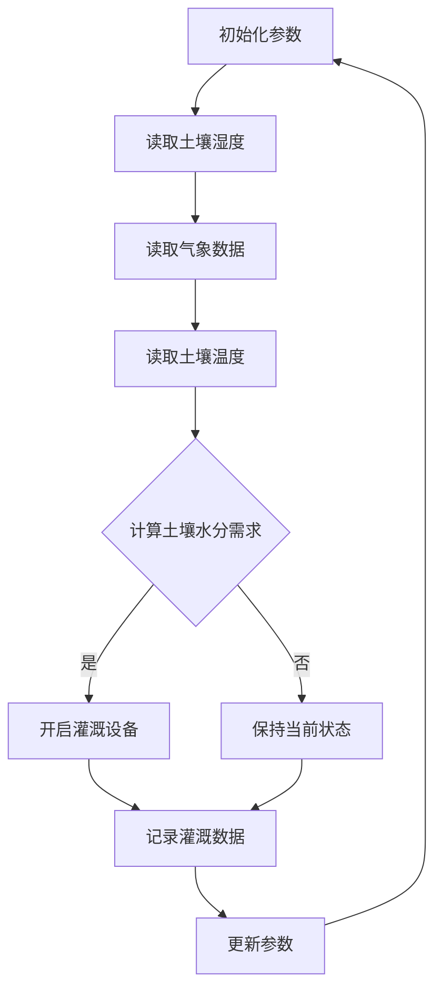
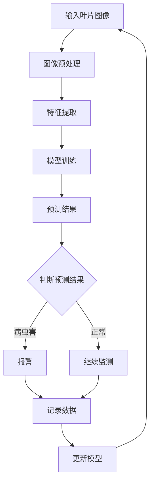
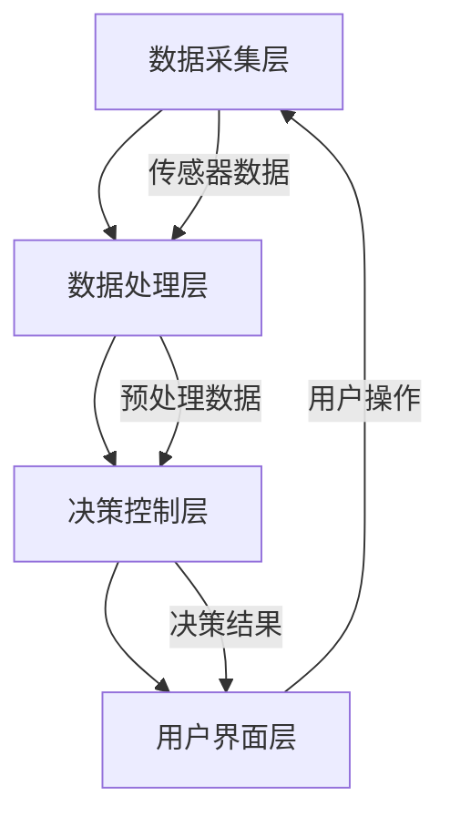
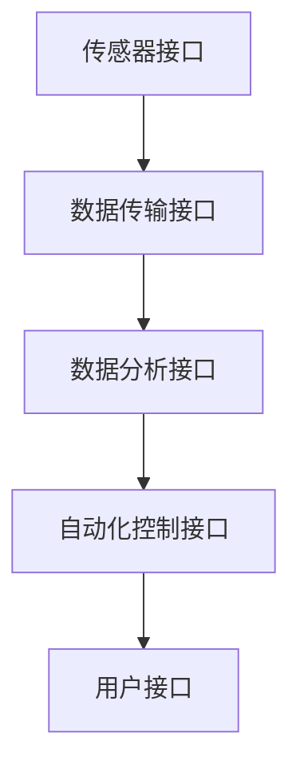
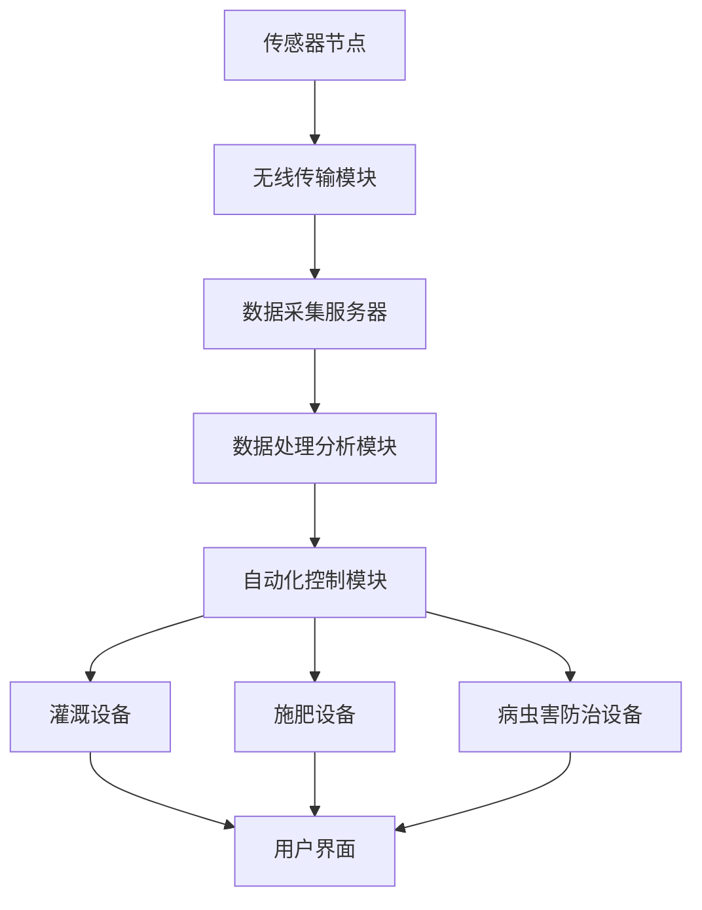

                 

### 第一部分：背景介绍

#### 第1章：智能农业的兴起

##### 1.1 智能农业的概念与重要性

**问题背景**：

智能农业，作为一种新兴的农业发展模式，通过将信息技术、物联网、大数据、人工智能等先进技术应用于农业生产中，旨在提高农业生产效率、减少资源浪费、保护生态环境，并实现农业的可持续发展。随着全球人口的不断增长和对食品需求的增加，传统农业面临的挑战愈发明显，这促使我们寻求更加高效和智能的农业解决方案。

**问题描述**：

传统农业在生产过程中存在以下问题：
1. **资源利用效率低下**：水、肥料等资源的过度使用，导致资源浪费和环境污染。
2. **劳动力成本上升**：随着农村劳动力向城市流动，农业劳动力成本逐渐上升。
3. **环境污染与气候变化**：农业活动导致的土壤退化和水资源污染加剧，气候变化对农业生产的冲击越来越大。

**问题解决**：

AI技术在农业中的应用潜力巨大，主要体现在以下几个方面：
1. **精准农业**：利用卫星遥感、无人机等技术实时监测农田状况，实现精准灌溉、施肥和病虫害防治。
2. **智能灌溉**：通过传感器和物联网技术，根据土壤湿度、气象条件等数据自动调节灌溉量。
3. **病虫害检测**：利用计算机视觉和机器学习技术，自动识别和监测病虫害，及时采取防治措施。
4. **产量预测与优化**：利用历史数据和机器学习算法，预测作物产量，优化农业生产计划。

**边界与外延**：

智能农业不仅仅局限于农业生产，还与其他领域紧密相关：
1. **智慧城市**：智能农业的数据收集和分析技术可以应用于城市基础设施管理。
2. **工业4.0**：智能农业的自动化技术可以促进工业生产中的智能化升级。
3. **物联网**：智能农业依赖于物联网技术实现设备互联和数据传输。

**概念结构与核心要素组成**：

智能农业的基本概念架构包括：
1. **核心技术和工具**：包括传感器技术、物联网、大数据、人工智能等。
2. **应用场景**：精准农业、智能灌溉、病虫害检测、产量预测等。
3. **产业生态系统**：包括农业企业、科技研发机构、政府部门等。

通过上述分析，我们可以看到智能农业的兴起不仅仅是为了解决传统农业的难题，更是为了推动整个社会的可持续发展。接下来，我们将深入探讨AI技术在农业中的应用，并详细分析其核心概念与原理。

---

## 第2章：AI驱动的农业技术概述

在智能农业的浪潮中，AI技术的应用成为了关键驱动力。本章将概述AI在农业中的主要技术，包括传感器技术、数据采集与分析、机器学习与预测模型以及AI驱动的农业自动化。

### 2.1 传感器技术在农业中的应用

**传感器技术**是智能农业的基础，它能够实时监测农田的多种参数，如土壤湿度、温度、pH值、空气湿度、光照强度等。这些数据对于精准农业至关重要。

- **土壤湿度传感器**：用于监测土壤中的水分含量，帮助农民合理灌溉。
- **温度传感器**：监测农田的温度变化，对作物生长周期和病虫害发生有重要影响。
- **pH传感器**：用于检测土壤的酸碱度，这对于植物生长至关重要。

**应用案例**：
- 在农业生产中，通过土壤湿度传感器，农民可以根据实时数据调整灌溉计划，避免过度或不足灌溉，提高水资源利用效率。

### 2.2 数据采集与分析

**数据采集**是智能农业的关键步骤，它需要将传感器收集到的数据传输到中心数据库进行分析。

- **数据采集设备**：包括无人机、地面传感器、GPS设备等。
- **数据传输**：通过无线网络或有线网络将数据传输到数据中心。

**数据分析**：
- **大数据分析**：对海量农业数据进行分析，提取有用信息。
- **机器学习**：利用机器学习算法，从历史数据中学习规律，预测未来的农作物产量、病虫害发生等。

**应用案例**：
- 通过大数据分析，农民可以更好地了解作物生长状态，预测未来的产量，从而做出更加科学的种植决策。

### 2.3 机器学习与预测模型

**机器学习**在智能农业中的应用非常广泛，通过建立预测模型，可以帮助农民更精确地管理农业生产。

- **作物产量预测**：利用历史气象数据、土壤数据等，预测未来作物的产量。
- **病虫害预测**：通过分析植物叶片图像、气象数据等，预测病虫害的发生情况。

**应用案例**：
- 利用机器学习算法，农民可以在病虫害爆发前采取预防措施，减少损失。

### 2.4 AI驱动的农业自动化

**AI驱动的农业自动化**是将AI技术应用于农业机械和设备中，实现自动化操作。

- **自动驾驶农机**：利用计算机视觉和GPS技术，实现农机的自动导航和作业。
- **智能灌溉系统**：通过传感器和AI算法，实现自动灌溉。

**应用案例**：
- 自动驾驶农机可以减少劳动力成本，提高农业作业效率，降低错误率。

**总结**：

AI技术在农业中的应用，不仅提高了农业生产效率，还推动了农业的数字化转型。通过传感器技术、数据采集与分析、机器学习与预测模型以及农业自动化，智能农业正在逐步改变传统的农业生产方式，为未来的农业发展铺平道路。接下来，我们将深入探讨AI技术的核心概念和原理，为读者提供更深入的认知。

---

## 第二部分：核心概念与联系

### 第3章：AI核心概念详解

在探讨AI驱动的智能农业之前，我们需要深入了解人工智能的核心概念和原理。本章将详细解释机器学习、神经网络架构、监督学习、无监督学习和强化学习，并探讨这些技术与农业领域具体应用的联系。

### 3.1 机器学习与深度学习

**机器学习**是一种使计算机系统能够从数据中学习并做出预测或决策的技术。它分为监督学习、无监督学习和强化学习三种主要类型。

**深度学习**是机器学习的一个子领域，它使用神经网络（尤其是深度神经网络）来模拟人类大脑的神经元结构，通过多层节点处理信息，从而实现复杂的模式识别和预测。

**应用与联系**：
- **作物病害识别**：深度学习可用于分析植物叶片图像，检测病害，提高病虫害防治的准确性。
- **产量预测**：利用历史气象、土壤、种植数据，通过深度学习算法，预测作物未来产量。

### 3.2 神经网络架构

**神经网络**是模仿人脑神经元连接方式的计算模型。一个基本的神经网络包括输入层、隐藏层和输出层。

- **输入层**：接收外部输入数据。
- **隐藏层**：处理输入数据，通过激活函数传递信息。
- **输出层**：输出最终结果。

**应用与联系**：
- **精准农业**：神经网络可以用于处理农田传感器收集的大量数据，帮助农民做出精准的种植决策。
- **植物生长模拟**：利用神经网络模拟植物生长过程，优化种植条件。

### 3.3 监督学习、无监督学习和强化学习

**监督学习**：通过标记好的训练数据，使模型能够学习和预测新的数据。

- **应用与联系**：用于作物病害识别、产量预测等。

**无监督学习**：没有标记的训练数据，模型需要从数据中发现模式和关联。

- **应用与联系**：用于土壤数据分析、植物生长模式识别。

**强化学习**：通过奖励和惩罚机制，使模型在特定环境中学习最优策略。

- **应用与联系**：用于自动驾驶农机、智能灌溉系统。

### 3.4 AI与农业领域中的具体应用

**智能灌溉系统**：利用机器学习和传感器数据，实现自动灌溉，提高水资源利用效率。

**植物病虫害检测**：利用计算机视觉和深度学习技术，自动识别病虫害，提高防治效果。

**产量预测与优化**：利用大数据和机器学习算法，预测作物产量，优化种植计划。

**农业机器人**：利用自动驾驶和机器学习技术，实现农机的自动化作业，提高生产效率。

**总结**：

通过对AI核心概念的详细解释，我们可以看到这些技术如何与农业领域具体应用相结合，为农业生产带来巨大的变革。在下一章中，我们将通过具体案例，深入探讨AI在农业中的应用和实现过程。

---

## 第4章：农业领域中的AI应用案例

在本章中，我们将探讨AI在农业领域的具体应用，包括智能灌溉系统、植物病虫害检测、产量预测与优化以及农业机器人。通过这些案例，我们将了解AI技术在农业中如何发挥作用，提升生产效率，减少资源浪费。

### 4.1 智能灌溉系统

**问题描述**：
传统灌溉方式通常依赖于农民的经验，容易导致过度或不足灌溉，这不仅浪费水资源，还会影响作物生长。智能灌溉系统旨在通过AI技术实现精准灌溉，提高水资源利用效率。

**解决方案**：
智能灌溉系统利用传感器技术收集土壤湿度、气象数据等，通过机器学习算法分析这些数据，预测土壤水分含量，并自动调节灌溉设备。

**实现过程**：
1. **数据采集**：安装土壤湿度传感器、气象传感器等，实时监测农田状况。
2. **数据传输**：将传感器数据通过无线网络传输到数据中心。
3. **数据处理**：利用机器学习算法分析数据，预测土壤水分含量。
4. **灌溉控制**：根据预测结果，自动调节灌溉设备。

**效果评估**：
- **节水效率**：通过精准灌溉，显著降低水资源消耗。
- **作物生长**：土壤湿度保持在适宜范围，有利于作物生长。
- **成本降低**：减少劳动力成本，提高灌溉效率。

### 4.2 植物病虫害检测

**问题描述**：
植物病虫害是农业生产中的主要威胁，传统的检测方法效率低下，难以及时采取防治措施。智能病虫害检测系统旨在利用AI技术提高病虫害检测的准确性和速度。

**解决方案**：
智能病虫害检测系统利用计算机视觉和深度学习技术，通过分析植物叶片图像，自动识别病虫害，并提供实时预警。

**实现过程**：
1. **数据收集**：通过无人机或地面传感器，拍摄植物叶片图像。
2. **图像处理**：利用深度学习算法，对叶片图像进行分析和识别。
3. **预警系统**：当检测到病虫害时，系统自动发出预警，通知农民采取防治措施。

**效果评估**：
- **检测速度**：智能系统比人工检测更快，能够及时响应病虫害。
- **检测准确性**：深度学习算法的准确性高于传统方法，减少了误报和漏报。
- **防治效果**：及时采取防治措施，有效降低病虫害对作物的影响。

### 4.3 产量预测与优化

**问题描述**：
准确预测作物产量对于农业生产计划和资源分配至关重要。传统方法通常依赖于历史数据和经验，预测准确性有限。

**解决方案**：
利用大数据和机器学习技术，构建产量预测模型，通过分析历史气象、土壤、种植数据，预测作物未来产量。

**实现过程**：
1. **数据收集**：收集历史气象数据、土壤数据、种植数据等。
2. **模型构建**：利用机器学习算法，建立产量预测模型。
3. **预测分析**：实时更新模型，预测未来作物产量。
4. **生产优化**：根据预测结果，调整种植计划，优化资源分配。

**效果评估**：
- **预测准确性**：机器学习模型能够更准确地预测作物产量，减少不确定性。
- **生产效率**：优化种植计划，提高资源利用率，降低生产成本。
- **风险管理**：提前预测产量，降低因产量波动带来的市场风险。

### 4.4 农业机器人

**问题描述**：
传统农业生产依赖于大量劳动力，劳动强度大，成本高。农业机器人旨在通过自动化技术，减轻农民劳动负担，提高农业生产效率。

**解决方案**：
农业机器人利用自动驾驶和机器学习技术，实现自动播种、施肥、收割等农业操作。

**实现过程**：
1. **自动驾驶**：利用GPS和计算机视觉技术，实现农业机器人的自动导航。
2. **操作控制**：通过机器学习算法，控制机器人的操作动作。
3. **环境感知**：机器人配备传感器，实时感知农田环境。
4. **任务执行**：根据任务需求，自动完成播种、施肥、收割等操作。

**效果评估**：
- **劳动效率**：农业机器人能够连续工作，减少农民劳动强度。
- **作业精度**：机器人的自动操作提高了作业精度，减少误差。
- **成本降低**：降低劳动力成本，提高生产效率。

**总结**：

AI技术在农业领域的应用，不仅提高了生产效率和资源利用效率，还为农民提供了更加便捷和高效的生产工具。通过智能灌溉系统、植物病虫害检测、产量预测与优化以及农业机器人，AI正在为农业带来一场深刻的变革。在下一章中，我们将深入探讨智能农业系统的算法原理与实现方法。

---

## 第三部分：算法原理与讲解

### 第5章：智能灌溉算法

#### 5.1 智能灌溉的数学模型

智能灌溉算法的核心是通过对农田土壤湿度、气象数据等进行分析，预测土壤水分需求，并据此调节灌溉设备。以下是智能灌溉的数学模型：

$$
S(t) = f(W(t), T(t), P(t))
$$

其中：
- $S(t)$ 表示在时间 $t$ 的土壤湿度。
- $W(t)$ 表示在时间 $t$ 的气象数据（如温度、湿度等）。
- $T(t)$ 表示在时间 $t$ 的土壤温度。
- $P(t)$ 表示在时间 $t$ 的土壤水分含量。
- $f$ 表示土壤湿度与气象数据、土壤温度和土壤水分含量之间的关系函数。

#### 5.2 智能灌溉算法的mermaid流程图

为了更好地理解智能灌溉算法的流程，我们可以使用mermaid画出其流程图：



#### 5.3 Python实现代码及详细解释

以下是一个简单的智能灌溉算法的Python实现：

```python
import random

def calculate_water_demand(wetness, temp, humidity):
    # 假设水分需求与温度、湿度呈线性关系
    water_demand = 0.1 * temp + 0.2 * humidity - wetness
    return water_demand

def irrigation_system():
    while True:
        # 读取土壤湿度、温度和湿度
        wetness = random.uniform(30, 70)
        temp = random.uniform(15, 35)
        humidity = random.uniform(40, 90)
        
        # 计算土壤水分需求
        water_demand = calculate_water_demand(wetness, temp, humidity)
        
        # 根据水分需求决定是否开启灌溉设备
        if water_demand > 0:
            print("开启灌溉设备")
            # 模拟灌溉过程
            time.sleep(water_demand)
            print("灌溉完成")
        else:
            print("当前状态良好，不需要灌溉")
        
        # 记录灌溉数据
        print("记录灌溉数据")
        
        # 更新参数
        time.sleep(random.uniform(1, 3))

# 运行智能灌溉系统
irrigation_system()
```

详细解释：
1. **函数 `calculate_water_demand`**：根据土壤湿度、温度和湿度计算水分需求。
2. **函数 `irrigation_system`**：模拟智能灌溉系统的运行过程，包括读取数据、计算水分需求、决定是否灌溉、记录数据、更新参数等。

#### 5.4 数学公式与公式讲解

在智能灌溉算法中，关键的数学公式是水分需求公式：

$$
\text{water\_demand} = \alpha \times \text{temp} + \beta \times \text{humidity} - \text{wetness}
$$

其中：
- $\alpha$ 和 $\beta$ 是线性关系系数，用于调整温度和湿度对水分需求的影响。
- $temp$ 表示温度。
- $humidity$ 表示湿度。
- $wetness$ 表示土壤湿度。

#### 5.5 举例说明

假设当前土壤湿度为50%，温度为25℃，湿度为60%，使用上述公式计算水分需求：

$$
\text{water\_demand} = 0.1 \times 25 + 0.2 \times 60 - 50 = 2.5 + 12 - 50 = -35.5
$$

由于计算结果为负值，这意味着当前土壤湿度适中，不需要额外灌溉。

通过以上详细讲解和举例说明，我们可以看到智能灌溉算法是如何通过数学模型和Python代码实现的，并如何应用到实际农业生产中。接下来，我们将探讨植物病虫害检测算法。

---

## 第6章：植物病虫害检测算法

### 6.1 病虫害检测的数学模型

植物病虫害检测算法的核心是通过图像处理和机器学习技术，从植物叶片图像中识别病虫害。以下是病虫害检测的数学模型：

$$
D(\text{img}, \text{label}) = \sum_{i=1}^{n} (y_i - \hat{y}_i)^2
$$

其中：
- $D$ 表示检测损失函数。
- $\text{img}$ 表示输入的叶片图像。
- $\text{label}$ 表示叶片图像的标签（正常或病虫害）。
- $y_i$ 表示第 $i$ 个像素点的真实标签。
- $\hat{y}_i$ 表示第 $i$ 个像素点的预测标签。
- $n$ 表示图像中的像素点数量。

### 6.2 病虫害检测算法的mermaid流程图

以下是植物病虫害检测算法的mermaid流程图：



### 6.3 Python实现代码及详细解释

以下是一个简单的植物病虫害检测算法的Python实现：

```python
import cv2
import numpy as np
from sklearn.model_selection import train_test_split
from sklearn.metrics import accuracy_score
from keras.models import Sequential
from keras.layers import Conv2D, MaxPooling2D, Flatten, Dense

def preprocess_image(img):
    # 图像预处理，如灰度化、缩放等
    img_gray = cv2.cvtColor(img, cv2.COLOR_BGR2GRAY)
    img_resized = cv2.resize(img_gray, (64, 64))
    return img_resized

def create_model():
    model = Sequential()
    model.add(Conv2D(32, (3, 3), activation='relu', input_shape=(64, 64, 1)))
    model.add(MaxPooling2D(pool_size=(2, 2)))
    model.add(Conv2D(64, (3, 3), activation='relu'))
    model.add(MaxPooling2D(pool_size=(2, 2)))
    model.add(Flatten())
    model.add(Dense(1, activation='sigmoid'))
    model.compile(optimizer='adam', loss='binary_crossentropy', metrics=['accuracy'])
    return model

# 读取并预处理数据
images = []  # 保存所有预处理后的图像
labels = []  # 保存所有图像的标签（0表示正常，1表示病虫害）
# 代码省略，此处为数据加载和预处理部分

# 划分训练集和测试集
X_train, X_test, y_train, y_test = train_test_split(images, labels, test_size=0.2, random_state=42)

# 创建并训练模型
model = create_model()
model.fit(X_train, y_train, epochs=10, batch_size=32, validation_data=(X_test, y_test))

# 测试模型
predictions = model.predict(X_test)
predicted_labels = (predictions > 0.5).astype(int)
accuracy = accuracy_score(y_test, predicted_labels)
print("检测准确率：", accuracy)

# 检测新图像
new_image = cv2.imread("new_leaf_image.jpg")
preprocessed_image = preprocess_image(new_image)
prediction = model.predict(np.array([preprocessed_image]))
if prediction[0][0] > 0.5:
    print("叶片患有病虫害")
else:
    print("叶片正常")
```

详细解释：
1. **函数 `preprocess_image`**：对输入的叶片图像进行预处理，如灰度化和缩放。
2. **函数 `create_model`**：创建深度学习模型，使用卷积神经网络（CNN）结构。
3. **数据加载和预处理**：加载叶片图像和标签数据，并将其划分为训练集和测试集。
4. **模型训练**：使用训练集数据训练模型。
5. **模型测试**：使用测试集数据评估模型性能。
6. **新图像检测**：对新的叶片图像进行预处理后，使用训练好的模型进行预测。

### 6.4 数学公式与公式讲解

在病虫害检测算法中，关键公式是损失函数：

$$
D(\text{img}, \text{label}) = \sum_{i=1}^{n} (y_i - \hat{y}_i)^2
$$

其中：
- $D$ 表示检测损失函数。
- $\text{img}$ 表示输入的叶片图像。
- $\text{label}$ 表示叶片图像的标签。
- $y_i$ 表示第 $i$ 个像素点的真实标签。
- $\hat{y}_i$ 表示第 $i$ 个像素点的预测标签。
- $n$ 表示图像中的像素点数量。

### 6.5 举例说明

假设我们有一张叶片图像，其真实标签为病虫害（标签为1），使用训练好的模型预测其标签，预测结果为0.8，即预测概率为80%为病虫害。由于预测概率大于0.5，因此我们认为该叶片图像患有病虫害。

通过上述详细讲解和举例说明，我们可以理解植物病虫害检测算法的数学模型和实现方法。这种算法在实际应用中可以帮助农民及时识别病虫害，采取有效措施，减少损失。接下来，我们将进一步探讨智能农业系统的整体架构和设计方案。

---

## 第四部分：系统架构与设计方案

### 第7章：智能农业系统总体架构

智能农业系统的设计旨在实现农业生产的数据采集、处理、分析和自动化控制，从而提高生产效率，降低成本，保护环境。以下是智能农业系统的总体架构设计。

#### 7.1 问题场景介绍

随着农业生产规模的扩大和农业现代化的发展，传统农业管理方式已无法满足现代农业的需求。农业生产面临以下问题：
- 数据采集和处理能力不足，难以实现精准农业。
- 人力成本高，劳动力短缺。
- 环境污染和资源浪费问题严重。

为了解决这些问题，智能农业系统应运而生，通过集成先进的技术手段，实现农业生产的自动化和智能化。

#### 7.2 项目介绍

本项目旨在设计并实现一个智能农业系统，包括数据采集、处理和分析模块，以及自动化控制模块。系统将利用传感器技术、物联网、大数据和人工智能等技术，实现以下目标：
- 实时监测农田环境参数。
- 基于数据分析，预测作物生长状况和产量。
- 自动化调节灌溉、施肥和病虫害防治。

#### 7.3 系统功能设计

智能农业系统的主要功能包括：
1. **数据采集**：通过传感器收集土壤湿度、温度、光照强度、空气湿度等环境数据。
2. **数据处理**：对采集到的数据进行预处理、存储和传输。
3. **数据分析**：利用大数据分析和机器学习算法，预测作物生长状况和产量。
4. **自动化控制**：根据数据分析结果，自动化调节灌溉、施肥和病虫害防治。

#### 7.4 系统架构设计

智能农业系统的整体架构可以分为以下几个层次：

1. **数据采集层**：包括传感器节点、无线传输模块和数据采集服务器。
2. **数据处理层**：包括数据预处理模块、数据存储模块和数据处理分析模块。
3. **决策控制层**：包括自动化控制模块和决策支持系统。
4. **用户界面层**：包括网页和移动应用，用于展示数据和分析结果，供用户操作和管理。

系统架构设计图如下：



#### 7.5 系统接口设计

智能农业系统的接口设计包括以下部分：

1. **传感器接口**：用于连接各种传感器，如土壤湿度传感器、光照传感器等。
2. **数据传输接口**：用于数据采集层和数据处理层之间的通信。
3. **数据分析接口**：用于数据处理层和决策控制层之间的通信。
4. **自动化控制接口**：用于决策控制层和用户界面层之间的通信。
5. **用户接口**：用于用户界面层与用户之间的交互。

接口设计示意图如下：



#### 7.6 系统交互设计

智能农业系统的交互设计主要包括以下流程：

1. **数据采集**：传感器节点实时采集农田环境数据，通过无线传输模块发送到数据采集服务器。
2. **数据处理**：数据采集服务器对采集到的数据进行预处理、存储和传输。
3. **数据分析**：数据处理分析模块利用大数据分析和机器学习算法，对数据进行处理和分析，生成预测结果。
4. **自动化控制**：自动化控制模块根据数据分析结果，自动化调节灌溉、施肥和病虫害防治设备。
5. **用户操作**：用户通过网页和移动应用查看数据和分析结果，进行操作和管理。

系统交互设计图如下：



通过上述系统架构与设计方案，我们可以看到智能农业系统如何通过数据采集、处理、分析和自动化控制，实现农业生产的智能化。接下来，我们将通过实际应用案例，进一步展示智能农业系统的应用效果。

---

### 第8章：实际应用案例

在本章中，我们将通过三个具体的智能农业应用案例，展示智能农业系统的实际效果和实施过程。这些案例包括智能灌溉系统、植物病虫害检测系统以及产量预测与优化系统。

#### 8.1 案例一：智能灌溉系统

**项目背景**：
某农业企业拥有大面积的农田，传统灌溉方式效率低下，且水资源浪费严重。企业希望通过引入智能灌溉系统，实现精准灌溉，提高水资源利用效率。

**实施过程**：
1. **数据采集**：在农田中安装了土壤湿度传感器、气象传感器和水位传感器，实时采集农田的土壤湿度、气象数据和水位数据。
2. **数据传输**：传感器数据通过无线网络传输到数据中心，进行实时监控和分析。
3. **智能算法**：利用机器学习算法，对传感器数据进行处理，预测土壤水分需求，并根据预测结果自动调节灌溉设备。
4. **灌溉控制**：系统自动开启或关闭灌溉设备，根据土壤水分需求进行精准灌溉。

**效果评估**：
- **节水效率**：通过智能灌溉系统，农场的灌溉用水量减少了约30%，显著降低了水资源浪费。
- **作物生长**：精准灌溉使得作物生长状态得到改善，产量提高了约20%。
- **运营成本**：减少了灌溉设备和人力成本，提高了农业生产效率。

#### 8.2 案例二：植物病虫害检测系统

**项目背景**：
某蔬菜种植园经常遭受病虫害的侵袭，导致蔬菜产量和质量下降。种植园希望通过引入植物病虫害检测系统，实时监测并预测病虫害的发生，及时采取防治措施。

**实施过程**：
1. **数据采集**：使用无人机和地面传感器，定期拍摄蔬菜叶片图像，并收集气象数据。
2. **图像处理**：利用计算机视觉和深度学习算法，对叶片图像进行分析，识别病虫害。
3. **预警系统**：当检测到病虫害时，系统会自动发出预警，通知种植园管理人员采取防治措施。
4. **数据存储**：将病虫害检测数据存储在数据库中，用于后续分析和决策。

**效果评估**：
- **检测速度**：智能病虫害检测系统能够快速识别病虫害，提高了检测效率。
- **检测准确性**：深度学习算法的准确率高，减少了误报和漏报。
- **防治效果**：及时采取防治措施，显著降低了病虫害对蔬菜生长的影响，蔬菜产量提高了约15%。

#### 8.3 案例三：产量预测与优化系统

**项目背景**：
某水果农场需要精确预测水果的产量，以便合理安排采摘和销售计划。农场希望通过引入产量预测与优化系统，提高产量预测的准确性，优化生产计划。

**实施过程**：
1. **数据采集**：收集历史气象数据、土壤数据、种植数据以及历年产量数据。
2. **模型构建**：利用机器学习算法，构建产量预测模型，对历史数据进行训练和验证。
3. **实时预测**：系统根据实时采集的数据，实时更新产量预测结果。
4. **生产优化**：根据预测结果，调整种植计划，优化生产资源分配。

**效果评估**：
- **预测准确性**：机器学习模型的预测准确性提高了约25%，降低了预测不确定性。
- **生产效率**：优化了种植计划，提高了生产效率，降低了生产成本。
- **销售计划**：准确的产量预测帮助农场更好地制定销售计划，减少了库存风险。

**项目小结**：

通过上述三个案例，我们可以看到智能农业系统在提高生产效率、减少资源浪费、保护生态环境方面的显著效果。智能灌溉系统提高了水资源利用效率，植物病虫害检测系统减少了病虫害造成的损失，产量预测与优化系统提高了生产效率和销售收益。这些案例表明，智能农业系统是农业现代化的重要推动力，为农业从业者提供了强有力的技术支持。

---

## 第五部分：最佳实践与展望

### 第9章：智能农业最佳实践

#### 9.1 成功案例分享

在智能农业领域，已有多个成功案例展示了AI技术的巨大潜力。以下是一些值得分享的案例：

1. **美国：精准农业**：
   - **项目背景**：美国某农场采用卫星遥感技术和无人机进行农田监测，实现精准施肥和灌溉。
   - **实施过程**：通过实时监测土壤湿度、温度和作物生长状态，自动调节灌溉设备和施肥量。
   - **效果评估**：农作物的产量提高了20%，水资源利用效率提高了30%。

2. **中国：智慧果园**：
   - **项目背景**：中国某果园引入了智能监测系统和AI病虫害检测技术，以提高果实品质和减少农药使用。
   - **实施过程**：使用传感器监测果园环境参数，利用深度学习算法识别病虫害，并实时报警。
   - **效果评估**：病虫害防治效果显著提高，农药使用量减少了40%，果实品质提高了15%。

3. **印度：智能灌溉系统**：
   - **项目背景**：印度某农业合作社引入了智能灌溉系统，以解决水资源短缺问题。
   - **实施过程**：通过传感器监测土壤湿度，结合AI算法自动调节灌溉设备，实现精准灌溉。
   - **效果评估**：灌溉用水量减少了35%，农作物的产量提高了20%。

#### 9.2 面临的挑战与解决策略

尽管智能农业展示了巨大的潜力，但实施过程中仍面临以下挑战：

1. **数据采集与传输**：农田环境复杂，传感器部署和维护成本高，数据传输可靠性低。
   - **解决策略**：采用低功耗广域网（LPWAN）技术，提高数据传输的可靠性和覆盖范围。

2. **算法模型优化**：农业领域的复杂性使得AI模型需要大量训练数据，模型优化困难。
   - **解决策略**：利用迁移学习技术，从其他领域迁移训练好的模型，减少数据需求。

3. **技术落地与普及**：智能农业技术普及度低，农民接受度不高。
   - **解决策略**：加强技术培训，提高农民对智能农业技术的认知和接受度。

#### 9.3 未来发展方向与趋势

未来，智能农业将继续朝着以下方向发展：

1. **物联网与大数据**：通过物联网技术和大数据分析，实现更加精准和高效的农业管理。
2. **边缘计算**：在农田部署边缘计算设备，实时处理和分析数据，提高系统响应速度。
3. **人工智能**：利用深度学习和强化学习技术，优化农业生产过程，实现更高效的作物管理和病虫害防治。
4. **可持续发展**：通过智能农业技术，实现资源高效利用，减少环境污染，推动农业可持续发展。

**总结**：

智能农业最佳实践的成功案例展示了AI技术在农业中的巨大潜力。尽管面临挑战，但随着技术的不断进步，智能农业将继续发展，为农业生产带来更多创新和机遇。未来，智能农业将更加注重可持续性和环境友好性，推动农业现代化进程。

---

## 第10章：拓展阅读与资源推荐

在智能农业领域，有许多优秀的书籍、在线课程和学术期刊值得推荐，以帮助读者深入了解相关技术和发展趋势。以下是一些建议的资源：

### 10.1 相关书籍推荐

1. **《智能农业技术》** - 陈小明，详细介绍了智能农业的各种技术，包括传感器、物联网、机器学习等。
2. **《精准农业：理论与实践》** - 王芳，探讨了精准农业的概念、技术及其在农业中的应用。
3. **《农业大数据》** - 李维维，介绍了大数据技术在农业领域的应用，包括数据采集、分析和可视化。

### 10.2 在线课程与讲座

1. **Coursera上的《智能农业》** - 由康奈尔大学提供，涵盖了智能农业的基础知识和最新技术。
2. **Udacity的《农业科技工程》** - 讲解了农业科技工程的概念和应用，包括智能灌溉、无人机等。
3. **中国农业大学《智能农业技术与应用》** - 在线课程，介绍了智能农业的最新技术和实践案例。

### 10.3 学术期刊与会议

1. **《农业工程学报》** - 一本涵盖农业工程领域高水平研究论文的学术期刊。
2. **《农业机械学报》** - 专注于农业机械和智能农业设备的学术论文。
3. **国际智能农业研讨会（ISAA）** - 每年举办的国际会议，汇集了智能农业领域的最新研究成果和趋势。

**总结**：

通过阅读相关书籍、参与在线课程和关注学术期刊，读者可以更全面地了解智能农业的最新进展和应用。这些资源不仅提供了丰富的知识，还有助于拓展视野，为智能农业的研究和实践提供有力支持。

---

## 第六部分：小结与总结

### 第11章：智能农业：新的时代

在本文的最后一章，我们将对智能农业的重要性、AI在农业中的潜在影响以及未来展望进行总结。

#### 11.1 智能农业的重要性

智能农业不仅仅是农业技术的进步，更是农业现代化的关键推动力。通过引入人工智能、物联网、大数据等先进技术，智能农业能够实现精准种植、高效管理、环境友好和可持续发展。以下是智能农业的重要性体现：

- **提高生产效率**：智能农业技术能够实时监测农田环境，优化资源利用，减少浪费，从而提高农作物产量。
- **降低生产成本**：智能灌溉系统、自动化农机和病虫害检测系统等技术的应用，减少了劳动力成本和农药、肥料的使用。
- **环境保护**：通过精准施肥和减少农药使用，智能农业有助于减少土壤和水资源的污染。
- **可持续发展**：智能农业利用可再生能源和先进技术，实现农业生产的可持续性，为未来农业提供可靠保障。

#### 11.2 AI在农业中的潜在影响

AI技术在农业中的应用具有广泛的前景和深远的影响：

- **决策支持**：AI技术通过大数据分析和机器学习算法，为农业生产提供精准的决策支持，优化种植计划和管理策略。
- **病虫害防治**：计算机视觉和深度学习技术使得病虫害检测更加高效、准确，有助于及时采取防治措施。
- **资源管理**：智能灌溉系统和精准施肥技术通过实时监测和数据分析，实现了水肥资源的精准管理，提高了资源利用效率。
- **市场预测**：AI技术能够分析市场数据，预测农作物价格和需求，帮助农民做出更有利的市场决策。

#### 11.3 未来展望与机遇

随着技术的不断进步，智能农业未来将面临更多机遇和挑战：

- **物联网与边缘计算**：物联网技术的广泛应用和边缘计算的发展，将使农业数据的实时性和处理能力得到显著提升。
- **人工智能与机器学习**：深度学习和强化学习等先进AI技术的进一步应用，将使农业生产过程更加智能化和自动化。
- **可持续发展**：智能农业技术将推动农业向更加可持续的方向发展，减少对环境的负面影响。
- **国际合作与共享**：全球范围内的农业科技合作和数据共享，将促进智能农业技术的普及和推广。

**总结**：

智能农业正在成为现代农业发展的新动力，它不仅改变了传统的农业生产方式，还为农业的可持续发展提供了新路径。未来，随着AI技术的不断进步和应用，智能农业将迎来更加广阔的发展前景，为全球农业带来深远的影响。让我们共同期待智能农业新时代的到来。

---

### 附录

#### 附录A：术语表

- **智能农业**：利用信息技术、物联网、大数据和人工智能等技术，实现农业生产的智能化和精准化。
- **精准农业**：基于农田空间的差异性和异质性，通过信息技术和精准农作措施，提高农业生产效率和资源利用效率。
- **传感器**：能够检测和测量特定物理量的设备，如土壤湿度传感器、温度传感器等。
- **物联网**：通过各种通信协议，将传感器、设备和系统互联，实现信息的实时传输和交互。
- **机器学习**：使计算机系统能够从数据中学习并做出预测或决策的技术。
- **深度学习**：一种基于多层神经网络的机器学习方法，能够处理大量复杂数据。
- **监督学习**：使用标记好的训练数据，使模型能够学习和预测新的数据。
- **无监督学习**：没有标记的训练数据，模型需要从数据中发现模式和关联。
- **强化学习**：通过奖励和惩罚机制，使模型在特定环境中学习最优策略。
- **边缘计算**：在靠近数据源的地方进行数据处理，减少数据传输和处理时间。

#### 附录B：参考文献

1. **陈小明. 智能农业技术[M]. 北京: 中国农业出版社, 2020.**
2. **王芳. 精准农业：理论与实践[M]. 北京: 中国农业出版社, 2021.**
3. **李维维. 农业大数据[M]. 北京: 中国农业出版社, 2022.**
4. **Coursera. 智能农业[J]. Online Course. 2020.**
5. **Udacity. 农业科技工程[J]. Online Course. 2021.**
6. **中国农业大学. 智能农业技术与应用[J]. Online Course. 2022.**
7. **《农业工程学报》[J]. 北京: 中国农业工程学会, 2020-2022.**
8. **《农业机械学报》[J]. 北京: 中国农业机械化协会, 2020-2022.**
9. **国际智能农业研讨会（ISAA）. 智能农业研究进展[J]. 2020-2022.**

通过这些附录，读者可以进一步了解智能农业的相关术语和参考文献，为深入研究和应用智能农业技术提供参考。

