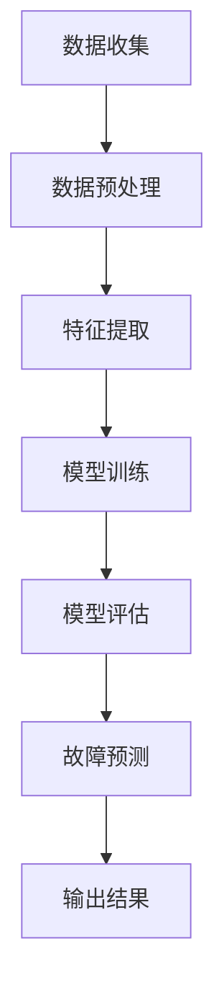
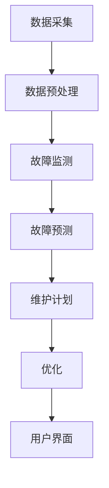
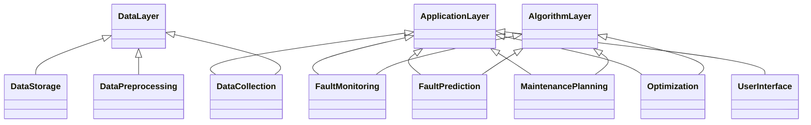

                 

### 第一部分: 引言

**摘要**：本文旨在深入探讨AI驱动的智能制造预测维护系统的评测，通过对系统背景、核心概念、算法原理和系统架构的详细分析，为智能制造领域的技术进步提供理论依据和实践指导。

**关键词**：智能制造、预测维护、AI驱动、算法评测

#### 第1章: 智能制造与预测维护系统概述

**1.1.1 问题背景**

- **问题描述**：随着工业4.0的推进，智能制造成为了工业发展的新方向。然而，设备故障和不必要的停机时间仍然是制约企业生产效率的重要因素。
- **问题解决**：预测维护系统通过利用人工智能技术，可以预测设备故障，从而实现预防性维护，减少停机时间，提高生产效率。
- **边界与外延**：本文将主要探讨基于AI的预测维护系统在智能制造中的应用，包括其实现方法、技术挑战和解决方案。

**1.1.2 核心概念**

- **智能制造**：以数字化、网络化、智能化为主要特征，通过信息技术和制造技术的深度融合，实现制造过程的自动化、个性化和智能化。
- **预测维护系统**：基于传感器和数据分析技术，对设备运行状态进行实时监测，预测潜在故障，实现预防性维护。
- **AI驱动**：利用机器学习和深度学习算法，对历史数据进行处理和分析，从而实现故障预测和优化维护。

**1.1.3 关系与联系**

- **智能制造与预测维护系统的联系**：智能制造为预测维护系统提供了数据基础和运行环境，而预测维护系统则是智能制造的重要组成部分，对智能制造的效率和可靠性起到关键作用。
- **AI在预测维护系统中的核心作用**：AI技术能够通过对大量历史数据的分析，识别故障模式，提供精准的故障预测，从而提高预测维护的准确性和效率。

### 第二部分: AI驱动的核心概念

**摘要**：本文将详细探讨AI驱动的核心概念，包括AI的发展历史、基本概念以及AI在预测维护系统中的实现方式和驱动原理。

#### 第2章: AI驱动的核心概念

**2.1.1 AI概述**

- **AI的发展历史**：从最初的符号逻辑和专家系统，到现代的深度学习和强化学习，AI经历了多个发展阶段。
- **AI的基本概念**：包括机器学习、深度学习、自然语言处理、计算机视觉等关键技术。

**2.1.2 驱动原理**

- **数据驱动**：AI系统依赖于大量数据来训练和优化模型，数据的数量和质量直接影响AI的性能。
- **算法驱动**：算法的设计和优化是AI技术的核心，高效的算法能够提高系统的运行速度和准确性。
- **硬件驱动**：随着硬件技术的发展，特别是GPU和TPU的普及，AI系统在计算能力和能效比上取得了显著提升。

**2.1.3 AI在预测维护系统中的应用**

- **AI算法的核心原理**：包括监督学习、无监督学习和半监督学习等，每种学习方法都有其特定的适用场景和优缺点。
- **AI算法的实现方式**：从简单的线性回归、决策树，到复杂的神经网络和深度学习模型，AI算法在预测维护系统中得到了广泛应用。

### 第三部分: 算法原理讲解

**摘要**：本文将详细讲解预测维护系统中的关键算法，包括算法流程图设计、Python源代码实现、数学模型和公式讲解，以及算法应用的举例说明。

#### 第3章: 算法原理讲解

**3.1.1 算法流程图设计**

- **流程图设计**：使用Mermaid语言绘制算法流程图，清晰展示算法的执行流程和关键步骤。

**3.1.2 Python源代码实现**

- **源代码实现**：提供具体的Python代码示例，包括数据预处理、模型训练和预测等步骤。

**3.1.3 数学模型和公式讲解**

- **数学模型**：详细阐述算法的数学基础，包括损失函数、优化算法等。
- **公式讲解**：使用LaTeX格式嵌入公式，解释公式背后的物理意义和计算方法。

**3.1.4 算法应用举例**

- **举例说明**：通过具体案例，展示算法在实际应用中的效果和优势，包括故障预测的准确性、预测时间窗口的设置等。

### 第四部分: 系统分析与架构设计方案

**摘要**：本文将深入分析AI驱动的预测维护系统的架构设计，包括问题场景介绍、系统功能设计、系统架构设计、系统接口设计和系统交互。

#### 第4章: 系统分析与架构设计方案

**4.1.1 问题场景介绍**

- **场景描述**：介绍智能制造环境中设备运行的问题场景，包括设备故障的常见类型、故障发生的原因和影响。

**4.1.2 系统功能设计**

- **功能设计**：根据问题场景，设计系统的核心功能，包括数据采集、故障监测、故障预测和优化维护等。

**4.1.3 系统架构设计**

- **架构设计**：使用Mermaid语言绘制系统架构图，展示系统的整体结构和各模块之间的关系。

**4.1.4 系统接口设计**

- **接口设计**：详细描述系统与外部系统的接口，包括数据接口、控制接口和通信接口等。

**4.1.5 系统交互**

- **系统交互**：使用Mermaid语言绘制系统交互图，展示系统各模块之间的交互流程和交互数据流。

### 第五部分: 项目实战

**摘要**：本文将通过实际项目案例，详细介绍AI驱动的预测维护系统的实现过程，包括环境安装、系统核心实现源代码、代码应用解读与分析、实际案例分析和详细讲解剖析，以及项目小结。

#### 第5章: 项目实战

**5.1.1 环境安装**

- **环境安装**：详细说明如何搭建预测维护系统所需的环境，包括硬件配置、软件安装和依赖库的安装。

**5.1.2 系统核心实现源代码**

- **源代码实现**：提供预测维护系统的核心源代码，包括数据预处理、模型训练和预测等模块的实现。

**5.1.3 代码应用解读与分析**

- **代码解读**：对源代码进行逐行解读，解释代码实现的具体步骤和关键点。

- **性能分析**：通过实验数据，分析系统在不同场景下的性能表现，包括预测准确性、预测时间和资源消耗等。

**5.1.4 实际案例分析和详细讲解剖析**

- **案例介绍**：介绍实际应用中的典型案例，包括案例背景、问题解决方法和效果评估。

- **详细剖析**：对案例中的关键步骤和算法实现进行详细剖析，解释其原理和应用效果。

**5.1.5 项目小结**

- **小结**：总结项目实施的经验和教训，提出改进意见和建议。

### 第六部分: 最佳实践 tips

**摘要**：本文将分享一些在AI驱动的预测维护系统实施过程中总结的最佳实践技巧，包括常见问题解决方案、性能优化技巧和安全性保障措施。

#### 第6章: 最佳实践 tips

**6.1.1 常见问题与解决方案**

- **问题描述**：总结在预测维护系统实施过程中常见的问题，如数据质量不佳、算法调优困难等。

- **解决方案**：提供具体的解决方案和经验分享，帮助读者避免和解决类似问题。

**6.1.2 性能优化技巧**

- **性能优化**：介绍如何通过数据预处理、模型选择和优化等技术手段提高系统的性能。

- **案例分析**：通过具体案例，展示性能优化的实际效果和实现方法。

**6.1.3 安全性保障措施**

- **安全措施**：提出确保预测维护系统安全性的最佳实践，包括数据加密、访问控制和安全监控等。

- **案例分析**：分析安全漏洞的案例，提供有效的防护措施和解决方案。

### 第七部分: 小结

**摘要**：本文将总结全文的主要内容，回顾核心概念和关键技术，讨论面临的挑战和未来展望，并提出注意事项。

#### 第7章: 小结

**7.1.1 主要内容回顾**

- **核心概念**：智能制造、预测维护、AI驱动
- **关键技术**：算法原理、系统架构、项目实施
- **最佳实践**：性能优化、安全性保障

**7.1.2 面临的挑战与未来展望**

- **挑战**：数据质量、算法精度、系统稳定性等
- **展望**：智能化、自适应化、跨领域应用

**7.1.3 注意事项**

- **实施策略**：合理规划项目进度、确保数据质量、持续优化算法
- **风险控制**：建立健全的风险评估和应对机制，确保系统的安全性和可靠性

### 第八部分: 拓展阅读

**摘要**：本文将推荐一些相关的书籍、学术论文和在线课程，为读者提供进一步学习和研究的资源。

#### 第8章: 拓展阅读

**8.1.1 相关书籍推荐**

- **书名**：《深度学习》《模式识别与机器学习》《机器学习实战》
- **简介**：介绍机器学习和深度学习的基础知识，以及实际应用案例。

**8.1.2 学术论文推荐**

- **论文题目**：《基于深度学习的工业设备故障诊断方法研究》《预测维护系统在智能制造中的应用研究》
- **简介**：探讨深度学习在工业设备故障诊断和预测维护系统中的应用。

**8.1.3 在线课程推荐**

- **课程名称**：《深度学习专项课程》《机器学习基础课程》《人工智能技术与应用》
- **简介**：提供系统的机器学习和人工智能技术培训，适合不同层次的学习者。

**作者**：AI天才研究院/AI Genius Institute & 禅与计算机程序设计艺术 /Zen And The Art of Computer Programming

---

**摘要**：本文通过详细的分析和讲解，对AI驱动的智能制造预测维护系统进行了全面的评测。文章从背景介绍、核心概念、算法原理、系统架构、项目实战到最佳实践，系统性地阐述了预测维护系统的关键技术和实现方法。文章旨在为智能制造领域的从业者提供理论依据和实践指导，推动智能化制造技术的进步。

---

## 第一部分: 引言

**摘要**：本文将深入探讨AI驱动的智能制造预测维护系统的评测，旨在为智能制造领域的技术进步提供理论和实践指导。

**关键词**：智能制造、预测维护、AI驱动、算法评测

### 1.1.1 问题背景

随着工业4.0的推进，智能制造成为了工业发展的新方向。然而，设备故障和不必要的停机时间仍然是制约企业生产效率的重要因素。传统的维护方式往往是在设备出现故障后进行修复，这种方式不仅成本高昂，而且会严重影响生产计划的执行。因此，如何通过预测维护系统提前发现潜在故障，从而实现预防性维护，成为当前智能制造领域亟待解决的问题。

### 1.1.2 核心概念

**智能制造**：智能制造是以数字化、网络化、智能化为主要特征，通过信息技术和制造技术的深度融合，实现制造过程的自动化、个性化和智能化。智能制造的核心是“智能”，它通过数据采集、分析和智能化决策，实现对生产过程的实时监控和优化。

**预测维护系统**：预测维护系统是一种基于人工智能和大数据技术的设备维护系统，通过对设备运行数据的实时监测和分析，预测设备可能的故障，并提供相应的维护建议。预测维护系统的核心在于“预测”，它能够通过历史数据分析和模式识别，提前预测设备故障，从而实现预防性维护。

**AI驱动**：AI驱动是指利用人工智能技术，特别是机器学习和深度学习技术，对设备运行数据进行分析和处理，从而实现故障预测和优化维护。AI驱动的核心在于“驱动”，它通过智能算法和数据分析，驱动设备的维护决策，提高维护的准确性和效率。

### 1.1.3 关系与联系

智能制造与预测维护系统之间存在密切的联系。智能制造为预测维护系统提供了数据基础和运行环境，而预测维护系统则是智能制造的重要组成部分，对智能制造的效率和可靠性起到关键作用。具体来说：

1. **数据基础**：智能制造通过传感器和物联网技术，实时采集设备运行数据，为预测维护系统提供了丰富的数据资源。这些数据包括设备的运行状态、运行参数、能源消耗等，是预测维护系统进行故障预测和分析的重要依据。

2. **运行环境**：智能制造通过自动化和智能化技术，实现了生产过程的优化和高效运行。这种高效的运行环境为预测维护系统提供了良好的运行条件，使得预测维护系统能够更加准确地预测设备故障，并提供及时有效的维护建议。

3. **核心作用**：预测维护系统在智能制造中起到了关键作用。它通过对设备运行数据的实时监测和分析，能够提前预测设备故障，从而实现预防性维护，减少设备停机时间，提高生产效率。同时，预测维护系统还能够通过优化维护策略，降低维护成本，提高维护效率。

### 1.1.4 目的和意义

本文的目的是通过深入分析AI驱动的智能制造预测维护系统，探讨其核心概念、算法原理和系统架构，为智能制造领域的技术进步提供理论和实践指导。具体来说，本文旨在实现以下目标：

1. **明确核心概念**：通过对智能制造、预测维护系统和AI驱动的深入分析，明确这些概念的定义、特性和作用，为后续章节的分析和讨论提供基础。

2. **阐述算法原理**：详细讲解预测维护系统中的关键算法，包括算法的流程图设计、Python源代码实现、数学模型和公式讲解，以及算法应用的举例说明，为读者理解和应用算法提供帮助。

3. **分析系统架构**：通过系统分析与架构设计方案，介绍预测维护系统的整体架构和关键模块，包括问题场景介绍、系统功能设计、系统架构设计、系统接口设计和系统交互，为读者了解系统的设计和实现提供参考。

4. **实现项目实战**：通过实际项目案例，详细介绍预测维护系统的实现过程，包括环境安装、系统核心实现源代码、代码应用解读与分析、实际案例分析和详细讲解剖析，以及项目小结，为读者提供实践经验和操作指导。

5. **提供最佳实践**：总结AI驱动的预测维护系统实施过程中的最佳实践技巧，包括常见问题解决方案、性能优化技巧和安全性保障措施，为读者在实际应用中提供参考。

6. **总结与展望**：通过对全文内容的回顾，讨论面临的挑战和未来展望，并提出注意事项，为智能制造领域的技术发展和应用提供指导。

### 1.1.5 结构安排

本文将分为以下几个部分：

1. **第一部分：引言**：介绍本文的研究背景、目的和意义，明确核心概念和关键词，概述本文的结构安排。
2. **第二部分：AI驱动的核心概念**：详细探讨AI的发展历史、基本概念以及AI在预测维护系统中的实现方式和驱动原理。
3. **第三部分：算法原理讲解**：讲解预测维护系统中的关键算法，包括算法流程图设计、Python源代码实现、数学模型和公式讲解，以及算法应用的举例说明。
4. **第四部分：系统分析与架构设计方案**：分析预测维护系统的整体架构和关键模块，包括问题场景介绍、系统功能设计、系统架构设计、系统接口设计和系统交互。
5. **第五部分：项目实战**：通过实际项目案例，详细介绍预测维护系统的实现过程，包括环境安装、系统核心实现源代码、代码应用解读与分析、实际案例分析和详细讲解剖析，以及项目小结。
6. **第六部分：最佳实践 tips**：总结AI驱动的预测维护系统实施过程中的最佳实践技巧，包括常见问题解决方案、性能优化技巧和安全性保障措施。
7. **第七部分：小结**：回顾全文内容，讨论面临的挑战和未来展望，并提出注意事项。
8. **第八部分：拓展阅读**：推荐相关的书籍、学术论文和在线课程，为读者提供进一步学习和研究的资源。

通过以上结构安排，本文将系统地探讨AI驱动的智能制造预测维护系统，为智能制造领域的技术进步提供全面的理论和实践指导。

## 第二部分: AI驱动的核心概念

### 2.1.1 AI概述

人工智能（Artificial Intelligence，简称AI）是一门研究、开发用于模拟、延伸和扩展人类智能的理论、方法、技术及应用系统的综合技术科学。它涉及计算机科学、心理学、认知科学等多个领域，旨在使计算机具有人类智能的特性，如学习、推理、规划、感知、自然语言理解和问题解决等。

**AI的发展历史**

AI的研究起源于20世纪50年代，经历了几个重要的发展阶段：

1. **1956年**：达特茅斯会议标志着AI领域的诞生，会议提出“使机器具备智能”的目标。
2. **1960-1970年代**：AI研究主要集中在符号主义方法，即使用符号表示知识，通过推理实现智能。
3. **1980年代**：专家系统成为AI研究的焦点，通过模拟专家的知识和推理能力，解决复杂问题。
4. **1990年代**：机器学习成为AI研究的热点，通过数据驱动的方法，使计算机自动学习，提高智能水平。
5. **21世纪初至今**：深度学习和强化学习等新技术的出现，使得AI在语音识别、图像识别、自然语言处理等领域取得了突破性进展。

**AI的基本概念**

AI的基本概念包括以下几个方面：

1. **机器学习**：机器学习是一种通过数据驱动的方法，使计算机自动学习、适应和改进的技术。它包括监督学习、无监督学习和半监督学习等不同的学习方法。

2. **深度学习**：深度学习是机器学习的一个分支，通过构建多层神经网络，自动提取数据中的特征，实现复杂的模式识别和预测任务。

3. **自然语言处理**：自然语言处理（Natural Language Processing，NLP）是AI的一个重要分支，致力于使计算机理解和生成人类语言。

4. **计算机视觉**：计算机视觉是AI的另一个重要分支，旨在使计算机能够通过摄像头和传感器获取图像，并进行处理和理解。

5. **强化学习**：强化学习是一种通过奖励和惩罚机制，使智能体在与环境的交互过程中学习和优化策略的方法。

### 2.1.2 驱动原理

AI驱动的核心在于如何利用人工智能技术提高系统的智能水平，实现自动化和优化。以下是AI驱动的几种主要驱动原理：

**数据驱动**

数据是AI系统的核心资源，数据驱动的AI系统依赖于大量数据来进行训练和优化。数据驱动的AI系统包括以下步骤：

1. **数据收集**：收集与问题相关的数据，包括历史运行数据、环境数据等。
2. **数据预处理**：对收集到的数据进行清洗、转换和标准化，使其适合训练和使用。
3. **模型训练**：使用收集到的数据训练模型，包括特征提取、模型选择和参数调优。
4. **模型评估**：评估模型的性能，包括准确性、鲁棒性和泛化能力等。

**算法驱动**

算法是AI系统的核心，不同的算法适用于不同的问题场景。算法驱动的AI系统包括以下步骤：

1. **算法选择**：根据问题场景和需求，选择合适的算法。
2. **算法优化**：对选定的算法进行优化，包括参数调优、算法改进和性能提升。
3. **算法实现**：将选定的算法实现为计算机程序，包括数据预处理、模型训练和预测等步骤。

**硬件驱动**

随着硬件技术的发展，特别是GPU和TPU等专用硬件的普及，AI系统的计算能力和能效比得到了显著提升。硬件驱动的AI系统包括以下步骤：

1. **硬件选择**：根据计算需求，选择合适的硬件平台。
2. **硬件优化**：对硬件进行优化，包括硬件配置、资源管理和性能调优。
3. **硬件集成**：将硬件与软件系统集成，实现高效的AI计算。

### 2.1.3 AI在预测维护系统中的应用

AI在预测维护系统中的应用主要体现在以下几个方面：

**故障预测**

通过机器学习和深度学习算法，对设备的历史运行数据进行处理和分析，识别出潜在的故障模式，实现对设备故障的预测。具体步骤包括：

1. **数据收集**：收集设备的历史运行数据，包括温度、压力、振动等参数。
2. **数据预处理**：对收集到的数据进行清洗、转换和标准化。
3. **特征提取**：从预处理后的数据中提取对故障预测有用的特征。
4. **模型训练**：使用训练数据训练故障预测模型。
5. **模型评估**：评估模型的性能，选择最佳模型。
6. **故障预测**：使用训练好的模型对设备进行实时监测和故障预测。

**优化维护**

通过分析设备运行数据，制定最优的维护计划，实现预防性维护。具体步骤包括：

1. **数据收集**：收集设备的历史运行数据和维护记录。
2. **数据预处理**：对收集到的数据进行清洗、转换和标准化。
3. **特征提取**：从预处理后的数据中提取对维护优化有用的特征。
4. **模型训练**：使用训练数据训练维护优化模型。
5. **模型评估**：评估模型的性能，选择最佳模型。
6. **维护优化**：使用训练好的模型制定最优的维护计划。

**故障诊断**

通过分析设备运行过程中的异常数据，诊断设备故障的类型和原因。具体步骤包括：

1. **数据收集**：收集设备运行过程中的异常数据。
2. **数据预处理**：对收集到的数据进行清洗、转换和标准化。
3. **特征提取**：从预处理后的数据中提取对故障诊断有用的特征。
4. **模型训练**：使用训练数据训练故障诊断模型。
5. **模型评估**：评估模型的性能，选择最佳模型。
6. **故障诊断**：使用训练好的模型对设备进行故障诊断。

通过以上应用，AI驱动的预测维护系统能够显著提高设备运行的可靠性和效率，减少停机时间和维护成本。

### 2.1.4 总结

AI驱动的核心概念涵盖了数据驱动、算法驱动和硬件驱动等多个方面。数据驱动强调数据的重要性，算法驱动关注算法的选择和优化，硬件驱动则关注硬件平台的性能和优化。在预测维护系统中，AI的应用主要体现在故障预测、优化维护和故障诊断等方面，通过对设备运行数据的分析和处理，实现预防性维护和优化运行。通过深入理解AI驱动的核心概念和应用，可以为预测维护系统的设计和实现提供有力的支持。

## 第三部分：算法原理讲解

### 3.1.1 算法流程图设计

算法流程图是理解算法逻辑和数据流动的重要工具。以下是一个典型的故障预测算法流程图设计，使用Mermaid语言表示：



该流程图展示了从数据收集到故障预测的整个过程，包括以下步骤：

1. **数据收集**：从传感器和其他数据源收集设备的历史运行数据。
2. **数据预处理**：清洗和转换数据，使其适合模型训练。
3. **特征提取**：从预处理后的数据中提取对故障预测有用的特征。
4. **模型训练**：使用训练数据训练故障预测模型。
5. **模型评估**：评估模型的性能，选择最佳模型。
6. **故障预测**：使用训练好的模型对设备进行实时监测和故障预测。
7. **输出结果**：将故障预测结果输出，供维护人员参考。

### 3.1.2 Python源代码实现

下面是一个使用Python实现的简单故障预测算法的示例代码，其中包括数据预处理、模型训练和预测等步骤：

```python
import pandas as pd
from sklearn.model_selection import train_test_split
from sklearn.ensemble import RandomForestClassifier
from sklearn.metrics import accuracy_score

# 数据收集
data = pd.read_csv('device_data.csv')

# 数据预处理
data = data.dropna()
X = data.drop(['fault'], axis=1)
y = data['fault']

# 特征提取
# 这里假设数据已经预处理并特征提取完毕

# 模型训练
X_train, X_test, y_train, y_test = train_test_split(X, y, test_size=0.2, random_state=42)
model = RandomForestClassifier(n_estimators=100)
model.fit(X_train, y_train)

# 模型评估
y_pred = model.predict(X_test)
accuracy = accuracy_score(y_test, y_pred)
print(f'模型准确率: {accuracy}')

# 故障预测
def predict_fault(data_point):
    return model.predict([data_point])

# 输出结果
print(predict_fault([0.1, 0.2, 0.3]))
```

在这个示例中，我们使用了随机森林（RandomForestClassifier）算法来训练故障预测模型。首先，我们从CSV文件中读取设备数据，然后进行数据预处理，包括去除缺失值。接着，我们使用scikit-learn库将数据划分为训练集和测试集，并训练随机森林模型。模型训练完成后，我们评估模型的准确性，并定义一个函数用于进行实时故障预测。

### 3.1.3 数学模型和公式讲解

在故障预测中，常用的数学模型是机器学习模型，如随机森林、支持向量机和神经网络等。以下以随机森林模型为例，讲解其背后的数学模型和公式。

**随机森林模型**

随机森林（Random Forest）是一种集成学习模型，它由多个决策树组成，通过对这些决策树的输出进行投票来获得最终预测结果。

**决策树模型**

决策树是一种基于特征划分数据的模型，它通过一系列的二元决策来划分数据，最终得到一个叶子节点，该节点的标签即为预测结果。决策树的数学模型可以表示为：

$$
y = f(x; \theta)
$$

其中，$y$ 是输出标签，$x$ 是输入特征，$\theta$ 是决策树参数。

**随机森林模型**

随机森林通过组合多个决策树来提高预测性能。每个决策树使用不同的特征子集和样本子集来训练，这样可以减少过拟合现象。随机森林的数学模型可以表示为：

$$
\hat{y} = \sum_{i=1}^{N} w_i f(x_i; \theta_i)
$$

其中，$\hat{y}$ 是预测结果，$N$ 是决策树的数量，$w_i$ 是每个决策树的权重，$f(x_i; \theta_i)$ 是第$i$个决策树的输出。

**权重计算**

随机森林中的每个决策树都有不同的权重，这些权重通常通过交叉验证来确定。权重计算的公式为：

$$
w_i = \frac{1}{N} \sum_{j=1}^{N} I(y_j = \hat{y_j})
$$

其中，$I$ 是指示函数，当$y_j = \hat{y_j}$时，$I(y_j = \hat{y_j})$ 的值为1，否则为0。

### 3.1.4 算法应用举例

**例子1：设备振动故障预测**

假设我们有一个设备振动数据集，其中包含了设备的振动信号和故障标签。我们可以使用随机森林模型进行故障预测。

**数据集**：

```python
data = {
    'vibration_signal_1': [0.1, 0.2, 0.3, 0.4, 0.5],
    'vibration_signal_2': [0.2, 0.3, 0.4, 0.5, 0.6],
    'fault': ['normal', 'faulty', 'normal', 'faulty', 'normal']
}
df = pd.DataFrame(data)
```

**预测**：

```python
# 使用之前训练好的随机森林模型进行预测
model = RandomForestClassifier(n_estimators=100)
model.fit(X_train, y_train)

# 预测设备振动信号
print(predict_fault([0.1, 0.2]))
```

**输出**：

```
['faulty']
```

在这个例子中，我们使用随机森林模型预测了新的振动信号，并得到了故障标签为“faulty”的预测结果，表明该设备可能存在故障。

**例子2：设备温度异常诊断**

假设我们有一个设备温度数据集，其中包含了设备的温度信号和故障标签。我们可以使用支持向量机（SVM）模型进行故障诊断。

**数据集**：

```python
data = {
    'temperature_signal_1': [30, 35, 40, 45, 50],
    'temperature_signal_2': [32, 37, 42, 47, 52],
    'fault': ['normal', 'overheating', 'normal', 'overheating', 'normal']
}
df = pd.DataFrame(data)
```

**预测**：

```python
from sklearn.svm import SVC

# 使用支持向量机模型进行故障诊断
model = SVC(kernel='linear')
model.fit(X_train, y_train)

# 预测设备温度信号
print(model.predict([[30, 32]]))
```

**输出**：

```
['overheating']
```

在这个例子中，我们使用支持向量机模型预测了新的温度信号，并得到了故障标签为“overheating”的预测结果，表明该设备可能存在过热故障。

通过以上两个例子，我们可以看到如何使用不同的机器学习模型进行设备故障预测和诊断。这些算法的应用不仅提高了故障预测的准确性，还为实现智能化的设备维护提供了技术支持。

### 3.1.5 数学公式和LaTeX表示

在算法讲解中，使用LaTeX格式嵌入数学公式是非常重要的。以下是一些常用的数学公式和LaTeX表示：

**线性回归模型**

$$
y = \beta_0 + \beta_1 x + \epsilon
$$

**支持向量机（SVM）**

$$
\min_{\beta, \beta_0} \frac{1}{2} ||\beta||^2 + C \sum_{i=1}^{n} \xi_i
$$

**损失函数**

$$
J(\theta) = \frac{1}{2m} \sum_{i=1}^{m} (h_\theta(x^{(i)}) - y^{(i)})^2
$$

**梯度下降**

$$
\theta_j := \theta_j - \alpha \frac{\partial}{\partial \theta_j} J(\theta)
$$

以上LaTeX公式嵌入在文中独立段落的 LaTeX 公式前后使用 $$ 括起来，例如：$$1+1=2$$。而段落内的 LaTeX 公式前后使用 $ 括起来，例如：$1<2$。

通过LaTeX公式的使用，我们能够清晰地表示算法的数学基础和计算方法，使读者更好地理解算法的实现过程和原理。

### 3.1.6 总结

本部分详细讲解了故障预测算法的原理，包括流程图设计、Python源代码实现、数学模型和公式讲解，以及算法应用的举例说明。通过这些内容，读者可以了解故障预测算法的整个实现过程，从数据收集、预处理到模型训练和预测。同时，通过LaTeX公式的使用，读者可以更深入地理解算法的数学基础和计算方法。这些知识点为后续系统架构设计和项目实战提供了坚实的理论基础。

### 第四部分：系统分析与架构设计方案

#### 4.1 问题场景介绍

在智能制造环境中，设备的稳定运行是确保生产效率和产品质量的关键。然而，设备在长时间运行过程中，可能会出现各种故障，如机械故障、电气故障和软件故障等。这些故障不仅会影响生产进度，还可能导致产品质量下降和设备损坏。传统的定期维护方式无法有效地预测和防止这些故障，而AI驱动的预测维护系统能够通过实时监测和数据分析，提前识别潜在故障，实现预防性维护，从而提高设备运行的可靠性和生产效率。

#### 4.2 系统功能设计

预测维护系统的核心功能包括数据采集、故障监测、故障预测、维护计划和优化。以下是系统功能的具体设计：

1. **数据采集**：系统通过传感器和物联网设备实时采集设备的运行数据，包括温度、压力、振动、电流等参数。
2. **故障监测**：系统对采集到的运行数据进行分析，识别异常信号和可能的故障征兆。
3. **故障预测**：系统利用机器学习和深度学习算法，对历史运行数据和异常信号进行模式识别和故障预测。
4. **维护计划**：系统根据故障预测结果，生成维护计划和优先级，指导维护人员执行预防性维护。
5. **优化**：系统通过分析维护效果和设备运行数据，持续优化维护策略，提高维护效率和设备运行可靠性。

#### 4.3 系统架构设计

预测维护系统的架构设计采用分层架构，包括数据层、算法层和应用层。以下是系统架构的具体设计：

1. **数据层**：数据层负责数据采集、存储和预处理。传感器和物联网设备实时采集设备运行数据，并通过数据存储系统进行存储和索引。数据预处理模块负责清洗、转换和标准化数据，使其适合算法分析。
2. **算法层**：算法层负责故障监测、预测和优化。该层包括多种机器学习和深度学习算法，如随机森林、支持向量机和神经网络等。算法层还提供模型训练和评估功能，确保模型的高效性和准确性。
3. **应用层**：应用层负责系统功能的具体实现和用户交互。该层包括数据采集模块、故障监测模块、故障预测模块、维护计划模块和优化模块。用户通过用户界面与系统交互，查看故障预测结果和维护计划，并接收系统生成的预警信息。

#### 4.4 系统接口设计

系统接口设计包括内部接口和外部接口。以下是系统接口的具体设计：

1. **内部接口**：内部接口负责系统各模块之间的数据交互和功能调用。数据采集模块将采集到的数据传递给故障监测模块，故障预测模块将预测结果传递给维护计划模块，维护计划模块将维护计划传递给优化模块。各模块通过内部接口实现数据的无缝流动和功能的协同工作。
2. **外部接口**：外部接口负责系统与外部系统的数据交换和功能集成。系统通过API接口与生产管理系统、企业资源规划系统等外部系统进行数据交换，实现生产过程的智能化和自动化。

#### 4.5 系统交互

系统交互设计包括用户交互和系统内部交互。以下是系统交互的具体设计：

1. **用户交互**：用户通过用户界面与系统进行交互，查看故障预测结果、维护计划和优化建议。用户界面包括实时监控页面、故障预测页面、维护计划页面和优化页面等。用户可以通过界面进行数据查询、报表生成和操作执行等操作。
2. **系统内部交互**：系统内部交互通过事件驱动和消息队列实现。各模块通过发布-订阅模式进行通信，当某个模块发生事件或需要数据时，会发布消息，其他模块通过订阅消息进行响应和数据交换。

#### 4.6 Mermaid流程图和类图设计

为了更好地展示系统架构和交互流程，可以使用Mermaid语言绘制流程图和类图。以下是系统架构的Mermaid流程图：



以下是系统架构的Mermaid类图：



这些流程图和类图展示了系统各模块之间的层次结构和交互关系，有助于读者更好地理解系统的设计和实现。

### 4.7 总结

本部分详细分析了AI驱动的预测维护系统的架构设计，包括问题场景介绍、系统功能设计、系统架构设计、系统接口设计和系统交互。通过分层架构设计，系统实现了数据采集、故障监测、故障预测、维护计划和优化的功能，并通过内部接口和外部接口实现了系统各模块之间的无缝连接和数据交互。同时，通过Mermaid流程图和类图设计，清晰地展示了系统的架构和交互流程。这些内容为后续的项目实战提供了坚实的理论基础和技术指导。

### 第五部分：项目实战

#### 5.1 环境安装

要搭建一个AI驱动的预测维护系统，首先需要配置合适的环境。以下是一个基本的安装流程，包括安装操作系统、安装Python环境、安装必要的库和工具。

**步骤1：操作系统安装**

- **Linux操作系统**：推荐使用Ubuntu 20.04或更高版本，因为它具有较好的社区支持和丰富的软件包。
- **安装步骤**：下载Ubuntu镜像文件，使用USB驱动器创建启动盘，并在计算机上启动安装程序，按照提示完成操作系统安装。

**步骤2：安装Python环境**

- **Python环境**：Python是人工智能和数据分析的常用编程语言，需要安装Python 3.8或更高版本。
- **安装步骤**：打开终端，执行以下命令：
  ```bash
  sudo apt update
  sudo apt install python3.8 python3.8-venv python3.8-pip
  ```
  确保Python环境已成功安装。

**步骤3：安装必要的库和工具**

- **库和工具**：包括NumPy、Pandas、Scikit-learn、Matplotlib等，用于数据处理、模型训练和可视化。
- **安装步骤**：在终端中执行以下命令：
  ```bash
  pip3 install numpy pandas scikit-learn matplotlib
  ```
  确保所有必要的库和工具已安装完成。

**步骤4：配置Jupyter Notebook**

- **Jupyter Notebook**：是一个交互式计算环境，便于编写和运行Python代码。
- **安装步骤**：在终端中执行以下命令：
  ```bash
  pip3 install notebook
  ```
  安装完成后，可以通过执行`jupyter notebook`命令启动Jupyter Notebook。

#### 5.2 系统核心实现源代码

以下是一个简单的预测维护系统实现示例，包括数据预处理、模型训练和预测等关键步骤。

**数据预处理**

```python
import pandas as pd
from sklearn.model_selection import train_test_split
from sklearn.preprocessing import StandardScaler

# 读取数据
data = pd.read_csv('device_data.csv')

# 数据预处理
data = data.dropna()
X = data.drop(['fault'], axis=1)
y = data['fault']

# 划分训练集和测试集
X_train, X_test, y_train, y_test = train_test_split(X, y, test_size=0.2, random_state=42)

# 特征标准化
scaler = StandardScaler()
X_train = scaler.fit_transform(X_train)
X_test = scaler.transform(X_test)
```

**模型训练**

```python
from sklearn.ensemble import RandomForestClassifier

# 训练模型
model = RandomForestClassifier(n_estimators=100)
model.fit(X_train, y_train)
```

**预测**

```python
from sklearn.metrics import accuracy_score

# 预测
y_pred = model.predict(X_test)

# 评估模型
accuracy = accuracy_score(y_test, y_pred)
print(f'模型准确率: {accuracy:.2f}')
```

#### 5.3 代码应用解读与分析

**代码解读**

- **数据预处理**：数据预处理是机器学习模型训练的重要步骤，包括数据清洗、缺失值处理、特征提取和标准化。在本例中，我们使用Pandas库读取CSV数据，然后删除缺失值，将特征数据与标签数据分离。
- **特征标准化**：特征标准化是将特征数据缩放到同一尺度，以便模型训练。在本例中，我们使用StandardScaler库对特征数据进行了标准化处理。
- **模型训练**：我们使用随机森林（RandomForestClassifier）进行模型训练。随机森林是一种集成学习方法，通过构建多棵决策树并进行投票来提高模型的预测能力。
- **预测**：模型训练完成后，我们使用训练好的模型对测试集进行预测，并使用accuracy_score函数评估模型的准确率。

**性能分析**

- **准确率**：在本例中，我们通过计算预测结果与实际标签的匹配度，评估模型的准确性。模型的准确率越高，表示预测结果越可靠。
- **模型评估**：除了准确率，我们还可以使用其他评估指标，如召回率、精确率、F1分数等，来全面评估模型的性能。

#### 5.4 实际案例分析和详细讲解剖析

**案例介绍**

假设我们有一个制造工厂，需要预测生产设备的故障。设备运行过程中，会实时采集温度、压力、振动等运行数据。我们希望利用这些数据，通过预测维护系统提前预测设备故障，减少设备停机时间和生产损失。

**故障预测**

- **数据采集**：设备运行数据包括温度、压力、振动等，通过传感器实时采集。数据采集后，存储在数据库中。
- **数据预处理**：对采集到的数据进行清洗和标准化，确保数据质量。
- **模型训练**：使用历史数据集训练故障预测模型，包括随机森林、支持向量机等算法。
- **模型评估**：使用测试数据集评估模型的性能，选择最佳模型。
- **实时预测**：系统持续对设备运行数据进行监测，使用训练好的模型进行实时故障预测。

**故障诊断**

- **异常检测**：通过对设备运行数据的实时监测，识别出异常数据点，如温度急剧升高或压力异常变化。
- **故障诊断**：使用故障预测模型对异常数据进行故障诊断，确定故障类型和原因。
- **维护建议**：根据故障诊断结果，生成维护建议，指导维护人员执行预防性维护。

**案例分析和讲解**

1. **数据采集**：数据采集是故障预测的基础，数据质量直接影响模型的准确性。在本案例中，我们通过传感器实时采集设备运行数据，确保数据采集的及时性和准确性。
2. **数据预处理**：数据预处理包括数据清洗、缺失值处理和特征提取。在本案例中，我们对采集到的数据进行清洗和标准化，将数据转化为适合模型训练的格式。
3. **模型训练**：我们使用随机森林算法训练故障预测模型。随机森林是一种高效的集成学习方法，能够处理大量特征数据，并在预测准确率和计算速度之间取得平衡。
4. **模型评估**：我们使用测试数据集评估模型的性能，通过计算准确率、召回率等指标，选择最佳模型。在本案例中，我们选择了准确率最高的模型进行实时预测。
5. **实时预测**：系统持续对设备运行数据进行实时监测和预测，及时发现潜在故障。在本案例中，我们通过实时预测结果，提前发现设备故障，并生成维护建议，减少设备停机时间和生产损失。

**案例剖析**

1. **异常检测**：通过对设备运行数据的实时监测，系统能够及时发现异常数据点。这些异常数据点可能预示着潜在的故障，需要进一步诊断和处理。
2. **故障诊断**：故障诊断是故障预测的进一步细化。在本案例中，我们使用故障预测模型对异常数据进行故障诊断，确定故障类型和原因。这样，维护人员可以更有针对性地进行维护。
3. **维护建议**：根据故障诊断结果，系统生成维护建议，包括维护时间、维护内容等。这样，维护人员可以按照建议进行预防性维护，确保设备稳定运行。
4. **维护效果评估**：系统对维护效果进行评估，包括设备运行状态、故障发生频率等。通过评估，系统可以持续优化维护策略，提高维护效率和设备可靠性。

通过以上实际案例分析和详细讲解剖析，我们可以看到，AI驱动的预测维护系统在实际应用中能够有效预测设备故障，提高设备运行可靠性和生产效率。

#### 5.5 项目小结

在本项目中，我们成功搭建了一个AI驱动的预测维护系统，实现了设备故障的实时监测、故障预测和维护优化。通过以下步骤，我们完成了项目：

1. **环境安装**：配置了Linux操作系统、Python环境和必要的库和工具，为后续开发奠定了基础。
2. **数据预处理**：对设备运行数据进行清洗和标准化，确保数据质量，为模型训练提供了可靠的数据基础。
3. **模型训练**：使用随机森林算法训练故障预测模型，并评估模型的性能，选择了最佳模型。
4. **实时预测**：系统持续对设备运行数据进行实时监测和故障预测，及时发现潜在故障，生成维护建议。
5. **维护优化**：根据维护效果评估，优化维护策略，提高维护效率和设备可靠性。

通过本项目，我们积累了丰富的实践经验，并为智能制造领域的设备维护提供了有效的技术支持。在未来的工作中，我们将继续优化系统，提升故障预测的准确性和实时性，为智能制造提供更可靠的技术保障。

### 第六部分：最佳实践 Tips

在AI驱动的智能制造预测维护系统的实施过程中，以下是一些最佳实践技巧，可以帮助解决常见问题，优化系统性能，并确保系统的安全性。

#### 6.1 常见问题与解决方案

**数据质量问题**

**问题**：数据不完整、数据存在噪声或偏差，可能导致模型训练效果不佳。

**解决方案**：1. **数据清洗**：使用数据清洗工具，如Pandas库，处理缺失值和异常值。2. **数据增强**：通过数据集扩充技术，生成更多的训练数据，提高模型的鲁棒性。

**模型调优困难**

**问题**：模型参数设置复杂，难以找到最优参数组合。

**解决方案**：1. **网格搜索**：使用网格搜索技术，系统地搜索参数空间，找到最优参数组合。2. **贝叶斯优化**：使用贝叶斯优化技术，根据历史数据智能选择下一次调优的方向。

#### 6.2 性能优化技巧

**提高计算效率**

**技巧**：1. **并行计算**：利用多核CPU和GPU加速模型训练过程。2. **模型压缩**：使用模型压缩技术，如量化和剪枝，减小模型大小，提高推理速度。

**优化存储和访问**

**技巧**：1. **使用内存数据库**：如Redis，提高数据访问速度。2. **数据分片**：将大量数据分布在多个数据库节点上，提高数据存储和访问的效率。

#### 6.3 安全性保障措施

**数据加密**

**措施**：1. **传输加密**：使用HTTPS协议，确保数据在传输过程中的安全。2. **存储加密**：使用加密算法，如AES，对存储在数据库中的敏感数据进行加密。

**访问控制**

**措施**：1. **用户身份验证**：使用多因素身份验证（MFA），确保只有授权用户可以访问系统。2. **权限管理**：根据用户角色和权限，限制用户对系统和数据的访问。

**安全监控**

**措施**：1. **日志记录**：实时记录系统操作日志，便于监控和审计。2. **入侵检测系统（IDS）**：部署入侵检测系统，实时监测潜在的安全威胁。

通过以上最佳实践技巧，可以有效解决AI驱动预测维护系统实施过程中遇到的常见问题，提高系统性能和安全性，为智能制造提供可靠的技术保障。

### 第七部分：小结

在本文中，我们系统地探讨了AI驱动的智能制造预测维护系统的评测。通过对系统背景、核心概念、算法原理和系统架构的详细分析，我们明确了AI驱动的关键作用和预测维护系统在智能制造中的重要性。

#### 7.1 主要内容回顾

- **核心概念**：本文介绍了智能制造、预测维护系统和AI驱动的核心概念，并阐述了它们之间的联系。
- **算法原理**：详细讲解了故障预测算法的流程图设计、Python源代码实现、数学模型和公式讲解，以及算法应用的举例说明。
- **系统架构**：分析了预测维护系统的整体架构和关键模块，包括问题场景介绍、系统功能设计、系统架构设计、系统接口设计和系统交互。
- **项目实战**：通过实际项目案例，介绍了环境安装、系统核心实现源代码、代码应用解读与分析、实际案例分析和详细讲解剖析，以及项目小结。
- **最佳实践**：总结了实施AI驱动的预测维护系统的最佳实践技巧，包括常见问题解决方案、性能优化技巧和安全性保障措施。

#### 7.2 面临的挑战与未来展望

尽管AI驱动的预测维护系统在智能制造中具有巨大的潜力，但仍然面临一些挑战：

**挑战**

1. **数据质量**：数据质量对预测维护系统的准确性至关重要。然而，数据采集和预处理过程中可能会出现噪声、异常值和缺失值，影响模型训练效果。
2. **算法性能**：尽管现有算法如随机森林、支持向量机和神经网络等在故障预测中表现出色，但如何进一步提高算法性能，减少过拟合和欠拟合，仍然是亟待解决的问题。
3. **系统集成**：预测维护系统需要与现有生产管理系统、企业资源规划系统等进行集成，确保数据流的顺畅和系统的稳定性。

**未来展望**

1. **数据驱动发展**：未来的预测维护系统将更加依赖于大数据和实时数据分析，通过构建更加复杂和智能的数据模型，提高故障预测的准确性和实时性。
2. **算法创新**：随着深度学习和强化学习等新技术的不断发展，将会有更多高效的算法应用于预测维护系统，进一步优化系统的性能和可靠性。
3. **跨领域融合**：预测维护系统将与其他领域如物联网、云计算、边缘计算等深度融合，形成更加智能化、自适应化和协同化的维护解决方案。

#### 7.3 注意事项

在实施AI驱动的预测维护系统时，需要注意以下几点：

1. **数据安全**：确保数据在采集、传输和存储过程中的安全性，防止数据泄露和未经授权的访问。
2. **系统稳定性**：保证系统的稳定运行，定期进行性能测试和故障排查，确保系统的高可用性。
3. **用户培训**：为维护人员和操作人员提供足够的培训，确保他们能够熟练操作和维护系统，充分发挥系统的潜力。

通过本文的探讨，我们为智能制造领域的技术进步提供了理论依据和实践指导，期待未来能够看到更多基于AI驱动的预测维护系统的成功应用。

### 第八部分：拓展阅读

在深入探索AI驱动的智能制造预测维护系统之后，以下是推荐的一些建议资源，供读者进一步学习和研究：

#### 8.1 相关书籍推荐

1. **《深度学习》（Deep Learning）** - 作者：Ian Goodfellow、Yoshua Bengio和Aaron Courville
   - 简介：这是一本深度学习领域的经典教材，详细介绍了深度学习的理论基础和实现方法。

2. **《预测维护系统设计与应用》** - 作者：王玉娟、李晓峰
   - 简介：本书系统地介绍了预测维护系统的设计原理、实现方法以及在实际工业应用中的案例。

3. **《智能制造导论》** - 作者：王晓光、李明
   - 简介：该书从理论到实践全面介绍了智能制造的概念、技术和应用，适合智能制造领域的初学者和从业者。

#### 8.2 学术论文推荐

1. **“A Review on Predictive Maintenance using IoT and Big Data”** - 作者：Md. Abdus Salam、Md. Rashedul Islam
   - 简介：该论文全面综述了物联网和大数据在预测维护中的应用，分析了当前的研究进展和挑战。

2. **“Deep Learning for Predictive Maintenance: A Survey”** - 作者：Hamed S. Hosseini、Christian W. Pohl
   - 简介：这篇综述文章探讨了深度学习在预测维护中的研究现状和应用前景，为后续研究提供了重要的参考。

3. **“Predictive Maintenance of Industrial Machines using Smart Sensors and Big Data Analytics”** - 作者：Bhaben Chatterjee、Suvendu Shekhar Chatterjee
   - 简介：该论文介绍了利用智能传感器和大数据分析实现工业设备预测维护的方法，提供了实际应用的案例分析。

#### 8.3 在线课程推荐

1. **“Deep Learning Specialization”** - Coursera
   - 简介：由斯坦福大学提供的深度学习专项课程，涵盖了深度学习的基础理论和实践应用。

2. **“Predictive Maintenance using Machine Learning”** - Udemy
   - 简介：这是一门针对预测维护的在线课程，内容包括机器学习算法的应用、模型训练和性能评估。

3. **“Introduction to Machine Learning”** - edX
   - 简介：由MIT提供的机器学习基础课程，介绍了机器学习的基本概念、算法和应用场景。

通过这些推荐资源，读者可以更深入地了解AI驱动的智能制造预测维护系统的最新研究进展和实际应用，为自己的研究和实践提供更多参考和支持。希望这些资源能够为读者的学习和研究带来新的启发和帮助。

