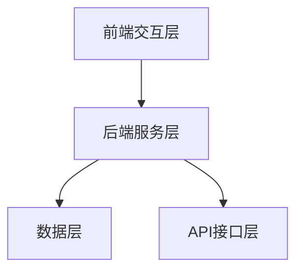
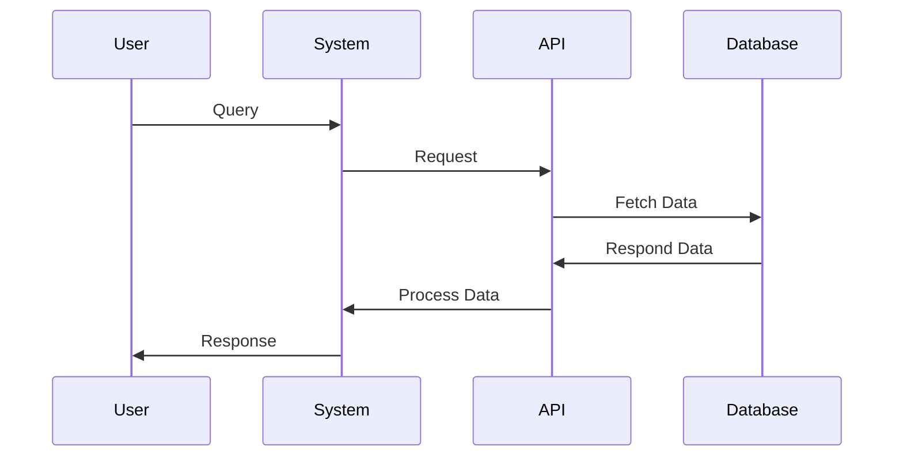
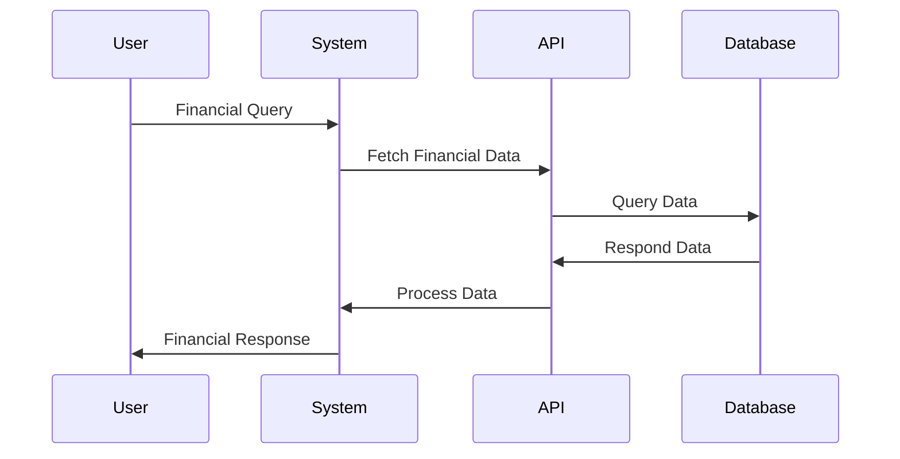

                 

## 文章标题

# AI驱动的智能客服：提升用户体验的新策略

## 文章关键词

- 智能客服
- 用户体验
- AI技术
- 数据驱动
- 上下文感知
- 情感智能

## 摘要

本文深入探讨了AI驱动的智能客服如何通过新策略提升用户体验。我们首先介绍了智能客服的背景、定义与价值，接着详细分析了AI驱动的技术原理与架构。随后，我们探讨了用户体验的核心要素，并提出了基于数据驱动、上下文感知和情感智能的策略。通过案例分析，我们总结了成功关键因素和失败教训，最终对未来智能客服的发展方向和挑战进行了展望。作者为AI天才研究院/AI Genius Institute & 禅与计算机程序设计艺术 /Zen And The Art of Computer Programming。

---

### 引言

在现代商业环境中，客户服务已成为企业竞争力的关键因素。随着互联网和移动设备的普及，用户期望更加个性化和高效的客户服务体验。传统的客户服务方式已经难以满足这种日益增长的需求，因此，智能客服成为了一种必然的选择。智能客服利用人工智能（AI）技术，尤其是自然语言处理、机器学习和深度学习等先进算法，实现了对客户问题的自动识别、理解和响应。

智能客服的崛起不仅改变了客户服务的方式，也提高了企业的运营效率。它能够24小时不间断地提供服务，减少人力成本，并提高问题解决的效率。然而，智能客服的发展仍面临诸多挑战，如用户体验的提升、数据隐私保护以及情感智能的实现等。本文旨在探讨AI驱动的智能客服如何通过新策略提升用户体验，并分析其中的核心概念、技术原理和实践案例。

本文结构如下：

1. **智能客服的崛起**：介绍智能客服的定义、背景、发展历程和现状。
2. **AI驱动的智能客服技术**：分析AI技术在智能客服中的应用，包括语音识别、自然语言理解和机器学习等。
3. **智能客服的用户体验要素**：探讨用户体验的核心要素，如用户需求分析、交互设计与用户体验评估。
4. **AI驱动的智能客服策略**：介绍数据驱动、上下文感知和情感智能等新策略，并分析其实现方法和挑战。
5. **实践与案例分析**：通过具体案例展示智能客服的应用和实践，总结成功经验和失败教训。
6. **结论与展望**：总结本文的主要观点，并对未来智能客服的发展方向和挑战进行展望。

### 智能客服的定义与价值

智能客服是指利用人工智能技术，尤其是自然语言处理（NLP）、机器学习和深度学习等先进算法，自动识别、理解和响应客户问题的客户服务系统。与传统的人工客服相比，智能客服具有显著的优点，包括高效性、一致性和可扩展性。

**定义**

智能客服的定义可以从以下几个方面进行理解：

- **技术层面**：智能客服的核心在于其使用的AI技术，包括自然语言理解、语音识别、机器学习和深度学习等。这些技术使得智能客服能够理解客户的语言，并生成相应的响应。

- **功能层面**：智能客服的功能包括自动回答常见问题、处理复杂查询、提供个性化建议等。它可以通过文本、语音和图像等多种方式与客户交互。

- **应用层面**：智能客服被广泛应用于电子商务、金融、医疗、旅游等行业，为企业提供高效的客户服务解决方案。

**价值**

智能客服的价值体现在以下几个方面：

- **提升效率**：智能客服能够自动处理大量客户问题，减少人工干预，提高服务效率。例如，在电子商务领域，智能客服可以24小时在线，快速响应用户的查询和投诉。

- **降低成本**：传统的人工客服需要大量的人力资源，而智能客服通过自动化减少了人力成本。此外，智能客服还可以减少企业的运营成本，如电话客服中心和实体服务点的运营费用。

- **提高客户满意度**：智能客服能够提供快速、准确和个性化的服务，提高客户满意度。通过自然语言处理和机器学习，智能客服可以理解客户的情感和需求，提供更加贴近客户期望的服务。

- **数据收集与分析**：智能客服在与客户交互的过程中，可以收集大量的用户数据，包括用户行为、偏好和反馈等。这些数据可以帮助企业更好地了解客户需求，优化产品和服务。

**发展历程**

智能客服的发展经历了几个关键阶段：

1. **规则引擎阶段**：早期的智能客服主要依赖于预定义的规则进行问题解答。这种方式虽然简单，但灵活性较差，难以处理复杂的问题。

2. **基于模板的阶段**：随着NLP技术的发展，智能客服开始使用模板匹配的方法。通过将客户的问题与预定义的模板进行匹配，系统可以生成相应的回答。这种方法在处理常见问题时效果较好，但对于复杂问题仍然有限。

3. **自然语言理解阶段**：随着深度学习和机器学习技术的进步，智能客服开始采用更高级的自然语言处理技术。通过训练大型神经网络模型，智能客服可以更好地理解客户的意图和上下文，提供更加准确和个性化的服务。

4. **多模态交互阶段**：现代智能客服不仅支持文本交互，还支持语音、图像等多种交互方式。这种多模态交互使得智能客服能够更加灵活地与客户进行沟通，提高用户体验。

**现状**

当前，智能客服已经成为企业客户服务的重要组成部分。许多企业已经部署了智能客服系统，以提高服务效率和降低成本。以下是智能客服现状的几个特点：

- **广泛应用**：智能客服在各个行业得到了广泛应用，如电子商务、金融、医疗和旅游等。

- **技术成熟**：随着AI技术的不断进步，智能客服的技术水平也在不断提升。现代智能客服可以处理更加复杂的问题，提供更加精准的服务。

- **用户体验优化**：企业不断优化智能客服的用户体验，通过改善交互界面和提升响应速度，提高客户满意度。

- **与人工客服结合**：智能客服通常与人工客服相结合，形成一种混合服务模式。在处理复杂问题时，智能客服可以自动转接给人工客服，提高问题解决的效率。

**未来趋势**

随着AI技术的不断发展，智能客服的未来趋势将更加智能化和个性化。以下是几个可能的未来发展方向：

- **情感智能**：未来的智能客服将能够更好地理解客户的情感，提供更加温暖和人性化的服务。

- **多模态交互**：智能客服将支持更多的交互方式，如虚拟现实（VR）和增强现实（AR），提供更加丰富的用户体验。

- **自动化与智能化**：随着AI技术的进步，智能客服将能够实现更高程度的自动化和智能化，减少人工干预。

- **隐私保护**：在保护用户隐私和数据安全方面，智能客服将采取更加严格的措施，确保用户数据的合法性。

### AI驱动的智能客服技术

AI技术的快速发展为智能客服带来了前所未有的机遇。在智能客服系统中，AI技术被广泛应用于语音识别、自然语言理解、机器学习与深度学习等多个方面，从而实现高效、精准和个性化的客户服务。下面，我们将详细探讨这些AI技术及其在智能客服中的应用。

#### 语音识别

语音识别技术是智能客服的重要组成部分，它使得客服系统能够通过语音与客户进行交流。语音识别技术的基本原理是将语音信号转换为文本，然后利用自然语言处理技术对文本进行分析和解答。

**技术原理**

语音识别技术主要基于以下步骤：

1. **语音信号预处理**：包括噪声过滤、语音增强等，以提高语音信号的清晰度。
2. **特征提取**：将预处理后的语音信号转换为声学特征，如频谱特征、倒谱特征等。
3. **模型训练**：使用大量的语音数据对模型进行训练，使其能够识别不同的语音信号。
4. **解码**：根据声学特征和预训练的模型，将语音信号转换为文本。

**应用场景**

- **自动语音应答系统（IVR）**：智能客服系统可以自动识别客户拨打的电话，并提供语音导航服务。
- **语音助手**：如智能音箱、智能机器人等，能够通过语音与客户进行交互，回答问题和提供帮助。

**挑战与解决方案**

- **语音识别的准确性**：语音识别的准确性受到多种因素的影响，如语音质量、语音信号中的噪声等。为提高准确性，可以采用自适应滤波、语音增强等技术。
- **多语言支持**：智能客服需要支持多种语言，这增加了模型训练的复杂度。通过多语言数据集的训练和模型适配，可以解决这一问题。

#### 自然语言理解

自然语言理解（NLU）技术是智能客服的核心，它使得客服系统能够理解客户的意图和问题，并生成相应的回答。自然语言理解技术主要涉及语言理解、意图识别、实体识别等方面。

**技术原理**

自然语言理解技术主要包括以下步骤：

1. **文本预处理**：包括分词、词性标注、句法分析等，将文本转换为结构化的数据。
2. **意图识别**：通过分析文本内容，识别客户的意图，如查询、投诉、建议等。
3. **实体识别**：从文本中提取关键信息，如人名、地点、时间等。
4. **上下文分析**：结合上下文信息，对客户的意图进行更准确的识别和解读。

**应用场景**

- **自动回答常见问题**：智能客服可以自动识别客户的常见问题，并生成相应的回答，提高服务效率。
- **个性化推荐**：根据客户的购买历史和偏好，智能客服可以推荐相关的产品或服务。
- **智能对话**：智能客服可以通过对话与客户进行互动，解答问题、提供帮助。

**挑战与解决方案**

- **多义词处理**：自然语言中存在大量的多义词，这给意图识别和实体识别带来了挑战。可以通过上下文分析和词义消歧技术来提高识别的准确性。
- **领域适应性**：不同领域的术语和表达方式可能有所不同，智能客服需要具有领域适应性。通过领域特定的数据集和模型训练，可以解决这一问题。

#### 机器学习与深度学习

机器学习与深度学习技术是智能客服的基石，它们通过训练模型，使客服系统能够自动学习和优化，从而提供更高效、更准确的客户服务。

**技术原理**

1. **机器学习**：机器学习是通过训练模型，使计算机能够从数据中自动学习规律和模式。在智能客服中，机器学习技术主要用于模式识别、分类、回归等问题。
   
2. **深度学习**：深度学习是机器学习的一个子领域，它使用多层神经网络对数据进行建模和分析。深度学习技术在智能客服中，尤其在自然语言理解和语音识别等方面具有显著优势。

**应用场景**

- **个性化服务**：通过分析客户的互动历史和行为数据，智能客服可以提供个性化的服务和建议。
- **智能预测**：智能客服可以通过机器学习模型，预测客户的行为和需求，从而提供更加精准的服务。
- **智能决策**：智能客服可以基于机器学习模型，自动做出决策，如推荐产品、处理投诉等。

**挑战与解决方案**

- **数据质量**：机器学习和深度学习模型的性能很大程度上取决于数据的质量。通过数据清洗、去噪和增强等技术，可以提高数据质量。
- **模型解释性**：深度学习模型通常被视为“黑箱”，其内部决策过程难以解释。通过可解释性研究，可以增强模型的透明度和可解释性。

#### 智能客服系统架构

智能客服系统通常采用分布式架构，以实现高效、可扩展和可维护的服务。以下是智能客服系统架构的主要组成部分：

1. **前端交互层**：包括Web界面、移动应用和语音交互界面，负责与客户进行交互。
2. **后端服务层**：包括语音识别、自然语言理解、机器学习模型和数据库等，负责处理客户请求和提供服务。
3. **数据层**：包括客户数据、交互数据和行为数据等，用于训练和优化智能客服模型。
4. **API接口层**：提供与第三方系统集成的能力，如社交媒体、电子商务平台等。

**实现方法**

1. **模块化设计**：通过模块化设计，智能客服系统可以方便地进行扩展和升级，同时提高系统的可维护性。
2. **分布式计算**：通过分布式计算，智能客服系统可以处理大量的并发请求，提高系统的性能和可靠性。
3. **数据驱动**：智能客服系统通过不断收集和分析客户数据，实现自我学习和优化，提供更加个性化的服务。

**架构图**

以下是智能客服系统架构的Mermaid流程图：



通过上述架构，智能客服系统实现了高效、智能和个性化的客户服务。

### 智能客服的用户体验要素

用户体验（UX）是衡量智能客服系统成功与否的关键因素。为了提供优质的客户服务，智能客服系统需要充分考虑用户体验的各个方面，包括用户需求分析、交互设计与用户体验评估。以下我们将详细探讨这些要素。

#### 用户需求分析

用户需求分析是智能客服设计的第一步，它旨在了解用户的需求和期望，从而设计出能够满足用户需求的系统。以下是用户需求分析的主要方法：

1. **问卷调查**：通过问卷调查，可以收集用户对现有客服系统的满意度、期望和痛点。问卷调查可以帮助识别用户最关心的问题和需求。

2. **用户访谈**：通过访谈用户，可以深入了解用户的实际使用场景和体验。用户访谈可以帮助识别用户在客服过程中遇到的困难和期望。

3. **用户行为分析**：通过分析用户在客服系统中的行为数据，可以了解用户的互动模式和偏好。用户行为分析可以帮助识别用户在客服过程中的问题和需求。

**案例**：

假设一家电商企业希望提升其智能客服系统的用户体验。通过问卷调查，发现用户最希望智能客服能够提供24小时在线服务、快速回答问题和提供个性化推荐。通过用户访谈，发现用户在客服过程中最常见的问题是订单状态查询和退换货流程。通过用户行为分析，发现用户在查询订单状态时，通常需要重复输入订单号，这影响了用户的使用体验。

#### 交互设计

交互设计是智能客服系统的核心，它决定了用户如何与系统进行互动。以下是交互设计的主要原则和技巧：

1. **简洁性**：交互设计应保持简洁，避免冗余和复杂的操作。简洁的界面可以减少用户的学习成本，提高用户的使用效率。

2. **直观性**：交互设计应直观易懂，用户能够快速理解并操作。直观的界面可以通过清晰的语言、图标和布局来实现。

3. **响应速度**：交互设计应考虑系统的响应速度，确保用户在提交请求后，能够迅速得到响应。快速响应可以提高用户的满意度。

**案例**：

在电商智能客服系统中，为了提高简洁性和直观性，可以将订单状态查询功能放在首页显著位置，用户只需点击即可查询订单状态。同时，为了提高响应速度，可以采用异步请求技术，使系统在后台处理查询请求，而用户界面则保持流畅。

#### 用户体验评估

用户体验评估是确保智能客服系统满足用户需求的重要环节。以下是用户体验评估的主要方法：

1. **可用性测试**：通过可用性测试，可以评估系统在实际使用中的易用性和效率。可用性测试通常包括用户任务完成情况、用户满意度、错误率等指标。

2. **用户反馈**：通过收集用户反馈，可以了解用户对系统的实际体验和改进建议。用户反馈可以帮助识别系统中的问题和优化方向。

3. **数据分析**：通过分析用户行为数据，可以评估系统的使用情况和用户满意度。数据分析可以提供定量的评估指标，如用户活跃度、留存率、转化率等。

**案例**：

假设电商智能客服系统进行了可用性测试，发现用户在查询订单状态时，需要多次点击才能完成操作，这影响了用户的使用效率。通过用户反馈，用户表示希望能够提供一键查询功能。通过数据分析，发现用户在操作过程中的点击量较高，这进一步确认了优化需求的合理性。

#### 提升用户体验的策略

为了提升智能客服系统的用户体验，可以采取以下策略：

1. **个性化推荐**：根据用户的历史数据和偏好，智能客服可以提供个性化的产品推荐和咨询服务，提高用户的满意度。

2. **多渠道支持**：提供多种交互渠道，如文本、语音和视频等，满足不同用户的需求，提高用户体验。

3. **情感智能**：通过情感识别和情感驱动的对话策略，智能客服可以更好地理解用户的情感，提供更加温暖和人性化的服务。

4. **快速响应**：通过优化系统架构和算法，提高智能客服的响应速度，减少用户等待时间。

5. **用户体验设计**：定期进行用户体验设计，根据用户反馈和数据分析，不断优化和改进系统界面和交互流程。

通过上述策略，智能客服系统可以更好地满足用户需求，提升用户体验，从而提高客户满意度。

### 数据驱动策略

在智能客服的发展过程中，数据驱动的策略扮演着至关重要的角色。数据驱动的策略不仅能够提升系统的智能水平，还能够优化用户体验，提高服务效率。以下是数据驱动的核心概念、实现方法及其在智能客服中的应用。

#### 数据收集与处理

数据收集是数据驱动策略的基础。智能客服系统需要从多个渠道收集用户数据，包括用户行为数据、交互数据、反馈数据和外部数据等。以下是数据收集的主要来源：

1. **用户行为数据**：包括用户的访问记录、购买行为、咨询记录等。这些数据可以反映用户的使用习惯和偏好。
2. **交互数据**：包括用户与客服系统之间的互动记录，如文本、语音和视频等。这些数据可以用于分析用户的意图和需求。
3. **反馈数据**：包括用户对客服系统的评价和建议。这些数据可以帮助识别系统中的问题和优化方向。
4. **外部数据**：包括社交媒体、搜索引擎和其他数据源中的用户反馈和数据。这些数据可以提供更全面的用户画像和市场趋势。

**数据处理方法**：

1. **数据清洗**：数据清洗是数据处理的第一步，旨在去除数据中的噪声和错误，确保数据的质量。
2. **数据整合**：将来自不同渠道的数据进行整合，形成一个统一的用户数据视图。这有助于更全面地理解用户行为和需求。
3. **数据存储**：使用数据库和数据仓库等技术，存储和处理大规模的用户数据。常用的数据库技术包括关系数据库和NoSQL数据库。

#### 用户行为分析

用户行为分析是数据驱动的核心应用之一。通过对用户行为数据进行分析，智能客服系统可以识别用户的兴趣和需求，从而提供个性化的服务和推荐。

**分析步骤**：

1. **数据预处理**：对用户行为数据进行清洗和整合，确保数据的质量和一致性。
2. **特征提取**：从用户行为数据中提取关键特征，如用户访问频率、购买频率、咨询主题等。
3. **行为建模**：使用机器学习和统计方法，建立用户行为模型。行为模型可以帮助识别用户的兴趣和行为模式。
4. **行为预测**：基于用户行为模型，预测用户的未来行为和需求。预测结果可以用于个性化推荐和用户体验优化。

**案例**：

假设一个电商平台的智能客服系统通过对用户行为数据的分析，发现用户在购买前通常会咨询关于产品的详细信息。基于这一发现，系统可以自动向有购买意向的用户推送相关的产品详细信息，提高转化率。

#### 数据驱动的个性化服务

个性化服务是智能客服的重要功能之一。通过数据驱动的策略，智能客服系统能够根据用户的个性化需求提供定制化的服务。

**实现方法**：

1. **用户画像**：基于用户数据，构建用户画像。用户画像包括用户的年龄、性别、地理位置、兴趣爱好等特征。
2. **推荐算法**：使用推荐算法，根据用户画像和交互数据，为用户推荐相关的产品、服务和信息。
3. **动态调整**：根据用户的实时反馈和行为数据，动态调整推荐策略和服务内容，确保个性化服务的实时性和准确性。

**案例**：

一个在线旅游平台通过数据驱动的个性化服务，根据用户的旅行历史和偏好，为用户推荐合适的旅游目的地、酒店和活动。这种个性化服务不仅提高了用户的满意度，也提高了平台的销售额。

#### 数据隐私与合规性

在数据驱动的智能客服系统中，数据隐私保护和合规性是一个不可忽视的问题。以下是一些关键的考虑因素：

1. **数据匿名化**：对用户数据进行匿名化处理，确保用户隐私不受侵犯。
2. **数据加密**：使用数据加密技术，保护用户数据在传输和存储过程中的安全性。
3. **隐私政策**：明确告知用户数据收集、使用和共享的方式，并获取用户的同意。
4. **合规性审查**：定期进行合规性审查，确保智能客服系统的数据管理符合相关法律法规和标准。

**案例**：

某电商平台在实施数据驱动的个性化服务时，采用了严格的数据匿名化和加密措施，并制定了详细的隐私政策。这些措施不仅保护了用户的隐私，也赢得了用户的信任。

通过数据驱动的策略，智能客服系统能够更好地理解用户需求，提供个性化的服务，并提高用户体验。然而，数据隐私保护和合规性也是必须认真对待的问题，只有在确保用户隐私和数据安全的前提下，数据驱动的策略才能真正发挥作用。

### 上下文感知策略

上下文感知技术是智能客服系统中的重要组成部分，它使得系统能够更好地理解用户的当前状态和需求，提供更加精准和个性化的服务。上下文感知策略不仅能够提升用户体验，还能够提高智能客服系统的效率和响应速度。以下是上下文感知技术的概念、实现方法和在智能客服中的应用。

#### 概念

上下文感知技术是指智能系统通过感知和分析用户的当前环境和行为，动态获取和理解上下文信息，并根据上下文信息提供相应的服务。上下文信息可以包括用户的地理位置、时间、历史行为、设备状态等。

**上下文信息分类**：

1. **物理上下文**：包括地理位置、天气、时间等。
2. **社会上下文**：包括用户的社会角色、关系网络、兴趣爱好等。
3. **情境上下文**：包括用户当前所处的场景、任务等。
4. **设备上下文**：包括用户使用的设备类型、网络状态等。

#### 实现方法

实现上下文感知技术通常需要以下几个步骤：

1. **上下文收集**：通过传感器、用户输入和第三方数据源等渠道，收集用户的上下文信息。
2. **上下文建模**：对收集到的上下文信息进行建模，构建上下文模型。上下文模型可以通过机器学习和自然语言处理技术实现。
3. **上下文推理**：使用上下文模型，对用户的当前状态和需求进行推理，理解用户的意图。
4. **上下文应用**：根据上下文推理的结果，提供相应的服务或建议。

#### 在智能客服中的应用

上下文感知技术在智能客服中的应用，可以显著提升用户体验和服务质量。以下是几个关键应用场景：

1. **智能对话管理**：智能客服系统可以根据用户的上下文信息，动态调整对话流程和响应内容。例如，当用户提到“明天”时，系统可以自动识别为明天的时间，提供相关的时间信息或安排建议。
2. **个性化服务**：根据用户的地理位置和兴趣，智能客服可以提供个性化的推荐和服务。例如，当用户在旅游时，系统可以推荐附近的景点、餐厅和活动。
3. **情境感知**：智能客服系统可以识别用户的当前情境，提供相应的帮助。例如，当用户在健身房时，系统可以提供健身计划和健康建议。

#### 案例分析

**案例1：在线购物平台**

一个在线购物平台的智能客服系统，通过上下文感知技术，可以提供个性化的购物建议。例如，当用户浏览商品时，系统可以识别用户的地理位置，推荐附近商店的商品；当用户在夜间浏览时，系统可以推荐睡眠产品。

**案例2：银行客服系统**

银行的智能客服系统，通过上下文感知技术，可以提供更加个性化的金融服务。例如，当用户提到“退休规划”时，系统可以自动识别为用户需要关于退休理财的建议，并提供相应的信息。

**案例3：医疗咨询系统**

医疗咨询系统的智能客服，通过上下文感知技术，可以提供更加专业的咨询服务。例如，当用户提到“感冒症状”时，系统可以识别用户当前的地理位置和天气状况，提供更加准确的诊断建议。

#### 挑战与解决方案

**挑战**：

1. **上下文获取难度**：获取准确的上下文信息是一个挑战，需要多种传感器和数据源的协同工作。
2. **上下文理解误差**：上下文信息的理解和推理可能存在误差，影响服务的准确性。
3. **隐私保护**：上下文感知技术涉及大量用户隐私信息，如何保护用户隐私是重要的挑战。

**解决方案**：

1. **多源数据融合**：通过融合多种数据源，提高上下文信息的准确性。例如，结合GPS数据和用户输入，更准确地获取用户位置信息。
2. **上下文增强**：使用机器学习和自然语言处理技术，增强上下文推理的能力，减少理解误差。
3. **隐私保护**：采用数据匿名化和加密技术，确保用户隐私安全。同时，制定严格的隐私政策和合规性措施，确保数据处理符合相关法律法规。

通过上下文感知策略，智能客服系统可以更好地理解用户的需求，提供更加精准和个性化的服务，从而提升用户体验。然而，实现这一目标需要克服多个技术挑战，并确保用户隐私和数据安全。

### 情感智能策略

情感智能是指智能系统在处理客户问题时，能够识别、理解和模拟人类的情感，从而提供更加温暖、人性化的服务。情感智能策略在智能客服系统中发挥着重要作用，可以显著提升用户体验，增强客户满意度。以下是情感智能的核心概念、实现方法及其在智能客服中的应用。

#### 概念

情感智能的核心在于能够理解和处理人类的情感。这包括以下几个方面：

1. **情感识别**：通过语音、文本和表情等渠道，识别客户的情感状态，如喜悦、愤怒、焦虑等。
2. **情感理解**：理解情感的上下文和原因，例如，客户为什么感到愤怒，是否是因为服务问题，还是因为其他原因。
3. **情感模拟**：在回应客户时，模拟人类的情感表达，如使用亲切、温和或坚定的语气。

**情感智能层次**：

1. **基础层次**：通过情感识别，简单地判断客户是高兴还是生气。
2. **进阶层次**：不仅识别情感，还理解情感背后的原因和上下文。
3. **高级层次**：在回应客户时，模拟人类的情感反应，提供更加温暖和人性化的服务。

#### 实现方法

实现情感智能需要结合多种技术，包括自然语言处理（NLP）、语音识别、机器学习和情感建模等。以下是情感智能的主要实现方法：

1. **情感识别**：

   - **语音情感识别**：通过分析语音的音调、音速和音量等特征，识别客户的情感状态。
   - **文本情感识别**：通过分析文本中的情感词汇和语法结构，识别客户的情感状态。
   - **表情情感识别**：通过分析客户的面部表情，识别客户的情感状态。

2. **情感理解**：

   - **上下文分析**：结合上下文信息，理解客户情感状态的原因和背景。
   - **情感推理**：使用机器学习算法，对客户的情感进行推理和分析。

3. **情感模拟**：

   - **语音合成**：通过调整语音的音调、音速和音量，模拟不同的情感表达。
   - **文本生成**：通过情感词汇和语法结构的变化，模拟不同的情感表达。

#### 在智能客服中的应用

情感智能在智能客服中的应用，可以显著提升用户体验和服务质量。以下是几个关键应用场景：

1. **情感识别与回应**：智能客服系统可以识别客户的情感状态，并根据情感状态提供相应的回应。例如，当客户表达愤怒时，系统可以自动切换到柔和的语气，并主动解决问题。

2. **情感驱动的对话策略**：智能客服系统可以根据客户的情感状态，动态调整对话策略。例如，当客户感到焦虑时，系统可以提供更多的安慰和建议。

3. **情感增强的服务**：智能客服系统可以通过情感模拟，提供更加温暖和人性化的服务。例如，在节假日或客户生日时，系统可以发送祝福信息，表达对客户的关怀。

#### 案例分析

**案例1：在线购物平台的智能客服**

一个在线购物平台的智能客服系统，通过情感识别技术，可以识别客户的情感状态，并根据情感状态提供相应的服务。例如，当客户表达愤怒时，系统可以主动道歉，并承诺尽快解决问题。

**案例2：银行的智能客服系统**

银行的智能客服系统，通过情感理解技术，可以理解客户情感背后的原因，并提供更加个性化的服务。例如，当客户表达焦虑时，系统可以提供详细的财务规划和建议，帮助客户缓解焦虑。

**案例3：医疗咨询系统的智能客服**

医疗咨询系统的智能客服，通过情感模拟技术，可以提供更加温暖和人性化的服务。例如，当客户表达痛苦时，系统可以使用温柔的语气，并提供安慰和建议。

#### 挑战与解决方案

**挑战**：

1. **情感识别准确性**：情感识别的准确性受到多种因素的影响，如语音质量、文本表达方式等。
2. **情感理解复杂性**：情感理解涉及到复杂的上下文和推理，实现起来具有挑战性。
3. **隐私保护**：情感识别和处理涉及到大量的用户情感数据，如何保护用户隐私是一个重要的挑战。

**解决方案**：

1. **多模态融合**：通过结合多种数据源，如语音、文本和表情等，提高情感识别的准确性。
2. **上下文增强**：使用上下文信息，提高情感理解的能力，减少误解。
3. **隐私保护**：采用数据匿名化和加密技术，确保用户情感数据的安全。同时，制定严格的隐私政策和合规性措施，确保数据处理符合相关法律法规。

通过情感智能策略，智能客服系统可以更好地理解客户的情感，提供更加温暖和人性化的服务，从而提升用户体验。然而，实现这一目标需要克服多个技术挑战，并确保用户隐私和数据安全。

### 智能客服的生态系统

智能客服系统不仅是一个独立的应用，它还与企业的多个系统和业务紧密相连，构成了一个复杂的生态系统。在这个生态系统中，智能客服与其他系统相互作用，共同为企业提供高效的客户服务。以下是智能客服与客户关系管理（CRM）、电子商务和人工智能辅助工具的相互作用，以及智能客服系统的发展方向和前景。

#### 智能客服与客户关系管理（CRM）

客户关系管理（CRM）系统是企业管理客户信息、销售机会和客户互动的核心工具。智能客服与CRM系统的集成，可以为企业带来以下益处：

1. **数据整合**：智能客服系统可以自动收集客户互动数据，如咨询记录、反馈和投诉等，并将这些数据整合到CRM系统中。这有助于企业更全面地了解客户需求和行为，优化客户管理策略。

2. **自动化流程**：通过CRM系统，智能客服可以实现自动化的客户服务流程。例如，当客户咨询某个问题时，系统可以自动创建服务记录，并将问题转交给相应的部门或员工进行处理。

3. **个性化服务**：CRM系统中的客户数据可以帮助智能客服提供更加个性化的服务。例如，当客户再次咨询时，系统可以根据之前的互动记录，提供更加精准的答案和建议。

**实现方法**：

- **API接口**：通过API接口，智能客服系统可以与CRM系统进行数据交换和功能集成。
- **数据同步**：智能客服系统定期同步CRM系统中的数据，确保数据的最新性和一致性。
- **工作流管理**：智能客服系统可以与CRM系统的工作流管理功能相结合，实现自动化服务流程。

#### 智能客服与电子商务

在电子商务领域，智能客服系统是提升用户体验和销售转化率的关键因素。智能客服与电子商务平台的相互作用，可以带来以下优势：

1. **购物体验优化**：智能客服可以实时回答客户的购物问题，提供产品信息和推荐，提高用户的购物体验。例如，当客户在选购产品时，智能客服可以提供详细的规格说明和用户评价。

2. **在线客服**：智能客服系统可以提供24小时在线客服服务，解决客户在购物过程中的疑问和问题，提高客户满意度。

3. **个性化推荐**：通过分析客户的购物行为和偏好，智能客服系统可以提供个性化的产品推荐，增加销售机会。

**实现方法**：

- **平台集成**：智能客服系统可以与电子商务平台进行集成，通过API接口实现功能整合。
- **数据分析**：智能客服系统分析客户的购物行为数据，提供个性化的服务和推荐。
- **多渠道支持**：智能客服系统支持多种渠道（如文本、语音和视频）与客户进行互动，提高服务的便捷性。

#### 智能客服与人工智能辅助工具

智能客服系统不仅需要独立运作，还可以与其他人工智能（AI）辅助工具相结合，进一步提升服务能力和效率。以下是几个关键的应用：

1. **机器人流程自动化（RPA）**：智能客服系统可以与RPA工具结合，自动化处理重复性的任务，如数据录入、订单处理等，提高工作效率。

2. **智能推荐系统**：智能客服系统可以与智能推荐系统相结合，提供个性化的产品和服务推荐，增加客户满意度和忠诚度。

3. **数据分析工具**：智能客服系统可以与数据分析工具结合，分析客户互动数据，优化服务策略和业务流程。

**实现方法**：

- **集成接口**：智能客服系统与其他AI辅助工具通过API接口进行数据交换和功能集成。
- **协同工作**：智能客服系统与其他AI工具协同工作，实现自动化和智能化的客户服务。
- **数据共享**：智能客服系统与其他AI工具共享客户数据，实现更全面的数据分析和应用。

#### 智能客服系统的发展方向和前景

随着AI技术的不断进步，智能客服系统将朝着更加智能化、个性化和高效化的方向发展。以下是几个可能的发展方向：

1. **情感智能**：未来的智能客服将更加注重情感智能，能够更好地理解客户的情感，提供更加温暖和人性化的服务。

2. **多模态交互**：智能客服系统将支持多种交互方式，如语音、文本、视频和图像等，提供更加丰富的用户体验。

3. **智能决策**：智能客服系统将利用机器学习和深度学习技术，实现更加智能的决策，提高问题解决效率和准确性。

4. **自动化与智能化**：智能客服系统将实现更高程度的自动化和智能化，减少人工干预，提高服务效率。

5. **隐私保护**：随着数据隐私保护意识的增强，未来的智能客服系统将采取更加严格的隐私保护措施，确保用户数据的安全。

6. **生态系统整合**：智能客服系统将与其他企业系统和业务紧密结合，形成更加紧密的生态系统，提供全方位的客户服务解决方案。

总之，智能客服系统的发展将带来更加智能、便捷和高效的客户服务体验，为企业带来显著的商业价值。然而，实现这一目标需要不断的技术创新和优化，同时确保用户隐私和数据安全。

### 实践与案例分析

在智能客服的实际应用中，成功的案例和失败的教训都是宝贵的经验。通过具体案例的分析，我们可以更好地理解智能客服的实施过程、关键成功因素以及可能面临的挑战。

#### 案例一：某电商平台的智能客服系统

**项目介绍**

某大型电商平台在其在线购物平台上部署了一套智能客服系统，旨在提升客户服务质量和购物体验。该系统采用了语音识别、自然语言理解和机器学习等AI技术，实现了24小时在线服务、个性化推荐和快速问题解决。

**系统功能设计**

- **自动问答**：系统可以自动回答常见的购物问题，如订单状态查询、退换货流程等。
- **个性化推荐**：基于用户的购物历史和行为数据，系统可以提供个性化的产品推荐。
- **智能对话**：系统通过自然语言理解，与客户进行智能对话，提供高效的问题解决。

**系统架构设计**

- **前端交互层**：包括Web界面和移动应用，用户可以通过文本或语音与智能客服进行交互。
- **后端服务层**：包括语音识别、自然语言理解和机器学习模型，负责处理用户请求和生成响应。
- **数据层**：包括用户行为数据和商品数据，用于训练和优化智能客服模型。
- **API接口层**：提供与第三方系统集成的能力，如社交媒体和电子商务平台。

**系统接口设计和系统交互**

- **接口设计**：系统通过RESTful API与前端应用和第三方平台进行数据交互。
- **系统交互**：用户通过前端界面发起请求，后端服务层处理请求并生成响应，最后返回给用户。



**核心实现源代码**

以下是智能客服系统的核心实现源代码示例：

```python
# 示例：智能客服系统的自然语言理解部分
from transformers import pipeline

# 初始化自然语言理解模型
nlp = pipeline('sentiment-analysis')

def analyze_sentiment(text):
    # 使用预训练的模型分析文本的情感
    result = nlp(text)
    return result

# 用户查询示例
user_query = "我的订单什么时候能送到？"
sentiment = analyze_sentiment(user_query)
print("用户情感：", sentiment)
```

**代码应用解读与分析**

上述代码使用了Hugging Face的transformers库，初始化了一个预训练的自然语言理解模型，用于分析用户的情感。通过调用`analyze_sentiment`函数，我们可以得到用户的情感状态，从而为用户提供更加个性化的服务。

**实际案例分析**

**成功经验**

1. **高效的服务响应**：智能客服系统能够快速响应用户的查询，提高了客户满意度。
2. **个性化的服务**：基于用户的购物历史和偏好，系统提供了精准的产品推荐，增加了销售转化率。
3. **自动化流程**：智能客服系统自动化处理了大量常见问题，减少了人工成本。

**失败教训**

1. **情感识别不准确**：在初期部署时，系统的情感识别准确性较低，导致用户反馈不佳。
2. **用户隐私保护不足**：用户数据泄露的风险较高，引起用户担忧。

**优化建议**

1. **提升情感识别准确性**：通过改进情感识别算法和数据集，提高系统的情感识别准确性。
2. **加强用户隐私保护**：采用更严格的数据加密和安全措施，确保用户数据的安全。

#### 案例二：某银行智能客服系统

**项目介绍**

某银行在其在线服务平台上部署了一套智能客服系统，旨在提供24小时在线金融咨询服务。该系统集成了语音识别、自然语言理解和机器学习等技术，实现了快速问题解决和个性化金融推荐。

**系统功能设计**

- **金融问答**：系统可以回答关于金融产品、账户信息、贷款申请等常见问题。
- **个性化推荐**：根据用户的历史交易和投资偏好，系统提供个性化的金融产品推荐。
- **智能对话**：系统通过自然语言理解，与用户进行智能对话，提供高效的问题解决。

**系统架构设计**

- **前端交互层**：包括Web界面和移动应用，用户可以通过文本或语音与智能客服进行交互。
- **后端服务层**：包括语音识别、自然语言理解和机器学习模型，负责处理用户请求和生成响应。
- **数据层**：包括用户交易数据和金融产品数据，用于训练和优化智能客服模型。
- **API接口层**：提供与第三方系统集成的能力，如证券交易所和支付平台。

**系统接口设计和系统交互**

- **接口设计**：系统通过RESTful API与前端应用和第三方平台进行数据交互。
- **系统交互**：用户通过前端界面发起请求，后端服务层处理请求并生成响应，最后返回给用户。



**核心实现源代码**

以下是智能客服系统的核心实现源代码示例：

```python
# 示例：智能客服系统的自然语言理解部分
from transformers import pipeline

# 初始化自然语言理解模型
nlp = pipeline('question-answering')

def answer_query(question, context):
    # 使用预训练的模型回答用户的问题
    result = nlp(question=question, context=context)
    return result['answer']

# 用户查询示例
user_query = "我最近一笔交易的收益是多少？"
context = "您最近进行了股票交易，交易时间为2023-03-01，交易金额为10000元。"
answer = answer_query(user_query, context)
print("回答：", answer)
```

**代码应用解读与分析**

上述代码使用了Hugging Face的transformers库，初始化了一个预训练的自然语言理解模型，用于回答用户的金融问题。通过调用`answer_query`函数，系统可以自动生成问题的答案，提供高效的金融服务。

**实际案例分析**

**成功经验**

1. **高效的问题解决**：智能客服系统可以快速回答用户的金融问题，提高了客户满意度。
2. **个性化金融推荐**：基于用户的历史交易数据，系统提供了精准的金融产品推荐，增加了客户的投资机会。
3. **自动化流程**：智能客服系统自动化处理了大量常见问题，减轻了人工客服的负担。

**失败教训**

1. **数据隐私保护不足**：用户数据在传输和存储过程中存在泄露的风险，引起用户担忧。
2. **系统响应速度慢**：在高峰期，系统响应速度较慢，影响了用户体验。

**优化建议**

1. **加强用户隐私保护**：采用更严格的数据加密和安全措施，确保用户数据的安全。
2. **优化系统性能**：通过分布式计算和缓存技术，提高系统的响应速度和稳定性。

#### 案例总结

通过上述两个案例，我们可以总结出以下几点：

1. **关键成功因素**：
   - 高效的服务响应
   - 个性化的服务
   - 自动化流程
   - 数据隐私保护

2. **失败教训**：
   - 情感识别准确性不足
   - 系统响应速度慢
   - 用户隐私保护不足

3. **优化建议**：
   - 提升情感识别准确性
   - 加强用户隐私保护
   - 优化系统性能

总之，智能客服系统的成功实施需要综合考虑技术、用户体验和数据安全等多个方面，通过不断优化和改进，提升系统的性能和服务质量。

### 最佳实践 Tips

在实施智能客服系统的过程中，以下最佳实践可以帮助企业和开发人员更好地提升用户体验、确保系统的性能和安全性：

1. **用户体验优化**：
   - **简洁的界面设计**：确保交互界面简洁明了，避免冗余和复杂的操作，减少用户的学习成本。
   - **响应速度**：优化系统的响应速度，使用异步请求和缓存技术，减少用户的等待时间。
   - **个性化推荐**：根据用户的历史数据和偏好，提供个性化的服务和建议，提高用户的满意度。

2. **技术优化**：
   - **模型优化**：定期更新和优化自然语言处理和机器学习模型，提高系统的准确性和效率。
   - **分布式计算**：采用分布式架构，提高系统的并发处理能力和性能。
   - **多模态交互**：支持多种交互方式（如文本、语音、图像），提高用户的互动体验。

3. **数据安全和隐私保护**：
   - **数据加密**：对用户数据进行加密存储和传输，确保数据的安全。
   - **隐私政策**：制定明确的隐私政策，告知用户数据收集、使用和共享的方式，并确保用户同意。
   - **数据匿名化**：对用户数据进行匿名化处理，减少隐私泄露的风险。

4. **持续迭代与优化**：
   - **用户反馈**：定期收集用户反馈，根据用户的需求和体验，不断优化和改进系统。
   - **性能监控**：实时监控系统的性能和响应速度，及时发现和解决潜在问题。
   - **自动化测试**：实施自动化测试，确保系统的稳定性和可靠性。

5. **合规性遵循**：
   - **法律法规遵循**：确保系统的设计和实施符合相关的法律法规，如《通用数据保护条例》（GDPR）和《加州消费者隐私法案》（CCPA）等。
   - **合规性审查**：定期进行合规性审查，确保数据处理和隐私保护措施符合最新法律法规。

通过遵循这些最佳实践，企业和开发人员可以构建出更加智能、高效和安全的智能客服系统，从而提升用户体验，增加客户满意度，并确保系统的长期成功。

### 小结

本文详细探讨了AI驱动的智能客服技术及其在提升用户体验中的应用。首先，我们介绍了智能客服的定义、背景、发展历程和现状，阐述了其价值以及未来趋势。接着，我们深入分析了语音识别、自然语言理解、机器学习与深度学习等AI技术，展示了它们在智能客服系统中的应用方法和挑战。随后，我们探讨了用户体验的核心要素，包括用户需求分析、交互设计与用户体验评估，并提出了数据驱动、上下文感知和情感智能等提升用户体验的新策略。通过具体案例的分析，我们总结了智能客服系统的成功经验和失败教训，并提出了优化建议。最后，我们提出了最佳实践 Tips，强调了用户体验优化、技术优化、数据安全和隐私保护、持续迭代与优化以及合规性遵循的重要性。总之，AI驱动的智能客服正在逐步改变客户服务的面貌，通过不断的技术创新和优化，我们可以期待更加智能、高效和人性化的客服体验。

### 注意事项

在实施智能客服系统时，以下注意事项至关重要，以确保系统的有效性和用户体验：

1. **数据安全**：确保用户数据的安全和隐私，采用数据加密技术和严格的数据保护策略。
2. **性能优化**：优化系统的响应速度和稳定性，使用缓存和异步处理等技术提高性能。
3. **用户反馈**：定期收集和分析用户反馈，根据用户的实际体验不断优化系统。
4. **合规性**：遵循相关法律法规，如《通用数据保护条例》（GDPR）和《加州消费者隐私法案》（CCPA）。
5. **多语言支持**：确保系统支持多种语言，以满足不同用户的需求。

### 拓展阅读

1. **智能客服技术**：
   - 《智能客服：人工智能在客户服务中的应用》
   - 《语音识别与自然语言处理技术》

2. **用户体验设计**：
   - 《用户体验设计：理论与实践》
   - 《交互设计精髓》

3. **数据驱动策略**：
   - 《数据驱动的产品管理》
   - 《大数据：应用、挑战与未来》

4. **情感智能**：
   - 《情感智能：机器的情感计算》
   - 《情绪计算：技术与应用》

通过阅读这些相关书籍和文献，可以进一步深入了解智能客服和用户体验的各个方面，为实际应用提供更全面的理论支持和实践指导。

