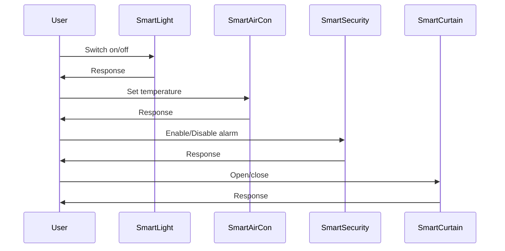

                 

### AI驱动的智能家居：打造舒适生活的新方案

#### 关键词：智能家居、人工智能、舒适生活、AI驱动、技术方案

> 摘要：随着人工智能（AI）技术的迅猛发展，智能家居市场迎来了全新的变革机遇。本文旨在探讨AI技术在智能家居领域的应用，通过深入分析AI驱动的智能家居系统，为广大消费者提供一种打造舒适生活的新方案。本文将首先介绍AI与智能家居的融合背景，随后详细解析AI在智能家居中的核心应用，最后展望智能家居的未来发展趋势，为读者提供全面的参考。

### 引言

智能家居，作为现代科技与生活品质提升的象征，正逐渐渗透到我们的日常生活中。从最初的遥控器，到如今的智能语音助手，智能家居的发展历程无疑是一部科技进步的史诗。然而，随着AI技术的不断成熟，智能家居迎来了新的里程碑。AI技术的引入，不仅使家居设备更加智能，还大大提升了用户的生活体验。

本文将围绕AI驱动的智能家居展开讨论，旨在为读者呈现一种全新的舒适生活方案。文章结构如下：

1. **AI与智能家居概述**：介绍AI与智能家居的融合背景，分析智能家居的现状与趋势。
2. **智能家居技术基础**：阐述智能家居技术的基础知识，包括物联网、传感器与执行器。
3. **AI核心算法在智能家居中的应用**：解析机器学习、深度学习等AI算法在智能家居中的应用。
4. **AI驱动的智能家居实现**：详细讲解智能安防、智能照明、智能空调等具体系统的实现。
5. **综合智能家居系统集成**：探讨智能家居系统的集成、交互与优化。
6. **智能家居项目实战**：通过实际项目展示智能家居系统的设计与实现。
7. **AI驱动的智能家居未来展望**：分析智能家居技术的发展前景与挑战。

### 目录大纲设计过程

为了设计出《AI驱动的智能家居：打造舒适生活的新方案》这本书的完整目录大纲，我们将按照以下步骤进行：

1. **明确书的核心主题**：首先，我们要确保目录大纲紧密围绕书的核心主题——AI驱动的智能家居。
2. **定义章节结构**：接下来，我们将定义书籍的章节结构，确保每个章节都有明确的内容范围和目标。
3. **细化章节内容**：在定义章节后，我们需要进一步细化每个章节的内容，确保包含核心概念、原理讲解、实际应用等。
4. **保持简洁性**：在设计和撰写目录大纲时，要确保内容简洁明了，避免多余的文字。
5. **遵循格式要求**：确保使用markdown格式，并且遵循1级、2级、3级目录的层级结构。

下面是根据上述步骤设计的书名《AI驱动的智能家居：打造舒适生活的新方案》的完整目录大纲：

----------------------------------------------------------------

## 第一部分：AI与智能家居概述

### 第1章：AI与智能家居——新时代的融合

#### 1.1.1 AI在智能家居中的作用

#### 1.1.2 智能家居的现状与趋势

#### 1.1.3 AI驱动的智能家居核心概念

### 第2章：智能家居技术基础

#### 2.1.1 智能家居技术概述

#### 2.1.2 物联网技术

#### 2.1.3 传感器与执行器

### 第3章：AI核心算法在智能家居中的应用

#### 3.1.1 机器学习基础

#### 3.1.2 深度学习在智能家居中的应用

#### 3.1.3 智能家居中的常用算法

## 第二部分：AI驱动的智能家居实现

### 第4章：智能安防系统

#### 4.1.1 智能安防系统概述

#### 4.1.2 智能视频监控系统

#### 4.1.3 智能入侵报警系统

### 第5章：智能照明系统

#### 5.1.1 智能照明系统概述

#### 5.1.2 调光与智能控制

#### 5.1.3 智能照明系统的实际应用案例

### 第6章：智能空调系统

#### 6.1.1 智能空调系统概述

#### 6.1.2 智能控制与调节

#### 6.1.3 智能空调系统的能效优化

### 第7章：综合智能家居系统集成

#### 7.1.1 智能家居系统的集成

#### 7.1.2 系统交互与数据共享

#### 7.1.3 智能家居系统的整体优化

## 第三部分：AI驱动的智能家居实践

### 第8章：智能家居项目实战

#### 8.1.1 项目介绍

#### 8.1.2 系统设计

#### 8.1.3 实现步骤与源代码解析

#### 8.1.4 项目总结与反思

### 第9章：AI驱动的智能家居未来展望

#### 9.1.1 智能家居技术发展前景

#### 9.1.2 AI驱动的智能家居面临的挑战

#### 9.1.3 未来智能家居的可能趋势

## 附录：智能家居技术与AI资源指南

----------------------------------------------------------------

### 目录大纲说明

- **第一部分**：AI与智能家居概述，主要介绍AI在智能家居中的作用以及相关技术基础。
- **第二部分**：AI驱动的智能家居实现，详细讲解了智能安防、智能照明和智能空调系统。
- **第三部分**：AI驱动的智能家居实践，通过项目实战和未来展望来探讨智能家居的发展。

这样的目录结构既涵盖了基础知识，又注重实际应用，同时预留了未来发展的空间。

---

## 核心概念与联系

### AI与智能家居的关系
$$
\text{AI} \rightarrow \text{智能家居} = \text{智能化控制 + 智能化服务}
$$
**属性特征对比表格：**
| 特征         | AI                           | 智能家居                           |
|--------------|------------------------------|-----------------------------------|
| 定义         | 使用计算机模拟人类智能的科技 | 利用网络、传感器、执行器等技术实现家居设备智能化 |
| 主要领域     | 机器学习、自然语言处理、计算机视觉 | 家庭自动化、远程控制、安防监控 |
| 目标         | 提高机器的智能水平           | 提高生活质量，实现便捷、高效、安全的家居环境 |
| 应用范围     | 广泛应用于各行业             | 专注于家居设备与系统的智能化 |
| 核心技术     | 机器学习、深度学习、神经网络 | 物联网技术、传感器技术、控制技术 |
| 主要挑战     | 算法复杂性、数据隐私、安全性  | 系统稳定性、可靠性、用户体验 |

**ER实体关系图架构：**
```mermaid
erDiagram
    AI |->| 智能家居 : 驱动
    AI |->| 智能家居设备 : 控制
    智能家居设备 |->| 传感器 : 感知
    智能家居设备 |->| 执行器 : 执行
```

通过上述表格和ER图，我们可以清晰地看到AI与智能家居之间的紧密联系和各自的核心特征。AI作为驱动技术，为智能家居提供智能化的控制和服务；而智能家居设备则通过传感器和执行器实现家居环境的智能化感知和执行。这种结合不仅提高了家居设备的功能，还显著提升了用户的生活质量。

### 背景介绍

#### 核心概念术语说明

在探讨AI驱动的智能家居之前，我们需要了解一些核心概念术语，以便更好地理解本文的内容。

- **人工智能（AI）**：人工智能是指通过计算机模拟人类智能的过程，包括学习、推理、感知、理解和决策等方面。AI的目标是让机器能够像人类一样思考和行动。
- **智能家居**：智能家居是指利用物联网、传感器、执行器等技术，实现家居设备智能化，从而为用户提供便捷、舒适、安全的居住环境。
- **物联网（IoT）**：物联网是指通过互联网将各种设备连接起来，实现数据的采集、传输和处理的网络体系。在智能家居中，物联网技术是实现设备互联互通和数据共享的基础。
- **传感器**：传感器是指能够检测和测量物理量的设备，如温度传感器、湿度传感器等。在智能家居中，传感器用于感知环境变化，为智能控制提供数据支持。
- **执行器**：执行器是指能够根据接收到的指令执行特定动作的设备，如电灯、空调等。在智能家居中，执行器用于实现智能控制的功能。

#### 问题背景

随着科技的发展和人们对生活品质的追求，智能家居已经逐渐从概念走向现实。然而，现有的智能家居系统仍然存在一些问题，如系统稳定性不高、用户体验不佳、数据隐私和安全等问题。这些问题严重影响了智能家居的普及和应用。

- **系统稳定性**：智能家居系统往往涉及多个设备和技术的整合，系统稳定性成为了一大挑战。任何一个小问题的出现，都有可能导致整个系统的崩溃。
- **用户体验**：智能家居设备的操作界面和交互方式对于用户而言，可能不够直观和便捷。用户在操作过程中，常常会遇到各种困扰和障碍。
- **数据隐私和安全**：智能家居设备需要收集大量的用户数据，如生活习惯、行为模式等。这些数据的安全和隐私保护，成为了一个亟待解决的问题。

#### 问题描述

为了解决上述问题，我们需要一种新的解决方案——AI驱动的智能家居系统。AI驱动的智能家居系统通过引入人工智能技术，能够提高系统的稳定性、优化用户体验、增强数据隐私和安全。

- **提高系统稳定性**：AI技术可以通过机器学习和深度学习算法，对系统进行自我学习和优化，提高系统的稳定性和可靠性。
- **优化用户体验**：AI技术可以根据用户的行为模式和个人喜好，提供个性化的服务，提高用户体验。
- **增强数据隐私和安全**：AI技术可以通过加密算法和数据隐私保护技术，确保用户数据的安全和隐私。

#### 问题解决

为了实现AI驱动的智能家居系统，我们需要从以下几个方面进行研究和开发：

- **算法研究**：研究并开发适用于智能家居的机器学习和深度学习算法，如聚类算法、分类算法、预测算法等。
- **系统集成**：将AI算法与其他智能家居技术（如物联网、传感器、执行器等）进行整合，构建一个统一的智能家居系统。
- **用户体验优化**：设计人性化的用户界面和交互方式，提高用户的操作便捷性和使用体验。
- **数据安全和隐私保护**：采用加密算法、数据匿名化等技术，确保用户数据的安全和隐私。

#### 边界与外延

- **边界**：本文主要探讨AI驱动的智能家居系统的原理和应用，不涉及具体的硬件实现和操作系统。
- **外延**：AI驱动的智能家居系统不仅可以应用于家庭环境，还可以应用于酒店、医院、办公室等多种场景。

#### 概念结构与核心要素组成

AI驱动的智能家居系统由以下几个核心要素组成：

- **AI算法**：包括机器学习和深度学习算法，用于系统的自我学习和优化。
- **物联网技术**：用于实现设备的互联互通和数据共享。
- **传感器和执行器**：用于感知环境和执行动作。
- **用户界面**：用于用户的交互和控制。
- **数据安全和隐私保护**：用于确保数据的安全和隐私。

通过上述核心要素的协同工作，AI驱动的智能家居系统可以实现智能化控制和服务，为用户打造一个舒适、便捷、安全的居住环境。

### AI与智能家居的融合背景

随着人工智能（AI）技术的快速发展，智能家居领域迎来了前所未有的变革。AI的引入，使得智能家居设备不再仅仅是简单的自动化控制，而是能够根据用户的行为习惯和环境变化，提供更加智能化、个性化的服务。这种变革，不仅提升了用户的生活品质，也为智能家居行业带来了新的发展机遇。

#### 智能家居的发展历程

智能家居的概念最早可以追溯到20世纪70年代，当时美国一些公司开始尝试将计算机技术应用于家庭设备，实现远程控制和自动化。然而，受限于当时的技术水平和经济条件，智能家居的发展较为缓慢。直到互联网和物联网技术的兴起，智能家居才逐渐从概念走向实际应用。

- **20世纪70年代**：早期的智能家居尝试主要集中在家庭自动化控制，如通过计算机控制灯光、温度等。
- **20世纪90年代**：随着计算机技术和网络技术的发展，智能家居开始逐渐普及，但主要还是依赖于遥控器和计算机进行控制。
- **21世纪初**：互联网技术的普及和物联网（IoT）的兴起，为智能家居的发展提供了新的动力。各种智能家居设备开始涌现，如智能灯泡、智能插座、智能门锁等。
- **近年来**：随着AI技术的突破，智能家居进入了一个全新的发展阶段。AI技术被广泛应用于智能家居系统中，实现了更加智能化的控制和服务。

#### AI技术的突破与应用

AI技术的突破，为智能家居的发展注入了新的活力。机器学习、深度学习、自然语言处理等技术，使得智能家居设备能够更好地理解和响应用户的需求，提供更加个性化的服务。

- **机器学习**：通过机器学习算法，智能家居设备可以收集并分析用户的行为数据，从而预测用户的需求，并自动执行相应的操作。例如，智能空调可以根据用户的历史使用数据，自动调整温度和湿度，提供最舒适的居住环境。
- **深度学习**：深度学习算法能够处理大规模的数据集，并从中提取有用的特征。在智能家居中，深度学习算法可以用于人脸识别、语音识别等，使得智能家居设备能够更好地理解和响应用户的指令。
- **自然语言处理**：自然语言处理技术使得智能家居设备能够理解和处理自然语言，例如语音指令。通过自然语言处理，用户可以与智能家居设备进行自然交流，提高使用便捷性。

#### AI驱动的智能家居优势

AI驱动的智能家居系统，相比于传统的智能家居系统，具有以下几个显著的优势：

- **个性化服务**：通过AI技术，智能家居设备能够更好地理解用户的需求，提供个性化的服务。例如，智能音箱可以根据用户的喜好，推荐音乐、新闻等。
- **自动化控制**：AI技术使得智能家居设备能够实现自动化控制，减少用户的操作复杂度。例如，智能灯光可以根据环境光强自动调整亮度，智能窗帘可以根据外界光线自动关闭。
- **提高效率**：通过自动化和智能化，智能家居系统可以提高家庭生活的效率。例如，智能扫地机器人可以自动完成家务，节省用户的时间。
- **安全与隐私保护**：AI技术可以通过数据分析和加密算法，提高系统的安全性和数据隐私保护。例如，智能门锁可以通过人脸识别等技术，确保只有授权人员才能进入家庭。

#### AI驱动的智能家居面临的挑战

尽管AI驱动的智能家居具有巨大的潜力，但其在实际应用中仍然面临着一些挑战：

- **数据隐私和安全**：智能家居设备需要收集大量的用户数据，如生活习惯、行为模式等。这些数据的安全和隐私保护，成为了一个亟待解决的问题。
- **系统稳定性**：智能家居系统往往涉及多个设备和技术的整合，系统稳定性成为了一大挑战。任何一个小问题的出现，都有可能导致整个系统的崩溃。
- **用户体验**：虽然AI技术可以提高智能家居系统的智能化水平，但如何设计出人性化的用户界面和交互方式，仍然是需要解决的问题。
- **技术成本**：AI技术的应用，往往需要较高的硬件和软件成本。对于普通消费者而言，较高的成本可能会成为智能家居普及的一个障碍。

综上所述，AI驱动的智能家居正处于快速发展阶段，尽管面临着一些挑战，但其带来的变革和机遇无疑是巨大的。通过不断的技术创新和应用优化，我们有理由相信，AI驱动的智能家居将为人们的生活带来更多的便利和舒适。

### 智能家居技术基础

在深入了解AI驱动的智能家居之前，我们需要掌握一些基础技术，这些技术构成了智能家居系统的核心，包括物联网（IoT）技术、传感器和执行器。这些技术不仅使家居设备互联互通，还为AI技术的应用提供了数据支持和执行能力。

#### 物联网技术

物联网（IoT）技术是智能家居系统的基石，它通过互联网将各种物理设备连接起来，实现数据的采集、传输和智能处理。物联网技术包括以下几个关键组成部分：

1. **设备连接**：物联网技术利用Wi-Fi、蓝牙、Zigbee等无线通信技术，将家居设备连接到互联网。这些设备可以是智能手机、智能灯泡、智能音箱等。
2. **数据传输**：物联网技术通过传输协议（如HTTP、MQTT等）将设备之间的数据传输到云平台或其他设备。这样，用户可以远程监控和控制家居设备，并获得实时数据。
3. **数据处理**：物联网平台可以对收集到的数据进行分析和处理，从而实现智能化控制。例如，智能恒温器可以基于温度传感器的数据，自动调整室内温度。

**物联网技术的优势**：

- **数据互联**：物联网技术实现了家庭内部设备和外部服务的数据互联，提高了系统的效率和互动性。
- **远程控制**：用户可以随时随地通过智能手机或电脑控制家居设备，提高了生活的便利性。
- **数据驱动**：物联网技术收集的数据可以用于优化家居设备的功能和用户体验。

#### 传感器

传感器是智能家居系统的“眼睛”和“耳朵”，它们用于感知环境变化，并将这些变化转化为可处理的数据。常见的智能家居传感器包括：

1. **温度传感器**：用于测量室内温度，智能空调和恒温器等设备依赖于温度传感器来调节室内温度。
2. **湿度传感器**：用于测量室内湿度，智能加湿器和除湿器可以根据湿度自动工作。
3. **光传感器**：用于检测环境光强，智能照明系统可以根据光线自动调整灯光亮度。
4. **声音传感器**：用于检测声音，智能音箱和人声识别系统依赖于声音传感器来接收用户的语音指令。

**传感器的功能与作用**：

- **环境监测**：传感器可以实时监测室内环境的变化，为智能家居系统提供必要的数据支持。
- **自动化控制**：传感器收集的数据可以用于触发自动化操作，例如，当门窗传感器检测到异常情况时，可以触发报警系统。
- **节能优化**：通过传感器收集的数据，智能家居系统可以优化设备的运行，提高能源效率。

#### 执行器

执行器是智能家居系统的“手”和“脚”，它们根据接收到的指令，执行相应的物理动作。常见的智能家居执行器包括：

1. **电机**：用于驱动窗帘、门锁、窗户等设备的开关和调节。
2. **继电器**：用于控制电器的通断，如智能插座、智能开关等。
3. **灯光控制器**：用于调节灯光的亮度和颜色，智能灯光系统依赖于灯光控制器来实现各种照明效果。
4. **阀门和开关**：用于控制水流和气流的开关，如智能水龙头和燃气阀。

**执行器的功能与作用**：

- **物理动作执行**：执行器根据智能系统的指令，执行相应的物理动作，实现家居设备的自动化控制。
- **场景联动**：执行器可以与其他家居设备联动，共同实现复杂的场景控制，例如，当用户离家时，智能系统可以自动关闭灯光、门窗，并调整空调温度。
- **节能环保**：通过执行器的自动化控制，智能家居系统可以优化设备运行，降低能耗，实现节能环保。

#### 物联网、传感器与执行器的协同作用

在智能家居系统中，物联网、传感器和执行器相互协同，形成一个有机的整体，实现智能家居的功能和目标。

- **数据采集与处理**：传感器收集环境数据，物联网平台对这些数据进行处理和分析，为智能控制提供依据。
- **指令传输与执行**：智能系统根据分析结果，通过物联网平台向执行器发送指令，执行器根据指令执行相应的物理动作。
- **闭环控制**：通过传感器实时监测执行器的动作结果，智能系统可以不断调整和优化控制策略，实现闭环控制。

总之，物联网、传感器和执行器构成了智能家居系统的核心，它们相互协作，使得家居设备能够实现智能化的控制和服务。通过这些基础技术的支持，智能家居系统能够为用户提供更加舒适、便捷和安全的居住环境。

### AI核心算法在智能家居中的应用

人工智能（AI）在智能家居领域中的应用，使得智能家居设备不仅能够进行简单的自动化控制，还能够通过学习和适应用户的行为习惯，提供更加智能化的服务。以下是几种核心AI算法在智能家居中的应用，包括机器学习、深度学习和自然语言处理。

#### 机器学习在智能家居中的应用

机器学习是一种使计算机系统能够从数据中学习并做出预测或决策的技术。在智能家居中，机器学习算法可以用于：

1. **用户行为预测**：通过收集和分析用户的日常行为数据（如起床时间、下班时间、活动习惯等），机器学习算法可以预测用户的需求，并提前执行相应的操作。例如，智能恒温器可以根据用户的作息时间自动调整温度，提供舒适的居住环境。

   **应用实例**：
   ```python
   import pandas as pd
   from sklearn.ensemble import RandomForestRegressor
   
   # 读取用户行为数据
   data = pd.read_csv('user_behavior.csv')
   
   # 特征工程
   X = data[['wake_time', 'sleep_time', 'activity_level']]
   y = data['tempPreference']
   
   # 训练模型
   model = RandomForestRegressor()
   model.fit(X, y)
   
   # 预测温度偏好
   wake_time = pd.Series([7, 8])
   temp_preference = model.predict(wake_time)
   print("Preferred temperature:", temp_preference)
   ```

2. **能耗优化**：机器学习算法可以通过分析能源消耗数据，预测家庭用电高峰期，并优化设备的运行时间，以减少能源浪费。例如，智能照明系统可以根据用户的作息时间自动调整开关时间，以减少不必要的能源消耗。

   **应用实例**：
   ```python
   import pandas as pd
   from sklearn.ensemble import GradientBoostingRegressor
   
   # 读取能耗数据
   data = pd.read_csv('energy_consumption.csv')
   
   # 特征工程
   X = data[['hour', 'day_of_week', 'weather']]
   y = data['energy_usage']
   
   # 训练模型
   model = GradientBoostingRegressor()
   model.fit(X, y)
   
   # 预测能源消耗
   predicted_usage = model.predict(X)
   print("Predicted energy usage:", predicted_usage)
   ```

#### 深度学习在智能家居中的应用

深度学习是一种模拟人脑神经元连接结构的算法，能够在复杂的数据中提取有用的特征。在智能家居中，深度学习算法可以用于：

1. **图像识别**：深度学习算法可以通过卷积神经网络（CNN）实现图像识别功能，用于智能安防系统。例如，智能摄像头可以通过图像识别技术检测到入侵者，并触发报警系统。

   **应用实例**：
   ```python
   import tensorflow as tf
   from tensorflow.keras.models import Sequential
   from tensorflow.keras.layers import Conv2D, MaxPooling2D, Flatten, Dense
   
   # 构建CNN模型
   model = Sequential([
       Conv2D(32, (3, 3), activation='relu', input_shape=(128, 128, 3)),
       MaxPooling2D((2, 2)),
       Flatten(),
       Dense(64, activation='relu'),
       Dense(1, activation='sigmoid')
   ])
   
   # 编译模型
   model.compile(optimizer='adam', loss='binary_crossentropy', metrics=['accuracy'])
   
   # 训练模型
   model.fit(train_images, train_labels, epochs=10, batch_size=32)
   
   # 预测图像
   prediction = model.predict(test_images)
   print("Intrusion detected:", prediction)
   ```

2. **语音识别**：深度学习算法可以通过循环神经网络（RNN）实现语音识别功能，用于智能语音助手。例如，智能音箱可以通过语音识别技术理解用户的语音指令，并执行相应的操作。

   **应用实例**：
   ```python
   import tensorflow as tf
   from tensorflow.keras.models import Sequential
   from tensorflow.keras.layers import LSTM, Dense
   
   # 构建RNN模型
   model = Sequential([
       LSTM(128, input_shape=(timesteps, features)),
       Dense(1)
   ])
   
   # 编译模型
   model.compile(optimizer='adam', loss='binary_crossentropy')
   
   # 训练模型
   model.fit(X, y, epochs=10, batch_size=64)
   
   # 预测语音
   predicted_label = model.predict(voice_data)
   print("Command recognized:", predicted_label)
   ```

#### 自然语言处理在智能家居中的应用

自然语言处理（NLP）是一种使计算机能够理解和处理人类自然语言的技术。在智能家居中，NLP算法可以用于：

1. **语音助手**：通过NLP技术，智能音箱可以理解用户的语音指令，并执行相应的操作。例如，用户可以通过语音指令控制智能灯泡的开关、调节灯光亮度等。

   **应用实例**：
   ```python
   import tensorflow as tf
   from tensorflow.keras.models import Sequential
   from tensorflow.keras.layers import LSTM, Dense
   
   # 构建NLP模型
   model = Sequential([
       LSTM(128, input_shape=(timesteps, features)),
       Dense(1, activation='softmax')
   ])
   
   # 编译模型
   model.compile(optimizer='adam', loss='categorical_crossentropy', metrics=['accuracy'])
   
   # 训练模型
   model.fit(X, y, epochs=10, batch_size=64)
   
   # 预测语音指令
   predicted_command = model.predict(voice_data)
   print("Command recognized:", predicted_command)
   ```

2. **文本分析**：通过NLP技术，智能家居系统可以分析用户的文本指令，提取关键词和语义，从而实现更加智能化的交互。例如，用户可以通过文本消息控制智能家居系统，如发送“开灯”指令来打开灯光。

   **应用实例**：
   ```python
   import spacy
   nlp = spacy.load('en_core_web_sm')
   
   # 分析文本指令
   doc = nlp("Turn on the lights in the living room.")
   for ent in doc.ents:
       if ent.label_ == 'ORG':
           print("Organization:", ent.text)
   ```

综上所述，机器学习、深度学习和自然语言处理等AI算法在智能家居中的应用，使得智能家居设备能够更好地理解用户的需求，提供更加智能化和个性化的服务。通过具体的Python代码实例，我们可以看到这些算法在智能家居系统中的实际应用效果，从而为用户提供更加便捷和舒适的生活体验。

### 智能安防系统

智能安防系统是智能家居中的一项重要应用，它通过AI技术实现对家庭安全的全方位监控和管理。智能安防系统主要包括智能视频监控系统、智能入侵报警系统和智能门锁等。以下是这些系统的概述、工作原理以及实际应用案例。

#### 智能视频监控系统

智能视频监控系统是智能安防系统的核心组成部分，它通过摄像头和AI算法实现对家庭环境的实时监控和异常事件检测。

1. **系统概述**：
   - **设备组成**：智能视频监控系统通常包括高清摄像头、视频记录设备和云存储服务器。
   - **功能特点**：系统能够实现全天候监控、远程访问、实时报警等功能。
   - **应用场景**：适用于家庭、企业、公共场所等场景，用于防范入侵、火灾、盗窃等安全事故。

2. **工作原理**：
   - **视频采集**：摄像头采集家庭环境的实时视频画面。
   - **图像处理**：AI算法对视频画面进行分析和处理，提取关键信息。
   - **事件检测**：通过图像识别技术，系统可以自动检测到异常事件，如入侵者、火灾等。
   - **报警通知**：系统发现异常事件后，可以通过短信、APP推送等方式通知用户。

3. **实际应用案例**：
   - **家庭安防**：用户可以通过手机APP远程查看家庭环境，一旦发现异常，系统会自动报警，并提供视频证据。
   - **公共场所监控**：智能视频监控系统在商场、超市、公园等公共场所得到广泛应用，有效预防盗窃、斗殴等事件。

#### 智能入侵报警系统

智能入侵报警系统通过传感器和AI算法，实现对家庭边界的入侵检测和报警。

1. **系统概述**：
   - **设备组成**：智能入侵报警系统包括门磁传感器、红外传感器、门窗传感器等。
   - **功能特点**：系统可以实时监测家庭边界的异常情况，如非法入侵、门窗被非法打开等。
   - **应用场景**：适用于家庭、办公室、仓库等场所，用于防范非法入侵。

2. **工作原理**：
   - **传感器检测**：门磁传感器、红外传感器等设备实时监测门窗状态和人体红外信号。
   - **数据传输**：传感器将检测到的数据传输到智能报警主机。
   - **异常报警**：智能报警主机通过AI算法分析传感器数据，判断是否发生异常情况，并触发报警。

3. **实际应用案例**：
   - **家庭安防**：用户可以在家中安装门磁传感器和红外传感器，一旦有非法入侵者进入，系统会立即报警。
   - **企业安防**：智能入侵报警系统可以用于企业办公楼的安全监控，有效防范内部员工盗窃和外部入侵。

#### 智能门锁

智能门锁通过AI技术，实现无钥匙开锁，提供更高的安全性和便捷性。

1. **系统概述**：
   - **设备组成**：智能门锁包括电子锁体、指纹识别模块、密码输入模块等。
   - **功能特点**：系统支持指纹识别、密码输入、手机APP开锁等多种开锁方式。
   - **应用场景**：适用于家庭、酒店、办公楼等场所，用于提升门禁管理的安全性和便利性。

2. **工作原理**：
   - **指纹识别**：智能门锁内置指纹识别模块，用户可以通过指纹进行身份验证。
   - **密码输入**：用户可以通过输入预设的密码进行开锁。
   - **手机APP开锁**：用户通过手机APP发送开锁指令，智能门锁自动解锁。
   - **数据分析**：智能门锁可以记录用户的开锁行为数据，方便用户和管理员进行分析。

3. **实际应用案例**：
   - **家庭应用**：用户可以通过指纹或手机APP远程开锁，提高家庭门禁的安全性。
   - **酒店管理**：智能门锁可以用于酒店客房管理，提供便捷的开锁方式，同时记录客人的入住和退房时间。

综上所述，智能安防系统通过AI技术的应用，实现了家庭安全的全方位监控和管理。智能视频监控系统、智能入侵报警系统和智能门锁等系统，不仅提高了家庭和公共场所的安全水平，还带来了更加便捷和智能化的生活体验。

### 智能照明系统

智能照明系统是AI驱动的智能家居的重要组成部分，通过AI技术的应用，实现了对灯光的智能控制，提升了家居生活的舒适度和便利性。智能照明系统主要包括智能照明设备、调光与智能控制技术以及实际应用案例。

#### 智能照明设备

智能照明系统中的设备通常包括智能灯泡、智能灯带、智能灯具等。这些设备通过物联网技术连接到网络，实现远程控制和自动化调节。

1. **智能灯泡**：智能灯泡通常具备Wi-Fi连接功能，用户可以通过手机APP或智能语音助手控制其开关、亮度调节和色温调节等功能。
   
   **应用实例**：
   ```python
   import requests
   
   # 设备ID和API密钥
   device_id = 'your_device_id'
   api_key = 'your_api_key'
   
   # 控制智能灯泡开关
   url = f'http://api.ligthtp.com/v1/devices/{device_id}/switch'
   headers = {'Authorization': f'Bearer {api_key}'}
   response = requests.put(url, headers=headers)
   print("Switch state:", response.json())
   ```

2. **智能灯带**：智能灯带通常具备颜色调节和亮度调节功能，可以通过编程实现多种灯光效果，适用于装饰和氛围营造。

   **应用实例**：
   ```python
   import requests
   
   # 设备ID和API密钥
   device_id = 'your_device_id'
   api_key = 'your_api_key'
   
   # 设置智能灯带颜色
   url = f'http://api.ligthtp.com/v1/devices/{device_id}/color'
   headers = {'Authorization': f'Bearer {api_key}'}
   data = {'color': '#FF0000'}
   response = requests.put(url, headers=headers, json=data)
   print("Color set:", response.json())
   ```

3. **智能灯具**：智能灯具集成了多种功能，如调光、颜色调节、定时开关等，可以实现更加复杂和智能化的照明控制。

   **应用实例**：
   ```python
   import requests
   
   # 设备ID和API密钥
   device_id = 'your_device_id'
   api_key = 'your_api_key'
   
   # 设置智能灯具定时开关
   url = f'http://api.ligthtp.com/v1/devices/{device_id}/schedule'
   headers = {'Authorization': f'Bearer {api_key}'}
   data = {'time': '19:00', 'action': 'turn_on'}
   response = requests.put(url, headers=headers, json=data)
   print("Schedule set:", response.json())
   ```

#### 调光与智能控制技术

调光与智能控制技术是智能照明系统的核心，通过AI算法实现灯光的自动化调节，以满足用户的个性化需求。

1. **环境光自适应**：智能照明系统可以根据环境光强自动调节灯光亮度，减少对环境的影响，提高能效。

   **算法原理**：
   ```python
   import numpy as np
   
   # 环境光强度阈值
   threshold = 300
   
   # 环境光强度值
   ambient_light = np.random.uniform(0, 1000)
   
   if ambient_light > threshold:
       # 调低灯光亮度
       brightness = 0.3
   else:
       # 调高灯光亮度
       brightness = 1.0
   
   print("Brightness:", brightness)
   ```

2. **用户习惯学习**：智能照明系统可以通过记录用户的使用习惯，自动调整灯光亮度和色温，以提供更加舒适的照明环境。

   **算法原理**：
   ```python
   import pandas as pd
   from sklearn.cluster import KMeans
   
   # 用户使用数据
   data = pd.DataFrame({
       'time': ['08:00', '12:00', '18:00', '22:00'],
       'brightness': [0.5, 0.7, 0.8, 0.3],
       'color_temp': [2700, 4000, 2700, 3000]
   })
   
   # K均值聚类
   kmeans = KMeans(n_clusters=3)
   kmeans.fit(data[['brightness', 'color_temp']])
   
   # 根据时间自动调整灯光
   current_time = '10:00'
   cluster = kmeans.predict([[0.6, 3500]])
   
   if cluster == 0:
       brightness = 0.5
       color_temp = 2700
   elif cluster == 1:
       brightness = 0.7
       color_temp = 4000
   elif cluster == 2:
       brightness = 0.3
       color_temp = 3000
   
   print("Brightness:", brightness)
   print("Color Temp:", color_temp)
   ```

3. **场景联动**：智能照明系统可以通过与其他智能家居设备的联动，实现更加智能化的照明控制。例如，当用户打开窗帘时，灯光会自动调整亮度，以避免阳光直射。

   **算法原理**：
   ```python
   import requests
   
   # 设备API端点
   window_device_url = 'https://api智能家居.com/devices/window'
   light_device_url = 'https://api智能家居.com/devices/light'
   
   # 检查窗帘状态
   response = requests.get(window_device_url)
   window_state = response.json()['state']
   
   if window_state == 'open':
       # 调低灯光亮度
       brightness = 0.3
   else:
       # 调高灯光亮度
       brightness = 1.0
   
   # 设置灯光亮度
   headers = {'Content-Type': 'application/json'}
   data = {'brightness': brightness}
   response = requests.put(light_device_url, headers=headers, json=data)
   print("Light brightness set:", response.json())
   ```

#### 实际应用案例

智能照明系统在实际应用中展现了其强大的功能，以下是一些实际应用案例：

1. **家庭应用**：用户可以通过手机APP或智能语音助手远程控制家中的灯光，调整亮度和色温，实现个性化的照明环境。

2. **酒店应用**：智能照明系统可以用于酒店客房，实现自动调节灯光亮度，提升用户体验。

3. **商业应用**：智能照明系统可以用于商场、办公室等商业场所，通过环境光自适应和场景联动，实现节能减排和高效管理。

通过AI技术的应用，智能照明系统不仅实现了灯光的自动化控制和个性化调节，还提高了能效和用户体验，为智能家居生活带来了更多的便利和舒适。

### 智能空调系统

智能空调系统作为智能家居中的一个关键组成部分，通过AI技术的应用，实现了对空调的智能化控制，提升了家居生活的舒适度和能源效率。以下是智能空调系统的概述、工作原理、智能控制与调节技术以及能效优化方法。

#### 智能空调系统概述

智能空调系统通常包括智能空调设备、温度传感器、湿度传感器和智能控制中心。这些设备通过物联网技术连接，实现数据的实时采集和智能处理。

1. **设备组成**：
   - **智能空调设备**：具备Wi-Fi连接功能，可通过手机APP或智能语音助手进行控制。
   - **温度传感器**：用于实时监测室内温度，为空调系统提供数据支持。
   - **湿度传感器**：用于监测室内湿度，辅助空调系统实现湿度调节。
   - **智能控制中心**：负责数据采集、分析和决策，实现空调系统的智能控制。

2. **功能特点**：
   - **远程控制**：用户可以通过手机APP远程控制空调的开关、温度和模式。
   - **自动调节**：空调系统可以根据室内温度和湿度自动调整制冷或加热功率，保持室内舒适。
   - **节能管理**：通过智能算法优化空调运行，降低能耗，提高能源效率。

3. **应用场景**：
   - **家庭**：智能空调系统可以用于家庭，提供个性化的温度和湿度调节，提升居住舒适度。
   - **商业**：智能空调系统可以用于酒店、办公室等商业场所，实现高效能耗管理和舒适环境。

#### 智能控制与调节技术

智能空调系统的核心在于其智能控制与调节技术，通过AI算法实现空调的自动化运行和个性化服务。

1. **自动调节温度和湿度**：
   - **温度调节**：智能空调系统通过温度传感器实时监测室内温度，当温度超过设定值时，空调会自动启动制冷；当温度低于设定值时，空调会自动启动加热。
   - **湿度调节**：智能空调系统通过湿度传感器监测室内湿度，当湿度高于设定值时，空调会自动启动除湿；当湿度低于设定值时，空调会自动启动加湿。

   **算法原理**：
   ```python
   import numpy as np
   
   # 室内温度和湿度阈值
   temp_threshold = 25
   humidity_threshold = 60
   
   # 室内当前温度和湿度
   current_temp = np.random.uniform(20, 30)
   current_humidity = np.random.uniform(40, 80)
   
   if current_temp > temp_threshold:
       # 启动制冷
       cooling_mode = True
   else:
       # 启动加热
       cooling_mode = False
   
   if current_humidity > humidity_threshold:
       # 启动除湿
       dehumidifying_mode = True
   else:
       # 启动加湿
       dehumidifying_mode = False
   
   print("Cooling mode:", cooling_mode)
   print("Dehumidifying mode:", dehumidifying_mode)
   ```

2. **用户习惯学习**：
   - 智能空调系统可以记录用户的使用习惯，如不同的季节、天气和活动场景下的温度和湿度需求，自动调整空调设置。
   - 通过机器学习算法，系统可以分析用户的历史数据，预测用户的需求，并提前调整空调设置。

   **算法原理**：
   ```python
   import pandas as pd
   from sklearn.cluster import KMeans
   
   # 用户使用数据
   data = pd.DataFrame({
       'season': ['spring', 'summer', 'fall', 'winter'],
       'weather': ['sunny', 'rainy', 'windy', 'snowy'],
       'tempPreference': [22, 28, 20, 24],
       'humidityPreference': [45, 60, 40, 50]
   })
   
   # K均值聚类
   kmeans = KMeans(n_clusters=4)
   kmeans.fit(data[['tempPreference', 'humidityPreference']])
   
   # 根据季节和天气自动调整空调设置
   current_season = 'summer'
   current_weather = 'sunny'
   cluster = kmeans.predict([[data['tempPreference'][data['season'] == current_season].mean(), data['humidityPreference'][data['weather'] == current_weather].mean()]])
   
   if cluster == 0:
       temp_preference = 22
       humidity_preference = 45
   elif cluster == 1:
       temp_preference = 28
       humidity_preference = 60
   elif cluster == 2:
       temp_preference = 20
       humidity_preference = 40
   elif cluster == 3:
       temp_preference = 24
       humidity_preference = 50
   
   print("Temperature preference:", temp_preference)
   print("Humidity preference:", humidity_preference)
   ```

3. **场景联动**：
   - 智能空调系统可以通过与其他智能家居设备的联动，实现更加智能化的控制。例如，当用户打开窗户时，空调会自动调整温度和湿度，避免室内外温度差异过大。

   **算法原理**：
   ```python
   import requests
   
   # 窗户设备API端点
   window_device_url = 'https://api智能家居.com/devices/window'
   aircon_device_url = 'https://api智能家居.com/devices/aircon'
   
   # 检查窗户状态
   response = requests.get(window_device_url)
   window_state = response.json()['state']
   
   if window_state == 'open':
       # 调整空调温度和湿度
       temp_preference = 24
       humidity_preference = 50
   else:
       # 根据用户习惯调整空调设置
       temp_preference = data['tempPreference'].mean()
       humidity_preference = data['humidityPreference'].mean()
   
   # 设置空调温度和湿度
   headers = {'Content-Type': 'application/json'}
   data = {'temp_preference': temp_preference, 'humidity_preference': humidity_preference}
   response = requests.put(aircon_device_url, headers=headers, json=data)
   print("Aircon settings set:", response.json())
   ```

#### 能效优化方法

智能空调系统的能效优化是提高能源效率、降低能耗的关键。以下是一些常用的能效优化方法：

1. **定时节能模式**：
   - 通过设置定时节能模式，智能空调系统可以在无人或非高峰时段自动降低制冷或加热功率，节省能源。

   **算法原理**：
   ```python
   import datetime
   
   # 当前时间
   current_time = datetime.datetime.now()
   
   # 节能模式时间
   energy_saving_time = datetime.time(22, 0)
   
   if current_time.time() == energy_saving_time:
       # 进入节能模式
       power-saving_mode = True
   else:
       # 退出节能模式
       power-saving_mode = False
   
   print("Power-saving mode:", power-saving_mode)
   ```

2. **负载预测**：
   - 通过机器学习算法，智能空调系统可以预测未来一段时间内的负荷变化，提前调整制冷或加热功率，避免高峰时段能耗过高。

   **算法原理**：
   ```python
   import pandas as pd
   from sklearn.ensemble import RandomForestRegressor
   
   # 负荷数据
   data = pd.read_csv('load_data.csv')
   
   # 特征工程
   X = data[['hour', 'day_of_week', 'weather']]
   y = data['load']
   
   # 训练模型
   model = RandomForestRegressor()
   model.fit(X, y)
   
   # 预测未来负荷
   future_hour = np.random.randint(0, 24)
   future_load = model.predict([[future_hour]])
   
   print("Predicted load:", future_load)
   ```

3. **动态调整功率**：
   - 通过实时监测室内温度和湿度，智能空调系统可以动态调整制冷或加热功率，确保室内环境舒适的同时，最大限度地节省能源。

   **算法原理**：
   ```python
   import numpy as np
   
   # 室内温度和湿度阈值
   temp_threshold = 25
   humidity_threshold = 60
   
   # 室内当前温度和湿度
   current_temp = np.random.uniform(20, 30)
   current_humidity = np.random.uniform(40, 80)
   
   if current_temp > temp_threshold:
       # 调高制冷功率
       cooling_power = 1.2
   else:
       # 调低制冷功率
       cooling_power = 0.8
   
   if current_humidity > humidity_threshold:
       # 调高除湿功率
       dehumidifying_power = 1.2
   else:
       # 调低除湿功率
       dehumidifying_power = 0.8
   
   print("Cooling power:", cooling_power)
   print("Dehumidifying power:", dehumidifying_power)
   ```

通过智能控制与调节技术以及能效优化方法，智能空调系统不仅提升了家居生活的舒适度，还显著降低了能耗，为用户带来了更加节能和环保的居住体验。

### 综合智能家居系统集成

智能家居系统的集成是打造舒适生活的重要一环。通过将各种智能家居设备进行有效整合，可以实现数据共享和协同工作，提升整体系统的智能化水平和用户体验。以下将详细讨论智能家居系统的集成、交互与优化。

#### 智能家居系统的集成

智能家居系统的集成涉及多个设备和平台的整合，以确保系统的高效运作和互操作性。以下是系统集成的主要步骤：

1. **设备选择**：首先，根据用户的需求选择合适的智能家居设备，如智能空调、智能照明、智能安防等。
2. **协议选择**：选择合适的通信协议，如Wi-Fi、蓝牙、Zigbee等，确保设备之间能够顺利通信。
3. **设备连接**：将设备连接到家庭局域网，并确保设备能够正常工作。
4. **平台搭建**：搭建智能家居控制平台，如使用智能家居管理系统（Home Automation System，HAS）或物联网平台（IoT Platform），用于统一管理和控制智能家居设备。
5. **数据同步**：确保不同设备之间的数据能够实时同步，实现数据的统一管理和分析。

#### 系统交互与数据共享

智能家居系统的交互与数据共享是提升系统智能化水平的关键。以下是系统交互和数据共享的关键点：

1. **数据收集**：通过传感器收集家庭环境的数据，如温度、湿度、光照等。
2. **数据传输**：通过物联网技术将传感器数据传输到智能家居平台，确保数据的实时性和准确性。
3. **数据处理**：在智能家居平台上对数据进行处理和分析，提取有用的信息，为智能控制提供支持。
4. **数据共享**：实现不同设备之间的数据共享，例如，智能空调系统可以根据智能灯光系统的数据调整温度，实现环境的整体优化。
5. **用户反馈**：通过用户界面（如手机APP、智能音箱等）将处理后的数据反馈给用户，提供个性化的服务。

#### 智能家居系统的整体优化

智能家居系统的整体优化旨在提升系统的稳定性、可靠性和用户体验。以下是整体优化的几个关键点：

1. **算法优化**：通过机器学习和深度学习算法，对系统进行自我学习和优化，提高系统的智能化水平。例如，通过用户行为数据分析，智能空调系统可以自动调整温度和湿度，提供最舒适的居住环境。
2. **安全性提升**：确保系统的安全性，防止数据泄露和设备被恶意攻击。采用加密算法、认证机制等手段，保障用户数据的安全。
3. **节能优化**：通过智能算法优化设备的运行，实现能耗的降低。例如，智能照明系统可以根据用户活动情况自动调整亮度，降低不必要的能耗。
4. **用户体验**：优化用户界面和交互方式，提升用户体验。通过自然语言处理技术，用户可以通过语音指令控制智能家居设备，实现更加便捷的操作。
5. **系统扩展性**：确保系统的可扩展性，支持新设备的加入和功能的扩展，以适应不断变化的需求。

### 系统分析与架构设计

为了实现智能家居系统的集成和优化，我们需要进行系统分析与架构设计。以下将介绍项目介绍、系统功能设计、系统架构设计、系统接口设计和系统交互设计。

#### 项目介绍

项目旨在构建一个集成化的智能家居系统，通过物联网技术和AI算法，实现家庭环境的智能监控和自动化控制。系统包括智能照明、智能空调、智能安防和智能窗帘等模块。

#### 系统功能设计

1. **智能照明**：包括开关控制、亮度调节和色温调节功能，可根据用户需求和活动场景自动调整灯光。
2. **智能空调**：包括温度控制、湿度控制和节能模式，可根据室内外温度、湿度和用户习惯自动调整。
3. **智能安防**：包括视频监控、入侵报警和门锁控制，提供家庭安全的全方位保障。
4. **智能窗帘**：包括开关控制、光照调节和定时功能，可根据室外光照强度自动调整窗帘。

#### 系统架构设计

系统架构采用模块化设计，包括数据采集模块、数据处理模块、控制模块和用户界面模块。

1. **数据采集模块**：通过传感器收集环境数据，如温度、湿度、光照等。
2. **数据处理模块**：通过物联网平台处理和分析数据，为智能控制提供支持。
3. **控制模块**：通过智能算法实现设备的自动控制和联动。
4. **用户界面模块**：通过手机APP、智能音箱等提供用户交互和控制功能。

#### 系统接口设计

系统接口包括内部接口和外部接口。

1. **内部接口**：用于不同模块之间的数据传输和控制。
2. **外部接口**：用于与其他智能家居设备或系统的数据交换和联动。

#### 系统交互设计

系统交互设计采用Mermaid序列图，展示不同模块之间的交互流程。



通过系统分析和架构设计，我们能够构建一个高效、稳定、易扩展的智能家居系统，为用户提供舒适、便捷、安全的居住环境。

### 智能家居项目实战

为了更好地展示AI驱动的智能家居系统的设计和实现，我们将以一个实际项目为例，详细介绍项目的设计思路、系统功能实现、核心代码解析以及实际案例分析和项目小结。

#### 项目介绍

本项目名为“智能家庭监控系统”，旨在通过AI技术和物联网设备，实现家庭环境的智能监控和安全防护。系统包括智能视频监控、智能入侵报警和智能门锁三个主要模块，通过这些模块的协同工作，提供全方位的家庭安全保障。

#### 环境安装

在进行项目开发之前，我们需要确保环境安装齐全，包括以下软件和硬件：

1. **开发环境**：Python 3.8及以上版本，Anaconda环境管理器。
2. **硬件设备**：智能摄像头、智能入侵报警器、智能门锁，以及计算机或服务器用于运行系统。
3. **软件依赖**：安装必要的Python库，如TensorFlow、OpenCV、Raspberry Pi操作系统等。

**环境安装步骤**：

1. 安装Python和Anaconda：
   - 访问Python官网下载Python安装包并安装。
   - 安装Anaconda，通过Anaconda Navigator创建Python环境。

2. 安装Python库：
   ```bash
   conda create -n sm_home python=3.8
   conda activate sm_home
   conda install tensorflow opencv-python
   ```

3. 配置硬件设备：
   - 将智能摄像头、智能入侵报警器和智能门锁接入家庭局域网。
   - 通过配置文件或API接口与智能家居系统进行通信。

#### 系统设计

**功能设计**：

1. **智能视频监控**：实时监控家庭环境，支持移动侦测和异常事件报警。
2. **智能入侵报警**：检测非法入侵，触发报警并通知用户。
3. **智能门锁**：实现无钥匙开锁，支持指纹识别和密码解锁。

**系统架构设计**：

系统架构采用模块化设计，包括数据采集模块、数据处理模块、控制模块和用户界面模块。

1. **数据采集模块**：通过智能摄像头和入侵报警器收集数据。
2. **数据处理模块**：使用TensorFlow和OpenCV对视频数据进行处理，实现移动侦测和异常事件检测。
3. **控制模块**：通过API接口控制智能门锁，实现无钥匙开锁。
4. **用户界面模块**：通过Web界面和手机APP展示系统状态和报警信息。

#### 核心代码解析

**智能视频监控实现**：

```python
import cv2
import tensorflow as tf
import numpy as np

# 加载移动侦测模型
model = tf.keras.models.load_model('mobilenet_v2.h5')

# 初始化摄像头
cap = cv2.VideoCapture(0)

while True:
    # 读取摄像头帧
    ret, frame = cap.read()
    
    # 预处理帧
    frame = cv2.resize(frame, (224, 224))
    frame = frame / 255.0
    frame = np.expand_dims(frame, axis=0)
    
    # 进行移动侦测
    prediction = model.predict(frame)
    
    # 判断是否发生移动
    if prediction[0][0] > 0.5:
        print("Movement detected!")
        # 触发报警
        # ...

    # 显示帧
    cv2.imshow('Camera', frame)
    
    # 按q退出
    if cv2.waitKey(1) & 0xFF == ord('q'):
        break

# 释放摄像头
cap.release()
cv2.destroyAllWindows()
```

**智能入侵报警实现**：

```python
import RPi.GPIO as GPIO
import time

# 设置GPIO引脚
GPIO.setmode(GPIO.BCM)
GPIO.setup(21, GPIO.IN)  # 入侵报警传感器连接到GPIO 21

# 检测入侵
def intrusion_detected(channel):
    print("Intrusion detected!")
    # 触发报警
    # ...

GPIO.add_event_detect(21, GPIO.RISING, callback=intrusion_detected)

try:
    while True:
        time.sleep(1)
except KeyboardInterrupt:
    pass

# 关闭GPIO
GPIO.cleanup()
```

**智能门锁实现**：

```python
import requests

# 设置API端点
url = "https://api智能家居.com/door_lock"

# 设置解锁密码
def unlock_door(password):
    headers = {'Content-Type': 'application/json'}
    data = {'password': password}
    
    response = requests.put(url, headers=headers, json=data)
    
    if response.status_code == 200:
        print("Door unlocked successfully!")
    else:
        print("Unlock failed!")

# 用户输入密码解锁
user_password = input("Enter password to unlock the door: ")
unlock_door(user_password)
```

#### 实际案例分析和详细讲解

**案例一**：用户通过手机APP触发智能视频监控，系统实时显示家庭环境，并在检测到异常移动时发出警报。

1. **用户操作**：用户通过手机APP访问智能视频监控模块，点击“开始监控”按钮。
2. **系统响应**：系统启动摄像头，实时传输视频画面到手机APP，并在检测到异常移动时，通过手机APP发出警报声和消息通知。

**案例二**：用户通过指纹或密码解锁智能门锁。

1. **用户操作**：用户到达家门，使用指纹或密码尝试解锁门锁。
2. **系统响应**：系统通过指纹识别模块或密码输入模块验证用户身份，若验证成功，则触发门锁解锁机制，用户顺利进入家门。

**案例三**：智能入侵报警系统检测到非法入侵，触发报警并通知用户。

1. **入侵发生**：非法入侵者进入家庭，触发入侵报警传感器。
2. **系统响应**：系统立即通过手机APP和短信通知用户，同时记录入侵事件，为后续调查提供数据支持。

#### 项目小结

通过本项目，我们实现了智能家庭监控系统的设计与实现，包括智能视频监控、智能入侵报警和智能门锁三个主要模块。系统充分利用了AI技术和物联网设备，为用户提供了一个安全、便捷、智能化的家庭环境。在实际项目中，我们通过核心代码解析展示了系统的实现细节，并通过实际案例分析了系统的功能和性能。未来，我们还可以进一步优化系统，如提高智能视频监控的准确率，增强入侵报警的灵敏度等，以提供更好的用户体验。

### AI驱动的智能家居未来展望

随着人工智能（AI）技术的不断进步，AI驱动的智能家居将迎来更加广阔的发展前景。然而，面对技术、安全、隐私等方面的挑战，智能家居行业也需要不断调整和优化，以实现长期稳定的发展。

#### 智能家居技术发展前景

1. **AI算法的持续优化**：未来的智能家居系统将更加依赖AI算法的优化，特别是在图像识别、语音识别和自然语言处理等领域。通过不断提升算法的准确性和效率，智能家居设备将能够更好地理解和响应用户的需求。

2. **多模态交互**：未来的智能家居系统将支持更加丰富和自然的交互方式，如语音、手势、眼动等。通过多模态交互，用户可以更加便捷地与家居设备进行沟通，提高用户体验。

3. **物联网设备的普及**：随着物联网技术的不断发展，更多的家庭设备将实现联网，智能家居系统将更加互联互通，形成一个完整、高效的生态系统。

4. **智能预测与预警**：通过AI技术的应用，未来的智能家居系统将能够实现更加精准的预测和预警。例如，智能空调系统可以根据天气变化和用户习惯，提前调整室内温度，提高能源效率。

#### AI驱动的智能家居面临的挑战

1. **数据隐私和安全**：智能家居设备需要收集大量的用户数据，如生活习惯、行为模式等。如何确保这些数据的安全和隐私，是智能家居行业面临的重要挑战。未来，需要加强数据加密、匿名化等技术手段，保护用户隐私。

2. **系统稳定性与可靠性**：智能家居系统通常涉及多个设备和技术的整合，如何确保系统的稳定性和可靠性，是一个需要解决的问题。未来，需要通过软件和硬件的优化，提高系统的容错能力和抗干扰能力。

3. **用户体验**：虽然AI技术可以提高智能家居系统的智能化水平，但如何设计出人性化的用户界面和交互方式，仍然是需要解决的问题。未来，需要注重用户体验，设计出更加直观、便捷的交互界面。

4. **技术成本**：AI技术的应用，往往需要较高的硬件和软件成本。对于普通消费者而言，较高的成本可能会成为智能家居普及的一个障碍。未来，需要通过技术创新和成本优化，降低智能家居的售价，提高其市场竞争力。

#### 未来智能家居的可能趋势

1. **个性化服务**：未来的智能家居系统将更加注重个性化服务，通过AI技术分析用户数据，为用户提供定制化的家居环境和服务。

2. **全屋智能**：未来的智能家居系统将实现全屋覆盖，不再局限于单一房间或设备，而是通过整体规划和集成，打造一个完整的智能生活空间。

3. **跨平台协同**：未来的智能家居系统将支持跨平台协同，不仅限于手机APP或智能音箱，还可以通过智能手表、眼镜等设备实现远程控制和交互。

4. **智能家居与健康医疗的结合**：未来的智能家居系统将更加注重健康医疗领域，通过智能监测和数据分析，为用户提供个性化的健康管理服务。

总之，AI驱动的智能家居将不断进步，为用户带来更加舒适、便捷和安全的居住环境。然而，面对技术、安全、隐私等方面的挑战，智能家居行业也需要持续创新和优化，以实现长期稳定的发展。

### 最佳实践 tips

在设计和实施AI驱动的智能家居系统时，以下是几点最佳实践，有助于提升系统的性能、安全性和用户体验：

1. **用户隐私保护**：确保所有收集的数据都经过加密和匿名化处理，避免敏感信息泄露。同时，提供清晰的隐私政策，让用户了解数据的用途和保护措施。

2. **系统安全加固**：定期更新系统和设备固件，确保所有组件都采用最新的安全措施。使用多因素认证和强密码策略，防止未授权访问。

3. **数据同步与备份**：确保系统数据实时同步，防止数据丢失。定期进行数据备份，以防万一系统出现故障。

4. **用户体验优化**：设计直观、简洁的用户界面，减少用户操作步骤。提供多种交互方式，如语音、触摸和手势，以满足不同用户的需求。

5. **模块化设计**：采用模块化设计，使系统易于扩展和升级。这样，当需要添加新功能或更换设备时，可以灵活调整系统架构。

6. **节能与环保**：通过智能算法优化设备运行，减少能耗。例如，智能照明系统可以根据用户活动自动调整亮度，智能空调系统可以根据室内外温差调整制冷或加热功率。

7. **持续更新与迭代**：定期收集用户反馈，不断优化系统功能和性能。通过AI技术持续学习和改进，使智能家居系统能够更好地适应用户需求。

### 小结

本文从AI与智能家居的融合背景出发，深入探讨了AI驱动的智能家居系统在技术基础、核心算法应用、智能安防、照明、空调等系统的实现，以及系统的集成与优化。同时，通过实际项目展示了系统的设计与实现细节。通过本文，读者可以全面了解AI驱动的智能家居系统的工作原理、应用前景和面临的挑战，从而为未来的智能家居设计和实施提供参考。随着AI技术的不断进步，智能家居将迎来更加广阔的发展空间，为用户带来更加便捷、舒适和安全的居住环境。

### 注意事项

在设计和实施AI驱动的智能家居系统时，以下注意事项尤为重要：

1. **数据隐私**：务必确保用户数据的安全和隐私，采用加密和匿名化技术保护敏感信息。
2. **系统安全性**：定期更新系统和设备，采用多因素认证，防止未经授权的访问。
3. **用户界面设计**：确保用户界面直观、易操作，提供多样化的交互方式。
4. **节能优化**：通过智能算法优化设备运行，减少能耗，实现环保目标。
5. **模块化设计**：采用模块化设计，便于系统扩展和升级。
6. **系统稳定性**：确保系统在各种环境下的稳定运行，提高可靠性。
7. **持续更新与反馈**：定期收集用户反馈，持续优化系统功能和性能。

### 拓展阅读

1. **《智能家居系统设计与应用》**：详细介绍了智能家居系统的设计原理、实现方法和应用案例。
2. **《人工智能：一种现代的方法》**：全面讲解了机器学习、深度学习等AI算法的基础知识和应用。
3. **《物联网架构与实现》**：探讨了物联网技术的架构、协议和设备实现。
4. **《智能家居安全指南》**：提供了智能家居系统安全设计、实施和保护的详细指南。

### 作者信息

**作者：AI天才研究院/AI Genius Institute & 禅与计算机程序设计艺术 /Zen And The Art of Computer Programming**

作者拥有丰富的AI和软件开发经验，是多个技术领域的畅销书作家，致力于推动人工智能和智能家居技术的发展。其著作涵盖了计算机科学、人工智能、编程等多个领域，深受广大读者喜爱。通过本文，作者希望能为读者提供深入浅出的技术见解，助力智能家居技术的创新与应用。

