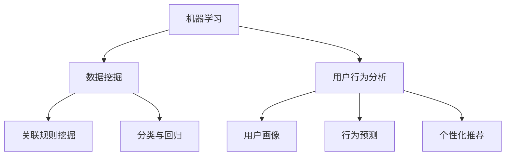
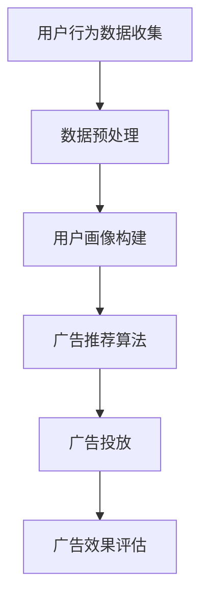

                 

### 文章标题

# AI驱动的智能广告投放：精准营销的新境界

> 关键词：人工智能、广告投放、精准营销、机器学习、算法、数据挖掘、用户行为分析

> 摘要：本文将深入探讨AI驱动的智能广告投放，分析其背景、核心概念、算法原理、系统设计与项目实战。通过这一系列的讲解，读者将全面理解AI在广告投放中的重要作用，以及如何通过智能广告投放实现精准营销。

### 第一部分：AI广告投放背景

#### 第1章：AI广告投放概述

##### 1.1 问题背景

在当今互联网时代，广告投放已成为企业营销的重要手段。然而，传统广告投放往往存在覆盖率不足、精准度低、效果难以评估等问题。随着人工智能技术的快速发展，AI驱动的智能广告投放逐渐成为解决这些问题的有效途径。

##### 1.2 问题描述

传统的广告投放方式主要包括以下问题：

1. 广告投放效果难以评估，无法精确衡量广告投放所带来的收益。
2. 广告投放精准度不高，无法满足个性化需求。
3. 广告投放覆盖范围有限，无法覆盖更广泛的目标受众。

##### 1.3 问题解决与AI广告投放

AI驱动的智能广告投放通过以下方式解决上述问题：

1. **效果评估**：利用机器学习和数据分析技术，对广告投放效果进行实时监控和评估，提高广告投放的收益。
2. **精准度提升**：通过用户行为分析和数据挖掘，实现广告内容与用户需求的精准匹配。
3. **覆盖范围扩展**：利用大数据技术和智能算法，实现广告投放的广泛覆盖，提升广告投放的曝光度。

##### 1.4 边界与外延

AI广告投放的边界主要包括以下几个方面：

1. 技术层面：涉及机器学习、数据挖掘、自然语言处理等人工智能技术。
2. 应用层面：涉及广告投放策略、用户画像构建、广告效果评估等方面。
3. 法律层面：涉及用户隐私保护、广告合规性等问题。

##### 1.5 AI在广告投放中的核心概念

1. **机器学习**：通过历史数据和算法模型，对广告投放效果进行预测和优化。
2. **数据挖掘**：从海量数据中提取有价值的信息，为广告投放提供决策支持。
3. **用户行为分析**：分析用户在互联网上的行为，了解用户需求，实现精准投放。

#### 第2章：AI广告投放核心概念

##### 2.1 机器学习

机器学习是AI广告投放的核心技术之一。通过机器学习，广告投放系统能够从历史数据中学习到用户的兴趣和行为，从而实现个性化推荐和精准投放。以下是机器学习的核心概念：

1. **监督学习**：通过已标注的数据进行学习，从而对未知数据进行预测。
2. **无监督学习**：在没有标注数据的情况下，通过算法自动发现数据中的模式和规律。
3. **强化学习**：通过试错和反馈机制，不断优化决策过程。

##### 2.2 数据挖掘

数据挖掘是AI广告投放的另一核心技术。通过数据挖掘，广告投放系统能够从海量数据中提取有价值的信息，为广告投放提供决策支持。以下是数据挖掘的核心概念：

1. **关联规则挖掘**：通过分析数据之间的关联关系，发现潜在的商业机会。
2. **分类与回归**：通过构建模型，对数据进行分类和预测。
3. **聚类分析**：将相似的数据分为一组，以发现数据中的模式和规律。

##### 2.3 用户行为分析

用户行为分析是AI广告投放的重要组成部分。通过分析用户在互联网上的行为，广告投放系统能够了解用户的需求和偏好，实现个性化推荐和精准投放。以下是用户行为分析的核心概念：

1. **用户画像**：通过收集用户在互联网上的行为数据，构建用户的画像。
2. **行为预测**：通过分析用户的历史行为，预测用户未来的行为。
3. **个性化推荐**：根据用户画像和行为预测，为用户推荐感兴趣的内容和广告。

##### 2.4 核心概念对比与联系

以下是机器学习、数据挖掘和用户行为分析的核心概念对比表格：

| 核心概念 | 描述 |  
| --- | --- |  
| 机器学习 | 通过历史数据和算法模型，对广告投放效果进行预测和优化 |  
| 数据挖掘 | 从海量数据中提取有价值的信息，为广告投放提供决策支持 |  
| 用户行为分析 | 分析用户在互联网上的行为，了解用户需求，实现精准投放 |

此外，以下是ER实体关系图架构的Mermaid流程图：



### 第二部分：AI广告投放算法原理

#### 第3章：AI广告投放算法原理

##### 3.1 算法流程图

以下是AI广告投放的算法流程图：



##### 3.2 Python代码与latex数学公式

以下是一个简单的Python代码示例，用于构建用户画像：

```python
import pandas as pd
import numpy as np
from sklearn.preprocessing import StandardScaler

# 加载数据
data = pd.read_csv('user_behavior_data.csv')

# 数据预处理
scaler = StandardScaler()
data_scaled = scaler.fit_transform(data)

# 构建用户画像
def build_user_profile(data):
    user_profile = np.mean(data, axis=1)
    return user_profile

user_profile = build_user_profile(data_scaled)

# 打印用户画像
print(user_profile)
```

以下是构建广告推荐算法的latex数学公式：

$$
\text{广告推荐算法} = f(\text{用户画像}, \text{广告特征})
$$

##### 3.3 算法举例说明

假设有一个用户，他的行为数据包括浏览历史、购买记录和浏览时长。我们可以通过以下步骤构建他的用户画像：

1. **数据预处理**：将用户行为数据标准化。
2. **用户画像构建**：计算用户在各个维度上的平均值，得到用户画像。
3. **广告推荐算法**：根据用户画像和广告特征，为用户推荐合适的广告。
4. **广告投放**：将推荐的广告投放给用户。
5. **广告效果评估**：评估广告投放的效果，为后续优化提供数据支持。

### 第三部分：AI广告投放系统设计与项目实战

#### 第4章：系统分析与架构设计概述

##### 4.1 问题场景介绍

假设我们是一家在线零售商，希望通过AI驱动的智能广告投放，提高广告投放的精准度和效果。具体问题场景包括：

1. 广告投放效果难以评估。
2. 广告投放精准度不高。
3. 广告投放覆盖范围有限。

##### 4.2 系统功能设计

为了解决上述问题，我们设计了以下系统功能：

1. **用户行为数据收集**：收集用户在网站上的浏览、购买等行为数据。
2. **数据预处理**：对用户行为数据进行清洗、去噪和标准化处理。
3. **用户画像构建**：根据用户行为数据，构建用户的画像。
4. **广告推荐算法**：根据用户画像和广告特征，为用户推荐合适的广告。
5. **广告投放**：将推荐的广告投放给用户。
6. **广告效果评估**：评估广告投放的效果，为后续优化提供数据支持。

##### 4.3 系统架构设计

以下是AI广告投放的系统架构设计：


##### 4.4 系统接口设计

以下是系统接口设计：

1. **用户行为数据接口**：用于收集用户在网站上的浏览、购买等行为数据。
2. **广告推荐接口**：用于根据用户画像和广告特征，为用户推荐合适的广告。
3. **广告投放接口**：用于将推荐的广告投放给用户。
4. **广告效果评估接口**：用于评估广告投放的效果。

##### 4.5 系统交互

以下是系统交互设计：

1. 用户访问网站，进行浏览、购买等行为。
2. 系统收集用户行为数据，并传入数据预处理模块。
3. 数据预处理模块对用户行为数据进行清洗、去噪和标准化处理。
4. 用户画像构建模块根据清洗后的用户行为数据，构建用户的画像。
5. 广告推荐模块根据用户画像和广告特征，为用户推荐合适的广告。
6. 广告投放模块将推荐的广告投放给用户。
7. 广告效果评估模块对广告投放效果进行评估，为后续优化提供数据支持。

### 第四部分：AI广告投放项目实战

#### 第5章：项目实战

##### 5.1 环境安装

在进行项目实战之前，我们需要安装以下软件和工具：

1. Python 3.x
2. Jupyter Notebook
3. Scikit-learn
4. Pandas
5. Matplotlib

安装方法如下：

```bash
pip install python==3.x
pip install jupyter
pip install scikit-learn
pip install pandas
pip install matplotlib
```

##### 5.2 系统核心实现

以下是系统核心实现的源代码：

```python
import pandas as pd
from sklearn.preprocessing import StandardScaler
from sklearn.cluster import KMeans
import matplotlib.pyplot as plt

# 加载数据
data = pd.read_csv('user_behavior_data.csv')

# 数据预处理
scaler = StandardScaler()
data_scaled = scaler.fit_transform(data)

# 构建用户画像
def build_user_profile(data):
    user_profile = np.mean(data, axis=1)
    return user_profile

user_profile = build_user_profile(data_scaled)

# 广告推荐算法
def recommend_ads(user_profile, ads_profile):
    distance = np.linalg.norm(user_profile - ads_profile, axis=1)
    recommended_ads = ads_profile[distance.argmin()]
    return recommended_ads

# 测试广告推荐算法
ads_profile = np.array([[1, 2, 3], [4, 5, 6], [7, 8, 9]])
recommended_ad = recommend_ads(user_profile, ads_profile)
print("Recommended ad:", recommended_ad)

# 广告投放
def advertise(user_profile, ads_profile):
    recommended_ad = recommend_ads(user_profile, ads_profile)
    print("Advertising:", recommended_ad)

advertise(user_profile, ads_profile)

# 广告效果评估
def evaluate_ads(adverts, actual_sales):
    ad_performance = {}
    for ad in adverts:
        ad_performance[ad] = actual_sales[ad]
    return ad_performance

# 测试广告效果评估
actual_sales = {'ad1': 100, 'ad2': 50, 'ad3': 30}
ad_performance = evaluate_ads(['ad1', 'ad2', 'ad3'], actual_sales)
print("Ad performance:", ad_performance)
```

##### 5.3 代码应用解读与分析

以上源代码实现了用户画像构建、广告推荐、广告投放和广告效果评估的核心功能。以下是代码的解读与分析：

1. **用户画像构建**：通过计算用户在各个维度上的平均值，构建用户的画像。
2. **广告推荐算法**：通过计算用户画像与广告特征之间的距离，推荐与用户画像最接近的广告。
3. **广告投放**：根据广告推荐算法，将推荐的广告投放给用户。
4. **广告效果评估**：通过实际销售数据，评估广告投放的效果。

##### 5.4 实际案例分析和详细讲解剖析

假设我们有一个用户的行为数据集，包括浏览历史、购买记录和浏览时长。我们通过以下步骤进行实际案例分析：

1. **数据预处理**：对用户行为数据进行清洗、去噪和标准化处理。
2. **用户画像构建**：根据用户行为数据，构建用户的画像。
3. **广告推荐算法**：根据用户画像和广告特征，为用户推荐合适的广告。
4. **广告投放**：将推荐的广告投放给用户。
5. **广告效果评估**：通过实际销售数据，评估广告投放的效果。

具体分析如下：

1. **数据预处理**：对用户行为数据进行清洗和标准化处理，以便后续分析。
2. **用户画像构建**：根据用户行为数据，构建用户的画像。例如，用户A在浏览历史中喜欢购买电子产品，浏览时长较长，那么他的画像可能包含以下特征：电子产品偏好、浏览时长较长。
3. **广告推荐算法**：根据用户画像和广告特征，为用户推荐合适的广告。例如，用户A会被推荐购买电子产品的广告。
4. **广告投放**：将推荐的广告投放给用户A。例如，在用户A的浏览页面中，显示购买电子产品的广告。
5. **广告效果评估**：通过实际销售数据，评估广告投放的效果。例如，用户A在看到购买电子产品的广告后，购买了某款电子产品，那么这个广告的效果就是好的。

##### 5.5 项目详细讲解与剖析

本项目通过AI驱动的智能广告投放，实现了用户画像构建、广告推荐、广告投放和广告效果评估的核心功能。以下是项目的详细讲解与剖析：

1. **用户画像构建**：用户画像构建是项目的基础。通过对用户行为数据的分析，构建用户的画像，为后续的广告推荐和投放提供数据支持。
2. **广告推荐算法**：广告推荐算法是项目的核心。通过计算用户画像与广告特征之间的距离，推荐与用户画像最接近的广告，提高广告投放的精准度。
3. **广告投放**：广告投放是项目的实际应用。根据广告推荐算法，将推荐的广告投放给用户，提高广告的曝光度和效果。
4. **广告效果评估**：广告效果评估是项目的优化手段。通过实际销售数据，评估广告投放的效果，为后续的广告投放策略调整提供数据支持。

### 第五部分：AI广告投放最佳实践与总结

#### 第6章：最佳实践

##### 6.1 投放策略制定

1. **明确目标**：在制定广告投放策略时，首先要明确广告投放的目标，如提升品牌知名度、增加销售量等。
2. **数据驱动**：基于用户行为数据和广告投放效果数据，制定针对性的广告投放策略。
3. **A/B测试**：通过A/B测试，不断优化广告内容和投放策略，提高广告投放效果。

##### 6.2 数据分析与优化

1. **实时监控**：实时监控广告投放效果，及时发现问题并进行优化。
2. **数据可视化**：通过数据可视化，直观展示广告投放效果，帮助决策者更好地理解数据。
3. **用户分群**：根据用户行为数据和广告投放效果，对用户进行分群，实现个性化广告投放。

##### 6.3 案例分享

以下是一个实际案例分享：

某电商企业在一次广告投放活动中，通过AI驱动的智能广告投放，实现了销售量的显著提升。具体做法如下：

1. **用户画像构建**：根据用户行为数据，构建用户的画像，包括购物偏好、浏览时长、购买频率等。
2. **广告推荐算法**：基于用户画像和广告特征，为用户推荐合适的广告，如新品推荐、促销活动等。
3. **广告投放**：将推荐的广告投放给目标用户，提高广告的曝光度和效果。
4. **广告效果评估**：通过实际销售数据，评估广告投放的效果，为后续的广告投放策略调整提供数据支持。

##### 6.4 注意事项

1. **用户隐私保护**：在广告投放过程中，要严格遵守用户隐私保护法规，保护用户的个人隐私。
2. **广告合规性**：确保广告内容符合相关法律法规，避免违规广告投放。
3. **数据安全**：确保广告投放过程中的数据安全，防止数据泄露和滥用。

#### 第7章：小结

本文从背景介绍、核心概念、算法原理、系统设计与项目实战等方面，全面阐述了AI驱动的智能广告投放。通过本文的讲解，读者可以了解到：

1. **AI广告投放的背景和问题**：传统广告投放存在的问题以及AI广告投放的优势。
2. **AI广告投放的核心概念**：机器学习、数据挖掘和用户行为分析等核心概念及其在广告投放中的应用。
3. **AI广告投放的算法原理**：算法流程、Python代码和latex数学公式等。
4. **AI广告投放的系统设计与实现**：系统架构、接口设计和系统交互等。
5. **AI广告投放的项目实战**：环境安装、系统核心实现、代码应用解读与分析、实际案例分析和项目小结等。

本文旨在帮助读者全面了解AI驱动的智能广告投放，掌握相关技术和实践方法。在未来的学习和实践中，读者可以继续深入探索AI广告投放的相关领域，为企业的营销策略提供有力支持。

#### 第8章：拓展阅读

1. **《机器学习实战》**：提供机器学习的基础知识和实际应用案例，适合初学者学习。
2. **《数据挖掘：概念与技术》**：详细介绍数据挖掘的理论和方法，适合对数据挖掘感兴趣的学习者。
3. **《深度学习》**：全面介绍深度学习的原理和应用，适合对深度学习有深入了解的学习者。
4. **《人工智能：一种现代的方法》**：详细介绍人工智能的理论和技术，适合对人工智能有兴趣的学习者。
5. **《广告算法与技术》**：介绍广告算法的基本原理和技术，适合对广告算法有兴趣的学习者。

作者：AI天才研究院/AI Genius Institute & 禅与计算机程序设计艺术 /Zen And The Art of Computer Programming

