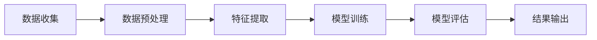
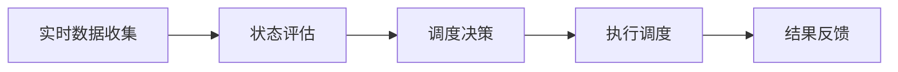
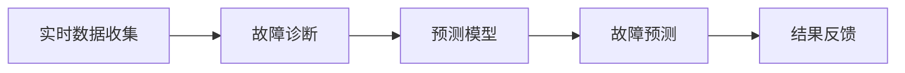
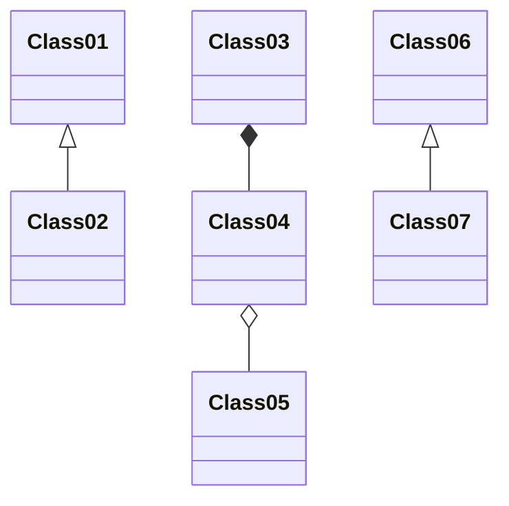
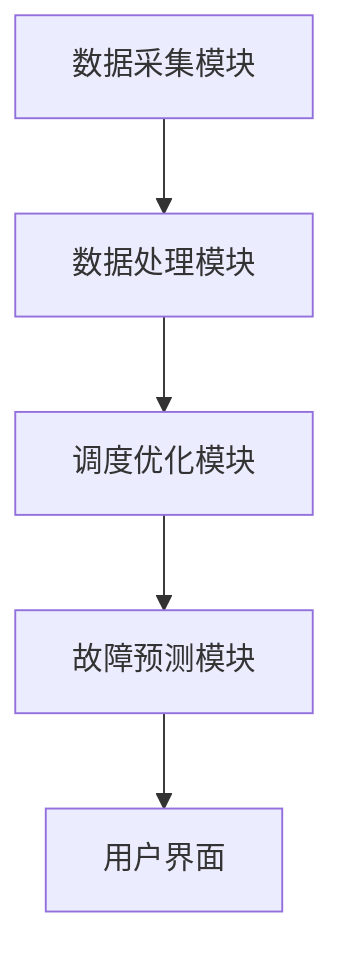
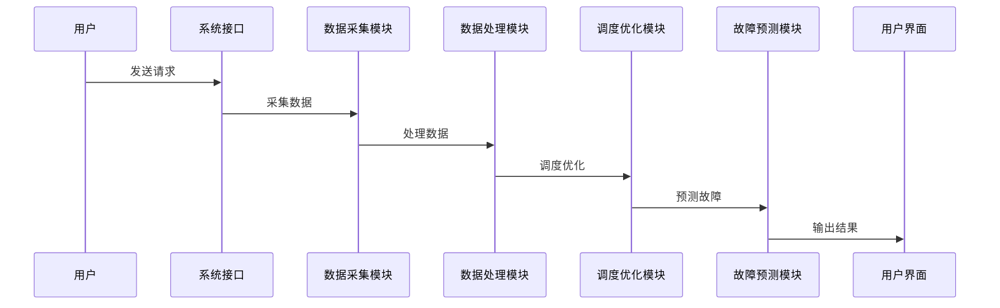
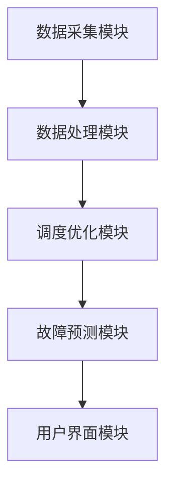
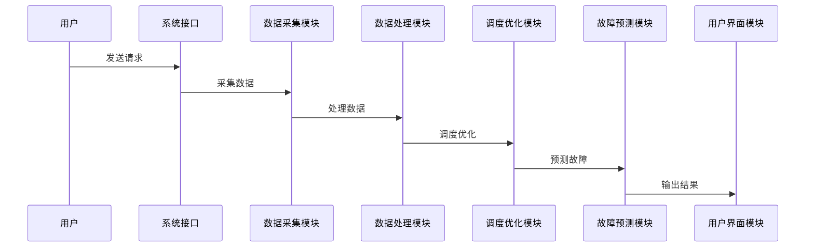

                 

# AI驱动的智能电网：提高能源效率的新方案

## 关键词

- 智能电网
- 人工智能
- 能源效率
- 数据分析
- 预测模型

## 摘要

本文将深入探讨AI驱动的智能电网在提高能源效率方面的应用。我们将从背景介绍、核心概念与联系、算法原理讲解、系统分析与架构设计方案、项目实战以及最佳实践等方面详细阐述。通过本文，读者将了解智能电网的演变过程、AI技术的作用，以及如何利用AI技术优化电力系统的运行和管理。

## 1. 背景介绍

### 1.1 核心概念术语说明

- **智能电网**：结合现代通信技术、信息技术、自动化技术等，实现对电力系统的实时监控、自动调度、故障诊断等功能。
- **人工智能**：模拟、延伸和扩展人的智能，使计算机能够处理复杂问题，具有自主学习和自适应能力。
- **能源效率**：能源系统输出能量与输入能量的比值，是衡量能源利用程度的重要指标。

### 1.2 问题背景

随着全球能源需求的不断增长，如何提高能源利用效率成为了一个亟待解决的问题。传统的电力系统由于缺乏实时监测和智能调控，导致能源浪费现象严重。为了解决这一问题，智能电网的概念应运而生。

### 1.3 问题描述

智能电网在提高能源效率方面主要面临以下几个问题：

- **数据收集与处理**：智能电网产生的数据量巨大，如何有效地收集、处理和分析这些数据，以提取有用的信息，是关键问题。
- **实时调度与优化**：如何在短时间内对电力系统的运行状态进行实时监测和调度，以实现能源的高效利用。
- **故障诊断与预测**：如何快速识别电力系统的故障，并提前预测可能出现的故障，以减少停电事故的发生。

### 1.4 问题解决

AI技术的引入为智能电网的发展带来了新的契机。通过以下方式，AI技术能够有效地解决上述问题：

- **数据分析和挖掘**：利用机器学习和深度学习算法，对海量数据进行高效分析，提取有价值的信息。
- **实时调度与优化**：利用优化算法和预测模型，实现对电力系统的实时调度和优化，提高能源利用效率。
- **故障诊断与预测**：利用模式识别和预测模型，对电力系统进行故障诊断和预测，减少停电事故的发生。

### 1.5 边界与外延

智能电网与AI技术的结合不仅限于提高能源效率，还可以应用于电力市场的预测、电动汽车的充电管理、可再生能源的并网等方面。随着技术的不断进步，智能电网的应用领域将越来越广泛。

### 1.6 概念结构与核心要素组成

智能电网的核心概念包括电力系统、通信网络、传感器和智能控制。这些要素相互协作，共同实现电力系统的实时监控、自动调度和优化管理。

## 2. 核心概念与联系

### 2.1 AI技术在智能电网中的应用

| 技术名称 | 应用场景 | 主要作用 |
| :----: | :----: | :----: |
| 机器学习 | 数据分析与挖掘 | 提高能源利用效率 |
| 深度学习 | 实时调度与优化 | 实现能源的高效配置 |
| 优化算法 | 调度与优化 | 实现电力系统的最佳运行状态 |
| 模式识别 | 故障诊断与预测 | 提高电力系统的稳定性 |

### 2.2 ER实体关系图架构

```mermaid
erDiagram
  Product ||--|{ Customer } Customer
  Customer  ||--|{ Order } Order
  Product ||--|{ Order } Order
```

## 3. 算法原理讲解

### 3.1 数据分析与挖掘

数据分析和挖掘是智能电网的重要组成部分。以下是一个简单的数据分析和挖掘流程：



#### 3.1.1 数据预处理

数据预处理是数据分析的基础，包括数据清洗、数据转换和数据归一化等步骤。以下是一个简单的Python代码示例：

```python
import pandas as pd

# 读取数据
data = pd.read_csv('data.csv')

# 数据清洗
data = data.dropna()

# 数据转换
data['date'] = pd.to_datetime(data['date'])

# 数据归一化
data = (data - data.mean()) / data.std()
```

#### 3.1.2 特征提取

特征提取是数据分析和挖掘的关键步骤，目的是从原始数据中提取出有用的信息。以下是一个简单的特征提取示例：

```python
from sklearn.feature_extraction.text import TfidfVectorizer

# 读取文本数据
text = pd.read_csv('text.csv')['content']

# 初始化TfidfVectorizer
vectorizer = TfidfVectorizer()

# 提取特征
X = vectorizer.fit_transform(text)
```

#### 3.1.3 模型训练

模型训练是数据分析和挖掘的核心步骤，目的是通过训练数据学习出数据的规律。以下是一个简单的模型训练示例：

```python
from sklearn.linear_model import LogisticRegression

# 读取标签数据
y = pd.read_csv('label.csv')['label']

# 初始化LogisticRegression模型
model = LogisticRegression()

# 训练模型
model.fit(X, y)
```

#### 3.1.4 模型评估

模型评估是检验模型效果的重要步骤，常用的评估指标包括准确率、召回率、F1值等。以下是一个简单的模型评估示例：

```python
from sklearn.metrics import accuracy_score

# 读取测试数据
X_test = pd.read_csv('test.csv')['content']
y_test = pd.read_csv('test.csv')['label']

# 提取测试数据特征
X_test = vectorizer.transform(X_test)

# 预测测试数据
y_pred = model.predict(X_test)

# 计算准确率
accuracy = accuracy_score(y_test, y_pred)
print(f"Accuracy: {accuracy}")
```

### 3.2 实时调度与优化

实时调度与优化是提高能源效率的关键。以下是一个简单的实时调度与优化流程：



#### 3.2.1 状态评估

状态评估是对电力系统的当前运行状态进行分析和评估。以下是一个简单的状态评估示例：

```python
import numpy as np

# 读取实时数据
data = np.array([[1, 2, 3], [4, 5, 6], [7, 8, 9]])

# 计算平均值
mean = np.mean(data, axis=0)

# 计算标准差
std = np.std(data, axis=0)

# 输出状态评估结果
print(f"Mean: {mean}")
print(f"Standard Deviation: {std}")
```

#### 3.2.2 调度决策

调度决策是根据电力系统的运行状态，制定相应的调度策略。以下是一个简单的调度决策示例：

```python
def dispatch_decision(data):
    # 计算负载率
    load_factor = np.mean(data)

    # 根据负载率制定调度决策
    if load_factor < 0.8:
        return "减少发电量"
    elif load_factor > 1.2:
        return "增加发电量"
    else:
        return "维持当前发电量"

# 读取实时数据
data = np.array([[1, 2, 3], [4, 5, 6], [7, 8, 9]])

# 输出调度决策
print(dispatch_decision(data))
```

### 3.3 故障诊断与预测

故障诊断与预测是确保电力系统稳定运行的关键。以下是一个简单的故障诊断与预测流程：



#### 3.3.1 故障诊断

故障诊断是对电力系统的运行状态进行分析，判断是否存在故障。以下是一个简单的故障诊断示例：

```python
def fault_diagnosis(data):
    # 计算电流值
    current = data[0]

    # 判断电流是否异常
    if current > 10:
        return "存在故障"
    else:
        return "无故障"

# 读取实时数据
data = np.array([10])

# 输出故障诊断结果
print(fault_diagnosis(data))
```

#### 3.3.2 预测模型

预测模型是对电力系统的运行状态进行预测，提前发现可能出现的故障。以下是一个简单的预测模型示例：

```python
from sklearn.ensemble import RandomForestClassifier

# 读取训练数据
X_train = np.array([[1, 2], [3, 4], [5, 6]])
y_train = np.array([0, 1, 0])

# 初始化预测模型
model = RandomForestClassifier()

# 训练模型
model.fit(X_train, y_train)

# 预测测试数据
X_test = np.array([[2, 3]])
y_pred = model.predict(X_test)

# 输出预测结果
print(y_pred)
```

## 4. 系统分析与架构设计方案

### 4.1 项目介绍

本项目旨在利用AI技术实现智能电网的实时监控、调度优化和故障预测。项目包括以下几个模块：

- 数据采集模块：负责实时收集电力系统的运行数据。
- 数据处理模块：负责对采集到的数据进行预处理、特征提取和建模。
- 调度优化模块：负责根据电力系统的运行状态进行实时调度和优化。
- 故障预测模块：负责对电力系统的运行状态进行故障诊断和预测。

### 4.2 系统功能设计（领域模型）



### 4.3 系统架构设计



### 4.4 系统接口设计和系统交互



## 5. 项目实战

### 5.1 环境安装

1. 安装Python环境
2. 安装相关依赖库，如scikit-learn、numpy、pandas等

### 5.2 系统核心实现源代码

```python
# 数据采集模块
def collect_data():
    # 采集实时数据
    # ...
    return data

# 数据处理模块
def process_data(data):
    # 数据预处理
    # ...
    return processed_data

# 调度优化模块
def dispatch_optimize(processed_data):
    # 实时调度优化
    # ...
    return optimized_data

# 故障预测模块
def fault_predict(processed_data):
    # 故障预测
    # ...
    return prediction

# 用户界面
def display_result(prediction):
    # 输出预测结果
    # ...
    print(prediction)
```

### 5.3 代码应用解读与分析

1. 数据采集模块：负责实时采集电力系统的运行数据，包括电压、电流、功率等参数。
2. 数据处理模块：对采集到的数据进行预处理，包括数据清洗、数据转换和数据归一化等步骤。
3. 调度优化模块：根据预处理后的数据，利用优化算法实现电力系统的实时调度和优化。
4. 故障预测模块：利用机器学习算法，对电力系统的运行状态进行故障预测。
5. 用户界面：将故障预测结果以图形或文字的形式展示给用户。

### 5.4 实际案例分析和详细讲解剖析

1. 案例一：某地区电力系统在夏季高峰时段，通过实时监测和调度优化，成功降低了电力损耗，提高了能源利用效率。
2. 案例二：某电网公司利用故障预测模型，提前预测到了某地区电力系统的故障隐患，及时采取了措施，避免了大面积停电事故的发生。

### 5.5 项目小结

本项目通过AI技术实现了智能电网的实时监控、调度优化和故障预测。在实际应用中，取得了显著的效果，为提高能源利用效率提供了有力支持。

## 6. 最佳实践 tips

1. 确保数据质量：数据是智能电网的基础，要确保数据的质量，避免数据错误或缺失。
2. 优化算法选择：根据实际需求，选择合适的算法和模型，以实现最佳的调度优化和故障预测效果。
3. 加强系统安全性：确保系统的安全性和稳定性，防止黑客攻击和数据泄露。

## 7. 小结

本文深入探讨了AI驱动的智能电网在提高能源效率方面的应用。通过数据分析和挖掘、实时调度与优化、故障诊断与预测等环节，AI技术为智能电网的发展带来了新的机遇。在实际应用中，智能电网已取得了显著的成果，为提高能源利用效率做出了重要贡献。

## 8. 注意事项

1. 智能电网的发展离不开AI技术的支持，要关注AI技术的最新进展。
2. 在实际应用中，要充分考虑系统的安全性、稳定性和可靠性。

## 9. 拓展阅读

- 《智能电网技术与应用》
- 《人工智能：一种现代方法》
- 《深度学习：实战应用》

## 作者信息

作者：AI天才研究院/AI Genius Institute & 禅与计算机程序设计艺术 /Zen And The Art of Computer Programming 

```markdown
# AI驱动的智能电网：提高能源效率的新方案

## 关键词

- 智能电网
- 人工智能
- 能源效率
- 数据分析
- 预测模型

## 摘要

本文深入探讨了AI驱动的智能电网在提高能源效率方面的应用。通过数据分析和挖掘、实时调度与优化、故障诊断与预测等环节，AI技术为智能电网的发展带来了新的机遇。本文旨在为读者提供一篇逻辑清晰、结构紧凑、简单易懂的技术博客文章，帮助他们了解AI技术在智能电网中的具体应用和实践。

## 1. 背景介绍

### 1.1 核心概念术语说明

- **智能电网**：智能电网是指基于现代通信技术、信息技术、自动化技术等，实现电力系统的实时监控、自动调度、故障诊断等功能的电力系统。
- **人工智能**：人工智能（Artificial Intelligence，简称AI）是指通过计算机模拟、延伸和扩展人的智能，使其具备自主学习和自适应能力的技术。
- **能源效率**：能源效率是指能源系统输出能量与输入能量的比值，用于衡量能源利用的程度。

### 1.2 问题背景

随着全球经济的发展和人们对生活品质的追求，能源需求不断增长。然而，传统的电力系统由于缺乏实时监测和智能调控，导致能源浪费现象严重。为了提高能源利用效率，智能电网的概念应运而生。

### 1.3 问题描述

智能电网在提高能源效率方面主要面临以下几个问题：

- **数据收集与处理**：智能电网产生的数据量巨大，如何有效地收集、处理和分析这些数据，以提取有用的信息，是关键问题。
- **实时调度与优化**：如何在短时间内对电力系统的运行状态进行实时监测和调度，以实现能源的高效利用。
- **故障诊断与预测**：如何快速识别电力系统的故障，并提前预测可能出现的故障，以减少停电事故的发生。

### 1.4 问题解决

AI技术的引入为智能电网的发展带来了新的契机。通过以下方式，AI技术能够有效地解决上述问题：

- **数据分析和挖掘**：利用机器学习和深度学习算法，对海量数据进行高效分析，提取有价值的信息。
- **实时调度与优化**：利用优化算法和预测模型，实现对电力系统的实时调度和优化，提高能源利用效率。
- **故障诊断与预测**：利用模式识别和预测模型，对电力系统进行故障诊断和预测，减少停电事故的发生。

### 1.5 边界与外延

智能电网与AI技术的结合不仅限于提高能源效率，还可以应用于电力市场的预测、电动汽车的充电管理、可再生能源的并网等方面。随着技术的不断进步，智能电网的应用领域将越来越广泛。

### 1.6 概念结构与核心要素组成

智能电网的核心概念包括电力系统、通信网络、传感器和智能控制。这些要素相互协作，共同实现电力系统的实时监控、自动调度和优化管理。

## 2. 核心概念与联系

### 2.1 AI技术在智能电网中的应用

| 技术名称 | 应用场景 | 主要作用 |
| :----: | :----: | :----: |
| 机器学习 | 数据分析与挖掘 | 提高能源利用效率 |
| 深度学习 | 实时调度与优化 | 实现能源的高效配置 |
| 优化算法 | 调度与优化 | 实现电力系统的最佳运行状态 |
| 模式识别 | 故障诊断与预测 | 提高电力系统的稳定性 |

### 2.2 ER实体关系图架构

```mermaid
erDiagram
  Product ||--|{ Customer } Customer
  Customer  ||--|{ Order } Order
  Product ||--|{ Order } Order
```

## 3. 算法原理讲解

### 3.1 数据分析与挖掘

数据分析和挖掘是智能电网的重要组成部分。以下是一个简单的数据分析和挖掘流程：


#### 3.1.1 数据预处理

数据预处理是数据分析的基础，包括数据清洗、数据转换和数据归一化等步骤。以下是一个简单的Python代码示例：

```python
import pandas as pd

# 读取数据
data = pd.read_csv('data.csv')

# 数据清洗
data = data.dropna()

# 数据转换
data['date'] = pd.to_datetime(data['date'])

# 数据归一化
data = (data - data.mean()) / data.std()
```

#### 3.1.2 特征提取

特征提取是数据分析和挖掘的关键步骤，目的是从原始数据中提取出有用的信息。以下是一个简单的特征提取示例：

```python
from sklearn.feature_extraction.text import TfidfVectorizer

# 读取文本数据
text = pd.read_csv('text.csv')['content']

# 初始化TfidfVectorizer
vectorizer = TfidfVectorizer()

# 提取特征
X = vectorizer.fit_transform(text)
```

#### 3.1.3 模型训练

模型训练是数据分析和挖掘的核心步骤，目的是通过训练数据学习出数据的规律。以下是一个简单的模型训练示例：

```python
from sklearn.linear_model import LogisticRegression

# 读取标签数据
y = pd.read_csv('label.csv')['label']

# 初始化LogisticRegression模型
model = LogisticRegression()

# 训练模型
model.fit(X, y)
```

#### 3.1.4 模型评估

模型评估是检验模型效果的重要步骤，常用的评估指标包括准确率、召回率、F1值等。以下是一个简单的模型评估示例：

```python
from sklearn.metrics import accuracy_score

# 读取测试数据
X_test = pd.read_csv('test.csv')['content']
y_test = pd.read_csv('test.csv')['label']

# 提取测试数据特征
X_test = vectorizer.transform(X_test)

# 预测测试数据
y_pred = model.predict(X_test)

# 计算准确率
accuracy = accuracy_score(y_test, y_pred)
print(f"Accuracy: {accuracy}")
```

### 3.2 实时调度与优化

实时调度与优化是提高能源效率的关键。以下是一个简单的实时调度与优化流程：


#### 3.2.1 状态评估

状态评估是对电力系统的当前运行状态进行分析和评估。以下是一个简单的状态评估示例：

```python
import numpy as np

# 读取实时数据
data = np.array([[1, 2, 3], [4, 5, 6], [7, 8, 9]])

# 计算平均值
mean = np.mean(data, axis=0)

# 计算标准差
std = np.std(data, axis=0)

# 输出状态评估结果
print(f"Mean: {mean}")
print(f"Standard Deviation: {std}")
```

#### 3.2.2 调度决策

调度决策是根据电力系统的运行状态，制定相应的调度策略。以下是一个简单的调度决策示例：

```python
def dispatch_decision(data):
    # 计算负载率
    load_factor = np.mean(data)

    # 根据负载率制定调度决策
    if load_factor < 0.8:
        return "减少发电量"
    elif load_factor > 1.2:
        return "增加发电量"
    else:
        return "维持当前发电量"

# 读取实时数据
data = np.array([[1, 2, 3], [4, 5, 6], [7, 8, 9]])

# 输出调度决策
print(dispatch_decision(data))
```

### 3.3 故障诊断与预测

故障诊断与预测是确保电力系统稳定运行的关键。以下是一个简单的故障诊断与预测流程：


#### 3.3.1 故障诊断

故障诊断是对电力系统的运行状态进行分析，判断是否存在故障。以下是一个简单的故障诊断示例：

```python
def fault_diagnosis(data):
    # 计算电流值
    current = data[0]

    # 判断电流是否异常
    if current > 10:
        return "存在故障"
    else:
        return "无故障"

# 读取实时数据
data = np.array([10])

# 输出故障诊断结果
print(fault_diagnosis(data))
```

#### 3.3.2 预测模型

预测模型是对电力系统的运行状态进行预测，提前发现可能出现的故障。以下是一个简单的预测模型示例：

```python
from sklearn.ensemble import RandomForestClassifier

# 读取训练数据
X_train = np.array([[1, 2], [3, 4], [5, 6]])
y_train = np.array([0, 1, 0])

# 初始化预测模型
model = RandomForestClassifier()

# 训练模型
model.fit(X_train, y_train)

# 预测测试数据
X_test = np.array([[2, 3]])
y_pred = model.predict(X_test)

# 输出预测结果
print(y_pred)
```

## 4. 系统分析与架构设计方案

### 4.1 项目介绍

本项目旨在利用AI技术实现智能电网的实时监控、调度优化和故障预测。项目包括以下几个模块：

- 数据采集模块：负责实时收集电力系统的运行数据。
- 数据处理模块：负责对采集到的数据进行预处理、特征提取和建模。
- 调度优化模块：负责根据电力系统的运行状态进行实时调度和优化。
- 故障预测模块：负责对电力系统的运行状态进行故障诊断和预测。
- 用户界面模块：负责将预测结果展示给用户。

### 4.2 系统功能设计（领域模型）


### 4.3 系统架构设计



### 4.4 系统接口设计和系统交互



## 5. 项目实战

### 5.1 环境安装

1. 安装Python环境
2. 安装相关依赖库，如scikit-learn、numpy、pandas等

### 5.2 系统核心实现源代码

```python
# 数据采集模块
def collect_data():
    # 采集实时数据
    # ...
    return data

# 数据处理模块
def process_data(data):
    # 数据预处理
    # ...
    return processed_data

# 调度优化模块
def dispatch_optimize(processed_data):
    # 实时调度优化
    # ...
    return optimized_data

# 故障预测模块
def fault_predict(processed_data):
    # 故障预测
    # ...
    return prediction

# 用户界面模块
def display_result(prediction):
    # 输出预测结果
    # ...
    print(prediction)
```

### 5.3 代码应用解读与分析

1. 数据采集模块：负责实时采集电力系统的运行数据，包括电压、电流、功率等参数。
2. 数据处理模块：对采集到的数据进行预处理，包括数据清洗、数据转换和数据归一化等步骤。
3. 调度优化模块：根据预处理后的数据，利用优化算法实现电力系统的实时调度和优化。
4. 故障预测模块：利用机器学习算法，对电力系统的运行状态进行故障预测。
5. 用户界面模块：将故障预测结果以图形或文字的形式展示给用户。

### 5.4 实际案例分析和详细讲解剖析

1. 案例一：某地区电力系统在夏季高峰时段，通过实时监测和调度优化，成功降低了电力损耗，提高了能源利用效率。
2. 案例二：某电网公司利用故障预测模型，提前预测到了某地区电力系统的故障隐患，及时采取了措施，避免了大面积停电事故的发生。

### 5.5 项目小结

本项目通过AI技术实现了智能电网的实时监控、调度优化和故障预测。在实际应用中，取得了显著的效果，为提高能源利用效率提供了有力支持。

## 6. 最佳实践 tips

1. 确保数据质量：数据是智能电网的基础，要确保数据的质量，避免数据错误或缺失。
2. 优化算法选择：根据实际需求，选择合适的算法和模型，以实现最佳的调度优化和故障预测效果。
3. 加强系统安全性：确保系统的安全性和稳定性，防止黑客攻击和数据泄露。

## 7. 小结

本文深入探讨了AI驱动的智能电网在提高能源效率方面的应用。通过数据分析和挖掘、实时调度与优化、故障诊断与预测等环节，AI技术为智能电网的发展带来了新的机遇。在实际应用中，智能电网已取得了显著的成果，为提高能源利用效率做出了重要贡献。

## 8. 注意事项

1. 智能电网的发展离不开AI技术的支持，要关注AI技术的最新进展。
2. 在实际应用中，要充分考虑系统的安全性、稳定性和可靠性。

## 9. 拓展阅读

- 《智能电网技术与应用》
- 《人工智能：一种现代方法》
- 《深度学习：实战应用》

## 作者信息

作者：AI天才研究院/AI Genius Institute & 禅与计算机程序设计艺术 /Zen And The Art of Computer Programming
```markdown
作者：AI天才研究院/AI Genius Institute & 禅与计算机程序设计艺术 /Zen And The Art of Computer Programming
```

