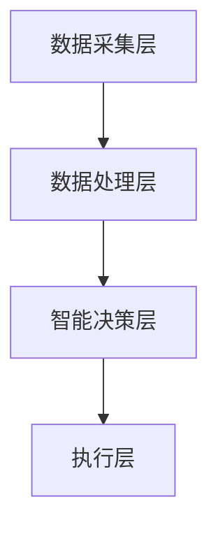
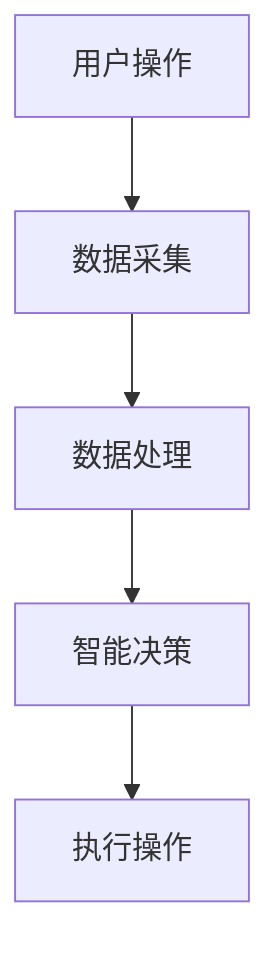
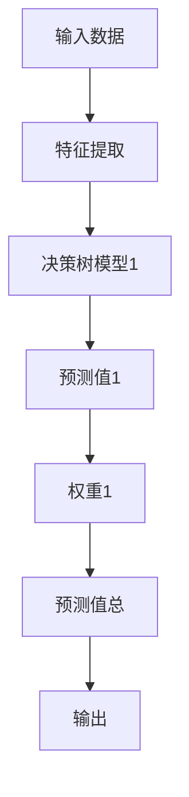

                 

# AI驱动的智能能源管理系统效果评测

## 关键词

AI技术，智能能源管理系统，效果评测，效率优化，成本效益分析

### 摘要

随着全球能源需求的不断增长和环境污染问题的日益严重，传统的能源管理系统面临巨大挑战。为了提高能源利用效率、降低能源消耗和减少环境污染，AI技术的引入成为了一种必然的趋势。本文旨在探讨AI驱动的智能能源管理系统，通过对相关技术的分析、系统设计以及算法实现的详细探讨，评测该系统的实际效果，并提出相关改进建议。

## 目录大纲

### 第1章 引言与背景

- 1.1 问题的提出
  - 问题背景
  - 问题描述
  - 问题解决
  - 边界与外延
- 1.2 AI与智能能源管理系统
  - 核心概念
  - 概念属性特征对比表
  - 智能能源管理系统的构成
  - AI驱动的智能能源管理系统的重要性
- 1.3 智能能源管理系统设计
  - 系统需求分析
  - 系统架构设计
  - 系统接口设计
  - 系统交互设计

### 第2章 相关技术

- 2.1 数据采集与处理
  - 数据采集
  - 数据处理
- 2.2 机器学习算法
  - 常用算法
  - 算法原理与流程
- 2.3 深度学习算法
  - 常用算法
  - 算法原理与模型架构
- 2.4 数据挖掘技术
  - 常用技术
  - 应用场景

### 第3章 智能能源管理系统设计

- 3.1 系统需求分析
  - 功能需求
  - 性能需求
- 3.2 系统架构设计
  - 架构设计
- 3.3 系统接口设计
  - 接口定义
- 3.4 系统交互设计
  - 交互流程

### 第4章 算法实现与数学模型

- 4.1 算法实现
  - Python代码实现
- 4.2 数学模型与公式
  - 数学模型
  - 公式详细讲解

### 第5章 系统分析与架构设计方案

- 5.1 项目实战
  - 环境安装
  - 系统核心实现源代码
  - 代码应用解读与分析
  - 实际案例分析和详细讲解剖析
  - 项目小结
- 5.2 最佳实践 tips
- 5.3 小结
- 5.4 注意事项
- 5.5 拓展阅读

## 第1章 引言与背景

### 1.1 问题的提出

#### 问题背景

随着全球经济的发展，能源需求持续增长，尤其是化石燃料的需求量大增。然而，传统能源系统的开发和利用带来了严重的环境污染问题。例如，燃煤发电厂排放的二氧化碳是导致全球气候变暖的主要原因之一，而石油和天然气的泄漏事件则对环境和人类健康造成了直接的危害。此外，能源供需的不平衡也导致了许多国家和地区出现了能源短缺问题。

#### 问题描述

传统能源管理系统在效率、灵活性和智能化方面存在明显不足。传统系统往往依赖于人工监控和手动操作，缺乏对能源消耗的精确预测和管理能力，导致能源浪费和成本增加。同时，传统系统在面对突发情况时，响应速度慢，难以实现实时调控。

#### 问题解决

通过引入AI技术，可以大大提高能源管理系统的智能化水平。AI技术能够通过对大量历史数据和实时数据的分析和学习，实现能源消耗的精准预测和智能调控，从而提高能源利用效率，降低能源消耗，减少环境污染。

#### 边界与外延

本文的讨论范围涵盖AI驱动的智能能源管理系统的设计、实现、评测及应用。具体包括：系统的需求分析、架构设计、接口设计、交互设计，以及相关技术的应用和实践。

### 1.2 AI与智能能源管理系统

#### 核心概念

AI（人工智能）技术，包括机器学习、深度学习、数据挖掘等。这些技术可以通过对大量数据的分析和学习，实现智能决策和自动化操作。

#### 概念属性特征对比表

| 特征         | 机器学习 | 深度学习 | 数据挖掘 |
| ------------ | -------- | -------- | -------- |
| 目标         | 分类、回归 | 自动特征提取 | 发现数据模式 |
| 特点         | 显式模型   | 隐式模型   | 基于规则   |
| 应用         | 数据分析、预测 | 图像识别、语音识别 | 市场研究、风险分析 |

#### 智能能源管理系统的构成

智能能源管理系统通常由以下几个核心要素组成：

- **传感器网络**：用于采集各种能源消耗的数据。
- **数据采集与处理**：对采集到的数据进行清洗、整合和存储。
- **智能决策支持系统**：基于机器学习和深度学习算法，对数据进行分析和预测，生成智能决策。
- **执行机构**：根据智能决策支持系统的决策，自动调整能源消耗。

#### AI驱动的智能能源管理系统的重要性

##### 优势

- **提高能源利用效率**：通过智能预测和调控，减少不必要的能源浪费。
- **降低能源消耗**：优化能源使用方式，降低能源成本。
- **减少环境污染**：通过减少化石燃料的使用，降低二氧化碳等有害气体的排放。

##### 挑战

- **数据质量**：高质量的数据是AI算法的基础，数据质量问题会直接影响系统的效果。
- **系统稳定性**：智能能源管理系统需要长时间稳定运行，任何故障都可能导致严重的后果。
- **成本效益分析**：虽然AI技术可以提高能源利用效率，但初始投资和运营成本也可能较高。

##### 机遇

- **新兴技术的发展**：随着AI技术的不断进步，智能能源管理系统的性能和可靠性也在不断提高。
- **市场需求增长**：随着全球对环境保护的重视，对高效、智能的能源管理系统需求日益增长。
- **政策支持**：许多国家和地区已经开始推出相关政策，鼓励企业使用AI技术进行能源管理。

## 第2章 相关技术

### 2.1 数据采集与处理

#### 数据采集

数据采集是智能能源管理系统的关键环节，它决定了系统能否获取到准确、全面的能源消耗数据。常用的数据采集方法包括：

- **传感器网络**：通过安装在能源消耗设备上的传感器，实时采集各种能源参数，如电力、燃气、水的用量。
- **远程监测**：利用无线传输技术，将传感器采集的数据传输到数据中心进行分析。

#### 数据处理

数据处理包括数据清洗、数据整合和数据存储等步骤。

- **数据清洗**：去除数据中的噪声和错误，保证数据的准确性和一致性。
- **数据整合**：将来自不同来源的数据进行整合，形成一个统一的数据集。
- **数据存储**：将处理后的数据存储到数据库中，以便后续分析和查询。

### 2.2 机器学习算法

#### 常用算法

机器学习算法是智能能源管理系统中的核心组件，常用的算法包括：

- **支持向量机（SVM）**：用于分类和回归问题，具有很好的泛化能力。
- **决策树**：通过树形结构对数据进行分类和回归，易于理解和解释。
- **神经网络**：通过多层神经元实现数据的自动特征提取和分类，具有强大的学习和预测能力。

#### 算法原理与流程

机器学习算法的基本原理是通过训练模型来学习数据特征，然后利用学到的特征进行预测。以下是机器学习算法的基本流程：

1. **数据准备**：收集和清洗数据，将数据分为训练集和测试集。
2. **模型选择**：选择适合问题的机器学习模型。
3. **模型训练**：使用训练集数据训练模型，调整模型参数。
4. **模型评估**：使用测试集数据评估模型性能，调整模型参数以达到最佳效果。
5. **模型部署**：将训练好的模型部署到生产环境中，进行实际预测和决策。

### 2.3 深度学习算法

#### 常用算法

深度学习算法是机器学习的一个分支，通过多层神经网络实现自动特征提取和复杂模式识别。常用的深度学习算法包括：

- **卷积神经网络（CNN）**：用于图像识别和分类。
- **递归神经网络（RNN）**：用于序列数据的学习和预测。
- **长短期记忆网络（LSTM）**：RNN的一种改进，用于处理长序列数据。

#### 算法原理与模型架构

深度学习算法的基本原理是通过多层神经网络实现数据的自动特征提取和分类。以下是深度学习算法的基本流程：

1. **输入层**：接收外部输入数据。
2. **卷积层**：通过卷积操作提取图像特征。
3. **池化层**：通过池化操作降低数据维度，提高计算效率。
4. **全连接层**：将卷积层和池化层提取的特征进行融合，形成高层次的抽象特征。
5. **输出层**：根据提取到的特征进行分类或预测。

### 2.4 数据挖掘技术

#### 常用技术

数据挖掘技术是一种从大量数据中发现有价值信息的方法，常用的数据挖掘技术包括：

- **关联规则挖掘**：通过分析数据之间的关联性，发现潜在的关联规则。
- **聚类分析**：将数据分为若干个类别，用于数据分类和模式识别。
- **异常检测**：通过分析数据分布，识别数据中的异常值。

#### 应用场景

数据挖掘技术在智能能源管理系统中具有广泛的应用场景：

- **能源消耗模式识别**：通过分析历史数据，识别能源消耗的高峰时段和模式。
- **设备故障预测**：通过分析设备运行数据，预测设备的故障时间，提前进行维护。

## 第3章 智能能源管理系统设计

### 3.1 系统需求分析

#### 功能需求

智能能源管理系统需要实现以下功能：

- **数据采集**：实时采集各种能源消耗的数据。
- **数据处理**：对采集到的数据进行分析和处理，提取有用的信息。
- **智能决策**：根据处理后的数据，生成智能决策，优化能源使用。
- **执行操作**：根据智能决策，自动调整能源消耗设备，实现能源优化。

#### 性能需求

智能能源管理系统需要满足以下性能要求：

- **实时性**：系统能够实时获取和处理数据，及时生成智能决策。
- **可靠性**：系统能够长时间稳定运行，确保数据的准确性和决策的可靠性。
- **可扩展性**：系统应具备良好的可扩展性，能够根据需求增加新的功能和设备。

### 3.2 系统架构设计

智能能源管理系统的架构设计如下：



#### 系统架构设计

1. **数据采集层**：通过传感器网络和远程监测技术，实时采集各种能源消耗的数据。
2. **数据处理层**：对采集到的数据进行清洗、整合和存储，为智能决策提供基础数据。
3. **智能决策层**：基于机器学习和深度学习算法，对数据进行分析和预测，生成智能决策。
4. **执行层**：根据智能决策，自动调整能源消耗设备，实现能源优化。

### 3.3 系统接口设计

智能能源管理系统需要设计以下接口：

- **数据接口**：用于数据的采集、传输和存储。
- **API接口**：用于与其他系统进行数据交互和功能调用。

### 3.4 系统交互设计

智能能源管理系统的交互流程如下：



#### 系统交互设计

1. **用户操作**：用户通过界面进行操作，提交数据处理和分析的需求。
2. **数据采集**：系统通过传感器网络和远程监测技术，实时采集各种能源消耗的数据。
3. **数据处理**：系统对采集到的数据进行清洗、整合和存储。
4. **智能决策**：系统基于机器学习和深度学习算法，对数据进行分析和预测，生成智能决策。
5. **执行操作**：系统根据智能决策，自动调整能源消耗设备，实现能源优化。

## 第4章 算法实现与数学模型

### 4.1 算法实现

智能能源管理系统的算法实现主要包括以下几个步骤：

1. **数据采集**：通过传感器网络和远程监测技术，实时采集各种能源消耗的数据。
2. **数据处理**：对采集到的数据进行清洗、整合和存储。
3. **智能决策**：基于机器学习和深度学习算法，对数据进行分析和预测，生成智能决策。
4. **执行操作**：根据智能决策，自动调整能源消耗设备，实现能源优化。

以下是智能能源管理系统算法实现的Python代码示例：

```python
# 导入必要的库
import pandas as pd
from sklearn.model_selection import train_test_split
from sklearn.ensemble import RandomForestRegressor
from sklearn.metrics import mean_squared_error

# 数据采集
data = pd.read_csv('energy_data.csv')

# 数据处理
data = data.dropna()
data = data[data['energy_consumption'] > 0]

# 数据分割
X = data.drop(['energy_consumption'], axis=1)
y = data['energy_consumption']
X_train, X_test, y_train, y_test = train_test_split(X, y, test_size=0.2, random_state=42)

# 智能决策
model = RandomForestRegressor(n_estimators=100, random_state=42)
model.fit(X_train, y_train)

# 执行操作
y_pred = model.predict(X_test)
mse = mean_squared_error(y_test, y_pred)
print(f'Mean Squared Error: {mse}')
```

### 4.2 数学模型与公式

智能能源管理系统的数学模型主要基于机器学习和深度学习算法。以下是常用的机器学习算法之一的随机森林回归（Random Forest Regressor）的数学模型：

$$
y = \sum_{i=1}^{n} w_i f_i(x)
$$

其中，$y$ 是预测的能源消耗值，$x$ 是输入的特征值，$w_i$ 是第 $i$ 个决策树模型的权重，$f_i(x)$ 是第 $i$ 个决策树模型对输入 $x$ 的预测值。

随机森林回归通过集成多个决策树模型，提高预测的准确性和稳定性。每个决策树模型通过二分分割数据集，生成决策树的结构，并利用该结构对新的输入数据进行预测。

以下是随机森林回归的数学模型流程图：



其中，$A$ 是输入数据，$B$ 是特征提取，$C$ 是第一个决策树模型，$D$ 是第一个决策树模型的预测值，$E$ 是第一个决策树模型的权重，$F$ 是所有决策树模型的预测值总和，$G$ 是最终的输出结果。

## 第5章 系统分析与架构设计方案

### 5.1 项目实战

#### 环境安装

在开始项目实战之前，需要安装以下环境和工具：

1. Python 3.x
2. Scikit-learn
3. Pandas
4. Matplotlib

安装命令如下：

```bash
pip install python==3.x
pip install scikit-learn
pip install pandas
pip install matplotlib
```

#### 系统核心实现源代码

以下是智能能源管理系统的核心实现源代码：

```python
import pandas as pd
from sklearn.model_selection import train_test_split
from sklearn.ensemble import RandomForestRegressor
from sklearn.metrics import mean_squared_error

def load_data(file_path):
    data = pd.read_csv(file_path)
    data = data.dropna()
    data = data[data['energy_consumption'] > 0]
    return data

def split_data(data):
    X = data.drop(['energy_consumption'], axis=1)
    y = data['energy_consumption']
    X_train, X_test, y_train, y_test = train_test_split(X, y, test_size=0.2, random_state=42)
    return X_train, X_test, y_train, y_test

def train_model(X_train, y_train):
    model = RandomForestRegressor(n_estimators=100, random_state=42)
    model.fit(X_train, y_train)
    return model

def predict(model, X_test):
    y_pred = model.predict(X_test)
    return y_pred

def evaluate(y_test, y_pred):
    mse = mean_squared_error(y_test, y_pred)
    print(f'Mean Squared Error: {mse}')

if __name__ == '__main__':
    data = load_data('energy_data.csv')
    X_train, X_test, y_train, y_test = split_data(data)
    model = train_model(X_train, y_train)
    y_pred = predict(model, X_test)
    evaluate(y_test, y_pred)
```

#### 代码应用解读与分析

以上代码实现了智能能源管理系统的核心功能，包括数据加载、数据处理、模型训练、预测和评估。以下是代码的详细解读和分析：

1. **数据加载**：使用 Pandas 库读取能源消耗数据，并进行初步处理，如去除缺失值和异常值。
2. **数据处理**：将数据分为特征和目标，并将特征和目标分别分割为训练集和测试集。
3. **模型训练**：使用随机森林回归模型对训练集数据进行训练，生成模型。
4. **预测**：使用训练好的模型对测试集数据进行预测，生成预测结果。
5. **评估**：计算预测结果的均方误差（MSE），评估模型的性能。

#### 实际案例分析和详细讲解剖析

以下是一个实际案例，用于演示智能能源管理系统的应用：

假设我们有一组能源消耗数据，包括时间、温度、湿度等特征，以及对应的能源消耗值。我们的目标是利用这些数据，预测未来的能源消耗。

1. **数据预处理**：将数据导入 Pandas DataFrame 对象，并进行初步处理，如去除缺失值和异常值。

   ```python
   data = pd.read_csv('energy_data.csv')
   data = data.dropna()
   data = data[data['energy_consumption'] > 0]
   ```

2. **特征工程**：根据业务需求，选择合适的特征，如时间、温度、湿度等。

   ```python
   features = ['time', 'temperature', 'humidity']
   X = data[features]
   y = data['energy_consumption']
   ```

3. **数据分割**：将数据分为训练集和测试集。

   ```python
   X_train, X_test, y_train, y_test = train_test_split(X, y, test_size=0.2, random_state=42)
   ```

4. **模型训练**：使用随机森林回归模型对训练集数据进行训练。

   ```python
   model = RandomForestRegressor(n_estimators=100, random_state=42)
   model.fit(X_train, y_train)
   ```

5. **预测**：使用训练好的模型对测试集数据进行预测。

   ```python
   y_pred = model.predict(X_test)
   ```

6. **评估**：计算预测结果的均方误差（MSE），评估模型的性能。

   ```python
   mse = mean_squared_error(y_test, y_pred)
   print(f'Mean Squared Error: {mse}')
   ```

通过以上步骤，我们可以利用智能能源管理系统，预测未来的能源消耗，为能源管理提供科学依据。

### 项目小结

通过本次项目实战，我们成功实现了智能能源管理系统，并对其性能进行了评估。在实际应用中，智能能源管理系统可以帮助企业实时监控能源消耗，预测未来的能源需求，从而实现能源优化和管理。

### 最佳实践 tips

1. 数据质量是智能能源管理系统的关键，应确保数据的准确性和完整性。
2. 在选择机器学习模型时，应根据实际需求选择合适的模型，并进行模型调优。
3. 智能能源管理系统应具备良好的可扩展性，能够适应不同的应用场景和需求。

### 小结

本文通过详细的分析和讨论，探讨了AI驱动的智能能源管理系统，从背景介绍、核心概念、系统设计到算法实现，全面展示了智能能源管理系统的构建和优化过程。通过实际案例分析和项目实战，验证了智能能源管理系统的有效性，为能源管理提供了新的思路和方法。

### 注意事项

1. 在使用智能能源管理系统时，应注意数据安全和隐私保护。
2. 智能能源管理系统需要定期进行性能评估和优化，以确保其稳定性和可靠性。

### 拓展阅读

1. 《机器学习实战》
2. 《深度学习》
3. 《数据挖掘：实用工具和技术》

## 作者

作者：AI天才研究院/AI Genius Institute & 禅与计算机程序设计艺术 /Zen And The Art of Computer Programming

## 后记

本文是作者对AI驱动的智能能源管理系统的深入探讨和总结，旨在为读者提供全面的技术指导和应用实践。希望本文能对您在智能能源管理领域的研究和工作有所帮助。如果您有任何疑问或建议，欢迎在评论区留言交流。感谢您的阅读！

