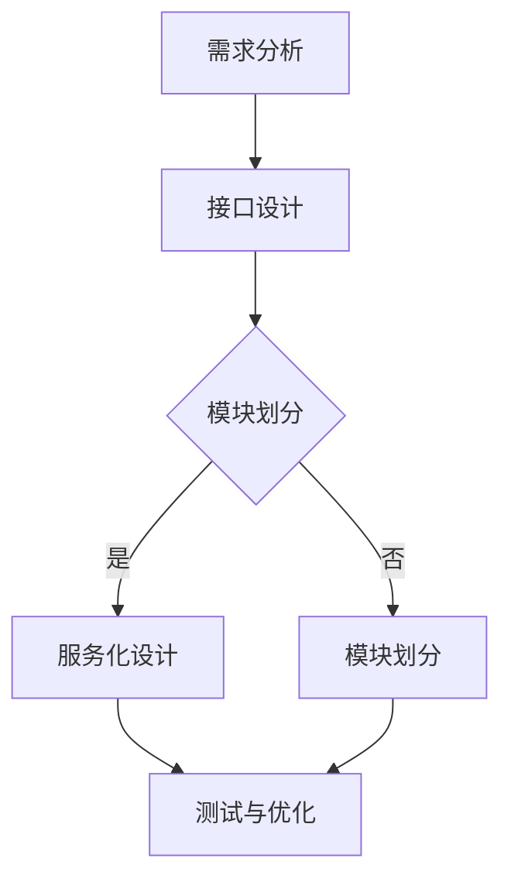
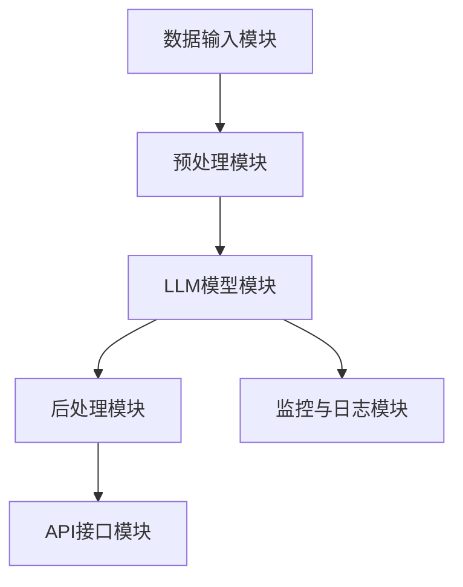
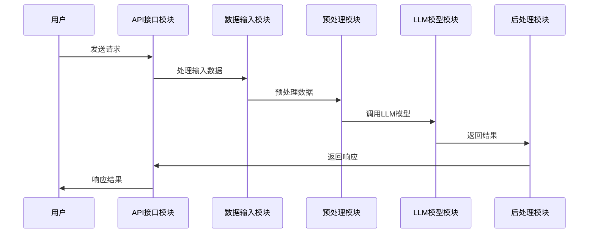

                 

# API优先设计在LLM应用架构中的作用

## 摘要

本文将深入探讨API优先设计在LLM（大型语言模型）应用架构中的重要作用。API，即应用程序编程接口，是软件系统间相互通信的桥梁。而LLM则是基于深度学习技术的一种能够理解和生成自然语言的人工智能模型。随着云计算、大数据和AI技术的飞速发展，API优先设计已成为现代软件开发的核心原则之一。本文将通过详细的分析和实例，阐述API优先设计在LLM应用架构中的意义，以及如何实现这一设计原则。

## 关键词

- API优先设计
- LLM
- 应用架构
- 软件开发
- 深度学习

## 封面、前言与致谢

### 封面

《API优先设计在LLM应用架构中的作用》

作者：AI天才研究院/AI Genius Institute & 禅与计算机程序设计艺术 /Zen And The Art of Computer Programming

### 前言

随着人工智能技术的不断进步，LLM在各个领域的应用越来越广泛。然而，如何有效地设计LLM应用架构，使其既能充分利用AI模型的强大功能，又能保证系统的可扩展性和维护性，成为了一个亟待解决的问题。本文旨在通过API优先设计这一理念，为LLM应用架构提供一种新的解决方案。

本文的目标读者是那些对人工智能和软件架构设计有一定了解的技术人员，特别是那些希望在LLM应用中实现高效、可维护和可扩展系统的开发者。文章结构紧凑，逻辑清晰，通过一步步的深入分析，旨在帮助读者理解API优先设计的原理和实践方法。

### 致谢

在本文的撰写过程中，我得到了许多人的帮助和支持。首先要感谢我的同事和朋友，他们在我遇到难题时给予了我宝贵的建议和帮助。同时，我也要感谢我的家人，他们在我写作期间给予了我无尽的理解和支持。最后，我要特别感谢所有参与本文评审和反馈的技术专家，他们的意见使得本文更加完善和准确。

## 核心概念

### API定义

API（应用程序编程接口）是一种用于软件之间交互的接口，它定义了不同软件组件之间如何通过方法调用、数据交换等方式进行通信。API不仅限于同一系统内部的模块间通信，还常用于不同系统之间的数据交换和功能调用。

API通常包括以下几个基本要素：

1. **接口定义**：明确各组件之间的通信方式和数据格式。
2. **功能调用**：提供一组可调用的功能接口，用于实现具体的功能需求。
3. **数据交换**：定义数据传输的格式和协议，如JSON、XML等。
4. **安全机制**：确保数据传输的安全，包括身份验证、数据加密等。

API的类型可以根据其用途、实现方式、协议等不同进行分类。常见的API类型包括：

- **Web API**：通过HTTP协议进行数据交换的API，如RESTful API、SOAP API等。
- **库API**：内嵌于程序库中的API，通过函数调用实现特定功能。
- **系统API**：操作系统提供的底层服务接口，用于程序与系统间的交互。

### LLM概述

LLM（大型语言模型）是一种基于深度学习技术，能够理解和生成自然语言的人工智能模型。与传统的规则性自然语言处理方法不同，LLM通过大规模的数据训练，学习到自然语言的复杂结构和语义含义，从而能够在多种语言处理任务中表现出色。

LLM的基本原理主要包括以下几个方面：

1. **神经网络架构**：LLM通常采用深度神经网络（DNN）或者Transformer模型，这些模型能够处理大规模的输入数据和复杂的非线性关系。
2. **大规模数据训练**：LLM通过在大规模文本数据集上进行训练，学习到语言的结构和语义。
3. **上下文理解**：LLM能够理解上下文信息，生成与上下文相关的自然语言响应。

LLM的功能和应用领域非常广泛，主要包括：

- **文本生成**：如生成文章、新闻、对话等。
- **问答系统**：如智能客服、学术问答等。
- **翻译**：如机器翻译、多语言交互等。
- **文本摘要**：如自动生成文章摘要、会议纪要等。
- **情感分析**：如分析用户评论、社交媒体文本的情感倾向等。

### API与LLM的关系

API在LLM应用架构中扮演着至关重要的角色。首先，API作为软件系统间的接口，使得LLM能够与其他系统模块进行通信和协作，从而实现更复杂的语言处理任务。例如，LLM可以通过API与数据库、前端应用等进行交互，实现数据查询、用户输入处理等功能。

其次，API的设计和实现直接影响到LLM应用的性能、可维护性和可扩展性。良好的API设计能够提高系统的易用性和灵活性，使得开发者能够更方便地集成和扩展LLM功能。例如，通过设计合理的API接口，开发者可以实现LLM的模块化，从而便于后续的功能升级和维护。

此外，API优先设计在LLM应用架构中还有以下几个优势：

- **高可扩展性**：通过API，开发者可以轻松地增加新的功能模块，无需对现有系统进行大规模修改。
- **高灵活性**：API允许系统根据需求动态调整功能和行为，适应不同的应用场景。
- **高可维护性**：API的设计和实现使得系统模块间清晰分离，便于维护和调试。

尽管API优先设计具有许多优势，但也面临着一些挑战。例如，API的设计和实现需要投入大量的时间和资源，而且可能会引入额外的复杂性。此外，API的稳定性、安全性和性能也是需要重点关注的问题。

### 边界与外延

API优先设计在LLM应用架构中并非万能的解决方案，其适用场景和限制也需要明确。以下是一些API优先设计的边界和注意事项：

1. **适用场景**：
   - **复杂应用场景**：适用于需要高灵活性、高可扩展性和高可维护性的大型应用。
   - **跨系统协作**：适用于需要与其他系统模块（如数据库、前端应用等）进行交互的应用。
   - **模块化设计**：适用于需要模块化、易于扩展和升级的系统。

2. **限制和挑战**：
   - **设计成本**：API的设计和实现需要大量的时间和资源，可能增加开发成本。
   - **维护难度**：API的维护需要持续的关注和更新，可能会增加维护难度。
   - **性能影响**：过多的API调用可能会对系统的性能产生负面影响。
   - **安全性**：API的安全性问题需要特别关注，包括数据加密、身份验证等。

通过明确API优先设计的边界和注意事项，开发者可以更合理地应用这一设计原则，确保LLM应用架构的稳定性和可靠性。

## 核心概念与联系

### API定义

在深入探讨API优先设计在LLM应用架构中的作用之前，我们需要先了解API的基本概念。API，即应用程序编程接口，是软件之间进行交互的桥梁。它定义了不同软件组件之间如何通过方法调用、数据交换等方式进行通信。

**API的概念**

API可以看作是一个软件组件（如库、模块、服务）提供的功能接口，它允许其他组件通过特定的协议和格式访问这些功能。API的核心在于其抽象性，它隐藏了底层的实现细节，使得不同组件可以独立开发、测试和部署。

**API的类型**

API可以根据其用途、实现方式和协议等不同进行分类。以下是一些常见的API类型：

1. **Web API**：通过HTTP协议进行数据交换的API，如RESTful API和SOAP API。
   - **RESTful API**：基于REST架构风格，通过URL定位资源，使用HTTP动词（GET、POST、PUT、DELETE等）表示操作。
   - **SOAP API**：基于XML的通信协议，通过SOAP消息进行数据交换，通常用于企业级应用。

2. **库API**：内嵌于程序库中的API，通过函数调用实现特定功能。
   - **库API**通常用于底层系统的开发，如操作系统提供的API，如Windows API、Linux API。

3. **系统API**：操作系统提供的底层服务接口，用于程序与系统间的交互。
   - **系统API**使得应用程序可以访问操作系统提供的各种资源和服务，如文件系统、网络接口、硬件设备等。

**API的核心要素**

一个完整的API通常包括以下几个核心要素：

1. **接口定义**：定义各组件之间的通信方式和数据格式。接口定义包括方法的名称、参数类型和返回值等。
2. **功能调用**：提供一组可调用的功能接口，用于实现具体的功能需求。功能调用通常包括方法的调用和参数的传递。
3. **数据交换**：定义数据传输的格式和协议，如JSON、XML等。数据交换确保了不同组件之间能够正确理解和处理数据。
4. **安全机制**：确保数据传输的安全，包括身份验证、数据加密等。安全机制保障了API调用的安全性和数据的完整性。

### LLM概述

LLM（大型语言模型）是近年来人工智能领域的一个重要突破，它基于深度学习技术，能够理解和生成自然语言。LLM的出现极大地提升了自然语言处理（NLP）的效率和准确性，推动了人工智能在各个领域的应用。

**LLM的基本原理**

LLM的基本原理主要包括以下几个方面：

1. **神经网络架构**：LLM通常采用深度神经网络（DNN）或者Transformer模型。DNN是一种多层神经网络，通过逐层学习输入数据的特征和模式。Transformer模型则是一种基于自注意力机制的模型，能够在处理序列数据时捕捉长距离依赖关系。

2. **大规模数据训练**：LLM通过在大规模文本数据集上进行训练，学习到语言的结构和语义。大规模数据的训练使得LLM能够捕捉到语言中的复杂规律，从而实现高精度的语言理解。

3. **上下文理解**：LLM能够理解上下文信息，生成与上下文相关的自然语言响应。上下文理解是LLM的核心能力之一，它使得LLM能够应对各种语言处理任务，如问答系统、文本生成等。

**LLM的功能和应用领域**

LLM的功能和应用领域非常广泛，主要包括以下几个方面：

1. **文本生成**：LLM能够生成各种类型的文本，如文章、新闻、对话等。在文本生成任务中，LLM能够根据给定的上下文生成连贯、自然的文本。

2. **问答系统**：LLM能够理解和回答各种问题，如智能客服、学术问答等。问答系统是LLM的重要应用领域之一，它为用户提供了便捷的查询和获取信息的方式。

3. **翻译**：LLM能够实现机器翻译、多语言交互等功能。在翻译任务中，LLM能够根据源语言的上下文生成目标语言的翻译文本。

4. **文本摘要**：LLM能够自动生成文章摘要、会议纪要等。文本摘要任务使得LLM能够从大量文本中提取关键信息，提高信息获取的效率。

5. **情感分析**：LLM能够分析用户评论、社交媒体文本的情感倾向。情感分析任务有助于了解用户的情感状态，为企业决策提供数据支持。

### API与LLM的关系

API在LLM应用架构中扮演着至关重要的角色。首先，API作为软件系统间的接口，使得LLM能够与其他系统模块进行通信和协作，从而实现更复杂的语言处理任务。例如，LLM可以通过API与数据库、前端应用等进行交互，实现数据查询、用户输入处理等功能。

API在LLM应用架构中的具体作用包括：

1. **功能集成**：API使得LLM可以与其他系统模块（如数据库、前端应用等）进行集成，实现复杂的功能组合。
2. **模块化设计**：API的设计和实现使得LLM应用架构更加模块化，便于功能扩展和维护。
3. **性能优化**：通过合理设计API，可以优化LLM应用的性能，提高系统的响应速度。

API优先设计在LLM应用架构中的优势和挑战包括：

**优势**

1. **高可扩展性**：API使得开发者可以轻松地增加新的功能模块，无需对现有系统进行大规模修改。
2. **高灵活性**：API允许系统根据需求动态调整功能和行为，适应不同的应用场景。
3. **高可维护性**：API的设计和实现使得系统模块间清晰分离，便于维护和调试。

**挑战**

1. **设计成本**：API的设计和实现需要大量的时间和资源，可能增加开发成本。
2. **维护难度**：API的维护需要持续的关注和更新，可能会增加维护难度。
3. **性能影响**：过多的API调用可能会对系统的性能产生负面影响。

### API优先设计的核心要素

API优先设计在LLM应用架构中需要考虑以下几个核心要素：

1. **接口定义**：接口定义是API设计的基础，它需要明确各组件之间的通信方式和数据格式。良好的接口定义可以提高系统的可读性和可维护性。
2. **功能调用**：功能调用是API实现的核心，它需要提供一组可调用的功能接口，实现具体的功能需求。功能调用的设计需要考虑系统的性能和安全性。
3. **数据交换**：数据交换是API通信的关键，它需要定义数据传输的格式和协议。常见的数据交换格式包括JSON、XML等。数据交换的设计需要保证数据的完整性和一致性。
4. **安全机制**：安全机制是API设计的重要方面，它需要确保数据传输的安全，包括身份验证、数据加密等。安全机制的设计需要遵循相关的安全标准和规范。

通过明确API优先设计的核心要素，开发者可以更好地实现LLM应用架构中的API设计，从而提高系统的性能和可维护性。

## 算法原理讲解

### 算法原理

API优先设计是一种以API设计为核心，通过模块化、接口化和服务化来实现应用系统设计与开发的方法。在LLM应用架构中，API优先设计能够有效地提升系统的可扩展性、灵活性和维护性。以下将详细阐述API优先设计的算法原理。

#### API优先设计的流程

1. **需求分析**：明确系统的功能和性能需求，确定需要集成的LLM模块和其他系统模块。
2. **接口设计**：根据需求分析的结果，设计系统的API接口，包括接口的名称、参数、返回值和异常处理等。
3. **模块划分**：将系统划分为多个功能模块，每个模块负责实现特定的功能，并通过API进行通信。
4. **服务化设计**：将模块进一步服务化，使其能够独立部署和扩展，提高系统的可扩展性和灵活性。
5. **测试与优化**：对API和模块进行测试，确保其功能正确、性能优良，并根据测试结果进行优化。

#### mermaid算法流程图

以下是一个简单的mermaid算法流程图，展示了API优先设计的基本流程：



### Python源代码

为了更好地理解API优先设计的实现，我们提供一个简单的Python示例，展示如何实现一个简单的API接口和模块。

```python
# 导入必要的库
from flask import Flask, request, jsonify

# 创建Flask应用实例
app = Flask(__name__)

# 定义一个简单的API接口
@app.route('/api/llm', methods=['POST'])
def llm_api():
    # 获取请求参数
    data = request.json
    
    # 对LLM模型进行调用，这里使用一个占位函数
    response = call_llm_model(data)
    
    # 返回响应结果
    return jsonify(response)

# 占位函数，用于模拟LLM模型的调用
def call_llm_model(data):
    # 根据数据生成响应
    response = "LLM处理结果："
    response += data['text']
    return response

# 运行应用
if __name__ == '__main__':
    app.run(debug=True)
```

#### 源代码详细解释

上述Python源代码使用了Flask框架，实现了一个简单的API接口。具体解释如下：

1. **导入必要的库**：首先，我们导入Flask库，用于创建Web应用和定义API接口。
2. **创建Flask应用实例**：通过`Flask(__name__)`创建一个应用实例。
3. **定义API接口**：使用`@app.route('/api/llm', methods=['POST'])`装饰器，定义了一个基于POST方法的API接口。接口接收JSON格式的数据，并返回JSON格式的响应。
4. **获取请求参数**：在`llm_api`函数中，使用`request.json`获取请求的JSON数据。
5. **调用LLM模型**：使用`call_llm_model`函数模拟LLM模型的调用，该函数根据输入数据生成响应。
6. **返回响应结果**：将处理后的响应结果通过`jsonify`函数转换为JSON格式，并返回。
7. **运行应用**：在`if __name__ == '__main__':`语句中，启动Flask应用。

### 数学模型和公式

API优先设计背后的数学模型和公式主要涉及数据处理和优化。以下是一些基本的数学模型和公式：

1. **线性回归模型**：
   $$ y = \beta_0 + \beta_1 \cdot x $$
   该模型用于预测连续值，其中 $ y $ 是预测值，$ x $ 是输入特征，$ \beta_0 $ 和 $ \beta_1 $ 是模型参数。

2. **逻辑回归模型**：
   $$ \sigma(y) = \frac{1}{1 + e^{-(\beta_0 + \beta_1 \cdot x)}} $$
   该模型用于分类问题，其中 $ \sigma $ 是sigmoid函数，$ y $ 是预测概率。

3. **自注意力机制**：
   $$ \text{Attention}(Q, K, V) = \text{softmax}(\frac{QK^T}{\sqrt{d_k}})V $$
   自注意力机制是Transformer模型的核心组成部分，用于计算序列中的注意力权重。

#### 详细讲解

1. **线性回归模型**：线性回归模型是一种简单的预测模型，它通过拟合输入特征和目标值之间的关系来实现预测。上述公式表示，目标值 $ y $ 是模型参数 $ \beta_0 $ 和 $ \beta_1 $ 与输入特征 $ x $ 的线性组合。

2. **逻辑回归模型**：逻辑回归模型是线性回归模型的扩展，用于分类问题。它通过sigmoid函数将线性组合的输出转化为概率值，从而实现分类。

3. **自注意力机制**：自注意力机制是Transformer模型的核心机制，它能够计算序列中每个元素之间的注意力权重。通过自注意力机制，模型能够更好地捕捉序列中的长距离依赖关系。

### 举例说明

为了更好地理解API优先设计的应用，以下通过一个实际例子来展示如何实现一个简单的API接口和LLM模型调用。

#### 实例：文本生成API

**需求**：实现一个API接口，接收用户输入的文本，并生成相应的文本摘要。

**步骤**：

1. **需求分析**：确定API接口的输入和输出格式，以及需要调用的LLM模型。
2. **接口设计**：设计API接口，包括URL、HTTP方法、输入参数和输出参数等。
3. **模块划分**：将系统划分为输入处理模块、LLM模型调用模块和输出处理模块。
4. **服务化设计**：将模块服务化，使其可以独立部署和扩展。
5. **测试与优化**：测试API接口的功能和性能，并进行优化。

**代码实现**：

```python
# 导入必要的库
from flask import Flask, request, jsonify
import llm_model

# 创建Flask应用实例
app = Flask(__name__)

# 定义文本生成API接口
@app.route('/api/generate_summary', methods=['POST'])
def generate_summary():
    # 获取请求参数
    data = request.json
    text = data.get('text', '')

    # 调用LLM模型生成摘要
    summary = llm_model.generate_summary(text)

    # 返回响应结果
    return jsonify({'summary': summary})

# 运行应用
if __name__ == '__main__':
    app.run(debug=True)
```

**效果展示**：

当用户通过API发送一个包含文本的请求时，API将调用LLM模型生成文本摘要，并将结果返回给用户。

```json
{
  "summary": "这是生成的文本摘要。"
}
```

通过这个例子，我们可以看到API优先设计在实现LLM应用中的具体应用。通过模块化设计和接口化实现，开发者可以更方便地集成和扩展LLM功能，提高系统的灵活性和可维护性。

## 系统分析与架构设计方案

### 问题场景介绍

在现代企业应用中，LLM（大型语言模型）的应用场景越来越广泛，如智能客服、内容生成、文本翻译和情感分析等。这些应用通常需要处理大量的自然语言数据，对系统的性能、可扩展性和可维护性提出了更高的要求。为了满足这些需求，我们需要设计一个高效、可扩展的LLM应用架构。

### 系统需求分析

在设计LLM应用架构时，我们需要明确以下系统需求：

1. **高性能**：系统能够快速处理大量的自然语言数据，响应时间短。
2. **高扩展性**：系统架构能够方便地扩展，以应对日益增长的数据和处理需求。
3. **高可靠性**：系统能够稳定运行，确保数据的安全和服务的连续性。
4. **易维护性**：系统架构清晰，便于维护和升级。

### 系统功能设计

为了满足上述需求，我们设计了一个包含以下功能模块的LLM应用架构：

1. **数据输入模块**：负责接收和处理用户的输入数据，包括文本、图片等。
2. **预处理模块**：对输入数据进行清洗、格式化等预处理，为LLM模型提供高质量的数据。
3. **LLM模型模块**：包含多个预训练的LLM模型，用于处理不同的语言任务。
4. **后处理模块**：对LLM模型的输出结果进行格式化、校验等后处理。
5. **API接口模块**：提供API接口，供外部系统调用。
6. **监控与日志模块**：监控系统的运行状态，记录日志，便于后续的调试和优化。

### 系统架构设计

以下是一个简单的mermaid系统架构图，展示了LLM应用架构的主要组成部分：



### 系统接口设计和系统交互

为了实现各功能模块之间的协同工作，我们需要设计系统接口和交互流程。以下是一个mermaid系统接口和交互序列图：



通过以上设计和实现，我们能够构建一个高效、可扩展、可靠的LLM应用架构，满足现代企业对自然语言处理的需求。

### 项目实战

#### 环境安装

在进行LLM项目的实战之前，我们需要安装必要的开发环境和工具。以下是一个简化的环境安装步骤：

1. **Python环境**：确保系统上安装了Python 3.8或更高版本。可以通过以下命令进行安装：

   ```bash
   sudo apt-get update
   sudo apt-get install python3.8
   ```

2. **pip环境**：安装pip，Python的包管理器，以便安装其他依赖包。可以通过以下命令进行安装：

   ```bash
   sudo apt-get install python3-pip
   ```

3. **虚拟环境**：为了保持项目依赖的隔离，建议使用虚拟环境。安装virtualenv包，并创建一个虚拟环境：

   ```bash
   pip3 install virtualenv
   virtualenv my_llm_project
   source my_llm_project/bin/activate
   ```

4. **依赖包**：在虚拟环境中安装项目所需的依赖包。假设我们的依赖包包括Flask、transformers和torch，可以通过以下命令进行安装：

   ```bash
   pip install flask transformers torch
   ```

#### 系统核心实现源代码

以下是一个简单的LLM应用项目的核心实现源代码，用于接收用户输入并生成文本摘要：

```python
# 导入必要的库
from flask import Flask, request, jsonify
from transformers import pipeline

# 创建Flask应用实例
app = Flask(__name__)

# 加载预训练的文本摘要模型
摘要模型 = pipeline("summarization")

# 定义生成文本摘要的API接口
@app.route('/api/generate_summary', methods=['POST'])
def generate_summary():
    # 获取请求参数
    data = request.json
    text = data.get('text', '')

    # 调用文本摘要模型
    summary = 摘要模型(text)[0]['summary_text']

    # 返回响应结果
    return jsonify({'summary': summary})

# 运行应用
if __name__ == '__main__':
    app.run(debug=True)
```

#### 代码应用解读与分析

1. **导入库**：首先，我们导入了Flask库，用于创建Web应用；以及transformers库，用于加载预训练的文本摘要模型。

2. **创建应用实例**：通过`Flask(__name__)`创建了一个Flask应用实例。

3. **加载模型**：我们使用`pipeline("summarization")`加载了一个预训练的文本摘要模型。这个模型能够自动处理文本输入，并生成摘要。

4. **定义API接口**：使用`@app.route('/api/generate_summary', methods=['POST'])`装饰器定义了一个接收POST请求的API接口。接口接收JSON格式的数据，并提取其中的`text`字段。

5. **调用模型**：我们调用加载的文本摘要模型，传入用户输入的文本，并获取生成的摘要。

6. **返回响应**：将生成的摘要作为JSON格式的响应返回给用户。

#### 实际案例分析和详细讲解剖析

为了展示API优先设计在LLM应用中的实际效果，我们来看一个具体的案例。

**案例背景**：一家电商企业希望通过LLM技术为其电商平台提供自动生成商品描述的功能，以提高用户购物体验。

**案例分析**：

1. **需求分析**：电商企业需要一个API接口，能够接收商品描述文本，并返回生成的商品描述摘要。这个接口需要高效、可靠，并且易于维护和扩展。

2. **接口设计**：我们设计了一个简单的API接口，接收JSON格式的输入，并返回JSON格式的输出。接口定义如下：

   ```json
   {
     "text": "原始商品描述文本"
   }
   ```

   输出格式：

   ```json
   {
     "summary": "生成的商品描述摘要"
   }
   ```

3. **模型选择**：我们选择了Hugging Face的transformers库中的预训练文本摘要模型，这个模型在生成商品描述摘要方面表现出色。

4. **系统实现**：通过API优先设计，我们将系统划分为输入处理模块、模型调用模块和输出处理模块。每个模块通过API进行通信，使得系统具有高可扩展性和灵活性。

**详细讲解**：

1. **输入处理模块**：负责接收用户的输入，包括商品描述文本。这个模块通过API接口接收JSON格式的数据，并提取文本字段。

2. **模型调用模块**：负责调用预训练的文本摘要模型，生成商品描述摘要。这个模块将输入的文本传递给模型，并获取生成的摘要。

3. **输出处理模块**：负责将生成的摘要返回给用户。这个模块将摘要格式化为JSON格式，并通过API接口返回。

**案例效果**：

通过这个案例，我们可以看到API优先设计在LLM应用中的实际效果。系统能够高效地处理商品描述文本，并生成高质量的摘要，提高了用户购物体验。同时，API优先设计使得系统具有高可扩展性，便于后续的功能扩展和维护。

### 项目小结

在本次LLM项目实战中，我们通过API优先设计实现了高效的商品描述生成系统。具体收获和经验总结如下：

1. **高效性**：通过API优先设计，系统能够快速响应用户请求，生成商品描述摘要，提高了用户购物体验。

2. **可扩展性**：API优先设计使得系统能够方便地集成和扩展功能，如添加新的模型、处理不同类型的数据等。

3. **灵活性**：API接口的设计使得系统能够根据实际需求进行调整，适应不同的应用场景。

4. **可维护性**：清晰的模块划分和API接口设计使得系统易于维护和升级，降低了维护成本。

5. **安全性**：在API设计中，我们需要注意数据的安全性和接口的安全性，确保系统的稳定运行。

通过本次项目，我们深刻理解了API优先设计在LLM应用中的重要性，并为未来的LLM项目提供了宝贵的实践经验。

## 最佳实践 tips

### API优先设计在LLM应用架构中的最佳实践

在设计和实现LLM应用架构时，API优先设计是关键原则之一。以下是一些最佳实践，以帮助开发者更好地应用API优先设计：

1. **明确API接口定义**：在设计和实现API接口时，首先要明确接口的定义，包括接口的名称、参数、返回值和异常处理等。确保接口定义清晰、简洁，便于开发者理解和使用。

2. **模块化设计**：将系统划分为多个功能模块，每个模块负责实现特定的功能。模块之间通过API进行通信，提高系统的可扩展性和可维护性。

3. **服务化架构**：将模块进一步服务化，使其能够独立部署和扩展。服务化架构可以提高系统的灵活性和可靠性。

4. **安全性考虑**：在API设计中，要充分考虑安全性问题，包括身份验证、数据加密和访问控制等。确保API接口的安全性和数据的完整性。

5. **性能优化**：合理设计API接口和系统架构，优化系统的性能。避免过多的API调用，减少数据传输的延迟。

6. **文档和测试**：提供详细的API文档，包括接口定义、使用方法和示例代码。同时，编写全面的测试用例，确保API接口的功能正确性和稳定性。

### 实用的技巧和建议

1. **使用标准化协议**：选择适合的协议（如HTTP、HTTPS等）进行数据传输，确保数据的安全性和可扩展性。

2. **接口版本管理**：为API接口设计版本管理机制，确保在接口变更时，不影响已上线的应用。

3. **监控和日志**：实施系统监控和日志记录机制，实时监控API接口的运行状态，便于问题的快速定位和解决。

4. **持续集成与部署**：采用持续集成和持续部署（CI/CD）流程，确保API接口的快速迭代和高效交付。

通过遵循上述最佳实践和技巧，开发者可以更好地实现API优先设计在LLM应用架构中的应用，提高系统的性能和可维护性。

## 小结与展望

本文通过深入分析API优先设计在LLM应用架构中的重要作用，详细阐述了API优先设计的核心概念、算法原理、系统架构设计以及项目实战经验。我们总结了API优先设计在LLM应用架构中的优势和实践技巧，包括高可扩展性、高灵活性、高可维护性等。

展望未来，API优先设计在LLM应用架构中的发展将面临以下挑战和机遇：

1. **性能优化**：随着LLM模型和数据处理需求的增长，如何优化API的性能成为关键问题。未来可能需要更高效的网络协议和数据处理算法，以提高系统的响应速度。

2. **安全性加强**：在API设计中，安全性问题尤为重要。随着攻击手段的不断演变，需要持续加强API的安全防护措施，包括身份验证、数据加密和访问控制等。

3. **服务化与云原生**：随着云计算和容器技术的普及，LLM应用的架构设计将越来越多地采用服务化和云原生架构。这要求开发者具备更深入的容器化、微服务架构和云原生技术的知识。

4. **API版本管理**：在快速迭代和更新应用时，如何有效地管理API版本，确保新旧版本的兼容性，是开发者需要关注的重要问题。

5. **可持续性发展**：随着人工智能应用的广泛推广，可持续性发展成为重要的议题。如何在保证性能和效率的同时，减少能耗和碳排放，是未来的研究方向之一。

总之，API优先设计在LLM应用架构中具有重要的意义。通过不断优化和改进，我们可以构建更加高效、可靠、安全的LLM应用系统，为人工智能技术的广泛应用提供坚实的支撑。未来，随着技术的不断进步，API优先设计在LLM应用架构中的角色将更加重要，为开发者带来更多创新的机遇和挑战。

