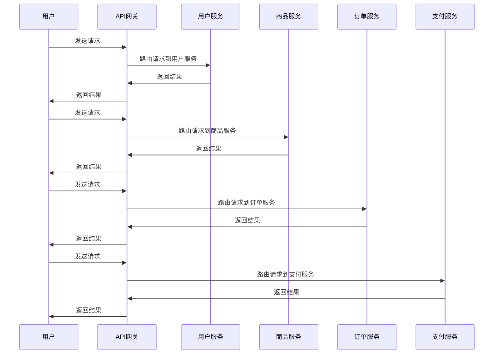
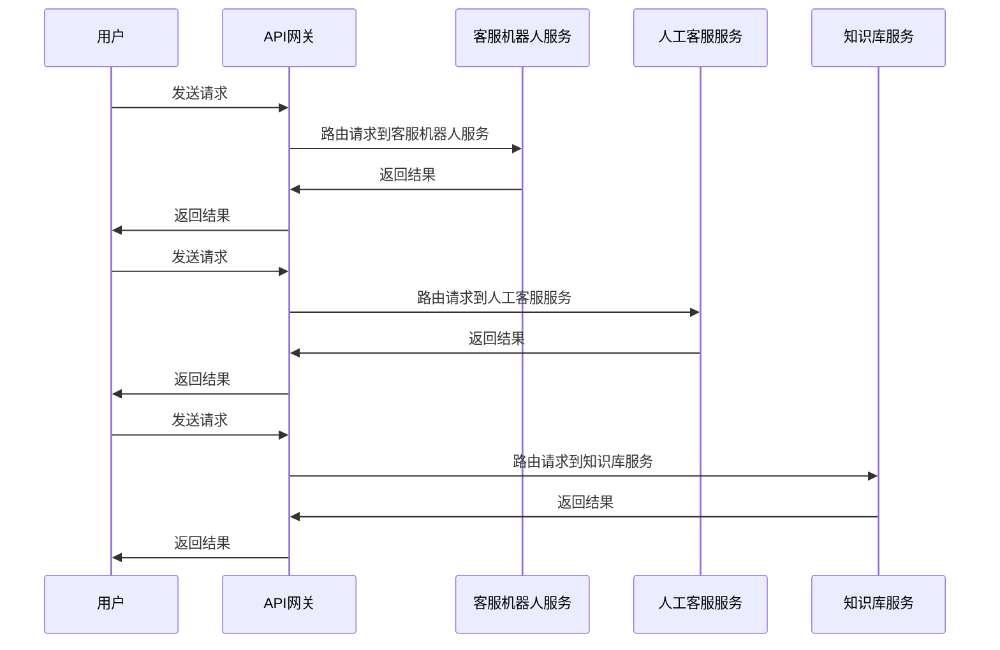

                 

### 第1章 引言与背景

#### 1.1 API网关的概念与作用

API网关是一种服务器、软件框架或服务，负责管理和代理客户端与后端服务之间的交互。其核心功能是接收客户端的请求，根据一定的策略路由到相应的后端服务，并返回处理结果。API网关在微服务架构、分布式系统以及现代Web应用中扮演着至关重要的角色。

首先，API网关提供了统一的接口管理。在现代软件架构中，后端服务往往由多个独立的微服务组成，每个服务负责不同的业务功能。API网关充当这些微服务的统一入口，通过聚合多个微服务的接口，为客户端提供一个统一的访问入口。这样不仅可以简化客户端的调用流程，还能提高系统的可维护性和可扩展性。

其次，API网关负责流量管理和负载均衡。由于客户端的请求量可能很大，直接将请求分配到每个微服务可能会导致某些服务过载，而其他服务资源空闲。API网关可以通过负载均衡算法，将请求合理地分配到各个微服务，确保系统整体的性能和稳定性。

此外，API网关还负责认证和授权。客户端在访问后端服务时，需要经过API网关的认证和授权过程，以确保只有合法的客户端才能访问受保护的服务。API网关可以集成各种认证机制，如OAuth、JWT等，为系统的安全性提供保障。

#### 1.2 LLM应用架构概述

大型语言模型（LLM，Large Language Model）是一种基于深度学习的自然语言处理模型，具有强大的语义理解和生成能力。LLM在诸如聊天机器人、内容生成、机器翻译等应用场景中发挥着重要作用。

LLM应用架构通常包括以下几个关键组件：

1. **模型训练**：模型训练是LLM应用架构的核心环节。通过大规模数据集，训练出一个具有强大语义理解和生成能力的模型。训练过程中需要关注数据清洗、特征提取、模型选择和参数调优等问题。

2. **模型推理**：模型推理是指将输入文本输入到训练好的模型中，获取相应的输出。推理过程需要高效的计算资源和优化的推理算法，以确保模型能够在实际应用中快速、准确地响应。

3. **API网关**：在LLM应用架构中，API网关起到承上启下的作用。它负责接收客户端的请求，将请求路由到LLM模型进行推理，并返回结果。同时，API网关还可以进行流量管理、认证授权等操作，确保系统的安全性和性能。

4. **前端应用**：前端应用是用户与LLM交互的界面，通过API与API网关进行通信，获取LLM的推理结果，并展示给用户。

#### 1.3 本书的目标与结构

本书旨在全面介绍API网关在LLM应用架构中的角色与实现。具体目标包括：

1. 让读者了解API网关的基本概念、原理和作用。
2. 让读者掌握API网关在LLM架构中的具体应用，包括优化性能、安全性、可伸缩性等方面。
3. 帮助读者理解API网关的实现技术，如HTTP、REST、SOAP等。
4. 提供实际案例研究，让读者了解API网关在LLM应用中的成功应用。
5. 总结API网关在LLM应用架构中的最佳实践，为读者提供实际操作指导。

本书结构如下：

- **第1章 引言与背景**：介绍API网关的概念和作用，以及LLM应用架构的概述。
- **第2章 API网关基础**：讲解API网关的基本原理、分类、架构和功能。
- **第3章 LLM应用架构**：介绍LLM的基本概念、应用场景以及在架构中的角色。
- **第4章 API网关在LLM中的应用**：分析API网关在LLM架构中的具体应用，包括性能、安全性和可伸缩性等方面。
- **第5章 API网关的实现技术**：介绍API网关的实现技术，如HTTP、REST、SOAP等。
- **第6章 API网关的安全机制**：讲解API网关在安全方面的机制，如认证、授权、数据加密等。
- **第7章 API网关的性能优化**：讨论API网关的性能优化策略，包括负载均衡、缓存、压缩等。
- **第8章 API网关的最佳实践**：分享实际应用中的最佳实践，包括设计模式、开发规范、部署策略等。
- **第9章 案例研究**：通过实际案例展示API网关在LLM应用架构中的成功应用。
- **第10章 总结与展望**：总结本书内容，展望API网关在LLM应用架构中的未来发展。

通过本书的学习，读者将能够全面掌握API网关在LLM应用架构中的角色与实现，为实际项目提供有力支持。### 第2章 API网关基础

#### 2.1 API网关的基本原理

API网关的基本原理可以概括为：统一入口、代理转发、流量控制、安全认证等功能。以下是详细解释：

1. **统一入口**：API网关作为系统的统一入口，对外提供统一的API接口，隐藏后端服务的具体实现。这样简化了客户端的调用流程，降低了系统的复杂性。

2. **代理转发**：当客户端请求到达API网关时，网关会根据路由策略将请求转发到相应的后端服务。这个过程中，API网关充当了一个中间人的角色，将客户端的请求转发给后端服务，并将后端服务的响应返回给客户端。

3. **流量控制**：API网关可以对进入系统的流量进行控制，确保系统的稳定运行。例如，通过限流、降级等策略，防止系统被大量请求攻击导致崩溃。

4. **安全认证**：API网关可以集成各种认证机制，如OAuth、JWT等，确保只有合法的客户端才能访问后端服务。这样可以有效保护系统的安全性。

5. **性能优化**：API网关可以对请求进行缓存、压缩等优化操作，提高系统的响应速度和性能。

6. **监控与日志**：API网关可以收集系统的监控数据，如访问量、请求时长、错误率等，方便运维人员监控系统的运行状态。

#### 2.2 API网关的分类

根据不同的分类标准，API网关可以有不同的分类方式。以下是几种常见的分类方式：

1. **按架构风格分类**：

   - **单层架构**：单层架构的API网关通常只包含路由和流量控制功能，不涉及复杂的业务逻辑。
   - **多层架构**：多层架构的API网关通常包含多个层级，分别处理不同的功能，如路由、安全认证、性能优化等。

2. **按部署模式分类**：

   - **集中式部署**：集中式部署的API网关通常部署在单独的服务器或集群上，处理所有客户端请求。
   - **分布式部署**：分布式部署的API网关将负载分散到多个节点上，每个节点负责一部分请求的处理。

3. **按功能分类**：

   - **功能型API网关**：功能型API网关专注于特定的功能，如安全认证、性能优化等。
   - **全功能API网关**：全功能API网关集成了多种功能，如路由、安全认证、性能优化等。

#### 2.3 API网关的架构

API网关的架构设计需要考虑多个方面，包括路由策略、流量控制、安全认证、性能优化等。以下是一种常见的API网关架构设计：

1. **前端接口层**：前端接口层是API网关与客户端交互的界面，接收客户端的请求，并返回处理结果。

2. **路由层**：路由层根据请求的URL或方法，将请求转发到相应的后端服务。路由策略可以基于URL匹配、方法匹配、IP黑白名单等。

3. **安全认证层**：安全认证层负责验证客户端的身份，确保只有合法的客户端才能访问后端服务。常见的认证机制包括OAuth、JWT等。

4. **流量控制层**：流量控制层负责对进入系统的流量进行控制，防止系统过载。常见的流量控制策略包括限流、降级等。

5. **性能优化层**：性能优化层负责对请求进行缓存、压缩等优化操作，提高系统的响应速度和性能。

6. **日志监控层**：日志监控层负责收集系统的监控数据，如访问量、请求时长、错误率等，方便运维人员监控系统的运行状态。

7. **后端服务层**：后端服务层是API网关调用的实际业务服务，处理具体的业务逻辑。

#### 2.4 API网关的功能

API网关具有多种功能，以下是一些常见功能：

1. **路由**：路由是API网关的核心功能之一，负责根据请求的URL或方法，将请求转发到相应的后端服务。

2. **认证与授权**：API网关可以集成各种认证和授权机制，确保只有合法的客户端才能访问后端服务。

3. **流量控制**：API网关可以通过限流、降级等策略，对进入系统的流量进行控制，确保系统的稳定性。

4. **性能优化**：API网关可以对请求进行缓存、压缩等优化操作，提高系统的响应速度和性能。

5. **监控与日志**：API网关可以收集系统的监控数据，如访问量、请求时长、错误率等，方便运维人员监控系统的运行状态。

6. **API文档生成**：API网关可以自动生成API文档，方便开发者了解和使用API。

7. **服务治理**：API网关可以对后端服务进行治理，如服务注册与发现、负载均衡等。

8. **故障转移与容错**：API网关可以配置故障转移和容错策略，确保系统在遇到故障时仍能正常运行。

#### 2.5 API网关的优势

API网关具有多种优势，使其在现代软件架构中发挥着重要作用：

1. **统一接口管理**：API网关提供了统一的接口管理，简化了客户端的调用流程，降低了系统的复杂性。

2. **流量管理和负载均衡**：API网关可以合理分配流量，确保系统的稳定运行。

3. **安全性保障**：API网关提供了认证和授权功能，确保系统的安全性。

4. **性能优化**：API网关可以通过缓存、压缩等策略，提高系统的响应速度和性能。

5. **监控与日志**：API网关可以收集系统的监控数据，方便运维人员监控系统的运行状态。

6. **服务治理**：API网关可以对后端服务进行治理，如服务注册与发现、负载均衡等。

#### 2.6 API网关的挑战

虽然API网关具有许多优势，但在实际应用中仍面临一些挑战：

1. **性能瓶颈**：API网关作为系统的统一入口，可能会成为性能瓶颈。需要合理设计架构和优化策略，确保性能。

2. **安全性问题**：API网关需要集成多种认证和授权机制，确保系统的安全性。但同时也可能引入安全漏洞。

3. **运维复杂性**：API网关需要管理和监控多个后端服务，增加了运维的复杂性。

4. **扩展性问题**：在系统规模扩大时，API网关需要能够灵活扩展，以满足不断增加的请求量。

5. **兼容性问题**：API网关需要兼容不同的后端服务和技术，这可能带来一定的兼容性问题。

通过以上内容，读者可以初步了解API网关的基本原理、分类、架构和功能。在后续章节中，我们将进一步探讨API网关在LLM应用架构中的具体应用。### 第3章 LLM应用架构

#### 3.1 LLM的基本概念

大型语言模型（LLM，Large Language Model）是一种基于深度学习技术的自然语言处理模型，旨在通过学习大量的文本数据，捕捉语言中的复杂结构和语义信息。LLM的核心任务是理解和生成自然语言，包括文本分类、机器翻译、问答系统、文本生成等多种应用场景。

LLM的基本原理可以概括为以下几个步骤：

1. **数据采集**：收集大量的文本数据，包括新闻文章、小说、社交媒体内容等。这些数据来源越多样化，模型的泛化能力越强。

2. **数据预处理**：对采集到的文本数据进行清洗和预处理，包括去除噪声、分词、词干提取等操作，为模型训练做准备。

3. **模型训练**：使用预处理后的数据对模型进行训练，通过反向传播算法不断调整模型的参数，使其能够更好地理解语言。

4. **模型评估**：在训练过程中，需要对模型进行定期评估，以检测模型的性能和过拟合现象。

5. **模型优化**：根据评估结果，对模型进行调整和优化，以提高其准确性和泛化能力。

6. **模型部署**：将训练好的模型部署到生产环境中，通过API接口对外提供服务。

#### 3.2 LLM的应用场景

LLM在多个领域和场景中得到了广泛应用，以下是一些典型的应用场景：

1. **聊天机器人**：LLM可以用于构建智能聊天机器人，实现与用户的自然语言交互。通过训练大规模的对话数据，聊天机器人可以理解用户的意图，并提供相应的答复。

2. **内容生成**：LLM可以生成各种类型的内容，如文章、新闻、诗歌、小说等。这些内容在广告、营销、创作等领域具有广泛的应用。

3. **机器翻译**：LLM可以用于构建高性能的机器翻译系统，实现不同语言之间的翻译。与传统的规则翻译和统计翻译相比，LLM具有更高的准确性和自然性。

4. **问答系统**：LLM可以构建智能问答系统，回答用户提出的问题。这些问答系统在客户服务、在线教育、咨询等领域发挥着重要作用。

5. **文本分析**：LLM可以用于文本分类、情感分析、关键词提取等文本分析任务。这些任务在商业智能、舆情监测、推荐系统等领域具有广泛的应用。

6. **语音助手**：LLM可以用于构建智能语音助手，如虚拟助手、智能家居控制系统等。通过自然语言交互，用户可以控制设备、获取信息等。

#### 3.3 LLM在架构中的角色

在LLM应用架构中，LLM通常扮演以下角色：

1. **核心算法组件**：LLM作为核心算法组件，负责处理自然语言输入，并生成相应的输出。它是整个系统中最复杂、计算资源消耗最大的部分。

2. **服务提供者**：LLM通过API接口对外提供服务，接收客户端的请求，并进行处理。在服务端，LLM可以与数据库、其他微服务等进行交互，实现完整的业务逻辑。

3. **性能瓶颈**：由于LLM的计算复杂度较高，它可能是系统中的性能瓶颈。需要通过优化算法、分布式部署等策略，提高系统的性能和响应速度。

4. **可靠性保障**：LLM的可靠性对整个系统至关重要。需要通过冗余部署、故障转移等策略，确保系统的稳定性和可靠性。

5. **安全防护**：LLM作为核心算法组件，需要采取相应的安全防护措施，防止数据泄露和恶意攻击。例如，可以采用数据加密、权限控制等策略。

#### 3.4 LLM应用架构的关键组件

LLM应用架构通常包括以下几个关键组件：

1. **数据层**：数据层负责存储和管理大量的文本数据，包括原始文本、预处理文本、模型训练数据等。

2. **训练层**：训练层负责对文本数据进行处理，训练出高性能的LLM模型。训练过程中需要关注数据预处理、模型选择、参数调优等问题。

3. **推理层**：推理层负责接收客户端的请求，调用训练好的LLM模型进行推理，并返回结果。推理层需要关注模型部署、性能优化等问题。

4. **接口层**：接口层是LLM与客户端交互的界面，提供API接口，供客户端调用LLM服务。

5. **监控与日志层**：监控与日志层负责收集系统的监控数据，如请求量、响应时间、错误率等，方便运维人员监控系统的运行状态。

6. **安全层**：安全层负责保护系统的安全性，包括数据加密、权限控制、认证授权等。

通过以上内容，读者可以初步了解LLM的基本概念、应用场景以及在架构中的角色。在后续章节中，我们将进一步探讨API网关在LLM应用架构中的具体应用。### 第4章 API网关在LLM中的应用

#### 4.1 API网关在LLM中的优化

API网关在LLM应用架构中扮演着至关重要的角色，其优化策略直接影响系统的性能和用户体验。以下是一些关键优化策略：

1. **负载均衡**：负载均衡是API网关的一项核心功能，通过将请求合理地分配到多个后端服务实例，避免单个实例过载，提高系统的整体性能。常见的负载均衡算法包括轮询、最少连接数、加权轮询等。

2. **缓存策略**：缓存策略可以显著提高系统的响应速度，减少后端服务的负载。API网关可以将用户的请求结果缓存起来，对于频繁访问的请求，直接返回缓存结果，从而降低服务调用次数。

3. **数据压缩**：数据压缩可以减少网络传输的数据量，提高传输速度，减少带宽消耗。常见的压缩算法包括GZIP、BZIP2等。

4. **限流与降级**：限流与降级策略用于控制系统的负载，防止系统过载。通过设定请求频率限制和阈值，API网关可以防止恶意攻击和高并发请求对系统造成冲击。

5. **服务熔断与恢复**：服务熔断与恢复策略可以在后端服务出现故障时，快速切换到备用服务或返回错误，避免系统崩溃。熔断策略通常包括失败率、延迟时间等指标。

6. **异步处理**：对于耗时较长的请求，可以采用异步处理的方式，将请求放入消息队列，由后台服务进行异步处理，提高系统的响应速度。

#### 4.2 API网关在安全性方面的应用

API网关在LLM应用架构中的安全性至关重要，以下是一些关键安全机制：

1. **认证与授权**：API网关可以集成多种认证机制，如OAuth、JWT等，确保只有授权的用户和系统可以访问后端服务。授权机制可以细粒度地控制用户的访问权限。

2. **API密钥管理**：API网关可以通过API密钥的方式，为不同的客户端分配不同的访问权限。密钥管理需要确保密钥的安全性，防止密钥泄露。

3. **访问控制**：API网关可以设置访问控制列表（ACL），根据用户的角色和权限，控制用户对API的访问。

4. **数据加密**：API网关可以对传输的数据进行加密，确保数据在传输过程中的安全性。常见的加密算法包括SSL/TLS等。

5. **安全策略配置**：API网关可以根据实际需求，配置多种安全策略，如IP黑白名单、请求验证等，增强系统的安全性。

6. **日志记录与监控**：API网关可以记录所有的访问日志，监控系统的访问行为，及时发现潜在的安全问题。

#### 4.3 API网关在可伸缩性方面的应用

API网关在LLM应用架构中的可伸缩性至关重要，以下是一些关键策略：

1. **水平扩展**：通过水平扩展，API网关可以将负载分配到多个实例上，提高系统的处理能力。常见的扩展方式包括添加节点、集群管理等。

2. **垂直扩展**：通过垂直扩展，API网关可以增加服务器的硬件配置，如CPU、内存、带宽等，提高单个实例的处理能力。

3. **动态伸缩**：动态伸缩可以根据实际负载情况，自动增加或减少API网关的实例数量。常见的动态伸缩方式包括云服务提供商的自动扩展功能、自定义脚本等。

4. **服务拆分与集成**：通过服务拆分与集成，可以将复杂的业务拆分成多个微服务，每个微服务都可以独立扩展，提高系统的可伸缩性。

5. **分布式架构**：通过分布式架构，API网关可以部署在多个数据中心或云区域，实现跨区域负载均衡和容灾备份。

6. **缓存与负载均衡**：通过合理配置缓存和负载均衡策略，可以降低系统的响应时间，提高系统的吞吐量。

通过以上内容，读者可以了解API网关在LLM应用架构中的具体应用，包括优化策略、安全机制和可伸缩性策略。这些策略的有效实施，有助于提高LLM应用架构的性能、安全性和可伸缩性。在后续章节中，我们将进一步探讨API网关的实现技术，以及如何在实际项目中应用这些技术。### 第5章 API网关的实现技术

#### 5.1 HTTP与REST

HTTP（HyperText Transfer Protocol）是一种用于传输超文本的协议，是互联网上应用最广泛的协议之一。REST（Representational State Transfer）是一种基于HTTP的架构风格，用于构建分布式网络应用。

**HTTP的基本概念**：

- **请求**：客户端向服务器发送HTTP请求，请求包括请求行（method、URL、HTTP版本），请求头（如User-Agent、Accept等）和请求体（如表单数据、JSON等）。
- **响应**：服务器接收到请求后，返回HTTP响应，响应包括状态行（HTTP版本、状态码、状态描述），响应头（如Content-Type、Content-Length等）和响应体（如HTML、JSON等）。

**REST的基本概念**：

- **资源**：REST架构中的核心概念是资源，资源是网络中可以被访问的数据实体，如用户、订单、文章等。
- **URI**：统一资源标识符（URI）是资源在网络中的唯一标识，通过URI可以访问到对应的资源。
- **HTTP方法**：REST架构中使用HTTP方法（GET、POST、PUT、DELETE等）来对资源进行操作，不同的方法代表不同的操作类型。
- **状态码**：REST架构中使用HTTP状态码（如200 OK、404 Not Found、500 Internal Server Error等）来表示请求的处理结果。

**HTTP与REST的结合**：

- **GET请求**：用于查询资源，如`GET /users/1`获取用户ID为1的用户信息。
- **POST请求**：用于创建资源，如`POST /users`创建一个新的用户。
- **PUT请求**：用于更新资源，如`PUT /users/1`更新用户ID为1的用户信息。
- **DELETE请求**：用于删除资源，如`DELETE /users/1`删除用户ID为1的用户。

#### 5.2 SOAP与WSDL

SOAP（Simple Object Access Protocol）是一种基于XML的通信协议，用于实现Web服务的互操作性。WSDL（Web Services Description Language）是一种XML格式，用于描述Web服务的接口和功能。

**SOAP的基本概念**：

- **SOAP消息**：SOAP消息是一种基于XML的文本消息，包括SOAP头部、SOAP体和SOAP尾部。SOAP头部包含消息的元数据，如消息的接收者、动作等；SOAP体包含具体的消息内容；SOAP尾部包含消息的签名和加密等安全信息。
- **SOAP绑定**：SOAP绑定定义了如何将SOAP消息与传输协议（如HTTP、SMTP等）进行结合，实现消息的传输。
- **SOAP编码**：SOAP编码定义了如何将对象转换为XML格式，以及如何在XML中表达数据类型。

**WSDL的基本概念**：

- **WSDL文档**：WSDL文档描述了Web服务的接口和功能，包括服务、端口、操作、输入输出参数等。
- **服务**：服务是Web服务的核心，定义了服务的名称、位置和功能。
- **端口**：端口是服务的一个实例，定义了服务与客户端通信的地址和协议。
- **操作**：操作定义了Web服务的具体功能，包括操作的名称、输入输出参数和返回值。

**SOAP与REST的比较**：

- **标准化程度**：SOAP具有较高的标准化程度，有完整的规范和协议，而REST相对较简单，更多依赖于HTTP协议。
- **性能**：REST通常比SOAP具有更好的性能，因为SOAP涉及更多的XML解析和处理。
- **易用性**：REST相对简单，容易理解和实现，而SOAP相对复杂，需要更多的配置和工具支持。
- **安全性**：SOAP提供了丰富的安全特性，如XML加密和数字签名，而REST通常依赖HTTPS和其他安全机制。

#### 5.3 API网关实现示例

以下是一个简单的API网关实现示例，使用Python和Flask框架：

```python
from flask import Flask, request, jsonify

app = Flask(__name__)

# 路由配置
@app.route('/users', methods=['GET', 'POST'])
def users():
    if request.method == 'GET':
        # 查询用户列表
        users = [{'id': 1, 'name': 'Alice'}, {'id': 2, 'name': 'Bob'}]
        return jsonify(users)
    elif request.method == 'POST':
        # 创建新用户
        user = request.json
        user['id'] = len(users) + 1
        users.append(user)
        return jsonify(user), 201

if __name__ == '__main__':
    app.run(debug=True)
```

在这个示例中，我们定义了一个简单的用户服务，包括查询用户列表和创建新用户的功能。API网关可以通过路由策略，将不同的请求转发到相应的服务处理。

通过以上内容，读者可以了解API网关的两种常见实现技术：HTTP与REST，以及SOAP与WSDL。这些技术为API网关提供了强大的功能和灵活性，使其能够适应各种应用场景。在后续章节中，我们将进一步探讨API网关的安全机制、性能优化和最佳实践。### 第6章 API网关的安全机制

#### 6.1 认证与授权

认证（Authentication）和授权（Authorization）是API网关安全机制中的两个核心概念。认证用于确认用户或系统的身份，而授权则用于确定用户或系统是否有权限执行特定操作。

**认证机制**：

1. **用户名/密码认证**：这是最简单的认证机制，用户需要提供用户名和密码，API网关验证用户身份。

2. **OAuth 2.0**：OAuth 2.0是一种广泛使用的认证协议，允许第三方应用访问用户的资源，而无需透露用户的密码。OAuth 2.0支持多种授权类型，如授权码、密码凭证、客户端凭证等。

3. **JSON Web Token（JWT）**：JWT是一种基于JSON的开放标准，用于在客户端和服务端之间传递认证信息。JWT包含用户的身份信息和权限信息，有效期为有限的，可以防止重放攻击。

**授权机制**：

1. **基于角色的访问控制（RBAC）**：RBAC根据用户的角色分配权限，不同的角色拥有不同的权限集合。例如，管理员可以访问所有功能，而普通用户只能访问部分功能。

2. **基于属性的访问控制（ABAC）**：ABAC根据用户的属性（如部门、职位等）和操作属性（如时间、资源类型等）进行权限控制。

3. **访问控制列表（ACL）**：ACL为每个资源分配访问权限，定义了哪些用户或角色可以访问资源。

#### 6.2 数据加密

数据加密是保护数据在传输和存储过程中的安全性的重要手段。API网关可以通过以下方式实现数据加密：

1. **传输层加密**：使用SSL/TLS协议，为数据传输提供加密保护。客户端与API网关之间、API网关与后端服务之间的通信都应使用加密协议。

2. **数据存储加密**：对存储在数据库或文件中的数据进行加密，防止数据泄露。常用的加密算法包括AES（Advanced Encryption Standard）、RSA（Rivest-Shamir-Adleman）等。

3. **数据加密算法**：API网关应支持多种加密算法，如AES、RSA等，以满足不同场景的安全需求。

4. **密钥管理**：密钥是数据加密的核心，需要妥善管理。API网关应实现安全的密钥生成、存储和分发机制，防止密钥泄露。

#### 6.3 安全最佳实践

为了确保API网关的安全，以下是一些最佳实践：

1. **使用HTTPS**：始终使用HTTPS协议，确保数据在传输过程中的安全性。

2. **配置安全策略**：配置API网关的安全策略，如IP黑白名单、请求验证等，防止未授权访问。

3. **定期更新和维护**：定期更新API网关的软件和依赖库，修补安全漏洞，保持系统的安全性。

4. **日志记录和监控**：启用API网关的日志记录功能，监控访问行为和异常情况，及时发现潜在的安全问题。

5. **安全培训**：对开发人员和运维人员进行安全培训，提高他们的安全意识和技能。

6. **数据加密**：对传输和存储的数据进行加密，防止数据泄露。

7. **多因素认证**：使用多因素认证，提高用户身份验证的强度。

8. **限制请求频率**：限制API请求的频率，防止恶意攻击。

9. **使用安全编码实践**：遵循安全编码实践，防止常见的Web安全漏洞，如SQL注入、跨站脚本攻击等。

通过以上内容，读者可以了解API网关的安全机制，包括认证与授权、数据加密以及安全最佳实践。在后续章节中，我们将进一步探讨API网关的性能优化和最佳实践。### 第7章 API网关的性能优化

#### 7.1 负载均衡

负载均衡是提高系统性能和稳定性的关键手段，通过将请求均匀分配到多个服务器或实例上，避免单个服务器过载，提高系统的响应速度和吞吐量。以下是常见的负载均衡策略：

1. **轮询**：轮询是最简单的负载均衡策略，按照顺序将请求分配到不同的服务器或实例上。

2. **最少连接数**：最少连接数策略将请求分配到连接数最少的服务器或实例上，确保每个服务器或实例的负载相对均衡。

3. **加权轮询**：加权轮询策略根据服务器的处理能力，为每个服务器或实例分配不同的权重，处理能力强的服务器承担更多的请求。

4. **源IP哈希**：源IP哈希策略根据客户端的IP地址，将请求分配到同一服务器或实例上，确保来自同一IP地址的请求始终由同一服务器处理。

5. **响应时间**：响应时间策略将请求分配到响应时间最短的服务器或实例上，减少系统的平均响应时间。

6. **最小连接失败数**：最小连接失败数策略将请求分配到连接失败数最少的服务器或实例上，避免连接失败率高的服务器影响系统性能。

在API网关中实现负载均衡，可以通过以下方式：

- **内置负载均衡器**：API网关通常内置了负载均衡器，如Nginx、HAProxy等，可以直接使用这些负载均衡器进行请求分配。
- **自定义负载均衡**：通过编程实现自定义的负载均衡算法，如基于最少连接数、加权轮询等策略，根据实际需求进行优化。

#### 7.2 缓存机制

缓存机制可以显著提高系统的响应速度和性能，通过将频繁访问的数据存储在缓存中，减少对后端服务的调用次数。以下是常见的缓存策略：

1. **本地缓存**：在API网关内部实现缓存机制，如使用内存、Redis等存储频繁访问的数据，减少对后端服务的访问。

2. **分布式缓存**：分布式缓存系统，如Memcached、Redis等，可以存储大量数据，并支持高并发访问，提高系统的缓存能力。

3. **缓存穿透**：缓存穿透是指当缓存中不存在数据时，直接请求后端服务，可能导致缓存穿透现象。可以通过设置缓存过期时间、数据一致性策略等手段，减少缓存穿透的发生。

4. **缓存击穿**：缓存击穿是指当缓存中的数据过期时，大量请求同时访问后端服务，可能导致系统过载。可以通过预热策略、锁机制等手段，防止缓存击穿。

5. **缓存雪崩**：缓存雪崩是指当缓存服务器发生故障时，大量请求直接访问后端服务，可能导致系统崩溃。可以通过设置缓存服务器的高可用性、监控和报警等手段，防止缓存雪崩。

在API网关中实现缓存机制，可以通过以下方式：

- **集成缓存中间件**：集成如Redis、Memcached等缓存中间件，实现数据的缓存和一致性。
- **自定义缓存策略**：根据实际需求，自定义缓存策略，如设置缓存过期时间、数据一致性策略等。

#### 7.3 数据压缩

数据压缩可以减少网络传输的数据量，提高传输速度，降低带宽消耗。以下是一些常见的数据压缩方法：

1. **GZIP**：GZIP是一种常用的数据压缩算法，可以将数据压缩到原来的约1/10，提高数据传输速度。

2. **BZIP2**：BZIP2是一种更高效的数据压缩算法，可以将数据压缩到更小的体积，但压缩和解压缩的速度较慢。

3. **Deflate**：Deflate是一种结合了Huffman编码和LZ77压缩算法的压缩方法，广泛应用于HTTP协议中的压缩。

在API网关中实现数据压缩，可以通过以下方式：

- **启用HTTP压缩**：在API网关中启用HTTP压缩功能，对响应数据进行压缩，提高数据传输速度。
- **压缩工具**：使用如GZIP、BZIP2等压缩工具，对数据压缩后再传输。

通过以上内容，读者可以了解API网关的性能优化策略，包括负载均衡、缓存机制和数据压缩。这些策略的有效实施，可以显著提高系统的性能和用户体验。在后续章节中，我们将进一步探讨API网关的最佳实践和实际案例研究。### 第8章 API网关的最佳实践

#### 8.1 设计模式

在API网关的设计中，采用合适的设计模式可以提高系统的可维护性、可扩展性和性能。以下是一些常见的设计模式：

1. **策略模式**：策略模式用于定义一系列算法，将每个算法封装起来，并使它们可以相互替换。在API网关中，可以用于实现不同的负载均衡策略、缓存策略等。

2. **工厂模式**：工厂模式用于创建对象，可以用于实现动态创建API网关的组件，如路由策略、认证策略等。

3. **代理模式**：代理模式用于为其他对象提供一种代理以控制对这个对象的访问。在API网关中，可以用于实现请求转发、安全认证等功能。

4. **观察者模式**：观察者模式用于当一个对象的状态发生变化时，自动通知其他对象。在API网关中，可以用于实现日志记录、监控等功能。

5. **组合模式**：组合模式用于将对象组合成树形结构以表示“部分-整体”的层次结构。在API网关中，可以用于实现复杂的路由规则和资源管理。

#### 8.2 开发规范

为了确保API网关的高质量和可维护性，以下是一些开发规范：

1. **代码规范**：遵循统一的代码风格，如PEP8（Python）、Airbnb（JavaScript）等，确保代码的可读性和可维护性。

2. **版本控制**：使用版本控制系统（如Git），记录代码的变更历史，方便代码管理和协作。

3. **单元测试**：编写单元测试，对关键功能进行验证，确保代码的正确性和稳定性。

4. **接口文档**：编写详细的接口文档，包括API的URL、请求参数、响应数据结构等，方便开发者使用API。

5. **性能测试**：对API网关进行性能测试，评估系统的响应时间、吞吐量等指标，优化系统性能。

6. **安全测试**：进行安全测试，检测系统中的潜在漏洞，如SQL注入、跨站脚本攻击等。

#### 8.3 部署策略

在部署API网关时，以下是一些最佳实践：

1. **容器化**：使用容器技术（如Docker），将API网关及其依赖项打包在一起，方便部署和运维。

2. **微服务架构**：采用微服务架构，将API网关与其他服务分离，提高系统的可扩展性和可维护性。

3. **自动化部署**：使用自动化部署工具（如Jenkins、Docker Compose等），实现自动化构建、测试和部署，提高部署效率。

4. **持续集成与持续部署（CI/CD）**：实现CI/CD流程，确保代码质量，提高系统可靠性。

5. **负载均衡**：使用负载均衡器（如Nginx、HAProxy等），实现API网关的负载均衡和故障转移。

6. **监控与日志**：集成监控和日志系统，实时监控API网关的运行状态，及时发现和处理问题。

通过以上内容，读者可以了解API网关的最佳实践，包括设计模式、开发规范和部署策略。这些实践有助于提高API网关的开发效率、系统性能和安全性。在后续章节中，我们将通过实际案例研究，展示API网关在LLM应用架构中的成功应用。### 第9章 案例研究

在本章中，我们将通过两个实际案例，展示API网关在LLM应用架构中的成功应用。

#### 9.1 案例一：电商平台API网关优化

**背景介绍**：

某电商平台需要为其用户提供一个高性能、安全的购物平台。随着用户数量的增加，平台的请求量也急剧上升，传统的单一后端架构已经无法满足需求。为了提高系统的性能和可扩展性，电商平台决定引入API网关。

**系统介绍**：

电商平台引入了基于Nginx的API网关，负责处理用户请求的统一入口。API网关集成了负载均衡、缓存、限流等优化策略，确保系统的稳定运行。

**系统功能设计**：

- **用户服务**：用户服务负责处理用户登录、注册、个人信息等操作，API网关将用户请求路由到对应的用户服务。
- **商品服务**：商品服务负责处理商品信息查询、商品分类、商品推荐等操作，API网关将用户请求路由到对应的商品服务。
- **订单服务**：订单服务负责处理订单创建、订单查询、订单支付等操作，API网关将用户请求路由到对应的订单服务。
- **支付服务**：支付服务负责处理支付请求，与第三方支付平台进行交互，API网关将用户请求路由到对应的支付服务。

**系统架构设计**：

```
用户请求（API网关） --> 负载均衡 --> 用户服务、商品服务、订单服务、支付服务
                       |                      |                      |                      |
                       |                      |                      |                      |
                 缓存     |      缓存           |      缓存           |      缓存
                       |                      |                      |                      |
                   限流     |      限流           |      限流           |      限流
```

**系统接口设计和系统交互**：

以下是部分关键接口和系统交互的Mermaid序列图：



**系统核心实现源代码**：

以下是API网关的核心实现源代码，使用Python和Flask框架：

```python
from flask import Flask, request, jsonify
from flask_limiter import Limiter
from flask_caching import Cache

app = Flask(__name__)

# 配置负载均衡、缓存和限流
limiter = Limiter(app, key_func=get_remote_address)
cache = Cache(app, config={'CACHE_TYPE': 'redis'})

# 路由配置
@app.route('/users', methods=['GET'])
@limiter.limit("5/minute")
@cache.cached(timeout=60)
def users():
    return jsonify([{"id": 1, "name": "Alice"}, {"id": 2, "name": "Bob"}])

@app.route('/products', methods=['GET'])
@limiter.limit("10/minute")
def products():
    return jsonify([{"id": 1, "name": "iPhone"}, {"id": 2, "name": "Samsung"}])

@app.route('/orders', methods=['POST'])
@limiter.limit("20/minute")
def orders():
    order_data = request.json
    order_id = generate_order_id()
    # 存储订单信息到数据库
    save_order(order_id, order_data)
    return jsonify({"order_id": order_id, "status": "created"})

@app.route('/payments', methods=['POST'])
@limiter.limit("30/minute")
def payments():
    payment_data = request.json
    payment_id = generate_payment_id()
    # 处理支付请求
    process_payment(payment_id, payment_data)
    return jsonify({"payment_id": payment_id, "status": "success"})

if __name__ == '__main__':
    app.run(debug=True)
```

**代码应用解读与分析**：

上述代码实现了API网关的核心功能，包括用户服务、商品服务、订单服务和支付服务的路由和调用。通过使用Flask框架，我们可以轻松地定义路由和处理请求。`flask_limiter`插件用于实现限流功能，确保系统的稳定性。`flask_caching`插件用于实现缓存功能，提高系统的响应速度。`get_remote_address`函数用于获取客户端的IP地址，作为限流和缓存的关键参数。

**实际案例分析和详细讲解剖析**：

在电商平台中，API网关的应用显著提高了系统的性能和可扩展性。通过负载均衡、缓存和限流等优化策略，系统可以更好地应对高并发请求。缓存策略显著降低了后端服务的负载，提高了系统的响应速度。限流策略有效防止了恶意攻击和高并发请求对系统造成冲击。

**项目小结**：

通过引入API网关，电商平台显著提高了系统的性能和可扩展性，为用户提供了更好的购物体验。API网关在优化性能、安全性、可伸缩性等方面发挥了重要作用，为后续项目的开发提供了宝贵经验。

#### 9.2 案例二：智能客服系统API网关应用

**背景介绍**：

某大型企业需要为其客户提供高效的智能客服服务。随着客户咨询量的增加，传统的单一后端架构已经无法满足需求。为了提高系统的性能和可扩展性，企业决定引入API网关。

**系统介绍**：

企业引入了基于Nginx的API网关，负责处理用户请求的统一入口。API网关集成了负载均衡、缓存、限流等优化策略，确保系统的稳定运行。

**系统功能设计**：

- **客服机器人服务**：客服机器人服务负责处理用户的自然语言输入，并通过LLM模型生成相应的答复，API网关将用户请求路由到对应的客服机器人服务。
- **人工客服服务**：人工客服服务负责处理用户无法通过机器人解答的问题，用户可以通过API网关联系人工客服。
- **知识库服务**：知识库服务提供各种常见问题的解答和文档，用户可以通过API网关查询知识库。

**系统架构设计**：

```
用户请求（API网关） --> 负载均衡 --> 客服机器人服务、人工客服服务、知识库服务
                       |                      |                      |
                       |                      |                      |
                 缓存     |      缓存           |      缓存
                       |                      |                      |
                   限流     |      限流           |      限流
```

**系统接口设计和系统交互**：

以下是部分关键接口和系统交互的Mermaid序列图：



**系统核心实现源代码**：

以下是API网关的核心实现源代码，使用Python和Flask框架：

```python
from flask import Flask, request, jsonify
from flask_limiter import Limiter
from flask_caching import Cache

app = Flask(__name__)

# 配置负载均衡、缓存和限流
limiter = Limiter(app, key_func=get_remote_address)
cache = Cache(app, config={'CACHE_TYPE': 'redis'})

# 路由配置
@app.route('/chat', methods=['POST'])
@limiter.limit("20/minute")
@cache.cached(timeout=60)
def chat():
    chat_data = request.json
    # 调用客服机器人服务
    response = call_chatbot_service(chat_data)
    return jsonify(response)

@app.route('/人工客服', methods=['POST'])
@limiter.limit("10/minute")
def 人工客服():
    service_data = request.json
    # 调用人工客服服务
    response = call_human_service(service_data)
    return jsonify(response)

@app.route('/知识库', methods=['GET'])
@limiter.limit("30/minute")
def 知识库():
    query = request.args.get('query')
    # 调用知识库服务
    response = call_knowledge_base_service(query)
    return jsonify(response)

if __name__ == '__main__':
    app.run(debug=True)
```

**代码应用解读与分析**：

上述代码实现了API网关的核心功能，包括客服机器人服务、人工客服服务和知识库服务的路由和调用。通过使用Flask框架，我们可以轻松地定义路由和处理请求。`flask_limiter`插件用于实现限流功能，确保系统的稳定性。`flask_caching`插件用于实现缓存功能，提高系统的响应速度。`get_remote_address`函数用于获取客户端的IP地址，作为限流和缓存的关键参数。

**实际案例分析和详细讲解剖析**：

在智能客服系统中，API网关的应用显著提高了系统的性能和可扩展性。通过负载均衡、缓存和限流等优化策略，系统可以更好地应对高并发请求。缓存策略显著降低了后端服务的负载，提高了系统的响应速度。限流策略有效防止了恶意攻击和高并发请求对系统造成冲击。

**项目小结**：

通过引入API网关，智能客服系统显著提高了系统的性能和可扩展性，为用户提供更高效、便捷的客服服务。API网关在优化性能、安全性、可伸缩性等方面发挥了重要作用，为后续项目的开发提供了宝贵经验。

通过这两个案例，我们可以看到API网关在LLM应用架构中的成功应用，提高了系统的性能、安全性和可扩展性。在实际项目中，根据需求和场景，灵活应用API网关的功能和优化策略，可以实现更好的效果。### 第10章 总结与展望

#### 10.1 本书内容的总结

本书系统地介绍了API网关在LLM应用架构中的角色与实现。主要内容包括：

1. **API网关的基本概念**：介绍了API网关的定义、作用和基本原理，以及其在现代软件架构中的重要性。
2. **API网关的分类与架构**：分析了API网关的不同分类方式，如按架构风格、部署模式等，并详细阐述了API网关的常见架构设计。
3. **LLM应用架构**：讲解了LLM的基本概念、应用场景以及在架构中的角色，包括模型训练、模型推理、API网关等关键组件。
4. **API网关在LLM中的应用**：探讨了API网关在LLM应用架构中的具体应用，包括性能优化、安全性、可伸缩性等方面。
5. **API网关的实现技术**：介绍了API网关的常见实现技术，如HTTP、REST、SOAP等，并给出了具体的实现示例。
6. **API网关的安全机制**：讲解了API网关在安全方面的机制，如认证、授权、数据加密等。
7. **API网关的性能优化**：讨论了API网关的性能优化策略，包括负载均衡、缓存、压缩等。
8. **API网关的最佳实践**：分享了实际应用中的最佳实践，包括设计模式、开发规范、部署策略等。
9. **案例研究**：通过实际案例展示了API网关在LLM应用架构中的成功应用。
10. **展望**：对API网关在LLM应用架构中的未来发展进行了展望。

#### 10.2 API网关在LLM应用架构中的未来发展方向

随着人工智能和自然语言处理技术的不断发展，API网关在LLM应用架构中的角色将变得越来越重要。以下是API网关在未来可能的发展方向：

1. **智能路由**：随着机器学习技术的发展，API网关可以采用更智能的路由策略，根据请求的上下文和业务需求，动态调整请求的路由路径，提高系统的性能和用户体验。

2. **自适应性能优化**：未来的API网关将具备自适应性能优化能力，根据系统的负载和性能指标，自动调整缓存策略、限流策略等，确保系统的稳定运行。

3. **安全防护**：随着网络安全威胁的不断升级，API网关需要在安全防护方面不断演进，采用更先进的加密技术、认证机制等，提高系统的安全性。

4. **自动化运维**：未来的API网关将更加注重自动化运维，通过自动化部署、监控、日志分析等手段，提高运维效率，降低运维成本。

5. **跨平台兼容性**：随着云计算和边缘计算的普及，API网关需要具备更好的跨平台兼容性，能够支持多种部署模式，如云原生、容器化等。

6. **API治理**：未来的API网关将更加注重API治理，提供更完善的API文档、API监控、API策略管理等功能，确保API的高质量和可持续性。

7. **AI集成**：未来的API网关将更加紧密地集成AI技术，如自然语言处理、图像识别等，为开发者提供更丰富的API功能。

通过不断发展和创新，API网关将在LLM应用架构中发挥更加重要的作用，为开发者提供更高效、安全、可扩展的解决方案。### 作者信息

作者：AI天才研究院（AI Genius Institute）& 禅与计算机程序设计艺术（Zen And The Art of Computer Programming）

