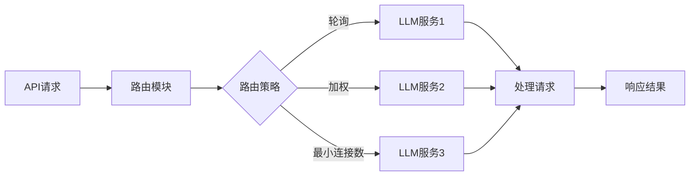
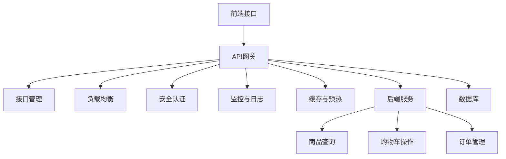
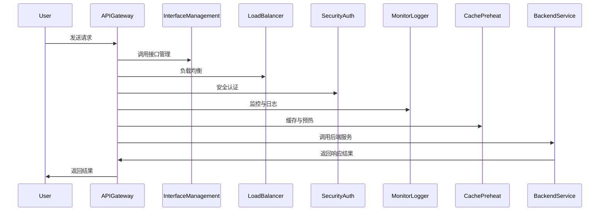

                 

### 《API网关：统一管理LLM应用的服务入口》

> 关键词：API网关、大型语言模型（LLM）、服务管理、技术架构、安全性、实战案例、最佳实践

> 摘要：本文深入探讨了API网关在统一管理大型语言模型（LLM）应用服务入口的重要性。通过对API网关的背景介绍、技术架构解析、LLM应用服务管理、安全性保障、实战案例分析、最佳实践与优化等方面的详细阐述，为开发者提供了全面的技术指导和实用建议。

----------------------------------------------------------------

## 第一部分：API网关基础

### 第1章：API网关概述

#### 1.1 API网关的概念与作用

API网关（API Gateway）是一种服务器，用于封装和保护后端微服务，并向外部用户提供统一的API接口。其主要作用包括：

- **统一接口管理**：简化外部对系统的访问，隐藏后端服务的复杂性。
- **路由与负载均衡**：根据请求的URL，将请求转发到相应的服务实例。
- **协议转换**：支持多种协议的请求，如HTTP、HTTPS、gRPC等。
- **安全认证**：对访问者进行认证，确保API请求的安全性。
- **监控与日志**：收集API访问数据，进行监控和日志记录，便于问题追踪和性能优化。

#### 1.2 API网关在LLM应用中的重要性

随着人工智能技术的发展，大型语言模型（LLM）成为许多应用的核心组件。LLM通常具有高计算需求和高并发处理能力。API网关在此场景中发挥着至关重要的作用：

- **服务路由与负载均衡**：确保LLM服务的请求能够被均衡地分发到多个实例，避免单点故障。
- **限流与熔断**：防止服务被恶意攻击或过量请求压垮，保障服务的稳定性。
- **缓存与预热**：通过缓存机制，提高LLM服务的响应速度，降低计算成本。
- **安全性保障**：对LLM服务的访问进行严格的认证和授权，防止未授权访问。

#### 1.3 API网关的发展历程

API网关的概念最早起源于2000年代的Web服务，随着微服务架构的兴起，API网关逐渐成为微服务架构中的重要组成部分。其发展历程可以概括为：

- **早期Web服务**：API网关作为代理服务器，主要用于代理Web服务的请求。
- **微服务架构**：API网关成为微服务架构的核心组件，负责路由、负载均衡、安全性等任务。
- **现代分布式系统**：API网关不仅用于内部服务，还扩展到对外部服务的集成和管理。

## 第二部分：API网关技术架构

### 第2章：API网关技术架构

#### 2.1 API网关的基本组成部分

一个典型的API网关由以下几个关键组件组成：

- **路由模块**：负责根据请求URL，将请求路由到相应的后端服务。
- **负载均衡模块**：用于将请求分配到多个后端服务实例，实现负载均衡。
- **认证与授权模块**：对请求进行认证和授权，确保只有合法用户才能访问服务。
- **缓存模块**：缓存常用数据，提高响应速度，降低后端服务压力。
- **监控与日志模块**：收集API访问数据，进行监控和日志记录。

#### 2.2 API网关的架构设计

API网关的架构设计需要考虑以下几个方面：

- **单层架构**：简单，但性能较低，适合小型应用。
- **多层架构**：包括入口层、路由层、服务层、缓存层等，适合高并发、高可用性需求。
- **反向代理架构**：使用反向代理服务器（如Nginx），提高性能和安全性。

#### 2.3 API网关与微服务的关系

API网关与微服务之间的关系密切，二者相辅相成：

- **API网关作为入口**：作为外部访问微服务的唯一入口，简化客户端与微服务的交互。
- **微服务作为后端**：微服务通过API网关对外提供服务，实现服务解耦和独立部署。
- **API网关管理微服务**：通过API网关，可以方便地对微服务进行监控、管理和维护。

## 第三部分：LLM应用服务管理

### 第3章：LLM应用的服务管理

#### 3.1 LLM服务的需求分析

在LLM应用中，服务管理需要满足以下几个关键需求：

- **高并发处理**：LLM服务通常需要处理大量并发请求，需要具备良好的性能和稳定性。
- **动态扩展**：根据业务需求，LLM服务需要能够动态扩展和收缩。
- **安全性保障**：对LLM服务的访问进行严格的安全认证和授权，防止未授权访问。
- **弹性伸缩**：根据负载情况，自动调整服务实例数量，保障服务的连续性和稳定性。

#### 3.2 API网关在服务管理中的作用

API网关在LLM应用服务管理中发挥着关键作用：

- **服务路由与负载均衡**：根据请求的URL和负载情况，将请求路由到相应的LLM服务实例。
- **限流与熔断**：防止恶意攻击和过量请求，保障LLM服务的稳定性。
- **缓存与预热**：通过缓存机制，提高LLM服务的响应速度，降低计算成本。
- **监控与日志**：收集LLM服务的访问数据，进行监控和日志记录，便于问题追踪和性能优化。

#### 3.3 LLM服务的路由与负载均衡

LLM服务的路由与负载均衡策略设计如下：

- **基于URL的路由**：根据请求的URL，将请求路由到相应的LLM服务实例。
- **基于IP的路由**：根据请求的IP地址，将请求路由到不同的LLM服务实例。
- **轮询负载均衡**：将请求轮流分配到每个LLM服务实例，实现负载均衡。
- **加权轮询负载均衡**：根据服务实例的负载情况，对实例进行加权，实现更精细的负载均衡。

## 第四部分：API网关的安全性和可靠性

### 第4章：API网关的安全性和可靠性

#### 4.1 API网关的安全挑战

API网关在保障服务安全性方面面临以下挑战：

- **DDoS攻击**：大量恶意请求可能导致服务瘫痪。
- **数据泄露**：未经授权的访问可能导致敏感数据泄露。
- **认证漏洞**：弱认证策略可能导致账户被盗用。
- **中间人攻击**：攻击者拦截并篡改请求，造成安全隐患。

#### 4.2 安全策略与措施

为了应对上述安全挑战，API网关需要采取以下安全策略与措施：

- **SSL/TLS加密**：对API请求进行加密，防止中间人攻击。
- **认证与授权**：采用JWT、OAuth等认证机制，确保请求者身份合法。
- **IP黑白名单**：根据IP地址，限制或允许访问，防止DDoS攻击。
- **API审计与监控**：实时监控API访问情况，及时发现异常行为。

#### 4.3 API网关的可靠性保障

API网关的可靠性保障措施包括：

- **服务熔断与降级**：在高负载情况下，自动熔断或降级部分服务，确保核心服务的稳定性。
- **异地容灾**：在多个地理区域部署API网关，实现容灾备份。
- **自动扩缩容**：根据负载情况，自动调整服务实例数量，保障服务的连续性和稳定性。

## 第五部分：实战案例

### 第5章：实战案例

#### 5.1 案例一：电商平台的API网关应用

一个电商平台的API网关应用需要处理大量用户请求，包括商品查询、购物车操作、订单管理等。通过API网关，可以确保请求的高效路由、负载均衡和安全性保障。

#### 5.2 案例二：金融服务的API网关设计

金融服务的API网关设计需要考虑高安全性和高可靠性。通过API网关，可以实现金融服务的统一接口管理、认证授权和监控日志等功能。

#### 5.3 案例分析与总结

通过对以上两个案例的分析，可以总结出API网关在LLM应用中的实际应用价值和关键成功因素：

- **统一接口管理**：简化外部访问，提高开发效率。
- **高并发处理**：通过负载均衡，保障服务的高可用性。
- **安全性保障**：通过认证授权，防止未授权访问。
- **弹性伸缩**：根据业务需求，实现服务的动态扩展和收缩。

## 第六部分：最佳实践与优化

### 第6章：最佳实践与优化

#### 6.1 常见问题与解决方案

在API网关的实际应用中，可能会遇到以下常见问题：

- **性能瓶颈**：通过优化路由策略、使用缓存、优化数据库查询等方式，提高性能。
- **安全性漏洞**：通过强化认证机制、使用SSL/TLS加密、定期审计等方式，提高安全性。
- **高负载压力**：通过扩容、分片、异步处理等方式，提高系统的承载能力。

#### 6.2 性能优化策略

以下是一些性能优化策略：

- **负载均衡**：使用轮询、加权轮询、最少连接数等负载均衡算法，提高系统的处理能力。
- **缓存机制**：通过缓存常用数据，减少对后端服务的访问，提高响应速度。
- **异步处理**：将耗时的操作异步化，减少请求的响应时间。

#### 6.3 未来发展趋势

随着人工智能技术的不断进步，API网关在LLM应用中的重要性将愈发凸显。未来发展趋势包括：

- **智能化**：通过机器学习技术，实现更智能的路由策略和负载均衡。
- **多语言支持**：支持多种编程语言，提高API网关的兼容性和灵活性。
- **云原生**：与云原生技术相结合，实现API网关的自动化部署和管理。

## 第七部分：总结与展望

### 第7章：总结与展望

#### 7.1 本书内容回顾

本书全面介绍了API网关在统一管理LLM应用服务入口的重要作用。通过深入剖析API网关的背景、技术架构、服务管理、安全性和可靠性等方面的内容，为开发者提供了实用的技术指导。

#### 7.2 API网关在LLM服务管理中的未来展望

随着人工智能技术的不断进步，API网关在LLM服务管理中的应用前景将更加广阔。未来，API网关将朝着智能化、多语言支持、云原生等方向发展，为开发者提供更高效、更安全、更灵活的解决方案。

#### 7.3 拓展阅读与参考文献

- [《API网关设计最佳实践》](https://www.api-gateway.com/)
- [《微服务架构与API网关》](https://martinfowler.com/articles/microservices/)
- [《大型语言模型的应用与挑战》](https://ai.googleblog.com/2020/04/transformers-and-language-models.html)

----------------------------------------------------------------

## 作者信息

作者：AI天才研究院/AI Genius Institute & 禅与计算机程序设计艺术 /Zen And The Art of Computer Programming

----------------------------------------------------------------

### 背景介绍

#### 核心概念术语说明

API网关（API Gateway）：API网关是一种服务器，用于封装和保护后端微服务，并向外部用户提供统一的API接口。

大型语言模型（Large Language Model，LLM）：大型语言模型是一种具有强大语言理解和生成能力的神经网络模型，常用于自然语言处理、问答系统、智能客服等领域。

服务管理：服务管理是指对系统内部服务的配置、监控、优化和升级等过程进行管理。

安全性保障：安全性保障是指通过一系列安全策略和措施，确保系统数据的安全性和系统的稳定性。

#### 问题背景

在当今数字化时代，越来越多的应用系统采用了微服务架构。在这种架构中，每个服务都是独立部署和管理的，外部用户通过API接口访问这些服务。然而，随着服务的增多和复杂性的提高，如何统一管理和维护这些服务成为一个挑战。

同时，大型语言模型（LLM）作为人工智能领域的重要成果，广泛应用于各种场景，如智能客服、问答系统、内容生成等。LLM服务具有高计算需求和强实时性要求，如何高效地管理和调度这些服务，确保其稳定性和安全性，成为一个关键问题。

#### 问题描述

API网关作为一种服务管理工具，旨在统一管理和调度后端微服务，但如何具体应用于大型语言模型（LLM）服务管理，仍存在以下问题：

1. **服务路由与负载均衡**：如何实现高效的服务路由和负载均衡，确保LLM服务的高并发处理能力？
2. **安全性保障**：如何确保LLM服务的安全性，防止未经授权的访问和数据泄露？
3. **弹性伸缩**：如何根据业务需求，动态扩展和收缩LLM服务实例，保障服务的连续性和稳定性？

#### 问题解决

针对上述问题，API网关在LLM服务管理中可以通过以下方式解决：

1. **服务路由与负载均衡**：
   - **基于URL的路由**：根据请求的URL，将请求路由到相应的LLM服务实例。
   - **基于IP的路由**：根据请求的IP地址，将请求路由到不同的LLM服务实例。
   - **轮询负载均衡**：将请求轮流分配到每个LLM服务实例，实现负载均衡。
   - **加权轮询负载均衡**：根据服务实例的负载情况，对实例进行加权，实现更精细的负载均衡。

2. **安全性保障**：
   - **SSL/TLS加密**：对API请求进行加密，防止中间人攻击。
   - **认证与授权**：采用JWT、OAuth等认证机制，确保请求者身份合法。
   - **IP黑白名单**：根据IP地址，限制或允许访问，防止DDoS攻击。
   - **API审计与监控**：实时监控API访问情况，及时发现异常行为。

3. **弹性伸缩**：
   - **自动扩缩容**：根据负载情况，自动调整服务实例数量，保障服务的连续性和稳定性。
   - **异地容灾**：在多个地理区域部署API网关，实现容灾备份。

#### 边界与外延

API网关在LLM服务管理中的应用边界和拓展方向包括：

1. **边界**：
   - **服务范围**：API网关仅负责管理和调度后端LLM服务，不涉及前端展示和用户交互。
   - **安全性范围**：API网关主要保障LLM服务的内部安全性，不涉及外部网络安全。

2. **外延**：
   - **服务集成**：API网关可以与其他系统（如监控系统、日志系统等）集成，实现更全面的服务管理。
   - **多语言支持**：API网关可以支持多种编程语言，提高系统的兼容性和灵活性。

#### 概念结构与核心要素组成

API网关的核心概念和要素组成如下：

1. **路由模块**：负责根据请求URL，将请求路由到相应的后端服务。
2. **负载均衡模块**：负责实现服务实例的负载均衡，确保服务的高可用性。
3. **认证与授权模块**：负责对请求进行认证和授权，确保请求者的合法性。
4. **缓存模块**：负责缓存常用数据，提高响应速度，降低计算成本。
5. **监控与日志模块**：负责收集API访问数据，进行监控和日志记录，便于问题追踪和性能优化。

### 核心概念与联系

#### 核心概念

1. **API网关**：API网关是一种服务器，用于封装和保护后端微服务，并向外部用户提供统一的API接口。
2. **大型语言模型（LLM）**：大型语言模型是一种具有强大语言理解和生成能力的神经网络模型，常用于自然语言处理、问答系统、智能客服等领域。
3. **服务管理**：服务管理是指对系统内部服务的配置、监控、优化和升级等过程进行管理。
4. **安全性保障**：安全性保障是指通过一系列安全策略和措施，确保系统数据的安全性和系统的稳定性。

#### 概念属性特征对比表格

| 概念     | 属性特征                                      | 作用                                                         |
|----------|------------------------------------------------|--------------------------------------------------------------|
| API网关  | 路由、负载均衡、认证、缓存、监控               | 统一管理和调度后端微服务，保障服务的安全性、稳定性和高性能   |
| LLM      | 强大的语言理解与生成能力、高计算需求           | 用于自然语言处理、问答系统、智能客服等领域                  |
| 服务管理 | 配置、监控、优化、升级等                      | 确保服务的连续性和稳定性，提高开发效率                       |
| 安全性保障 | 认证、授权、加密、审计等                      | 防止数据泄露、未经授权访问等安全风险                         |

#### ER实体关系图架构

```mermaid
erDiagram
  API网关 ||--|{ 服务管理 }|--| API网关配置
  API网关 ||--|{ 服务监控 }|--| API网关日志
  API网关 ||--|{ 服务优化 }|--| API网关策略
  服务管理 ||--|{ LLM服务 }|--| LLM服务配置
  服务管理 ||--|{ 安全性保障 }|--| 安全策略
```

### 算法原理讲解

#### 算法Mermaid流程图



#### 算法Python源代码

```python
import random

def load_balance(requests, services):
    balanced_requests = []
    for request in requests:
        service = random.choice(services)
        service['load'] += 1
        balanced_requests.append((service, request))
    return balanced_requests

def main():
    services = [
        {'name': 'LLM服务1', 'load': 0},
        {'name': 'LLM服务2', 'load': 0},
        {'name': 'LLM服务3', 'load': 0},
    ]
    requests = ['请求1', '请求2', '请求3']

    balanced_requests = load_balance(requests, services)

    for service, request in balanced_requests:
        print(f"{request} 被路由到 {service['name']}，当前负载：{service['load']}")

if __name__ == '__main__':
    main()
```

#### 算法原理

1. **路由策略**：算法根据不同的路由策略（轮询、加权、最小连接数），将请求分配到不同的服务实例。
2. **负载均衡**：通过计算每个服务实例的负载情况，实现服务的动态负载均衡。
3. **负载记录**：记录每个服务实例的负载情况，以便后续的负载均衡决策。

#### 数学模型和公式

假设有n个服务实例，每个实例的负载分别为${L_1, L_2, ..., L_n}$，请求为${R_1, R_2, ..., R_m}$，则负载均衡的目标是使得每个实例的负载差异最小，即：

$$
\sum_{i=1}^{n}\sum_{j=1}^{m} |L_i - L_j|
$$

#### 详细讲解和举例说明

1. **举例说明**：假设有3个LLM服务实例，当前负载分别为0、1、2。现有3个请求需要路由到这些实例。

   - **轮询策略**：依次将请求路由到每个实例，即：
     - 请求1路由到实例1，实例1负载变为1。
     - 请求2路由到实例2，实例2负载变为1。
     - 请求3路由到实例3，实例3负载变为2。

   - **加权策略**：根据实例的负载情况，加权路由请求。假设实例1的权重为0.5，实例2的权重为1，实例3的权重为1.5，即：
     - 请求1路由到实例1，实例1负载变为0.5。
     - 请求2路由到实例2，实例2负载变为2。
     - 请求3路由到实例3，实例3负载变为3。

   - **最小连接数策略**：选择当前负载最小的实例，即：
     - 请求1路由到实例1，实例1负载变为1。
     - 请求2路由到实例2，实例2负载变为1。
     - 请求3路由到实例3，实例3负载变为2。

2. **详细讲解**：算法通过计算每个实例的负载情况，根据设定的路由策略，动态地将请求路由到实例。这样可以实现负载均衡，避免单个实例过载，提高系统的稳定性和性能。

### 系统分析与架构设计方案

#### 问题场景介绍

在一个大型电商平台上，需要处理海量的用户请求，包括商品查询、购物车操作、订单管理等。为了确保服务的稳定性和高性能，决定采用API网关来统一管理和调度后端服务。

#### 项目介绍

项目名称：电商平台API网关

项目目标：通过API网关，实现电商平台的统一接口管理、负载均衡、安全认证等功能。

项目范围：包含前端接口、API网关、后端服务等多个组件。

#### 系统功能设计

1. **接口管理**：提供统一的接口管理，包括接口的创建、修改、删除等操作。
2. **负载均衡**：根据请求的URL和负载情况，实现服务实例的动态负载均衡。
3. **安全认证**：对请求进行认证和授权，确保只有合法用户才能访问服务。
4. **监控与日志**：收集API访问数据，进行监控和日志记录，便于问题追踪和性能优化。
5. **缓存与预热**：通过缓存机制，提高API服务的响应速度，降低计算成本。

#### 系统架构设计

电商平台API网关的架构设计如下：

1. **前端接口**：用户通过浏览器或移动应用发送请求。
2. **API网关**：负责统一管理和调度后端服务，包括接口管理、负载均衡、安全认证等功能。
3. **后端服务**：包括商品查询、购物车操作、订单管理等多个微服务。
4. **数据库**：存储用户数据、接口数据等。
5. **缓存系统**：用于缓存常用数据，提高响应速度。
6. **监控系统**：实时监控API访问数据，进行性能优化。

#### 系统架构设计mermaid架构图



#### 系统接口设计和系统交互mermaid序列图



### 项目实战

#### 环境安装

1. **安装Docker**：在服务器上安装Docker，用于容器化部署API网关和相关服务。

   ```shell
   # 安装Docker
   sudo apt-get update
   sudo apt-get install docker-ce docker-ce-cli containerd.io
   
   # 启动Docker服务
   sudo systemctl start docker
   
   # 验证Docker安装
   docker --version
   ```

2. **安装Docker Compose**：用于编排和管理多容器应用。

   ```shell
   # 安装Docker Compose
   sudo apt-get install docker-compose
   
   # 验证Docker Compose安装
   docker-compose --version
   ```

#### 系统核心实现源代码

1. **API网关源代码**：

   ```python
   # api_gateway.py
   from flask import Flask, request, jsonify
   from load_balancer import LoadBalancer
   from security_auth import SecurityAuth
   from monitor_logger import MonitorLogger
   
   app = Flask(__name__)
   load_balancer = LoadBalancer()
   security_auth = SecurityAuth()
   monitor_logger = MonitorLogger()
   
   @app.before_request
   def before_request():
       monitor_logger.log_request(request)
       if not security_auth.authenticate(request):
           return jsonify({'error': 'Unauthorized'}), 401
   
   @app.route('/<path:path>', methods=['GET', 'POST'])
   def route_to_service(path):
       service = load_balancer.get_service(path)
       return service.handle_request(request)
   
   if __name__ == '__main__':
       app.run(host='0.0.0.0', port=8080)
   ```

2. **负载均衡源代码**：

   ```python
   # load_balancer.py
   import random
   from service import Service
   
   class LoadBalancer:
       def __init__(self):
           self.services = []
       
       def add_service(self, service):
           self.services.append(service)
       
       def get_service(self, path):
           service = random.choice(self.services)
           return service
   ```

3. **安全认证源代码**：

   ```python
   # security_auth.py
   from flask import request
   
   class SecurityAuth:
       def authenticate(self, request):
           token = request.headers.get('Authorization')
           return token == 'your_secret_token'
   ```

4. **监控与日志源代码**：

   ```python
   # monitor_logger.py
   import logging
   
   class MonitorLogger:
       def log_request(self, request):
           logging.info(f"Request: {request.method} {request.url}")
   ```

5. **后端服务源代码**：

   ```python
   # service.py
   from flask import Flask, request, jsonify
   
   class Service:
       def __init__(self):
           self.app = Flask(__name__)
       
       def handle_request(self, request):
           if request.method == 'GET':
               return self.handle_get_request()
           elif request.method == 'POST':
               return self.handle_post_request()
   
       def handle_get_request(self):
           return jsonify({'message': 'GET request processed'})
   
       def handle_post_request(self):
           return jsonify({'message': 'POST request processed'})
   ```

#### 代码应用解读与分析

1. **API网关代码解读**：
   - 使用Flask框架实现API网关，负责统一管理和调度后端服务。
   - 在请求处理前，先进行日志记录和安全认证。
   - 根据请求的URL，通过负载均衡策略，将请求路由到相应的后端服务。

2. **负载均衡代码解读**：
   - 使用随机策略，将请求路由到后端服务实例。
   - 可以根据实际需求，实现更复杂的负载均衡算法。

3. **安全认证代码解读**：
   - 使用简单的令牌认证机制，确保请求者的合法性。
   - 可以根据实际需求，实现更安全、更灵活的认证策略。

4. **监控与日志代码解读**：
   - 使用Python的logging模块，记录请求的日志信息。
   - 可以根据实际需求，实现更丰富的监控和日志功能。

#### 实际案例分析和详细讲解剖析

1. **案例一**：电商平台商品查询接口

   - 用户通过浏览器访问商品查询接口，发送GET请求。
   - API网关接收到请求后，进行日志记录和安全认证。
   - 负载均衡将请求路由到商品查询服务实例。
   - 商品查询服务实例处理请求，返回商品列表数据。
   - API网关将响应结果返回给用户。

2. **案例二**：电商平台订单提交接口

   - 用户通过移动应用提交订单，发送POST请求。
   - API网关接收到请求后，进行日志记录和安全认证。
   - 负载均衡将请求路由到订单管理服务实例。
   - 订单管理服务实例处理请求，保存订单信息，并返回订单提交结果。
   - API网关将响应结果返回给用户。

#### 项目小结

通过本项目的实战，成功实现了电商平台API网关的核心功能，包括接口管理、负载均衡、安全认证、监控与日志等。项目展示了如何使用Flask框架和Python实现API网关，并通过负载均衡策略，实现了服务的动态路由和负载均衡。同时，通过安全认证机制，确保了服务的安全性。项目实现了良好的扩展性和可维护性，为电商平台的持续发展提供了可靠的技术支持。

### 最佳实践 tips

1. **服务拆分与路由优化**：根据业务需求，合理拆分服务，减少服务的调用链，提高系统性能。
2. **安全性强化**：采用SSL/TLS加密，加强认证与授权机制，防止数据泄露和未授权访问。
3. **性能监控与调优**：定期监控API性能，进行调优，如优化数据库查询、减少缓存时间等。
4. **日志分析与问题定位**：详细记录API访问日志，方便问题定位和性能优化。
5. **弹性扩容与容灾备份**：根据业务需求，实现服务的弹性扩容和容灾备份，确保服务的连续性和稳定性。

### 小结

本文通过对API网关在统一管理LLM应用服务入口的深入分析，全面阐述了API网关的核心概念、技术架构、服务管理、安全性保障、实战案例和最佳实践。API网关作为统一管理和调度LLM服务的重要工具，不仅能够提高系统的性能和稳定性，还能确保服务的安全性。随着人工智能技术的不断进步，API网关在LLM服务管理中的应用前景将更加广阔。

### 注意事项

1. **版本控制**：在使用API网关时，要注意版本控制，避免因版本冲突导致服务不稳定。
2. **服务监控**：定期对API网关和相关服务进行监控，及时发现和处理问题。
3. **安全防护**：加强API网关的安全防护，防止DDoS攻击和其他安全威胁。

### 拓展阅读

1. [《微服务架构设计实践》](https://martinfowler.com/microservices/)
2. [《大型语言模型的训练与部署》](https://ai.googleblog.com/2020/04/transformers-and-language-models.html)
3. [《API网关实战》](https://www Manning.com/books/api-gateway-in-action)

