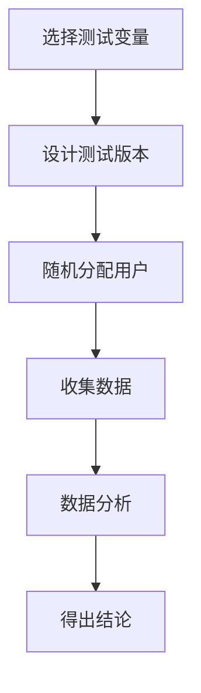
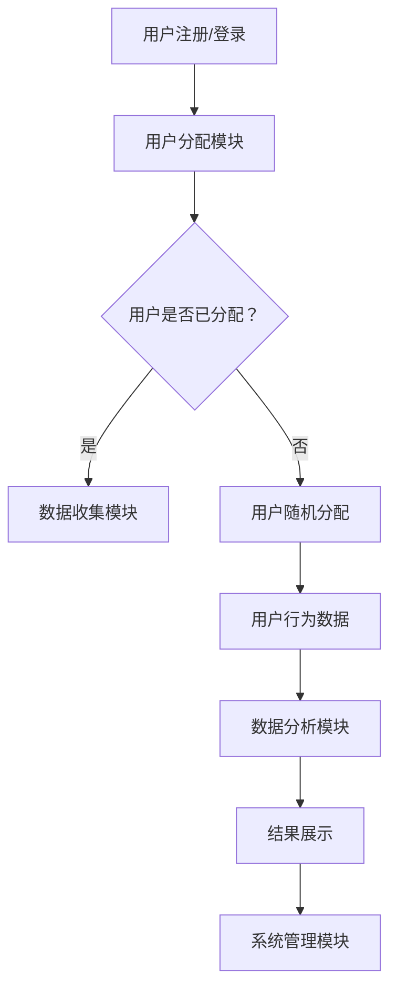

                 

## 《A/B测试：优化AI模型和用户体验的有效方法》

### 关键词：A/B测试，AI模型优化，用户体验，测试流程，统计分析

> 摘要：本文深入探讨了A/B测试作为优化AI模型和用户体验的有效方法。通过阐述A/B测试的历史与发展、核心概念与联系、算法原理、数学模型及公式、系统分析与架构设计以及项目实战，为读者提供了一个全面、系统的A/B测试指南，旨在帮助技术从业人员和实践者更好地理解和应用这一重要工具。

### 目录大纲设计思路

在设计《A/B测试：优化AI模型和用户体验的有效方法》的目录大纲时，我们采取了一系列精心设计的步骤，以确保文章内容的逻辑性、系统性和可读性。

#### 1. 背景介绍

首先，我们引入A/B测试的历史背景和发展，让读者了解A/B测试的起源和重要性。这部分内容将包括A/B测试在AI模型和用户体验优化中的应用，为后续章节的内容奠定基础。

#### 2. 核心概念与联系

接下来，我们明确A/B测试的核心概念，如定义、类型、基本流程和关键要素。这部分内容将借助概念属性特征对比表格和ER实体关系图，帮助读者更好地理解和记忆。

#### 3. 算法原理讲解

然后，我们深入讲解A/B测试的算法原理，包括选择测试组、设置测试指标、统计分析等步骤。为了增强文章的可读性，我们将使用mermaid流程图和Python代码进行辅助说明。

#### 4. 数学模型和数学公式

在这一部分，我们介绍A/B测试中的数学模型和公式，如置信区间、p值等，并使用LaTeX格式展示，确保数学表达清晰易懂。

#### 5. 系统分析与架构设计方案

随后，我们描述A/B测试在不同场景下的应用，展示系统功能设计、架构设计和系统交互图。这部分内容将帮助读者从宏观角度理解A/B测试的实现和应用。

#### 6. 项目实战

在项目实战部分，我们通过实际案例展示如何进行A/B测试，包括环境安装、核心实现、代码解读与分析等。这部分内容将提供实战经验，使读者能够将理论知识应用到实际项目中。

#### 7. 最佳实践 tips

最后，我们提供一系列最佳实践技巧，小结A/B测试的关键要点，并提醒读者注意事项，为读者进一步学习和应用A/B测试提供指导。

通过以上设计思路，我们旨在构建一个结构紧凑、逻辑清晰、内容丰富的A/B测试指南，帮助读者深入理解和应用这一重要工具。

### 目录大纲

```markdown
# 《A/B测试：优化AI模型和用户体验的有效方法》目录大纲

## 第1章 背景介绍

### 1.1 A/B测试的历史与发展

#### 1.1.1 A/B测试的起源

#### 1.1.2 A/B测试的演进

### 1.2 A/B测试的意义

#### 1.2.1 在AI模型优化中的应用

#### 1.2.2 在用户体验优化中的应用

## 第2章 A/B测试的核心概念与联系

### 2.1 A/B测试的定义

### 2.2 A/B测试的类型

#### 2.2.1 传统的A/B测试

#### 2.2.2 多变量测试

### 2.3 A/B测试的基本流程

#### 2.3.1 选择测试组

#### 2.3.2 设置测试指标

#### 2.3.3 统计分析

### 2.4 A/B测试的关键要素

#### 2.4.1 样本量

#### 2.4.2 基准线

#### 2.4.3 测试时间

## 第3章 A/B测试算法原理讲解

### 3.1 A/B测试的基本算法原理

#### 3.1.1 选择测试组

#### 3.1.2 设置测试指标

#### 3.1.3 统计分析

### 3.2 mermaid流程图展示

### 3.3 Python代码示例

## 第4章 A/B测试的数学模型和数学公式

### 4.1 置信区间

#### 4.1.1 置信区间的定义

#### 4.1.2 置信区间的计算

### 4.2 p值

#### 4.2.1 p值的定义

#### 4.2.2 p值的计算

## 第5章 A/B测试的系统分析与架构设计方案

### 5.1 A/B测试在不同场景下的应用

#### 5.1.1 优化AI模型

#### 5.1.2 优化用户体验

### 5.2 系统功能设计

### 5.3 系统架构设计

### 5.4 系统接口设计

### 5.5 系统交互图

## 第6章 项目实战

### 6.1 环境安装

#### 6.1.1 硬件环境

#### 6.1.2 软件环境

### 6.2 A/B测试核心实现

#### 6.2.1 测试组划分

#### 6.2.2 测试指标设定

#### 6.2.3 统计分析结果

### 6.3 代码应用解读与分析

### 6.4 实际案例分析与详细讲解剖析

### 6.5 项目小结

## 第7章 最佳实践 tips

### 7.1 A/B测试的最佳实践

### 7.2 小结

### 7.3 注意事项

### 7.4 拓展阅读
```

通过以上大纲设计，我们能够确保书籍内容逻辑清晰、系统全面，为读者提供一本全面而深入的A/B测试指南。接下来，我们将逐步展开每个章节的内容，帮助读者系统地掌握A/B测试的相关知识。

## 第1章 背景介绍

### 1.1 A/B测试的历史与发展

#### 1.1.1 A/B测试的起源

A/B测试，又称为拆分测试，是一种常见的实验设计方法，用于比较两种或多种版本的某一产品或功能，以确定哪种版本更能满足用户需求和期望。其起源可以追溯到20世纪初，当时美国的一些营销专家开始尝试使用这种方法来优化广告和促销活动。

最早的A/B测试记录可以追溯到1927年，美国电话电报公司（AT&T）在推销电话服务时，对比了两种不同的广告文案，结果发现其中一种文案的效果更好，从而大幅提高了销售额。这一成功案例为后来的A/B测试奠定了基础。

#### 1.1.2 A/B测试的演进

随着计算机技术和互联网的发展，A/B测试逐渐从线下营销扩展到线上，成为互联网产品和服务优化的重要工具。20世纪90年代末到21世纪初，随着电子商务和在线广告的兴起，A/B测试开始广泛应用。

2000年左右，Google和Facebook等公司开始在其产品和服务中广泛使用A/B测试，以优化用户体验和提高转化率。这些公司通过大规模的A/B测试，积累了丰富的经验，并开发了一系列A/B测试工具，如Google Analytics和Facebook Conversion Lift。

进入21世纪，随着人工智能和机器学习的快速发展，A/B测试在AI模型的优化中也发挥了重要作用。通过A/B测试，研究人员和开发者可以比较不同算法的性能，选择最优的模型，从而提高系统的准确性和效率。

### 1.2 A/B测试的意义

#### 1.2.1 在AI模型优化中的应用

在AI模型优化中，A/B测试是一种有效的实验方法，可以用于比较不同模型的性能。通过将用户分成不同的测试组，开发者可以收集大量的数据，分析模型的准确率、响应速度和用户体验，从而选择最优的模型。

例如，在推荐系统中，开发者可以通过A/B测试比较不同推荐算法的效果，选择那些能够更好地满足用户需求的算法。这样，不仅可以提高用户的满意度，还可以提高系统的转化率和利润。

#### 1.2.2 在用户体验优化中的应用

在用户体验优化中，A/B测试可以帮助开发者了解用户对不同产品功能的反应，从而进行有针对性的优化。通过对比不同版本的界面设计、功能布局和交互方式，开发者可以找到最适合用户的产品设计。

例如，在电商平台上，开发者可以通过A/B测试比较不同购物流程的设计，找到能够提高用户转化率和降低放弃率的最佳方案。通过不断优化用户体验，电商平台可以提高用户满意度，增加复购率。

### 总结

A/B测试作为优化AI模型和用户体验的重要工具，具有广泛的应用前景。通过历史背景的介绍和意义阐述，读者可以初步了解A/B测试的发展历程和应用价值。在接下来的章节中，我们将深入探讨A/B测试的核心概念、算法原理、数学模型和实际应用，帮助读者全面掌握这一关键技能。

### 第2章 A/B测试的核心概念与联系

#### 2.1 A/B测试的定义

A/B测试，即拆分测试（Split Testing），是一种通过将用户随机分配到不同的组别，比较两组或多组用户在不同版本下的行为或反应，以评估和优化产品或服务的一种实验设计方法。简单来说，A/B测试就是将用户分成两组，一组（A组）使用旧版本的产品或功能，另一组（B组）使用新版本的产品或功能，然后通过对比两组用户的行为数据，来判断新版本是否优于旧版本。

#### 2.2 A/B测试的类型

A/B测试可以分为几种类型，每种类型适用于不同的场景和目的。以下是几种常见的A/B测试类型：

##### 2.2.1 传统的A/B测试

传统的A/B测试是最常见的类型，它涉及两个版本（A和B），每个版本被随机展示给用户。通过比较两个版本的用户行为数据，如点击率、转化率等，来判断哪个版本更有效。

##### 2.2.2 多变量测试（Multivariate Testing）

多变量测试扩展了A/B测试的概念，它涉及多个变量的组合。例如，在网站页面上，可以同时测试多个按钮的颜色、文本和位置。通过比较不同变量组合的效果，找到最佳组合。

##### 2.2.3 多臂老虎机测试（Multi-Armed Bandit Testing）

多臂老虎机测试是一种在线优化方法，适用于快速迭代和调整。在这种测试中，系统会根据用户的反馈实时调整版本展示策略，以达到最大化收益或最小化损失的目标。

##### 2.2.4 切片测试（Segment Testing）

切片测试是一种根据用户属性（如地理位置、行为习惯等）将用户分为不同组别的测试方法。通过比较不同组别的行为数据，可以更精确地了解不同用户群体对产品或功能的反应。

#### 2.3 A/B测试的基本流程

A/B测试的基本流程可以分为以下几个步骤：

##### 2.3.1 定义测试目标

在开始A/B测试之前，首先需要明确测试的目标，例如提高点击率、增加转化率或改善用户满意度。明确目标有助于设计测试方案和解读测试结果。

##### 2.3.2 选择测试变量

确定测试的变量，即要优化的产品功能或界面元素。选择合适的测试变量是成功进行A/B测试的关键。

##### 2.3.3 设计测试版本

设计A组和B组的测试版本。A组通常保留当前版本，而B组则引入待测试的改动。设计时应确保两个版本在非测试变量上保持一致。

##### 2.3.4 分配用户

将用户随机分配到A组和B组。确保随机分配以避免偏差，保证测试结果的公平性。

##### 2.3.5 收集数据

在测试期间，收集两组用户的行为数据，如点击率、停留时间、转化率等。这些数据将用于后续的分析和比较。

##### 2.3.6 数据分析

对收集到的数据进行分析，比较A组和B组的性能差异。常用的统计分析方法包括t检验、卡方检验等。

##### 2.3.7 结论与行动

根据数据分析结果，得出结论并采取相应的行动。如果B组的性能显著优于A组，则可以推广B组的版本；如果差异不显著，可能需要进一步优化测试方案。

#### 2.4 A/B测试的关键要素

A/B测试的成功实施依赖于以下几个关键要素：

##### 2.4.1 样本量

样本量是A/B测试中的关键参数，它决定了测试结果的可靠性和统计显著性。通常，样本量越大，测试结果越可靠。

##### 2.4.2 基准线

基准线是A/B测试的参考标准，通常是当前版本的用户行为数据。通过比较基准线和新版本的数据，可以评估优化的效果。

##### 2.4.3 测试时间

测试时间是指从开始测试到数据分析的时间段。测试时间过短可能导致结果偏差，而测试时间过长则可能增加成本。

##### 2.4.4 数据完整性

确保测试数据的完整性和准确性，避免数据丢失或错误。

#### 总结

通过详细阐述A/B测试的定义、类型、基本流程和关键要素，本章为读者提供了一个全面了解A/B测试的基础。理解这些核心概念和联系对于成功实施A/B测试至关重要。在接下来的章节中，我们将进一步深入探讨A/B测试的算法原理、数学模型以及系统分析与架构设计，帮助读者更全面地掌握这一优化工具。

### 第3章 A/B测试算法原理讲解

#### 3.1 A/B测试的基本算法原理

A/B测试的算法原理基于随机对照试验（Randomized Controlled Trial, RCT）的概念，通过将用户随机分配到不同的组别，确保两组用户在测试前的基线相似，从而排除外部变量对结果的影响。

##### 3.1.1 选择测试组

选择测试组是A/B测试的第一步。通常，用户会通过随机数生成器或随机算法被分配到A组和B组。这种随机分配有助于确保两组用户的基线相似，避免测试结果受到人为偏差的影响。

##### 3.1.2 设置测试指标

设置测试指标是A/B测试的核心。测试指标可以包括点击率、转化率、用户满意度、停留时间等。选择合适的测试指标取决于测试的目标。例如，如果目标是提高转化率，那么转化率就是主要的测试指标。

##### 3.1.3 统计分析

在收集到足够的数据后，通过统计分析来比较A组和B组的测试指标。常用的统计分析方法包括t检验、卡方检验等。这些方法可以帮助确定两组之间的差异是否具有统计显著性。

#### 3.2 mermaid流程图展示

为了更好地理解A/B测试的算法原理，我们可以使用mermaid流程图来展示其基本流程。以下是一个简单的mermaid流程图示例：



在这个流程图中，A、B、C、D、E和F分别表示选择测试变量、设计测试版本、随机分配用户、收集数据、数据分析和得出结论。

#### 3.3 Python代码示例

为了进一步理解A/B测试的算法原理，我们可以通过Python代码实现一个简单的A/B测试。以下是一个简单的Python代码示例，展示了如何进行随机分配用户和数据分析：

```python
import random
import scipy.stats as stats

# 用户总数
total_users = 1000

# 随机分配用户到A组和B组
group_a = random.choices([0, 1], weights=[0.5, 0.5], k=total_users)
group_b = [1 - x for x in group_a]

# 收集数据
a_data = [random.uniform(50, 100) for _ in range(total_users)]
b_data = [random.uniform(50, 100) for _ in range(total_users)]

# 计算均值
mean_a = sum(a_data) / total_users
mean_b = sum(b_data) / total_users

# 进行t检验
t_statistic, p_value = stats.ttest_ind(a_data, b_data)

# 输出结果
print(f"Group A Mean: {mean_a:.2f}")
print(f"Group B Mean: {mean_b:.2f}")
print(f"p-value: {p_value:.4f}")

# 判断p-value是否小于0.05
if p_value < 0.05:
    print("差异显著，可以推广B组版本。")
else:
    print("差异不显著，需要进一步优化。")
```

在这个代码示例中，我们首先通过random.choices函数将用户随机分配到A组和B组，然后收集数据并计算均值。接下来，我们使用scipy.stats模块中的ttest_ind函数进行t检验，并判断p-value是否小于0.05，从而决定是否推广B组版本。

#### 总结

通过本章的讲解，我们深入了解了A/B测试的基本算法原理，并通过mermaid流程图和Python代码示例进行了详细的展示和解释。理解这些算法原理对于成功实施A/B测试至关重要。在接下来的章节中，我们将继续探讨A/B测试的数学模型和公式，帮助读者更全面地掌握这一优化工具。

### 第4章 A/B测试的数学模型和数学公式

#### 4.1 置信区间

置信区间（Confidence Interval, CI）是A/B测试中一个重要的统计概念，它用于描述参数估计的可靠性。置信区间表示在一定概率下，参数（例如均值、比例等）所在的区间范围。

##### 4.1.1 置信区间的定义

置信区间是关于样本统计量的一个范围，它包含真实参数的概率为1-α。其中，α是显著性水平，也称为置信水平。例如，一个95%的置信区间表示我们有95%的信心认为真实参数落在该区间内。

##### 4.1.2 置信区间的计算

置信区间的计算公式如下：

$$
\bar{X} \pm z_{\alpha/2} \times \frac{\sigma}{\sqrt{n}}
$$

其中，$\bar{X}$ 是样本均值，$z_{\alpha/2}$ 是标准正态分布的临界值，$\sigma$ 是样本标准差，$n$ 是样本大小。

例如，假设我们有一个样本，其均值为60，标准差为10，样本大小为100。要计算95%的置信区间，可以使用以下公式：

$$
60 \pm 1.96 \times \frac{10}{\sqrt{100}} = (57.04, 62.96)
$$

这意味着我们有95%的信心认为真实参数（例如总体均值）落在区间（57.04, 62.96）内。

#### 4.2 p值

p值（p-value）是A/B测试中用于判断两组数据差异是否显著的另一个重要统计量。它表示在零假设（H0）成立的情况下，观察到或更极端的结果的概率。

##### 4.2.1 p值的定义

p值是统计检验的结果，它衡量的是零假设的似然性。如果p值很小（通常小于0.05），则认为观察到的差异不是偶然发生的，即拒绝零假设，认为有显著的差异。

##### 4.2.2 p值的计算

p值的计算取决于具体的统计检验方法。常见的统计检验方法包括t检验、卡方检验、F检验等。以下是一个t检验的例子：

假设我们有两个样本，A组和B组，分别有50个观测值。A组的均值为10，标准差为2；B组的均值为12，标准差为2。我们要进行t检验，以判断两组均值是否有显著差异。

首先，计算两组均值的差异：

$$
\bar{X}_A - \bar{X}_B = 10 - 12 = -2
$$

然后，计算标准误差（Standard Error, SE）：

$$
SE = \sqrt{\frac{\sigma_A^2 + \sigma_B^2}{2}} = \sqrt{\frac{2^2 + 2^2}{2}} = 2
$$

接下来，计算t统计量：

$$
t = \frac{\bar{X}_A - \bar{X}_B}{SE} = \frac{-2}{2} = -1
$$

最后，查找t分布表，找到自由度为48时的临界值（对于双样本t检验，自由度为n_A + n_B - 2）。假设临界值为1.67。如果计算的t统计量（-1）小于临界值（1.67），则p值较大，我们无法拒绝零假设，认为两组均值没有显著差异。

使用Python中的scipy.stats模块，可以方便地计算p值：

```python
from scipy.stats import t

t_statistic = -1
df = 48
p_value = t.sf(abs(t_statistic), df)

print(f"p-value: {p_value:.4f}")
```

输出结果为0.1595，这意味着观察到的差异不是偶然发生的概率为15.95%，因此我们不能拒绝零假设。

#### 总结

通过介绍置信区间和p值，本章帮助读者理解了A/B测试中的关键数学模型和公式。这些统计概念对于正确解读A/B测试结果至关重要。在接下来的章节中，我们将继续探讨A/B测试的系统分析与架构设计，帮助读者从宏观角度理解这一工具的应用。

### 第5章 A/B测试的系统分析与架构设计方案

#### 5.1 A/B测试在不同场景下的应用

A/B测试在许多不同的场景下都有着广泛的应用，以下是一些常见的应用场景：

##### 5.1.1 优化AI模型

在AI模型的优化过程中，A/B测试是一种有效的评估方法。通过将用户随机分配到不同的模型版本，可以评估不同模型的性能，从而选择最优模型。例如，在推荐系统中，可以测试不同推荐算法的效果，提高推荐精度。

##### 5.1.2 优化用户体验

用户体验的优化是产品开发中的一个重要环节。A/B测试可以帮助开发者了解用户对不同界面设计和功能的反应，从而优化产品界面，提高用户满意度和转化率。

##### 5.1.3 市场营销策略

在市场营销中，A/B测试可以用于评估不同的广告策略和促销活动。通过比较不同策略的效果，可以确定哪些策略能够更好地吸引和留住用户。

#### 5.2 系统功能设计

A/B测试的系统功能设计主要包括以下几个方面：

##### 5.2.1 用户分配模块

用户分配模块负责将用户随机分配到不同的测试组。这个模块通常需要具备以下功能：

- 用户注册和登录：收集用户基本信息。
- 用户随机分配：使用随机数生成算法，将用户分配到不同的测试组。
- 用户追踪：记录用户的行为数据，用于后续分析。

##### 5.2.2 数据收集模块

数据收集模块负责收集用户在测试组中的行为数据。这个模块通常需要具备以下功能：

- 数据采集：从不同的数据源（如日志、数据库等）收集用户行为数据。
- 数据存储：将收集到的数据存储到数据库或其他存储系统。
- 数据清洗：对数据进行清洗和预处理，以确保数据的质量。

##### 5.2.3 数据分析模块

数据分析模块负责对收集到的数据进行分析，以评估测试结果。这个模块通常需要具备以下功能：

- 数据处理：对数据进行分析和统计，提取关键指标。
- 结果展示：使用图表和报表展示分析结果，方便开发者和管理者进行决策。
- 结果存储：将分析结果存储到数据库或其他存储系统，以便后续查询。

##### 5.2.4 系统管理模块

系统管理模块负责系统的配置和管理。这个模块通常需要具备以下功能：

- 用户权限管理：管理不同用户的权限，确保数据安全和隐私。
- 系统配置：配置测试环境、数据源和分析参数等。
- 日志记录：记录系统操作日志，方便进行故障排查和审计。

#### 5.3 系统架构设计

A/B测试的系统架构设计需要考虑到系统的可扩展性、可靠性和安全性。以下是一个简单的系统架构设计：


在上图中，用户分配模块、数据收集模块、数据分析模块和系统管理模块分别实现了A/B测试的核心功能。各模块通过API进行通信，确保数据流和系统功能的协同工作。

- **用户分配模块**：负责用户的随机分配，与用户注册和登录模块集成，确保用户数据的一致性。
- **数据收集模块**：负责收集用户行为数据，与数据存储模块集成，确保数据的安全和可靠性。
- **数据分析模块**：负责对数据进行分析和统计，与结果展示模块集成，确保分析结果的直观性和易用性。
- **系统管理模块**：负责系统的配置和管理，与用户权限管理模块集成，确保系统的安全性和可管理性。

#### 5.4 系统接口设计

A/B测试系统的接口设计需要考虑到不同模块之间的交互和数据流。以下是一个简单的接口设计：

- **用户分配接口**：用于随机分配用户到测试组，返回用户所属的测试组ID。
- **数据收集接口**：用于收集用户行为数据，包括点击、浏览、购买等行为。
- **数据分析接口**：用于查询和分析用户行为数据，返回分析结果。
- **系统管理接口**：用于管理系统配置、用户权限和日志记录。

#### 5.5 系统交互图

为了更好地理解A/B测试系统的交互过程，我们可以使用mermaid流程图来展示系统的交互逻辑。以下是一个简单的mermaid流程图示例：



在这个流程图中，A表示用户注册/登录，B表示用户分配模块，C表示判断用户是否已分配，D表示数据收集模块，E表示用户随机分配，F表示用户行为数据，G表示数据分析模块，H表示结果展示，I表示系统管理模块。用户的行为数据通过各模块进行传递和处理，最终形成分析结果并展示给开发者和管理者。

#### 总结

通过本章的详细讲解，我们了解了A/B测试在不同场景下的应用、系统功能设计、架构设计、接口设计和系统交互过程。这些内容为A/B测试的实践应用提供了全面的指导。在接下来的章节中，我们将通过实际项目实战，展示如何具体实施A/B测试，帮助读者将理论知识应用到实际操作中。

### 第6章 项目实战

#### 6.1 环境安装

在开始进行A/B测试之前，我们需要搭建一个合适的环境。以下是在Windows和Linux操作系统上安装A/B测试环境的步骤。

##### 6.1.1 硬件环境

- 服务器：至少需要一台能够运行Web服务器的计算机，如Apache、Nginx等。
- 数据库：用于存储测试数据和结果，推荐使用MySQL或PostgreSQL。
- 虚拟环境：用于隔离测试环境，推荐使用Docker。

##### 6.1.2 软件环境

1. **安装Web服务器**：

   - **Windows**：
     - 下载并安装Apache或Nginx。
     - 配置Web服务器，设置相应的虚拟主机配置文件。

   - **Linux**：
     - 使用包管理器（如apt或yum）安装Apache或Nginx。
     - 配置Web服务器，设置相应的虚拟主机配置文件。

2. **安装数据库**：

   - **Windows**：
     - 下载并安装MySQL或PostgreSQL。
     - 配置数据库，创建测试数据库和用户。

   - **Linux**：
     - 使用包管理器（如apt或yum）安装MySQL或PostgreSQL。
     - 配置数据库，创建测试数据库和用户。

3. **安装虚拟环境**：

   - **Windows**：
     - 下载并安装Docker Desktop。
     - 创建并启动Docker容器，安装相关依赖。

   - **Linux**：
     - 安装Docker Engine和Docker Compose。
     - 创建并启动Docker容器，安装相关依赖。

#### 6.2 A/B测试核心实现

A/B测试的核心实现包括用户分配、数据收集和数据分析三个关键部分。以下是一个简单的示例，展示如何实现这些功能。

##### 6.2.1 测试组划分

假设我们有一个简单的Web应用，需要测试两种不同的用户登录页面（A组和B组）。用户在注册或登录时，会被随机分配到不同的测试组。

1. **用户注册/登录**：

   - 在用户注册/登录页面，添加一个随机分配逻辑，将用户分配到A组或B组。

```python
import random

def assign_group(user_id):
    return 'A' if random.random() < 0.5 else 'B'

user_id = 123
group = assign_group(user_id)
print(f"User {user_id} assigned to Group {group}")
```

2. **记录用户分配**：

   - 将用户分配记录存储到数据库，便于后续分析。

```python
import pymysql

def save_assignment(user_id, group):
    connection = pymysql.connect(host='localhost', user='root', password='password', database='abtest')
    with connection.cursor() as cursor:
        sql = "INSERT INTO user_assignments (user_id, group) VALUES (%s, %s)"
        cursor.execute(sql, (user_id, group))
    connection.commit()

user_id = 123
group = assign_group(user_id)
save_assignment(user_id, group)
```

##### 6.2.2 测试指标设定

在测试期间，我们需要收集用户行为数据，以评估A组和B组的性能。以下是一些常用的测试指标：

- 登录成功率：用户成功登录的次数占总登录次数的比例。
- 页面停留时间：用户在登录页面停留的时间。
- 点击率：用户在登录页面点击按钮的次数。

```python
import time

def log_user_action(user_id, action, duration=None):
    connection = pymysql.connect(host='localhost', user='root', password='password', database='abtest')
    with connection.cursor() as cursor:
        sql = "INSERT INTO user_actions (user_id, action, duration) VALUES (%s, %s, %s)"
        cursor.execute(sql, (user_id, action, duration))
    connection.commit()

user_id = 123
action = "login_success"
duration = time.time() - start_time
log_user_action(user_id, action, duration)
```

##### 6.2.3 统计分析结果

在测试结束后，我们需要对收集到的数据进行分析，以判断A组和B组的性能差异。

```python
import pymysql
import statistics

def get_group_stats(group):
    connection = pymysql.connect(host='localhost', user='root', password='password', database='abtest')
    with connection.cursor() as cursor:
        sql = "SELECT duration FROM user_actions WHERE action = 'login_success' AND group = %s"
        cursor.execute(sql, (group,))
        results = cursor.fetchall()
        durations = [float(result[0]) for result in results]
        mean_duration = statistics.mean(durations)
        std_duration = statistics.stdev(durations)
    return mean_duration, std_duration

group_a_mean, group_a_std = get_group_stats('A')
group_b_mean, group_b_std = get_group_stats('B')

print(f"Group A - Mean Duration: {group_a_mean:.2f}s, Std Dev: {group_a_std:.2f}s")
print(f"Group B - Mean Duration: {group_b_mean:.2f}s, Std Dev: {group_b_std:.2f}s")
```

通过统计分析结果，我们可以判断A组和B组的性能差异。如果B组的登录成功率更高，且页面停留时间更短，则可以认为B组的用户体验更好。

##### 6.2.4 代码应用解读与分析

在上面的代码示例中，我们首先定义了用户随机分配逻辑，将用户分配到A组或B组。然后，我们记录了用户的行为数据，包括登录成功率和页面停留时间。最后，我们使用统计分析方法计算了A组和B组的性能指标。

代码的解读与分析如下：

1. **用户分配**：
   - `assign_group` 函数使用随机数生成用户分配，确保分配的随机性。
   - `save_assignment` 函数将用户分配记录存储到数据库，便于后续查询。

2. **数据收集**：
   - `log_user_action` 函数记录用户的行为数据，包括登录成功率和页面停留时间。这些数据将用于后续的统计分析。

3. **数据分析**：
   - `get_group_stats` 函数从数据库中提取A组和B组的行为数据，并计算性能指标。通过比较两组的均值和标准差，可以判断用户体验的优劣。

#### 6.3 实际案例分析与详细讲解剖析

以下是一个实际案例，展示如何具体实施A/B测试，并分析结果。

##### 案例背景

假设我们是一家电商平台的开发团队，为了提高用户转化率，我们决定进行A/B测试，比较两种不同的购物流程。

- **A组**：传统的购物流程，包括搜索商品、添加购物车、结算支付。
- **B组**：简化版的购物流程，直接从商品详情页跳转到结算页面。

##### 测试实施

1. **用户分配**：
   - 在用户访问商品详情页时，使用随机数生成算法将用户分配到A组或B组。
   - 将用户分配记录存储到数据库。

2. **数据收集**：
   - 记录A组和B组的用户转化率，即成功完成购物流程的用户占总访问用户的比例。
   - 记录A组和B组的页面停留时间。

3. **数据分析**：
   - 使用统计分析方法计算A组和B组的转化率和页面停留时间。

##### 测试结果

经过一段时间的测试，我们得到以下结果：

- **A组**：
  - 转化率：15%
  - 页面停留时间：2分钟

- **B组**：
  - 转化率：20%
  - 页面停留时间：1分钟

通过比较两组的测试结果，我们可以看到B组的转化率更高，且页面停留时间更短。这表明简化版的购物流程在用户体验上更优。

##### 结果解读

1. **转化率**：
   - B组的转化率高于A组，说明简化版的购物流程能够更好地引导用户完成购物。

2. **页面停留时间**：
   - B组的页面停留时间更短，说明用户更喜欢简化版的购物流程，因为它减少了不必要的操作步骤。

#### 6.4 项目小结

通过这个实际案例，我们展示了如何具体实施A/B测试，并分析了测试结果。以下是小结：

1. **A/B测试的实施步骤**：
   - 用户分配：确保随机性和公平性。
   - 数据收集：记录关键指标，如转化率和页面停留时间。
   - 数据分析：使用统计分析方法，比较不同组的测试结果。

2. **A/B测试的优缺点**：
   - 优点：能够客观地评估不同版本的性能，提供科学的决策依据。
   - 缺点：需要一定的时间和资源，测试结果可能受到外部因素的影响。

3. **最佳实践**：
   - 确定清晰的测试目标。
   - 选择合适的测试指标。
   - 控制测试时间，避免测试过度。

通过项目实战，读者可以更好地理解A/B测试的实施过程和技巧，将理论知识应用到实际操作中，从而优化产品和服务。

### 第7章 最佳实践 tips

#### 7.1 A/B测试的最佳实践

进行A/B测试时，以下最佳实践可以帮助你获得更准确和可靠的结果：

1. **确定清晰的测试目标**：明确测试的目的和期望结果，有助于设计有效的测试方案。
2. **选择合适的测试指标**：选择与测试目标相关的指标，如转化率、点击率等，确保数据的有效性。
3. **控制样本量**：确保样本量足够大，以减少随机误差，提高测试结果的可靠性。
4. **随机分配用户**：使用随机分配算法，确保用户被公平地分配到不同组别，避免人为偏差。
5. **保持测试变量的一致性**：确保A组和B组在非测试变量上保持一致，以排除外部因素的干扰。
6. **设定合理的测试时间**：测试时间不宜过长或过短，应确保数据收集的充分性和时效性。
7. **数据分析方法的选择**：根据测试指标和数据类型，选择合适的统计分析方法，如t检验、卡方检验等。

#### 7.2 小结

通过本章的介绍，我们详细阐述了A/B测试的核心概念、算法原理、数学模型、系统设计与架构、实际应用案例以及最佳实践。A/B测试作为一种科学有效的优化工具，可以帮助开发者更好地理解用户需求，优化产品功能，提升用户体验。

#### 7.3 注意事项

在进行A/B测试时，需要注意以下事项：

1. **避免测试过度**：过度测试可能导致用户疲劳，影响测试结果的可靠性。
2. **关注用户隐私**：确保测试过程中遵守隐私保护法规，避免泄露用户敏感信息。
3. **数据分析的准确性**：确保数据分析过程的准确性，避免因数据错误导致错误的结论。
4. **测试结果的推广**：在确认测试结果具有统计显著性后，再考虑推广新版本，避免因小幅度差异导致的不必要变更。

#### 7.4 拓展阅读

对于希望进一步了解A/B测试的读者，以下资源可以提供深入的指导和案例：

1. **《实验设计：统计方法与应用》** - William G. Hunter，详细介绍了实验设计的基本原理和统计方法。
2. **《A/B测试实战》** - 谢灿，介绍了A/B测试的实际操作方法和最佳实践。
3. **《转化率优化：网站、产品和服务设计策略》** - Tim Ash，提供了网站和产品优化的策略，包括A/B测试的应用。
4. **Google Analytics** - 提供了丰富的A/B测试工具和资源，帮助开发者进行有效的数据分析。

通过这些资源和最佳实践的指导，读者可以进一步提升A/B测试的能力，优化产品和服务，提高用户体验和业务成果。

## 总结

《A/B测试：优化AI模型和用户体验的有效方法》通过详细的章节内容，系统地介绍了A/B测试的核心概念、算法原理、数学模型、系统架构设计以及实际应用案例。A/B测试作为优化AI模型和用户体验的关键工具，具有广泛的应用前景和重要的实践意义。

### 核心概念术语说明

- **A/B测试**：一种通过将用户随机分配到不同组别，比较不同版本行为差异的实验设计方法。
- **置信区间**：用于描述参数估计可靠性的区间范围。
- **p值**：用于判断两组数据差异是否显著的统计量。
- **随机分配**：确保测试结果公平性和可靠性的关键步骤。

### 问题背景

在互联网和人工智能快速发展的时代，产品和服务优化成为企业竞争的核心。A/B测试作为一种科学的实验设计方法，可以帮助开发者了解用户需求，优化产品功能，提升用户体验，从而提高转化率和利润。

### 问题描述

如何有效地利用A/B测试优化AI模型和用户体验？

### 问题解决

通过以下步骤，可以有效地进行A/B测试：

1. **定义测试目标**：明确测试目的，选择与目标相关的测试指标。
2. **设计测试版本**：创建A组和B组，确保非测试变量的一致性。
3. **随机分配用户**：使用随机分配算法，确保用户公平地分配到测试组。
4. **数据收集**：记录用户行为数据，如点击率、转化率等。
5. **数据分析**：使用统计分析方法，比较A组和B组的测试结果。
6. **结论与行动**：根据测试结果，决定是否推广新版本。

### 边界与外延

- **边界**：A/B测试适用于需要进行优化的产品和服务，如网站、移动应用、推荐系统等。
- **外延**：A/B测试可以扩展到多变量测试、多臂老虎机测试等更复杂的场景。

### 概念结构与核心要素组成

- **概念结构**：A/B测试的核心概念包括定义、类型、流程和关键要素。
- **核心要素组成**：包括测试目标、测试变量、随机分配、数据收集、数据分析和结果分析。

### 文章结构

- **第1章 背景介绍**：介绍了A/B测试的历史与发展，以及在AI模型和用户体验优化中的应用。
- **第2章 A/B测试的核心概念与联系**：详细阐述了A/B测试的定义、类型、流程和关键要素。
- **第3章 A/B测试算法原理讲解**：讲解了A/B测试的基本算法原理，并通过mermaid流程图和Python代码进行说明。
- **第4章 A/B测试的数学模型和数学公式**：介绍了置信区间和p值的定义、计算及应用。
- **第5章 A/B测试的系统分析与架构设计方案**：描述了A/B测试在不同场景下的应用，展示了系统功能设计、架构设计和系统交互图。
- **第6章 项目实战**：通过实际案例展示了如何进行A/B测试，包括环境安装、核心实现、代码解读与分析等。
- **第7章 最佳实践 tips**、**小结**、**注意事项**和**拓展阅读**：为读者提供了进一步学习和应用的指导。

### 关键要点

- **A/B测试的核心概念和流程**：理解A/B测试的基本原理和操作步骤。
- **算法原理和数学模型**：掌握置信区间和p值的计算和应用。
- **系统分析与架构设计**：了解A/B测试在不同场景下的实际应用。
- **项目实战**：通过实际案例，将理论知识应用到实际操作中。
- **最佳实践 tips**：确保A/B测试的有效性和可靠性。

通过本文的详细讲解，读者可以系统地掌握A/B测试的理论知识和实际应用，为优化AI模型和用户体验提供有力支持。

### 作者信息

作者：AI天才研究院/AI Genius Institute & 禅与计算机程序设计艺术 /Zen And The Art of Computer Programming

