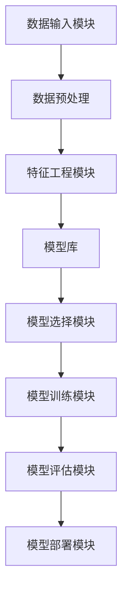
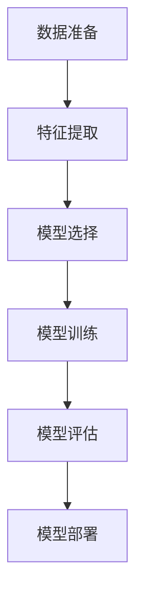
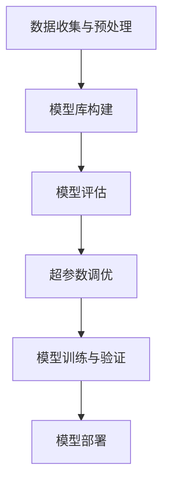

                 

### 第一部分：背景介绍

#### 第1章：自动化机器学习（AutoML）概述

##### 1.1 AutoML的定义与意义

自动化机器学习（AutoML）是近年来机器学习领域的一个重要研究方向。它旨在通过自动化或半自动化的方式，帮助研究人员和开发者构建高效、精确的机器学习模型。AutoML的核心目标是通过自动化完成数据预处理、特征工程、模型选择、训练和调优等一系列复杂过程，从而简化机器学习的实现过程，提高模型的性能和可靠性。

AutoML的意义在于：

- **减少手工劳动：**通过自动化流程，减少重复性、繁琐的手工工作，提高工作效率。
- **降低门槛：**使得不具有深厚机器学习背景的开发者也能轻松构建高效模型，降低了机器学习的门槛。
- **加速研发：**自动化流程使得模型开发过程更加迅速，能够快速迭代和优化模型。
- **提高模型性能：**通过自动化选择和调优，能够找到最优的模型配置，提高模型的整体性能。

##### 1.2 AutoML的发展历程

AutoML的概念起源于2000年代初，随着机器学习技术的迅速发展，人们开始意识到构建高效模型需要大量的时间、精力和专业知识。随后，研究者们提出了一系列自动化的方法和技术，例如自动特征选择、自动模型选择、自动化调优等。

发展历程可以概括为以下几个阶段：

1. **数据预处理自动化：**2000年代初期，研究者们开始探索如何自动化数据预处理，包括数据清洗、数据转换和特征工程等步骤。
2. **模型选择与调优自动化：**随着机器学习算法的增多，如何选择最适合的模型并对其进行调优成为一个挑战。研究者们开始开发自动化算法，如随机搜索、贝叶斯优化等。
3. **集成学习与模型优化：**研究者们发现，通过集成多个模型可以提高整体性能，这促使了自动化集成学习的出现，如AutoKeras、AutoMLFS等。
4. **端到端系统：**近年来，端到端学习（End-to-End Learning）和深度学习的发展推动了AutoML的进步。一些系统如Google的AutoML、H2O.ai等，实现了从数据预处理到模型部署的一体化自动化流程。

##### 1.3 AutoML在机器学习中的应用场景

AutoML在多个领域都有广泛的应用，以下是一些典型的应用场景：

- **金融领域：**在金融风险评估、股票市场预测、风险管理等方面，AutoML可以帮助金融机构快速构建高效的风控模型。
- **医疗领域：**在疾病诊断、药物研发、患者个性化治疗等方面，AutoML可以自动化分析大量医疗数据，提高诊断和治疗的准确性。
- **零售领域：**在客户行为预测、库存管理、价格优化等方面，AutoML可以帮助零售企业更准确地预测市场需求，优化库存和定价策略。
- **制造业：**在故障预测、生产优化、质量检测等方面，AutoML可以自动化处理大量制造数据，提高生产效率和产品质量。

##### 1.4 LLM应用的现状与挑战

大型语言模型（LLM）是近年来人工智能领域的一个重要研究方向，尤其在自然语言处理（NLP）领域取得了显著进展。LLM具有以下特点：

- **强大的语义理解能力：**LLM可以通过大量文本数据训练，理解并生成复杂的文本信息。
- **广泛的应用领域：**LLM可以应用于文本生成、机器翻译、问答系统、情感分析等多种场景。
- **高效的模型结构：**LLM通常采用深度神经网络结构，如Transformer，能够在处理大规模文本数据时保持高效性能。

然而，LLM应用也面临以下挑战：

- **计算资源需求大：**训练和推理LLM需要大量的计算资源和存储空间，这对硬件设施和基础设施提出了较高要求。
- **模型选择复杂：**由于LLM模型种类繁多，选择合适的模型和调整模型参数是一项复杂任务。
- **数据依赖性强：**LLM的训练和优化高度依赖于高质量的训练数据，数据质量问题会直接影响模型性能。

##### 1.5 AutoML与LLM应用的关系

AutoML在LLM应用中扮演着重要角色，通过自动化模型选择和调优，可以显著简化LLM的开发和部署过程。以下是AutoML在LLM应用中的具体作用：

- **模型选择与调优：**AutoML可以帮助自动选择最适合的LLM模型和超参数配置，提高模型性能。
- **数据预处理与特征工程：**AutoML可以自动化处理文本数据，提取关键特征，提高数据处理效率。
- **模型集成与优化：**通过集成多种LLM模型，AutoML可以进一步优化模型性能，提高预测准确性。

##### 1.6 本书结构安排与内容概述

本书分为六个主要部分，具体内容安排如下：

1. **第一部分：背景介绍**：介绍AutoML和LLM的基本概念、发展历程和应用场景，为后续内容打下基础。
2. **第二部分：AutoML基本概念与原理**：详细讲解AutoML的核心概念、关键技术、架构设计和应用流程。
3. **第三部分：LLM应用中的模型选择**：探讨LLM模型选择的原则、方法和实践。
4. **第四部分：AutoML工具与平台介绍**：介绍主流的AutoML工具与平台，包括其功能、特点和应用。
5. **第五部分：案例分析**：通过实际案例展示AutoML在LLM应用中的具体应用和效果。
6. **第六部分：最佳实践与未来展望**：总结AutoML在LLM应用中的最佳实践，并提出未来的发展方向。

##### 1.7 小结与展望

本章介绍了自动化机器学习（AutoML）的基本概念、发展历程和应用场景，并探讨了AutoML在简化大型语言模型（LLM）应用中的模型选择过程。通过本章的学习，读者可以了解AutoML的核心作用和重要性，为后续章节的内容打下基础。在接下来的章节中，我们将进一步深入探讨AutoML的原理、方法、工具和应用，帮助读者全面了解这一前沿技术。

### 第二部分：AutoML基本概念与原理

#### 第2章：AutoML的核心概念与原理

##### 2.1 AutoML的基本概念

自动化机器学习（AutoML）的核心目标是通过自动化手段，帮助研究人员和开发者更高效地构建和部署机器学习模型。要理解AutoML，首先需要了解以下几个基本概念：

- **数据预处理：**在训练机器学习模型之前，通常需要对数据进行清洗、转换和归一化等预处理操作。AutoML通过自动化这些步骤，提高数据处理效率。
- **特征工程：**特征工程是指从原始数据中提取对模型训练有意义的特征。AutoML通过自动化选择和构造特征，帮助提高模型性能。
- **模型选择：**选择合适的模型和算法对于机器学习项目的成功至关重要。AutoML通过自动化搜索和评估多种模型，找到最佳模型配置。
- **模型训练与调优：**模型训练是指通过大量数据训练模型，使其能够对新数据进行预测。调优是指通过调整模型参数，优化模型性能。AutoML通过自动化训练和调优过程，减少手动干预。
- **模型评估与部署：**模型评估用于验证模型性能，部署则是将模型应用于实际任务中。AutoML通过自动化评估和部署流程，确保模型高效运行。

##### 2.2 AutoML的关键技术

AutoML的实现依赖于一系列关键技术的支持，以下是其中几个重要技术：

- **特征工程自动化：**特征工程是机器学习中的一个重要步骤，但手工完成这一过程非常耗时且容易出错。特征工程自动化通过自动化工具和算法，从原始数据中提取和构造有意义的特征，提高模型性能。

- **模型选择与调优：**模型选择和调优是机器学习项目的核心任务。AutoML通过自动化搜索和评估多种模型，找到最优模型配置。常用的算法包括随机搜索、贝叶斯优化、遗传算法等。

- **模型集成与优化：**模型集成是指通过组合多个模型，提高整体性能。AutoML通过自动化集成多种模型，优化模型性能。常用的集成算法包括Stacking、Bagging、Boosting等。

- **端到端系统：**端到端系统是一种将数据输入到模型中，经过一系列自动化处理，直接输出结果的系统。这种系统能够实现从数据预处理到模型部署的一体化流程，提高开发效率。

##### 2.3 AutoML的架构设计

一个完整的AutoML系统通常包括以下几个基本组成部分：

- **数据输入模块：**用于接收和处理输入数据，包括数据清洗、归一化等预处理操作。
- **特征工程模块：**用于提取和构造特征，包括特征选择、特征转换等。
- **模型库：**存储多种预训练的模型，包括不同的算法和模型结构。
- **模型选择模块：**通过自动化算法，从模型库中选择最佳模型。
- **模型训练模块：**用于训练所选模型，包括调整超参数等。
- **模型评估模块：**用于评估模型性能，包括准确率、召回率、F1分数等指标。
- **模型部署模块：**用于将训练好的模型部署到生产环境中。

以下是一个简单的AutoML架构设计示意图：

##### 2.4 AutoML的应用流程

一个典型的AutoML应用流程通常包括以下几个步骤：

1. **数据准备：**收集和整理数据，进行数据清洗和预处理。
2. **特征提取：**从原始数据中提取关键特征，进行特征工程。
3. **模型选择：**通过自动化算法，从模型库中选择最佳模型。
4. **模型训练：**使用训练数据训练所选模型，并调整超参数。
5. **模型评估：**使用验证数据评估模型性能，包括准确率、召回率、F1分数等指标。
6. **模型部署：**将训练好的模型部署到生产环境中，用于实际预测任务。

以下是一个简化的AutoML应用流程示意图：

##### 2.5 小结与展望

本章详细介绍了自动化机器学习（AutoML）的基本概念、关键技术、架构设计和应用流程。通过本章的学习，读者可以了解AutoML的核心作用和基本原理，为后续章节的深入探讨打下基础。在接下来的章节中，我们将继续探讨AutoML在LLM应用中的具体应用和实践，帮助读者全面了解这一前沿技术。同时，我们也将探讨AutoML在未来发展的趋势和潜在挑战，为读者提供更广阔的视野。

### 第三部分：LLM应用中的模型选择

#### 第3章：LLM模型选择的基本原则

##### 3.1 LLM模型选择的挑战

在大型语言模型（LLM）的应用中，模型选择是一个关键且具有挑战性的任务。随着LLM技术的发展，模型种类和复杂度不断增加，模型选择变得更加复杂和困难。以下是LLM模型选择中面临的几个主要挑战：

- **模型多样性：**目前存在多种不同的LLM模型，包括传统的循环神经网络（RNN）、长短时记忆网络（LSTM）、门控循环单元（GRU）以及近年来流行的Transformer模型等。如何从这些多样化的模型中选择最合适的模型，成为一大挑战。
- **超参数调优：**每个模型都有许多需要调优的超参数，如学习率、批量大小、正则化参数等。这些超参数的配置对模型性能有重要影响，但调优过程往往需要大量时间和计算资源。
- **数据依赖性：**LLM模型的训练和优化高度依赖于训练数据的质量和数量。不同领域和应用场景需要不同类型的训练数据，如何选择和预处理这些数据，是一个需要仔细考虑的问题。
- **计算资源需求：**训练和部署大型语言模型通常需要大量的计算资源和存储空间。如何平衡模型性能和计算成本，是一个重要的考量。

##### 3.2 LLM模型选择的原则

为了有效应对上述挑战，选择合适的LLM模型需要遵循以下原则：

- **性能优化：**首先，模型的选择应当以性能优化为核心目标。根据任务需求和数据特性，选择能够达到最优性能的模型。常用的评估指标包括准确率、召回率、F1分数等。
- **可扩展性：**模型的选择应考虑其可扩展性。这意味着所选模型应能够处理不同规模的数据，并且易于在多节点环境中扩展。
- **易用性：**易用性是模型选择的重要考量因素。选择易于安装、配置和使用，且文档和社区支持较好的模型，可以降低开发成本，提高开发效率。

##### 3.3 LLM模型选择的方法

在实际应用中，有以下几种常见的LLM模型选择方法：

- **经验法：**根据以往项目的经验，选择在类似任务中表现良好的模型。这种方法适用于对模型有一定了解的开发者，但可能无法充分利用最新的研究成果。
- **自动化搜索算法：**使用自动化搜索算法，如随机搜索、贝叶斯优化、遗传算法等，从多个模型中选择最佳模型。这种方法能够节省时间和计算资源，但可能需要一定的专业知识。
- **强化学习：**强化学习是一种通过不断尝试和反馈来优化模型选择的方法。通过训练一个强化学习模型，使其能够自动选择最优模型。

##### 3.4 LLM模型选择的具体实践

在实际应用中，LLM模型选择的具体实践通常包括以下几个步骤：

1. **数据收集与预处理：**首先，收集和预处理训练数据。数据预处理包括数据清洗、数据转换和特征提取等步骤。
2. **模型库构建：**构建一个包含多种LLM模型的模型库，通常包括预训练模型和自定义模型。
3. **模型评估：**使用验证数据集对模型库中的模型进行评估，选择性能较好的模型。
4. **超参数调优：**对所选模型进行超参数调优，以优化模型性能。常用的方法包括网格搜索、随机搜索和贝叶斯优化等。
5. **模型训练与验证：**使用训练数据对模型进行训练，并在验证数据集上评估模型性能，确保模型在目标任务上达到预期效果。
6. **模型部署：**将训练好的模型部署到生产环境中，用于实际预测任务。

以下是一个简化的LLM模型选择流程示意图：

##### 3.5 小结与展望

本章探讨了在LLM应用中进行模型选择的原则和方法，并介绍了具体实践步骤。通过本章的学习，读者可以了解如何从多样化的LLM模型中选择合适的模型，以提高应用性能。在后续章节中，我们将进一步探讨AutoML工具与平台在LLM模型选择中的应用，以及通过具体案例展示AutoML在LLM应用中的实际效果。同时，我们也将探讨AutoML在LLM模型选择中的未来发展趋势和潜在挑战，为读者提供更全面的视角。

### 第四部分：AutoML工具与平台介绍

#### 第4章：主流AutoML工具与平台

##### 4.1 AutoML工具概述

自动化机器学习（AutoML）工具是近年来机器学习领域的重要进展，旨在通过自动化流程简化模型开发过程。AutoML工具通常提供以下功能：

- **数据预处理：**自动化处理和清洗原始数据，进行特征工程。
- **模型选择与调优：**自动化搜索和评估多种模型，选择最优模型配置。
- **模型训练与评估：**自动化训练模型，并在验证数据集上评估模型性能。
- **模型部署：**将训练好的模型部署到生产环境中，用于实际预测任务。

主流的AutoML工具包括以下几类：

- **框架类：**如Scikit-Learn、PyTorch、TensorFlow等，这些框架提供了丰富的模型和工具，但需要手动进行模型选择和调优。
- **平台类：**如Google的AutoML、H2O.ai、DataRobot等，这些平台集成了自动化流程，提供了一站式的模型开发解决方案。
- **服务类：**如Google Cloud AutoML、AWS SageMaker Aut

