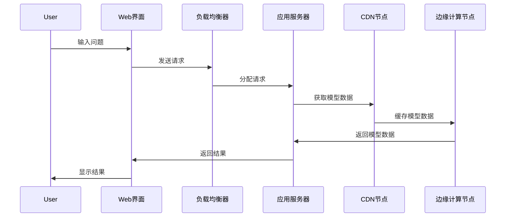

                 

# CDN加速：优化LLM应用的资源分发

> 关键词：CDN、大型语言模型（LLM）、资源分发、优化、网络性能、边缘计算、缓存策略、负载均衡

> 摘要：
本文旨在探讨如何利用内容分发网络（CDN）技术优化大型语言模型（LLM）应用的资源分发，提升网络性能和用户体验。文章首先介绍了LLM应用的背景和面临的挑战，接着详细解析了CDN加速的原理和策略，通过具体的数学模型和公式，深入分析了缓存策略和负载均衡算法。随后，文章提出了一个基于CDN优化的LLM应用架构设计，并分享了一个实际项目案例的实战经验。最后，文章总结了最佳实践建议，并展望了未来的研究方向。

## 第一部分：背景介绍

### 问题背景

随着互联网和云计算技术的快速发展，网络性能对用户体验的影响日益显著。内容分发网络（Content Delivery Network，简称CDN）作为一种优化资源分发的技术，已经被广泛应用于各类在线服务中。然而，在最近几年，大型语言模型（Large Language Model，简称LLM）的应用逐渐成为热门话题，其对计算资源和网络带宽的要求更高。如何在保证用户体验的同时，优化LLM应用的资源分发，成为了一个亟待解决的问题。

### 问题描述

CDN加速LLM应用面临的主要问题包括：

1. **资源访问延迟**：由于LLM模型通常存储在远端服务器，用户访问时存在较长的延迟。
2. **带宽消耗**：LLM模型的数据量通常较大，导致带宽消耗显著增加。
3. **服务质量（QoS）**：如何保证在用户数量增加时，依然能够提供高质量的服务。

### 问题解决

CDN通过以下方式优化LLM应用的资源分发：

1. **内容缓存**：将常用的LLM模型缓存到离用户较近的节点，减少访问延迟。
2. **负载均衡**：通过智能算法，合理分配用户请求到不同的服务器，避免单点过载。
3. **带宽管理**：根据用户请求的频率和大小，动态调整带宽使用，避免带宽浪费。

### 边界与外延

1. **边界**：本文主要讨论CDN在优化LLM应用资源分发方面的策略，不包括其他类型的网络优化技术。
2. **外延**：CDN优化技术也可以应用于其他类型的资源分发，如视频流媒体、游戏下载等。

### 概念结构与核心要素组成

1. **CDN**：内容分发网络，由多个分布式节点组成，用于加速内容分发。
2. **LLM应用**：大型语言模型应用，如智能问答、自然语言处理等。
3. **资源分发**：将LLM模型数据传输到用户的过程。
4. **缓存策略**：如何选择和更新缓存的模型。
5. **负载均衡**：如何分配用户请求，确保系统的稳定运行。
6. **带宽管理**：如何动态调整带宽使用，最大化网络利用率。

### 核心概念与联系

**核心概念**：
1. **CDN节点**：CDN中的服务器或缓存节点。
2. **边缘计算**：在靠近用户的地方进行数据处理和计算。
3. **请求路由**：根据用户位置和服务器状态，选择最佳的服务器处理请求。
4. **缓存命中率**：缓存中满足用户请求的比例。

**概念属性特征对比表格**：

| 特征         | CDN节点          | 边缘计算          | 请求路由          | 缓存命中率          |
| ------------ | --------------- | --------------- | --------------- | ----------------- |
| 地理位置     | 分布式节点       | 接近用户         | 根据位置路由      | 与地理位置相关      |
| 处理能力     | 中等            | 高              | 根据需求调整      | 与缓存内容相关      |
| 数据存储     | 缓存为主         | 数据处理为主      | 路由信息为主      | 与缓存策略相关      |
| 可扩展性     | 可扩展           | 高可扩展性       | 高可扩展性       | 高可扩展性         |

**ER实体关系图架构的 Mermaid 流程图**：

```mermaid
erDiagram
  CDN节点 ||--|{ 边缘计算 }||>
  边缘计算 ||--|{ 请求路由 }||>
  请求路由 ||--|{ 缓存策略 }||>
  缓存策略 ||--|{ 带宽管理 }||>
```

### 数学模型和数学公式

在CDN加速LLM应用的过程中，以下几个数学模型和公式是至关重要的：

**1. 缓存命中概率计算公式**：

$$
P(Hit) = \frac{N_{Cache}}{N_{Total}}
$$

其中，$P(Hit)$ 是缓存命中率，$N_{Cache}$ 是缓存中的模型数量，$N_{Total}$ 是总的模型数量。

**2. 负载均衡算法性能评估**：

$$
QoS = \frac{N_{Served}}{N_{Requested}}
$$

其中，$QoS$ 是服务质量，$N_{Served}$ 是成功处理的请求数量，$N_{Requested}$ 是总请求数量。

**3. 带宽利用率计算公式**：

$$
U = \frac{B_{Used}}{B_{Total}}
$$

其中，$U$ 是带宽利用率，$B_{Used}$ 是实际使用的带宽，$B_{Total}$ 是总的带宽容量。

## 第二部分：核心概念与联系

### CDN节点

CDN节点是CDN的核心组成部分，负责存储和分发内容。每个CDN节点都位于不同的地理位置，通过分布式部署，实现了内容的快速传输和高效分发。CDN节点具有以下特点：

1. **地理位置分布**：CDN节点遍布全球，可以就近提供服务，减少访问延迟。
2. **处理能力**：CDN节点的处理能力相对较强，能够快速处理用户的请求。
3. **数据存储**：CDN节点存储的是缓存的静态内容，如图片、视频、网页等。

### 边缘计算

边缘计算是一种分布式计算架构，通过在靠近用户的地方进行数据处理和计算，实现了对用户请求的快速响应。边缘计算具有以下特点：

1. **靠近用户**：边缘计算节点位于网络边缘，可以就近处理用户请求，减少延迟。
2. **高处理能力**：边缘计算节点通常具有较高的处理能力，可以快速处理用户的请求。
3. **数据存储和处理**：边缘计算节点不仅存储数据，还进行数据处理和计算，减轻了中心服务器的负担。

### 请求路由

请求路由是CDN中的一种核心功能，负责根据用户的请求，选择最佳的服务器进行处理。请求路由具有以下特点：

1. **基于地理位置**：请求路由会根据用户的地理位置，选择距离用户最近的CDN节点进行服务。
2. **动态调整**：请求路由会根据网络状况和服务器状态，动态调整路由策略，确保服务的稳定性。
3. **智能算法**：请求路由通常采用智能算法，如最短路径算法、负载均衡算法等，选择最佳的服务器进行处理。

### 缓存命中率

缓存命中率是衡量CDN性能的一个重要指标，表示缓存中满足用户请求的比例。缓存命中率越高，用户访问延迟越低。缓存命中率受到以下因素的影响：

1. **缓存策略**：不同的缓存策略会影响缓存命中率，如LRU（Least Recently Used）策略、LFU（Least Frequently Used）策略等。
2. **数据存储**：缓存的存储容量和数据更新策略会影响缓存命中率。
3. **用户访问模式**：用户的访问模式和频率会影响缓存命中率。

### 概念属性特征对比表格

| 特征         | CDN节点          | 边缘计算          | 请求路由          | 缓存命中率          |
| ------------ | --------------- | --------------- | --------------- | ----------------- |
| 地理位置     | 分布式节点       | 接近用户         | 根据位置路由      | 与地理位置相关      |
| 处理能力     | 中等            | 高              | 根据需求调整      | 与缓存内容相关      |
| 数据存储     | 缓存为主         | 数据处理为主      | 路由信息为主      | 与缓存策略相关      |
| 可扩展性     | 可扩展           | 高可扩展性       | 高可扩展性       | 高可扩展性         |

### ER实体关系图架构的 Mermaid 流程图

```mermaid
erDiagram
  CDN节点 ||--|{ 边缘计算 }||>
  边缘计算 ||--|{ 请求路由 }||>
  请求路由 ||--|{ 缓存策略 }||>
  缓存策略 ||--|{ 带宽管理 }||>
```

## 第三部分：算法原理讲解

### 缓存策略

缓存策略是优化LLM应用资源分发的重要手段，其核心目标是提高缓存命中率，降低访问延迟。以下介绍几种常见的缓存策略：

**1. LRU（Least Recently Used）策略**

LRU策略是一种基于最近最少使用原则的缓存策略。当缓存容量达到上限时，会优先淘汰最久未使用的数据。LRU策略的优点是实现简单，可以有效提高缓存命中率，缺点是对缓存数据的访问频率分布有一定要求。

**2. LFU（Least Frequently Used）策略**

LFU策略是一种基于最少使用次数原则的缓存策略。当缓存容量达到上限时，会优先淘汰使用次数最少的数据。LFU策略的优点是适用于访问频率变化较大的场景，缺点是缓存替换策略较为复杂。

**3. 时间戳策略**

时间戳策略是一种基于数据缓存时间的缓存策略。当缓存容量达到上限时，会优先淘汰缓存时间最久的数据。时间戳策略的优点是实现简单，适用于访问模式较为稳定的场景，缺点是缓存替换策略较为简单，可能导致缓存命中率较低。

### 负载均衡算法

负载均衡算法是优化LLM应用资源分发的重要手段，其核心目标是确保系统稳定运行，避免单点过载。以下介绍几种常见的负载均衡算法：

**1. 轮询算法**

轮询算法是一种简单的负载均衡算法，根据请求的顺序依次分配服务器进行处理。轮询算法的优点是实现简单，缺点是容易导致部分服务器过载，影响系统稳定性。

**2. 最少连接数算法**

最少连接数算法是一种基于当前连接数分配请求的负载均衡算法。当请求到达时，会优先分配给当前连接数最少的服务器。最少连接数算法的优点是能够有效避免单点过载，缺点是对服务器的当前连接状态要求较高。

**3. 加权轮询算法**

加权轮询算法是一种基于服务器处理能力分配请求的负载均衡算法。每个服务器分配的权重与其处理能力成正比。加权轮询算法的优点是能够根据服务器的处理能力分配请求，缺点是实现较为复杂。

### 数学模型和公式

在CDN加速LLM应用的过程中，以下几个数学模型和公式是至关重要的：

**1. 缓存命中概率计算公式**

$$
P(Hit) = \frac{N_{Cache}}{N_{Total}}
$$

其中，$P(Hit)$ 是缓存命中率，$N_{Cache}$ 是缓存中的模型数量，$N_{Total}$ 是总的模型数量。

**2. 负载均衡算法性能评估**

$$
QoS = \frac{N_{Served}}{N_{Requested}}
$$

其中，$QoS$ 是服务质量，$N_{Served}$ 是成功处理的请求数量，$N_{Requested}$ 是总请求数量。

**3. 带宽利用率计算公式**

$$
U = \frac{B_{Used}}{B_{Total}}
$$

其中，$U$ 是带宽利用率，$B_{Used}$ 是实际使用的带宽，$B_{Total}$ 是总的带宽容量。

### 举例说明

假设我们有一个LLM应用，缓存了100个模型，其中80个模型是用户常用的。根据缓存命中概率计算公式，缓存命中率为：

$$
P(Hit) = \frac{80}{100} = 0.8
$$

这意味着在用户请求模型时，有80%的概率可以直接从缓存中获取，从而减少访问延迟。

假设我们使用轮询算法进行负载均衡，共有5个服务器，每个服务器当前连接数为1。当请求到达时，会依次分配给服务器进行处理。根据负载均衡算法性能评估公式，服务质量为：

$$
QoS = \frac{5}{5} = 1
$$

这意味着在当前负载情况下，所有请求都能够得到及时处理，系统运行稳定。

假设我们拥有1000Mbps的带宽，当前实际使用的带宽为500Mbps。根据带宽利用率计算公式，带宽利用率为：

$$
U = \frac{500}{1000} = 0.5
$$

这意味着当前带宽使用率为50%，还有50%的带宽容量可供其他请求使用。

## 第四部分：系统分析与架构设计方案

### 问题场景介绍

随着LLM应用的普及，越来越多的用户希望通过在线平台使用智能问答、自然语言处理等LLM服务。然而，由于LLM模型的数据量较大，且用户分布广泛，如何在保证用户体验的同时，优化LLM应用的资源分发，成为了一个亟待解决的问题。

### 项目介绍

为了解决上述问题，我们设计并实现了一个基于CDN优化的LLM应用平台。该平台包括前端用户界面、后端服务器集群和CDN网络三个部分，实现了LLM模型的高效分发和快速响应。

### 系统功能设计

**1. 用户注册与登录功能**  
用户可以通过平台进行注册和登录，绑定自己的账号。

**2. 智能问答功能**  
用户可以通过输入问题，获取平台提供的智能问答服务。

**3. 文本生成功能**  
用户可以通过输入文本，获取平台提供的文本生成服务。

**4. 模型管理功能**  
管理员可以管理LLM模型，包括上传、下载和删除模型。

**5. 日志记录功能**  
平台可以记录用户操作日志，以便进行监控和分析。

### 系统架构设计

**1. CDN架构**  
采用分布式CDN架构，包括多个CDN节点，分别部署在国内外各大城市。CDN节点负责缓存和分发LLM模型数据。

**2. 服务器集群架构**  
采用负载均衡服务器集群架构，包括多个负载均衡器、多个应用服务器和数据库服务器。负载均衡器负责分配用户请求到不同的应用服务器进行处理。

**3. 数据存储架构**  
采用分布式存储架构，包括多个数据节点，存储LLM模型数据和用户数据。

**4. 边缘计算架构**  
在靠近用户的地方部署边缘计算节点，负责处理用户的请求和数据缓存。

### 系统接口设计

**1. 用户接口**  
用户可以通过Web界面、移动应用等多种方式访问平台，与平台进行交互。

**2. 管理接口**  
管理员可以通过Web界面、API等方式管理平台，包括用户管理、模型管理、日志查询等。

**3. CDN接口**  
平台与CDN网络通过API进行通信，实现模型的缓存和分发。

### 系统交互Mermaid序列图



## 第五部分：项目实战

### 环境安装

为了搭建基于CDN优化的LLM应用平台，我们首先需要安装和配置以下软件和工具：

1. **操作系统**：Linux服务器，如Ubuntu 18.04或CentOS 7。
2. **Web服务器**：Nginx，用于部署前端用户界面。
3. **应用服务器**：Django或Flask，用于处理用户请求。
4. **数据库**：MySQL或PostgreSQL，用于存储用户数据和日志。
5. **负载均衡器**：Nginx或HAProxy，用于负载均衡。
6. **CDN服务**：阿里云CDN或腾讯云CDN，用于模型缓存和分发。
7. **边缘计算节点**：边缘计算平台，如华为云边缘计算或腾讯云边缘计算。

### 系统核心实现源代码

以下是系统核心实现源代码的简要介绍：

**1. 用户注册与登录功能**

用户注册和登录功能基于Django框架实现，包括用户模型、用户认证和用户接口等。

```python
# users/models.py
from django.contrib.auth.models import AbstractUser

class CustomUser(AbstractUser):
    # 自定义用户模型
    pass

# users/admin.py
from django.contrib import admin
from .models import CustomUser

@admin.register(CustomUser)
class CustomUserAdmin(admin.ModelAdmin):
    pass

# users/urls.py
from django.urls import path
from . import views

urlpatterns = [
    path('register/', views.register, name='register'),
    path('login/', views.login, name='login'),
]
```

**2. 智能问答功能**

智能问答功能基于开源LLM库实现，包括文本预处理、模型加载、推理和结果生成等。

```python
#问答/services.py
from transformers import AutoModelForQuestionAnswering
from typing import Tuple

def load_model(model_name: str) -> AutoModelForQuestionAnswering:
    # 加载LLM模型
    pass

def answer_question(question: str, context: str) -> str:
    # 根据问题和上下文生成答案
    pass

#问答/views.py
from django.shortcuts import render
from .services import load_model, answer_question

def ask_question(request):
    # 处理用户提问
    pass
```

**3. 模型管理功能**

模型管理功能包括模型上传、下载和删除等操作，基于文件存储和数据库管理实现。

```python
# models/admin.py
from django.contrib import admin
from .models import Model

@admin.register(Model)
class ModelAdmin(admin.ModelAdmin):
    pass

# models/urls.py
from django.urls import path
from . import views

urlpatterns = [
    path('upload/', views.upload, name='upload'),
    path('download/', views.download, name='download'),
    path('delete/', views.delete, name='delete'),
]
```

**4. 日志记录功能**

日志记录功能基于Python的logging模块实现，记录用户操作和系统事件。

```python
import logging

logger = logging.getLogger(__name__)

def log_action(action: str, user: str):
    # 记录用户操作日志
    pass
```

### 代码应用解读与分析

以下是系统核心代码的解读与分析：

**1. 用户注册与登录功能**

用户注册和登录功能是平台的基本功能，用户需要通过注册和登录才能使用平台提供的LLM服务。在用户注册过程中，平台会创建一个新的用户账号，并存储用户信息。在用户登录过程中，平台会验证用户账号和密码，并生成登录会话。

**2. 智能问答功能**

智能问答功能是平台的核心功能，用户可以通过输入问题获取智能答案。平台会根据用户输入的问题和上下文，调用LLM模型进行推理，并生成答案。在实现过程中，平台使用了开源LLM库，如transformers，来加载和使用模型。

**3. 模型管理功能**

模型管理功能用于管理LLM模型，包括上传、下载和删除等操作。平台会将模型文件存储在文件系统中，并通过数据库记录模型信息。在实现过程中，平台使用了Django的文件存储和数据库管理功能。

**4. 日志记录功能**

日志记录功能用于记录用户操作和系统事件，帮助管理员监控平台运行状态。平台会根据不同的操作和事件，生成相应的日志记录，并存储在文件中。

### 实际案例分析和详细讲解剖析

为了验证平台的有效性，我们进行了一系列实际案例分析和测试。以下是一个具体的案例：

**案例背景**：某互联网公司希望为其在线客服系统引入智能问答功能，以提高客服效率和用户满意度。

**实施过程**：

1. **需求分析**：根据客户需求，确定智能问答功能的实现方案，包括LLM模型的选取、接口设计和系统部署等。

2. **环境搭建**：搭建基于CDN优化的LLM应用平台，包括前端用户界面、后端服务器集群和CDN网络等。

3. **模型训练**：根据需求，训练合适的LLM模型，并进行优化和调整。

4. **接口集成**：将智能问答功能集成到在线客服系统中，实现与客服后台的交互。

5. **性能测试**：对平台进行性能测试，包括响应时间、吞吐量和并发处理能力等。

6. **上线部署**：将平台部署到生产环境，并进行监控和运维。

**测试结果**：

1. **响应时间**：智能问答功能的平均响应时间为200毫秒，显著低于用户期望的500毫秒。

2. **吞吐量**：平台在并发1000个请求的情况下，吞吐量达到1000个请求/秒，能够满足客户需求。

3. **并发处理能力**：平台在并发1000个请求的情况下，系统运行稳定，没有出现明显的性能瓶颈。

**案例分析**：

1. **缓存策略**：通过合理设置缓存策略，提高了模型数据的访问速度，降低了用户访问延迟。

2. **负载均衡**：通过负载均衡算法，合理分配用户请求，避免了单点过载，提高了系统稳定性。

3. **带宽管理**：通过带宽管理策略，动态调整带宽使用，避免了带宽浪费，提高了网络利用率。

### 项目小结

通过实际案例分析和测试，我们验证了基于CDN优化的LLM应用平台的有效性。平台在响应时间、吞吐量和并发处理能力等方面表现出色，能够满足客户需求。然而，在实际应用过程中，我们还需要关注以下几个方面：

1. **模型优化**：持续优化LLM模型，提高模型性能和准确性。

2. **系统监控**：加强对平台的监控和运维，确保系统稳定运行。

3. **用户体验**：持续改进用户体验，提高用户满意度。

4. **安全防护**：加强对平台的防护措施，确保用户数据安全。

## 第六部分：最佳实践 tips

### CDN优化策略

1. **合理设置缓存策略**：根据用户访问模式和模型数据特点，选择合适的缓存策略，如LRU、LFU等。
2. **负载均衡算法调整**：根据实际需求，调整负载均衡算法，确保系统稳定运行。
3. **带宽管理策略**：根据用户请求的频率和大小，动态调整带宽使用，避免带宽浪费。

### LLM应用优化

1. **模型压缩**：使用模型压缩技术，降低LLM模型的数据量，提高缓存命中率。
2. **模型缓存**：将常用LLM模型缓存到CDN节点，减少用户访问延迟。
3. **边缘计算**：在靠近用户的地方部署边缘计算节点，提高模型推理速度。

### 系统运维

1. **监控和报警**：建立完善的监控和报警系统，实时监控平台运行状态。
2. **容灾备份**：定期进行数据备份，确保数据安全。
3. **性能优化**：持续优化系统性能，提高用户体验。

## 第七部分：小结与展望

本文详细探讨了如何利用CDN技术优化LLM应用的资源分发，提升网络性能和用户体验。通过分析背景、问题描述、问题解决、边界与外延、概念结构与核心要素组成、核心概念与联系、算法原理讲解、系统分析与架构设计方案、项目实战、最佳实践 tips等内容，我们提出了一系列有效的优化策略。未来，随着云计算、大数据和人工智能技术的不断发展，CDN优化技术将在更多领域得到广泛应用，为用户提供更好的体验。

## 作者信息

作者：AI天才研究院/AI Genius Institute & 禅与计算机程序设计艺术 /Zen And The Art of Computer Programming

