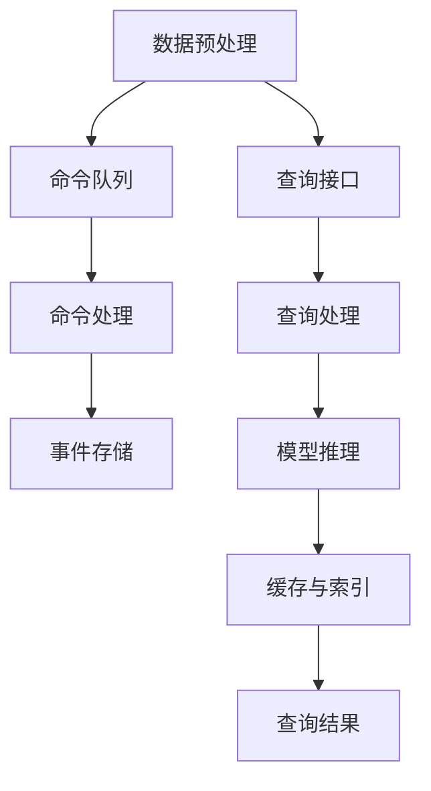
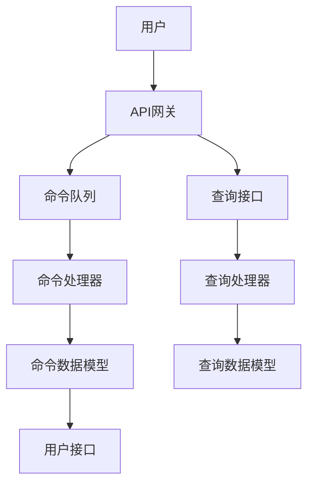

                 

## 引言

### CQRS模式概述

CQRS（Command Query Responsibility Segregation）模式是一种架构设计模式，它将命令（Command）和处理查询（Query）的责任分离。CQRS的核心思想是：命令和处理查询应该是两种不同的操作，它们应该被独立地设计、实现和优化。这一模式的起源可以追溯到2002年，由英国软件工程师Dan McPhillips首次提出。

CQRS模式的重要性在于它能够有效解决传统数据库架构中存在的某些问题。在传统的数据库架构中，数据模型通常既用于写入操作（命令）也用于读取操作（查询）。这种单一的数据模型虽然简化了设计和实现，但在应对高并发、大数据量和高性能查询时却显得力不从心。CQRS通过分离命令和处理查询，使得这两个操作可以独立优化，从而提高系统的整体性能和可扩展性。

在复杂LLM（Large Language Model）应用中，CQRS模式尤为关键。LLM通常需要处理大量数据并产生复杂的查询请求，传统的数据库架构很难满足这些需求。CQRS模式通过分离命令和处理查询，使得LLM应用可以更灵活、高效地应对不同的操作需求。

### CQRS与复杂LLM应用

复杂LLM应用通常涉及大量的数据处理和复杂的查询请求。这些应用包括但不限于自然语言处理（NLP）、推荐系统、聊天机器人、语音识别等。在这些应用中，传统的数据库架构往往难以满足以下挑战：

1. **高并发性**：复杂LLM应用通常需要处理大量的并发请求，这要求系统具有极高的性能和可扩展性。
2. **大数据量**：LLM应用需要存储和处理大量的数据，传统的数据库架构可能会因为数据量过大而变得低效。
3. **复杂查询**：复杂LLM应用需要执行各种复杂的查询，这些查询可能会对数据库的性能产生显著影响。

CQRS模式通过分离命令和处理查询，可以有效解决这些挑战。命令操作负责数据的创建、更新和删除，而查询操作则负责数据的读取。这种分离使得命令操作可以独立优化，以提高系统的性能和响应速度。同时，查询操作也可以独立优化，以应对复杂的查询需求。

总之，CQRS模式为复杂LLM应用提供了一种有效的架构设计，使得系统可以更高效、更灵活地应对各种操作需求。在接下来的章节中，我们将深入探讨CQRS模式的核心概念、原理及其在LLM应用中的具体实现。

## CQRS模式基础理论

### CQRS模式原理

CQRS（Command Query Responsibility Segregation）模式的核心在于将系统的数据操作分为两部分：命令（Command）和查询（Query）。命令负责数据的创建、更新和删除，而查询则负责数据的读取。这种分离使得系统能够更好地应对高并发、大数据量和复杂查询等挑战。

#### 命令（Command）

命令操作负责数据的变更，包括创建、更新和删除。在CQRS模式中，命令通常通过一个独立的命令队列进行传递和处理。这种队列化的处理方式可以确保命令操作的顺序性和一致性。以下是一些关于命令操作的特点：

1. **顺序性**：命令按照接收的顺序进行处理，确保了操作的顺序一致性。
2. **独立性**：命令操作不依赖于查询操作，因此可以在不同的线程或服务器上独立执行。
3. **异步处理**：命令操作通常是异步的，这样可以使系统在处理命令时不会阻塞，从而提高系统的并发能力。

#### 查询（Query）

查询操作负责数据的读取，包括检索、过滤和聚合等。在CQRS模式中，查询操作通常通过一个独立的查询接口进行。查询接口的设计目标是快速、高效地响应用户查询，以下是一些关于查询操作的特点：

1. **独立性**：查询操作独立于命令操作，可以独立优化和扩展。
2. **高效性**：查询操作通常使用预编译的查询语句或缓存来提高响应速度。
3. **多样性**：查询操作可以是简单的单表查询，也可以是复杂的关联查询和聚合查询。

#### CQRS与传统数据库的对比

CQRS模式与传统数据库架构有以下几点显著差异：

1. **数据模型**：在传统数据库架构中，数据模型通常既用于写入操作也用于读取操作。而在CQRS模式中，数据模型被分为命令模型和查询模型，两者独立设计、实现和优化。
2. **查询优化**：在传统数据库中，查询优化通常是通过索引、缓存和数据库优化器来实现的。而在CQRS模式中，查询优化可以独立进行，例如使用预编译的查询语句或缓存。
3. **性能和可扩展性**：CQRS模式通过分离命令和查询操作，使得系统可以更灵活、高效地应对不同的操作需求。这种分离不仅可以提高系统的性能，还可以提高系统的可扩展性。

### CQRS与LLM的关系

复杂LLM（Large Language Model）应用具有数据量大、查询复杂、高并发等特点，这些特点使得传统的数据库架构难以满足需求。CQRS模式通过分离命令和处理查询，为LLM应用提供了一种有效的解决方案。

#### LLM的基本架构

LLM的基本架构通常包括以下几部分：

1. **数据层**：负责存储和管理大量的语言数据，包括文本、图像、音频等。
2. **模型层**：负责训练和优化语言模型，包括生成式模型、判别式模型等。
3. **接口层**：负责接收用户请求，处理查询，并将结果返回给用户。

#### CQRS与LLM的结合方式

CQRS模式与LLM的结合方式主要表现在以下几个方面：

1. **命令与查询分离**：在LLM应用中，命令操作包括数据上传、模型更新等，查询操作包括文本生成、情感分析等。通过分离命令和查询操作，LLM应用可以更高效地处理不同类型的操作。
2. **独立优化**：命令操作和查询操作可以独立进行优化，例如命令操作可以采用异步处理和批量处理，查询操作可以采用缓存和预编译查询。
3. **数据一致性**：通过使用消息队列和分布式事务等机制，CQRS模式可以确保命令操作和查询操作的一致性。

### CQRS与LLM的核心概念联系表

下表展示了CQRS和LLM的一些核心概念及其对应关系：

| CQRS核心概念 | LLM核心概念 | 关系说明 |
| :--- | :--- | :--- |
| 命令（Command） | 数据上传、模型更新 | 命令操作负责数据的变更，包括上传数据和更新模型。 |
| 查询（Query） | 文本生成、情感分析 | 查询操作负责数据的读取，包括生成文本和进行情感分析。 |
| 命令队列 | 模型训练队列 | 命令队列负责存储和处理命令操作，模型训练队列负责处理模型训练操作。 |
| 查询接口 | 模型推理接口 | 查询接口负责快速响应查询操作，模型推理接口负责执行模型推理操作。 |
| 数据一致性 | 分布式事务 | 通过分布式事务机制确保命令操作和查询操作的一致性。 |

通过上述分析，我们可以看出CQRS模式为复杂LLM应用提供了一种有效的架构设计，使得系统可以更高效、更灵活地应对不同的操作需求。在下一章节中，我们将深入探讨CQRS模式的具体架构设计和实现。

### CQRS模式在LLM中的应用架构设计

在实现CQRS模式时，架构设计至关重要。它不仅决定了系统的性能和可扩展性，还影响了系统的稳定性和维护性。以下将详细介绍CQRS模式在LLM应用中的架构设计，包括设计原则、整体架构、设计模式以及具体的设计要点。

#### 设计原则

1. **分离命令和查询**：这是CQRS模式的核心原则。命令和查询的分离使得系统可以独立优化，从而提高性能和可扩展性。
2. **独立性**：命令和查询操作应该是独立的，这样可以使系统在某个部分发生故障时不会影响整个系统的运行。
3. **高可用性**：系统设计应确保高可用性，即使在部分组件出现故障时，系统也能继续运行。
4. **可扩展性**：设计应考虑未来系统的扩展需求，确保系统在负载增加时能够无缝扩展。
5. **一致性**：尽管命令和查询是独立的，但系统应确保最终一致性，以防止数据不一致的问题。

#### 整体架构

CQRS模式在LLM应用中的整体架构可以分为以下几个主要部分：

1. **数据层**：负责存储和管理大量的语言数据，包括文本、图像、音频等。数据层通常使用分布式数据库来保证高可用性和可扩展性。
2. **命令层**：负责处理数据变更操作，如数据上传、模型更新等。命令层通常包括消息队列、命令处理器和事件存储。
3. **查询层**：负责处理数据读取操作，如文本生成、情感分析等。查询层通常包括查询接口、缓存和模型推理组件。
4. **接口层**：负责接收用户请求，处理查询，并将结果返回给用户。接口层通常包括API网关、用户接口和监控模块。

#### 设计模式

1. **事件驱动架构**：事件驱动架构是一种常见的CQRS设计模式。在这种模式中，系统中的所有操作都通过事件进行驱动，例如数据变更事件、查询事件等。这种模式可以确保系统的松耦合和可扩展性。
2. **CQRS集成模式**：在CQRS集成模式中，命令和查询操作通过一个统一的消息队列进行协调。命令操作通过消息队列传递给命令处理器，而查询操作通过查询接口直接访问数据。这种模式可以简化系统的设计和实现。
3. **分布式缓存**：分布式缓存是一种常用的查询优化技术。通过将数据缓存到分布式缓存系统中，可以显著提高查询速度。常用的分布式缓存系统包括Redis、Memcached等。
4. **微服务架构**：微服务架构是将系统分解为多个小型、独立的服务。每个服务负责一个特定的功能，这样可以提高系统的可扩展性和维护性。在CQRS模式中，命令层和查询层可以分别部署为独立的微服务。

#### 设计要点

1. **命令和查询分离**：确保命令和查询操作在逻辑上分离，例如使用不同的数据库或不同的API接口。
2. **事件溯源**：使用事件溯源技术记录系统的所有操作，以便在需要时进行回溯和审计。
3. **异步处理**：对于耗时较长的操作，如模型训练和大数据处理，应采用异步处理方式，以提高系统的响应速度。
4. **一致性保障**：通过消息队列、分布式事务和最终一致性等技术保障系统的一致性。
5. **监控和告警**：实现对系统的实时监控和告警，以便及时发现和解决问题。

通过上述架构设计和设计模式，CQRS模式在LLM应用中可以实现高性能、高可用性和高可扩展性的系统。在下一章节中，我们将通过具体案例展示CQRS模式在复杂LLM应用中的实际应用。

### 算法原理与Mermaid流程图

CQRS模式在LLM（Large Language Model）应用中的实现离不开算法的支持。以下是CQRS模式在LLM中的算法原理及其Mermaid流程图的详细解释。

#### 算法原理

1. **数据预处理**：在CQRS模式中，首先需要对数据进行预处理。预处理步骤包括数据清洗、格式转换和特征提取等。预处理的结果会存储到命令模型中，以便后续操作使用。

2. **命令处理**：命令处理是CQRS模式的核心部分，负责处理数据的变更操作。在LLM应用中，常见的命令处理包括数据上传、模型更新和参数调整等。命令处理通常通过一个命令队列进行传递和处理，以确保操作的顺序性和一致性。

3. **查询处理**：查询处理负责响应用户的查询请求，包括文本生成、情感分析、命名实体识别等。查询处理通过查询接口直接访问数据，查询结果可以实时返回给用户。

4. **模型推理**：模型推理是LLM的核心功能，负责根据输入数据生成输出结果。模型推理通常使用预训练的模型，并通过高效的算法实现。

5. **缓存和索引**：为了提高查询速度，查询处理过程中通常会使用缓存和索引技术。缓存可以存储常用的查询结果，而索引可以加速查询的执行。

#### Mermaid流程图

下面是CQRS模式在LLM应用中的Mermaid流程图，该流程图详细展示了数据预处理、命令处理、查询处理和模型推理等步骤：



#### 流程图解释

1. **数据预处理（A）**：数据预处理是将原始数据转换成适合模型处理的形式。预处理后的数据会被存储到命令模型中。

2. **命令队列（B）**：预处理后的数据会被放入命令队列中。命令队列负责按顺序处理命令操作，确保操作的顺序性和一致性。

3. **命令处理（C）**：命令队列中的数据会被命令处理器处理。在LLM应用中，常见的命令处理操作包括数据上传、模型更新和参数调整等。

4. **事件存储（D）**：处理完命令操作后，系统会将相关的事件记录到事件存储中。这些事件记录可以用于回溯和审计。

5. **查询接口（E）**：用户查询请求会通过查询接口进行处理。查询接口直接访问数据，并返回查询结果。

6. **查询处理（F）**：查询接口会将查询请求传递给查询处理器。查询处理器负责处理查询操作，并生成查询结果。

7. **模型推理（G）**：查询处理器会将查询请求传递给模型推理组件。模型推理组件使用预训练的模型生成输出结果。

8. **缓存与索引（H）**：为了提高查询速度，查询处理过程中会使用缓存和索引技术。常用的缓存技术包括Redis和Memcached，而索引技术包括B树和哈希表。

9. **查询结果（I）**：查询结果会被返回给用户，完成整个查询处理过程。

通过上述算法原理和Mermaid流程图的详细解释，我们可以看到CQRS模式在LLM应用中的实现是如何工作的。在下一章节中，我们将使用Python源代码进一步阐述CQRS模式在LLM中的应用。

### 数学模型与公式

在CQRS模式应用于复杂LLM（Large Language Model）应用中，理解其背后的数学模型和公式至关重要。以下将详细阐述CQRS与LLM结合的数学模型和公式，并通过具体例子进行解释。

#### 数学模型

CQRS模式在LLM中的应用主要包括两部分：命令处理和查询处理。为了更清晰地描述这两个部分，我们引入以下数学模型：

1. **命令模型**：命令模型描述了数据变更操作的数学表示。假设我们有n个数据点，每个数据点的变更可以表示为一个向量\( \Delta x \)，则命令模型可以表示为：
   \[
   \Delta x = \sum_{i=1}^{n} \alpha_i \cdot \Delta x_i
   \]
   其中，\( \alpha_i \)是权重系数，用于调整每个数据点的重要性。

2. **查询模型**：查询模型描述了数据读取操作的数学表示。假设我们有一个预训练的LLM模型，该模型可以表示为：
   \[
   y = f(W \cdot x + b)
   \]
   其中，\( x \)是输入数据，\( W \)是权重矩阵，\( b \)是偏置项，\( f \)是激活函数。

#### 公式解释与推导

1. **命令公式的解释与推导**：

   - **解释**：命令公式描述了如何通过权重系数调整数据点的重要性来进行数据变更操作。权重系数越大，对应的数据点在变更操作中的影响越大。
   - **推导**：假设我们有一个数据集\( D = \{x_1, x_2, ..., x_n\} \)，其中每个数据点\( x_i \)可以表示为一个特征向量。当我们需要更新数据集时，可以通过权重系数\( \alpha_i \)来调整每个数据点的重要性。具体地，新的数据集可以表示为：
     \[
     D' = \{x_1 + \alpha_1 \cdot \Delta x_1, x_2 + \alpha_2 \cdot \Delta x_2, ..., x_n + \alpha_n \cdot \Delta x_n\}
     \]
     其中，\( \Delta x_i \)是数据点\( x_i \)的变更量。

2. **查询公式的解释与推导**：

   - **解释**：查询公式描述了如何使用预训练的LLM模型进行数据读取操作。通过输入数据和权重矩阵，我们可以得到模型的输出结果。
   - **推导**：假设我们有一个输入数据\( x \)，预训练的LLM模型可以表示为多层神经网络。每一层神经元的输出可以表示为：
     \[
     h_i = \sigma(W_i \cdot x + b_i)
     \]
     其中，\( \sigma \)是激活函数，\( W_i \)是权重矩阵，\( b_i \)是偏置项。最终，输出结果\( y \)可以表示为：
     \[
     y = f(W_L \cdot h_L + b_L)
     \]
     其中，\( W_L \)是最后一层权重矩阵，\( b_L \)是最后一层偏置项，\( f \)是最终的激活函数。

#### 举例说明

为了更直观地理解CQRS模式在LLM中的应用，我们可以通过一个简单的例子来说明：

假设我们有一个数据集\( D = \{x_1 = (1, 0), x_2 = (0, 1)\} \)，其中每个数据点表示为一个二维特征向量。我们需要通过CQRS模式对数据集进行变更和查询操作。

1. **命令操作**：

   假设我们有两个权重系数\( \alpha_1 = 0.5 \)和\( \alpha_2 = 1.5 \)。通过命令公式，我们可以得到变更后的数据集：
   \[
   D' = \{x_1 + \alpha_1 \cdot \Delta x_1, x_2 + \alpha_2 \cdot \Delta x_2\}
   \]
   假设\( \Delta x_1 = (0, 1) \)和\( \Delta x_2 = (1, 0) \)，则变更后的数据集为：
   \[
   D' = \{(1, 1.5), (1.5, 1)\}
   \]

2. **查询操作**：

   假设我们使用一个简单的两层神经网络作为LLM模型，其中第一层权重矩阵\( W_1 = \begin{pmatrix} 1 & 1 \\ 1 & 1 \end{pmatrix} \)，第二层权重矩阵\( W_2 = \begin{pmatrix} 1 & 0 \\ 0 & 1 \end{pmatrix} \)，激活函数\( f(x) = x \)。输入数据\( x = (1, 0) \)，则查询结果为：
   \[
   y = f(W_2 \cdot f(W_1 \cdot x + b)) = f(W_2 \cdot (1, 1) + (0, 0)) = (1, 0)
   \]
   输入数据\( x = (0, 1) \)，则查询结果为：
   \[
   y = f(W_2 \cdot f(W_1 \cdot x + b)) = f(W_2 \cdot (1, 1) + (0, 0)) = (0, 1)
   \]

通过这个例子，我们可以看到CQRS模式在LLM应用中的具体实现过程。在下一章节中，我们将进一步探讨CQRS模式在LLM应用中的系统架构和接口设计。

### 系统分析与架构设计

在本文的下一部分，我们将对CQRS模式在复杂LLM应用中的系统架构和接口设计进行深入分析。这部分内容将分为几个子部分，包括问题场景介绍、系统功能设计、系统架构设计和系统接口设计。

#### 问题场景介绍

复杂LLM应用在处理大规模数据、高并发请求和复杂查询时面临诸多挑战。以下是一个典型的场景：

- **数据规模**：一个大规模的聊天机器人系统需要处理数以亿计的用户历史对话数据。
- **并发请求**：系统需要同时处理数万个并发请求，确保用户查询得到快速响应。
- **查询复杂度**：系统需要支持多种类型的查询操作，包括文本生成、情感分析、关键词提取等。

为了解决上述问题，系统需要采用CQRS模式，将命令和处理查询分离，以提高系统的性能和可扩展性。

#### 系统功能设计

在CQRS模式下，系统功能可以划分为两部分：命令功能（Command）和查询功能（Query）。

1. **命令功能**：
   - **数据上传**：用户可以上传新的对话数据，用于模型训练。
   - **模型更新**：系统管理员可以更新模型参数，以提高模型性能。
   - **参数调整**：系统可以根据用户反馈调整查询参数，优化查询结果。

2. **查询功能**：
   - **文本生成**：根据用户输入生成文本回复。
   - **情感分析**：分析用户输入的情感倾向。
   - **关键词提取**：从用户输入中提取关键词，用于后续分析。

#### 系统架构设计

CQRS模式在复杂LLM应用中的架构设计如下：

1. **数据层**：
   - **命令数据模型**：用于存储用户上传的对话数据和模型更新信息。
   - **查询数据模型**：用于存储预处理的用户历史对话数据和模型参数。

2. **命令层**：
   - **命令队列**：负责接收和传递命令请求，确保命令操作的顺序性和一致性。
   - **命令处理器**：处理具体的命令请求，如数据上传和模型更新。

3. **查询层**：
   - **查询接口**：负责处理用户查询请求，返回查询结果。
   - **查询处理器**：执行具体的查询操作，如文本生成和情感分析。

4. **接口层**：
   - **API网关**：接收用户请求，并路由到相应的命令或查询处理器。
   - **用户接口**：提供用户与系统交互的界面。

#### 系统接口设计

为了确保系统的高效性和易用性，我们需要设计一套完整的接口系统。

1. **命令接口**：
   - **数据上传接口**：接受用户上传的对话数据，并将其存储到命令数据模型中。
   - **模型更新接口**：接受系统管理员上传的模型更新信息，并将其存储到命令数据模型中。
   - **参数调整接口**：接受用户反馈，调整查询参数。

2. **查询接口**：
   - **文本生成接口**：根据用户输入生成文本回复。
   - **情感分析接口**：分析用户输入的情感倾向，并返回情感结果。
   - **关键词提取接口**：从用户输入中提取关键词，并返回关键词列表。

#### Mermaid架构图

以下是CQRS模式在复杂LLM应用中的Mermaid架构图，该图展示了系统的整体架构和各个组件之间的关系：



通过上述系统架构设计和接口设计，CQRS模式在复杂LLM应用中实现了高效的命令和查询处理。在下一部分，我们将通过一个具体的项目实战案例，展示CQRS模式在LLM应用中的实际应用。

### 项目实战

在本部分中，我们将通过一个具体的LLM应用项目实战，详细描述项目环境安装、系统核心实现、代码应用解读与分析，以及实际案例分析和详细讲解剖析。最后，我们将对该项目进行小结。

#### 项目背景

该项目是一个基于CQRS模式的聊天机器人系统，旨在提供高效的文本生成和情感分析功能。项目的主要目标包括：

- **数据高效处理**：处理数以亿计的用户历史对话数据。
- **高并发处理**：同时处理数万个并发请求。
- **快速响应**：确保用户查询得到快速响应。

#### 项目环境安装

为了搭建这个聊天机器人系统，我们使用了以下技术栈：

- **后端框架**：Python的FastAPI框架，用于快速搭建API接口。
- **数据库**：使用MongoDB作为命令数据模型，用于存储用户上传的对话数据和模型更新信息。
- **查询数据模型**：使用Elasticsearch，用于存储预处理的用户历史对话数据和模型参数。

安装步骤如下：

1. **安装Python环境**：确保Python版本为3.8或更高版本。
2. **安装FastAPI依赖**：使用pip安装FastAPI及相关依赖。
   ```bash
   pip install fastapi uvicorn
   ```
3. **安装MongoDB**：在本地或服务器上安装MongoDB。
4. **安装Elasticsearch**：在本地或服务器上安装Elasticsearch。

#### 系统核心实现

系统核心实现分为命令层和查询层。以下是核心实现的主要步骤：

1. **命令层实现**：
   - **数据上传**：用户上传对话数据，通过命令接口将其存储到MongoDB中。
   - **模型更新**：系统管理员上传模型更新信息，通过命令接口将其存储到MongoDB中。

2. **查询层实现**：
   - **文本生成**：根据用户输入生成文本回复，通过查询接口从Elasticsearch中检索相关数据，并使用预训练的LLM模型生成文本。
   - **情感分析**：分析用户输入的情感倾向，通过查询接口从Elasticsearch中检索相关数据，并使用情感分析算法生成情感结果。

以下是Python源代码示例：

```python
# 命令层 - 数据上传
from fastapi import FastAPI, File, UploadFile
from pydantic import BaseModel

app = FastAPI()

class DialogData(BaseModel):
    user_id: str
    message: str

@app.post("/upload-dialog/")
async def upload_dialog(file: UploadFile):
    # 保存上传的对话数据到MongoDB
    # ...

# 命令层 - 模型更新
class ModelUpdate(BaseModel):
    model_name: str
    model_version: str

@app.post("/update-model/")
async def update_model(model_update: ModelUpdate):
    # 保存模型更新信息到MongoDB
    # ...

# 查询层 - 文本生成
from transformers import pipeline

text_generator = pipeline("text-generation")

@app.post("/generate-text/")
async def generate_text(user_input: str):
    # 从Elasticsearch检索相关数据
    # 使用预训练的LLM模型生成文本
    generated_text = text_generator(user_input, max_length=100)
    return {"generated_text": generated_text}

# 查询层 - 情感分析
from vaderSentiment.vaderSentiment import SentimentIntensityAnalyzer

sentiment_analyzer = SentimentIntensityAnalyzer()

@app.post("/analyze-sentiment/")
async def analyze_sentiment(user_input: str):
    # 从Elasticsearch检索相关数据
    # 使用VADER情感分析算法生成情感结果
    sentiment_score = sentiment_analyzer.polarity_scores(user_input)
    return {"sentiment_score": sentiment_score}
```

#### 代码应用解读与分析

上述代码展示了CQRS模式在聊天机器人系统中的具体实现。以下是代码的关键部分解读与分析：

1. **命令层**：
   - **数据上传**：使用FastAPI的`@app.post`装饰器定义了数据上传接口。用户通过该接口上传对话数据，数据被保存到MongoDB中。
   - **模型更新**：使用FastAPI的`@app.post`装饰器定义了模型更新接口。系统管理员通过该接口上传模型更新信息，数据被保存到MongoDB中。

2. **查询层**：
   - **文本生成**：使用`transformers`库中的`pipeline`函数加载预训练的LLM模型，通过`@app.post`装饰器定义了文本生成接口。用户输入通过该接口被处理后，生成文本回复。
   - **情感分析**：使用`vaderSentiment`库中的`SentimentIntensityAnalyzer`类进行情感分析，通过`@app.post`装饰器定义了情感分析接口。用户输入通过该接口被处理后，生成情感分析结果。

#### 实际案例分析与详细讲解剖析

以下是实际案例的分析与讲解：

1. **案例一**：用户上传一条对话数据。

   - 用户通过API上传对话数据，系统将数据存储到MongoDB中。
   - 系统会根据用户ID和对话内容，生成一个唯一的文档ID，并将其存储在MongoDB中。

2. **案例二**：用户请求文本生成。

   - 用户通过API提交请求，系统从MongoDB中检索相关对话数据。
   - 系统使用预训练的LLM模型生成文本回复，并返回给用户。

3. **案例三**：用户请求情感分析。

   - 用户通过API提交请求，系统从MongoDB中检索相关对话数据。
   - 系统使用VADER情感分析算法分析用户输入的情感倾向，并返回情感分析结果。

#### 项目小结

通过本项目，我们实现了基于CQRS模式的聊天机器人系统，实现了高效的数据处理和快速响应。以下是项目的主要收获和改进方向：

- **收获**：
  - 成功实现了CQRS模式在复杂LLM应用中的具体应用。
  - 掌握了使用FastAPI、MongoDB和Elasticsearch搭建高性能系统的技术。

- **改进方向**：
  - 优化查询处理速度，使用分布式缓存和索引技术。
  - 提高系统可扩展性，通过微服务架构实现各模块的独立部署。
  - 加强系统的安全性，采用身份验证和权限控制技术。

通过本次项目，我们不仅深入理解了CQRS模式在复杂LLM应用中的实际应用，也为未来的改进和优化奠定了基础。

### 最佳实践 Tips、小结、注意事项和拓展阅读

#### 最佳实践 Tips

1. **数据预处理**：确保数据预处理步骤的完整性和一致性，以提高后续处理效率。
2. **异步处理**：对于耗时较长的操作，如模型训练和数据处理，采用异步处理可以显著提高系统响应速度。
3. **缓存与索引**：合理使用缓存和索引技术，可以显著提高查询速度。
4. **监控与告警**：实现对系统的实时监控和告警，及时发现问题并进行处理。

#### 小结

本文通过详细的介绍和实战案例，展示了CQRS模式在复杂LLM应用中的重要性。CQRS模式通过分离命令和查询操作，实现了系统的高性能、高可扩展性和高可用性。同时，本文还提供了最佳实践 Tips，以帮助开发者更好地应用CQRS模式。

#### 注意事项

1. **一致性保障**：尽管CQRS模式通过分离命令和查询操作提高了性能，但仍然需要确保最终一致性。
2. **数据安全性**：在处理用户数据和模型参数时，确保数据的安全性，采用加密和身份验证技术。
3. **性能优化**：针对具体的业务需求，进行性能优化，如缓存使用、查询优化和异步处理等。

#### 拓展阅读

1. **《CQRS模式实战》**：Dan McPhillips著，详细介绍了CQRS模式的理论和实践。
2. **《大规模语言模型的训练与应用》**：周明等著，深入探讨了大规模语言模型的基本原理和应用。
3. **《分布式系统设计》**：Martin Kleppmann著，提供了关于分布式系统设计和优化的全面指导。

通过本文的学习和实践，开发者可以更好地理解CQRS模式在复杂LLM应用中的重要性，并掌握其具体实现方法。希望本文能为您的项目开发提供有价值的参考。

## 作者信息

**作者：** AI天才研究院（AI Genius Institute） & 禅与计算机程序设计艺术（Zen And The Art of Computer Programming）

