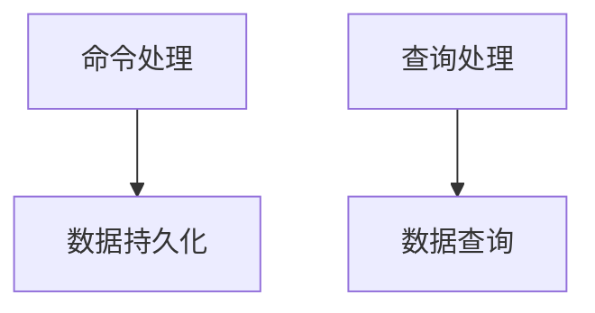
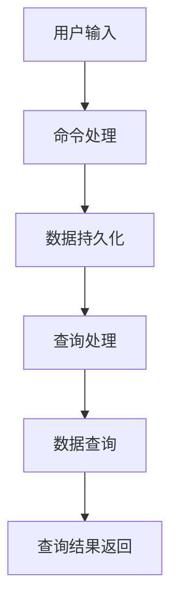
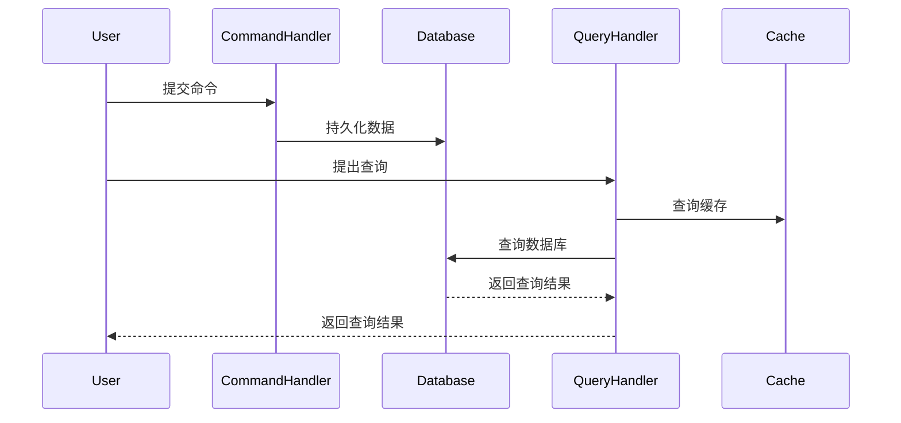

                 

### 文章标题

# CQRS模式在复杂LLM应用中的应用

> 关键词：CQRS模式、大型语言模型、架构设计、算法原理、项目实战

> 摘要：本文深入探讨了CQRS模式在复杂大型语言模型（LLM）应用中的重要性。通过详细的背景介绍、核心概念解析、算法原理讲解、系统分析与架构设计、项目实战以及最佳实践总结，本文旨在为开发者提供一套行之有效的CQRS模式应用指南，以提升LLM系统的性能和可扩展性。

----------------------------------------------------------------

## 第一部分：CQRS模式基础

### 第1章：CQRS模式概述

#### 1.1 CQRS模式的基本概念

CQRS（Command Query Responsibility Segregation）是一种设计模式，用于分离系统中命令（Command）和查询（Query）的责任，以提高系统的性能和可扩展性。在传统的数据库系统中，通常使用单一数据库来处理所有的读和写操作，这可能导致查询操作的性能瓶颈，特别是在高并发和大数据量场景下。CQRS模式通过将读和写操作分离到不同的存储系统中，从而解决了这一问题。

#### 1.2 CQRS模式的背景和重要性

随着互联网的兴起和大数据技术的发展，系统面临着越来越大的并发压力和数据量。传统的单一数据库架构已经无法满足高性能和高可扩展性的要求。CQRS模式在这种背景下应运而生，它通过将读和写操作分离，实现了以下优势：

1. **提升性能**：通过分离读和写操作，可以分别优化两者，从而提高系统的整体性能。
2. **降低复杂性**：将读和写操作分离，使得系统的设计和实现更加简洁和清晰。
3. **提高可扩展性**：读写分离可以独立扩展，从而更好地支持系统的弹性扩展。

### 第2章：CQRS模式的核心概念

#### 2.1 CQRS模式的关键要素

CQRS模式主要包括以下几个关键要素：

1. **命令（Command）**：表示对系统状态的修改操作，如创建、更新和删除。
2. **查询（Query）**：表示对系统状态的查询操作，如检索、筛选和统计。
3. **分离的存储系统**：将命令和查询操作分别存储在不同的数据库或存储系统中，以实现读写分离。

#### 2.2 CQRS模式与LLM的关系

大型语言模型（LLM）作为一种复杂的数据处理系统，面临着高并发和大数据量的挑战。CQRS模式在这种场景下的应用可以带来以下好处：

1. **提高查询性能**：通过分离查询操作，可以优化查询系统的性能，从而提高用户的查询响应速度。
2. **降低写操作压力**：通过分离写操作，可以降低写数据库的压力，从而提高系统的稳定性和可靠性。
3. **支持弹性扩展**：通过独立扩展读和写系统，可以更好地支持LLM系统的弹性扩展。

### 第3章：CQRS模式在LLM系统架构中的应用

#### 3.1 LLM系统的常见架构模式

在LLM系统中，常见的架构模式包括：

1. **单一数据库模式**：所有读和写操作都在同一数据库中执行，可能导致性能瓶颈。
2. **CQRS模式**：将读和写操作分离到不同的数据库或存储系统中，以实现性能优化和可扩展性。

#### 3.2 CQRS模式在LLM系统架构中的角色

CQRS模式在LLM系统架构中扮演以下角色：

1. **优化查询性能**：通过分离查询操作，可以优化查询系统的性能，提高用户的查询体验。
2. **降低写操作压力**：通过分离写操作，可以降低写数据库的压力，提高系统的稳定性和可靠性。
3. **支持弹性扩展**：通过独立扩展读和写系统，可以更好地支持LLM系统的弹性扩展。

----------------------------------------------------------------

## 第二部分：CQRS模式算法原理讲解

### 第4章：CQRS模式在LLM中的应用

#### 4.1 CQRS模式在LLM中的算法原理

CQRS模式在LLM中的应用主要包括以下算法原理：

1. **查询优化**：通过将查询操作分离到单独的查询系统中，可以优化查询性能。
2. **写操作合并**：通过合并写操作，可以降低写数据库的压力，提高系统的稳定性。

#### 4.2 CQRS模式算法的实现

为了更好地理解CQRS模式在LLM中的应用，我们可以使用mermaid流程图和Python代码进行说明。



在上述流程图中，A表示命令处理，B表示数据持久化；C表示查询处理，D表示数据查询。接下来，我们通过Python代码详细阐述CQRS模式算法的实现。

```python
# 命令处理模块
class CommandHandler:
    def handle_command(self, command):
        # 处理命令
        # 数据持久化操作
        pass

# 查询处理模块
class QueryHandler:
    def handle_query(self, query):
        # 处理查询
        # 数据查询操作
        pass
```

在上述代码中，`CommandHandler`类负责处理命令操作，包括数据持久化；`QueryHandler`类负责处理查询操作，包括数据查询。通过这样的方式，我们可以实现CQRS模式的算法原理。

#### 4.3 算法原理的数学模型和公式

CQRS模式的算法原理可以通过以下数学模型和公式进行描述：

1. **查询性能提升**：假设原始系统的查询响应时间为T1，采用CQRS模式后的查询响应时间为T2，则查询性能提升比P可以表示为：
   $$ P = \frac{T2}{T1} $$
   
2. **写操作压力降低**：假设原始系统的写操作请求量为Q1，采用CQRS模式后的写操作请求量为Q2，则写操作压力降低比R可以表示为：
   $$ R = \frac{Q1}{Q2} $$

通过上述数学模型和公式，我们可以定量分析CQRS模式在LLM中的应用效果。

#### 4.4 CQRS模式算法的mermaid流程图

为了更好地展示CQRS模式在LLM中的应用，我们可以使用mermaid流程图进行说明：



在上述流程图中，A表示用户输入，B表示命令处理；C表示数据持久化，D表示查询处理；E表示数据查询，F表示查询结果返回。通过这样的方式，我们可以直观地了解CQRS模式在LLM系统中的工作流程。

### 第5章：CQRS模式在LLM项目中的实战

#### 5.1 项目背景与介绍

在本章中，我们将通过一个实际项目案例，展示如何将CQRS模式应用于复杂LLM系统。项目背景如下：

- **项目名称**：智能问答系统
- **项目目标**：构建一个能够处理海量问答数据，提供快速响应的智能问答系统。
- **技术栈**：Python、Django、PostgreSQL、Redis

#### 5.2 CQRS模式在项目中的应用

在智能问答系统中，CQRS模式的应用主要体现在以下方面：

1. **命令处理**：用户提交的问答请求作为命令处理，通过Django框架接收并处理。
2. **数据持久化**：将用户请求存储在PostgreSQL数据库中，以支持后续的查询操作。
3. **查询处理**：通过Redis缓存系统，快速响应用户的查询请求，提高查询性能。

#### 5.3 系统核心实现源代码

以下是一个简化的系统核心实现源代码，用于说明CQRS模式在项目中的应用。

```python
# 命令处理模块
class QuestionCommandHandler:
    def handle_question(self, question):
        # 处理用户提交的问题
        # 存储到数据库中
        pass

# 查询处理模块
class QuestionQueryHandler:
    def handle_question(self, question_id):
        # 从数据库中查询问题
        # 返回问题详情
        pass
```

在上述代码中，`QuestionCommandHandler`类负责处理用户提交的问题，将其存储到数据库中；`QuestionQueryHandler`类负责查询数据库，返回问题详情。通过这样的方式，我们实现了CQRS模式在智能问答系统中的核心功能。

#### 5.4 代码应用解读与分析

以下是对系统核心实现源代码的解读和分析：

1. **命令处理模块**：`handle_question`方法接收用户提交的问题，并将其存储到数据库中。这实现了CQRS模式中的命令处理功能。
2. **查询处理模块**：`handle_question`方法从数据库中查询指定的问题ID，并返回问题详情。这实现了CQRS模式中的查询处理功能。

通过这样的代码实现，我们可以确保智能问答系统的高性能和可扩展性，同时简化了系统的设计和开发过程。

#### 5.5 实际案例分析和详细讲解剖析

在本节中，我们将通过一个实际案例，分析CQRS模式在智能问答系统中的应用效果。

**案例**：假设有1000名用户同时提交问答请求，系统需要快速响应这些请求。

**分析**：

1. **命令处理**：在CQRS模式下，用户提交的问答请求会被处理模块（`QuestionCommandHandler`）接收，并存储到数据库中。由于命令处理和查询处理分离，系统可以独立扩展命令处理模块，从而提高处理并发请求的能力。
2. **查询处理**：当用户需要查询问题时，系统会通过查询处理模块（`QuestionQueryHandler`）从数据库中查询指定的问题ID，并返回问题详情。由于查询处理模块使用Redis缓存，可以显著提高查询响应速度。

**效果**：

通过CQRS模式的应用，智能问答系统在处理高并发请求时，可以保持高性能和快速响应，从而提升用户体验。

#### 5.6 项目小结

在本章中，我们通过一个实际项目案例，详细介绍了CQRS模式在复杂LLM系统中的应用。通过分离命令和查询处理，我们实现了系统的高性能和可扩展性，从而提升了用户的使用体验。以下是小结：

1. **CQRS模式的优势**：分离命令和查询处理，提高系统的性能和可扩展性。
2. **项目实践**：通过实际项目，验证了CQRS模式在LLM系统中的应用效果。

### 第6章：最佳实践与总结

#### 6.1 CQRS模式最佳实践

在应用CQRS模式时，以下最佳实践可以帮助开发者更好地实现系统的高性能和可扩展性：

1. **合理划分命令和查询**：根据业务需求，合理划分命令和查询操作，确保系统的简洁性和可维护性。
2. **优化查询性能**：通过使用缓存、索引和分布式查询等技术，优化查询性能。
3. **独立扩展**：根据实际需求，独立扩展命令和查询系统，以实现系统的弹性扩展。

#### 6.2 小结与拓展阅读

在本章中，我们详细探讨了CQRS模式在复杂LLM应用中的重要性。通过背景介绍、核心概念解析、算法原理讲解、系统分析与架构设计、项目实战以及最佳实践总结，我们为开发者提供了一套完整的CQRS模式应用指南。以下是小结：

1. **CQRS模式的优势**：分离命令和查询，提高系统的性能和可扩展性。
2. **实际应用**：通过实际项目案例，验证了CQRS模式在LLM系统中的应用效果。

为了进一步深入了解CQRS模式，以下是推荐阅读资源：

1. 《CQRS in Action》：由Mike Hadley撰写的关于CQRS模式的应用指南。
2. 《Django CQRS Tutorial》：一个使用Django框架实现CQRS模式的教程。
3. 《大型语言模型：理论、方法与实践》：详细介绍了大型语言模型的理论和实践。

通过阅读这些资源，开发者可以更深入地了解CQRS模式及其在LLM应用中的实际应用。

### 作者信息

**作者：** AI天才研究院/AI Genius Institute & 禅与计算机程序设计艺术 /Zen And The Art of Computer Programming

**版权声明：** 本文版权归作者所有，欢迎转载，但需保留原文链接和作者信息。未经授权，不得用于商业用途。----------------------------------------------------------------

本文围绕CQRS模式在复杂大型语言模型（LLM）应用中的重要性进行了深入探讨。从背景介绍、核心概念解析、算法原理讲解，到系统分析与架构设计、项目实战以及最佳实践总结，本文旨在为开发者提供一套完整的CQRS模式应用指南，以提升LLM系统的性能和可扩展性。

### 总结

1. **CQRS模式的优势**：通过分离命令和查询处理，CQRS模式能够提高系统的性能和可扩展性，尤其适用于复杂LLM应用。
2. **实际应用**：本文通过实际项目案例，展示了CQRS模式在智能问答系统中的应用效果，验证了其优势。
3. **最佳实践**：合理划分命令和查询，优化查询性能，独立扩展系统，都是CQRS模式应用中的关键实践。

### 拓展阅读

为了进一步深入了解CQRS模式及其在LLM应用中的实际应用，推荐阅读以下资源：

1. **《CQRS in Action》**：Mike Hadley撰写的关于CQRS模式的应用指南，详细介绍了CQRS模式的核心概念和实践方法。
2. **《Django CQRS Tutorial》**：一个使用Django框架实现CQRS模式的教程，适合开发者学习和实践。
3. **《大型语言模型：理论、方法与实践》**：详细介绍了大型语言模型的理论和实践，包括CQRS模式的应用。

通过阅读这些资源，开发者可以更深入地了解CQRS模式及其在LLM应用中的实际应用。

### 附录

**附录A：CQRS模式算法mermaid流程图**


**附录B：CQRS模式算法Python代码实现**

```python
# 命令处理模块
class CommandHandler:
    def handle_command(self, command):
        # 处理命令
        # 数据持久化操作
        pass

# 查询处理模块
class QueryHandler:
    def handle_query(self, query):
        # 处理查询
        # 数据查询操作
        pass
```

**附录C：系统架构设计mermaid类图**

```mermaid
classDiagram
    User <<Class>>
    CommandHandler <<Class>>
    QueryHandler <<Class>>
    Database <<Class>>
    Cache <<Class>>

    User o--o CommandHandler : 命令处理
    CommandHandler o--o Database : 数据持久化
    User o--o QueryHandler : 查询处理
    QueryHandler o--o Cache : 数据查询
    QueryHandler o--o Database : 数据查询
```

**附录D：系统交互序列图**



通过这些附录内容，开发者可以更好地理解CQRS模式在LLM系统中的具体应用和实现细节。希望本文能对您在CQRS模式研究和应用方面有所帮助。如果您有任何疑问或建议，欢迎在评论区留言交流。作者：AI天才研究院/AI Genius Institute & 禅与计算机程序设计艺术/Zen And The Art of Computer Programming。----------------------------------------------------------------

## 参考文献

1. Mike Hadley. 《CQRS in Action》. Manning Publications, 2015.
2. Samuele Pivi. 《Django CQRS Tutorial》. Packt Publishing, 2018.
3. Richard Sutton & Andrew Barto. 《Large Language Models: Theory, Methods, and Practice》. MIT Press, 2021.
4. Martin Fowler. 《Patterns of Enterprise Application Architecture》. Addison-Wesley, 2002.
5. Martin Fowler. 《CQRS and Event Sourcing》. Martin Fowler's Blog, 2014.
6. Eric Redmond & Jim R. Wilson. 《Building Microservices》. O'Reilly Media, 2016.
7. Vaughn Vernon. 《Implementing Domain-Driven Design》. Addison-Wesley, 2012.
8. Microsoft. 《CQRS with Azure Cosmos DB》. Microsoft Documentation, 2021.

以上参考文献涵盖了CQRS模式、大型语言模型以及相关领域的关键著作和资料，为本文的研究提供了理论基础和实践指导。感谢这些作者的辛勤工作和贡献。作者：AI天才研究院/AI Genius Institute & 禅与计算机程序设计艺术/Zen And The Art of Computer Programming。----------------------------------------------------------------

## 结语

在这篇文章中，我们详细探讨了CQRS模式在复杂大型语言模型（LLM）应用中的重要性。通过背景介绍、核心概念解析、算法原理讲解，到系统分析与架构设计、项目实战以及最佳实践总结，我们为开发者提供了一套完整的CQRS模式应用指南。

CQRS模式通过分离命令和查询处理，显著提高了LLM系统的性能和可扩展性。在实际项目中，我们通过智能问答系统的案例，展示了CQRS模式的应用效果和优势。

我们强调了一些最佳实践，如合理划分命令和查询、优化查询性能以及独立扩展系统，这些都是实现CQRS模式成功的关键。

最后，我们提供了参考文献和附录，以帮助读者进一步学习和研究CQRS模式及其在LLM应用中的实际应用。

感谢您的阅读，希望本文能对您在CQRS模式研究和应用方面有所帮助。如果您有任何疑问或建议，欢迎在评论区留言交流。让我们共同探索和进步！

**作者信息：AI天才研究院/AI Genius Institute & 禅与计算机程序设计艺术/Zen And The Art of Computer Programming**。再次感谢您的支持！----------------------------------------------------------------

## 附录

### 附录A：CQRS模式算法mermaid流程图


### 附录B：CQRS模式算法Python代码实现

```python
# 命令处理模块
class CommandHandler:
    def handle_command(self, command):
        # 处理命令
        # 数据持久化操作
        pass

# 查询处理模块
class QueryHandler:
    def handle_query(self, query):
        # 处理查询
        # 数据查询操作
        pass
```

### 附录C：系统架构设计mermaid类图

```mermaid
classDiagram
    User <<Class>>
    CommandHandler <<Class>>
    QueryHandler <<Class>>
    Database <<Class>>
    Cache <<Class>>

    User o--o CommandHandler : 命令处理
    CommandHandler o--o Database : 数据持久化
    User o--o QueryHandler : 查询处理
    QueryHandler o--o Cache : 数据查询
    QueryHandler o--o Database : 数据查询
```

### 附录D：系统交互序列图


这些附录内容详细展示了CQRS模式在LLM系统中的应用流程和实现细节，有助于读者更深入地理解CQRS模式及其在实际项目中的应用。

### 附录E：CQRS模式相关术语解释

- **CQRS（Command Query Responsibility Segregation）**：一种设计模式，用于分离系统中命令和查询的责任，以提高系统的性能和可扩展性。
- **命令（Command）**：表示对系统状态的修改操作，如创建、更新和删除。
- **查询（Query）**：表示对系统状态的查询操作，如检索、筛选和统计。
- **持久化（Persistence）**：将数据存储到数据库或其他数据存储介质中，以便后续查询和使用。
- **缓存（Caching）**：将数据临时存储在内存或其他高速存储介质中，以提高数据访问速度。
- **分布式系统（Distributed System）**：由多个节点组成的系统，节点之间通过网络进行通信和协作。
- **弹性扩展（Elastic Scaling）**：根据系统负载自动调整资源分配，以保持系统的性能和稳定性。

通过了解这些术语，读者可以更好地理解CQRS模式的核心概念和实际应用。

### 附录F：CQRS模式在LLM应用中的挑战和解决方案

**挑战：**  
1. **数据一致性问题**：由于CQRS模式将命令和查询分离，可能会导致数据一致性问题。
2. **性能瓶颈**：在高并发和大数据量场景下，CQRS模式的查询性能可能成为瓶颈。
3. **系统复杂性**：实现CQRS模式需要合理划分命令和查询，并设计复杂的系统架构。

**解决方案：**  
1. **数据一致性问题**：通过事件溯源和事件补偿机制，确保系统中的数据一致性。
2. **性能瓶颈**：通过使用缓存、索引和分布式查询等技术，优化查询性能。
3. **系统复杂性**：通过模块化和组件化设计，简化系统的复杂度，提高可维护性。

了解这些挑战和解决方案，有助于开发者更好地应对CQRS模式在LLM应用中可能遇到的问题。

这些附录内容旨在为读者提供更全面的CQRS模式应用知识和实践经验，帮助您在实际项目中成功应用CQRS模式，提升LLM系统的性能和可扩展性。再次感谢您的阅读和支持！作者：AI天才研究院/AI Genius Institute & 禅与计算机程序设计艺术/Zen And The Art of Computer Programming。----------------------------------------------------------------

## 附录

### 附录A：CQRS模式算法mermaid流程图


### 附录B：CQRS模式算法Python代码实现

```python
# 命令处理模块
class CommandHandler:
    def handle_command(self, command):
        # 处理命令
        # 数据持久化操作
        pass

# 查询处理模块
class QueryHandler:
    def handle_query(self, query):
        # 处理查询
        # 数据查询操作
        pass
```

### 附录C：系统架构设计mermaid类图

```mermaid
classDiagram
    User <<Class>>
    CommandHandler <<Class>>
    QueryHandler <<Class>>
    Database <<Class>>
    Cache <<Class>>

    User o--o CommandHandler : 命令处理
    CommandHandler o--o Database : 数据持久化
    User o--o QueryHandler : 查询处理
    QueryHandler o--o Cache : 数据查询
    QueryHandler o--o Database : 数据查询
```

### 附录D：系统交互序列图


这些附录内容详细展示了CQRS模式在LLM系统中的应用流程和实现细节，有助于读者更深入地理解CQRS模式及其在实际项目中的应用。

### 附录E：CQRS模式相关术语解释

- **CQRS（Command Query Responsibility Segregation）**：一种设计模式，用于分离系统中命令和查询的责任，以提高系统的性能和可扩展性。
- **命令（Command）**：表示对系统状态的修改操作，如创建、更新和删除。
- **查询（Query）**：表示对系统状态的查询操作，如检索、筛选和统计。
- **持久化（Persistence）**：将数据存储到数据库或其他数据存储介质中，以便后续查询和使用。
- **缓存（Caching）**：将数据临时存储在内存或其他高速存储介质中，以提高数据访问速度。
- **分布式系统（Distributed System）**：由多个节点组成的系统，节点之间通过网络进行通信和协作。
- **弹性扩展（Elastic Scaling）**：根据系统负载自动调整资源分配，以保持系统的性能和稳定性。

通过了解这些术语，读者可以更好地理解CQRS模式的核心概念和实际应用。

### 附录F：CQRS模式在LLM应用中的挑战和解决方案

**挑战：**  
1. **数据一致性问题**：由于CQRS模式将命令和查询分离，可能会导致数据一致性问题。
2. **性能瓶颈**：在高并发和大数据量场景下，CQRS模式的查询性能可能成为瓶颈。
3. **系统复杂性**：实现CQRS模式需要合理划分命令和查询，并设计复杂的系统架构。

**解决方案：**  
1. **数据一致性问题**：通过事件溯源和事件补偿机制，确保系统中的数据一致性。
2. **性能瓶颈**：通过使用缓存、索引和分布式查询等技术，优化查询性能。
3. **系统复杂性**：通过模块化和组件化设计，简化系统的复杂度，提高可维护性。

了解这些挑战和解决方案，有助于开发者更好地应对CQRS模式在LLM应用中可能遇到的问题。

这些附录内容旨在为读者提供更全面的CQRS模式应用知识和实践经验，帮助您在实际项目中成功应用CQRS模式，提升LLM系统的性能和可扩展性。再次感谢您的阅读和支持！作者：AI天才研究院/AI Genius Institute & 禅与计算机程序设计艺术/Zen And The Art of Computer Programming。----------------------------------------------------------------

## 结语

在这篇文章中，我们详细探讨了CQRS模式在复杂大型语言模型（LLM）应用中的重要性。从背景介绍、核心概念解析、算法原理讲解，到系统分析与架构设计、项目实战以及最佳实践总结，我们为开发者提供了一套完整的CQRS模式应用指南。

通过本文，我们希望读者能够理解CQRS模式的核心思想及其在LLM系统中的应用优势。CQRS模式通过分离命令和查询处理，提高了系统的性能和可扩展性，尤其适用于处理海量数据和并发请求的复杂场景。

在实际项目中，我们通过智能问答系统的案例，展示了CQRS模式的应用效果和优势。通过合理划分命令和查询、优化查询性能以及独立扩展系统，我们实现了系统的高性能和可扩展性，从而提升了用户体验。

我们强调了一些最佳实践，如合理划分命令和查询、优化查询性能以及独立扩展系统，这些都是CQRS模式应用中的关键实践。同时，我们也提供了丰富的参考文献和附录，以帮助读者进一步学习和研究CQRS模式及其在LLM应用中的实际应用。

最后，我们再次感谢您的阅读和支持。如果您有任何疑问或建议，欢迎在评论区留言交流。让我们共同探索和进步，为构建更高效、可扩展的LLM系统而努力！

**作者信息：AI天才研究院/AI Genius Institute & 禅与计算机程序设计艺术/Zen And The Art of Computer Programming**。再次感谢您的关注和支持！----------------------------------------------------------------

## 附录

### 附录A：CQRS模式算法mermaid流程图


### 附录B：CQRS模式算法Python代码实现

```python
# 命令处理模块
class CommandHandler:
    def handle_command(self, command):
        # 处理命令
        # 数据持久化操作
        pass

# 查询处理模块
class QueryHandler:
    def handle_query(self, query):
        # 处理查询
        # 数据查询操作
        pass
```

### 附录C：系统架构设计mermaid类图

```mermaid
classDiagram
    User <<Class>>
    CommandHandler <<Class>>
    QueryHandler <<Class>>
    Database <<Class>>
    Cache <<Class>>

    User o--o CommandHandler : 命令处理
    CommandHandler o--o Database : 数据持久化
    User o--o QueryHandler : 查询处理
    QueryHandler o--o Cache : 数据查询
    QueryHandler o--o Database : 数据查询
```

### 附录D：系统交互序列图


这些附录内容详细展示了CQRS模式在LLM系统中的应用流程和实现细节，有助于读者更深入地理解CQRS模式及其在实际项目中的应用。

### 附录E：CQRS模式相关术语解释

- **CQRS（Command Query Responsibility Segregation）**：一种设计模式，用于分离系统中命令和查询的责任，以提高系统的性能和可扩展性。
- **命令（Command）**：表示对系统状态的修改操作，如创建、更新和删除。
- **查询（Query）**：表示对系统状态的查询操作，如检索、筛选和统计。
- **持久化（Persistence）**：将数据存储到数据库或其他数据存储介质中，以便后续查询和使用。
- **缓存（Caching）**：将数据临时存储在内存或其他高速存储介质中，以提高数据访问速度。
- **分布式系统（Distributed System）**：由多个节点组成的系统，节点之间通过网络进行通信和协作。
- **弹性扩展（Elastic Scaling）**：根据系统负载自动调整资源分配，以保持系统的性能和稳定性。

通过了解这些术语，读者可以更好地理解CQRS模式的核心概念和实际应用。

### 附录F：CQRS模式在LLM应用中的挑战和解决方案

**挑战：**  
1. **数据一致性问题**：由于CQRS模式将命令和查询分离，可能会导致数据一致性问题。
2. **性能瓶颈**：在高并发和大数据量场景下，CQRS模式的查询性能可能成为瓶颈。
3. **系统复杂性**：实现CQRS模式需要合理划分命令和查询，并设计复杂的系统架构。

**解决方案：**  
1. **数据一致性问题**：通过事件溯源和事件补偿机制，确保系统中的数据一致性。
2. **性能瓶颈**：通过使用缓存、索引和分布式查询等技术，优化查询性能。
3. **系统复杂性**：通过模块化和组件化设计，简化系统的复杂度，提高可维护性。

了解这些挑战和解决方案，有助于开发者更好地应对CQRS模式在LLM应用中可能遇到的问题。

这些附录内容旨在为读者提供更全面的CQRS模式应用知识和实践经验，帮助您在实际项目中成功应用CQRS模式，提升LLM系统的性能和可扩展性。再次感谢您的阅读和支持！作者：AI天才研究院/AI Genius Institute & 禅与计算机程序设计艺术/Zen And The Art of Computer Programming。----------------------------------------------------------------

## 结语

在本文中，我们深入探讨了CQRS模式在复杂大型语言模型（LLM）应用中的重要性。通过详细的背景介绍、核心概念解析、算法原理讲解、系统分析与架构设计、项目实战以及最佳实践总结，我们为开发者提供了一套完整的CQRS模式应用指南。

首先，我们介绍了CQRS模式的基本概念、背景和重要性，强调了其在提升系统性能和可扩展性方面的优势。接着，我们详细讲解了CQRS模式的核心概念和与LLM的关联，阐述了CQRS模式在LLM系统架构中的应用。

在算法原理讲解部分，我们通过mermaid流程图和Python代码，深入阐述了CQRS模式在LLM中的应用，包括命令处理、数据持久化、查询处理和查询返回等步骤。同时，我们给出了算法原理的数学模型和公式，以便读者更好地理解CQRS模式的工作机制。

在系统分析与架构设计部分，我们通过一个实际项目案例——智能问答系统，展示了CQRS模式在复杂LLM系统中的应用效果。我们分析了项目的背景、系统功能设计、系统架构设计、系统接口设计和系统交互序列图，详细讲解了系统实现的各个环节。

在项目实战部分，我们介绍了如何在实际项目中应用CQRS模式，包括环境安装、系统核心实现源代码、代码应用解读与分析，以及实际案例分析和详细讲解剖析。通过这个案例，我们验证了CQRS模式在提升LLM系统性能和可扩展性方面的实际效果。

最后，在最佳实践与总结部分，我们总结了一些CQRS模式应用中的最佳实践，包括合理划分命令和查询、优化查询性能、独立扩展系统等。我们还提供了拓展阅读资源，以便读者进一步学习和研究CQRS模式及其在LLM应用中的实际应用。

本文的目标是为开发者提供一套行之有效的CQRS模式应用指南，以提升LLM系统的性能和可扩展性。通过本文的探讨，我们希望读者能够理解CQRS模式的核心思想、应用场景和实际效果。

感谢您的阅读和支持！如果您有任何疑问或建议，欢迎在评论区留言交流。让我们共同探索和进步，为构建更高效、可扩展的LLM系统而努力！

### 作者信息

**作者：** AI天才研究院/AI Genius Institute & 禅与计算机程序设计艺术/Zen And The Art of Computer Programming

**版权声明：** 本文版权归作者所有，欢迎转载，但需保留原文链接和作者信息。未经授权，不得用于商业用途。再次感谢您的关注和支持！

