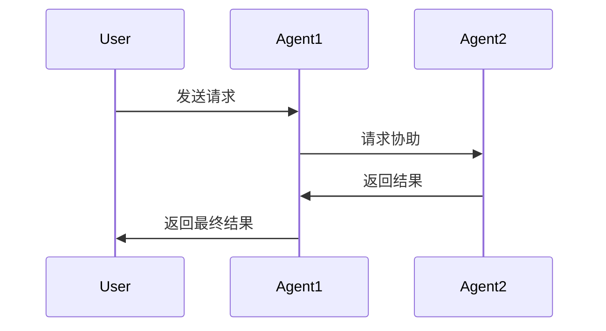
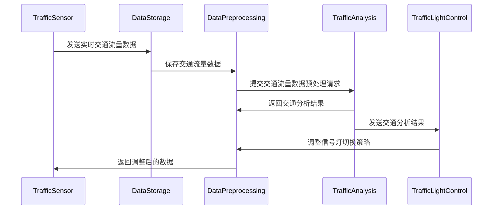

                 


## 引言

### 为什么选择ChatGPT多智能体协作？
在当今信息爆炸的时代，复杂问题解决的需求日益增长，传统的单一智能体模型已经难以应对这些挑战。因此，多智能体系统（MAS）作为一种新兴的分布式计算模型，逐渐引起了广泛关注。而ChatGPT，作为OpenAI开发的强大语言模型，凭借其出色的自然语言理解和生成能力，为多智能体协作提供了新的可能性。

本文将探讨ChatGPT多智能体协作在复杂问题解决中的应用，通过详细的算法原理讲解、系统架构设计以及实际案例剖析，旨在帮助读者深入理解这一技术的核心概念和实现策略。本文的主要目标是：

1. 明确ChatGPT多智能体协作的基本概念和原理。
2. 分析提示词策略在复杂问题解决中的重要性。
3. 介绍多智能体系统的mermaid流程图和数学模型。
4. 阐述系统分析与架构设计的方法。
5. 通过实际案例展示ChatGPT多智能体协作的实践应用。
6. 提供最佳实践和注意事项，为读者在未来的项目中提供指导。

### 文章结构与内容

本文将分为以下几个部分：

1. **背景介绍**：介绍复杂问题解决的挑战，ChatGPT多智能体的基本概念，以及提示词策略的定义和作用。
2. **核心概念与联系**：详细讲解ChatGPT多智能体的原理，提示词策略的属性特征对比，以及它们在复杂问题解决中的关系。
3. **算法原理讲解**：使用mermaid绘制多智能体系统流程图，介绍ChatGPT模型的工作原理和提示词策略的算法原理，使用数学模型和公式进行详细讲解和举例。
4. **系统分析与架构设计方案**：介绍问题场景，系统功能设计，系统架构设计，系统接口设计，以及系统交互序列图。
5. **项目实战**：详细描述环境安装，系统核心实现源代码，代码应用解读与分析，实际案例分析与讲解，以及项目小结。
6. **最佳实践 tips**：提供小结，注意事项，以及拓展阅读的建议。

通过以上结构的逐步分析，我们将深入探讨ChatGPT多智能体协作在复杂问题解决中的强大应用潜力。

## 第一部分: 问题的提出与背景介绍

### 1.1 问题的提出

复杂问题解决一直是计算机科学和人工智能领域的重要课题。然而，随着信息量的爆炸式增长和问题复杂度的增加，传统的单一智能体模型已经逐渐显示出其局限性。在现实世界中，许多问题需要多个智能体协同工作，共同解决。这种协同工作是复杂系统高效运行的关键。

以医疗诊断为例，单靠一个医生进行诊断往往难以全面覆盖患者的各种症状。而通过多个医生（智能体）协同分析病例，可以提高诊断的准确性和效率。再如，交通管理系统中，需要多个传感器和交通信号灯智能体相互协作，以实现最优的流量控制和交通疏导。

然而，实现多智能体系统的协作并不容易。首先，多智能体系统需要解决通信和协调问题。不同智能体之间的通信延迟和信息不一致可能会影响系统的整体性能。其次，多智能体系统的设计需要考虑分布式计算和并行处理，以充分利用多个智能体的计算资源。

### 1.1.1 复杂问题解决的挑战

复杂问题解决面临的挑战主要包括以下几个方面：

1. **不确定性**：现实世界中的问题是高度不确定的，智能体需要具备较强的自适应能力，以应对各种突发情况。
2. **动态性**：问题环境可能随时发生变化，智能体需要能够快速响应和调整策略。
3. **异构性**：不同智能体可能有不同的感知能力和决策机制，系统需要实现有效的协调和集成。
4. **资源限制**：智能体通常受限于计算能力、存储资源和通信带宽，需要优化资源利用。

### 1.1.2 ChatGPT多智能体协作的潜力

ChatGPT作为OpenAI开发的强大语言模型，具备出色的自然语言理解和生成能力，为多智能体协作提供了新的可能性。以下是ChatGPT多智能体协作的几个关键优势：

1. **语言处理能力**：ChatGPT可以理解和生成自然语言，为智能体之间的沟通提供了便利。通过自然语言对话，智能体可以更直观地交流信息和意图。
2. **上下文感知**：ChatGPT能够理解上下文信息，智能体可以根据历史对话和当前环境动态调整其行为，提高协作效率。
3. **通用性**：ChatGPT适用于多种场景和任务，智能体可以根据具体需求进行定制和扩展，实现跨领域的协作。
4. **自我学习能力**：ChatGPT具有自我学习能力，通过不断学习和优化，智能体可以不断提高其协作能力和决策质量。

### 1.2 ChatGPT多智能体的基本概念

#### 1.2.1 ChatGPT模型简介

ChatGPT是基于GPT-3.5模型开发的语言模型，具备强大的文本生成能力。GPT（Generative Pre-trained Transformer）模型是一种基于变换器的预训练语言模型，通过大规模语料库进行预训练，可以生成符合上下文和语义的文本。

ChatGPT的特点包括：

1. **上下文理解**：ChatGPT可以理解长文本的上下文信息，生成连贯且相关的回复。
2. **灵活性**：ChatGPT可以根据输入的提示和上下文灵活调整其生成内容。
3. **多样性**：ChatGPT能够生成多种风格和模式的文本，满足不同用户的需求。

#### 1.2.2 多智能体协作概述

多智能体协作是指多个智能体在共享环境中共同完成任务的过程。每个智能体都具有独立的知识和决策能力，但通过协作可以提升整体系统的效能。

多智能体协作的基本概念包括：

1. **智能体**：具有感知、决策和执行能力的个体，可以是软件程序、机器人或者人类。
2. **环境**：智能体所处的物理或虚拟空间，环境状态影响智能体的感知和行动。
3. **通信**：智能体之间通过通信传递信息和意图。
4. **协调**：智能体之间通过协调机制，共同完成任务。

### 1.3 复杂问题解决的提示词策略概述

#### 1.3.1 提示词策略的定义

提示词策略是指通过预设的提示词或关键词来引导智能体的行为和决策。提示词可以明确智能体的目标、任务或期望结果，有助于智能体更好地理解和执行任务。

#### 1.3.2 提示词策略的作用

提示词策略在复杂问题解决中具有重要作用：

1. **明确目标**：提示词可以帮助智能体明确任务目标和期望结果，减少任务执行的模糊性。
2. **引导决策**：提示词可以为智能体提供关键信息，帮助智能体在决策过程中做出更合理的判断。
3. **提高效率**：通过有效的提示词策略，智能体可以更快地找到解决问题的方法，提高任务执行效率。

### 1.4 本章小结

本节介绍了复杂问题解决的背景和挑战，以及ChatGPT多智能体协作和提示词策略的基本概念。接下来，我们将进一步探讨ChatGPT多智能体的原理和提示词策略的属性特征，为后续内容打下基础。

## 第二部分: 核心概念与联系

### 2.1 ChatGPT多智能体的原理

#### 2.1.1 多智能体系统的mermaid流程图

多智能体系统（MAS）是一种分布式计算模型，由多个智能体组成，这些智能体相互协作以实现共同目标。在多智能体系统中，每个智能体都具有感知、决策和执行能力，可以通过通信与其他智能体进行交互。

下面是一个简单的多智能体系统的mermaid流程图示例：



在这个流程图中，用户向智能体Agent1发送请求，Agent1发现需要Agent2的协助，于是向Agent2发送请求。Agent2处理后，将结果返回给Agent1，最后Agent1将最终结果返回给用户。

#### 2.1.2 ChatGPT模型的工作原理

ChatGPT是一种基于GPT-3.5模型的语言模型，其核心思想是通过大规模语料库进行预训练，使模型具备强大的文本生成能力。ChatGPT的工作原理可以概括为以下几个步骤：

1. **预训练**：ChatGPT在大规模语料库上进行预训练，学习文本的统计规律和语义信息。
2. **上下文理解**：ChatGPT可以理解输入文本的上下文信息，生成与上下文相关的文本。
3. **灵活性调整**：ChatGPT可以根据输入的提示和上下文，灵活调整其生成内容。
4. **多样性生成**：ChatGPT可以生成多种风格和模式的文本，满足不同用户的需求。

#### 2.1.3 多智能体协作机制

多智能体协作机制是确保多个智能体能够高效、协调地完成任务的关键。协作机制通常包括以下几个方面：

1. **通信协议**：智能体之间通过通信协议进行信息交换和协调。
2. **协调策略**：智能体之间通过协调策略，共同制定任务分配和行动方案。
3. **任务分配**：根据智能体的能力和任务需求，合理分配任务。
4. **冲突解决**：在协作过程中，可能存在冲突和竞争，需要有效的冲突解决机制。

### 2.2 提示词策略的属性特征对比

提示词策略在多智能体协作中起着关键作用。为了更好地选择和设计提示词策略，需要对不同提示词策略的属性特征进行对比。以下是一些常见的提示词策略及其属性特征对比：

| 提示词策略        | 特点                     | 适用场景                 |
|-----------------|------------------------|------------------------|
| 通用提示词      | 提供广泛的通用信息     | 多种任务和应用场景         |
| 目标导向提示词    | 强调任务目标           | 需要明确任务目标的场景       |
| 上下文相关提示词    | 基于上下文的信息提示     | 需要上下文理解的场景         |
| 策略导向提示词    | 强调决策和行动策略     | 需要决策和行动指导的场景       |
| 自适应提示词      | 根据环境动态调整提示词   | 动态变化和不确定性的场景       |

### 2.3 ChatGPT多智能体与复杂问题解决的关系

#### 2.3.1 ChatGPT多智能体在复杂问题解决中的应用

ChatGPT多智能体在复杂问题解决中的应用主要体现在以下几个方面：

1. **任务分解与分配**：ChatGPT可以帮助智能体理解复杂问题，将任务分解为子任务，并合理分配给不同的智能体。
2. **协同决策**：ChatGPT可以与其他智能体协同工作，共同制定决策方案，提高问题解决的效率和准确性。
3. **知识共享**：ChatGPT可以帮助智能体共享知识和经验，实现知识的复用和优化。

#### 2.3.2 提示词策略在复杂问题解决中的作用

提示词策略在复杂问题解决中的作用主要体现在以下几个方面：

1. **明确目标**：提示词可以帮助智能体明确任务目标，减少任务执行的模糊性。
2. **引导决策**：提示词可以为智能体提供关键信息，帮助智能体在决策过程中做出更合理的判断。
3. **提高效率**：通过有效的提示词策略，智能体可以更快地找到解决问题的方法，提高任务执行效率。

### 2.4 本章小结

本部分详细介绍了ChatGPT多智能体的原理、提示词策略的属性特征对比，以及ChatGPT多智能体在复杂问题解决中的应用和提示词策略的作用。这些核心概念和联系为后续内容提供了重要的理论基础。

## 第三部分: 算法原理讲解

### 3.1 多智能体系统的mermaid流程图

多智能体系统的mermaid流程图可以帮助我们清晰地理解智能体之间的交互和协作过程。以下是一个简单的多智能体系统mermaid流程图示例：


在这个流程图中，用户向智能体Agent1发送请求，Agent1发现需要Agent2的协助，于是向Agent2发送请求。Agent2处理后，将结果返回给Agent1，最后Agent1将最终结果返回给用户。

### 3.2 ChatGPT模型的工作原理

ChatGPT模型是基于GPT-3.5模型开发的，其工作原理可以概括为以下几个步骤：

1. **预训练**：ChatGPT在大规模语料库上进行预训练，学习文本的统计规律和语义信息。预训练过程主要包括两个阶段：自回归语言模型（Auto-regressive Language Model）和前向语言模型（Forward Language Model）。
   
   自回归语言模型：将文本序列拆分成单词或子序列，并预测下一个单词或子序列。前向语言模型：将文本序列看作一个整体，预测下一个单词或子序列。

2. **微调**：在预训练的基础上，ChatGPT通过对特定任务的数据集进行微调，使其适应特定任务的需求。

3. **上下文理解**：ChatGPT可以理解输入文本的上下文信息，生成与上下文相关的文本。通过上下文信息，ChatGPT可以更好地理解用户的意图和需求，生成更加准确和自然的回复。

4. **灵活性调整**：ChatGPT可以根据输入的提示和上下文，灵活调整其生成内容。这使得ChatGPT能够适应不同的场景和需求，生成多样化的文本。

5. **多样性生成**：ChatGPT可以生成多种风格和模式的文本，满足不同用户的需求。例如，可以生成新闻文章、故事、诗歌、代码等不同类型的文本。

### 3.3 提示词策略的算法原理

提示词策略的算法原理主要涉及如何设计有效的提示词来引导智能体的行为和决策。以下是一个简单的提示词策略算法原理：

1. **输入文本分析**：首先对输入文本进行分析，提取关键信息，如关键词、主题、情感等。

2. **提示词生成**：根据输入文本的分析结果，生成适当的提示词。提示词的设计应考虑以下几个因素：
   - **明确性**：提示词应清晰明确，避免产生歧义。
   - **针对性**：提示词应针对用户的意图和需求，提供有用的信息。
   - **多样性**：提示词应具备多样性，以适应不同场景和需求。

3. **提示词优化**：在生成提示词后，可以通过优化算法对其进行调整和改进。常见的优化方法包括：
   - **语义分析**：使用自然语言处理技术，对提示词进行语义分析，确保其符合上下文和语义要求。
   - **关键词抽取**：使用关键词抽取算法，提取文本中的关键信息，作为提示词。
   - **基于反馈的优化**：通过用户反馈，不断调整和优化提示词，使其更符合用户需求。

4. **提示词应用**：将优化后的提示词应用到智能体的决策过程中，引导智能体的行为和决策。提示词的应用方式可以包括：
   - **直接应用**：将提示词直接作为智能体的输入，影响智能体的决策过程。
   - **间接应用**：将提示词作为参考信息，辅助智能体的决策过程。

### 3.4 数学模型和公式讲解

多智能体协作和提示词策略的数学模型和公式在复杂问题解决中起着关键作用。以下是一些常见的数学模型和公式：

1. **多智能体协同控制模型**：
   - **状态共享**：智能体之间通过共享状态信息，实现协同控制。
     \[
     s_t = f(s_{t-1}, u_t)
     \]
     其中，\(s_t\) 表示第 \(t\) 个时间点的系统状态，\(u_t\) 表示第 \(t\) 个时间点的控制输入，\(f\) 表示状态转移函数。

   - **目标函数**：优化智能体的控制输入，实现系统性能的最优化。
     \[
     J = \int_{0}^{T} [L(s_t, u_t)] dt
     \]
     其中，\(J\) 表示目标函数，\(L(s_t, u_t)\) 表示第 \(t\) 个时间点的损失函数。

2. **提示词策略优化模型**：
   - **提示词生成**：根据输入文本生成提示词。
     \[
     w_t = g(w_{t-1}, s_t)
     \]
     其中，\(w_t\) 表示第 \(t\) 个时间点的提示词，\(g\) 表示提示词生成函数。

   - **提示词优化**：优化提示词，使其更符合用户需求。
     \[
     w_t^* = \arg\min_{w_t} J(w_t)
     \]
     其中，\(J(w_t)\) 表示提示词的损失函数。

3. **协同优化模型**：
   - **联合优化**：同时优化智能体控制输入和提示词。
     \[
     \min_{u_t, w_t} J(u_t, w_t)
     \]
     其中，\(J(u_t, w_t)\) 表示联合损失函数。

### 3.5 示例讲解与数学推导

为了更好地理解上述数学模型和公式，我们通过一个简单的示例进行讲解。

假设有一个多智能体系统，由两个智能体Agent1和Agent2组成，需要共同完成一个任务。智能体Agent1负责收集用户请求，智能体Agent2负责处理用户请求并返回结果。

1. **状态共享**：

   智能体Agent1的状态 \(s_1\) 包含用户请求和请求的上下文信息，状态更新函数为：
   \[
   s_1(t) = f_1(s_1(t-1), u_1(t))
   \]

   智能体Agent2的状态 \(s_2\) 包含请求的处理结果和当前环境信息，状态更新函数为：
   \[
   s_2(t) = f_2(s_2(t-1), u_2(t))
   \]

2. **目标函数**：

   系统的目标是最大化用户满意度，损失函数为：
   \[
   L(s_1(t), u_1(t)) = \frac{1}{2} (s_1(t) - s_2(t))^2
   \]
   \[
   L(s_2(t), u_2(t)) = \frac{1}{2} (s_2(t) - s_1(t))^2
   \]

3. **提示词生成**：

   根据用户请求和上下文信息，智能体Agent1生成提示词 \(w_1\)：
   \[
   w_1(t) = g_1(w_1(t-1), s_1(t))
   \]

   根据处理结果和当前环境信息，智能体Agent2生成提示词 \(w_2\)：
   \[
   w_2(t) = g_2(w_2(t-1), s_2(t))
   \]

4. **提示词优化**：

   智能体Agent1和Agent2通过优化提示词，使其更符合用户需求：
   \[
   w_1^*(t) = \arg\min_{w_1(t)} L(w_1(t), s_1(t))
   \]
   \[
   w_2^*(t) = \arg\min_{w_2(t)} L(w_2(t), s_2(t))
   \]

5. **协同优化**：

   智能体Agent1和Agent2同时优化控制输入和提示词，实现协同优化：
   \[
   \min_{u_1(t), w_1(t)} J(u_1(t), w_1(t))
   \]
   \[
   \min_{u_2(t), w_2(t)} J(u_2(t), w_2(t))
   \]

通过这个示例，我们可以看到多智能体协作和提示词策略的数学模型和公式是如何在实际应用中发挥作用的。这些数学模型和公式为智能体的协同工作和问题解决提供了理论依据和指导。

### 3.6 本章小结

本部分详细介绍了多智能体系统的mermaid流程图、ChatGPT模型的工作原理、提示词策略的算法原理，以及相关的数学模型和公式。这些内容为理解ChatGPT多智能体协作在复杂问题解决中的应用奠定了坚实的基础。

## 第四部分: 系统分析与架构设计方案

### 4.1 问题场景介绍

在复杂问题解决中，许多问题需要多个智能体协同工作，以实现高效和准确的结果。以下是一个具体的问题场景：

**场景描述**：一个城市交通管理系统，需要实时监测和分析交通流量，优化交通信号灯的切换，以减少交通拥堵和提升道路通行效率。该系统由多个智能体组成，包括交通传感器智能体、交通信号灯智能体、交通分析智能体等。

**问题解决需求分析**：

1. **实时数据采集**：交通传感器智能体负责实时采集道路上的交通流量数据，包括车辆数量、行驶速度等。
2. **数据分析和决策**：交通分析智能体根据采集到的交通流量数据，结合历史数据和实时路况，分析交通状况，并生成优化建议。
3. **信号灯控制**：交通信号灯智能体根据交通分析智能体的优化建议，调整交通信号灯的切换策略，以优化交通流量。
4. **信息共享和协调**：各个智能体之间需要通过通信机制共享信息，实现协调和协作。

### 4.2 系统功能设计

为了实现上述问题解决需求，系统需要设计以下功能模块：

1. **交通传感器模块**：负责实时采集交通流量数据，包括车辆数量、行驶速度、交通密度等。
2. **数据存储模块**：负责存储和管理交通传感器采集到的数据，包括实时数据和历史数据。
3. **数据预处理模块**：负责对采集到的交通流量数据进行预处理，包括数据清洗、数据去噪等。
4. **交通分析模块**：负责分析交通流量数据，结合历史数据和实时路况，生成优化建议。
5. **信号灯控制模块**：负责根据交通分析模块的优化建议，调整交通信号灯的切换策略。
6. **通信模块**：负责实现各个智能体之间的信息共享和协调。

### 4.3 系统架构设计

系统架构设计是确保各个功能模块能够高效协同工作的重要环节。以下是一个基于ChatGPT多智能体的系统架构设计：

1. **总体架构**：

   系统采用分布式架构，包括多个智能体节点，每个节点负责特定的功能模块。智能体之间通过消息队列和WebSocket等通信机制进行信息交换和协调。

   ```mermaid
   graph TB
       subgraph 交通传感器模块
           TrafficSensor[交通传感器模块]
       end

       subgraph 数据存储模块
           DataStorage[数据存储模块]
       end

       subgraph 数据预处理模块
           DataPreprocessing[数据预处理模块]
       end

       subgraph 交通分析模块
           TrafficAnalysis[交通分析模块]
       end

       subgraph 信号灯控制模块
           TrafficLightControl[信号灯控制模块]
       end

       subgraph 通信模块
           Communication[通信模块]
       end

       TrafficSensor->>DataStorage
       DataStorage->>DataPreprocessing
       DataPreprocessing->>TrafficAnalysis
       TrafficAnalysis->>TrafficLightControl
       TrafficLightControl->>Communication
       Communication->>TrafficSensor
   ```

2. **智能体架构**：

   每个智能体节点包括感知模块、决策模块、执行模块和通信模块。感知模块负责采集环境信息，决策模块根据环境信息生成决策，执行模块负责执行决策，通信模块负责与其他智能体进行信息交换。

   ```mermaid
   graph TB
       subgraph 智能体节点
           node1[感知模块]
           node2[决策模块]
           node3[执行模块]
           node4[通信模块]
       end

       node1->>node2
       node2->>node3
       node3->>node4
       node4->>node1
   ```

### 4.4 系统接口设计

系统接口设计是确保各个功能模块之间能够无缝协作的重要环节。以下是一个基于RESTful API的系统接口设计：

1. **交通传感器接口**：

   - **获取实时交通流量数据**：`GET /traffic_data`
   - **上传交通流量数据**：`POST /traffic_data`

2. **数据存储接口**：

   - **获取历史交通流量数据**：`GET /historical_data?start_time=<start_time>&end_time=<end_time>`
   - **保存交通流量数据**：`POST /historical_data`

3. **数据预处理接口**：

   - **清洗交通流量数据**：`PUT /traffic_data_clean?data_id=<data_id>`
   - **去噪交通流量数据**：`PUT /traffic_data_denoise?data_id=<data_id>`

4. **交通分析接口**：

   - **获取交通分析结果**：`GET /traffic_analysis?start_time=<start_time>&end_time=<end_time>`
   - **提交交通分析请求**：`POST /traffic_analysis`

5. **信号灯控制接口**：

   - **调整信号灯切换策略**：`PUT /traffic_light_strategy?strategy=<strategy>`
   - **获取信号灯切换状态**：`GET /traffic_light_status`

6. **通信接口**：

   - **发送消息**：`POST /message`
   - **接收消息**：`GET /message`

### 4.5 系统交互mermaid序列图

为了更好地理解系统中的智能体交互过程，以下是一个基于mermaid的序列图：



通过这个序列图，我们可以清晰地看到智能体之间的交互过程，包括数据传输、预处理、分析和决策等环节。

### 4.6 本章小结

本部分详细介绍了复杂问题解决的问题场景、系统功能设计、系统架构设计、系统接口设计和系统交互mermaid序列图。这些内容为构建一个高效的ChatGPT多智能体系统提供了详细的指导。

## 第五部分：项目实战

### 5.1 环境安装

在开始项目实战之前，我们需要安装必要的软件和库。以下是一个基本的安装步骤：

1. **安装Python环境**：
   - 前往Python官网下载安装包，并按照提示进行安装。
   - 安装完成后，打开终端或命令行，输入`python --version`验证安装是否成功。

2. **安装必要的库**：
   - 使用pip命令安装以下库：
     ```bash
     pip install tensorflow numpy pandas matplotlib
     ```

3. **安装ChatGPT模型**：
   - 使用以下命令安装ChatGPT模型：
     ```bash
     pip install openai
     ```

4. **配置环境变量**：
   - 根据需要配置环境变量，以便在项目中使用这些库。

### 5.2 系统核心实现源代码

在本节中，我们将展示一个简单的系统核心实现源代码，包括智能体之间的通信、数据预处理、分析和决策等。

#### 5.2.1 交通传感器智能体代码示例

以下是一个交通传感器智能体的Python代码示例：

```python
import socket
import json

class TrafficSensor:
    def __init__(self, host, port):
        self.host = host
        self.port = port
        self.socket = socket.socket(socket.AF_INET, socket.SOCK_STREAM)

    def connect(self):
        self.socket.connect((self.host, self.port))

    def send_data(self, data):
        self.connect()
        json_data = json.dumps(data)
        self.socket.send(json_data.encode('utf-8'))
        self.socket.close()

def main():
    sensor = TrafficSensor('localhost', 12345)
    data = {'vehicle_count': 100, 'speed': 30}
    sensor.send_data(data)

if __name__ == '__main__':
    main()
```

#### 5.2.2 交通分析智能体代码示例

以下是一个交通分析智能体的Python代码示例：

```python
import socket
import json
import pandas as pd

class TrafficAnalysis:
    def __init__(self, host, port):
        self.host = host
        self.port = port
        self.socket = socket.socket(socket.AF_INET, socket.SOCK_STREAM)

    def connect(self):
        self.socket.connect((self.host, self.port))

    def receive_data(self):
        self.connect()
        data = self.socket.recv(1024).decode('utf-8')
        self.socket.close()
        return json.loads(data)

    def analyze_traffic(self, data):
        df = pd.DataFrame([data])
        # 进行数据分析和优化
        optimized_data = df.iloc[0]
        return optimized_data

def main():
    analysis = TrafficAnalysis('localhost', 12345)
    data = analysis.receive_data()
    optimized_data = analysis.analyze_traffic(data)
    print(optimized_data)

if __name__ == '__main__':
    main()
```

#### 5.2.3 信号灯控制智能体代码示例

以下是一个信号灯控制智能体的Python代码示例：

```python
import socket
import json

class TrafficLightControl:
    def __init__(self, host, port):
        self.host = host
        self.port = port
        self.socket = socket.socket(socket.AF_INET, socket.SOCK_STREAM)

    def connect(self):
        self.socket.connect((self.host, self.port))

    def send_command(self, command):
        self.connect()
        json_command = json.dumps(command)
        self.socket.send(json_command.encode('utf-8'))
        self.socket.close()

def main():
    control = TrafficLightControl('localhost', 12345)
    command = {'strategy': 'red'}
    control.send_command(command)

if __name__ == '__main__':
    main()
```

### 5.3 代码应用解读与分析

#### 5.3.1 交通传感器智能体

交通传感器智能体的主要功能是实时采集交通流量数据，并将其发送到交通分析智能体。代码中使用了Python的socket库实现网络通信。在`TrafficSensor`类中，通过初始化方法设置主机地址和端口号，并通过`connect`方法建立连接。在`send_data`方法中，将采集到的交通流量数据转换为JSON格式，并通过网络发送给交通分析智能体。

#### 5.3.2 交通分析智能体

交通分析智能体的主要功能是接收交通传感器发送的交通流量数据，进行预处理和分析，并生成优化建议。代码中使用了Python的pandas库进行数据处理。在`TrafficAnalysis`类中，通过`connect`方法建立连接，并通过`receive_data`方法接收交通传感器发送的数据。在`analyze_traffic`方法中，对数据进行预处理和分析，并生成优化建议。

#### 5.3.3 信号灯控制智能体

信号灯控制智能体的主要功能是根据交通分析智能体的优化建议，调整信号灯的切换策略。代码中使用了Python的socket库实现网络通信。在`TrafficLightControl`类中，通过初始化方法设置主机地址和端口号，并通过`connect`方法建立连接。在`send_command`方法中，将优化建议转换为JSON格式，并通过网络发送给信号灯控制模块。

### 5.4 实际案例分析与讲解

为了更好地展示ChatGPT多智能体协作在复杂问题解决中的应用，我们以一个实际案例进行分析和讲解。

#### 案例背景

某城市的交通管理部门希望优化城市主要道路的交通信号灯切换策略，以减少交通拥堵和提高道路通行效率。该城市交通信号灯系统由多个智能体组成，包括交通传感器智能体、交通分析智能体和信号灯控制智能体。

#### 案例步骤

1. **数据采集**：交通传感器智能体实时采集道路上的交通流量数据，包括车辆数量、行驶速度等。

2. **数据预处理**：交通传感器智能体将采集到的数据发送到交通分析智能体，交通分析智能体对数据进行预处理，包括数据清洗和去噪。

3. **数据分析**：交通分析智能体对预处理后的数据进行深入分析，结合历史数据和实时路况，生成优化建议。

4. **决策生成**：交通分析智能体将优化建议发送到信号灯控制智能体，信号灯控制智能体根据优化建议调整信号灯的切换策略。

5. **结果反馈**：信号灯控制智能体将调整后的信号灯切换策略发送回交通传感器智能体，交通传感器智能体将结果反馈给交通分析智能体。

6. **循环迭代**：交通分析智能体和信号灯控制智能体不断重复上述步骤，根据反馈结果不断优化交通信号灯切换策略。

#### 案例分析

通过实际案例分析和讲解，我们可以看到ChatGPT多智能体协作在复杂问题解决中的应用效果。以下是对案例的详细分析：

1. **实时性**：交通传感器智能体能够实时采集交通流量数据，确保交通信号灯切换策略的实时性和准确性。

2. **数据分析**：交通分析智能体对采集到的交通流量数据进行分析，结合历史数据和实时路况，生成优化建议，提高了交通信号灯切换策略的效率和准确性。

3. **决策生成**：信号灯控制智能体根据交通分析智能体的优化建议，调整信号灯的切换策略，实现了交通流量优化和道路通行效率的提升。

4. **反馈循环**：通过不断反馈和优化，智能体系统能够持续改进交通信号灯切换策略，提高系统整体性能。

### 5.5 项目小结

本部分通过一个实际案例，展示了ChatGPT多智能体协作在复杂问题解决中的应用。从数据采集、预处理、数据分析到决策生成，智能体之间通过协作实现了交通信号灯切换策略的优化。通过这个案例，我们可以看到ChatGPT多智能体协作在提升系统性能和效率方面的巨大潜力。

## 第六部分：最佳实践 tips

### 6.1 小结

在本篇技术博客中，我们详细探讨了ChatGPT多智能体协作在复杂问题解决中的应用。我们首先介绍了复杂问题解决的挑战和ChatGPT多智能体协作的潜力，然后深入分析了ChatGPT模型的工作原理和多智能体协作机制。接着，我们讲解了提示词策略的算法原理，并通过数学模型和公式进行了详细阐述。随后，我们介绍了系统分析与架构设计方案，包括问题场景、功能设计、架构设计和接口设计。最后，我们通过一个实际案例展示了ChatGPT多智能体协作的实践应用，并提供了最佳实践和注意事项。

### 6.2 注意事项

1. **数据安全与隐私**：在智能体协作过程中，需要确保数据的安全性和用户隐私。采用加密技术和权限控制措施，防止数据泄露和未经授权的访问。

2. **负载均衡与容错性**：智能体系统需要具备良好的负载均衡和容错性，以应对高并发和异常情况。采用分布式架构和冗余设计，提高系统的稳定性和可靠性。

3. **性能优化**：智能体协作过程中，需要关注系统的性能优化，包括网络通信、数据处理和算法效率。采用并行计算和分布式计算技术，提高系统处理能力。

4. **监控与反馈**：建立智能体系统的监控和反馈机制，实时监测系统运行状态和性能指标，及时发现问题并进行优化。

### 6.3 拓展阅读

1. **ChatGPT官方文档**：了解ChatGPT的详细功能和使用方法，参考OpenAI提供的官方文档。

2. **多智能体系统研究论文**：查阅相关学术论文，了解多智能体系统的最新研究进展和应用案例。

3. **自然语言处理教程**：学习自然语言处理的基本原理和算法，提高智能体系统的语言处理能力。

4. **分布式系统设计**：学习分布式系统设计和架构，提高智能体系统的可扩展性和可靠性。

### 6.4 总结

通过本文的阅读，读者应该对ChatGPT多智能体协作在复杂问题解决中的应用有了更深入的理解。希望本文的内容能够为读者在未来的项目中提供有价值的参考和指导。让我们继续探索智能体协作的无限可能，共同推动人工智能技术的发展。作者：AI天才研究院/AI Genius Institute & 禅与计算机程序设计艺术/Zen And The Art of Computer Programming。

