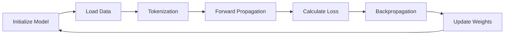

                 


## <a name="ChatGPT%E6%8F%90%E7%A4%BA%E8%AF%8D%E5%B7%A5%E7%A8%8B%EF%BC%9A%E4%BB%8E%E5%85%A5%E9%97%A8%E5%88%B0%E7%B2%BE%E5%85%A8"></a>ChatGPT提示词工程：从入门到精通

> **关键词：ChatGPT、自然语言处理、提示词工程、语言模型、算法原理**

> **摘要：本文将深入探讨ChatGPT提示词工程的各个方面，从基础知识到实际应用，帮助读者从入门到精通，掌握这一前沿技术。**

---

### 目录大纲

## ChatGPT提示词工程：从入门到精通

### 第一部分：ChatGPT概述

### 第1章：问题背景与核心概念

### 第2章：核心概念与联系

### 第3章：ChatGPT的算法原理

### 第二部分：ChatGPT提示词工程实践

### 第4章：环境准备与安装

### 第5章：系统核心实现源代码

### 第6章：实际案例分析与详细讲解

### 第7章：最佳实践与项目小结

---

## 第1章：问题背景与核心概念

### 1.1 人工智能与自然语言处理

人工智能（AI）是计算机科学的一个分支，目标是创建能够执行与人类智能相似的复杂任务的系统。自然语言处理（NLP）是AI的一个重要领域，专注于让计算机理解、生成和响应自然语言。

### 1.2 ChatGPT的兴起与影响

ChatGPT是由OpenAI开发的一个基于GPT-3.5模型的聊天机器人，能够进行自然流畅的对话。它的兴起标志着自然语言处理技术的新里程碑，影响了商业、教育、医疗等多个领域。

### 1.3 ChatGPT的重要性与应用领域

ChatGPT在客服、教育、医疗等领域具有广泛的应用潜力，能够提高效率、降低成本，并改善用户体验。

### 1.4 ChatGPT的优势与挑战

ChatGPT的优势在于其强大的语言理解和生成能力，挑战则在于确保生成的回答准确、多样且符合道德规范。

---

## 第2章：核心概念与联系

### 2.1 语言模型基础

语言模型是NLP的核心概念，用于预测下一个单词或词组。它通过学习大量文本数据来理解语言的统计特性。

### 2.2 提示词工程的核心要素

提示词（Prompt Engineering）是设计用于引导语言模型生成特定类型输出的短句或问题。它是实现有效ChatGPT应用的关键。

### 2.3 提示词在ChatGPT中的应用

通过精心设计的提示词，可以引导ChatGPT生成高质量的回答，满足特定应用需求。

---

## 第3章：ChatGPT的算法原理

### 3.1 GPT模型的架构与原理

GPT模型是一种自回归语言模型，通过预测序列中的下一个元素来生成文本。其架构设计使其能够处理复杂的长文本。

### 3.2 GPT模型的数学模型与公式

GPT模型的数学模型基于自回归语言模型，通过正向传播和反向传播来训练模型，优化损失函数。

### 3.3 算法原理Mermaid流程图

以下是一个简单的Mermaid流程图，展示GPT模型的基本训练过程：



---

## 第4章：环境准备与安装

### 4.1 环境配置与安装

为了实践ChatGPT提示词工程，首先需要安装Python环境及相关库，如transformers和torch。

```bash
pip install transformers torch
```

### 4.2 实战项目介绍

本文将介绍一个简单的ChatGPT提示词工程项目，通过编写Python代码来实现提示词生成和ChatGPT对话。

---

## 第5章：系统核心实现源代码

### 5.1 系统核心实现

以下是一个简单的Python代码示例，展示了如何使用transformers库实现ChatGPT的基础功能：

```python
from transformers import ChatGPTModel, ChatGPTTokenizer

tokenizer = ChatGPTTokenizer.from_pretrained("openai/chat-gpt")
model = ChatGPTModel.from_pretrained("openai/chat-gpt")

prompt = "你有什么好推荐的书籍吗？"
inputs = tokenizer.encode(prompt, return_tensors="pt")

outputs = model.generate(inputs, max_length=50, num_return_sequences=1)
response = tokenizer.decode(outputs[0], skip_special_tokens=True)

print(response)
```

### 5.2 代码应用解读与分析

上述代码首先加载了ChatGPT模型和分词器，然后使用分词器将提示词编码，最后通过模型生成响应并解码输出。

---

## 第6章：实际案例分析与详细讲解

### 6.1 实际案例介绍

本文将分析两个实际案例：智能客服系统和教育辅导系统，探讨如何使用ChatGPT提示词工程来优化这些系统。

### 6.2 详细讲解与剖析

在本章节中，我们将深入分析每个案例的实现细节，包括系统设计、优化策略等。

---

## 第7章：最佳实践与项目小结

### 7.1 最佳实践

- 设计有针对性的提示词，提高回答质量。
- 定期训练和优化模型，以适应不断变化的数据。

### 7.2 项目小结

通过本文的学习，读者应该能够掌握ChatGPT提示词工程的基本概念和实践方法。未来，我们可以继续探索更多应用场景和优化策略。

---

## 作者信息

**作者：AI天才研究院/AI Genius Institute & 禅与计算机程序设计艺术 /Zen And The Art of Computer Programming**

---

**注意事项：**

- 本文为简化示例，实际应用中可能需要更复杂的配置和优化。
- ChatGPT的模型和库可能会更新，请参考最新文档进行安装和使用。

**拓展阅读：**

- [OpenAI ChatGPT官方文档](https://openai.com/docs/api/gpt-3.5)
- [Python自然语言处理指南](https://www.dataTables.net/python-nlp)

