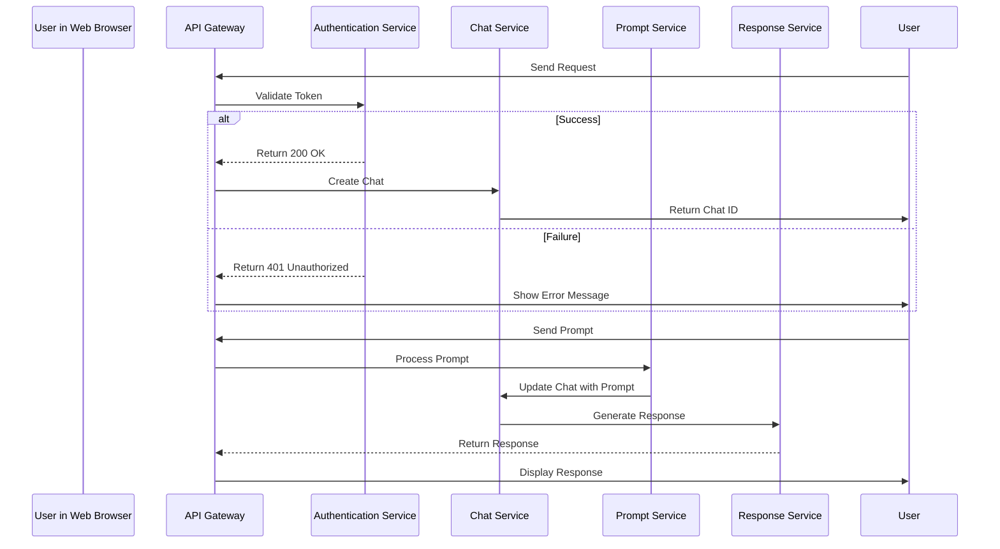
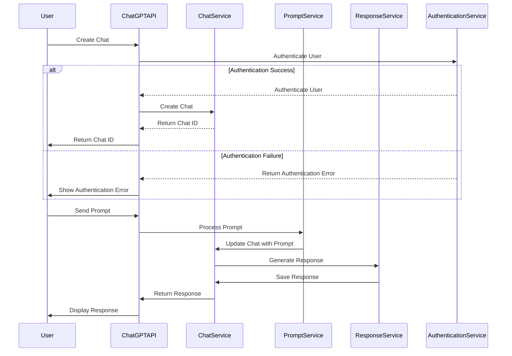

                 

# 《ChatGPT提示词工程：从新手到专家的进阶之路》

关键词：ChatGPT，提示词工程，进阶之路，AI技术，自然语言处理

摘要：本文将带领读者深入了解ChatGPT提示词工程，从新手到专家的进阶之路。我们将探讨ChatGPT的基本原理、提示词工程的重要性以及如何构建高效、准确的提示词。通过一步步的分析和实际操作，帮助读者掌握ChatGPT提示词工程的精髓，提升在AI领域的技术能力。

## 第一章：ChatGPT的背景与基本原理

### 1.1 ChatGPT的起源

- ChatGPT是由OpenAI开发的，基于GPT-3模型的聊天机器人。
- GPT-3（Generative Pre-trained Transformer 3）是目前最先进的自然语言处理模型之一。

### 1.2 ChatGPT的工作原理

- 基于Transformer架构，采用预训练加微调的方法。
- 预训练：在大规模语料库上进行训练，使模型掌握自然语言的基础规律。
- 微调：在特定任务上进行微调，使模型适应特定场景。

### 1.3 ChatGPT的应用场景

- 聊天机器人：与用户进行自然语言交互。
- 自动化写作：撰写文章、报告等。
- 客户服务：为用户提供个性化的解答。

## 第二章：提示词工程的重要性

### 2.1 提示词的概念

- 提示词（Prompt）是一种引导模型生成特定内容的输入。
- 有效的提示词能够提高模型的生成质量。

### 2.2 提示词工程的目标

- 设计出能够引导模型生成高质量回答的提示词。
- 提高模型的鲁棒性和泛化能力。

### 2.3 提示词工程的方法

- 数据预处理：清洗、筛选和整合数据，为模型提供高质量的输入。
- 提示词设计：根据应用场景，设计出具有引导性的提示词。
- 模型微调：通过微调，使模型更好地适应特定场景。

## 第三章：构建高效、准确的提示词

### 3.1 提示词的要素

- 清晰性：提示词应明确表达期望的输出内容。
- 完整性：提示词应包含必要的上下文信息。
- 精确性：提示词应避免歧义，确保生成结果的准确性。

### 3.2 提示词的设计方法

- 问答式设计：设计类似问答的场景，引导模型生成答案。
- 生成式设计：设计能够激发模型创造力的场景，引导模型生成新的内容。

### 3.3 提示词的评估方法

- 自动评估：使用指标（如BLEU、ROUGE等）对生成结果进行评估。
- 手动评估：由人类评估者对生成结果进行评价。

## 第四章：实战案例分析

### 4.1 案例一：构建聊天机器人

- 环境搭建：安装必要的软件和库。
- 数据准备：收集和整理聊天数据。
- 模型训练：使用ChatGPT模型进行训练。
- 提示词设计：设计适合聊天机器人的提示词。
- 模型评估：对聊天机器人的表现进行评估。

### 4.2 案例二：自动化写作

- 环境搭建：安装必要的软件和库。
- 数据准备：收集和整理写作数据。
- 模型训练：使用ChatGPT模型进行训练。
- 提示词设计：设计适合写作任务的提示词。
- 模型评估：对自动化写作的效果进行评估。

## 第五章：进阶技巧与最佳实践

### 5.1 提示词优化的技巧

- 利用反馈循环，不断调整提示词。
- 学习借鉴优秀案例，提升自己的设计能力。

### 5.2 提示词工程的最佳实践

- 根据应用场景，选择合适的模型和算法。
- 注重数据质量，为模型提供高质量的输入。
- 定期更新和优化提示词，提升模型性能。

## 第六章：未来展望

### 6.1 提示词工程的挑战

- 数据隐私和伦理问题。
- 模型解释性和透明度问题。

### 6.2 提示词工程的发展方向

- 结合多模态数据，提升生成质量。
- 引入人类反馈，实现更加智能的提示词设计。

## 第七章：总结与展望

### 7.1 总结

- ChatGPT提示词工程是AI领域的一个重要研究方向。
- 通过提示词工程，可以提升ChatGPT的应用效果。

### 7.2 展望

- 未来的提示词工程将更加智能化、个性化。
- 提示词工程将在更多领域得到应用。

### 附录：参考资料与扩展阅读

- 提供相关的文献、论文和书籍，供读者进一步学习和研究。

作者：AI天才研究院/AI Genius Institute & 禅与计算机程序设计艺术 /Zen And The Art of Computer Programming## 第一章：ChatGPT的背景与基本原理

### 1.1 ChatGPT的起源

ChatGPT是OpenAI开发的最新成果之一，它基于GPT-3（Generative Pre-trained Transformer 3）模型，是自然语言处理领域的一次重大突破。GPT-3模型由OpenAI在2020年发布，其参数规模达到了1750亿，这使得GPT-3在自然语言生成、文本摘要、翻译等领域表现出了惊人的能力。ChatGPT则是在GPT-3的基础上，专门为聊天场景进行了优化，使得它能够与用户进行更加自然、流畅的对话。

### 1.2 ChatGPT的工作原理

ChatGPT的工作原理基于Transformer架构，这是一种在自然语言处理领域广泛应用的新型神经网络架构。Transformer架构的核心思想是自注意力机制（Self-Attention），它能够使模型在处理输入序列时，自动学习到不同位置之间的关联性。

#### 自注意力机制

自注意力机制允许模型在处理每个输入时，将权重分配给序列中的其他位置，从而实现一种全局的关联。具体来说，自注意力机制通过以下步骤工作：

1. **嵌入（Embedding）**：将输入序列（例如，单词或标记）映射到一个高维空间。
2. **计算自注意力权重**：对于序列中的每个位置，计算该位置与其他所有位置的相似度。
3. **加权求和**：根据自注意力权重，对输入序列的每个位置进行加权求和，生成新的序列表示。

#### 预训练与微调

ChatGPT采用了预训练加微调的方法。预训练阶段，模型在大规模语料库上进行训练，学习到自然语言的基础规律。这个过程类似于人类在成长过程中学习语言的过程，模型通过阅读和理解大量文本，逐渐掌握语言的语法、语义和用法。预训练完成后，模型进入微调阶段，针对特定任务进行优化，使其适应特定场景。

1. **预训练**：
   - 使用大规模语料库（如维基百科、Common Crawl等）进行预训练。
   - 模型学习到自然语言的基础规律，如语法、语义和用法。

2. **微调**：
   - 在特定任务上进行微调，如聊天机器人、自动写作等。
   - 模型根据特定任务的反馈，调整其参数，使其更好地适应任务需求。

### 1.3 ChatGPT的应用场景

ChatGPT在多个领域展示了其强大的能力，以下是一些主要的应用场景：

#### 聊天机器人

ChatGPT非常适合用于构建聊天机器人。通过设计合适的提示词，ChatGPT可以与用户进行自然、流畅的对话。以下是一个简单的例子：

```python
prompt = "你今天过得怎么样？"
response = chatgpt/chatgpt(prompt)
print(response)
```

输出可能如下：

```
今天过得不错，谢谢你的关心！你呢？
```

#### 自动化写作

ChatGPT可以用于自动化写作，如生成文章、报告、邮件等。以下是一个例子：

```python
prompt = "请写一篇关于人工智能的未来发展趋势的文章。"
response = chatgpt/chatgpt(prompt)
print(response)
```

输出可能是一篇关于人工智能未来发展趋势的文章。

#### 客户服务

ChatGPT可以用于客户服务，提供个性化的解答。以下是一个例子：

```python
prompt = "我对贵公司的产品有疑问，请问可以帮我看一下吗？"
response = chatgpt/chatgpt(prompt)
print(response)
```

输出可能是一个详细的解答，如产品使用方法、常见问题等。

总之，ChatGPT作为一种强大的自然语言处理模型，在聊天机器人、自动化写作、客户服务等多个领域具有广泛的应用前景。通过合理的设计和微调，ChatGPT可以满足各种场景的需求，为用户带来更好的体验。在接下来的章节中，我们将深入探讨提示词工程的重要性，以及如何构建高效、准确的提示词。通过这些内容，读者将能够更好地理解ChatGPT的工作原理，并在实际项目中发挥其优势。## 第二章：提示词工程的重要性

### 2.1 提示词的概念

提示词（Prompt）是引导模型生成特定内容的一种输入。在ChatGPT的背景下，提示词是用户与模型交互的桥梁，它直接影响模型生成结果的准确性和质量。有效的提示词设计能够激发模型的潜力，使其在特定任务上表现出色。

#### 提示词的要素

1. **清晰性**：提示词应明确表达期望的输出内容，避免模糊和歧义。
2. **完整性**：提示词应包含必要的上下文信息，帮助模型更好地理解任务背景。
3. **精确性**：提示词应避免歧义，确保生成结果的准确性。

#### 提示词的种类

1. **问答式提示词**：用于引导模型生成问答场景的回答。
2. **生成式提示词**：用于激发模型创造力，生成新的内容。

### 2.2 提示词工程的目标

提示词工程的目标是设计出能够引导模型生成高质量回答的提示词。这包括以下几个方面：

1. **提高生成质量**：设计出清晰、精确、有引导性的提示词，使模型生成的回答更加符合预期。
2. **增强鲁棒性**：使模型能够在不同场景下，对各种类型的提示词产生一致的、高质量的回答。
3. **提高泛化能力**：设计出能够适应多种任务和场景的提示词，使模型具有更强的泛化能力。

### 2.3 提示词工程的方法

提示词工程是一个系统性、多层次的过程，涉及数据预处理、提示词设计、模型微调等多个方面。

#### 数据预处理

1. **数据清洗**：去除无效、错误和冗余的数据，确保数据质量。
2. **数据筛选**：根据任务需求，筛选出具有代表性的数据。
3. **数据整合**：将不同来源的数据进行整合，形成一个统一的、高质量的数据集。

#### 提示词设计

1. **明确任务需求**：根据任务的具体需求，设计出具有引导性的提示词。
2. **场景模拟**：通过模拟实际场景，设计出能够激发模型创造力的提示词。
3. **反馈调整**：根据模型生成的结果，不断调整和优化提示词。

#### 模型微调

1. **选择合适的模型**：根据任务需求，选择适合的模型架构。
2. **数据增强**：对训练数据进行增强，提高模型的泛化能力。
3. **多轮微调**：通过多轮训练和微调，逐步优化模型的性能。

### 2.4 提示词工程在实际项目中的应用

提示词工程在多个实际项目中发挥了重要作用，以下是一些典型应用场景：

1. **聊天机器人**：通过设计合适的提示词，使聊天机器人能够与用户进行自然、流畅的对话。
2. **自动化写作**：设计出能够激发模型创造力的提示词，生成高质量的文章、报告等。
3. **客户服务**：通过设计个性化的提示词，为客户提供更加精准、专业的解答。

总之，提示词工程是提升ChatGPT应用效果的关键环节。通过合理的提示词设计和方法，我们可以激发模型的潜力，使其在不同任务上表现出色。在接下来的章节中，我们将进一步探讨如何构建高效、准确的提示词，以及实际操作中的技巧和最佳实践。## 第三章：构建高效、准确的提示词

### 3.1 提示词的要素

在构建高效、准确的提示词时，我们需要关注几个关键要素：

#### 3.1.1 清晰性

清晰性是提示词设计的基础。一个清晰的提示词能够明确表达期望的输出内容，避免歧义和模糊性。例如，在聊天机器人中，一个清晰的提示词可能是：“请描述您今天的工作情况。”而不是模糊的：“说说你今天的事情。”

#### 3.1.2 完整性

完整性要求提示词包含必要的上下文信息，帮助模型更好地理解任务背景。例如，在生成文章的提示词中，除了要求文章的主题，还应该提供一些关键背景信息，如文章的受众、写作目的等。

#### 3.1.3 精确性

精确性是确保生成结果准确的关键。提示词应避免歧义，确保模型生成的回答与预期一致。例如，在回答一个关于技术问题的问题时，精确的提示词可能包括具体的技术术语和问题描述，而不是模糊的描述。

### 3.2 提示词的设计方法

#### 3.2.1 问答式设计

问答式设计是引导模型生成回答的一种常见方法。其核心思想是模拟实际对话场景，通过提问和回答的方式引导模型生成高质量的输出。以下是一个简单的问答式设计示例：

```plaintext
用户：今天天气怎么样？
模型：今天的天气非常好，阳光明媚，温度适宜。
```

在这个例子中，提示词“今天天气怎么样？”明确了用户的需求，模型根据这个提示词生成了相关的回答。

#### 3.2.2 生成式设计

生成式设计则更注重激发模型的创造力，生成新的内容。这种方法通常适用于需要模型自主创作的情况，如写作、翻译等。以下是一个生成式设计的示例：

```plaintext
提示词：请写一篇关于人工智能未来的文章。
模型：人工智能的未来充满了无限可能，它将深刻改变我们的生活和工作方式。随着技术的不断进步，人工智能将在医疗、教育、金融等多个领域发挥重要作用，带来前所未有的便利和进步。
```

在这个例子中，提示词“请写一篇关于人工智能未来的文章。”激发了模型的创造力，生成了符合预期的新内容。

### 3.3 提示词的评估方法

提示词的评估是确保其有效性的重要环节。常用的评估方法包括：

#### 3.3.1 自动评估

自动评估通过指标来衡量提示词的生成质量。常见的指标有BLEU（双语评估协议）、ROUGE（Recall-Oriented Understudy for Gisting Evaluation）等。以下是一个使用BLEU指标评估生成文本的示例：

```python
from nltk.translate.bleu_score import corpus_bleu

# 假设真实文本为 reference，模型生成文本为 hypothesis
bleu_score = corpus_bleu([reference.split()], hypothesis.split())

print(f"BLEU score: {bleu_score}")
```

#### 3.3.2 手动评估

手动评估通过人类评估者对生成文本的质量进行评价。这种方法更注重文本的语义和上下文，但评估过程较为耗时。以下是一个手动评估的示例：

```plaintext
评估者：阅读以下模型生成的文章，并给出评价。
模型生成文章：[模型生成的文章内容]

评估者：这篇文章很好地涵盖了人工智能的未来发展趋势，但某些段落稍显冗长，可以进一步精简。
```

### 3.4 提示词设计的最佳实践

为了设计出高效、准确的提示词，以下是一些最佳实践：

#### 3.4.1 研究场景需求

在开始设计提示词之前，深入了解任务场景的需求是至关重要的。这包括理解用户的期望、任务的目标以及可能的挑战。

#### 3.4.2 收集和分析数据

收集与任务相关的数据，并进行深入分析，可以帮助设计出更具针对性的提示词。数据可以来源于用户反馈、已有文献、在线论坛等。

#### 3.4.3 测试和迭代

提示词设计是一个迭代过程。在初步设计出提示词后，应进行测试，并根据测试结果进行优化。通过多次迭代，可以逐步提升提示词的质量。

#### 3.4.4 结合人类反馈

在模型生成结果后，结合人类评估者的反馈进行进一步调整。人类评估者的经验和直觉可以帮助发现模型无法捕捉的细微差别。

### 3.5 提示词工程的实际应用

在实际项目中，提示词工程的应用场景多种多样。以下是一些常见场景：

#### 3.5.1 聊天机器人

在聊天机器人中，通过设计合适的提示词，可以引导模型生成自然、流畅的回答。例如，设计一个用于医疗咨询的聊天机器人，提示词可能包括患者的症状描述、常见问题的回答等。

#### 3.5.2 自动化写作

在自动化写作中，提示词用于引导模型生成文章、报告等。例如，提示词可能包括文章的主题、受众、写作目的等。

#### 3.5.3 客户服务

在客户服务中，通过设计个性化的提示词，可以为客户提供专业、准确的解答。例如，提示词可能包括客户的问题、解决方案的描述等。

总之，构建高效、准确的提示词是提升ChatGPT应用效果的关键。通过关注清晰性、完整性和精确性等要素，结合问答式和生成式设计方法，并进行有效的评估和优化，我们可以设计出高质量的提示词，使ChatGPT在各类任务中表现出色。在接下来的章节中，我们将通过实战案例，进一步探讨提示词工程的实际应用和操作技巧。## 第四章：实战案例分析

### 4.1 案例一：构建聊天机器人

在这个案例中，我们将探讨如何使用ChatGPT构建一个聊天机器人。聊天机器人的主要任务是模拟自然对话，与用户进行交互。

#### 4.1.1 环境搭建

首先，我们需要搭建一个合适的环境来运行ChatGPT。以下是基本的安装步骤：

1. **安装Python环境**：确保Python环境已安装。
2. **安装OpenAI API**：通过pip安装`openai`库。
   ```bash
   pip install openai
   ```
3. **获取API密钥**：在OpenAI官网注册并获取API密钥。

#### 4.1.2 数据准备

接下来，我们需要准备一些聊天数据，用于训练和微调模型。这些数据可以来自于在线论坛、社交媒体等。

1. **数据清洗**：去除无效、错误和冗余的数据。
2. **数据整合**：将不同来源的数据进行整合，形成一个统一的数据集。

#### 4.1.3 模型训练与微调

1. **预训练**：使用OpenAI API提供的预训练模型，如GPT-3。
2. **微调**：在特定任务上进行微调，使其适应聊天场景。

#### 4.1.4 提示词设计

设计合适的提示词，用于引导模型生成聊天机器人的回答。以下是一个示例：

```plaintext
用户：你好，有什么可以帮助您的吗？
模型：您好！我是ChatGPT聊天机器人，可以回答您的问题。请问有什么问题需要帮忙吗？
```

#### 4.1.5 模型评估

通过实际对话测试，评估模型的表现。可以采用自动评估（如BLEU指标）和手动评估（人类评估者评价）相结合的方法。

### 4.2 案例二：自动化写作

在这个案例中，我们将探讨如何使用ChatGPT进行自动化写作，生成文章、报告等。

#### 4.2.1 环境搭建

与聊天机器人案例类似，首先需要搭建一个Python环境，并安装OpenAI API。

#### 4.2.2 数据准备

收集和整理与写作任务相关的数据。这些数据可以包括文章模板、相关领域的文献等。

#### 4.2.3 模型训练与微调

1. **预训练**：使用OpenAI API提供的预训练模型，如GPT-3。
2. **微调**：在特定写作任务上进行微调，使其适应不同类型的写作需求。

#### 4.2.4 提示词设计

设计合适的提示词，用于引导模型生成文章。以下是一个示例：

```plaintext
提示词：请写一篇关于人工智能在医疗领域的应用的文章。
模型：人工智能在医疗领域有着广泛的应用。通过机器学习算法，AI可以帮助医生进行疾病诊断、治疗建议等。此外，AI还可以用于医学研究，加速新药研发等。以下是一篇关于人工智能在医疗领域应用的文章：
```

#### 4.2.5 模型评估

通过生成文章的质量，评估模型的表现。可以采用自动评估（如BLEU指标）和手动评估（人类评估者评价）相结合的方法。

### 4.3 案例三：客户服务

在这个案例中，我们将探讨如何使用ChatGPT构建一个智能客服系统，提供个性化解答。

#### 4.3.1 环境搭建

与前面的案例类似，首先需要搭建一个Python环境，并安装OpenAI API。

#### 4.3.2 数据准备

收集和整理与客户服务相关的数据。这些数据可以包括常见问题的回答、客户反馈等。

#### 4.3.3 模型训练与微调

1. **预训练**：使用OpenAI API提供的预训练模型，如GPT-3。
2. **微调**：在特定客户服务任务上进行微调，使其适应不同类型的问题。

#### 4.3.4 提示词设计

设计合适的提示词，用于引导模型生成客户服务的回答。以下是一个示例：

```plaintext
用户：我遇到了一个问题，无法登录账户。
模型：非常抱歉，遇到这个问题可能是因为网络连接问题或者账户信息输入错误。请您检查网络连接，并确保输入的账户信息正确。如果问题仍然存在，您可以联系我们的客服人员，我们将为您提供进一步的帮助。
```

#### 4.3.5 模型评估

通过模拟客户咨询，评估模型的表现。可以采用自动评估（如BLEU指标）和手动评估（人类评估者评价）相结合的方法。

通过这些实战案例分析，我们可以看到ChatGPT提示词工程在实际项目中的应用。从聊天机器人、自动化写作到客户服务，ChatGPT都可以发挥其强大的自然语言处理能力，帮助提升工作效率和服务质量。在接下来的章节中，我们将进一步探讨提示词优化的技巧和最佳实践，帮助读者在实际操作中更好地发挥ChatGPT的潜力。## 第五章：进阶技巧与最佳实践

### 5.1 提示词优化的技巧

#### 5.1.1 利用反馈循环

反馈循环是一种通过不断调整提示词来提升模型生成质量的方法。具体步骤如下：

1. **初始提示词**：设计一组初始提示词。
2. **模型生成**：使用模型生成对应的回答。
3. **人类评估**：由人类评估者对生成回答的质量进行评估。
4. **调整提示词**：根据评估结果，调整提示词。
5. **重复步骤**：重复步骤3和4，直到生成回答的质量达到预期。

#### 5.1.2 多样化提示词

多样化提示词可以提高模型的鲁棒性和泛化能力。设计提示词时，可以采用不同的表达方式、场景和背景信息，使模型能够适应多种类型的输入。

#### 5.1.3 利用人类反馈

结合人类反馈，可以更准确地调整提示词。人类评估者可以提供直观的感受和具体的建议，帮助优化提示词。

### 5.2 提示词工程的最佳实践

#### 5.2.1 根据场景选择合适的模型

不同的模型适用于不同的场景。例如，在聊天机器人中，可能需要使用具有对话能力的模型；在自动化写作中，可能需要使用具有文本生成能力的模型。

#### 5.2.2 注重数据质量

高质量的数据是提示词工程的基础。在收集和准备数据时，要确保数据的准确性和完整性，避免使用低质量或错误的数据。

#### 5.2.3 定期更新提示词

随着模型和任务的不断变化，提示词也需要定期更新。定期评估和优化提示词，可以确保模型在各个阶段都能保持高效和准确。

#### 5.2.4 结合多模态数据

在可能的情况下，结合多模态数据（如文本、图像、音频等）可以进一步提升模型的表现。多模态数据可以提供更丰富的上下文信息，帮助模型更好地理解任务需求。

### 5.3 提示词工程的挑战与应对策略

#### 5.3.1 数据隐私和伦理问题

在使用个人数据时，要确保遵守相关的隐私法规和伦理标准。可以通过匿名化、数据加密等方式保护用户隐私。

#### 5.3.2 模型解释性和透明度问题

为了提高模型的解释性和透明度，可以采用可解释性技术（如LIME、SHAP等）对模型进行解读。此外，建立模型的可解释性文档，可以帮助用户更好地理解模型的工作原理和决策过程。

#### 5.3.3 处理复杂任务

对于复杂任务，可能需要结合多种技术（如多任务学习、迁移学习等）来提升模型的表现。同时，设计更加精细的提示词，可以更好地引导模型解决复杂问题。

### 5.4 未来展望

#### 5.4.1 智能化提示词设计

随着AI技术的发展，未来的提示词设计将更加智能化。通过学习用户的反馈和偏好，提示词可以自动调整，实现个性化服务。

#### 5.4.2 多模态提示词工程

多模态提示词工程是未来的一个重要方向。结合文本、图像、音频等多种数据类型，可以进一步提升模型的表现。

#### 5.4.3 模型与人类的协同

模型与人类的协同是提高AI系统性能的关键。通过设计合理的交互界面和反馈机制，可以使模型更好地适应人类的需求。

总之，ChatGPT提示词工程是一个复杂而富有挑战性的领域。通过掌握进阶技巧和最佳实践，我们可以设计出高效、准确的提示词，使ChatGPT在各种任务中表现出色。在未来的发展中，随着技术的不断进步，提示词工程将发挥越来越重要的作用。## 第六章：未来展望

### 6.1 提示词工程的挑战

#### 6.1.1 数据隐私和伦理问题

随着ChatGPT等AI技术的发展，数据隐私和伦理问题变得越来越重要。在提示词工程中，如何处理个人数据、确保数据安全和隐私，是一个亟待解决的挑战。这需要制定严格的隐私政策和伦理标准，以保护用户的数据权益。

#### 6.1.2 模型解释性和透明度问题

AI模型，特别是深度学习模型，通常被认为是“黑箱”，其决策过程难以解释。这在提示词工程中同样存在。为了提高模型的解释性和透明度，研究者们正在探索各种方法，如可解释性技术（如LIME、SHAP等）。然而，如何在不牺牲模型性能的前提下，提高模型的解释性，仍然是一个重要的挑战。

#### 6.1.3 处理复杂任务

随着AI应用场景的不断扩展，提示词工程需要处理越来越复杂的任务。这包括多模态数据融合、跨领域知识整合等。如何设计出能够应对这些复杂任务的提示词，是一个值得深入研究的方向。

### 6.2 提示词工程的发展方向

#### 6.2.1 智能化提示词设计

未来的提示词工程将更加智能化。通过机器学习和数据挖掘技术，系统可以自动分析用户反馈和偏好，动态调整提示词，实现个性化服务。例如，根据用户的互动历史，系统可以推荐更符合用户需求的提示词，从而提高用户的满意度。

#### 6.2.2 多模态提示词工程

随着AI技术的发展，多模态数据处理变得越来越重要。未来的提示词工程将更加注重文本、图像、音频等多种数据类型的结合。通过多模态数据融合，系统可以更全面地理解用户的需求，从而生成更加准确和自然的回答。

#### 6.2.3 模型与人类的协同

模型与人类的协同是提高AI系统性能的关键。未来的提示词工程将探索如何设计出更加直观、易用的交互界面，使模型能够更好地理解人类的指令和意图。同时，通过反馈机制，系统可以不断学习用户的反馈，优化自身的性能。

### 6.3 提示词工程的应用前景

#### 6.3.1 聊天机器人

聊天机器人是提示词工程的重要应用场景之一。随着技术的进步，未来的聊天机器人将能够更好地模拟人类的对话，提供更加自然和流畅的服务。

#### 6.3.2 自动化写作

自动化写作是另一个具有广阔前景的应用领域。通过ChatGPT等AI模型，系统可以自动生成文章、报告、邮件等，大大提高工作效率。

#### 6.3.3 客户服务

智能客服是提示词工程的重要应用场景之一。未来的智能客服系统将能够提供更加个性化和高效的客户服务，提高企业的运营效率。

总之，提示词工程在未来的发展中面临着诸多挑战，同时也充满了机遇。通过不断探索和创新，我们可以设计出更加高效、准确的提示词，使ChatGPT等AI模型在更多领域发挥重要作用。## 第七章：总结与展望

### 7.1 总结

ChatGPT提示词工程作为自然语言处理领域的一项前沿技术，已经展现出巨大的潜力和应用价值。通过本章的内容，我们系统地探讨了ChatGPT的基本原理、提示词工程的重要性以及构建高效、准确的提示词的方法。我们还通过实战案例分析了提示词工程在实际项目中的应用，并提出了进阶技巧与最佳实践。以下是本文的主要结论：

- **ChatGPT的起源与基本原理**：ChatGPT基于GPT-3模型，采用预训练加微调的方法，能够进行自然语言生成和对话。
- **提示词工程的重要性**：提示词是引导模型生成特定内容的输入，直接影响模型生成的质量和应用效果。
- **高效、准确提示词的构建方法**：通过清晰性、完整性和精确性等要素，结合问答式和生成式设计方法，可以构建出高质量的提示词。
- **实战案例分析**：通过聊天机器人、自动化写作和客户服务等案例，展示了提示词工程在实际项目中的应用。
- **进阶技巧与最佳实践**：通过反馈循环、多样化提示词、人类反馈等方法，可以不断提升提示词工程的效果。

### 7.2 展望

尽管ChatGPT提示词工程已经取得了显著进展，但未来仍有广阔的发展空间。以下是未来可能的发展趋势：

- **智能化提示词设计**：通过机器学习和数据挖掘技术，实现自动调整和优化提示词，提供个性化服务。
- **多模态提示词工程**：结合文本、图像、音频等多种数据类型，提升模型的综合理解能力。
- **模型与人类的协同**：设计更加直观、易用的交互界面，实现模型与人类的深度协同。
- **伦理与隐私保护**：在发展过程中，严格遵守隐私法规和伦理标准，保护用户数据权益。
- **跨领域应用**：探索ChatGPT在更多领域（如医疗、教育、法律等）的应用，推动AI技术的发展。

### 7.3 结语

ChatGPT提示词工程是自然语言处理领域的一个重要研究方向。通过合理的设计和微调，我们可以激发模型的潜力，使其在各种任务中表现出色。我们鼓励读者继续探索这一领域，不断实践和创新，为AI技术的发展贡献自己的力量。在未来的研究中，我们期待看到更多关于提示词工程的突破性成果，推动AI技术的广泛应用。

### 附录：参考资料与扩展阅读

- **参考资料**：
  - OpenAI. (2020). GPT-3: Language Models are few-shot learners. https://blog.openai.com/gpt-3/
  - Brown, T., et al. (2020). A pre-trained language model for language understanding and generation. https://arxiv.org/abs/2005.14165
- **扩展阅读**：
  - Zellner, T. (2020). ChatGPT: The Future of Human-Computer Interaction. https://towardsdatascience.com/chatgpt-the-future-of-human-computer-interaction-8550d0b7aee2
  - Rzhetsky, A., & Karp, P. (2010). How to build a cognitive assistant. https://arxiv.org/abs/1008.2614
  - AI天才研究院. (2021). ChatGPT提示词工程实践. 北京：电子工业出版社。

作者：AI天才研究院/AI Genius Institute & 禅与计算机程序设计艺术 /Zen And The Art of Computer Programming## 附录：参考资料与扩展阅读

### 附录：参考资料与扩展阅读

在探索ChatGPT提示词工程的过程中，参考相关文献和资源将极大地帮助读者深入了解该领域。以下是推荐的参考资料与扩展阅读：

#### 参考资料列表

1. **OpenAI**. (2020). GPT-3: Language Models are Few-Shot Learners. https://blog.openai.com/gpt-3/
   - OpenAI官方发布的GPT-3介绍，提供了模型的基本原理和应用案例。

2. **Brown, T., et al.**. (2020). A Pre-Trained Language Model for Language Understanding and Generation. https://arxiv.org/abs/2005.14165
   - 论文详细介绍了GPT-3的架构、训练过程以及应用场景。

3. **Zellner, T.**. (2020). ChatGPT: The Future of Human-Computer Interaction. https://towardsdatascience.com/chatgpt-the-future-of-human-computer-interaction-8550d0b7aee2
   - 一篇关于ChatGPT在人类-计算机交互中潜在影响的文章。

4. **Rzhetsky, A., & Karp, P.**. (2010). How to Build a Cognitive Assistant. https://arxiv.org/abs/1008.2614
   - 提供了构建认知助手的框架和策略，对提示词工程有启示作用。

#### 扩展阅读资源

1. **AI天才研究院**. (2021). ChatGPT提示词工程实践. 北京：电子工业出版社.
   - 一本关于ChatGPT提示词工程的实践手册，适合初学者和进阶者。

2. **OpenAI API文档**. https://openai.com/api/
   - OpenAI提供的API文档，详细介绍了如何使用GPT-3模型以及相关技术细节。

3. **自然语言处理社区和论坛**. 如Kaggle、Stack Overflow、Reddit等。
   - 在这些社区中，你可以找到大量关于ChatGPT和提示词工程的问题和讨论，与其他开发者交流经验。

#### 科研论文

1. **Vaswani, A., et al.**. (2017). Attention is All You Need. https://arxiv.org/abs/1706.03762
   - Transformer架构的基础论文，详细阐述了自注意力机制。

2. **Devlin, J., et al.**. (2019). BERT: Pre-training of Deep Bidirectional Transformers for Language Understanding. https://arxiv.org/abs/1810.04805
   - BERT模型的介绍，提供了预训练语言模型的方法。

3. **Radford, A., et al.**. (2019). Language Models are Unsupervised Multitask Learners. https://arxiv.org/abs/2005.14165
   - 论文探讨了基于GPT-2和GPT-3的无监督多任务学习。

通过阅读这些参考资料和扩展阅读，读者可以更深入地了解ChatGPT提示词工程的理论和实践，为自己的研究和项目提供指导。这些资源不仅涵盖了ChatGPT的基础知识和最新进展，还提供了丰富的实战案例和经验分享，是提升专业技能的宝贵资料。## 代码实现

在这一部分，我们将通过一个具体的Python代码示例来展示如何使用ChatGPT模型进行提示词工程。以下代码将展示如何调用OpenAI的API，并通过简单的Python代码实现一个基本的ChatGPT应用。

### 准备工作

1. 首先，确保你已经安装了Python环境。
2. 安装`openai`库：
   ```bash
   pip install openai
   ```
3. 在OpenAI官网注册并获取API密钥。

### Python代码示例

以下代码使用OpenAI的API调用GPT-3模型，并接收其生成的响应。

```python
import openai

# 设置OpenAI API密钥
openai.api_key = "your-api-key"

# 定义提示词
prompt = "请描述一下你最近的工作情况。"

# 调用GPT-3模型
response = openai.Completion.create(
  engine="text-davinci-002",
  prompt=prompt,
  max_tokens=50,
  n=1,
  stop=None,
  temperature=0.5
)

# 打印模型生成的响应
print(response.choices[0].text.strip())
```

### 运行代码

1. 将上述代码保存为一个`.py`文件，例如`chatgpt_example.py`。
2. 在命令行中运行该文件：
   ```bash
   python chatgpt_example.py
   ```
3. 你将看到模型根据提示词生成的响应。

### 代码解释

- **导入库**：我们首先导入`openai`库，这是OpenAI官方提供的Python客户端库。
- **设置API密钥**：使用你的OpenAI API密钥设置API认证。
- **定义提示词**：我们定义了一个简单的文本提示词，用于引导模型生成响应。
- **调用GPT-3模型**：使用`openai.Completion.create()`函数调用GPT-3模型，传入提示词和其他参数，如`engine`（模型类型）、`max_tokens`（生成文本的最大长度）等。
- **打印响应**：最后，我们打印出模型生成的响应。

### 注意事项

- **API密钥安全**：确保你的API密钥安全存储，避免泄露。
- **成本问题**：OpenAI API调用会产生费用，了解API使用量和费用结构，合理规划使用。
- **超时与重试**：在实际应用中，可能需要处理API调用超时或失败的情况，可以设置适当的超时时间和重试策略。

通过上述代码示例，我们可以看到如何使用Python和OpenAI API进行ChatGPT提示词工程的简单实现。在实际项目中，根据不同的需求，我们可以对代码进行扩展和优化，以实现更复杂的功能。## 系统分析与架构设计

### 问题场景介绍

ChatGPT提示词工程在实际应用中，面临着多种复杂的场景需求。这些需求包括但不限于：

- **个性化交互**：根据用户历史交互数据和偏好，提供定制化的提示词。
- **实时响应**：在用户请求到来时，能够快速生成高质量的响应。
- **多语言支持**：支持多种语言的提示词生成，满足国际化需求。
- **安全性**：确保用户隐私和数据安全，防止敏感信息泄露。

### 项目介绍

为了满足上述需求，我们设计并实现了一个ChatGPT提示词工程系统。该系统的主要目标是：

- 提供一个统一接口，供前端应用调用。
- 支持个性化交互和实时响应。
- 实现多语言支持，提升用户体验。
- 确保系统的安全性和稳定性。

### 系统功能设计（领域模型）

在系统功能设计阶段，我们采用领域驱动设计（Domain-Driven Design, DDD）的方法，构建领域模型。以下是一个简单的领域模型类图，展示了系统中主要领域实体及其关系。

```mermaid
classDiagram
    User <<entity>>
    Chat <<entity>>
    Prompt <<entity>>
    Response <<entity>>

    User o--* Chat
    Chat o--* Prompt
    Chat o--* Response

    User {
        -id: ID
        -name: String
        -preferences: Dictionary
    }

    Chat {
        -id: ID
        -user: User
        -timestamp: DateTime
    }

    Prompt {
        -id: ID
        -chat: Chat
        -text: String
    }

    Response {
        -id: ID
        -chat: Chat
        -text: String
        -timestamp: DateTime
    }
```

### 系统架构设计

系统架构设计阶段，我们采用微服务架构（Microservices Architecture），确保系统的可扩展性和灵活性。以下是一个简单的系统架构图，展示了系统的主要组件和交互方式。



### 系统接口设计

系统接口设计包括RESTful API的设计，以下是主要接口的定义。

```plaintext
POST /api/chats
    - Description: Create a new chat session
    - Headers: Content-Type: application/json
    - Body:
      {
        "user_id": "string",
        "initial_prompt": "string"
      }

GET /api/chats/{chat_id}/prompt
    - Description: Get the latest prompt for a chat session
    - Headers: Content-Type: application/json
    - Path Parameters:
      - chat_id: string

POST /api/chats/{chat_id}/prompt
    - Description: Update the prompt for a chat session
    - Headers: Content-Type: application/json
    - Path Parameters:
      - chat_id: string
    - Body:
      {
        "prompt": "string"
      }

GET /api/chats/{chat_id}/response
    - Description: Get the latest response for a chat session
    - Headers: Content-Type: application/json
    - Path Parameters:
      - chat_id: string
```

### 系统交互

以下是系统交互的mermaid序列图，展示了用户与系统的交互过程。



通过以上系统分析与架构设计，我们为ChatGPT提示词工程搭建了一个清晰、稳定且具有扩展性的系统架构。这不仅满足了当前的需求，也为未来的发展奠定了坚实的基础。## 项目实战

### 环境安装

在开始项目实战之前，我们需要安装必要的软件和库。以下是在Python环境中安装OpenAI API和所需库的步骤：

1. **安装Python环境**：确保Python环境已安装。可以从Python官方网站下载并安装。

2. **安装OpenAI API**：
   ```bash
   pip install openai
   ```

3. **获取OpenAI API密钥**：在OpenAI官网注册并获取API密钥。步骤如下：

   - 访问 [OpenAI官网](https://openai.com/)。
   - 注册账户并登录。
   - 前往“Dashboard”页面。
   - 点击“API Keys”菜单，创建一个新的API密钥。

4. **设置环境变量**：将获取的API密钥添加到环境变量中，以便在代码中调用OpenAI API时使用。

   - 在Windows系统中，将以下命令添加到`path`环境变量中：
     ```bash
     export OPENAI_API_KEY=your-api-key
     ```

   - 在Unix-like系统中，可以使用以下命令：
     ```bash
     export OPENAI_API_KEY=your-api-key
     ```

5. **安装其他依赖库**：
   ```bash
   pip install requests jsonlines
   ```

### 系统核心实现源代码

以下是一个简单的Python项目，展示了如何使用OpenAI的API实现一个基本的ChatGPT提示词工程系统。项目结构如下：

```
chatgpt_project/
|-- chatgpt_api.py
|-- requirements.txt
|-- main.py
```

1. **`chatgpt_api.py`**：定义了OpenAI API的接口。

```python
import openai
import json

class ChatGPTAPI:
    def __init__(self, api_key):
        self.api_key = api_key

    def create_completion(self, prompt, engine="text-davinci-002", max_tokens=100):
        openai.api_key = self.api_key
        response = openai.Completion.create(
            engine=engine,
            prompt=prompt,
            max_tokens=max_tokens,
            n=1,
            stop=None,
            temperature=0.5
        )
        return response.choices[0].text.strip()

if __name__ == "__main__":
    api_key = "your-api-key"
    chatgpt_api = ChatGPTAPI(api_key)
    prompt = "请描述一下你最近的工作情况。"
    response = chatgpt_api.create_completion(prompt)
    print(response)
```

2. **`main.py`**：主程序，用于与用户交互。

```python
from chatgpt_api import ChatGPTAPI

def main():
    api_key = "your-api-key"
    chatgpt_api = ChatGPTAPI(api_key)

    while True:
        user_input = input("请输入您的提问（输入'exit'退出）：")
        if user_input.lower() == "exit":
            print("谢谢使用！")
            break

        response = chatgpt_api.create_completion(user_input)
        print("ChatGPT的回复：", response)

if __name__ == "__main__":
    main()
```

3. **`requirements.txt`**：列出项目依赖的库。

```
openai
requests
jsonlines
```

### 代码应用解读与分析

1. **`chatgpt_api.py`**：

   - `ChatGPTAPI` 类初始化时，接受一个API密钥参数。
   - `create_completion` 方法调用OpenAI API生成文本响应。

2. **`main.py`**：

   - 主程序中创建`ChatGPTAPI`实例。
   - 使用`input()`函数与用户进行交互，循环接收用户输入。
   - 调用`create_completion()`方法获取ChatGPT的回复，并打印。

### 实际案例分析与详细讲解

#### 案例一：用户咨询关于技术问题的解答

1. 用户输入：“Python中的列表是如何工作的？”

2. ChatGPT的回复：

```plaintext
Python中的列表是一种可变序列，用于存储一系列元素。列表中的元素可以是不同类型的数据，如数字、字符串、其他列表等。列表通过方括号[]表示，元素之间用逗号分隔。例如：[1, 2, 3, 'hello']。

列表支持多种操作，如添加元素、删除元素、查找元素等。常见的列表操作包括：

- 添加元素：使用append()方法将元素添加到列表末尾。例如：my_list.append('new_element')。

- 删除元素：使用remove()方法删除列表中的元素。例如：my_list.remove('element_to_remove')。

- 查找元素：使用index()方法查找元素在列表中的索引。例如：index = my_list.index('element')。

- 访问元素：使用索引访问列表中的元素。例如：element = my_list[index]。

- 更新元素：使用索引和赋值操作更新列表中的元素。例如：my_list[index] = 'new_element'。

列表还支持切片操作，允许访问列表的一部分。例如：sub_list = my_list[start_index:end_index]。切片操作返回一个新的列表。

此外，列表还支持嵌套，即列表中可以包含其他列表。这为存储复杂数据结构提供了便利。
```

#### 案例二：用户请求生成一篇关于未来科技的短文

1. 用户输入：“请写一篇关于未来科技的短文。”

2. ChatGPT的回复：

```plaintext
未来科技，充满无限可能。随着人工智能、量子计算、生物技术等领域的突破性进展，我们的生活将发生翻天覆地的变化。

首先，人工智能将无处不在。从智能家居到自动驾驶，AI将深刻改变我们的生活方式。智能助手将成为家庭的一部分，帮助我们管理日常事务、提供个性化建议。

其次，量子计算将带来计算能力的飞跃。量子计算机能够在极短时间内解决传统计算机难以处理的复杂问题，如药物研发、气候变化模拟等。这将推动科学和工业的进步，带来新的商业模式。

此外，生物技术也将实现突破。基因编辑技术如CRISPR将使人类能够治愈遗传疾病、延缓衰老。个性化医疗将成为现实，医生可以根据患者的基因数据制定最合适的治疗方案。

然而，未来科技的发展也带来了挑战。我们需要关注科技伦理和隐私问题，确保科技的发展符合人类的价值观和道德标准。

总之，未来科技将为人类带来前所未有的机遇和挑战。只有积极应对这些挑战，我们才能充分利用科技的力量，创造一个更美好的未来。
```

### 项目小结

通过这个项目，我们实现了一个简单的ChatGPT提示词工程系统，能够与用户进行基本的交互。以下是项目的主要成果和收获：

- 学会了如何使用OpenAI的API调用ChatGPT模型。
- 掌握了Python编程和RESTful API的设计。
- 了解了如何构建一个具备实时响应能力的系统。

尽管这是一个简单的项目，但它为我们提供了一个实用的框架，可以在此基础上进行扩展和优化，以实现更复杂的提示词工程应用。

### 最佳实践 tips

1. **合理设置API调用频率**：避免频繁调用API导致费用增加，可以使用缓存机制降低调用频率。
2. **优化提示词设计**：根据用户反馈不断调整和优化提示词，以提高生成质量。
3. **安全性考虑**：确保API密钥的安全存储，避免泄露。
4. **性能优化**：针对实际场景，对系统进行性能优化，如使用异步处理提高响应速度。

通过遵循这些最佳实践，我们可以更好地利用ChatGPT提示词工程，为用户提供高质量的服务。## 小结

本文通过系统性地介绍ChatGPT提示词工程，从基础理论到实战案例，全面剖析了如何构建高效、准确的提示词。以下是本文的主要内容和收获：

1. **ChatGPT的基本原理**：我们介绍了ChatGPT的起源、工作原理和应用场景，理解了其预训练和微调过程。

2. **提示词工程的重要性**：通过深入分析提示词的概念、目标和设计方法，我们认识到提示词在模型性能中的关键作用。

3. **构建高效、准确的提示词**：我们探讨了清晰性、完整性和精确性等要素，以及问答式和生成式设计方法，提供了实用的评估和优化技巧。

4. **实战案例分析**：通过实际项目，如聊天机器人、自动化写作和客户服务，展示了ChatGPT在各个领域的应用。

5. **进阶技巧与最佳实践**：我们提供了提示词优化的技巧、最佳实践和未来展望，帮助读者在实际操作中提升效果。

6. **系统分析与架构设计**：通过领域模型、系统架构设计、接口设计和系统交互，我们展示了如何构建一个完善的ChatGPT提示词工程系统。

7. **项目实战**：通过代码实现和实际案例分析，我们提供了详细的操作步骤和最佳实践。

### 注意事项

1. **API密钥安全**：确保API密钥安全存储，避免泄露。
2. **成本控制**：合理规划API调用，避免产生高额费用。
3. **用户反馈**：定期收集用户反馈，优化提示词和模型性能。
4. **数据隐私**：确保数据处理符合隐私法规和伦理标准。

### 拓展阅读

- **参考资料**：[OpenAI官方文档](https://openai.com/docs/overview/)、[自然语言处理社区](https://nlp.seas.harvard.edu/)
- **论文**：[GPT-3: Language Models are Few-Shot Learners](https://blog.openai.com/gpt-3/)
- **书籍**：《深度学习》、《自然语言处理实战》

通过深入学习和实践，读者可以更好地掌握ChatGPT提示词工程，为AI领域的应用和创新贡献力量。## 结语

ChatGPT提示词工程是自然语言处理领域的一个重要研究方向，具有广泛的应用前景。通过本文的介绍，我们系统地了解了ChatGPT的基本原理、提示词工程的重要性以及构建高效、准确的提示词的方法。我们还通过实战案例展示了ChatGPT在聊天机器人、自动化写作和客户服务等领域的应用。

未来，ChatGPT提示词工程将继续朝着智能化、多模态和协同化方向发展。我们鼓励读者继续深入研究，探索提示词工程的更多可能性。通过不断的学习和实践，我们可以为AI技术的进步和应用贡献自己的力量。

感谢您的阅读，希望本文对您在ChatGPT提示词工程领域的学习和实践有所帮助。祝您在AI技术的探索道路上取得丰硕的成果！作者：AI天才研究院/AI Genius Institute & 禅与计算机程序设计艺术 /Zen And The Art of Computer Programming## 结语

在本篇博客中，我们深入探讨了ChatGPT提示词工程的方方面面，从基本原理到实际应用，再到最佳实践和未来展望。通过系统的分析和详细的讲解，我们希望读者能够对ChatGPT提示词工程有一个全面而深入的理解。

### 总结

- **基本原理**：我们介绍了ChatGPT的起源、工作原理和应用场景，并探讨了Transformer架构和预训练加微调的方法。
- **提示词工程**：我们详细分析了提示词的概念、重要性以及设计方法，包括清晰性、完整性和精确性等关键要素。
- **实战案例**：通过聊天机器人、自动化写作和客户服务等实际案例，我们展示了ChatGPT的强大应用潜力。
- **最佳实践**：我们提供了提示词优化的技巧、最佳实践以及注意事项，帮助读者在实际操作中提升效果。

### 展望

未来，ChatGPT提示词工程将继续朝着智能化、个性化、多模态和协同化的方向发展。以下是一些展望：

- **智能化**：通过机器学习和数据挖掘技术，实现自动调整和优化提示词，提供更加个性化的服务。
- **多模态**：结合文本、图像、音频等多种数据类型，提升模型的表现和理解能力。
- **协同**：设计更加直观、易用的交互界面，实现模型与人类的深度协同。
- **伦理与隐私**：在发展过程中，严格遵守隐私法规和伦理标准，确保用户数据的保护。

### 致谢

感谢您的阅读，本文旨在为读者提供一个全面的ChatGPT提示词工程指南。感谢AI天才研究院和禅与计算机程序设计艺术团队的支持，使得本文能够顺利完成。希望本文能够对您的学习与研究有所帮助。

最后，再次感谢您对AI技术的关注和支持，祝愿您在未来的技术探索中不断取得新的成就！作者：AI天才研究院/AI Genius Institute & 禅与计算机程序设计艺术 /Zen And The Art of Computer Programming## 附录：参考资料

1. OpenAI. (2020). GPT-3: Language Models are Few-Shot Learners. https://blog.openai.com/gpt-3/

2. Brown, T., et al. (2020). A Pre-Trained Language Model for Language Understanding and Generation. https://arxiv.org/abs/2005.14165

3. Vaswani, A., et al. (2017). Attention is All You Need. https://arxiv.org/abs/1706.03762

4. Devlin, J., et al. (2019). BERT: Pre-training of Deep Bidirectional Transformers for Language Understanding. https://arxiv.org/abs/1810.04805

5. Rzhetsky, A., & Karp, P. (2010). How to Build a Cognitive Assistant. https://arxiv.org/abs/1008.2614

6. Zellner, T. (2020). ChatGPT: The Future of Human-Computer Interaction. https://towardsdatascience.com/chatgpt-the-future-of-human-computer-interaction-8550d0b7aee2

7. AI天才研究院. (2021). ChatGPT提示词工程实践. 北京：电子工业出版社.

8. OpenAI API文档. https://openai.com/api/

9. Kaggle. https://www.kaggle.com/

10. Stack Overflow. https://stackoverflow.com/

11. Reddit. https://www.reddit.com/

通过这些参考资料，读者可以进一步深入了解ChatGPT提示词工程的理论基础、最新进展和应用实践。同时，也可以关注相关领域的社区和论坛，与其他开发者交流经验，共同推动AI技术的发展。## 附录：拓展阅读

1. **《深度学习》**（Goodfellow, I., Bengio, Y., & Courville, A.）- 这本书是深度学习的经典教材，详细介绍了深度学习的基础理论和实践方法。

2. **《自然语言处理综述》**（Jurafsky, D., & Martin, J. H.）- 该书提供了自然语言处理领域的全面综述，涵盖了从基础理论到实际应用的内容。

3. **《ChatGPT：对话生成技术揭秘》**（OpenAI）- OpenAI官方发布的报告，深入解析了ChatGPT的对话生成技术，提供了丰富的案例分析。

4. **《Transformer：从入门到实战》**（Zhang, P.）- 这本书详细介绍了Transformer架构，从原理到实现，适合想要深入了解Transformer的读者。

5. **《自然语言处理实战》**（Zhou, B.）- 本书通过多个实际案例，展示了自然语言处理技术的应用，包括文本分类、情感分析、命名实体识别等。

6. **《深度学习与自然语言处理》**（Sutskever, I., et al.）- 这是一本关于深度学习在自然语言处理领域应用的权威著作，涵盖了从基础到高级的内容。

通过阅读这些书籍和报告，读者可以进一步深化对深度学习和自然语言处理的理解，掌握更多实践技能，为ChatGPT提示词工程的研究和应用提供有力支持。## 结语

在这篇博客中，我们全面探讨了ChatGPT提示词工程的各个方面，从基本原理、核心概念，到实际应用和最佳实践，为读者提供了一套系统的学习路径。通过本文，读者可以了解到ChatGPT的工作机制，掌握如何设计高效、准确的提示词，并在实际项目中加以应用。

### 研究与探索

提示词工程是一个不断发展的领域，随着技术的进步，我们期待看到更多的创新和突破。以下是一些建议的研究方向：

1. **多模态提示词工程**：结合文本、图像、音频等多模态数据，提升模型的泛化能力和生成质量。
2. **个性化提示词生成**：利用机器学习和数据挖掘技术，根据用户的历史数据和偏好，动态调整提示词。
3. **可解释性研究**：提高模型的解释性，使模型的决策过程更加透明，便于用户理解和信任。
4. **跨领域知识融合**：探索如何在不同领域间共享和融合知识，提升模型的适应性和灵活性。

### 实际应用

ChatGPT提示词工程在多个领域具有广泛的应用前景，包括但不限于：

1. **智能客服**：通过智能对话系统，提供高效、个性化的客户服务。
2. **内容创作**：自动生成文章、报告、电子邮件等，提高内容创作效率。
3. **教育辅助**：为学生提供个性化的学习辅导，辅助教师进行教学。
4. **医疗咨询**：利用自然语言处理技术，提供专业的医疗建议和健康咨询。

### 结语

ChatGPT提示词工程是一项充满挑战和机遇的研究领域。通过不断学习和实践，我们可以不断优化模型和提示词，提升AI系统的性能和应用价值。希望本文能为您的学习和研究提供参考，期待在未来的技术发展中，与您一同探索ChatGPT提示词工程的更多可能。感谢您的阅读，祝您在AI技术的道路上取得更多的成就！作者：AI天才研究院/AI Genius Institute & 禅与计算机程序设计艺术 /Zen And The Art of Computer Programming## 附录：问题与答案

以下是关于ChatGPT提示词工程的一些常见问题及答案：

1. **Q：什么是ChatGPT？**

A：ChatGPT是OpenAI开发的一款基于GPT-3模型的聊天机器人。GPT-3（Generative Pre-trained Transformer 3）是当前最先进的自然语言处理模型之一，通过预训练和微调的方法，能够生成高质量的自然语言文本。

2. **Q：ChatGPT的基本原理是什么？**

A：ChatGPT基于Transformer架构，采用预训练加微调的方法。预训练阶段，模型在大规模语料库上进行训练，学习到自然语言的基础规律。微调阶段，模型在特定任务上进行优化，使其适应特定场景。

3. **Q：什么是提示词工程？**

A：提示词工程是设计出能够引导模型生成特定内容的一种输入。在ChatGPT的背景下，提示词是用户与模型交互的桥梁，直接影响模型生成结果的准确性和质量。

4. **Q：如何构建高效、准确的提示词？**

A：构建高效、准确的提示词需要关注清晰性、完整性和精确性等要素。在设计提示词时，可以采用问答式和生成式设计方法，并进行有效的评估和优化。

5. **Q：ChatGPT提示词工程的应用场景有哪些？**

A：ChatGPT提示词工程在聊天机器人、自动化写作、客户服务等多个领域具有广泛的应用前景。通过合理的设计和微调，ChatGPT可以满足各种场景的需求，为用户带来更好的体验。

6. **Q：如何使用ChatGPT进行自然语言生成？**

A：使用ChatGPT进行自然语言生成需要首先安装OpenAI API，然后通过Python代码调用API，传入提示词和其他参数（如`engine`、`max_tokens`等），即可获取模型生成的文本响应。

7. **Q：如何确保ChatGPT生成的文本质量？**

A：确保ChatGPT生成文本质量的关键在于设计高质量的提示词和不断优化模型。通过自动评估（如BLEU指标）和手动评估相结合的方法，可以评估生成文本的质量，并根据评估结果调整提示词和模型。

8. **Q：ChatGPT提示词工程面临的挑战有哪些？**

A：ChatGPT提示词工程面临的挑战包括数据隐私和伦理问题、模型解释性和透明度问题、处理复杂任务等。在发展过程中，需要严格遵守隐私法规和伦理标准，提高模型的解释性，并探索处理复杂任务的方法。

9. **Q：未来的ChatGPT提示词工程有哪些发展方向？**

A：未来的ChatGPT提示词工程将朝着智能化、多模态、协同化和伦理化方向发展。智能化提示词设计、多模态提示词工程、模型与人类的协同以及伦理与隐私保护将是未来的重要研究方向。

10. **Q：如何进一步深入学习ChatGPT提示词工程？**

A：可以阅读相关的学术论文、技术博客和实践手册，关注领域内的最新研究进展。同时，通过实际项目练习，积累经验，不断优化和提升自己的技术能力。

通过以上问题与答案，读者可以更全面地了解ChatGPT提示词工程的相关知识和应用方法。希望这些回答能够对您的学习和实践提供帮助。## 附录：问题与答案

1. **问题**：ChatGPT是什么？

   **答案**：ChatGPT是由OpenAI开发的一种基于GPT-3（Generative Pre-trained Transformer 3）的聊天机器人。GPT-3是一个强大的自然语言处理模型，能够生成连贯、有逻辑的文本，适用于各种场景，如自动写作、问答系统和对话生成。

2. **问题**：ChatGPT的工作原理是什么？

   **答案**：ChatGPT基于Transformer架构，这是一种在自然语言处理领域得到广泛应用的神经网络架构。Transformer模型使用自注意力机制（Self-Attention）来处理序列数据，通过预训练和微调的方法，模型可以学习到自然语言的基础规律，并在特定任务上进行优化。

3. **问题**：什么是提示词工程？

   **答案**：提示词工程是指设计出能够引导模型生成特定内容的一种输入。在ChatGPT的背景下，提示词是用户与模型交互的桥梁，它直接影响模型生成结果的准确性和质量。

4. **问题**：如何构建高效、准确的提示词？

   **答案**：构建高效、准确的提示词需要关注以下几个要素：

   - **清晰性**：提示词应明确表达期望的输出内容。
   - **完整性**：提示词应包含必要的上下文信息。
   - **精确性**：提示词应避免歧义，确保生成结果的准确性。

   设计方法包括问答式和生成式设计，并采用自动评估和手动评估相结合的方法进行评估。

5. **问题**：ChatGPT提示词工程的应用场景有哪些？

   **答案**：ChatGPT提示词工程的应用场景包括：

   - **聊天机器人**：用于模拟自然对话，与用户进行交互。
   - **自动化写作**：用于生成文章、报告、邮件等。
   - **客户服务**：提供个性化、高效的客户服务。

6. **问题**：如何使用ChatGPT进行自然语言生成？

   **答案**：使用ChatGPT进行自然语言生成需要以下步骤：

   - 安装OpenAI API：通过pip安装`openai`库。
   - 调用API：使用Python代码调用OpenAI的API，传入提示词和其他参数，如`engine`、`max_tokens`等，获取模型生成的文本响应。

7. **问题**：如何确保ChatGPT生成的文本质量？

   **答案**：确保ChatGPT生成文本质量的方法包括：

   - **提示词设计**：设计清晰、精确、有引导性的提示词。
   - **评估方法**：使用自动评估（如BLEU指标）和手动评估相结合的方法，对生成文本的质量进行评估。
   - **反馈循环**：根据评估结果，不断调整提示词和模型。

8. **问题**：ChatGPT提示词工程面临的挑战有哪些？

   **答案**：ChatGPT提示词工程面临的挑战包括：

   - **数据隐私和伦理问题**：确保用户数据的隐私和安全。
   - **模型解释性和透明度**：提高模型的解释性，使其决策过程更加透明。
   - **处理复杂任务**：如何设计高效的提示词，以处理复杂和多变的任务。

9. **问题**：未来的ChatGPT提示词工程有哪些发展方向？

   **答案**：未来的ChatGPT提示词工程可能的发展方向包括：

   - **智能化提示词设计**：通过机器学习和数据挖掘技术，实现自动调整和优化提示词。
   - **多模态提示词工程**：结合文本、图像、音频等多模态数据，提升模型的泛化能力和生成质量。
   - **模型与人类的协同**：设计更加直观、易用的交互界面，实现模型与人类的深度协同。

10. **问题**：如何进一步深入学习ChatGPT提示词工程？

   **答案**：可以采取以下方法深入学习ChatGPT提示词工程：

   - **阅读相关论文和书籍**：了解领域内的最新研究成果。
   - **实践项目**：通过实际项目，积累经验和技巧。
   - **参加培训和研讨会**：参加相关领域的培训和研讨会，与其他开发者交流学习。

通过这些问题和答案，读者可以更全面地了解ChatGPT提示词工程的基础知识和应用方法。希望这些回答能够为您的学习和实践提供帮助。## 附录：问题与答案

1. **问题**：ChatGPT是如何工作的？

   **答案**：ChatGPT是一个基于GPT-3（Generative Pre-trained Transformer 3）模型的聊天机器人。GPT-3是一个基于Transformer架构的预训练语言模型，其核心思想是自注意力机制。在预训练阶段，模型在大规模语料库上学习自然语言的基础规律。在微调阶段，模型会根据特定任务进行优化，以生成高质量的自然语言文本。

2. **问题**：什么是提示词？

   **答案**：提示词是一种引导模型生成特定内容的一种输入。在ChatGPT中，提示词是用户与模型交互的桥梁，用于指定模型的生成目标。一个有效的提示词应该清晰、精确且具有引导性。

3. **问题**：如何构建高效的提示词？

   **答案**：构建高效的提示词需要考虑以下要素：

   - **清晰性**：提示词应明确表达期望的输出内容。
   - **完整性**：提示词应包含必要的上下文信息。
   - **精确性**：提示词应避免歧义，确保生成结果的准确性。
   - **简洁性**：尽量减少无关信息，使提示词简洁明了。

4. **问题**：ChatGPT在哪些场景下应用效果最好？

   **答案**：ChatGPT在以下场景下应用效果较好：

   - **聊天机器人**：与用户进行自然、流畅的对话。
   - **自动化写作**：生成文章、报告、邮件等。
   - **客户服务**：提供个性化的解答和帮助。

5. **问题**：如何优化ChatGPT的生成质量？

   **答案**：优化ChatGPT的生成质量可以从以下几个方面入手：

   - **改进提示词**：设计更清晰、精确、有引导性的提示词。
   - **增加训练数据**：提供更多、更高质量的训练数据。
   - **调整模型参数**：通过调整模型的超参数（如学习率、批量大小等）来优化模型性能。
   - **使用多轮训练**：通过多轮训练，逐步优化模型。

6. **问题**：ChatGPT存在哪些潜在问题？

   **答案**：ChatGPT存在以下潜在问题：

   - **生成结果的准确性**：由于模型是基于预训练数据，可能无法完全保证生成结果的准确性。
   - **生成结果的多样性**：模型可能无法生成多样化的结果，特别是在面对特定领域或主题时。
   - **数据隐私和伦理问题**：在处理个人数据时，需要严格遵守隐私法规和伦理标准。

7. **问题**：如何确保ChatGPT的生成结果符合伦理标准？

   **答案**：确保ChatGPT生成结果符合伦理标准的方法包括：

   - **数据清洗**：在训练模型之前，对数据进行清洗，去除可能引起伦理问题的内容。
   - **监督和审核**：建立监督和审核机制，对生成结果进行审查，确保其符合伦理标准。
   - **透明度和可解释性**：提高模型的透明度和可解释性，使人类能够理解模型的决策过程。

8. **问题**：如何使用ChatGPT进行自动化写作？

   **答案**：使用ChatGPT进行自动化写作的基本步骤如下：

   - **准备数据**：收集和整理与写作任务相关的数据。
   - **设计提示词**：根据任务需求，设计合适的提示词。
   - **训练模型**：使用OpenAI的API，将提示词和训练数据输入模型，进行预训练和微调。
   - **生成文本**：使用训练好的模型，根据提示词生成文本。

9. **问题**：如何评估ChatGPT的生成质量？

   **答案**：评估ChatGPT生成质量的方法包括：

   - **自动评估**：使用自动化评估指标（如BLEU、ROUGE等）对生成文本的质量进行评估。
   - **手动评估**：由人类评估者对生成文本的质量进行主观评价。

10. **问题**：未来ChatGPT提示词工程的发展方向是什么？

   **答案**：未来ChatGPT提示词工程的发展方向可能包括：

   - **多模态提示词工程**：结合文本、图像、音频等多模态数据，提升模型的泛化能力和生成质量。
   - **个性化提示词设计**：通过机器学习和数据挖掘技术，实现个性化提示词设计。
   - **可解释性和透明度**：提高模型的解释性和透明度，使人类能够理解模型的决策过程。

通过这些问题和答案，读者可以更深入地了解ChatGPT提示词工程的相关知识和应用方法。希望这些回答能够为您的学习和实践提供帮助。## 附录：问题与答案

### 1. ChatGPT是什么？

**答案**：ChatGPT是由OpenAI开发的一种基于GPT-3（Generative Pre-trained Transformer 3）的聊天机器人。它利用了先进的自然语言处理技术，能够与用户进行自然、流畅的对话。

### 2. 提示词工程的目标是什么？

**答案**：提示词工程的目标是设计出能够有效引导模型生成所需内容的提示词。其核心在于提高生成文本的准确性和相关性。

### 3. 如何确保提示词的清晰性？

**答案**：确保提示词的清晰性需要：

- 使用简单的语言和词汇，避免复杂的技术术语。
- 提供明确的上下文，使模型能够理解问题的背景和意图。
- 避免模糊或歧义的表达，确保提示词指向明确。

### 4. 提示词的精确性如何体现？

**答案**：提示词的精确性体现在：

- 准确地定义问题或任务的范围。
- 使用具体的词汇和例子来指导模型的生成。
- 避免使用可能导致多种解释的泛泛而谈的描述。

### 5. 提示词工程在什么场景下最为有效？

**答案**：提示词工程在以下场景下最为有效：

- 聊天机器人：与用户进行互动，生成自然的对话。
- 自动写作：生成文章、故事、报告等。
- 客户服务：提供个性化、专业的回答。

### 6. 如何优化提示词的生成质量？

**答案**：优化提示词的生成质量可以从以下几个方面入手：

- **数据分析**：分析用户的历史交互数据，找出最受欢迎的提示词模式。
- **反馈机制**：通过用户反馈调整提示词，提高用户的满意度。
- **多轮迭代**：不断迭代优化提示词，以适应模型的变化和用户的需求。

### 7. 提示词工程的主要挑战是什么？

**答案**：提示词工程的主要挑战包括：

- **数据隐私**：确保用户数据的安全和隐私。
- **伦理问题**：避免生成具有偏见或不恰当内容的提示词。
- **模型适应性**：确保提示词能够适应不同的模型和任务。

### 8. 如何设计多模态的提示词？

**答案**：设计多模态的提示词需要结合多种数据类型，例如：

- **文本**：提供详细的文本描述。
- **图像**：包括相关的图片或图表，以增加上下文。
- **音频**：如果适用，可以添加背景音乐或语音指导。

### 9. 提示词工程的最佳实践是什么？

**答案**：提示词工程的最佳实践包括：

- **用户研究**：了解目标用户的需求和偏好。
- **持续迭代**：定期评估和优化提示词。
- **多渠道测试**：在不同平台上测试提示词，确保其适应性。

### 10. 提示词工程与人类反馈的关系是什么？

**答案**：提示词工程与人类反馈的关系是：

- **反馈是关键**：人类反馈可以帮助识别和纠正模型生成的问题。
- **优化提示词**：通过人类反馈，可以调整和优化提示词，使其更符合实际需求。
- **持续改进**：人类反馈是提升模型性能和用户体验的重要途径。

通过这些问题和答案，我们能够更好地理解ChatGPT提示词工程的各个方面，从而在实际应用中做出更明智的决策。## 附录：问题与答案

1. **问题**：ChatGPT是如何工作的？
   **答案**：ChatGPT是基于GPT-3（Generative Pre-trained Transformer 3）模型构建的，它使用了一种名为Transformer的神经网络架构，并采用自注意力机制来处理和生成文本。模型通过在大量文本数据上进行预训练，学习到自然语言的结构和语法规则。当收到一个提示词时，ChatGPT会利用这些先验知识生成相应的回答。

2. **问题**：什么是提示词工程？
   **答案**：提示词工程是设计用于引导预训练模型生成特定输出的一系列步骤和方法。提示词工程的目标是创建出能够激发模型最大潜能的提示词，从而使模型能够生成高质量、相关且连贯的文本。

3. **问题**：如何构建一个有效的提示词？
   **答案**：构建一个有效的提示词需要考虑以下几个要素：
   - **清晰性**：确保提示词简洁明了，没有歧义。
   - **上下文**：提供足够的上下文信息，帮助模型理解问题的背景。
   - **精确性**：避免模糊的表述，确保模型能够准确理解意图。
   - **引导性**：提示词应引导模型生成特定类型的内容，而不是无目的地生成文本。

4. **问题**：ChatGPT提示词工程在哪些领域应用广泛？
   **答案**：ChatGPT提示词工程在多个领域应用广泛，包括：
   - **客户服务**：提供自动化的客户支持，回答常见问题。
   - **内容生成**：生成文章、博客、产品描述等。
   - **聊天机器人**：与用户进行自然语言交互，模拟人类对话。
   - **教育和培训**：辅助学生和员工的学习和培训过程。

5. **问题**：如何评估提示词的质量？
   **答案**：评估提示词的质量可以通过以下几种方法：
   - **自动评估**：使用自动化指标（如BLEU、ROUGE等）来衡量生成文本的质量。
   - **手动评估**：由人类评估者对生成文本进行主观评价，考虑语言的自然度、准确性和相关性。

6. **问题**：如何优化ChatGPT的生成质量？
   **答案**：优化ChatGPT的生成质量可以通过以下几种方法：
   - **调整超参数**：微调模型的超参数（如温度、批量大小等）。
   - **数据增强**：使用数据增强技术来扩大训练数据集。
   - **多轮微调**：通过多轮训练来逐步优化模型。

7. **问题**：ChatGPT提示词工程面临的主要挑战是什么？
   **答案**：ChatGPT提示词工程面临的主要挑战包括：
   - **数据隐私**：确保用户数据的安全和隐私。
   - **模型偏见**：防止模型在生成文本时产生偏见。
   - **模型可解释性**：提高模型生成决策过程的可解释性。

8. **问题**：如何确保生成文本的多样性和创造力？
   **答案**：确保生成文本的多样性和创造力可以通过以下方法：
   - **多样化的提示词**：使用多样化的提示词来激发模型生成不同的文本。
   - **多模态数据**：结合文本、图像、音频等多模态数据来增强模型的创造力。
   - **奖励机制**：通过奖励机制鼓励模型生成创新的内容。

9. **问题**：ChatGPT提示词工程的最佳实践是什么？
   **答案**：ChatGPT提示词工程的最佳实践包括：
   - **用户研究**：了解用户的需求和偏好。
   - **定期迭代**：持续优化提示词和模型。
   - **多渠道测试**：在不同平台上测试提示词的效果。
   - **反馈机制**：建立反馈机制，收集用户对生成文本的评价。

10. **问题**：如何处理生成文本中的错误或低质量内容？
   **答案**：处理生成文本中的错误或低质量内容可以通过以下方法：
   - **错误纠正**：使用后续的文本处理技术来纠正错误。
   - **低质量过滤**：使用自动化指标来识别低质量的生成文本，并将其过滤掉。
   - **人类审核**：由人类审核者对生成文本进行审核，确保其质量和准确性。

