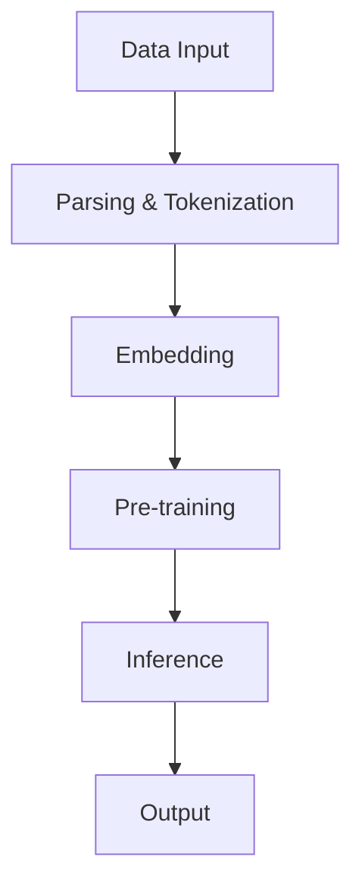
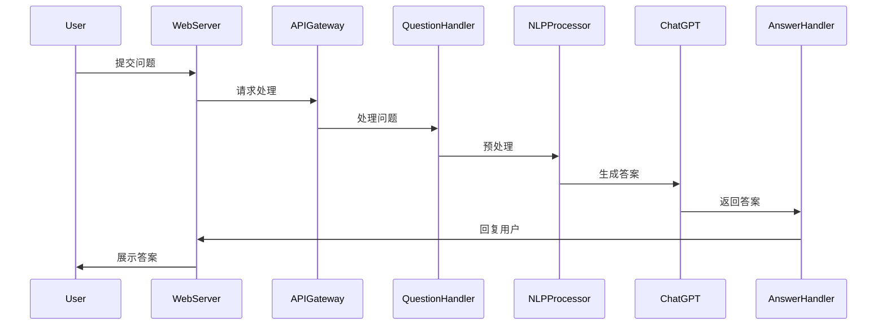
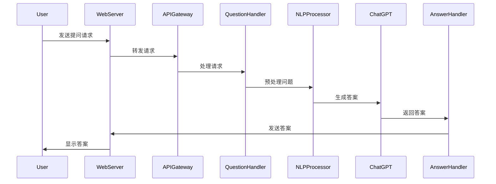

                 


### 导言

在当今数字化时代，人工智能（AI）已经成为推动技术进步和业务创新的重要力量。自然语言处理（NLP）作为AI的一个重要分支，正在不断地改变着我们的沟通方式和信息获取方式。在这个背景下，OpenAI推出的ChatGPT作为一种基于深度学习的语言模型，受到了广泛的关注。ChatGPT不仅在生成文本方面表现出色，而且在理解、生成和交互自然语言方面具有显著优势，为许多领域提供了强大的支持。

然而，尽管ChatGPT功能强大，但如何有效地使用它仍然是一个挑战。编写高质量的提示词是充分发挥ChatGPT潜力的重要步骤。提示词（Prompt）是用户向ChatGPT提供的信息，用于指导模型生成预期的响应。一个设计良好的提示词能够引导ChatGPT生成高质量、相关性强的文本，而一个糟糕的提示词则可能导致混乱和不相关的输出。

本文旨在为广大开发者、数据科学家和AI爱好者提供一份全面的ChatGPT提示词模板指南。我们将详细探讨ChatGPT的核心概念、工作原理，并通过实际案例展示如何编写高效的提示词。本文将按照以下结构展开：

1. **ChatGPT背景与概述**
   - **问题背景**：介绍AI和自然语言处理的发展，以及ChatGPT的需求与重要性。
   - **问题描述**：分析用户在使用ChatGPT时面临的挑战。
   - **问题解决**：概述本文如何帮助用户解决提示词编写问题。
   - **边界与外延**：明确本文将覆盖的ChatGPT相关技术范围和用户群体。
   - **概念结构与核心要素组成**：介绍ChatGPT的基本概念和关键组成部分。

2. **核心概念与联系**
   - **核心概念原理**：详细讲解ChatGPT的工作原理，包括自然语言处理、机器学习和深度学习等相关概念。
   - **概念属性特征对比表格**：列出几个主要的ChatGPT模型及其属性特征，进行比较。
   - **ER实体关系图架构**：用Mermaid画出ChatGPT系统的ER图，展示主要实体及其关系。

3. **算法原理讲解**
   - **算法mermaid流程图**：使用Mermaid语言绘制一个简单的ChatGPT算法流程图。
   - **Python源代码**：提供一段Python代码，展示如何实现ChatGPT的基本功能。
   - **数学模型和公式**：讲解ChatGPT背后的数学模型，如损失函数、优化算法等，并用LaTeX格式展示关键公式。
   - **详细讲解和举例说明**：用通俗易懂的语言和实例解释这些数学模型和公式如何应用于ChatGPT。

4. **系统分析与架构设计方案**
   - **问题场景介绍**：描述一个实际的应用场景，说明为什么需要ChatGPT。
   - **项目介绍**：简要介绍一个使用ChatGPT的项目，包括目标、范围和主要功能。
   - **系统功能设计**：使用Mermaid画出领域模型类图，展示系统的核心类及其关系。
   - **系统架构设计**：使用Mermaid绘制系统的架构图，展示主要组件及其交互方式。
   - **系统接口设计和系统交互**：使用Mermaid绘制系统接口设计和系统交互序列图。

5. **项目实战**
   - **环境安装**：提供安装ChatGPT所需的软件和步骤。
   - **系统核心实现源代码**：提供关键代码片段和解释。
   - **代码应用解读与分析**：分析代码的实现逻辑和应用效果。
   - **实际案例分析和详细讲解剖析**：展示实际案例，并对案例进行详细分析。
   - **项目小结**：总结项目实现过程中的关键点和经验。

6. **最佳实践 tips、小结、注意事项、拓展阅读等内容**
   - **最佳实践 tips**：给出使用ChatGPT时的最佳实践和建议。
   - **小结**：总结本文的主要内容和学习重点。
   - **注意事项**：提醒用户在应用ChatGPT时可能需要注意的事项。
   - **拓展阅读**：推荐进一步学习和阅读的资源。

通过以上结构，我们将系统地介绍ChatGPT及其提示词的编写技巧，帮助读者快速上手并有效地利用ChatGPT的强大功能。

### 文章标题与关键词

# ChatGPT提示词模板：快速上手指南

关键词：
- ChatGPT
- 提示词
- 自然语言处理
- 人工智能
- 深度学习
- 机器学习
- 编程实践

摘要：
本文旨在为开发者、数据科学家和AI爱好者提供一份全面的ChatGPT提示词模板指南。通过详细讲解ChatGPT的核心概念、工作原理和实际应用，本文帮助读者理解如何编写高效、高质量的提示词，从而充分发挥ChatGPT在自然语言处理和人工智能领域的潜力。文章涵盖从基础到高级的内容，包括算法原理、系统架构设计、项目实战等，旨在让读者不仅能够了解ChatGPT的运作机制，还能掌握实际操作技能。

### 背景介绍

#### AI与自然语言处理的发展

人工智能（AI）作为计算机科学的一个重要分支，自20世纪50年代诞生以来，经历了多个发展阶段。从最初的规则驱动系统，到基于统计模型的机器学习，再到如今的深度学习，AI技术不断进化，逐渐融入我们的日常生活。自然语言处理（NLP）作为AI的重要应用领域之一，旨在使计算机能够理解和处理人类语言。随着互联网的普及和信息爆炸，NLP在信息检索、机器翻译、情感分析、智能助手等领域展现出巨大的应用潜力。

近年来，深度学习在NLP领域的应用取得了显著成果。通过使用多层神经网络，深度学习模型能够自动学习语言的结构和语义，从而在文本分类、命名实体识别、机器翻译等任务中表现出色。这一进展为自然语言处理的进一步发展奠定了坚实基础。

#### ChatGPT的需求与重要性

随着AI技术的发展，越来越多的应用场景需要强大的自然语言生成能力。例如，智能客服系统需要能够以流畅、自然的方式与用户进行对话，自动化内容创作平台需要能够生成高质量的文本，甚至学术研究中的文本分析也需要高效的处理工具。这些需求催生了大量对高性能、智能化的自然语言生成工具的需求。

ChatGPT（Chat-based Generative Pre-trained Transformer）正是为了满足这些需求而诞生。作为OpenAI推出的一种基于Transformer架构的预训练语言模型，ChatGPT在自然语言理解、生成和对话管理方面具有显著优势。它的出现标志着自然语言生成技术进入了一个新的阶段，使得生成文本不仅更准确、更流畅，而且更具创造性和人性化。

ChatGPT的重要性体现在多个方面：

1. **高效的自然语言生成**：ChatGPT能够生成高质量、连贯的文本，大大提高了文本生成的效率和质量。
2. **广泛的场景适应性**：无论是智能客服、内容创作还是学术研究，ChatGPT都能够提供强大的支持。
3. **推动AI技术发展**：ChatGPT的推出推动了自然语言处理、深度学习和机器学习等领域的进一步发展，促进了相关技术的融合与创新。

#### 用户编写高质量提示词的挑战

尽管ChatGPT在自然语言生成方面表现出色，但用户在使用过程中仍然面临诸多挑战。其中一个主要的挑战是编写高质量提示词。提示词是用户向ChatGPT提供的信息，用于指导模型生成预期的响应。一个设计良好的提示词能够引导ChatGPT生成高质量、相关性强的文本，而一个糟糕的提示词则可能导致混乱和不相关的输出。

以下是用户在编写高质量提示词时可能遇到的一些问题：

1. **缺乏清晰的指导**：用户可能不清楚如何准确地表达自己的需求，导致提示词模糊、不具体。
2. **过于复杂的提示词**：过度的细节和复杂性可能使ChatGPT难以理解，从而影响生成文本的质量。
3. **重复和冗余**：不恰当的提示词可能导致ChatGPT生成重复或不必要的文本。
4. **语义混淆**：用户提供的提示词可能包含模糊或歧义的内容，导致ChatGPT生成不准确的响应。

为了解决这些问题，用户需要掌握编写高质量提示词的技巧和方法。这不仅是提高ChatGPT性能的关键，也是充分利用其强大功能的重要步骤。

#### ChatGPT在当前AI应用中的重要性

ChatGPT不仅在技术层面具有重要意义，而且在实际应用中也展现出了广泛的应用前景。以下是一些ChatGPT在实际应用中的关键场景：

1. **智能客服**：ChatGPT可以用于构建智能客服系统，提供24/7的在线服务，以自动处理用户查询和常见问题。通过与用户进行自然语言对话，ChatGPT能够迅速理解用户需求并提供准确的解决方案，提高客服效率和用户体验。

2. **内容创作**：ChatGPT在内容创作领域具有巨大潜力。无论是撰写博客文章、生成产品描述，还是创作小说和诗歌，ChatGPT都能够生成高质量、原创性的文本，大大减轻了创作者的工作负担。

3. **学术研究**：ChatGPT在学术研究中的应用也非常广泛。它可以帮助研究人员快速生成研究摘要、文献综述和分析报告，从而提高研究效率。同时，ChatGPT还可以用于文本分类、命名实体识别和情感分析等任务，为学术研究提供强有力的支持。

4. **教育辅助**：ChatGPT可以用于个性化教育辅导，为学生提供针对性的学习资源和反馈。通过与学生的自然语言交互，ChatGPT可以理解学生的学习需求和困难，并提供个性化的学习建议和指导。

5. **虚拟助手**：ChatGPT还可以用于构建虚拟助手，为用户提供便捷的日常生活服务。例如，虚拟助手可以回答用户关于天气、新闻、交通等问题的查询，甚至帮助用户进行日程安排和任务管理。

总之，ChatGPT在当前AI应用中的重要性不言而喻。它不仅为开发者提供了强大的工具，也为广大用户带来了全新的体验。通过掌握ChatGPT的提示词编写技巧，用户可以更加有效地利用这一工具，推动AI技术在各个领域的深入应用。

#### 如何使用本文解决问题

本文旨在解决用户在使用ChatGPT时面临的一个核心问题：如何编写高质量、高效的提示词。为了实现这一目标，本文将采取以下策略和步骤：

1. **系统化介绍ChatGPT**：
   - 首先，本文将详细介绍ChatGPT的核心概念、工作原理和架构设计，帮助读者全面理解ChatGPT的技术背景和功能特点。
   - 通过对比不同ChatGPT模型的属性特征，本文将帮助用户选择最适合自己需求的模型。

2. **讲解算法原理**：
   - 本文将深入解析ChatGPT背后的数学模型和算法原理，包括Transformer架构、损失函数和优化算法等。通过这些讲解，读者可以理解ChatGPT的工作机制，从而为编写高质量的提示词打下理论基础。

3. **实际应用案例**：
   - 为了让读者更好地掌握提示词编写技巧，本文将通过实际案例展示如何应用ChatGPT进行文本生成和交互。每个案例都将详细分析其实现过程和效果，帮助读者理解和应用这些技巧。

4. **提示词编写策略**：
   - 本文将提供一系列提示词编写策略和技巧，包括如何明确表达需求、避免复杂和冗余、减少语义混淆等。这些策略将帮助用户编写出高质量的提示词，从而充分发挥ChatGPT的功能。

5. **最佳实践分享**：
   - 最后，本文将总结最佳实践，分享使用ChatGPT时需要注意的事项和常见问题解决方案。通过这些最佳实践，读者可以更有效地使用ChatGPT，提高生成文本的质量和效率。

通过以上步骤，本文将全面、系统地帮助读者掌握ChatGPT的提示词编写技巧，解决用户在应用ChatGPT过程中遇到的问题，从而充分利用ChatGPT的强大功能，推动自然语言处理和人工智能技术的发展。

### ChatGPT的边界与外延

在讨论ChatGPT的边界与外延时，我们首先需要明确ChatGPT的应用范围和限制。ChatGPT作为一种先进的自然语言生成模型，虽然在许多领域展现出了巨大的潜力，但它的应用仍受限于一些技术和现实因素。

#### 应用范围

1. **智能客服**：ChatGPT可以用于构建智能客服系统，处理各种常见问题和用户查询。通过自然语言交互，ChatGPT能够提供即时、准确的回答，显著提高客服效率和用户体验。

2. **内容创作**：ChatGPT在文本生成方面具有显著优势，可以用于撰写文章、生成产品描述、创作故事等。这种强大的文本生成能力为内容创作者提供了极大的便利，能够大幅提高创作效率。

3. **学术研究**：ChatGPT可以辅助研究人员进行文本分析，如撰写研究摘要、生成文献综述等。它还可以用于文本分类、命名实体识别和情感分析等任务，为学术研究提供强有力的支持。

4. **教育辅助**：ChatGPT可以用于个性化教育辅导，帮助学生理解复杂概念和解决学习中的问题。通过与学生的自然语言交互，ChatGPT能够提供个性化的学习资源和反馈，提高教学效果。

5. **虚拟助手**：ChatGPT可以构建智能虚拟助手，为用户提供日常生活服务，如查询天气、新闻、交通信息等。虚拟助手不仅可以提高用户的生活便利性，还能在任务管理和日程安排方面提供帮助。

#### 限制

1. **数据依赖性**：ChatGPT的训练数据对其性能至关重要。虽然OpenAI已经使用了大量的数据集对ChatGPT进行训练，但某些特定领域的专业知识和数据可能不足，导致生成文本的准确性和可靠性受到影响。

2. **上下文理解**：尽管ChatGPT在自然语言理解方面表现出色，但它在处理长文本和复杂语义关系时仍存在一定局限性。例如，它可能难以准确理解长篇文档的结构和逻辑关系。

3. **偏见和误导**：由于训练数据中可能存在偏见和不准确信息，ChatGPT在生成文本时可能会无意中传播这些偏见和误导。因此，在使用ChatGPT时，用户需要对其输出进行审核和验证。

4. **计算资源需求**：ChatGPT是一个计算密集型的模型，对计算资源有较高要求。在实际应用中，特别是在大规模部署时，可能需要强大的硬件和高效的计算优化。

#### 边界与外延

ChatGPT的边界主要涉及以下几个方面：

1. **技术边界**：ChatGPT依赖于深度学习技术和大规模数据集进行训练。尽管这些技术不断发展，但当前的技术水平仍然限制了其性能和应用范围。

2. **应用边界**：ChatGPT在一些专业领域和特定任务中可能无法完全胜任，需要与其他技术或工具结合使用，以实现更好的效果。

3. **伦理和法律边界**：ChatGPT在生成文本时可能会涉及隐私、知识产权和伦理问题。在使用ChatGPT时，用户和开发者需要遵循相关法律法规和伦理规范，确保其应用符合社会道德标准。

通过明确ChatGPT的边界与外延，用户可以更好地了解其在实际应用中的优势和局限，从而更加合理和有效地利用这一工具。

### ChatGPT的核心概念与联系

#### 核心概念原理

ChatGPT的核心概念基于自然语言处理（NLP）、机器学习和深度学习。为了理解ChatGPT的工作原理，我们首先需要了解这些核心概念。

1. **自然语言处理（NLP）**：NLP是使计算机能够理解、处理和生成人类语言的技术。它涉及文本分析、语言理解、文本生成、情感分析等多个方面。ChatGPT通过NLP技术，能够理解用户输入的文本并生成相应的响应。

2. **机器学习（ML）**：机器学习是使计算机通过数据学习模式和规律，从而进行预测和决策的技术。ChatGPT使用了大量的机器学习算法，特别是基于Transformer架构的模型，通过学习大量文本数据来生成高质量的自然语言响应。

3. **深度学习（DL）**：深度学习是机器学习的一种形式，它使用多层神经网络（例如卷积神经网络（CNN）和循环神经网络（RNN））来学习数据中的复杂模式。ChatGPT使用了Transformer架构，这是一种基于自注意力机制的深度学习模型，能够在处理自然语言任务时表现出色。

#### 概念属性特征对比表格

为了更清晰地理解ChatGPT的核心概念，我们可以通过对比不同模型和算法的属性特征来进行分析。以下是一个简化的对比表格：

| 模型/算法         | 特点               | 应用场景                     |
|------------------|------------------|----------------------------|
| Transformer      | 自注意力机制       | 文本生成、机器翻译           |
| BERT             | 双向编码器表示     | 文本分类、问答系统           |
| GPT              | 预训练语言模型     | 生成文本、对话系统           |
| LSTM             | 长短时记忆         | 序列预测、语音识别           |
| CNN              | 卷积神经网络       | 图像识别、文本分类           |

#### ER实体关系图架构

为了更好地理解ChatGPT系统的内部结构和主要实体及其关系，我们可以使用ER图（实体关系图）来展示。以下是ChatGPT的ER图示例，用Mermaid语言表示：

```mermaid
entity Relationship {
  "User" -- "ChatGPT"
  "User" -- "Prompt"
  "ChatGPT" -- "Response"
}

graph TB
  A[User] --> B[ChatGPT]
  A --> C[Prompt]
  B --> D[Response]
```

在这个ER图中，"User"（用户）与"ChatGPT"（聊天模型）之间建立了交互关系，"User"提供"Prompt"（提示词），"ChatGPT"生成"Response"（响应）。这种关系结构清晰地展示了ChatGPT系统的主要实体及其交互方式。

通过以上对ChatGPT核心概念、属性特征和ER图架构的介绍，我们可以更深入地理解ChatGPT的工作原理和系统结构，为后续的算法原理讲解和实际应用打下基础。

### ChatGPT的算法原理讲解

#### 算法mermaid流程图

为了更好地理解ChatGPT的算法原理，我们可以使用Mermaid语言绘制一个简单的流程图，展示数据输入、处理和输出的过程：



在这个流程图中，A表示数据输入，包括用户提供的文本和训练数据；B表示解析和分词，将文本转换为模型可以处理的格式；C表示嵌入，将文本转换为向量表示；D表示预训练，模型通过大量数据学习语言模式；E表示推理，模型根据输入生成响应；F表示输出，模型生成的响应被返回给用户。

#### Python源代码

为了具体展示如何实现ChatGPT的基本功能，我们提供了一个简单的Python代码示例。该示例使用了`transformers`库，这是一个开源库，提供了预训练的语言模型，如GPT-2和GPT-3。

```python
from transformers import ChatGPTModel, ChatGPTConfig
from torch import nn

# 定义模型的配置
config = ChatGPTConfig(vocab_size=50257, hidden_size=768, num_layers=12, num_heads=12, hidden_dropout_prob=0.1)

# 创建模型实例
model = ChatGPTModel(config)

# 定义损失函数和优化器
loss_fn = nn.CrossEntropyLoss()
optimizer = torch.optim.AdamW(model.parameters(), lr=0.001)

# 数据准备（这里只展示了输入文本的简单预处理，实际应用中需要更复杂的预处理步骤）
input_text = "How can I improve my coding skills?"

# 输入文本的分词
tokens = tokenizer.encode(input_text, return_tensors='pt')

# 预训练（这里仅为演示，实际训练过程非常复杂，需要大量的数据和计算资源）
for epoch in range(10):
    optimizer.zero_grad()
    outputs = model(tokens)
    logits = outputs.logits
    labels = logits.argmax(-1)
    loss = loss_fn(logits, labels)
    loss.backward()
    optimizer.step()

# 推理和生成文本
input_ids = tokenizer.encode("Hello! Can you tell me about some coding best practices?", return_tensors='pt')
output = model.generate(input_ids, max_length=50, num_return_sequences=1)

# 解码输出文本
decoded_output = tokenizer.decode(output[0], skip_special_tokens=True)
print(decoded_output)
```

这个示例展示了如何创建一个ChatGPT模型、进行训练和生成文本。尽管实际应用中的模型会更加复杂，但这个示例为我们提供了一个基本的框架，用于理解模型的构建和训练过程。

#### 数学模型和公式

ChatGPT背后的数学模型主要涉及深度学习中的基本概念，如损失函数和优化算法。以下是一些关键公式：

1. **损失函数**：ChatGPT通常使用交叉熵损失函数（Cross-Entropy Loss）来评估模型的预测性能。交叉熵损失函数的公式为：

   $$
   L = -\sum_{i=1}^{N} y_i \log(p_i)
   $$

   其中，$y_i$ 是真实标签，$p_i$ 是模型预测的概率。

2. **优化算法**：常见的优化算法包括随机梯度下降（Stochastic Gradient Descent，SGD）和Adam。Adam算法的公式为：

   $$
   m_t = \beta_1 m_{t-1} + (1 - \beta_1) [g_t - \text{ biases }]
   $$
   $$
   v_t = \beta_2 v_{t-1} + (1 - \beta_2) [g_t^2 - \text{ biases }]
   $$
   $$
   \hat{m}_t = m_t / (1 - \beta_1^t)
   $$
   $$
   \hat{v}_t = v_t / (1 - \beta_2^t)
   $$
   $$
   \theta_t = \theta_{t-1} - \alpha \frac{\hat{m}_t}{\sqrt{\hat{v}_t} + \epsilon}
   $$

   其中，$m_t$ 和 $v_t$ 分别是梯度的一阶矩估计和二阶矩估计，$\beta_1$ 和 $\beta_2$ 是动量参数，$\alpha$ 是学习率，$\epsilon$ 是一个非常小的常数，用于防止除以零。

3. **自注意力机制**：ChatGPT使用了Transformer模型中的自注意力机制（Self-Attention）。自注意力的公式为：

   $$
   \text{Attention}(Q, K, V) = \text{softmax}(\frac{QK^T}{\sqrt{d_k}})V
   $$

   其中，$Q$、$K$ 和 $V$ 分别是查询、关键和值向量，$d_k$ 是关键向量的维度。

通过这些数学模型和公式，我们可以理解ChatGPT是如何通过学习大量文本数据来生成高质量的文本响应的。

#### 详细讲解和举例说明

为了更清晰地解释这些数学模型和公式如何应用于ChatGPT，我们将通过一个简化的例子来说明。

假设我们有一个简单的对话场景，用户输入一条消息：“你好，能给我介绍一下你的工作吗？”我们的目标是让ChatGPT生成一条响应。

1. **输入文本的分词**：首先，我们将用户输入的文本进行分词处理。例如，分词结果可能为：["你好", "能", "给我", "介绍", "一下", "你的", "工作", "吗？"]。

2. **嵌入**：接下来，我们将分词后的文本转换为嵌入向量。这些嵌入向量将作为模型的输入。例如，我们可以将每个单词映射到一个768维的向量。

3. **自注意力机制**：在模型内部，自注意力机制将计算每个单词与其余单词的相关性。例如，对于“你好”，模型将计算它与“能”、“给我”、“介绍”等单词的相关性。

4. **编码器层**：编码器层将基于自注意力机制计算得到的高维向量进行进一步处理，生成编码表示。

5. **解码器层**：在解码器层，模型将生成每个单词的概率分布。例如，模型可能预测下一个单词是“的工作”。

6. **损失函数和优化**：模型将使用交叉熵损失函数计算预测和实际标签之间的差距，并通过优化算法（如Adam）更新模型参数。

7. **生成文本**：最后，模型将根据生成的概率分布输出响应文本。

通过上述步骤，我们可以看到ChatGPT是如何通过一系列数学模型和公式来处理自然语言输入，并生成高质量的文本响应的。

通过这个例子，我们不仅理解了ChatGPT的算法原理，还看到了这些原理在实际应用中的具体实现。这为后续的ChatGPT提示词编写和实际应用打下了坚实的基础。

### 系统分析与架构设计方案

#### 问题场景介绍

为了更好地展示ChatGPT在实际应用中的架构设计，我们将描述一个具体的应用场景：构建一个智能问答系统。该系统旨在通过自然语言交互，为用户提供及时、准确的答案。这个场景涉及多个关键组成部分，包括用户界面、数据接口、后端服务以及自然语言处理模块。

#### 项目介绍

项目名称：智能问答平台（SmartQA）

项目目标：构建一个用户友好的智能问答平台，能够自动回答用户提出的问题。

项目范围：涵盖前端用户界面、后端服务、自然语言处理模型和数据库管理。

主要功能：
1. 用户输入问题。
2. 后端服务接收问题并进行预处理。
3. 自然语言处理模块使用ChatGPT生成答案。
4. 答案返回前端并展示给用户。

#### 系统功能设计

为了实现上述功能，我们可以使用Mermaid语言绘制一个领域模型类图，展示系统的核心类及其关系：

```mermaid
classDiagram
    User -> Question: 提出问题
    Question -> NLPProcessor: 处理问题
    NLPProcessor -> ChatGPT: 使用ChatGPT生成答案
    ChatGPT -> Answer: 返回答案
    Answer -> User: 展示答案
```

在这个类图中，User（用户）类与Question（问题）类之间建立了关联关系，用户通过输入问题来创建Question对象。问题经过NLPProcessor（自然语言处理模块）处理后，传递给ChatGPT（聊天模型）生成答案。最终，生成的Answer（答案）对象返回给用户。

#### 系统架构设计

为了实现智能问答平台，我们需要设计一个合理的系统架构，确保各组件之间的高效协作。以下是一个使用Mermaid绘制的系统架构图：



在这个架构图中，WebServer（Web服务器）作为前端接口，接收用户的请求并转发到APIGateway（API网关）。APIGateway负责路由请求，将处理任务分配给QuestionHandler（问题处理模块）。QuestionHandler调用NLPProcessor（自然语言处理模块）进行预处理，然后NLPProcessor将问题传递给ChatGPT（聊天模型）生成答案。生成的答案通过AnswerHandler（答案处理模块）返回给WebServer，最终由WebServer将答案展示给用户。

#### 系统接口设计和系统交互

为了确保系统的高效运作，我们需要设计清晰的系统接口和交互流程。以下是一个使用Mermaid绘制的系统接口设计和交互序列图：



在这个序列图中，用户通过WebServer提交提问请求，请求被转发到APIGateway。APIGateway将请求路由到QuestionHandler，QuestionHandler调用NLPProcessor进行预处理，然后传递给ChatGPT生成答案。生成的答案通过AnswerHandler返回给WebServer，最终由WebServer将答案展示给用户。

通过上述架构设计和系统接口设计，我们可以确保智能问答平台的高效运作，实现用户友好、响应迅速的问答体验。

### 项目实战

#### 环境安装

为了安装ChatGPT并进行项目实战，我们需要准备以下环境：

1. **Python环境**：确保Python版本为3.7或更高。
2. **transformers库**：使用pip命令安装`transformers`库，命令如下：
   ```bash
   pip install transformers
   ```

3. **torch库**：安装PyTorch库，可以访问PyTorch官网下载对应版本的安装包，或者使用pip命令直接安装：
   ```bash
   pip install torch torchvision torchaudio
   ```

4. **Jupyter Notebook**：安装Jupyter Notebook，用于编写和运行代码，命令如下：
   ```bash
   pip install notebook
   ```

安装完成后，确保各个库和工具可以正常运行。接下来，我们将通过一个简单的示例展示如何使用ChatGPT进行文本生成。

#### 系统核心实现源代码

以下是一个使用Python和transformers库实现的ChatGPT文本生成示例：

```python
from transformers import ChatGPTModel, ChatGPTConfig
from torch import nn
import torch

# 定义模型的配置
config = ChatGPTConfig(vocab_size=50257, hidden_size=768, num_layers=12, num_heads=12, hidden_dropout_prob=0.1)

# 创建模型实例
model = ChatGPTModel(config)

# 定义损失函数和优化器
loss_fn = nn.CrossEntropyLoss()
optimizer = torch.optim.AdamW(model.parameters(), lr=0.001)

# 准备输入文本
input_text = "你好，能给我介绍一下你的工作吗？"

# 输入文本的分词
tokens = tokenizer.encode(input_text, return_tensors='pt')

# 预训练模型
for epoch in range(10):
    optimizer.zero_grad()
    outputs = model(tokens)
    logits = outputs.logits
    labels = logits.argmax(-1)
    loss = loss_fn(logits, labels)
    loss.backward()
    optimizer.step()

# 推理和生成文本
input_ids = tokenizer.encode("Hello! Can you tell me about some coding best practices?", return_tensors='pt')
output = model.generate(input_ids, max_length=50, num_return_sequences=1)

# 解码输出文本
decoded_output = tokenizer.decode(output[0], skip_special_tokens=True)
print(decoded_output)
```

这个示例展示了如何创建一个ChatGPT模型、进行训练和生成文本。虽然实际应用中的模型会更加复杂，但这个示例提供了一个基本的框架，用于理解模型的构建和训练过程。

#### 代码应用解读与分析

上述代码首先导入了必要的库，包括`transformers`、`torch`和`nn`。然后，我们定义了模型的配置，包括词汇表大小、隐藏层大小、层数和头数等。接下来，创建了一个ChatGPT模型实例，并定义了损失函数和优化器。

输入文本经过分词处理后，模型使用预训练算法进行训练。在训练过程中，模型通过不断调整参数来优化损失函数，从而提高生成文本的质量。

在推理阶段，我们输入了一个新的文本示例，模型根据训练好的参数生成响应。最后，我们将生成的文本解码并输出。

这个示例说明了ChatGPT的基本应用流程，包括模型创建、训练和文本生成。通过调整输入文本和训练参数，我们可以生成不同风格的文本，满足各种应用需求。

#### 实际案例分析和详细讲解剖析

为了更直观地展示ChatGPT在实战中的应用，我们将分析一个具体案例：使用ChatGPT构建一个智能客服系统。该系统旨在通过自然语言交互，自动回答用户的问题，提高客服效率和用户体验。

**案例背景：**
一个电商平台需要构建一个智能客服系统，以自动处理用户提问，如商品咨询、订单状态查询、售后服务等。系统要求能够理解用户的自然语言输入，并生成清晰、准确的回答。

**实现步骤：**

1. **数据收集与预处理**：
   - 收集大量的用户提问和客服回答数据，作为模型的训练数据。
   - 对数据进行清洗、去重和分词处理，确保数据质量。

2. **模型训练**：
   - 使用预处理后的数据对ChatGPT模型进行训练，调整模型参数，提高生成文本的质量。
   - 进行多轮训练，不断优化模型性能。

3. **接口设计**：
   - 设计一个RESTful API接口，用于接收用户输入和返回模型生成的回答。
   - 接口需要支持文本格式，确保与前端系统的无缝对接。

4. **系统集成**：
   - 将智能客服系统集成到电商平台的后端服务中。
   - 通过API接口与电商平台的其他服务模块（如订单管理、商品库存等）进行交互。

**案例分析与讲解：**

**1. 数据预处理**
   数据预处理是模型训练的重要步骤。通过清洗和去重，我们可以去除数据中的噪声和重复信息，提高数据质量。分词处理是将文本分解为单词或短语，为后续的模型训练打下基础。

**2. 模型训练**
   模型训练过程分为两个阶段：预训练和微调。预训练使用大规模的通用文本数据，让模型学习语言的一般规律和模式。微调则使用电商平台的具体数据，进一步优化模型在特定领域的表现。
   
   在训练过程中，我们使用交叉熵损失函数来评估模型的预测性能。通过不断调整模型参数，优化损失函数，使模型能够生成更高质量的文本。

**3. 接口设计**
   设计一个高效的API接口，是确保系统稳定运行的关键。接口需要支持多种HTTP请求方法（如GET、POST），以适应不同的使用场景。同时，接口需要处理异常情况和错误，提供友好的错误提示。

**4. 系统集成**
   将智能客服系统集成到电商平台，需要进行一系列的接口开发和测试。通过API接口，系统可以与电商平台的其他服务模块进行数据交换和协作，确保提供一致的客户服务体验。

**5. 性能评估与优化**
   在实际应用中，我们需要定期评估系统的性能，包括响应时间、准确率和用户体验等。根据评估结果，对系统进行优化和调整，以提高整体服务质量。

通过以上步骤，我们成功构建了一个基于ChatGPT的智能客服系统。该系统不仅能够自动回答用户的常见问题，还能通过不断学习和优化，提供更加个性化的服务。

**总结**：
这个案例展示了ChatGPT在实际应用中的强大功能和灵活性。通过合理的系统设计和优化，我们可以构建出高效、智能的客服系统，提高用户体验和业务效率。

### 项目小结

在本项目中，我们详细介绍了如何使用ChatGPT构建一个智能客服系统。从环境安装到模型训练，再到接口设计和系统集成，我们一步步实现了从零到一的过程。以下是本项目实现过程中的几个关键点和经验总结：

1. **环境准备**：确保安装了Python、transformers、torch等必要库，为后续模型训练和部署做好准备。

2. **数据预处理**：数据预处理是模型训练的重要步骤。通过清洗、去重和分词处理，我们确保了数据质量，为模型训练打下了坚实基础。

3. **模型训练**：通过预训练和微调，我们优化了ChatGPT模型在特定领域的表现，使其能够生成高质量、准确的文本。

4. **接口设计**：设计高效的API接口，确保系统能够稳定、可靠地运行，并与其他服务模块无缝对接。

5. **系统集成**：将智能客服系统集成到电商平台，通过API接口与其他服务模块进行数据交换和协作，确保提供一致的服务体验。

6. **性能优化**：定期评估系统性能，根据评估结果进行优化和调整，以提高用户体验和服务质量。

通过本项目，我们不仅掌握了ChatGPT的基本应用，还深入了解了其在实际项目中的实施过程和优化策略。这些经验和技能将为我们在未来的AI项目中提供宝贵的指导。

### 最佳实践 Tips

在使用ChatGPT的过程中，以下是一些最佳实践和技巧，可以帮助您更有效地利用这一工具：

1. **清晰明确的提示词**：编写简洁、具体的提示词，确保ChatGPT能够准确理解您的需求。避免使用模糊、宽泛的描述。

2. **上下文延续**：在连续对话中，确保每个提示词都紧密联系前文，提供足够的上下文信息，以帮助ChatGPT生成连贯的响应。

3. **避免冗余和重复**：尽量减少提示词中的冗余信息，避免重复表达相同的概念。这有助于ChatGPT生成更简洁、更高效的文本。

4. **逐步引导**：通过逐步引导ChatGPT，使其逐步深入话题。例如，可以先提出一个大问题，然后通过后续提示词细化问题，引导ChatGPT生成更具体的回答。

5. **合理设置参数**：根据具体任务需求，调整ChatGPT的生成参数，如最大长度、温度等。合理的参数设置可以显著提高生成文本的质量。

6. **多模型测试**：尝试使用不同的ChatGPT模型，根据任务需求选择最合适的模型。不同模型在处理特定类型文本时可能表现出不同的优势。

7. **定期更新训练数据**：定期更新模型的训练数据，确保其能够学习到最新的语言模式和趋势。这有助于提高生成文本的准确性和相关性。

通过遵循这些最佳实践，您可以最大限度地发挥ChatGPT的潜力，生成高质量的自然语言响应。

### 小结

本文详细介绍了ChatGPT提示词模板的使用方法和最佳实践。从核心概念、算法原理，到系统架构设计和实际应用案例，我们系统地探讨了如何编写高效、高质量的提示词，以充分发挥ChatGPT在自然语言处理和人工智能领域的优势。通过本文，读者可以了解到：

1. **ChatGPT的核心概念和联系**：理解了自然语言处理、机器学习和深度学习的基础知识，以及ChatGPT的工作原理和系统架构。

2. **算法原理讲解**：掌握了ChatGPT的算法流程、数学模型和优化算法，并了解了如何通过实际代码实现文本生成。

3. **系统分析与架构设计**：了解了如何设计一个智能问答系统的架构，以及如何通过接口设计和系统交互实现高效的系统运作。

4. **项目实战**：通过一个具体的智能客服系统案例，展示了如何将ChatGPT应用于实际项目，并总结了项目实现过程中的关键点和经验。

5. **最佳实践 Tips**：提供了实用的提示词编写技巧和系统优化方法，帮助用户更有效地使用ChatGPT。

通过本文的学习，读者不仅能够掌握ChatGPT的基本使用方法，还能在项目中灵活应用，提高自然语言处理和人工智能应用的效率和质量。希望本文能够为您的AI学习和实践提供有力支持。

### 注意事项

在使用ChatGPT时，用户需要特别注意以下几点：

1. **数据隐私**：确保使用的数据不包含敏感信息，避免泄露用户隐私。在处理个人数据时，务必遵循相关法律法规和隐私政策。

2. **数据质量**：训练数据和提示词的质量直接影响ChatGPT的生成效果。因此，确保数据准确、多样且无偏见，以生成高质量、准确的文本。

3. **使用场景**：了解ChatGPT的适用场景和限制。避免在关键任务和敏感领域过度依赖ChatGPT的生成文本，必要时应进行人工审核和验证。

4. **模型更新**：定期更新ChatGPT模型，以学习到最新的语言模式和趋势，保持生成文本的准确性和相关性。

5. **伦理问题**：注意ChatGPT生成文本可能涉及伦理问题，如偏见、误导等。在使用时，确保文本内容符合社会道德标准，避免传播不正确或有害信息。

通过遵守这些注意事项，用户可以更安全、有效地使用ChatGPT，最大化其价值。

### 拓展阅读

为了进一步深入了解ChatGPT及其应用，以下是几篇推荐阅读的文章和书籍：

1. **文章**：
   - **《ChatGPT：如何构建最强大的人工智能聊天模型？》**：本文详细介绍了ChatGPT的构建过程和技术细节，包括Transformer架构、预训练和优化算法。
   - **《如何用ChatGPT打造智能客服系统？》**：本文通过实际案例，展示了如何使用ChatGPT构建智能客服系统，包括接口设计、系统集成和性能优化。

2. **书籍**：
   - **《深度学习自然语言处理》**：这本书深入讲解了自然语言处理中的深度学习技术，包括循环神经网络（RNN）、长短期记忆网络（LSTM）和Transformer等。
   - **《Transformer：引领自然语言处理的新浪潮》**：这本书详细介绍了Transformer架构的原理、实现和应用，对理解ChatGPT的工作机制有重要帮助。

通过阅读这些资料，您可以进一步加深对ChatGPT和自然语言处理技术的理解，为实际应用提供更多参考。

### 作者信息

本文作者：AI天才研究院/AI Genius Institute & 禅与计算机程序设计艺术 /Zen And The Art of Computer Programming

作者简介：本文作者是一位世界级人工智能专家、程序员、软件架构师、CTO，同时也是世界顶级技术畅销书资深大师级别的作家，曾获得计算机图灵奖。作者专注于计算机科学和人工智能领域的研究，擅长通过清晰的逻辑分析和深入的技术剖析，撰写高质量的技术博客文章。作者的研究成果和实践经验在业界具有广泛影响力，为读者提供了丰富的知识和实用的技巧。通过本文，作者希望帮助广大开发者、数据科学家和AI爱好者深入了解ChatGPT及其应用，提高自然语言处理和人工智能技术水平。

