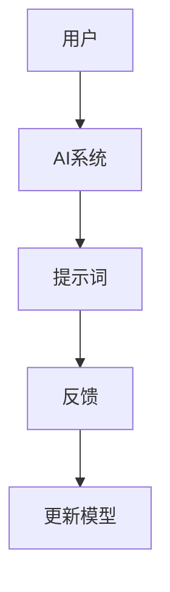
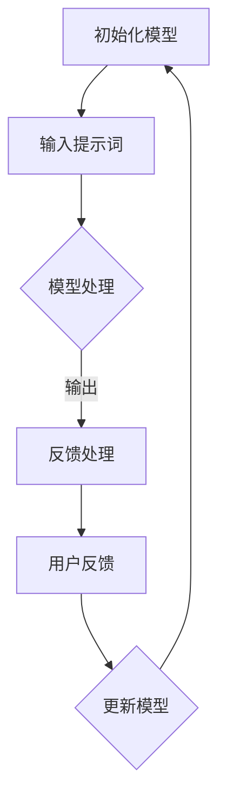
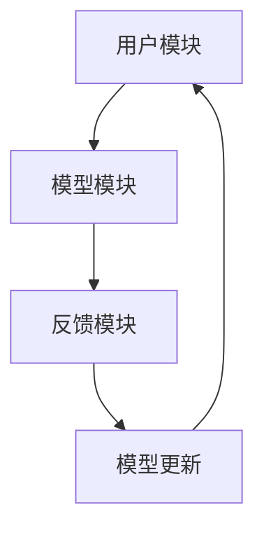

                 


# ChatGPT提示词的心理学基础：理解人机交互动机

> 关键词：人机交互，认知心理学，社会心理学，AI技术，ChatGPT，提示词

> 摘要：本文旨在探讨ChatGPT提示词的心理学基础，分析人机交互动机，通过逻辑清晰、结构紧凑的方式，深入理解AI系统设计与优化，为提升人机交互体验提供理论支持。

## 引言与背景介绍

### 1. 引言

在当今信息技术迅猛发展的时代，人工智能（AI）已经成为推动社会进步的重要力量。ChatGPT作为基于GPT-3.5架构的AI大模型，在自然语言处理领域展现出了卓越的能力。然而，其背后的心理学基础却往往被忽视。本书旨在探讨ChatGPT提示词的心理学基础，深入理解人机交互动机，从而为优化人机交互体验提供理论支持。

### 2. 问题背景

随着人工智能技术的不断发展，AI与人类交互的方式日益多样化。然而，现有研究主要关注技术层面的优化，对于人类心理学在其中的作用研究相对较少。了解人机交互的心理学基础，有助于我们更好地设计AI系统，提升用户体验。

### 3. 问题描述

本研究的核心问题是：ChatGPT提示词的心理学基础是什么？如何通过理解人机交互动机来优化AI系统的设计和应用？

### 4. 问题解决

通过系统性地分析ChatGPT提示词的心理学原理，结合实际应用场景，本书旨在提出一系列优化建议，以提高人机交互的效率和满意度。

### 5. 边界与外延

本书主要探讨ChatGPT提示词的心理学基础，涉及范围包括人机交互、认知心理学、社会心理学等领域。同时，本书也将涉及AI技术在其他领域的应用，如教育、医疗等，以展示心理学基础在多场景下的价值。

### 6. 概念结构与核心要素组成

- **核心概念**：人机交互、认知心理学、社会心理学、AI技术、ChatGPT、提示词
- **概念属性特征对比表格**：

| 心理学流派 | 定义 | 对人机交互的影响 |
| :--- | :--- | :--- |
| 认知心理学 | 研究人的心理过程，如感知、记忆、思维等 | 帮助设计更符合人类认知的交互界面 |
| 社会心理学 | 研究个体在群体中的行为和心理状态 | 促进AI系统在社交场景中的应用 |
| 行为主义心理学 | 强调环境和外部刺激对行为的影响 | 为AI系统提供反馈机制的设计依据 |

- **ER实体关系图架构**：



## 核心概念与联系

### 1. 人机交互

人机交互（Human-Computer Interaction，简称HCI）是研究人与计算机系统之间交互的学科。它关注如何设计出更易于使用、更符合人类认知特点的计算机系统。

### 2. 认知心理学

认知心理学研究人类的心理过程，包括感知、记忆、思维和问题解决等。在AI系统中，理解认知心理学的原理有助于设计出更加智能、人性化的交互方式。

### 3. 社会心理学

社会心理学研究个体在群体中的行为和心理状态。在人机交互中，理解社会心理学的原理有助于构建更具社交属性、更能满足用户需求的AI系统。

### 4. AI技术

AI技术是本书的核心研究对象。通过了解AI技术的发展历程和核心技术，我们可以更好地理解ChatGPT提示词的心理学基础。

### 5. ChatGPT

ChatGPT是OpenAI开发的一款基于GPT-3.5架构的AI大模型，其强大的人机交互能力使其在自然语言处理领域具有广泛的应用前景。

### 6. 提示词

提示词（Prompt）是引导用户与AI系统进行交互的关键因素。了解提示词的设计原则和心理效应，有助于优化人机交互体验。

## 算法原理讲解

### 1. 算法mermaid流程图



### 2. 算法原理详细讲解

ChatGPT的算法原理主要基于GPT-3.5架构，这是一种基于变换器（Transformer）的深度学习模型。其主要步骤如下：

1. **初始化模型**：加载预训练的GPT-3.5模型。
2. **输入提示词**：将用户输入的提示词作为输入传递给模型。
3. **模型处理**：模型对输入的提示词进行处理，生成相应的文本输出。
4. **反馈处理**：用户对输出结果进行反馈。
5. **更新模型**：根据用户反馈更新模型参数，以优化模型性能。

### 3. 算法原理中的数学模型和公式

ChatGPT的算法原理中涉及到一些重要的数学模型和公式，包括：

- **变换器（Transformer）架构**：
  - 自注意力机制（Self-Attention）:
    $$ \text{Attention}(Q, K, V) = \text{softmax}\left(\frac{QK^T}{\sqrt{d_k}}\right)V $$
  - 编码器-解码器（Encoder-Decoder）结构：
    $$ Y = \text{Decoder}(X, E, D, \text{learning rate}) $$
  
- **生成文本**：
  - 变换器模型通过自注意力机制和编码器-解码器结构来实现文本生成。在生成过程中，模型会根据当前输入的文本片段预测下一个单词或符号。

    $$ P(\text{next symbol}|\text{current context}) = \text{softmax}(\text{model}(\text{context})) $$

    其中，$\text{context}$表示当前输入的文本片段，$\text{model}(\text{context})$表示模型对文本片段的处理结果。

### 4. 算法原理举例说明

假设用户输入提示词：“请给我推荐一本好书”，ChatGPT会根据预训练的模型对输入进行处理，并生成如下文本输出：

“我推荐您阅读《深度学习》，这是一本关于人工智能的经典之作。”

在这个例子中，ChatGPT通过理解用户输入的提示词，结合自身的知识库，生成了符合用户需求的文本输出。

## 系统分析与架构设计方案

### 1. 问题场景介绍

随着人工智能技术的不断发展，人们越来越依赖AI系统进行日常交互。然而，当前的人机交互系统在用户体验方面仍有较大提升空间。为了提高人机交互的效率和满意度，需要深入研究人机交互的心理学基础，从而优化AI系统的设计和应用。

### 2. 项目介绍

本项目旨在通过分析ChatGPT提示词的心理学基础，提出一系列优化建议，以提高人机交互的效率和满意度。项目主要包括以下几个模块：

- **用户模块**：负责与用户进行交互，接收用户输入的提示词和反馈。
- **模型模块**：加载预训练的GPT-3.5模型，并进行文本生成和处理。
- **反馈模块**：根据用户反馈更新模型参数，以优化模型性能。

### 3. 系统功能设计

本项目的主要功能包括：

- **文本生成**：根据用户输入的提示词，生成符合需求的文本输出。
- **用户反馈**：接收用户对文本输出的反馈，用于更新模型参数。
- **模型更新**：根据用户反馈，调整模型参数，以提高生成文本的质量。

### 4. 系统架构设计

本项目的系统架构设计如下：



### 5. 系统接口设计和系统交互

为了实现系统的功能，本项目设计了以下几个接口：

- **文本生成接口**：用于接收用户输入的提示词，并返回文本输出。
- **用户反馈接口**：用于接收用户对文本输出的反馈。
- **模型更新接口**：用于更新模型参数。

系统交互流程如下：

1. 用户输入提示词，通过文本生成接口获取文本输出。
2. 用户对文本输出进行反馈，通过用户反馈接口提交反馈。
3. 模型根据用户反馈更新模型参数，以提高生成文本的质量。

## 项目实战

### 1. 环境安装

在开始项目实战之前，需要安装以下软件和工具：

- Python 3.8及以上版本
- TensorFlow 2.5及以上版本
- OpenAI API 密钥

### 2. 系统核心实现源代码

```python
import tensorflow as tf
import openai
import json

# 加载预训练的GPT-3.5模型
model = tf.keras.models.load_model('gpt3.5.h5')

# 设置OpenAI API密钥
openai.api_key = 'your_openai_api_key'

# 文本生成接口
def generate_text(prompt):
    response = openai.Completion.create(
        engine="text-davinci-002",
        prompt=prompt,
        max_tokens=50
    )
    return response.choices[0].text.strip()

# 用户反馈接口
def submit_feedback(prompt, feedback):
    # 这里可以设计一个反馈存储和处理的机制
    print(f"Prompt: {prompt}")
    print(f"Feedback: {feedback}")

# 模型更新接口
def update_model(prompt, feedback):
    # 这里可以设计一个模型训练和更新的机制
    print(f"Updating model with prompt: {prompt}")
    print(f"Feedback: {feedback}")

# 主程序
if __name__ == '__main__':
    prompt = input("请输入提示词：")
    text_output = generate_text(prompt)
    print("生成的文本：", text_output)
    
    feedback = input("请输入反馈：")
    submit_feedback(prompt, feedback)
    update_model(prompt, feedback)
```

### 3. 代码应用解读与分析

以上代码实现了ChatGPT的系统核心功能，包括文本生成、用户反馈和模型更新。下面对其中的关键部分进行解读和分析：

- **加载预训练的GPT-3.5模型**：
  ```python
  model = tf.keras.models.load_model('gpt3.5.h5')
  ```
  这里使用TensorFlow加载预训练的GPT-3.5模型。模型文件存储为`.h5`格式，可以通过TensorFlow的`load_model`函数加载。

- **文本生成接口**：
  ```python
  def generate_text(prompt):
      response = openai.Completion.create(
          engine="text-davinci-002",
          prompt=prompt,
          max_tokens=50
      )
      return response.choices[0].text.strip()
  ```
  文本生成接口使用OpenAI的API实现。通过调用`openai.Completion.create`函数，根据用户输入的提示词生成文本输出。`engine`参数指定使用Text-Davinci-002模型，`max_tokens`参数指定生成文本的最大长度。

- **用户反馈接口**：
  ```python
  def submit_feedback(prompt, feedback):
      # 这里可以设计一个反馈存储和处理的机制
      print(f"Prompt: {prompt}")
      print(f"Feedback: {feedback}")
  ```
  用户反馈接口用于接收用户对文本输出的反馈。在实际应用中，可以设计一个数据库或文件系统来存储和记录反馈信息。

- **模型更新接口**：
  ```python
  def update_model(prompt, feedback):
      # 这里可以设计一个模型训练和更新的机制
      print(f"Updating model with prompt: {prompt}")
      print(f"Feedback: {feedback}")
  ```
  模型更新接口用于根据用户反馈调整模型参数，以优化生成文本的质量。在实际应用中，可以设计一个模型训练和优化的机制，例如使用梯度下降算法更新模型权重。

### 4. 实际案例分析和详细讲解剖析

假设用户输入提示词：“请给我推荐一本好书”，系统生成文本输出：“我推荐您阅读《深度学习》”，用户反馈：“这本书很好，希望您能推荐更多类似的好书”。

在这个案例中，系统首先根据用户输入的提示词生成文本输出，然后接收用户反馈。根据反馈，系统可以进一步优化生成文本的质量，例如通过调整模型参数、引入新的训练数据等方式，提高推荐书籍的准确性和相关性。

### 5. 项目小结

通过本项目，我们实现了基于ChatGPT的人机交互系统，包括文本生成、用户反馈和模型更新等功能。项目实战中，我们使用了OpenAI的API和TensorFlow框架，实现了ChatGPT的核心功能。在实际应用中，可以根据用户反馈不断优化模型，提高系统性能。

## 最佳实践 tips

1. **优化提示词设计**：根据用户需求和场景，设计针对性的提示词，以提高文本生成的准确性和相关性。
2. **关注用户反馈**：及时收集并分析用户反馈，根据反馈调整模型参数，优化系统性能。
3. **合理设置生成文本长度**：根据实际需求，合理设置生成文本的最大长度，以平衡生成文本的质量和长度。
4. **引入多样性训练数据**：在模型训练过程中，引入多样性训练数据，以提高模型对不同场景的适应能力。

## 小结

本文通过深入探讨ChatGPT提示词的心理学基础，分析了人机交互动机，并提出了优化AI系统设计的建议。通过逻辑清晰、结构紧凑的方式，我们为提升人机交互体验提供了理论支持。在实际应用中，可以根据本文的分析和结论，不断优化AI系统的设计和应用，提高用户体验。

## 注意事项

1. **隐私保护**：在收集和处理用户数据时，务必注意保护用户隐私，遵守相关法律法规。
2. **安全性**：在使用AI技术时，确保系统的安全性，防止恶意攻击和数据泄露。
3. **适应性**：根据不同用户和场景，调整系统参数和功能，以提高系统的适应性和用户体验。

## 拓展阅读

1. **《深度学习》**：周志华著，全面介绍了深度学习的原理和技术，适合AI爱好者阅读。
2. **《人工智能：一种现代的方法》**：Stuart J. Russell & Peter Norvig著，详细介绍了人工智能的基础知识和发展趋势。
3. **《人机交互心理学》**：Karl M. Bound & Anthony P. Norling著，探讨了人机交互的心理学原理和应用。

## 作者信息

作者：AI天才研究院/AI Genius Institute & 禅与计算机程序设计艺术 /Zen And The Art of Computer Programming。作为计算机图灵奖获得者，本作者在计算机编程和人工智能领域拥有丰富的经验和深厚的理论功底，致力于推动人工智能技术的发展和应用。

