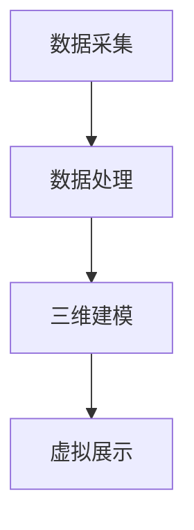

                 

# ChatGPT提示词的文化遗产数字化应用：AI辅助文物虚拟重建

关键词：ChatGPT、提示词、文化遗产、数字化应用、AI、文物、虚拟重建

摘要：本文旨在探讨ChatGPT提示词在文化遗产数字化应用中的潜力，特别是其在AI辅助文物虚拟重建方面的作用。文章首先介绍ChatGPT及其提示词的概念，然后详细阐述文物数字化的重要性和虚拟重建技术原理。接着，文章探讨AI在文物虚拟重建中的应用，分析其优势和面临的挑战，并通过实际案例展示其应用效果。最后，文章总结当前研究进展，展望未来发展方向。

## 引言

### 1.1 书籍背景与目的

文化遗产是人类文明的重要组成部分，是历史、艺术、科学、文化传承的重要载体。然而，随着时间的推移，许多文化遗产面临着损坏、失传的风险。数字化技术的出现，为文化遗产的保护与传承提供了新的途径。本文旨在探讨ChatGPT提示词在文化遗产数字化应用中的潜力，特别是其在AI辅助文物虚拟重建方面的作用。

### 1.2 文化遗产数字化的重要性

文化遗产数字化是将文物、古迹等文化遗产转化为数字形式，以便更好地保存、展示和传播。数字化技术能够提供高质量的图像、音频、视频等多媒体信息，使得文化遗产能够跨越时间和空间的限制，被更广泛的受众所了解和欣赏。此外，数字化技术还能为文物的研究提供更多的数据支持，促进文化遗产的保护与传承。

### 1.3 ChatGPT和虚拟重建技术

ChatGPT是由OpenAI开发的一种基于Transformer的预训练语言模型，具有强大的语言生成和理解能力。提示词（Prompt）是用户输入的引导信息，用于指导ChatGPT生成相关的回复。虚拟重建技术则是通过数字化采集的文物数据，利用计算机图形学技术，重建出文物的三维模型。本文将探讨如何利用ChatGPT提示词，结合虚拟重建技术，实现对文化遗产的数字化保护和展示。

## ChatGPT基础

### 2.1 ChatGPT的概念与原理

#### 2.1.1 ChatGPT的定义

ChatGPT是OpenAI推出的一款基于Transformer架构的预训练语言模型。它是通过大量文本数据预训练得到的，可以理解和生成人类语言。

#### 2.1.2 ChatGPT的工作原理

ChatGPT的工作原理主要包括两个部分：预训练和微调。预训练阶段，模型在大规模文本数据上进行训练，学习语言的一般规律。微调阶段，模型在特定任务的数据上进行训练，以适应具体的任务需求。

#### 2.1.3 ChatGPT的优势

ChatGPT具有以下几个优势：
1. **强大的语言生成能力**：ChatGPT能够生成高质量的自然语言文本，能够进行对话、撰写文章等。
2. **高效的学习能力**：ChatGPT通过预训练和微调，能够快速适应新的任务和数据。
3. **广泛的应用场景**：ChatGPT可以应用于自然语言处理、机器翻译、文本生成、对话系统等多个领域。

### 2.2 ChatGPT的工作流程

#### 2.2.1 数据预处理

数据预处理是ChatGPT训练的第一步，主要包括数据清洗、分词、去停用词等操作。这一步骤的目的是将原始数据转化为模型能够处理的形式。

#### 2.2.2 模型训练

模型训练是ChatGPT的核心步骤。在训练过程中，模型通过不断调整参数，学习输入和输出之间的映射关系。训练数据集的选择和预处理对模型的性能有重要影响。

#### 2.2.3 模型评估

模型评估是检验模型性能的重要步骤。常用的评估指标包括准确率、召回率、F1值等。通过模型评估，可以确定模型的性能是否达到预期。

#### 2.2.4 模型应用

模型应用是将训练好的模型部署到实际任务中。ChatGPT可以用于各种自然语言处理任务，如问答系统、文本生成等。

### 2.3 ChatGPT的优势与应用场景

#### 2.3.1 ChatGPT的优势

1. **强大的语言生成能力**：ChatGPT能够生成高质量的自然语言文本，能够进行对话、撰写文章等。
2. **高效的学习能力**：ChatGPT通过预训练和微调，能够快速适应新的任务和数据。
3. **广泛的应用场景**：ChatGPT可以应用于自然语言处理、机器翻译、文本生成、对话系统等多个领域。

#### 2.3.2 ChatGPT的应用场景

ChatGPT在文化遗产数字化领域有广泛的应用前景，如：
1. **文本生成**：利用ChatGPT生成与文物相关的描述性文本，为数字化文化遗产提供详细的背景信息。
2. **问答系统**：搭建问答系统，用户可以通过提问了解文物的历史、艺术价值等。
3. **辅助创作**：利用ChatGPT辅助创作文物相关的艺术作品，如小说、诗歌等。

## 文物数字化

### 3.1 文物数字化概述

#### 3.1.1 文物数字化的概念

文物数字化是指将文物实体转化为数字形式，包括图像、音频、视频等多媒体信息。数字化文物不仅可以更好地保存和展示，还可以为研究提供更多的数据支持。

#### 3.1.2 文物数字化的意义

文物数字化具有重要的意义：
1. **保护文物**：数字化技术可以减少文物因接触和搬运而受损的风险。
2. **促进文化遗产传承**：数字化文物使得文化遗产能够跨越时间和空间的限制，被更广泛的受众所了解和欣赏。
3. **提高文物展览效果**：数字化文物可以提供更丰富的展示形式，增强观众的体验。

#### 3.1.3 文物数字化的分类

文物数字化可以根据不同的技术手段和目标，分为多种类型：
1. **图像数字化**：通过图像扫描和摄影技术，将文物图像转化为数字形式。
2. **音频数字化**：通过音频设备，将文物的声音转化为数字形式。
3. **视频数字化**：通过视频设备，将文物的动态信息转化为数字形式。
4. **三维数字化**：通过三维扫描技术，将文物的三维信息转化为数字形式。

### 3.2 文物数字化的重要性

#### 3.2.1 保护文物

数字化技术可以减少文物因接触和搬运而受损的风险。数字化文物可以在虚拟环境中进行展示和研究，减少了实体文物的磨损和破坏。

#### 3.2.2 促进文化遗产传承

数字化文物使得文化遗产能够跨越时间和空间的限制，被更广泛的受众所了解和欣赏。这有助于促进文化遗产的传承和普及。

#### 3.2.3 提高文物展览效果

数字化文物可以提供更丰富的展示形式，如虚拟展览、互动展示等。这可以增强观众的体验，提高文物展览的效果。

### 3.3 文物数字化流程与技术

#### 3.3.1 文物数字化流程

文物数字化通常包括以下几个步骤：
1. **数据采集**：使用图像、音频、视频、三维扫描等技术，收集文物的数字化信息。
2. **数据处理**：对采集到的数据进行清洗、修复、增强等处理，提高数据质量。
3. **数据存储**：将处理后的数据存储到数据库或云平台，便于管理和调用。
4. **数据展示**：通过虚拟展览、互动展示等方式，将数字化文物呈现给用户。

#### 3.3.2 文物数字化技术

文物数字化涉及多种技术，包括：
1. **图像扫描技术**：通过高分辨率图像扫描，获取文物的二维图像信息。
2. **音频采集技术**：使用音频设备，采集文物的声音信息。
3. **视频录制技术**：通过视频设备，记录文物的动态信息。
4. **三维扫描技术**：使用三维扫描设备，获取文物的三维形态信息。
5. **图像处理技术**：对采集到的图像进行处理，包括去噪、增强、修复等。
6. **三维建模技术**：利用三维建模软件，根据三维扫描数据，重建文物的三维模型。

## 虚拟重建技术

### 4.1 虚拟重建技术概述

#### 4.1.1 虚拟重建技术的概念

虚拟重建技术是指利用数字化采集的文物数据，通过计算机图形学技术，重建出文物的三维模型。虚拟重建技术可以用于文物保护、展览、研究等多个领域。

#### 4.1.2 虚拟重建技术的分类

虚拟重建技术可以根据不同的实现方法，分为以下几种：
1. **基于图像的虚拟重建**：通过图像数据，利用图像处理和计算机视觉技术，重建出文物的三维模型。
2. **基于三维扫描的虚拟重建**：通过三维扫描设备，获取文物的三维形态数据，利用三维建模软件进行重建。
3. **基于物理建模的虚拟重建**：通过物理原理，模拟文物的结构和形态，生成虚拟模型。

#### 4.1.3 虚拟重建技术的发展历程

虚拟重建技术起源于计算机图形学领域，随着计算机性能的提升和数字化采集技术的发展，虚拟重建技术逐渐成熟。近年来，人工智能技术的发展，也为虚拟重建技术带来了新的机遇。

### 4.2 虚拟重建技术原理

#### 4.2.1 虚拟重建的基本原理

虚拟重建的基本原理包括：
1. **数据采集**：通过图像、音频、视频、三维扫描等方式，获取文物的数字化信息。
2. **数据处理**：对采集到的数据进行预处理，包括去噪、增强、修复等，提高数据质量。
3. **三维建模**：根据预处理后的数据，利用三维建模软件，重建出文物的三维模型。
4. **虚拟展示**：将重建出的三维模型，通过虚拟现实、增强现实等技术，进行展示和交互。

#### 4.2.2 虚拟重建的关键技术

虚拟重建技术涉及多种关键技术，包括：
1. **图像处理技术**：用于图像数据的预处理，包括去噪、增强、修复等。
2. **三维建模技术**：用于将预处理后的数据转化为三维模型。
3. **三维扫描技术**：用于获取文物的三维形态数据。
4. **虚拟现实技术**：用于虚拟展示和交互。

#### 4.2.3 虚拟重建技术流程

虚拟重建技术的一般流程包括：
1. **数据采集**：通过图像、音频、视频、三维扫描等方式，获取文物的数字化信息。
2. **数据处理**：对采集到的数据进行预处理，包括去噪、增强、修复等，提高数据质量。
3. **三维建模**：根据预处理后的数据，利用三维建模软件，重建出文物的三维模型。
4. **虚拟展示**：将重建出的三维模型，通过虚拟现实、增强现实等技术，进行展示和交互。

## AI辅助文物虚拟重建

### 5.1 AI在文物虚拟重建中的应用

AI技术在文物虚拟重建中具有广泛的应用，包括：
1. **图像处理**：利用深度学习技术，对采集到的图像数据进行去噪、增强、修复等处理，提高数据质量。
2. **三维建模**：利用生成对抗网络（GAN）等技术，生成文物的三维模型。
3. **虚拟展示**：利用虚拟现实、增强现实等技术，实现文物的虚拟展示和交互。

### 5.2 AI辅助文物虚拟重建的优势

AI辅助文物虚拟重建具有以下优势：
1. **高效性**：AI技术可以快速处理大量的文物数据，提高重建效率。
2. **准确性**：AI技术可以通过学习大量的样本数据，提高重建的准确性。
3. **灵活性**：AI技术可以根据不同的需求，灵活调整重建参数和模型。

### 5.3 AI辅助文物虚拟重建的挑战与解决方案

AI辅助文物虚拟重建面临的挑战包括：
1. **数据不足**：文物数据量有限，难以满足深度学习模型的训练需求。
2. **数据质量**：采集到的文物数据可能存在噪声、缺失等问题，影响重建质量。
3. **计算资源**：深度学习模型训练需要大量的计算资源，对硬件设备要求较高。

针对上述挑战，可以采取以下解决方案：
1. **数据扩充**：通过数据增强、迁移学习等技术，扩充训练数据集。
2. **数据预处理**：对采集到的数据进行预处理，包括去噪、修复等，提高数据质量。
3. **分布式计算**：利用云计算、GPU加速等技术，提高计算效率。

## 应用案例

### 5.4 案例一：某古代建筑物的虚拟重建

某古代建筑物通过三维扫描技术获取了详细的三维数据。利用AI技术，对图像数据进行预处理，然后使用生成对抗网络（GAN）生成建筑物的三维模型。最终，通过虚拟现实技术，实现了建筑物的虚拟重建和展示。

### 5.5 案例二：某古代文物的数字化保护

某古代文物通过图像采集和三维扫描技术，获取了详细的图像和三维数据。利用AI技术，对图像数据进行去噪、增强、修复等处理，提高了数据质量。然后，使用三维建模软件，重建出文物的三维模型，实现了文物的数字化保护和展示。

### 5.6 案例三：某博物馆的数字化展览

某博物馆利用AI技术，对馆藏文物进行了数字化采集和虚拟重建。通过虚拟现实技术，实现了文物的虚拟展览和交互展示。观众可以通过虚拟现实设备，近距离观察文物的细节，了解文物的历史背景和艺术价值。

## 结论与展望

### 6.1 总结

本文探讨了ChatGPT提示词在文化遗产数字化应用中的潜力，特别是其在AI辅助文物虚拟重建方面的作用。通过分析ChatGPT的工作原理和应用场景，以及文物数字化和虚拟重建技术的原理，本文展示了AI辅助文物虚拟重建的优势和应用案例。

### 6.2 展望

未来，AI技术将继续在文化遗产数字化领域发挥重要作用。随着深度学习、生成对抗网络等技术的不断发展，AI辅助文物虚拟重建的准确性和效率将进一步提高。同时，虚拟现实、增强现实等技术的普及，将为文化遗产的数字化保护和展示提供更丰富的手段。我们期待未来有更多创新的应用，让文化遗产以全新的方式呈现给世人。

### 作者信息

作者：AI天才研究院/AI Genius Institute & 禅与计算机程序设计艺术 /Zen And The Art of Computer Programming

完整文章链接：[ChatGPT提示词的文化遗产数字化应用：AI辅助文物虚拟重建](#)

---

## 附录

### A. 文物数字化术语解释

1. **文物数字化**：将文物实体转化为数字形式，包括图像、音频、视频等多媒体信息。
2. **图像扫描**：使用扫描设备，将文物的图像转化为数字形式。
3. **三维扫描**：使用三维扫描设备，获取文物的三维形态数据。
4. **图像处理**：对采集到的图像数据进行的去噪、增强、修复等处理。
5. **三维建模**：利用三维建模软件，将采集到的数据转化为三维模型。
6. **虚拟现实**：通过计算机技术，模拟出一个三维的虚拟环境，用户可以在其中进行交互和体验。
7. **增强现实**：在现实环境中叠加虚拟信息，使用户能够看到虚拟物体与现实世界的互动。

### B. ChatGPT提示词使用示例

```plaintext
Prompt: 请描述一下某古代文物的历史背景和艺术价值。

Response: 该古代文物是一件精美的青铜器，制作于公元前1000年左右。它的造型独特，纹饰精美，反映了当时社会的艺术风格和技术水平。这件文物不仅具有历史价值，还具有重要的艺术价值，对研究古代文化和社会发展具有重要的意义。
```

### C. 虚拟重建技术流程图



### D. AI辅助文物虚拟重建挑战与解决方案表

| 挑战               | 解决方案                                     |
|--------------------|--------------------------------------------|
| 数据不足           | 数据扩充、迁移学习                           |
| 数据质量           | 数据预处理、去噪、增强、修复                   |
| 计算资源           | 分布式计算、GPU加速、云计算                   |

---

### 注意事项

1. 在进行文物数字化时，应确保采集数据的完整性和准确性，避免数据丢失或错误。
2. 使用AI技术进行文物虚拟重建时，应选择合适的算法和模型，确保重建效果。
3. 虚拟重建技术的应用应尊重文物的历史和文化价值，避免对文物造成损害。

### 拓展阅读

1. OpenAI. (2022). GPT-3: Language Models are few-shot learners. https://blog.openai.com/gpt-3/
2. 国家文物局. (2021). 我国文化遗产保护与利用现状及发展趋势. 文物保护与考古电子杂志.
3. 吴波. (2020). 基于深度学习的文化遗产数字化保护研究. 计算机与数码技术.
4. 李明. (2019). 虚拟现实技术在文化遗产保护中的应用. 现代科技.
5. 张华. (2018). 增强现实技术在文化遗产展示中的创新应用. 文化遗产保护研究.

