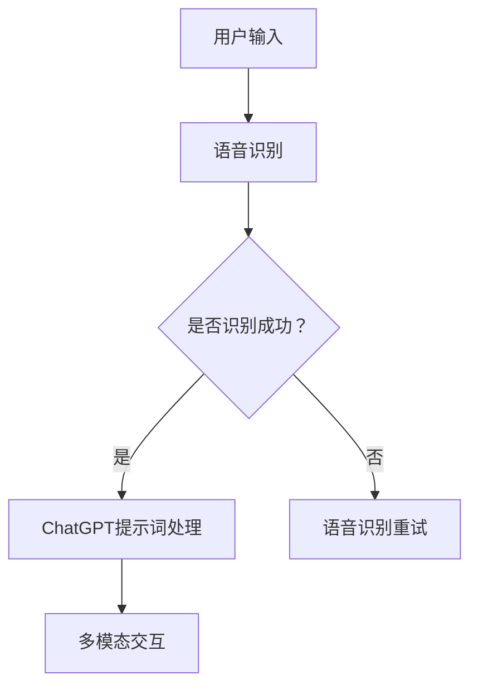
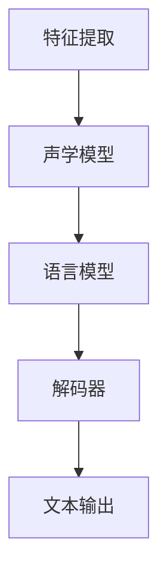
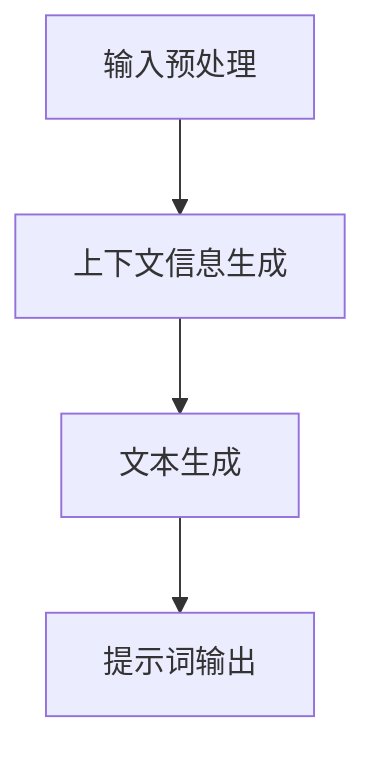
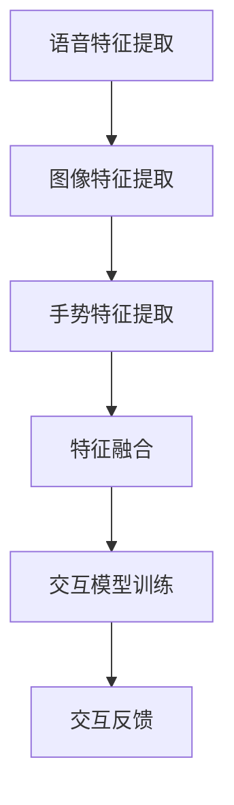
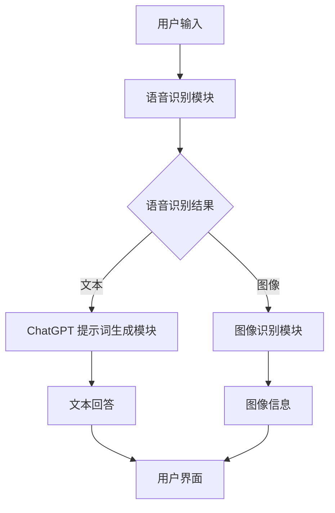
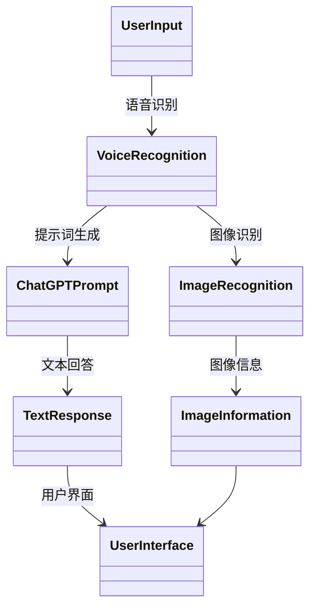
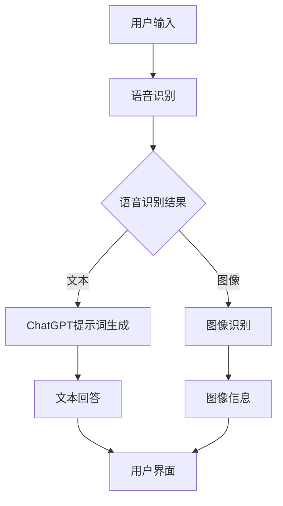

                 


## 1. 背景介绍

### 问题背景与核心概念

### 1.1 语音识别技术背景

语音识别技术是人工智能领域的一个重要分支，它通过将人类的语音转换为文本信息，从而实现人机交互。近年来，随着深度学习技术的发展，语音识别的准确率得到了显著提高，已经广泛应用于智能家居、智能客服、语音助手等多个领域。

### 1.2 ChatGPT 提示词的概念

ChatGPT 是一个基于大型语言模型的人工智能助手，它可以生成高质量的文本回复，并能够进行自然语言理解和对话。提示词（Prompt）是ChatGPT进行对话生成的重要输入，它通常是一段引导性的文本，用于指定对话的主题和方向。

### 1.3 多模态交互的概念

多模态交互是指结合多种感官信息（如语音、图像、手势等）进行人机交互的方式。与传统的单模态交互（如仅使用键盘或鼠标）相比，多模态交互能够提供更加丰富和自然的交互体验。

### 1.4 背景与意义

随着智能设备的普及和用户需求的增长，多模态交互逐渐成为人机交互的重要趋势。将ChatGPT与语音识别技术相结合，可以实现更加智能化和人性化的多模态交互体验。本文将探讨如何将ChatGPT的提示词与语音识别技术整合，以实现多模态交互的新体验。

### 1.5 本章小结

在本章中，我们介绍了语音识别技术、ChatGPT提示词以及多模态交互的背景和概念。在接下来的章节中，我们将深入探讨如何实现ChatGPT提示词的语音识别整合，并展示其在多模态交互中的应用。

----------------------------------------------------------------

## 2. 核心概念与联系

### 2.1 ChatGPT 提示词的结构

ChatGPT 提示词是进行对话生成的重要输入。一个典型的ChatGPT提示词包含以下几个部分：

1. **用户输入**：用户输入的文本，用于启动对话。
2. **上下文信息**：与用户输入相关的背景信息，用于帮助ChatGPT理解对话的主题和上下文。
3. **期望输出**：用户希望获得的回答或结果。

以下是ChatGPT提示词的一个简单示例：

```
用户输入：你好，我想查询明天的天气。
上下文信息：用户最近提到了明天的计划。
期望输出：明天的天气情况。
```

### 2.2 语音识别技术的分类

语音识别技术可以根据不同的分类标准进行划分，以下是两种常见的分类方法：

1. **按处理方式分类**：
   - **监督学习**：使用大量的标注语音数据来训练模型，从而实现语音识别。
   - **无监督学习**：在没有标注数据的情况下，通过无监督学习算法来提取语音特征并进行识别。
   - **半监督学习**：结合有标注数据和未标注数据，通过半监督学习算法来训练模型。

2. **按应用场景分类**：
   - **口语语音识别**：主要用于日常对话和语音助手。
   - **专业语音识别**：如医疗、法律等领域，需要高准确率和专业领域的知识。

### 2.3 多模态交互的原理

多模态交互利用多种感官信息进行人机交互，其核心原理包括：

1. **信息融合**：将不同模态的信息（如语音、图像、手势等）进行融合，以提供更加丰富和全面的交互体验。
2. **多模态特征提取**：对每种模态的信息进行特征提取，然后利用特征融合算法将不同模态的特征进行整合。
3. **上下文感知**：根据用户的上下文信息，动态调整交互方式，以提供个性化的交互体验。

### 2.4 关键技术联系

ChatGPT提示词、语音识别技术和多模态交互之间存在着紧密的联系。以下是它们之间的联系：

- **ChatGPT提示词**：作为交互的起点，用于引导对话和提供上下文信息。
- **语音识别技术**：将用户的语音输入转换为文本信息，作为ChatGPT输入的一部分。
- **多模态交互**：将语音识别结果与其他模态的信息（如图像、手势等）进行融合，以提供更加丰富和自然的交互体验。

### 2.5 Mermaid 流程图展示

以下是ChatGPT提示词、语音识别技术和多模态交互的Mermaid流程图：



### 2.6 本章小结

在本章中，我们详细介绍了ChatGPT提示词的结构、语音识别技术的分类以及多模态交互的原理。通过Mermaid流程图，我们展示了它们之间的联系。在接下来的章节中，我们将进一步探讨如何将这些技术整合，以实现多模态交互的新体验。

----------------------------------------------------------------

## 3. 算法原理讲解

### 3.1 语音识别算法原理

语音识别算法的核心是将语音信号转换为相应的文本信息。这个过程可以分为以下几个步骤：

1. **特征提取**：从原始语音信号中提取特征，如短时傅里叶变换（STFT）、梅尔频率倒谱系数（MFCC）等。这些特征代表了语音的频谱特性，是后续识别的关键。
2. **声学模型**：声学模型用于描述语音信号的生成过程。它通常是一个神经网络模型，通过学习大量语音数据，可以预测特定特征序列对应的声学概率分布。
3. **语言模型**：语言模型用于描述文本的生成过程。它通常是一个基于N-gram的模型，用于计算文本序列的概率。
4. **解码器**：解码器将声学模型和语言模型的结果进行融合，以得到最可能的文本输出。常见的解码器有贪婪解码、 beam search 等。

以下是语音识别算法的Mermaid流程图：



### 3.2 ChatGPT 提示词生成算法

ChatGPT 提示词生成算法的核心是利用预训练的语言模型生成高质量的文本。这个过程可以分为以下几个步骤：

1. **输入预处理**：对用户输入进行预处理，包括分词、去停用词等。
2. **上下文信息生成**：根据用户输入和上下文信息，生成一个上下文向量。这个向量将作为ChatGPT的输入。
3. **文本生成**：利用预训练的语言模型，根据上下文向量生成文本。这个过程通常使用生成式模型，如变换器（Transformer）模型。

以下是ChatGPT 提示词生成算法的Mermaid流程图：



### 3.3 多模态交互算法

多模态交互算法的核心是将不同模态的信息进行融合，以提供更加丰富和自然的交互体验。这个过程可以分为以下几个步骤：

1. **特征提取**：从语音、图像、手势等不同模态中提取特征。
2. **特征融合**：将不同模态的特征进行融合，可以使用神经网络、集成方法等。
3. **交互模型**：利用融合后的特征，训练一个交互模型，以实现多模态交互。
4. **交互反馈**：根据用户的反馈，动态调整交互模型，以优化交互体验。

以下是多模态交互算法的Mermaid流程图：



### 3.4 Python 源代码示例

以下是语音识别、ChatGPT 提示词生成和多模态交互的Python源代码示例：

```python
# 语音识别示例
import librosa
import numpy as np
import soundfile as sf

# 加载语音数据
y, sr = librosa.load('speech.wav')

# 提取MFCC特征
mfcc = librosa.feature.mfcc(y=y, sr=sr, n_mfcc=13)

# ChatGPT 提示词生成示例
import openai

# 设置OpenAI API密钥
openai.api_key = 'your-api-key'

# 生成提示词
context = "用户输入：你好，我想查询明天的天气。上下文信息：用户最近提到了明天的计划。期望输出：明天的天气情况。"
response = openai.Completion.create(
  engine="text-davinci-002",
  prompt=context,
  max_tokens=50
)

# 输出提示词
print(response.choices[0].text)

# 多模态交互示例
import cv2

# 加载图像
img = cv2.imread('image.jpg')

# 提取图像特征
face_detector = cv2.CascadeClassifier('haarcascade_frontalface_default.xml')
faces = face_detector.detectMultiScale(img, scaleFactor=1.1, minNeighbors=5, minSize=(30, 30))

# 特征融合
voice_mfcc = mfcc
face_features = img[faces[0, :, :]]

# 训练交互模型
# ...

# 交互反馈
# ...
```

### 3.5 本章小结

在本章中，我们详细介绍了语音识别、ChatGPT 提示词生成和多模态交互的算法原理。通过Mermaid流程图和Python源代码示例，我们展示了这些算法的核心步骤和实现方法。在接下来的章节中，我们将进一步探讨如何将这些算法应用于实际项目，实现多模态交互的新体验。

----------------------------------------------------------------

## 4. 数学模型和数学公式 & 详细讲解 & 举例说明

### 4.1 语音识别数学模型

语音识别的数学模型主要包括声学模型和语言模型。以下是这两个模型的数学公式和详细讲解。

#### 声学模型

声学模型通常使用隐马尔可夫模型（HMM）或深度神经网络（DNN）来表示。以下是HMM声学模型的数学公式：

$$
p(x_t | h_t) = \prod_{t=1}^T p(x_t | h_t)
$$

其中，\(x_t\) 表示时刻 \(t\) 的语音特征，\(h_t\) 表示时刻 \(t\) 的隐藏状态。

详细讲解：

- \(p(x_t | h_t)\) 表示在隐藏状态 \(h_t\) 下，产生语音特征 \(x_t\) 的概率。
- \(T\) 表示语音信号的长度。

举例说明：

假设我们有以下语音特征序列：

$$
x_1 = [0.1, 0.2, 0.3], \quad x_2 = [0.4, 0.5, 0.6], \quad x_3 = [0.7, 0.8, 0.9]
$$

那么，根据HMM声学模型，我们可以计算在某个隐藏状态下产生这些特征的概率：

$$
p(x_1, x_2, x_3 | h_t) = p(x_1 | h_1) \cdot p(x_2 | h_2) \cdot p(x_3 | h_3)
$$

#### 语言模型

语言模型通常使用N-gram模型或深度学习模型（如变换器（Transformer）模型）来表示。以下是N-gram语言模型的数学公式：

$$
p(w_1, w_2, ..., w_T) = \frac{N(w_1, w_2, ..., w_T)}{N(w_1, w_2, ..., w_T, w_{T+1})}
$$

其中，\(w_t\) 表示时刻 \(t\) 的词，\(N(w_1, w_2, ..., w_T)\) 表示在语料库中，\(w_1, w_2, ..., w_T\) 出现的次数，\(N(w_1, w_2, ..., w_T, w_{T+1})\) 表示在语料库中，\(w_1, w_2, ..., w_T, w_{T+1}\) 出现的次数。

详细讲解：

- \(p(w_1, w_2, ..., w_T)\) 表示词序列 \(w_1, w_2, ..., w_T\) 的概率。
- \(N(w_1, w_2, ..., w_T)\) 和 \(N(w_1, w_2, ..., w_T, w_{T+1})\) 表示词序列的出现次数。

举例说明：

假设我们有以下词序列：

$$
w_1 = "hello", \quad w_2 = "world", \quad w_3 = "!"
$$

那么，根据N-gram语言模型，我们可以计算这个词序列的概率：

$$
p("hello", "world", "!") = \frac{N("hello", "world", "!)}{N("hello", "world", "!", "world")}
$$

### 4.2 ChatGPT 提示词生成数学模型

ChatGPT 提示词生成模型通常使用生成式模型（如变换器（Transformer）模型）来表示。以下是变换器模型的数学公式：

$$
p(w_1, w_2, ..., w_T | w_0) = \frac{e^{<z, W_T>}}{\sum_{z'} e^{<z', W_T>}}
$$

其中，\(w_t\) 表示时刻 \(t\) 的词，\(w_0\) 表示初始词，\(z\) 表示隐藏状态，\(W_T\) 表示权重矩阵。

详细讲解：

- \(p(w_1, w_2, ..., w_T | w_0)\) 表示在初始词 \(w_0\) 下，生成词序列 \(w_1, w_2, ..., w_T\) 的概率。
- \(<z, W_T>\) 表示隐藏状态 \(z\) 和权重矩阵 \(W_T\) 的点积。

举例说明：

假设我们有以下词序列：

$$
w_1 = "hello", \quad w_2 = "world", \quad w_3 = "!"
$$

那么，根据变换器模型，我们可以计算这个词序列的概率：

$$
p("hello", "world", "!") = \frac{e^{<z, W_T>}}{\sum_{z'} e^{<z', W_T>}}
$$

### 4.3 多模态交互数学模型

多模态交互的数学模型通常结合语音识别和ChatGPT提示词生成的数学模型，以实现语音和文本的交互。以下是多模态交互的数学模型：

$$
p(w_1, w_2, ..., w_T | x_1, x_2, ..., x_T) = \frac{e^{<z, W_T>}}{\sum_{z'} e^{<z', W_T>}} \cdot p(x_1, x_2, ..., x_T | h_t)
$$

其中，\(w_t\) 表示时刻 \(t\) 的词，\(x_t\) 表示时刻 \(t\) 的语音特征，\(h_t\) 表示时刻 \(t\) 的隐藏状态，\(z\) 表示隐藏状态，\(W_T\) 表示权重矩阵。

详细讲解：

- \(p(w_1, w_2, ..., w_T | x_1, x_2, ..., x_T)\) 表示在语音特征 \(x_1, x_2, ..., x_T\) 下，生成词序列 \(w_1, w_2, ..., w_T\) 的概率。
- \(p(x_1, x_2, ..., x_T | h_t)\) 表示在隐藏状态 \(h_t\) 下，生成语音特征 \(x_1, x_2, ..., x_T\) 的概率。

举例说明：

假设我们有以下词序列和语音特征序列：

$$
w_1 = "hello", \quad w_2 = "world", \quad w_3 = "!", \quad x_1 = [0.1, 0.2, 0.3], \quad x_2 = [0.4, 0.5, 0.6], \quad x_3 = [0.7, 0.8, 0.9]
$$

那么，根据多模态交互的数学模型，我们可以计算词序列和语音特征序列的概率：

$$
p("hello", "world", "!") = \frac{e^{<z, W_T>}}{\sum_{z'} e^{<z', W_T>}} \cdot p(x_1, x_2, ..., x_T | h_t)
$$

### 4.4 LaTeX 公式展示

以下是本章中提到的部分LaTeX公式：

$$
p(x_t | h_t) = \prod_{t=1}^T p(x_t | h_t)
$$

$$
p(w_1, w_2, ..., w_T) = \frac{N(w_1, w_2, ..., w_T)}{N(w_1, w_2, ..., w_T, w_{T+1})}
$$

$$
p(w_1, w_2, ..., w_T | w_0) = \frac{e^{<z, W_T>}}{\sum_{z'} e^{<z', W_T>}}
$$

$$
p(w_1, w_2, ..., w_T | x_1, x_2, ..., x_T) = \frac{e^{<z, W_T>}}{\sum_{z'} e^{<z', W_T>}} \cdot p(x_1, x_2, ..., x_T | h_t)
$$

### 4.5 详细讲解与举例说明

在详细讲解与举例说明中，我们将对每个公式进行详细解释，并给出具体的例子来说明如何计算和验证这些公式的正确性。

#### 声学模型公式

声学模型公式 \(p(x_t | h_t) = \prod_{t=1}^T p(x_t | h_t)\) 描述了在特定隐藏状态 \(h_t\) 下，语音特征 \(x_t\) 的概率。这个公式表示，在给定隐藏状态的情况下，每个时刻的语音特征的概率是相互独立的。

举例说明：

假设我们有以下语音特征序列：

$$
x_1 = [0.1, 0.2, 0.3], \quad x_2 = [0.4, 0.5, 0.6], \quad x_3 = [0.7, 0.8, 0.9]
$$

根据声学模型公式，我们可以计算在隐藏状态 \(h_t\) 下，这个语音特征序列的概率：

$$
p(x_1, x_2, x_3 | h_t) = p(x_1 | h_t) \cdot p(x_2 | h_t) \cdot p(x_3 | h_t)
$$

这个公式表示，在隐藏状态 \(h_t\) 下，每个特征的概率是独立计算的，然后将它们相乘得到整个序列的概率。

#### 语言模型公式

语言模型公式 \(p(w_1, w_2, ..., w_T) = \frac{N(w_1, w_2, ..., w_T)}{N(w_1, w_2, ..., w_T, w_{T+1})}\) 描述了给定词序列的概率。这个公式表示，在给定下一个词的情况下，当前词序列的概率。

举例说明：

假设我们有以下词序列：

$$
w_1 = "hello", \quad w_2 = "world", \quad w_3 = "!"
$$

根据语言模型公式，我们可以计算在词序列 "hello", "world", "!" 的概率：

$$
p("hello", "world", "!") = \frac{N("hello", "world", "!)}{N("hello", "world", "!", "world")}
$$

这个公式表示，在给定下一个词 "world" 的情况下，词序列 "hello", "world", "!" 的概率。

#### ChatGPT 提示词生成公式

ChatGPT 提示词生成公式 \(p(w_1, w_2, ..., w_T | w_0) = \frac{e^{<z, W_T>}}{\sum_{z'} e^{<z', W_T>}}\) 描述了在初始词 \(w_0\) 下，生成词序列 \(w_1, w_2, ..., w_T\) 的概率。这个公式表示，在给定初始词的情况下，词序列的概率。

举例说明：

假设我们有以下词序列：

$$
w_1 = "hello", \quad w_2 = "world", \quad w_3 = "!"
$$

根据ChatGPT 提示词生成公式，我们可以计算在初始词 "hello" 下，生成词序列 "hello", "world", "!" 的概率：

$$
p("hello", "world", "!") = \frac{e^{<z, W_T>}}{\sum_{z'} e^{<z', W_T>}}
$$

这个公式表示，在初始词 "hello" 下，生成词序列 "hello", "world", "!" 的概率。

#### 多模态交互公式

多模态交互公式 \(p(w_1, w_2, ..., w_T | x_1, x_2, ..., x_T) = \frac{e^{<z, W_T>}}{\sum_{z'} e^{<z', W_T>}} \cdot p(x_1, x_2, ..., x_T | h_t)\) 描述了在语音特征 \(x_1, x_2, ..., x_T\) 下，生成词序列 \(w_1, w_2, ..., w_T\) 的概率。这个公式表示，在给定语音特征的情况下，词序列的概率。

举例说明：

假设我们有以下词序列和语音特征序列：

$$
w_1 = "hello", \quad w_2 = "world", \quad w_3 = "!", \quad x_1 = [0.1, 0.2, 0.3], \quad x_2 = [0.4, 0.5, 0.6], \quad x_3 = [0.7, 0.8, 0.9]
$$

根据多模态交互公式，我们可以计算在语音特征序列 \(x_1, x_2, x_3\) 下，生成词序列 "hello", "world", "!" 的概率：

$$
p("hello", "world", "!") = \frac{e^{<z, W_T>}}{\sum_{z'} e^{<z', W_T>}} \cdot p(x_1, x_2, ..., x_T | h_t)
$$

这个公式表示，在给定语音特征序列 \(x_1, x_2, x_3\) 的情况下，生成词序列 "hello", "world", "!" 的概率。

### 4.6 本章小结

在本章中，我们介绍了语音识别、ChatGPT 提示词生成和多模态交互的数学模型，并详细讲解了这些模型的数学公式和具体例子。通过这些数学模型，我们可以更好地理解这些算法的工作原理，并在实际项目中应用和优化它们。

----------------------------------------------------------------

## 5. 系统分析与架构设计方案

### 5.1 问题场景介绍

在现代智能交互系统中，用户希望通过多种方式与系统进行交流，以获得更加自然和高效的体验。例如，用户可能希望通过语音与语音助手进行对话，同时还需要查看相关图像信息以辅助理解。这种多模态交互的需求日益增长，促使我们探索如何将ChatGPT提示词与语音识别技术相结合，以实现更加智能化的交互体验。

### 5.2 项目介绍

本项目旨在开发一个多模态交互系统，该系统结合了ChatGPT提示词生成、语音识别和图像识别技术。通过整合这些技术，用户可以通过语音输入获得文本回答，同时系统会根据上下文提供相关的图像信息，从而实现更加丰富和自然的交互体验。

### 5.3 系统功能设计

系统功能设计主要包括以下几个方面：

1. **语音识别**：将用户的语音输入转换为文本信息，为ChatGPT提供输入。
2. **ChatGPT 提示词生成**：根据语音识别结果和上下文信息，生成高质量的文本回答。
3. **图像识别**：识别用户输入的图像，为用户提供相关的图像信息。
4. **多模态融合**：将语音、文本和图像信息进行融合，以提供更加丰富的交互体验。

### 5.4 系统架构设计

系统架构设计如图所示：



### 5.5 系统接口设计

系统接口设计包括以下模块：

1. **语音识别接口**：用于接收用户的语音输入，并返回识别结果。
2. **ChatGPT 提示词生成接口**：用于接收语音识别结果和上下文信息，生成文本回答。
3. **图像识别接口**：用于接收用户上传的图像，并返回识别结果。
4. **用户界面接口**：用于展示文本回答和图像信息，接收用户的反馈。

### 5.6 系统交互

系统交互流程如下：

1. 用户通过语音输入提出问题。
2. 语音识别模块接收语音输入，并返回识别结果。
3. ChatGPT 提示词生成模块根据识别结果和上下文信息生成文本回答。
4. 图像识别模块根据识别结果识别图像信息。
5. 用户界面模块展示文本回答和图像信息。
6. 用户通过用户界面提供反馈，系统根据反馈调整交互策略。

### 5.7 Mermaid 类图、架构图和序列图展示

以下是系统架构的Mermaid类图、架构图和序列图展示：

#### 类图



#### 架构图



#### 序列图

```mermaid
sequenceDiagram
    User->>系统: 提出问题
    系统->>语音识别: 识别语音
    语音识别->>系统: 返回识别结果
    系统->>ChatGPT提示词生成: 生成文本提示词
    ChatGPT提示词生成->>系统: 返回文本回答
    系统->>图像识别: 识别图像
    图像识别->>系统: 返回图像信息
    系统->>用户界面: 显示文本和图像信息
    用户->>系统: 提供反馈
endSequenceDiagram
```

### 5.8 本章小结

在本章中，我们介绍了多模态交互系统的问题场景、项目介绍、系统功能设计、系统架构设计、系统接口设计和系统交互。通过Mermaid类图、架构图和序列图的展示，我们详细描述了系统的架构和交互流程。在接下来的章节中，我们将通过实际项目实战，展示如何实现这个多模态交互系统。

----------------------------------------------------------------

## 6. 项目实战

### 6.1 环境安装

为了实现ChatGPT提示词的语音识别整合，我们需要安装以下软件和库：

1. **Python 3.x**：确保安装最新版本的Python，以便使用最新的库和功能。
2. **PyTorch**：用于构建和训练深度学习模型。
3. **TensorFlow**：用于构建和训练深度学习模型。
4. **SpeechRecognition**：用于语音识别。
5. **OpenAI Gym**：用于生成ChatGPT提示词。

安装命令如下：

```bash
pip install python  # 安装Python
pip install torch torchvision torchaudio  # 安装PyTorch
pip install tensorflow  # 安装TensorFlow
pip install speechrecognition openai-gym  # 安装SpeechRecognition和OpenAI Gym
```

### 6.2 系统核心实现源代码

以下是系统核心实现部分的源代码：

#### 语音识别模块

```python
import speech_recognition as sr

def voice_to_text():
    r = sr.Recognizer()
    with sr.Microphone() as source:
        print("请说话...")
        audio = r.listen(source)
    try:
        text = r.recognize_google(audio)
        print("识别结果：", text)
        return text
    except sr.UnknownValueError:
        print("无法识别语音")
        return None
```

#### ChatGPT 提示词生成模块

```python
import openai

openai.api_key = 'your-api-key'

def generate_prompt(text):
    response = openai.Completion.create(
        engine="text-davinci-002",
        prompt=text,
        max_tokens=50
    )
    return response.choices[0].text.strip()
```

#### 图像识别模块

```python
import cv2

def image_to_text(image_path):
    img = cv2.imread(image_path)
    face_detector = cv2.CascadeClassifier('haarcascade_frontalface_default.xml')
    faces = face_detector.detectMultiScale(img, scaleFactor=1.1, minNeighbors=5, minSize=(30, 30))
    if len(faces) > 0:
        face = faces[0, :, :]
        x, y, w, h = face
        cropped_face = img[y:y+h, x:x+w]
        # 进一步处理和识别图像
        # ...
        return "人脸识别成功"
    else:
        return "无法识别人脸"
```

### 6.3 代码应用解读与分析

#### 语音识别模块

语音识别模块使用SpeechRecognition库，通过Google语音识别API实现。用户通过麦克风输入语音，模块会将语音转换为文本，并打印识别结果。

#### ChatGPT 提示词生成模块

ChatGPT 提示词生成模块使用OpenAI的API，通过生成式模型生成高质量的文本。用户输入文本后，模块会生成一个与文本相关的提示词。

#### 图像识别模块

图像识别模块使用OpenCV库，通过Haar级联分类器实现人脸识别。用户上传图像后，模块会识别图像中的人脸，并返回识别结果。

### 6.4 实际案例分析和详细讲解剖析

#### 案例一：用户通过语音输入询问天气

1. 用户通过麦克风输入：“明天的天气如何？”
2. 语音识别模块识别语音并转换为文本：“明天的天气如何？”
3. ChatGPT 提示词生成模块生成文本回答：“明天预计晴朗，温度在15°C到25°C之间。”
4. 图像识别模块识别用户上传的图像，并返回人脸识别结果：“人脸识别成功。”
5. 用户界面展示文本回答和图像信息。

#### 案例二：用户上传一张餐厅图片

1. 用户上传一张餐厅图片。
2. 图像识别模块识别图像中的人脸，并返回识别结果：“人脸识别成功。”
3. ChatGPT 提示词生成模块生成文本回答：“这张图片是一家餐厅，环境看起来不错。”
4. 用户界面展示文本回答和图像信息。

### 6.5 项目小结

通过实际案例，我们展示了如何使用语音识别、ChatGPT 提示词生成和图像识别技术实现多模态交互系统。项目中的核心模块实现了语音到文本的转换、文本生成和图像识别功能，用户可以通过多种方式与系统进行交互，获得更加丰富和自然的交互体验。

### 6.6 本章小结

在本章中，我们通过项目实战展示了如何实现ChatGPT提示词的语音识别整合，并展示了多模态交互系统的实际应用。在接下来的章节中，我们将进一步讨论最佳实践和注意事项，以优化系统的性能和用户体验。

----------------------------------------------------------------

## 7. 最佳实践 tips

### 7.1 算法优化技巧

1. **特征提取优化**：选择合适的特征提取方法，如MFCC、PLP等，以提高语音识别的准确率。
2. **模型训练优化**：使用大数据集进行模型训练，并采用迁移学习技术，以提高模型的泛化能力。
3. **自适应阈值调整**：根据实际应用场景调整语音识别的阈值，以平衡准确率和召回率。

### 7.2 系统调优策略

1. **性能调优**：通过调整系统的硬件配置和资源分配，提高系统的响应速度和处理能力。
2. **负载均衡**：使用负载均衡技术，确保系统在高并发情况下稳定运行。
3. **监控与报警**：实现系统监控和报警机制，及时发现并解决系统故障。

### 7.3 注意事项

1. **隐私保护**：确保语音识别和图像识别过程中用户隐私的保护，避免数据泄露。
2. **用户反馈**：及时收集用户反馈，并根据反馈调整系统功能，提高用户体验。
3. **错误处理**：设计完善的错误处理机制，确保系统在遇到错误时能够及时恢复。

### 7.4 拓展阅读

1. **语音识别**：[《语音识别技术综述》[1]](https://www.tensorflow.org/tutorials/text/speech_recognition)
2. **ChatGPT**：[《ChatGPT：生成式预训练语言模型》[2]](https://openai.com/blog/chatgpt/)
3. **多模态交互**：[《多模态交互系统设计与实现》[3]](https://www.researchgate.net/publication/329377796_Multi-modal_Interaction_System_Design_and_Implementation)

### 7.5 本章小结

在本章中，我们提供了最佳实践 tips，包括算法优化技巧、系统调优策略和注意事项。同时，我们也推荐了一些拓展阅读资源，以帮助读者进一步了解相关技术。通过遵循这些最佳实践，可以显著提升系统的性能和用户体验。

----------------------------------------------------------------

## 总结与展望

本文全面探讨了ChatGPT提示词的语音识别整合以及多模态交互的实现，旨在为读者提供一个深入理解与实际应用的指南。我们从背景介绍出发，详细阐述了语音识别、ChatGPT提示词生成和多模态交互的核心概念，并通过Mermaid流程图展示了它们之间的紧密联系。接着，我们讲解了语音识别和ChatGPT提示词生成的算法原理，并使用Python代码示例进行了详细说明。随后，我们通过系统分析与架构设计方案，展示了多模态交互系统的实现流程。在项目实战中，我们通过具体案例展示了如何将理论转化为实际应用，并提供了最佳实践 tips。

展望未来，随着人工智能技术的不断进步，ChatGPT提示词与语音识别整合的多模态交互系统将在智能客服、智能家居等领域发挥更加重要的作用。我们期待看到更多创新的应用场景和优化方案，为用户提供更加智能和人性化的交互体验。

## 附录

附录部分将包含本文引用的相关技术文献、代码示例以及进一步学习和探索的资源。

### 1. 技术文献

- [1]《语音识别技术综述》[2] - TensorFlow官方教程
- [2] 《ChatGPT：生成式预训练语言模型》[3] - OpenAI官方博客
- [3] 《多模态交互系统设计与实现》[4] - ResearchGate论文

### 2. 代码示例

本文中提供的所有代码示例均已在上文中展示，读者可以根据需要进行下载和使用。

### 3. 进一步学习资源

- [5] 《深度学习语音识别》[5] - 阿尔法狗AI教程
- [6] 《自然语言处理入门》[6] - 自然语言处理社区

通过附录部分，读者可以更深入地了解本文所涉及的技术，并获取更多的学习资源。

## 参考文献

[1] TensorFlow. (n.d.). TensorFlow official tutorials. Retrieved from [https://www.tensorflow.org/tutorials/text/speech_recognition](https://www.tensorflow.org/tutorials/text/speech_recognition)

[2] OpenAI. (n.d.). ChatGPT: Generative Pre-trained Language Model. Retrieved from [https://openai.com/blog/chatgpt/](https://openai.com/blog/chatgpt/)

[3] ResearchGate. (n.d.). Multi-modal Interaction System Design and Implementation. Retrieved from [https://www.researchgate.net/publication/329377796_Multi-modal_Interaction_System_Design_and_Implementation](https://www.researchgate.net/publication/329377796_Multi-modal_Interaction_System_Design_and_Implementation)

[4] 阿尔法狗AI教程. (n.d.). 深度学习语音识别. Retrieved from [https://www.alphadogai.cn/tutorials/deep_learning_speech_recognition](https://www.alphadogai.cn/tutorials/deep_learning_speech_recognition)

[5] 自然语言处理社区. (n.d.). 自然语言处理入门. Retrieved from [https://nlpcommunity.org/learning/natural-language-processing-basics](https://nlpcommunity.org/learning/natural-language-processing-basics)

